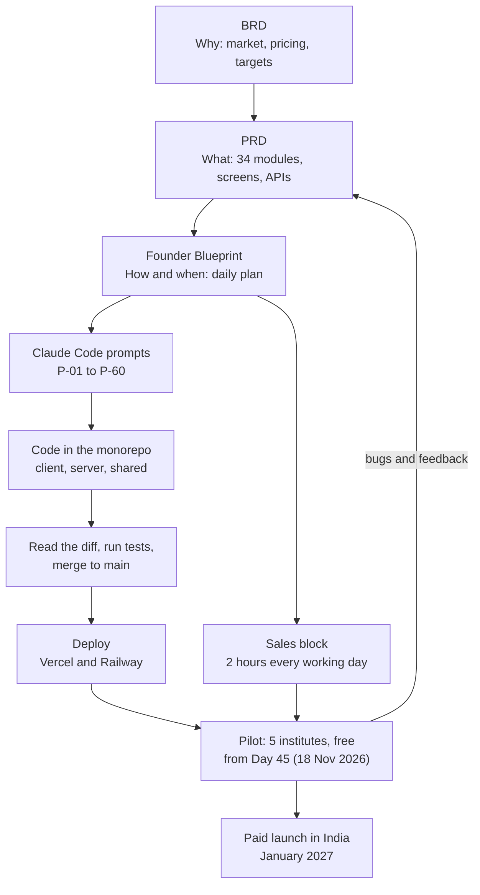
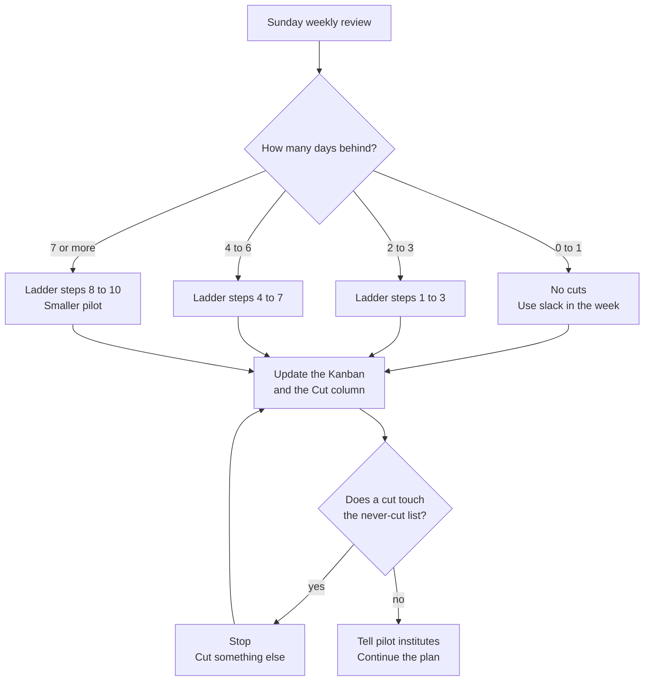

# How to Use This Blueprint

**In simple words:** This chapter explains how to use the Founder Blueprint every day. It shows how the Blueprint connects to the BRD and the PRD, what you can honestly finish in 60 days, and what you must set up before Day 1. It also gives you a daily timetable, a way to track progress, and a clear list of what to cut when you fall behind. Read it fully once before Day 1, which is Monday, 5 October 2026.

## Welcome, Founder

You are building EduFlow alone, with Claude Code as your coding partner. That is possible. It is also hard. A solo founder rarely fails because of bad code. He fails because he builds the wrong thing, builds too much, or stops selling while he builds.

This Blueprint is written to stop those three mistakes. It gives you:

- A plan for every day from Day 1 (Mon 5 Oct 2026) to Day 60 (Thu 3 Dec 2026).
- Sixty ready Claude Code prompts, `P-01` to `P-60`, that build EduFlow module by module.
- An engineering handbook, so every module looks the same and is safe.
- Deployment guides for Vercel and Railway now, and AWS later.
- Sales scripts in English and Hinglish, so you can sell from Day 1.
- A scaling guide from 100 customers to 10,000 customers.

You do not need to read all of it today. Read this chapter, finish the setup list, and then follow one day at a time.

> **Founder note:** The plan works only if you show up every working day. Missing one day is fine. Losing the habit is not. This chapter gives you the habit: a fixed timetable, a daily log and ten rules.

## What This Guide Is

### Three Documents, Three Questions

EduFlow has three documents. Each one answers one question.

| Document | Question | What is inside | Open it when |
|---|---|---|---|
| BRD (Business Requirements Document) | Why? | Market, customers, pricing, sales plan, 5-year targets, risks | You doubt a business decision |
| PRD (Product Requirements Document) | What? | Architecture, 34 modules, screens, database, APIs, security | You start or review a module |
| Founder Blueprint (this guide) | How and when? | 60-day plan, prompts, handbook, deployment, sales scripts, scaling | Every morning |

The BRD decides. The PRD specifies. The Blueprint schedules and executes.

If two documents disagree on a product fact, use this order: the canon file first (`docs/canon.md` in your code repository), then the PRD, then this Blueprint. Fix the wrong document on the same day, so the mistake does not come back.

> **Example:** Take fee collection. The BRD explains why institutes pay for it: fees are their whole income, and most of them still track dues in registers and Excel. The PRD chapter *Fees Module* (file `25-fees-module.md`) says exactly what to build: screens such as `FEE-S02`, business rules such as `FEE-BR-01` and endpoints such as `FEE-API-01`. This Blueprint says how and when: Week 5 (2–8 Nov 2026), prompts `P-23` and `P-24`, the tests to write and the checks to do on the AI diff.

### From Document to Running Product

**Figure: How the BRD, the PRD and the Blueprint turn into a live product**



The left line is the build path: the BRD feeds the PRD, the PRD feeds the Blueprint, and the Blueprint feeds prompts that become tested code. The right line is the sales path. It runs in parallel from Day 1, so that five institutes are waiting when the pilot opens on Day 45. Pilot feedback goes back into the PRD first, and only then into code.

The link between the PRD and the code is direct. Prompt `P-02` copies the PRD Markdown files into your code repository, so Claude Code can read them as specs.

| In the code repo | Purpose |
|---|---|
| `docs/canon.md` | Fixed product facts and conventions |
| `docs/prd/<file>.md` | One spec file per module or topic |
| `docs/schema/*.prisma` | The validated Prisma schema |
| `docs/api/*.md` | Endpoint registry: IDs, methods, paths, permissions |
| `docs/permissions.md` | Permission keys by role |

Because the specs live in the repo, a prompt can be short and exact:

```text
Read docs/canon.md and docs/prd/25-fees-module.md, then implement
FEE-API-01 to FEE-API-08.
```

### The Parts of This Blueprint

| Part | What it holds | When you use it |
|---|---|---|
| Part I — Start Here | This chapter and *Working with Claude Code* | Before Day 1 |
| Part II — The 60-Day Roadmap | Weekly milestones and one entry for every day | Every morning |
| Part III — Claude Code Prompt Library | Prompts `P-01` to `P-60`, ready to copy | When the daily entry names a prompt |
| Part IV — Engineering Handbook | Folder structure, coding standards, Git, local setup, testing | Week 1, then whenever in doubt |
| Part V — Deployment and Operations | Environments, Docker, CI/CD, Vercel, Railway, AWS, monitoring | First deploy, pilot, launch |
| Part VI — Sales Playbook | Lead lists, call scripts, templates, demo, objections, onboarding | Every day in the sales block |
| Part VII — Scaling | What changes at 100, 500, 1,000 and 10,000 customers | After launch, once a quarter |
| Part VIII — Founder Operating System | Weekly rhythm, budget, company setup, legal basics | Sundays, and before paid launch |
| Appendices | Environment variables, commands, checklists, prompt index | Quick reference |

### Three Ways to Read It

1. **First read (one weekend before Day 1).** Read this chapter and *Working with Claude Code* fully. Skim *60-Day Roadmap Overview and Weekly Milestones*. Read the first seven entries of *Daily Plan: Days 1 to 14*. Read *Sales Foundation and Lead Generation*. Finish the setup list in this chapter.
2. **Daily use (10 minutes each morning).** Open today's entry. Open the PRD file it names. Copy the prompt it names. Work. Fill the daily log in the evening.
3. **Weekly use (45 minutes every Sunday).** Fill the weekly scorecard. Count days ahead or behind. Decide cuts. Read next week's milestone.

> **Rule:** When this chapter shows a short sample and a later chapter gives the full version, the later chapter is the rule.

## The Honest Deal

EduFlow has 34 modules. You cannot make all 34 production-ready in 60 days. Anyone who says you can is describing a demo, not a product.

### The Math

| Item | Number |
|---|---|
| Calendar days in the sprint | 60 |
| Sundays (rest and weekly review) | 8 |
| Working days | 52 |
| Build hours per working day | 6 |
| Total build hours | 52 × 6 = 312 |
| Foundation, Weeks 1–2 (repo, database, tenancy, auth, RBAC, UI kit) | 12 days × 6 = 72 hours |
| Hardening, Weeks 8–9 (Dashboard, tests, security review, CI/CD, deploy, pilot fixes) | 10 days × 6 = 60 hours |
| Left for modules, Weeks 3–7 | 30 days × 6 = 180 hours |

In Weeks 3–7 you build 15 modules. That is 180 ÷ 15 = 12 hours per module. With Claude Code writing most of the code, 12 hours is tight but realistic. A typical split is 4 hours for the API, 4 hours for screens, 2 hours for tests and 2 hours for diff reading and fixes.

Now try the same 180 hours with all 34 modules. That is about 5 hours per module. Five hours gives you a screen that looks fine in a demo and breaks in real use. Institute owners will trust you with fee money and with children's data. A demo-quality Fees module loses both.

### What the 60-Day Sprint Builds

The sprint builds the 16 Phase 1 modules. The list is fixed.

| Group | Phase 1 modules (code) | Built in |
|---|---|---|
| Platform | Organizations (ORG), Multi Campus (CAMP), Settings (SET), Dashboard (DASH) | Weeks 3 and 8 |
| Academics | Batch (BAT), Subjects (SUB), Attendance (ATT) | Weeks 3 and 5 |
| People | Student Admission (ADM), Student Profile (STU), Teachers (TCH) | Week 4 |
| Finance | Fees (FEE), Payments (PAY), Discounts (DSC) | Weeks 5 and 6 |
| Communication | Notifications (NTF), WhatsApp (WA), Parent Portal (PP) | Week 7 |

These 16 modules are enough to run the daily life of Sharma Classes in Patna. The staff can admit a student, put him in a batch, mark attendance, raise a fee invoice, collect money, print a receipt and inform the parent on WhatsApp. That loop is what an institute owner pays for. Everything else can wait.

### What Production-Ready Means Here

A module is production-ready when all eight points are true:

1. Every "Must" user story in its PRD chapter works.
2. Its tenant isolation test passes. A user of Sharma Classes cannot read a record of Bright Future Public School.
3. Every endpoint checks a permission key, such as `fees.collect`.
4. Inputs are validated with Zod, and errors use the standard error envelope.
5. Every screen has loading, empty and error states.
6. Business rules have tests. Money rules have full tests with worked examples.
7. Sensitive actions write to the audit log.
8. It runs on the deployed environment, and Sentry reports its errors.

### Pilot, Launch and the Phases After

| Phase | Version | Dates | What ships | Prompts |
|---|---|---|---|---|
| 1 | MVP | Day 1–60: 5 Oct – 3 Dec 2026 | The 16 modules above | `P-01` to `P-30`, `P-49`, `P-50`, `P-52`, `P-54` to `P-56`, `P-58`, `P-59` |
| 2 | V1.0 | Day 61–120: 4 Dec 2026 – 1 Feb 2027 | Staff, Leave, Timetable, Homework, Exams, Report Cards, Scholarships, Student Portal, Email, SMS, Certificates, Analytics | `P-31`, `P-33` to `P-42`, `P-51`, `P-53` |
| 3 | V1.5 | By June 2027 | Library, Inventory, Transport, Hostel, Payroll | `P-43` to `P-47` |
| 4 | V2.0 | By September 2027 | AI Insights, international packs, white-label mobile apps | `P-32`, `P-48`, `P-57`, `P-60` |

Three dates matter most:

- **Day 45 (Wed 18 Nov 2026): the pilot starts.** Five friendly institutes use EduFlow free of cost. Choose mostly coaching institutes, because coaching is our first market. The pilot exists to find bugs and to earn testimonials, not to earn money.
- **Day 60 (Thu 3 Dec 2026): the sprint ends.** Phase 1 is live, pilot fixes are in, and the launch checklist is done.
- **January 2027: paid selling starts in India.** Institutes choose software from January to March, before the April 2027 academic session. You sell Growth at ₹2,499 per month and Pro at ₹5,999 per month, plus 18% GST.

The plan after Day 60 is in *After Day 60: The Road to V2.0*.

> **Warning:** In January 2027 you are still building Phase 2. It completes on Day 120 (1 Feb 2027). Never tell a customer that a module is live when it is not. Tell him the date. In Hinglish: "Sir, Exams module 1 February tak live hoga. Jo aaj live hai, woh main abhi dikha deta hoon."

## The Ten Founder Rules

These ten rules are short on purpose. Print them and keep them next to your screen.

1. **Ship daily.** Every working day ends with at least one pull request merged into `main`, and the app still runs. Small is fine: one endpoint, one screen, one bug fix. A day with zero merges is a warning sign. It usually means the task was too big. Cut it in half tomorrow.
2. **Sell daily.** The 2-hour sales block runs from Day 1, even when there is nothing to show. In October you sell the problem conversation and the five free pilot slots. In November you give demos. In December you line up paying customers for January. A simple floor is 10 outreach touches (calls, WhatsApp messages or emails) every working day. The full targets and scripts are in *Sales Foundation and Lead Generation* and *Cold Call Scripts*.
3. **Tenant safety first.** EduFlow keeps many institutes in one database. So every tenant table has `organization_id`, and every query goes through the Prisma tenant extension. RLS (Row-Level Security — a PostgreSQL feature that hides rows of other tenants) is the second safety net. Every new module gets an isolation test: log in as a Sharma Classes user, ask for a Bright Future student by ID, and expect `NOT_FOUND` (404). No module is done until this test passes.
4. **Never skip tests on money code.** Fees, Payments and Discounts touch real rupees. Every calculation gets tests with worked examples before merge: invoice totals, late fees, discounts, partial payments and day close. Money is `Decimal(12, 2)`, never Float. In a hurry you may ship a screen without a test. You never ship a fee calculation without one.
5. **One module at a time.** Only one card sits in the Doing column. A module is finished when its API, screens, tests and permission checks are merged and you can demo it. Two half-built modules are worth less than one finished module, because nobody can pilot half a module.
6. **Small commits.** One logical change per commit. One pull request per task, ideally under 400 changed lines. Small changes are easy to read, easy to test and easy to undo. The naming rules are in *Git Workflow: Branches, Commits and Pull Requests*.
7. **Read every AI diff.** Claude Code writes fast. You are still the engineer who signs the code. Before each commit, read every changed line. Look for five things: a query without tenant scope, Float used for money, a secret in the code, a test that was skipped or deleted, and a new package you did not ask for. The full review checklist is in *Working with Claude Code*.
8. **Talk to a customer every day.** Have at least one real conversation every working day with an owner, principal, accountant, teacher or parent. Real means voice or face to face, not a forwarded brochure. Write one learning in the daily log. The sprint gives you about 52 learnings. That beats any market report.
9. **Protect sleep.** Sleep seven to eight hours every night, with a fixed time to close the laptop. A tired founder approves bad diffs and gives bad demos. When you are behind, you cut scope with the ladder in this chapter. You do not cut sleep.
10. **Measure weekly.** Every Sunday, spend 45 minutes on the weekly review. Fill the scorecard, count days ahead or behind, decide cuts and plan the next week. Use numbers, not feelings. The full agenda is in *Founder Operating System*.

Each rule has a proof that you can check in seconds.

| Rule | Proof | Where you check it |
|---|---|---|
| Ship daily | At least 1 merged pull request | Daily log |
| Sell daily | 2 hours done, 10 or more outreach touches | Daily log, CRM sheet |
| Tenant safety first | Isolation test passes for the module | Before a module moves to Done |
| Never skip tests on money code | A passing test for every money rule | Before every money merge |
| One module at a time | 1 card in Doing | Kanban board |
| Small commits | Pull request under about 400 changed lines | Every pull request |
| Read every AI diff | `git diff` read before the commit | Every commit |
| Talk to a customer every day | 1 learning written down | Daily log |
| Protect sleep | 7 hours or more | Daily log |
| Measure weekly | Scorecard filled | Sunday review |

## What You Need Before Day 1

You have 14 days between the document date (20 Sep 2026) and Day 1 (5 Oct 2026). Use them for accounts, approvals and machine setup. On Day 1 you should write code, not fill signup forms.

### Accounts and Tools Checklist

All prices are estimates as of September 2026, converted at US$1 = ₹85. Check each vendor's pricing page before you pay. Some foreign tools add 18% GST at checkout.

| Account or tool | Used for | Start with | Cost per month (₹) | Needed by |
|---|---|---|---|---|
| GitHub | Code, pull requests, GitHub Actions, Kanban board | Free plan | 0 | Day 1 |
| Claude subscription | Claude Code, your coding partner | Max plan, US$100 tier | About 8,500 | Day 1 |
| Domain `eduflow.app` | Web app, API and email addresses | 1-year registration | About 125 (₹1,500 a year) | Before Day 1 |
| Google Workspace | Business email, Sheets, Meet for demos | Business Starter, 1 user | About 250 | Before Day 1 |
| Vercel | Hosts the Next.js client | Hobby to test, Pro for the live app | 0, then about 1,700 | First deploy |
| Railway | Hosts API, worker, PostgreSQL and Redis | Usage-based paid plan | About 2,500 | First deploy |
| AWS | S3 for files, SES for email | Pay as you go, region `ap-south-1` | About 300 | Week 4 (`P-21`) |
| Razorpay | Online fee payments | Test mode | 0 | Week 6 (`P-26`) |
| Meta Business + WhatsApp Cloud API | WhatsApp messages to parents | Test number, then your own number | About 500 in the pilot | Week 7 (`P-29`) |
| MSG91 + DLT registration | SMS and SMS OTP in India | Pay as you go | About 500 in the pilot | Start now, approval is slow |
| Sentry | Error tracking | Free plan | 0 | First deploy |
| PostHog | Product analytics | Free plan | 0 | Pilot |
| Better Stack or Grafana Cloud | Uptime checks and logs | Free plan | 0 | First deploy |
| Figma (optional) | Quick screen sketches | Free plan | 0 | Optional |
| CRM sheet | Leads, calls, demos, pilots | Google Sheets | 0 | Day 1 |
| Password manager | Strong passwords and recovery codes | Bitwarden free plan | 0 | Before Day 1 |

The formula behind the monthly total:

- **Build-only months:** Claude 8,500 + domain 125 + Workspace 250 + AWS 300 = about **₹9,200 per month**.
- **From the first deploy:** 9,200 + Vercel Pro 1,700 + Railway 2,500 + WhatsApp 500 + SMS 500 = about **₹14,400 per month**.
- **One-time:** DLT registration, about ₹5,900 including GST on most operator portals.

Change any input and the total changes with it. The full budget, with a 12-month view, is in *Founder Operating System*.

Notes on the rows that confuse most first-time founders:

- **Claude subscription.** The US$20 Pro plan also runs Claude Code, but six build hours a day will hit its usage limit often. Start the sprint on the US$100 Max tier. Move down later if you do not use it.
- **Vercel.** The free Hobby plan is for personal, non-commercial projects. Use it while you test. Move to Pro before real institutes log in.
- **Railway.** You pay for what runs. Four small services (API, worker, PostgreSQL, Redis) cost about US$20–40 a month at pilot size.
- **Domain.** The whole `.app` domain zone works only over HTTPS. Vercel and Railway both issue HTTPS certificates for you, so this costs you nothing extra.
- **WhatsApp.** Meta charges per template message. In India a utility message (a receipt or an absence alert) costs about ₹0.12, and a marketing message costs about ₹0.80–0.90 (Estimate). Replies inside a customer-started 24-hour window are free.
- **CRM sheet.** Create a Google Sheet named "EduFlow CRM" with one tab named "Leads". For Day 1 you need these columns: institute name, city, type, owner name, phone, source, stage, next action date, notes. The full sheet design is in *Sales Foundation and Lead Generation*.

### Start the Slow Approvals First

Some accounts open in two minutes. Others need a human at another company to approve you. Start the slow ones in the first three days of your preparation time.

| Approval | Typical wait (Estimate) | What you need |
|---|---|---|
| Meta Business verification | A few days to 2 weeks | Business proof, a website on your domain, a business email |
| WhatsApp display name and templates | 1–2 days per request | Verified Meta Business account, a phone number not used on WhatsApp |
| DLT entity, header and templates | 1–3 weeks in total | PAN, business proof, authorization letter, a 6-letter header such as `EDUFLW` |
| Amazon SES production access | 1–2 days | Verified domain, a short note on what emails you send |
| Razorpay live mode (KYC) | A few working days | PAN, bank account, business proof, website with policy pages |

The business documents behind these approvals (registration, PAN, GST, current account) are covered in *Company Setup, Legal and Finance Basics*.

You do not have to wait for approvals to write code. Razorpay test mode works right after signup. Meta gives you a free test number that can message up to five phone numbers you add. A new SES account starts in sandbox mode, where you can send only to verified addresses. That is enough to build and test `P-26`, `P-29` and `P-31`.

> **Warning:** The WhatsApp Cloud API needs a phone number that is not active on the normal WhatsApp app or the WhatsApp Business app. Buy a new SIM for it. Keep your personal WhatsApp number for sales chats.

> **Note:** DLT (Distributed Ledger Technology registration — the TRAI system where every business that sends SMS in India must register its name, sender header and message templates) is slow and cannot be skipped. SMS OTP and the Phase 2 SMS module both depend on it. Until it is approved, send OTPs on WhatsApp or email.

### Account Safety Basics

Your accounts hold the keys to every customer's data. Set these five habits now.

1. Open every account with your business email, for example `mehdi@eduflow.app`, not a personal Gmail. Add `support@eduflow.app` and `billing@eduflow.app` as aliases.
2. Turn on two-factor login (2FA) everywhere: GitHub, AWS, the domain registrar, Google Workspace, Razorpay, Meta, Vercel, Railway.
3. In AWS, use the root user only for billing. Create an IAM user for daily work. Create a budget alert at US$10 (about ₹850), so a mistake cannot become a big bill.
4. Keep passwords and recovery codes in the password manager, not in a notes file.
5. Never commit a secret to Git, and never paste a live secret into a prompt. The `.env` rules are in *Environments and Configuration*.

### Hardware

| Item | Minimum | Why |
|---|---|---|
| Laptop | 16 GB RAM, SSD with 50 GB free, 4 or more cores | Docker, Next.js, the API, VS Code and Chrome all run together |
| Second screen (optional) | Any 22-inch monitor | The diff on one screen, the app on the other |
| Internet | Broadband plus a mobile hotspot as backup | Claude Code needs a stable connection |
| Power backup | Inverter or UPS | A power cut must not end a build block |
| Android phone | Any budget phone | Most parents will open the Parent Portal on a budget Android phone |
| Second SIM | A new number | The WhatsApp Cloud API number |
| Headset with mic | Wired or Bluetooth | Two hours of calls and demos every day |

### Software

| Tool | Version | Used for |
|---|---|---|
| Node.js | 24 LTS | Runs the client, the server and all tooling |
| Git | Latest | Version control |
| Docker Desktop | Latest | Local PostgreSQL 16 and Redis 7 |
| VS Code + Claude Code extension | Latest | Editor, with Claude Code diffs inside the editor |
| Claude Code (terminal) | Latest | Runs the prompts from Part III |
| GitHub CLI (`gh`) | Latest | Pull requests from the terminal |
| Postman or Bruno | Latest | Call and save API requests |
| DBeaver Community | Latest | Look inside PostgreSQL tables |
| Google Chrome | Latest | Dev tools and mobile-view testing |

Pick either Postman or Bruno, not both. Bruno saves requests as plain files inside your repo, so they travel with Git. Postman is fine if you already know it.

Install each tool from its official website. Install Claude Code from its official install page, run `claude` once in a terminal, and log in with your Claude subscription. The step-by-step setup, with the project itself, is in *Local Development Setup* and *Working with Claude Code*.

> **Tip:** On Windows, Docker Desktop needs WSL 2 (Windows Subsystem for Linux — a small Linux layer inside Windows). Open PowerShell as administrator, run `wsl --install`, restart the laptop, and then install Docker Desktop.

### Check Your Machine

Run these commands in a terminal. Every command must print a version number. `node --version` must start with `v24`.

```bash
node --version
npm --version
git --version
docker --version
docker compose version
code --version
claude --version
gh --version
```

Test that Docker can really run a container:

```bash
docker run --rm hello-world
```

Set your Git identity once. Every commit will carry this name and email.

```bash
git config --global user.name "Mehdi Alam"
git config --global user.email "mehdi@eduflow.app"
git config --global init.defaultBranch main
```

Log the GitHub CLI in to your account:

```bash
gh auth login
gh auth status
```

### The Day 0 Checklist

Tick all of these by Sunday, 4 October 2026. A longer version is in *Checklists*.

- [ ] Domain bought, Google Workspace mailbox working, aliases created.
- [ ] GitHub, Claude, Vercel, Railway, AWS, Razorpay, Sentry and PostHog accounts open, with 2FA on.
- [ ] Meta Business verification submitted. New SIM bought for WhatsApp.
- [ ] MSG91 account open. DLT entity registration submitted.
- [ ] SES domain verified. Production access requested.
- [ ] All version commands above print a version. `hello-world` runs in Docker.
- [ ] CRM sheet created with the first 50 institutes in your city.
- [ ] Kanban board created with 60 backlog cards, one per prompt.
- [ ] *Working with Claude Code* read fully.
- [ ] Family informed about your timetable for the next 60 days.

## Your Daily Time Budget

### The Budget

| Block | Hours per working day | Hours in 52 working days | What counts |
|---|---|---|---|
| Build | 6 | 312 | Prompts, diff reading, tests, fixes, deploys |
| Sales and customers | 2 | 104 | Lead lists, calls, WhatsApp, demos, pilot support |
| Review | 0.5 | 26 | Daily log, Kanban, plan for tomorrow |
| Total | 8.5 | 442 | |

These things do not count as build time: watching tutorials, comparing tools, redesigning the logo, reorganizing folders and reading tech news. If you catch yourself doing them inside a build block, stop and return to today's entry.

Sunday has no build block and no sales block. It has rest and one 45-minute weekly review.

### A Sample Day

| Time | Block | What you do |
|---|---|---|
| 06:30–07:30 | Morning routine | Walk, breakfast. No phone for the first 30 minutes |
| 07:30–10:30 | Build block 1 (3 hours) | First 10 minutes: read today's entry. Then the hardest task. Phone on silent |
| 10:30–11:00 | Break | Tea, stretch, no screens |
| 11:00–13:00 | Sales block (2 hours) | Calls, WhatsApp follow-ups, demos, one real customer conversation |
| 13:00–14:00 | Lunch and rest | Eat away from the laptop |
| 14:00–17:00 | Build block 2 (3 hours) | Finish, test, read diffs, merge to `main` |
| 17:00–17:30 | Review (30 minutes) | Daily log, move Kanban cards, plan tomorrow |
| 17:30 onwards | Off | Family, exercise, dinner. Laptop closed |
| 22:30 | Sleep | 7.5 to 8 hours |

Why is the sales block at 11:00? Coaching owners usually teach early in the morning and again from late afternoon. School principals are busy with assembly and rounds until about 10:30. Late morning is when both pick up the phone. This is a rule of thumb (Assumption). After your first 50 calls, check your own call log. If owners in your city answer better from 16:00 to 18:00, swap build block 2 and the sales block. Keep the totals the same.

> **Best practice:** Put the hardest task in build block 1. Your mind is sharpest then, and tenant, auth and money code need a sharp mind. Keep build block 2 for screens, tests and merges.

### The Daily Loop

Every build block follows the same loop. The details are in *Working with Claude Code* and *Git Workflow: Branches, Commits and Pull Requests*. This is the short version.

```bash
# 1. Start clean
git switch main
git pull

# 2. One branch per task
git switch -c feat/fees-fee-heads

# 3. Start local PostgreSQL and Redis, then start Claude Code
docker compose up -d
claude
```

Inside Claude Code, paste the prompt that today's entry names. When Claude Code finishes, do not commit yet.

```bash
# 4. Read every changed line
git status
git diff

# 5. Run the checks (script names: see the command reference appendix)
npm run lint
npm test

# 6. Commit small, push, open the pull request, merge it
git add -A
git commit -m "feat(fees): add fee heads API with tenant tests"
git push -u origin feat/fees-fee-heads
gh pr create --fill
gh pr merge --squash --delete-branch
```

Then move the Kanban card to Done and start the next task. The exact script names for lint and tests are listed in *Environment Variables and Command Reference*.

## How Each Daily Plan Entry Is Structured

The four daily plan chapters (*Daily Plan: Days 1 to 14* up to *Daily Plan: Days 43 to 60*) hold one entry per day. Every entry answers the same questions in the same order, so you never have to think about what to do next.

| Part of the entry | What it tells you |
|---|---|
| Day, date and week theme | Where you are in the 60 days |
| Goal of the day | One sentence. An outcome you can show on screen |
| Read first | The PRD files or Blueprint chapters to open before you prompt |
| Build tasks | An ordered list for the 6 build hours, with prompt IDs such as `P-23` |
| Review checks | What to look for in the AI diff, and which tests must pass |
| Sales task | What to do in the 2-hour sales block, with the script to use |
| Done when | A short checklist. All boxes ticked means the day is complete |
| If you are behind | What to move to tomorrow, and what you must not skip |

Here is a shortened sample, so you can see the shape. The labels can differ a little from day to day. The questions stay the same.

**Sample: a shortened daily plan entry**

```text
DAY 1 - Mon 5 Oct 2026 - Week 1: Foundation
----------------------------------------------------------------------
Goal        : The EduFlow monorepo is on GitHub and lint passes.
Read first  : Canon (Technology section), Folder Structure chapter
Build (6h)  : 1. Run prompt P-01 (monorepo skeleton)
              2. Read the diff, run lint and type-check
              3. Push to GitHub and protect the main branch
Sales (2h)  : Call the first 10 institutes from your CRM sheet.
              Offer one of the 5 free pilot slots.
Done when   : [ ] npm install works from the repo root
              [ ] client, server and shared folders exist
              [ ] lint and type-check pass
              [ ] the first commit is on GitHub
If behind   : Move branch protection to Day 2. Do not skip lint.
Log         : Fill the daily log before you close the laptop.
```

How to use an entry:

- Read the whole entry before you open Claude Code. It takes three minutes.
- Open the "Read first" files. Claude Code will read them too, but you must know what correct looks like before you review its work.
- Do the build tasks in the given order. Later tasks depend on earlier ones.
- Tick the "Done when" boxes honestly. A box is ticked only when you have seen it work with your own eyes.
- If a box is still open at 17:00, write it in the daily log as "carried over". Do not work into the night.

## How to Track Progress

You need only three tools: one Kanban board, one daily log and one weekly scorecard. Do not add a fourth. Tracking tools are a popular way to avoid real work.

### The Kanban Board

Kanban is a board with columns. Each task is a card, and a card moves from left to right until it is done. Use a GitHub Projects board, because it is free and it sits next to your code.

| Column | What goes here | Limit |
|---|---|---|
| Backlog | Every prompt `P-01` to `P-60`, every bug, every pilot request | No limit |
| This week | Cards for this week's theme | About 6 to 10 cards |
| Today | Cards from today's entry | 3 cards |
| Doing | The one card you are working on right now | 1 card |
| Review | Code is written. Diff reading, tests or the pull request are pending | 2 cards |
| Done | Merged to `main`, and the done-when boxes are ticked | No limit |
| Cut | Features removed with the scope-cut ladder, each with a return date | No limit |

Rules for the board:

- **Card title format:** module code, prompt ID, short name. Example: `[FEE] P-23 Fee heads and structures`.
- **Labels:** `build`, `bug`, `pilot`, `money-code`, `tenant-safety`. A card with `money-code` or `tenant-safety` cannot move to Done without passing tests.
- **The limit of 1 in Doing is strict.** It is Rule 5 on a screen. If a card is blocked, write why on the card, move it back to Today, and only then pull the next one.
- **Seed the backlog on Day 0.** Create one issue per prompt from the prompt index. You can ask Claude Code to create all 60 issues with the GitHub CLI, using the titles from the prompt index in the Appendices.
- **Sales work does not go on this board.** Leads live in the CRM sheet. Only a customer request that needs code becomes a card, with the label `pilot`.

### The Daily Log Template

The daily log takes 10 minutes inside your 30-minute review. Save one file per day, for example `2026-10-16-day-12.md`. Keep the logs in a private Google Drive folder or a private notes repo, not in the product repo, because they hold customer names and phone numbers.

Copy this template. The sample values show how short each answer should be.

```markdown
# Day 12 - Fri 16 Oct 2026

## Numbers
- Build hours: 6.0
- Sales hours: 2.0
- Sleep last night: 7.5 hours
- Prompts worked on: P-09
- Pull requests merged: 2
- Tests on main: 84 passing, 0 failing
- Outreach touches: 14
- Real conversations: 3
- Demos booked: 1

## Shipped today
- App shell with role-based sidebar (merged)

## Customer learning of the day
- Who: Rajesh Sharma, owner, Sharma Classes (Patna)
- Learned: He checks fee dues on WhatsApp, not on a laptop.
- Change: Send the daily dues summary to the owner on WhatsApp.

## Blocked or slow
- Refresh cookie was not set on localhost. Fixed the cookie options.

## Plan status
- Days ahead (+) or behind (-): 0
- Carried over to tomorrow: none
- Cuts made today (ladder step): none

## Top 3 for tomorrow
1. P-10 data table component
2. P-10 form kit
3. Call back 5 warm leads
```

> **Tip:** The line "Days ahead or behind" is the most important line in the log. Fill it honestly every evening. It feeds the Sunday decision on cuts.

### The Weekly Scorecard

Every Sunday, copy these nine numbers into one row of a Google Sheet named "EduFlow Scorecard". One row per week gives you nine rows by Day 60. You will see trends that no single day shows.

| Number | Where it comes from | Healthy sign |
|---|---|---|
| Days ahead or behind | Daily logs | 0 or better |
| Prompts finished this week | Kanban Done column | Matches the week's prompt list |
| Pull requests merged | GitHub | 6 or more (one per working day) |
| Failing tests on `main` | CI or a local test run | 0 |
| Open pilot bugs | Kanban label `pilot` | Falling week by week |
| Outreach touches | CRM sheet | 60 or more |
| Real conversations | Daily logs | 6 or more |
| Pilots committed | CRM sheet | Moving toward 5 by Day 45 |
| Average sleep | Daily logs | 7 hours or more |

The full Sunday agenda, with the monthly money review, is in *Founder Operating System*.

## What to Do When You Fall Behind

You will fall behind at some point. Every founder does. The plan expects it. What matters is how you react.

### First, Measure

"Behind" has one meaning here: a day's done-when boxes are not all ticked. One open day equals one day behind. Count it every evening in the daily log. Decide cuts only on Sunday, with a calm mind. The one exception: if you are 4 or more days behind on a weekday, decide that same evening.

There are three wrong reactions, and they all feel right in the moment:

- **Working at night.** It breaks Rule 9. You gain three hours today and lose six tomorrow.
- **Skipping the sales block.** It breaks Rule 2. You reach Day 45 with finished code and no pilot institutes.
- **Skipping tests or diff reading.** It breaks Rules 4 and 7. You move faster for a week, and then a pilot institute finds a wrong fee total.

The right reaction is always the same: keep the hours, keep the quality, cut the scope.

### The Scope-Cut Ladder

Go down the ladder one step at a time. Stop as soon as you are back on plan. Steps at the top cost you almost nothing. Steps at the bottom hurt, so they come last.

| Step | Cut this first | What stays | Saves (Estimate) |
|---|---|---|---|
| 1 | UI polish: animations, dark mode, per-organization branding, dashboard charts | Clean shadcn/ui defaults, plain number cards | 1–2 days |
| 2 | "Could" user stories in every PRD module chapter, then "Should" stories | Every "Must" story | 2–4 days |
| 3 | Convenience: bulk actions, advanced filters, exports outside finance, custom fields | Search, basic filters, fee receipts and fee reports | 1–2 days |
| 4 | Admission funnel: inquiry and application stages | A direct "Add student" admission form | 1–2 days |
| 5 | The Excel import screen | You import each pilot's data yourself with a script | 1–2 days |
| 6 | Multi Campus screens: campus switcher, campus management | `campus_id` in every table, one default campus per organization | 1 day |
| 7 | Automatic discount rules | One manual discount with a reason and an approval | 1 day |
| 8 | Parent Portal extras | Three screens: attendance, fee dues with receipts, notices | 1–2 days |
| 9 | WhatsApp extras: credit wallet screens, long template list | Two templates: fee receipt and absence alert. Super Admin tops up credits | 1–2 days |
| 10 | Razorpay online payment during the pilot | Counter collection (cash, UPI, cheque) with printed receipts | 2–3 days |

How to use the ladder:

- **Steps 1 to 3** cut comfort. No pilot institute will notice. Use them freely.
- **Steps 4 to 7** cut features that five pilot institutes can live without, because you serve them by hand. This is called concierge onboarding (you do manually what the software will do later).
- **Steps 8 to 10** shrink the pilot itself. Use them only when you are a week or more behind.
- **Every cut becomes a card** in the Cut column, with a return date. Steps 1 to 9 return between Day 61 and Day 120. Step 10 must return before paid selling starts in January 2027, because the Growth plan includes online fee payment.
- **The pilot date does not move.** Day 45 stays Day 45. A smaller pilot on time teaches you more than a bigger pilot two weeks late.

### The Never-Cut List

Some things are the floor of the product. If you are behind, these still get full time and full tests.

| Never cut | Why | Proof it is still in place |
|---|---|---|
| Tenant isolation: `organization_id`, Prisma extension, RLS | One data leak between two institutes can end the company | Isolation tests from `P-06` pass for every module |
| Authentication and RBAC | Children's data and fee data sit behind this door | Auth and permission tests pass. No endpoint lacks a permission key |
| Fees and payments correctness | A wrong total or a double receipt destroys trust in one day | Money tests pass with the worked examples from the PRD |
| Audit log on money and permission actions | In a dispute you must answer "who changed this, and when?" | Audit rows appear for collect, cancel and role change |
| Backups and error monitoring before the pilot | Pilot data is real data of real children | A backup restores on a test database. Sentry receives a test error |
| Secrets and file privacy | One leaked key or public bucket exposes every tenant | No secrets in Git. S3 buckets private, files served by pre-signed URLs |

Inside "fees and payments correctness" these details are fixed: money stored as Decimal and never Float, invoice totals that match their lines, receipt numbers that never repeat inside an organization, an `Idempotency-Key` on payment-creating requests so a double click cannot create two payments, and a day close that matches the receipts.

Two things outside the code are also never cut: your sleep and your daily sales block.

> **Rule:** You may cut a feature. You may never cut a safety check. If a cut touches the never-cut list, it is not a cut. It is a bug you are choosing to ship.

### The Decision Flow

**Figure: How to decide cuts at the Sunday review**



Count the days behind, pick the matching ladder steps, and record every cut on the board. Before you continue, check each cut against the never-cut list. If it touches the list, choose a different cut.

### What to Tell a Pilot Institute

When a cut changes what a pilot institute will see, tell the owner before he finds out. Be short, be honest, and give a date. Here is the script for ladder step 10, in English and in Hinglish.

**Script: telling a pilot owner about a delayed feature (English)**

```text
Sir, one update on the pilot. Online fee payment will not be ready in
the first weeks. From the first day your accountant can record cash,
UPI and cheque payments at the counter and print a receipt in one
click. Online payment will be added before January. Your data and your
receipts are fully safe. Is that fine for you?
```

**Script: the same message in Hinglish**

```text
Sir, pilot ke baare mein ek update hai. Online fee payment shuru ke
hafton mein ready nahi hoga. Pehle din se aapke accountant counter par
cash, UPI aur cheque ki entry kar sakte hain, aur ek click mein receipt
print ho jayegi. Online payment January se pehle add ho jayega. Aapka
data aur aapki receipts poori tarah safe hain. Kya yeh theek rahega?
```

Most owners will say yes. They run small businesses too, and they respect a vendor who tells the truth early.

### When You Are Ahead

Some weeks you will be ahead. Do not spend that time on new features. Spend it in this order:

1. More tests on money code (Fees, Payments, Discounts).
2. Pilot preparation: demo data with `P-58`, and the onboarding steps in *Onboarding and Customer Success Playbook*.
3. More sales conversations.
4. Rest. Day 60 is not the finish line. It is the start of Phase 2.

## Key takeaways

- The BRD says why, the PRD says what, and this Blueprint says how and when. If they disagree, the canon wins, then the PRD.
- The honest deal: 312 build hours cannot finish 34 modules. The sprint builds the 16 Phase 1 modules, pilots with 5 institutes from Day 45 (18 Nov 2026), and paid selling starts in January 2027. Phases 2 to 4 follow by 1 Feb 2027, June 2027 and September 2027.
- Every working day has the same shape: 6 hours build, 2 hours sales, 30 minutes review. Sunday is for rest and the weekly review.
- Start the slow approvals (Meta Business, DLT, SES, Razorpay KYC) two weeks before Day 1. Tools cost about ₹9,200 per month while building and about ₹14,400 per month from the first deploy (Estimate).
- Track progress with one Kanban board (only 1 card in Doing), one daily log and one weekly scorecard of nine numbers.
- When you fall behind, keep the hours and the quality and cut scope with the ten-step ladder. Polish goes first. Razorpay in the pilot goes last.
- Never cut tenant isolation, authentication and RBAC, fees and payments correctness, the audit log, backups, secrets safety, your sleep or your daily sales block.
