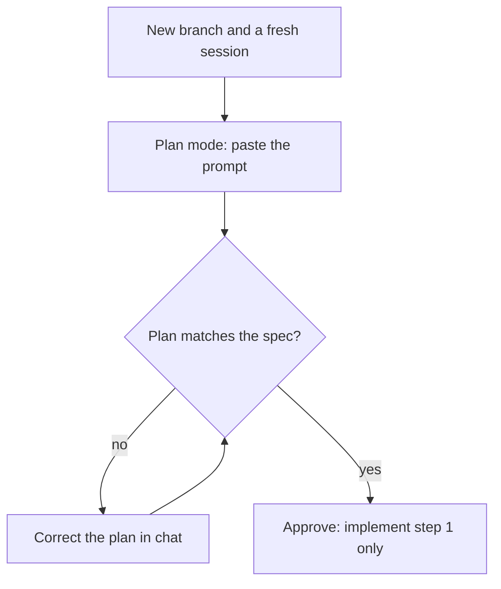
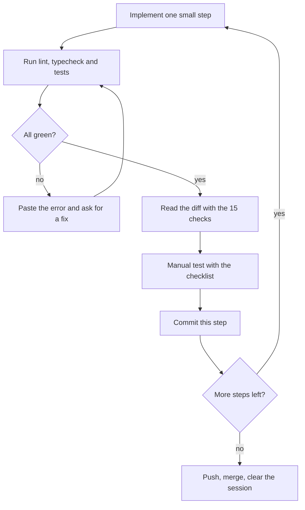
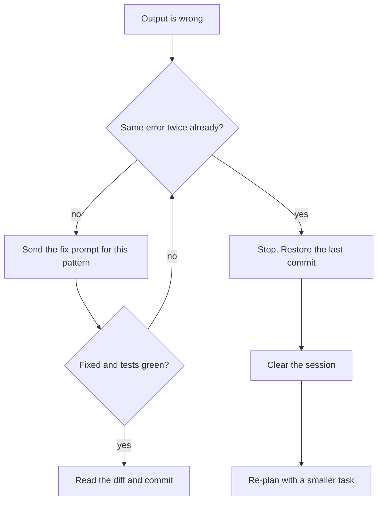

# Working with Claude Code

**In simple words:** Claude Code is the AI coding tool that writes most of EduFlow's code, while you act as the architect and the reviewer. This chapter gives you one fixed working method: where the specs live, what goes into `CLAUDE.md`, how every prompt is built, and how you check code before you commit it. Follow the same loop for every module and you ship faster with fewer ugly surprises. Skip the loop and Week 6 will be spent repairing what Week 2 broke.

## What Claude Code is and what your job is

Claude Code is Anthropic's agentic coding tool. "Agentic" means it works in steps by itself: it reads files, runs commands, edits code and checks the result. You talk to it in plain English. It works inside your repository (repo — the folder that holds all your code under Git).

You can use the same tool in four places.

| Where | What it is | Best use in the EduFlow sprint |
|---|---|---|
| Terminal CLI | CLI (command-line interface — a program you run by typing commands). Start it with `claude` inside the repo. | Your main tool. All 60 prompts are written for it. |
| VS Code extension | The same engine in a panel inside the editor. Changes show as side-by-side diffs. | Reviewing changes file by file. Small edits while you read code. |
| Desktop app | Claude Code sessions in a normal app window, no terminal needed. | Running a second session for research while the first one builds. |
| Web | Claude Code in the browser, connected to your GitHub repo. The task runs in the cloud. | Small, well-defined tasks when you are away from your laptop. Review the result as a branch or pull request. |

A diff is the list of lines added and removed by a change. You will read many diffs in the next 60 days. Reading diffs is now your most important coding skill.

The work is split like this.

| Job | Who does it | Why |
|---|---|---|
| Decide what to build | You, using the PRD | The spec is already written. Claude must follow it, not design it again. |
| Write and change code | Claude Code | It types faster than you and knows the stack well. |
| Run lint, typecheck and tests | Claude Code runs them, you read the result | Green tests are evidence. "It should work" is not evidence. |
| Review the diff | You | Only you know the business rules of a fee counter in Patna. |
| Manual test in the browser | You | Tests do not see a broken layout or a confusing screen. |
| Commit, merge, deploy | You | You own the history and the production system. |
| Production secrets and real data | You only | Claude Code never needs them. See the security section below. |

> **Rule:** Claude Code writes. You decide, review and own. If Sunita Devi gets a wrong fee receipt, "the AI wrote it" is not an answer you can give to Sharma Classes.

> **Founder note:** One line to remember for the whole sprint: "Pehle plan, phir code. Pehle diff, phir commit." First the plan, then the code. First the diff, then the commit.

## Install and first run

### What you need before you install

| Item | Version or detail | Check command |
|---|---|---|
| Node.js | 24 LTS (the canon stack) | `node --version` |
| Git | Any recent version. On Windows install Git for Windows first. | `git --version` |
| GitHub account | One private repo named `eduflow` | Open it in the browser |
| VS Code | Latest stable | Open it once |
| Docker Desktop | Needed from prompt P-03 for PostgreSQL and Redis | `docker --version` |
| Claude account | A paid Claude plan that includes Claude Code, or Anthropic Console API billing | Sign in once in the browser |

On Windows, Claude Code runs natively and uses Git Bash to run commands. WSL (Windows Subsystem for Linux — a Linux environment inside Windows) also works. Pick one and stay with it for the whole sprint. Mixing both gives path problems.

### Install

The npm package is the install route used in this Blueprint because you already have Node.js.

```bash
# 1. Check the basics
node --version        # must print v24.x
git --version

# 2. Install Claude Code globally
npm install -g @anthropic-ai/claude-code

# 3. Confirm the install
claude --version
claude doctor         # checks the health of the installation

# 4. Start it inside the repo (never in your home folder)
cd ~/code/eduflow
claude
```

> **Note:** Anthropic also ships a native installer that does not need Node.js. Both routes give you the same `claude` command. If the official setup page recommends a different install command on the day you read this, follow the official page.

For the VS Code extension, open the Extensions view in VS Code, search for "Claude Code", and install the one published by Anthropic. It uses the same login and the same project files as the terminal tool.

### First run, step by step

1. Run `claude` inside the `eduflow` folder. The first start opens a browser window for sign-in. Sign in with the account that has Claude Code access.
2. Claude Code asks if you trust the files in this folder. Say yes only for your own repo.
3. Type `/help`. Read the list once. Type `/` alone to see every command your version supports.
4. Type `/status`. Check the account, the model and the working folder.
5. Send the read-only smoke test below. It proves that Claude can see the repo and that it follows instructions.
6. Press `Shift+Tab` a few times. Watch the mode indicator under the input box change between the normal mode, the auto-accept-edits mode and plan mode. Leave it on the normal mode.
7. Type `/clear`. You now have a clean session and you are ready for P-01.

**Script: first-session smoke test (paste as it is)**

```text
Do not change any file in this session.
1. List the top-level folders and files of this repo.
2. Tell me in five bullets what you think this project is.
3. If docs/canon.md exists, read it and list the seven role keys and the
   six multi-tenancy rules. If it does not exist, say so and stop.
4. Tell me which commands you would need permission to run for steps 1-3.
```

On Day 1 the repo is almost empty, so step 3 will say the file is missing. That is the correct answer. A wrong answer is an invented list of roles. If you see invention on a simple read task, stop and check that you started `claude` in the right folder.

### Keys and commands to learn on day one

| Key or command | What it does | When you use it |
|---|---|---|
| `Shift+Tab` | Cycles the permission mode: normal, auto-accept edits, plan mode | Before every new module: switch to plan mode |
| `Esc` | Stops Claude in the middle of an action | It starts doing something you did not ask for |
| `Esc` pressed twice | Opens the rewind list to go back to an earlier point of the session | The last few turns went in a wrong direction |
| `@` plus a path | Mentions a file so Claude reads exactly that file | `@docs/prd/25-fees-module.md` |
| `!` plus a command | Runs a shell command yourself and adds the output to the chat | `! npm run test --workspace server` |
| `/clear` | Wipes the conversation and starts fresh | Between tasks. Always between modules. |
| `/compact` | Replaces the long history with a short summary | In the middle of a long module, at a natural break |
| `/context` | Shows how full the context window is | When answers start to get vague |
| `/model` | Switches the model | Simple chores on a faster model, hard design on the strongest one |
| `/cost` and `/usage` | Show what the session has used and how much of your plan limit is left | End of every work block |
| `/permissions` | Shows and edits which tools run without asking | After P-01, to allow lint and test commands |
| `claude --continue` | Reopens the most recent session in this folder | After a terminal crash or a lunch break |
| `claude --resume` | Lets you pick an older session to reopen | You need the context of yesterday's session |

Plan mode is the read-only mode. Claude can read files and search, but it cannot edit files or run commands that change anything. It ends with a written plan and waits for your approval. You can also start a session directly in this mode with `claude --permission-mode plan`.

## Put the specs inside the repo

Claude Code only knows two things: what is in its context (the text it has read in this session) and what it learned in training. It does not know your PRD unless the PRD is a file it can open. If the spec lives in a PDF on your desktop, Claude will guess. A guess looks like working code with field names that do not exist in your schema.

So the spec goes into the repo, in these exact places.

| In the code repo | Comes from | What Claude uses it for |
|---|---|---|
| `docs/canon.md` | `_canon.md` | Roles, modules, conventions, envelope, error codes |
| `docs/prd/<file>.md` | PRD chapter files, same file names | One spec per module: stories, rules, screens, acceptance criteria |
| `docs/schema/*.prisma` | `_schema/*.prisma` | The approved data model. Copied to `server/prisma/schema/` by P-04. |
| `docs/api/*.md` | `_api/*.md` | Endpoint registry: IDs, methods, paths, permission keys |
| `docs/permissions.md` | `_permissions.md` | Permission keys by role |

Prompt P-02 does this copy for you. If you want to do it by hand, run this from the repo root in Git Bash, macOS or Linux. Set `DOCS_SRC` to the folder where the documentation sources live on your machine.

```bash
DOCS_SRC="/e/mysaasschool/docs/src"

mkdir -p docs/prd docs/schema docs/api
cp "$DOCS_SRC/_canon.md"        docs/canon.md
cp "$DOCS_SRC/_permissions.md"  docs/permissions.md
cp "$DOCS_SRC"/prd/*.md         docs/prd/
cp "$DOCS_SRC"/_schema/*.prisma docs/schema/
cp "$DOCS_SRC"/_api/*.md        docs/api/

git add docs
git commit -m "docs: add canon, prd, schema, api registry and permissions"
```

Now a prompt can point at the real spec:

> **Example:** "Read `docs/canon.md` and `docs/prd/25-fees-module.md`, then implement FEE-API-01 to FEE-API-08."

### Rules that keep the specs useful

1. **One order of truth.** When two sources disagree, the higher one wins: first `docs/canon.md`, then `docs/schema/`, then `docs/api/` and `docs/permissions.md`, then the PRD module file, then the existing code. Claude must stop and ask when it sees a conflict. This line is in `CLAUDE.md`.
2. **Two schema folders, always identical.** `docs/schema/` is the reference copy. `server/prisma/schema/` is the live copy that Prisma reads. When you change the schema, change both in the same commit. Check with `diff -r docs/schema server/prisma/schema`. No output means they match.
3. **Change the spec first, then the code.** A pilot institute asks for a new field. First edit the PRD file and the schema file. Then ask Claude Code to implement the change. The spec never runs behind the code.
4. **Do not paste specs into the chat.** Name the file. Claude reads it from disk, and the same text is there again after `/clear`.
5. **Name the section.** "Read the Business Rules and Acceptance Criteria sections of `docs/prd/25-fees-module.md`" costs less context than "read the whole file" and gives sharper answers.

## The CLAUDE.md file

`CLAUDE.md` is a Markdown file in the repo root. Claude Code loads it automatically at the start of every session. Think of it as the joining letter you would give a new developer on day one: what the project is, which commands to run, and which rules are never broken.

Three facts decide how you write it.

- It is loaded in every session, so every line costs context in every session. Keep it under about 150 lines.
- It is for rules that apply to every task. Task details go in the prompt. Module details stay in `docs/prd/`.
- Claude follows short, direct rules better than long explanations. Write "Never use Float for money", not a paragraph about rounding errors.

The `/init` command can write a first draft by scanning the repo. For EduFlow you do not need that draft. Use the template below. Prompt P-02 creates this same file, so use this section to understand and maintain it.

> **Note:** The helper names in the template (`requirePermission`, the tenant-aware Prisma client in `server/src/lib/`, the Zod-validated env module) and the npm script names are the ones this Blueprint assumes. They are created by P-01, P-03, P-05, P-06 and P-08. If your generated code uses different names, fix `CLAUDE.md` the same day. The folder layout follows *Folder Structure*; if that chapter and this template ever differ, *Folder Structure* wins.

**File: `CLAUDE.md` (repo root) — complete template**

```markdown
# EduFlow - guide for Claude Code

## Project overview
EduFlow is a multi-tenant SaaS ERP for coaching institutes and K-12 private schools:
admissions, attendance, fees, exams, staff and parent communication.
One codebase, one PostgreSQL database, many organizations. Data is isolated by
`organization_id`. The MVP (Phase 1) has 16 modules and is built in a 60-day sprint.
The owner is a solo founder. Prefer simple, readable, boring code over clever code.

## Specs - read before you code
- `docs/canon.md` - fixed facts: roles, modules, conventions, error codes. Canon wins.
- `docs/prd/<file>.md` - one spec per module, for example `docs/prd/25-fees-module.md`.
- `docs/schema/*.prisma` - approved data model. The live copy is `server/prisma/schema/`.
- `docs/api/*.md` - endpoint registry: IDs, methods, paths and permission keys.
- `docs/permissions.md` - permission keys by role.
Order of truth: canon, then schema, then api and permissions, then prd, then code.
Read only the files the prompt names. Do not load every spec at once.
If spec and code disagree, or the spec is silent, stop and ask. Never guess.

## Stack (fixed - ask before adding or swapping any library)
- Client: Next.js (App Router), React, TypeScript, Tailwind CSS, shadcn/ui,
  TanStack Query, React Hook Form + Zod.
- Server: Node.js 24, Express 5, TypeScript, Zod, Pino logs, OpenAPI docs.
- Data: PostgreSQL 16, Prisma 6.x (pinned), Redis 7, BullMQ workers.
- Auth: JWT access token (15 min) + rotating refresh token (30 days, httpOnly
  cookie, stored hashed), OTP login for parents and students, bcrypt.
- Integrations: AWS S3 (pre-signed URLs), Razorpay, Stripe, WhatsApp Cloud API,
  MSG91, Twilio, Amazon SES.
- Tests: Vitest + Supertest (server), Playwright (end-to-end).
- Repo: npm workspaces monorepo with `client/`, `server/`, `shared/`.

## Commands (run from the repo root unless stated)
- Install: `npm install`
- Start PostgreSQL and Redis: `docker compose up -d`
- Run API: `npm run dev --workspace server`
- Run web app: `npm run dev --workspace client`
- Lint: `npm run lint`
- Typecheck: `npm run typecheck`
- Server tests: `npm run test --workspace server`
- One module's tests: `npm run test --workspace server -- src/modules/fees`
- Prisma (run inside `server/`): `npx prisma validate`, `npx prisma generate`,
  `npx prisma migrate dev --name <change-name>`, `npx prisma db seed`
Before you say a task is done, run lint, typecheck and the tests of the module.

## Folder map
- `client/src/app/` - Next.js routes and layouts.
- `client/src/features/<module>/` - screens, forms and hooks of one module.
- `client/src/components/` - shared UI kit (data table, form kit, dialogs).
- `server/src/modules/<module>/` - `<module>.routes.ts`, `<module>.controller.ts`,
  `<module>.service.ts`, `<module>.schemas.ts`, `<module>.test.ts`.
- `server/src/middleware/` - auth, tenant context, permissions, validation, errors.
- `server/src/lib/` - tenant-aware Prisma client, redis, queue, logger, s3, env.
- `server/src/jobs/` - BullMQ workers.
- `server/prisma/schema/` - live Prisma schema files and migrations.
- `shared/src/` - Zod schemas, types, permission keys, error codes for both sides.
- `docs/` - specs. Read only during coding tasks.

## Non-negotiable rules
1. Tenant scope: every query on a tenant table is scoped by `organizationId`. Use the
   tenant-aware Prisma client from `server/src/lib/`. Never create a new `PrismaClient`.
   Raw SQL must filter by `organization_id`.
2. Tenant source: `orgId` comes from the JWT only. Never read it from body, query or
   params. Only `SUPER_ADMIN` may use the `X-Organization-Id` header.
3. Campus scope: respect the user's assigned campuses and the `X-Campus-Id` header.
4. Permissions: every route has the auth middleware and
   `requirePermission('<module.action>')`. The key must match `docs/api/` and
   `docs/permissions.md`. No route is public by accident.
5. Validation: every body, query and params object is parsed by a Zod schema before
   the controller uses it. Schemas used by both sides live in `shared/`.
6. Envelope: success is `{ success: true, data, meta? }`. Errors go through the central
   error handler as `{ success: false, error: { code, message, details }, requestId }`.
   Use only the error codes listed in `docs/canon.md`.
7. Money: Prisma `Decimal(12, 2)` plus a 3-letter `currency`. Never Float. Never plain
   JavaScript number maths on money. Every money write runs inside
   `prisma.$transaction`. Payment-creating POSTs honour the `Idempotency-Key` header.
8. Schema: never invent a table, field or enum value. If something is missing in
   `docs/schema/`, stop and ask. Every schema change needs a migration.
9. Lists: paginated (`page`, `limit`, max 100), sorted, filtered on indexed columns.
   No queries inside loops (no N+1).
10. Deletes: business records are soft-deleted with `deletedAt`. Reads exclude them.
11. Secrets: no secrets, tokens or keys in code, tests, logs or commits. Read config
    only through the Zod-validated env module. Never open or print `.env` files.
12. Logs: use Pino. Never log passwords, OTPs, tokens or full phone numbers.
13. Tests: money code, auth code and permission checks always ship with tests. Every
    module has a tenant-isolation test: organization A never reads organization B.
    Never weaken, skip or delete a test to make it pass.
14. Size: keep files under about 300 lines and functions under about 50 lines.
    No `any`. No commented-out code.
15. Commits: Conventional Commits, for example `feat(fees): add invoice generation`.
    Commit or push only when the founder asks.

## How to work with the founder
- For any task that touches more than three files, present a plan first and wait.
- Work in small steps. After each step report: files changed, commands run, results.
- Ask before: new dependencies, schema changes, deleting files, destructive commands
  (`prisma migrate reset`, `rm -rf`, force push).
- If you are unsure about a library API, check the installed version in `package.json`
  and the types in `node_modules` before you write code.
- Use sample data from `docs/canon.md` (Bright Future Public School, Sharma Classes,
  Aarav Sharma). Never use real student data.
```

### How to maintain CLAUDE.md

| Situation | What you do |
|---|---|
| Claude repeats the same mistake in two sessions | Add one short rule. Example: "Dates: store UTC, show in the organization's timezone." |
| A rule is never relevant any more | Delete it. Dead rules cost context and hide live rules. |
| A script name or folder changes | Update the Commands or Folder map section in the same commit |
| A rule applies to one folder only | Put it in a small `CLAUDE.md` inside that folder, for example `client/CLAUDE.md` for UI rules. Claude Code reads it when it works on files there. |
| The file grows past about 150 lines | Move detail into `docs/` and leave one line that points to it |
| You want personal preferences on all your projects | Put them in the user-level file `~/.claude/CLAUDE.md`, not in the repo |

> **Best practice:** Review `CLAUDE.md` every Sunday in your weekly review. Ask one question: "Which mistake did I correct by hand more than once this week?" That mistake becomes a rule. Everything else stays out.

## The prompt anatomy used by all sixty prompts

Every prompt in the prompt library (P-01 to P-60) has the same six parts, always in the same order:

**Context to read → Task → Constraints → Files to create or change → Acceptance checks → What to report back.**

You will also write your own prompts: a bug from a pilot institute, a small change after a demo. Use the same six parts. A prompt with a missing part fails in a predictable way, as the last column shows.

| Part | What you write | Why it matters | What goes wrong without it |
|---|---|---|---|
| Context to read | Exact file paths and section names; one existing file to copy the pattern from | Claude builds from your spec, not from memory | Invented fields, wrong endpoint paths |
| Task | One paragraph: what to build, for which role, up to which endpoint or screen IDs | One clear goal per prompt | Half-built extras, missing core |
| Constraints | Limits for this task: no schema change, no new library, which rules matter most here | Stops "helpful" side work | Surprise dependencies and refactors |
| Files to create or change | Paths marked new or change, plus "do not touch any other file" | Keeps the diff small and reviewable | 40 changed files, nothing reviewable |
| Acceptance checks | Checks that a test or a command can prove | Gives Claude a finish line and gives you a test list | "Done" with nothing verified |
| What to report back | Files, commands run, results, open questions, manual test steps | You review a summary first, then the diff | Long chatty answers, hidden assumptions |

**Template: the six-part prompt skeleton**

```text
CONTEXT TO READ
- docs/canon.md (sections: <names>)
- docs/prd/<module file>.md (sections: <names>)
- docs/schema/<domain>.prisma, docs/api/<group>.md, docs/permissions.md
- Existing code to copy the pattern from: <path>

TASK
<One paragraph. What to build, for which role, up to which IDs.>

CONSTRAINTS
- Follow every rule in CLAUDE.md.
- <Limits for this task: no schema change, no new library, ...>

FILES TO CREATE OR CHANGE
- <path> (new) - <purpose>
- <path> (change) - <what changes>
Do not touch any other file without asking.

ACCEPTANCE CHECKS
- [ ] <A check that a test or a command can prove>
- [ ] Lint, typecheck and the module tests pass.

WHAT TO REPORT BACK
1. Files created or changed, one line each.
2. Commands you ran and their results.
3. Anything unclear in the spec, and what you assumed.
4. What I should test by hand, step by step.
```

### A worked example for your own prompts

This example is not one of the 60 library prompts. It is the kind of small prompt you write yourself in Week 4, after you notice that the student list needs search and filters. The field names come from `model Student` in the schema. The file paths follow the layout in `CLAUDE.md`.

**Script: own prompt in the six-part format (student list search)**

```text
CONTEXT TO READ
- docs/canon.md: section "API conventions" (lists, envelope, errors)
- docs/prd/14-student-profile-module.md: the student list screen and
  its filters
- docs/schema/04-people.prisma: model Student (do not change it)
- The student list endpoint in docs/api/ and its permission key
- server/src/modules/students/ (the current code)

TASK
The student list endpoint must support the list conventions of the
canon: page, limit, sort, q (search) and the filters status and batchId.
Search q must match firstName, lastName, admissionNo and phone.
Example: ?q=aarav&status=ACTIVE&page=1&limit=20 returns Aarav Sharma
(BF-2027-0142) in the demo organization.

CONSTRAINTS
- Follow every rule in CLAUDE.md. No schema change. No new library.
- Use only fields that exist on model Student. The batchId filter
  works on currentBatchId.
- Search stays inside the tenant and inside the user's campuses.
- Never return more than 100 rows, whatever limit the client sends.

FILES TO CREATE OR CHANGE
- server/src/modules/students/students.schemas.ts (change) - query schema
- server/src/modules/students/students.service.ts (change) - filters
- server/src/modules/students/students.test.ts (change) - new tests
Do not touch any other file without asking.

ACCEPTANCE CHECKS
- [ ] q=aarav finds Aarav Sharma. q=BF-2027 finds him by admission no.
- [ ] status=ACTIVE hides students with any other status.
- [ ] A user of organization B gets zero students of organization A.
- [ ] limit=500 never returns more than 100 rows.
- [ ] meta has page, limit, total and totalPages.
- [ ] Lint, typecheck and the students tests pass.

WHAT TO REPORT BACK
1. Files changed, one line each.
2. Commands you ran and the test summary lines.
3. The filter you built, explained in plain words.
4. Steps for my manual test in the browser.
```

### Five habits for every prompt

1. **One task per prompt.** "Build Fees" is not a task. "Fee heads and fee structures, API only" is a task. The library already splits big modules, for example Fees into P-23 and P-24.
2. **Use IDs and paths, not descriptions.** Write "FEE-API-01 to FEE-API-08" and "`docs/prd/25-fees-module.md`". Claude cannot misread an ID.
3. **Say what must not happen.** "No schema change. No new library. Do not touch the auth middleware."
4. **Make every acceptance check provable.** "Works well" cannot be proven. "A Teacher gets 403 with code `FORBIDDEN`" can be proven.
5. **Never delete the Constraints or the Acceptance checks when you shorten a library prompt.** Shorten the Task instead.

## The build loop for every module

You use one loop for every module, from P-11 to P-48. The loop is slow for the first two days. After that it becomes a habit, and it is the reason your Week 7 code still fits your Week 2 code.

**Figure: The build loop, part one — the plan gate**



Nothing is written until you approve the plan. You correct the plan in chat as many times as needed. This is the first gate where only you decide.

**Figure: The build loop, part two — the step loop**



The diff review is the second gate where only you decide. Claude does the work between the gates. Each small step ends with a commit, so you can always go back exactly one step.

| Step | What you do | Time box | You move on when |
|---|---|---|---|
| Prepare | New branch. New session or `/clear`. Open the PRD module file yourself and skim it. | 5 min | `git status` is clean |
| Plan | Switch to plan mode. Paste the library prompt with the plan opener below. | 10–15 min | A numbered plan is on screen |
| Review the plan | Ask the eight plan questions. Correct the plan in chat. | 10 min | You approve it |
| Implement | One small step only. Claude stops and reports. | 20–40 min | The report is on screen |
| Run checks | Lint, typecheck, module tests | 5 min | All green, with real output |
| Read the diff | Use the 15-point checklist in the next section | 10–20 min | No open red flag |
| Manual test | Use the manual checklist below | 10–20 min | It works in the browser |
| Commit | One Conventional Commit per step | 2 min | `git status` is clean again |

### Plan mode first

Switch to plan mode with `Shift+Tab` before you paste a module prompt. In plan mode Claude reads and thinks but changes nothing. A wrong plan costs you ten minutes. Wrong code costs you half a day.

**Script: plan mode opener (put it above the library prompt)**

```text
You are in plan mode. Do not edit files.

<paste the full library prompt here, for example P-23>

Before the plan, list:
1. The spec files and sections you read.
2. The models, fields and enums from docs/schema/ you will use.
3. The endpoint IDs and permission keys from docs/api/ you will build.
Then give the plan as numbered small steps. Each step must be something
I can test and commit on its own. Mark every point where the spec is
unclear as QUESTION. Do not assume an answer.
```

### Review the plan

Ask these eight questions. Each takes about one minute.

1. Does the plan list the spec files and sections it really read?
2. Are the models and fields real? Spot-check three names against `docs/schema/`.
3. Do the endpoint IDs, paths and permission keys match `docs/api/`?
4. Does the plan mention tenant scope and campus scope?
5. Does the plan include tests, with a tenant-isolation test, and money tests where money moves?
6. Does it add anything you did not ask for: a new library, a new table, a "helper framework"?
7. Is every step small enough to review? A good step changes about five files or fewer.
8. Did it raise any QUESTION? Zero questions on a big module is suspicious. Ask: "What in the spec was unclear or missing?"

**Script: approve the plan with corrections**

```text
The plan is approved with these corrections:
1. <correction, with the spec file and section that proves it>
2. <correction>
Now implement step 1 only. Stop after step 1 and report back in the
format from the prompt. Do not start step 2.
```

### Implement in small steps

A module is built in slices. Each slice is one step of the plan and one commit. This table shows the normal slices, with Fees part 1 (P-23) as the example.

| Slice | Contents | Example commit message |
|---|---|---|
| Shared contracts | Zod schemas and TypeScript types in `shared/` | `feat(fees): add fee head schemas` |
| Service and unit tests | Business rules and calculations, with tests | `feat(fees): add fee head service` |
| Routes | Routes, controller, permission middleware, integration tests | `feat(fees): add fee head endpoints` |
| Client data layer | API client functions and TanStack Query hooks | `feat(fees): add fee head hooks` |
| List screen | Data table, filters, loading, empty and error states | `feat(fees): add fee head list screen` |
| Form screen | React Hook Form with Zod, error texts from the PRD Validation Rules | `feat(fees): add fee head form` |
| Seed and polish | Seed rows, sidebar link by permission, labels by `Organization.type` | `chore(fees): seed fee heads` |

Build the API slices first and test them before any screen exists. A screen on top of a wrong API hides the API bug.

### Run the tests

Claude Code should run the checks itself. You must see the real output, not a sentence about the output.

```bash
npm run lint
npm run typecheck
npm run test --workspace server -- src/modules/fees
```

**Script: prove it**

```text
Run lint, typecheck and the tests of this module now.
Paste the real summary lines of each command.
If anything fails, fix the code, not the test, and run again.
Do not tell me it passes unless you ran it in this session.
```

### Manual test with the checklist

The checklist for each module comes from two sections of its PRD file: "Acceptance Criteria" and "Test Scenarios". Add these ten general checks to every module. The full printable version is in *Checklists*.

1. Log in as the main user of the screen (for Fees: accountant Suresh Gupta). Walk through the normal flow once.
2. Log in as a role that must not have access (teacher Priya Nair). The menu item is hidden and the direct URL is refused.
3. Log in to the second demo organization (Sharma Classes). No data of Bright Future Public School is visible anywhere. If your seed has only one organization, add the second one now.
4. Submit the empty form. The error texts match the PRD "Validation Rules" table.
5. Create the same record twice. You get a clean `CONFLICT` message, not a crash.
6. Open the list with zero rows and with more than 20 rows. Empty state and pagination both work.
7. Narrow the browser to phone width. The screen is still usable.
8. Refresh the page in the middle of the flow. Nothing is saved twice.
9. For money screens, check every total with a calculator. Check rounding and the currency.
10. Open the browser's network tab. The response has the canon envelope and no extra fields such as password hashes.

### Commit

```bash
git status
git diff --stat
git add -A
git commit -m "feat(fees): add fee head endpoints with permission checks"
```

Commit after every green step, not at the end of the day. Branch names, pull requests and merge rules are in *Git Workflow: Branches, Commits and Pull Requests*.

## How to review AI-written code

AI-written code has a special risk: it always looks finished. The names are clean, the comments are polite, and the bug is hiding in a missing `where` clause. So you review with a fixed list, not with a feeling.

### Read the diff in a fixed order

```bash
git status                          # any surprise files?
git diff --stat                     # how big is the change?
git diff -- server/prisma           # 1. schema and migrations
git diff -- server/src              # 2. routes, services, tests
git diff -- shared/src client/src   # 3. shared contracts and UI
```

Read the schema first, because a wrong table is the most expensive mistake. Then read routes, then services, then tests, then the UI. If one step changed more than about 400 lines, do not try to review it. Restore the step and ask for smaller steps.

### The fifteen-point checklist

| # | Check | What you look for | Red flag in the diff |
|---|---|---|---|
| 1 | Tenant filter | Every query uses the tenant-aware client. Raw SQL filters by `organization_id`. | `new PrismaClient()`; `$queryRaw` without an organization filter |
| 2 | Tenant source | `orgId` comes from the verified JWT context | `req.body.organizationId` or `req.query.organizationId` |
| 3 | Permission check | Every route has auth plus `requirePermission` with the key from `docs/api/` | A route line that holds only the controller |
| 4 | Campus scope | Lists and writes respect the user's assigned campuses | Principal of campus A can open a campus B record by ID |
| 5 | Validation | Zod parses body, query and params. Strings and arrays have limits. | `req.body` passed straight into a service |
| 6 | Envelope and error codes | Canon envelope, canon error codes, correct HTTP status | `res.status(500).json({ message })`; home-made code names |
| 7 | Money type | Decimal from request to database. Currency stored. | `parseFloat`, `Number(amount)`, `toFixed` on money |
| 8 | Transactions and idempotency | Payment, receipt and invoice update in one `$transaction`. `Idempotency-Key` honoured. | Three separate money writes one after another |
| 9 | N+1 queries | One query with `include`, `select` or an `in` filter | `await` on a query inside a `for` loop or `map` |
| 10 | Indexes and pagination | Filters and sorts use an index that starts with `organization_id`. `limit` max 100. | `findMany` without `take`; filter on a column with no index |
| 11 | Schema fidelity | Only fields from `docs/schema/`. Migration included. Both schema folders identical. | Unknown field names; schema edit with no migration |
| 12 | Secrets and personal data | Config only through the env module. No personal data in logs. | Hard-coded keys; `logger.info(req.body)` |
| 13 | Tests are real | Tests call real code and assert real results. Isolation test exists. | `expect(true)`, `it.skip`, everything mocked away |
| 14 | Size and scope | Small files. Only the named files changed. No new dependency. | A 900-line file; a surprise change in `package.json` |
| 15 | Soft delete and audit | Reads exclude `deletedAt` rows. Sensitive actions write an audit log. | Hard `delete` on a business record |

An N+1 query means one query for the list and then one more query for each row. A list of 300 students then makes 301 database calls. An idempotency key is a unique ID sent with a payment request, so a repeated request does not create a second payment. A transaction is a group of database writes that succeed together or fail together.

### Quick scans that catch the worst problems

Run these from the repo root before every merge. Each hit needs a reason. No hit is the normal result.

```bash
# Tenant taken from the request instead of the JWT
grep -rnE 'req\.(body|query|params)\.organizationId' server/src

# Raw clients and raw SQL
grep -rnE 'new PrismaClient|\$queryRaw|\$executeRaw' server/src

# Float maths on money
grep -rnE 'parseFloat|Number\(|toFixed\(' \
  server/src/modules/fees server/src/modules/payments

# Fake or disabled tests
grep -rnE 'it\.skip|describe\.skip|it\.todo|expect\(true\)' server/src

# Secrets written into code
grep -rnE "(SECRET|API_KEY|PASSWORD|TOKEN)[A-Z_]*[[:space:]]*[:=][[:space:]]*['\"]" \
  server/src client/src
```

### Use a second reviewer that did not write the code

The session that wrote the code is a weak reviewer of that code. It remembers its own reasons and agrees with itself. Open a fresh session, or use a review subagent (see the feature section), and paste this script. The deep version of this review is prompt P-52.

**Script: fresh-session review**

```text
You did not write this code. Review the diff between main and this
branch as a strict senior engineer.
Read CLAUDE.md first. Check each of the 15 non-negotiable rules.
For every problem give: file and line, the rule it breaks, and the
smallest fix. Do not fix anything yet.
End with a table: rule number, PASS or FAIL, evidence.
```

> **Warning:** For money code and auth code you read every line yourself, even when the second reviewer says PASS. These are the two places where one missed line becomes a refund, a data leak or a lost customer.

## Context management

The context window is Claude's working memory for one session. Everything counts against it: `CLAUDE.md`, your prompts, every file Claude reads, every command output. It is measured in tokens (a token is a small piece of text, roughly three-quarters of an English word). The window is large, but it is not endless. When it fills up, older turns are summarised and details get lost. The first details to go are usually the rules you gave two hours ago.

Nine rules keep the context clean.

1. **One module per session.** Fees and Attendance never share a session. Mixed context gives mixed code.
2. **`/clear` between tasks.** A finished and committed task needs no memory. Start the next task fresh.
3. **`/compact` only at a natural break.** Use it in the middle of a long module, after a commit. Tell it what to keep: "/compact keep the approved plan, the list of finished steps and the open questions".
4. **Keep `CLAUDE.md` short.** It is loaded in every session. 150 lines, not 600.
5. **Name files and sections. Do not paste them.** Claude reads from disk what it needs.
6. **Paste 30 lines of an error, not 3,000.** The failing test name, the message and the stack trace are enough.
7. **Use subagents for research.** A subagent is a helper that works in its own separate context and returns only a short summary. The reading happens there. Your main session stays small.
8. **Write a handoff note before you stop.** The next session starts from the note, not from a long chat history.
9. **Switch off tools you do not use.** Every connected MCP server adds its tool descriptions to the context of every session.

| Symptom | Likely cause | What you do |
|---|---|---|
| Claude breaks a rule it followed an hour ago | Context is full. Early turns were summarised. | Handoff note, `/clear`, start fresh |
| It reads the same files again and again | It lost track of what it knows | `/compact` with a clear focus, or `/clear` |
| Fees field names appear in Attendance code | Two modules in one session | One module per session. Restore and restart. |
| Answers become slow and vague | Context is near the limit. Check with `/context`. | Commit, handoff note, `/clear` |
| It starts "improving" files you did not name | Your constraints scrolled far away | Repeat the constraints, or start a new session |

**Script: send research to a subagent**

```text
Use a subagent for this research. Do not load the files into this
session.
Question: which existing services already calculate late fees or
discounts, and which functions can P-27 reuse?
The subagent should search server/src and
docs/prd/27-discounts-module.md and return at most 15 lines:
file paths, function names, one-line notes.
```

**Script: end of session (handoff note)**

```text
We are stopping here. Write a handoff note to docs/progress.md under
a heading with today's date and the module name. Include:
1. What is finished and committed, with the commit messages.
2. What is half done, with file paths.
3. The next three steps, in order.
4. Open questions about the spec.
Maximum 25 lines. Do not change any other file.
```

**Script: start of session**

```text
Read CLAUDE.md, the last entry in docs/progress.md and the output of
git log --oneline -10. Then tell me in five lines where we are and
what the next step is. Do not change any file yet.
```

## Git as your safety net

Claude Code can change 20 files in one minute. Git is the undo button for that speed. Claude Code also has its own rewind feature, but it covers only the file edits made by Claude in that session. It does not cover commands that were run, such as a database migration, or changes you made by hand. So Git stays the real safety net.

### Six safety rules

1. Never work on `main`. One branch per task: `feat/fees-part-1`, `fix/receipt-rounding`.
2. Start every session with a clean `git status`.
3. Commit before every big change: a refactor, a migration, a dependency upgrade.
4. Commit after every green step of the build loop.
5. Push at the end of every work block. GitHub is your off-laptop backup.
6. Claude commits only when you ask. Claude never force-pushes and never resets. You run those commands yourself.

```bash
# Start a task
git switch main
git pull
git switch -c feat/fees-part-1

# Checkpoint before a risky change
git add -A
git commit -m "chore(fees): checkpoint before invoice refactor"

# Back up the branch to GitHub
git push -u origin feat/fees-part-1
```

### How to undo

| Situation | Command | What happens |
|---|---|---|
| One file is broken, not committed | `git restore path/to/file.ts` | The file goes back to the last commit |
| The whole step is bad, not committed | `git restore --staged --worktree .` | All tracked files go back to the last commit |
| The bad step also created new files | `git clean -nd` to preview, then `git clean -fd` | Untracked files and folders are deleted |
| You want to park the changes, not lose them | `git stash -u`, later `git stash pop` | Changes are stored aside and come back later |
| Last commit is bad, not pushed, keep the changes | `git reset --soft HEAD~1` | The commit is removed. The changes stay staged. |
| Last commit is bad, not pushed, throw it away | `git reset --hard HEAD~1` | Commit and changes are destroyed. Run it yourself only. |
| The bad commit is already pushed or merged | `git revert <commit-id>` | A new commit undoes the old one. History stays safe. |
| You lost work after a reset | `git reflog`, then `git switch -c rescue <commit-id>` | Git keeps old commits for weeks. You get them back. |

> **Warning:** Git does not undo your database. If a bad migration ran on your local database, restore the code with Git and then rebuild the local database with `npx prisma migrate reset` inside `server/`. This wipes local data, applies all migrations again and runs the seed. This is why good seed data (P-04, P-58) matters. Never run this command against staging or production.

## Common failure patterns and the fix prompt for each

Claude Code fails in a small number of repeatable ways. Learn to spot them in seconds. Then paste the fix prompt. Do not argue in long messages.

| Pattern | How you notice it | Why it happens | First action |
|---|---|---|---|
| Invented fields | Typecheck errors on Prisma fields, or a migration you did not ask for | The schema file was not read, so Claude guessed | Fix prompt: schema fidelity |
| Skipped tenant filter | A raw client, raw SQL, or no isolation test | The shortest code "works" on a one-tenant dev database | Fix prompt: tenant isolation |
| Giant files | One service file of 900 lines | Adding to an open file is easier than creating a new one | Fix prompt: split the file |
| Fake tests | All tests green in 0.2 seconds; everything is mocked | "Make tests pass" is easier than "test the behaviour" | Fix prompt: test audit |
| Outdated library APIs | Deprecation warnings, type errors on library calls | Training data holds more old versions than new ones | Fix prompt: installed version |
| Scope creep | Files in the diff that you never named | Claude tries to be helpful | Fix prompt: revert extras |
| "Done" without proof | The report says "tests should pass" | The checks were never run | The "prove it" script from the build loop |
| Stuck in a loop | The same error comes back after three fixes | The root cause is outside the files Claude is editing | Stop. Follow the figure below. |
| Swallowed errors | `try/catch` blocks that only log, or return `null` | It makes the error message disappear | Ask for errors to reach the central error handler with a canon code |

### Invented fields that are not in the schema

Typical example: the code uses `student.fullName` or `student.rollNumber`. The real `Student` model has `firstName`, `lastName` and `rollNo`.

```text
Stop. You used fields that are not in the approved schema.
1. Open docs/schema/ and find the real model for every entity you
   touched. List each field you used that does not exist there.
2. Replace each one with the real field, or tell me it is missing.
3. Do not add fields, tables or enum values. Do not create a
   migration.
4. Run typecheck and paste the result.
If the feature truly needs a new field, stop and write a short
proposal: model, field, type, reason. I will decide.
```

### Skipped tenant filter

```text
Tenant isolation review for the <module> module. Add no features.
1. List every Prisma call and every raw SQL statement in
   server/src/modules/<module>/. For each one say how organizationId
   is applied: tenant-aware client, explicit filter, or NOT APPLIED.
2. Fix every NOT APPLIED. Never read the organization from body,
   query or params.
3. Add or extend the isolation test: seed two organizations, call
   every endpoint as a user of organization B with IDs that belong to
   organization A. The result must follow
   docs/prd/05-multi-tenancy-and-data-isolation.md and must never
   contain data of organization A.
4. Run the module tests and paste the summary.
```

### Giant files

```text
The file <path> is too large to review. Refactor it without changing
behaviour.
1. Propose a split into files under 300 lines that follows the module
   layout in CLAUDE.md. Show the plan first and wait.
2. Move code only. No renamed exports, no logic changes, no new
   features.
3. Tests must pass before and after. Paste both summaries.
```

### Fake tests

```text
Audit the tests in <path>. For each test, answer:
a) Which production function or endpoint does it really call?
b) Which assertion would fail if that code was wrong?
Mark every test that mocks the thing it tests, only asserts that a
mock was called, uses expect(true), or is skipped.
Rewrite the marked tests so they call the real service, or the real
route with Supertest against the test database.
Then prove each rewritten test: break the production code on purpose,
show the test failing, and restore the code.
```

### Outdated library APIs

The canon stack is new: Express 5, Prisma 6, Next.js App Router. Claude has seen far more Express 4 and Pages Router code. Typical signs: an async-handler wrapper around every route (Express 5 already forwards rejected promises to the error handler), the deprecated `prisma.$use` middleware where the canon asks for a client extension, or `getServerSideProps` in a Next.js App Router project. Do not debate from memory. Send Claude to the documentation of the version that is installed.

```text
This code uses an API that does not match our installed version.
1. Run: npm ls <package>  and tell me the installed version.
2. Read the documentation of that exact version inside node_modules:
   README, CHANGELOG and the type definitions. Do not rely on memory.
3. List what is different from the code you wrote.
4. Fix the code for the installed version. Do not upgrade or downgrade
   any package.
5. Run typecheck and the tests, and paste the results.
```

### Scope creep

```text
You changed files that were not in the list. Revert every change
outside these files: <paths>. Use git restore for each extra file.
Keep the requested changes. Then show me git status.
```

### Stuck in a loop

**Figure: What to do when Claude gets it wrong**



Two failed fixes for the same error is the limit. A third try in the same session mostly adds more confusion to the context. Go back to the last good commit, clear the session and restart with a smaller task and this prompt.

```text
We are starting again with a smaller task. Earlier attempts failed on
this error: <paste the 20 relevant lines>.
Do not write code yet. Read <files>. Give me three possible root
causes, ordered by probability, and the one command or log line that
would confirm each.
```

## Cost and usage tips

You can pay for Claude Code in two ways. A Claude subscription plan gives you usage limits that reset on a schedule. Anthropic Console billing charges per token, with no fixed limit and no fixed bill. For a full-time 60-day sprint, a subscription with high limits gives you a predictable cost. Plans, prices and limits change, so check Anthropic's pricing page before you pay.

> **Note:** Assumption for your budget sheet: keep US$100 to US$200 per month for AI coding tools during the sprint. At the planning rate of US$1 = ₹85 that is about ₹8,500 to ₹17,000 per month. This is a planning number, not a quoted price.

| Habit | Why it saves usage |
|---|---|
| Plan mode first | A rejected plan costs a fraction of rejected code |
| `/clear` between tasks | Claude re-reads the whole conversation on every turn. Long chats make every message expensive. |
| Name files and sections | Reading one section costs less than reading ten files "to be safe" |
| Short error pastes | 30 lines carry the same signal as 3,000 |
| Right model for the job | Use `/model`: strongest model for design, money and auth; faster model for renames, seed data and docs |
| Short `CLAUDE.md` | It is paid for in every session |
| Subagents for wide searches only | They keep the main context small, but each subagent also uses tokens |
| Unused MCP servers switched off | Tool descriptions take context in every session |
| `Esc` when Claude wanders | Stop wrong work in the first ten seconds, not after ten minutes |
| Tools for tool jobs | Rename with the editor, format with Prettier. Do not spend AI usage on them. |
| Check `/cost` or `/usage` after each work block | You learn which kind of task burns your limit |

If you hit a usage limit in the middle of the day, do not fight it. Move your two sales hours forward, make your calls, and come back when the limit has reset. Your daily rhythm (about 6 build hours plus 2 sales hours) already has room for this.

## Security hygiene

Treat every prompt like an email to an outside contractor. What you paste leaves your laptop. Student data is children's personal data under India's DPDP Act. It belongs to the institute and the parents. It has no place in a prompt, a test file or a screenshot.

| Never give to Claude Code | Use this instead |
|---|---|
| Production `.env` values: database URL, JWT secret, AWS keys | A local `.env` that Claude is not allowed to read, plus `.env.example` with fake values |
| Live Razorpay, Stripe, WhatsApp or MSG91 keys | Test-mode keys, and only inside your local `.env` |
| A real student Excel file from Sharma Classes | A fake file with the same columns, built from seed data |
| A production database connection | The local Docker database with seed data |
| A full production log | The 30 relevant lines, with names and phone numbers masked |
| A Sentry event with user details | The stack trace and the `requestId` only |
| Screenshots of real parent or fee data | Screenshots from the demo organization |

Eight working rules:

1. **Secrets live in `.env` files only.** They are git-ignored. `CLAUDE.md` tells Claude never to open them, and the settings file below blocks the read. Variable names are listed in *Environment Variables and Command Reference*.
2. **Seed data is your only test data.** Use the canon names: Bright Future Public School, Sharma Classes, Aarav Sharma, Sunita Devi. P-04 and P-58 create them.
3. **A pasted secret is a leaked secret.** If you paste a key by mistake, rotate it at once (create a new key and revoke the old one). Deleting the message is not enough.
4. **Read every command before you approve it.** Stay in the normal permission mode. Never start Claude Code on your laptop in the mode that skips all permission prompts.
5. **Destructive commands are yours.** `prisma migrate reset`, `rm -rf`, force push and SQL `DROP` are run by you, by hand, after thinking.
6. **Database tools see only the local database.** If you connect a PostgreSQL MCP server, use a read-only user on the local Docker database. Never staging. Never production.
7. **Web pages and outside files are untrusted.** A page can hold hidden text that tries to give Claude new instructions. This is called prompt injection. If Claude wants to run an odd command right after reading a web page, say no.
8. **Shared settings go in Git, personal settings do not.** `.claude/settings.json` is committed. `.claude/settings.local.json` stays on your machine.

**File: lines to add to `.gitignore`**

```text
.env
.env.*
!.env.example
.claude/settings.local.json
```

## Which Claude Code feature to use when

| Feature | What it is | Use it when | EduFlow example |
|---|---|---|---|
| Plan mode | Read-only planning that ends with a plan you approve | Start of every module. Any change over three files. Any migration. | Plan P-23 before one line of Fees code exists |
| `/clear` and `/compact` | Reset or shrink the conversation | Between tasks, or mid-module after a commit | `/clear` after Attendance is merged, before Fees starts |
| `CLAUDE.md` | Project rules loaded in every session | A rule applies to every task | "Money is Decimal, never Float" |
| Custom commands | A Markdown file in `.claude/commands/` becomes a slash command | You type the same prompt for the third time | `/review-module fees` |
| Subagents | Helpers in `.claude/agents/` with their own context, instructions and tool list | Wide research, or a review by "someone else" | `tenant-reviewer` checks each server step |
| Hooks | Shell commands that Claude Code runs by itself at fixed events | Something must happen every time, not "usually" | Format and lint each edited file. Block `prisma migrate reset`. |
| MCP servers | MCP (Model Context Protocol) is an open standard that connects Claude to outside tools and data | Claude needs eyes outside the repo | Playwright clicks through the local app. PostgreSQL reads local seed data. |
| Permission settings | Allow and deny lists in `.claude/settings.json` | You approve the same safe command ten times a day | Allow lint and tests. Deny reads of `.env`. |
| Rewind | Go back to an earlier point of the session (`Esc` twice) | The last few turns went wrong and nothing is committed yet | Undo a wrong turn in the middle of a form screen |
| Headless run | `claude -p "<prompt>"` runs one prompt without the chat and prints the answer | Scripts and repeated chores | Draft release notes from `git log` (P-59) |
| `--continue` and `--resume` | Reopen the last session or pick an older one | Crash, restart, next morning | Continue P-26 after the webhook test |
| VS Code extension | Claude Code inside the editor with side-by-side diffs | Careful review of many small edits | Reviewing a form screen file by file |
| Web sessions | A task runs in the cloud against your GitHub repo | You are away from your laptop and the task is small | Fix a typo batch in help articles |
| Git worktrees | A second working folder of the same repo on another branch | Two sessions in parallel with no file conflicts. Only after Week 3. | One session builds P-25 while another writes tests for P-24 |

### Custom commands in .claude/commands

A custom command is a Markdown file. The file name becomes the command name. The text `$ARGUMENTS` is replaced by what you type after the command. Create these four in Week 1 and commit them.

| Command | File | What it does |
|---|---|---|
| `/start-session` | `.claude/commands/start-session.md` | The start-of-session script from this chapter |
| `/review-module` | `.claude/commands/review-module.md` | The 15-rule review of the branch diff |
| `/prove-it` | `.claude/commands/prove-it.md` | Runs lint, typecheck and tests, and pastes real output |
| `/handoff` | `.claude/commands/handoff.md` | Writes the handoff note to `docs/progress.md` |

**File: `.claude/commands/review-module.md`**

```markdown
---
description: Review the branch diff against the 15 EduFlow rules
argument-hint: <module-folder-name>
allowed-tools: Read, Grep, Glob, Bash(git diff:*), Bash(git status:*), Bash(git log:*)
---
You did not write this code. Review the diff between `main` and the current branch
for the module `$ARGUMENTS` as a strict senior engineer.

1. Read `CLAUDE.md`. Run `git diff main...HEAD --stat`, then read the full diff.
2. Check each of the 15 non-negotiable rules. Look hardest at tenant scope,
   permission middleware, Zod validation, money as Decimal and transactions.
3. For every problem give: file and line, the rule number, the smallest fix.
4. Do not change any file.
5. End with a table: rule number, PASS or FAIL, evidence.
```

Use it like this: `/review-module fees`.

### Subagents in .claude/agents

A subagent file has a short header and then its instructions. You can create one with the `/agents` command or by hand.

**File: `.claude/agents/tenant-reviewer.md`**

```markdown
---
name: tenant-reviewer
description: Reviews server code for tenant isolation, permission and money rules.
tools: Read, Grep, Glob, Bash
---
You are a strict reviewer for EduFlow, a multi-tenant SaaS. You never edit files.
Read `CLAUDE.md` first. Then review the files or the diff you are given.
Report only problems with these rules: tenant scope (1), tenant source (2),
campus scope (3), permissions (4), validation (5), money (7), schema (8).
For each problem return: file and line, rule number, why it is a risk, smallest fix.
If you find nothing, say which files you read and which checks you ran.
Keep the report under 40 lines.
```

Call it in plain words: "Use the tenant-reviewer subagent on the changes of this step."

### Hooks and permissions in .claude/settings.json

A hook is a shell command that Claude Code runs automatically at a fixed event, for example before a tool runs or after a file is edited. A rule in `CLAUDE.md` is a request. A hook is a guarantee. Add hooks only after P-01 is finished and `npm run lint` is green, or every edit will produce noise. The lint hook below assumes one ESLint config and one Prettier config at the repo root.

**File: `.claude/settings.json`**

```json
{
  "permissions": {
    "allow": [
      "Bash(npm run lint:*)",
      "Bash(npm run typecheck:*)",
      "Bash(npm run test:*)",
      "Bash(git status)",
      "Bash(git diff:*)"
    ],
    "deny": [
      "Read(./.env)",
      "Read(./server/.env)",
      "Read(./client/.env.local)"
    ]
  },
  "hooks": {
    "PreToolUse": [
      {
        "matcher": "Bash",
        "hooks": [
          {
            "type": "command",
            "command": "node \"$CLAUDE_PROJECT_DIR/.claude/hooks/guard-bash.mjs\""
          }
        ]
      }
    ],
    "PostToolUse": [
      {
        "matcher": "Edit|Write",
        "hooks": [
          {
            "type": "command",
            "command": "node \"$CLAUDE_PROJECT_DIR/.claude/hooks/lint-file.mjs\""
          }
        ]
      }
    ]
  }
}
```

Claude Code sends the details of the tool call to the hook as JSON on standard input. If the hook exits with code 2, its error text goes back to Claude. For a `PreToolUse` hook, code 2 also blocks the tool call.

**File: `.claude/hooks/guard-bash.mjs`**

```typescript
// Blocks dangerous shell commands before Claude Code runs them.
let input = '';
process.stdin.on('data', (chunk) => (input += chunk));
process.stdin.on('end', () => {
  const command = JSON.parse(input)?.tool_input?.command ?? '';
  const blocked = [
    /prisma\s+migrate\s+reset/i,
    /rm\s+-rf\s+(\/|~|\.\.)/i,
    /git\s+push\s+.*--force/i,
    /git\s+reset\s+--hard/i,
    /drop\s+(table|database|schema)/i,
  ];
  if (blocked.some((rule) => rule.test(command))) {
    console.error(`Blocked by the EduFlow guard: ${command}`);
    console.error('Ask the founder to run this command by hand.');
    process.exit(2); // 2 = block the tool call and show this text to Claude
  }
  process.exit(0);
});
```

**File: `.claude/hooks/lint-file.mjs`**

```typescript
// Formats and lints the file Claude Code just edited.
import { execSync } from 'node:child_process';

let input = '';
process.stdin.on('data', (chunk) => (input += chunk));
process.stdin.on('end', () => {
  const file = JSON.parse(input)?.tool_input?.file_path ?? '';
  if (!/\.(ts|tsx)$/.test(file)) process.exit(0);
  try {
    execSync(`npx prettier --write "${file}"`, { stdio: 'pipe' });
    execSync(`npx eslint --fix "${file}"`, { stdio: 'pipe' });
  } catch (error) {
    const output = `${error.stdout ?? ''}${error.stderr ?? ''}`.slice(0, 2000);
    console.error(`Lint problems in ${file}:\n${output}`);
    process.exit(2); // 2 = send this text back to Claude so it fixes the file
  }
  process.exit(0);
});
```

> **Tip:** Type `/hooks` inside Claude Code to see which hooks are active. If `$CLAUDE_PROJECT_DIR` is not filled in on your machine, use the relative path `node .claude/hooks/guard-bash.mjs` and always start `claude` from the repo root. Do not put the full test suite in a per-edit hook. It is too slow. Tests belong in the "prove it" step and in CI (see *Docker and CI/CD*).

### MCP servers: Playwright and PostgreSQL

An MCP server gives Claude new tools. Add only the two that help this project, and add them after Week 2, when there is an app to look at.

**Playwright** lets Claude open your local app in a real browser, click, type and take screenshots. It is useful for a first pass of the manual test and for writing the end-to-end tests of P-50.

```bash
# Register the server for this project (writes .mcp.json in the repo root)
claude mcp add --scope project playwright -- npx @playwright/mcp@latest

# Check it
claude mcp list
```

The command creates this file. You can also write it by hand.

**File: `.mcp.json`**

```json
{
  "mcpServers": {
    "playwright": {
      "command": "npx",
      "args": ["@playwright/mcp@latest"]
    }
  }
}
```

On Windows without WSL, a server that starts through `npx` may need a `cmd /c` wrapper. If the server does not connect, type `/mcp` to see its status and check the MCP page of the official Claude Code documentation.

**Script: let Claude walk through a flow**

```text
Use the Playwright tools. Open http://localhost:3000 and log in as the
demo accountant from the seed data. Open Fees > Collect Fee and collect
Rs 12,000 in cash for Aarav Sharma (BF-2027-0142).
Tell me every step where the screen showed an error or felt slow.
Take a screenshot of the receipt. Do not change any code.
```

**PostgreSQL** lets Claude run read queries: check seed data, look at a query plan, confirm that an index is used (P-53). Pick a maintained PostgreSQL MCP server, register it the same way, and give it the connection string of a read-only user on the local database. The database name `eduflow_dev` below is this Blueprint's assumption; use the name from *Local Development Setup*.

```sql
-- Local development database only. Run as the role that owns the tables.
CREATE ROLE claude_readonly LOGIN PASSWORD 'local-dev-only';
GRANT CONNECT ON DATABASE eduflow_dev TO claude_readonly;
GRANT USAGE ON SCHEMA public TO claude_readonly;
GRANT SELECT ON ALL TABLES IN SCHEMA public TO claude_readonly;
ALTER DEFAULT PRIVILEGES IN SCHEMA public GRANT SELECT ON TABLES TO claude_readonly;
```

With Row-Level Security from P-06 switched on, this user sees only the rows of the organization set in `app.current_org`. That is what you want: even your AI helper stays inside one tenant.

## Key takeaways

- The specs live in the repo (`docs/canon.md`, `docs/prd/`, `docs/schema/`, `docs/api/`, `docs/permissions.md`). Claude builds from files it can read, never from memory.
- `CLAUDE.md` holds the project overview, stack, commands, folder map and the 15 non-negotiable rules. Keep it under about 150 lines and update it every Sunday.
- Every prompt has six parts: Context to read, Task, Constraints, Files to create or change, Acceptance checks, What to report back.
- Every module follows one loop: plan mode, plan review, small step, real test output, diff review with the fifteen-point checklist, manual test, commit.
- One module per session. `/clear` between tasks. Subagents for research. A handoff note before you stop.
- Git is the undo button: a branch per task, a commit before every risky change and after every green step. You alone run destructive commands.
- No production secrets and no real student data in any prompt. Use `.env` files, test-mode keys and seed data with the canon sample names.
