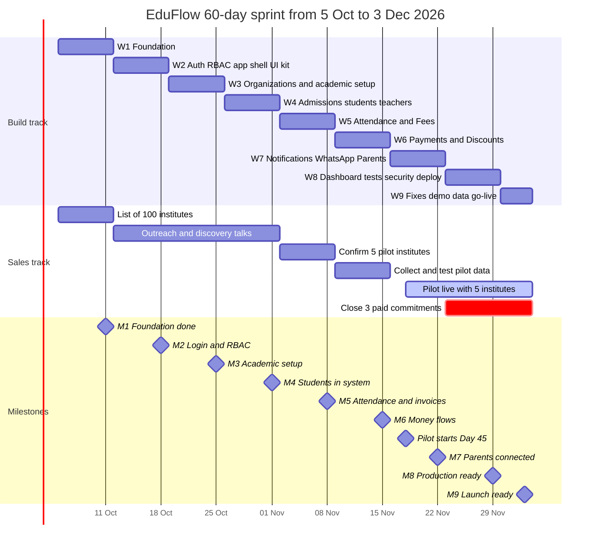
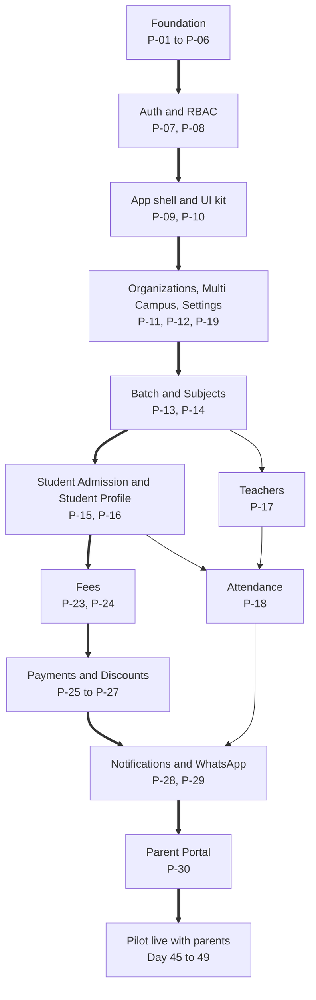
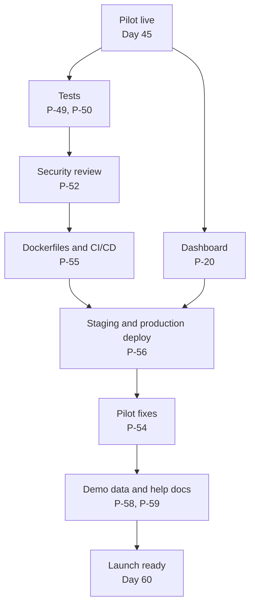

# 60-Day Roadmap Overview and Weekly Milestones

**In simple words:** This chapter puts the whole 60-day sprint on a few pages. It shows the nine weeks, what you build and what you sell in each week, and nine milestones (M1 to M9) that tell you if you are on time. Read it fully before Day 1. After that, open it every Sunday during your weekly review. The hour-by-hour work is in the four *Daily Plan* chapters.

## How this chapter fits with the others

This chapter is the map. The *Daily Plan* chapters are the turn-by-turn directions. The prompt library chapters in Part III hold the exact text you paste into Claude Code.

The sprint has two tracks. Both run side by side on every working day:

- **Build track** — about 6 focused hours a day. You build the 16 Phase 1 modules with Claude Code.
- **Sales track** — about 2 hours a day. You find institutes, talk to owners, confirm 5 pilot institutes and get 3 paid commitments for January 2027.

Add 30 minutes of daily review. Sunday is for rest and the 60-minute weekly review.

> **Rule:** Dates are fixed. Scope is flexible. When you fall behind, you cut scope with the scope-cut ladder in this chapter. You never move Day 45 or Day 60, and you never skip the sales hours.

| Thing | Fixed or flexible | Why |
|---|---|---|
| Day 1 = Mon 5 Oct 2026, Day 60 = Thu 3 Dec 2026 | Fixed | The January 2027 launch must catch the buying season before the April 2027 session |
| Pilot start = Day 45 (Wed 18 Nov 2026) | Fixed | Five institute owners will block this date in their calendar |
| The list of 16 Phase 1 modules | Fixed | This is the smallest product an institute can run daily work on |
| Depth of each module | Flexible | You can ship a simpler version first (see the scope-cut ladder) |
| Order of the weeks | Fixed | It follows the module dependencies (see the critical path) |
| Order of prompts inside a week | Flexible | Swap days if one prompt is blocked, but finish the week's list |
| 2 sales hours a day | Fixed | A finished product with zero customers is a failed sprint |

## The sprint in numbers

These numbers help you feel the real size of the work. Every number shows its formula, so you can change the inputs.

| Number | Value | Formula |
|---|---|---|
| Calendar days | 60 | 5 Oct to 3 Dec 2026 |
| Sundays (rest and review) | 8 | Days 7, 14, 21, 28, 35, 42, 49, 56 |
| Working days | 52 | 60 − 8 |
| Build hours | about 312 | 52 days × 6 hours |
| Sales hours | about 104 | 52 days × 2 hours |
| Daily review hours | 26 | 52 days × 0.5 hour |
| Weekly review hours | 8 | 8 Sundays × 1 hour |
| Phase 1 modules to ship | 16 | Fixed in the canon module list |
| Claude Code prompts used | 38 of 60 | Sum of the weekly prompt lists below |
| Prompts left for after Day 60 | 22 | 60 − 38 (Phase 2, 3 and 4) |
| Milestones | 9 | M1 to M9, one per week |

Weeks 3 to 7 are the module weeks. They give you 5 weeks × 36 build hours = 180 hours for 15 modules. That is about 12 build hours per module. (Dashboard, the 16th module, comes in Week 8.)

> **Founder note:** Twelve hours per module is very little. It works only because the PRD already made the decisions. Do not redesign a screen or a table during the sprint. Load the PRD file, run the prompt, review, test, commit, move on. The working method is in *Working with Claude Code*.

## The nine weeks on one page

| Week | Days | Dates (2026) | Theme | Prompts | Milestone | Sales milestone |
|---|---|---|---|---|---|---|
| 1 | 1–7 | 5–11 Oct | Foundation: repo, database, API skeleton, multi-tenancy | P-01 to P-06 | M1 | List of 100 local institutes |
| 2 | 8–14 | 12–18 Oct | Auth, RBAC, app shell, UI kit | P-07 to P-10, P-22 | M2 | 40 institutes contacted, 5 talks booked |
| 3 | 15–21 | 19–25 Oct | Organizations, campuses, academic setup, subjects, settings | P-11 to P-14, P-19 | M3 | 10 discovery conversations done |
| 4 | 22–28 | 26 Oct – 1 Nov | Admissions, student profiles, teachers, file uploads, import | P-15 to P-17, P-21 | M4 | 5 laptop demos, 8 pilot candidates |
| 5 | 29–35 | 2–8 Nov | Attendance and Fees (structures, invoices) | P-18, P-23, P-24 | M5 | 5 pilot institutes confirmed |
| 6 | 36–42 | 9–15 Nov | Payments (counter + Razorpay), discounts, receipts | P-25 to P-27 | M6 | Pilot data collected and test-imported |
| 7 | 43–49 | 16–22 Nov | Notifications, WhatsApp, Parent Portal; pilot starts Day 45 | P-28 to P-30 | M7 | Pilot onboarding: 5 institutes live |
| 8 | 50–56 | 23–29 Nov | Dashboard, tests, security review, CI/CD, staging and production deploy | P-20, P-49, P-50, P-52, P-55, P-56 | M8 | 3 testimonials, pricing talk opened |
| 9 | 57–60 | 30 Nov – 3 Dec | Pilot feedback fixes, demo data, launch checklist, go-live | P-54, P-58, P-59 | M9 | 3 paid commitments for January |

> **Note:** Week 9 has only four days, Monday 30 Nov to Thursday 3 Dec. It has no Sunday. Treat it as a closing week, not a building week.

### Weekly rhythm

| Day | Build track | Sales track |
|---|---|---|
| Monday to Friday | 6 hours. Start new prompts. One prompt = one branch = one pull request | 2 hours. Calls, WhatsApp follow-ups, conversations, demos |
| Saturday | 6 hours. The shock absorber: finish open work, write missing tests, rehearse the Sunday demo | 2 hours. Follow-ups and next week's meeting bookings |
| Sunday | No coding. 60-minute weekly review, then rest | No calls |

If the week went to plan, Saturday is for tests and polish. If it did not, Saturday is for catching up. This gives every week a buffer (spare time kept for delays) of about one day in six.

## Gantt chart of the sixty days

**Figure: The 60-day sprint — build track, sales track and milestones**



The top block shows the nine build weeks, one after another with no gaps. The middle block shows the sales work that runs at the same time. The diamonds at the bottom are the nine milestones, each on a Sunday, except M9 which falls on Thursday 3 Dec.

## The nine milestones

A milestone is a checkpoint with a date and a proof. It answers one question: "Am I on time?" You finish the work by Saturday evening. You judge the milestone on Sunday, in the weekly review.

| ID | Milestone | Day | Date (2026) | Proof you can show |
|---|---|---|---|---|
| M1 | Foundation done | 7 | Sun 11 Oct | One command starts the stack; tenant isolation tests pass |
| M2 | Login + RBAC | 14 | Sun 18 Oct | Seven roles log in; each sees only its own menu and data |
| M3 | Academic setup | 21 | Sun 25 Oct | A new institute is set up from sign-up to batches in 10 minutes |
| M4 | Students in system | 28 | Sun 1 Nov | 350 students imported from Excel; one student admitted by form |
| M5 | Attendance + invoices | 35 | Sun 8 Nov | Attendance marked on a phone; invoices generated for a batch |
| M6 | Money flows | 42 | Sun 15 Nov | Cash receipt printed; Razorpay test payment marks invoice PAID |
| M7 | Parents connected + pilot live | 45–49 | Wed 18 – Sun 22 Nov | 5 institutes live; a parent gets WhatsApp and pays from the portal |
| M8 | Production ready | 56 | Sun 29 Nov | CI/CD deploys to production; backup restore tested; 0 high security findings |
| M9 | Launch ready | 60 | Thu 3 Dec | Launch checklist green; demo tenant ready; 3 paid commitments |

### When a milestone counts as done

A milestone is done only when all four points are true:

1. The demo runs from start to finish in the browser. You do not touch the database by hand during the demo.
2. Lint, type check and all tests pass on the `main` branch.
3. You recorded a 2-minute screen video of the demo. (You will reuse these videos in sales messages.)
4. You created a Git tag (a permanent name for one exact version of the code) for the milestone.

Use these tag names, so the history stays readable:

| Milestone | Tag name |
|---|---|
| M1 | `m1-foundation` |
| M2 | `m2-login-rbac` |
| M3 | `m3-academic-setup` |
| M4 | `m4-students` |
| M5 | `m5-attendance-invoices` |
| M6 | `m6-money-flows` |
| M7 | `m7-pilot-live` |
| M8 | `m8-production-ready` |
| M9 | `m9-launch-ready` |

```bash
# Run on Sunday, only after the milestone demo passes
git checkout main
git pull origin main
npm run lint --workspaces --if-present
npm test --workspaces --if-present
git tag -a m1-foundation -m "M1 Foundation done - Day 7 - 11 Oct 2026"
git push origin m1-foundation
```

> **Tip:** If a pilot week goes badly, a tag lets you go back to the last good version in one minute. Branch and tag rules are in *Git Workflow: Branches, Commits and Pull Requests*.

If the proof fails, mark the milestone as "Done with gaps" or "Missed" in the weekly review. Then use the scope-cut ladder. Do not quietly carry the gap into the next week.

## Critical path

The critical path is the longest chain of work where each step must wait for the step before it. A one-day delay on this chain is a one-day delay for the pilot. Work that is not on the chain has float (days it can slip without moving the end date).

**Figure: Module dependencies from Day 1 to the pilot (thick arrows = critical path)**



Read it from top to bottom. You cannot build Fees before students exist. You cannot build the Parent Portal before invoices, payments and WhatsApp messages exist. The chain Foundation, Auth, App shell, Organizations, Batch, Student Profile, Fees, Payments, Notifications, Parent Portal has zero float.

**Figure: Hardening path from the pilot to launch ready (Weeks 8 and 9)**



After the pilot starts, the work changes from "add modules" to "make it safe". Tests come before the security review, because the review will change code and tests catch what breaks. CI/CD (automatic test and deploy on every merge) comes before production, so you never deploy by hand on a live system.

| Work item | On critical path? | Float | Latest safe finish |
|---|---|---|---|
| Foundation, Auth, RBAC, app shell, UI kit | Yes | 0 days | Day 14 |
| Audit log (P-22) | No | About 3 weeks | Before Payments starts on Day 36 |
| Organizations, Multi Campus, Batch | Yes | 0 days | Day 21 |
| Subjects (P-14) | No | About 1 week | Before Teachers in Week 4 |
| Settings: number sequences | Yes | 0 days | Day 21 (admission numbers need it) |
| Settings: custom fields, branding | No | About 5 weeks | Day 56 |
| Student Profile with Excel import | Yes | 0 days | Day 28 |
| Student Admission: inquiry and application steps | No | Can move after Day 60 | Direct admission must work by Day 28 |
| File uploads to S3 (P-21) | No | About 2 weeks | Before receipt PDFs in Week 6 |
| Attendance (P-18) | Partial | About 1 week | Day 42 (pilots mark attendance from Day 45) |
| Fees, Payments | Yes | 0 days | Day 42 |
| Discounts (P-27) | No | About 1 week | Day 49, in a simple form |
| Dashboard (P-20) | No | About 1 week | Day 56 |

> **Warning:** One hidden dependency: fee reminders are built in Week 5 (P-24), but WhatsApp sending arrives in Week 7 (P-29). In Week 5 the reminder only creates an event and a log row. Do not try to connect WhatsApp early.

### External approvals that need an early start

Some things are not code. Other companies must approve them, and you cannot speed them up. Start them on the dates below. Waiting times differ from case to case, so these are safe start dates, not promises.

| Approval or account | Start by | Needed by | If it is late |
|---|---|---|---|
| Domain `eduflow.app` and DNS access | Day 1 | Day 43 (pilot URL) | Use the default Vercel and Railway URLs for the pilot |
| GitHub, Vercel, Railway, Sentry accounts | Day 1 | Day 7 | None of these need approval; just do it |
| AWS account, S3 bucket in `ap-south-1` | Day 15 | Day 22 (P-21) | Store files on local disk in development only |
| Amazon SES production access (sending to any email) | Day 15 | Day 43 | Invite pilot staff by sharing a set-password link on WhatsApp |
| Razorpay account and KYC (identity check of your business) | Day 8 | Day 45 for live payments | Pilot starts with counter collection; test mode keeps working |
| Meta business verification and WhatsApp Cloud API number | Day 8 | Day 43 | In-app notifications only; OTP by email |
| WhatsApp message templates (submit for approval) | Day 29 | Day 43 | Same as above |

Company, bank and GST steps are in *Company Setup, Legal and Finance Basics*. Payment gateways usually ask for those documents, so read that chapter in Week 1.

## Week-by-week plan

Every week below has the same parts: goal, modules, prompts, deliverables, the Sunday demo, a definition of done (a checklist that must be fully ticked before you call the week finished), the sales milestone, and the risks with a buffer plan. PRD file names are the files in `docs/prd/` of your code repository.

### Week 1 — Foundation (Days 1 to 7, 5–11 Oct)

| Item | Value |
|---|---|
| Goal | A running monorepo where the API talks to PostgreSQL and Redis, and tenant isolation is proven by tests |
| Canon modules | None yet. This week is the platform under all 16 modules |
| Prompts | P-01, P-02, P-03, P-04, P-05, P-06 |
| PRD files to load | `04-system-architecture.md`, `05-multi-tenancy-and-data-isolation.md`, `50-database-design-overview.md`, `55-api-standards-and-conventions.md` |
| Milestone | M1 Foundation done (Day 7) |

**Deliverables**

- GitHub repository with `client/`, `server/` and `shared/` as npm workspaces, with TypeScript, ESLint and Prettier (P-01).
- `CLAUDE.md` written, and the docs copied into the repo: `docs/canon.md`, `docs/prd/`, `docs/schema/`, `docs/api/`, `docs/permissions.md` (P-02).
- Docker Compose file that starts PostgreSQL 16 and Redis 7, plus environment config validated by Zod (P-03).
- The Prisma schema copied from `docs/schema/` to `server/prisma/schema/`, the first migration, and seed data: plans, permissions, system roles, demo organization (P-04).
- Express 5 API skeleton: success and error envelope, error handler, request ID, Pino logs, Zod validation, OpenAPI docs (P-05).
- Multi-tenancy layer: tenant context from the JWT, Prisma client extension, PostgreSQL RLS (Row-Level Security — the database itself blocks rows of other tenants), isolation tests (P-06).

**By Sunday you can** start the whole stack with one command, open the OpenAPI docs page in the browser, call a health endpoint and see the canon success envelope. You can run the isolation tests and watch them prove that Sharma Classes cannot read a single row of Bright Future Public School.

**Definition of done**

- [ ] `docker compose up -d` starts PostgreSQL and Redis, and `docker compose ps` shows both as running.
- [ ] Inside `server/`, `npx prisma validate` passes and `npx prisma migrate status` shows no pending migration.
- [ ] The seed creates the 4 plans (Starter, Growth, Pro, Enterprise), the 7 system roles, all permission keys and the demo organization.
- [ ] A wrong request returns the canon error envelope with `code`, `message`, `details` and `requestId`.
- [ ] Isolation tests pass: with organization A in context, a query returns zero rows of organization B. A raw SQL query without `app.current_org` returns nothing.
- [ ] Lint, type check and tests pass on `main`. Tag `m1-foundation` is pushed.

```bash
# Week 1 proof - run from the repository root
docker compose up -d
docker compose ps
npm run lint --workspaces --if-present
npm test --workspaces --if-present

# Then inside the server workspace
cd server
npx prisma validate
npx prisma migrate status
```

**Sales milestone: a list of 100 local institutes.** Make one Google Sheet with these columns: institute name, type (coaching or school), area, owner name, phone or WhatsApp, approximate students, current tool (register, Excel or a software name), source, status, next action date. Aim for about 70 coaching institutes and 30 private schools, because coaching is the first wedge. At 2 hours a day you need about 17 new rows a day. Where to find them is in *Sales Foundation and Lead Generation*.

| Risk this week | Early sign | Buffer plan |
|---|---|---|
| Tool setup eats days (Docker, Node version, Windows issues) | Day 2 ends and Docker Compose is not running | Follow *Local Development Setup* step by step. After 3 lost hours, install PostgreSQL and Redis directly and fix Docker on Saturday |
| RLS plus the Prisma extension is tricky | Isolation tests fail on and off on Day 6 | Finish the Prisma extension and tests by Day 7. RLS may slip to Day 9 at the latest. Never start Week 3 without RLS |
| You skip sales because "there is nothing to show" | Fewer than 30 rows in the sheet by Day 3 | The list needs no product. Do the sales block first thing in the morning this week |

### Week 2 — Auth, RBAC, app shell and UI kit (Days 8 to 14, 12–18 Oct)

| Item | Value |
|---|---|
| Goal | A real person can log in and sees only what the role allows, inside a clean app shell |
| Canon modules | None of the 16 directly. This week builds the cross-module parts: authentication, RBAC, audit log, design system |
| Prompts | P-07, P-08, P-09, P-10, P-22 |
| PRD files to load | `06-authentication-and-sessions.md`, `07-rbac-and-permissions-matrix.md`, `08-design-system-and-ux-guidelines.md`, `62-audit-logs-backups-and-disaster-recovery.md` |
| Milestone | M2 Login + RBAC (Day 14) |

**Deliverables**

- Login, refresh token rotation, logout, password reset, OTP login and invitations. Access token lives 15 minutes. Refresh token lives 30 days in an httpOnly cookie and is stored hashed (P-07).
- Permission middleware with `module.action` keys, roles API and campus scoping with `X-Campus-Id` (P-08).
- Next.js app shell: layouts, role-based sidebar, auth pages, API client, route guards (P-09).
- Reusable UI kit: data table, form kit, filters, dialogs, toasts, and loading, empty and error states (P-10).
- Audit log and activity trail (P-22).

**By Sunday you can** log in as Rajesh Sharma (Organization Admin) and see the full sidebar. Then log in as Priya Nair (Teacher) and see a much shorter sidebar. When the teacher's token calls an admin endpoint, the API answers 403 `FORBIDDEN`. Both logins appear in the audit log.

**Definition of done**

- [ ] Seeded demo users for all 7 system roles can log in.
- [ ] The refresh token rotates on every use. An old refresh token is rejected when it is used again.
- [ ] The 6th wrong password within 15 minutes returns 429 `RATE_LIMITED`.
- [ ] A request with an `X-Campus-Id` that the user is not assigned to returns 403 `FORBIDDEN`.
- [ ] OTP login works in development. The OTP is printed in the server log, because real delivery arrives in Week 7.
- [ ] A UI kit demo page shows the data table in loading, empty, error and filled states.
- [ ] Audit log rows exist for login, logout, invitation and role change.
- [ ] Tag `m2-login-rbac` is pushed.

**Sales milestone: 40 institutes contacted and 5 discovery conversations booked for Week 3.** A discovery conversation is a 15 to 20 minute talk where you only ask questions. You learn how the owner handles admissions, attendance and fees today. You do not pitch. Use the scripts in *Cold Call Scripts* and the follow-up messages in *WhatsApp and Email Templates*. A simple opener in Hinglish:

> **Example:** "Namaste Sharma ji, main Mehdi bol raha hoon. Main coaching institutes ke liye fees aur attendance ka software bana raha hoon. Mujhe aaj kuch bechna nahi hai. Bas 10 minute mein aapka kaam samajhna hai. Kab baat kar sakte hain?"

| Risk this week | Early sign | Buffer plan |
|---|---|---|
| Auth edge cases take more than 2 days | Day 9 ends and refresh rotation is not tested | Do password login, refresh, logout and invitations first. Password reset and OTP login move to Saturday |
| UI kit perfection | You are choosing colours on Day 12 | Use shadcn/ui defaults and only the components listed in P-10. No custom theme in the sprint |
| Fear of cold calls | Fewer than 5 calls made by Day 10 | Call 10 friendly contacts first (friends, relatives, your old tuition teacher). Then call the cold rows |

### Week 3 — Organizations, campuses, academic setup, subjects and settings (Days 15 to 21, 19–25 Oct)

| Item | Value |
|---|---|
| Goal | A new institute can be set up fully: organization, campuses, session, courses, batches, subjects and settings |
| Canon modules | Organizations (ORG), Multi Campus (CAMP), Batch (BAT), Subjects (SUB), Settings (SET) |
| Prompts | P-11, P-12, P-13, P-14, P-19 |
| PRD files to load | `11-organizations-module.md`, `12-multi-campus-module.md`, `19-batch-module.md`, `21-subjects-module.md`, `43-settings-module.md` |
| Milestone | M3 Academic setup (Day 21) |

**Deliverables**

- Organizations module with the onboarding wizard and plan limits, for example Starter = up to 50 students and 1 campus (P-11).
- Multi Campus module: campuses and user-to-campus assignment (P-12).
- Academic setup and Batch module: academic years, courses, batches, enrollments (P-13).
- Subjects module (P-14).
- Settings module: organization settings, number sequences, custom fields, branding (P-19).

**By Sunday you can** sign up "Sharma Classes" as a new coaching institute. In the wizard you create one centre, the session 2027-28, the course "JEE Main 2028", the batch "Morning Batch M1" and the subjects Physics, Chemistry and Mathematics. Then you open Bright Future Public School and see school words on the same screens: "Class 10" and "Section 10-A".

**Definition of done**

- [ ] A new organization finishes the onboarding wizard in under 10 minutes.
- [ ] Screen labels change with `Organization.type` (`SCHOOL` shows Class and Section, `COACHING` shows Course and Batch).
- [ ] A Starter organization that adds a second campus gets 403 `PLAN_LIMIT_REACHED`.
- [ ] A Principal of campus 1 cannot see batches of campus 2.
- [ ] The number sequence produces admission numbers like `BF-2027-0142`, unique per organization.
- [ ] Every new tenant table is covered by the isolation tests from Week 1.
- [ ] Tag `m3-academic-setup` is pushed.

**Sales milestone: 10 discovery conversations done.** After each talk, write five facts in the sheet: current tool, biggest pain, who decides, how fees are collected (cash, UPI, cheque, online), and student count. On Saturday, read all ten and write the "top 3 pains" list. Check that list against the scope of Weeks 5 to 7. If eight of ten owners talk about fee follow-up, you know where to spend polish time.

| Risk this week | Early sign | Buffer plan |
|---|---|---|
| Five prompts in six days is the heaviest module week | Day 18 ends and P-13 is not merged | Build only number sequences from Settings now. Custom fields and branding have five weeks of float |
| Wizard polish trap | You are animating wizard steps | The wizard needs to work, not to impress. Polish it in Week 9 with pilot feedback |
| Festival days. Dussehra falls around 20 Oct 2026 (check your calendar) | Owners do not pick up calls | Book the conversations for Wednesday to Saturday. Use the festival day for list cleaning |

### Week 4 — Admissions, student profiles, teachers, file uploads and import (Days 22 to 28, 26 Oct – 1 Nov)

| Item | Value |
|---|---|
| Goal | Real student data can enter the system: one by one through admission, or 350 at a time through Excel import |
| Canon modules | Student Admission (ADM), Student Profile (STU), Teachers (TCH) |
| Prompts | P-15, P-16, P-17, P-21 |
| PRD files to load | `13-student-admission-module.md`, `14-student-profile-module.md`, `15-teachers-module.md` |
| Milestone | M4 Students in system (Day 28) |

**Deliverables**

- Student Admission module: inquiry, application, admission (P-15).
- Student Profile module with guardians, documents and Excel import with a row-by-row error report (P-16).
- Teachers module: profiles, invitations, batch and subject assignment (P-17).
- File uploads to a private S3 bucket in `ap-south-1` with pre-signed URLs (P-21).

**By Sunday you can** import an Excel file with 350 students of Sharma Classes in one go, read the error report, fix three bad rows and import again without duplicates. You can admit Aarav Sharma into Class 10-A with admission number `BF-2027-0142` and guardian Sunita Devi, and upload his photo. You can invite Priya Nair as a teacher and give her a batch.

**Definition of done**

- [ ] An import of 350 rows runs as a background job (BullMQ) and ends with a row-level error report.
- [ ] Importing the same file twice creates no duplicate students.
- [ ] The admission number is unique per organization, not across the platform.
- [ ] One guardian can be linked to two students (siblings).
- [ ] S3 objects are private. A pre-signed URL stops working after it expires.
- [ ] A teacher sees only own batches (`Own` scope).
- [ ] The active student count is correct, because plan limits depend on it.
- [ ] Tag `m4-students` is pushed.

**Sales milestone: 15 discovery conversations in total, 5 laptop demos, 8 pilot candidates shortlisted.** Show the setup wizard and the student import on your laptop, in person or on a screen share. Ask every interested owner for a sample of their real student Excel file. This is gold for the build track: real files show you the messy phone numbers and date formats before the pilot does. A good pilot candidate meets these points:

- The owner decides alone and picks up your calls.
- The institute has 100 to 500 students and uses registers or Excel today.
- It is close enough to visit in person.
- Parents are active on WhatsApp.
- The owner agrees to give feedback every week.

| Risk this week | Early sign | Buffer plan |
|---|---|---|
| Excel import is the hardest feature of the month | Real sample files fail in many new ways | Support one fixed template only. For the 5 pilots you clean their files by hand |
| AWS account or S3 setup is delayed | No bucket by Day 24 | Put a storage interface in code and use local disk in development. S3 must work before receipt PDFs in Week 6 |
| Admission flow grows too deep | Inquiry and application screens take 2 days | Ship direct admission first. Inquiry and application steps are a Level 1 cut |

### Week 5 — Attendance and Fees (Days 29 to 35, 2–8 Nov)

| Item | Value |
|---|---|
| Goal | A teacher marks a batch in under a minute, and every student gets a correct fee invoice |
| Canon modules | Attendance (ATT), Fees (FEE) |
| Prompts | P-18, P-23, P-24 |
| PRD files to load | `17-attendance-module.md`, `25-fees-module.md` |
| Milestone | M5 Attendance + invoices (Day 35) |

**Deliverables**

- Attendance module with web and mobile-friendly marking (P-18).
- Fees part 1: fee heads, fee structures, student fee assignment (P-23).
- Fees part 2: invoice generation, late fees, reminders. Reminders only create events this week; WhatsApp delivery comes in Week 7 (P-24).

**By Sunday you can** open the phone browser as Priya Nair and mark 40 students of Morning Batch M1 in under 60 seconds. As accountant Suresh Gupta you create the fee heads "Tuition" and "Transport", build a structure with Tuition Q2 ₹12,000 and Transport Q2 ₹3,000, assign it to Class 10-A and generate invoices. Aarav Sharma's two invoices add up to ₹15,000.

**Definition of done**

- [ ] Marking 40 students takes under 60 seconds on a phone: "mark all present", then tap the absent students.
- [ ] A second attendance sheet for the same batch and date is blocked with 409 `CONFLICT`.
- [ ] All money fields are `Decimal(12, 2)` with a `currency` code. No floating-point math in finance code.
- [ ] Invoice generation is idempotent (running it twice for the same period creates nothing new).
- [ ] The worked example matches: ₹12,000 + ₹3,000 = ₹15,000 due for Aarav Sharma.
- [ ] The late-fee rule is tested with a due date in the past.
- [ ] Reminder events appear in the log even though WhatsApp is not connected yet.
- [ ] Tag `m5-attendance-invoices` is pushed.

```bash
# Find floating-point helpers in server code, then review every hit.
# None of them may touch a money value.
git grep -nE "parseFloat|toFixed" -- server
```

**Sales milestone: 5 pilot institutes confirmed.** "Confirmed" means four things. The owner said yes in writing on WhatsApp. The owner picked an onboarding slot on Day 45, 46 or 47. The owner named one staff member as the daily user. The owner agreed to send the student Excel and the fee structure by Day 40. The pilot is free. Paid plans begin with the January 2027 launch. Keep candidates 6, 7 and 8 warm in case one pilot drops out. Also submit your WhatsApp message templates for approval this week.

| Risk this week | Early sign | Buffer plan |
|---|---|---|
| Fee logic is endless (instalments, heads, concessions, mid-session joins) | You are handling a case no pilot has | Ask the 5 pilots for their real fee structures now. Build what those five need, nothing more |
| Diwali falls around Sun 8 Nov 2026 (check your calendar). Owners and you will be busy | Calls go unanswered from Thursday | Treat this as a 5-day week. Confirm pilots by Thu 5 Nov. Do the weekly review on Monday morning |
| Attendance polish steals fee time | Day 31 and you are still on attendance | Attendance gets 2 days. Fees gets 4 days. Fees are on the critical path, attendance has float |

### Week 6 — Payments, discounts and receipts (Days 36 to 42, 9–15 Nov)

| Item | Value |
|---|---|
| Goal | Money flows end to end: counter collection with receipt, online payment with webhook, discounts, and a day close that tallies |
| Canon modules | Payments (PAY), Discounts (DSC) |
| Prompts | P-25, P-26, P-27 |
| PRD files to load | `26-payments-module.md`, `27-discounts-module.md`, `57-integrations-and-webhooks.md` |
| Milestone | M6 Money flows (Day 42) |

**Deliverables**

- Payments part 1: counter collection (cash, UPI, card, cheque), receipt PDF, day close (P-25).
- Payments part 2: Razorpay online payments, webhooks (messages Razorpay sends to your API when a payment changes), reconciliation (P-26).
- Discounts module (P-27).

**By Sunday you can** collect ₹12,000 in cash against Aarav Sharma's tuition invoice as Suresh Gupta and print the receipt PDF. You can pay the ₹3,000 transport invoice online in Razorpay test mode, close the browser before the redirect, and still see the invoice turn PAID because the webhook arrived. You can apply a sibling discount and close the day with cash and UPI totals that match the receipts.

**Definition of done**

- [ ] A part payment leaves the correct balance on the invoice.
- [ ] The same `Idempotency-Key` sent twice creates only one payment.
- [ ] The webhook signature is verified. A replayed webhook does not count the money twice.
- [ ] Receipt numbers are in sequence per organization, even when two accountants collect at the same moment.
- [ ] A payment is never deleted. It is cancelled with a reason, and the audit log shows who did it.
- [ ] Day-close total equals the sum of the day's receipts, split by payment mode.
- [ ] No card data is stored anywhere. Only Razorpay IDs are saved.
- [ ] Payment code has unit and integration tests this week itself (use P-49 early for this module).
- [ ] Tag `m6-money-flows` is pushed.

**Sales milestone: pilot data collected and test-imported.** Collect four things from each of the 5 pilots: student Excel, fee structure, staff list with roles and phone numbers, and the logo. Import each file on your laptop as a dry run and fix the file, not the code, where possible. Book the onboarding slots in writing. Note for Bihar: Chhath Puja falls around 15 Nov 2026 (check your calendar), so Patna institutes may be closed for some days.

| Risk this week | Early sign | Buffer plan |
|---|---|---|
| Razorpay live activation is pending | No live keys by Day 40 | Pilots start with counter collection. Test mode stays for development. Turn on online payment per institute later |
| Webhooks cannot reach your laptop | Razorpay test webhooks never arrive | Use a tunnelling tool such as ngrok in development, or test webhooks on the hosted pilot environment |
| A money bug reaches the pilot | Totals differ by even ₹1 in your demo | Stop feature work. Money must be exact. Write a failing test first, then fix |

### Week 7 — Notifications, WhatsApp and Parent Portal; pilot starts (Days 43 to 49, 16–22 Nov)

| Item | Value |
|---|---|
| Goal | Parents are connected by WhatsApp and the Parent Portal, and 5 pilot institutes go live from Day 45 |
| Canon modules | Notifications (NTF), WhatsApp (WA), Parent Portal (PP) |
| Prompts | P-28, P-29, P-30 |
| PRD files to load | `31-notifications-module.md`, `32-whatsapp-module.md`, `29-parent-portal-module.md`, `93-appendix-notification-template-catalog.md` |
| Milestone | M7 Parents connected + pilot live (Days 45 to 49) |

**Deliverables**

- Notifications engine: events, templates, preferences, BullMQ workers, in-app feed (P-28).
- WhatsApp Cloud API integration and the message credit wallet (P-29).
- Parent Portal, mobile-first: OTP login, children, attendance, fee dues, online payment, receipts (P-30).
- A hosted pilot environment on Vercel and Railway by the evening of Day 44, with a daily database backup from the first day.
- Five pilot institutes onboarded with real data.

> **Note:** Assumption used in this chapter: the first hosted deploy is done by hand on Days 43 and 44, following *Deploy on Vercel and Railway*. In Week 8, prompts P-55 and P-56 turn it into a proper staging and production pair with CI/CD. *Daily Plan: Days 43 to 60* gives the exact hours.

This is the heaviest week of the sprint. Plan it in two halves:

| Days | Build track | Sales track |
|---|---|---|
| 43–44 (Mon–Tue) | P-28, P-29, hosted pilot environment, final import checks | Reminder calls to all 5 pilots; confirm slots |
| 45–47 (Wed–Fri) | 4 hours a day: P-30 Parent Portal | 4 hours a day: onboard pilots 1 and 2 on Day 45, pilots 3 and 4 on Day 46, pilot 5 on Day 47 |
| 48 (Sat) | Finish Parent Portal, fix the first pilot bugs | Invite the first parents at two pilots |

**By Sunday you can** mark Aarav Sharma absent and see Sunita Devi get a WhatsApp message within a minute. She logs in to the Parent Portal with an OTP on her phone, sees his attendance and a new pending invoice of ₹12,000 for Tuition Q3, pays by UPI and downloads the receipt. Five real institutes have real students in the system and have used it on at least two working days.

**Definition of done**

- [ ] Student absent, invoice created, payment received and fee reminder each send one WhatsApp message with an approved template.
- [ ] A failed WhatsApp send is retried, then shown as failed in the log. It never blocks the API request.
- [ ] Every sent message reduces the credit wallet. At zero balance, sending stops with a clear warning to the admin.
- [ ] A parent sees only own children (`Own` scope). Tested with two parents in the same batch.
- [ ] The Parent Portal is usable on a phone screen 360 pixels wide.
- [ ] Parent consent text is shown at first login, as described in `61-privacy-and-compliance.md`.
- [ ] Each of the 5 pilots has done a first real action: a fee receipt or a day of attendance.
- [ ] Tag `m7-pilot-live` is pushed.

**Sales milestone: pilot onboarding.** Each onboarding takes about 90 minutes. The data is already imported before you arrive. You create the users, train the accountant and one teacher, and do the first real action together with them: the first fee receipt or the first attendance. This matches the canon activation measure (first fee receipt or first attendance within 7 days). Make one WhatsApp group per pilot for support. The full method is in *Onboarding and Customer Success Playbook*.

| Risk this week | Early sign | Buffer plan |
|---|---|---|
| WhatsApp number or templates are not approved | No approval by Day 42 | Go live with in-app notifications and OTP by email. Staff features do not need WhatsApp |
| Onboarding eats the build hours | Parent Portal not started by Day 46 | Cut the portal to 5 screens: OTP login, children, attendance, dues, receipts. Online pay follows in Week 8 |
| Real data breaks things | Errors in Sentry or in the pilot WhatsApp groups | Fix data-wrong and money-wrong bugs the same day. Log everything else for Week 8 |
| A pilot drops out | Owner goes silent after Day 40 | Call candidate 6 the same day. Four good pilots are better than five weak ones |

### Week 8 — Dashboard, tests, security review, CI/CD and deploy (Days 50 to 56, 23–29 Nov)

| Item | Value |
|---|---|
| Goal | The system is production ready: tested, security reviewed, deployed by a pipeline, monitored and backed up |
| Canon modules | Dashboard (DASH) |
| Prompts | P-20, P-49, P-50, P-52, P-55, P-56 |
| PRD files to load | `10-dashboard-module.md`, `60-security-architecture.md`, `64-non-functional-requirements.md`, `65-testing-and-quality-assurance.md` |
| Milestone | M8 Production ready (Day 56) |

**Deliverables**

- Dashboard module: role-based dashboards and daily metric snapshots (P-20).
- Unit and integration tests with Vitest and Supertest, first for auth, tenant isolation, fees and payments (P-49).
- Playwright end-to-end tests for six flows: login, admit a student, mark attendance, generate invoices, collect a fee, parent pays online (P-50).
- Security review of auth, fees, payments and the Parent Portal against OWASP risks and tenant isolation. All high findings fixed (P-52).
- Dockerfiles and the GitHub Actions CI/CD pipeline (P-55).
- Staging and production on Railway and Vercel (P-56), with Sentry, uptime checks and daily backups.

**By Sunday you can** merge a pull request and watch GitHub Actions test, build and deploy it to staging without touching a server. You can open `app.eduflow.app` on production with HTTPS. A test error shows up in Sentry and an alert reaches your phone. Last night's backup restores into an empty database, and you know how many minutes it took.

**Definition of done**

- [ ] CI runs lint, type check, unit and integration tests on every pull request. A red pull request cannot merge.
- [ ] The six Playwright flows pass on staging.
- [ ] Isolation tests cover every Phase 1 tenant table.
- [ ] The security review has zero open high-severity findings.
- [ ] Production answers on `app.eduflow.app`, `api.eduflow.app/api/v1` and tenant subdomains like `sharma-classes.eduflow.app`.
- [ ] One backup restore was tested and timed.
- [ ] The 5 pilot organizations run on production by Day 56.
- [ ] Tag `m8-production-ready` is pushed.

Details for this week are in *Testing Strategy for a Solo Founder*, *Docker and CI/CD*, *Deploy on Vercel and Railway* and *Monitoring, Backups and Incident Response*.

**Sales milestone: 3 testimonials and the pricing talk opened.** Do a 10-minute check-in with every pilot each day. Track three numbers per pilot each week: days with attendance marked, receipts created, parents logged in. Ask three happy owners for a 2 to 3 line testimonial and written permission to use it. Open the pricing talk with all five: show the Growth plan (₹2,499 a month or ₹24,990 a year) and the Pro plan (₹5,999 a month or ₹59,990 a year). Book 10 demos for December from the rest of your list, using the pilot stories.

| Risk this week | Early sign | Buffer plan |
|---|---|---|
| Pilot bugs flood the week | More than 5 new reports a day | Triage every morning: P1 (wrong data, wrong money, cannot log in) same day; P2 this week; P3 after Day 60 |
| Deploy work becomes a rabbit hole | Day 54 and the pipeline is still red | Stay on Railway and Vercel. No AWS in the sprint; P-57 belongs to Phase 4 |
| Too many tests to write at once | Coverage of fees and payments is thin on Day 52 | Order by risk: tenant isolation, auth, fees, payments. UI tests come last |

### Week 9 — Pilot fixes, demo data, launch checklist and go-live (Days 57 to 60, 30 Nov – 3 Dec)

| Item | Value |
|---|---|
| Goal | Launch ready: pilot feedback fixed, a polished demo tenant, help docs, and the launch checklist signed off |
| Canon modules | No new module. All 16 Phase 1 modules are in feature freeze (no new features, only fixes) from Day 57 |
| Prompts | P-54, P-58, P-59 |
| PRD files to load | The module file of each bug you fix, plus `92-appendix-error-codes.md` |
| Milestone | M9 Launch ready (Day 60) |

**Deliverables**

- The top pilot issues fixed with P-54 (debug a production error from Sentry or logs).
- Realistic demo data for sales demos: Bright Future Public School (Lucknow, 1,200 students, 2 campuses) and Sharma Classes (Patna, 350 students) (P-58).
- API docs, help-centre articles and release notes (P-59).
- The launch checklist from *Launch Checklist and Go-Live Runbook* worked through line by line.
- A Day 60 retrospective and an ordered backlog for Days 61 to 120.

**By Thursday, Day 60, you can** give the full demo from *Demo Script* on the production demo tenant without a single error. You can show a prospect real numbers from a live pilot, with the owner's permission. You can send a new customer a help article for each of the ten most common tasks.

**Definition of done**

- [ ] Zero open P1 bugs. Fewer than 10 open P2 bugs, each with a fix date.
- [ ] One command resets the demo tenant to clean sample data.
- [ ] Ten help articles are published, one per common task.
- [ ] Every line of the launch checklist is green or has a named date.
- [ ] Plan limits are enforced for Starter, Growth and Pro.
- [ ] The Phase 2 backlog is ordered: P-31, P-33 to P-42, P-51, P-53.
- [ ] Tag `m9-launch-ready` is pushed.

**Sales milestone: 3 paid commitments for January.** A paid commitment is a written yes, on WhatsApp or email, to start a paid plan in January 2027. The strongest form is an accepted yearly invoice or a token advance. Do not discount the list price; the yearly plan already gives 2 months free. What the target means in money, if all three choose Growth yearly:

| Item | Formula | Value |
|---|---|---|
| Yearly subscription value | 3 × ₹24,990 | ₹74,970 |
| GST at 18% | ₹74,970 × 0.18 | ₹13,494.60 |
| Total invoiced | ₹74,970 + ₹13,494.60 | ₹88,464.60 |
| Same deal as MRR (monthly recurring revenue) | 3 × ₹2,499 | ₹7,497 a month |

A simple closing line in Hinglish. The full closing method is in *Objection Handling and Closing*.

> **Example:** "Sir, pilot mein aapne dekha ki fees ka hisaab aur parents ko WhatsApp, dono sahi chal rahe hain. January se paid plan shuru hoga. Kya main aapka naam pehle teen founding customers mein likh loon?"

| Risk this week | Early sign | Buffer plan |
|---|---|---|
| Only 4 days and no Sunday | You start a "small" new feature on Day 57 | Feature freeze. Everything new goes to the Day 61 backlog |
| Pilots like it but will not commit | No written yes by Day 58 | Start the ask in Week 8, not on Day 60. The 10 December demos are your second source |
| You are exhausted | Short temper, skipped reviews | Do the final review on Day 60 afternoon, then take one full day off. *After Day 60: The Road to V2.0* plans the next phase |

## Scope-cut ladder if you fall behind

You will fall behind in at least one week. That is normal for a solo founder. The ladder tells you in advance what to cut, so you do not decide in panic. Scope means the list of features you promise to ship. Cutting scope means shipping fewer or simpler features on the same date.

### How to measure "days behind"

Use one simple formula on Saturday evening:

Days behind = 6 × (prompts not finished ÷ prompts planned this week), rounded up, plus any days carried over from last week.

> **Example:** Week 3 plans 5 prompts. On Saturday evening P-19 is not merged. 6 × 1 ÷ 5 = 1.2, rounded up to 2. You are 2 days behind, so you use Level 1 of the ladder.

### The ladder

| Level | Trigger | What you cut or shrink | What must still work |
|---|---|---|---|
| 0 | 0 to 1 day behind | Nothing. Use Saturday and the first build hours of Monday | Everything in the plan |
| 1 | 2 days behind | Extras: Settings custom fields and branding; inquiry and application steps in Student Admission; Dashboard charts (keep 4 number cards); the audit log viewer screen (keep writing the logs) | All core flows of all 16 modules |
| 2 | 3 to 4 days behind | Shrink modules: Discounts becomes one manual discount line with a reason; late fee becomes a manual charge; Multi Campus screens are hidden for single-campus pilots (the `campus_id` column stays, with one default campus); Subjects is a plain list | Students, attendance, invoices, counter collection, receipts |
| 3 | 5 to 6 days behind | Move Razorpay online payments (P-26) to Week 8, after the pilot start; the Parent Portal shows dues and receipts but has no pay button; WhatsApp sends only two templates: payment receipt and absent alert | Pilot start on Day 45 with all staff features |
| 4 | 7 or more days behind | The pilot starts with 3 institutes, not 5; the Parent Portal moves into Week 8; Dashboard moves to Days 61 to 70; Week 8 keeps tests, security review and deploy | The Day 45 date, data safety, exact money |

### Things you never cut

1. Tenant isolation: the Prisma extension, PostgreSQL RLS and the isolation tests.
2. Auth security: hashed passwords, refresh token rotation, login rate limits.
3. Exact money: `Decimal` fields, receipt number sequence, idempotency keys, no deleted payments.
4. Audit log writes for payments, discounts and role changes.
5. Daily backups, and one tested restore before production.
6. Excel import of students. No pilot will type 350 students by hand.
7. The 2 sales hours a day and the Sunday review.
8. Your sleep and the Sunday rest. A tired founder writes bugs into money code.

### Rules for using the ladder

- Decide cuts only on Sunday, in the weekly review. Never at 11 pm on a bad Wednesday.
- Climb one level at a time. Do not jump from Level 0 to Level 3.
- Cut depth, not quality. A cut feature is missing or simple. It is never half-working.
- Write every cut in the weekly review file, with the date it comes back.
- Every cut item goes to the top of the Days 61 to 120 backlog, before the Phase 2 modules.
- If you catch up, restore items in reverse order: the last cut comes back first.
- Tell pilots the truth in plain words.

> **Example:** "Sir, online payment December ke pehle hafte mein aayega. Abhi counter collection aur receipt poori tarah chal raha hai, aur parents ko WhatsApp par receipt mil rahi hai."

## Weekly review ritual

The weekly review is a fixed 60-minute meeting with yourself. It happens every Sunday at the same time, for example 10:00 to 11:00 in the morning. It is the only work you do on Sunday. Week 9 has no Sunday, so do the last review on the afternoon of Day 60.

| Minutes | Step | What you do | Output |
|---|---|---|---|
| 0–10 | Numbers | Run the commands below and fill the scorecard | Scorecard filled |
| 10–20 | Milestone check | Run the milestone demo end to end; tick the definition of done | Done, Done with gaps, or Missed |
| 20–30 | Sales check | Count the funnel from your sheet; compare with the plan | Funnel row updated |
| 30–40 | Scope decision | Work out days behind; choose the ladder level; write the cuts | Cut list with return dates |
| 40–50 | Next week | Read next week's section in this chapter and its daily plan; book the 3 most important sales meetings | Calendar blocks |
| 50–60 | Risks and you | Write the top 3 risks, one lesson and your energy level; send a 5-line update to one mentor or friend | Update sent |

```bash
# 1. What was merged this week
git log main --since="7 days ago" --oneline

# 2. How many commits that is
git log main --since="7 days ago" --oneline | wc -l

# 3. Open pull requests (needs the GitHub CLI)
gh pr list --state open

# 4. Is main healthy
npm run lint --workspaces --if-present
npm test --workspaces --if-present
```

**Scorecard example — Week 3 review on Sunday 25 Oct 2026**

```text
+--------------------------------------------------------------------------+
| EDUFLOW SPRINT SCORECARD        Week: 3        Date: Sun 25 Oct 2026     |
+------------------------------------------+---------------+---------------+
| BUILD TRACK                              | Plan          | Actual        |
| Prompts finished this week               | 5             | 4             |
| Definition-of-done boxes ticked          | 7             | 6             |
| Milestone M3 status                      | Done          | Gaps          |
| Days behind (see formula)                | 0             | 2             |
| Lint, type check and tests on main       | green         | green         |
+------------------------------------------+---------------+---------------+
| SALES TRACK (cumulative)                 | Plan          | Actual        |
| Institutes in the list                   | 100           | 104           |
| Institutes contacted                     | 60            | 52            |
| Discovery conversations done             | 10            | 9             |
| Demos given                              | 0             | 1             |
| Pilot institutes confirmed               | 0             | 0             |
| Paid commitments for January             | 0             | 0             |
+------------------------------------------+---------------+---------------+
| FOUNDER                                                                  |
| Build hours: 33 of 36     Sales hours: 11 of 12     Sleep: 7 h a night   |
| Scope-cut level chosen: 1     Lesson: book calls before 1 pm             |
+--------------------------------------------------------------------------+
```

- The top block compares the build plan with what really happened this week.
- The middle block is cumulative (the running total since Day 1), so you can compare it with the sales track table below.
- The bottom block is about you. Hours and sleep are early warning signs.

Copy this template for every review. Save it in your code repository as `docs/reviews/week-03.md` (one file per week). Then Claude Code can also read your past decisions and cuts.

```markdown
# Weekly review - Week 3 (Days 15 to 21) - Sun 25 Oct 2026

## Numbers
- Prompts planned / finished:
- Definition-of-done boxes ticked / total:
- Build hours / sales hours:
- Funnel (list / contacted / talks / demos / pilots / paid):

## Milestone
- Milestone and status (Done / Done with gaps / Missed):
- Gaps, each with a finish date:
- Demo video saved at:
- Git tag pushed (yes / no):

## Scope decision
- Days behind (6 x not finished / planned, rounded up):
- Ladder level chosen (0 to 4):
- Items cut or shrunk, each with a return date:

## Sales learning
- Top 3 pains I heard this week:
- One thing owners did not care about:
- Best message or line that worked:

## Next week
- Theme and prompts:
- Three most important sales meetings (name, day, time):
- External approvals to chase (Razorpay, Meta, SES, domain):

## Risks and founder
- Top 3 risks and what I will do about each:
- Energy from 1 to 5, and average sleep:
- One lesson of the week:
```

> **Best practice:** Keep the review honest and short. "Done with gaps" is a fine answer. "Done" with a broken demo is not. The longer weekly and monthly rhythm after the sprint is in *Founder Operating System*.

## Sales track summary

The sales track runs beside the build track from Day 1. It uses about 104 hours in total. Its job is simple: on Day 60 you must have 5 live pilots and 3 paid commitments, not only working software.

### Weekly sales targets

All numbers are cumulative targets, not forecasts. "Contacted" means the owner or manager got a call or a personal WhatsApp message from you.

| Week | In list | Contacted | Discovery talks | Demos | Pilots | Paid commitments |
|---|---|---|---|---|---|---|
| 1 | 100 | 0 | 0 | 0 | 0 | 0 |
| 2 | 100 | 40 | 0 (5 booked) | 0 | 0 | 0 |
| 3 | 100 | 60 | 10 | 0 | 0 | 0 |
| 4 | 100 | 80 | 15 | 5 | 8 shortlisted | 0 |
| 5 | 100 | 90 | 18 | 8 | 5 confirmed | 0 |
| 6 | 100 | 100 | 20 | 10 | 5 with data ready | 0 |
| 7 | 100 | 100 | 20 | 10 | 5 live | 0 |
| 8 | 100 | 100 | 20 | 12 | 5 live, 3 testimonials | 1 |
| 9 | 100 | 100 | 20 | 14 | 5 live | 3 |

The funnel (the path from a name in your list to a paying customer) behind these targets:

| Step | Target | Assumed rate | Formula |
|---|---|---|---|
| Institutes contacted | 100 | 100% of the list | 100 × 1.00 |
| Discovery conversations | 20 | 20% of contacted | 100 × 0.20 |
| Demos | 14 | 70% of conversations | 20 × 0.70 |
| Pilots confirmed | 5 | about 36% of demos | 14 × 0.36 |
| Paid commitments | 3 | 60% of pilots | 5 × 0.60 |

> **Note:** These rates are assumptions for a warm, local market where you can visit in person. Replace them with your real numbers after Week 3. If only 10% of contacts agree to talk, grow the list to 200 rows in Week 4.

### Which Blueprint chapter to use in which week

| Weeks | Sales work | Chapter to open |
|---|---|---|
| 1 | Define the ideal customer and build the list | *Sales Foundation and Lead Generation* |
| 2–4 | Calls, follow-ups, discovery conversations | *Cold Call Scripts*, *WhatsApp and Email Templates* |
| 4–6 | Laptop demos, pilot shortlist, pilot confirmation | *Demo Script*, *Objection Handling and Closing* |
| 6–8 | Pilot data, onboarding, daily check-ins | *Onboarding and Customer Success Playbook* |
| 8–9 | Pricing talk, testimonials, paid commitments | *Objection Handling and Closing* |
| 9 | Invoice format, GST and payment collection | *Company Setup, Legal and Finance Basics* |

### How the two tracks help each other

| Week | What sales learns | How the build track uses it |
|---|---|---|
| 3 | Top 3 pains from 10 conversations | Decide where polish time goes in Weeks 5 to 7 |
| 4 | Real student Excel files from prospects | Test cases for the Excel import (P-16) |
| 5 | Real fee structures of the 5 pilots | Test cases for fee structures and invoices (P-23, P-24) |
| 6 | Staff lists with roles | Check the 7 system roles against real job titles |
| 7 | First pilot bugs and confusions | Bug list for Week 8, help articles for Week 9 |
| 8 | Usage numbers and testimonials | Demo data and demo story (P-58) |
| 9 | Objections to price | Input for the January launch offer and the Phase 2 order |

### Rules for the daily sales block

- Fix the same 2 hours every day and protect them like a customer meeting. Assumption: coaching owners are easiest to reach between 11 am and 1 pm, before the evening batches. Test this in Week 2 and adjust.
- Update the sheet right after every call. A lead without a next action date is a lost lead.
- Every conversation ends with a clear next step: a second talk, a demo date, or a polite "no for now".
- Never demo a feature that is not merged to `main`. Show less, but show it working.
- From Day 45, pilot support comes before new outreach. Happy pilots are your best sales material for January.

## Key takeaways

- The sprint has 9 weeks, 52 working days, about 312 build hours and 104 sales hours. Dates are fixed; scope is flexible.
- Nine milestones (M1 to M9) tell you if you are on time. A milestone counts only with a working demo, green tests, a 2-minute video and a Git tag.
- The critical path runs from Foundation through Auth, Organizations, Batch, Student Profile, Fees, Payments and Notifications to the Parent Portal. Protect it first.
- Start external approvals early: Razorpay KYC and Meta business verification by Day 8, WhatsApp templates by Day 29.
- When you are behind, use the scope-cut ladder on Sunday. Never cut tenant isolation, auth security, exact money, backups, Excel import or the sales hours.
- The sales track is half of the sprint result: 100 institutes listed in Week 1, 10 discovery conversations by Week 3, 5 pilots confirmed in Week 5, pilots live from Day 45, and 3 paid commitments by Day 60.
- The Sunday review takes 60 minutes and one template. It turns a bad week into a decision, not a crisis.
