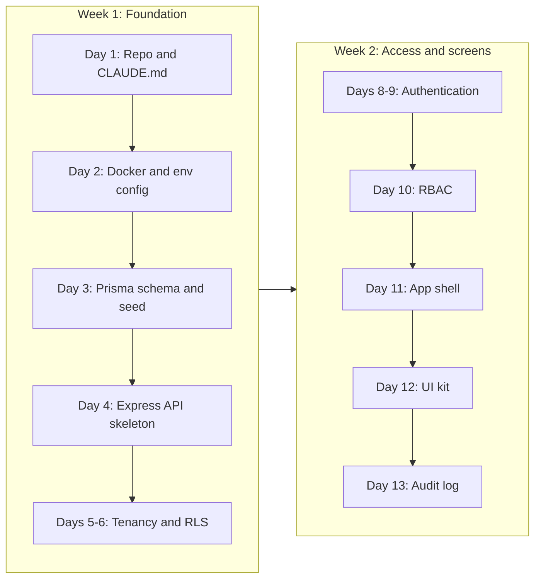

# Daily Plan: Days 1 to 14

**In simple words:** This chapter tells you exactly what to do on each of the first 14 days of the 60-day sprint, from Monday 5 October to Sunday 18 October 2026. Week 1 builds the foundation: the repository, the database, the API skeleton and the multi-tenancy layer (the code that keeps each institute's data separate). Week 2 builds login, permissions, the web app shell and the reusable screen parts. Every working day also has one small sales task, because a finished product with zero pilot institutes on Day 45 is a failed sprint.

## How to read a day

Every day in this chapter has the same seven blocks. Read the whole day in the morning before you open Claude Code. It takes five minutes and saves an hour.

| Block | What it tells you |
|---|---|
| Goal | The one sentence that must be true by the evening |
| Build tasks | 5 to 9 concrete steps, with the spec files to read and rough hours |
| Claude Code prompts to run today | Prompt IDs from Part III, plus small follow-up prompts written out in full |
| Manual test checklist | Checks you do yourself in the browser, terminal or an API client |
| Sales and customer task | One action with a number target, 30 to 120 minutes |
| Deliverable and commit | What must be merged into `main`, with an example commit message |
| If you are behind | What to cut today so that tomorrow still starts on time |

The full text of every prompt (P-01 to P-60) is in Part III. This chapter only tells you which prompt to run on which day and what to check afterwards. How to talk to Claude Code, how to review its plan and how to reject bad output is covered in *Working with Claude Code*. The week-level view is in *60-Day Roadmap Overview and Weekly Milestones*.

### The shape of a working day

The sprint rhythm is about 6 focused build hours, 2 sales hours and 30 minutes of review. The timetable below is the sample day from *How to Use This Blueprint*, filled with what happens in these two weeks. Move the blocks if your life needs it, but keep the sales block in the late morning. Coaching owners are usually free between the morning batches and the evening batches.

| Time | Block | Hours | What happens |
|---|---|---|---|
| 07:30–10:30 | Build block one | 3.0 | Read the day's page, run the main prompt in plan mode, review the plan, review the diff |
| 11:00–13:00 | Sales block | up to 2.0 | Lead list, calls, WhatsApp follow-ups, notes in the sheet |
| 14:00–17:00 | Build block two | 3.0 | Follow-up prompts, tests, fixes, manual checklist, merge |
| 17:00–17:30 | Review | 0.5 | Fill the daily log, move the Kanban card, read tomorrow's page |

The hours next to the build tasks are estimates for you plus Claude Code, including the time to read the plan and the diff. They add up to about 6 hours. Claude Code writes fast, but you still read every changed line, and reading is the slow part.

### Five rules for these two weeks

1. **One prompt, one branch, one pull request.** A pull request (PR — a page on GitHub that shows all changes of one branch before they enter `main`) is your only code review. You are the reviewer. Branch names and PR steps are in *Git Workflow: Branches, Commits and Pull Requests*.
2. **Plan first.** Switch Claude Code to plan mode (`Shift+Tab`) and ask for its plan before it writes code. Approve, correct or reject the plan. Ten minutes here prevents three hours of cleanup. Type `/clear` between two prompts, so that yesterday's context does not leak into today's task.
3. **`main` is green every evening.** `npm run check` (lint + type check + tests) must pass before you merge. If it does not pass by 17:00, do not merge. Use the "If you are behind" block.
4. **The spec wins.** If the code and a file in `docs/prd/` disagree, fix the code. If the spec is wrong, fix the spec in the same PR and say so in the PR text.
5. **No hidden doors.** Do not add temporary shortcuts such as "accept the organization id from a header for now". Temporary security holes become permanent ones.

> **Note:** Assumptions used in this chapter. The API runs on `http://localhost:4000` and the client on `http://localhost:3000`. The Docker Compose services are named `postgres` and `redis`, with database user `eduflow` and database `eduflow_dev`. Demo login emails use the `.example` domain. If *Local Development Setup* or your generated files use other values, those values win. Just replace them in the commands below.

> **Tip:** On Windows, run the `curl` commands of this chapter in Git Bash. In Windows PowerShell, `curl` is an alias for another command and the examples will fail. You can also use an API client (an app that sends HTTP requests for you) such as Postman or Bruno.

## Overview of Days 1 to 14

| Day | Date (2026) | Goal | Prompts | Sales task | Merged by evening |
|---|---|---|---|---|---|
| 1 | Mon 5 Oct | Monorepo skeleton and CLAUDE.md | P-01, P-02 | Lead sheet, first 10 rows | Repo boots, docs copied |
| 2 | Tue 6 Oct | PostgreSQL, Redis, validated env config | P-03 | 20 coaching rows (30 total) | `docker compose up` works |
| 3 | Wed 7 Oct | Prisma schema, first migration, seed data | P-04 | 20 coaching rows (50 total) | Seeded database |
| 4 | Thu 8 Oct | Express API skeleton | P-05 | 20 coaching rows (70 total) | Health route, error envelope |
| 5 | Fri 9 Oct | Tenant context and Prisma extension | P-06 (part one) | 15 school rows (85 total) | Tenant-safe Prisma client |
| 6 | Sat 10 Oct | PostgreSQL RLS and isolation tests | P-06 (part two) | 15 school rows (100), grade the list | Isolation test suite green |
| 7 | Sun 11 Oct | Rest and weekly review | None | Count the numbers | Review file, tag `m1-foundation` |
| 8 | Mon 12 Oct | Login, refresh rotation, logout | P-07 (part one) | First 10 calls (10 contacted) | Password login works |
| 9 | Tue 13 Oct | Password reset, OTP login, invitations | P-07 (part two) | 10 calls (20 contacted) | Full auth API |
| 10 | Wed 14 Oct | RBAC and campus scoping | P-08 | 10 calls (30 contacted) | Permission middleware |
| 11 | Thu 15 Oct | Next.js app shell | P-09 | 10 calls (40 contacted) | Login in the browser |
| 12 | Fri 16 Oct | Reusable UI kit | P-10 | 2 visits, call-backs, 5 talks booked | Roles and Users pages |
| 13 | Sat 17 Oct | Audit log and Week 2 hardening | P-22 | Confirm bookings, question sheet | Activity Log page |
| 14 | Sun 18 Oct | Rest and weekly review | None | Count the numbers | Review file, tag `m2-login-rbac` |

**Figure: Build order of the first two weeks**



Each box needs the box before it. You cannot test login without a seeded user, and you cannot trust any module without the tenancy layer. This is why the first customer-visible screen appears only on Day 11. Do not change the order.

> **Founder note:** These two weeks feel slow because nothing looks like a school ERP yet. That is normal. Every module from Day 15 onward (Organizations, Batch, Fees, Attendance) is fast only because tenancy, auth, permissions and the UI kit already exist. Foundation work is the cheapest in Week 1 and the most expensive in Week 6.

## Week one: foundation

Theme from the sprint skeleton: **repo, database, API skeleton, multi-tenancy**. Prompts P-01 to P-06. The week ends with milestone M1 "Foundation done" and the Git tag `m1-foundation`.

Sales milestone for the week, from *60-Day Roadmap Overview and Weekly Milestones*: **a list of 100 local institutes**, about 70 coaching institutes and 30 private schools. You contact nobody yet. The list needs no product, so there is no excuse to skip it. At about 17 new rows a day, six working days are enough.

| Day | New rows | Running total | Kind of rows |
|---|---|---|---|
| 1 | 10 | 10 | People you already know |
| 2 | 20 | 30 | Coaching institutes, Patna |
| 3 | 20 | 50 | Coaching institutes, Lucknow |
| 4 | 20 | 70 | Coaching institutes, both cities |
| 5 | 15 | 85 | Private schools |
| 6 | 15 | 100 | Private schools, then clean and grade the list |

> **Note:** Patna and Lucknow are the canon's sample cities. Use your own city and the towns you can reach within two hours. A pilot institute that you can visit in person is worth five that you cannot.

### Day 1 — Monday, 5 Oct 2026: Monorepo skeleton and CLAUDE.md

**Goal:** One Git repository that installs, lints, type-checks and starts with one command, and carries all product specs inside `docs/`.

**Build tasks**

1. Check your tools and accounts (30 min): Node.js 24, npm, Git, Docker Desktop, Claude Code, GitHub CLI. Install steps are in *Local Development Setup*. Register the `eduflow.app` domain and create the Vercel, Railway and Sentry accounts if they do not exist yet. None of them needs an approval. Skim `04-system-architecture.md` in your PRD folder and the chapter *Folder Structure*, so you know what a correct skeleton looks like.
2. Create a private GitHub repository named `eduflow`. Clone it. Create the branch `feat/p01-monorepo-skeleton` (15 min).
3. Run P-01 (about 2 h with review). Expected result: `client/` (Next.js App Router, TypeScript, Tailwind CSS), `server/` (Node.js and TypeScript; Express arrives on Day 4), `shared/` (Zod schemas and types used by both sides), npm workspaces in the root `package.json`, one ESLint setup, one Prettier config, `.nvmrc` with `24`, `.editorconfig` and `.gitignore`.
4. Check that the root scripts in the table below exist and work (30 min).
5. Open PR one, read the diff, merge. Create the branch `docs/p02-claude-md-and-specs`.
6. Run P-02 (about 1.5 h). It writes `CLAUDE.md` and copies the specs: `_canon.md` becomes `docs/canon.md`, PRD chapters go to `docs/prd/`, the Prisma files go to `docs/schema/`, the endpoint registry goes to `docs/api/`, and `_permissions.md` becomes `docs/permissions.md`.
7. Read `CLAUDE.md` line by line (30 min). Claude Code reads this file at the start of every session. It must state the stack versions, the folder layout, the six multi-tenancy rules, the API envelope, the naming rules, the commands and a short "never do this" list. Keep it under about 200 lines. Long files get ignored, by people and by models.
8. Protect `main` on GitHub: require a pull request before merging (10 min). You are solo, but the PR page is where you really read the diff.
9. Create two small things for tracking (10 min): the file `docs/progress.md`, where Claude Code writes its handoff note at the end of a session (see *Working with Claude Code*), and the folder `docs/reviews/`, which gets one weekly review file every Sunday. Your daily log stays outside the repository, as *How to Use This Blueprint* explains, because it holds customer names and phone numbers.

| Root script | What it must do |
|---|---|
| `npm run dev` | Start the API and the client together in watch mode |
| `npm run lint` | Run ESLint on all three workspaces |
| `npm run typecheck` | Run `tsc --noEmit` in all three workspaces |
| `npm run test` | Run Vitest in every workspace (zero tests is fine today) |
| `npm run build` | Build `shared`, then `server`, then `client` |
| `npm run check` | Run lint, typecheck and test in one go: your "may I merge?" button |

```bash
node -v                       # must print v24.x
git clone git@github.com:YOUR-USER/eduflow.git
cd eduflow
git switch -c feat/p01-monorepo-skeleton
# run P-01 in Claude Code, review the plan, review the diff, then:
npm install
npm run check
npm run dev
```

**Claude Code prompts to run today:** P-01, then P-02. Follow-up prompt after P-01:

```text
Add a root script "check" that runs lint, typecheck and test for all
workspaces and stops at the first failure. Then run it and fix every
error you find. Do not disable any ESLint rule to make it pass.
```

**Manual test checklist**

- Delete `node_modules`, run `npm install` at the root. It finishes without errors. There is one `package-lock.json`, at the root only.
- `npm run check` passes.
- `npm run dev` starts both apps. `http://localhost:3000` shows the Next.js start page.
- Export a small type from `shared/`, import it in `client/` and in `server/`, and run `npm run typecheck`. It passes. This proves the workspaces are linked.
- Add an unused variable on purpose. `npm run lint` fails. Remove it.
- Open a new Claude Code session and ask: "What are the multi-tenancy rules of this project?" It answers correctly from `CLAUDE.md`, without you pasting anything.
- `git status` shows no `.env` file and no `node_modules` folder as tracked.

**Sales and customer task of the day (60 minutes):** Create the Google Sheet "EduFlow Leads" with these ten columns: institute name, type (coaching or school), area, owner name, phone or WhatsApp, approximate students, current tool (register, Excel or a software name), source, status, next action date. How to pick the right institutes is explained in *Sales Foundation and Lead Generation*. Fill the first 10 rows with institutes where you already know somebody: an owner, a manager, a teacher, your old tuition teacher. These friendly rows will be your first calls on Day 8. Install WhatsApp Business on a separate number and set the business name to EduFlow. Target: sheet live, 10 rows, WhatsApp Business ready.

**Deliverable and commit:** Two PRs merged into `main`. We use Conventional Commits (a simple message format: `type(scope): summary`).

```text
chore(repo): create monorepo skeleton with npm workspaces
docs(repo): add CLAUDE.md and copy product specs into docs/
```

**If you are behind:** Skip ESLint and Prettier fine-tuning and accept the defaults; *Coding Standards* can tighten them later. Skip branch protection until Sunday. Never skip reading `CLAUDE.md`. A wrong line there repeats itself in every prompt for 59 days.

### Day 2 — Tuesday, 6 Oct 2026: PostgreSQL, Redis and validated configuration

**Goal:** PostgreSQL 16 and Redis 7 run locally with one command, and the server refuses to start when a required environment variable is missing or wrong.

**Build tasks**

1. Start Docker Desktop. Check `docker --version` and `docker compose version` (10 min).
2. Create the branch `feat/p03-docker-and-env`. Run P-03 (about 2 h with review).
3. Review the generated `docker-compose.yml` against this list: image `postgres:16`, image `redis:7`, named volumes for both (data survives a restart), a health check for both, ports 5432 and 6379 bound to localhost, and no production secrets in the file.
4. Review `server/src/config/env.ts`. It must parse `process.env` with one Zod schema, export one typed `env` object, and be the only place in the server that reads `process.env`. It needs at least `NODE_ENV`, `PORT`, `DATABASE_URL`, `REDIS_URL` and the two JWT secrets. The full list is in *Environment Variables and Command Reference*.
5. Check the fail-fast behaviour (30 min). Fail fast means: the app stops at start-up with a clear message, instead of crashing later in the middle of a request.
6. Commit `.env.example` files for `server/` and `client/` with safe sample values. Confirm that real `.env` files are git-ignored.
7. Add a small connection check script (for example `npm run db:ping -w server`) that connects to PostgreSQL and Redis and prints OK. You will reuse it inside the health route on Day 4 (45 min).
8. Write the start and stop commands into `CLAUDE.md` under "Commands" (10 min).

```bash
docker compose up -d
docker compose ps             # both services must show "healthy"
docker compose exec postgres psql -U eduflow -d eduflow_dev -c "select version();"
docker compose exec redis redis-cli ping      # must print PONG
docker compose down           # stops containers, keeps the data volumes
```

**Claude Code prompts to run today:** P-03. Follow-up prompt:

```text
Start the API with DATABASE_URL removed from server/.env and show me the
exact error message. It must name the missing variable and exit with
code 1. Then set PORT=abc and show me that error too. Restore the file.
```

**Manual test checklist**

- `docker compose ps` shows `postgres` and `redis` as healthy.
- The `psql` command above prints "PostgreSQL 16".
- `redis-cli ping` prints `PONG`.
- Remove `DATABASE_URL` from `server/.env` and start the server. It exits within two seconds and names the variable. Put it back.
- Run `docker compose down`, then `docker compose up -d`. A test table you created before is still there, so the volume works.
- Search the server code for `process.env`. It appears only in `config/env.ts`.

**Sales and customer task of the day (90 minutes):** Add 20 coaching institutes from Patna to the lead sheet. Use Google Maps and Justdial with searches such as "JEE coaching", "NEET coaching" and "class 10 tuition". Pick institutes that look like Sharma Classes: 100 to 500 students, one to three branches, owner-run. Note the owner's name when the listing or the signboard photo shows it. Skip the big national chains. They buy software from a head office, not from you. Target: 30 rows in total, every row with a phone number.

**Deliverable and commit:** PR merged. A fresh clone plus `docker compose up -d` gives a working database and cache.

```text
feat(server): add docker compose for postgres and redis with zod env config
```

**If you are behind:** Drop the `db:ping` script; Day 4 will create the health route anyway. If Docker Desktop itself still does not work after three lost hours, do not fight it today. Install PostgreSQL 16 and Redis directly on your machine, or use a small Railway PostgreSQL and Redis for development. Write the decision into `CLAUDE.md` and fix Docker in the catch-up slot on Saturday. You need it again in *Docker and CI/CD*.

### Day 3 — Wednesday, 7 Oct 2026: Prisma schema, first migration and seed data

**Goal:** The full EduFlow schema exists as real tables, and one command fills the database with plans, permissions, the seven system roles and two demo organizations.

**Build tasks**

1. Pre-read `docs/prd/50-database-design-overview.md` and skim `docs/prd/51-data-dictionary-platform-and-people.md` (20 min). Create the branch `feat/p04-prisma-schema-and-seed`. Pin one exact Prisma 6.x version for both `prisma` and `@prisma/client` (no `^` in `package.json`), as the canon requires.
2. Run P-04 (about 3 h with review). It copies `docs/schema/*.prisma` into `server/prisma/schema/` and points Prisma to that folder. Do not let Claude Code "improve" the models. The schema is already validated. Changes come only through the spec.
3. Run `npx prisma validate`, then create the first migration named `init`.
4. Read the schema comments that mention "partial unique index" (for example on `users` and `roles`, where `organization_id` is null for platform rows). Prisma cannot express these. Ask Claude Code to add them in a second, hand-written SQL migration created with `--create-only`.
5. Review the seed script. It must create: 4 plans (`STARTER`, `GROWTH`, `PRO`, `ENTERPRISE`) with canon prices in INR, USD, AUD and AED; all permission keys from `docs/permissions.md`; the 7 system roles with their permissions; reference countries and currencies.
6. The seed must also create two demo tenants (a tenant is one customer organization): "Bright Future Public School" (type `SCHOOL`, Lucknow, 2 campuses) and "Sharma Classes" (type `COACHING`, Patna, 1 campus). You need two tenants to test data isolation on Days 5 and 6.
7. Demo users in Bright Future: Rajesh Sharma (`ORG_ADMIN`), Dr. Anita Verma (`PRINCIPAL`), Priya Nair (`TEACHER`), Suresh Gupta (`ACCOUNTANT`), Sunita Devi (`PARENT`), Aarav Sharma (`STUDENT`). Add one `ORG_ADMIN` in Sharma Classes and one `SUPER_ADMIN` platform user. All share one demo password that the seed prints at the end.
8. Make the seed idempotent (safe to run twice with the same result). Use the follow-up prompt below (45 min).

```bash
cd server
npx prisma validate
npx prisma migrate dev --name init
npx prisma migrate dev --create-only --name partial_unique_indexes
# review and complete the SQL file, then apply it:
npx prisma migrate dev
npx prisma db seed
npx prisma studio            # opens a table browser in your web browser
```

> **Note:** P-04 stores the schema folder path in the Prisma configuration, so the commands need no extra flag. If Prisma says it cannot find a schema, pass the folder by hand: `npx prisma validate --schema prisma/schema`. In recent Prisma 6 releases, the `migrations` folder of a multi-file schema must sit next to the `.prisma` file that holds the `datasource` block (`00-base.prisma`). Check the "multi-file Prisma schema" page of the Prisma docs for the exact version you pinned.

**Claude Code prompts to run today:** P-04. Follow-up prompt:

```text
Make the seed script idempotent: running "npx prisma db seed" twice must
not create duplicate plans, permissions, roles, organizations or users.
Use upsert on the natural unique keys. Run the seed twice and show me
the row counts of those five tables after each run.
```

**Manual test checklist**

- In Prisma Studio, `plans` has 4 rows. In `plan_prices`, the Growth plan has an INR monthly price of 2499.00 and a yearly price of 24990.00.
- `roles` has 7 rows where `organization_id` is empty and `is_system` is true.
- `organizations` has 2 rows. `campuses` has 3 rows.
- `users` contains Rajesh Sharma, and `password_hash` starts with `$2` (a bcrypt hash), never a readable password.
- Run the SQL check below. The result lists only platform-level tables such as `countries`, `currencies`, `plans`, `plan_prices`, `plan_features`, `permissions`, `organizations` and `_prisma_migrations`. If a business table such as `students` or `fee_invoices` shows up, stop and check the schema.
- Run `npx prisma migrate reset` and seed again. Everything comes back with the same counts.

```sql
SELECT t.table_name
FROM information_schema.tables t
WHERE t.table_schema = 'public'
  AND t.table_type = 'BASE TABLE'
  AND NOT EXISTS (
    SELECT 1 FROM information_schema.columns c
    WHERE c.table_schema = 'public'
      AND c.table_name = t.table_name
      AND c.column_name = 'organization_id'
  )
ORDER BY t.table_name;
```

**Sales and customer task of the day (90 minutes):** Add 20 coaching institutes from Lucknow. Open the Google reviews of each institute for two minutes. Parents often write the real pains there: "no fee receipt", "nobody informs us when the class is cancelled", "attendance is never shared". Copy one such line into the notes column. It becomes your opening sentence when you call in Week 2. Target: 50 rows in total.

**Deliverable and commit:** PR merged. `migrate reset` plus seed works on a clean database.

```text
feat(db): install prisma schema, init migration and idempotent seed data
```

**If you are behind:** Cut the second demo tenant's extra users and the country list down to India, UAE, USA and Australia. Do not cut the second tenant itself, the 7 roles or the permission keys. If the migration fails on one model, do not edit the model by guesswork. Paste the exact error into Claude Code and ask for the smallest fix, then record the change in `docs/schema/` too.

### Day 4 — Thursday, 8 Oct 2026: Express API skeleton

**Goal:** An Express 5 API answers on `/api/v1` with the canon's success and error envelopes, a request ID on every response, structured logs and an OpenAPI page.

**Build tasks**

1. Pre-read `docs/prd/55-api-standards-and-conventions.md` and `docs/prd/92-appendix-error-codes.md` (20 min). Create the branch `feat/p05-api-skeleton`.
2. Run P-05 (about 3 h with review). Expected parts: app factory (`createApp()`, so tests can start the app without a port), response helpers for the success envelope and list `meta`, an `AppError` class with the canon error codes, one central error handler, a 404 handler, a request ID middleware, Pino logging that prints the request ID on every line, a Zod `validate()` middleware, security headers, CORS for `http://localhost:3000` with credentials, and a JSON body size limit.
3. Add the health route `GET /api/v1/health`. It checks PostgreSQL and Redis and returns the success envelope. If a dependency is down, it returns `SERVICE_UNAVAILABLE` (503).
4. Add OpenAPI (Swagger) docs. Generate them from the Zod schemas in `shared/`, so that docs and validation never drift apart. Serve the page under `/api/v1/docs` in development only.
5. Add graceful shutdown (30 min): on `SIGTERM`, stop taking new requests, finish open ones, close Prisma and Redis. Railway and AWS both send `SIGTERM` on every deploy.
6. Add the global rate limiter with the canon limits (100 requests per minute per user; per IP until login exists). Store counters in Redis, not in memory, because production runs more than one API instance.
7. Write the four envelope tests from the follow-up prompt (Vitest plus Supertest) (1 h).
8. Add a short "How to add a new route" section to `CLAUDE.md`: router, Zod schema in `shared/`, service, response helper, test. Every module prompt from Day 15 onward depends on this pattern.

```bash
curl -i http://localhost:4000/api/v1/health
curl -i http://localhost:4000/api/v1/does-not-exist
```

The second command must return status 404 and this body shape:

```json
{
  "success": false,
  "error": { "code": "NOT_FOUND", "message": "Route not found", "details": [] },
  "requestId": "req_8f3a2c1e"
}
```

**Claude Code prompts to run today:** P-05. Follow-up prompt:

```text
Write Supertest tests for the API skeleton: (1) GET /api/v1/health
returns the success envelope, (2) an unknown route returns NOT_FOUND
with a requestId, (3) a Zod validation failure returns VALIDATION_ERROR
with a details array of field and issue, (4) an unexpected throw returns
INTERNAL_ERROR and never leaks the stack trace in the response body.
```

**Manual test checklist**

- `GET /api/v1/health` returns 200 with `"success": true`.
- Stop Redis with `docker compose stop redis`. The health route now returns 503 with code `SERVICE_UNAVAILABLE`. Start Redis again.
- An unknown route returns the 404 body above, with a `requestId` that starts with `req_`.
- Copy that `requestId` and search the server terminal. The same ID is in the log line.
- Send a POST with broken JSON (for example `{"a":`). You get 400 `VALIDATION_ERROR`, not a 500 and not an HTML page.
- `http://localhost:4000/api/v1/docs` opens and lists the health route.
- Press Ctrl+C on the server. The log says that it closed the database and Redis connections.

**Sales and customer task of the day (90 minutes):** Add 20 more coaching institutes, from the areas of both cities that you have not covered yet. This completes the coaching part of the list. For every institute, check if it has a website or an app link in its listing. Write the name of the current tool when you can see one (for example Teachmint or Classplus), or "register or Excel (guess)" when you see nothing. Target: 70 rows in total.

**Deliverable and commit:** PR merged with four passing envelope tests.

```text
feat(api): add express skeleton with envelope, errors and request id
```

**If you are behind:** Move OpenAPI generation and graceful shutdown to Saturday. Keep the envelope, the error handler, the request ID and the tests. Every later prompt assumes these four things exist.

### Day 5 — Friday, 9 Oct 2026: Tenant context and the Prisma extension

**Goal:** Application code can no longer read or write another organization's rows by mistake, because the Prisma client adds `organizationId` to every query by itself.

**Build tasks**

1. Pre-read `docs/prd/05-multi-tenancy-and-data-isolation.md` and the six multi-tenancy rules in `docs/canon.md` (30 min). This is the most important spec of the whole sprint. Read it slowly.
2. Create the branch `feat/p06a-tenant-context`. Start P-06 in plan mode with the first follow-up prompt below. Approve the plan only when it covers every point of tasks 3 to 6 (45 min).
3. Tenant context (1 h): a small module built on Node's `AsyncLocalStorage` (a built-in way to carry values such as `orgId` through one request without passing them to every function). It exposes `runWithTenant(context, fn)` and `getTenant()`. The context holds `orgId`, `userId`, `campusIds` and `requestId`.
4. Prisma client extension (2 h): for every tenant model, add `organizationId` to the `where` of reads, updates, deletes, counts and aggregates, and set it in the `data` of creates. If there is no tenant context, throw an error. Never run the query unscoped.
5. Exempt list: platform-level models only (`Plan`, `PlanPrice`, `PlanFeature`, `Permission`, `Country`, `Currency`, and `Organization` itself, which is filtered by `id`).
6. Nullable cases: eleven models allow a null `organizationId`, and they fall into two groups. Shared rows that every tenant may read but never edit: `Role` and `RolePermission` (the seven system roles) and `NotificationTemplate` (system default templates). Platform or not-yet-resolved rows that a tenant must never see: `User`, `UserRole`, `RefreshToken`, `OtpCode`, `PasswordResetToken`, `LoginHistory`, `AuditLog` and `WebhookEvent`. The extension adds "or organization is null" to reads only for the first group.
7. Platform access: one explicit helper, for example `runAsPlatform(reason, fn)`, used only by the seed, migrations, background maintenance jobs and the Super Admin console. It logs the reason every time it runs.
8. Tests (1.5 h). The HTTP layer has no login yet, so test through code: call `runWithTenant()` directly inside Vitest. Do not add a header that selects the tenant.

**Claude Code prompts to run today:** P-06, first half. Follow-up prompts:

```text
Before writing code, read docs/canon.md and
docs/prd/05-multi-tenancy-and-data-isolation.md and show me your plan:
which Prisma operations you will intercept, how you treat the models
whose organizationId is nullable (shared rows such as system roles
versus platform rows such as SUPER_ADMIN users), and the list of
platform-level models that are exempt. Wait for my approval.
```

```text
Add a test that reads the Prisma model list at runtime and fails if any
model that has an organizationId field is missing from the tenant-scoped
list. A new table must never skip tenant filtering by accident.
```

**Manual test checklist**

Today's checks are automated tests that you run and read. Open the test file and make sure each case really exists.

- Create a `Course` as Bright Future. Reading it by `id` as Sharma Classes returns `null`.
- Updating or deleting that course as Sharma Classes changes 0 rows or throws `NOT_FOUND`. The row is unchanged.
- A create call that passes another `organizationId` in `data` is overwritten with the context's organization, or rejected. It is never saved as sent.
- Any tenant-model query outside `runWithTenant()` throws a clear error such as "Tenant context missing".
- `findMany` on `Role` as Sharma Classes returns the 7 system roles plus its own custom roles, and nothing from Bright Future.
- `findMany` on `User` as Sharma Classes never returns the `SUPER_ADMIN` platform user.
- The guard test fails when you comment out one model from the tenant list. Put it back.

**Sales and customer task of the day (90 minutes):** Add 15 K-12 private schools to the lead sheet. Look for schools like Bright Future Public School: 300 to 1,500 students, private management, a visible phone number, and a weak or missing parent app. For schools, the owner name is often a trust or a society, so also note the name of the principal or the office manager. Then spend 15 minutes on one learning chat with a parent or a teacher you know. Ask only one thing: "School ya coaching se fees aur attendance ki jaankari aap tak kaise pahunchti hai?" Write the answer in your daily log. Target: 85 rows in total, 1 learning chat.

**Deliverable and commit:** PR merged with the extension, the context module and the tests.

```text
feat(tenancy): add tenant context and prisma organization scoping
```

**If you are behind:** Skip `runAsPlatform()` polish and the `campusIds` part of the context; Day 10 adds campus scoping anyway. Do not skip the "no context means error" rule or the guard test. If the plan review alone took the whole morning, that is fine. A correct plan today is worth more than fast code.

> **Warning:** Do not accept an extension that filters only `findMany`. The dangerous calls are `findUnique`, `update`, `delete`, `upsert`, `updateMany`, `deleteMany`, `count`, `aggregate` and `groupBy`. Ask Claude Code to show you a test for each one.

### Day 6 — Saturday, 10 Oct 2026: PostgreSQL row-level security and isolation tests

**Goal:** Even a raw SQL query or a future bug in the Prisma extension cannot cross tenants, because PostgreSQL itself blocks the rows.

**Build tasks**

1. Create the branch `feat/p06b-rls-and-isolation-tests`. Continue P-06, second half.
2. Two database roles (45 min). Row-Level Security (RLS — PostgreSQL filters rows by a policy on every query) does not apply to superusers, and table owners skip it unless you force it. So create a runtime role `eduflow_app` that is not a superuser and does not own the tables. Migrations and the seed keep using the owner role. The API's `DATABASE_URL` uses `eduflow_app`. A separate URL for migrations uses the owner.
3. One SQL migration enables and forces RLS on every table that has `organization_id`, with one policy per table (example below). Let Claude Code generate the table list from the Prisma schema, not by hand.
4. Set the tenant per transaction (1.5 h). The extension from Day 5 must run each tenant query inside a transaction that first calls `set_config('app.current_org', orgId, true)`. The `true` makes the value local to that transaction. This matters because pooled connections are shared between requests.
5. Nullable tables: only the shared tables from Day 5 (`roles`, `role_permissions`, `notification_templates`) get a read policy that also allows rows where `organization_id IS NULL`. Their write policy does not allow it. Platform rows in `users`, `user_roles` and the token tables stay invisible to every tenant.
6. Platform bypass: follow the rule in `docs/prd/05-multi-tenancy-and-data-isolation.md`. Keep it to one narrow, logged path. A Super Admin acting on one tenant with `X-Organization-Id` goes through the normal policy.
7. Build the isolation test suite (1.5 h): for every tenant model that has seed data, read as tenant A and as tenant B, and assert zero overlap. Add one raw SQL test.
8. Catch-up slot (1 h): OpenAPI or graceful shutdown if they slipped from Day 4, or the Docker fix if you worked around it on Day 2.

```sql
ALTER TABLE campuses ENABLE ROW LEVEL SECURITY;
ALTER TABLE campuses FORCE ROW LEVEL SECURITY;

CREATE POLICY tenant_isolation ON campuses
  USING (organization_id = NULLIF(current_setting('app.current_org', true), '')::uuid)
  WITH CHECK (organization_id = NULLIF(current_setting('app.current_org', true), '')::uuid);
```

When the setting is missing or empty, the comparison gives NULL, so the query returns zero rows. That is the safe default: no tenant, no data.

**Claude Code prompts to run today:** P-06, second half. Follow-up prompt:

```text
Create one SQL migration that enables and forces row-level security on
every table that has organization_id, with one policy per table that
compares organization_id to the app.current_org setting. Generate the
table list from the Prisma schema, not by hand. Add an integration test
that connects with the runtime database role and proves that a raw SQL
query without app.current_org returns zero rows.
```

**Manual test checklist**

Connect as the runtime role and try to break isolation by hand:

```bash
docker compose exec postgres psql -U eduflow_app -d eduflow_dev
```

```sql
SELECT count(*) FROM campuses;                -- expect 0: no tenant is set
BEGIN;
SELECT set_config('app.current_org', 'PASTE-BRIGHT-FUTURE-ORG-ID', true);
SELECT count(*) FROM campuses;                -- expect 2: Bright Future only
SELECT count(*) FROM campuses
WHERE organization_id <> 'PASTE-BRIGHT-FUTURE-ORG-ID';  -- expect 0
COMMIT;
SELECT count(*) FROM campuses;                -- expect 0 again
```

- The four counts match the comments above. The seed created 2 campuses for Bright Future and 1 for Sharma Classes, so the second count must be 2, not 3.
- `SELECT rolsuper FROM pg_roles WHERE rolname = 'eduflow_app';` returns `f` (false).
- Inside a transaction with Bright Future set as the tenant, an `UPDATE` on a Sharma Classes campus changes 0 rows, and an `INSERT` with the Sharma Classes organization ID fails with a row-level security error.
- `npm run test` shows the isolation suite, and it is green.
- `npm run dev` still works, and the health route still returns 200 with the new runtime role.
- `npx prisma migrate reset` followed by the seed still works with the owner URL.

**Sales and customer task of the day (90 minutes):** Add the last 15 private schools, so the list reaches 100 rows (about 70 coaching institutes and 30 schools). Then clean the list for 30 minutes: delete duplicates, fix phone numbers that miss a digit, and fill empty "area" cells. Grade every row in the status column: A (owner-run, 100 to 500 students, close to you), B (fits, but far away or larger) or C (weak fit). Mark the 40 rows you will contact in Week 2: the 10 friendly rows first, then the best A rows. Target: 100 clean rows, 40 marked for Week 2.

**Deliverable and commit:** PR merged. The isolation suite runs inside `npm run check`.

```text
feat(tenancy): enforce postgres row-level security with isolation tests
```

**If you are behind:** Finish the Day 5 extension and its tests first. They are the first safety net, and they must be merged before Sunday. The RLS migration may slip, but to Day 9 at the latest. Open a GitHub issue named "RLS before Week 3" today, so that the gap is visible. Never start Week 3 without RLS on every tenant table. Do not postpone the runtime role `eduflow_app`. Switching the database user later breaks more things than doing it now.

> **Best practice:** From today, add one line to every module PR description: "Isolation: tested with Bright Future and Sharma Classes." If you cannot write that line truthfully, the PR is not ready.

### Day 7 — Sunday, 11 Oct 2026: Rest and weekly review

**Goal:** Rest, look honestly at Week 1, and start Monday with a written plan.

**Build tasks:** None. No new features today. If something from Week 1 is unmerged, you may spend at most 3 hours to close it. If it needs more, it moves into Week 2 and something else gets cut.

**Weekly review (60 minutes)**

| Minutes | Topic | Question to answer |
|---|---|---|
| 0–10 | Demo to yourself | Does a fresh clone reach a seeded database and a green `npm run check`? Record it as a 2-minute screen video |
| 10–25 | Plan versus actual | Which day slipped, by how many hours, and why? |
| 25–35 | Sales numbers | How many rows, how many A rows? Which 40 will you contact first? |
| 35–45 | Risks and long waits | Which account or approval could block a future week? |
| 45–60 | Plan Week 2 | Write the six daily goals into the review file; skim the specs for Monday |

Write the review with the template from *60-Day Roadmap Overview and Weekly Milestones* and save it as `docs/reviews/week-01.md`. If the demo passed, create the milestone tag:

```bash
git switch main
git pull
npm run check
git tag -a m1-foundation -m "M1 Foundation done - Day 7 - 11 Oct 2026"
git push origin m1-foundation
```

**Long-wait items to start today (30 minutes, forms only):** Some approvals take days or weeks, and the roadmap says to start two of them by Day 8. Start the Razorpay account and its KYC (the identity check of your business; needed for live payments from Day 45). Start Meta business verification for the WhatsApp Cloud API (needed by Day 43). Company and bank details for these forms are covered in *Company Setup, Legal and Finance Basics*.

**Claude Code prompts to run today:** None.

**Manual test checklist:** Run the Week 1 checkpoint table below from top to bottom. Mark each row as done, done with gaps, or missed.

**Sales and customer task of the day (15 minutes):** No calls. Count the list: total rows, A rows, rows without an owner name. Read the parent reviews you copied on Day 3 and pick the three pains that appear most often. They become the first lines of your calls on Monday.

**Deliverable and commit:** The review file, the tag and the video.

```text
docs(reviews): add week 1 review and week 2 plan
```

**If you are behind:** If two or more checkpoint rows are not done, do not start P-07 on Monday. Finish the tenancy layer first and compress Week 2 by merging Days 8 and 9: password login, refresh, logout and invitations first; password reset and OTP login move to Day 13. How to count "days behind" and how to cut scope calmly is described in *60-Day Roadmap Overview and Weekly Milestones*.

### Week 1 checkpoint

| Milestone | Demo-able outcome | Definition of done |
|---|---|---|
| Repository and specs | A fresh clone starts the client and the API with `npm run dev` | `npm run check` is green on `main`; `CLAUDE.md` and `docs/` are committed |
| Local services | PostgreSQL 16 and Redis 7 run in Docker | Both healthy in `docker compose ps`; missing env variable stops the server |
| Database | Full schema migrated; seed creates 4 plans, 7 system roles, 2 demo tenants | `migrate reset` plus seed works twice with no duplicates |
| API skeleton | Health route and error envelope with request ID | Four envelope tests pass; OpenAPI page opens |
| Multi-tenancy | Test shows Sharma Classes cannot see Bright Future data | Prisma extension, guard test and RLS suite green; runtime role is not superuser |
| Milestone M1 | 2-minute screen video of the Week 1 demo | Tag `m1-foundation` pushed; `docs/reviews/week-01.md` committed |
| Sales | Lead sheet with 100 institutes, graded A, B or C | About 70 coaching and 30 schools; every row has a phone number; 40 rows marked for Week 2 |

## Week two: access and screens

Theme from the sprint skeleton: **auth, RBAC, app shell, UI kit**. Prompts P-07 to P-10 and P-22. The week ends with milestone M2 "Login + RBAC" and the Git tag `m2-login-rbac`.

Sales milestone for the week, from *60-Day Roadmap Overview and Weekly Milestones*: **40 institutes contacted and 5 discovery conversations booked for Week 3**. "Contacted" means that the owner or manager got a call or a personal WhatsApp message from you. A discovery conversation is a 15 to 20 minute talk where you only ask questions. You do not pitch, and you do not demo. The plan is simple: 10 contacts a day from Monday to Thursday, visits and call-backs on Friday, confirmations on Saturday.

| Day | New contacts | Contacted in total | Discovery talks booked (target) |
|---|---|---|---|
| 8 | 10 friendly rows | 10 | 1 |
| 9 | 10 cold rows | 20 | 2 |
| 10 | 10 cold rows | 30 | 3 |
| 11 | 10 cold rows | 40 | 4 |
| 12 | 2 visits plus call-backs | 40 or more | 5 |
| 13 | None; confirm and prepare | 40 or more | 5 confirmed |

> **Founder note:** Expect that only 2 or 3 of every 10 dials reach the owner. That is normal (assumption; measure your own rate). A dial with no answer becomes "contacted" when you send a personal WhatsApp message right after it. Never send a broadcast.

### Day 8 — Monday, 12 Oct 2026: Login, refresh rotation and logout

**Goal:** A seeded user logs in with email and password, gets a 15-minute access token and a rotating refresh token, and every authenticated request runs inside that user's tenant context.

**Build tasks**

1. Pre-read `docs/prd/06-authentication-and-sessions.md` and the auth file in `docs/api/` (30 min). Use the endpoint IDs, paths and error codes from the registry. The paths in this chapter are examples; the registry wins.
2. Create the branch `feat/p07a-login-refresh-logout`. Run P-07 and tell Claude Code to stop after login, refresh, logout and "who am I" (about 3 h with review).
3. Login: find the user inside the organization resolved for this request (the tenant subdomain in production; follow the spec's rule for local development), compare the password with bcrypt, check `status` and `lockedUntil`, and write a `LoginHistory` row for success and for failure. Login runs before any JWT exists, so there is no tenant context yet. The route resolves the organization first and then does the user lookup inside `runWithTenant()` for that organization. Only the `SUPER_ADMIN` login, whose user row has no organization, goes through `runAsPlatform()` from Day 5.
4. Tokens: a JWT access token (15 minutes) with `sub`, `orgId` and role keys; a random opaque refresh token (30 days) in an httpOnly cookie. Store only its SHA-256 hash in `refresh_tokens`, with a `familyId`.
5. Rotation: every refresh call revokes the old token (reason `ROTATED`), issues a new one in the same family and links them with `replacedByTokenId`. If a rotated token is used again, revoke the whole family with reason `REUSE_DETECTED`.
6. `authenticate` middleware (1 h): verify the JWT, load the user, then call `runWithTenant()` with `orgId` from the token. From this moment the Day 5 layer protects every real request. Expired tokens return `TOKEN_EXPIRED`, so the client knows it should refresh.
7. Brute-force protection: 5 login attempts per 15 minutes per account plus IP, as the canon says. Return `RATE_LIMITED` (429) after that.
8. Logout revokes the current refresh token (reason `LOGOUT`) and clears the cookie. "Who am I" returns the user, role keys, permission keys and campuses. The client sidebar needs this on Day 11.

```bash
curl -i -c cookies.txt -X POST http://localhost:4000/api/v1/auth/login \
  -H "Content-Type: application/json" \
  -d '{"email":"rajesh@brightfuture.example","password":"PASTE-DEMO-PASSWORD"}'

curl -i -b cookies.txt -c cookies.txt -X POST http://localhost:4000/api/v1/auth/refresh

curl -i http://localhost:4000/api/v1/auth/me \
  -H "Authorization: Bearer PASTE-ACCESS-TOKEN"
```

**Claude Code prompts to run today:** P-07, first half. Follow-up prompt:

```text
Add an integration test for refresh token reuse: log in, refresh once,
then send the OLD refresh token again. Expect 401 UNAUTHENTICATED, and
expect every token of that family to be revoked with reason
REUSE_DETECTED. A refresh with the NEW token must then fail as well.
```

**Manual test checklist**

- Login as Rajesh Sharma returns 200 with an access token in the body and a `Set-Cookie` header that has `HttpOnly`.
- A wrong password returns 401 `UNAUTHENTICATED`. The message is the same for a wrong email, so nobody can test which emails exist.
- Six wrong passwords in a row return 429 `RATE_LIMITED` on the sixth. Do this check with Priya Nair's account, so that Rajesh stays usable for the other checks.
- `GET /auth/me` with the token returns Rajesh, role `ORG_ADMIN` and his permission keys. Without a token it returns 401.
- The refresh call returns a new access token. In Prisma Studio the old `refresh_tokens` row now has `revoked_reason` = `ROTATED`.
- After logout, the refresh call returns 401.
- `login_history` has one row for every attempt you made, with result and IP address.
- All seven seeded users can log in, one for each system role. The `SUPER_ADMIN` user gets a token without an `orgId` claim, or with the value the spec defines for platform users.

**Sales and customer task of the day (90 minutes):** Make your first 10 calls between 11:00 and 13:00. Start with the 10 friendly rows from Day 1. A friendly voice on the first day removes the fear of the phone. Your only goal is to book a 15-minute discovery conversation for next week. You sell nothing. Log every dial in the sheet right after the call: no answer, call back (with date), not interested, or talk booked (with date and time). The full scripts are in *Cold Call Scripts*. A short opener:

```text
"Namaste Sir, Mehdi bol raha hoon. 30 second lunga. Main coaching
institutes aur schools ke liye fees aur attendance ka simple system
bana raha hoon. Aaj kuch bechna nahi hai. Agle hafte sirf 15 minute
chahiye, yeh samajhne ke liye ki aap fees follow-up aur attendance
abhi kaise sambhalte hain. Mangal ya Budh, 12 baje theek rahega?"
```

If the owner asks what he gets, say one honest line: from 18 November you will run a free pilot with 5 institutes, and the people who helped you early get the first seats. Target: 10 contacted, 1 discovery conversation booked, every dial logged.

**Deliverable and commit:** PR merged with login, refresh, logout, "who am I" and their tests.

```text
feat(auth): add password login with rotating refresh tokens and logout
```

**If you are behind:** Drop device name and user agent details on the refresh token. Keep rotation and reuse detection. They are hard to add later without logging out every user.

### Day 9 — Tuesday, 13 Oct 2026: Password reset, OTP login and invitations

**Goal:** The remaining auth flows work from start to finish through the API: forgot password, OTP login for parents and students, and staff invitations.

**Build tasks**

1. Create the branch `feat/p07b-reset-otp-invitations`. Continue P-07 (about 3.5 h with review).
2. Message sending in development: create a `MessageSender` interface with a console version that logs the link or code (follow-up prompt below). Real WhatsApp, SMS and email arrive in Week 7 and in Phase 2. Auth must not wait for them.
3. Password reset: the request endpoint always answers with the same success message, whether the account exists or not. The token is random, stored as a hash in `password_reset_tokens`, single use, with a short expiry from the spec. After a reset, revoke all refresh tokens of that user (reason `PASSWORD_CHANGED`).
4. OTP login (OTP — a one-time password, here a 6-digit code): create an `otp_codes` row with a bcrypt hash of the code, purpose `LOGIN`, a short expiry and `maxAttempts` of 5. On success, mark it consumed and issue the same token pair as password login.
5. OTP abuse limits: limit how many codes one phone number and one IP can request per hour. Every SMS will cost money later (₹0.25 each in the canon's SMS pack), and attackers know it.
6. Invitations: an `ORG_ADMIN` invites a staff member with a role and campuses. The accept endpoint checks the token hash, creates or activates the `User`, sets the password, adds `UserRole` and `UserCampus` rows, and marks the invitation `ACCEPTED`. Expired and revoked invitations fail with a clear message.
7. Tests for each flow, including the failure paths (1.5 h).
8. Update the OpenAPI page. All auth endpoints must appear with request and response examples.

**Claude Code prompts to run today:** P-07, second half. Follow-up prompt:

```text
In development and test, do not send real WhatsApp, SMS or email. Create
a MessageSender interface with a ConsoleSender that logs the OTP, reset
link or invitation link with Pino at info level. Real channels plug into
this interface in Week 7 (P-28, P-29). In production the ConsoleSender
must refuse to start.
```

**Manual test checklist**

- Request a password reset for Suresh Gupta. Copy the link from the server log. Set a new password. The old password fails and the new one works.
- Use the same reset link a second time. It fails with a clear error.
- Request a reset for an email that does not exist. The response is identical to the real one.
- Request an OTP for Sunita Devi's phone number. Copy the code from the log and log in. `GET /auth/me` shows role `PARENT`.
- Enter a wrong OTP five times. The sixth try fails even with the correct code.
- As Rajesh, invite a new teacher by email. Accept the invitation from the logged link, set a password and log in. The role is `TEACHER` and the campus is the one you chose.
- As the Sharma Classes admin, try to list or revoke Bright Future's invitation by its ID. You get `NOT_FOUND`.

**Sales and customer task of the day (90 minutes):** Call 10 cold A rows from the list (20 contacted in total). Use the pain line you copied from the parent reviews on Day 3 as your second sentence. When nobody picks up, send one personal WhatsApp message within the same hour. Type the owner's name by hand in each message. More templates are in *WhatsApp and Email Templates*. A message to adapt:

```text
Namaste Sharma Sir, main Mehdi Alam. Abhi aapko call kiya tha. Main
coaching institutes ke liye fees aur attendance ka simple software
bana raha hoon. Abhi kuch bech nahi raha. Bas 15 minute aapka
experience samajhna hai: fees follow-up aur parents ko update aap
abhi kaise karte hain? Agle hafte kis din 12 baje baat ho sakti hai?
```

Target: 20 contacted in total, 2 discovery conversations booked, sheet updated.

**Deliverable and commit:** PR merged. The whole auth API is covered by tests.

```text
feat(auth): add password reset, otp login and staff invitations
```

**If you are behind:** Do invitations first, because the Users page on Day 12 needs them. Password reset and OTP login may move to Saturday (Day 13). In that case the Day 11 auth pages for them move too. If the OTP limits take too long, ship a simple fixed limit (for example 5 codes per phone number per hour) and tune it later.

### Day 10 — Wednesday, 14 Oct 2026: RBAC and campus scoping

**Goal:** Every route can say which permission it needs, and the API answers `FORBIDDEN` when the role, the campus or the ownership does not match.

**Build tasks**

1. Pre-read `docs/prd/07-rbac-and-permissions-matrix.md` and `docs/permissions.md` (30 min). RBAC means role-based access control: users get roles, roles get permissions, routes check permissions.
2. Create the branch `feat/p08-rbac`. Run P-08 (about 3 h with review).
3. `requirePermission('students.create')` middleware: load the user's permission keys and scopes (`ALL`, `CAMPUS`, `OWN`, `VIEW` from the `PermissionScope` enum), allow or deny, and place the matched scope on the request so services can filter by it.
4. Cache the permission set per role in Redis with a short life (5 minutes is a good start). Delete the cache entry when a role changes. Do not put the full permission list inside the JWT. It makes tokens large and stale.
5. Campus scoping: if `X-Campus-Id` is sent, check it against the user's `UserCampus` rows. `ORG_ADMIN` sees every campus without rows. A campus outside the user's list returns `FORBIDDEN`. Put the allowed `campusIds` into the tenant context from Day 5.
6. Roles API from the registry: list roles, create a custom role (for example "Front Desk"), set its permissions, assign and remove roles on users. System roles are read-only. Custom roles are a Pro plan feature in the canon; add the check point now and wire the real plan limit on Day 15 with P-11.
7. `SUPER_ADMIN`: allow acting on one tenant with the `X-Organization-Id` header, and only for this role. For every other role the header has no power: the API rejects the request or ignores the header, as the spec defines.
8. Table-driven tests from the permission matrix (1.5 h), using the follow-up prompt.

**Claude Code prompts to run today:** P-08. Follow-up prompt:

```text
Write a table-driven test from docs/permissions.md: for each of the
seven system roles pick five permission keys and assert allow or deny
through requirePermission. Include one CAMPUS-scope case: an ACCOUNTANT
assigned to campus A sends X-Campus-Id of campus B and gets FORBIDDEN.
```

**Manual test checklist**

- Log in as Priya Nair (`TEACHER`) and call the "create role" endpoint. You get 403 `FORBIDDEN`.
- Log in as Rajesh Sharma (`ORG_ADMIN`) and create the custom role "Front Desk" with two permissions. It appears in the roles list.
- As Rajesh, try to edit the system role `TEACHER`. The API refuses.
- Log in as Suresh Gupta (`ACCOUNTANT`, main campus only). Send `X-Campus-Id` of the second campus. You get `FORBIDDEN`.
- Assign "Front Desk" to a user. Call "who am I" as that user. The new permission keys appear within five minutes, or at once if cache invalidation works.
- As Rajesh, send `X-Organization-Id` with the Sharma Classes ID. You get `FORBIDDEN`, or the header is ignored. In both cases you never see Sharma Classes data.

**Sales and customer task of the day (90 minutes):** Call 10 more cold rows (30 contacted in total). Before you dial, read your notes from the first 20 contacts for ten minutes and prepare one calm answer for each of the three most common replies. Longer answers are in *Objection Handling and Closing*.

| The owner says | You answer |
|---|---|
| "Abhi busy hoon" | "Bilkul Sir. Kal 12 baje call karun, ya shaam ko batch ke baad?" |
| "Humare paas already software hai" | "Bahut achha. Usme kaunsi ek cheez aapko sabse zyada pareshan karti hai?" |
| "Kitne ka hai?" | "Abhi kuch bech nahi raha. January me launch hai. Pehle aapka kaam samajhna chahta hoon." |

Target: 30 contacted in total, 3 discovery conversations booked.

**Deliverable and commit:** PR merged with the middleware, the roles API and the matrix tests.

```text
feat(rbac): add permission middleware, roles api and campus scoping
```

**If you are behind:** Ship without the Redis cache and read permissions from the database on every request. It is slower, but correct, and P-53 can add the cache later. Move custom role creation to Day 13. Keep `requirePermission` and campus checks, because every module prompt from Day 15 uses them.

### Day 11 — Thursday, 15 Oct 2026: Next.js app shell

**Goal:** A person opens the browser, logs in, sees a header and a sidebar that match the role, switches campus and logs out. This is the first thing you can show to another human.

**Build tasks**

1. Pre-read `docs/prd/08-design-system-and-ux-guidelines.md` and the journeys in `docs/prd/02-users-roles-and-key-journeys.md` (30 min). Create the branch `feat/p09-app-shell`.
2. Set up shadcn/ui inside `client/` (commands below), then run P-09 (about 3.5 h with review).
3. Route groups: `(auth)` holds login, forgot password, reset password, OTP login and accept invitation. `(app)` holds the header, the sidebar and the page content.
4. API client: one `apiFetch` wrapper. It reads the base URL from the client env, sends `credentials: 'include'` so the refresh cookie travels, unwraps the success envelope, and throws a typed `ApiError` with `code`, `message`, `details` and `requestId`.
5. Session handling: the access token lives in memory only. On page load the app calls the refresh endpoint once to restore the session, then calls "who am I". When a call returns `TOKEN_EXPIRED`, the client refreshes once and retries (follow-up prompt below).
6. Role-based sidebar: one menu config file lists each item with its route, its permission key and its canon module code. Prepare entries for the 16 Phase 1 modules (DASH, ORG, CAMP, ADM, STU, TCH, ATT, BAT, SUB, FEE, PAY, DSC, PP, NTF, WA, SET) with an `enabled` flag. The sidebar shows only the items that are enabled and that the user may open. Modules that are not built yet are not shown. Dead links in a demo cost trust.
7. Labels by organization type: a small helper returns "Class" and "Section" for `SCHOOL`, and "Program" and "Batch" for `COACHING`. Every later screen uses it.
8. Route guards: no session goes to `/login`; a missing permission shows a 403 page; an unknown URL shows a 404 page. The header has the campus switcher, which sets `X-Campus-Id` on every API call.
9. TanStack Query provider with sensible defaults: no retry on 401, 403 and 404; one retry on network errors.

```bash
cd client
npx shadcn@latest init
npx shadcn@latest add button input label card dropdown-menu sheet
```

**Screen — App shell after login (Organization Admin, web)**

```text
+--------------------------------------------------------------------------+
| EduFlow | Bright Future Public School    [Main Campus v]      (RS) v     |
+--------------+-----------------------------------------------------------+
| Dashboard  < | Dashboard                                                 |
| Settings     |-----------------------------------------------------------|
|  Users       | Welcome, Rajesh Sharma                                    |
|  Roles       | Role: Organization Admin      Campus: Main Campus         |
|  Activity    |                                                           |
|              | Signed in as rajesh@brightfuture.example                  |
|              | Role key: ORG_ADMIN         Campuses: 2                   |
|              |                                                           |
|              | Modules appear here from Day 15. Today this page only     |
|              | proves that login, sidebar and campus switch work.        |
|              |                                                           |
| [Log out]    |                              [Switch campus]  [My profile]|
+--------------+-----------------------------------------------------------+
```

- The user sees the organization name, the current campus, a short sidebar and a plain welcome page.
- `[Main Campus v]` changes the campus for all later API calls. `[Log out]` calls the logout endpoint and returns to `/login`.
- The page loads its data from the "who am I" endpoint built on Day 8.

**Claude Code prompts to run today:** P-09. Follow-up prompt:

```text
The access token must live in memory only, never in localStorage. When
an API call returns TOKEN_EXPIRED, call the refresh endpoint once, even
if five calls fail at the same moment, then retry the failed calls. If
refresh fails, clear all client state and redirect to /login.
```

**Manual test checklist**

- Open `http://localhost:3000`. You land on `/login`.
- Log in as Rajesh Sharma. The header shows Bright Future Public School, and the campus switcher lists 2 campuses.
- Press F5. You are still logged in. In the browser DevTools, Local Storage holds no token.
- Log in as Priya Nair. The sidebar has no "Roles" item. Typing the roles URL by hand shows the 403 page.
- Set the access token life to 1 minute in `server/.env`, log in, wait two minutes and click a menu item. The Network tab shows one refresh call and then the retried call. Set the value back to 15 minutes.
- The forgot password page and the OTP login page both work with the link and the code from the server log.
- Switch DevTools to a phone width of 390 px. The sidebar becomes a slide-in drawer and nothing overflows.
- Log out, then press the browser Back button. The app does not show protected content.

**Sales and customer task of the day (60 minutes):** Call the last 10 of your 40 marked rows (40 contacted in total). Include at least 3 private schools today, so that you hear how a school office answers compared with a coaching owner. In a school, ask for the principal or the office manager by name. Target: 40 contacted in total, 4 discovery conversations booked, every row with a status and a next action date.

**Deliverable and commit:** PR merged. Login in the browser works for all seeded roles.

```text
feat(client): add app shell with auth pages, guards and role-based sidebar
```

**If you are behind:** Ship password login only, and move the OTP and invitation pages to Day 13. Skip the label helper. Keep silent refresh and route guards. Without them, every screen you build next week will log you out every 15 minutes.

### Day 12 — Friday, 16 Oct 2026: Reusable UI kit

**Goal:** One set of table, form, filter, dialog and state components exists, and two real pages prove that a new list-and-form screen now takes minutes, not hours.

**Build tasks**

1. Re-read the component and state rules in `docs/prd/08-design-system-and-ux-guidelines.md` (15 min). Create the branch `feat/p10-ui-kit`. Run P-10 (about 3 h with review) and check the result against the table below. Use the shadcn/ui defaults. Do not design a custom theme during the sprint.
2. Table state lives in the URL (`?page=2&limit=20&sort=-createdAt&q=priya`). Links can be shared, the Back button works, and a reload keeps the view. The names match the canon's list rules.
3. Server errors reach the form: for `VALIDATION_ERROR`, map every `details[].field` to the matching form field. Other codes show a toast with the message and the `requestId`.
4. Money and dates (45 min): the money input shows Indian grouping (₹1,20,000) with `Intl.NumberFormat('en-IN')` and keeps the value as a decimal string, never a JavaScript float. Dates show in the organization's timezone.
5. Build Settings > Roles with the kit: list, create a custom role, edit permissions in a grouped checkbox grid, delete with confirmation (1 h). Both pages of today belong to the canon's Settings module (SET). Where `docs/prd/07-rbac-and-permissions-matrix.md` or `docs/prd/43-settings-module.md` give a screen ID and a wireframe for them, name that ID in your prompt.
6. Build Settings > Users with the kit: list, search, filter by role and status, invite a user, revoke an invitation (1 h).
7. Create a dev-only page `/dev/ui-kit` that shows every component in every state. It is your visual test and your style reference for later prompts.
8. Accessibility basics from the design system spec: every input has a label, dialogs trap focus, Esc closes them, and the whole flow works with the keyboard.

| Component | Purpose | Must handle |
|---|---|---|
| `DataTable` | Lists with server-side pagination, sort and search | Loading skeleton, empty state, error state with retry |
| `FilterBar` | Field filters above a table | Sync with URL, "Clear all" button |
| Form fields | Text, number, money, phone, date, select, textarea, switch | React Hook Form plus Zod schemas from `shared/` |
| `FormDialog` | Create and edit in a dialog | Disable submit while saving, keep input on error |
| `ConfirmDialog` | Delete and other risky actions | Clear wording of what will happen |
| `PageHeader` | Title, breadcrumb, primary button | Hide the button without permission |
| `PermissionGate` | Show children only with a permission key | Same keys as the API |
| Toasts | Success and error messages | Show `requestId` on errors |

**Claude Code prompts to run today:** P-10. Follow-up prompt:

```text
Build a Roles page and a Users page using only the new UI kit parts:
PageHeader, FilterBar, DataTable, FormDialog, ConfirmDialog, toasts and
the loading, empty and error states. If you need a one-off component,
stop and tell me, because the kit is missing something.
```

**Manual test checklist**

- The Users page lists the seeded users. Search "priya" finds Priya Nair. The URL now contains `q=priya`, and a reload keeps the result.
- Click the Name column. The `sort` value changes in the URL and in the API call (Network tab).
- Stop the API. The table shows an error state with a Retry button, not a white page. Start the API and press Retry.
- Pick a filter that matches nobody. You see a friendly empty state, not an empty grid.
- Invite a user with the email "abc". The error appears under the email field. Invite an email that already exists. The `CONFLICT` message appears.
- Log in as Priya Nair. The "Invite user" button is not visible.
- At 390 px width the table scrolls sideways inside its card. The page itself does not.
- Open a dialog and press Tab several times. Focus stays inside. Esc closes it.

**Sales and customer task of the day (120 minutes):** Visit 2 institutes near you in person. Pick A rows that did not answer the phone. Owner-run coaching institutes respond better to a face than to a phone number. Ask for ten minutes, show nothing on a laptop yet, and listen. Then call back every row with the status "call back". Do not add new rows to the week. Depth beats volume now. Target: 2 visits, all call-backs done, 5 discovery conversations booked for Week 3, each with a date and a time in the sheet.

**Deliverable and commit:** PR merged with the kit, the Roles page and the Users page.

```text
feat(client): add reusable ui kit with roles and users pages
```

**If you are behind:** Build only `DataTable`, the form fields, `FormDialog` and the three state views, plus the Users page. `FilterBar`, the Roles page and `/dev/ui-kit` move to Day 13. Do not start Week 3 without `DataTable` and the form fields. The module prompts P-11 to P-19 assume both.

### Day 13 — Saturday, 17 Oct 2026: Audit log and Week 2 hardening

**Goal:** Every important change writes a permanent "who changed what" record, an Activity Log page shows it, and all loose ends of Weeks 1 and 2 are closed.

**Build tasks**

1. Pre-read `docs/prd/62-audit-logs-backups-and-disaster-recovery.md` (20 min). Create the branch `feat/p22-audit-log`. Run P-22 (about 2.5 h with review).
2. One audit service with one function, for example `audit.record()`. It writes an `AuditLog` row: `action` (permission style, such as `roles.update`), `entityType`, `entityId`, `entityLabel`, `before`, `after`, `changedFields`, `requestId`, IP address and user agent. The actor and the organization come from the tenant context, never from the caller.
3. Mask sensitive fields before saving (follow-up prompt below).
4. Same transaction: the audit row is written in the same database transaction as the change itself. No change without a trail, and no trail without a change.
5. Append-only: there is no API to edit or delete audit rows. Add the database guard below, so even a bug cannot rewrite history.
6. Wire the service into what exists today: role created, changed or deleted; role assigned or removed; invitation sent, revoked or accepted; password reset completed; user deactivated. A successful login and a logout also write one audit row each (`auth.login`, `auth.logout`). Failed attempts stay only in `login_history`, so that an attacker cannot flood the audit trail.
7. Audit list endpoint from the registry, with filters for date range, actor, action and entity type, protected by the audit permission key in `docs/permissions.md`. Then the Activity Log page, built with `DataTable` and `FilterBar`, with a side panel that shows before and after.
8. Hardening slot (2 h): close everything that was moved here from Days 4, 6, 9, 10, 11 and 12. Then run the complete Week 2 flow once as Rajesh, Suresh, Priya and Sunita.

```sql
REVOKE UPDATE, DELETE ON audit_logs FROM eduflow_app;
REVOKE UPDATE, DELETE ON login_history FROM eduflow_app;
```

**Claude Code prompts to run today:** P-22. Follow-up prompt:

```text
Mask sensitive fields before writing audit rows: passwordHash, every
token or tokenHash, OTP codes and MFA secrets. Replace the value with
"[REDACTED]". Add a test that fails if any of these values appears in
the before or after JSON of an audit row.
```

**Manual test checklist**

- As Rajesh, create the custom role "Librarian". The Activity Log shows a new entry with his name, the action and the time.
- Change the permissions of "Librarian". The entry shows before, after and the changed fields.
- Log in and log out as Suresh Gupta. The Activity Log shows `auth.login` and `auth.logout`. A wrong password appears only in `login_history`.
- The `request_id` of that audit row is the same ID you see in the server log for that request.
- Search the `before` and `after` JSON in Prisma Studio for "password" and "token". You find only `[REDACTED]`.
- In `psql` as `eduflow_app`, run `UPDATE audit_logs SET action = 'x';`. PostgreSQL answers "permission denied".
- As Priya Nair, the Activity Log menu item is hidden and the API returns `FORBIDDEN`.
- As the Sharma Classes admin, the Activity Log shows no Bright Future entries.

**Sales and customer task of the day (60 minutes):** No new dials. Answer every open WhatsApp thread. Confirm each of the 5 booked discovery conversations with a one-line WhatsApp message that repeats the day and the time. Then prepare your question sheet for Week 3. Ask these six questions in every conversation, and write the answers in the owner's own words:

1. "Aapke yahan abhi kitne students hain, aur kitne batches?"
2. "Fees ka record kahan rakhte hain: register, Excel ya koi software?"
3. "Har mahine kitni fees late aati hai, aur follow-up kaun karta hai?"
4. "Parents ko attendance aur fees ki jaankari kaise dete hain?"
5. "Pehle koi software try kiya? Usme kya pasand nahi aaya?"
6. "Agar kal se ek kaam automatic ho jaye, toh aap kaunsa chunenge?"

Last, put a "pilot fit" mark on every contacted row that, as far as you know today, passes at least four of these five checks: the owner decides alone; 100 to 500 students; fee follow-up is a real pain; parents are already on WhatsApp; you can reach the institute within an hour. Target: 5 conversations confirmed, question sheet printed, pilot-fit marks done.

**Deliverable and commit:** PR merged. No open "moved to Day 13" items remain.

```text
feat(audit): add append-only audit log service and activity log page
```

**If you are behind:** Ship the audit service, masking and the database guard, and move the Activity Log page to the first free slot in Week 3. The data must be collected from now on. The screen can wait a few days. If the hardening list is longer than 2 hours, cut the before-and-after side panel.

### Day 14 — Sunday, 18 Oct 2026: Rest and weekly review

**Goal:** Rest, confirm that the foundation is really finished, and plan Week 3, the first week of visible modules.

**Build tasks:** None. No new features. The same 3-hour limit for closing unmerged work applies.

**Weekly review (60 minutes):** Use the same five-part agenda as Day 7 and save the result as `docs/reviews/week-02.md`. The demo to yourself today is: log in as Rajesh, create a role, invite a user, accept the invitation in a private browser window, and find all three actions in the Activity Log. Then log in as Priya Nair and show the shorter sidebar. Record it as a 2-minute screen video. If the demo takes more than five minutes or fails, note exactly where. If it passes, tag the milestone:

```bash
git switch main
git pull
npm run check
git tag -a m2-login-rbac -m "M2 Login and RBAC done - Day 14 - 18 Oct 2026"
git push origin m2-login-rbac
```

**Extra checks for this Sunday (20 minutes)**

| Check | What to look at |
|---|---|
| Long-wait items | Status of Razorpay KYC and Meta business verification; chase them if nothing moved |
| AWS, needed on Day 22 | Create the AWS account and the S3 bucket in `ap-south-1`; request Amazon SES production access |
| Cost so far | Claude Code usage and any cloud bills, against the budget in *Founder Operating System* |
| `CLAUDE.md` health | Add the patterns that Weeks 1 and 2 created: route pattern, `requirePermission`, `audit.record()`, UI kit parts |
| Spec drift | List every place where code and `docs/prd/` now differ, and fix the spec or open an issue |

**Claude Code prompts to run today:** None.

**Manual test checklist:** Run the Week 2 checkpoint table below from top to bottom.

**Sales and customer task of the day (15 minutes):** No calls. Count the week: dials, owners reached, WhatsApp replies, visits, conversations booked. Work out your own rates, for example owners reached divided by dials, and talks booked divided by owners reached. They tell you how many new contacts Week 3 needs to reach 10 discovery conversations, and later 5 pilot institutes by Day 45 (18 Nov 2026).

**Deliverable and commit:** The Week 2 review with the Week 3 plan, the tag, the video, and the `CLAUDE.md` update.

```text
docs(reviews): add week 2 review, week 3 plan and claude.md patterns
```

**If you are behind:** If auth, RBAC or the app shell is not done, Week 3 starts with them, and the Subjects module (P-14) is the first thing to move out of Week 3. Pre-read `docs/prd/11-organizations-module.md` tonight only if you feel rested. The plan for Monday continues in *Daily Plan: Days 15 to 28*.

### Week 2 checkpoint

| Milestone | Demo-able outcome | Definition of done |
|---|---|---|
| Authentication | Rajesh logs in; the session survives a page reload | Login, rotation, reuse detection, logout, reset, OTP and invitation tests green |
| RBAC | A teacher gets `FORBIDDEN` on the roles API; an accountant is blocked from the other campus | Table-driven permission test green; system roles read-only |
| App shell | The sidebar differs for Organization Admin and Teacher | Route guards, silent refresh and campus switcher work |
| UI kit | Roles and Users pages built only from kit parts | Loading, empty and error states visible; table state in the URL |
| Audit log | The Activity Log shows a role change with before and after | Rows for login, logout, invitation and role change; append-only; sensitive fields masked |
| Tenancy with auth | The Sharma Classes admin sees no Bright Future data on any page | Isolation suite still green with real logins |
| Milestone M2 | 2-minute screen video: two roles, two different sidebars | All 7 seeded users log in; tag `m2-login-rbac` pushed; `docs/reviews/week-02.md` committed |
| Sales | Call log in the lead sheet | 40 institutes contacted; 5 discovery conversations booked for Week 3; pilot-fit marks set |

## When a day goes wrong

These problems are the most likely ones in the first two weeks. Try the first response before you spend an hour searching.

| Problem | Likely cause | First thing to do |
|---|---|---|
| `npm install` creates a second lock file | A package was installed inside a workspace folder | Delete the nested lock file; install from the root with `npm install NAME -w client` |
| Prisma cannot find the schema | The schema folder path is not configured | Pass `--schema prisma/schema`; then fix the Prisma config |
| Tests pass alone, fail together | Tests share database rows | Each test file creates its own organization; run database tests one file at a time |
| Every query returns zero rows after Day 6 | `app.current_org` is not set in the same transaction | Log `current_setting('app.current_org', true)` inside the transaction |
| Login works in `curl`, not in the browser | CORS origin or credentials setting | Use the exact origin `http://localhost:3000`, allow credentials, send `credentials: 'include'` |
| Claude Code changed files outside the task | The prompt was too broad | Stop, run `git restore .`, and re-run with "only touch these folders" |
| A prompt takes the whole day | The task is too large for one run | Split by layer: schema and service first, routes second, screens third |

> **Rule:** Two slipped days in a row means the plan is wrong, not you. Use the Sunday review to cut scope. Never borrow hours from sleep or from the sales block.

## Key takeaways

- Days 1 to 14 build no school features on purpose. They build the six things every module needs: repository, database, API skeleton, tenancy, access control and the UI kit.
- The order is fixed: P-01 to P-06 in Week 1, then P-07 to P-10 and P-22 in Week 2. Each day's output is the next day's input.
- Multi-tenancy gets two full days and two safety nets, the Prisma extension and PostgreSQL RLS. Test both with Bright Future Public School and Sharma Classes.
- Every evening ends with a green `npm run check`, a merged PR and a filled daily log. If that is not possible, use the "If you are behind" block. Do not work through the night.
- Sales starts on Day 1. The targets are 100 institutes in the list by Day 7, then 40 institutes contacted and 5 discovery conversations booked by Day 14. They feed the free pilot that starts on Day 45 (18 Nov 2026).
- Sundays are for rest, a 60-minute review saved in `docs/reviews/`, the milestone tag (`m1-foundation`, `m2-login-rbac`) and next week's plan. They are also the day to push slow approvals forward (Razorpay KYC, Meta verification, AWS).
- The specs in `docs/prd/` and the endpoint registry in `docs/api/` always win over examples in this chapter.
