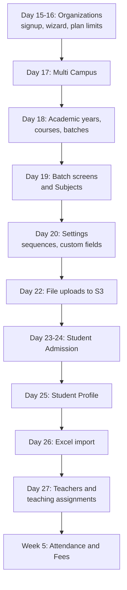
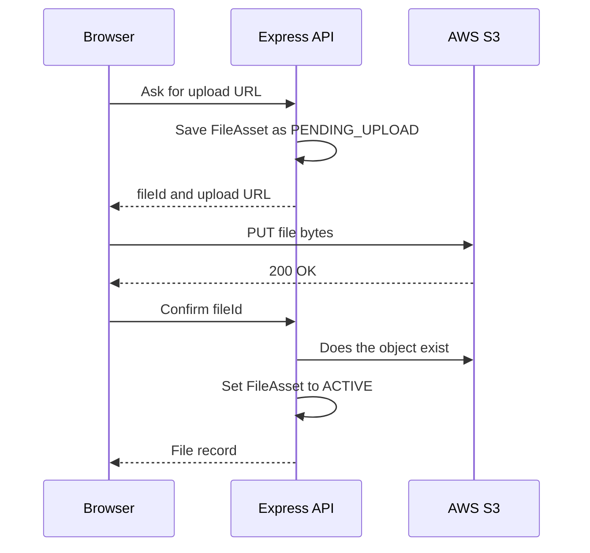

# Daily Plan: Days 15 to 28

**In simple words:** This chapter tells you what to build, test, sell and commit on every day from Monday 19 October to Sunday 1 November 2026. In these two weeks EduFlow stops being an empty shell. An institute can sign up, set up its campuses, sessions, courses, batches and subjects, admit students, import an Excel sheet and add teachers. Attendance, Fees and Payments all stand on this data, so do these days with care.

## Overview of Days 15 to 28

Week 3 (Days 15–21) has the theme "Organizations, campuses, academic setup, subjects, settings" and uses prompts P-11 to P-14 and P-19. Week 4 (Days 22–28) has the theme "Admissions, student profiles, teachers, file uploads, import" and uses prompts P-15 to P-17 and P-21. The prompt text itself lives in *Prompts: Core Modules (Phase 1)*. This chapter tells you when to run each prompt, how to cut it into day-sized pieces, and how to check the result.

| Day | Date (2026) | Build goal | Prompts | Sales task and target |
|---|---|---|---|---|
| 15 | Mon 19 Oct | Organizations API, signup transaction, plan limits | P-11 | Add 25 leads (list reaches 125) |
| 16 | Tue 20 Oct | Onboarding wizard, organization profile, label switching | P-11 | 10 cold calls |
| 17 | Wed 21 Oct | Multi Campus module and campus switcher | P-12 | 15 WhatsApp intro messages |
| 18 | Thu 22 Oct | Academic years, terms, courses, batches, enrollment API | P-13 | 10 cold calls, book 2 discovery calls |
| 19 | Fri 23 Oct | Batch screens, wizard step 3, Subjects module | P-13, P-14 | 2 discovery calls |
| 20 | Sat 24 Oct | Settings: number sequences, custom fields, branding | P-19 | 10 calls, add 25 leads (150) |
| 21 | Sun 25 Oct | Rest and weekly review | None | Count the week's numbers |
| 22 | Mon 26 Oct | File uploads to S3 with pre-signed URLs | P-21 | Add 25 school leads (175) |
| 23 | Tue 27 Oct | Student Admission: inquiries and applications | P-15 | 12 calls with the pilot offer |
| 24 | Wed 28 Oct | Student Admission: admit a student in one transaction | P-15 | Demo video to 10 warm leads |
| 25 | Thu 29 Oct | Student Profile: list, profile, guardians, documents | P-16 | 12 calls, collect 2 sample Excel sheets |
| 26 | Fri 30 Oct | Excel import with dry run and error workbook | P-16 | 2 live mini-demos |
| 27 | Sat 31 Oct | Teachers module and teaching assignments | P-17 | Pilot one-pager, add 25 leads (200) |
| 28 | Sun 1 Nov | Rest and weekly review | None | Count the week's numbers |

**Figure: Build order for Days 15 to 28**



Each box needs the box above it. A batch needs a campus, a course and an academic year. A student needs a batch and an admission number. An import needs file uploads. This is why the days are in this order, and why P-21 (file uploads) runs on the first day of Week 4, before admissions need documents and photos.

> **Note:** This chapter names endpoint groups by their prefix, for example `ORG-API-` or `CAMP-API-`. The exact endpoint numbers, paths and permission keys are in `docs/api/` and in each PRD module file. If this chapter and the spec ever disagree, the spec wins.

## Where You Stand on the Morning of Day 15

Days 1 to 14 gave you the base: repo, database, API skeleton, multi-tenancy, login, RBAC (role-based access control — who may do what), the app shell, the UI kit and the audit log. Check the base before you put modules on it. This takes 20 minutes.

| Check | How to check | If it fails |
|---|---|---|
| Login, refresh and logout work (P-07) | Log in as the seeded Organization Admin. Wait 16 minutes. The page still loads data. | Fix first. Every test in this chapter needs login. |
| Permissions work (P-08) | Log in as a Teacher. Open an admin-only page. You see "no access". | Fix on the morning of Day 15. |
| Tenant isolation tests are green (P-06) | Run the server tests. | Stop. Never build modules on a leaking base. |
| App shell and UI kit exist (P-09, P-10) | Sidebar changes by role. Data table, form kit and toasts render. | Build only the missing piece, not the whole kit. |
| Audit log records writes (P-22) | Change any record. A new audit row appears. | Can wait until Day 20, not later. |

> **Rule:** If two or more checks fail, spend Day 15 on them. Then do Day 15 and Day 16 together on Tuesday by cutting the `SUPER_ADMIN` endpoints and wizard step 4. A strong base is worth more than one day.

This chapter also assumes your lead sheet has about 100 institutes at the end of Day 14. If your number is different, keep the daily action and move the running totals.

## How Every Build Day Runs

The daily rhythm is fixed: about 6 build hours, up to 2 sales hours and 30 minutes of review. The full explanation is in *How to Use This Blueprint* and *Founder Operating System*. This is the short form for these two weeks.

| Block | Length | What you do |
|---|---|---|
| Plan | 20 min | Read today's section and the PRD file. Write three lines: goal, biggest risk, cut line. |
| Build block A | 3 hours | Run the main prompt. Review the plan. Let Claude Code build the server side and tests. |
| Sales block | 30–120 min | Do the sales task of the day. Do not skip it, even on a bad build day. |
| Build block B | 3 hours | Screens, manual test checklist, fixes. |
| Review | 30 min | Commit, pull request, merge, progress log, first step for tomorrow. |

> **Tip:** Best calling time (assumption, test it yourself): coaching owners between 11:30 and 14:00, because they teach early morning and evening batches. School offices between 11:00 and 13:00, after assembly and before dispersal.

The examples in this chapter assume the web app runs on `http://localhost:3000` and the API on `http://localhost:4000/api/v1`. Use your own ports if P-01 set them differently.

Use the same commands every day. The script names (`dev`, `lint`, `typecheck`, `test`) are the ones P-01 created; the full list is in *Environment Variables and Command Reference*. CI/CD (automatic checks on GitHub) arrives only in Week 8, so until then you run the checks on your own machine before every merge.

```bash
# Morning: start services and open a fresh branch
docker compose up -d
git checkout main
git pull
git checkout -b feat/org-module
npm run dev

# Evening: check, commit, open a pull request, merge
npm run lint
npm run typecheck
npm test
git add -A
git commit -m "feat(org): add organizations API and plan limit guard"
git push -u origin feat/org-module
gh pr create --fill
gh pr merge --squash --delete-branch
```

Three rules apply to every day in this chapter.

1. **No new tables.** The full Prisma schema was installed on Day 4 with P-04. If Claude Code wants to add a model or a field, stop and check `docs/schema/`. The table almost always exists already under another name.
2. **Every new endpoint gets a tenant isolation test.** The test creates a row in Bright Future Public School, logs in as Sharma Classes and proves the row cannot be read, changed or deleted.
3. **One module per Claude Code session.** Type `/clear` before you start the next module. Old context makes Claude Code mix rules from two modules.

You can split a big prompt into day-sized pieces with one scope line on top. You will do this with P-11, P-13, P-15 and P-16. The pattern is always the same.

```text
SCOPE FOR TODAY: build ONLY <part>. Do not build <other part> yet.
Do not add or change Prisma models. Show me your plan and the list
of files you will create or change. Wait for my OK before you code.
```

## Week 3: Organizations, Campuses, Academic Setup, Subjects and Settings

Week 3 builds the "setup" half of EduFlow: everything an owner like Rajesh Sharma configures once, before daily work starts. At the end of the week a new institute can sign up and finish setup in under 15 minutes. That 15-minute setup is also your first real sales demo.

Sales focus for Week 3: grow the lead sheet from 100 to 150, make 30 cold calls, send 15 WhatsApp intros and hold 2 discovery calls (a discovery call is a 20-minute talk where you only ask questions and listen). You are not selling yet. You are learning how institutes handle fees and attendance today, and you are finding friendly owners for the free pilot that starts on Day 45 (18 Nov 2026).

### Day 15 — Monday, 19 Oct 2026: Organizations API and plan limits

**Goal:** A new institute can be created through the API in one safe transaction, and plan limits are enforced on the server.

**Build tasks**

1. (20 min) Run the readiness check from the section above. Start Docker, pull `main`, run the tests.
2. (30 min) Read `docs/prd/11-organizations-module.md` and `docs/prd/03-release-plan-and-plan-gating.md` yourself. Mark the business rules (`ORG-BR-`) and acceptance criteria (`ORG-AC-`) you do not understand. Ask Claude Code to explain them before it codes.
3. (90 min) Run P-11 with the server-only scope line. Claude Code builds routes, controller, service, Zod schemas and tests for every `ORG-API-` endpoint in the registry.
4. (60 min) Review the signup transaction line by line. One database transaction must create: the `Organization` (status `TRIAL`, country `IN`, currency `INR`, timezone `Asia/Kolkata`), the main `Campus` (`isMain = true`), the owner `User` with the `ORG_ADMIN` role, the `Subscription` row and the default `NumberSequence` rows. If any step fails, nothing is saved.
5. (60 min) Build the plan-limit guard as one reusable function. It checks three limits from the plan: active students, campuses and staff users. It throws `PLAN_LIMIT_REACHED` (403). You will call it again on Days 17, 24, 26 and 27.
6. (30 min) Slug rules (the slug is the subdomain, `{slug}.eduflow.app`): lowercase letters, digits and hyphens, 3 to 63 characters, unique. Block reserved words: `app`, `api`, `www`, `admin`, `static`, `mail`, `help`.
7. (30 min) `SUPER_ADMIN` endpoints (list organizations, suspend, reactivate) only if the registry lists them for Phase 1. They use the `X-Organization-Id` header.
8. (30 min) Confirm that updating an organization writes an audit log row with old and new values.

**Claude Code prompts to run today**

- P-11 — Organizations module with onboarding wizard and plan limits (from *Prompts: Core Modules (Phase 1)*). Paste this scope block above it:

```text
SCOPE FOR TODAY: build ONLY the server side of the Organizations
module. Read docs/canon.md, docs/prd/11-organizations-module.md,
docs/prd/03-release-plan-and-plan-gating.md and the ORG section in
docs/api/. Implement every ORG-API endpoint with Zod validation,
permission checks, audit log calls and tests.
Add one reusable plan-limit guard for students, campuses and staff
users. It must throw PLAN_LIMIT_REACHED (403) with a clear message.
Do not build any screen today. Do not add or change Prisma models.
Show me your plan and file list first. Wait for my OK.
```

- Follow-up after the code is written:

```text
Write an integration test for signup: (1) happy path creates the
organization, main campus, owner user with ORG_ADMIN, subscription
and number sequences; (2) force the campus insert to fail and prove
that NO organization row is left behind; (3) the same slug twice
returns CONFLICT (409); (4) a reserved slug returns VALIDATION_ERROR.
```

**Manual test checklist**

Use your API client (Postman, Bruno or the VS Code REST Client). Example signup body; the field names must match the Zod schema that Claude Code generated from the spec.

```json
{
  "organization": {
    "name": "Sharma Classes",
    "type": "COACHING",
    "slug": "sharma-classes",
    "email": "office@sharmaclasses.example",
    "phone": "+919876500001",
    "city": "Patna",
    "state": "Bihar"
  },
  "owner": {
    "fullName": "Rajesh Sharma",
    "email": "rajesh@sharmaclasses.example",
    "password": "Use-A-Long-Test-Password-1"
  }
}
```

1. Send the signup request. You get 201 and the success envelope with the new organization.
2. Open Prisma Studio (`npx prisma studio` in `server/`). You see one new row each in `organizations`, `campuses` (main), `users` and `subscriptions`.
3. Send the same request again. You get 409 `CONFLICT`, not a second institute.
4. Try the slug `api`. You get 400 `VALIDATION_ERROR` with the field name `slug` in `details`.
5. Log in as the new owner. Read "my organization". You see Sharma Classes only.
6. Log in as the Bright Future admin. Request the Sharma Classes organization by its ID. You get 404 `NOT_FOUND`, because the tenant filter hides it.
7. Log in as a Teacher. Try to update the organization. You get 403 `FORBIDDEN`.
8. Send an update with an `organizationId` field in the body. The field is rejected or ignored; the tenant still comes only from the token.

**Sales and customer task of the day (60 minutes)**

Add 25 coaching institutes from Patna and Lucknow to your lead sheet, so the list reaches 125. Use Google Maps and Justdial search pages. For each lead fill these columns: institute name, type (coaching or school), city and area, owner name, phone, WhatsApp (yes or no), approximate students, current system (register, Excel, other software), source, status, next action date, notes. Pick institutes with 100 to 500 students; they feel the fee-tracking pain and the owner still picks up the phone. The full method is in *Sales Foundation and Lead Generation*.

**Deliverable and commit**

Pull request "Organizations API and plan limits" merged into `main`. All tests green, including the transaction rollback test.

```text
feat(org): add organizations API, signup transaction and plan limits
```

**If you are behind**

Cut the `SUPER_ADMIN` endpoints (you can suspend a tenant by hand in Prisma Studio until Week 8). Cut the extra reserved words. Never cut the transaction rollback test or the plan-limit guard.

### Day 16 — Tuesday, 20 Oct 2026: Onboarding wizard and organization profile

**Goal:** A new owner signs up in the browser, finishes a guided setup and lands on a working dashboard shell.

**Build tasks**

1. (20 min) `/clear`, new branch `feat/org-onboarding`, read the screen list (`ORG-S` IDs) and wireframes in `docs/prd/11-organizations-module.md`.
2. (60 min) Public signup page: institute name, type (School or Coaching), city, owner name, email, phone, password. Use React Hook Form with the shared Zod schema from `shared/`, so the client and the server use the same rules.
3. (90 min) Onboarding wizard with four steps: Institute details, Main campus, Session and first batch, Invite your team. Build steps 1, 2 and 4 today. Step 4 reuses the invitation flow from P-07. Step 3 shows a "coming on Day 19" placeholder, because academic years and batches do not exist yet.
4. (30 min) The wizard saves after every step and can be resumed. When the last step is done, the server sets `onboardingCompletedAt`.
5. (60 min) Organization profile page under Settings: name, legal name, address, GSTIN (`taxId`), contact details, timezone. Add a "Plan and usage" card: students used of limit, campuses used of limit, staff users used of limit.
6. (45 min) Label switching. Create one `useLabels()` hook that reads `Organization.type`. For `SCHOOL` it returns Campus, Class, Section. For `COACHING` it returns Centre, Course, Batch. Every later screen must use this hook and never hard-code "Class" or "Batch".
7. (30 min) Route guard: an `ORG_ADMIN` whose onboarding is not complete is sent to the wizard. Other roles never see the wizard.
8. (25 min) Loading, empty and error states on all new screens, using the UI kit from P-10.

**Claude Code prompts to run today**

- P-11 again, this time for the client side, with this scope block:

```text
SCOPE FOR TODAY: build ONLY the client side of the Organizations
module. The ORG-API endpoints already exist; do not change them
unless you find a bug, and tell me first if you do.
Build: public signup page, onboarding wizard (steps 1, 2 and 4;
step 3 is a placeholder for now), organization profile page with a
"Plan and usage" card, and a useLabels() hook driven by
Organization.type (SCHOOL: Campus/Class/Section, COACHING:
Centre/Course/Batch). Follow docs/prd/08-design-system-and-ux-
guidelines.md. Mobile width 360px must work. Show the plan first.
```

**Manual test checklist**

1. Open `http://localhost:3000` in a private window. Sign up as a new coaching institute "Test Coaching Patna". You land on wizard step 1.
2. Finish step 1, close the browser tab, log in again. The wizard opens at step 2, not step 1.
3. Finish the wizard. You land on the dashboard shell. Reloading does not show the wizard again.
4. The sidebar says "Centres" and "Batches" for this coaching institute. Log in to Bright Future Public School: the sidebar says "Campuses" and "Sections".
5. Type a phone number with 7 digits on the signup page. You see a clear message under the field, and no request is sent.
6. Open the profile page at 360 px width (browser dev tools, phone view). Nothing is cut off and there is no sideways scroll.
7. The "Plan and usage" card shows the right plan name and "1 of 1 campuses" for a Starter institute.

**Sales and customer task of the day (90 minutes)**

Make 10 cold calls to coaching leads from your sheet. Target: reach 3 owners and have 2 real conversations. Use only an opener and two questions today. The full scripts are in *Cold Call Scripts*.

```text
Namaste Sir, main Mehdi bol raha hoon, EduFlow se. Main coaching
institutes ke liye fees aur attendance ka ek simple software bana
raha hoon. Bechne ke liye call nahi kiya hai. Bas do minute mein
aapse samajhna hai: aap abhi fees ka hisaab kaise rakhte hain?

Q1: Pending fees ki list banane mein kitna time lagta hai?
Q2: Parents ko reminder kaun bhejta hai, aur kaise?
```

Write the answers in the notes column within one minute of each call. Exact words from owners become your sales copy later.

**Deliverable and commit**

Pull request "Onboarding wizard and organization profile" merged. A new institute can go from signup to dashboard in the browser.

```text
feat(org): add onboarding wizard, organization profile and labels
```

**If you are behind**

Cut wizard step 4 (owners can invite the team later from the Users page). Cut the "Plan and usage" card. Do not cut `useLabels()`; adding it later means touching every screen.

### Day 17 — Wednesday, 21 Oct 2026: Multi Campus module

**Goal:** An organization can manage several campuses within its plan limit, and every user sees only the campuses assigned to them.

**Build tasks**

1. (20 min) `/clear`, branch `feat/campus-module`, read `docs/prd/12-multi-campus-module.md`.
2. (75 min) Run P-12. Claude Code builds the `CAMP-API-` endpoints: list, create, read, update, deactivate. The campus `code` (for example `LKO1`) is unique per organization and is used later inside admission and receipt numbers.
3. (30 min) Call the plan-limit guard on create: Starter 1 campus, Growth 1, Pro up to 3, Enterprise unlimited.
4. (45 min) Business rules: the main campus cannot be deactivated; a campus with active batches cannot be deactivated. Both return 422 `BUSINESS_RULE_VIOLATION` with a message the owner understands.
5. (60 min) Campus switcher in the app header. It lists only the user's assigned campuses (table `user_campuses`) plus "All campuses" for `ORG_ADMIN`. The API client sends the choice as the `X-Campus-Id` header on every request.
6. (45 min) "Assign campuses" section on the user edit screen, so a Principal or an Accountant can be tied to one or more campuses.
7. (45 min) Check the campus scoping middleware from P-08 against real data: a Principal of `LKO2` who sends `X-Campus-Id` of `LKO1` gets 403 `FORBIDDEN`.
8. (40 min) Campus list and form screens with loading, empty and error states.

**Claude Code prompts to run today**

- P-12 — Multi Campus module (from *Prompts: Core Modules (Phase 1)*).
- Follow-up for the scoping test:

```text
Add integration tests for campus scoping. Setup: organization with
campuses LKO1 and LKO2; user A is PRINCIPAL assigned only to LKO2.
Prove: (1) the campus list for user A returns only LKO2; (2) a
request with X-Campus-Id of LKO1 returns FORBIDDEN (403);
(3) ORG_ADMIN without the header sees both campuses; (4) a campus
id from another organization returns NOT_FOUND (404).
```

**Manual test checklist**

Create the second campus of Bright Future Public School with this request. For this test, put the Bright Future demo tenant on the Pro plan (up to 3 campuses). A real school with 1,200 students would need Enterprise, but your demo tenant has only a few students.

```http
POST http://localhost:4000/api/v1/campuses
Authorization: Bearer <accessToken>
Content-Type: application/json

{
  "name": "Gomti Nagar Campus",
  "code": "LKO2",
  "city": "Lucknow",
  "state": "Uttar Pradesh",
  "phone": "+915224000002"
}
```

1. The request returns 201. The campus appears in the switcher without a page reload.
2. Create a third campus: success. Create a fourth: 403 `PLAN_LIMIT_REACHED` with a message that names the Pro limit of 3.
3. Log in as the Sharma Classes owner (set the plan to Growth in Prisma Studio). A second centre is refused with `PLAN_LIMIT_REACHED`.
4. Create a campus with the code `LKO2` again: 409 `CONFLICT`.
5. Try to deactivate the main campus: 422 with a clear message.
6. Assign Dr. Anita Verma (Principal) only to `LKO2`. Log in as her. The switcher shows one campus and no "All campuses" option.
7. Switch campus as the owner. The header shows the new campus name and the choice survives a page reload.

**Sales and customer task of the day (60 minutes)**

Send 15 WhatsApp intro messages to leads who did not pick up the phone yesterday or who have WhatsApp marked "yes". Send them one by one from your own number, with the owner's name in each. Do not use a bulk tool; bulk messages from a new number get reported and blocked. Target: 4 replies. The longer template set is in *WhatsApp and Email Templates*.

```text
Namaste [Owner name] ji, main Mehdi Alam hoon. Main coaching
institutes ke liye fees, attendance aur parent updates ka ek simple
system bana raha hoon - EduFlow. Abhi 5 institutes ke saath free
pilot plan kar raha hoon (18 November se). Kya main kal 5 minute
call karke samajh sakta hoon ki [Institute name] mein fees tracking
abhi kaise hoti hai? Koi selling nahi, sirf seekhna hai.
```

**Deliverable and commit**

Pull request "Multi Campus module" merged, with scoping tests green.

```text
feat(campus): add multi campus module, switcher and campus scoping
```

**If you are behind**

Cut the "Assign campuses" screen and assign campuses in Prisma Studio for now. Cut campus fields that are not needed yet (latitude, longitude, geo radius). Never cut the scoping tests.

### Day 18 — Thursday, 22 Oct 2026: Academic years, courses and batches

**Goal:** The academic backbone exists on the server: academic years, terms, courses, batches and the enrollment service, with the first two screens.

**Build tasks**

1. (25 min) `/clear`, branch `feat/academic-setup`, read `docs/prd/19-batch-module.md` and the academics part of `docs/prd/52-data-dictionary-academics.md`.
2. (60 min) Academic years and terms: create, update, close. Only one year per organization can be current. Setting a new current year must unset the old one inside one transaction.
3. (60 min) Courses: name, code, level, stream, board, duration in months. A course with `campusId = null` is offered at every campus. Code is unique per organization.
4. (75 min) Batches (the `BAT-API-` endpoints in the registry): campus, academic year, course, name, code, capacity, shift, days of the week, start and end time. Code is unique per organization, campus and academic year.
5. (60 min) Enrollment service, API only: enroll a student in a batch, transfer to another batch, withdraw. It checks batch capacity and refuses a second active enrollment in the same batch. You have no student screens yet, so the tests create student rows directly with Prisma.
6. (50 min) Screens for Academic Years and Courses, using `useLabels()`: "Academic year" and "Class" for schools, "Session" and "Course" for coaching.
7. (30 min) Isolation and scoping tests for all new endpoints. A Principal of `LKO2` cannot create a batch in `LKO1`.

**Claude Code prompts to run today**

- P-13 — Academic setup and Batch module (academic years, courses, batches, enrollments), with this scope block:

```text
SCOPE FOR TODAY: from P-13 build the complete server side (academic
years, terms, courses, batches, enrollments) with tests, plus ONLY
two screens: Academic Years and Courses. Batch screens come tomorrow.
Rules to enforce in the service layer: exactly one current academic
year per organization (switch inside one transaction); batch
capacity check on enroll; no second active enrollment in the same
batch; a CLOSED academic year accepts no enrollment changes.
Do not add or change Prisma models. Show the plan first.
```

**Manual test checklist**

1. As the Bright Future admin create the academic year `2026-27` (1 Apr 2026 to 31 Mar 2027) and mark it current. Create `2027-28` as planned.
2. Mark `2027-28` as current. In Prisma Studio exactly one row has `is_current = true`. Switch it back to `2026-27`.
3. Create the course "Class 10" with code `C10` and level 10. Create it again with the same code: 409 `CONFLICT`.
4. With your API client create the batch "10-A" (code `10A`, capacity 40) in campus `LKO1` for `2026-27`. The response shows campus, course and year names, not only IDs.
5. As the Sharma Classes owner create the session `2026-27`, the course "JEE Main 2028" and the batch "Morning Batch M1" (Mon, Wed, Fri, 07:00 to 09:00).
6. As the Sharma Classes owner request the Bright Future batch by its ID: 404 `NOT_FOUND`.
7. Set an end date before the start date on an academic year: 400 `VALIDATION_ERROR` naming the field.

**Sales and customer task of the day (90 minutes)**

Make 10 cold calls. Target: 2 discovery calls booked for tomorrow, each 20 minutes. When an owner sounds open, use this booking line.

```text
Sir, aapki baatein mere liye bahut kaam ki hain. Kya kal 20 minute
de sakte hain? Main sirf sawaal poochhunga ki fees, attendance aur
parents ke saath communication abhi kaise chalta hai. Badle mein
jab product ready hoga, sabse pehle aapko dikhaunga. Kal 12 baje
theek rahega ya 1 baje?
```

Always offer two time slots. "When are you free?" gets "I will tell you later". Two options get a time.

**Deliverable and commit**

Pull request "Academic setup API and first screens" merged.

```text
feat(academics): add academic years, terms, courses, batches API
```

**If you are behind**

Cut the terms endpoints (Exams and Report Cards need them only in Phase 2; Fees can work with due dates). Cut batch transfer; keep enroll and withdraw. Move the Courses screen to tomorrow.

### Day 19 — Friday, 23 Oct 2026: Batch screens, wizard step 3 and Subjects

**Goal:** Batches are usable in the browser, the onboarding wizard is complete, and subjects can be created and linked to courses.

**Build tasks**

1. (20 min) Branch `feat/batch-ui-subjects`. Continue the P-13 session for the batch screens, then `/clear` before P-14.
2. (75 min) Batch list and batch form: filters by campus, academic year, course and status. The list shows capacity as "0 of 40" so that the owner sees free seats. The batch detail page has an empty "Students" tab that you fill on Day 24.
3. (45 min) Wire wizard step 3 "Session and first batch". One screen creates the current academic year, the first course and the first batch. It pre-fills sensible values: year `2026-27`, and for coaching the batch name "Morning Batch M1".
4. (75 min) Run P-14. Claude Code builds the `SUB-API-` endpoints: subject CRUD (name, code, type, colour) and the course-subject mapping with the elective flag, weekly periods and sort order.
5. (45 min) Subjects screen and a "Subjects" tab on the course page where you tick which subjects belong to the course and mark electives.
6. (30 min) Guard rules: a subject that is linked to a course cannot be deleted, only made inactive. Return 422 `BUSINESS_RULE_VIOLATION`.
7. (40 min) Extend the seed script for both demo tenants. Bright Future, Class 10: English, Hindi, Mathematics, Science, Social Science. Sharma Classes, JEE Main 2028: Physics, Chemistry, Mathematics.
8. (30 min) Walk through the complete flow as a new user: signup, wizard with all four steps, then add two subjects. Note every point where you hesitated; those are UX bugs.

**Claude Code prompts to run today**

- P-13 (continue) with this short follow-up:

```text
Now build the remaining P-13 screens: batch list, batch form and
batch detail (with an empty Students tab). Then replace the wizard
step 3 placeholder with a real step that creates the current
academic year, one course and one batch in a single request flow.
Use useLabels() for every label. Keep the server unchanged.
```

- P-14 — Subjects module (from *Prompts: Core Modules (Phase 1)*). The teacher-to-subject assignment (`BatchSubjectTeacher`) is not built today; it comes on Day 27 with the Teachers module. Tell Claude Code this in one line so that it does not build a half-working teacher picker.

**Manual test checklist**

1. Sign up a fresh institute and finish all four wizard steps in under 10 minutes. Time yourself with a phone stopwatch.
2. After the wizard, the Batches page already shows the first batch with "0 of N" seats.
3. Create the subject "Mathematics" with code `MATH`. Create it again: 409 `CONFLICT`.
4. Link Mathematics and Science to "Class 10". Mark "Computer Applications" as an elective. Reload; the ticks are still there.
5. Try to delete Mathematics: you get a clear message that it is in use and can only be made inactive.
6. Log in as a Teacher. You can see subjects but there is no "Add subject" button. A direct API call to create a subject returns 403 `FORBIDDEN`.
7. The batch filter by academic year works: `2027-28` shows an empty state with a helpful message, not a blank page.

**Sales and customer task of the day (120 minutes)**

Hold the 2 discovery calls you booked, 20 minutes each. Spend the rest of the time writing notes. Ask these seven questions and then stop talking.

| # | Question | What you learn |
|---|---|---|
| 1 | How many students and how many batches do you have today? | Plan fit: Starter, Growth or Pro |
| 2 | How do you record fees today: register, Excel or software? | Current system and switching effort |
| 3 | How long does it take to know who has not paid this month? | Size of the pain, in hours |
| 4 | Who reminds parents, and how? | WhatsApp need and staff time |
| 5 | How do you take attendance, and do parents get to know? | Attendance and Parent Portal value |
| 6 | Did you try any software before? Why did you stop? | Objections you will hear again |
| 7 | If this worked well, what would it be worth per month? | Price feeling against ₹2,499 (Growth) |

End each call with one ask: "May I show you a first version in two weeks?" A yes puts the owner on your pilot shortlist.

**Deliverable and commit**

Pull request "Batch screens, wizard step 3 and Subjects module" merged. Two smaller pull requests (one for batches, one for subjects) are even better.

```text
feat(subjects): add subjects module, batch screens and wizard step 3
```

**If you are behind**

Cut the subject colour and the weekly periods field from the screens (they matter only for Timetable in Phase 2). Cut the seed subjects. Keep wizard step 3; a complete wizard is the heart of your demo.

### Day 20 — Saturday, 24 Oct 2026: Settings module

**Goal:** An owner can control number formats, custom fields, basic branding and key settings without calling you.

**Build tasks**

1. (20 min) `/clear`, branch `feat/settings-module`, read `docs/prd/43-settings-module.md`.
2. (60 min) Run P-19. Claude Code builds the `SET-API-` endpoints. Start with the settings key-value API on `organization_settings`: read all, update one, with an optional campus-level override. Every change writes an audit row and stores who changed it.
3. (75 min) Number sequences for `ADMISSION_NO`, `APPLICATION_NO`, `INQUIRY_NO`, `EMPLOYEE_CODE`, `FEE_INVOICE_NO` and `RECEIPT_NO`: prefix, format tokens, pad length, reset policy. The screen shows a live preview. With prefix `BF`, format `{PREFIX}-{YYYY}-{SEQ}` and pad length 4, the preview shows `BF-2026-0001`. This is the same format as the sample admission number `BF-2027-0142`.
4. (45 min) One shared server function "next number". It locks the sequence row with `SELECT ... FOR UPDATE` inside the caller's transaction, so numbers are gap-free and never repeat. Admissions (Day 24), invoices (Week 5) and receipts (Week 6) all use this one function.
5. (75 min) Custom fields: define fields for the `STUDENT` entity first (type, label, required, options, show in list, visible to parent). Add a dynamic field renderer to the form kit, so that the student form on Day 24 shows the fields without new code.
6. (40 min) Branding: primary colour and receipt footer saved in `Organization.branding`. The logo upload button is shown but disabled with the note "available after file uploads"; you switch it on on Day 22.
7. (25 min) Settings navigation page with clear groups: Organization, Campuses, Academic, Numbering, Custom fields, Branding, Users and roles.
8. (20 min) Week 3 regression pass: run all tests and repeat one manual check from each day of this week.

**Claude Code prompts to run today**

- P-19 — Settings module (organization settings, number sequences, custom fields, branding), from *Prompts: Core Modules (Phase 1)*.
- Follow-up for the number generator:

```text
Write a concurrency test for the shared next-number function. Start
20 parallel transactions that each request the next ADMISSION_NO for
the same organization. Assert: 20 results, all unique, consecutive
from 0001 to 0020, and next_value in number_sequences is 21.
Then add a test that two different organizations each get 0001.
```

**Manual test checklist**

1. Open Settings, then Numbering. Change the admission number prefix to `BF`. The preview updates as you type.
2. Set the pad length to 3. The preview shows `BF-2026-001`. Set it back to 4.
3. Add a custom field "Aadhaar seeded" (yes or no) and a field "House" with the options Red, Blue, Green and Yellow. Both appear in the custom fields list in the order you set.
4. Mark "House" as required. The field definition saves; you will see it on the student form on Day 24.
5. Change the primary colour. Buttons and the sidebar highlight change after a reload.
6. Open the audit log. You see one row for each change above, with your name and old and new values.
7. Log in as an Accountant. The Settings menu is hidden or read-only, exactly as `docs/permissions.md` says.
8. Log in to Sharma Classes. None of the Bright Future settings or custom fields are visible there.

**Sales and customer task of the day (60 minutes)**

Make 10 calls in the late morning; many coaching owners are at their desk on Saturday. Then add 25 new leads so that the sheet reaches 150. Before you stop, update the status column for every lead you touched this week: New, No answer, Talked, Discovery done, Pilot maybe, Pilot yes, Not interested.

**Deliverable and commit**

Pull request "Settings module" merged with the concurrency test green.

```text
feat(settings): add number sequences, custom fields and branding
```

**If you are behind**

Cut custom field types beyond text, number, date, yes or no, and select. Cut campus-level setting overrides. Cut the colour picker. Never cut the locked number generator; a duplicate receipt number in the pilot would destroy trust in one day.

### Day 21 — Sunday, 25 Oct 2026: Rest and weekly review

**Goal:** Rest, look honestly at Week 3, and plan Week 4. No new features today.

**Build tasks**

None. If you open the laptop, do only the 60-minute review below. Your brain fixes bugs while you rest; most Monday-morning solutions are born on Sunday.

| Minutes | Review step |
|---|---|
| 10 | Demo Week 3 to yourself from signup to settings, with no notes. Write down every rough spot. |
| 15 | Fill in the Week 3 checkpoint table below. Mark each row Done, Partly or Not done. |
| 10 | Count the sales numbers: leads, calls, conversations, discovery calls, pilot shortlist. |
| 15 | Plan Week 4: read the seven day titles, move any unfinished Week 3 work into a fixed slot. |
| 10 | Housekeeping: update `CLAUDE.md` with new conventions (`useLabels()`, the plan-limit guard, the next-number function). |

**Claude Code prompts to run today**

None. Updating `CLAUDE.md` is a 10-minute manual edit. The reason is explained in *Working with Claude Code*: a convention that is not written there will be forgotten by the next session.

**Manual test checklist**

1. The 10-minute self-demo runs without an error page.
2. `git status` on `main` is clean and `main` is pushed to GitHub.
3. All tests are green on a fresh `git pull` and `npm test`.
4. Your lead sheet has a next action date for every lead that is not "Not interested".

**Sales and customer task of the day (15 minutes)**

No calls on Sunday. Write your numbers into the weekly sales row of your tracker. Targets for the week: 150 leads, 30 calls, 15 WhatsApp intros, 2 discovery calls. If calls are under 20, block a fixed calling hour in your calendar for every day of Week 4.

**Deliverable and commit**

A short review note in your progress log (`docs/progress-log.md`; create it today if you do not have one): what shipped, what slipped, the three priorities for Week 4.

```text
docs(progress): add week 3 review and week 4 plan
```

**If you are behind**

If one module is unfinished, give it Sunday morning, at most 3 hours, and still take the afternoon off. If two or more modules are unfinished, do not work all Sunday. Cut scope instead, using the "If you are behind" lines, and write the cut items into a "Later" list in the progress log.

### Week 3 checkpoint

| Milestone | Demo-able outcome | Definition of done |
|---|---|---|
| Organizations module | A new institute signs up and finishes the wizard in under 15 minutes | Signup is one transaction with a rollback test; slug rules enforced; audit rows written |
| Plan limits | A Growth institute is refused a second campus with a clear message | One shared guard covers students, campuses and staff users and returns `PLAN_LIMIT_REACHED` |
| Multi Campus | The owner switches campus; a Principal sees only her campus | `X-Campus-Id` checked on the server; scoping tests green |
| Academic setup | Year `2026-27`, a course and a batch exist for both demo tenants | One current year enforced; capacity check on enroll; isolation tests green |
| Subjects | Subjects are linked to courses with an elective flag | Used subjects cannot be deleted; a Teacher cannot create subjects |
| Settings | The admission number preview shows `BF-2026-0001`; custom fields exist | 20-way concurrency test green; settings changes are audited |
| Sales | 150 leads, 30 calls, 15 WhatsApp intros, 2 discovery calls | Every touched lead has a status and a next action date |

## Week 4: Admissions, Student Profiles, Teachers, File Uploads and Import

Week 4 puts people into the system: students, guardians and teachers. It ends with the most important onboarding feature of the whole product, the Excel import. An owner with 350 students will never type them one by one. If the import is smooth, the pilot starts in one afternoon. If it is painful, the pilot never starts.

Sales focus for Week 4: grow the list from 150 to 200 (add private schools now), make 24 calls with the pilot offer, send a 3-minute demo video to 10 warm leads, run 2 live mini-demos and reach 2 verbal "yes" answers for the pilot. You need 5 by Day 44.

### Day 22 — Monday, 26 Oct 2026: File uploads to S3

**Goal:** Any module can upload a private file safely, and the file can be opened only by a user who is allowed to see it.

**Build tasks**

1. (20 min) `/clear`, branch `feat/file-uploads`. Read the file rules in `docs/prd/60-security-architecture.md` and `docs/prd/57-integrations-and-webhooks.md`.
2. (45 min) Create the development bucket in the Mumbai region with the commands below. Bucket names are unique across all of AWS, so add your own suffix. Create an IAM user (a login for programs, not people) named `eduflow-dev-uploader`, attach the policy below and put its keys in `server/.env`. Use the variable names from *Environment Variables and Command Reference*.
3. (75 min) Run P-21. Presign endpoint: checks permission, file type and size, creates a `FileAsset` row with status `PENDING_UPLOAD` and the key pattern `org/{orgId}/{category}/{uuid}-{name}`, and returns an upload URL that is valid for 5 minutes. It uses the packages `@aws-sdk/client-s3` and `@aws-sdk/s3-request-presigner`.
4. (45 min) Confirm endpoint: checks that the object really exists in S3, then sets the status to `ACTIVE`. Download endpoint: checks tenant and permission, then returns a read URL that is valid for 5 minutes.
5. (30 min) Limits (assumption until the spec says otherwise): images up to 5 MB (JPG, PNG, WebP), documents up to 10 MB (PDF), spreadsheets up to 10 MB (XLSX, CSV). Refuse everything else with `VALIDATION_ERROR`.
6. (75 min) `FileUpload` component in the UI kit: drag and drop, progress bar, retry, preview for images, clear error messages.
7. (30 min) Switch on the logo upload in Settings, then Branding. This is the first real use and proves the whole chain.
8. (40 min) Tests with a mocked S3 client: wrong type, too large, confirm before upload, and a download attempt by another tenant.

Save this file as `cors.json`. It lets your local web app upload straight to the bucket.

```json
{
  "CORSRules": [
    {
      "AllowedOrigins": ["http://localhost:3000"],
      "AllowedMethods": ["PUT", "GET", "HEAD"],
      "AllowedHeaders": ["*"],
      "ExposeHeaders": ["ETag"],
      "MaxAgeSeconds": 3000
    }
  ]
}
```

Run these commands in Git Bash (the `\` at the end of a line continues the command). Replace the bucket name with your own.

```bash
aws s3api create-bucket --bucket eduflow-dev-files-mehdi \
  --region ap-south-1 \
  --create-bucket-configuration LocationConstraint=ap-south-1

aws s3api put-public-access-block --bucket eduflow-dev-files-mehdi \
  --public-access-block-configuration \
  BlockPublicAcls=true,IgnorePublicAcls=true,BlockPublicPolicy=true,RestrictPublicBuckets=true

aws s3api put-bucket-cors --bucket eduflow-dev-files-mehdi \
  --cors-configuration file://cors.json
```

Attach this policy to the `eduflow-dev-uploader` user. It allows work inside this one bucket and nothing else.

```json
{
  "Version": "2012-10-17",
  "Statement": [
    {
      "Sid": "EduFlowDevObjects",
      "Effect": "Allow",
      "Action": ["s3:PutObject", "s3:GetObject", "s3:DeleteObject"],
      "Resource": "arn:aws:s3:::eduflow-dev-files-mehdi/*"
    },
    {
      "Sid": "EduFlowDevList",
      "Effect": "Allow",
      "Action": ["s3:ListBucket"],
      "Resource": "arn:aws:s3:::eduflow-dev-files-mehdi"
    }
  ]
}
```

**Figure: Upload with a pre-signed URL**



The browser first asks the API for an upload URL and sends the file name, type, size and category. The API saves a `FileAsset` row in PostgreSQL and answers with a URL that is valid for 5 minutes. The file never passes through your API server, so large uploads do not slow it down. The bucket stays fully private. A pre-signed URL (a temporary link that carries its own permission) is the only way in or out, and it dies after 5 minutes.

**Claude Code prompts to run today**

- P-21 — File uploads to S3 with pre-signed URLs (from *Prompts: Core Modules (Phase 1)*).
- Follow-up for security:

```text
Review the file module for these risks and fix what you find:
(1) the S3 key must be built on the server from the JWT orgId, never
from client input; (2) the file name must be sanitised (no slashes,
no "..", max 120 chars); (3) the download endpoint must load the
FileAsset through the tenant-scoped Prisma client and check the
owner entity permission; (4) URLs must never be written to logs.
Add a test for each point.
```

**Manual test checklist**

1. Upload a PNG logo in Settings, then Branding. The progress bar moves, and the logo appears in the header after saving.
2. Open the AWS console. The object sits under `org/<organization id>/...`. Opening its plain S3 address in a private window shows "Access Denied".
3. Try a 12 MB image. You see a clear size message before any upload starts.
4. Rename a `.exe` file to `.png` and upload it. The server refuses it, or the file is never shown as an image. Note the result and tell Claude Code if it passed silently.
5. Copy the download URL, wait 6 minutes and open it. It has expired.
6. Log in to Sharma Classes and request the download endpoint with the Bright Future file ID: 404 `NOT_FOUND`.
7. In Prisma Studio the `file_assets` row has status `ACTIVE`, the right size and your user ID.

> **Warning:** Never commit AWS keys. Check that `.env` is in `.gitignore` before your first commit today. If a key ever reaches GitHub, delete that key in the IAM console at once and create a new one.

**Sales and customer task of the day (60 minutes)**

Add 25 private K-12 schools in Lucknow and Patna with 300 to 1,200 students, so that the list reaches 175. For schools, the contact is often the administrator or the accountant, not the owner. Add one extra column, "Decision maker", and fill it when you learn the name. Your wedge stays coaching institutes, but one or two schools in the pilot will test the "Class and Section" labels and the multi-campus flow.

**Deliverable and commit**

Pull request "File uploads with pre-signed URLs" merged. The logo upload works from browser to S3 and back.

```text
feat(files): add S3 pre-signed uploads and file upload component
```

**If you are behind**

Cut drag and drop (a simple file button is enough). Cut image preview. If AWS account setup blocks you for more than an hour, ask Claude Code to make the storage layer an interface with a local-disk version for development, and finish S3 on Saturday. Never cut the tenant check on download.

### Day 23 — Tuesday, 27 Oct 2026: Student Admission, inquiries and applications

**Goal:** The front desk can record an inquiry, follow it up and turn it into an application with documents.

**Build tasks**

1. (25 min) `/clear`, branch `feat/admission-inquiries`, read `docs/prd/13-student-admission-module.md`: the workflow diagram, the status lifecycle table and the screen list (`ADM-S` IDs).
2. (90 min) Run P-15 with the scope block below. Inquiries: create, list, update, status change, follow-up notes with a next follow-up date, source (walk-in, phone, website, referral). The inquiry number comes from the `INQUIRY_NO` sequence you built on Day 20.
3. (75 min) Applications: convert an inquiry into an application (the data is copied, not typed again), application number from `APPLICATION_NO`, student details, guardian details, the course and batch applied for.
4. (30 min) Attach documents to an application with the `FileUpload` component: birth certificate, previous marksheet, photo. Use the owner fields of `FileAsset` to link each file to the application.
5. (60 min) Screens: inquiry list with filters by status, source, course and follow-up date; a quick-add dialog that needs only name, phone and course; an inquiry detail page with the notes timeline; the application form.
6. (30 min) A "Follow-ups due today" filter. Parent notifications come only in Week 7, so do not send anything today.
7. (30 min) Permission and isolation tests. Campus staff see only the inquiries of their campus.

**Claude Code prompts to run today**

- P-15 — Student Admission module (inquiry, application, admission), with this scope block:

```text
SCOPE FOR TODAY: from P-15 build ONLY inquiries and applications:
ADM-API endpoints for both, the status lifecycle exactly as in
docs/prd/13-student-admission-module.md, number generation through
the shared next-number function, documents through the file module.
Do NOT build the final "admit" step today and do NOT create Student,
Guardian or Enrollment rows yet. That is tomorrow's scope.
Invalid status jumps must return BUSINESS_RULE_VIOLATION (422).
Show the plan first.
```

**Manual test checklist**

1. Add an inquiry with the quick-add dialog in under 30 seconds: "Aarav Sharma", parent "Sunita Devi", a phone number and "Class 10". It gets an inquiry number.
2. Add a follow-up note with tomorrow's date. It appears in the timeline with your name and the time.
3. Filter "Follow-ups due today": empty. Change the follow-up date to today: the inquiry appears.
4. Convert the inquiry into an application. Name and phone are pre-filled. The inquiry status changes as the spec says.
5. Upload a PDF as the birth certificate. Open it again from the application; it opens through a temporary URL.
6. Try an invalid status jump with your API client (for example from a new inquiry straight to admitted): 422 `BUSINESS_RULE_VIOLATION`.
7. Log in as a Teacher. The Admissions menu is not visible, and the API returns 403.
8. Enter the same phone number on a second inquiry. The screen warns about a possible duplicate but still lets you save, because siblings share a phone.

**Sales and customer task of the day (90 minutes)**

Make 12 calls, mostly to leads with the status "Talked" or "Discovery done". Today you make the pilot offer for the first time. Target: 1 verbal yes and 2 "maybe".

```text
Sir, 18 November se hum sirf paanch institutes ke saath EduFlow ka
free pilot shuru kar rahe hain. Aapka student data hum khud Excel se
import karenge, aapko typing nahi karni. Pilot mein admission,
attendance, fees aur parents ko update - sab milega.
Badle mein bas do cheezein chahiye: har hafte 20 minute ka feedback,
aur aapki team roz use kare. Paanch mein se [N] jagah baaki hain.
Kya main aapka naam likh loon?
```

Replace `[N]` with the true number of open places. If all five places are open, say five. Trust is your only asset at this stage.

**Deliverable and commit**

Pull request "Admission inquiries and applications" merged.

```text
feat(admission): add inquiries, applications and document uploads
```

**If you are behind**

Cut the application step for now: many coaching institutes admit straight from an inquiry. Keep the inquiry list, quick add and follow-ups, because Rajesh Sharma's front desk uses them every day. Cut the duplicate phone warning.

### Day 24 — Wednesday, 28 Oct 2026: Student Admission, the admit step

**Goal:** One click on "Admit" creates the student, the guardian, the enrollment and the admission number together, or creates nothing at all.

**Build tasks**

1. (20 min) Branch `feat/admission-admit`. Continue yesterday's Claude Code session if its context is still clean; otherwise `/clear` and paste P-15 again with today's scope block.
2. (120 min) The admit service, as one database transaction: check the plan limit for active students; create the `Student`; create or reuse the `Guardian` (match on phone number inside the same organization, so siblings share one guardian); create the `Enrollment` in the chosen batch with the capacity check; take the admission number from `ADMISSION_NO`; mark the application as admitted; write the audit log.
3. (30 min) Parental consent. For a student under 18, the form has a consent tick box with the guardian's name and the date, saved as a `ConsentRecord`. The legal background is in `docs/prd/61-privacy-and-compliance.md`.
4. (75 min) Direct admission form for walk-ins, in five short steps: Student, Guardian, Course and batch, Documents, Review. It renders the custom fields from Day 20, such as "House".
5. (30 min) Fill the "Students" tab on the batch detail page with the enrolled students and "12 of 40" seats.
6. (45 min) Tests: a full batch refuses the admission; the plan limit refuses student number 51 on Starter; a failure inside the transaction leaves no student row and does not burn an admission number.
7. (40 min) Admit 10 students by hand into both demo tenants. You need them tomorrow for the student list.

**Claude Code prompts to run today**

- P-15 (continue) with this scope block:

```text
SCOPE FOR TODAY: finish P-15 with the admit step and the direct
admission form. The admit service must run in ONE transaction:
plan-limit check, Student, Guardian (reuse by phone within the
organization), Enrollment with capacity check, ADMISSION_NO from
the shared next-number function, application status, audit log.
Add a ConsentRecord for students under 18, as described in
docs/prd/61-privacy-and-compliance.md.
Tests: batch full, plan limit reached, rollback leaves no rows and
no gap in the admission numbers, sibling reuses the guardian.
```

**Manual test checklist**

1. Admit Aarav Sharma from yesterday's application into 10-A. He gets an admission number in the `BF-2026-` series, and the batch shows "1 of 40".
2. Admit a sibling with the same guardian phone. In Prisma Studio the `guardians` table still has one Sunita Devi, now linked to two students.
3. Set the capacity of a test batch to 1 and admit two students. The second is refused with a clear "batch is full" message.
4. Put a test institute on Starter with 50 students (ask Claude Code for a small script). Student 51 is refused with `PLAN_LIMIT_REACHED` and a message that names the Growth plan.
5. Admit three students one after another. The numbers are consecutive, with no gap.
6. The required custom field "House" blocks the form until it is filled.
7. For a date of birth that makes the student a minor, the consent tick box is required. For an adult student it is not shown.
8. Log in to Sharma Classes. Its first admission number follows its own series, not the Bright Future series.

**Sales and customer task of the day (60 minutes)**

Record a 3-minute screen video: signup, the wizard, create a batch, admit a student. Speak in simple Hindi or Hinglish, show the screen only, and do not edit it. Send it on WhatsApp to 10 warm leads (status "Talked" or better) with this message. Target: 3 replies.

```text
[Owner name] ji, jo system maine phone par bataya tha, uska pehla
version ready hai. 3 minute ka video bhej raha hoon - institute
setup se student admission tak. Fees aur attendance agle do hafte
mein aa rahe hain. Dekh kar bataiye, aapke institute ke liye sabse
zaroori cheez kaun si hogi?
```

**Deliverable and commit**

Pull request "Admit student in one transaction" merged. Both demo tenants have at least 10 admitted students.

```text
feat(admission): admit student with guardian, enrollment and number
```

**If you are behind**

Cut the five-step form and use one long form. Cut documents on the direct admission form (they can be added later from the profile). Keep the transaction, the capacity check, the plan limit and the consent record.

### Day 25 — Thursday, 29 Oct 2026: Student Profile module

**Goal:** Staff can find any student in seconds and see one complete profile page with guardians, documents and enrollment history.

**Build tasks**

1. (20 min) `/clear`, branch `feat/student-profile`, read `docs/prd/14-student-profile-module.md`.
2. (90 min) Run P-16 with the scope block below. It covers the `STU-API-` endpoints. The students list API has server-side pagination, search (`q` matches name, admission number and guardian phone), filters (campus, course, batch, status) and sorting. Follow the list rules in the canon: `?page=1&limit=20&sort=-createdAt&q=aarav`, maximum limit 100.
3. (75 min) Student list screen with the data table from the UI kit: a search box with a short typing delay, filters, column chooser, and custom fields that are marked "show in list".
4. (75 min) Profile page with tabs: Overview, Guardians, Documents, Enrollment history. Add Attendance and Fees tabs now as placeholders with the text "Coming in Week 5", so that the layout does not change later.
5. (40 min) Edit student, photo upload (category `student-photo`), add or link a guardian, mark one guardian as the primary contact.
6. (30 min) Status changes as defined in the spec, for example when a student leaves. Leaving closes the active enrollment and frees a seat in the batch and in the plan count.
7. (30 min) Tests for search, filters, the tenant filter and the campus filter. The `Own` scope for Teachers is tested on Day 27, when teaching assignments exist.

**Claude Code prompts to run today**

- P-16 — Student Profile module with Excel import, with this scope block:

```text
SCOPE FOR TODAY: from P-16 build the student list, profile page,
edit, guardians, documents and status changes. Do NOT build the
Excel import today; that is tomorrow.
The list must paginate, search and filter on the server. Search
must use the indexes that already exist in the schema; tell me if
a needed index is missing instead of adding one silently.
Add placeholder tabs for Attendance and Fees. Show the plan first.
```

**Manual test checklist**

1. Type "aar" in the search box. Aarav Sharma appears in well under one second. Search by `BF-2026-0001` and by the guardian's phone number; both find him.
2. Filter by batch 10-A. The count in the table footer matches "N of 40" on the batch page.
3. Open the profile. The header shows photo, name, admission number, class and status. All four real tabs load without errors.
4. Upload a student photo. It shows in the profile header and as a small round image in the list.
5. Open the sibling's profile. The Guardians tab shows Sunita Devi with a link to the other child.
6. Mark a test student as left. The batch seat count drops by one and the student no longer counts toward the plan limit.
7. Log in as an Accountant. You can view students but cannot edit them, or as `docs/permissions.md` says.
8. Open the list at 360 px width. The table turns into cards or scrolls inside its own box; the page does not scroll sideways.

**Sales and customer task of the day (90 minutes)**

Make 12 calls. On each good call, ask for one thing: a sample of the student Excel sheet, with 10 rows and fake or removed phone numbers. Target: 2 sample sheets by tonight. Real column names from real institutes are gold for tomorrow's import work.

```text
Sir, ek chhoti si madad chahiye. Aap students ka data jis Excel mein
rakhte hain, uski sirf 10 lines bhej sakte hain? Naam aur phone
number hata kar ya badal kar bhejiye, mujhe sirf columns dekhne
hain. Isse pilot ke time aapka poora data ek click mein import ho
jayega.
```

> **Warning:** Do not collect real student data before a pilot agreement and parental consent flow exist. Under the DPDP Act 2023, children's data needs special care. Ask for fake or masked rows only, and delete any real data that arrives by mistake.

**Deliverable and commit**

Pull request "Student list and profile" merged.

```text
feat(students): add student list, profile, guardians and documents
```

**If you are behind**

Cut the column chooser and the Enrollment history tab. Cut the status change screen (do it through the API for now). Keep server-side search and pagination; a list that loads all 1,200 students of Bright Future at once will fail in the first demo.

### Day 26 — Friday, 30 Oct 2026: Excel import

**Goal:** An owner uploads one Excel file, sees every problem before anything is saved, and then imports hundreds of students in a few minutes.

**Build tasks**

1. (20 min) Branch `feat/student-import`. Read the import part of `docs/prd/14-student-profile-module.md` and the job rules in `docs/prd/58-background-jobs-and-events.md`.
2. (30 min) Template download: an XLSX file with a header row, one sample row and a second sheet with instructions and allowed values. Use the `exceljs` package to write and read workbooks.
3. (45 min) Upload through the file module (category `import`), then create an `ImportJob` with `importType = STUDENTS` and `isDryRun = true`.
4. (90 min) BullMQ worker for the job: read rows, map columns, validate each row with the same Zod rules as the admission form, resolve the batch by its code, and write one `ImportJobRowError` for every problem with the row number, column name, error code and message.
5. (45 min) Result screen: total rows, valid rows, failed rows, and a table of errors. A button downloads the error workbook (the failed rows plus a "Reason" column). A second button "Import valid rows now" starts the real run.
6. (60 min) Real run: work in chunks of 100 rows, one transaction per chunk. Reuse the admit service from Day 24, so that guardians, enrollments, admission numbers and plan limits behave the same. Check the plan limit before the run starts.
7. (30 min) Duplicate rules: an admission number that already exists is an error; the same number twice in the file is an error; same name plus date of birth plus guardian phone is a warning.
8. (40 min) Progress polling on the screen, a job that cannot be started twice, and a test with a 500-row file. Target (assumption): 500 rows finish in under 60 seconds on your laptop.

Use this sample to build your first test file. Save it as CSV or paste it into Excel.

```csv
admission_no,first_name,last_name,gender,dob,batch_code,guardian_name,relation,guardian_phone
BF-2026-0101,Aarav,Sharma,MALE,2011-08-14,10A,Sunita Devi,MOTHER,+919876500011
BF-2026-0102,Ananya,Verma,FEMALE,2011-03-02,10A,Rakesh Verma,FATHER,+919876500012
BF-2026-0103,Kabir,Khan,MALE,2011-11-23,10A,Shabnam Khan,MOTHER,+919876500013
,Meera,Nair,FEMALE,2011-05-30,10A,Priya Nair,MOTHER,+919876500014
BF-2026-0102,Rohan,Gupta,MALE,14/08/2011,10Z,Suresh Gupta,FATHER,98765
```

The column names and allowed values (for example `MALE`, `MOTHER`) must match the template that your import builds from the spec. Change this sample to fit your template. Row 4 has no admission number, so the system must generate one. Row 5 has four planted errors: a duplicate admission number, a wrong date format, an unknown batch code and a short phone number. A good import reports all four, not only the first.

**Claude Code prompts to run today**

- P-16 (continue) with this scope block:

```text
SCOPE FOR TODAY: build the student Excel import from P-16.
Flow: template download, upload via the file module, ImportJob with
isDryRun=true, BullMQ worker validates every row and stores
ImportJobRowError rows, result screen, error workbook, then a real
run in chunks of 100 that reuses the existing admit service.
Rules: report ALL errors of a row, not only the first; never import
a row that has an error; check the plan limit before the real run;
a job cannot run twice; the worker sets the tenant context from the
job's organizationId before any query.
Use exceljs. Do not add or change Prisma models. Plan first.
```

**Manual test checklist**

1. Download the template. It opens in Excel with headers, a sample row and an instructions sheet.
2. Upload the five-row sample above as a dry run. Result: 4 valid rows, 1 failed row and 4 error lines for row 5. Nothing is saved yet; the student list is unchanged.
3. Download the error workbook. It contains row 5 with a readable "Reason" column.
4. Click "Import valid rows now". Four students appear in 10-A, and Meera Nair has a generated admission number.
5. Click the import button again, or re-send the request with your API client. The job does not run a second time.
6. Upload the same file again as a dry run. All rows with admission numbers now fail as duplicates. No second Aarav is created.
7. Import a 500-row file (ask Claude Code to generate one with realistic Indian names). Watch the progress bar and note the time.
8. On a Starter test institute, a 60-row file is refused before it starts, with a message about the 50-student limit and the Growth plan.

**Sales and customer task of the day (120 minutes)**

Run 2 live mini-demos of 20 minutes each, on Google Meet or in person, with owners from your "Pilot maybe" list. Show only three things: the 10-minute setup, a student admission, and an Excel import. If an owner sent a masked sample sheet yesterday, import that exact sheet in front of them. End with the pilot ask from Day 23. Target: 1 more verbal yes, so that you stand at 2 of 5. The full flow of a sales demo is in *Demo Script*; today's version is a short preview.

**Deliverable and commit**

Pull request "Student Excel import" merged, with the 500-row test documented in the pull request text (rows, seconds, errors found).

```text
feat(students): add Excel import with dry run and error workbook
```

**If you are behind**

Cut free column mapping and demand the exact template headers. Cut the error workbook and show errors only on screen. Cut CSV support and accept XLSX only. Never cut the dry run; an import that writes bad data into a pilot institute on day one cannot be undone politely.

### Day 27 — Saturday, 31 Oct 2026: Teachers module and teaching assignments

**Goal:** Teachers exist as people and as users, they are linked to batches and subjects, and a Teacher sees only her own batches.

**Build tasks**

1. (20 min) `/clear`, branch `feat/teachers-module`, read `docs/prd/15-teachers-module.md`.
2. (90 min) Run P-17. Claude Code builds the `TCH-API-` endpoints: teacher list, create, profile, update and deactivate. The employee code comes from the `EMPLOYEE_CODE` sequence. Follow the spec for how a teacher record is stored; the schema links batches and subjects to staff records, so Claude Code must not invent a new table.
3. (45 min) "Invite as user" on the teacher profile. It reuses the invitation flow from P-07 and gives the `TEACHER` role. On Starter, the plan-limit guard allows only 1 admin and 3 staff users.
4. (60 min) Teaching assignments (`BatchSubjectTeacher`): on the batch page, choose a teacher for each subject of the course. Choose the class teacher (`classTeacherId`) for the batch. Add the list of subjects a teacher can teach.
5. (45 min) "My batches" page for the Teacher role, and the `Own` data scope: a Teacher sees only the students of batches where she teaches or is the class teacher.
6. (40 min) Tests for the `Own` scope: Priya Nair teaches 10-A only; the student list returns 10-A students only; a direct request for a 10-B student returns 404.
7. (40 min) Week 4 regression pass. Then refresh the demo data for Monday: both tenants have batches, subjects, at least 40 students and 3 teachers with assignments. Attendance on Day 29 needs this.

**Claude Code prompts to run today**

- P-17 — Teachers module (from *Prompts: Core Modules (Phase 1)*).
- Follow-up for the data scope:

```text
Now enforce the TEACHER "Own" data scope in the students and batches
services. A teacher may read only batches where she has a
BatchSubjectTeacher row or is the class teacher, and only students
with an active enrollment in those batches. Implement it as one
reusable scope helper, not as copy-pasted where clauses.
Tests: teacher of 10-A cannot list or open students of 10-B (empty
list, NOT_FOUND on direct id); ORG_ADMIN and PRINCIPAL are unchanged.
```

**Manual test checklist**

1. Add Priya Nair as a teacher at the main campus. She gets an employee code from the sequence.
2. Invite her as a user. Copy the invitation link from the development mail log (or the server console), open it in a private window, set a password and log in.
3. As the admin, assign Priya Nair to Mathematics in 10-A and make her the class teacher of 10-A.
4. As Priya Nair, open "My batches": only 10-A is shown. The Students page shows only 10-A students.
5. As Priya Nair, paste the profile address of a 10-B student into the browser. You see a "not found" page, not the student.
6. Remove her assignment. After a reload she sees an empty state with a friendly message.
7. On a Starter test institute, invite a fourth staff user: refused with `PLAN_LIMIT_REACHED`.
8. Try to deactivate a teacher who is still the class teacher of a batch. The system asks you to choose a new class teacher first, or follows the rule in the spec.

**Sales and customer task of the day (45 minutes)**

Write a one-page pilot note and send it on WhatsApp to every lead with the status "Pilot yes" or "Pilot maybe". Then add 25 leads so that the sheet reaches 200. The note has five lines only; the full pilot process is in *Onboarding and Customer Success Playbook*.

```text
EduFlow Pilot - 5 institutes only
Start: Wednesday, 18 November 2026. Free during the pilot.
You get: setup done by us, your student Excel imported by us,
admissions, attendance, fees, receipts and parent updates.
We ask: daily use by your team and a 20-minute feedback call
every week. Your data stays yours; you can export it any time.
Contact: Mehdi Alam, founder - [your phone number]
```

**Deliverable and commit**

Pull request "Teachers module and teaching assignments" merged. The `Own` scope tests are green.

```text
feat(teachers): add teachers module, assignments and own-batch scope
```

**If you are behind**

Cut the "subjects a teacher can teach" list and the co-teacher option. Cut the teacher photo and documents. Do not cut the `Own` scope: on Day 29 teachers start marking attendance, and they must never see another teacher's batch.

### Day 28 — Sunday, 1 Nov 2026: Rest and weekly review

**Goal:** Rest, close Week 4 honestly and get ready for Attendance and Fees. No new features today.

**Build tasks**

None. Do only the 60-minute review.

| Minutes | Review step |
|---|---|
| 10 | Self-demo as three people: Rajesh Sharma sets up and imports, Suresh Gupta looks up a student, Priya Nair opens "My batches". |
| 15 | Fill in the Week 4 checkpoint table below. Mark each row Done, Partly or Not done. |
| 10 | Count the sales numbers and the pilot list: how many "yes", how many "maybe", who needs a visit. |
| 15 | Plan Week 5 with *Daily Plan: Days 29 to 42*. Read `docs/prd/17-attendance-module.md` once, slowly, away from the laptop. |
| 10 | Housekeeping: update `CLAUDE.md` (file module, admit service, import worker, scope helper), delete merged local branches, note the "Later" list. |

**Claude Code prompts to run today**

None.

**Manual test checklist**

1. The three-person self-demo runs without an error page.
2. `main` is pushed, tests are green on a fresh pull, and no AWS key is in the repository (search the repo for `AKIA`).
3. Both demo tenants have at least 40 students and 3 teachers with assignments.
4. The progress log has the Week 4 review and the three priorities for Week 5.

**Sales and customer task of the day (15 minutes)**

No calls. Write the week's numbers into your tracker. Targets: 200 leads, 24 calls, demo video sent to 10 leads, 2 mini-demos, 2 verbal pilot "yes". If you have fewer than 2 "yes", plan two in-person visits for Week 5. A visit with a laptop converts far better than a call (assumption from typical small-business selling; test it).

**Deliverable and commit**

A Week 4 review note in the progress log: what shipped, what slipped, and the three priorities for Week 5.

```text
docs(progress): add week 4 review and week 5 plan
```

**If you are behind**

Decide today, not on Wednesday. If the Excel import is not finished, it gets Monday morning and the Attendance start moves by half a day. If Teachers is not finished, build only the `Own` scope and the assignment screen on Monday and move the rest to the "Later" list. Everything else on the "Later" list waits for Week 9 or for the days after Day 60.

### Week 4 checkpoint

| Milestone | Demo-able outcome | Definition of done |
|---|---|---|
| File uploads | A logo and a student photo upload to S3 and open through 5-minute links | Bucket fully private; key built on the server; cross-tenant download returns 404 |
| Admission inquiries | The front desk adds an inquiry in 30 seconds and sees today's follow-ups | Status lifecycle enforced with 422 on invalid jumps; campus scoping tested |
| Admit step | One click creates student, guardian, enrollment and admission number | One transaction; rollback test green; capacity, plan limit and consent enforced |
| Student Profile | Any student is found in under one second; the profile shows guardians and documents | Server-side search and pagination; sibling guardian shared; mobile width works |
| Excel import | A 500-row file is checked, fixed and imported in minutes | Dry run first; all errors per row; no double run; plan limit checked before the run |
| Teachers | Priya Nair logs in and sees only 10-A | `Own` scope helper with tests; staff user limit enforced on Starter |
| Sales | 200 leads, demo video sent, 2 mini-demos, 2 verbal pilot "yes" | Pilot note sent to every "yes" and "maybe"; next action dates set |

## Common Problems in These Two Weeks

| Problem | Likely cause | Fix |
|---|---|---|
| Claude Code adds a new Prisma model | It did not read `docs/schema/`, or the context is too full | Reject the change, `/clear`, paste the prompt again with "Do not add or change Prisma models" |
| A list shows rows from another tenant | A query used the raw Prisma client, not the tenant-scoped one | Search the module for direct client imports; add an isolation test before you fix it |
| Browser upload fails with a CORS error | The bucket CORS rule lacks your origin or the `PUT` method | Run the `put-bucket-cors` command again; check the exact origin, including the port |
| Import job stays in `QUEUED` | The worker process is not running, or it uses another Redis address | Start the worker script; compare the Redis variables of API and worker |
| Admission numbers have gaps | The number was taken outside the business transaction | Move the next-number call inside the same transaction as the insert |
| Wizard opens again after it was finished | `onboardingCompletedAt` is not set, or the client caches the old profile | Set it on the last step and refresh the cached profile query after saving |
| A Teacher sees all students | The `Own` scope is applied on the list but not on "get by id" | Put the scope helper in the service layer and use it in both paths |
| A day's scope explodes | The prompt ran without a scope block | Stop, commit what works, cut with the "If you are behind" line, continue tomorrow |

How to debug an error step by step with Claude Code is covered in *Working with Claude Code*. How to write tests without losing a day is covered in *Testing Strategy for a Solo Founder*.

## Key takeaways

- Days 15 to 28 turn the empty shell into a system with real data: organizations, campuses, academic years, courses, batches, subjects, settings, files, admissions, students, the Excel import and teachers.
- Split big prompts with a scope block. P-11, P-13, P-15 and P-16 each take two days: server first, screens second. Smaller pieces are easier for you to review.
- Four shared building blocks are created here and reused until Day 60: the plan-limit guard, the `useLabels()` hook, the locked next-number function and the `Own` scope helper. Build them once and build them well.
- No new tables, an isolation test for every endpoint, and one module per Claude Code session. These three rules prevent most of the painful bugs.
- The Excel import with a dry run is your strongest onboarding feature. Test it with real column layouts from real institutes, using masked data only.
- Sales runs every day next to the build: from 100 to 200 leads, 54 calls, 2 discovery calls, a demo video, 2 mini-demos and 2 verbal pilot "yes" by Day 28. The pilot needs 5 institutes by Day 44.
- Sundays are for rest and a 60-minute review. When you are behind, cut scope with the "If you are behind" lines. Do not cut sleep, tests or tenant safety.
