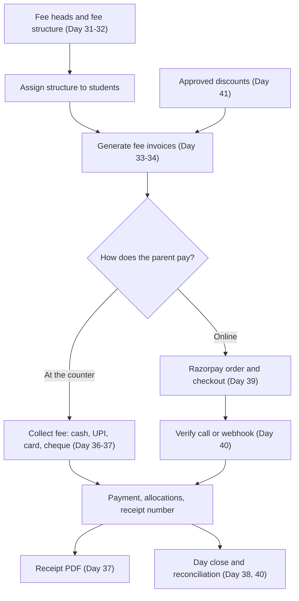
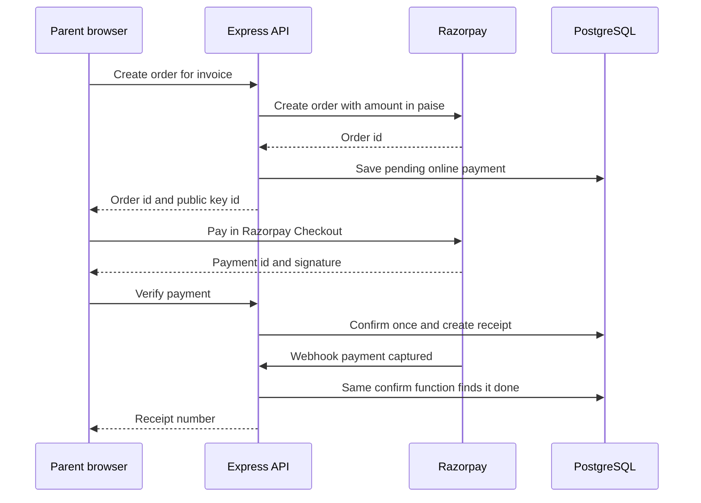

# Daily Plan: Days 29 to 42

**In simple words:** This chapter tells you what to do on each day from Day 29 (Monday, 2 November 2026) to Day 42 (Sunday, 15 November 2026). In these two weeks you build Attendance, Fees, Payments and Discounts. This is the part of EduFlow that touches money, so the plan is careful on purpose. On the sales side you move from calling leads to confirming your 5 free pilot institutes before the pilot starts on Day 45.

## Overview of Days 29 to 42

The table shows all 14 days on one page. Print it and tick off each day.

| Day | Date (2026) | Build goal | Prompts | Sales task |
|---|---|---|---|---|
| 29 | Mon 2 Nov | Attendance API | P-18 (backend) | Add 25 leads, send 10 WhatsApp intros |
| 30 | Tue 3 Nov | Attendance screens, mobile marking | P-18 (frontend) | 12 cold calls, book 2 demos |
| 31 | Wed 4 Nov | Fee heads, structures, assignment API | P-23 (backend) | 12 calls, 15 fee-pain messages |
| 32 | Thu 5 Nov | Fee setup screens | P-23 (frontend) | 2 demos with the pilot ask |
| 33 | Fri 6 Nov | Invoice generation and late fee API | P-24 (backend) | Festival greetings to 60 warm leads |
| 34 | Sat 7 Nov | Invoice screens, dues report, hardening | P-24 (frontend) | Score leads, send pilot offer to 8 |
| 35 | Sun 8 Nov | Rest and Week 5 review | None | None |
| 36 | Mon 9 Nov | Counter collection API | P-25 (backend) | Build the pilot kit |
| 37 | Tue 10 Nov | Collect Fee screen and receipt PDF | P-25 (frontend) | 10 calls to the pilot shortlist |
| 38 | Wed 11 Nov | Day close, cancellation, collection report | P-25 (finish) | 8 follow-ups, 1 demo |
| 39 | Thu 12 Nov | Razorpay orders and checkout | P-26 (part 1) | 2 demos with live fee collection |
| 40 | Fri 13 Nov | Razorpay webhooks and reconciliation | P-26 (part 2) | Confirm 5 pilots in writing |
| 41 | Sat 14 Nov | Discounts and end-to-end money test | P-27 | Send data templates, book 5 slots |
| 42 | Sun 15 Nov | Rest and Week 6 review | None | None |

The weekly themes and prompt IDs come from *60-Day Roadmap Overview and Weekly Milestones*. Week 5 is "Attendance and Fees (structures, invoices)" with P-18, P-23 and P-24. Week 6 is "Payments (counter + Razorpay), discounts, receipts" with P-25, P-26 and P-27. The full prompt text is in *Prompts: Core Modules (Phase 1)* for P-18 and in *Prompts: Finance and Communication* for P-23 to P-27.

These are the sales numbers for the two weeks. They are targets, not promises. Write the real numbers next to them every evening.

| Number | Week 5 target | Week 6 target |
|---|---|---|
| New leads added to the sheet | 25 | 0 |
| Cold calls made | 24 | 10 |
| Personal WhatsApp messages sent | 93 | 23 |
| Demos done | 2 | 3 |
| Pilot institutes that said "yes" (running total) | 2 | 5 confirmed plus 2 backups |

> **Founder note:** Diwali is expected on Sunday, 8 November 2026. Dhanteras falls on Friday 6 November and Bhai Dooj on Wednesday 11 November. Chhath Puja follows around 13 to 16 November. It is very big in Bihar, so leads in Patna (institutes like Sharma Classes) will be away. Verify the dates on a calendar. Many institutes close for 3 to 7 days. The sales tasks below already plan for this: fewer cold calls, more warm messages, and pilot closing pushed to Days 39 to 41.

## How the two weeks fit together

**Figure: How money moves through the modules you build in Days 31 to 41**



Each box depends on the box above it. You cannot collect a fee before an invoice exists, and you cannot make an invoice before a fee structure exists. This is why the order of days is fixed. Attendance (Days 29 to 30) stands alone, so it goes first while your mind is fresh for the money work.

Three working rules apply to every build day in this chapter.

1. **One prompt, two days.** Each big prompt (P-18, P-23, P-24, P-25, P-26) is run in two passes. Pass one says "backend only". Pass two says "frontend only". A smaller scope gives Claude Code less room to make mistakes, and gives you a diff (the list of changed lines) you can really read.
2. **IDs first, code second.** Every first message of the day asks Claude Code to list the endpoint IDs it will build (for example `ATT-API-01`, `FEE-API-01` to `FEE-API-08`) from `docs/api/`. You say OK. Only then it writes code. This one habit stops invented endpoints.
3. **No schema changes.** All tables were installed on Day 3 or 4 with P-04. If Claude Code wants to add a column in Weeks 5 or 6, stop. Ask which line of the PRD needs it. Nine times out of ten the field already exists under another name.

> **Warning:** Do not start Day 31 if Student Profile, Batch and enrollments from Weeks 3 and 4 are still broken. Fees need real students in real batches. Open the bug list you carried out of the Week 4 review (see *Daily Plan: Days 15 to 28*) and fix those bugs first, even if it costs you half a day.

## Money rules card

Money bugs destroy trust faster than any other bug. A parent who pays ₹12,000 and sees ₹1,200 on the receipt will tell ten other parents. Paste this card into `CLAUDE.md` on the morning of Day 31. Claude Code reads `CLAUDE.md` at the start of every session, so every later prompt follows these rules without you repeating them.

```text
MONEY RULES (apply to Fees, Payments and Discounts)
1. Money is Prisma Decimal(12,2) plus a 3-letter currency. Never Float.
2. Do all money math on the server with Decimal. Follow docs/prd/55 for
   the JSON money format. If it is silent, send a string: "12000.00".
3. Every write that touches an invoice, payment or receipt runs inside
   ONE database transaction. All steps succeed or all steps fail.
4. Every payment-creating POST needs an Idempotency-Key header. The
   same key returns the same result, never a second payment.
5. Never delete invoices, payments or receipts. Cancel with a reason.
   Invoice and receipt numbers are never reused.
6. Numbers come from NumberSequence (FEE_INVOICE_NO, RECEIPT_NO) inside
   the same transaction as the record they number.
7. Every query is tenant scoped (organizationId) and campus scoped.
8. Every create, cancel and approve writes an audit log entry.
9. Razorpay amounts are integer paise. Convert from Decimal. No floats.
10. Do not change the Prisma schema. If a field seems missing, stop and
    tell me which PRD line needs it.
```

Two terms in the card need a plain explanation.

- **Transaction** (a group of database writes that the database treats as one step): if step 3 of 4 fails, steps 1 and 2 are undone. Without it you get a payment row with no receipt.
- **Idempotency** (doing the same request twice has the same effect as doing it once): the accountant double-clicks "Collect", or the network retries. The `Idempotency-Key` header lets the server say "I already did this, here is the same receipt".

## Daily start and end routine

The full Git rules are in *Git Workflow: Branches, Commits and Pull Requests* and the local setup is in *Local Development Setup*. This is the short version for these two weeks. Script names (`dev`, `lint`, `typecheck`, `test`) follow the root `package.json` created by P-01. If yours are named differently, use yours.

Start of day (10 minutes):

```bash
git checkout main
git pull origin main
docker compose up -d
npm install
npm run dev
git checkout -b feat/attendance-api
```

End of day (20 minutes):

```bash
npm run lint
npm run typecheck
npm run test
git add -A
git commit -m "feat(attendance): add attendance sessions and bulk marking API"
git push -u origin feat/attendance-api
gh pr create --fill
gh pr merge --squash --delete-branch
```

Read your own pull request once before you merge it. Look at file names first. A Fees pull request that changes `auth` files is a red flag.

> **Tip:** Keep a second copy of the repository in a folder named `eduflow-demo`. It always stays on `main` with fresh seed data. Run every sales demo from this folder over screen share. A half-built feature branch can then never break a demo. Staging arrives only in Week 8 with P-56.

## Week 5: Attendance and Fees

Week 5 gives you two things a teacher and an accountant use every single day. Attendance takes two days. Fees setup and invoices take four days. No money is collected this week. You only prepare correct invoices, so that Week 6 has something to collect against.

What is deliberately out of scope this week: period-wise attendance for every subject, biometric devices, staff attendance, fee refunds, and sending real reminders. Reminder and absent events are only published. The Notifications engine (P-28) and WhatsApp (P-29) deliver them in Week 7.

### Day 29 — Monday, 2 Nov 2026: Attendance API

**Goal:** A teacher can mark attendance for one batch and one date through the API, and every business rule is enforced on the server.

**Time plan (6 build hours):** 30 min read the spec, 3 h 30 min build with Claude Code and review diffs, 1 h manual API tests and fixes, 1 h automated tests, pull request and merge.

**Build tasks**

1. Create the branch `feat/attendance-api`. Read `docs/prd/17-attendance-module.md`: sections Business Rules, Edge Cases, API Endpoints and Permissions. Write the 5 rules you think matter most on paper. You will check them in the manual test.
2. Run P-18 with the scope "backend only". Ask Claude Code to list every `ATT-API` ID with method and path from `docs/api/` before it writes code.
3. Build bulk marking: one request saves a whole batch (for example 40 students of Class 10-A) in one transaction. Marking the same batch and date again updates the rows. It must not create duplicates. This is called an upsert (update if it exists, insert if it does not).
4. Enforce the date rules: no future dates, no marking on a day that is in the `Holiday` table or is the campus weekly off, and only students with an active enrollment in that batch on that date.
5. Enforce scope: a `TEACHER` marks only own batches (`Own`), a `PRINCIPAL` works inside assigned campuses (`Campus`), and the permission key is `attendance.mark` from `docs/permissions.md`.
6. Build the edit lock from the PRD: the teacher can correct attendance on the same day. After that, only a user with the edit permission can change it, and the change goes to the audit log (P-22).
7. Build the summary endpoints: monthly attendance percentage per student and per batch. Formula: present days divided by working days, times 100, rounded to one decimal.
8. Publish the "student absent" event defined in `docs/prd/58-background-jobs-and-events.md`. Do not send any message. No listener exists until Day 43.
9. Write Vitest and Supertest tests, then check that the Attendance endpoints appear in the OpenAPI (Swagger) page.

**Claude Code prompts to run today**

Run P-18 from *Prompts: Core Modules (Phase 1)*. Add this text at the end of the prompt:

```text
SCOPE FOR TODAY: backend only for Attendance. No client code.
Read docs/canon.md, docs/prd/17-attendance-module.md, the Attendance
file in docs/api/ and docs/permissions.md.
Step 1: list every ATT-API ID with method, path and permission key.
Tell me which IDs you will build today. Wait for my OK.
Step 2: build routes, Zod schemas, service and repository for them.
Step 3: write Vitest + Supertest tests for: tenant isolation, teacher
marks only own batches, no future date, no holiday, re-marking the same
batch and date does not create duplicate rows.
Do not change the Prisma schema. Do not send notifications. Only
publish the student-absent event named in docs/prd/58.
```

**Manual test checklist** (use your API client, for example Postman or Bruno)

| # | Check | Expected result |
|---|---|---|
| 1 | Log in as teacher Priya Nair (Bright Future Public School) | `200`, you get an access token |
| 2 | Mark Class 10-A for today with 3 students absent | Success envelope with present and absent counts |
| 3 | Send the same request again | Same counts, no duplicate rows in Prisma Studio |
| 4 | Mark the same batch for tomorrow's date | `422` with code `BUSINESS_RULE_VIOLATION` |
| 5 | Mark a batch that Priya does not teach | `403` with code `FORBIDDEN` |
| 6 | Log in as a Sharma Classes teacher and use a Bright Future `batchId` | `404` or `403` as the PRD says, never `200` |
| 7 | Add a holiday for today, then mark again | `422` with a clear message |
| 8 | Open the table in Prisma Studio (`npx prisma studio` inside `server/`) | Every row has `organization_id` and `campus_id` filled |

**Sales and customer task of the day (90 minutes)**

Top up the lead list before the festival week. Add 25 new coaching institutes to your lead sheet: 10 from Patna, 10 from Lucknow and 5 from your own city. Use Google Maps and Justdial as described in *Sales Foundation and Lead Generation*. For each lead fill: institute name, owner name, mobile number, student count guess and current system (register, Excel, or another software). Then send 10 personal WhatsApp intro messages using the first-touch template from *WhatsApp and Email Templates*. Target: sheet total reaches 150 leads, 10 intros sent.

**Deliverable and commit**

Merged to `main` by the end of the day: Attendance API with passing tests and OpenAPI docs.

```text
feat(attendance): add attendance sessions, bulk marking and summary API
```

**If you are behind**

Cut the summary endpoints and the edit lock. Move them to tomorrow morning. Never cut bulk marking, the date rules or the tenant isolation test.

### Day 30 — Tuesday, 3 Nov 2026: Attendance screens and mobile marking

**Goal:** Priya Nair marks attendance for Class 10-A on her phone in under 60 seconds.

**Time plan (6 build hours):** 4 h build screens with Claude Code, 1 h test on a phone-size screen and fix, 1 h demo data, pull request and merge.

**Build tasks**

1. Create the branch `feat/attendance-ui`. Run P-18 again with the scope "frontend only". Use the screen list and wireframes in `docs/prd/17-attendance-module.md` and the rules in `docs/prd/08-design-system-and-ux-guidelines.md`.
2. Build the Mark Attendance screen. The teacher picks a batch and a date. Every student starts as Present. One tap changes the status to Absent, and another tap moves through the other statuses defined in the PRD. A counter shows "37 present, 3 absent".
3. Make it mobile-first. The Save button sticks to the bottom of the screen. Each student row is at least 44 pixels high, so a thumb can hit it. Test at 360 pixels width in Chrome DevTools (press F12, then the phone icon).
4. Build the monthly register for `PRINCIPAL` and `ORG_ADMIN`: a grid of students by days with P and A letters. Only the grid scrolls sideways, never the full page.
5. Add the Attendance tab on the Student Profile page: monthly percentage and a small calendar with absent days marked.
6. Build the attendance report: filters for batch and date range, and a CSV export. Students below 75% are highlighted.
7. Hide the Mark button when the user has no `attendance.mark` permission. Show the loading, empty and error states from the UI kit (P-10).
8. Extend the seed script: 20 school days of attendance at about 92% present for Bright Future Public School and Sharma Classes. Your Thursday demos need this data.

**Claude Code prompts to run today**

Run P-18 again with this ending:

```text
SCOPE FOR TODAY: frontend only for Attendance. The API is merged.
Build the screens listed in docs/prd/17-attendance-module.md in this
order: Mark Attendance (mobile-first), Student Profile attendance tab,
monthly register, attendance report with CSV export.
Use the data table, filters and state components from the UI kit.
Use TanStack Query for data and React Hook Form + Zod for forms.
After each screen, stop and tell me the URL so I can test it.
Last step: extend the seed script with 20 school days of attendance
at about 92 percent present for both demo organizations.
```

**Manual test checklist** (browser)

| # | Check | Expected result |
|---|---|---|
| 1 | Log in as Priya Nair at 360 px width and open Mark Attendance | Only her batches appear in the batch picker |
| 2 | Mark 3 students absent and tap Save | Toast "Attendance saved", counter shows 3 absent |
| 3 | Time yourself marking 40 students | Under 60 seconds from open to saved |
| 4 | Reload the page | The 3 absent marks are still there |
| 5 | Open Aarav Sharma's profile, Attendance tab | Monthly percentage and calendar match your marks |
| 6 | Log in as Dr. Anita Verma and open the monthly register | Grid shows P and A, page does not scroll sideways |
| 7 | Log in as accountant Suresh Gupta | No Mark Attendance button or menu item |
| 8 | Export the report to CSV and open it in Excel | Names, dates and statuses are correct |

**Sales and customer task of the day (90 minutes)**

Make 12 cold calls between 11:30 and 13:30. Coaching owners are free in this window because batches run early morning and evening. Use the opening from *Cold Call Scripts*. Your only goal on each call is a 20-minute demo slot on Thursday 5 November or in the week of 9 November. Target: 12 calls, 4 real conversations, 2 demos booked. Log every call in the sheet on the same day.

**Deliverable and commit**

Merged to `main`: Mark Attendance screen, student tab, register, report and demo attendance data.

```text
feat(attendance): add mobile marking screen, register and reports
```

**If you are behind**

Cut the monthly register and the CSV export. Write them on your parked list (a plain list of cut items that you revisit in Week 9 or after Day 60). Keep the Mark Attendance screen and the student tab. They are what you show in demos.

### Day 31 — Wednesday, 4 Nov 2026: Fee heads, fee structures and assignment API

**Goal:** Through the API, an accountant can define fee heads, build a fee structure with instalments, and assign it to a whole batch.

**Time plan (6 build hours):** 45 min read the Fees spec and add the money rules card, 3 h 15 min build, 1 h manual tests, 1 h automated tests and merge.

**Build tasks**

1. Paste the money rules card from this chapter into `CLAUDE.md`. Commit it alone: `docs(claude): add money rules card`.
2. Read `docs/prd/25-fees-module.md` from start to end. It is the most important spec in the MVP. Note the business rule IDs (`FEE-BR-01` and onward) that talk about instalments, editing and totals.
3. Create the branch `feat/fees-setup-api`. Run P-23 with the scope "backend only". Ask for the list of `FEE-API` IDs for fee heads, fee structures and student fee assignment first.
4. Build fee heads: create, list, update and deactivate. A fee head is one kind of charge, for example Tuition, Admission, Exam, Transport. A head that is used in a structure cannot be deleted. The API answers `409` with code `CONFLICT`.
5. Build fee structures: one structure belongs to an academic year and a course or batch. It holds heads with amounts and an instalment schedule with due dates. The server computes all totals. The client never sends a total.
6. Build student fee assignment: bulk assign a structure to every active student of a batch, and assign or override for one student. Assigning twice must not create a second assignment.
7. Lock rule: once invoices exist for a structure, amounts cannot be edited. The user clones the structure and edits the copy. This keeps old invoices explainable.
8. Seed the two demo structures shown below, so every later day has the same numbers.
9. Write tests: totals math, tenant isolation, `409` on delete of a used head, double assignment is safe.

Use this sample data everywhere in Weeks 5 and 6. The same numbers then appear in your tests, your demos and this chapter. This chapter assumes that Class 10-A has 40 students in your demo seed. If your seed has a different count, the batch totals change, but the per-student numbers stay the same.

| Organization | Course | Fee head | Yearly amount | Instalments |
|---|---|---|---|---|
| Bright Future Public School | Class 10 | Tuition | ₹48,000 | 4 quarterly of ₹12,000 |
| Bright Future Public School | Class 10 | Transport | ₹12,000 | 4 quarterly of ₹3,000 |
| Sharma Classes | JEE Main 2028 | Course fee | ₹85,000 | ₹35,000, then ₹25,000, then ₹25,000 |
| Sharma Classes | JEE Main 2028 | Study material | ₹5,000 | One time with instalment 1 |

**Claude Code prompts to run today**

Run P-23 from *Prompts: Finance and Communication* with this ending:

```text
SCOPE FOR TODAY: backend only for Fees part 1. No client code.
Read CLAUDE.md (money rules), docs/prd/25-fees-module.md, the Fees file
in docs/api/ and docs/permissions.md.
Step 1: list the FEE-API IDs for fee heads, fee structures and student
fee assignment. Wait for my OK.
Step 2: build them. Totals are computed on the server with Decimal.
Step 3: seed two demo structures:
 - Bright Future, Class 10: Tuition 48000 and Transport 12000 per year,
   4 quarterly instalments each.
 - Sharma Classes, JEE Main 2028: Course fee 85000 in 3 instalments
   (35000, 25000, 25000) and Study material 5000 with instalment 1.
Step 4: tests for totals, tenant isolation, 409 on deleting a used fee
head, and safe double assignment.
Do NOT build invoices today. That is P-24.
```

**Manual test checklist** (API client)

| # | Check | Expected result |
|---|---|---|
| 1 | Log in as Suresh Gupta and create the fee head "Exam Fee" | `201`, the head appears in the list |
| 2 | Create the same head name again | `409` with code `CONFLICT` |
| 3 | Fetch the Class 10 structure | Total is `60000.00`, 4 instalments of `15000.00` |
| 4 | Send an amount of `-500` or `12000.555` | `400` with code `VALIDATION_ERROR` and the field name |
| 5 | Bulk assign the structure to Class 10-A, then do it again | Second call creates 0 new assignments |
| 6 | Try to delete the Tuition head | `409`, the head is in use |
| 7 | Log in as Priya Nair (teacher) and create a fee head | `403` with code `FORBIDDEN` |
| 8 | Log in at Sharma Classes and fetch a Bright Future structure ID | `404`, never the data |

**Sales and customer task of the day (120 minutes)**

Make 12 more calls in the 11:30 to 13:30 window. Then send 15 personal WhatsApp messages to leads who did not pick up this week. Use the fee-pain angle, because this is the pain you are building right now. Target: 12 calls, 15 messages, 2 more demos booked.

```text
Namaste Rajesh ji, Mehdi here from EduFlow.
Ek chhota sa sawaal: is mahine kitni fees pending hai, yeh number
aapko abhi 1 minute mein mil sakta hai?
Zyada institutes mein yeh register ya Excel se nikalne mein 2-3 ghante
lagte hain. EduFlow mein yeh ek click hai, aur parents ko reminder
bhi apne aap jaata hai.
Kya main 15 minute ka demo dikha sakta hoon? Thursday ya agle hafte?
```

**Deliverable and commit**

Merged to `main`: fee heads, fee structures, assignment API, demo structures in the seed script.

```text
feat(fees): add fee heads, fee structures and student fee assignment API
```

**If you are behind**

Cut the single-student override and the clone action. Keep fee heads, structures with instalments and bulk assignment. Without these three, Day 33 cannot start.

### Day 32 — Thursday, 5 Nov 2026: Fee setup screens

**Goal:** Suresh Gupta sets up the Class 10 fees in the browser in under 10 minutes, without asking you anything.

**Time plan (6 build hours):** 4 h build screens, 1 h manual test as the accountant, 1 h fixes, pull request and merge. Demos today come out of your 2 sales hours, not out of build time.

**Build tasks**

1. Create the branch `feat/fees-setup-ui`. Run P-23 with the scope "frontend only". Use the screens and wireframes in `docs/prd/25-fees-module.md`. Look up screen IDs in `docs/prd/91-appendix-screen-inventory.md`.
2. Build the Fee Heads screen: data table, "Add fee head" dialog, activate and deactivate. Show the `409` message in plain words: "This fee head is used in a fee structure, so it cannot be deleted."
3. Build the Fee Structure builder: pick academic year and course or batch, add rows of head plus amount, pick an instalment plan (one time, monthly, quarterly, custom dates).
4. Add a live preview table under the builder: instalment number, due date, amount per head, instalment total and yearly total. The preview calls the server for totals, so the screen and the API can never disagree.
5. Build the Assign screen: pick a batch, see students with checkboxes, already assigned students are marked, one button assigns the rest.
6. Add the Fees tab on the Student Profile page: assigned structure, instalment schedule, and an empty "Invoices" area that Day 34 fills.
7. Add one shared money formatter in `shared/` and use it everywhere. It must show Indian grouping: ₹1,20,000 and not ₹120,000.
8. Put the Zod schemas for fee head and fee structure in `shared/`, so the client form and the server route validate with the same rules.

This is the correct formatter. Check that Claude Code wrote something equal to it and did not build its own comma logic.

```typescript
export function formatMoney(amount: string | number, currency = 'INR'): string {
  const locale = currency === 'INR' ? 'en-IN' : 'en-US';
  return new Intl.NumberFormat(locale, {
    style: 'currency',
    currency,
    minimumFractionDigits: 0,
    maximumFractionDigits: 2,
  }).format(Number(amount));
}
```

> **Note:** `Number(amount)` is fine here because this function only formats text for the screen. It never calculates. All calculation stays on the server with Decimal, as the money rules card says.

**Claude Code prompts to run today**

Run P-23 again with this ending:

```text
SCOPE FOR TODAY: frontend only for Fees part 1. The API is merged.
Build in this order: Fee Heads screen, Fee Structure builder with a
live instalment preview, Assign to batch screen, Fees tab on the
Student Profile page.
Put the Zod schemas in shared/ and reuse them on client and server.
Add formatMoney() in shared/ using Intl.NumberFormat with en-IN for
INR. Use it for every amount on every screen.
The preview must get totals from the API. Do not add up money in the
browser.
After each screen, stop and give me the URL to test.
```

**Manual test checklist** (browser, logged in as Suresh Gupta)

| # | Check | Expected result |
|---|---|---|
| 1 | Create a fee head "Lab Fee" | It appears in the table without a page reload |
| 2 | Build a new structure for Class 9: Tuition ₹40,000 quarterly | Preview shows 4 rows of ₹10,000 and total ₹40,000 |
| 3 | Type letters or a negative number in the amount field | Red message under the field, Save stays disabled |
| 4 | Open the Class 10 structure | Total shows ₹60,000 with Indian commas |
| 5 | Assign Class 10 structure to 10-A twice | Second time shows "0 new students assigned" |
| 6 | Open Aarav Sharma's profile, Fees tab | Structure name and 4 instalments of ₹15,000 |
| 7 | Log in as Priya Nair | No Fees menu in the sidebar |
| 8 | Do the whole setup with a stopwatch | Under 10 minutes from empty to assigned |

**Sales and customer task of the day (90 minutes)**

Run 2 demos of 30 minutes each from your `eduflow-demo` folder over Google Meet or in person. Follow *Demo Script*. Show admissions, student profile and the new mobile attendance marking. Do not show Fees yet. It is half built. End each demo with the pilot ask, word for word:

> **Example:** "Rajesh ji, I am choosing only 5 institutes for a free pilot that starts on 18 November. I do the full setup myself and import your Excel data. In return I need 20 minutes of honest feedback every week. Would you like Sharma Classes to be one of the five?"

Then stop talking and wait. Target: 2 demos done, 1 pilot "yes" or a clear next step with a date.

**Deliverable and commit**

Merged to `main`: Fee Heads, Fee Structure builder, Assign screen, student Fees tab, shared money formatter.

```text
feat(fees): add fee heads, structure builder and assignment screens
```

**If you are behind**

Cut the custom-dates instalment plan and the student Fees tab. Keep Fee Heads, the builder with quarterly and monthly plans, and the Assign screen.

### Day 33 — Friday, 6 Nov 2026: Invoice generation and late fee API

**Goal:** One API call creates correct, numbered invoices for one instalment for a whole batch, and running it twice creates nothing new.

**Time plan (6 build hours):** 30 min read invoice rules, 3 h 30 min build, 1 h manual tests, 1 h automated tests and merge.

**Build tasks**

1. Create the branch `feat/fee-invoices-api`. Run P-24 with the scope "backend only". Get the list of `FEE-API` IDs for invoices, late fees and reminders first.
2. Build invoice generation for one student: one `FeeInvoice` per student per instalment, with one line per fee head. The invoice number comes from `NumberSequence` type `FEE_INVOICE_NO` inside the same transaction.
3. Build bulk generation as a BullMQ job (a task that runs in the background worker, not in the web request). Input: structure, instalment, batch. The API returns a job ID at once. A status endpoint reports progress.
4. Make generation idempotent. One student can have only one live invoice per structure instalment. A second run skips students who already have one and reports "0 created, 40 skipped".
5. Follow the invoice status lifecycle from the PRD exactly. Do not invent statuses. Cancelling needs a reason and writes an audit log entry. Nothing is ever deleted.
6. Build the late fee rule from organization settings: flat or per day, grace days and a cap. A nightly job applies it to unpaid, overdue invoices. A paid invoice is never changed.
7. Add a dev-only script to run the late fee job once, so you can test it without waiting for midnight.
8. Publish reminder events: 3 days before the due date, on the due date and 7 days after. Publish only. Delivery comes in Week 7.
9. Build the dues queries: outstanding amount per student and per batch.

Check the late fee math with this worked example. If the PRD rule differs, the PRD wins. Change the numbers, keep the method.

| Step | Value |
|---|---|
| Invoice | Tuition Q2, ₹12,000, due 10 July |
| Rule | ₹50 per day, 5 grace days, cap ₹500 |
| Grace ends | 15 July |
| Parent pays on | 25 July |
| Late days counted | 16 to 25 July = 10 days |
| Late fee | 10 x ₹50 = ₹500, cap is ₹500, so ₹500 |
| Amount to collect | ₹12,000 + ₹500 = ₹12,500 |

**Claude Code prompts to run today**

Run P-24 from *Prompts: Finance and Communication* with this ending:

```text
SCOPE FOR TODAY: backend only for Fees part 2. No client code.
Step 1: list the FEE-API IDs for invoices, late fees and reminders.
Wait for my OK.
Step 2: build single and bulk invoice generation. Bulk runs as a BullMQ
job with a status endpoint. Generation must be idempotent: running it
twice for the same batch and instalment creates zero new invoices.
Step 3: invoice numbers come from NumberSequence FEE_INVOICE_NO in the
same transaction. Add a test that runs two generations in parallel and
proves there are no duplicate numbers.
Step 4: late fee job (flat or per day, grace days, cap) plus a dev-only
script to run it once. Never touch a paid invoice.
Step 5: publish reminder events only. No sending.
Show me the late fee function and its unit tests before anything else.
```

**Manual test checklist** (API client)

| # | Check | Expected result |
|---|---|---|
| 1 | Generate instalment 1 invoices for Class 10-A | Job ID returned, status becomes `COMPLETED` within seconds |
| 2 | Fetch Aarav Sharma's invoice | 2 lines (Tuition ₹12,000, Transport ₹3,000), total `15000.00` |
| 3 | Run the same generation again | 0 created, all skipped |
| 4 | List invoices sorted by number | Numbers are unique and in sequence |
| 5 | Set the due date in the past with Prisma Studio, run the late fee script | Late fee matches your hand calculation |
| 6 | Run the late fee script a second time on the same day | Late fee does not double |
| 7 | Cancel one invoice without a reason | `400` with code `VALIDATION_ERROR` |
| 8 | Fetch a Bright Future invoice while logged in at Sharma Classes | `404`, never the data |

**Sales and customer task of the day (45 minutes)**

Today is Dhanteras for many of your leads. Make no cold calls. Send a short personal festival greeting to the 60 warmest leads in your sheet: everyone who spoke to you, saw a demo or replied once. No pitch, no link, no brochure. Use the name of the owner in each message. Target: 60 greetings sent one by one, not as a broadcast.

```text
Rajesh ji, aapko aur Sharma Classes ki poori team ko Diwali ki
hardik shubhkamnayein. Naya saal aapke students ke liye shaandar
results laaye. - Mehdi, EduFlow
```

**Deliverable and commit**

Merged to `main`: invoice generation (single and bulk), numbering, late fee job, reminder events, dues queries.

```text
feat(fees): add invoice generation, late fee rules and reminder events
```

**If you are behind**

Cut the per-day late fee (keep flat late fee only) and the per-batch dues query. Never cut idempotent generation or the parallel numbering test. Duplicate invoice numbers are very hard to clean up later.

### Day 34 — Saturday, 7 Nov 2026: Invoice screens, dues report and Week 5 hardening

**Goal:** The whole Week 5 flow works in the browser: set up fees, generate invoices, see who owes what.

**Time plan (6 build hours):** 3 h build screens, 1 h Week 5 smoke test (a quick run through the main flow), 1 h fix what the smoke test finds, 1 h tests and merge.

**Build tasks**

1. Create the branch `feat/fee-invoices-ui`. Run P-24 with the scope "frontend only".
2. Build the Invoices list: filters for status, batch, due date range and student search. Columns: invoice number, student, batch, due date, amount, paid, balance, status.
3. Build the Generate Invoices dialog: pick structure, instalment and batch. Show a preview line first: "40 students, total ₹6,00,000". After the user confirms, show a progress bar that polls the job status endpoint.
4. Build the Invoice detail page: lines, late fee, status, and a history list from the audit log. Add the Cancel action with a required reason.
5. Build the Dues report: outstanding per student with batch filter and CSV export. Add the total at the bottom.
6. Fill the "Invoices" area in the student Fees tab from Day 32.
7. Run the Week 5 smoke test below as three different users. Write every bug in your bug list. Fix only the bugs that block Week 6.
8. Ask Claude Code for one more tenant isolation test per new module: Attendance and Fees. Each test creates data in organization A and proves that organization B gets `404` on every new endpoint.

**Claude Code prompts to run today**

Run P-24 again with the scope "frontend only". When the screens are done, run this follow-up:

```text
Write one integration test file per module: attendance.isolation.test
and fees.isolation.test. For EVERY endpoint added in Week 5:
1. create the record as an ORG_ADMIN of organization A,
2. call the endpoint as an ORG_ADMIN of organization B,
3. expect 404 (or 403 where the PRD says so), never 200.
List any endpoint that fails. Do not fix silently. Show me first.
```

**Manual test checklist** (browser: the Week 5 smoke test)

| # | Check | Expected result |
|---|---|---|
| 1 | As Suresh Gupta, generate instalment 2 for Class 10-A from the dialog | Preview shows 40 students and ₹6,00,000, progress bar reaches 100% |
| 2 | Filter the Invoices list by status and by batch | Counts change correctly, totals stay right |
| 3 | Open one invoice and cancel it with a reason | Status changes, history shows who and when |
| 4 | Open the Dues report for Class 10-A | Student balances add up to the total at the bottom |
| 5 | As Priya Nair on a phone-size screen, mark today's attendance | Saved in under 60 seconds |
| 6 | As Rajesh Sharma at Sharma Classes, open Invoices | Only Sharma Classes invoices, labels say "Batch" not "Section" |
| 7 | Run `npm run test` | All tests pass, including both isolation files |

**Sales and customer task of the day (60 minutes)**

Choose who gets the pilot offer. Score every lead who spoke to you in the last 4 weeks with the table below. Pick the top 8. You need 5, and some will say no. Send the pilot offer to all 8 today, because people read WhatsApp during the holiday even when they do not take calls.

| Criterion | Points |
|---|---|
| The owner decides alone and replies on WhatsApp | 3 |
| 100 to 500 active students | 2 |
| Uses registers or Excel today (no software to replace) | 2 |
| Has one person who sits at the fee counter | 1 |
| You can visit the institute in person | 1 |
| Replied to you within 24 hours at least once | 1 |

```text
Namaste Rajesh ji, Mehdi here from EduFlow.
Diwali ke baad hum sirf 5 institutes ke saath free pilot shuru kar
rahe hain - 18 November se.
Aapko milega: attendance, fees, receipts aur parent updates, sab ek
hi system mein. Setup main khud karunga. Aapka Excel data bhi main
hi import karunga.
Badle mein mujhe sirf har hafte 20 minute ka feedback chahiye.
Kya main Tuesday ko 12 baje 10 minute call kar sakta hoon?
```

Target: 8 pilot offers sent, each with the owner's name and institute name.

**Deliverable and commit**

Merged to `main`: invoice screens, generation dialog, dues report, isolation tests for Attendance and Fees.

```text
feat(fees): add invoice screens, bulk generation dialog and dues report
```

**If you are behind**

Cut the CSV export and the invoice history list. If the attendance register from Day 30 is still missing, leave it on the parked list. Do not carry any Fees API bug into Monday. Payments sit directly on top of invoices.

### Day 35 — Sunday, 8 Nov 2026: Rest and Week 5 review

**Goal:** Rest, enjoy Diwali, and spend 60 minutes checking Week 5 and planning Week 6.

**Build tasks**

None. No new features on Sunday. Do not open a feature branch.

**Claude Code prompts to run today**

None.

**Manual test checklist** (15 minutes, inside the review)

| # | Check | Expected result |
|---|---|---|
| 1 | Pull `main` into `eduflow-demo`, reseed, start the app | App starts without errors |
| 2 | Walk through the Week 5 checkpoint table below | Every row is demo-able |
| 3 | Open your bug list | At most 5 bugs carried into Week 6, each with a day |
| 4 | Open your lead sheet | Calls, demos and pilot answers are filled for every day |

**The 60-minute review**

1. Numbers (10 minutes): calls made, demos done, pilot answers, against the Week 5 targets.
2. Demo to yourself (15 minutes): the manual checklist above.
3. Bugs and debt (15 minutes): pick at most 5 to carry. Delete or park the rest.
4. Plan Week 6 (20 minutes): read P-25, P-26 and P-27 and skim `docs/prd/26-payments-module.md` and `docs/prd/27-discounts-module.md`. Note two admin jobs for Monday morning: create your Razorpay account and switch to Test Mode, and check the status of your Meta Business verification for WhatsApp, because Week 7 needs it.

The review format is described in *Founder Operating System*.

**Sales and customer task of the day**

None. It is Diwali. Reply politely if a lead messages you, and nothing more.

**Deliverable and commit**

Optional: your review notes.

```text
docs(review): add week 5 review and week 6 plan
```

**If you are behind**

Still rest. A tired founder writes bad prompts and merges bad diffs. If Week 5 is not complete, plan to use Monday morning for the missing piece and shorten Day 38, which is the lightest day of Week 6.

### Week 5 checkpoint

| Milestone | Demo-able outcome | Definition of done |
|---|---|---|
| Attendance API | Bulk mark, re-mark and summary work from the API client | All `ATT-API` IDs in scope are built, rule tests and isolation test pass |
| Mobile attendance | Priya Nair marks 40 students on a phone-size screen in under 60 seconds | Works at 360 px, only own batches visible, data survives reload |
| Fee setup | Suresh Gupta builds the Class 10 structure and assigns it to 10-A in under 10 minutes | Totals come from the server, double assignment is safe, Indian number format |
| Invoices | One click creates 40 numbered invoices, second click creates 0 | Parallel numbering test passes, cancel needs a reason, audit log written |
| Late fee and dues | Late fee matches the worked example, Dues report totals add up | Late fee job is safe to run twice, paid invoices never change |
| Sales | 2 demos done, 8 pilot offers sent | At least 2 owners have said "yes" to the pilot |

## Week 6: Payments, Discounts and Receipts

Week 6 is the week EduFlow starts to handle money. Days 36 to 38 build counter collection (the accountant takes cash, UPI, card or cheque at the desk). Days 39 and 40 build online payment with Razorpay in test mode. Day 41 adds discounts and ends with one long test that follows a rupee from fee structure to day close.

What is deliberately out of scope this week: refunds to the parent's bank account, bank settlement reconciliation (matching Razorpay payouts to your bank statement), Stripe (P-32 comes in Phase 4), scholarships (Phase 2), and the parent-facing Pay Now page inside the Parent Portal (Week 7 with P-30). For pilot institutes a wrong receipt is handled by cancelling it and collecting again.

> **Best practice:** On every day of this week, read the service file that Claude Code writes for payments line by line. It is usually under 300 lines. You do not need to understand every TypeScript detail. You need to see three things with your own eyes: one transaction, the idempotency check, and the tenant filter.

### Day 36 — Monday, 9 Nov 2026: Counter collection API

**Goal:** One API call records a counter payment against one or more invoices, in one transaction, with a receipt number, and the same call sent twice creates only one payment.

**Time plan (6 build hours):** 20 min admin (Razorpay test account, Meta verification check), 30 min read the Payments spec, 3 h 10 min build, 1 h manual tests, 1 h automated tests and merge.

**Build tasks**

1. Admin first: create your Razorpay account, switch the dashboard to Test Mode and leave it for Day 39. Check your Meta Business verification status for WhatsApp.
2. Read `docs/prd/26-payments-module.md`. Note the `PAY-API` IDs and the business rules about partial payment, over-payment and allocation order.
3. Create the branch `feat/payments-counter-api`. Run P-25 with the scope "backend only, collection and receipts".
4. Build the collect endpoint. Input: student, payment mode, amount, reference number for UPI or cheque, a note, and the list of invoices with the amount for each. The `Idempotency-Key` header is required. Without it the API answers `400`.
5. Do everything in one transaction: create the payment, create the allocations (which part of the payment goes to which invoice), update each invoice's paid amount and status, take the next `RECEIPT_NO` from `NumberSequence`, write the audit log.
6. Follow the PRD allocation rules. Default order is oldest due date first. Partial payment is allowed. The sum of allocations must equal the payment amount, or the API answers `422`.
7. Protect against two accountants collecting the same invoice at the same moment. Lock the invoice rows inside the transaction, then re-check the balance. The second request gets `422` "Invoice is already paid".
8. Store the idempotency key with the payment under a unique index per organization. A replay returns the first response with the same receipt number.
9. Build the payments list: filters for date, mode, collector and campus.

This is the shape of the request. Field names come from the `PAY-API` spec in the PRD. If they differ, the PRD wins.

```http
POST /api/v1/payments
Authorization: Bearer <accessToken>
X-Campus-Id: <campusId>
Idempotency-Key: 6f1c2f0e-5a57-4b0e-9d0e-2a4f1b7c9e11
Content-Type: application/json

{
  "studentId": "<aaravSharmaStudentId>",
  "mode": "CASH",
  "amount": "15000.00",
  "allocations": [
    { "feeInvoiceId": "<invoiceId>", "amount": "15000.00" }
  ],
  "note": "Instalment 1, paid by Sunita Devi"
}
```

**Claude Code prompts to run today**

Run P-25 from *Prompts: Finance and Communication* with this ending:

```text
SCOPE FOR TODAY: backend only. Counter collection and receipt numbers.
No PDF, no day close, no client code today.
Step 1: list the PAY-API IDs for collection, payment list and payment
detail. Wait for my OK.
Step 2: build the collect service as ONE Prisma transaction: payment,
allocations, invoice updates, RECEIPT_NO from NumberSequence, audit log.
Step 3: Idempotency-Key is required. Store it with a unique index per
organization. A replay returns the first response, same receipt number.
Step 4: lock the invoice rows in the transaction and re-check balances
so two parallel requests cannot both pay the same invoice.
Step 5: tests: replay with same key, two parallel collections on one
invoice, partial payment, allocation sum mismatch, tenant isolation.
When done, show me the collect service file and explain it in 10 lines.
```

**Manual test checklist** (API client, logged in as Suresh Gupta)

| # | Check | Expected result |
|---|---|---|
| 1 | Collect ₹15,000 cash for Aarav Sharma's instalment 1 | `201`, receipt number returned, invoice becomes fully paid |
| 2 | Send the exact same request with the same `Idempotency-Key` | Same receipt number, only 1 payment row in the database |
| 3 | Send it without the `Idempotency-Key` header | `400` with code `VALIDATION_ERROR` |
| 4 | Collect ₹5,000 against Aarav's instalment 2 invoice of ₹15,000 | Invoice becomes partially paid, balance `10000.00` |
| 5 | Collect ₹20,000 against the remaining ₹10,000 | `422` with code `BUSINESS_RULE_VIOLATION` |
| 6 | Send allocations that add up to less than the amount | `422` with a clear message |
| 7 | Collect for a Bright Future student while logged in at Sharma Classes | `404`, no payment created |
| 8 | Look at receipt numbers after 5 payments | In sequence, no gaps, no repeats |

**Sales and customer task of the day (60 minutes)**

Many institutes are still closed after Diwali, so do desk work. Build your pilot kit. The full content is in *Onboarding and Customer Success Playbook*. Today you only make sure these 5 items exist as files on your laptop:

1. A one-page pilot letter: what EduFlow gives, what the institute gives, start date 18 November 2026, and one privacy line ("Your data stays yours and is deleted on request").
2. The student Excel template from the import feature (P-16), with 3 sample rows filled.
3. A fee questionnaire with 8 questions: courses, total fee per course, instalment dates, late fee rule, discounts given today, payment modes accepted, who collects fees, receipt format in use.
4. An onboarding calendar with 5 slots of 90 minutes between Day 45 (18 Nov) and Day 49 (22 Nov).
5. A naming rule for one WhatsApp group per pilot: "EduFlow x Sharma Classes".

Then send 5 short follow-ups to the pilot offers from Saturday that got no reply. Target: kit complete, 5 follow-ups sent.

**Deliverable and commit**

Merged to `main`: counter collection API with idempotency, row locking, receipt numbering and tests.

```text
feat(payments): add counter collection API with idempotent receipts
```

**If you are behind**

Cut the payments list filters. Never cut the transaction, the idempotency key or the parallel collection test. If those are not done today, continue them tomorrow and push the receipt PDF to Day 38.

### Day 37 — Tuesday, 10 Nov 2026: Collect Fee screen and receipt PDF

**Goal:** Suresh Gupta collects ₹15,000 from Sunita Devi and hands her a printed receipt in under 30 seconds.

**Time plan (6 build hours):** 3 h Collect Fee screen and print view, 1 h 30 min receipt PDF job, 1 h manual tests at "counter speed", 30 min merge.

**Build tasks**

1. Create the branch `feat/payments-counter-ui`. Run P-25 with the scope "frontend and receipt PDF".
2. Build the Collect Fee screen from the PRD wireframe: student search by name, admission number (`BF-2027-0142`) or parent phone; pending invoices with checkboxes; amount filled from the ticked invoices; payment mode; reference field that appears for UPI, card and cheque; note.
3. Create one idempotency key when the form opens, with `crypto.randomUUID()` in the browser. Send it as the `Idempotency-Key` header. Create a new key only after a success. Disable the Collect button while the request runs.
4. After success, show the receipt at once as a print-ready HTML view and open the browser print dialog. The counter cannot wait for a background job while a parent stands there.
5. Build the receipt PDF as a BullMQ job in the PDF worker. Store the file in the private S3 bucket through the file service from P-21. Download uses a pre-signed URL (a temporary link that expires).
6. Put these fields on the receipt: organization name, logo and address, receipt number, date and time, student name, admission number, batch, invoice lines paid, amount in figures and in words, payment mode and reference, collected by, balance still due.
7. Build the amount-in-words helper with the Indian system (thousand, lakh, crore) and unit tests. Example: ₹1,25,500 becomes "One lakh twenty-five thousand five hundred rupees only".
8. Add payment history to the student Fees tab with a "Download receipt" link, and build the Receipts list screen.

> **Founder note:** Coaching institutes registered under GST may need a tax line on the receipt. Build it only if `docs/prd/26-payments-module.md` includes it. If it does not, write the question in your pilot notes and ask each pilot owner what their current receipt shows. Do not guess tax rules in code.

**Claude Code prompts to run today**

Run P-25 again with this ending:

```text
SCOPE FOR TODAY: Collect Fee screen, print-ready receipt view, receipt
PDF job, payment history on the student Fees tab, Receipts list.
Rules:
- One idempotency key per form open (crypto.randomUUID). Reuse it on
  retry. New key only after success.
- Disable the Collect button while saving.
- After success show an HTML receipt and call window.print(). The PDF
  is generated by the BullMQ PDF worker and stored through the P-21
  file service. Never block the counter on the PDF.
- amountInWords() uses the Indian system (lakh, crore) and has unit
  tests for 0, 1, 15000, 125500, 10000000 and 12000.50.
- Receipt shows the fields listed in docs/prd/26-payments-module.md.
```

**Manual test checklist** (browser, logged in as Suresh Gupta)

| # | Check | Expected result |
|---|---|---|
| 1 | Search "Aarav", then "BF-2027-0142", then the parent phone | The same student appears all three times |
| 2 | Tick one invoice and collect by cash | Print dialog opens with the receipt in under 3 seconds |
| 3 | Double-click the Collect button very fast | Only 1 payment and 1 receipt exist |
| 4 | Choose UPI and leave the reference empty | Red message, payment is not saved |
| 5 | Open the student Fees tab and download the receipt PDF | PDF opens, amount in words is correct, logo visible |
| 6 | Copy the PDF link and open it after the expiry time | Access denied, the link has expired |
| 7 | Time a full collection with a stopwatch | Under 30 seconds from search to print |
| 8 | Open Receipts as Priya Nair (teacher) | No access |

**Sales and customer task of the day (90 minutes)**

Call the 8 owners who received the pilot offer, plus 2 more from the score list. Use the 11:30 to 13:30 window. Leads in Bihar are getting ready for Chhath, so do not push them for calls. Close them on WhatsApp and offer them the later onboarding slots (Day 47 to Day 49). Ask one direct question: "Shall I keep one of the 5 pilot seats for you?" Target: 10 calls, 2 new "yes" answers (running total 3 to 4), 2 demos booked for Thursday 12 November.

**Deliverable and commit**

Merged to `main`: Collect Fee screen, print receipt, PDF job, payment history, Receipts list.

```text
feat(payments): add collect fee screen and receipt PDF generation
```

**If you are behind**

Cut the PDF job and keep the HTML print receipt. A parent accepts a printed receipt. Move the PDF to Day 38, which has room for it.

### Day 38 — Wednesday, 11 Nov 2026: Day close, cancellation and collection report

**Goal:** At 5 pm Suresh Gupta closes the day, and the system total matches the cash in his drawer. Mistakes are fixed by cancelling, never by deleting.

**Time plan (6 build hours):** 2 h day close API and screen, 1 h 30 min cancellation and cheque status, 1 h report, 1 h tests, 30 min merge. This is the lightest day of the week. Use spare time for carried bugs.

**Build tasks**

1. Create the branch `feat/payments-day-close`. Run P-25 with the scope "day close, cancellation and reports".
2. Build day close: for one campus, one date and one collector, show totals by mode and the number of receipts. The accountant types the counted cash. The system stores the difference with a note. Day close (also called cash-up) is the daily habit of matching the register to the drawer.
3. Lock after close: receipts of a closed day cannot be cancelled by the accountant. Only `ORG_ADMIN` can reopen a day, with a reason, and it goes to the audit log.
4. Build receipt cancellation: reason required, allocations reversed, invoices go back to their earlier status, receipt number stays used forever, the receipt shows "CANCELLED" on screen and on the PDF.
5. Build cheque status: received, then cleared or bounced. A bounced cheque reverses the allocations the same way a cancellation does.
6. Build the daily collection report: every receipt of the day, totals by mode and by collector, CSV export. `ORG_ADMIN` sees all campuses, `ACCOUNTANT` sees assigned campuses.
7. Write tests: totals by mode, cancel reverses balances, closed day blocks cancel, bounced cheque reopens the invoice.

Use this worked example to check the day close screen.

| Mode | Receipts | System total | Counted | Difference |
|---|---|---|---|---|
| Cash | 4 | ₹48,000 | ₹47,500 | -₹500 |
| UPI | 3 | ₹27,000 | ₹27,000 | ₹0 |
| Cheque | 1 | ₹12,000 | ₹12,000 | ₹0 |
| Total | 8 | ₹87,000 | ₹86,500 | -₹500 |

The accountant must type a note for the ₹500 shortage before the day can close. The owner sees this note the next morning. Owners love this screen because it answers the question they ask every evening: "Aaj kitna aaya, aur cash poora hai ya nahi?"

**Claude Code prompts to run today**

Run P-25 one more time with this ending:

```text
SCOPE FOR TODAY: finish P-25. Day close, receipt cancellation, cheque
status and the daily collection report. API first, then screens.
Rules:
- Cancellation needs a reason, reverses allocations in one transaction,
  never deletes, never reuses the receipt number, writes an audit log.
- A closed day blocks cancellation for ACCOUNTANT. Only ORG_ADMIN can
  reopen a day, with a reason.
- A bounced cheque uses the same reversal code path as cancellation.
- Report totals must equal the sum of non-cancelled payments.
Tests: totals by mode, cancel reverses balances, closed day blocks
cancel, bounced cheque reopens the invoice.
```

**Manual test checklist** (browser)

| # | Check | Expected result |
|---|---|---|
| 1 | Collect 3 cash, 2 UPI and 1 cheque payment, then open Day Close | Totals by mode match your own sum on paper |
| 2 | Type a counted cash amount that is ₹500 less and no note | Close is blocked until a note is typed |
| 3 | Cancel one receipt with a reason before closing | Invoice balance returns, receipt shows CANCELLED |
| 4 | Collect again for the same invoice | New receipt number, old number is not reused |
| 5 | Close the day, then try to cancel a receipt as Suresh Gupta | Blocked with a clear message |
| 6 | Mark the cheque as bounced | Invoice is unpaid again, report total drops by that amount |
| 7 | Open the daily collection report as Rajesh Sharma | Same totals as the Day Close screen |

**Sales and customer task of the day (60 minutes)**

Today is Bhai Dooj for many families, so keep it light. Send 8 WhatsApp follow-ups to leads who saw a demo but did not answer the pilot ask. Use the follow-up template from *WhatsApp and Email Templates* and add one new line: "Fee collection and printed receipts are now working. I can show you on Thursday." Run 1 demo if one is booked. Target: 8 follow-ups, 1 demo, pilot count at 3 or more.

**Deliverable and commit**

Merged to `main`: day close, cancellation, cheque status, daily collection report. P-25 is complete.

```text
feat(payments): add day close, receipt cancellation and reports
```

**If you are behind**

Cut cheque status (treat a cheque as cleared when it is entered, with a note) and the CSV export. If the receipt PDF moved here from Day 37, do it first. Day close can then lose the "reopen day" action.

### Day 39 — Thursday, 12 Nov 2026: Razorpay orders and checkout

**Goal:** You pay one invoice online in Razorpay Test Mode and see it become paid in EduFlow with a receipt number.

**Time plan (6 build hours):** 30 min keys and SDK, 3 h order, checkout and verify, 1 h 30 min manual tests with test payments, 1 h automated tests and merge.

**Build tasks**

1. In the Razorpay dashboard, stay in Test Mode and generate test API keys. Put them in `server/.env` and add them to the Zod environment schema from P-03. The names below are working names. If *Environment Variables and Command Reference* uses other names, use those.
2. Install the official Razorpay Node SDK in the server workspace: `npm install razorpay --workspace server`.
3. Create the branch `feat/payments-razorpay`. Run P-26 with the scope "part 1: order, checkout, verify". Where the keys of each institute are stored is defined in `docs/prd/26-payments-module.md` and `docs/prd/57-integrations-and-webhooks.md`. For local testing your own test keys in `.env` are enough.
4. Build the create-order endpoint. It checks that the invoices belong to the tenant and are payable, computes the amount on the server, converts it to paise (1 rupee = 100 paise, Razorpay wants whole paise), saves a pending online payment with the Razorpay order ID, and returns the order ID and the public key ID.
5. Build a small staff-only Pay Online page for testing. It loads Razorpay Checkout, opens it with the order ID, and sends the three result fields to your verify endpoint. The parent-facing page comes in Week 7.
6. Build the verify endpoint. It checks the signature with HMAC SHA-256 (a keyed hash that proves the message came from Razorpay and was not changed). On success it calls one shared function, for example `confirmOnlinePayment`.
7. Build `confirmOnlinePayment` to be idempotent. It uses the same transaction as counter collection: payment, allocations, invoice update, receipt number, audit log. If the payment is already confirmed, it returns the existing receipt and does nothing else. Tomorrow's webhook calls the same function.
8. Never log the key secret. Never store card numbers. EduFlow stores only Razorpay IDs, amount, status and method.
9. Write tests with a mocked Razorpay client, plus a unit test for the signature function.

Add these lines to `server/.env`. The first two values come from the Razorpay dashboard. You choose the third one yourself tomorrow.

```env
RAZORPAY_KEY_ID=rzp_test_xxxxxxxxxxxxxx
RAZORPAY_KEY_SECRET=your_test_key_secret
RAZORPAY_WEBHOOK_SECRET=a_long_random_string_you_generate
```

Use these two functions as your review reference. Claude Code's version must do the same thing.

```typescript
import crypto from 'node:crypto';
import { Prisma } from '@prisma/client';

// Rupees (Decimal) to integer paise, without floating point.
export function toPaise(amount: Prisma.Decimal): number {
  const paise = amount.mul(100);
  if (!paise.isInteger()) {
    throw new Error('Amount has more than 2 decimal places');
  }
  return paise.toNumber();
}

// Razorpay Checkout signature: HMAC-SHA256 of "orderId|paymentId".
export function isValidPaymentSignature(
  orderId: string,
  paymentId: string,
  signature: string,
  keySecret: string,
): boolean {
  const expected = crypto
    .createHmac('sha256', keySecret)
    .update(`${orderId}|${paymentId}`)
    .digest('hex');
  const a = Buffer.from(expected, 'utf8');
  const b = Buffer.from(signature, 'utf8');
  return a.length === b.length && crypto.timingSafeEqual(a, b);
}
```

The order ID in the signature check must be the one you saved in your database when you created the order. Do not take it from the browser request. This stops a person from paying a small order and claiming a big one.

**Figure: Online payment with two confirmation paths**



The browser path (verify) and the server path (webhook) both end in the same confirm function. Whichever arrives first creates the receipt. The other one finds the work done and changes nothing. You build the webhook path tomorrow.

**Claude Code prompts to run today**

Run P-26 from *Prompts: Finance and Communication* with this ending:

```text
SCOPE FOR TODAY: P-26 part 1. Create order, staff-only Pay Online page
with Razorpay Checkout, verify endpoint. No webhooks today.
Rules:
- Use the official "razorpay" npm package on the server.
- Amount is computed on the server from the invoices, converted to
  integer paise from Decimal. Never trust an amount from the client.
- Save a pending online payment with the Razorpay order id BEFORE
  returning the order to the client.
- Verify: HMAC-SHA256 of "<savedOrderId>|<paymentId>" with the key
  secret, compared with crypto.timingSafeEqual.
- confirmOnlinePayment(orderId, paymentId) is idempotent and reuses
  the counter-collection transaction code. No copy-paste of that code.
- Never log secrets. Never store card data.
Tests: signature valid and invalid, confirm called twice gives one
receipt, order for another tenant's invoice gives 404.
```

**Manual test checklist** (browser plus the Razorpay test dashboard)

| # | Check | Expected result |
|---|---|---|
| 1 | Open Pay Online for one unpaid invoice of ₹15,000 | Razorpay Checkout opens and shows ₹15,000 |
| 2 | Pay with the test UPI ID `success@razorpay` | Invoice becomes paid, receipt number shown, mode is online |
| 3 | Open the Razorpay test dashboard | The payment is there with the same amount and order ID |
| 4 | Start a payment and close the Checkout window | Invoice stays unpaid, pending record stays pending |
| 5 | Pay with the test UPI ID `failure@razorpay` | Invoice stays unpaid, user sees a clear failure message |
| 6 | Replay the verify request with one changed character in the signature | Rejected, no payment created |
| 7 | Replay the correct verify request a second time | Same receipt number, still only 1 payment row |
| 8 | Search your server logs for the key secret | Not found anywhere |

> **Note:** Test card numbers change over time. Take them from the test-mode section of Razorpay's own documentation on the day you test. Do not copy card numbers from blog posts.

**Sales and customer task of the day (120 minutes)**

Run the 2 demos booked on Tuesday. This is your strongest demo so far, because fee collection now works. Show this flow in 6 minutes: search Aarav Sharma, collect ₹15,000 cash, print the receipt, open Day Close, show the Dues report. Then use the pilot ask from Day 32. Handle "let me think" with the replies in *Objection Handling and Closing*. Target: 2 demos, pilot count reaches 4.

**Deliverable and commit**

Merged to `main`: Razorpay order creation, test Pay Online page, signature verification, idempotent confirm function.

```text
feat(payments): add Razorpay orders, checkout and signature verification
```

**If you are behind**

Cut all polish on the Pay Online page. It is a test page that parents never see. Keep create order, verify and the idempotent confirm function. Webhooks tomorrow cannot be cut.

### Day 40 — Friday, 13 Nov 2026: Razorpay webhooks and reconciliation

**Goal:** A payment is recorded correctly even when the parent closes the browser one second after paying.

**Time plan (6 build hours):** 2 h 30 min webhook endpoint and worker, 1 h 30 min reconciliation job and report, 1 h manual tests through a tunnel, 1 h automated tests and merge.

**Build tasks**

1. Continue on a new branch `feat/payments-razorpay-webhooks`. Run P-26 with the scope "part 2: webhooks and reconciliation". A webhook is a request that Razorpay's server sends to your server when something happens, for example "payment captured".
2. Generate the webhook secret and put it in `server/.env`: `node -e "console.log(require('crypto').randomBytes(32).toString('hex'))"`.
3. Build the webhook endpoint. It is public (no JWT), so the signature is its only lock. It must read the raw request body, compute HMAC SHA-256 with the webhook secret, and compare it with the `X-Razorpay-Signature` header. A wrong signature gets `400` and nothing else happens.
4. Answer Razorpay fast. Save or queue the event, reply `200`, and process it in a BullMQ worker. Deduplicate on the `X-Razorpay-Event-Id` header, because Razorpay can deliver the same event more than once.
5. Handle three events: `payment.captured` and `order.paid` call `confirmOnlinePayment`. `payment.failed` marks the pending payment as failed with the reason.
6. Find the tenant from your own saved order record, not from the webhook body alone. The webhook has no JWT, so the worker sets the tenant context from the stored `organizationId` before it touches tenant tables.
7. Build the reconciliation job (reconciliation means comparing two records of the same money and fixing the differences). Every 15 minutes it finds online payments that are pending for more than 10 minutes, asks Razorpay for the payments of that order, and confirms or expires them.
8. Build a simple reconciliation report: online payments by date with EduFlow status next to Razorpay status, mismatches on top.
9. Test locally through a tunnel (a tool that gives your laptop a temporary public URL), for example `ngrok http 4000` if your API runs on port 4000. Enter that URL plus your webhook path in the Razorpay test dashboard, with the same secret and the three events.

Use this route as your review reference. The most common bug is mounting it after `express.json()`. Then the body is already parsed, the raw bytes are gone, and every signature check fails.

```typescript
import crypto from 'node:crypto';
import express, { type Request, type Response } from 'express';
import { env } from '../config/env';
import { webhookQueue } from '../queues/webhook.queue';

export const razorpayWebhookRouter = express.Router();

// Mount this router BEFORE app.use(express.json()).
razorpayWebhookRouter.post(
  '/webhooks/razorpay',
  express.raw({ type: 'application/json' }),
  async (req: Request, res: Response) => {
    const rawBody = req.body as Buffer;
    const signature = req.get('X-Razorpay-Signature') ?? '';
    const expected = crypto
      .createHmac('sha256', env.RAZORPAY_WEBHOOK_SECRET)
      .update(rawBody)
      .digest('hex');
    const a = Buffer.from(signature, 'utf8');
    const b = Buffer.from(expected, 'utf8');
    const valid = a.length === b.length && crypto.timingSafeEqual(a, b);
    if (!valid) {
      res.status(400).json({
        success: false,
        error: { code: 'VALIDATION_ERROR', message: 'Invalid webhook signature' },
      });
      return;
    }
    const eventId = req.get('X-Razorpay-Event-Id') ?? '';
    const event = JSON.parse(rawBody.toString('utf8'));
    await webhookQueue.add('razorpay', { eventId, event }, { jobId: eventId });
    res.status(200).json({ success: true });
  },
);
```

The import paths and the webhook path are examples. Use the paths from *Folder Structure* and the path from the endpoint registry in `docs/api/`. The `jobId` option makes BullMQ ignore a second job with the same ID, which gives you the first layer of deduplication. The idempotent confirm function is the second layer.

**Claude Code prompts to run today**

Run P-26 again with this ending:

```text
SCOPE FOR TODAY: P-26 part 2. Razorpay webhooks and reconciliation.
Rules:
- Webhook route uses express.raw and is mounted before express.json.
- Verify X-Razorpay-Signature with HMAC-SHA256 over the RAW body and
  RAZORPAY_WEBHOOK_SECRET. Invalid signature: 400, no processing.
- Dedupe on X-Razorpay-Event-Id. Reply 200 fast. Process in a BullMQ
  worker. Store each event as docs/prd/57 describes.
- payment.captured and order.paid call confirmOnlinePayment.
  payment.failed marks the pending payment failed.
- The worker sets tenant context from OUR saved order record.
- Reconciliation job every 15 minutes for payments pending more than
  10 minutes: fetch the order's payments from Razorpay and confirm or
  expire.
Tests: same webhook twice gives one receipt, webhook before verify,
verify before webhook, bad signature, unknown order id.
```

**Manual test checklist** (browser, tunnel and Razorpay test dashboard)

| # | Check | Expected result |
|---|---|---|
| 1 | Pay with `success@razorpay` and close the tab before it returns | Within a minute the invoice is paid and has a receipt |
| 2 | Look at the webhook log in the Razorpay dashboard | Delivery shows status `200` |
| 3 | Resend the same webhook from the dashboard or your API client | Still only 1 payment and 1 receipt |
| 4 | Send the webhook body with a wrong signature from your API client | `400`, nothing is processed |
| 5 | Stop your worker, pay, then start the worker again | The queued event is processed, invoice becomes paid |
| 6 | Stop the tunnel, pay, wait for the reconciliation job | The job confirms the payment without any webhook |
| 7 | Open the reconciliation report | Every test payment shows matching status on both sides |

**Sales and customer task of the day (90 minutes)**

Closing day for the pilot. Make about 6 closing calls: every owner who said "yes" or "maybe". Reach the Bihar leads you parked on Tuesday by WhatsApp, not by call, because Chhath has started. Your target is 5 confirmed pilots by tonight. A pilot counts as confirmed only when the owner replies "Confirmed" in writing. Send this message right after each call. Also ask one question on every call: "Do you already have a Razorpay account?" Opening one needs KYC (know your customer checks) and can take several working days, so institutes without one start with counter collection only.

```text
Rajesh ji, thank you for saying yes to the EduFlow pilot.
To confirm in writing:
1. Free pilot starts Wednesday 18 November 2026.
2. I set up your institute and import your student Excel myself.
3. You name one staff member as the daily user.
4. We speak for 20 minutes every week for feedback.
5. Your data stays yours. I delete it any time you ask.
Please reply "Confirmed" and I will send the Excel template tomorrow.
```

Target: 5 written confirmations. If you have only 3 or 4, send the pilot offer to the next 4 leads on your score list tonight.

**Deliverable and commit**

Merged to `main`: webhook endpoint, webhook worker, reconciliation job and report. P-26 is complete.

```text
feat(payments): add Razorpay webhooks and reconciliation job
```

**If you are behind**

Cut the reconciliation report screen and read the job's log lines instead. Never cut signature verification, event deduplication or the reconciliation job itself. These three protect real money from January 2027.

### Day 41 — Saturday, 14 Nov 2026: Discounts and the end-to-end money test

**Goal:** An approved 10% sibling discount lowers Aarav Sharma's next invoice, shows on the receipt, and every rupee in the system still adds up.

**Time plan (6 build hours):** 30 min read the Discounts spec, 3 h build API and screens, 1 h 30 min end-to-end money test and fixes, 1 h automated tests and merge.

**Build tasks**

1. Read `docs/prd/27-discounts-module.md`. Create the branch `feat/discounts`. Run P-27 for backend and frontend in one pass. The module is small enough for one day if you keep the scope below.
2. Build discount definitions: name, percentage or flat amount, the fee heads it applies to, validity dates and an optional cap. Examples: Sibling 10% on Tuition, Staff ward 50% on Tuition, Early payment ₹500 flat.
3. Build student discount assignment with approval. The accountant requests, and the `ORG_ADMIN` or `PRINCIPAL` approves or rejects with the shared `ApprovalStatus` values. Only approved discounts affect money.
4. Apply discounts at invoice generation. For an unpaid invoice that already exists, add a "Reprice" action that recalculates it and writes an audit log entry. A paid or partly paid invoice is never repriced.
5. Fix the order of calculation in one server function and test it: gross amount, minus discount, plus late fee, minus paid, equals balance. A discount can never make a line negative.
6. Follow the stacking rule from the PRD. If the PRD is silent, allow at most one percentage discount per fee head and tell the user why the second one is refused.
7. Show the discount on the invoice detail page, the receipt and the student Fees tab. Build a small report: discount given by type and by month.
8. Do not build scholarships. Scholarships (SCH) is a Phase 2 module with P-39.
9. Run the end-to-end money test below. It is the most important 90 minutes of the two weeks.

Check the calculation with this worked example.

| Line | Gross | Discount | Net |
|---|---|---|---|
| Tuition, instalment 3 | ₹12,000 | Sibling 10% = ₹1,200 | ₹10,800 |
| Transport, instalment 3 | ₹3,000 | None | ₹3,000 |
| Invoice total | ₹15,000 | ₹1,200 | ₹13,800 |
| Late fee (if overdue, capped) | | | ₹500 |
| Amount to collect | | | ₹14,300 |

**Claude Code prompts to run today**

Run P-27 from *Prompts: Finance and Communication* with this ending:

```text
SCOPE FOR TODAY: Discounts module, API and screens, minimal scope.
Step 1: list the DSC-API IDs. Wait for my OK.
Step 2: discount definitions (percent or flat, fee heads, validity,
cap) and student discount assignment with approval.
Step 3: apply approved discounts in invoice generation. Add a Reprice
action for UNPAID invoices only. Never touch paid or partly paid ones.
Step 4: one function computes: gross - discount + late fee - paid =
balance. Round each line to 2 decimals. No negative lines. Unit tests
with the worked example: 12000 at 10 percent gives 10800.
Step 5: show discounts on invoice detail, receipt and student Fees tab.
Do not build Scholarships. Do not change the Prisma schema.
```

**Manual test checklist** (the end-to-end money test, in the browser)

| # | Check | Expected result |
|---|---|---|
| 1 | As Suresh Gupta, request Sibling 10% for Aarav Sharma. As Dr. Anita Verma, approve it | Status becomes approved, audit log has both names |
| 2 | Generate instalment 3 for Class 10-A | Aarav's invoice is ₹13,800, all others are ₹15,000 |
| 3 | Collect ₹5,000 cash for Aarav at the counter | Partly paid, balance ₹8,800, receipt shows the discount |
| 4 | Pay the remaining ₹8,800 online with `success@razorpay` | Invoice fully paid, second receipt, mode online |
| 5 | Try to reprice the paid invoice | Blocked with a clear message |
| 6 | Close the day | Cash total includes ₹5,000, online is listed separately |
| 7 | Check the master equation on the Dues and collection reports | Invoiced - discounts + late fees = collected + outstanding |
| 8 | Repeat steps 2 to 4 at Sharma Classes with the JEE Main 2028 structure | Same behaviour, labels use coaching words |

If the master equation in check 7 is off by even ₹1, do not move on. Give Claude Code the exact numbers and ask it to find which record breaks the equation. The debugging routine is in *Working with Claude Code*.

**Sales and customer task of the day (60 minutes)**

Turn 5 confirmations into 5 booked onboardings. Send each pilot owner the student Excel template and the fee questionnaire from your pilot kit. Book one 90-minute onboarding slot per institute between Wednesday 18 November (Day 45) and Sunday 22 November (Day 49). Name 2 backup institutes from your score list in case a pilot drops out. Target: 5 data requests sent, 5 slots booked, 2 backups named.

```text
Namaste Rajesh ji. Pilot ke liye mujhe 3 cheezein chahiye, Monday
16 November tak:
1. Student list Excel (template attached) - naam, batch aur parent
   ka mobile number.
2. Fee structure - har course ki total fees aur instalment dates.
3. Ek staff member ka naam aur mobile jo roz EduFlow use karega.
Aapka onboarding slot: Wednesday 18 November, 12:00 baje. Theek hai?
```

For a pilot in Bihar, change the dates in the message: data by Wednesday 18 November and an onboarding slot on Day 48 or Day 49, after Chhath is over.

**Deliverable and commit**

Merged to `main`: Discounts module, discount-aware invoices and receipts, passing end-to-end money test.

```text
feat(discounts): add discount rules, approval and invoice application
```

**If you are behind**

Cut the discount report, the Reprice action and the flat early-payment type. Keep definitions, approval and application at invoice generation. Never cut the end-to-end money test. If the day is too short, run the test on Monday morning before you start Week 7.

### Day 42 — Sunday, 15 Nov 2026: Rest and Week 6 review

**Goal:** Rest, then spend 60 minutes checking Week 6 and getting ready for the pilot week.

**Build tasks**

None. No new features on Sunday.

**Claude Code prompts to run today**

None.

**Manual test checklist** (15 minutes, inside the review)

| # | Check | Expected result |
|---|---|---|
| 1 | Pull `main` into `eduflow-demo`, reseed, start the app | App starts, demo data has invoices, payments and one discount |
| 2 | Walk through the Week 6 checkpoint table below | Every row is demo-able |
| 3 | Run `npm run test` once | All tests pass on `main` |
| 4 | Open your pilot tracker | 5 names, 5 slots, data request sent to each |

**The 60-minute review**

1. Numbers (10 minutes): calls, demos and pilot confirmations against the Week 6 targets.
2. Demo to yourself (15 minutes): the checklist above.
3. Bugs and debt (15 minutes): every open money bug gets a day in Week 7. Other bugs go to the parked list.
4. Plan Week 7 (20 minutes): read P-28, P-29 and P-30. Check that your WhatsApp message templates (absent alert, fee reminder, fee receipt) are submitted to Meta, because approval can take time. Re-read the first-week plan in *Onboarding and Customer Success Playbook*. The day-by-day plan continues in *Daily Plan: Days 43 to 60*.

**Sales and customer task of the day**

None. If a pilot owner sends the Excel file today, reply "Received, thank you" and look at it on Monday.

**Deliverable and commit**

Optional: your review notes.

```text
docs(review): add week 6 review and week 7 plan
```

**If you are behind**

Still rest. On Monday morning, decide with a clear head. Money correctness comes before Week 7 features. It is better to start notifications one day late than to start a pilot with a wrong receipt.

### Week 6 checkpoint

| Milestone | Demo-able outcome | Definition of done |
|---|---|---|
| Counter collection | Collect ₹15,000 cash for Aarav Sharma and print a receipt in under 30 seconds | One transaction, idempotency key required, parallel collection test passes |
| Receipts | Receipt prints at once and the PDF downloads from the student Fees tab | Receipt numbers are in sequence and never reused, PDF stored in private S3 |
| Day close | Totals by mode match a hand count, shortage needs a note | Closed day blocks cancellation, reopen only by `ORG_ADMIN` with audit log |
| Cancellation | A wrong receipt is cancelled with a reason and collected again | Nothing deleted, balances reversed in one transaction |
| Razorpay online payment | Pay with `success@razorpay`, close the tab, invoice still becomes paid | Signature checks on verify and webhook, deduplication, reconciliation job running |
| Discounts | Approved Sibling 10% turns ₹15,000 into ₹13,800 on invoice and receipt | Master equation holds to the rupee in both demo organizations |
| Sales | 5 pilots confirmed in writing, 5 onboarding slots booked | Data request sent to all 5, 2 backups named |

## What you carry into Week 7

You finish Day 42 with the core daily loop of an institute working from end to end: mark attendance, raise invoices, collect money, give receipts and close the day. Week 7 adds the voice of the system: notifications, WhatsApp and the Parent Portal. The events you published this fortnight (student absent, fee reminder, payment received) are waiting for listeners. Nothing in Week 7 should need a change to money code. If a Week 7 prompt tries to edit the collect service or the confirm function, stop and ask why.

Keep this short list on your desk for the pilot week.

| Item | Why it matters in Week 7 |
|---|---|
| The money rules card in `CLAUDE.md` | The Parent Portal Pay Now page reuses create order and confirm |
| The end-to-end money test from Day 41 | Run it again after every change that touches fees or payments |
| The pilot tracker with 5 names and slots | Onboarding starts on Day 45, Wednesday 18 November 2026 |
| The answer to "Do you have a Razorpay account?" | Decides who starts with counter collection only |
| Your carried bug list (5 or fewer) | Money bugs first, everything else on the parked list |

## Key takeaways

- Days 29 to 42 follow a fixed order: Attendance, fee setup, invoices, counter payments, Razorpay, discounts. Each step needs the one before it.
- Run every big prompt in two passes, backend first and frontend second, and make Claude Code list the endpoint IDs before it writes code.
- The money rules card is not optional: Decimal only, one transaction, idempotency key, no deletes, numbers from `NumberSequence`, no schema changes.
- For Razorpay, the verify call and the webhook must end in the same idempotent confirm function, and both signatures are checked with HMAC SHA-256.
- The end-to-end money test on Day 41 and the master equation decide whether you are ready for a pilot. Off by ₹1 means not ready.
- Sales shifts from volume to closing: 2 demos and 8 pilot offers in Week 5, then 5 written pilot confirmations and 5 booked onboarding slots by Day 41.
- Sundays are for rest and a 60-minute review. When you are behind, cut reports and polish, never isolation tests or money safety.
