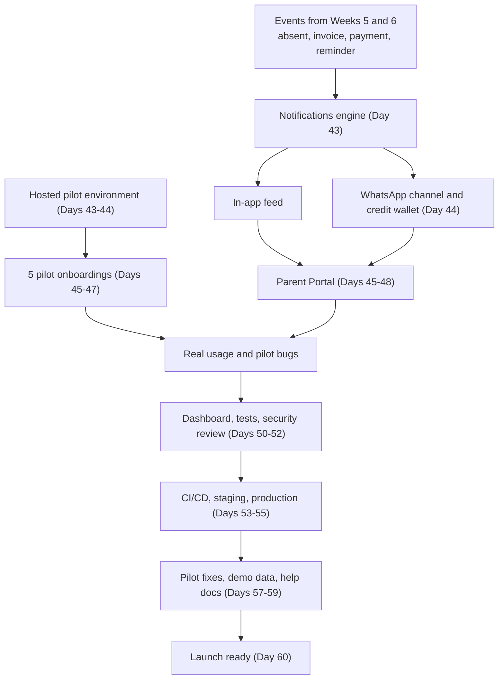
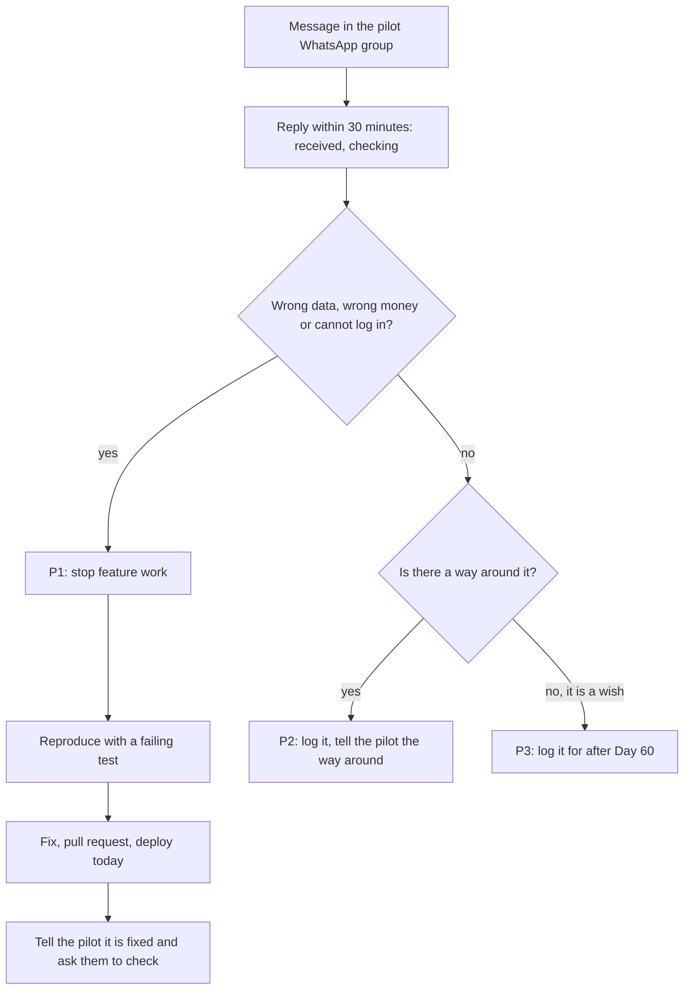
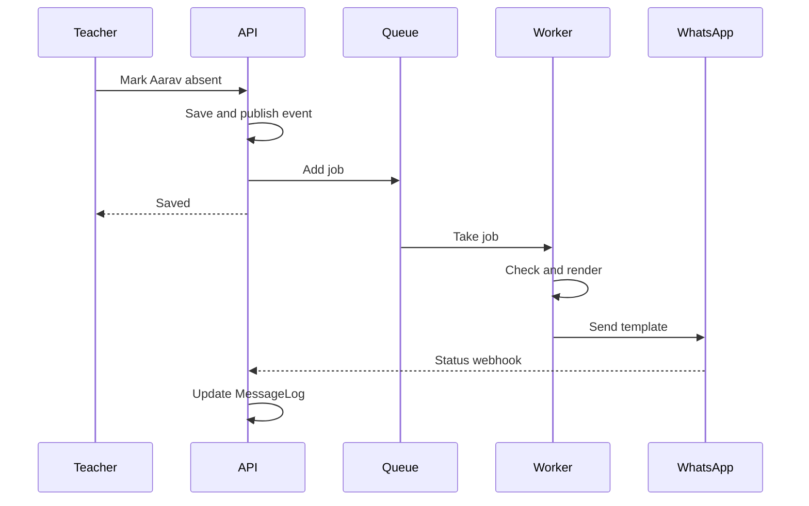
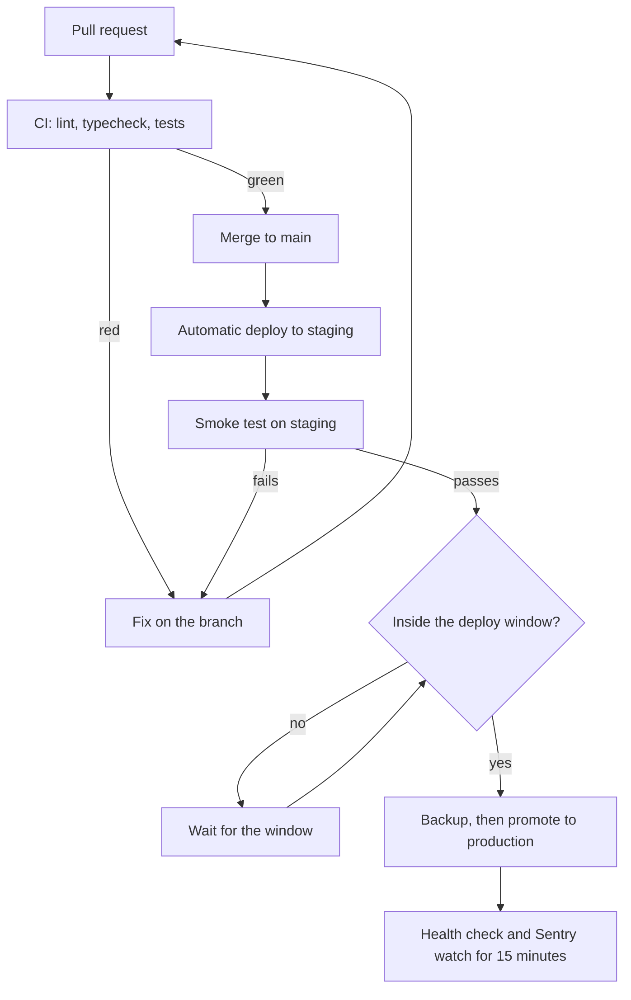

# Daily Plan: Days 43 to 60

**In simple words:** This chapter tells you what to do on each day from Day 43 (Monday, 16 November 2026) to Day 60 (Thursday, 3 December 2026). In these 18 days you build Notifications, WhatsApp, the Parent Portal and the Dashboard. You also put 5 real pilot institutes on the system, test and secure it, deploy it through a pipeline, and get it launch ready. From Day 45 real people depend on EduFlow, so the plan changes from "build fast" to "build carefully and keep pilots happy".

## Overview of Days 43 to 60

The table shows all 18 days on one page. Print it and tick off each day.

| Day | Date (2026) | Build goal | Prompts | Sales and customer task |
|---|---|---|---|---|
| 43 | Mon 16 Nov | Notifications engine, hosted environment part 1 | P-28 | Reminder calls to all 5 pilots |
| 44 | Tue 17 Nov | WhatsApp channel, credit wallet, pilot environment live | P-29 | Import data of pilots 1 and 2, confirm slots |
| 45 | Wed 18 Nov | Parent Portal API (4 build hours) | P-30 (backend) | Onboard pilots 1 and 2 |
| 46 | Thu 19 Nov | Parent Portal login, home, attendance (4 hours) | P-30 (frontend 1) | Onboard pilots 3 and 4 |
| 47 | Fri 20 Nov | Parent Portal fees, Pay Now, receipts (4 hours) | P-30 (frontend 2) | Onboard pilot 5, revisit pilots 1 and 2 |
| 48 | Sat 21 Nov | Finish the portal, fix the first pilot bugs | P-30 (finish) | Invite 40 parents at 2 pilots |
| 49 | Sun 22 Nov | Rest and Week 7 review | None | None |
| 50 | Mon 23 Nov | Dashboard and daily metric snapshots | P-20 | 5 check-ins, start the usage scoreboard |
| 51 | Tue 24 Nov | Tests by risk: isolation, auth, fees, payments | P-49 | 5 check-ins, first testimonial ask |
| 52 | Wed 25 Nov | Security review and fixes | P-52 | 5 check-ins, pricing talk with 2 pilots |
| 53 | Thu 26 Nov | Dockerfile and CI pipeline | P-55 | Pricing talk with 3 pilots, 2 testimonial asks |
| 54 | Fri 27 Nov | Staging, production, Sentry, backups | P-56 | 12 calls, 4 December demos booked |
| 55 | Sat 28 Nov | Playwright flows, timed restore test | P-50 | 2 demos, first paid commitment |
| 56 | Sun 29 Nov | Rest and Week 8 review | None | None |
| 57 | Mon 30 Nov | Feature freeze, pilot fixes, plan limit check | P-54 | Closing talks, second written yes |
| 58 | Tue 1 Dec | Demo tenants and one-command reset | P-58 | 1 demo, 2 proforma invoices sent |
| 59 | Wed 2 Dec | Help articles, API docs, release notes, checklist pass 1 | P-59 | 1 demo, third written yes |
| 60 | Thu 3 Dec | Go-live rehearsal, checklist sign-off, retrospective | P-54 (only if needed) | Thank 5 pilots, confirm December demos |

The weekly themes and prompt IDs come from *60-Day Roadmap Overview and Weekly Milestones*. Week 7 is "Notifications, WhatsApp, Parent Portal; pilot starts Day 45" with P-28 to P-30. Week 8 is "Dashboard, tests, security review, CI/CD, staging and production deploy" with P-20, P-49, P-50, P-52, P-55 and P-56. Week 9 is "Pilot feedback fixes, demo data, launch checklist, go-live" with P-54, P-58 and P-59. The full prompt text is in *Prompts: Finance and Communication* (P-28 to P-30), *Prompts: Core Modules (Phase 1)* (P-20) and *Prompts: Quality, Security and DevOps* (P-49 to P-59).

These are the sales and customer numbers for the three weeks. They are targets, not promises. Write the real numbers next to them every evening.

| Number | Week 7 target | Week 8 target | Week 9 target |
|---|---|---|---|
| Pilots onboarded and activated (running total) | 5 | 5 | 5 |
| Pilot check-ins done (10 minutes each) | 8 | 30 | 20 |
| Parents invited (running total) | 40 | 150 | 300 |
| Parents logged in at least once (running total) | 10 | 50 | 120 |
| New demos done (running total since Day 1) | 0 (10) | 2 (12) | 2 (14) |
| December demos booked (running total) | 0 | 10 | 10 confirmed by date |
| Testimonials with written permission | 0 | 3 | 3 |
| Paid commitments for January 2027 (running total) | 0 | 1 | 3 |

Activated means the canon activation measure: the institute did a first fee receipt or a first day of attendance within 7 days of signup. The parent numbers are assumptions for 5 pilots with about 1,000 students in total. Replace them with your own numbers after Day 48.

> **Founder note:** Your day changes shape on Day 45. On Days 45 to 47 you build for 4 hours and onboard pilots for about 4 hours. From Day 50 you are back to 6 build hours and 2 customer hours. From Day 45 one rule from *60-Day Roadmap Overview and Weekly Milestones* is above all others: pilot support comes before new outreach, and a wrong-money bug comes before any feature.

## How the last three weeks fit together

**Figure: From published events to a launch-ready product (Days 43 to 60)**



The left side is code and the right side is customers. They meet in the box "Real usage and pilot bugs". Everything after that box exists to make the product safe to sell in January 2027. No new module starts after Day 50.

Four working rules apply to every day in this chapter.

1. **Pilot first.** Each morning starts with 15 minutes of pilot triage (sorting new problems by urgency). A P1 bug (wrong data, wrong money, or a user cannot log in) is fixed the same day, before the planned build tasks.
2. **Money code is frozen.** Week 7 features listen to events and read data. They do not change the collect service, the payment confirm function or the invoice calculation from Weeks 5 and 6. Run the end-to-end money test from *Daily Plan: Days 29 to 42* after any change that touches fees or payments.
3. **Schema changes are rare and additive.** All tables exist since P-04. If real pilot data proves that a column is missing, the migration may only add a nullable column or a new table. No renames, no drops and no type changes until after Day 60.
4. **Deploy only in the deploy window.** Coaching institutes are busy from 06:00 to 10:00 and from 16:00 to 21:00. Schools are busy from 08:00 to 15:00. Assumption used in this chapter: you deploy to the pilot environment after 21:30, or between 13:30 and 15:00 if all affected pilots are coaching institutes. A P1 fix is the only exception.

> **Warning:** Do not start Day 43 if the end-to-end money test from Day 41 fails on `main`. Parents will see these numbers on their phones from Day 48. Fix the money bug first, even if Notifications start half a day late.

## Pilot rules card

Paste this card into `CLAUDE.md` on the morning of Day 43, below the money rules card. Claude Code reads `CLAUDE.md` at the start of every session, so every prompt in the next 18 days follows these rules without you repeating them.

```text
PILOT RULES (apply from Day 43 until Day 60)
1. Real institutes use this system from Day 45. Wrong data, wrong
   money or "cannot log in" is a P1 bug. P1 is fixed the same day.
2. Do not change the Prisma schema without asking me first. A needed
   migration must be additive: a new nullable column or a new table.
   No renames, no drops, no type changes.
3. Do not edit the collect service, the payment confirm function or
   the invoice calculation unless the task is a money bug. Say so
   before you edit.
4. Every bug fix starts with a failing test that reproduces the bug.
5. Never print, log or paste real phone numbers, names or OTPs.
   Mask phone numbers in logs like this: +91XXXXXX3210.
6. Outside production, WhatsApp sends only to allow-listed test
   numbers. Never loop over real guardians in a script.
7. A one-off data fix runs as a reviewed script inside a transaction,
   with a row count check before COMMIT. No free-hand SQL on the
   pilot database.
8. Every change ships through a pull request with a green check run.
```

Two terms in the card need a plain explanation.

- **Additive migration** (a database change that only adds things): old code keeps working with the new database. This matters because you deploy code and database at slightly different moments.
- **Allow list** (a short list of values that are permitted; everything else is refused): here it is a list of your own test phone numbers. It makes it impossible to message 350 real parents from your laptop by mistake.

## Bug triage for the pilot

Triage means deciding the urgency of each problem before you touch it. Use the same three levels as *60-Day Roadmap Overview and Weekly Milestones*.

| Priority | What it means | Example | When you fix it |
|---|---|---|---|
| P1 | Wrong data, wrong money, or a user cannot log in | Receipt shows ₹1,200 for a ₹12,000 payment | Same day, before feature work |
| P2 | A feature is broken but there is a way around it | CSV export fails, screen still shows the data | This week, in the next bug slot |
| P3 | Cosmetic issue, wish or new feature idea | "Can the receipt have our second logo?" | After Day 60, on the backlog |

Keep one bug log for all pilots. A Google Sheet is enough. Use these columns.

| Column | Example |
|---|---|
| ID | BUG-014 |
| Date and pilot | 19 Nov, Sharma Classes |
| Reported by | Suresh Gupta (accountant), WhatsApp group |
| What happened | Receipt PDF shows batch "M1" twice |
| Priority | P2 |
| Sentry link or screenshot | Link to the issue |
| Status and fix date | Fixed 20 Nov, deployed 21:45 |

**Figure: What to do when a pilot reports a problem**



The first reply matters more than the fix time. A pilot owner who hears "received, checking" within 30 minutes stays calm for a day. One who hears nothing for 3 hours starts to doubt the product.

## Daily routine from Day 45

The Git routine (branch, check, pull request, squash merge) stays the same as in *Daily Plan: Days 29 to 42*. From Day 45 you add a pilot routine around it.

| When | Minutes | What you do |
|---|---|---|
| Morning, before building | 15 | Read the 5 pilot WhatsApp groups, open Sentry, check failed jobs in the BullMQ queues, check that last night's backup file exists |
| Morning | 10 | Give every new problem a priority and a row in the bug log |
| 13:30 to 15:00 or after 21:30 | 20 | Deploy window: backup first, then deploy, then run the smoke test |
| Evening | 10 | Take the manual backup (until Day 54 automates it) and write one line in the sprint log |

A smoke test is a 3-minute check that the main paths still work after a deploy: the health route answers, you can log in, one student opens, one receipt PDF opens.

Until the automated backup arrives on Day 54, run this every evening. It uses the PostgreSQL 16 tools inside your local Docker container, so you do not need to install anything. Use a bash shell (Git Bash on Windows works).

```bash
# PILOT_DB_ADMIN_URL = the admin (owner) connection string of the hosted database.
# Keep it in your password manager, never in the repository.
docker compose exec -T postgres \
  pg_dump "$PILOT_DB_ADMIN_URL" --format=custom > "pilot-$(date +%F).dump"
ls -lh pilot-*.dump
```

Then copy the file to a private S3 bucket (a storage folder on AWS) in `ap-south-1`, for example with `aws s3 cp`. The bucket name and the retention rule (how long you keep old backups) are decided in *Monitoring, Backups and Incident Response*. Delete the local copy after the upload. A backup with real student data must not live on your laptop.

> **Warning:** Use the admin URL for `pg_dump`, not the `eduflow_app` URL. The runtime role is blocked by Row-Level Security, so its dump stops with an error. That error is correct behaviour. Also choose PostgreSQL 16 when you create the hosted database, the same major version as your local Docker image. `pg_dump` refuses to dump a server that is newer than itself.

## Week 7: Notifications, WhatsApp and Parent Portal

Week 7 is the heaviest week of the sprint. It has two halves. On Monday and Tuesday you build the voice of the system and put it on the internet. From Wednesday you split each day between the Parent Portal and pilot onboarding. The milestone is M7 "Parents connected + pilot live", with the tag `m7-pilot-live`.

What is deliberately out of scope this week: the full Email and SMS channels (P-31, Phase 2), announcements to a filtered audience, push notifications, the two-way WhatsApp inbox screen, the Student Portal (P-40, Phase 2), and Hindi screens (P-60). The email that already exists from P-07 (invitations and password reset) stays as it is.

> **Note:** Assumption from *60-Day Roadmap Overview and Weekly Milestones*: the first hosted deploy is done by hand on Days 43 and 44, following *Deploy on Vercel and Railway*. In Week 8, P-55 and P-56 turn it into a staging and production pair with a pipeline. This chapter adds one more decision: the pilot environment you create now becomes production on Day 54. Real data is never moved between environments.

### Day 43 — Monday, 16 Nov 2026: Notifications engine and hosted environment part 1

**Goal:** Marking Aarav Sharma absent creates a job, a worker renders the right template, and Sunita Devi sees an in-app notification. The API never waits for the message.

**Time plan (6 build hours):** 30 min read the specs and paste the pilot rules card, 3 h build P-28 with Claude Code and review diffs, 45 min tests, 1 h 45 min hosted environment part 1.

**Build tasks**

1. Run the Day 41 end-to-end money test once on `main`. Paste the pilot rules card into `CLAUDE.md` and commit it alone: `docs(claude): add pilot rules card`.
2. Read `docs/prd/31-notifications-module.md`, `docs/prd/58-background-jobs-and-events.md` and `docs/prd/93-appendix-notification-template-catalog.md`. Create the branch `feat/notifications-engine`.
3. Run P-28. First ask Claude Code to list the `NTF-API` IDs from `docs/api/` and the event keys from the template catalog, for example `attendance.absent`, `fees.receipt` and `fees.reminder.overdue`. Say OK, then let it write code.
4. Build the listeners for the four events you published in Weeks 5 and 6: student absent, invoice created, payment received and fee reminder. A listener only creates a job in a BullMQ queue (BullMQ is the Redis-based job queue from the canon stack). It never sends anything itself.
5. Build the worker (a separate background process that takes jobs from the queue). For each job it finds the recipients (the guardians of the student), checks `NotificationPreference`, renders the `NotificationTemplate` body with `{{variables}}`, and writes one `MessageLog` row per recipient and channel.
6. Template lookup order: the tenant's own template first, then the system default where `organizationId` is null. Language falls back to `en`.
7. Build the channel adapter interface (one small contract that every channel implements: send, and map the provider status). Today only `IN_APP` is real. It writes a `Notification` row. The `WHATSAPP` adapter is a stub that logs "would send" with a masked phone number. Tomorrow you replace the stub.
8. Retries: follow `docs/prd/58-background-jobs-and-events.md`. If it is silent, use 3 attempts with exponential backoff (wait longer after each failure). After the last failure the `MessageLog` status is `FAILED` and the job stays visible in the failed list.
9. Build the in-app feed: bell icon with unread count, list of notifications, mark one as read, mark all as read, and a click that follows the `deepLink` to the invoice or the student.
10. Hosted environment part 1 (last 1 h 45 min). Follow *Deploy on Vercel and Railway*. In Railway create one project with PostgreSQL 16, Redis, an API service and a worker service, both services from the `main` branch of your GitHub repository. In Vercel create the project for the `client/` folder. Today's finish line is small: the hosted health route answers.
11. One thing will stop you, and it is correct. Since Day 9 the server refuses to start in production while only the `ConsoleSender` exists, because OTPs must never be written to production logs. So tonight the hosted environment runs in a non-production mode and holds no real data. Tomorrow you plug WhatsApp into the `MessageSender` interface and switch the environment to production before any pilot data goes in.

**Figure: What happens when a teacher marks a student absent**



The teacher gets the "saved" answer before any message is sent. If WhatsApp is slow or down, attendance still works. In "Check and render" the worker checks the parent's preference and the credit wallet, then fills the template. WhatsApp delivers the message to the parent's phone and reports the status back through the webhook. The last two arrows arrive tomorrow with P-29.

**Claude Code prompts to run today**

Run P-28 from *Prompts: Finance and Communication*. Add this text at the end of the prompt:

```text
SCOPE FOR TODAY: Notifications engine, API and the in-app feed.
Read CLAUDE.md (pilot rules), docs/prd/31-notifications-module.md,
docs/prd/58-background-jobs-and-events.md, the template catalog in
docs/prd/93 and the Notifications file in docs/api/.
Step 1: list the NTF-API IDs and the event keys you will handle.
Wait for my OK.
Step 2: listeners for student absent, invoice created, payment
received and fee reminder. A listener only adds a BullMQ job.
Step 3: worker: recipients, preference check, template render,
one MessageLog row per recipient and channel, retries from docs/prd/58.
Step 4: channel adapter interface. IN_APP is real. WHATSAPP is a stub
that logs "would send" with a masked phone number.
Step 5: in-app feed API and the bell menu in the app shell.
Step 6: tests: the API responds before the job runs, a disabled
preference sends nothing, a tenant template beats the system default,
tenant isolation on notifications and message logs.
Do not change fees or payments code. Do not change the Prisma schema.
```

**Manual test checklist** (browser plus Prisma Studio)

| # | Check | Expected result |
|---|---|---|
| 1 | Log in as Priya Nair and mark Aarav Sharma absent | Attendance saves in under 1 second |
| 2 | Log in as Sunita Devi (seed parent user) and open the bell | One unread notification with Aarav's name and today's date |
| 3 | Click the notification | It opens the right page and the unread count drops by 1 |
| 4 | Collect ₹1,000 for Aarav as Suresh Gupta | Sunita Devi gets a payment notification with the receipt number |
| 5 | Switch off the Attendance category for Sunita Devi, mark absent again | No new in-app notification, no new `MessageLog` row for her |
| 6 | Stop the worker, mark a student absent, start the worker | The API still answered at once, the notification appears after the worker starts |
| 7 | Log in at Sharma Classes and call the feed API | No Bright Future notification is visible |
| 8 | Open the hosted API health URL in the browser | Success envelope, PostgreSQL and Redis both OK |

**Sales and customer task of the day (60 minutes)**

Call all 5 pilot owners. Do not message, call. You need three things from each call: the student Excel file, the fee questionnaire answers, and a confirmed onboarding time. Target: 5 calls, data in hand from at least 3 pilots, 5 confirmed times written in the pilot tracker.

```text
Namaste Rajesh ji, Mehdi bol raha hoon EduFlow se.
Parso, Wednesday 18 November ko 12 baje aapka onboarding hai.
Do cheezein aaj chahiye taaki main data pehle se daal doon:
1. Student list wali Excel file.
2. Fee structure - har course ki fees aur instalment dates.
Aur us din accountant aur ek teacher 90 minute ke liye free rahen.
Kya aaj shaam tak file bhej sakte hain?
```

If a pilot has gone silent since Day 40, call backup institute number 1 today. Four good pilots are better than five weak ones.

**Deliverable and commit**

Merged to `main`: Notifications engine, worker, in-app feed and tests. The hosted API answers on its health route.

```text
feat(notifications): add event listeners, worker, templates and in-app feed
```

**If you are behind**

Cut the preferences screen (keep the preference check in the worker with everything switched on) and the tenant template override screen. Never cut the worker, the `MessageLog` rows or the rule that the API does not wait. If the hosted environment is not answering by 18:00, stop and finish it tomorrow morning first. Pilots come on Wednesday, and they need a URL more than they need WhatsApp.

### Day 44 — Tuesday, 17 Nov 2026: WhatsApp channel, credit wallet and pilot environment live

**Goal:** Marking Aarav absent sends a real WhatsApp message to your own test phone within a minute, the credit wallet goes down, and the pilot environment is live with a first backup.

**Time plan (6 build hours):** 3 h 30 min build P-29 and review, 1 h 30 min finish the hosted environment, 1 h smoke test, first backup and merge. The data import for pilots 1 and 2 is in the customer block.

**Build tasks**

1. Read `docs/prd/32-whatsapp-module.md` and the WhatsApp part of `docs/prd/57-integrations-and-webhooks.md`. Create the branch `feat/whatsapp-channel`. Run P-29 and ask for the `WA-API` IDs first.
2. Replace the stub with the real adapter. It sends an approved template message (a message format that Meta has approved in advance) through the WhatsApp Cloud API. The request shape is shown below. Use the Graph API version and the phone number ID shown in your Meta app dashboard.
3. Connect templates: one `WhatsAppTemplate` row per approved Meta template, linked from the matching `NotificationTemplate` through `whatsAppTemplateId`. The order of the `variables` array must match the numbered placeholders of the Meta template.
4. Build the webhook (a URL that Meta calls to tell you something happened). The GET request is the one-time verification: check `hub.verify_token` and answer with `hub.challenge`. The POST request carries status updates: `sent`, `delivered`, `read` or `failed`. Map them to `MessageLog.status`.
5. Check the `X-Hub-Signature-256` header on every POST. It is an HMAC SHA-256 of the raw request body with your Meta app secret. Same idea as the Razorpay webhook on Day 40. A wrong signature gets no processing. Store each event in `WebhookEvent` so that a repeated delivery is ignored.
6. Build the credit wallet: one `MessageCreditWallet` per organization for the `WHATSAPP` channel with unit `MONEY`. Each send writes a `CONSUME` row in `CreditTransaction` in the same database transaction that updates the balance. A send that fails at the provider gets a `REFUND` row. The ledger is append-only (rows are added, never edited).
7. At zero balance the worker does not send. It marks the `MessageLog` as `FAILED` with a clear reason and notifies the `ORG_ADMIN` in-app once. Below `lowBalanceThreshold` the admin gets one warning.
8. Add the safety switch from the pilot rules card: outside production, the adapter sends only to numbers on an allow list. Let Claude Code name the variable and document it in `.env.example`.
9. Plug the real channels into the `MessageSender` interface from Day 9, so that the `ConsoleSender` is no longer needed in production. OTPs go out with the WhatsApp authentication template. Assumption: they are not charged to the institute's wallet, because a login code is EduFlow's cost, not the institute's message. Invitation and password reset links go through the small mailer from P-07 if your Amazon SES production access is approved. If it is not, show a "Copy invite link" button to the `ORG_ADMIN` and share the link by hand on WhatsApp, as the buffer plan in the roadmap says.
10. Build the two small screens: WhatsApp settings (connection status, quality rating, templates with approval status) and the wallet page (balance, last 50 transactions).
11. Finish the hosted environment (details below), deploy `main`, run the smoke test and take the first backup.

Meta charges per template message, by category and country. Canon rule: EduFlow charges the Meta cost plus 15% margin. Work with an example number until you read the current Meta rate card.

| Item | Formula | Value |
|---|---|---|
| Meta cost of one utility message (assumption, check the rate card) | | ₹0.1200 |
| EduFlow charge per message | ₹0.12 × 1.15 | ₹0.1380 |
| Messages in the ₹499 credit pack | ₹499 ÷ ₹0.138 | about 3,615 |
| Sharma Classes, 350 students, 2 messages per student per month | 350 × 2 × ₹0.138 | ₹96.60 a month |

The wallet uses `Decimal(12, 4)`, so ₹0.1380 is stored exactly. For the pilot, give each institute a `BONUS` transaction equal to the smallest pack (₹499), so that pilots send for free.

```http
POST https://graph.facebook.com/{graph-version}/{phone-number-id}/messages
Authorization: Bearer {whatsapp-access-token}
Content-Type: application/json
```

```json
{
  "messaging_product": "whatsapp",
  "to": "919876543210",
  "type": "template",
  "template": {
    "name": "attendance_absent",
    "language": { "code": "en" },
    "components": [
      {
        "type": "body",
        "parameters": [
          { "type": "text", "text": "Aarav Sharma" },
          { "type": "text", "text": "17 Nov 2026" },
          { "type": "text", "text": "Bright Future Public School" }
        ]
      }
    ]
  }
}
```

The template name `attendance_absent` is an example. Use the exact names you submitted to Meta on Day 29, as listed in `docs/prd/93-appendix-notification-template-catalog.md`.

**Finish the hosted pilot environment (1 h 30 min)**

Do these steps in this order. The exact clicks are in *Deploy on Vercel and Railway*, and the variable names are in *Environment Variables and Command Reference*.

1. Set the environment variables of the API and the worker: database URLs, Redis URL, JWT secrets (new random values, never the ones from your laptop), S3 bucket and keys, Razorpay keys, WhatsApp token, phone number ID, app secret and verify token, Sentry DSN. Switch the environment to production now that a real sender exists. The API must start without the `ConsoleSender`.
2. Run the migrations against the hosted database with the admin URL: `npx prisma migrate deploy`. This command only applies existing migrations. Never run `migrate dev` or `migrate reset` against a hosted database.
3. Seed reference data only: plans, permissions, system roles, countries and currencies. The two demo organizations do not belong here yet. They arrive with P-58 on Day 58. If your seed script cannot do this, use the follow-up prompt below.
4. Check the two database roles. The API must connect as `eduflow_app`, not as the admin. If it connects as the admin, Row-Level Security is silently skipped.
5. Point the domain: `app.eduflow.app` to Vercel and `api.eduflow.app` to Railway. Each dashboard shows the exact DNS record to add. HTTPS certificates are issued automatically. Tenant subdomains such as `sharma-classes.eduflow.app` come on Day 54. Until then every pilot logs in at `app.eduflow.app`.
6. Set the Meta webhook URL and the Razorpay webhook URL to the hosted API.
7. Create the 5 pilot organizations through the real sign-up and onboarding wizard from P-11, not with SQL. This is also your test of the wizard on the hosted environment.

Check the runtime role with the admin URL:

```sql
SELECT rolname, rolsuper, rolbypassrls FROM pg_roles WHERE rolname = 'eduflow_app';
-- expect one row: eduflow_app | f | f
```

If the role does not exist (P-06 may have created it only in your local Docker setup), create it once and give it a long random password:

```sql
CREATE ROLE eduflow_app LOGIN PASSWORD 'replace-with-a-long-random-password';
GRANT USAGE ON SCHEMA public TO eduflow_app;
GRANT SELECT, INSERT, UPDATE, DELETE ON ALL TABLES IN SCHEMA public TO eduflow_app;
GRANT USAGE, SELECT ON ALL SEQUENCES IN SCHEMA public TO eduflow_app;
ALTER DEFAULT PRIVILEGES IN SCHEMA public
  GRANT SELECT, INSERT, UPDATE, DELETE ON TABLES TO eduflow_app;
```

> **Note:** Assumption: the free pilot runs until 31 December 2026 and paid plans start on 1 January 2027. Set `trialEndsAt` of each pilot organization to that date, and put each pilot on the plan that fits its size: Growth up to 300 active students, Pro up to 1,000. If your pilot letter says another date, use that date.

**Claude Code prompts to run today**

Run P-29 from *Prompts: Finance and Communication* with this ending:

```text
SCOPE FOR TODAY: WhatsApp channel and the message credit wallet.
Step 1: list the WA-API IDs. Wait for my OK.
Step 2: replace the WHATSAPP stub adapter with a real Cloud API
template send. Map each NotificationTemplate to its WhatsAppTemplate.
Step 3: webhook GET verification and POST status updates. Verify
X-Hub-Signature-256 on the raw body. Deduplicate with WebhookEvent.
Step 4: wallet: CONSUME on send and REFUND on provider failure, both
in one transaction with the balance update. Stop at zero balance.
Step 5: outside production, send only to allow-listed numbers.
Step 6: implement the MessageSender interface from P-07 with real
channels: OTP by the WhatsApp authentication template (not charged
to the tenant wallet), invitation and reset links by the P-07
mailer, plus a "Copy invite link" action for ORG_ADMIN. Production
must start without the ConsoleSender and must never log an OTP.
Step 7: tests: bad signature is rejected, repeated webhook is
ignored, two parallel sends never make the balance negative,
zero balance sends nothing, tenant isolation on wallet and logs.
Do not build Parent Portal endpoints today. That is P-30.
```

Follow-up prompt for the seed, only if you need it:

```text
Our seed script creates reference data and two demo organizations.
Add a reference-only mode that seeds plans, permissions, system
roles, countries and currencies, and nothing else. It must be safe
to run twice. Document the command in CLAUDE.md under "Commands".
```

**Manual test checklist**

| # | Check | Expected result |
|---|---|---|
| 1 | Put your own number as Sunita Devi's phone locally, mark Aarav absent | WhatsApp message arrives on your phone within 1 minute |
| 2 | Open the message log and the wallet page | Status moves from `SENT` to `DELIVERED` to `READ`, balance dropped by one charge, one `CONSUME` row |
| 3 | On the hosted environment, request a login OTP for your own number | OTP arrives on WhatsApp, the hosted logs show no code, the wallet is unchanged |
| 4 | Set the wallet balance to zero in a test tenant, mark absent | No message, `FAILED` with a clear reason, admin sees one warning |
| 5 | POST a fake status to the webhook with a wrong signature | Rejected, nothing changes in the message log |
| 6 | Open `app.eduflow.app`, sign up a test organization, log in | Works over HTTPS, the onboarding wizard completes |
| 7 | Connect to the hosted database as `eduflow_app` and run `SELECT count(*) FROM students;` | 0 rows, because no tenant is set |
| 8 | Run the evening backup command | A dump file exists and is larger than zero bytes |

**Sales and customer task of the day (120 minutes)**

Import the data of pilots 1 and 2 on the hosted environment, so that tomorrow you walk in with their own students on the screen. Use the Excel import from P-16 with the dry run first (a test run that shows errors and saves nothing). Fix the Excel file, not the database. Then create their fee structures from the questionnaire and generate no invoices yet. Send each owner a confirmation. Target: 2 pilots with students and fee structures loaded, 5 confirmations sent.

```text
Rajesh ji, aapka data EduFlow mein aa gaya hai: 348 students,
6 batches. 2 rows mein parent ka mobile number galat tha, woh
kal saath mein theek kar lenge.
Kal 12:00 baje milte hain. Accountant ji aur ek teacher ko
saath rakhiyega. Laptop aur unka phone kaafi hai.
```

**Deliverable and commit**

Merged to `main` and deployed: WhatsApp channel, webhook, credit wallet. The pilot environment is live at `app.eduflow.app` in production mode with 5 pilot organizations, 2 of them already loaded with students and fee structures, and one backup file in S3.

```text
feat(whatsapp): add cloud api channel, status webhook and credit wallet
```

**If you are behind**

Use Level 3 of the scope-cut ladder: send only two templates, payment receipt and absent alert. Cut the WhatsApp settings screen and the wallet page (keep the wallet logic). If Meta has not approved your number or templates, go live with in-app notifications only and tell pilots that WhatsApp follows in a few days. Never cut the hosted environment, the role check or the first backup. Without them there is no pilot tomorrow.

### Day 45 — Wednesday, 18 Nov 2026: Pilot day one and the Parent Portal API

**Goal:** Pilots 1 and 2 each do a first real action on EduFlow, and the Parent Portal API returns only a parent's own children.

**Time plan (4 build hours, about 4 customer hours):** the table below is a sample day. Move the onboarding times to what each owner confirmed.

| Time | Block |
|---|---|
| 07:00 to 07:15 | Pilot routine: Sentry, failed jobs, backup file |
| 07:15 to 11:15 | Build: Parent Portal API (P-30, backend only) |
| 12:00 to 13:30 | Onboarding of pilot 1 |
| 14:30 to 16:00 | Onboarding of pilot 2 |
| 16:00 to 16:30 | Bug log, thank-you messages, notes for the help articles |
| 21:30 to 22:30 | Import data of pilots 3 and 4, deploy window, evening backup |

These three days are long. Plan nothing else on them.

**Build tasks**

1. Read `docs/prd/29-parent-portal-module.md`, the OTP part of `docs/prd/06-authentication-and-sessions.md` and the consent part of `docs/prd/61-privacy-and-compliance.md`. Create the branch `feat/parent-portal-api`. Run P-30 with the scope "backend only" and ask for the `PP-API` IDs first.
2. Parent OTP login (OTP means one-time password, a short code sent to the phone). The OTP endpoints exist since Day 9 (P-07), with a hashed code in `OtpCode`, purpose `LOGIN` and 5 attempts. Do not rebuild them. Today you connect them to guardians: a code is created only when the mobile number matches an active `Guardian` of that organization. Since yesterday the code travels by the WhatsApp authentication template.
3. The answer to "send OTP" is always the same, whether the number exists or not. Otherwise a stranger can find out which numbers belong to parents of an institute. Check that the Day 9 code already behaves like this.
4. After a correct OTP, the parent gets the normal token pair from P-07 with the `PARENT` role. Follow the PRD for the moment when the parent `User` row is created and linked to the `Guardian`. If it is silent, create it at the first successful OTP login.
5. Enforce the `Own` scope in one place. Every parent endpoint first loads the guardian's children through `StudentGuardian`. A `studentId` from the URL is checked against that list. A student who is not on the list gives `404`, never `403`, so the API does not confirm that the student exists.
6. Build the read endpoints: my children, attendance summary and month calendar for one child, fee dues (invoices with a balance), receipts with a pre-signed PDF link (a private S3 link that works for a few minutes), and the notification feed from Day 43.
7. Pay Now reuses the create order and verify endpoints from Day 39. Add only the `Own` check in front of them. Do not write new money code.
8. Consent: at first login the parent must accept the privacy notice. Store `ConsentRecord` rows (`PRIVACY_POLICY`, `CHILD_DATA_PROCESSING`, `COMMUNICATION_WHATSAPP`) with the verification method `OTP`. Until consent exists, every other parent endpoint answers `403`.
9. Write the tests listed in the prompt below. The two-parents test is part of the Week 7 definition of done.

**Claude Code prompts to run today**

Run P-30 from *Prompts: Finance and Communication* with this ending:

```text
SCOPE FOR TODAY: backend only for the Parent Portal. No client code.
Read CLAUDE.md, docs/prd/29-parent-portal-module.md, the OTP rules in
docs/prd/06, the consent rules in docs/prd/61 and the Parent Portal
file in docs/api/.
Step 1: list the PP-API IDs with method, path and permission key.
Wait for my OK.
Step 2: reuse the OTP login from P-07. Do not rebuild it. Add only:
a code is created when the phone matches an active Guardian of the
organization, the parent User is created and linked at first login,
same response for known and unknown numbers. Development keeps the
ConsoleSender. Production sends by the WhatsApp OTP template.
Step 3: one helper that returns the student IDs of the logged-in
guardian. Every parent endpoint uses it. Unknown student gives 404.
Step 4: children, attendance, dues, receipts, notifications.
Step 5: Pay Now calls the existing create-order and verify services
after the Own check. Do not change those services.
Step 6: consent gate with ConsentRecord rows.
Step 7: tests: two parents in the same batch cannot see each other's
child, a parent with two children sees both, wrong OTP five times is
blocked, expired OTP fails, no consent gives 403, tenant isolation.
```

**Manual test checklist** (API client)

| # | Check | Expected result |
|---|---|---|
| 1 | Request an OTP for Sunita Devi's number | `200`, the OTP appears in the local server log only |
| 2 | Request an OTP for a number that is not a guardian | The same `200` answer, no OTP created |
| 3 | Verify with a wrong code 5 times | Blocked with `RATE_LIMITED` or the code from the PRD |
| 4 | Log in and fetch "my children" before consent | `403` with a message that consent is needed |
| 5 | Accept consent, fetch children | Only Aarav Sharma (and any sibling) is returned |
| 6 | Put another student's ID in the attendance URL | `404`, never data |
| 7 | Fetch dues and receipts for Aarav | Same balances as the staff screens show |
| 8 | Look at the `otp_codes` table in Prisma Studio | Only a hash is stored, never the 6 digits |

**Sales and customer task of the day (about 4 hours): onboard pilots 1 and 2**

The full method is in *Onboarding and Customer Success Playbook*. This is the 90-minute agenda you follow in the room. The data is already imported, so the meeting is about people, not about typing.

| Minutes | What happens | Who does it |
|---|---|---|
| 0 to 10 | Agree on the goal of the pilot and the one number the owner cares about (usually pending fees) | You and the owner |
| 10 to 25 | Show their own students, batches and fee structure. Fix the rows with wrong phone numbers together | You and the owner |
| 25 to 35 | Create users: owner as `ORG_ADMIN`, the accountant, one teacher. Each person sets a password on their own phone | You |
| 35 to 60 | The accountant collects one real fee that is due today and prints the receipt. Then a second one without your help | Accountant |
| 60 to 75 | The teacher marks today's attendance for one batch on their own phone | Teacher |
| 75 to 85 | Make the WhatsApp group "EduFlow x Sharma Classes". Agree on a fixed 10-minute check-in time each day | You and the owner |
| 85 to 90 | Say clearly what is not there yet: the Parent Portal comes on Saturday, reports come next week | You |

Open with these lines. They set the tone for the whole pilot.

```text
Rajesh ji, aaj ka target simple hai. 90 minute mein teen kaam:
1. Aapka data sahi hai ya nahi, saath mein check karenge.
2. Suresh ji ek asli fee receipt EduFlow se kaatenge.
3. Ek teacher apne phone se aaj ki attendance lagayenge.
Agar kuch samajh na aaye to wahin rok dijiye. Galti software ki
hai, aapki nahi. Mujhe wahi jaanna hai.
```

Target: 2 pilots onboarded, each with at least 1 real receipt or 1 day of attendance, 2 WhatsApp groups created, every confusion written down. In the evening import the data of pilots 3 and 4.

> **Tip:** Sit next to the accountant and keep your hands off the mouse. Every place where Suresh Gupta stops and looks at you is a usability bug or a help article. Write down the exact screen and the exact words he used.

**Deliverable and commit**

Merged to `main`: Parent Portal API with OTP login, `Own` scope, consent gate and tests. Pilots 1 and 2 are activated.

```text
feat(parent-portal): add guardian otp login, own-children api and consent
```

**If you are behind**

Cut the Pay Now wiring and the notification feed endpoint. Parents arrive only on Day 48. Keep OTP login, children, attendance, dues, receipts and the two-parents test. If an onboarding runs long, the build hours lose, never the pilot. A half-trained accountant costs you more days than a late endpoint.

### Day 46 — Thursday, 19 Nov 2026: Parent Portal login, home and attendance screens

**Goal:** Sunita Devi logs in with an OTP on a 360-pixel phone screen, accepts the privacy notice, and sees Aarav's attendance. Pilots 3 and 4 go live.

**Time plan (4 build hours, about 4 customer hours):** 15 min pilot routine, 30 min fix or log yesterday's pilot problems, 3 h portal screens, 15 min merge. Onboardings at the confirmed times, as on Day 45.

**Build tasks**

1. Triage the notes from pilots 1 and 2. P1 items are fixed now. Everything else gets a row in the bug log and waits for Saturday.
2. Create the branch `feat/parent-portal-ui-1`. Run P-30 with the scope "frontend part 1". Use the screen list and wireframes in `docs/prd/29-parent-portal-module.md` and the mobile rules in `docs/prd/08-design-system-and-ux-guidelines.md`.
3. Rework the OTP login pages from Day 11 for parents on a phone: mobile number, then a 6-box OTP input with a 30-second resend timer. The number keyboard opens automatically. Error texts are plain: "Wrong code. 3 tries left."
4. Build the consent screen: short privacy notice in simple English, a link to the full policy, one checkbox per consent type from the PRD, and one button. No pre-ticked boxes.
5. Build the home screen: one card per child with name, batch, admission number, this month's attendance percentage and today's status. Below it the fees due card and the latest three notifications.
6. Build the attendance screen: month calendar with present and absent days, the monthly percentage, and a month switcher. No sideways scrolling at 360 pixels.
7. Build the child switcher for parents with more than one child, and the bottom navigation with four items: Home, Attendance, Fees, More.
8. Use the loading, empty and error states from the UI kit (P-10). A parent on a slow mobile network must never see a blank white screen.

**Screen — Parent Portal home (Parent, mobile)**

```text
+------------------------------------+
| EduFlow           Sunita Devi  (=) |
+------------------------------------+
| Bright Future Public School        |
|                                    |
| +--------------------------------+ |
| | Aarav Sharma                   | |
| | Class 10-A     BF-2027-0142    | |
| | Attendance this month: 92.0%   | |
| | Today: Absent                  | |
| +--------------------------------+ |
|                                    |
| Fees due                           |
| +--------------------------------+ |
| | INV-1042  Tuition Q3           | |
| | Due 10 Dec        Rs 12,000    | |
| |                    [Pay Now]   | |
| +--------------------------------+ |
|                                    |
| Latest messages                    |
| - Aarav was absent today           |
| - Receipt RCP-0311, Rs 15,000      |
|                                    |
| [Home] [Attendance] [Fees] [More]  |
+------------------------------------+
```

- The parent sees each child as one card, then the money that is due, then the latest messages. Nothing else is on the home screen.
- `[Pay Now]` opens the payment page for that invoice. It calls the create order endpoint from Day 39 after the `Own` check.
- The bottom bar switches between the four parent pages. The `(=)` menu holds notification settings, the privacy notice and logout.
- Use the screen IDs from `docs/prd/29-parent-portal-module.md` in your branch names and pull request text.

**Claude Code prompts to run today**

Run P-30 again with this ending:

```text
SCOPE FOR TODAY: Parent Portal frontend part 1. The API is merged.
Build in this order: rework the existing OTP login pages for phones
(mobile number, OTP boxes, resend timer), consent screen, home with
child cards, attendance calendar, child switcher, bottom navigation.
Mobile-first at 360 px width. Touch targets at least 44 px high.
Use TanStack Query, React Hook Form + Zod and the UI kit states.
The parent layout has no staff sidebar and no staff routes.
After each screen, stop and tell me the URL so I can test it.
Do not build fees or payment screens today.
```

**Manual test checklist** (browser at 360 px width, then your real phone)

| # | Check | Expected result |
|---|---|---|
| 1 | Open the parent login on your phone and enter Sunita Devi's number | OTP screen opens, number keyboard is shown |
| 2 | Enter a wrong code | Clear message with tries left, no page reload |
| 3 | Enter the right code for the first time | Consent screen appears before anything else |
| 4 | Accept consent | Home shows Aarav's card with 92.0% or your seed value |
| 5 | Open Attendance and switch to last month | Calendar matches the staff attendance register |
| 6 | Type a staff URL such as the fee collection page | Redirect to the parent home, never a staff screen |
| 7 | Switch the phone to a slow network in Chrome DevTools | Skeleton loaders appear, no blank screen |
| 8 | Log in as a parent with two children (seed one) | Child switcher shows both, data changes with the child |

**Sales and customer task of the day (about 4 hours): onboard pilots 3 and 4**

Use the same 90-minute agenda as yesterday. Before the first onboarding, spend 10 minutes in the WhatsApp groups of pilots 1 and 2. Ask one question only: "Aaj attendance aur fees EduFlow par chal rahi hai? Kahin atke?" In the evening import the data of pilot 5. Target: 4 pilots live in total, 2 short check-ins done, pilot 5 data loaded.

**Deliverable and commit**

Merged to `main`: parent login, consent, home, attendance and navigation. Pilots 3 and 4 are activated.

```text
feat(parent-portal): add otp login, consent, home and attendance screens
```

**If you are behind**

Cut the child switcher polish (show a simple dropdown) and the month switcher (show the current month only). If the portal is not started by this evening, use the buffer plan from the roadmap: cut the portal to 5 screens (OTP login, children, attendance, dues, receipts) and move online payment to Week 8.

### Day 47 — Friday, 20 Nov 2026: Parent Portal fees, Pay Now and receipts

**Goal:** Sunita Devi sees the pending invoice of ₹12,000 for Tuition Q3, pays it in Razorpay test mode, and downloads the receipt. Pilot 5 goes live.

**Time plan (4 build hours, about 3 customer hours):** 15 min pilot routine, 3 h 15 min fees screens and Pay Now, 30 min money test and merge. One onboarding, then return calls to pilots 1 and 2.

**Build tasks**

1. Create the branch `feat/parent-portal-ui-2`. Run P-30 with the scope "frontend part 2".
2. Build the Fees page: pending invoices first (oldest due date on top), then paid invoices. Each invoice card shows the fee heads, discount, late fee, paid amount and balance. All numbers come from the server.
3. Build Pay Now. It sends the `Idempotency-Key` header, opens Razorpay Checkout, and on return calls the verify endpoint. While the payment is confirming, show "Payment received, confirming". If the parent closes the tab, the webhook from Day 40 still marks the invoice paid.
4. Show Pay Now only when the organization has an active `PaymentGatewayAccount`. Without it the card says "Please pay at the institute office". Pilots without a Razorpay account start this way.
5. Build the Receipts page: list with date, receipt number and amount, and a download button that fetches a fresh pre-signed link each time.
6. Build the notification feed page and the notification settings page (WhatsApp on or off per category). The `ACCOUNT` category, which carries OTPs, cannot be switched off.
7. Add the payment success and payment failed pages. The failed page says that no money was taken, or that a deducted amount is returned by the bank, as the PRD words it.
8. Run the end-to-end money test from Day 41 once more, this time paying the last step from the Parent Portal.

> **Warning:** The pilot environment holds real parents and real money. Before you announce online payment at a pilot, do one live payment of a tiny amount together with the owner, for example a ₹10 invoice on a test student. Check that the receipt is right and that the settlement (the payout from Razorpay) reaches the institute's bank account. Until that test is done, keep Pay Now hidden for that institute.

**Claude Code prompts to run today**

Run P-30 again with this ending:

```text
SCOPE FOR TODAY: Parent Portal frontend part 2: money screens.
Build in this order: Fees page with pending and paid invoices, Pay
Now with Razorpay Checkout, success and failed pages, Receipts page
with PDF download, notification feed, notification settings.
Rules: all amounts come from the API as strings and are shown with
the shared money formatter. The client never calculates a balance.
Pay Now sends an Idempotency-Key and reuses the Day 39 endpoints.
Hide Pay Now when the organization has no active gateway account.
Add a Playwright-ready data-testid on: pay button, receipt row,
invoice balance. We need them on Day 55.
```

**Manual test checklist** (phone-size browser)

| # | Check | Expected result |
|---|---|---|
| 1 | Open Fees as Sunita Devi | Tuition Q3, ₹12,000, due date, Pay Now button |
| 2 | Pay with `success@razorpay` in test mode | Success page, invoice moves to Paid, receipt appears |
| 3 | Start a second payment and close the tab at the confirming step | Within a minute the invoice is paid, exactly one payment exists |
| 4 | Tap Pay Now twice quickly | One order, one payment, one receipt |
| 5 | Download the receipt | PDF opens, same number and amount as on the staff side |
| 6 | Copy the PDF link and open it after the expiry time | Access denied by S3 |
| 7 | Check your test phone | WhatsApp receipt message arrived, wallet went down once |
| 8 | Log in at an organization without a gateway account | No Pay Now button, office message shown |

**Sales and customer task of the day (about 3 hours): onboard pilot 5, revisit pilots 1 and 2**

Onboard pilot 5 with the same agenda. Then call the owners of pilots 1 and 2. It is their third day, and the third day is when new habits break. Ask for two numbers: how many receipts were made in EduFlow yesterday, and how many batches had attendance marked. If a number is zero, ask "what stopped you" and listen. Target: 5 pilots live, 2 return calls done, bug log up to date.

> **Note:** If one of your pilots is in Bihar and asked for a slot after Chhath Puja, that onboarding moves to tomorrow. It then replaces 90 minutes of tomorrow's bug-fix time.

**Deliverable and commit**

Merged to `main`: Fees, Pay Now, Receipts, feed and settings in the Parent Portal. The money test passes with an online payment from the portal.

```text
feat(parent-portal): add fees, pay now, receipts and notification settings
```

**If you are behind**

Cut the notification settings page and the paid invoices list. If Razorpay is not ready for any pilot, hide Pay Now for everyone with a feature switch and ship dues plus receipts. That is Level 3 of the scope-cut ladder. Never ship a Pay Now button that you have not tested with a closed tab and a double tap.

### Day 48 — Saturday, 21 Nov 2026: Finish the portal, fix the first pilot bugs, invite the first parents

**Goal:** The whole Week 7 story works on the pilot environment, the worst pilot bugs are gone, and the first 40 real parents get an invite.

**Time plan (6 build hours):** 2 h 30 min pilot bugs, 1 h 30 min portal finish, 1 h full story test on the hosted environment, 1 h deploy in the window, backup and video.

**Build tasks**

1. Sort the bug log. Count P1, P2 and P3. Fix every P1 and the P2 items that more than one pilot reported. P-54 is planned for Week 9, but it is a tool, not a feature. Use it from the first pilot bug. The routine is in *Working with Claude Code*.
2. For every fix: failing test first, then the fix, then one pull request per bug. Small pull requests are easy to undo if a fix breaks something else.
3. Expect import problems. Real Excel files have merged cells, phone numbers with spaces, and dates as text. Improve the error messages of the import so that the institute can fix the file alone. Do not make the import "smart". Clear errors are safer than guesses.
4. Finish the portal: empty states ("No fees due. Thank you."), a friendly error page, the "Add to Home screen" hint, and the institute's logo and name in the header from the Settings branding.
5. Build the parent invite. Staff select a batch and send the portal invite by WhatsApp through the Notifications engine. It uses its own approved template. If that template is not approved yet, show a "Copy invite text" button, and the institute sends it from its own phone.
6. Test the full story on the hosted environment with your own second phone as the parent. Use the checklist below.
7. Record the 2-minute milestone video of this story. You will use it in sales messages next week.
8. Deploy after 21:30. Backup first. Smoke test after.

**Claude Code prompts to run today**

Finish P-30, then use this bug-fix prompt once per bug:

```text
BUG FIX. Read CLAUDE.md (pilot rules and money rules) first.
Bug ID: BUG-014
What the user did: (steps, role, screen)
What happened: (exact text, screenshot text or Sentry stack trace)
What should happen: (one line, with the PRD section if you know it)
Step 1: find the cause and explain it to me in 5 lines. No code yet.
Step 2: write a failing test that reproduces the bug.
Step 3: make the smallest fix that turns the test green.
Step 4: tell me which other screens or endpoints use the same code.
Do not refactor. Do not change the Prisma schema. Mask real names
and phone numbers in anything you print.
```

**Manual test checklist** (hosted environment, your second phone as the parent)

| # | Check | Expected result |
|---|---|---|
| 1 | In your own test organization, mark a test student absent | WhatsApp message on the second phone within 1 minute |
| 2 | Open the portal link on that phone, log in with OTP | OTP arrives on WhatsApp, consent screen, then home |
| 3 | Open Attendance | Today shows Absent |
| 4 | Generate a Tuition Q3 invoice of ₹12,000 for the test student | WhatsApp "new invoice" message, invoice visible under Fees |
| 5 | Pay by UPI in test mode | Invoice paid, receipt downloads, WhatsApp receipt arrives |
| 6 | Log in as a second test parent in the same batch | Sees only own child |
| 7 | Open the message log and the wallet as the admin | 3 messages delivered, 3 `CONSUME` rows, balance is right |
| 8 | Check Sentry for the last hour | No new errors from your test |

**Sales and customer task of the day (90 minutes)**

Invite the first real parents at two pilots. Choose the two institutes that used EduFlow on every day since onboarding. With each owner pick one batch of about 20 students whose parents are friendly. Clean their phone numbers first. Then send the invite. Target: 40 parents invited, 10 logged in by Sunday evening.

```text
Namaste. Sharma Classes ab EduFlow use kar raha hai.
Ab aap apne phone par dekh sakte hain:
- bachche ki attendance
- kitni fees baaki hai, aur har payment ki receipt
Login: app.eduflow.app par "Parent login" chunein.
Isi mobile number se login karein. OTP WhatsApp par aayega.
Koi dikkat ho to office mein Suresh ji se baat karein.
```

The message goes out in the institute's name, not in yours. Parents trust the institute. They do not know EduFlow yet.

**Deliverable and commit**

Merged and deployed: Parent Portal complete, parent invite, first pilot fixes. The full story passes on the hosted environment.

```text
feat(parent-portal): add parent invite, branding and empty states
fix(import): show row-level errors for merged cells and text dates
```

**If you are behind**

Bugs first, portal second. If the portal is not ready for real parents, do not invite them today. Move the invites to Tuesday of Week 8 and tell the two owners the new date. A parent who meets a broken OTP screen will not try a second time.

### Day 49 — Sunday, 22 Nov 2026: Rest and Week 7 review

**Goal:** Rest, then spend 60 minutes judging milestone M7 and planning Week 8.

**Build tasks**

None. No new features on Sunday. A P1 bug is the only exception, and then you fix only that bug.

**Claude Code prompts to run today**

None.

**Manual test checklist** (15 minutes, inside the review)

| # | Check | Expected result |
|---|---|---|
| 1 | Walk through the Week 7 checkpoint table below on the hosted environment | Every row is demo-able |
| 2 | Run `npm run check` on `main` | Lint, type check and tests pass |
| 3 | Open the pilot tracker | 5 pilots, each with a first real action and a check-in time |
| 4 | Count the backup files in S3 | One file per evening since Day 44 |

**The 60-minute review**

1. Numbers (10 minutes): pilots activated, parents invited and logged in, open bugs by priority.
2. Demo to yourself (15 minutes): the checklist above.
3. Bugs and debt (15 minutes): give every open P2 a day in Week 8. Level of the scope-cut ladder: decide it now, not on Wednesday night.
4. Plan Week 8 (20 minutes): read P-20, P-49, P-50, P-52, P-55 and P-56. Read *Testing Strategy for a Solo Founder* and skim *Docker and CI/CD*.

If the proof passes, create the tag.

```bash
git checkout main
git pull origin main
npm run check
git tag -a m7-pilot-live -m "M7 Parents connected and pilot live - Day 49 - 22 Nov 2026"
git push origin m7-pilot-live
```

**Sales and customer task of the day**

None. If a pilot in Bihar could only meet today, do that one 90-minute onboarding and nothing else. Answer P1 messages in the pilot groups. Everything else waits for Monday.

**Deliverable and commit**

Optional: your review notes.

```text
docs(review): add week 7 review and week 8 plan
```

**If you are behind**

Still rest. If the Parent Portal is not live, mark M7 as "Done with gaps" in the review file and write the date when it will be live. The pilots are using the staff features, and that is the larger half of the milestone.

### Week 7 checkpoint

| Milestone | Demo-able outcome | Definition of done |
|---|---|---|
| Notifications engine | Mark Aarav absent, Sunita Devi sees it in the bell menu | API never waits for a send, retries work, one `MessageLog` row per recipient and channel |
| WhatsApp | Absent, invoice, receipt and reminder each arrive as an approved template | Signature check on the webhook, statuses update, failed sends never block the API |
| Credit wallet | Each message lowers the balance, zero balance stops sending with a warning | Append-only ledger, no negative balance under parallel sends |
| Parent Portal | OTP login, consent, children, attendance, dues, Pay Now, receipts at 360 px | Two parents in one batch see only own children, consent text shown at first login |
| Pilot environment | `app.eduflow.app` answers over HTTPS | API connects as `eduflow_app`, one backup per day since Day 44 |
| Pilots | 5 institutes have done a first receipt or a first day of attendance | Each pilot has a WhatsApp group and a daily check-in time |
| Parents | 40 invited at 2 pilots, 10 logged in | Invite sent in the institute's name, phone numbers cleaned first |
| Tag | 2-minute video of the full story | `m7-pilot-live` pushed |

## Week 8: Dashboard, tests, security review, CI/CD and deploy

Week 8 makes the system production ready. You add the last Phase 1 module, the Dashboard, on Monday. After that you write no new features. You test, review, automate and watch. The milestone is M8 "Production ready" on Day 56, with the tag `m8-production-ready`.

You are back to 6 build hours and 2 customer hours. Inside the 6 build hours, the first 45 minutes of every day are the pilot bug slot: triage, then P1 fixes, then the oldest P2. If there is nothing to fix, you gain 45 minutes.

What is deliberately out of scope this week: AWS (P-57 belongs to Phase 4), load testing, a full analytics module (P-42, Phase 2), and any feature that a pilot asks for. Wishes go to the P3 list with a thank you.

**The daily pilot check-in (10 minutes per pilot, 50 minutes a day)**

Call or message each pilot at the agreed time. Ask the same three questions every day, so that the answers can be compared.

```text
1. Kal kitni receipts EduFlow se bani? Koi receipt haath se kaatni padi?
2. Kal kitne batches ki attendance EduFlow par lagi?
3. Koi cheez jahan staff atak gaya ya parent ne shikayat ki?
```

**The usage scoreboard**

Track three numbers per pilot per week, as *60-Day Roadmap Overview and Weekly Milestones* asks: days with attendance marked, receipts created, parents logged in. From Day 50 the `daily_metric_snapshots` table gives you the first two without asking anyone. Run this with the admin URL, because it reads across organizations. Never build a screen for it this week.

```sql
SELECT o.name,
       count(*) FILTER (WHERE s.students_marked > 0) AS days_with_attendance,
       sum(s.fee_collected)                          AS fee_collected,
       sum(s.messages_sent)                          AS messages_sent
FROM daily_metric_snapshots s
JOIN organizations o ON o.id = s.organization_id
WHERE s.campus_key = 'ALL'
  AND s.date >= DATE '2026-11-23'
GROUP BY o.name
ORDER BY o.name;
```

For "parents logged in", ask Claude Code for a second read-only query that counts distinct users of type `PARENT` with a successful row in the login history, per organization. Put both numbers into the pilot tracker every Saturday.

| Pilot | Days with attendance | Receipts | Parents logged in | Mood of the owner |
|---|---|---|---|---|
| Sharma Classes | 6 of 6 | 41 | 14 | Happy, asks for reports |
| Pilot 2 | 5 of 6 | 23 | 6 | Happy |
| Pilot 3 | 2 of 6 | 4 | 0 | At risk: visit on Monday |

The rows above are sample values. A pilot with 2 days of attendance out of 6 is at risk of quietly going back to the paper register. Do not wait. Visit or call the owner the next working day.

### Day 50 — Monday, 23 Nov 2026: Dashboard and daily metric snapshots

**Goal:** Rajesh Sharma opens EduFlow in the morning and sees four true numbers: active students, today's attendance, money collected, and money overdue.

**Time plan (6 build hours):** 45 min pilot bug slot, 30 min read the spec, 3 h 30 min build P-20, 45 min number checks against reports, 30 min merge and backfill.

**Build tasks**

1. Read `docs/prd/10-dashboard-module.md`. Create the branch `feat/dashboard`. Run P-20 and ask for the `DASH-API` IDs first.
2. Build the snapshot job. A BullMQ repeatable job (a job that runs on a schedule) runs shortly after midnight India time. For each active organization it writes one `DailyMetricSnapshot` row per campus and one roll-up row with `campusKey` set to `ALL`. It uses an upsert on the unique key (organization, campus key, date), so running it twice is safe.
3. Build a backfill command that computes snapshots from a start date. Run it from 18 November 2026 for the pilots.
4. Numbers for "today" are computed live and cached in Redis for 60 seconds. Numbers for past days come only from the snapshots. This keeps the dashboard fast when an institute has 1,200 students.
5. Build the `ORG_ADMIN` dashboard: 4 number cards, a collection chart for the last 30 days, and a "Needs attention" list (batches not marked today, invoices overdue by more than 30 days, a day that was not closed, a low WhatsApp wallet).
6. Build the other role views from the PRD. `PRINCIPAL`: the same cards for assigned campuses only. `ACCOUNTANT`: today's collection by mode, day close status, top 10 dues. `TEACHER`: my batches today and which ones are not marked. `PARENT` keeps the portal home from Day 46.
7. Every card links to the report behind it. The card "Overdue dues" opens the dues report with the same filter.
8. Write the number checks as tests: the dashboard value "collected this month" must equal the collection report total from Day 38 for the same dates. The same rule applies to dues.
9. Set `Organization.activatedAt` if your code from Weeks 5 and 6 does not do it yet: first receipt or first attendance. It is the canon activation measure, and you will report it in January.

**Screen — Organization Admin dashboard (Organization Admin, web)**

```text
+--------------------------------------------------------------------------+
| EduFlow | Sharma Classes                    [Search students...]  (RS) v |
+------------+-------------------------------------------------------------+
| Dashboard< | Dashboard                   Centre: [All v]   Date: [Today] |
| Students   +-------------------------------------------------------------+
| Attendance | +------------+ +------------+ +-------------+ +-----------+ |
| Fees       | | Active     | | Attendance | | Collected   | | Overdue   | |
| Payments   | | students   | | today      | | today       | | dues      | |
| Reports    | | 350        | | 91.4%      | | Rs 85,000   | | Rs 4.2 L  | |
| Settings   | +------------+ +------------+ +-------------+ +-----------+ |
|            |                                                             |
|            | Collection, last 30 days       Needs attention              |
|            | Rs                             - 3 batches not marked today |
|            | 2L |        #        #         - 12 invoices overdue 30+ d  |
|            | 1L |  #  #  #  #     #  #      - Yesterday is not closed    |
|            |  0 +--+--+--+--+--+--+--+--    - WhatsApp balance is low    |
|            |      W1    W2    W3    W4      [View all]                   |
+------------+-------------------------------------------------------------+
```

- The owner sees four number cards first. Each card is a link to the report with the same filter.
- The chart reads from `daily_metric_snapshots`. The cards for today read live numbers with a 60-second cache.
- "Needs attention" lists work that somebody forgot. Each line opens the screen where it can be done.
- The centre filter sends `X-Campus-Id`. A `PRINCIPAL` sees only assigned campuses in it.

**Claude Code prompts to run today**

Run P-20 from *Prompts: Core Modules (Phase 1)* with this ending:

```text
SCOPE FOR TODAY: Dashboard module, API and screens, in one pass.
Step 1: list the DASH-API IDs. Wait for my OK.
Step 2: nightly BullMQ repeatable job that upserts
DailyMetricSnapshot rows per campus plus one ALL roll-up row.
Add a backfill command with a start date. Both must be idempotent.
Step 3: today's numbers live with a 60 second Redis cache. Past
days only from snapshots.
Step 4: role views for ORG_ADMIN, PRINCIPAL, ACCOUNTANT, TEACHER
as in docs/prd/10-dashboard-module.md. Campus scope is enforced on
the server.
Step 5: tests: dashboard totals equal the collection report and
the dues report for the same dates, a principal sees only assigned
campuses, tenant isolation on snapshots.
Read-only module. Do not change fees, payments or attendance code.
```

**Manual test checklist** (browser)

| # | Check | Expected result |
|---|---|---|
| 1 | Log in as Rajesh Sharma and open the dashboard | 4 cards load in under 2 seconds |
| 2 | Compare "Collected today" with the collection report for today | Same number, to the rupee |
| 3 | Collect ₹500, wait 60 seconds, reload | "Collected today" went up by ₹500 |
| 4 | Log in as Dr. Anita Verma at Bright Future | Numbers cover only her campus |
| 5 | Log in as Priya Nair | Sees her batches and which are not marked, no money cards |
| 6 | Click "Overdue dues" | Dues report opens with the overdue filter set |
| 7 | Run the backfill twice for the same dates | Row count in `daily_metric_snapshots` does not change |
| 8 | Run the usage scoreboard query | One row per pilot with sensible numbers |

**Sales and customer task of the day (75 minutes)**

Do the 5 check-ins (50 minutes). Then set up the usage scoreboard in your pilot tracker and fill last week's numbers (25 minutes). Tell each owner that a dashboard arrives tomorrow morning and ask which single number they would look at first. Target: 5 check-ins, 5 scoreboard rows, 5 answers to the "which number" question.

**Deliverable and commit**

Merged and deployed in the window: Dashboard for four staff roles, nightly snapshot job, backfill done for all pilots.

```text
feat(dashboard): add role dashboards and daily metric snapshots
```

**If you are behind**

Use Level 1 of the scope-cut ladder: keep the 4 number cards, cut the chart and the "Needs attention" list. Cut the teacher and accountant views before you cut the number checks. A dashboard that shows a wrong total is worse than no dashboard.

### Day 51 — Tuesday, 24 Nov 2026: Tests by risk

**Goal:** The four riskiest areas have automated tests that fail when you break the code on purpose: tenant isolation, auth, fees and payments.

**Time plan (6 build hours):** 45 min pilot bug slot, 1 h 15 min isolation matrix, 3 h P-49 runs for auth, fees and payments, 1 h break-it-on-purpose check and merge.

**Build tasks**

1. Read the risk order in *Testing Strategy for a Solo Founder* and `docs/prd/65-testing-and-quality-assurance.md`. Create the branch `test/risk-suite`. You already have tests from every module day. Today you close the gaps.
2. Isolation matrix first. Ask Claude Code to list every Phase 1 table that has `organization_id` and to show which ones have an isolation test. The Week 8 definition of done says all of them. Fill every gap, including the new tables from Week 7: notifications, message logs, wallets, credit transactions, consent records, snapshots.
3. Run P-49 for auth: refresh token rotation, reuse of an old refresh token logs the user out everywhere, login rate limit, OTP expiry and attempt limit, password reset token used twice, invitation expiry.
4. Run P-49 for fees: totals, instalments, late fee cap, discount order (gross, minus discount, plus late fee, minus paid), no reprice of paid invoices.
5. Run P-49 for payments: idempotency key, two parallel collections on one invoice, webhook repeated three times, webhook before verify, day close blocks cancellation, receipt numbers in sequence.
6. Add the Parent Portal `Own` scope tests and the wallet tests if they are thin.
7. Break it on purpose. On a throwaway branch remove the tenant filter from one repository function and run the tests. At least one test must turn red. Do the same for the idempotency check. Delete the branch afterwards.
8. Look at the coverage report (which lines ran during tests). Use the targets from *Testing Strategy for a Solo Founder*. The order of risk matters more than the percentage.

```bash
npm run test
cd server && npx vitest run --coverage
```

If Vitest asks to install its coverage package, accept. It is a development dependency only.

**Claude Code prompts to run today**

Run P-49 from *Prompts: Quality, Security and DevOps* once per area. Start with this message before the first run:

```text
Before writing tests: read server/prisma/schema and list every model
that has organizationId and belongs to a Phase 1 module. For each
one, tell me whether an isolation test exists (file and test name).
Print the result as a table: model, table, has test (yes or no).
Then write the missing isolation tests with the shared helper from
P-06. One test per model: tenant A creates, tenant B cannot read,
update, delete or count it. Also one raw SQL test per new table
using the eduflow_app role.
```

**Manual test checklist**

| # | Check | Expected result |
|---|---|---|
| 1 | Read the isolation matrix | Every Phase 1 tenant table says "yes" |
| 2 | Run `npm run test` three times in a row | Green all three times, no test that sometimes fails |
| 3 | Remove one tenant filter on a throwaway branch and run the tests | At least one red test names the model |
| 4 | Remove the idempotency check on a throwaway branch | The parallel collection test turns red |
| 5 | Time the full test run | Under 5 minutes on your laptop |
| 6 | Open the coverage report for the fees and payments services | No money function has zero coverage |

**Sales and customer task of the day (90 minutes)**

Do the 5 check-ins. Then ask your happiest pilot owner for the first testimonial (a short statement from a customer that you may show to others). Make it easy: offer a draft that they can change. Then send 10 personal messages to warm leads from your list with the 2-minute video from Day 48. Target: 5 check-ins, 1 testimonial asked, 10 messages sent, 2 December demos booked.

```text
Rajesh ji, ek chhoti si madad chahiye. Kya aap 2-3 line mein likh
sakte hain ki EduFlow se aapko sabse bada fayda kya hua?
Draft, aap badal sakte hain:
"Pehle pending fees ka hisaab register mein dhoondhna padta tha.
Ab ek screen par dikh jaata hai, aur parents ko receipt turant
WhatsApp par milti hai. - Rajesh Sharma, Sharma Classes, Patna"
Kya main ise aapke naam ke saath doosre institutes ko dikha
sakta hoon? Aapka "haan" is message par hi kaafi hai.
```

**Deliverable and commit**

Merged to `main`: isolation tests for every Phase 1 tenant table and risk tests for auth, fees and payments.

```text
test(server): add isolation matrix and auth, fees and payments risk tests
```

**If you are behind**

Keep the order: isolation, auth, fees, payments. Stop where the day ends. UI tests come last and may slip to Week 9 or later. Never skip the break-it-on-purpose check. A test suite that stays green when the tenant filter is gone protects nothing.

### Day 52 — Wednesday, 25 Nov 2026: Security review and fixes

**Goal:** Auth, fees, payments and the Parent Portal have been reviewed against the OWASP Top 10 (a well-known list of the most common web security mistakes) and against tenant isolation. Zero high-severity findings stay open.

**Time plan (6 build hours):** 45 min pilot bug slot, 2 h four P-52 review runs, 2 h 30 min fix the high findings with tests, 45 min manual attack checklist on the hosted environment.

**Build tasks**

1. Read `docs/prd/60-security-architecture.md`. Create the branch `fix/security-review`. Run P-52 four times: auth, fees, payments, Parent Portal. Each run must end with a findings table, not with code.
2. Merge the four tables into one file, `docs/security/review-2026-11.md`, with these columns: ID, area, finding, severity (High, Medium, Low), fix, status. A finding is High when it can leak another tenant's data, move money wrongly, or let someone log in as another user.
3. Fix every High finding today, each with a failing test first. Give every Medium finding a date before Day 60 or a clear reason to wait. Low findings go to the backlog.
4. Check IDOR (insecure direct object reference: you change an ID in the URL and get somebody else's record) on every endpoint that takes an ID, for staff and for parents.
5. Check mass assignment (the server accepts fields that the user should not set). Send `organizationId`, `role`, `status`, `amountPaid` and `balance` in request bodies. Zod schemas must strip or reject them.
6. Check secrets and headers: no secret in the repository history, security headers set on the API, CORS (the browser rule for which websites may call your API) allows only your own app origins, refresh cookie is `HttpOnly`, `Secure` and has a `SameSite` value, the OpenAPI page is not public in production.
7. Check logs on the hosted environment for one hour of real traffic: no OTP, no token, no full phone number, no card or UPI detail.
8. Check the privacy points from `docs/prd/61-privacy-and-compliance.md`: consent is stored, the privacy notice is reachable from the Parent Portal, and PostHog receives IDs only, never a child's name, phone number or admission number.
9. Run `npm audit --omit=dev` and fix high and critical packages where a fix exists without a major upgrade. Do not upgrade Prisma. The canon pins 6.x until after the MVP.

**Claude Code prompts to run today**

Run P-52 from *Prompts: Quality, Security and DevOps* once per area, with this ending:

```text
REVIEW ONLY. Do not change code in this run.
Area: (auth | fees | payments | parent portal)
Review against: OWASP Top 10, tenant isolation (docs/prd/05), RBAC
and scopes (docs/permissions.md), the money rules and pilot rules in
CLAUDE.md.
For each finding give: ID, file and line, what an attacker can do in
one sentence, severity (High, Medium, Low), and the smallest fix.
Look hard at: endpoints that take an ID, request bodies that accept
organizationId, role, status or money fields, raw SQL, webhook
handlers, pre-signed URLs, OTP and refresh token handling, logs.
End with a table sorted by severity. No praise, no summary.
```

**Manual test checklist** (hosted environment, API client and browser)

| # | Check | Expected result |
|---|---|---|
| 1 | As a parent, replace the student ID in a URL with another student's ID | `404` |
| 2 | As Suresh Gupta, send `"organizationId"` of another tenant in a create request | Field ignored or `400`, record stays in his tenant |
| 3 | As Priya Nair, call a fee collection endpoint directly | `403` with code `FORBIDDEN` |
| 4 | Send 6 wrong logins for one account within 15 minutes | 6th answer is `429` with code `RATE_LIMITED` |
| 5 | Change one character in the access token | `401` with code `UNAUTHENTICATED` |
| 6 | Send `X-Organization-Id` as a normal `ORG_ADMIN` | Header is ignored, own tenant data only |
| 7 | Call the API with an `Origin` header of another website | No allow-origin header for that website in the answer |
| 8 | Open the S3 URL of a receipt without the signed part | Access denied |

Two quick checks from the terminal:

```bash
curl -sI https://api.eduflow.app/api/v1/health
curl -sI -H "Origin: https://evil.example" https://api.eduflow.app/api/v1/health
```

The first answer must show the security headers. The second answer must not contain `access-control-allow-origin: https://evil.example`.

**Sales and customer task of the day (120 minutes)**

Do the 5 check-ins. Then open the pricing talk with your two strongest pilots, in person or on a call, never by message. Show the plan that fits their size. Do not discount the list price. The yearly plan already gives 2 months free. Target: 5 check-ins, 2 pricing talks, 1 clear answer ("yes", "no", or "yes, if").

| Pilot size (active students) | Plan | Monthly | Yearly | Yearly with 18% GST |
|---|---|---|---|---|
| Up to 300 | Growth | ₹2,499 | ₹24,990 | ₹29,488.20 |
| 301 to 1,000 | Pro | ₹5,999 | ₹59,990 | ₹70,788.20 |

Formula: yearly price × 1.18. For Growth: ₹24,990 × 1.18 = ₹29,488.20.

```text
Rajesh ji, pilot 31 December tak free hai. 1 January se paid plan
shuru hoga. Aapke 350 students hain, to Pro plan banta hai:
Rs 5,999 mahina, ya saal ka Rs 59,990 - yani 2 mahine free.
GST 18% alag se. Aapka data migration aur training pilot mein ho
chuka hai, uska koi charge nahi.
Main pehle teen founding customers ke naam is hafte likh raha hoon.
Kya Sharma Classes unmein se ek hoga?
```

Then stop talking and wait. The answers to "too costly" and "let me think" are in *Objection Handling and Closing*.

**Deliverable and commit**

Merged and deployed: fixes for every High finding, the review file in `docs/security/`.

```text
fix(security): close high findings from november security review
docs(security): add november 2026 security review
```

**If you are behind**

Review all four areas, even if you cannot fix everything. Fix High findings in this order: tenant isolation, auth, payments, Parent Portal, fees. A High finding that is still open tonight becomes tomorrow's first task, before CI work.

### Day 53 — Thursday, 26 Nov 2026: Dockerfile and CI pipeline

**Goal:** Every pull request is checked by GitHub Actions, and a red pull request cannot be merged.

**Time plan (6 build hours):** 45 min pilot bug slot, 2 h Dockerfile and local container test, 2 h 15 min CI workflow, 1 h branch protection and the red pull request proof.

**Build tasks**

1. Read *Docker and CI/CD*. It holds the complete files. Create the branch `ci/docker-and-actions`. Run P-55.
2. Review the server Dockerfile against this list: multi-stage build (a build stage with all tools, then a small run stage), `npm ci` and not `npm install`, Prisma client generated at build time, runs as a non-root user, `NODE_ENV=production`, no `.env` file copied in. One image serves both the API and the worker. Only the start command differs.
3. Add a `.dockerignore` with `node_modules`, `.git`, `.env` files, test output and the `docs/` folder.
4. Build and run the image locally with the commands below. CI (continuous integration: a server runs your checks on every change) comes after the image works.
5. Create the CI workflow. Compare the output of P-55 with the skeleton below. It needs PostgreSQL 16 and Redis 7 as service containers, because your integration tests use a real database.
6. Make sure that CI runs the isolation tests with the `eduflow_app` role, not with the owner. With the owner, Row-Level Security is skipped and the raw SQL tests prove nothing.
7. Turn on branch protection for `main`: the CI check is required, and the branch must be up to date before merging. The clicks are in *Git Workflow: Branches, Commits and Pull Requests*.
8. Prove it. Open a pull request with one test broken on purpose. The check turns red and the merge button is blocked. Close the pull request.
9. Decide once how Railway builds: from this Dockerfile. Then the image you tested locally is the image that runs. The client stays on Vercel and needs no Dockerfile during the sprint.

```bash
docker build -f server/Dockerfile -t eduflow-api .
docker run --rm --env-file server/.env.docker -p 4000:4000 eduflow-api
curl -i http://localhost:4000/api/v1/health
```

Inside a container, `localhost` means the container itself. So copy `server/.env` to `server/.env.docker` and change the database and Redis hosts to `host.docker.internal`. This name works on Docker Desktop. Write the values without quotes, and keep the new file out of Git.

The CI skeleton to compare against:

```yaml
name: ci
on:
  pull_request:
  push:
    branches: [main]

jobs:
  check:
    runs-on: ubuntu-latest
    timeout-minutes: 15
    services:
      postgres:
        image: postgres:16
        env:
          POSTGRES_USER: eduflow
          POSTGRES_PASSWORD: eduflow
          POSTGRES_DB: eduflow_test
        ports:
          - 5432:5432
        options: >-
          --health-cmd "pg_isready -U eduflow"
          --health-interval 10s
          --health-timeout 5s
          --health-retries 5
      redis:
        image: redis:7
        ports:
          - 6379:6379
    steps:
      - uses: actions/checkout@v4
      - uses: actions/setup-node@v4
        with:
          node-version: 24
          cache: npm
      - run: npm ci
      - run: npm run lint
      - run: npm run typecheck
      # Next: apply migrations with the owner URL, create the eduflow_app
      # role, then run the tests with the runtime URL. The variable names
      # are in "Environment Variables and Command Reference".
      - run: npm run test
```

**Claude Code prompts to run today**

Run P-55 from *Prompts: Quality, Security and DevOps* with this ending:

```text
SCOPE FOR TODAY: server Dockerfile, .dockerignore and the CI
workflow only. No deploy jobs today. That is P-56 tomorrow.
The CI job must: start postgres:16 and redis:7 as services, run
npm ci, lint, typecheck, apply migrations with the owner role,
create the eduflow_app runtime role, and run all tests with the
runtime role so that RLS is really tested.
Target: the whole job finishes in under 10 minutes. Use the npm
cache of actions/setup-node. Do not add third-party actions
without asking me.
Show me the final workflow file and explain each step in one line.
```

**Manual test checklist**

| # | Check | Expected result |
|---|---|---|
| 1 | Build the image | Build succeeds, image size is reasonable (a few hundred MB, not GB) |
| 2 | Run the container and call the health route | `200` with the success envelope |
| 3 | Run `docker run --rm eduflow-api whoami` | Not `root` |
| 4 | Open a pull request with a small real change | Check runs and turns green in under 10 minutes |
| 5 | Open a pull request with a broken test | Check turns red, merge is blocked |
| 6 | Read the CI log of the isolation tests | They connect as `eduflow_app` |

**Sales and customer task of the day (120 minutes)**

Do the 5 check-ins. Open the pricing talk with the other three pilots, using yesterday's script and table. Ask two more happy owners for a testimonial with the Day 51 message. Target: 5 check-ins, 3 pricing talks, 2 testimonial asks (3 asked in total).

**Deliverable and commit**

Merged to `main`: Dockerfile, `.dockerignore`, CI workflow. Branch protection is on.

```text
ci: add server dockerfile and github actions checks for pull requests
```

**If you are behind**

Cut the Dockerfile polish. Railway can keep building from the repository as it did since Day 43. Never cut the CI check and the branch protection. From tomorrow a pipeline deploys to the system that pilots use, and that pipeline must refuse red code.

### Day 54 — Friday, 27 Nov 2026: Staging, production, Sentry and backups

**Goal:** A merge to `main` deploys to staging by itself. Production is promoted by you, in the deploy window, after a backup. An error reaches your phone within minutes.

**Time plan (6 build hours):** 45 min pilot bug slot, 2 h staging environment and pipeline, 1 h 30 min production promotion and tenant subdomains, 1 h Sentry and uptime, 45 min automated backup.

**Build tasks**

1. Read *Deploy on Vercel and Railway*, *Environments and Configuration* and *Monitoring, Backups and Incident Response*. Create the branch `ci/deploy-pipeline`. Run P-56.
2. Rename, do not move. The pilot environment from Day 44 already holds the real data, so it becomes production. Create a new, empty staging environment next to it: its own PostgreSQL, Redis, API, worker and Vercel deployment.
3. Staging (a copy of the system where you test a change before customers get it) gets seeded demo data, Razorpay test keys, and the WhatsApp allow list. Staging never gets a copy of production data. Real student data stays in one place.
4. Build the promotion rule from *Deploy on Vercel and Railway*. The simple version used in this plan: every merge to `main` deploys to staging after CI is green. Production is promoted by hand after the staging smoke test.
5. Migrations run with `npx prisma migrate deploy` as a step before the new code starts, with the owner URL. If the migration fails, the deploy stops and the old version keeps running.
6. Turn on tenant subdomains on production. Add the wildcard domain for `eduflow.app` on Vercel (Vercel may ask you to move the nameservers of the domain for a wildcard; follow its current instructions). The app reads the slug from the host name. Check that reserved words such as `app`, `api`, `www`, `staging`, `admin`, `help` and `status` cannot be used as an organization slug.
7. Add Sentry to the API, the worker and the client with the environment name and the release version. Remove personal data before sending: no request bodies, no phone numbers. Set an alert rule: a new error in production sends an email and a phone notification.
8. Add an uptime check (a service calls your health route every minute from outside) on `api.eduflow.app/api/v1/health` and on `app.eduflow.app`, with an alert to your phone.
9. Automate the nightly backup: `pg_dump` at 02:00 India time, upload to the private S3 bucket, alert if the job fails. The mechanism is described in *Monitoring, Backups and Incident Response*. Keep the manual evening command until you have seen 3 automatic files.

**Figure: How a change reaches pilots from Day 54**



No change reaches a pilot without passing CI and staging first. The only manual steps are the ones where your judgement matters: the smoke test and the moment of promotion.

**Claude Code prompts to run today**

Run P-56 from *Prompts: Quality, Security and DevOps* with this ending:

```text
CONTEXT: a hand-made Railway + Vercel environment exists since Day
44 and holds real pilot data. It becomes PRODUCTION. Do not
recreate it and do not move its data.
Step 1: write a checklist to create a separate STAGING environment
(database, Redis, API, worker, client) with its own secrets.
Step 2: extend the GitHub Actions workflow: after green checks on
main, deploy to staging. Production promotion is manual.
Step 3: migrations run with prisma migrate deploy and the owner URL
before the new version starts. A failed migration stops the deploy.
Step 4: Sentry for API, worker and client with environment and
release. Strip request bodies and phone numbers.
Step 5: nightly pg_dump to the private S3 bucket with a failure
alert.
Ask me before you use any CLI flag or action you are not sure
exists. Describe the dashboard step instead.
```

**Manual test checklist**

| # | Check | Expected result |
|---|---|---|
| 1 | Merge a small text change to `main` | It appears on staging without you touching a server |
| 2 | Promote it to production in the window | `app.eduflow.app` shows the change, pilots stay logged in |
| 3 | Open `sharma-classes.eduflow.app` | Login page with the institute's name and logo |
| 4 | Try to sign up an organization with the slug `api` | Refused with a clear message |
| 5 | Trigger a test error on staging, then on production | Both appear in Sentry with the right environment, alert on your phone |
| 6 | Stop the staging API for 2 minutes | Uptime alert arrives, recovery message follows |
| 7 | Look at staging data | Only Bright Future Public School and Sharma Classes demo data, no real pilot |
| 8 | Next morning: look in the S3 bucket | A backup file from 02:00 exists |

**Sales and customer task of the day (120 minutes)**

Do the 5 check-ins and tell each pilot its own address, for example `sharma-classes.eduflow.app`. The old address keeps working. Then make 12 calls to warm leads between 11:30 and 13:30 with one story from a pilot. Target: 5 check-ins, 12 calls, 4 December demos booked (6 in total).

```text
Namaste sir, Mehdi bol raha hoon EduFlow se. Pichhle mahine baat
hui thi. Ek update dena tha: Patna ke Sharma Classes mein 350
students ki fees aur attendance ab EduFlow par chal rahi hai, aur
parents ko receipt WhatsApp par milti hai.
20 minute ka demo dikhana chahta hoon, aapke data jaisa hi.
7 ya 8 December, 12 baje - kaunsa din theek rahega?
```

Use a pilot's name only if the owner has given permission. Otherwise say "a coaching institute in Patna with 350 students".

**Deliverable and commit**

Merged: deploy pipeline to staging, manual promotion to production, Sentry, uptime checks, nightly backup.

```text
ci: add staging deploy, production promotion, sentry and nightly backups
```

**If you are behind**

Stay on Railway and Vercel. Do not look at AWS. If the pipeline is still red at 16:00, keep deploying by hand from `main` as you did since Day 44, and finish the pipeline on Saturday morning. Never cut Sentry, the uptime check or the automated backup. They are what lets you sleep while 5 institutes use the system.

### Day 55 — Saturday, 28 Nov 2026: Playwright flows and the timed restore test

**Goal:** Six critical flows pass as end-to-end tests on staging, and you have restored last night's backup into an empty database and written down how many minutes it took.

**Time plan (6 build hours):** 45 min pilot bug slot, 3 h 30 min Playwright flows, 1 h restore test, 45 min milestone video and merge.

**Build tasks**

1. Read the end-to-end part of *Testing Strategy for a Solo Founder*. Create the branch `test/e2e-critical-flows`. Run P-50.
2. Build exactly six flows, no more: login, admit a student, mark attendance, generate invoices, collect a fee at the counter, parent pays online. An end-to-end test drives a real browser through the real app, the way a user would.
3. The tests run against staging with a dedicated test organization. Each run creates its own student with a unique name, so that runs do not disturb each other.
4. Parent OTP on staging: allow a fixed test OTP only for allow-listed test numbers and only when the environment is not production. Add a server test that proves production refuses it.
5. The online payment flow uses Razorpay test mode with `success@razorpay`. If the Razorpay Checkout window is hard to drive, end the browser test at "order created" and confirm the payment through the webhook endpoint with a signed test payload. The Day 40 tests already cover the rest.
6. Use the `data-testid` attributes from Day 47. Never select by visible text that a translation will change later.
7. Run the six flows after each staging deploy, not on every pull request. They are too slow for that.
8. Do the restore test with the commands below. Write the minutes into `docs/runbooks/restore-test.md` with the date. *Monitoring, Backups and Incident Response* explains how to use this number.
9. Record the 2-minute M8 video: merge a pull request, watch it reach staging, promote it, show Sentry and the backup file.

```bash
npx playwright install chromium
npx playwright test
npx playwright show-report
```

The restore test. `PROD_DB_ADMIN_URL` is the admin URL of the database you called the pilot database until yesterday.

```bash
# 1. Take a fresh dump of production
docker compose exec -T postgres \
  pg_dump "$PROD_DB_ADMIN_URL" --format=custom > restore-test.dump

# 2. Restore it into an empty local database and time it
docker compose exec postgres createdb -U eduflow eduflow_restore
time docker compose exec -T postgres \
  pg_restore -U eduflow -d eduflow_restore --no-owner < restore-test.dump

# 3. Compare counts with production, then remove every copy
docker compose exec postgres psql -U eduflow -d eduflow_restore \
  -c "select count(*) from students;" -c "select count(*) from receipts;"
docker compose exec postgres dropdb -U eduflow eduflow_restore
rm restore-test.dump
```

> **Warning:** For a few minutes this test puts real student data on your laptop. Do it on an encrypted disk, do not start the app against the restored copy, and run the last two commands before you do anything else.

**Claude Code prompts to run today**

Run P-50 from *Prompts: Quality, Security and DevOps* with this ending:

```text
SCOPE: exactly six Playwright flows against the staging URL from an
environment variable: login, admit a student, mark attendance,
generate invoices, collect a fee, parent pays online.
Rules: one spec file per flow. Each test creates its own data with
a unique suffix. Select by data-testid or by role. No fixed waits;
wait for a visible result. Staff login through the UI once, then
reuse the stored session state.
Parent OTP: use the staging-only fixed OTP for allow-listed numbers.
Add a server test that production rejects it.
Add a workflow job that runs the six flows after a staging deploy
and uploads the HTML report when a test fails.
```

**Manual test checklist**

| # | Check | Expected result |
|---|---|---|
| 1 | Run the six flows against staging twice | 6 of 6 green both times |
| 2 | Break the Collect button label on a branch and deploy to staging | The collect flow still passes (it uses `data-testid`) |
| 3 | Break the collect endpoint on a branch and deploy to staging | The collect flow fails with a readable report |
| 4 | Try the fixed OTP on production | Refused |
| 5 | Restore test: compare student and receipt counts | Equal to production at dump time |
| 6 | Read your restore note | Date, dump size, minutes to restore, problems you hit |

**Sales and customer task of the day (120 minutes)**

Do short check-ins by message (Saturday is a busy class day). Run 2 demos from staging with the demo data, using *Demo Script*. Open with a real pilot number, with permission: "Sharma Classes made 41 receipts in EduFlow last week." Then go back to the pilot who gave the clearest "yes" in the pricing talk and ask for it in writing. Target: 2 demos done (12 in total), 4 more December demos booked (10 in total), 1 paid commitment in writing.

```text
Rajesh ji, dhanyavaad. Confirm karne ke liye likh raha hoon:
Sharma Classes 1 January 2027 se EduFlow Pro plan lega,
yearly Rs 59,990 + 18% GST. Invoice main December mein bhejunga.
Kripya is message par "Confirmed" likh dijiye.
```

**Deliverable and commit**

Merged: six Playwright flows that run after each staging deploy, the restore note, the M8 video.

```text
test(e2e): add six critical playwright flows against staging
docs(runbooks): add timed restore test for november 2026
```

**If you are behind**

Build the flows in this order and stop where the day ends: login, collect a fee, mark attendance, generate invoices, admit a student, parent pays online. Never cut the restore test. A backup that was never restored is only a hope.

### Day 56 — Sunday, 29 Nov 2026: Rest and Week 8 review

**Goal:** Rest, then spend 60 minutes judging milestone M8 and planning the last four days.

**Build tasks**

None. No new features on Sunday.

**Claude Code prompts to run today**

None.

**Manual test checklist** (15 minutes, inside the review)

| # | Check | Expected result |
|---|---|---|
| 1 | Walk through the Week 8 checkpoint table below | Every row is demo-able |
| 2 | Open the security review file | Zero open High findings, every Medium has a date |
| 3 | Open the S3 bucket | Automatic backups from the last nights are there |
| 4 | Open the pilot tracker | 5 pilots on production, scoreboard filled for Week 8 |

**The 60-minute review**

1. Numbers (10 minutes): scoreboard per pilot, parents logged in, testimonials, pricing answers, December demos.
2. Demo to yourself (15 minutes): the checklist above.
3. Bugs and debt (15 minutes): list every open P1 and P2. Week 9 has only 4 days. Choose the top 10 fixes now.
4. Plan Week 9 (20 minutes): read P-54, P-58 and P-59. Read *Launch Checklist and Go-Live Runbook* once from start to end, and mark the lines that will need more than one hour.

If the proof passes, create the tag.

```bash
git checkout main
git pull origin main
npm run check
git tag -a m8-production-ready -m "M8 Production ready - Day 56 - 29 Nov 2026"
git push origin m8-production-ready
```

**Sales and customer task of the day**

None. Answer P1 messages only.

**Deliverable and commit**

Optional: your review notes.

```text
docs(review): add week 8 review and week 9 plan
```

**If you are behind**

Still rest. If the pipeline or the Playwright flows are not done, they take Monday morning. Then the feature freeze on Day 57 matters even more: every hour in Week 9 goes to fixes, demo data and the launch checklist.

### Week 8 checkpoint

| Milestone | Demo-able outcome | Definition of done |
|---|---|---|
| Dashboard | Rajesh Sharma sees 4 true numbers in under 2 seconds | Dashboard totals equal the collection and dues reports, campus scope enforced on the server |
| Tests | `npm run check` is green and fails when you break isolation or idempotency on purpose | Isolation tests cover every Phase 1 tenant table |
| Security review | Review file with findings by severity | Zero open High findings, Medium findings have dates |
| CI | A red pull request cannot merge | Checks run in under 10 minutes, isolation tests use `eduflow_app` |
| Staging and production | Merge deploys to staging, you promote to production in the window | Migrations run before the new code, staging holds no real data |
| Domains | `app.eduflow.app`, `api.eduflow.app/api/v1` and `sharma-classes.eduflow.app` answer over HTTPS | Reserved slugs are refused |
| Monitoring and backups | A test error alerts your phone, a nightly backup lands in S3 | One restore tested and timed, minutes written down |
| End-to-end tests | Six Playwright flows pass on staging | They run after each staging deploy |
| Sales | 3 testimonials with written permission, pricing talk opened with all 5, 10 December demos booked | 1 paid commitment in writing, tag `m8-production-ready` pushed |

## Week 9: Pilot fixes, demo data and go-live

Week 9 has four days and no Sunday. The milestone is M9 "Launch ready" on Day 60, with the tag `m9-launch-ready`. All 16 Phase 1 modules are in feature freeze from Day 57. Feature freeze means: no new features, only fixes, data, documents and checks.

One word needs care. "Go-live" on Day 60 does not mean the public paid launch. The canon date for that is January 2027. Go-live here means: production is stable, 5 pilots run on it, the demo is polished, the launch checklist is signed off, and you are ready to take paying customers from 1 January.

Paste this short card at the top of `CLAUDE.md` on Monday morning.

```text
FEATURE FREEZE (30 Nov 2026 to 3 Dec 2026)
- No new features, screens, endpoints or settings.
- Allowed work: bug fixes with a failing test first, demo data,
  help articles, API docs, release notes, launch checklist items.
- If I ask for something that looks like a feature, remind me of
  this card and offer to add it to docs/backlog-days-61-to-120.md.
```

> **Founder note:** The most dangerous sentence this week is "it is only a small feature". Every new feature on Day 57 is an untested feature on Day 60. Write the idea into the backlog file. It will still be a good idea on Day 61.

### Day 57 — Monday, 30 Nov 2026: Feature freeze, pilot fixes and plan limit check

**Goal:** The top pilot problems are fixed on production, and the plan limits for Starter, Growth and Pro are proven to work.

**Time plan (6 build hours):** 30 min group the bug list by cause, 3 h 30 min fixes with P-54, 1 h 15 min plan limit check on staging, 45 min deploy in the window and confirm with the reporters.

**Build tasks**

1. Add the feature freeze card to `CLAUDE.md` and commit it alone: `docs(claude): add feature freeze card`.
2. Open the top 10 list from Sunday. Group the reports by cause. Ten reports are often four causes. Fix causes, not reports.
3. For each cause run P-54: start from the Sentry issue or the log lines, reproduce, write the failing test, make the smallest fix, deploy to staging, run the six Playwright flows, and promote in the window.
4. Fix data only with a reviewed script, as the pilot rules card says: inside a transaction, with a row count check before `COMMIT`, and with a backup taken just before. Keep each script in `server/scripts/data-fixes/` with the bug ID in the file name.
5. If a pilot screen takes more than 3 seconds with real data, log it as P2 and fix that one query. The full performance review (P-53) comes after Day 60.
6. Check plan limits on staging with one test organization per plan. The numbers come from the canon: Starter up to 50 active students, 1 campus, 1 admin plus 3 staff users, and no WhatsApp sending. Growth up to 300 students and 1 campus. Pro up to 1,000 students and up to 3 campuses.
7. The limit must hold on every path that creates a student: the form, the admission flow and the Excel import. The API answers `403` with code `PLAN_LIMIT_REACHED`, and the screen shows a clear upgrade message. A broken limit is a bug, so fixing it is allowed in the freeze.
8. After each production deploy, message the person who reported the bug and ask them to try again. A bug is closed when the reporter says it works, not when your test is green.

**Claude Code prompts to run today**

Run P-54 from *Prompts: Quality, Security and DevOps* once per cause, with this ending:

```text
PRODUCTION BUG. Read CLAUDE.md first (freeze, pilot and money rules).
Bug IDs: BUG-021, BUG-024 (same cause, I think)
Sentry issue title and stack trace: (paste, with names masked)
Request: method, path, role of the user, time in IST
What the user expected: (one line)
Step 1: explain the most likely cause in 5 lines. If you need more
data, tell me which log lines or which query to run. No code yet.
Step 2: failing test that reproduces it.
Step 3: smallest fix. No refactor. No schema change.
Step 4: does bad data already exist because of this bug? If yes,
write a data-fix script: BEGIN, change, SELECT count check, and
leave COMMIT or ROLLBACK for me to type.
Step 5: list other places that use the same code path.
```

**Manual test checklist**

| # | Check | Expected result |
|---|---|---|
| 1 | For each fix: repeat the reporter's steps on staging | The problem is gone, the six flows are green |
| 2 | After promotion: repeat the steps on production with your own test organization | Same result |
| 3 | Starter test organization: add student number 51 | `403` with `PLAN_LIMIT_REACHED`, upgrade message on screen |
| 4 | Starter: import an Excel file that would take the count above 50 | Refused as the PRD says, nothing half-imported |
| 5 | Growth test organization: add a second campus | Refused with `PLAN_LIMIT_REACHED` |
| 6 | Starter: mark a student absent | In-app notification only, no WhatsApp send, no wallet change |
| 7 | Pro test organization: add campus number 4 | Refused |
| 8 | Sentry, one hour after the last deploy | No new error types |

**Sales and customer task of the day (90 minutes)**

Do the 5 check-ins. Go back to every pilot who said "let me think" in the pricing talk. Answer the one objection they gave, with the method from *Objection Handling and Closing*, and ask for a decision date this week. Target: 5 check-ins, second written yes.

> **Example:** "Sir, pilot mein aapne dekha ki fees ka hisaab aur parents ko WhatsApp, dono sahi chal rahe hain. January se paid plan shuru hoga. Kya main aapka naam pehle teen founding customers mein likh loon?"

**Deliverable and commit**

Merged and deployed: fixes for the top causes, data-fix scripts with bug IDs, plan limit fixes if needed.

```text
fix(payments): show correct batch name on receipts for transferred students
fix(plans): enforce student limit in excel import
```

**If you are behind**

Fix in this order: P1, then P2 that block daily work at two or more pilots, then plan limits, then the rest. Everything else gets a fix date after Day 60 and an honest message to the pilot. Do not work past midnight. Tired fixes on production create the next P1.

### Day 58 — Tuesday, 1 Dec 2026: Demo tenants and the one-command reset

**Goal:** One command gives you two clean, realistic demo organizations on production, and the full *Demo Script* runs on them without a single error.

**Time plan (6 build hours):** 30 min pilot bug slot, 30 min read *Demo Script* and list the data it needs, 3 h build P-58, 1 h run and time the reset, 1 h full demo rehearsal.

**Build tasks**

1. Read *Demo Script* and write down every record it shows: which student, which invoice, which parent, which report. The demo data must serve the script, not the other way round. Create the branch `chore/demo-data`. Run P-58.
2. Build two demo tenants from the canon: Bright Future Public School (Lucknow, school, 1,200 students, 2 campuses) and Sharma Classes (Patna, coaching, 350 students, JEE and NEET batches). Put both on the Pro plan so that every Phase 1 screen is visible.
3. Give demo tenants slugs that start with `demo-`, for example `demo-bright-future` and `demo-sharma-classes`. The reset command refuses any slug without this prefix, even for a Super Admin. In this Blueprint "Sharma Classes" is also the sample name of a pilot. Your real pilots have their own names, so nothing clashes.
4. Seed the canon people with fixed logins: Rajesh Sharma (`ORG_ADMIN`), Dr. Anita Verma (`PRINCIPAL`), Priya Nair (`TEACHER`), Suresh Gupta (`ACCOUNTANT`), Sunita Devi (`PARENT`) and Aarav Sharma (Class 10-A, admission number `BF-2027-0142`).
5. Make the data look alive. All dates are relative to today, so the demo never looks old: 60 working days of attendance at about 92%, the fee structures from *Daily Plan: Days 29 to 42*, two instalments invoiced, about 70% of invoices paid, 20% partly paid, 10% overdue, Aarav's approved Sibling 10% discount, closed days, notifications, and 60 days of dashboard snapshots.
6. Phone numbers are fake, and WhatsApp sending is off for demo tenants, with one exception: Sunita Devi carries your second phone number, which is on the allow list. In a demo you mark Aarav absent, and the prospect hears your phone buzz.
7. Make it fast: bulk inserts in chunks, no per-row queries. Target: the full reset of both tenants takes under 5 minutes.
8. One command, for example `npm run demo:reset`, documented in `CLAUDE.md` and in *Environment Variables and Command Reference*. It deletes and rebuilds only the two demo tenants, inside the platform path that logs a reason. Test it on staging first, then on production in the window.
9. Rehearse the full demo once, from login to the parent paying on the phone. Every stumble is either a data gap (fix today) or a bug (log it).

**Claude Code prompts to run today**

Run P-58 from *Prompts: Quality, Security and DevOps* with this ending:

```text
SCOPE: demo data and a reset command. No product code changes.
Tenants: demo-bright-future (SCHOOL, Lucknow, 2 campuses, 1200
students) and demo-sharma-classes (COACHING, Patna, 350 students).
Canon people and IDs from docs/canon.md section 4 must exist.
Dates relative to today. 60 working days of attendance near 92
percent. Invoices: 70 percent paid, 20 partly paid, 10 overdue.
All money through the real services, not raw inserts, for at least
the records shown in the demo (Aarav Sharma and his batch), so that
receipts, allocations and snapshots are consistent. Bulk createMany
is fine for the other students.
SAFETY: the command accepts only slugs that start with demo-. It
refuses to run if a target tenant has a LIVE gateway account. It
never sends WhatsApp except to the one allow-listed demo number.
Print a summary at the end: counts per table and total seconds.
```

**Manual test checklist**

| # | Check | Expected result |
|---|---|---|
| 1 | Run the reset on staging and time it | Under 5 minutes, summary with counts |
| 2 | Run it again at once | Same counts, no duplicates, no errors |
| 3 | Try the reset with a pilot's slug | Refused before anything is deleted |
| 4 | Open the dashboard of each demo tenant | Cards and the 30-day chart look alive |
| 5 | Check the master equation on the demo tenant | Invoiced - discounts + late fees = collected + outstanding |
| 6 | Mark Aarav absent as Priya Nair | Your second phone gets the WhatsApp message, no other number is contacted |
| 7 | Run the full *Demo Script* | No error, no empty screen, no "lorem ipsum" text |
| 8 | Look at a pilot organization after the production reset | Nothing changed |

**Sales and customer task of the day (120 minutes)**

Do the 5 check-ins. Run 1 demo on the new demo tenant (13 in total). Send a proforma invoice (a price document sent before the real tax invoice) to each pilot who has said yes. The invoice format, GST details and payment methods are in *Company Setup, Legal and Finance Basics*. Target: 5 check-ins, 1 demo, 2 proforma invoices sent.

| Line on the proforma invoice | Growth yearly | Pro yearly |
|---|---|---|
| EduFlow subscription, 1 Jan 2027 to 31 Dec 2027 | ₹24,990.00 | ₹59,990.00 |
| GST at 18% | ₹4,498.20 | ₹10,798.20 |
| Total payable | ₹29,488.20 | ₹70,788.20 |

**Deliverable and commit**

Merged and run on production: two demo tenants and the reset command.

```text
chore(demo): add demo tenants and one-command reset for sales demos
```

**If you are behind**

Build Sharma Classes first. Coaching institutes are your primary wedge and most December demos are for them. Cut Bright Future down to 300 students on one campus and grow it after Day 60. Never cut the `demo-` safety rule. A reset command that can touch a pilot is worse than no demo data.

### Day 59 — Wednesday, 2 Dec 2026: Help articles, API docs, release notes and the first checklist pass

**Goal:** A new customer can solve the ten most common tasks alone with a help article, and every line of the launch checklist has a colour.

**Time plan (6 build hours):** 30 min pilot bug slot, 3 h help articles with P-59, 45 min API docs and release notes, 1 h 30 min launch checklist first pass, 15 min last production deploy of the sprint.

**Build tasks**

1. Create the branch `docs/help-and-release-notes`. Run P-59. Give it your onboarding notes from Days 45 to 47. The places where accountants and teachers got stuck are your best source.
2. Write the ten articles in the table below. Decision: publish them as static pages inside the Next.js client under `/help`, from Markdown files in the repository. Why: no new tool, the text is versioned with the code, and it works on every tenant subdomain.
3. Article rules: under 300 words, numbered steps, one screenshot per step from the demo tenant (never from a pilot), the exact button names from the screen, and one "If it does not work" line at the end. Plain English now. Hindi follows with P-60.
4. Link each article from the screen it explains: a small "Help" link in the page header.
5. Export the API reference from the OpenAPI document that exists since P-05. Keep it private. API access is an Enterprise feature in the canon.
6. Write the release notes: `CHANGELOG.md` for you, and a one-page "What is in EduFlow today" for customers, grouped by the 16 Phase 1 modules, with an honest "Coming next" list from the Phase 2 modules.
7. First pass through *Launch Checklist and Go-Live Runbook*. Mark every line green (done and checked today), amber (has a named date and owner, which is you) or red (unknown). Work on red lines first.
8. Do the last planned production deploy of the sprint tonight in the window. Tomorrow nothing is deployed unless it is a P1 fix.

| # | Help article | Main reader |
|---|---|---|
| 1 | Log in, set your password and reset it | All staff |
| 2 | Add one student and enroll the student in a batch | Front desk, admin |
| 3 | Import students from Excel and fix import errors | Admin |
| 4 | Mark attendance on your phone | Teacher |
| 5 | Set up fee heads and a fee structure | Accountant |
| 6 | Generate invoices for a batch | Accountant |
| 7 | Collect a fee and print or share the receipt | Accountant |
| 8 | Cancel a wrong receipt and close the day | Accountant |
| 9 | Give a discount and get it approved | Accountant, principal |
| 10 | Invite parents and help a parent log in and pay | Admin, front desk |

Lines of the launch checklist that are often still red on Day 59, so look at them first: privacy policy and terms pages published, the support phone and WhatsApp number shown inside the app, the GST invoice format for your own subscription invoices, Razorpay live activation for the first paying customers, the message you send to customers during an outage, and the steps you follow when a customer asks for data deletion.

**Claude Code prompts to run today**

Run P-59 from *Prompts: Quality, Security and DevOps* with this ending:

```text
SCOPE: ten help articles, API reference export, release notes.
No product code changes except the /help pages and Help links.
For each article: title as a task ("Collect a fee and print the
receipt"), who it is for, numbered steps with the exact button
labels from the client code, a placeholder line for each screenshot
("SCREENSHOT: Collect Fee screen with Aarav Sharma selected"), and
one "If it does not work" line.
Reading level: a fee counter clerk whose second language is English.
Short sentences. No jargon. Use the demo tenant names only.
Release notes: group by the 16 Phase 1 modules. List only what is
merged on main. Add a "Known limits" section from the parked list.
```

**Manual test checklist**

| # | Check | Expected result |
|---|---|---|
| 1 | Give article 7 to a person who has never seen EduFlow | They collect a fee on the demo tenant without asking you anything |
| 2 | Open `/help` on a phone at 360 px | Articles are readable, screenshots fit the screen |
| 3 | Click Help on the Collect Fee screen | The right article opens |
| 4 | Search the articles for pilot names or real phone numbers | None found |
| 5 | Open the API reference without logging in on production | Not reachable |
| 6 | Read the "Known limits" list | It matches your parked list and the scope cuts you made |
| 7 | Count the colours on the launch checklist | No red line is left without a plan for tomorrow |

**Sales and customer task of the day (120 minutes)**

Do the 5 check-ins. Run 1 demo (14 in total). Ask for the third written yes. If a pilot cannot decide before January, ask for a smaller written step: "I intend to continue on the Growth plan from 1 January." Target: 5 check-ins, 1 demo, third paid commitment in writing.

**Deliverable and commit**

Merged and deployed: ten help articles under `/help`, private API reference, release notes, launch checklist with colours.

```text
docs(help): add ten task-based help articles and release notes
```

**If you are behind**

Write articles 3, 4, 7, 8 and 10 first. They cover the questions that pilots asked most. The other five may be short drafts today and get screenshots after Day 60. Never skip the checklist pass. You need one night between the first pass and the sign-off.

### Day 60 — Thursday, 3 Dec 2026: Go-live rehearsal, checklist sign-off and retrospective

**Goal:** The full demo runs on production without an error, every line of the launch checklist is green or has a named date, the tag `m9-launch-ready` is pushed, and you know what you will build from Day 61.

**Time plan (6 build hours, no new code):** 1 h final bug review and counts, 1 h demo rehearsal and recording, 1 h 30 min launch checklist second pass, 30 min tag and final backup check, 1 h 30 min retrospective and backlog, 30 min messages to pilots.

**Build tasks**

1. No deploys today, except a P1 fix. Start with the pilot routine as on every day.
2. Count the bugs. The definition of done is zero open P1 bugs and fewer than 10 open P2 bugs, each with a fix date. Write the dates into the bug log now.
3. Reset the demo tenants with the one command. Give the full demo from *Demo Script* on production, out loud, as if a prospect were in the room. Record it. Cut a 2-minute version for the M9 proof.
4. Second pass through *Launch Checklist and Go-Live Runbook*. Every line must be green or have a named date. Sign and date the file. A line that is still red is a decision: either it blocks January and gets a date this week, or you accept the risk in writing.
5. Check the safety net one last time: last night's backup exists, the uptime checks are green, the Sentry alert reaches your phone, and the restore note from Day 55 is in the repository.
6. Create the tag `m9-launch-ready` with the commands below.
7. Hold the retrospective (a structured look back at what worked and what did not). Use the table below. 60 minutes, alone, phone off.
8. Build the ordered backlog for Days 61 to 120 in `docs/backlog-days-61-to-120.md`. The order is fixed: open P2 bugs with dates first, then every scope cut from the ladder (the last cut comes back first), then requests that two or more pilots made, then the Phase 2 prompts P-31, P-33 to P-42, P-51 and P-53.
9. Close the laptop. Take one full day off tomorrow. *After Day 60: The Road to V2.0* starts when you come back.

```bash
git checkout main
git pull origin main
npm run check
git tag -a m9-launch-ready -m "M9 Launch ready - Day 60 - 3 Dec 2026"
git push origin m9-launch-ready
```

The retrospective table. Fill the right column with real numbers, not feelings.

| Question | Planned | Actual |
|---|---|---|
| Phase 1 modules shipped | 16 | |
| Prompts finished (P-01 to P-30, P-49, P-50, P-52, P-54 to P-56, P-58, P-59) | 38 | |
| Milestones passed on the planned date (M1 to M9) | 9 | |
| Highest level of the scope-cut ladder used | 0 | |
| Pilots live and activated | 5 | |
| Parents logged in at least once | 120 | |
| Demos done | 14 | |
| Paid commitments in writing | 3 | |
| Average build hours per working day | 6 | |
| Average sales and customer hours per working day | 2 | |

Then answer three questions in three lines each: what will you keep doing, what will you stop doing, and what will you start doing in Days 61 to 120.

**Claude Code prompts to run today**

No build prompt. Use P-54 only if a P1 bug appears. One useful non-code prompt for the backlog:

```text
Read docs/backlog-days-61-to-120.md, the parked list, the bug log
export I pasted below and the scope cuts in my weekly review files.
Group the items into: open P2 bugs, scope cuts to restore, pilot
requests (with the number of pilots who asked), Phase 2 modules.
Inside each group, sort by effort (S, M, L) and by how many pilots
it helps. Do not add ideas of your own. Output a Markdown table.
```

**Manual test checklist**

| # | Check | Expected result |
|---|---|---|
| 1 | Full *Demo Script* on the production demo tenant | No error, no empty screen, under the planned time |
| 2 | Demo reset command on production | Under 5 minutes, pilots untouched |
| 3 | Bug log | 0 open P1, fewer than 10 open P2, each with a date |
| 4 | Launch checklist | Every line green or dated, file signed |
| 5 | `/help` | 10 articles published |
| 6 | Plan limits | Starter, Growth and Pro limits proven on Day 57, tests green |
| 7 | `git tag` | `m1-foundation` to `m9-launch-ready` all exist |
| 8 | Backlog file | Ordered, with P-31, P-33 to P-42, P-51 and P-53 listed |

**Sales and customer task of the day (60 minutes)**

Send every pilot owner a personal thank-you message with their own numbers from the scoreboard. Confirm the three paid commitments and the dates of the 10 December demos. Then add up what the commitments mean in money. Example for one Pro and two Growth customers on yearly plans:

| Item | Formula | Value |
|---|---|---|
| Yearly subscription value | ₹59,990 + 2 × ₹24,990 | ₹1,09,970 |
| GST at 18% | ₹1,09,970 × 0.18 | ₹19,794.60 |
| Total to invoice | ₹1,09,970 + ₹19,794.60 | ₹1,29,764.60 |
| Same customers as MRR | ₹5,999 + 2 × ₹2,499 | ₹10,997 a month |

This is about 1.8% of the Year 1 MRR target of ₹6 lakh (₹10,997 ÷ ₹6,00,000). It is a small number and the most important one so far. It proves that institutes will pay for what you built.

```text
Rajesh ji, aaj EduFlow ke 60 din poore hue. Sharma Classes pehle
paanch institutes mein tha, iske liye dil se dhanyavaad.
Pichhle 2 hafte: 78 receipts, 11 din attendance, 46 parents login.
Aapke feedback se 9 cheezein theek hui hain.
1 January se aap founding customer hain. Koi bhi dikkat ho,
seedha mujhe call kijiye.
```

**Deliverable and commit**

Tag `m9-launch-ready`, the signed launch checklist, the retrospective and the ordered backlog.

```text
docs(launch): sign off launch checklist and add day 60 retrospective
docs(backlog): add ordered backlog for days 61 to 120
```

**If you are behind**

Do not hide it. If P1 bugs are open or checklist lines are red, do not push the tag. Write "Done with gaps" in the review, list each gap with a date before 15 December 2026, and tell your pilots nothing changes for them. The January launch date still holds if the gaps close in the first two weeks of December. Then take the day off anyway. You need it more than the tag.

### Week 9 checkpoint

| Milestone | Demo-able outcome | Definition of done |
|---|---|---|
| Pilot fixes | Reporters confirm that their problems are gone | Zero open P1 bugs, fewer than 10 open P2 bugs, each with a fix date |
| Plan limits | Student 51 on Starter is refused with an upgrade message | Starter, Growth and Pro limits enforced on the form, the admission flow and the import |
| Demo data | One command resets two realistic demo tenants in under 5 minutes | Only `demo-` slugs accepted, pilots untouched, full *Demo Script* runs clean |
| Help and docs | Ten help articles under `/help`, release notes, private API reference | A new person completes "collect a fee" with the article alone |
| Launch checklist | Signed file | Every line green or with a named date |
| Retrospective and backlog | Filled retrospective table, ordered backlog for Days 61 to 120 | Cuts first, then P-31, P-33 to P-42, P-51, P-53 |
| Sales | 14 demos in total, 10 December demos confirmed | 3 paid commitments in writing, tag `m9-launch-ready` pushed |

## What you carry into Day 61

On the evening of Day 60 you have something most first-time founders do not have after two months: a working product in production, real users, real numbers and written commitments. The next phase adds 12 modules in 60 days, but the way of working stays the same.

| Item | Why it matters after Day 60 |
|---|---|
| The pilot routine (15 minutes every morning) | It becomes your customer support routine. It grows with every paying customer |
| The pipeline: CI, staging, promotion in the window | Every Phase 2 module ships through it. No more deploys by hand |
| The three rule cards in `CLAUDE.md` (money, pilot, freeze) | Remove the freeze card on Day 61. Keep the money and pilot rules for good |
| The usage scoreboard | Activation and parent adoption are canon Year 1 targets (60% and 70%). You already measure them |
| The ordered backlog | It stops you from starting Phase 2 with the most exciting module and not the most needed one |
| Three written commitments and 10 booked demos | January revenue starts here. *After Day 60: The Road to V2.0* and *Stage 1: The First 100 Customers* continue the story |

## Key takeaways

- Days 43 to 60 follow a fixed order: Notifications, WhatsApp, a hosted pilot environment, 5 onboardings, the Parent Portal, the Dashboard, tests, security review, CI/CD, staging and production, then fixes, demo data, help articles and the launch checklist.
- From Day 45 pilots come first. P1 means wrong data, wrong money or cannot log in, and it is fixed the same day. Reply within 30 minutes, even when the fix takes longer.
- The pilot environment from Day 44 becomes production on Day 54. Real data is never moved or copied to staging. Take a backup every evening, automate it on Day 54, and prove one timed restore on Day 55.
- Week 7 features only listen and read. They do not change money code. The API never waits for a WhatsApp send, and every message reduces an append-only credit wallet.
- A parent sees only own children. Test it with two parents in the same batch, answer `404` for other students, and store consent at the first login.
- Week 8 is ordered by risk: isolation tests for every Phase 1 tenant table, then auth, fees and payments, a security review with zero open High findings, and a pipeline that refuses red code.
- Feature freeze starts on Day 57. Day 60 means launch ready, not launched: zero open P1 bugs, a one-command demo reset, ten help articles, a signed launch checklist, 3 paid commitments in writing, and one full day off.
