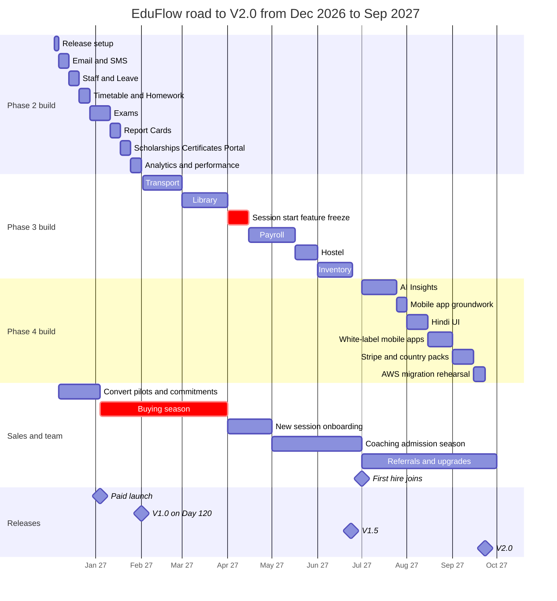
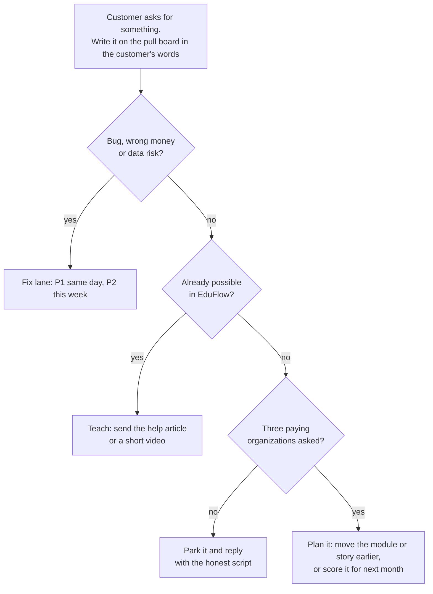

# After Day 60: The Road to V2.0

**In simple words:** Day 60 gave you a working product with 16 modules and five pilot institutes. This chapter plans the next ten months, from 4 December 2026 to 30 September 2027. It shows how to build the remaining 18 modules while you sell to, onboard and support paying customers. It also gives you clear rules for priorities, weekly releases, tech debt and your first hire, so that you reach the Year 1 target of 120 paying organizations and ₹6 lakh MRR (monthly recurring revenue — the subscription money that comes in every month).

## Where you stand on Day 61

Day 61 is Friday, 4 December 2026. If the sprint went to plan, this is what you hold:

- 16 Phase 1 modules live on production at `app.eduflow.app`.
- 5 pilot institutes that have used EduFlow free of cost since Day 45.
- 3 paid commitments for January 2027.
- 38 of the 60 Claude Code prompts used. The other 22 belong to this chapter.
- A Cut column with cards from the scope-cut ladder. Each card has a return date.
- The Day 60 retrospective and an ordered backlog, as described in *60-Day Roadmap Overview and Weekly Milestones*.

18 modules are still to build: 12 in Phase 2, 5 in Phase 3, and AI Insights in Phase 4. Phase 4 also adds Stripe with the international packs, the white-label mobile apps and the Hindi UI.

The work itself also changes. The table shows how.

| Topic | During the sprint | After Day 60 |
|---|---|---|
| Time split | 6 hours build, 2 hours sales | 4 hours build, 4 hours sales and support |
| Who uses the product | Test data, then 5 free pilots | Paying customers with real fee money |
| Release style | Tag and deploy whenever work is ready | One weekly release train with feature flags |
| What decides priority | The fixed 60-day plan | The phase list plus customer pull |
| Cost of a bug | You lose an hour | A customer loses trust, and maybe you lose a renewal |
| A good week means | The milestone is reached | The milestone is reached and MRR grew |

> **Rule:** The three release dates are fixed: V1.0 on 1 February 2027, V1.5 in June 2027 and V2.0 in September 2027. The depth of each module stays flexible. The order of modules inside a phase follows customer pull.

## The road on one page

| Phase | Version | Dates | What ships | Prompts | What it unlocks for sales |
|---|---|---|---|---|---|
| 2 | V1.0 | 4 Dec 2026 – 1 Feb 2027 (Day 61–120) | Staff, Leave, Timetable, Homework, Exams, Report Cards, Scholarships, Student Portal, Email, SMS, Certificates, Analytics | P-31, P-33 to P-42, P-51, P-53 | The Growth plan is complete |
| 3 | V1.5 | 2 Feb – 24 Jun 2027 | Library, Inventory, Transport, Hostel, Payroll | P-43 to P-47 | The Pro plan is complete |
| 4 | V2.0 | 1 Jul – 23 Sep 2027 | AI Insights, Stripe and international packs, white-label mobile apps, Hindi UI | P-32, P-48, P-57, P-60 | Add-on revenue, Enterprise deals, the UAE entry in Year 2 |

The canon fixes the months: June 2027 for V1.5 and September 2027 for V2.0. The exact days, Thursday 24 June and Thursday 23 September, are choices of this chapter. Both are release-train days, and both leave one week of buffer before the month ends.

**Figure: The road from Day 61 to V2.0 — build, sales, team and releases**



The three build blocks run one after another, and inside each block you still build one module at a time. The sales block runs beside them all the time. The red bars are the two periods where sales and customers matter more than code: the buying season from January to March, and the first two weeks of April when institutes start the new session.

## The new working week

From Day 64 (Monday, 7 December 2026) your day has a new shape: about 4 focused build hours, 4 hours of sales and support, and 30 minutes of review. Sunday stays a day for rest and the weekly review.

Why 50% and not more build time? Because from January every new customer costs you hours: demos, follow-up calls, data import, training and support questions. If you keep building 6 hours a day, the calls go unanswered and the buying season is lost. If you stop building, Phase 2 slips and the Growth plan stays half-empty. 50% and 50% is the balance.

**Example day (the full calendar method is in *Founder Operating System*)**

| Time | Block | What you do |
|---|---|---|
| 6:15 – 6:30 | P1 check | Look at Sentry, failed jobs and customer WhatsApp. Only a P1 may delay the build block |
| 6:30 – 10:30 | Build (4 hours) | One prompt, one branch, one pull request. Phone on silent |
| 10:30 – 11:00 | Triage | Read WhatsApp, email and Sentry. Label each item P1, P2 or P3 |
| 11:00 – 14:00 | Sales (3 hours) | Calls, demos, follow-ups, as in *Sales Foundation and Lead Generation* |
| 15:00 – 16:00 | Onboarding and support (1 hour) | Data imports, training calls, P2 fixes |
| 16:00 – 16:30 | Review | Daily log, pull board, plan for tomorrow |

Priority labels stay the same as in the pilot. P1 means wrong data, wrong money or nobody can log in: fix the same day. P2 means a feature is broken but there is a way around it: fix this week. P3 means a wish: it goes to the pull board.

### Phase 2 in numbers

| Number | Value | Formula |
|---|---|---|
| Calendar days | 60 | Day 61 (4 Dec 2026) to Day 120 (1 Feb 2027) |
| Full weeks | 8 | Week 11 to Week 18, 7 Dec to 31 Jan |
| Working days in those weeks | 48 | 56 days − 8 Sundays |
| Build hours | about 183 | 7 weeks × 24 hours + 15 hours in launch week |
| Tech-debt hours (20%) | about 37 | 183 × 0.20 |
| Release work | about 8 | 8 weeks × 1 hour of staging tests on Thursday |
| Hours for new modules | about 138 | 183 − 37 − 8 |
| Hours per Phase 2 module | about 12 | 138 ÷ 12 modules = 11.5 |
| Sales and support hours | about 201 | 7 weeks × 24 hours + 33 hours in launch week |

Twelve hours per module is the same pace as the sprint. It works for the same reason: the PRD has already made the decisions. Build the "Must" user stories first. "Should" and "Could" stories come back later, when customers pull them.

### Weekly rhythm after Day 60

| Day | Build block (4 hours) | Sales and support block (4 hours) |
|---|---|---|
| Monday | 1 hour dependency and Sentry clean-up, then start the week's module | Plan the week's demos. Call new leads |
| Tuesday | Module work | Demos and follow-ups |
| Wednesday | Module work. Code freeze at 6:00 pm | Demos and onboarding |
| Thursday | 1 hour release test on staging, then module work. Release at 9:30 pm (about 45 minutes) | Demos and onboarding |
| Friday | Module work. Production is watched in the 6:15 check and the 10:30 triage | 11:00 am changelog message. Closing calls |
| Saturday | Tech-debt block: tests, refactors, slow queries | Support backlog. Book next week's demos |
| Sunday | No coding. 60-minute weekly review | No calls |

The Monday hour and the Saturday block together are about 5 hours. That is your 20% tech-debt budget. It is explained later in this chapter.

## Days 61 to 120: Phase 2 week by week

### Build order and why

The order below follows the prompt IDs, with one change: Email and SMS (P-31) come first. Three reasons. The Starter plan promises email notifications. Password reset and invitations need real email. And the two approvals that P-31 depends on (Amazon SES production access and DLT templates for SMS) take days, so you start them in the first week.

| Order | Module (code) | Prompt | PRD file | Depends on | Size | Week |
|---|---|---|---|---|---|---|
| 1 | Email (EML), SMS (SMS) | P-31 | `33-email-module.md`, `34-sms-module.md` | Notifications | Medium | 11 |
| 2 | Staff (STF) | P-33 | `16-staff-module.md` | Teachers, Multi Campus | Small | 12 |
| 3 | Leave (LEV) | P-34 | `18-leave-module.md` | Staff, Attendance | Medium | 12 |
| 4 | Timetable (TT) | P-35 | `20-timetable-module.md` | Batch, Subjects, Teachers | Large | 13 |
| 5 | Homework (HW) | P-36 | `22-homework-module.md` | Batch, Subjects, file uploads | Medium | 13 |
| 6 | Exams (EXM) | P-37 | `23-exams-module.md` | Batch, Subjects, terms | Large | 14–15 |
| 7 | Report Cards (RPT) | P-38 | `24-report-cards-module.md` | Exams, PDF worker | Large | 16 |
| 8 | Scholarships (SCH) | P-39 | `28-scholarships-module.md` | Fees, Discounts | Small | 17 |
| 9 | Certificates (CRT) | P-41 | `40-certificates-module.md` | Student Profile, PDF worker | Small | 17 |
| 10 | Student Portal (SP) | P-40 | `30-student-portal-module.md` | Parent Portal, Homework, Exams | Medium | 17 |
| 11 | Analytics (ANL) | P-42 | `41-analytics-module.md` | All modules, daily snapshots | Large | 18 |

Two support prompts also belong to Phase 2. P-51 (refactor a module safely) runs in Week 14. P-53 (performance review) runs in Week 18, just before V1.0.

### Phase 2 on one page

| Week | Days | Dates | Build | Prompts | Sales and support | Thursday train |
|---|---|---|---|---|---|---|
| 10 | 61–63 | 4–6 Dec | Rest, then release machinery | None | Thank the pilots | None |
| 11 | 64–70 | 7–13 Dec | Cut cards return, Email, SMS | P-31 | Sign the 3 commitments. Pilot-to-paid talks. December demos | 10 Dec: first train |
| 12 | 71–77 | 14–20 Dec | Staff, Leave | P-33, P-34 | December demos. Book January demos | 17 Dec |
| 13 | 78–84 | 21–27 Dec | Timetable, Homework | P-35, P-36 | Light week. Launch material | 24 Dec |
| 14 | 85–91 | 28 Dec – 3 Jan | Exams part one, refactor | P-37, P-51 | Launch readiness | Wed 30 Dec |
| 15 | 92–98 | 4–10 Jan | Exams part two | P-37 | Paid launch on Mon 4 Jan | 7 Jan |
| 16 | 99–105 | 11–17 Jan | Report Cards | P-38 | Demos, first onboardings | 14 Jan |
| 17 | 106–112 | 18–24 Jan | Scholarships, Certificates, Student Portal | P-39, P-41, P-40 | Demos, onboardings | 21 Jan |
| 18 | 113–119 | 25–31 Jan | Analytics, performance | P-42, P-53 | Demos, onboardings | 28 Jan: last Phase 2 train |
| — | 120 | Mon 1 Feb | Flags on, tag V1.0 | P-59 | V1.0 announcement | None |

### Rules to add to every Phase 2 prompt

Real customers now use production. So every module prompt from P-33 to P-42 gets this ending. Paste it after the prompt text from *Prompts: Phase 2 to 4 Modules*.

```text
PHASE 2 RULES (add to the end of every module prompt, P-33 to P-42)
1. Real customers use production now. Do not change or remove any
   existing API response field, permission key or database column.
2. Schema changes must be additive: new tables, new nullable columns,
   new indexes. No rename and no drop in this pull request.
3. Put the whole module behind the release flag module.<CODE> from
   server/src/lib/release-flags.ts. Flag state for now: off.
4. Gate the module by plan with the existing PlanFeature check.
   Phase 2 modules need the Growth plan or higher.
5. Write the tenant isolation test first: a Sharma Classes user asks
   for a Bright Future record by ID and gets NOT_FOUND (404).
6. Build only the Must user stories from the PRD file. At the end of
   your answer, list the Should and Could stories you skipped.
7. Every list screen needs loading, empty and error states.
8. Stop and ask me if the PRD, the schema and the API registry disagree.
```

### Week 10 — Days 61 to 63 (4 to 6 Dec): rest, then set up the machine

- **Day 61, Friday 4 Dec.** A full day off, as promised in *60-Day Roadmap Overview and Weekly Milestones*. No laptop.
- **Day 62, Saturday 5 Dec (6 hours).** Build the machinery that the rest of this chapter uses:
  1. Create `CHANGELOG.md` in the repo root and `docs/tech-debt.md` (templates are later in this chapter).
  2. Create the pull board sheet with the columns shown in the customer pull section.
  3. Add the release flags file and run the wiring prompt from the feature flags section.
  4. Create a WhatsApp broadcast list named "EduFlow Customers" with the 5 pilot owners. Ask each owner to save your number, because broadcast messages reach only people who saved it.
  5. Check your backlog order against the build order table above.
- **Day 63, Sunday 6 Dec.** Rest and the weekly review.

### Week 11 — Days 64 to 70 (7 to 13 Dec): cut cards return, Email and SMS

**Goal:** every feature you cut during the sprint is either back or has a date, and EduFlow can send real email and SMS.

1. **Monday: cut cards.** Open the Cut column. Give it a budget of 5 build hours. Step 10 of the scope-cut ladder (Razorpay online payment) must be back before 1 January, because paid plans start that day and the Growth plan includes online fee payment. Cards that do not fit get a date in Weeks 12 to 18.
2. **Monday, 20 minutes: start the slow approvals.** A new Amazon SES account starts in sandbox mode (it can send only to addresses you have verified). Request production access today and verify your sending domain. Check that your DLT templates for OTP, fee receipt and absence alert are approved in MSG91. The setup steps are in *Environments and Configuration*.
3. **Tuesday to Friday: P-31.** Use two branches: `feat/p31-email-ses` and `feat/p31-sms-msg91`. Both channels plug into the notification engine from P-28. Do not write a second template system. System emails (password reset, invitations, fee receipts) must work on every plan, including Starter. Only the Email module screens are gated to Growth and above.
4. **Thursday 10 Dec, 9:30 pm: the first release train.** It is small on purpose. You are testing the process, not the features.

**Sales and support:** turn the 3 paid commitments into signed orders with a start date of 1 January 2027. Have the pilot-to-paid talk with all 5 pilot owners (the script is in the launch section below). Run the December demos that you booked in Week 9.

**Exit proof:** Suresh Gupta collects a fee from Sunita Devi on staging. She gets the receipt by email and by SMS within one minute. Both messages appear in the notification log with a delivered status.

**If you are behind:** ship Email only. SMS can wait for the DLT approval. OTP login keeps using WhatsApp and email.

### Week 12 — Days 71 to 77 (14 to 20 Dec): Staff and Leave

**Goal:** Rajesh Sharma can keep records of his non-teaching staff, and Priya Nair can apply for leave from her phone.

1. **Monday and Tuesday: P-33 Staff.** Read `docs/prd/16-staff-module.md`. The module adds non-teaching staff, departments, designations and staff documents. It must reuse the people tables that Teachers already uses. It must not create a second staff list.
2. **Wednesday to Friday: P-34 Leave.** Read `docs/prd/18-leave-module.md`. Build in this order: leave types and balances, the staff leave request with its approval steps, then the student leave request from the Parent Portal. An approved student leave must show in Attendance as leave, not as absent. Write a test for that link.
3. **Saturday: tech debt.** Write the missing tests for whatever the pilots broke this week.

**Sales and support:** book demos for the first two weeks of January. Institutes plan their April session now, so ask for a date, not for "sometime in January".

**Exit proof:** Priya Nair applies for 2 days of casual leave on a phone. Dr. Anita Verma approves it in one tap. The leave balance drops by 2. A Sharma Classes user cannot see the request.

**If you are behind:** cut student leave requests. Keep staff leave. Parents can still inform the teacher on WhatsApp.

### Week 13 — Days 78 to 84 (21 to 27 Dec): Timetable and Homework

**Goal:** a campus has a clash-free weekly timetable, and teachers can give homework that parents see.

1. **Monday to Wednesday: P-35 Timetable.** Read `docs/prd/20-timetable-module.md`. The heart of this module is the clash check: one teacher cannot be in two batches in the same period, and one room cannot hold two batches. Ask Claude Code for clash tests before the screens. If you cut the subject colour and weekly periods fields in Week 3, they return now.
2. **Thursday and Friday: P-36 Homework.** Read `docs/prd/22-homework-module.md`. Attachments go through the S3 upload flow from P-21. One homework must not flood parents. Send one message per student on the parent's preferred channel, and check the message count in the notification log.
3. **Friday 25 Dec is Christmas.** Most institutes are closed. Make no calls. Use it as a long, quiet build day of up to 8 hours. This extra time is why two modules fit into this week.

**Sales and support:** this is a light sales week. Use the sales block to prepare launch material: a pricing page, three testimonial quotes from pilots, and a refreshed demo organization with P-58.

**Exit proof:** the Class 10-A timetable shows 8 periods for Monday. Trying to put Priya Nair in two batches in period 3 gives a `BUSINESS_RULE_VIOLATION` (422) error with a clear message. Sunita Devi sees Aarav's Maths homework in the Parent Portal.

**If you are behind:** cut substitutions and the room clash check. Keep the teacher clash check.

### Week 14 — Days 85 to 91 (28 Dec to 3 Jan): Exams part one, refactor, launch readiness

**Goal:** marks can be entered for an exam, the weakest module is cleaned up, and everything is ready to take money on Monday.

1. **Monday to Friday: P-37 Exams, part one.** Read `docs/prd/23-exams-module.md`. Build exam setup, the exam schedule and marks entry. If you cut the terms endpoints in Week 3, they return on Monday, because exams hang on terms. Marks entry must work fast with a keyboard: Tab to the next student, Enter to save the row.
2. **Wednesday 30 Dec, 9:30 pm: this week's train.** It moves one day earlier. After it, production is frozen until Monday 4 January, except for P1 fixes.
3. **Saturday 2 Jan: P-51 refactor.** Pick the one module that hurt most during the pilot. It is usually Fees or the student import. Run P-51 on it with its tests green before and after.
4. **Launch readiness (sales block).** Walk through *Launch Checklist and Go-Live Runbook* once more, this time for paid customers: GST invoice format, payment link, support number, help articles from P-59, backup restore test.
5. **Invoices before 31 December.** Send GST invoices with a payment link to the 3 committed customers and to every pilot that said yes. The subscription period starts on 1 January 2027. A pilot that has not decided moves to the free Starter plan if it has up to 50 students. A bigger pilot gets one clear date by which it must decide.

**Exit proof:** Priya Nair enters marks for 40 students of Class 10-A in under 5 minutes. A teacher cannot enter marks for a batch that is not hers. The launch checklist has no open item.

**If you are behind:** move the exam schedule screen to Week 15. Never move the launch readiness work.

### Week 15 — Days 92 to 98 (4 to 10 Jan): paid launch and Exams part two

**Goal:** the first customers pay, and exam results reach parents.

This is the only week where build drops below 4 hours a day: no build on Monday, then 3 hours a day from Tuesday to Saturday. The launch needs the rest.

1. **Build: P-37 Exams, part two.** Grade rules, result calculation, and publishing results to the Parent Portal and WhatsApp. Treat marks like money. Every calculation gets a worked-example test: total, percentage, grade boundary, and "absent" treated differently from zero.
2. **Thursday 7 Jan train:** Exams goes to `pilot` for two pilot institutes.
3. **Launch work:** see the next section.

**Exit proof:** the 3 committed customers have paid and are live. Two pilot institutes have published one real test result to parents.

**If you are behind:** publish results only inside the Parent Portal. The WhatsApp result message moves to Week 16.

### Week 16 — Days 99 to 105 (11 to 17 Jan): Report Cards

**Goal:** one click creates report card PDFs for a whole batch.

1. **Monday to Friday: P-38 Report Cards.** Read `docs/prd/24-report-cards-module.md`. PDFs are made by a BullMQ worker, never inside the web request. A batch of 40 report cards is one background job with a progress bar. The files go to a private S3 bucket and open through pre-signed URLs.
2. **Thursday 14 Jan train:** Exams moves to `on` if the pilots reported no P1 for a week. Report Cards goes to `pilot` on the 21 January train.

**Sales and support:** schools hold annual exams in February and March. Say this in every school demo: "Sir, is saal ka report card ek click mein banega, parents ko WhatsApp par milega."

**Exit proof:** Dr. Anita Verma generates 40 report cards for Class 10-A in one job. Aarav Sharma's PDF shows the right marks, grades, attendance percentage and school logo. Sunita Devi can open only Aarav's PDF.

**If you are behind:** ship one report card template, not three. More templates come by customer pull.

### Week 17 — Days 106 to 112 (18 to 24 Jan): Scholarships, Certificates, Student Portal

**Goal:** three smaller modules that reuse what you already built.

1. **Monday and Tuesday: P-39 Scholarships** (about 5 hours). Read `docs/prd/28-scholarships-module.md`. A scholarship changes what a student pays, so it is money code. Test it with worked examples together with Discounts and invoices.
2. **Tuesday and Wednesday: P-41 Certificates** (about 5 hours). Read `docs/prd/40-certificates-module.md`. Reuse the PDF worker from Week 16. The QR verification page is public, so it shows only the name, course, certificate number, issue date and status. It needs a rate limit.
3. **Wednesday to Friday: P-40 Student Portal** (about 8 hours). Read `docs/prd/30-student-portal-module.md`. Reuse the Parent Portal screens. The `STUDENT` role sees its own record only. Write the test: Aarav cannot open another student's homework or result.

**Exit proof:** a bonafide certificate for Aarav Sharma (admission no. `BF-2027-0142`) verifies by QR code on a phone. Aarav logs in with OTP and sees his timetable, homework, attendance and results.

**If you are behind:** make the Student Portal read-only with four screens: timetable, homework, attendance and results.

### Week 18 — Days 113 to 119 (25 to 31 Jan): Analytics and performance review

**Goal:** owners see trends, and the product is fast enough for V1.0.

1. **Monday to Thursday: P-42 Analytics.** Read `docs/prd/41-analytics-module.md`. Reports read from the daily metric snapshots that P-20 created. They never run heavy queries on live tables during a request. Exports run as background jobs.
2. **Tuesday 26 Jan is Republic Day.** Institutes are busy with their own function. Make no calls. Build.
3. **Thursday 28 Jan, 9:30 pm: the last Phase 2 train.** All Phase 2 code must be on production tonight, even if some flags are still at `pilot`.
4. **Friday and Saturday: P-53 performance review.** Take the 10 slowest endpoints from your logs. Look for missing indexes that start with `organization_id`, for N+1 queries (one extra query per row in a list) and for lists without pagination.

**Exit proof:** Rajesh Sharma opens the fee collection trend for 12 months in under 2 seconds. No endpoint in the top 10 list takes more than 1 second at the 95th percentile (assumption: this is your V1.0 speed target; the full targets are in the PRD chapter *Non-Functional Requirements*).

**If you are behind:** ship the fixed reports. The report builder part of P-42 moves to February.

### Day 120 — Monday, 1 Feb 2027: V1.0

Day 120 has no new code. Everything already went to production on the 28 January train. Today you only open the doors.

1. Open one small pull request that moves every remaining Phase 2 flag from `pilot` to `on`. Merge it and check the result on staging.
2. Run P-59 to write `docs/releases/v1.0.0.md` and the help-centre articles for the 12 new modules. Merge that too.
3. At 9:30 pm, in the normal deploy window, tag the release. As set up in *Git Workflow: Branches, Commits and Pull Requests*, the version tag starts the production deploy:

```bash
git switch main
git pull --ff-only
git tag -a v1.0.0 -m "EduFlow V1.0 - Phase 2 complete - Day 120 - 1 Feb 2027"
git push origin v1.0.0
gh release create v1.0.0 --title "EduFlow V1.0" --notes-file docs/releases/v1.0.0.md
```

4. Run the smoke test on production. Log in as a Growth organization and open each of the 12 new modules once.
5. Update the pricing page: the Growth plan now lists all 28 live modules (16 + 12).
6. On Tuesday 2 February at 11:00 am, send the V1.0 message to the broadcast list (script in the release section).
7. Update your demo flow in *Demo Script* with Exams and Report Cards.

**V1.0 exit checklist**

- [ ] All 12 Phase 2 modules are `on` for every Growth, Pro and Enterprise organization.
- [ ] Starter organizations cannot open the Phase 2 module screens. They see an upgrade message. They still get system emails, as the canon promises.
- [ ] Every Phase 2 module has a passing tenant isolation test.
- [ ] Scholarships and Exams calculations have worked-example tests.
- [ ] The six Playwright flows pass on staging, plus one new flow: enter marks, publish result, open report card.
- [ ] The tag `v1.0.0` is pushed and `CHANGELOG.md` is up to date.
- [ ] The Cut column is empty, or every card in it has a date in Phase 3.

## Running the paid launch beside the build

> **Note:** Two dates matter here. Paid plans start on Friday, 1 January 2027, because the pilot trials end on 31 December 2026 (the assumption in *Daily Plan: Days 43 to 60*). But 1 January is a holiday mood day, and many owners are away. So the public launch push happens on Monday, 4 January 2027 (Day 92). That date is an assumption of this chapter. The canon fixes only the month.

### What launch day looks like

Launch day is not a party. It is the first Monday on which you sell a paid product to strangers.

| Time | Action |
|---|---|
| 7:00 | Check production health, last night's backup and Sentry. Follow *Launch Checklist and Go-Live Runbook* |
| 9:00 | Check the payments for the invoices you sent in December. Call every owner who has not paid yet |
| 10:00 | Send the launch message to every lead from the sprint (templates are in *WhatsApp and Email Templates*) |
| 11:00 – 14:00 | Demos booked in December. Target: 3 today |
| 15:00 | Onboard the first customer that paid: create the organization, set the plan, import data |
| 16:30 | Write down the numbers: invoices sent, money received, demos done |
| 17:00 | Stop. There is no build block on launch day. Exams part two starts on Tuesday |

### The pilot-to-paid talk

Have this talk in Week 11, not in January. The pilot owner must hear the price from you before he hears about the launch from someone else.

> **Example:** "Rajesh ji, pilot ko teen hafte ho gaye. Aapki team roz attendance aur fees EduFlow mein kar rahi hai. Pilot 31 December ko khatam hoga, aur 1 January se EduFlow paid ho raha hai. Aapke 350 students ke liye Pro plan lagega: ₹5,999 mahina, ya saal ka ₹59,990 jisme do mahine free hain. Aap founding customer hain, isliye data migration (₹9,999) aapke liye free rahega. Main aaj proforma invoice bhej doon?"

The founding customer offer is a choice of this chapter: the 5 pilots and the first 10 paying customers get assisted data migration (₹9,999) free. The plan price never changes. A discount on the plan price lowers your MRR forever. A free one-time service does not.

### Collect money the simple way

Do not build automatic subscription billing in January. For the first 30 customers:

1. Send a GST invoice (18% GST on the plan price) as described in *Company Setup, Legal and Finance Basics*.
2. Collect by payment link, UPI or bank transfer.
3. Record the subscription and its period in the platform console as a `SUPER_ADMIN`.
4. Push the yearly plan first. ₹24,990 today is better for a bootstrapped company than ₹2,499 for ten months.

### How many customers can you handle alone

Every number below is an assumption. Track your real hours in January and replace them.

| Input | Value |
|---|---|
| Sales and support hours per week | 24 (6 days × 4 hours) |
| Closing effort per new customer (demos, follow-ups) | 4 hours |
| Onboarding effort per new customer (import, training call) | 5 hours |
| Cost of one new customer | 9 hours (4 + 5) |
| New customers you can handle per week | 2 (24 ÷ 9 = 2.6, the rest goes to support) |
| New customers per month | 8 to 10 |

This is why the January target is 8 new paying customers and not 30. A realistic mix for those 8 is: the 3 committed customers, 3 of the 5 pilots that convert, and 2 new customers from the launch demos. The pilots are already onboarded, so January leaves you some spare hours. Use them for the free Starter signups. The full onboarding steps are in *Onboarding and Customer Success Playbook*.

### Selling honestly while Phase 2 is still being built

In January, some Growth plan modules are live, some are in pilot and some are not built. Always promise the outer date, 1 February, even when your internal plan says earlier. You can deliver early. You cannot un-promise.

> **Example:** "Sir, Report Cards 1 February tak sabke liye live hoga. Aaj main aapko Fees, Attendance aur Parent Portal live dikhata hoon. Jo cheez live nahi hai, uski date main aapko likh kar deta hoon."

## Phase 3 month by month: February to June 2027

Phase 3 builds the five modules that complete the Pro plan (₹5,999 per month): Library, Inventory, Transport, Hostel and Payroll. These modules are the main reason why ARPA (average revenue per account — MRR divided by paying organizations) can rise from ₹4,000 in March to ₹4,500 in June. A school that needs Transport and Payroll buys Pro, not Growth.

Phase 2 gave each module about 12 build hours. Phase 3 gives each module most of a month. There are three reasons:

1. Your build share falls in March and April, because the buying season and the new session need you.
2. Every module now goes through a two-week `pilot` with real customers, and it needs an import path and help articles before it goes `on`.
3. These are operations modules. Real life is messy here: bus routes change in the middle of a term, hostel beds get swapped, and salaries have legal deductions.

### Planned time split

A standard month has about 26 working days × 8 hours = 208 working hours.

| Month | Build share | Build hours | After 20% tech debt | Main build work |
|---|---|---|---|---|
| Feb 2027 | 50% | 104 | 83 | V1.0 hardening, Transport |
| Mar 2027 | 40% | 83 | 66 | Library |
| Apr 2027 | 30% | 62 | 50 | Feature freeze to 14 Apr, then Payroll part one |
| May 2027 | 50% | 104 | 83 | Payroll part two, Hostel |
| Jun 2027 | 50% | 104 | 83 | Inventory, performance, V1.5 |

March and April are planned dips, not failures. If you try to hold 50% build in April, thirty customers will start their new session without help, and some of them will leave.

### Default module order

This is the default. Customer pull can change it (see the customer pull section). If three paying customers ask for Hostel in February, Hostel moves up.

| Order | Module (code) | Prompt | PRD file | When | Why then |
|---|---|---|---|---|---|
| 1 | Transport (TRN) | P-45 | `37-transport-module.md` | February | Schools fix bus routes and transport fees before April |
| 2 | Library (LIB) | P-43 | `35-library-module.md` | March | Small and popular in school demos. Safe for the busiest sales month |
| 3 | Payroll (PRL) | P-47 | `39-payroll-module.md` | 15 Apr – 16 May | The financial year starts on 1 April. Needs Staff and Leave from Phase 2 |
| 4 | Hostel (HST) | P-46 | `38-hostel-module.md` | 17–31 May | Hostels fill their rooms when new batches start in June and July |
| 5 | Inventory (INV) | P-44 | `36-inventory-module.md` | June | Lowest pull in pilot talks (assumption). Move it up if customers ask |

Inside each month the pattern is the same: build for two weeks behind an `off` flag, run `pilot` with two or three customers for two weeks, then move to `on`.

### February 2027: V1.0 hardening and Transport

- **Product.** In the first week, run P-52 (security review) on Exams and the Student Portal. They hold the most sensitive new data. In one Saturday tech-debt block, try the Prisma upgrade on a branch. The canon pins Prisma 6.x until the MVP is done, so this is the right time. Merge it only if every test passes. Then run P-45 with `docs/prd/37-transport-module.md`. The link from a student's route to the transport fee is money code. Test it with worked examples.
- **Customers.** Target: from 8 to 18 paying organizations. School demos peak this month.
- **Watch out.** Do not promise GPS bus tracking unless the PRD lists it. Show what is live.

### March 2027: Library and the peak of the buying season

- **Product.** Run P-43 with `docs/prd/35-library-module.md`. Build share is 40%. Also write the session rollover guide: one help article and one short video on starting a new academic year, promoting students and copying fee structures. Test the rollover on a copy of pilot data on staging before 25 March.
- **Customers.** Target: from 18 to 30. On 31 March you reach the first checkpoint from the BRD chapter *Business Objectives, Scope and Stakeholders*: 30 paying organizations and ₹1.2 lakh MRR.
- **Watch out.** Institutes that have not decided by 25 March will mostly decide after April. Close or park them. Do not chase them in the first week of April.

### April 2027: the new session, then Payroll part one

- **Product.** From 1 to 14 April there is a feature freeze (a period in which the release train carries only fixes, no new features). Institutes are creating the 2027-28 session, promoting students and printing fee structures. Any surprise on their screen costs you calls. From 15 April, run P-47 part one with `docs/prd/39-payroll-module.md`: salary components, salary structures, and the feed from staff attendance and leave into loss-of-pay days.
- **Customers.** Target: from 30 to 42. Every existing customer needs about 1.5 hours of rollover help. Bring in a part-time onboarding helper now (see the hiring section).
- **Watch out.** Changes to Fees and Payments ride only on trains between the 11th and the 25th of a month. The first ten days are the peak of fee collection.

> **Warning:** Payroll is money code and legal code at the same time. Assumption of this chapter: V1.5 Payroll calculates salaries from components that the institute sets up itself (basic pay, allowances, PF, ESI, professional tax, TDS). It does not file any statutory return. Say this clearly in every demo. The PRD chapter *Payroll Module* governs the exact scope.

### May 2027: Payroll part two and Hostel

- **Product.** Payroll part two: the monthly salary run, approval and lock, and payslip PDFs from the PDF worker. Then a parallel run (the customer runs the same month in EduFlow and in his old Excel sheet, and compares both): three customers run April salaries both ways. Payroll moves to `on` only after two clean parallel runs where every payslip matches to the rupee. From 17 to 31 May, run P-46 with `docs/prd/38-hostel-module.md`.
- **Customers.** Target: from 42 to 55. Board exams are over and coaching institutes open new JEE and NEET batches. Shift your demos toward coaching owners like Sharma Classes.
- **Watch out.** Start the search for your first hire this month.

### June 2027: Inventory and V1.5

- **Product.** Run P-44 with `docs/prd/36-inventory-module.md`. Run P-53 again on the ten slowest endpoints. Release V1.5 on Thursday, 24 June 2027, with the tag `v1.5.0`. After it, 33 of the 34 modules are live, and the Pro plan page has no "coming soon" line.
- **Customers.** Target: from 55 to 70. This is the second BRD checkpoint: 70 paying organizations and ₹3.15 lakh MRR. Call every Growth customer who is close to 300 students or who asked for Transport or Payroll, and offer Pro.
- **Watch out.** Make the offer to your first hire in June so that the person joins on 1 July.

**V1.5 exit checklist**

- [ ] All 5 Phase 3 modules are `on` for every Pro and Enterprise organization. Growth organizations see an upgrade message.
- [ ] Payroll passed two clean parallel runs with at least 3 customers.
- [ ] Transport fees and hostel fees create correct invoices in Fees, proven by tests.
- [ ] Every Phase 3 module has a tenant isolation test and a help article.
- [ ] The tag `v1.5.0` is pushed and `CHANGELOG.md` is up to date.

## Phase 4 month by month: July to September 2027

Phase 4 is a different kind of work. Phases 2 and 3 added modules. Phase 4 adds new ways to earn on top of the same customers, and it opens the door for Year 2.

| Item | Prompt | Spec to load | When | Why it matters for money |
|---|---|---|---|---|
| AI Insights (AI) | P-48 | `42-ai-insights-module.md` | July | Add-on at ₹1,499 per month for Growth and Pro. Included in Enterprise |
| Hindi UI | P-60 | `63-internationalization-and-localization.md` | 1–14 Aug | Opens Hindi-belt institutes. More parents use the portal |
| White-label mobile apps | None (uses existing screens) | `29-parent-portal-module.md`, `30-student-portal-module.md` | 15–31 Aug | Add-on at ₹49,999 setup + ₹4,999 per month |
| Stripe and international packs | P-32, P-60 | `57-integrations-and-webhooks.md`, `63-internationalization-and-localization.md` | 1–14 Sep | Needed for the UAE entry in Year 2 |
| AWS migration rehearsal | P-57 | *Deploy on AWS* | 15–22 Sep | Removes the hosting risk before Year 2 growth |

### July 2027: AI Insights

- **Why now.** AI Insights needs history. Customers who joined in January now have six months of attendance and fee data. Before this point there was nothing to learn from.
- **Product.** Run P-48 with `docs/prd/42-ai-insights-module.md`. Put it on `pilot` for 5 Pro customers on the 22 July train. Every insight must show the numbers behind it, for example "Aarav Sharma: attendance fell from 92% to 71% in 4 weeks". An owner will not trust a score without a reason.
- **Last week of July.** Do the groundwork for the mobile apps: open your own Apple and Google developer accounts, and build one proof-of-concept app for the demo organization.
- **Customers and team.** Target: from 70 to 85. Your first hire joins on 1 July. Give the first two weeks to a proper handover of onboarding and support.

> **Warning:** AI Insights works on children's data. Follow the PRD chapter *Privacy and Compliance*. Send the smallest possible data to any AI provider. Use internal IDs where a name or phone number is not needed. Never use student data for advertising. Write every AI request into the audit log.

### August 2027: Hindi UI and white-label mobile apps

- **Hindi UI (1–14 Aug).** Run P-60. Every text on the screen must come from translation files, not from the code. Translate in this order: Parent Portal, Student Portal, the teacher's mobile views, then the admin screens. Parents need Hindi the most. Hindi text is often longer than English text, so check every mobile screen for cut-off labels. Ask a Hindi-speaking teacher from a pilot institute to review the words. Do not trust machine translation alone.
- **White-label apps (15–31 Aug).** A white-label app is the same EduFlow app published under the school's own name, icon and colours. Decision of this chapter: start with a thin native shell around the existing mobile-first portal screens, plus push notifications. It reuses all your Next.js screens. Move to a fully native app only if app store review rejects the shell or customers ask for offline use. One codebase, one build configuration per school, with the name, icon and colours taken from the organization's branding settings.
- **Customers and team.** Target: from 85 to 102. The second hire (sales) joins if the trigger is met.

> **Note:** Apple's App Store Review Guidelines say that apps made from a template must be submitted by the owner of the content. In practice each school needs its own Apple developer account, and you publish the app under that account. Read the current guideline text and the current account fees before you sign the first white-label order. Promise "four to six weeks after you give us the developer accounts", never a calendar date.

### September 2027: international packs, AWS rehearsal and V2.0

- **Stripe and packs (1–14 Sep).** Run P-32 and the locale pack part of P-60. A pack is the set of country settings an organization gets at signup. Build and test all four packs in Stripe test mode. You do not sell abroad in Year 1. The canon plans the UAE entry for Year 2, with Indian-curriculum schools first.

| Pack | Currency | Tax on subscription | Gateway | SMS | Growth price |
|---|---|---|---|---|---|
| India | INR | GST 18% | Razorpay | MSG91 | ₹2,499 per month |
| UAE | AED | VAT 5% | Stripe | Twilio | AED 299 per month |
| USA | USD | Sales tax by state (Stripe Tax) | Stripe | Twilio | $79 per month |
| Australia | AUD | GST 10% | Stripe | Twilio | A$119 per month |

- **AWS rehearsal (15–22 Sep).** Run P-57 against staging only. Move production only when the triggers in *Scaling Overview and Architecture Evolution* are met. The full steps are in *Deploy on AWS*.
- **V2.0 (Thursday, 23 Sep 2027).** Tag `v2.0.0`. All 34 modules are live.
- **Year 1 close (24–30 Sep).** Compare your numbers with the canon targets: 120 paying organizations, ₹6 lakh MRR, 300 free organizations, churn under 3%. Then plan Year 2 with *Stage 2: Growing to 500 Customers*.
- **Customers and team.** Target: from 102 to 120. The third hire (engineer) joins if the trigger is met.

### What the Phase 4 add-ons can add to ARPA

This is an illustration, not a forecast. Change the inputs to your real numbers.

| Line | Formula | Monthly amount |
|---|---|---|
| AI Insights add-on | 20 organizations × ₹1,499 | ₹29,980 |
| White-label app monthly fee | 5 organizations × ₹4,999 | ₹24,995 |
| Total new MRR | ₹29,980 + ₹24,995 | ₹54,975 |
| ARPA lift at 120 customers | ₹54,975 ÷ 120 | about ₹458 |
| One-time setup cash (not MRR) | 5 × ₹49,999 | ₹2,49,995 |

This lift is a large part of the step from ₹4,500 ARPA in June to ₹5,000 in September.

## Monthly goals and the MRR path

All numbers in this table are targets, not forecasts. The values for March, June and September match the checkpoint path in the BRD chapter *Business Objectives, Scope and Stakeholders*. The months in between are estimates of this chapter. If the BRD chapter *Financial Plan and Projections* shows a different number, that chapter governs.

| Month | Product goal | New paying | Total paying | ARPA | MRR target | Founder focus |
|---|---|---|---|---|---|---|
| Dec 2026 | Email, SMS, Staff, Leave, Timetable, Homework | 0 | 0 | — | ₹0 | Convert pilots. Sign the 3 commitments |
| Jan 2027 | Exams, Report Cards, Scholarships, Certificates, Student Portal, Analytics | 8 | 8 | ₹4,000 | ₹32,000 | Paid launch on 4 Jan |
| Feb 2027 | V1.0 on 1 Feb. Transport | 10 | 18 | ₹4,000 | ₹72,000 | School demos |
| Mar 2027 | Library. Rollover guide | 12 | 30 | ₹4,000 | ₹1.2 lakh | Close before the April session |
| Apr 2027 | Feature freeze. Payroll part one | 12 | 42 | ₹4,200 | ₹1.76 lakh | New session help. Part-time helper |
| May 2027 | Payroll part two. Hostel | 13 | 55 | ₹4,350 | ₹2.39 lakh | Coaching admission season |
| Jun 2027 | Inventory. V1.5 on 24 Jun | 15 | 70 | ₹4,500 | ₹3.15 lakh | Pro upgrades. Offer to first hire |
| Jul 2027 | AI Insights. App groundwork | 15 | 85 | ₹4,700 | ₹4.0 lakh | First hire joins. Handover |
| Aug 2027 | Hindi UI. White-label apps | 17 | 102 | ₹4,850 | ₹4.95 lakh | Referrals. Add-on sales |
| Sep 2027 | Stripe and packs. V2.0 on 23 Sep | 18 | 120 | ₹5,000 | ₹6 lakh | Year 1 close. Year 2 plan |

How to read the table:

- **The formula is MRR = total paying organizations × ARPA.** Example for May: 55 × ₹4,350 = ₹2,39,250.
- **"New paying" is net of churn** (churn — customers who cancel). If 2 customers leave in a month, you must win 2 more than the table says.
- **A yearly plan counts as one-twelfth per month.** A Growth yearly customer adds ₹24,990 ÷ 12 = ₹2,083 to MRR, not ₹2,499. A Pro yearly customer adds ₹59,990 ÷ 12 = ₹4,999. Yearly plans lower MRR a little and bring cash early. For a bootstrapped company that is a good trade.
- **Four things raise ARPA:** more Pro customers, extra campuses at ₹999 per month, add-ons from Phase 4, and the margin on WhatsApp and SMS credits.
- **Free organizations** follow the BRD path beside this table: 80 by March, 180 by June and 300 by September 2027.

### The monthly review

On the first working day of each month, spend 60 minutes on these signals. Write the numbers in one sheet, one row per month.

| Signal | Red line | What you do this month |
|---|---|---|
| Total paying organizations | More than 20% behind the path for 2 months | Move the split to 40% build. Pause the module with the lowest pull |
| Logo churn | 3% or more in a month | Call every customer who left. Fix the top reason before any new module |
| Activation within 7 days | Under 60% | Stop new demos for 2 days. Fix the import template and the first-day checklist |
| P1 bugs | More than 3 in a month | Raise the tech-debt budget to 30% for 4 weeks |
| Build share | Under 30% for 2 months, outside April | Bring in the helper or the hire now |
| ARPA | ₹300 or more below the path | Make Pro upgrade calls. Offer add-ons and extra campuses to existing customers |

## Prioritise with customer pull

Customer pull means you build what paying customers ask for again and again, not what you guess they want. After Day 60 you will hear ten feature requests a week. Without a rule, the loudest owner decides your roadmap.

> **Rule:** A feature that is not in the current phase list enters the build plan only when three different paying organizations have asked for it, without you suggesting it first.

Why three? One request is one owner's opinion. Two can be chance, and often the two owners know each other. Three different paying organizations is a pattern. Why paying? Free users and prospects ask for everything. The person who pays shows you what is worth money.

### What pull decides and what it does not

| Question | Who decides |
|---|---|
| Which modules belong to a phase | The canon. This is fixed |
| The order of modules inside a phase | Customer pull |
| The depth of a module: which "Should" and "Could" stories get built | Customer pull |
| A feature outside the 34 modules | Customer pull, with three paying askers |
| Bugs, security, legal needs, anything on the never-cut list | Nobody votes. You fix it |

### The pull board

Keep one sheet. Every request becomes one row on the day you hear it, in the 16:00 review block. These are the columns, with sample rows:

```csv
date,organization,plan,paying,request_in_their_words,problem_behind_it,module,status
2027-01-12,Sharma Classes,PRO,yes,"Rank list WhatsApp par",Parents call for rank,EXM,COUNTING
2027-01-19,Bright Future Public School,ENTERPRISE,yes,"Rank bhejni hai",Typed by hand,EXM,COUNTING
2027-01-21,Gyan Deep Coaching,STARTER,no,"Rank list chahiye",Same as above,EXM,NOT_COUNTED
2027-02-03,Excel Academy,GROWTH,yes,"Result ke saath rank",Parents compare ranks,EXM,THREE_REACHED
```

Gyan Deep Coaching and Excel Academy are extra sample names, used only on this board.

Counting rules:

1. One organization is one vote, even if five people from it ask.
2. Only paying organizations count. A pilot institute counts from the day it pays. Starter organizations and prospects are written down with `paying = no`. They count zero.
3. Write the request in the customer's own words. Then write the problem behind it. You build for the problem, not for the words.
4. Never suggest the feature yourself. "Would you like a rank list?" always gets a yes, and it proves nothing.
5. Before you count a vote, check whether EduFlow can already do it. Many requests are training gaps, not product gaps.

**Figure: What happens to a customer request**



A request first goes through the bug check, because bugs never wait for votes. Then you check whether training solves it. Only a real product gap with three paying askers reaches your build plan. If it belongs to a module of the current phase, that module or story moves earlier. If it is outside the phase list, you score it and plan it for next month.

### When several items have three votes

Use one simple score. Plan weight: Growth = 1, Pro = 2, Enterprise = 3.

Pull score = (sum of the plan weights of the paying askers) ÷ (effort in build days, where one build day is 4 hours)

| Request | Paying askers | Weight sum | Effort | Score | Decision |
|---|---|---|---|---|---|
| Rank list with the WhatsApp result | 1 Enterprise, 1 Pro, 1 Growth | 6 (3 + 2 + 1) | 2 days | 3.0 | Build for the next train |
| Second report card template | 3 Growth | 3 | 3 days | 1.0 | Build this month |
| Hostel mess billing | 1 Pro | 2 | 6 days | Not scored | Parked: fewer than 3 askers |

### What you do not build, even with three votes

Three votes is a ticket to the queue. It is not a promise. Say no to:

- A separate database or a separate server for one customer. It breaks the one-codebase, one-database design.
- One-off reports made for a single institute. Point them to the Analytics report builder.
- A full accounting system to replace Tally. Offer an export instead.
- Anything that breaks a canon rule: money as Float, tenant data without `organization_id`, tracking of children.

### Word-for-word replies

**When you log a first or second request:**

> **Example:** "Sir, maine note kar liya hai. Abhi tak aap pehle customer hain jinhone yeh maanga hai. Jab teen institutes ek hi cheez maangte hain, hum use agle mahine ke plan mein daalte hain. Tab tak aapka kaam aise ho sakta hai: Exams > Results se Excel export kijiye, rank wahan ek click mein aa jayegi."

**When the third vote arrives:**

> **Example:** "Sir, good news. Aap teesre customer hain jinhone rank list maangi hai. Yeh ab February ke plan mein hai. Live hote hi main aapko WhatsApp par bataunga."

**When a prospect says "build this and I will buy":**

> **Example:** "Sir, samajh gaya. Jo aaj live hai usse aapka zyadatar kaam ho jayega. Yeh feature maine list mein likh liya hai. Hum pehle un institutes ki request banate hain jo plan le chuke hain. Aap yearly plan se shuru kijiye, aapka vote aaj se count hoga."

## The release process after launch

During the sprint you pushed a production tag whenever a piece of work was ready. With paying customers, a surprise at 10 am is expensive: the fee counter is open and teachers are marking attendance. So you move to a release train (a fixed weekly time when all finished work goes to production together; work that is not ready waits for the next train).

### The weekly train

| When | Step |
|---|---|
| Monday morning | Decide what rides this week's train: which pull requests, and which flags change state |
| Wednesday 6:00 pm | Code freeze. Only work merged into `main` before this time rides Thursday's train |
| Thursday, first build hour | Test on staging: the Playwright flows, plus a manual check of every new screen on a phone |
| Thursday 9:30 pm | Production release: backup check, push the version tag, watch the deploy, smoke test |
| Friday 6:15 am and 10:30 am | Watch Sentry and the logs. Hotfix if needed |
| Friday 11:00 am | Update the changelog and send the WhatsApp announcement |
| Next Thursday | A flag that spent one week on `pilot` with no P1 moves to `on` |

Why Thursday at 9:30 pm? Evening batches are over. Friday and Saturday are working days, so you can watch and fix. Never release on Saturday night, because Sunday is your rest day. Never release on Monday morning, when every institute marks attendance and opens the fee counter.

> **Best practice:** Changes to Fees and Payments ride only on trains between the 11th and the 25th of a month. The first ten days of a month are the peak of fee collection. The first two weeks of April are a full feature freeze.

**Release checklist (every Thursday)**

- [ ] Every pull request for this train was merged before Wednesday 6:00 pm, and CI is green on `main`.
- [ ] All new migrations are additive (see the migration rule below).
- [ ] The Playwright flows pass on staging.
- [ ] Last night's production backup exists. The check is in *Monitoring, Backups and Incident Response*.
- [ ] The flag state of every new feature is decided: `off`, `pilot` or `on`.
- [ ] The changelog entry is written in customer words.
- [ ] The version tag is pushed at 9:30 pm, and the production deploy finishes green.
- [ ] The smoke test passes on production in the demo organization: log in, mark attendance, collect a fee, open the receipt PDF, open the Parent Portal.
- [ ] Sentry shows no new error type for 30 minutes.

**Commands for release day**

```bash
# Thursday 9:30 pm, after the staging test passed (run from the repo root)
git switch main
git pull --ff-only

# Which tag is live now, and what rides this train?
git describe --tags --abbrev=0
git log --oneline --no-merges v0.11.0..HEAD

# The version tag starts the production deploy
git tag -a v0.12.0 -m "Weekly release 17 Dec 2026"
git push origin v0.12.0
```

The tag numbers `v0.11.0` and `v0.12.0` are examples. Continue from the last tag of your sprint. The tag rules and the production pipeline are in *Git Workflow: Branches, Commits and Pull Requests* and *Docker and CI/CD*. The pipeline applies database changes with `npx prisma migrate deploy`. Never run `prisma migrate dev` against production.

Three tag names are fixed by this chapter: `v1.0.0` on Day 120, `v1.5.0` on 24 June 2027 and `v2.0.0` on 23 September 2027. To keep those names free, use this numbering:

| Period | Weekly train tag | Hotfix tag |
|---|---|---|
| Day 61 to Day 119 | Next middle number: `v0.12.0`, `v0.13.0` | Next last number: `v0.12.1` |
| After `v1.0.0`, until V1.5 | Next last number: `v1.0.1`, `v1.0.2` | Also the next last number |
| After `v1.5.0`, until V2.0 | Next last number: `v1.5.1`, `v1.5.2` | Also the next last number |

### The migration rule: expand first, contract later

With a weekly train, the old code and the new database live together for a few minutes during every deploy. If something goes wrong, you roll back the code (put the previous release back on production). You cannot easily roll back a database. So every schema change is additive. A change that removes or renames something is split over three trains.

| Train | Step for renaming a column | Safe to roll back the code? |
|---|---|---|
| 1 | Add the new column. The code writes to both columns and reads the old one | Yes |
| 2 | Copy old values into the new column with a script. The code reads the new column | Yes |
| 3 | Drop the old column | Yes, because no code uses it any more |

If a release goes bad, put the previous version back on production. The steps are in *Git Workflow: Branches, Commits and Pull Requests* and *Deploy on Vercel and Railway*. Then fix the problem in a new pull request. Do not try to undo a migration by hand at 10 pm.

### The hotfix lane

A P1 bug does not wait for Thursday.

1. Create a branch `hotfix/<short-name>` from `main`, for example `hotfix/receipt-total-rounding`. The prefix `fix/` is for bugs that can wait for the next train.
2. Write a failing test that shows the bug. Fix it. Use P-54 if the cause is not clear.
3. Open the pull request, let CI pass, merge, and check the fix on staging.
4. Push the next patch tag, for example `v0.12.1`. The tag deploys the fix to production the same day. For a P1 you do not wait for the 9:30 pm window.
5. Message the affected customers one by one. Do not use the broadcast list for a bug that three institutes saw.

> **Warning:** A hotfix tag ships everything that is on `main`, not only the fix. This is safe only because unfinished work sits behind `off` flags and every migration is additive. If you ever merge unfinished work without a flag, you lose the hotfix lane.

### Feature flags

A feature flag is a switch that lets you put finished or half-finished code on production without showing it to everyone. EduFlow already has plan gating through `PlanFeature`. Plan gating answers "has this organization paid for it?". A release flag answers a different question: "is this feature ready to be seen?". Both checks must pass.

Each flag has three states:

| State | Who sees the feature | When you use it |
|---|---|---|
| `off` | Nobody | Code is merged but not finished or not tested |
| `pilot` | Only organizations on the early-access list | The first one or two weeks on production |
| `on` | Every organization whose plan includes it | After a clean pilot |

This design needs no new table. The default state lives in code, so a change is reviewed in a pull request. The early-access list of an organization lives in the existing `OrganizationSetting` table under the key `release.early_access`, with a JSON array such as `["module.EXM"]`. An environment variable is the kill switch (a way to turn a feature off quickly without a code change).

**File: `server/src/lib/release-flags.ts`**

```typescript
import { env } from '../config/env';

export type FlagState = 'off' | 'pilot' | 'on';

// One line per new feature. Delete the line two weeks after it reaches 'on'.
// A key with no line here is treated as fully released.
export const RELEASE_FLAGS: Record<string, FlagState> = {
  'module.EML': 'on',
  'module.SMS': 'pilot',
  'module.STF': 'off',
  'module.LEV': 'off',
};

export function parseFlagList(raw: string): Set<string> {
  return new Set(
    raw
      .split(',')
      .map((key) => key.trim())
      .filter((key) => key.length > 0),
  );
}

// Kill switch. Example: RELEASE_FLAGS_OFF=module.SMS,module.LEV
const forcedOffFromEnv = parseFlagList(env.RELEASE_FLAGS_OFF);

export function isReleased(
  flagKey: string,
  earlyAccess: readonly string[],
  forcedOff: ReadonlySet<string> = forcedOffFromEnv,
  flags: Readonly<Record<string, FlagState>> = RELEASE_FLAGS,
): boolean {
  if (forcedOff.has(flagKey)) return false;
  const state: FlagState | undefined = flags[flagKey];
  if (state === undefined || state === 'on') return true;
  if (state === 'pilot') return earlyAccess.includes(flagKey);
  return false;
}
```

Add one line to the Zod schema in `server/src/config/env.ts`, because that file is the only place that reads `process.env`:

```typescript
RELEASE_FLAGS_OFF: z.string().default(''),
```

**File: `server/src/lib/release-flags.test.ts`**

```typescript
import { describe, expect, it } from 'vitest';
import { isReleased, parseFlagList, type FlagState } from './release-flags';

const flags: Record<string, FlagState> = {
  'module.EXM': 'pilot',
  'module.RPT': 'off',
  'module.STF': 'on',
};
const nothingForcedOff = new Set<string>();

describe('isReleased', () => {
  it('hides an off flag from everyone, even early-access organizations', () => {
    expect(isReleased('module.RPT', ['module.RPT'], nothingForcedOff, flags)).toBe(false);
  });

  it('shows a pilot flag only to early-access organizations', () => {
    expect(isReleased('module.EXM', ['module.EXM'], nothingForcedOff, flags)).toBe(true);
    expect(isReleased('module.EXM', [], nothingForcedOff, flags)).toBe(false);
  });

  it('shows an on flag and an unknown key to everyone', () => {
    expect(isReleased('module.STF', [], nothingForcedOff, flags)).toBe(true);
    expect(isReleased('module.FEE', [], nothingForcedOff, flags)).toBe(true);
  });

  it('lets the kill switch win over every other state', () => {
    const forcedOff = parseFlagList(' module.STF , module.EXM ');
    expect(isReleased('module.STF', [], forcedOff, flags)).toBe(false);
    expect(isReleased('module.EXM', ['module.EXM'], forcedOff, flags)).toBe(false);
  });
});
```

The test file imports `env` through the flags file, so it needs the same test environment variables as your other server tests.

The rest is wiring that depends on the helper names in your repo. Let Claude Code do it with this prompt on Day 62:

```text
Read CLAUDE.md, server/src/lib/release-flags.ts and the Settings part of
docs/prd/43-settings-module.md. Wire release flags into the app.
1. Server: add a middleware requireRelease(flagKey). It loads the
   organization setting with key "release.early_access" (a JSON array of
   flag keys, empty when missing) through the tenant-aware Prisma
   client, caches it in Redis for 60 seconds, and calls isReleased().
   When the result is false, answer with the NOT_FOUND (404) error
   envelope, so a hidden feature does not show that it exists.
2. Apply requireRelease after the auth middleware and before
   requirePermission on the routers I name. Start with no routers.
3. Only SUPER_ADMIN may change "release.early_access". Organization
   users must not see or edit this key in the Settings screens.
4. Client: the data that the app shell already loads after login must
   include the list of released flag keys for this organization. Add a
   hook useReleaseFlag(flagKey). Hide sidebar items and routes when it
   returns false. Do not invent a new endpoint if an existing one can
   carry the list. Tell me which one you chose.
5. Tests: early-access organization sees a pilot route, another
   organization gets 404, the kill switch env value hides it for both.
Do not change the Prisma schema. Show me the plan before you code.
```

Flag rules:

- Whole modules use the key `module.<CODE>`, the same pattern as the plan feature keys. Smaller features use `module.feature`, for example `fees.bulk_reminders`.
- The life of a flag is: `off`, then `pilot`, then `on`, then the line is deleted. Delete it two weeks after `on`.
- Keep at most 6 flag lines at a time. Old flags are tech debt.
- To kill a feature fast, set `RELEASE_FLAGS_OFF=module.EXM` on the API and worker services and redeploy them. This takes a few minutes and needs no code change.

### The changelog

A changelog is a dated list of what changed, written for customers. Keep it in `CHANGELOG.md` in the repo root. Every Friday, copy the newest entry into the help centre page "What's new".

```markdown
# EduFlow changelog

## 17 Dec 2026 (v0.12.0)

### New
- Staff: keep records of non-teaching staff such as accountant, front desk and driver.
- Leave: teachers apply for leave on the phone. The principal approves in one tap.

### Improved
- Fees: the receipt PDF now opens in about 2 seconds.

### Fixed
- Attendance: the monthly report counted a holiday as absent. It is correct now.

### Coming next
- Timetable and Homework (in pilot from 24 Dec).
```

Let Claude Code write the first draft. Run P-59 with this ending every Thursday:

```text
RELEASE NOTES MODE. Read the commits since the last version tag with
git log. Write the CHANGELOG.md entry for 17 Dec 2026 under the
headings New, Improved, Fixed and Coming next.
Write for an institute owner, not for a developer: no file names, no
library names, no ticket IDs. One line per change, under 20 words,
starting with the module name.
Then write the same update as a WhatsApp message in simple Hinglish in
Latin script: under 120 words, no emojis, with the menu path of each
new feature. Do not mention any feature whose release flag is off.
```

### The customer announcement on WhatsApp

Your customers do not read email newsletters. They read WhatsApp. Use the broadcast list "EduFlow Customers" in the WhatsApp Business app. Each owner gets the message as a personal chat, and nobody sees the other customers.

Rules for the weekly message:

1. One message a week, on Friday at 11:00 am. Never at night.
2. At most three items. Each item says what it does for them and where to find it.
3. Plain text. No emojis, no marketing words, no "exciting news".
4. Add every new owner to the list on the day of onboarding, and ask him to save your number.
5. If nothing useful for customers shipped, do not send a message.

**Script: weekly update**

```text
EduFlow update - 18 Dec 2026

Namaste. Is hafte EduFlow mein 3 kaam hue hain:

1. Staff: ab accountant, front desk aur driver jaise non-teaching
   staff ka record bhi EduFlow mein rakh sakte hain.
   Kahan milega: left menu > Staff
2. Leave: teacher phone se leave apply karega, principal ek tap mein
   approve ya reject karenge.
   Kahan milega: left menu > Leave
3. Fix: fee receipt PDF ab 2 second mein khulti hai.

Agle hafte: Timetable aur Homework.
Koi dikkat ho to isi number par message kijiye.
- Mehdi, EduFlow
```

**Script: "the feature you asked for is live" (send personally, not as a broadcast)**

```text
Rajesh ji, namaste. Aapne January mein weekly test ki rank list
WhatsApp par bhejne ka feature maanga tha. Woh aaj se live hai.
Kahan milega: Exams > Results > Publish > "Rank bhi bhejein" tick
kijiye.
Ek baar is hafte ke test par try kijiye aur bataiye kaisa laga.
- Mehdi
```

**Script: V1.0 announcement (send on Tue 2 Feb 2027, 11:00 am)**

```text
EduFlow V1.0 - 1 Feb 2027

Namaste. 1 February se EduFlow ke Growth aur Pro plan mein 12 naye
modules sabke liye live hain: Staff, Leave, Timetable, Homework, Exams,
Report Cards, Scholarships, Student Portal, Email, SMS, Certificates
aur Analytics.

Aapke plan ki price wahi hai. Koi extra charge nahi.
Sabse pehle yeh try kijiye: Exams > New Exam. Is saal ka report
card ek click mein banega.

Har module ka 2 minute ka video Help section mein hai.
- Mehdi, EduFlow
```

**Script: planned maintenance (send one day before)**

```text
EduFlow notice: kal (Thursday) raat 9:30 se 10:00 baje ke beech
EduFlow 10 minute ke liye band rahega. Hum system update kar rahe
hain. Aapka data safe hai. 10:00 baje ke baad sab normal chalega.
- Mehdi, EduFlow
```

## The tech-debt budget

Tech debt (technical debt) is the extra work you create for your future self when you choose a quick solution today. A sprint of 60 days creates a lot of it. That was the right trade. Now you pay it back slowly, like an EMI, so that it never stops you.

> **Rule:** 20% of build time goes to tech debt, every week. In Phase 2 that is about 5 of the 24 weekly build hours: the first hour on Monday and the 4-hour block on Saturday. P1 bug fixes are not paid from this budget. They come first, from any hour.

### What counts as tech debt

| Kind | Example in EduFlow | Prompt to use |
|---|---|---|
| Missing tests | The student import has no test for duplicate admission numbers | P-49 |
| Messy code | The fee invoice service is 900 lines with repeated logic | P-51 |
| Slow paths | The defaulter list takes 6 seconds for 1,200 students | P-53 |
| Security gaps | A new module has not had its OWASP and tenant isolation review | P-52 |
| Old dependencies | `npm outdated` shows a major version behind. Prisma is still pinned | None: do it by hand on a branch |
| Dead flags and code | A release flag is still in the code 2 weeks after `on` | P-51 |
| Missing runbooks | Nobody wrote down how to restore one organization's data | P-59 |

New features, new screens and new reports are never tech debt, even when a customer calls them "small fixes".

### The debt register

Keep one file, `docs/tech-debt.md`. Add a row the moment you take a shortcut. If the row takes more than one minute to write, it is too long.

```markdown
# Tech debt register

| ID | Added | Item | Module | Pain if ignored | Hours | Status |
|---|---|---|---|---|---|---|
| TD-001 | 2026-11-12 | No test: partial payment + late fee | PAY | Wrong receipt | 2 | Open |
| TD-002 | 2026-11-20 | Invoice list has no pagination | PP | Slow after 3 years | 3 | Open |
| TD-003 | 2026-12-05 | Prisma pinned at 6.x | Platform | Missed fixes | 4 | Planned Feb 2027 |
| TD-004 | 2026-12-19 | Leave approval has no audit log | LEV | Disputes | 1 | Done 26 Dec |
```

How to choose what to pay first: money code, then tenant safety, then anything that caused a customer-facing bug in the last 30 days, then the rest by the smallest number of hours.

**Monday clean-up hour — commands**

```bash
# Run from the repo root
npm outdated
npm audit --omit=dev
npm run lint
npm run typecheck
npm run test --workspace server
```

Upgrade one package group at a time, on a branch such as `chore/upgrade-tanstack-query`. Let CI run. A minor upgrade rides the normal train. A major upgrade, and any Prisma upgrade, gets a full week on `pilot`-style watch: release it alone, with no other risky change on the same train.

### When to change the 20%

| Situation | New budget | For how long |
|---|---|---|
| More than 3 P1 bugs in a month | 30% | 4 weeks |
| A release had to be rolled back | 30% | 2 weeks, spent on tests for that area |
| CI takes more than 15 minutes | 30% | Until it is under 10 minutes |
| Launch week (4–10 Jan) or a V-release week | 10% | That week only |
| Any other reason | 20% | Never go below 10%, never skip two weeks in a row |

> **Founder note:** The budget protects you from two opposite mistakes. One founder never pays debt, and in month eight every change breaks something. Another founder rewrites the Fees module for three weeks while no customer asked for anything. 20% is boring, and boring is what keeps a solo company alive.

## When to hire the first person

The canon target for the end of Year 1 is a team of 4: you plus three hires. The BRD chapter *Business Objectives, Scope and Stakeholders* adds two conditions. You stay bootstrapped (objective BO-10), and you hire only against MRR milestones. Its checkpoint path places the first hires in July to September 2027. The roles and pay bands are in the BRD chapter *Organization and Hiring Plan*. If a number there differs from this section, the BRD governs.

### The load model: why you cannot stay alone after June

This model shows your sales and support load per month. Every input is an assumption. Replace it with your real hours after January.

Load hours = new customers × (4 closing hours + 5 onboarding hours) + existing customers × 0.5 support hours

Available hours = 208 working hours × your sales and support share

| Month | New | Existing | Load (hours) | Available | How it fits |
|---|---|---|---|---|---|
| Jan 2027 | 8 | 0 | 72 | 104 at 50% | Fits. Spare hours go to free Starter signups |
| Feb 2027 | 10 | 8 | 94 | 104 at 50% | Fits, but tight |
| Mar 2027 | 12 | 18 | 117 | 125 at 60% | Fits only with the planned 60% share |
| Apr 2027 | 12 | 30 | 168 (with 45 rollover hours) | 146 at 70% | Does not fit. A helper takes 36 hours. Then 132 fits |
| May 2027 | 13 | 42 | 138 | 104 at 50% | The helper takes 39 hours. Then 99 fits |
| Jun 2027 | 15 | 55 | 163 | 104 at 50% | The helper takes 60 hours. 103 fits with zero spare |
| Jul 2027 | 15 | 70 | 170 | 104 at 50% | Cannot fit. The first hire must be working |

Worked example for April: 12 × 9 = 108. Then 30 × 0.5 = 15. Then 30 existing customers × 1.5 hours of session rollover help = 45. Total 168 hours.

### The bridge: a part-time onboarding helper from April

Before a full-time hire, bring in one part-time helper, paid per onboarding. The helper cleans the customer's Excel sheets and runs the import (about 3 hours saved per onboarding). From June the helper also does the first training call (about 4 hours saved). Pay comes out of the assisted data migration fee of ₹9,999. Assumption: ₹1,500 per completed onboarding. A good source is a computer teacher or an office assistant from one of your pilot institutes, who already knows EduFlow.

The helper gets a named staff login with only the rights the job needs. The helper never gets a `SUPER_ADMIN` login, production database access or your own password.

### The hiring triggers

Hire when all three triggers of a row are true. Do not hire by date alone.

| Hire | Role | MRR trigger | Work trigger | Readiness trigger | Expected on the path |
|---|---|---|---|---|---|
| 1 | Customer success: onboarding and support | ₹2 lakh or more for 2 months | Load model shows under 10 spare hours for 2 months | The helper did 5 onboardings from your written playbook without you | Joins 1 Jul 2027 |
| 2 | Sales: demos and closing | ₹3.5 lakh or more | You close 12 or more customers a month | Your sales script is written down. Hire 1 runs support alone | Joins in Aug 2027 |
| 3 | Full-stack engineer | ₹4.5 lakh or more | Your build share stayed under 40% for 2 months | Tests and CI are healthy enough for a second developer | Joins in Sep 2027 |

Why this order? Claude Code multiplies your building speed. Nothing multiplies your hours on the phone. So the first person takes over phone work, not code. The engineer comes last, and the engineer's first job is to own the release train, the tests and the tech-debt budget. New modules stay with you at first.

### The money rules for hiring

1. **Salaries stay under 25% of MRR.** Check it before each offer.
2. **Cash for 6 months.** After all other costs, the bank balance covers 6 months of the new salary.
3. **A sales hire must pay back through CAC** (customer acquisition cost — all sales and marketing spend divided by new paying customers). The Year 1 target is a CAC under ₹12,000, and the salary of a sales hire is part of it.

| Check (salary figures are assumptions) | Formula | Result |
|---|---|---|
| Hire 1 at ₹25,000, MRR ₹3.15 lakh | 25,000 ÷ 3,15,000 | 8% — passes |
| Hires 1 + 2 at ₹55,000, MRR ₹3.99 lakh | 55,000 ÷ 3,99,500 | 14% — passes |
| Hires 1 + 2 + 3 at ₹1.2 lakh, MRR ₹4.95 lakh | 1,20,000 ÷ 4,94,700 | 24% — passes, but it is close |
| Same team at the Sep target, MRR ₹6 lakh | 1,20,000 ÷ 6,00,000 | 20% — passes |
| Sales hire costs ₹40,000 a month with incentives | 40,000 ÷ 12,000 CAC limit | Must close 4 or more customers a month |

### Before the first hire joins

- [ ] The onboarding steps are written down and were tested by the helper. Use *Onboarding and Customer Success Playbook*.
- [ ] The 20 most common support questions have help articles (P-59).
- [ ] The person has a named login with a role that fits the job. Every action is in the audit log. Nobody shares your login.
- [ ] A written 30-day plan exists: week 1 shadow your calls, week 2 do onboardings with you listening, weeks 3 and 4 work alone with a daily 15-minute review.
- [ ] Company basics are ready: offer letter, salary account and statutory registrations, as in *Company Setup, Legal and Finance Basics*.

> **Warning:** Do not make these three hires first: a senior "CTO" on a high salary, a marketing agency on a monthly retainer, or unpaid interns. The first two burn cash before the sales script is proven. The third costs you more hours of supervision than it gives back.

## Key takeaways

- After Day 60 your day splits into 4 hours of build and 4 hours of sales and support. March and April are planned dips in build time, not failures.
- Phase 2 ships 12 modules in 8 weeks at about 12 build hours each, in dependency order, behind release flags. Day 120 (1 Feb 2027) only flips flags and tags `v1.0.0`.
- Phase 3 (Transport, Library, Payroll, Hostel, Inventory) completes the Pro plan by 24 June 2027. Phase 4 (AI Insights, Hindi UI, white-label apps, Stripe and packs) adds new revenue on the same customers by 23 September 2027.
- The canon fixes the phases. Customer pull sets the order and the depth. A feature outside the plan needs three different paying organizations to ask for it.
- Release once a week: freeze on Wednesday, release on Thursday at 9:30 pm, announce on WhatsApp on Friday at 11:00 am. Migrations are additive, and every new feature moves from `off` to `pilot` to `on`.
- 20% of build time pays tech debt every week, from a written register. Never below 10%, and 30% after a bad month.
- The MRR path is 8 customers in January, 30 in March, 70 in June and 120 in September 2027, with ARPA rising from ₹4,000 to ₹5,000. These are targets, and the formula is always customers × ARPA.
- Hire by trigger, not by date: customer success first at ₹2 lakh MRR, sales second, engineer third. A part-time onboarding helper bridges April to June.
