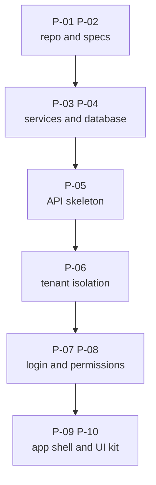

# Prompts: Project Foundation

**In simple words:** This chapter holds the first ten prompts of the Claude Code prompt library, P-01 to P-10. Together they build the floor that every later module stands on: the repository, the specs inside it, the local services, the database, the API skeleton, the tenant isolation layer, login, permissions, the web app shell and the reusable UI kit. Copy each prompt as it is, run it on the sprint day named in it, and check the result with the list under it before you commit.

## What these ten prompts build

These ten prompts cover Day 1 to Day 12 of the sprint, which is Week 1 and most of Week 2. Nothing in them looks like a school ERP. No accountant can collect a fee yet, no parent can open anything. What you get instead is the part of the product that is expensive to add later: one repository that installs with one command, a database with every table, an API that answers in one fixed shape, a tenant layer that makes Sharma Classes data invisible to Bright Future Public School, a login that survives a page reload, and a table component that every module screen reuses.

**Figure: The order of the foundation prompts**



Every box needs the box above it. P-06 cannot scope queries before P-04 created the tables. P-07 cannot open a tenant context before P-06 built one. P-09 cannot show a role-based sidebar before P-08 returns permission keys. Run them in this order and do not jump ahead, even when a prompt looks boring.

| ID | Prompt | Reads these docs | Builds | Typical time |
|---|---|---|---|---|
| P-01 | Monorepo skeleton | Nothing (the repo is still empty) | `client/`, `server/`, `shared/`, root scripts | 2 h |
| P-02 | CLAUDE.md and the docs copy | Your local `_canon.md` and PRD sources | `CLAUDE.md`, `docs/` inside the repo | 1.5 h |
| P-03 | Docker Compose and env config | `docs/canon.md`, `docs/prd/04-system-architecture.md` | PostgreSQL 16, Redis 7, Zod-checked config | 2 h |
| P-04 | Prisma schema, migration, seed | `docs/schema/`, `docs/permissions.md`, `docs/prd/50-database-design-overview.md` | All tables, `init` migration, seed data | 3 h |
| P-05 | Express API skeleton | `docs/prd/55-api-standards-and-conventions.md`, `docs/prd/92-appendix-error-codes.md` | Envelope, errors, logs, health, OpenAPI | 3 h |
| P-06 | Multi-tenancy layer | `docs/prd/05-multi-tenancy-and-data-isolation.md` | Tenant context, Prisma extension, RLS | 6 h (2 days) |
| P-07 | Authentication | `docs/prd/06-authentication-and-sessions.md`, `docs/api/01-platform-people.md` | Login, refresh, OTP, reset, invitations | 6.5 h (2 days) |
| P-08 | RBAC and campus scoping | `docs/prd/07-rbac-and-permissions-matrix.md`, `docs/permissions.md` | `requirePermission`, roles API, campus checks | 3 h |
| P-09 | Next.js app shell | `docs/prd/08-design-system-and-ux-guidelines.md` | Layouts, sidebar, auth pages, API client | 3.5 h |
| P-10 | Reusable UI kit | `docs/prd/08-design-system-and-ux-guidelines.md`, `docs/prd/43-settings-module.md` | Data table, form kit, dialogs, states | 3 h |

That is about 33 hours of build and review time spread over nine working days. The rest of each day belongs to sales calls and to the review work described in *Daily Plan: Days 1 to 14*.

### How to run a prompt from this chapter

The full method, with the six-part prompt anatomy and the review rules, is in *Working with Claude Code*. This is the short loop you repeat ten times.

1. Read the "When to use" and "Before you start" lines of the prompt. If one pre-condition is missing, fix that first. A prompt that runs on a broken base produces code you cannot review.
2. Create the branch named in the prompt, for example `git switch -c feat/p05-api-skeleton`.
3. Start a fresh Claude Code session inside the repo and clear the old context with `/clear`. Stale context from the last prompt is the most common cause of invented file paths.
4. Turn on plan mode, paste the prompt, and read the plan against the spec. Correct the plan in chat until it matches. Nothing is written during this step.
5. Approve the plan and let Claude implement it in small steps. After each step you see files changed, commands run and results.
6. Run the acceptance checks yourself in a terminal. Do not accept "all tests pass" as text. Run `npm run check` and look at the output.
7. Work through the review checklist under the prompt. It contains the things a test cannot prove, such as another organization's data showing up in a list.
8. Open the pull request, read the whole diff, merge, and delete the branch.

> **Rule:** Never shorten the CONSTRAINTS block or the ACCEPTANCE CHECKS block of a library prompt. If a prompt is too big for one session, cut the TASK into two halves and run it twice. P-06 and P-07 are already written as two halves for this reason.

### What the prompts assume

These prompts are written for the repository that P-01 and P-02 create. They use short names instead of repeating the same rules ten times.

- **CLAUDE.md carries the standing rules.** Tenant scoping, the response envelope, money handling, the test rule and the commit format live there after P-02. That is why the prompts below say "Follow every rule in CLAUDE.md" instead of listing fifteen rules again.
- **Helper names are fixed from the day they appear.** `runWithTenant` and `runAsPlatform` (P-06), `authenticate` (P-07), `requirePermission` (a key-only first version in P-07, finished in P-08), `sendOk` and `sendList` (P-05), `apiFetch` (P-09). If your generated code uses different names, change the name in the code, not in the later prompts.
- **The folder layout is the one in *Folder Structure*.** Server modules are `server/src/modules/<module>/` with the layer suffixes `.routes.ts`, `.controller.ts`, `.service.ts`, `.repository.ts`, `.schemas.ts` and `.test.ts`. Client screens are `client/src/features/<module>/`.
- **Endpoint IDs and permission keys come from the registry.** `docs/api/01-platform-people.md` holds AUTH, USR, DASH, ORG, CAMP, ADM, STU, TCH and STF. Never let Claude invent a path such as `/auth/signin` when the registry says `/auth/login`.
- **The schema is frozen.** `docs/schema/` was validated before the sprint. No prompt may add a table, a field or an enum value. A missing field is a spec change, and a spec change is a separate commit in `docs/`.

## P-01 — Create the monorepo skeleton (client, server, shared, npm workspaces, TypeScript, ESLint, Prettier)

### When to use

Day 1, Monday 5 October 2026, as the very first prompt of the sprint. You run it once. If you ever start a second product later, this is also the prompt you copy first.

### Before you start

- Node.js 24 LTS, npm, Git, GitHub CLI and Claude Code are installed. Check with `node -v`; it must print `v24.x`.
- A private GitHub repository named `eduflow` exists, is cloned to your laptop, and holds only `README.md` and `.git`.
- You are on the branch `feat/p01-monorepo-skeleton`.
- No earlier prompt is needed. This is the only prompt in the library that reads no spec file, because the specs are not in the repo yet.

> **Founder note:** Do not fix this chicken-and-egg problem by pasting the canon into the chat. P-02 copies it into `docs/` five minutes later, and from then on every session reads it from disk for free.

### The prompt

```text
CONTEXT TO READ
- Nothing. This repository is empty except .git and README.md. The
  product specs arrive with the next prompt (P-02), so do not look
  for a docs/ folder and do not invent one.
- Run "node -v" and "npm -v" first and print both. Node must be 24.x.

TASK
Create the EduFlow monorepo skeleton with npm workspaces and exactly
three workspaces, in this order in the root package.json: shared,
server, client. No business code today. The finish line is a repo
that installs, lints, type-checks, tests, builds and starts, each
with one command from the root.

- shared -> package "@eduflow/shared": a TypeScript library that
  depends on zod only, builds with tsc into dist/, and has exactly
  one public entry file src/index.ts.
- server -> package "@eduflow/server": TypeScript, dev script runs
  "tsx watch src/server.ts", and src/server.ts prints one start
  line. No Express, no Prisma, no database code today.
- client -> package "@eduflow/client": create it by running
  npx create-next-app@latest client --typescript --tailwind
  --eslint --app --src-dir --import-alias "@/*" --use-npm
  If that tool asks a question these flags do not answer, stop and
  show me the question instead of guessing an answer.

CONSTRAINTS
- npm workspaces only. No pnpm, no yarn, no turborepo, no lerna.
- Exactly one package-lock.json, at the repo root. Never run npm
  install inside client/, server/ or shared/.
- server and client list "@eduflow/shared": "*" as a dependency so
  npm links them. Never write "workspace:*"; that is pnpm syntax.
- tsconfig.base.json at the root sets strict, noUncheckedIndexed-
  Access, noImplicitOverride, noFallthroughCasesInSwitch and
  forceConsistentCasingInFileNames. Every workspace tsconfig
  extends it. No "any" in any file you write.
- One ESLint flat config (eslint.config.mjs) and one Prettier
  config at the root. Do not leave a second ESLint config in
  client/. Keep the Next.js rules for client files inside the
  root config.
- .nvmrc holds "24". Root package.json sets engines node ">=24 <25"
  and "private": true.
- Ask me before adding any dependency that is not named here.

FILES TO CREATE OR CHANGE
- package.json, tsconfig.base.json, eslint.config.mjs,
  .prettierrc.json, .prettierignore, .editorconfig,
  .gitattributes, .gitignore, .nvmrc, README.md (all new)
- shared/package.json, shared/tsconfig.json, shared/src/index.ts
- server/package.json, server/tsconfig.json,
  server/tsconfig.build.json, server/src/server.ts
- client/ (generated by create-next-app, then adjusted)
Root scripts: dev, dev:shared, dev:api, dev:web, build, lint,
typecheck, test, check, format. A "predev" script builds shared
first. "check" runs lint, then typecheck, then test, and stops at
the first failure.
Do not touch any other file without asking.

ACCEPTANCE CHECKS
- [ ] "rm -rf node_modules && npm install" finishes without errors,
      and only the root package-lock.json exists.
- [ ] npm run lint, npm run typecheck, npm run test and
      npm run build all pass from the repo root.
- [ ] npm run dev starts both: localhost:3000 shows the Next.js
      start page and the server prints its start line.
- [ ] A type exported from shared/src/index.ts imports cleanly in
      client and in server, and npm run typecheck still passes.
- [ ] git status lists no node_modules, no .next, no dist, no .env.

WHAT TO REPORT BACK
1. Files created, one line each.
2. Commands you ran and a one-line result for each.
3. Every dependency you added, with its version and the reason.
4. Anything the create-next-app flags did not cover, and what you
   chose instead.
```

### Follow-up prompts

Run these in the same session, one after the other, after the main prompt is done.

```text
Add the root script "check" that runs lint, then typecheck, then
test across all workspaces and stops at the first failure. Run it
and fix every error you find. Do not disable an ESLint rule and do
not add a // @ts-expect-error comment to make it pass.
```

```text
Prove the workspace link: export "export type Uuid = string;" from
shared/src/index.ts, import it once in server/src/server.ts and
once in a client file, run npm run typecheck, show me the output,
then remove the two imports again.
```

```text
Show me .gitignore. It must ignore node_modules, .next, dist,
coverage, .env, .env.local and .DS_Store, and it must NOT ignore
.env.example. Then run "git status --porcelain" and show the list
of files that would be committed.
```

### Review checklist

Do these seven checks by hand before you open the pull request.

1. Open the root `package.json`. The `workspaces` array reads `shared`, `server`, `client` in that order, and `"private": true` is present.
2. Run `ls client/package-lock.json server/package-lock.json shared/package-lock.json`. All three must be missing. A second lock file means your laptop and CI will install different versions.
3. Open `tsconfig.base.json` and confirm `"strict": true`. A skeleton without strict mode costs you a week of type fixes in November.
4. Delete `node_modules`, run `npm install` and then `npm run check`. It must pass on a cold install, not only on your warm machine.
5. Add an unused variable in `server/src/server.ts` on purpose and run `npm run lint`. It must fail. Remove the variable.
6. Open `http://localhost:3000` in Chrome while `npm run dev` runs. The Next.js page appears and the terminal shows both processes.
7. Check that nothing business-related crept in: no Express, no Prisma, no database URL, no half-built login page. This prompt builds a skeleton only.

### Common mistakes Claude makes here and how to correct them

| Mistake | Fix prompt |
|---|---|
| Runs `npm install` inside `client/`, creating a second lock file | "Delete client/package-lock.json and client/node_modules, then run npm install from the repo root only. Show me that one lock file remains." |
| Uses `"workspace:*"` for the shared dependency | "npm does not understand workspace:*. Change the @eduflow/shared version to \"*\" in server and client, reinstall, and show me the symlink in node_modules/@eduflow." |
| Leaves the ESLint config that `create-next-app` generated inside `client/` | "Merge the client ESLint rules into the root eslint.config.mjs and delete the config file inside client/. One config for the whole repo." |
| Adds extra tools nobody asked for (Turborepo, Husky, Changesets) | "Remove every dependency that is not in the P-01 prompt and reinstall. We add tools when a prompt needs them, not before." |
| Writes a `server/src/index.ts` instead of `server/src/server.ts` | "Rename the server entry file to src/server.ts and update the dev, build and start scripts. Later prompts assume this exact path." |
| Sets loose TypeScript options to make an error disappear | "Restore strict, noUncheckedIndexedAccess and noImplicitOverride in tsconfig.base.json and fix the real type error instead." |

## P-02 — Write CLAUDE.md and copy the docs into the repo

### When to use

Day 1, right after P-01 is merged. It is the shortest prompt of Week 1 and the one with the longest effect: every session for the next 59 days starts by reading the file it writes.

### Before you start

- P-01 is merged into `main` and you are on the branch `docs/p02-claude-md-and-specs`.
- You know the folder on your laptop where the documentation sources live. In this Blueprint it is `E:/mysaasschool/docs/src`, written in Git Bash as `/e/mysaasschool/docs/src`. Give Claude that path.
- You have read the `CLAUDE.md` template in *Working with Claude Code* once. You will check the generated file against it line by line.

> **Tip:** If you prefer, save the full `CLAUDE.md` template from *Working with Claude Code* yourself, commit it, and let this prompt only copy the specs and verify the file against `docs/canon.md`. A hand-saved template is faster and has no risk of a paraphrased rule.

### The prompt

```text
CONTEXT TO READ
- The documentation sources on my laptop. I will give you the
  folder path as DOCS_SRC when you ask. Example (Git Bash):
  /e/mysaasschool/docs/src
- After the copy step: docs/canon.md (all sections) inside the repo.
- The existing root package.json, so the Commands section you write
  matches the real script names.

TASK
Two things, in this order.

Step 1 - copy the specs into the repo, keeping these exact names:
  DOCS_SRC/_canon.md        -> docs/canon.md
  DOCS_SRC/_permissions.md  -> docs/permissions.md
  DOCS_SRC/prd/*.md         -> docs/prd/
  DOCS_SRC/_schema/*.prisma -> docs/schema/
  DOCS_SRC/_api/*.md        -> docs/api/
Also create docs/progress.md with a short "Session handoff notes"
heading, and an empty docs/reviews/ folder with a .gitkeep file.
Copy only. Do not edit, reformat, rename or summarise any file.

Step 2 - write CLAUDE.md in the repo root. Read docs/canon.md
first and take every fact from it. Use these sections, in this
order, and keep the whole file under 150 lines:
  Project overview - what EduFlow is, that it is multi-tenant, that
    data is isolated by organization_id, that the owner is a solo
    founder who prefers boring readable code.
  Specs - read before you code - the five paths above, plus the
    order of truth: canon, then schema, then api and permissions,
    then prd, then code. Read only the files a prompt names.
  Stack - the fixed stack from the canon with versions. Say that
    adding or swapping a library needs my approval.
  Commands - the real script names from package.json, plus the
    docker compose and prisma commands.
  Folder map - client/src/app, client/src/features/<module>,
    client/src/components, server/src/modules/<module> with the
    files .routes.ts .controller.ts .service.ts .repository.ts
    .schemas.ts .events.ts .test.ts, server/src/middleware,
    server/src/lib, server/src/jobs, server/prisma/schema,
    shared/src, docs/.
  Non-negotiable rules - numbered, one line each: tenant scope from
    the JWT only, permission check on every route, Zod validation,
    the success and error envelope with canon error codes, Decimal
    money inside transactions, no invented tables or fields,
    pagination with limit max 100, soft delete, no secrets in code
    or logs, tests for money, auth and permissions, files under
    about 300 lines, Conventional Commits.
  How to work with the founder - plan first above three files, small
    steps, ask before dependencies, schema changes and destructive
    commands, use the canon sample data (Bright Future Public
    School, Sharma Classes, Aarav Sharma), never real student data.

CONSTRAINTS
- Short direct rules, one line each. No paragraphs of explanation.
- Every fact comes from docs/canon.md. If the canon does not say
  it, leave it out and list it as an open question.
- Do not invent script names. Read package.json.
- Do not copy any file from DOCS_SRC that is not in the list above.
- No secrets, no .env content, no customer names in CLAUDE.md.

FILES TO CREATE OR CHANGE
- CLAUDE.md (new)
- docs/canon.md, docs/permissions.md, docs/prd/*.md,
  docs/schema/*.prisma, docs/api/*.md (copied)
- docs/progress.md, docs/reviews/.gitkeep (new)
Do not touch any other file without asking.

ACCEPTANCE CHECKS
- [ ] docs/prd/ holds every PRD file, docs/schema/ holds every
      .prisma file, docs/api/ holds every registry file. Show me
      the file count of each folder.
- [ ] diff DOCS_SRC/_canon.md docs/canon.md prints nothing.
- [ ] CLAUDE.md is under 150 lines and every command in it runs.
- [ ] CLAUDE.md names no table, field or price that is not in
      docs/canon.md.
- [ ] npm run check still passes.

WHAT TO REPORT BACK
1. File counts per copied folder.
2. CLAUDE.md line count and its section list.
3. Anything in the canon you could not turn into a one-line rule.
4. Open questions you would like me to answer before Day 2.
```

### Follow-up prompts

```text
Start a new session and answer only from CLAUDE.md: What are the
multi-tenancy rules of this project, which error codes may the API
return, and how is money stored? If you cannot answer from the
file, tell me which line is missing.
```

```text
Add a "How to add a new route" block of at most eight lines to
CLAUDE.md: router file, Zod schema in shared/, service function,
response helper, permission key, test. This is the pattern every
module prompt from Day 15 will follow.
```

### Review checklist

1. Open `CLAUDE.md` and read every line out loud. A rule you cannot explain in one sentence is a rule Claude will apply wrongly.
2. Count the lines: `wc -l CLAUDE.md`. Above 150 lines, the file starts to be ignored, by models and by you. Move detail into `docs/`.
3. Check three prices and one table name in `CLAUDE.md` against `docs/canon.md`. Paraphrasing a fact is the most expensive mistake this prompt can make.
4. Run every command listed in the Commands section. A command that does not exist yet must say so, for example "from Day 3".
5. Open `docs/prd/25-fees-module.md` in your editor and compare the first twenty lines with the source file. The copy must be byte-identical.
6. Confirm `docs/schema/` holds fourteen `.prisma` files and `docs/api/` holds the four registry files plus the permission key list.
7. Start a new Claude Code session and ask one canon question without pasting anything. A correct answer proves the file is loaded automatically.
8. Check that `docs/progress.md` exists and is empty apart from its heading. It is where a session writes its handoff note before you close it.

### Common mistakes Claude makes here and how to correct them

| Mistake | Fix prompt |
|---|---|
| Summarises the canon instead of copying it | "Restore docs/canon.md as an exact copy of the source file. Run diff and show me that it prints nothing. Specs are copied, never rewritten." |
| Writes a 400-line CLAUDE.md with explanations | "Cut CLAUDE.md to under 150 lines. Keep one line per rule. Move every explanation into docs/ and leave a pointer line." |
| Invents npm scripts that do not exist | "Read package.json and correct the Commands section so that every command runs today. Mark commands that arrive later with the day they arrive." |
| Copies extra files such as the Blueprint drafts | "Delete every file in docs/ that is not in the P-02 copy list. The repo carries canon, prd, schema, api and permissions only." |
| Puts sample logins or secrets into CLAUDE.md | "Remove every password, token and real contact detail from CLAUDE.md. The seed prints the demo password; the file must not." |

## P-03 — Docker Compose for PostgreSQL and Redis, plus Zod-validated environment config

### When to use

Day 2, Tuesday 6 October 2026. It is the last prompt before the database gets its tables, and it decides how every later service reads its configuration.

### Before you start

- P-01 and P-02 are merged. You are on `feat/p03-docker-and-env`.
- Docker Desktop is running. `docker --version` and `docker compose version` both answer.
- Ports 5432, 6379, 1025 and 8025 are free on your laptop. On Windows, `netstat -ano | findstr :5432` shows who holds a port.
- You accept that no application code talks to the database yet. That is P-04's job.

### The prompt

```text
CONTEXT TO READ
- docs/canon.md: section "Technology" (database, cache, queue) and
  the multi-tenancy rules.
- docs/prd/04-system-architecture.md: the runtime picture and the
  list of external services.
- The existing root package.json and server/package.json.

TASK
Give the project its local services and one safe way to read
configuration.

1. docker-compose.yml in the repo root with three services:
   - postgres, image postgres:16, TZ UTC, named volume, healthcheck
     with pg_isready, port bound to 127.0.0.1:5432.
   - redis, image redis:7, started with --appendonly yes and
     --maxmemory-policy noeviction, named volume, healthcheck with
     redis-cli ping, port bound to 127.0.0.1:6379.
   - mailpit for local email, SMTP on 127.0.0.1:1025 and its web
     inbox on 127.0.0.1:8025.
   Every value comes from a variable with a default, for example
   ${POSTGRES_USER:-eduflow}, so the file works without a .env.

2. server/src/config/env.ts: one Zod schema that parses
   process.env once, exports a typed "env" object, and is the only
   file in the server that touches process.env. Required now:
   NODE_ENV, PORT, LOG_LEVEL, TZ, WEB_APP_URL, API_PUBLIC_URL,
   CORS_ORIGINS, DATABASE_URL, DATABASE_ADMIN_URL, REDIS_URL,
   JWT_ACCESS_SECRET (min 32 chars), JWT_REFRESH_SECRET (min 32),
   JWT_ACCESS_TTL, REFRESH_TOKEN_TTL_DAYS, COOKIE_DOMAIN,
   COOKIE_SECURE, SEED_DEMO_PASSWORD. Optional for now and marked
   with a comment that names the prompt that makes them required:
   AWS_REGION, AWS_ACCESS_KEY_ID, AWS_SECRET_ACCESS_KEY, S3_BUCKET
   (P-21); RAZORPAY_KEY_ID, RAZORPAY_KEY_SECRET,
   RAZORPAY_WEBHOOK_SECRET (P-26); the WhatsApp group (P-29);
   SENTRY_DSN.

3. .env.example files: the repo root one holds only the Docker
   values; server/.env.example holds every server key above with
   safe dummy values and a one-line comment per key;
   client/.env.example holds NEXT_PUBLIC_API_URL,
   NEXT_PUBLIC_APP_URL, NEXT_PUBLIC_APP_ENV and
   NEXT_PUBLIC_ROOT_DOMAIN.

4. A script "db:ping" in server/package.json that connects to
   PostgreSQL and to Redis, prints OK for each, and exits with
   code 1 when one of them fails.

CONSTRAINTS
- Fail fast: a missing or invalid variable stops the process at
  start-up with a message that names the variable, and exits with
  code 1. Never start with a half-valid config.
- Parse booleans with z.enum(['true','false']) and compare with
  'true'. z.coerce.boolean() turns the text "false" into true.
- No real secret anywhere. .env files stay git-ignored;
  .env.example files are committed.
- Bind every port to 127.0.0.1, never to 0.0.0.0.
- No Prisma, no Express, no application feature in this prompt.
- Ask me before adding a dependency.

FILES TO CREATE OR CHANGE
- docker-compose.yml (new)
- .env.example, server/.env.example, client/.env.example (new)
- server/src/config/env.ts (new)
- server/src/scripts/db-ping.ts (new)
- server/package.json (change) - the db:ping script
- .gitignore (change) - ignore .env and .env.local
- CLAUDE.md (change) - add the docker and db:ping commands
Do not touch any other file without asking.

ACCEPTANCE CHECKS
- [ ] "docker compose up -d --wait" returns, and "docker compose
      ps" shows postgres and redis as healthy.
- [ ] docker compose exec postgres psql -U eduflow -d eduflow_dev
      -c "select version();" prints PostgreSQL 16.
- [ ] docker compose exec redis redis-cli ping prints PONG.
- [ ] http://localhost:8025 shows the empty Mailpit inbox.
- [ ] Remove DATABASE_URL from server/.env and start the server: it
      exits within two seconds and names DATABASE_URL. Set PORT=abc
      and show that error too. Restore the file afterwards.
- [ ] grep -rn "process.env" server/src finds hits only in
      config/env.ts.
- [ ] docker compose down then up -d: data written before is still
      there, so the named volume works.

WHAT TO REPORT BACK
1. Files created or changed, one line each.
2. The two failure messages from the fail-fast test, word for word.
3. The full list of variables, split into required and optional.
4. What I must put in server/.env by hand before Day 3.
```

### Follow-up prompts

```text
Start the API with DATABASE_URL removed from server/.env and show
me the exact error message. It must name the missing variable and
exit with code 1. Then set PORT=abc and show me that error too.
Restore the file and confirm the server starts again.
```

```text
Add a comment line above every key in server/.env.example that
says what the key does in plain English, and for optional keys
which prompt makes them required. Keep each comment under 80
characters.
```

```text
Write a short section in CLAUDE.md under Commands: how to start
and stop the local services, how to run db:ping, and the rule that
config is read only through server/src/config/env.ts.
```

### Review checklist

1. Open `docker-compose.yml`. Both database services use named volumes. Without a volume, every `docker compose down` deletes your seed data.
2. Confirm the image tags are `postgres:16` and `redis:7`, exactly as the canon fixes them. A `latest` tag will give you PostgreSQL 17 one morning and break a migration.
3. Check every port line starts with `127.0.0.1:`. On a shared café network, an open 5432 is a free database for everybody.
4. Read `server/src/config/env.ts` and count the places that call `process.env`. There must be exactly one.
5. Delete a required variable and start the server. You must see a clear message naming that variable, not a stack trace about `undefined`.
6. Run `git status`. `server/.env` must not appear. If it does, your secrets are one commit away from GitHub.
7. Run `docker compose down` and `docker compose up -d --wait`, then `db:ping`. Everything must come back without manual repair.
8. Open `server/.env.example` and confirm every value is a dummy. `replace_me` is fine; a real Razorpay key is not.

### Common mistakes Claude makes here and how to correct them

| Mistake | Fix prompt |
|---|---|
| Reads `process.env` directly in other server files | "Every process.env read outside server/src/config/env.ts must import the typed env object instead. Show me the grep output after the change." |
| Uses `z.coerce.boolean()` for `COOKIE_SECURE` | "Parse boolean variables with z.enum(['true','false']) and compare with 'true'. Add a test that proves COOKIE_SECURE=false is false." |
| Writes real-looking secrets into `.env.example` | "Replace every value in .env.example with a safe dummy. Secrets belong only in the git-ignored .env file on my machine." |
| Starts PostgreSQL without a volume or without a healthcheck | "Add the named volume and the pg_isready healthcheck to the postgres service, then prove with docker compose down and up that data survives." |
| Makes every variable required, so the server cannot start | "Mark the S3, Razorpay and WhatsApp groups optional and add a comment naming the prompt that makes them required. The server must start today with dummy values." |
| Exposes ports as `5432:5432` | "Bind every published port to 127.0.0.1 so the services are not reachable from other machines on the network." |

## P-04 — Install the Prisma schema, first migration and seed data (plans, permissions, system roles, demo organization)

### When to use

Day 3, Wednesday 7 October 2026. This is the first prompt that writes to a database, and the first one where "let Claude improve it" is forbidden.

### Before you start

- P-03 is merged, `docker compose up -d --wait` shows both services healthy, and `server/.env` holds a working `DATABASE_URL`.
- You are on `feat/p04-prisma-schema-and-seed`.
- `docs/schema/` holds the fourteen validated `.prisma` files, and `docs/permissions.md` holds the permission key list.
- You have read `docs/prd/50-database-design-overview.md` once, so you recognise a wrong model when you see it in the diff.

> **Warning:** The schema is the one thing in this sprint that was finished before Day 1. It has 189 models, and each one was checked against a module spec. If Claude renames one field, every later prompt that reads `docs/schema/` produces code that does not compile. Reject any diff that changes a model.

### The prompt

```text
CONTEXT TO READ
- docs/canon.md: sections "Technology", "Multi-tenancy rules",
  "Database conventions" and "Pricing".
- docs/schema/*.prisma - all fourteen files. This is the approved
  data model. It is frozen.
- docs/permissions.md - every permission key with its meaning.
- docs/prd/50-database-design-overview.md and
  docs/prd/51-data-dictionary-platform-and-people.md.
- docs/prd/03-release-plan-and-plan-gating.md for what each plan
  unlocks.

TASK
Turn the approved schema into real tables and fill them with the
data every later prompt needs.

1. Pin one exact Prisma 6.x version for both "prisma" and
   "@prisma/client" in server/package.json. No caret, no tilde.
2. Copy docs/schema/*.prisma to server/prisma/schema/ without any
   change, and point Prisma at that folder (the "prisma" block in
   server/package.json, or a prisma config file - use whichever
   the pinned version supports, and keep only one of the two).
3. Run "npx prisma validate", then create the first migration
   named init, then "npx prisma generate".
4. Read every schema comment that mentions "partial unique index"
   or "CHECK". Prisma cannot express them. Create a second,
   hand-written migration with --create-only named
   partial_unique_indexes and put that SQL in it. Example: one
   live subscription per organization, one main campus per
   organization, one current academic year per organization, the
   users check that user_type = 'PLATFORM' equals organization_id
   IS NULL, and the roles check is_system = (organization_id IS
   NULL).
5. Write the seed in server/prisma/seed/ split into small files
   run in order by index.ts: reference-data.ts (countries and
   currencies for India, UAE, USA, Australia), plans.ts,
   permissions.ts, roles.ts, demo-organizations.ts.
   - plans.ts: the four canon plans STARTER, GROWTH, PRO and
     ENTERPRISE with their student and campus limits, plus
     PlanPrice rows per currency and billing cycle. Growth INR is
     2499.00 monthly and 24990.00 yearly. Take every other number
     from the canon pricing table. PlanFeature rows follow the
     release phase of each module.
   - permissions.ts: every key from docs/permissions.md, with the
     module it belongs to.
   - roles.ts: the seven system roles SUPER_ADMIN, ORG_ADMIN,
     PRINCIPAL, TEACHER, ACCOUNTANT, PARENT, STUDENT with
     organizationId null and isSystem true, and their
     RolePermission rows with the scope from the matrix.
   - demo-organizations.ts: "Bright Future Public School" (SCHOOL,
     Lucknow, 2 campuses) and "Sharma Classes" (COACHING, Patna,
     1 campus), plus the demo users Rajesh Sharma (ORG_ADMIN),
     Dr. Anita Verma (PRINCIPAL), Priya Nair (TEACHER), Suresh
     Gupta (ACCOUNTANT), Sunita Devi (PARENT), Aarav Sharma
     (STUDENT), one ORG_ADMIN for Sharma Classes and one platform
     SUPER_ADMIN. All share the password from SEED_DEMO_PASSWORD,
     hashed with bcrypt. Print the list and the password at the
     end of the seed run.

CONSTRAINTS
- Never add, rename, remove or "improve" a model, field, enum
  value, index or relation. If prisma validate fails, show me the
  exact error and stop. The fix goes into docs/schema/ first.
- Money fields stay Decimal. Never Float, never Number.
- The seed is idempotent: run it twice and the row counts do not
  change. Use upsert on natural unique keys.
- No student, staff, fee or attendance demo rows in this prompt.
  P-58 seeds sales demo data later.
- Migrations and the seed use the owner database role from
  DATABASE_ADMIN_URL.
- Ask before adding any dependency other than bcrypt.

FILES TO CREATE OR CHANGE
- server/prisma/schema/*.prisma (copied, unchanged)
- server/prisma/schema/migrations/ (generated)
- server/prisma/seed/index.ts, reference-data.ts, plans.ts,
  permissions.ts, roles.ts, demo-organizations.ts (new)
- server/package.json (change) - pinned versions, prisma block,
  db:seed and db:reset scripts
- CLAUDE.md (change) - the Prisma commands
Do not touch any other file without asking.

ACCEPTANCE CHECKS
- [ ] npx prisma validate passes and prints no warning about a
      missing model.
- [ ] diff -r -x migrations docs/schema server/prisma/schema
      prints nothing.
- [ ] npx prisma migrate reset followed by the seed gives the same
      row counts twice: plans 4, roles 7 system rows,
      organizations 2, campuses 3, and the permission count equals
      the number of keys in docs/permissions.md.
- [ ] In plan_prices, Growth has INR 2499.00 monthly and 24990.00
      yearly.
- [ ] users.password_hash starts with "$2" for every demo user.
- [ ] The SQL below lists only platform tables (countries,
      currencies, plans, plan_prices, plan_features, permissions,
      organizations, _prisma_migrations). If a business table such
      as students appears, stop and show me.

      SELECT t.table_name FROM information_schema.tables t
      WHERE t.table_schema = 'public' AND t.table_type='BASE TABLE'
        AND NOT EXISTS (SELECT 1 FROM information_schema.columns c
          WHERE c.table_schema='public' AND c.table_name=t.table_name
            AND c.column_name='organization_id')
      ORDER BY 1;

WHAT TO REPORT BACK
1. The pinned Prisma version and where you configured the schema
   folder.
2. The list of hand-written SQL constraints you added and why.
3. Row counts after the first and the second seed run.
4. Any schema comment you could not turn into SQL.
```

### Follow-up prompts

```text
Make the seed idempotent: running "npx prisma db seed" twice must
not create duplicate plans, permissions, roles, organizations or
users. Use upsert on the natural unique keys. Run the seed twice
and show me the row counts of those five tables after each run.
```

```text
Write a Vitest test that reads the Prisma model list at runtime
and fails if a model that has an organizationId field is missing
from a list of tenant models that you export from a single file.
P-06 will use that same list.
```

```text
Print a short seed summary table at the end of the run: plans,
permissions, roles, organizations, campuses, users, and the demo
password. This is the output I paste into my notes for Day 8.
```

### Review checklist

1. Open Prisma Studio with `npx prisma studio` and look at `plans`. Four rows, and the Growth INR prices match the canon exactly. A wrong price here becomes a wrong invoice in January.
2. Check `roles`: seven rows with an empty `organization_id` and `is_system` true. An eighth row means Claude invented a role.
3. Run `diff -r -x migrations docs/schema server/prisma/schema`. No output. This is the check that catches a silent schema edit.
4. Open the hand-written migration and read the SQL. Every statement must come from a schema comment, not from Claude's imagination.
5. Run the platform-table SQL from the acceptance checks. Any business table without `organization_id` is a tenant leak waiting for Day 5.
6. Look at one `users` row. `password_hash` starts with `$2`, and no column anywhere holds the readable password.
7. Run `npx prisma migrate reset` and seed again. If the second run fails, the seed is not idempotent and every later reset will cost you an hour.
8. Confirm `server/package.json` pins Prisma without a caret. An automatic minor upgrade during Week 6 is a debugging day you cannot afford.

### Common mistakes Claude makes here and how to correct them

| Mistake | Fix prompt |
|---|---|
| "Improves" a model, for example renames `admissionNo` | "Restore server/prisma/schema from docs/schema without any change and run the diff command. The schema is frozen; changes start in docs/schema." |
| Writes money columns as `Float` in a new helper or seed row | "Every money value must be a Prisma Decimal and a string in TypeScript. Show me every place you wrote a number for money and fix it." |
| Seeds with `create`, so the second run crashes | "Rewrite the seed with upsert on the natural unique keys, run it twice and show me the row counts after each run." |
| Invents permission keys that are not in `docs/permissions.md` | "Compare the seeded permission keys with docs/permissions.md and delete every key that is not in the file. Show me the diff of both lists." |
| Puts the demo password in code or in a committed file | "Read the demo password only from SEED_DEMO_PASSWORD and print it at the end of the run. Remove every hard-coded password from the seed files." |
| Creates its own migration SQL for indexes Prisma already makes | "Keep only the constraints that Prisma cannot express: partial unique indexes and CHECK constraints named in the schema comments. Remove the rest." |

## P-05 — Express API skeleton: response envelope, error handler, request ID, logging, validation, OpenAPI

### When to use

Day 4, Thursday 8 October 2026. Every endpoint of the next 56 days is shaped by what this prompt creates, so review it slowly.

### Before you start

- P-04 is merged, the database has tables and seed rows, and `npx prisma studio` opens.
- You are on `feat/p05-api-skeleton`.
- You have read `docs/prd/55-api-standards-and-conventions.md` and the error code list in `docs/canon.md`.
- Nothing in this prompt needs a login. Authentication is P-07.

### The prompt

```text
CONTEXT TO READ
- docs/canon.md: section "API conventions" (base URL, envelope,
  error codes, list rules, rate limits).
- docs/prd/55-api-standards-and-conventions.md - the full rules.
- docs/prd/92-appendix-error-codes.md - the complete code list.
- docs/prd/64-non-functional-requirements.md - response time and
  logging targets.
- server/src/config/env.ts from P-03.

TASK
Build the Express 5 API skeleton that every module will plug into.
No business endpoint yet.

1. src/app.ts exports createApp(): it builds the Express app but
   never calls listen, so tests can use it with Supertest.
   src/server.ts is the only file that listens, and it shuts down
   gracefully on SIGTERM and SIGINT: stop accepting requests,
   finish open ones, close Prisma and Redis, exit.
2. Middleware, in this order inside createApp():
   requestId (adds req.id = "req_" + a short id and the
   X-Request-Id response header), httpLogger (Pino, one line per
   request, with the request id and the duration), security
   headers and CORS built from CORS_ORIGINS with credentials
   allowed, JSON and cookie parsers with a body size limit,
   then the routers, then notFound, then errorHandler last.
3. src/lib/respond.ts with sendOk(res, data), sendCreated and
   sendList(res, rows, meta). The success envelope is exactly
   { "success": true, "data": ... } plus "meta" with page, limit,
   total and totalPages on lists.
4. src/lib/app-error.ts: an AppError class carrying a canon error
   code, an HTTP status, a human message and optional details.
   Add one factory per code so nobody writes a status by hand.
5. src/middleware/error-handler.ts turns everything into
   { "success": false, "error": { code, message, details },
   "requestId": "req_..." }. Mapping: ZodError ->
   VALIDATION_ERROR (400) with details as a list of
   { field, issue }; Prisma P2002 -> CONFLICT (409); P2025 ->
   NOT_FOUND (404); anything unknown -> INTERNAL_ERROR (500) with
   a generic message, the full error only in the log.
6. src/middleware/validate.ts: validate({ body, query, params })
   parses with Zod and replaces req.body, req.query and req.params
   with the parsed values.
7. src/lib/list-query.ts: page (default 1), limit (default 20, max
   100), sort ("-createdAt" style) and q, all parsed with Zod.
8. Rate limiting with counters in Redis, not in memory: 100
   requests per minute per user or IP, 1000 per organization. Over
   the limit returns RATE_LIMITED (429).
9. GET /api/v1/health: checks PostgreSQL and Redis, returns the
   success envelope with the two states and the app version, and
   SERVICE_UNAVAILABLE (503) when one of them is down.
10. OpenAPI: generate the document from the Zod schemas in
    shared/, serve it under /api/v1/docs in development only.
    Tell me which generator package works with the installed Zod
    version before you add it.

CONSTRAINTS
- Follow every rule in CLAUDE.md. Express 5, TypeScript, no "any".
- Only the error codes listed in docs/canon.md. Never invent a new
  code or return a bare string.
- No route sends a raw object. Every response goes through the
  respond helpers or the error handler.
- No authentication, no tenant logic, no module endpoint here.
- Logs must never contain a password, token, OTP or full phone
  number. Configure Pino redaction for those fields.
- Ask before adding a dependency.

FILES TO CREATE OR CHANGE
- server/src/app.ts, server/src/server.ts, server/src/routes.ts
- server/src/config/cors.ts, server/src/config/openapi.ts
- server/src/middleware/request-id.ts, http-logger.ts, validate.ts,
  rate-limit.ts, not-found.ts, error-handler.ts
- server/src/lib/respond.ts, app-error.ts, list-query.ts,
  logger.ts, prisma.ts, redis.ts
- server/src/modules/health/health.routes.ts
- server/src/test/test-app.ts and server/src/app.test.ts
- server/src/types/express.d.ts (req.id)
Do not touch any other file without asking.

ACCEPTANCE CHECKS
- [ ] GET /api/v1/health returns 200 and the success envelope, and
      the response has an X-Request-Id header.
- [ ] Stop Redis with "docker compose stop redis": health returns
      503 with code SERVICE_UNAVAILABLE. Start it again.
- [ ] GET /api/v1/does-not-exist returns 404 NOT_FOUND in the
      error envelope with a requestId.
- [ ] A test route with a Zod body schema returns 400
      VALIDATION_ERROR and details naming the wrong field.
- [ ] An intentionally thrown error returns 500 INTERNAL_ERROR
      with a generic message, while the full stack is in the log
      with the same requestId.
- [ ] Vitest plus Supertest cover those five cases and pass.
- [ ] Sending SIGTERM to the dev server closes it without an
      unhandled error.

WHAT TO REPORT BACK
1. Files created, one line each.
2. The middleware order you registered, top to bottom.
3. The error code mapping table you implemented.
4. The OpenAPI generator you chose and why.
```

### Follow-up prompts

```text
Write four Supertest tests: the success envelope of the health
route, a 404 in the error envelope, a Zod validation error with a
details array, and an unexpected error mapped to INTERNAL_ERROR
without leaking the stack to the client. Show me the test output.
```

```text
Configure Pino redaction so that password, passwordHash, token,
refreshToken, otp, authorization headers and cookies never reach
the log. Add a test that posts a fake password and greps the log
output to prove it is not there.
```

```text
Add graceful shutdown to src/server.ts: on SIGTERM and SIGINT stop
accepting new connections, wait for open requests up to ten
seconds, close Prisma and Redis, then exit with code 0. Show me
the log lines of one shutdown.
```

### Review checklist

1. Call the health route with `curl -i`. The body matches the canon envelope character for character, including `"success": true`.
2. Compare the `requestId` in an error response with the `req_` value in the server log. They must be the same string, or you cannot debug a pilot institute's report in November.
3. Read `error-handler.ts` and check that it is registered last in `app.ts`. An error handler in the middle silently stops working.
4. Force a `VALIDATION_ERROR` and look at `details`. It must be a list of `{ field, issue }`, because P-10 maps that list onto form fields.
5. Grep the source for `res.json(` outside `respond.ts` and the error handler. There should be no other hit.
6. Check the rate limit counters land in Redis: run `docker compose exec redis redis-cli keys "*"` after a few requests.
7. Open `/api/v1/docs` in development and then confirm it is not served when `NODE_ENV=production`.
8. Search the log output of a login-like request for the word `password`. Only `[Redacted]` may appear.

### Common mistakes Claude makes here and how to correct them

| Mistake | Fix prompt |
|---|---|
| Invents error codes such as `BAD_REQUEST` or `SERVER_ERROR` | "Use only the error codes in docs/canon.md. Show me every code your handler can return and remove the ones that are not in the list." |
| Returns the raw Zod issue list to the client | "Map ZodError issues to details as { field, issue } with a human message. The client form kit in P-10 depends on that exact shape." |
| Leaks the stack trace in a 500 response | "A 500 returns a generic message and the requestId only. The stack goes to the log. Add a test that asserts the response body has no stack." |
| Keeps rate limit counters in process memory | "Store rate limit counters in Redis so several API instances share them. Show me the keys in redis-cli after ten requests." |
| Registers the error handler before the routers | "Move notFound and errorHandler to the very end of createApp, after every router, and show me the final middleware order." |
| Calls `listen` inside `app.ts` | "createApp must only build and return the app. Move listen and shutdown into server.ts so Supertest can use createApp directly." |

## P-06 — Multi-tenancy layer: tenant context, Prisma extension, PostgreSQL RLS, isolation tests

### When to use

Day 5 for part one and Day 6 for part two, Friday 9 and Saturday 10 October 2026. This is the most important prompt in the library. Run it in plan mode and read the plan twice.

### Before you start

- P-05 is merged and the API answers on `/api/v1/health`.
- You are on `feat/p06a-tenant-context` for part one, and on `feat/p06b-rls-and-isolation-tests` for part two.
- The seed holds two organizations, so a test can prove that one cannot see the other.
- You have read `docs/prd/05-multi-tenancy-and-data-isolation.md` slowly, not skimmed.

> **Warning:** An extension that scopes only `findMany` looks correct in a demo and leaks in production. The dangerous calls are `findUnique`, `findFirst`, `update`, `updateMany`, `delete`, `deleteMany`, `upsert`, `count`, `aggregate` and `groupBy`. Ask for a test per operation and read those tests yourself.

### The prompt

```text
CONTEXT TO READ
- docs/canon.md: the six multi-tenancy rules and the database
  conventions.
- docs/prd/05-multi-tenancy-and-data-isolation.md - the full spec.
- docs/prd/60-security-architecture.md - the isolation section.
- server/prisma/schema/*.prisma - which models carry
  organizationId and which allow it to be null.
- server/src/lib/prisma.ts from P-05.

TASK - PART ONE (run this part first, then stop and wait)
1. src/lib/tenant-context.ts: a module built on Node's
   AsyncLocalStorage with runWithTenant(context, fn), getTenant()
   and requireTenant(). The context holds orgId, userId, campusIds
   and requestId. getTenant() outside a context returns undefined;
   requireTenant() throws a clear error.
2. src/lib/prisma.ts: one PrismaClient for the whole process,
   extended with a query extension that runs for $allModels and
   $allOperations. For tenant models it adds organizationId to
   the where of findUnique, findFirst, findMany, update,
   updateMany, delete, deleteMany, count, aggregate and groupBy,
   sets it in the data of create, createMany and upsert, and
   throws when there is no tenant context. No unscoped query may
   ever reach the database.
3. Exempt models (platform level, no tenant scope): Plan,
   PlanPrice, PlanFeature, Permission, Country, Currency,
   ExchangeRate, and Organization itself, which is filtered by id.
4. Nullable organizationId falls into two groups. Shared rows
   every tenant may READ but never write: Role, RolePermission and
   NotificationTemplate - reads add "or organizationId is null",
   writes do not. Platform or unresolved rows a tenant must never
   see: User, UserRole, RefreshToken, OtpCode, PasswordResetToken,
   LoginHistory, AuditLog, WebhookEvent - no null allowance.
5. runAsPlatform(reason, fn): the one narrow path that skips
   tenant scoping, for the seed, migrations, maintenance jobs and
   the Super Admin console. It logs the reason on every call.
6. Tests with Vitest: call runWithTenant() directly, because there
   is no login yet. One test per intercepted operation, plus a
   guard test that reads the Prisma model list at runtime and
   fails if a model with an organizationId field is missing from
   the tenant model list.

TASK - PART TWO (only after I approve part one)
7. Two database roles: keep the owner for migrations and the seed,
   and create a runtime role eduflow_app that is not a superuser
   and owns no table. DATABASE_URL uses eduflow_app;
   DATABASE_ADMIN_URL keeps the owner.
8. One SQL migration that runs ENABLE ROW LEVEL SECURITY and
   FORCE ROW LEVEL SECURITY on every table that has an
   organization_id column, with one policy per table:
   USING and WITH CHECK compare organization_id with
   NULLIF(current_setting('app.current_org', true), '')::uuid,
   or pass when current_setting('app.platform_mode', true) is
   'on'. Only runAsPlatform sets that flag, with set_config(...,
   true) inside its own transaction.
   Generate the table list from the schema, never by hand.
9. The extension runs each tenant query inside a transaction that
   first calls set_config('app.current_org', orgId, true), so the
   value is local to that transaction and pooled connections stay
   safe.
10. The three shared tables (roles, role_permissions,
    notification_templates) get a read policy that also allows
    organization_id IS NULL. Their write policy does not.
11. Isolation test suite: for every tenant model that has seed
    data, read as Bright Future and as Sharma Classes and assert
    zero overlap. Add one raw SQL test that proves RLS blocks the
    rows even when the extension is bypassed.

CONSTRAINTS
- Follow every rule in CLAUDE.md. No schema change of any kind.
- The tenant id comes from the context only, never from a request
  body, query or param.
- A create that carries a different organizationId in data is
  overwritten with the context value or rejected. It is never
  saved as sent.
- No new PrismaClient anywhere in the codebase but lib/prisma.ts.
- Never weaken a test to make the suite green.

FILES TO CREATE OR CHANGE
- server/src/lib/tenant-context.ts (new)
- server/src/lib/prisma.ts (change) - the extension
- server/src/lib/tenant-models.ts (new) - the model lists
- server/prisma/schema/migrations/<ts>_rls/migration.sql (new)
- server/src/lib/tenant-context.test.ts,
  server/src/lib/tenant-isolation.test.ts (new)
- server/.env.example, CLAUDE.md (change)
Do not touch any other file without asking.

ACCEPTANCE CHECKS
- [ ] Creating a Course as Bright Future and reading it by id as
      Sharma Classes returns null.
- [ ] Update and delete of that course as Sharma Classes change
      zero rows and never touch the row.
- [ ] Any tenant-model query outside runWithTenant throws a clear
      "tenant context missing" error.
- [ ] findMany on Role as Sharma Classes returns the 7 system
      roles plus its own custom roles, and nothing of Bright
      Future.
- [ ] findMany on User as Sharma Classes never returns the
      platform SUPER_ADMIN.
- [ ] The guard test fails when one model is removed from the
      tenant list by hand.
- [ ] A raw SQL SELECT through the eduflow_app role without
      app.current_org returns zero rows.
- [ ] Inside runAsPlatform, eduflow_app can read the SUPER_ADMIN
      user row. The same query outside it returns nothing.
- [ ] npm run check passes.

WHAT TO REPORT BACK
1. The list of intercepted Prisma operations, with the test that
   covers each one.
2. The exempt models and the two nullable groups, as you
   implemented them.
3. The RLS migration: how you generated the table list and how
   many tables it covers.
4. Every place where runAsPlatform is used, and why.
```

### Follow-up prompts

```text
Before writing code, read docs/canon.md and
docs/prd/05-multi-tenancy-and-data-isolation.md and show me your
plan: which Prisma operations you will intercept, how you treat
the models whose organizationId is nullable, and the list of
platform models that are exempt. Wait for my approval.
```

```text
Add a test that reads the Prisma model list at runtime and fails
if any model that has an organizationId field is missing from the
tenant-scoped list. A new table must never skip tenant filtering
by accident.
```

```text
Show me, for each of findUnique, update, updateMany, delete,
deleteMany, upsert, count, aggregate and groupBy, the test that
proves tenant B cannot touch tenant A's row. If one is missing,
write it now.
```

### Review checklist

1. Read `lib/prisma.ts` yourself, line by line. This is the one file in the repo where a small mistake becomes a data breach.
2. Count the tests: there must be one per intercepted operation, not one for `findMany` and a comment about the rest.
3. Comment out one model in `tenant-models.ts` and run the guard test. It must fail. Put the model back.
4. In `psql` as `eduflow_app`, run `SELECT count(*) FROM campuses;` with no setting. It must return 0, not 3.
5. Check that `DATABASE_URL` now uses `eduflow_app` and that migrations still run with `DATABASE_ADMIN_URL`. If both use the owner, RLS is switched off in practice.
6. Search for `new PrismaClient`. Exactly one hit, in `lib/prisma.ts`.
7. Grep for `runAsPlatform`. Every call site must be the seed, a migration helper, a maintenance job or the platform console, and each must pass a reason string.
8. Try the attack yourself: write a quick test that passes `organizationId` of Sharma Classes in `data` while the context is Bright Future. The saved row must belong to Bright Future.
9. Confirm the RLS migration covers every table with `organization_id`. Run the count in SQL and compare it with the model count.

### Common mistakes Claude makes here and how to correct them

| Mistake | Fix prompt |
|---|---|
| Scopes only `findMany` and `findUnique` | "Extend the tenant scoping to update, updateMany, delete, deleteMany, upsert, count, aggregate and groupBy, and add one test per operation." |
| Lets a query run unscoped when no context exists | "When there is no tenant context, a tenant-model query must throw, never run. Show me the test that proves it." |
| Treats platform rows as shared rows, so a tenant sees the `SUPER_ADMIN` | "Move User, UserRole, RefreshToken, OtpCode, PasswordResetToken, LoginHistory, AuditLog and WebhookEvent out of the null-allowed read group and add the test for the SUPER_ADMIN row." |
| Sets `app.current_org` per connection instead of per transaction | "Use set_config with the local flag true inside the transaction that runs the query. A pooled connection must never carry a tenant between requests." |
| Uses the owner role for the API, so RLS never applies | "Point DATABASE_URL at eduflow_app, keep the owner only for migrations and seed, and prove with a raw SELECT that RLS blocks rows." |
| Adds an `X-Organization-Id` shortcut for every role | "Only SUPER_ADMIN may use X-Organization-Id. For every other role the header is ignored or rejected. Add both tests." |

## P-07 — Authentication: login, refresh rotation, logout, password reset, OTP login, invitations

### When to use

Part one on Day 8, Monday 12 October 2026: password login, refresh, logout and "who am I". Part two on Day 9, Tuesday 13 October: password reset, OTP login (OTP = one-time password, a 6-digit code) and staff invitations. Merge part one before you start part two, and start part two in a fresh session.

### Before you start

- P-06 is merged, both parts. The isolation tests pass, and `DATABASE_URL` uses the `eduflow_app` role.
- You are on `feat/p07a-login-refresh-logout` for part one, and on `feat/p07b-reset-otp-invitations` for part two.
- `server/.env` holds two different JWT secrets, each at least 32 characters long. Generate each one with the command below.
- `SEED_DEMO_PASSWORD` is set, and you have the seed summary from P-04 with the demo emails and the organization slugs.
- Mailpit from P-03 runs on `http://localhost:8025`. Part two sends reset and invitation emails there.

```bash
node -e "console.log(require('crypto').randomBytes(48).toString('base64url'))"
```

> **Warning:** After `lib/prisma.ts`, authentication is the second place where a small mistake becomes a breach. Reject any diff that keeps the refresh token in `localStorage`, stores it unhashed, or skips reuse detection. All three look fine in a demo.

### The prompt

**Part one (Day 8): password login and sessions**

```text
CONTEXT TO READ
- docs/canon.md: "Technology" (auth row), "Multi-tenancy rules",
  "API conventions" (error codes, rate limits).
- docs/prd/06-authentication-and-sessions.md - the full spec.
- docs/api/01-platform-people.md: the conventions block and
  section AUTH, above all AUTH-API-01, 05, 06, 11 and 14.
- docs/schema/02-auth.prisma: User, UserRole, UserCampus,
  RefreshToken, LoginHistory and their enums.
- server/src/lib/tenant-context.ts, lib/prisma.ts, lib/respond.ts,
  middleware/rate-limit.ts.

TASK - PART ONE
1. AUTH-API-11 GET /auth/tenant and AUTH-API-01 POST /auth/login.
   Resolve the organization from the {slug} host or a tenantSlug
   field first, then find the user inside runWithTenant(org).
   Only a PLATFORM user (no tenant) is looked up via
   runAsPlatform. Check bcrypt, status ACTIVE, deletedAt and
   lockedUntil; update failedLoginCount and lastLoginAt; write
   one LoginHistory row per attempt (method, result, ip,
   userAgent, requestId).
2. modules/auth/tokens.ts. Access JWT: 15 minutes, HS256, claims
   sub, orgId (null for PLATFORM), userType, roleKeys. Refresh
   token: 32 random bytes as base64url, sent only in an httpOnly
   cookie (Secure from COOKIE_SECURE, SameSite Lax, Path
   /api/v1/auth, 30 days). Store only its SHA-256 hex, with a
   new familyId per login.
3. AUTH-API-05 refresh rotates on every call: old row ROTATED,
   replacedByTokenId set, same familyId. A rotated token used
   again revokes the whole family (REUSE_DETECTED) and returns
   401 UNAUTHENTICATED. AUTH-API-06 logout revokes the token
   (LOGOUT) and clears the cookie.
4. middleware/authenticate.ts: verify the JWT (expired ->
   TOKEN_EXPIRED, anything else -> UNAUTHENTICATED), load the
   user with roles, grants and campuses, set req.user, then run
   next() inside runWithTenant({ orgId, userId, campusIds,
   requestId }). A PLATFORM user gets no tenant context.
5. AUTH-API-14 GET /auth/me: user, roleKeys, permissions with
   scope, campuses with the default one, organization name and
   type. The sidebar of P-09 reads only this endpoint.
6. middleware/require-permission.ts, first version: 403
   FORBIDDEN when the key is not granted. No scope, cache or
   campus logic yet; P-08 finishes it.

CONSTRAINTS
- Follow every rule in CLAUDE.md. No schema change.
- One generic 401 message for an unknown account and for a wrong
  password. Never reveal whether an account exists.
- Canon login limit: 5 tries per 15 minutes per account + IP,
  counted in Redis. Lockout: 10 failures in a row lock the
  account for 30 minutes, unless docs/prd/06 says otherwise.
- Never store or log a raw token or password. Hash first.
- The refresh token is opaque, so JWT_REFRESH_SECRET is unused:
  make it optional in env.ts and say so in the report.
- Lookups with no known tenant (refresh token hash, a PLATFORM
  user's own rows) run in runAsPlatform with a reason; the rest
  runs in runWithTenant for the row's orgId.
- Body schemas live in shared/src/schemas/auth.ts.
- Ask before adding a dependency (for example a JWT library).

FILES TO CREATE OR CHANGE
- server/src/modules/auth/: auth.routes.ts, auth.controller.ts,
  auth.service.ts, auth.repository.ts, tokens.ts, auth.test.ts
- server/src/middleware/authenticate.ts, require-permission.ts
- server/src/lib/password.ts, server/src/config/env.ts,
  server/src/types/express.d.ts
- server/src/test/test-app.ts (change) - a loginAs() helper
- shared/src/schemas/auth.ts, shared/src/types/auth.ts
Do not touch any other file without asking.

ACCEPTANCE CHECKS
- [ ] Login as Rajesh Sharma returns an access token and a
      Set-Cookie header with HttpOnly and Path=/api/v1/auth.
- [ ] Wrong password and unknown email return identical 401
      bodies apart from requestId. The 6th try gets 429.
- [ ] Refresh returns a new token. The old cookie sent again
      gives 401, and the whole family is REUSE_DETECTED.
- [ ] An expired access token gives 401 TOKEN_EXPIRED.
- [ ] After logout, refresh gives 401.
- [ ] One user per system role logs in; SUPER_ADMIN has orgId
      null. npm run check passes.

WHAT TO REPORT BACK
1. Endpoints built, by ID, with the test that covers each.
2. The JWT claims and cookie attributes, exactly as built.
3. Every runAsPlatform call you added, with its reason.
4. Spec values you could not find and what you chose.
```

**Part two (Day 9): password reset, OTP login and invitations**

```text
CONTEXT TO READ
- docs/prd/06-authentication-and-sessions.md - the full spec.
- docs/api/01-platform-people.md: AUTH-API-02, 03, 07 to 10 and
  USR-API-24 to USR-API-27.
- docs/schema/02-auth.prisma: OtpCode, PasswordResetToken,
  Invitation, UserRole, UserCampus.
- The part one code: server/src/modules/auth/,
  middleware/authenticate.ts, require-permission.ts.

TASK - PART TWO
1. lib/message-sender.ts: one interface. ConsoleSender prints the
   OTP or link with a "DEV ONLY" prefix and throws at start-up
   when NODE_ENV is production. lib/mailer.ts sends email over
   SMTP: Mailpit now, the Amazon SES SMTP endpoint later. Add
   SMTP_HOST, SMTP_PORT and MAIL_FROM to env.ts as optional.
2. AUTH-API-07 and 08: the same 200 answer for known and unknown
   emails. Reset token: 32 random bytes, SHA-256 hash stored,
   single use, 30 minutes. A reset sets passwordChangedAt and
   revokes every refresh token of the user (PASSWORD_CHANGED).
3. AUTH-API-02 and 03, purpose LOGIN: 6-digit code, bcrypt
   codeHash, 10 minutes, maxAttempts 5. Success issues the same
   token pair as password login and a LoginHistory row with
   method OTP. Limits: 5 codes per identifier, 20 per IP, per
   hour, then 429 RATE_LIMITED.
4. Invitations in modules/users/: USR-API-24 (users.view), 25,
   26 and 27 (users.invite), plus AUTH-API-09 and 10. Token
   hashed, 7 days. Accept creates or activates the User, sets
   the password, adds UserRole and UserCampus rows (the first
   campus is the default), marks the invitation ACCEPTED and
   signs the user in. Link: WEB_APP_URL/accept-invite?token=...
Out of scope: MFA (AUTH-API-04, 19 to 22; required for PLATFORM
users before the console ships), SSO (12, 13) and the self-
service endpoints 15 to 17 and 23 to 26. AUTH-API-18 comes with
P-08. linkedEntity stays null until the profiles exist.

CONSTRAINTS
- Follow every rule in CLAUDE.md. No schema change.
- Pre-login endpoints resolve the tenant exactly like login.
- No raw OTP, token or password in any log except the
  ConsoleSender line in development.
- Expired, revoked or used tokens and codes each get one clear
  message, and never a 500.
- Ask before adding a dependency (for example nodemailer).

FILES TO CREATE OR CHANGE
- server/src/modules/auth/ (change) - reset and OTP endpoints
- server/src/modules/users/: users.routes.ts,
  invitations.service.ts, invitations.repository.ts,
  invitations.test.ts (new)
- server/src/lib/message-sender.ts, lib/mailer.ts (new)
- server/src/config/env.ts, server/.env.example (change)
- shared/src/schemas/auth.ts (change)
Do not touch any other file without asking.

ACCEPTANCE CHECKS
- [ ] A reset link from Mailpit works once and fails the second
      time. The old password fails; all sessions are revoked.
- [ ] A reset for an unknown email returns the same body.
- [ ] Five wrong OTPs block the code, even for the right code.
      The 6th code request within the hour gets 429.
- [ ] Rajesh invites a teacher. The Mailpit link leads to a
      login with role TEACHER and one UserCampus row.
- [ ] The Sharma Classes admin revoking that invitation by id
      gets 404 NOT_FOUND. npm run check passes.

WHAT TO REPORT BACK
1. Endpoints built, by ID, with the test that covers each.
2. Expiry times and request limits, exactly as built.
3. The ConsoleSender line, printed once with a fake code.
4. Registry AUTH endpoints still missing, for docs/progress.md.
```

### Follow-up prompts

Two parallel refresh calls with the same cookie are the classic hole in rotation. Close it on Day 8.

```text
Make refresh rotation safe under concurrency. Revoke the old row
with updateMany where id matches and revokedAt is null, inside
the same transaction that creates the new row, and continue only
if exactly one row changed. Add a test that sends two refresh
calls with the same cookie through Promise.all: exactly one gets
200, the other gets 401.
```

An attacker can also learn which emails exist by timing the answer, because bcrypt is slow on purpose.

```text
When the account does not exist, still run one bcrypt compare
against a fixed dummy hash, so a wrong email takes as long as a
wrong password. Add a test that both paths call the compare
function once.
```

```text
Add a cleanup function in modules/auth that deletes refresh
tokens, OTP codes and reset tokens expired for more than 7 days.
Do not schedule it yet; it joins the first BullMQ scheduler that
the sprint builds. Cover it with one test and list it in
docs/progress.md.
```

### Review checklist

1. After one login, open `refresh_tokens` in Prisma Studio. `token_hash` is 64 hex characters, and no column holds the cookie value you see in `cookies.txt`.
2. Decode the access token locally with the command below. You see `sub`, `orgId`, `userType`, `roleKeys`, `iat` and `exp` 15 minutes apart, and no email, phone or permission list. Never paste a token into a website.
3. Run the reuse attack by hand: copy `cookies.txt` to `old.txt`, refresh once, then refresh with `-b old.txt`. You get 401, and every row of that `family_id` is revoked.
4. Compare the bodies of a wrong password and an unknown email side by side. Only `requestId` may differ.
5. Search the server terminal output for the demo password. No hit, not even in a debug line.
6. Log in as Sunita Devi with the OTP from the log. `GET /auth/me` shows `PARENT` and no staff permission key.
7. Open the invitation email in Mailpit. The link points at the web app, not at the API, and the email contains no password.
8. Look at `login_histories` for the ten minutes of testing. Every attempt has a row with `result`, `ip_address` and `request_id`.

```bash
node -e "console.log(JSON.parse(Buffer.from(process.argv[1].split('.')[1], 'base64url')))" \
  "PASTE-TOKEN"
```

### Common mistakes Claude makes here and how to correct them

| Mistake | Fix prompt |
|---|---|
| Stores the refresh token in plain text | "Store only the SHA-256 hex of the refresh token in token_hash. Look it up by hash. Show me the row after one login." |
| Returns the refresh token in the JSON body | "The refresh token travels only in the httpOnly cookie. Remove it from every response body and from the shared types." |
| Finds the user by email across all organizations | "Resolve the organization first, then look up the user inside runWithTenant. runAsPlatform is only for PLATFORM users and the refresh hash lookup." |
| Old refresh token simply fails, without revoking the family | "Reuse of a rotated token must revoke every token with the same familyId, reason REUSE_DETECTED. Add the test." |
| Makes the refresh token a JWT, or gives the access token a 7-day life | "Access tokens live 15 minutes. The refresh token is 32 random bytes, not a JWT, so its hash row can be revoked. Fix tokens.ts and its tests." |
| Different messages for "no such user" and "wrong password" | "Return one UNAUTHENTICATED message for both cases and add a test that compares the two bodies." |

## P-08 — RBAC: permission middleware, roles API, campus scoping

### When to use

Day 10, Wednesday 14 October 2026. RBAC (role-based access control) means users get roles, roles get permission keys, and every route checks one key. After this prompt, every module route of the sprint is written as `authenticate`, `requirePermission('module.action')`, `validate`, controller.

### Before you start

- P-07 is merged, both parts. All seven demo users can log in, and the invitation flow works.
- You are on `feat/p08-rbac`.
- You have read `docs/permissions.md` and know how its cells map to the `PermissionScope` enum: `Yes` is `ALL`, `Campus` is `CAMPUS`, `Own` is `OWN`, `View` is `VIEW`, and `No` means no grant row at all.
- Suresh Gupta is assigned to the main campus of Bright Future only. If the seed gave him both campuses, fix the seed first. Otherwise the campus test proves nothing.

### The prompt

```text
CONTEXT TO READ
- docs/canon.md: "Roles" (seven roles, custom roles, matrix cell
  words) and multi-tenancy rules 2 and 4.
- docs/prd/07-rbac-and-permissions-matrix.md - the full spec.
- docs/permissions.md - every key and its scope per system role.
- docs/api/01-platform-people.md: AUTH-API-18, USR-API-01, 03,
  11, 12 and USR-API-16 to USR-API-23.
- docs/schema/02-auth.prisma: Role, Permission, RolePermission,
  UserRole, UserCampus, enum PermissionScope.
- server/src/middleware/authenticate.ts, require-permission.ts,
  server/src/lib/tenant-context.ts.

TASK
1. Finish requirePermission(key). Take the union of the grants
   of all the user's roles. GET routes use the widest read scope
   (ALL, then CAMPUS or VIEW, then OWN). Other methods use the
   widest write scope (ALL, CAMPUS, OWN); VIEW never adds a
   write. Put { key, scope } on req.permission. Deny -> 403
   FORBIDDEN and one Pino warn line (userId, key, requestId);
   P-22 turns it into a DENIED audit row. Anything unexpected
   denies; it never allows.
2. lib/permission-cache.ts: each role's grants in Redis under
   perm:role:<roleId> for 5 minutes, deleted whenever the role or
   its grants change. Redis down -> read from the database.
   Never put the permission list into the JWT.
3. middleware/tenant.ts, called by authenticate: ORG_ADMIN may
   use every campus of the organization, any other user only
   the UserCampus rows. X-Campus-Id outside that list -> 403.
   No header -> campusIds = all allowed campuses. Export
   campusWhere() for repositories. Build AUTH-API-18 too.
4. SUPER_ADMIN, as docs/permissions.md defines it: a plain
   SUPER_ADMIN token on any tenant route gets 403, never a 500.
   X-Organization-Id selects a tenant only on /platform routes
   (none exist yet: build the resolver and its test). From any
   other user the header gets 403. Impersonation (ORG-API-39)
   is not part of this prompt.
5. Roles API in modules/roles/ (USR-API-16 to 23) and user
   endpoints in modules/users/ (USR-API-01, 03, 11, 12), each
   with the exact permission key of the registry. Rules:
   - System roles are read-only: PATCH, DELETE and PUT
     permissions -> 422 BUSINESS_RULE_VIOLATION. Clone instead.
   - Custom role key: upper snake case of the name, unique per
     organization, 409 CONFLICT on a clash.
   - DELETE only when no user holds the role, else 422.
   - USR-API-11 never removes the last ORG_ADMIN: 422.
   - A role's userType must match the user's userType.
   - A custom role never holds platform.*, parentportal.access
     or studentportal.access. Nobody grants, assigns or invites
     beyond their own keys and scopes (403).
   - USR-API-17 and 22 call assertPlanFeature(orgId,
     'custom_roles') in lib/plan-gate.ts. It allows today;
     P-11 connects it to the subscription.
6. shared/src/constants/permissions.ts: every key from
   docs/permissions.md as a const list plus a PermissionKey
   type, so requirePermission('fees.colect') fails typecheck.

CONSTRAINTS
- Follow every rule in CLAUDE.md. No schema change.
- Every route in modules/roles and modules/users has
  authenticate, requirePermission and validate.
- Keys and scopes come from docs/permissions.md only. Never
  invent a key. Never add a system role.
- Grant changes run in one transaction, then clear the cache.
- No role-key checks such as role === 'ORG_ADMIN' in services.
  Only the campus rule and the last-ORG_ADMIN rule name a role.
- One record outside the caller's scope answers 404, not 403.

FILES TO CREATE OR CHANGE
- server/src/middleware/require-permission.ts, tenant.ts,
  authenticate.ts (change)
- server/src/lib/permission-cache.ts, lib/plan-gate.ts (new)
- server/src/modules/roles/: roles.routes.ts,
  roles.controller.ts, roles.service.ts, roles.repository.ts,
  roles.schemas.ts, roles.test.ts (new)
- server/src/modules/users/: users.routes.ts (change),
  users.service.ts, users.repository.ts, users.test.ts (new)
- server/src/test/permission-matrix.test.ts (new)
- shared/src/constants/permissions.ts, roles.ts,
  shared/src/schemas/roles.ts, users.ts (new)
Do not touch any other file without asking.

ACCEPTANCE CHECKS
- [ ] Matrix test: 7 system roles x 5 keys each, allow or deny
      exactly as docs/permissions.md says.
- [ ] Priya Nair (TEACHER) on POST /roles gets 403 FORBIDDEN.
- [ ] Suresh Gupta sending X-Campus-Id of the second campus
      gets 403.
- [ ] Rajesh creates "Front Desk", grants two keys and assigns
      it; /auth/me of that user shows both keys at once.
- [ ] PATCH on the system role TEACHER gets 422.
- [ ] Rajesh sending X-Organization-Id of Sharma Classes gets
      403. So does a SUPER_ADMIN token on GET /users.
- [ ] Removing the last ORG_ADMIN role gets 422.
- [ ] npm run check passes.

WHAT TO REPORT BACK
1. The scope merge rule and the VIEW rule, as implemented.
2. Endpoints built, by ID, with method, path and permission key.
3. The cache keys and every place that deletes them.
4. Registry USR endpoints not built yet, for docs/progress.md.
```

### Follow-up prompts

A route without `requirePermission` is invisible in a demo. This test makes it visible on every run.

```text
Write a test that lists every route registered in createApp()
with its method and path, and fails when a route that the
registry does not mark "public" has no requirePermission in its
middleware list. Routes marked "self" need only authenticate.
Print the table of routes on failure.
```

```text
Stop Redis with "docker compose stop redis" and call three
protected routes as Rajesh and as Priya. Allowed calls must
still pass and denied calls must still fail, with the grants
read from the database. Show me the log lines, then start Redis.
```

```text
Add campusWhere() to one real query today: USR-API-01 must list
only users who share at least one campus with the caller, unless
the caller has users.view with scope ALL. Add the test with Dr.
Anita Verma and a user of the second campus.
```

### Review checklist

1. Read `require-permission.ts` from top to bottom. Every path that does not find a grant must end in 403. A `catch` that calls `next()` is a door left open.
2. Run `docker compose exec redis redis-cli keys "perm:*"` after a few calls. Then change a grant of "Front Desk" and run it again. That role's key must be gone.
3. Open `roles.routes.ts` and `users.routes.ts` and read every route line. Each one lists `authenticate`, `requirePermission` with a key from the registry, and `validate`.
4. Decode Rajesh's access token again. It still holds role keys only, never the permission list.
5. As Suresh Gupta, call `GET /auth/me` once with the main campus in `X-Campus-Id` and once with the second campus. The first answers 200, the second 403.
6. Try to delete the system role `TEACHER` with curl. You get 422, and the row in Prisma Studio is unchanged.
7. Try to remove Rajesh's own `ORG_ADMIN` role. You get 422. Without this rule an owner can lock himself out of his own institute on a Sunday.
8. Pick three rows of `docs/permissions.md` at random and find them in the matrix test. If a row is missing, the test proves less than it claims.

### Common mistakes Claude makes here and how to correct them

| Mistake | Fix prompt |
|---|---|
| Fails open when Redis is down or a role has no grants | "requirePermission must deny on every unexpected path. Read grants from the database when Redis fails, and add a test for both cases." |
| Checks role keys inside services (`if role === 'ORG_ADMIN'`) | "Replace every role-key check with requirePermission and req.permission.scope. Custom roles must behave exactly like system roles." |
| Puts every permission key into the JWT | "Keep only role keys in the JWT. Grants come from the Redis cache per role, so a change applies without a new login." |
| Trusts `X-Campus-Id` without checking `UserCampus` | "Validate X-Campus-Id against the allowed campuses in tenant.ts and return 403 for any other id. Add the Suresh Gupta test." |
| Lets a tenant edit or delete a system role | "System roles are read-only for every tenant. Return 422 BUSINESS_RULE_VIOLATION and offer USR-API-22 clone instead." |
| Treats a `VIEW` grant like `ALL` on write routes | "A VIEW grant passes only GET routes. Add a test where a VIEW grant on a POST route returns 403." |
| Lets a `SUPER_ADMIN` token read tenant data with the header | "A plain SUPER_ADMIN token is refused on every tenant route. Tenant access comes only from audited impersonation (ORG-API-39) later." |

## P-09 — Next.js app shell: layouts, role-based sidebar, auth pages, API client, route guards

### When to use

Day 11, Thursday 15 October 2026. It is the first client prompt and the first day you can show EduFlow to another person: log in, see a sidebar that fits the role, switch campus, log out.

### Before you start

- P-08 is merged. The API runs on `http://localhost:4000`, and `CORS_ORIGINS` in `server/.env` contains `http://localhost:3000`.
- You are on `feat/p09-app-shell`.
- shadcn/ui is initialised in `client/` with the commands listed under Day 11 in *Daily Plan: Days 1 to 14*.
- `client/.env.local` exists, copied from `client/.env.example`, with `NEXT_PUBLIC_API_URL=http://localhost:4000/api/v1`.
- You know your Next.js major version. Run `npm ls next -w client`. From version 16, the request hook file is `proxy.ts` instead of `middleware.ts`, as *Folder Structure* explains.

> **Tip:** Work on `http://localhost:3000` during the sprint, not on a `bright-future.localhost` subdomain. Browsers treat a subdomain of `localhost` as a different site, so the refresh cookie from `localhost:4000` may not travel. The "Institute code" field in this prompt covers local development.

### The prompt

```text
CONTEXT TO READ
- docs/prd/08-design-system-and-ux-guidelines.md: layout, header,
  sidebar, colours, spacing, loading and error states.
- docs/prd/02-users-roles-and-key-journeys.md: the first screen
  of each role after login.
- docs/api/01-platform-people.md: AUTH-API-01 to 03, 05 to 11,
  14 and 18 (request and response shapes).
- shared/src/schemas/auth.ts, shared/src/types/auth.ts,
  shared/src/constants/permissions.ts.
- The client/src part of the folder map in CLAUDE.md.

TASK
Build the frame that every module screen will live in.
1. lib/env.ts (Zod-checked NEXT_PUBLIC_ values) and
   lib/api-client.ts with apiFetch<T>(path, options): base URL,
   credentials "include", Bearer token from memory, X-Campus-Id,
   unwraps { success, data, meta }, throws ApiError { status,
   code, message, details, requestId }. On TOKEN_EXPIRED it
   refreshes once (one shared promise for parallel calls) and
   retries once. A failed refresh clears the session and opens
   /login?next=<current path>.
2. lib/auth.ts keeps the access token in a module variable.
   restoreSession() calls AUTH-API-05, then AUTH-API-14.
   providers/: query-provider (no retry on 401, 403, 404; one
   retry on network errors), auth-provider with useSession(),
   and app-providers wrapping both.
3. (auth) group, centred card: /login (AUTH-API-11 shows the
   institute name and logo), /otp-login, /forgot-password,
   /reset-password, /accept-invite. Thin pages render screens
   from features/auth. Forms use React Hook Form, zodResolver
   and the schemas from @eduflow/shared.
4. (dashboard) group: layout with session guard, header
   (organization name, campus switcher, user menu with logout),
   sidebar, and a Sheet drawer below 1024 px. The switcher calls
   AUTH-API-18, sets X-Campus-Id and invalidates all queries.
5. config/navigation.ts: one entry per Phase 1 module (DASH, ORG,
   CAMP, ADM, STU, TCH, ATT, BAT, SUB, FEE, PAY, DSC, PP, NTF,
   WA, SET) with route, label key, icon, permission key, module
   code and enabled. Enabled today: Dashboard, and Settings >
   Users (users.view) and Roles (roles.view) as placeholder
   pages for P-10. lib/permissions.ts can(session, key) and
   components/can.tsx. A page opened without its key shows 403.
6. After login: STAFF -> /dashboard (welcome placeholder),
   PARENT and STUDENT -> /portal (placeholder that P-30
   replaces), PLATFORM -> /dashboard with a "console later"
   note. Add forbidden/page.tsx, app/not-found.tsx, error.tsx.
7. shared/src/utils/labels.ts: the canon domain words by
   Organization.type. SCHOOL: Campus, Academic year, Class,
   Section. COACHING: Centre, Session, Program, Batch. COLLEGE
   and TRAINING_CENTRE use the COACHING words for now. A
   useLabels() hook in client/src/hooks/ reads it.
8. src/middleware.ts (proxy.ts on Next.js 16 or newer) reads the
   tenant slug from the host. Without a slug, /login shows an
   "Institute code" field that fills tenantSlug.
9. i18n/index.ts and en.ts with a small t(). Every text of this
   prompt goes through it.

CONSTRAINTS
- Follow every rule in CLAUDE.md. No server change.
- The token never touches localStorage, sessionStorage or a
  cookie that JavaScript can read. Only lib/api-client.ts
  calls fetch. No process.env outside lib/env.ts.
- Pages stay thin: title, params, one screen component.
- UI checks only hide things; the API is the lock.
- shadcn/ui parts come from components/ui through its CLI.
  Ask before adding any other dependency.
- 390 px wide works without a horizontal page scroll.

FILES TO CREATE OR CHANGE
- client/src/lib/: env.ts, api-client.ts, auth.ts,
  permissions.ts, query-client.ts
- client/src/providers/: app-providers.tsx, query-provider.tsx,
  auth-provider.tsx; client/src/app/layout.tsx (change)
- client/src/app/(auth)/: layout.tsx and the five pages
- client/src/app/(dashboard)/: layout.tsx, dashboard/page.tsx,
  forbidden/page.tsx, settings/users/page.tsx,
  settings/roles/page.tsx
- client/src/app/(portal)/portal/page.tsx, app/not-found.tsx,
  app/error.tsx, client/src/middleware.ts
- client/src/features/auth/ (components, hooks, api, index.ts)
- client/src/components/layout/, components/can.tsx,
  client/src/config/navigation.ts, client/src/i18n/,
  client/src/hooks/use-labels.ts, shared/src/utils/labels.ts
Do not touch any other file without asking.

ACCEPTANCE CHECKS
- [ ] npm run build and npm run check pass from the repo root.
- [ ] Rajesh logs in and sees Bright Future and 2 campuses.
      After F5 he is still logged in; Local Storage is empty.
- [ ] Priya Nair sees no Settings group; typing /settings/roles
      shows the 403 page.
- [ ] With a 1-minute access token, five parallel calls after
      expiry cause exactly one refresh in the Network tab.
- [ ] Sunita Devi logs in with OTP and lands on /portal.
- [ ] The Sharma Classes switcher says Centre, never Campus.
- [ ] grep -rnE "\bfetch\(" client/src finds only api-client.ts.

WHAT TO REPORT BACK
1. Files created, one line each, grouped by folder.
2. How the single refresh for parallel calls works, in 5 lines.
3. The Next.js version, and middleware.ts or proxy.ts.
4. What I should click, step by step, to test every role.
```

### Follow-up prompts

The single shared promise protects one tab. Two tabs can still refresh with the same cookie at the same moment, and P-07's reuse detection then logs the user out everywhere.

```text
Wrap the refresh call in navigator.locks.request with the lock
name "eduflow-refresh", so two tabs never refresh at the same
moment. Also post "logged-out" on a BroadcastChannel named
"eduflow-auth" at logout, and let every other tab clear its
state and open /login. Test it with two tabs side by side.
```

```text
On reload there must be no flash of the login page. While
restoreSession() runs, show a full-page skeleton. The session
guard decides only after it finishes. Show me the screen at
slow 3G in DevTools.
```

```text
Build the header campus switcher for one campus: when the user
has only one allowed campus, show its name as plain text with no
dropdown arrow. Dr. Anita Verma is the test user.
```

### Review checklist

1. Open DevTools, then Application. Local Storage and Session Storage are empty. The only cookie is the httpOnly refresh cookie of the API origin.
2. Reload a page with the Network tab open. You see exactly one refresh call and one `/auth/me` call, not five.
3. Log in once as each system role, including `SUPER_ADMIN`, and write down where each lands. It must match the rule in the prompt.
4. Switch campus, then click a menu item. The next API call carries the new `X-Campus-Id` in its request headers.
5. Stop the API and reload. You see a friendly error page with a retry, not a white screen or a stack trace.
6. Read `lib/api-client.ts` in full, line by line. Every screen for the next 50 days depends on this one file.
7. Tab through the login form with the keyboard only. Focus is always visible, and Enter submits.
8. Set DevTools to 390 px. The sidebar is a drawer, the header fits, and nothing scrolls sideways.

### Common mistakes Claude makes here and how to correct them

| Mistake | Fix prompt |
|---|---|
| Keeps the access token in `localStorage` "to survive a reload" | "Keep the access token in memory only. A reload restores the session with one refresh call. Remove every storage write." |
| Calls `fetch` inside components or hooks | "Route every API call through apiFetch in lib/api-client.ts. Show me the grep for fetch( after the change." |
| Every failed call starts its own refresh | "Use one shared refresh promise. Parallel TOKEN_EXPIRED errors wait for it, then retry once each." |
| Adds Next.js route handlers that proxy the API | "No proxy layer. The browser calls the Express API directly through apiFetch. Delete the route handlers." |
| Hides a menu item but leaves its page open | "Every protected page checks its permission key and shows the 403 page. Test it by typing the URL as Priya Nair." |
| Hard-codes "Class" and "Section" in the shell | "Take every domain word from useLabels(). Log in as the Sharma Classes admin and show me Centre and Batch." |

## P-10 — Reusable UI kit: data table, form kit, filters, dialogs, toasts, loading/empty/error states

### When to use

Day 12, Friday 16 October 2026, the last foundation prompt. From Day 15 every module prompt says "use the kit", so a gap you leave here repeats in twelve modules.

### Before you start

- P-09 is merged. Rajesh Sharma and Priya Nair can log in through the browser.
- You are on `feat/p10-ui-kit`.
- You have looked at the Users and Roles screens in `docs/prd/43-settings-module.md` and `docs/prd/07-rbac-and-permissions-matrix.md`, and noted their screen IDs if the spec gives them.
- The P-08 endpoints for users, roles and the permission catalogue answer in curl. The kit is tested against real data, never against mock arrays.

### The prompt

```text
CONTEXT TO READ
- docs/prd/08-design-system-and-ux-guidelines.md: tables, forms,
  dialogs, toasts, empty, loading and error states, a11y rules.
- docs/prd/43-settings-module.md and docs/prd/07-rbac-and-
  permissions-matrix.md: the Users and Roles screens and IDs.
- docs/canon.md: "API conventions" (list query, envelopes).
- docs/api/01-platform-people.md: USR-API-01, 11, 16 to 25, 27.
- client/src/lib/api-client.ts, lib/auth.ts, config/navigation.ts.

TASK
Build the kit every module screen from Day 15 is made of, then
prove it with two real Settings pages.
1. components/data-table/: DataTable with server-side paging
   (20, 50, 100), sort by header click ("name" / "-name"), a
   row action menu, loading skeleton, empty state, and error
   state with Retry. It scrolls sideways inside its card only.
2. hooks/use-list-query-state.ts keeps page, limit, sort, q and
   filters in the URL with router.replace; q is debounced 300 ms
   and resets page to 1. components/filter-bar/: search, select
   filters and "Clear all".
3. components/form/: fields for React Hook Form + Zod: text,
   number, money, phone, date, select, textarea, switch and a
   checkbox group. Money keeps a decimal string with two places
   and never becomes a JS number. Phone becomes E.164 through
   shared/src/utils/phone.ts. Date keeps "yyyy-mm-dd".
4. lib/forms.ts applyApiError(form, error): VALIDATION_ERROR
   details go under their fields, an unknown field goes to the
   form root, other codes show a toast with the requestId.
5. components/dialogs/: FormDialog (submit disabled while
   saving, input kept on error, closes on success) and
   ConfirmDialog (says exactly what will happen).
   components/states/: EmptyState, ErrorState, skeletons.
   components/page-header.tsx: title, breadcrumb, primary
   action inside Can. Toasts with the shadcn/ui sonner part.
6. lib/formatters/currency.ts: ("120000.00", "INR") -> rupee
   sign and 1,20,000.00 via Intl.NumberFormat("en-IN").
   lib/formatters/date.ts: UTC -> the organization timezone.
7. Settings > Users (/settings/users): tab Users (USR-API-01,
   filters q, userType, status, roleId), tab Invitations
   (USR-API-24), Invite dialog (USR-API-25), Revoke with confirm
   (USR-API-27), Change roles dialog (USR-API-11).
8. Settings > Roles (/settings/roles, /settings/roles/[roleId]):
   list with user counts and a System badge (USR-API-16);
   create, clone, rename, delete (USR-API-17, 22, 19, 20); a
   permission grid from USR-API-23 grouped by module, one scope
   select per key (none, ALL, CAMPUS, OWN, VIEW), saved in one
   call to USR-API-21. System roles open read-only.
9. /dev/ui-kit shows every component in every state and calls
   notFound() when NEXT_PUBLIC_APP_ENV is production.

CONSTRAINTS
- Follow every rule in CLAUDE.md. No server change, no new
  endpoint. If a screen needs data the API lacks, stop and ask.
- Kit parts live in client/src/components/. The screens live in
  features/users and features/roles and use only kit parts. A
  one-off component is a signal: stop and tell me.
- No money maths in the browser. Format only.
- Add shadcn/ui parts with its CLI. Ask before any other
  dependency (for example @tanstack/react-table or vitest).
- Every input has a label. Dialogs trap focus; Esc closes them.

FILES TO CREATE OR CHANGE
- client/src/components/: data-table/, filter-bar/, form/,
  dialogs/, states/, page-header.tsx (new)
- client/src/hooks/use-list-query-state.ts (new)
- client/src/lib/forms.ts, lib/formatters/currency.ts,
  lib/formatters/date.ts, each with a .test.ts (new)
- client/src/features/users/, client/src/features/roles/
  (components, hooks, api, index.ts) (new)
- client/src/app/(dashboard)/settings/users/page.tsx,
  settings/roles/page.tsx (change),
  settings/roles/[roleId]/page.tsx, dev/ui-kit/page.tsx (new)
Do not touch any other file without asking.

ACCEPTANCE CHECKS
- [ ] Search "priya" on Users: the URL has q=priya, a reload
      keeps the result, and the API call carries the same q.
- [ ] With the API stopped, the table shows ErrorState + Retry.
- [ ] Inviting "abc" puts the error under the email field. An
      existing email shows the CONFLICT message in a toast.
- [ ] Rajesh builds "Front Desk" in the grid, saves and reloads:
      the same scopes are set. TEACHER opens read-only.
- [ ] Priya Nair sees no Invite button and no Settings menu.
- [ ] Unit tests pass: currency for 0, 999.5, 120000, 10000000,
      and applyApiError for known and unknown fields.
- [ ] Tab through a dialog: focus stays inside; Esc closes it.

WHAT TO REPORT BACK
1. The kit's public components, with their props in one line.
2. Screen IDs implemented, or a note that the spec has none.
3. Dependencies added, with version and reason.
4. Anything the two pages needed that the kit could not do.
```

### Follow-up prompts

The kit only pays off if every later prompt uses it the same way. Write the pattern down while it is fresh.

```text
Add a "How to build a list screen" block of at most 15 lines to
CLAUDE.md: thin page, screen in features/<module>/components,
PageHeader, FilterBar, DataTable with use-list-query-state,
FormDialog with a shared Zod schema, applyApiError, Can around
actions. Every module prompt from P-11 will rely on it.
```

```text
The permission grid has unsaved changes most of the time. Warn
before the user leaves the page or closes the tab with unsaved
scopes, and show a "3 unsaved changes" hint next to Save.
```

```text
Do a keyboard-only pass over Users and Roles. Fix every control
without visible focus or without an accessible name, and every
icon-only button without an aria-label. List what you changed.
```

### Review checklist

1. Open `/dev/ui-kit` and look at every component in loading, empty, error and filled state. Compare the look with `docs/prd/08-design-system-and-ux-guidelines.md`.
2. On Users, search, sort and change the page size. Watch the URL and the API call in the Network tab. They must always agree.
3. Type `120000` into the money field of the demo form on `/dev/ui-kit` and submit. The field shows the Indian grouping, and the submitted value is the string `"120000.00"`, not a number.
4. Stop the API and reload Users. You see the error state with a Retry button and the `requestId`, not a blank card.
5. As Priya Nair, send the invite request with curl. You get 403. Hiding the button was never the protection.
6. Run `grep -rnE "components/ui/(table|dialog)" client/src/features`. No hits. Screens use `DataTable` and `FormDialog`, not the raw parts.
7. Save the "Front Desk" grid and check the Network tab. One `PUT` to the permissions endpoint, not one call per checkbox.
8. Set `NEXT_PUBLIC_APP_ENV=production`, build, and open `/dev/ui-kit`. You get the 404 page.

### Common mistakes Claude makes here and how to correct them

| Mistake | Fix prompt |
|---|---|
| Loads all rows and pages in the browser | "Paging, sort and search happen on the server. Send page, limit, sort and q to the API and render only the returned rows." |
| Parses money with `parseFloat` or `Number` | "Money stays a decimal string from input to request. Format it for display only, and add the test for 999.5 and 10000000." |
| Keeps table state in `useState`, lost on reload | "Move page, limit, sort, q and filters into the URL with use-list-query-state. A reload and the Back button must keep the view." |
| Shows "Something went wrong" with no detail | "ErrorState and error toasts show the API message and the requestId, so a pilot institute can report it to me." |
| Builds a special table inside `features/roles` | "Delete the one-off table and use DataTable. If DataTable misses a feature, add it to the kit and show it on /dev/ui-kit." |
| Saves the permission grid one key per request | "Save the whole grid in one PUT to USR-API-21, which replaces the grants in one transaction on the server." |

## Foundation exit check

On Day 13 you run P-22 (audit log), which lives in *Prompts: Core Modules (Phase 1)*, and on Day 14 you tag milestone M2. Before you start P-11 on Day 15, prove these eight points once more on a cold start: `docker compose down`, `docker compose up -d --wait`, `npm run db:reset -w server`, then `npm run dev`.

| Check | How to prove it | Built by |
|---|---|---|
| One-command install and checks | `npm install` then `npm run check` on a fresh clone | P-01 |
| Specs match the sources | `diff -r -x migrations docs/schema server/prisma/schema` prints nothing | P-02, P-04 |
| Config fails fast | Remove `DATABASE_URL`; the API stops and names it | P-03 |
| One response shape | A 404, a 400 and a 500 all use the canon error envelope | P-05 |
| No tenant leak | Isolation suite green; raw SQL as `eduflow_app` returns 0 rows | P-06 |
| Sessions are safe | Reuse of an old refresh cookie revokes the family | P-07 |
| Routes are locked | Matrix test green; Priya gets 403 on `POST /roles` | P-08 |
| The shell is reusable | Users and Roles pages use only kit parts | P-09, P-10 |

If one row fails, fix it before Week 3. Every module prompt from P-11 to P-21 assumes that all eight rows pass.
