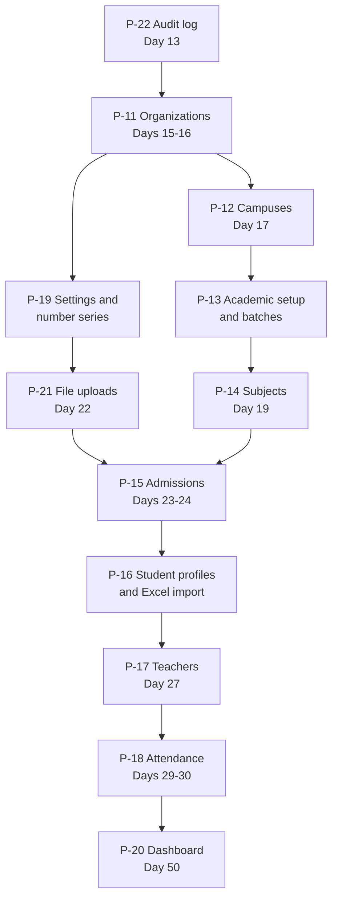

# Prompts: Core Modules (Phase 1)

**In simple words:** This chapter holds twelve ready-to-paste Claude Code prompts, P-11 to P-22. They build the heart of the EduFlow MVP: the institute itself, its campuses, its academic year, its batches and subjects, its students, its teachers and its attendance, plus the three services every module leans on (settings and number series, file uploads, the audit log). Copy a prompt, paste it into Claude Code, review with the checklist below it, commit. Money and messaging prompts live in *Prompts: Finance and Communication*; the foundation prompts P-01 to P-10 live in *Prompts: Project Foundation*.

## What these twelve prompts build

After P-10 you have an empty but working product: a login page, roles, a sidebar and a UI kit. Nothing in it yet belongs to a school. These twelve prompts fill it. When they are done, Rajesh Sharma can sign up Sharma Classes, set up a session, create batches and subjects, admit Aarav Sharma, add teacher Priya Nair, and have her mark attendance on her phone. That is the demo you sell with from Day 31 onwards.

The order is not a preference, it is a dependency chain. A batch needs a campus, a course and an academic year. A student needs a batch and an admission number, and the admission number needs the number-sequence service from P-19. An admission form that accepts a birth certificate needs file uploads from P-21. Attendance needs students in batches. The dashboard needs everything, which is why P-20 runs last, in Week 8.

| ID | Prompt | Reads these docs | Builds | Typical time |
|---|---|---|---|---|
| P-11 | Organizations module with onboarding wizard and plan limits | canon, prd/11, prd/03, api/01, schema/01, schema/02 | Signup, OTP verify, six-step wizard, profile, branding, usage, plan-limit guard | Days 15-16, about 9 h |
| P-12 | Multi Campus module | canon, prd/12, api/01, schema/01, schema/02 | Campus CRUD, main campus, user assignment, campus switcher | Day 17, about 3.5 h |
| P-13 | Academic setup and Batch module | canon, prd/19, api/02, schema/03 | Academic years, terms, courses, batches, enrollments, rooms, holidays | Days 18-19, about 8 h |
| P-14 | Subjects module | canon, prd/21, api/02, schema/03 | Subjects, course curriculum, elective groups, sort order | Day 19, about 3 h |
| P-15 | Student Admission module | canon, prd/13, prd/61, api/01, schema/04 | Inquiries, follow-ups, applications, documents, the admit transaction | Days 23-24, about 8 h |
| P-16 | Student Profile module with Excel import | canon, prd/14, prd/58, api/01, api/04, schema/04, schema/01 | Student list, profile, guardians, documents, status, import pipeline | Days 25-26, about 8 h |
| P-17 | Teachers module | canon, prd/15, api/01, api/02, schema/04 | Teacher CRUD, qualified subjects, batch-subject allocation | Day 27, about 4 h |
| P-18 | Attendance module | canon, prd/17, api/02, schema/05 | Sessions, bulk marking, corrections, lock, registers, defaulters | Days 29-30, about 8 h |
| P-19 | Settings module | canon, prd/43, api/04, schema/01 | Setting groups, number sequences, custom fields, branding | Day 20, about 5 h |
| P-20 | Dashboard module | canon, prd/10, api/01, schema/13 | Nightly snapshot job, role dashboards, widgets, preferences | Day 50, about 4 h |
| P-21 | File uploads to S3 with pre-signed URLs | canon, prd/57, prd/60, api/04, schema/01 | Presign, confirm, download, delete, export downloads, FileUpload | Day 22, about 4 h |
| P-22 | Audit log and activity trail | canon, prd/62, api/04, schema/02 | audit.record(), append-only guard, masking, Activity Log page | Day 13, about 3 h |

Read the "Reads these docs" column as short names. `prd/11` is `docs/prd/11-organizations-module.md`, `api/01` is `docs/api/01-platform-people.md`, `schema/03` is `docs/schema/03-academics.prisma`. The full file names are in *How to Use This Blueprint* and in the shared index that P-02 copied into your repo.

**Figure: the build order of P-11 to P-22**



An arrow means "the lower box cannot be tested without the upper box". P-22 sits on top because every module writes audit rows from its first day, and adding the trail later means touching every service again. P-19 and P-21 are services: nobody sees them on a screen, but admissions, students, teachers and fees all break without them.

## How to run a prompt from this chapter

Each prompt uses the six-part shape explained in *Working with Claude Code*: context to read, task, constraints, files, acceptance checks, report back. Do not delete a part when you shorten a prompt. Shorten the task line instead.

| Step | What you do | Why it matters |
|---|---|---|
| 1 | Start a clean session with `/clear`, then open the branch for the day | A leftover context makes Claude Code edit yesterday's files |
| 2 | Paste the prompt, add the day's scope block if the daily plan gives one | A smaller scope gives a diff you can really read |
| 3 | Let it answer step one only: the list of endpoint IDs it will build | A wrong ID list costs 30 seconds now and 3 hours later |
| 4 | Say "go" per step, review the diff after each step | Small steps keep files under 300 lines |
| 5 | Run the acceptance checks yourself, not only the tests | A green test suite can still ship a 500 on the real screen |
| 6 | Work through the review checklist under the prompt, then commit | The checklist is the only defence against silent tenant leaks |

Three placeholders appear inside the prompts. Replace them before you paste. `<ORG_ID>` is the UUID of your demo organization from the seed (P-04). `<TODAY>` is the current date in `YYYY-MM-DD` form. `<BRANCH>` is the day's branch name from the daily plan chapter, for example `feat/attendance-api`.

> **Rule:** Never let a prompt from this chapter change a Prisma model. The schema is approved and already migrated by P-04. If Claude Code says a field is missing, stop, check `docs/schema/`, and decide yourself. A silent `prisma migrate dev` in the middle of a module is how two schema copies drift apart.

## P-11 — Organizations module with onboarding wizard and plan limits

**When to use.** Days 15 and 16 (Mon 19 and Tue 20 Oct 2026), the first two days of Week 3. Day 15 is the server side, Day 16 is the wizard and the screens. This is the first module that a paying customer touches, because signup is the front door.

**Before you start.** P-01 to P-10 are merged and `main` is green. The seed from P-04 has the four plans (Starter, Growth, Pro, Enterprise) with their `PlanPrice` and `PlanFeature` rows, the seven system roles and the permission catalogue. Email or SMS sending does not exist yet, so the signup OTP is printed to the server log; that is expected until P-31. No AWS or payment account is needed today.

**The prompt**

```text
CONTEXT TO READ
- docs/canon.md: "Pricing", "Multi-tenancy rules", "API conventions"
- docs/prd/11-organizations-module.md: all sections
- docs/prd/03-release-plan-and-plan-gating.md: limits and gating
- docs/api/01-platform-people.md: block "ORG - Organizations"
- docs/schema/01-platform.prisma: Plan, PlanPrice, PlanFeature,
  Organization, Subscription, Campus, OrganizationSetting
- docs/schema/02-auth.prisma: User, UserRole, UserCampus, OtpCode
- docs/permissions.md: organizations.*, billing.view
- Pattern to copy: server/src/modules/users/ from P-08

TASK
Build the tenant side of the Organizations module: public plan
catalogue, self-signup with OTP verification, the onboarding
wizard, organization profile, branding and usage against limits.
Implement exactly ORG-API-01 to ORG-API-10, ORG-API-12,
ORG-API-13, ORG-API-14 and ORG-API-15 (read only).
Signup runs in ONE transaction: Organization, owner User with
role ORG_ADMIN, main Campus, a TRIALING Subscription on Growth,
default OrganizationSetting rows and the consent records.
Also export a reusable guard assertPlanLimit(kind) for
'students', 'campuses' and 'users' that other modules will call.

CONSTRAINTS
- Follow CLAUDE.md. No Prisma schema change. No new npm package.
- Only ORG-API-01 to ORG-API-04 are public. Every other route has
  authenticate plus requirePermission with the key from the
  registry.
- Slug rules: 3 to 30 characters, lower case letters, digits and
  hyphens; reject www, api, app, admin, portal, static, mail.
- Read prices, limits and features from the Plan, PlanPrice and
  PlanFeature rows. Never hard-code a price in TypeScript.
- Do NOT build ORG-API-11 (custom domain), ORG-API-16 to
  ORG-API-30 (checkout, add-ons, billing webhooks) or ORG-API-31
  to ORG-API-56 (platform console). Razorpay arrives with P-26.
- Wizard steps save one by one and may be skipped. A page reload
  must never lose a finished step.

FILES TO CREATE OR CHANGE
- shared/src/schemas/organizations.ts (new) - signup, step,
  profile and branding Zod schemas
- server/src/modules/organizations/ (new) - routes, controller,
  service, repository, schemas, events, test
- server/src/modules/organizations/plan-limits.ts (new)
- server/src/routes.ts (change) - mount the router
- client/src/app/(auth)/signup/page.tsx (new)
- client/src/app/(dashboard)/settings/organization/page.tsx (new)
- client/src/features/organizations/ (new) - signup form, wizard,
  profile, branding and usage screens
Do not touch any other file without asking.

ACCEPTANCE CHECKS
- [ ] POST /api/v1/signup with slug "sharma-classes" creates one
      organization, one ORG_ADMIN, one main campus and one
      TRIALING subscription; a failure rolls back all of them.
- [ ] The same slug again returns 409 CONFLICT.
- [ ] GET /organizations/current/usage shows 0 of 300 students on
      Growth and 1 of 1 campus.
- [ ] On a Starter organization with 50 active students,
      assertPlanLimit('students') throws PLAN_LIMIT_REACHED (403)
      with a message that names the Growth plan.
- [ ] A Bright Future user gets 404 on every Sharma Classes id.
- [ ] Lint, typecheck and the organizations tests pass.

WHAT TO REPORT BACK
1. The ORG-API IDs you built, with method and path.
2. Files created or changed, one line each.
3. Commands you ran and the test summary lines.
4. Anything the spec did not answer, and what you assumed.
5. My manual browser test, step by step.
```

**Follow-up prompts**

The wizard is the screen that decides whether a trial becomes a customer. Ask for the skip behaviour explicitly, because Claude Code likes to make every step required.

```text
Make the onboarding wizard forgiving. Every step except "profile"
can be skipped and finished later. The wizard remembers the last
finished step in OrganizationSetting and reopens there. Show a
setup checklist on the dashboard with the skipped steps and a
"finish this" link. Add a test that skips steps 3 to 6, reloads,
and still reaches ORG-API-07 complete.
```

Plan gating is the second most common bug in a SaaS. Ask for the whole matrix at once.

```text
Write one table-driven test for assertPlanLimit. Rows: Starter 50
students, Growth 300, Pro 1000, Enterprise unlimited, and the
campus limits 1, 1, 3, unlimited. For each row assert the last
allowed create succeeds and the next one fails with
PLAN_LIMIT_REACHED and a message naming the next plan up.
Counting must ignore students whose status is not ACTIVE.
```

If the trial banner is missing, ask for it before you leave the module.

```text
Add a trial banner to the dashboard layout. It reads
subscription.status and trialEndsAt from ORG-API-15 and shows
"Trial ends in N days" with an Upgrade button. The button opens a
disabled dialog that says online payment arrives with P-26. Hide
the banner for ACTIVE subscriptions.
```

**Review checklist**

1. Sign up a new institute end to end in a private browser window. Count the clicks from the landing form to a usable dashboard. Over twelve clicks means the wizard is too heavy.
2. Open Prisma Studio and check the new rows: `organizations`, `users`, `user_roles`, `campuses`, `subscriptions`, `organization_settings`. Every row must carry the same `organization_id`.
3. Kill the API process in the middle of a signup (set a breakpoint or throw after the campus insert). Restart and check that no half organization survives.
4. Log in as Rajesh Sharma at Sharma Classes and ask the API for the Bright Future organization id. Anything other than 404 is a bug worth fixing today.
5. Change `Organization.type` from `COACHING` to `SCHOOL` and reload. The labels must move from Centre and Batch to Campus and Section, as the canon domain table says.
6. Check the usage screen against reality. Add a student by hand in Prisma Studio, reload, and see the counter move.
7. Search the server code for a hard-coded `2499`, `5999` or `24990`. There must be none.
8. Read the signup service top to bottom. It should fit on two screens and contain exactly one `prisma.$transaction`.

**Common mistakes Claude makes here and how to correct them**

| Mistake | Fix prompt |
|---|---|
| Signup written as five separate awaits, no transaction | `Wrap the whole signup in one prisma.$transaction and add a rollback test.` |
| Prices copied into a TypeScript constant | `Delete the price constants. Read PlanPrice rows by currency and billing cycle.` |
| Plan limit checked on the client only | `Move every limit check into assertPlanLimit on the server and test a direct API call.` |
| Slug accepted from the body on later requests | `The slug is read only after signup. Take the tenant from the JWT orgId everywhere else.` |
| Wizard state kept in React state only | `Persist each finished step through ORG-API-06 and reload the state on mount.` |
| Trial subscription created with status ACTIVE | `Set status TRIALING and trialEndsAt, and add a test that reads ORG-API-15.` |

## P-12 — Multi Campus module

**When to use.** Day 17 (Wed 21 Oct 2026). One focused day. Bright Future Public School has two campuses, so this module is what makes the school segment possible at all.

**Before you start.** P-11 is merged, so an organization and its main campus already exist. The `UserCampus` table and the `X-Campus-Id` header handling came with P-06 and P-08; this prompt uses them and does not rebuild them. Know the campus codes you will demo with: `LKO1` and `LKO2` for Bright Future.

**The prompt**

```text
CONTEXT TO READ
- docs/canon.md: "Multi-tenancy rules" points 4 and 5
- docs/prd/12-multi-campus-module.md: all sections
- docs/api/01-platform-people.md: block "CAMP - Multi Campus"
- docs/schema/01-platform.prisma: Campus, Organization, Plan,
  AddOnPurchase
- docs/schema/02-auth.prisma: UserCampus
- docs/permissions.md: campuses.*
- Pattern to copy: server/src/modules/organizations/ from P-11

TASK
Build the Multi Campus module. Implement CAMP-API-01 to
CAMP-API-11, CAMP-API-13 and CAMP-API-14. A campus holds contact,
address, geo-fence, tax details, board codes and weekly offs.
Creating a campus checks Plan.maxCampuses plus any active
EXTRA_CAMPUS add-on through assertPlanLimit('campuses') from
P-11. Exactly one campus per organization has isMain = true.
On the client build the campus list, the campus form, the user
assignment dialog and the campus switcher in the app header. The
switcher sends X-Campus-Id on every later request.

CONSTRAINTS
- Follow every rule in CLAUDE.md. No Prisma schema change.
- CAMP-API-01 returns all campuses for ORG_ADMIN and only
  assigned campuses for every other role. Prove it with a test.
- Deleting a campus is a soft delete and is refused with
  BUSINESS_RULE_VIOLATION when active students, staff or batches
  exist, and always for the main campus.
- set-main moves the flag inside one transaction so that two main
  campuses can never exist.
- Do NOT build CAMP-API-12 (copy-setup): courses and fee
  structures do not exist yet. Do NOT build CAMP-API-15 and
  CAMP-API-16: they read DailyMetricSnapshot, which arrives with
  P-20. Leave a one-line TODO comment with the prompt ID.
- The campus switcher must not be a client-only filter. The
  server decides what the user may see.

FILES TO CREATE OR CHANGE
- shared/src/schemas/campuses.ts (new)
- server/src/modules/campuses/ (new) - routes, controller,
  service, repository, schemas, events, test
- server/src/modules/campuses/campuses.isolation.test.ts (new)
- server/src/routes.ts (change) - mount the router
- client/src/app/(dashboard)/campuses/page.tsx (new)
- client/src/features/campuses/ (new) - list, form, users dialog
- client/src/components/layout/campus-switcher.tsx (new)
- client/src/lib/api-client.ts (change) - send X-Campus-Id
Do not touch any other file without asking.

ACCEPTANCE CHECKS
- [ ] Bright Future creates LKO1 and LKO2. On the Growth plan the
      second campus is refused with PLAN_LIMIT_REACHED.
- [ ] Dr. Anita Verma, assigned to LKO1 only, sees one campus in
      CAMP-API-01 and in the switcher.
- [ ] set-main on LKO2 leaves exactly one row with isMain = true.
- [ ] Deleting the main campus returns 422
      BUSINESS_RULE_VIOLATION with a readable message.
- [ ] A request with X-Campus-Id of a campus the user is not
      assigned to returns 403 FORBIDDEN.
- [ ] A Sharma Classes campus id returns 404 for Bright Future.
- [ ] Lint, typecheck and the campuses tests pass.

WHAT TO REPORT BACK
1. The CAMP-API IDs you built, with method and path.
2. Files created or changed, one line each.
3. How the campus switcher reaches the server, in plain words.
4. Commands you ran and the test summary lines.
5. My manual browser test, step by step.
```

**Follow-up prompts**

The switcher is the piece that leaks data if it is wrong. Ask for a second pair of eyes on it straight away.

```text
Review every read endpoint built so far for campus scope. For each
one answer: does it read X-Campus-Id, does it fall back to all
assigned campuses, and does it ignore a campus the user is not
assigned to? Write the answers as a table first. Then fix the
endpoints that fail and add one test per fix.
```

Coaching institutes rename everything, so the labels must follow `Organization.type`.

```text
Add a label helper in client/src/lib/labels.ts that maps campus,
batch, course and academic year to the school or coaching word
based on Organization.type from AUTH-API-14. Use it in the campus
screens. No component may contain the literal word "Campus".
```

**Review checklist**

1. Create LKO2 as Rajesh, assign only Dr. Anita Verma to LKO1, then log in as her. The switcher shows one campus and no dropdown arrow.
2. With her session open, send a request by hand with `X-Campus-Id` set to LKO2. You must get 403, not an empty list.
3. Deactivate LKO2 and check that it disappears from pickers but its data is still readable.
4. Confirm the campus code appears where the PRD says it should: it feeds admission and receipt numbers later, so `LKO1` must be short, upper case and unique per organization.
5. Look at `campuses.repository.ts`. Every query must go through the tenant-aware client; no `new PrismaClient()` anywhere.
6. Check the weekly-off field. Attendance on Day 29 reads it, so a wrong shape here costs a day later.
7. Run the isolation test alone and read its assertions. It must assert zero rows, not "not equal".

**Common mistakes Claude makes here and how to correct them**

| Mistake | Fix prompt |
|---|---|
| Campus list filtered in React, not on the server | `Filter by the user's assigned campuses inside the repository and test with a Principal token.` |
| Two campuses end up with isMain true | `Do the set-main flip in one transaction: unset all, then set one. Add a test.` |
| Hard delete of a campus | `Soft delete with deletedAt only, and refuse when students, staff or batches exist.` |
| `X-Campus-Id` trusted without a check | `Validate the header against UserCampus on every request and return 403 on a mismatch.` |
| Plan limit forgotten for campuses | `Call assertPlanLimit('campuses') in the create service and count EXTRA_CAMPUS add-ons.` |

## P-13 — Academic setup and Batch module (academic years, courses, batches, enrollments)

**When to use.** Days 18 and 19 (Thu 22 and Fri 23 Oct 2026). Day 18 is the whole server side, Day 19 morning is the screens. This is the largest prompt of Week 3 because four resources live in one folder.

**Before you start.** P-11 and P-12 are merged. Decide two demo sessions before you paste: Bright Future runs "Academic year 2027-28" from 1 April 2027, Sharma Classes runs "Session 2027-28" from 1 June 2027. Both appear in the seed. The `batches` folder holds four resources, so agree with yourself that files will be split by resource, not stuffed into one service.

**The prompt**

```text
CONTEXT TO READ
- docs/canon.md: "Domain language", "Database conventions"
- docs/prd/19-batch-module.md: all sections
- docs/api/02-academics.md: block "BAT - Batch"
- docs/schema/03-academics.prisma: AcademicYear, Term, Course,
  Batch, Room, Holiday
- docs/schema/04-people.prisma: Enrollment
- docs/permissions.md: batches.*
- Pattern to copy: server/src/modules/campuses/ from P-12

TASK
Build the academic backbone in the folder batches/. Implement
BAT-API-01 to BAT-API-33 and BAT-API-36 to BAT-API-44:
academic years and terms, courses, batches, enrollments, rooms
and holidays. Split the server files by resource:
academic-years, terms, courses, batches, enrollments, rooms and
holidays, each with service and repository, but ONE
batches.routes.ts that lists every URL of the module.
Key rules: exactly one current academic year per organization;
a CLOSED year rejects every write with BUSINESS_RULE_VIOLATION;
enrollment checks Batch.capacity and refuses when full; roll
numbers are generated by name order or admission order.

CONSTRAINTS
- Follow CLAUDE.md. No Prisma schema change. No new npm package.
- Every route has authenticate and requirePermission with the key
  from the registry. TEACHER gets Own scope on BAT-API-24.
- Batch codes are unique per organization and academic year. Use
  the unique keys that already exist in the schema; do not add a
  runtime check instead of a database constraint.
- Holidays support a date range in one row and a bulk create for
  weekly offs. Attendance in P-18 will read this table.
- Do NOT build BAT-API-34 and BAT-API-35 (year-end promotion,
  needs report cards), BAT-API-45 to BAT-API-53 (calendar events
  and PTM, Week 7) or BAT-API-54 to BAT-API-60 (portal, P-30).
- Keep each service file under 300 lines. Tell me if one grows
  past that instead of writing a 600-line file.

FILES TO CREATE OR CHANGE
- shared/src/schemas/batches.ts (new) - schemas for all four
  resources, exported from shared/src/index.ts
- server/src/modules/batches/ (new) - batches.routes.ts,
  batches.controller.ts and per-resource service and repository
  files, batches.events.ts, batches.test.ts
- server/src/modules/batches/batches.isolation.test.ts (new)
- server/src/routes.ts (change) - mount the router
- client/src/app/(dashboard)/batches/page.tsx (new)
- client/src/app/(dashboard)/batches/[batchId]/page.tsx (new)
- client/src/features/batches/ (new) - year switcher, course
  list, batch list, batch detail with roster, holiday calendar
Do not touch any other file without asking.

ACCEPTANCE CHECKS
- [ ] Creating a second current academic year unsets the first
      one in the same transaction.
- [ ] A batch with capacity 40 and 40 active enrollments refuses
      the 41st with 422 BUSINESS_RULE_VIOLATION.
- [ ] assign-roll-numbers on 10-A gives 1 to N in name order with
      no gaps and no duplicates.
- [ ] Any write on a CLOSED academic year returns 422.
- [ ] BAT-API-24 as Priya Nair returns only her batches.
- [ ] A Sharma Classes batch id returns 404 for Bright Future.
- [ ] Lint, typecheck and the batches tests pass.

WHAT TO REPORT BACK
1. The BAT-API IDs you built, grouped by resource.
2. Files created or changed with their line counts.
3. Commands you ran and the test summary lines.
4. Every place where the PRD and the registry disagreed.
5. My manual browser test, step by step.
```

**Follow-up prompts**

Capacity is the rule that bites during a live demo, so make the race condition explicit.

```text
Two parents enroll into the last seat of batch 10-A at the same
moment. Make the capacity check safe: count and insert inside one
transaction with a row lock on the batch, or a database
constraint. Write a test that fires 5 parallel enrollments into a
batch with capacity 2 and asserts exactly 2 succeed and 3 fail
with BUSINESS_RULE_VIOLATION.
```

Coaching institutes do not think in years and sections, so check the wording.

```text
Read Organization.type and switch the labels of this module:
SCHOOL shows "Academic year", "Class", "Section"; COACHING shows
"Session", "Program", "Batch". Only the labels change, never the
model names, the URLs or the API fields. Add a test for the label
helper, not for the screens.
```

Year end will arrive in Phase 2, so leave a clean seam now.

```text
Add a small service function endAcademicYear(yearId) that today
only sets status CLOSED and writes an audit row. Document in one
comment that promotion (BAT-API-34, BAT-API-35) will extend it in
Phase 2. Do not build promotion now.
```

**Review checklist**

1. Create the session, two courses and four batches for Sharma Classes in under five minutes of clicking. If it takes longer, the forms have too many required fields for a coaching institute.
2. Fill a batch to capacity and try one more enrollment from a second browser tab. You must see a clear "batch is full" message, not a 500.
3. Close the academic year, then try to create a batch inside it. Read the error message as Rajesh would: does it say what to do next?
4. Add a holiday range of three days. Note the row shape. On Day 29 you will assert that attendance refuses those dates.
5. Check the roll-number output for a batch that has two students with the same first name. No duplicates, no gaps.
6. In Prisma Studio, confirm `enrollments` rows carry `organization_id`, `campus_id`, `academic_year_id` and `batch_id`.
7. Count the lines of every file in `server/src/modules/batches/`. Anything past 300 lines gets split before the merge.
8. Open the batch detail page at 360 px width. The roster must scroll inside its own box.

**Common mistakes Claude makes here and how to correct them**

| Mistake | Fix prompt |
|---|---|
| One 800-line `batches.service.ts` | `Split by resource into academic-years, courses, batches, enrollments services. Keep one routes file.` |
| Capacity checked with count then insert, no lock | `Make capacity safe against parallel enrollments and add a 5-request race test.` |
| Two current academic years | `Unset the previous current year inside the same transaction as set-current.` |
| Holiday stored as one row per date | `Store a date range in one Holiday row and expand it when reading.` |
| Year-end promotion built although it was excluded | `Remove the promotion code. BAT-API-34 and BAT-API-35 are Phase 2.` |
| Teacher sees all batches in the lookup | `Apply the Own scope on BAT-API-24 through BatchSubjectTeacher and classTeacherId.` |

## P-14 — Subjects module

**When to use.** Day 19 afternoon (Fri 23 Oct 2026), straight after the batch screens. Run `/clear` between P-13 and P-14 so that the session starts clean.

**Before you start.** P-13 is merged, so courses exist. Teacher records do not exist yet, which is deliberate: the teacher-to-batch-subject allocation (SUB-API-16 to SUB-API-20) is built on Day 27 with P-17. Have a subject list ready for the demo: Physics, Chemistry, Mathematics, Biology, English, Hindi.

**The prompt**

```text
CONTEXT TO READ
- docs/canon.md: "Database conventions"
- docs/prd/21-subjects-module.md: all sections
- docs/api/02-academics.md: block "SUB - Subjects"
- docs/schema/03-academics.prisma: Subject, CourseSubject
- docs/permissions.md: subjects.*
- Pattern to copy: server/src/modules/batches/ from P-13

TASK
Build the Subjects module. Implement SUB-API-01 to SUB-API-15:
subject CRUD with code, subjectType and colour, the bulk create
for onboarding, the lookup, the export, the summary, and the
course curriculum (CourseSubject) with elective group, default
marks, weeklyPeriods, includeInTotal and sortOrder, including
reorder and copy-from-another-course.
On the client build the subject list with a colour chip, the
subject form, and a curriculum screen per course with drag-free
reordering (up and down buttons are enough) and an elective
group editor.

CONSTRAINTS
- Follow every rule in CLAUDE.md. No Prisma schema change. No new
  npm package for drag and drop.
- Do NOT build SUB-API-16 to SUB-API-20 (BatchSubjectTeacher).
  Teachers arrive with P-17 on Day 27. Do NOT build SUB-API-21
  and SUB-API-22 (portal).
- Subject code is unique per organization. Archiving a subject is
  a soft delete and is refused when a timetable entry or an exam
  paper uses it.
- The bulk create is idempotent on (organizationId, code): a
  second run adds only the missing subjects.
- Elective rules live on CourseSubject. Two subjects in the same
  elective group mean the student picks one of them; this is read
  later by enrollment electives and report cards.
- Keep the curriculum screen usable with 20 subjects on a phone.

FILES TO CREATE OR CHANGE
- shared/src/schemas/subjects.ts (new)
- server/src/modules/subjects/ (new) - routes, controller,
  service, repository, schemas, events, test
- server/src/modules/subjects/subjects.isolation.test.ts (new)
- server/src/routes.ts (change) - mount the router
- client/src/app/(dashboard)/subjects/page.tsx (new)
- client/src/app/(dashboard)/courses/[courseId]/curriculum/
  page.tsx (new)
- client/src/features/subjects/ (new) - list, form, curriculum
  screen, elective group editor
Do not touch any other file without asking.

ACCEPTANCE CHECKS
- [ ] The bulk create adds Physics, Chemistry, Mathematics,
      Biology, English and Hindi in one call; a second identical
      call adds nothing and returns the same six ids.
- [ ] The same subject code twice returns 409 CONFLICT.
- [ ] Reorder saves sortOrder 1 to N with no gaps, and the
      curriculum list reloads in that order.
- [ ] copy-from-another-course copies rows without touching the
      source course.
- [ ] SUB-API-07 filtered by courseId returns only that course's
      subjects.
- [ ] A Sharma Classes subject id returns 404 for Bright Future.
- [ ] Lint, typecheck and the subjects tests pass.

WHAT TO REPORT BACK
1. The SUB-API IDs you built, with method and path.
2. Files created or changed, one line each.
3. How elective groups are stored and read, in plain words.
4. Commands you ran and the test summary lines.
5. My manual browser test, step by step.
```

**Follow-up prompts**

An onboarding preset saves a new institute ten minutes, which is the difference between a finished trial and an abandoned one.

```text
Add two preset subject lists behind SUB-API-06: "CBSE Class 9-10"
and "JEE / NEET coaching". Keep the presets in a TypeScript
constant in the service, not in the database. The wizard step
"courses and subjects" offers them as two buttons. A preset run
must stay idempotent on the subject code.
```

Colour chips look like decoration but they are how a teacher reads a timetable at a glance.

```text
Validate Subject.color as a hex string like #1D4ED8 and offer a
palette of 12 fixed colours in the form. Two subjects in the same
course must not get the same colour: warn, do not block. Show the
chip in the subject list, the curriculum list and the lookup.
```

**Review checklist**

1. Run the bulk create twice. The second run must add nothing and must not throw.
2. Build the Class 10 curriculum with Science and Social Science as an elective pair. Open a student form later and confirm the pair shows as one choice.
3. Archive a subject that is used nowhere: it disappears from pickers. Archive one used by a course: you get 422 with a message naming the course.
4. Reorder the curriculum, reload the page, and check that the order survived. Report-card column order depends on it.
5. Check `weeklyPeriods`. The timetable module in Phase 2 compares it with the built grid, so a null here means a silent gap later.
6. Confirm the curriculum screen is readable at 360 px. If the table scrolls the whole page sideways, fix it now.
7. Grep the client for the string "Subject" used as a hard-coded label where the coaching word differs.

**Common mistakes Claude makes here and how to correct them**

| Mistake | Fix prompt |
|---|---|
| Teacher allocation built although it was excluded | `Remove BatchSubjectTeacher code. It belongs to P-17 on Day 27.` |
| Bulk create throws on the second run | `Make the bulk create idempotent on (organizationId, code) with skipDuplicates.` |
| sortOrder saved with gaps after a delete | `Renumber sortOrder 1..N inside the reorder transaction.` |
| Elective group stored on Subject | `Move the elective group to CourseSubject. A subject is elective only inside a course.` |
| A drag-and-drop library added | `Remove the new dependency. Up and down buttons are enough for the MVP.` |

## P-15 — Student Admission module (inquiry, application, admission)

**When to use.** Days 23 and 24 (Tue 27 and Wed 28 Oct 2026). Day 23 builds leads, follow-ups and applications. Day 24 builds the admit transaction and the direct admission form. Put the two scope blocks from *Daily Plan: Days 15 to 28* on top of this prompt, one per day.

**Before you start.** P-13, P-14, P-19 and P-21 are merged. You need batches with a capacity, the `nextNumber()` function, and the `FileUpload` component. P-19 created default `INQUIRY_NO`, `APPLICATION_NO` and `ADMISSION_NO` series. Set the demo prefixes (`BF`, `SC`) in Settings before the first lead, because a number once issued never changes. No message goes out yet. Follow-up reminders arrive with P-28.

**The prompt**

```text
CONTEXT TO READ
- docs/canon.md: "Domain language", "Multi-tenancy rules"
- docs/prd/13-student-admission-module.md: all sections
- docs/prd/61-privacy-and-compliance.md: parental consent
- docs/api/01-platform-people.md: block "ADM - Student Admission"
- docs/schema/04-people.prisma: AdmissionInquiry, InquiryFollowUp,
  AdmissionApplication, AdmissionApplicationDocument, Student,
  Guardian, StudentGuardian, Enrollment, StudentDocument
- docs/schema/02-auth.prisma: ConsentRecord
- docs/permissions.md: admissions.*
- Reuse: nextNumber() (P-19), files service (P-21), enrollment
  service (P-13), assertPlanLimit (P-11)

TASK
Build the Student Admission module in modules/admissions/.
Implement ADM-API-01 to ADM-API-31 and ADM-API-34 to ADM-API-37:
leads, stages, follow-ups, applications with review steps,
documents, exports, funnel summary and seat availability.
ADM-API-27 (enroll) is the admit step. In ONE transaction:
assertPlanLimit('students'); create the Student; reuse the Guardian
with the same phone in this organization or create one;
StudentGuardian with isPrimary; Enrollment through the P-13
service (capacity check); ADMISSION_NO from nextNumber(tx); copy
application documents to StudentDocument; a CHILD_DATA_PROCESSING
ConsentRecord for a student under 18 if ADM-API-18 did not record
one; application ENROLLED; lead CONVERTED; one audit row.
Client: lead list with quick add (name, phone, course), lead
detail with follow-ups, application form, and a five-step direct
admission form: Student, Guardian, Batch, Documents, Review.

CONSTRAINTS
- Follow every rule in CLAUDE.md. No Prisma schema change.
- Stage and status moves follow the PRD lifecycle table. Any other
  move returns 422 BUSINESS_RULE_VIOLATION. LOST needs lostReason.
- A duplicate phone on a new lead is a warning in the response,
  never a block. Siblings share a phone.
- A failed admit leaves no Student, Guardian or Enrollment row and
  does not use up an admission number.
- Do NOT build ADM-API-32 (PDF, needs the PDF worker from P-25),
  ADM-API-33 (lead import, after P-16) or ADM-API-38 to ADM-API-43
  (public online form and application fee).
- Send no message. Only publish the events named in the registry.

FILES TO CREATE OR CHANGE
- shared/src/schemas/admissions.ts (new)
- server/src/modules/admissions/ (new) - routes, controller,
  inquiries, applications and admit services, repository, events,
  admissions.test.ts, admissions.isolation.test.ts
- server/src/routes.ts (change) - mount the router
- client/src/app/(dashboard)/admissions/ (new) - thin pages
- client/src/features/admissions/ (new)
Do not touch any other file without asking.

ACCEPTANCE CHECKS
- [ ] Quick add Aarav Sharma with +919876500011 returns an
      inquiryNo; a second lead on that phone saves with a warning.
- [ ] NEW straight to CONVERTED returns 422.
- [ ] Admitting into a full batch returns 422 and writes nothing.
- [ ] Student 51 on Starter returns 403 PLAN_LIMIT_REACHED.
- [ ] A sibling with Sunita Devi's phone reuses her Guardian row.
- [ ] A forced error after the Student insert leaves nextValue of
      ADMISSION_NO unchanged.
- [ ] A TEACHER token gets 403 on every ADM route.
- [ ] Lint, typecheck and the admissions tests pass.

WHAT TO REPORT BACK
1. The ADM-API IDs you built, with method and path.
2. The admit transaction as a numbered list of writes.
3. Files changed (one line each), commands run, test summary.
4. My manual browser test, step by step.
```

**Follow-up prompts**

The front desk lives in the follow-up list. Make it the default view.

```text
Make "Follow-ups due" the default view of the admissions page. Use
ADM-API-10 with two tabs, Due today and Overdue, sorted by
nextFollowUpAt. Add a counsellor filter for users with
admissions.manage and a count badge in the sidebar. Apply the data
scope from docs/permissions.md. Test with two counsellors.
```

The public form comes later, after the pilot starts. Keep this prompt ready.

```text
Build the public admission form: ADM-API-38 to ADM-API-41 and
ADM-API-43. The tenant comes from the {slug}.eduflow.app host,
never from the body. Add captcha and the canon IP rate limit, save
UTM fields, and record consent against the policy text returned by
ADM-API-38. The tracking token opens only its own application.
ADM-API-42 (fee payment) waits for P-26.
```

**Review checklist**

1. Walk Aarav from quick add to enrolled student as Rajesh Sharma, in one sitting. A walk-in admission should take under 4 minutes (assumption). Anything slower loses the front desk.
2. After the admit, open Prisma Studio. `students`, `guardians`, `student_guardians`, `enrollments`, `student_documents` and `consent_records` all carry the same `organization_id`.
3. Read `number_sequences`. `next_value` moved by exactly one per admission and by zero after a failed one.
4. Admit a sibling. The `guardians` count stays the same, and Sunita Devi now links to two children.
5. Try every illegal jump from the lifecycle table with your API client. Each one returns 422 with a readable message.
6. Log in as Priya Nair. The Admissions menu is hidden and every ADM route returns 403.
7. Read the admit service. It has exactly one transaction, and no write happens outside it.

**Common mistakes Claude makes here and how to correct them**

| Mistake | Fix prompt |
|---|---|
| A new Guardian row for every sibling | `Match the guardian by phone inside this organization before creating one. Add the sibling test.` |
| Admission number taken before the transaction | `Call nextNumber(tx) inside the admit transaction, so a rollback also returns the number.` |
| Stage changes accepted in any order | `Encode the lifecycle table as a transition map and reject every other move with 422.` |
| Duplicate phone blocks the save | `Return a warning field in the response and save the lead anyway.` |
| Consent saved as a boolean on Student | `Write a ConsentRecord with consentType CHILD_DATA_PROCESSING. No new field.` |
| Enrollment created with a direct Prisma call | `Call the P-13 enrollment service, so capacity rules live in one place.` |

## P-16 — Student Profile module with Excel import

**When to use.** Days 25 and 26 (Thu 29 and Fri 30 Oct 2026). Day 25 builds the list, profile, guardians, documents and status changes. Day 26 builds the import. Use the scope blocks from *Daily Plan: Days 15 to 28*.

**Before you start.** P-15 is merged, and each demo tenant has about ten admitted students. P-19 custom fields and P-21 files work. The worker process runs next to the API (`npm run dev:worker -w server`). The one new package this week is `exceljs`, and the prompt allows it by name. Keep a masked sample sheet from a real institute ready for Day 26.

**The prompt**

```text
CONTEXT TO READ
- docs/canon.md: "API conventions" (lists, filters, max limit)
- docs/prd/14-student-profile-module.md: all sections
- docs/prd/58-background-jobs-and-events.md: import jobs
- docs/api/01-platform-people.md: block "STU - Student Profile"
- docs/api/04-operations-intelligence.md: CMN-API-08 to CMN-API-17
- docs/schema/04-people.prisma: Student, Guardian, StudentGuardian,
  Family, Enrollment, StudentDocument, StudentNote, StudentStatusHistory
- docs/schema/01-platform.prisma: ImportJob, ImportJobRowError
- docs/permissions.md: students.*, imports.*

TASK
Build modules/students/ and the generic import pipeline.
Implement STU-API-01 to STU-API-31, STU-API-38, STU-API-40 to
STU-API-42, STU-API-44, STU-API-45 and CMN-API-08 to CMN-API-17.
STU-API-02 calls the P-15 admit service. STU-API-22 and
STU-API-40 call the P-13 enrollment and roll-number services.
A status change writes StudentStatusHistory. A leaving status ends
the active enrollments in the same transaction.
Import (type STUDENTS): template, upload, dry run, then a BullMQ
handler in jobs/import.worker.ts. It validates each row with the
admission Zod schema and writes one ImportJobRowError per problem.
The real run (CMN-API-16) goes in chunks of 100 rows, one
transaction per chunk, through the admit service. The error
workbook is written with exceljs.
Client: student list (server search, filters, column chooser),
profile tabs (Overview, Guardians, Documents, Enrollments, Notes,
plus placeholder Attendance and Fees) and the import wizard.

CONSTRAINTS
- Follow CLAUDE.md. No schema change. Only new package: exceljs.
- q matches name, admissionNo and guardian phone through existing
  indexes. Tell me if one is missing; never add one yourself.
- Medical notes (STU-API-09, STU-API-10) use the encryption helper
  in server/src/lib/. If there is none, stop and ask me.
- The import handler opens the tenant context before any query.
- Report ALL errors of a row. A row with an error is never
  imported. Run assertPlanLimit('students') for the whole file
  before the real run. The same job never runs twice.
- Do NOT build transfers (STU-API-32 to STU-API-37), promotion
  (STU-API-39), ID cards (STU-API-43) or STU-API-46 to STU-API-51.

FILES TO CREATE OR CHANGE
- shared/src/schemas/students.ts, imports.ts (new)
- server/src/modules/students/ (new) - routes, controller, one
  service per resource, repository, students.import.ts, tests
- server/src/modules/files/import-jobs.* (new) - generic pipeline
- server/src/jobs/import.worker.ts (change)
- server/src/routes.ts (change)
- client/src/app/(dashboard)/students/ (new)
- client/src/features/students/, client/src/features/imports/
Do not touch any other file without asking.

ACCEPTANCE CHECKS
- [ ] q=aar, q=<admission no> and q=<guardian phone> all find Aarav
      Sharma. limit=500 never returns more than 100 rows.
- [ ] Status TRANSFERRED ends the enrollment; the batch count and
      ORG-API-12 usage both drop by one.
- [ ] The five-row sample from the Day 26 plan gives 4 valid rows
      and 4 errors on row 5 in the dry run, and saves nothing.
- [ ] The real run imports 4 students; a second run imports 0.
- [ ] A 60-row file on Starter is refused before any row is saved.
- [ ] Bright Future gets 404 on a Sharma Classes student and job.
- [ ] Lint, typecheck and the students and imports tests pass.

WHAT TO REPORT BACK
1. The STU-API and CMN-API IDs you built, with method and path.
2. How a job moves from QUEUED to COMPLETED, in five lines.
3. Files changed (one line each), commands run, test summary.
4. The 500-row timing and my manual browser test, step by step.
```

**Follow-up prompts**

Real sheets never match your template. This prompt saves every pilot migration.

```text
Use CMN-API-13 to read the header row of an uploaded sheet and
suggest a columnMapping by fuzzy match: "Student Name" and "Name of
Student" map to firstName plus lastName, "Mobile" and "Father
Mobile" map to guardian phone. Show a mapping screen before the
dry run and save the choice in ImportJob.columnMapping.
```

Measure speed before a pilot sends you 350 rows.

```text
Generate a 500-row STUDENTS file with realistic Indian names and
import it. Report rows per second. Over 60 seconds, find the slow
part (per-row guardian lookups, per-row counters) and batch it per
chunk. Show the timing before and after.
```

**Review checklist**

1. Search "aar" with the Bright Future seed. Results appear in under one second, and the Network tab shows `q`, `page` and `limit` in the request.
2. Count `students` rows in Prisma Studio before and after a dry run. The number must not move.
3. Stop the worker with Ctrl+C in the middle of a real run, then restart it. The job finishes or fails cleanly, and no chunk is half written.
4. Open the error workbook in Excel. Read the "Reason" column as Rajesh would. Every reason says what to fix.
5. Mark a test student TRANSFERRED. The plan usage counter drops, so a Starter institute can admit one more.
6. Log in as Suresh Gupta (Accountant). He can view students but not edit them, as `docs/permissions.md` says.
7. Open the list at 360 px. The table scrolls inside its box or turns into cards.
8. Read `import.worker.ts`. The tenant context opens on the first line of the handler.

**Common mistakes Claude makes here and how to correct them**

| Mistake | Fix prompt |
|---|---|
| Row validation stops at the first error | `Collect every issue of a row, then write one ImportJobRowError per issue.` |
| Import inserts students without the admit service | `Send each valid row through the P-15 admit service, so numbers, guardians and limits match.` |
| Worker queries before the tenant context exists | `Open the tenant context from job.data.organizationId before any query.` |
| Whole file in one giant transaction | `Use chunks of 100 rows, one transaction each, and update processedRows after each chunk.` |
| Search with `contains` on five columns | `Use the existing search indexes. Show me EXPLAIN ANALYZE for the q query.` |

## P-17 — Teachers module

**When to use.** Day 27 (Sat 31 Oct 2026), the last build day of Week 4. After this prompt a teacher can log in and see only her own batches, which attendance needs on Monday.

**Before you start.** P-14 and P-16 are merged. The invitation flow from P-07 and the users API from P-08 work. The `EMPLOYEE_CODE` series exists. Decide the demo allocation first: Priya Nair teaches Physics and Mathematics in 10-A and is its class teacher.

**The prompt**

```text
CONTEXT TO READ
- docs/canon.md: "Roles" (TEACHER scope Own)
- docs/prd/15-teachers-module.md: all sections
- docs/api/01-platform-people.md: block "TCH - Teachers"
- docs/api/02-academics.md: SUB-API-16 to SUB-API-20
- docs/schema/04-people.prisma: Staff, TeacherSubject,
  StaffDocument, StaffStatusHistory
- docs/schema/03-academics.prisma: Batch, BatchSubjectTeacher
- docs/permissions.md: teachers.*, subjects.assign_teachers
- Reuse: invitation service (P-07, P-08), nextNumber (P-19),
  files (P-21), assertPlanLimit('users') (P-11)

TASK
Build modules/teachers/. A teacher is a Staff row with staffType
TEACHING, and teacher ids are Staff ids. Implement TCH-API-01 to
TCH-API-13 and TCH-API-15 to TCH-API-18, plus the batch-subject
allocation SUB-API-16 to SUB-API-20 that P-14 left out.
EMPLOYEE_CODE comes from nextNumber(tx). "Invite as user" calls
the invitation service with role TEACHER and links Staff.userId
when the invitation is accepted.
Then finish the TEACHER Own scope. Her batches are those where
Batch.classTeacherId is her Staff id or a BatchSubjectTeacher row
exists. Put this rule in ONE exported function, getOwnBatchIds(),
in the batches service; it asks the subjects service for the
allocation rows. The students, subjects and batches services call
it. No repository reads another module's table.
Client: teacher list, form, profile tabs Subjects, Batches and
Documents, the allocation grid on the batch page (teacher dropdown
filtered by TeacherSubject), and "My batches" for TEACHER.

CONSTRAINTS
- Follow every rule in CLAUDE.md. No Prisma schema change.
- Every teacher query filters staffType TEACHING. An accountant's
  Staff id on /teachers/:id returns 404.
- SUB-API-17 refuses a teacher without a TeacherSubject row for
  that subject: 422 with a message naming the subject.
- TCH-API-05 is refused while active allocations exist. An exit
  through TCH-API-06 deactivates the User and revokes its sessions.
- Starter allows 1 admin and 3 staff users. The 4th staff
  invitation returns 403 PLAN_LIMIT_REACHED.
- Do NOT build TCH-API-14 (timetable) or TCH-API-19 (workload).
  Both need the timetable from P-35.

FILES TO CREATE OR CHANGE
- shared/src/schemas/teachers.ts (new)
- server/src/modules/teachers/ (new) - routes, controller, service,
  repository, events, teachers.test.ts, teachers.scope.test.ts
- server/src/modules/subjects/ (change) - allocation endpoints
- server/src/modules/batches/, students/ (change) - getOwnBatchIds()
- server/src/routes.ts (change)
- client/src/app/(dashboard)/teachers/ (new)
- client/src/features/teachers/ (new)
Do not touch any other file without asking.

ACCEPTANCE CHECKS
- [ ] Priya Nair gets an employee code and an invitation. After she
      accepts, Staff.userId is set and she logs in as TEACHER.
- [ ] With Priya's token, BAT-API-24, STU-API-01 and SUB-API-07
      return 10-A data only.
- [ ] Priya's token on a 10-B student id returns 404.
- [ ] Priya allocated to Biology without TeacherSubject gets 422.
- [ ] Deleting Priya while she has an allocation returns 422.
- [ ] The 4th staff invitation on Starter returns 403.
- [ ] Lint, typecheck and the teachers tests pass.

WHAT TO REPORT BACK
1. The TCH-API and SUB-API IDs you built, with method and path.
2. Every endpoint that now calls getOwnBatchIds().
3. Files changed (one line each), commands run, test summary.
4. My manual browser test, step by step.
```

**Follow-up prompts**

A missed scope is a leak. Ask for the audit table before you merge.

```text
List every GET endpoint built so far that returns students,
batches, subjects or enrollments. For each one, show in a table
whether a TEACHER token is limited by getOwnBatchIds(). Fix every
"No" and add one test per fix with Priya Nair's token.
```

The class teacher decides who marks daily attendance, so make the choice visible.

```text
Add a class-teacher picker to the batch detail page. It lists
active TEACHING staff of the batch's campus and saves through
BAT-API-19 (classTeacherId). Warn when one teacher is class
teacher of more than three batches. Show the class teacher on the
batch list and on the teacher's "My batches" page.
```

**Review checklist**

1. Invite Priya Nair, accept in a private window, and log in. The sidebar shows only the menus her permissions allow.
2. As Priya, open the student list. Only 10-A students appear. Paste a 10-B student id into the URL: you see the not-found page, not an error dump.
3. Fill the allocation grid of one batch in under two minutes. The dropdown offers only teachers qualified for each subject.
4. Record an exit for a test teacher. Her next token refresh fails and she is logged out.
5. In Prisma Studio, the `staff` row has `staff_type` TEACHING and a unique `employee_code`. Every `batch_subject_teachers` row carries `organization_id`.
6. Check ORG-API-12 usage. The staff seat count moves only when the invitation is accepted.
7. Search the code for `classTeacherId`. It appears in `getOwnBatchIds()` and in the batch form, nowhere else.

**Common mistakes Claude makes here and how to correct them**

| Mistake | Fix prompt |
|---|---|
| Proposes a new Teacher model | `Teachers are Staff rows with staffType TEACHING. Use the existing models only.` |
| Own scope copied into each repository | `Move the rule into getOwnBatchIds() in the batches service and call it everywhere.` |
| Dropdown shows every staff member | `Filter the allocation dropdown by TeacherSubject for that subject and by campus.` |
| Exit leaves the login active | `Deactivate the linked User and revoke its refresh tokens in the exit transaction.` |
| /teachers/:id returns non-teaching staff | `Add staffType TEACHING to every teacher query and test with an accountant's Staff id.` |

## P-18 — Attendance module (web and mobile-friendly marking)

**When to use.** Days 29 and 30 (Mon 2 and Tue 3 Nov 2026), the start of Week 5. Day 29 is "backend only", Day 30 is "frontend only". The two scope endings are in *Daily Plan: Days 29 to 42*.

**Before you start.** P-13, P-16 and P-17 are merged, so holidays, enrollments and `getOwnBatchIds()` exist. Both demo tenants have at least 40 students and three teachers with allocations. Campus weekly offs are set (P-12). Absence alerts are only events today. WhatsApp alerts get wired in Week 7 with P-28 and P-29.

**The prompt**

```text
CONTEXT TO READ
- docs/canon.md: "Roles", "Database conventions" (dates, timezone)
- docs/prd/17-attendance-module.md: all sections
- docs/prd/58-background-jobs-and-events.md: attendance events
- docs/api/02-academics.md: block "ATT - Attendance"
- docs/schema/05-attendance-leave.prisma: AttendanceSession,
  AttendanceRecord, StudentLeaveRequest
- docs/schema/03-academics.prisma: Batch, Holiday
- docs/schema/01-platform.prisma: Campus (weeklyOffDays)
- docs/permissions.md: attendance.*
- Reuse: getOwnBatchIds() (P-17), audit.record() (P-22), exports

TASK
Build student attendance in modules/attendance/. Implement
ATT-API-01 to ATT-API-11 and ATT-API-14 to ATT-API-18.
ATT-API-08 is the mark sheet: active enrollments on that date,
approved leave as LEAVE, the holiday flag, existing marks.
ATT-API-02 creates the session and its records, idempotent on
(batchId, date, slotKey) with slotKey "DAY". ATT-API-04 saves all
statuses in one transaction and recounts the five counters.
ATT-API-07 only publishes student.absent and student.late events
and sets parentsNotifiedAt. It sends nothing.
Reports: daily summary, monthly register, student summary and
defaulters (default: below 75 percent or 3 absences in a row).
Percent = present days / working days x 100, one decimal. Count
LATE and HALF_DAY exactly as the PRD business rules say.
Client: Mark Attendance, mobile-first (all start PRESENT, one tap
cycles the status, sticky Save bar, rows at least 44 px high,
live counter "37 present, 3 absent"), the monthly register grid,
the defaulters report and the Attendance tab on the profile.

CONSTRAINTS
- Follow every rule in CLAUDE.md. No Prisma schema change.
- 422 BUSINESS_RULE_VIOLATION for: a future date, a Holiday, a
  weekly off, a CLOSED year, a student not enrolled that day.
- "Today" is the date in Organization.timezone, not server time.
- TEACHER marks only getOwnBatchIds() batches (403 otherwise) and
  edits a session only on the same day. Later edits need
  attendance.update and write an audit row with before and after.
- A locked session rejects ATT-API-04 and ATT-API-11 until unlock.
- Do NOT build ATT-API-12 (device punches), ATT-API-13 (import),
  ATT-API-19 to ATT-API-26 (staff attendance, Phase 2) or
  ATT-API-27 (portal, P-30).

FILES TO CREATE OR CHANGE
- shared/src/schemas/attendance.ts (new)
- server/src/modules/attendance/ (new) - routes, controller,
  sessions and reports services, repository, events, tests
- server/src/routes.ts (change)
- client/src/app/(dashboard)/attendance/, features/attendance/
- client/src/features/students/ (change) - Attendance tab
- the P-04 seed script (change) - 20 school days, about 92% present
Do not touch any other file without asking.

ACCEPTANCE CHECKS
- [ ] Priya Nair marks 10-A for today with 3 absent. Sending the
      same request again leaves 40 records, not 80.
- [ ] Tomorrow, a holiday and a Sunday weekly off each get 422.
- [ ] Priya marking 10-B returns 403. A Sharma Classes batch id
      returns 404 for Bright Future.
- [ ] Priya editing yesterday's session returns 403. Dr. Anita
      Verma's edit succeeds and writes one audit row.
- [ ] 17 present days out of 20 working days shows 85.0 percent.
- [ ] Lint, typecheck and the attendance tests pass.

WHAT TO REPORT BACK
1. The ATT-API IDs you built, with method and path.
2. The exact percent formula and the PRD rule behind it.
3. Files changed (one line each), commands run, test summary.
4. The screen URLs, so I can test them on a phone.
```

**Follow-up prompts**

Teachers mark attendance on weak mobile data. A lost tap costs you a pilot.

```text
Make Save safe on a weak connection. After a failed ATT-API-04,
keep the unsaved statuses on screen, show "Not saved - tap to
retry", and make a retry with the same data return the same
result. Test it: block the network in DevTools, tap Save, restore
the network, retry, and check that no record is duplicated.
```

The month close protects the register that parents and inspectors trust.

```text
Add month close: ATT-API-09 locks every session of a campus up to
a date. Show it to PRINCIPAL and ORG_ADMIN on the register page
with a confirm dialog that states the number of sessions. Test
that a locked session refuses ATT-API-04, and that ATT-API-06 by a
principal reopens it and writes an audit row.
```

**Review checklist**

1. On your own phone, mark 40 students of 10-A. The target from the daily plan is under 60 seconds.
2. In Prisma Studio, `attendance_records` has one row per student per session. Every row carries `organization_id`, `campus_id`, `batch_id` and `date`.
3. Find the test that pins the clock to 23:30 IST (18:00 UTC). It must assert the IST date, not the next day.
4. Try the three-day holiday range you created on Day 18. Every date in it is refused.
5. Open the monthly register at 360 px. Only the grid scrolls sideways.
6. Pick one Sharma Classes student from the defaulters list and count the days by hand. The numbers must match.
7. Search the attendance module for WhatsApp, SMS or email code. There must be none; only events leave this module.
8. Log in as Suresh Gupta. The Mark button is hidden and ATT-API-04 returns 403.

**Common mistakes Claude makes here and how to correct them**

| Mistake | Fix prompt |
|---|---|
| A second save creates a second session | `Upsert on (organizationId, batchId, date, slotKey) and test a double submit.` |
| Server time used for "today" | `Compute today in Organization.timezone and pin the clock in one test.` |
| Counters computed in the browser | `Recount the five counters on the server inside the save transaction.` |
| Absence message sent directly | `Only publish student.absent. Messaging is wired in P-28.` |
| Weekly offs forgotten | `Also refuse Campus.weeklyOffDays and add a Sunday test.` |
| One request per student on save | `Save the whole sheet in one ATT-API-04 call and one transaction.` |

## P-19 — Settings module (organization settings, number sequences, custom fields, branding)

**When to use.** Day 20 (Sat 24 Oct 2026), the end of Week 3. It runs before P-15 because every inquiry, admission, invoice and receipt number comes from here.

**Before you start.** P-11 and P-22 are merged. Decide the demo number formats. For Bright Future: prefix `BF`, format `{PREFIX}-{YYYY}-{SEQ}`, pad length 4, so the 142nd admission of 2027 is `BF-2027-0142`. For Sharma Classes use prefix `SC`. The logo upload button stays disabled until P-21 on Day 22.

**The prompt**

```text
CONTEXT TO READ
- docs/canon.md: "Database conventions", "Multi-tenancy rules"
- docs/prd/43-settings-module.md: all sections
- docs/api/04-operations-intelligence.md: block "SET - Settings"
- docs/schema/01-platform.prisma: OrganizationSetting,
  NumberSequence, CustomFieldDefinition, CustomFieldValue,
  Organization (branding columns)
- docs/permissions.md: settings.*
- Reuse: branding service (P-11), audit.record() (P-22)

TASK
Build modules/settings/. Implement SET-API-01 to SET-API-07 and
SET-API-09 to SET-API-18.
Setting groups: one Zod schema per group in shared/, keys
<group>.<key>, campusId in the body = campus override. Effective
value = campus override, else organization value, else default.
Number sequences: export nextNumber(tx, type, campusId?) from
number-sequence.service.ts. It locks the row with SELECT ... FOR
UPDATE inside the caller's transaction, builds the number from
the tokens {PREFIX} {CAMPUS} {YYYY} {YY} {AY} {MM} {SEQ} {SUFFIX},
increments nextValue, and opens a new periodKey row when the
resetPolicy says so. Create default series for ADMISSION_NO,
APPLICATION_NO, INQUIRY_NO, EMPLOYEE_CODE, FEE_INVOICE_NO and
RECEIPT_NO for every existing organization and on every signup.
Custom fields: definitions per entityType, reorder, and the
SET-API-18 form schema. Add a CustomFields renderer to the form
kit that builds React Hook Form fields and a Zod schema from it.
Branding: SET-API-06 and SET-API-07 call the P-11 service.
Client: a Settings home with Organization, Academic, Numbering
(live preview), Custom fields and Branding.

CONSTRAINTS
- Follow every rule in CLAUDE.md. No Prisma schema change.
- nextNumber alone touches number_sequences, and throws without tx.
- nextValue may only go up. maxLength is checked on preview and save.
- key and fieldType of a custom field are fixed once values exist.
- Every settings write calls audit.record() with before and after.
- Do NOT build SET-API-08 (custom domain), SET-API-19 and
  SET-API-20 (gateways, P-26) or SET-API-21 to SET-API-55.

FILES TO CREATE OR CHANGE
- shared/src/schemas/settings.ts (new) - one schema per group
- server/src/modules/settings/ (new) - routes, controller,
  settings.service.ts, number-sequence.service.ts,
  custom-fields.service.ts, repository, tests
- server/src/modules/organizations/ (change) - series on signup
- server/src/routes.ts (change)
- client/src/app/(dashboard)/settings/ (change)
- client/src/features/settings/ (new)
- client/src/components/form/custom-fields.tsx (new)
Do not touch any other file without asking.

ACCEPTANCE CHECKS
- [ ] Prefix BF, format {PREFIX}-{YYYY}-{SEQ}, pad 4: the preview
      for 2027 shows BF-2027-0001, BF-2027-0002, BF-2027-0003.
- [ ] 20 parallel nextNumber calls give 20 unique, consecutive
      numbers and next_value ends at 21.
- [ ] Sharma Classes and Bright Future each start at 0001.
- [ ] Lowering nextValue returns 422 BUSINESS_RULE_VIOLATION.
- [ ] A campus override on LKO2 is returned for LKO2 only; LKO1
      still gets the organization value.
- [ ] A STUDENT field "House" (SELECT: Red, Blue, Green) appears
      in SET-API-18 and renders on the /dev/ui-kit page.
- [ ] Lint, typecheck and the settings tests pass.

WHAT TO REPORT BACK
1. The SET-API IDs you built, with method and path.
2. The signature of nextNumber and one example call.
3. Files changed (one line each), commands run, test summary.
4. My manual browser test, step by step.
```

**Follow-up prompts**

Parental consent must be provable before the pilot on Day 45. Run this after P-21, because it stores evidence files.

```text
Build the consent register: SET-API-21 to SET-API-28. Read
docs/prd/61-privacy-and-compliance.md first. Policy documents are
versioned by language; a consent always points to the exact
version shown. Offline consent (SIGNED_FORM, IN_PERSON) needs an
evidence file. SET-API-27 shows students without a valid
CHILD_DATA_PROCESSING consent by batch. No new tables.
```

SET-API-05 runs on every page load, so cache it.

```text
Cache the effective settings per organization and campus in Redis
for 5 minutes. Delete the cache key after every settings write
commits. Add a test that a write is visible on the very next read,
not after 5 minutes.
```

**Review checklist**

1. Type a new prefix on the Numbering screen. The preview changes as you type, and a format longer than `maxLength` shows an error before Save.
2. Read `nextNumber`. You must see the row lock inside the caller's transaction, not a `findFirst` followed by an `update`.
3. Sign up a fresh test institute. Six default series rows exist for it in `number_sequences`.
4. Change one setting, then open the Activity Log from P-22. The row shows the old and the new value.
5. Make "House" required. The form refuses an empty value and names the field in the error.
6. Try to rename the key of a field that already has values. You get 422.
7. Search the server for `numberSequence` outside `modules/settings/`. There must be no hit.

**Common mistakes Claude makes here and how to correct them**

| Mistake | Fix prompt |
|---|---|
| Counter read and written without a lock | `Lock the row with SELECT ... FOR UPDATE inside tx and add the 20-call race test.` |
| nextNumber opens its own transaction | `Take tx from the caller. A failed admission must also roll back the number.` |
| All settings in one big JSON row | `Store one OrganizationSetting row per <group>.<key>, with campusId for overrides.` |
| Custom values saved only in the entity's JSON column | `Write CustomFieldValue rows. The entity's customFields column is only a cache.` |
| Branding logic copied from organizations | `Call the P-11 branding service from SET-API-07. One rule, one owner.` |

## P-20 — Dashboard module (role-based dashboards and daily metric snapshots)

**When to use.** Day 50 (Mon 23 Nov 2026), in Week 8. It runs this late on purpose: fees, payments and attendance must exist, or the cards show zeros. Use the scope ending from *Daily Plan: Days 43 to 60*.

**Before you start.** P-18 and P-23 to P-28 are merged, and the pilots have used the product since Day 45. Redis and the worker run. The collection and dues reports from Week 6 exist, because the dashboard totals are tested against them.

**The prompt**

```text
CONTEXT TO READ
- docs/canon.md: "Roles", "Business targets" (activation rule)
- docs/prd/10-dashboard-module.md: all sections
- docs/prd/58-background-jobs-and-events.md: scheduled jobs
- docs/api/01-platform-people.md: block "DASH - Dashboard"
- docs/schema/13-certificates-analytics-ai.prisma:
  DailyMetricSnapshot, DashboardPreference
- docs/permissions.md: dashboard.*
- Reuse: services of attendance, fees, payments, admissions and
  students; lib/queue.ts, lib/redis.ts, jobs/schedulers.ts

TASK
Build modules/dashboard/. Implement DASH-API-01 to DASH-API-09
and DASH-API-11 to DASH-API-16.
Snapshot job: a BullMQ job scheduler (cron 30 0 * * *, timezone
Asia/Kolkata). For every active organization it upserts one
DailyMetricSnapshot per campus plus one roll-up row with campusKey
"ALL" for yesterday, on (organizationId, campusKey, date). Add a
backfill script that takes a start date, run like this:
npm run metrics:backfill -w server -- --from 2026-11-18
Today's numbers are computed live through the owning services and
cached in Redis for 60 seconds per organization, campus and role.
Past days come only from snapshots.
Role views from the PRD: ORG_ADMIN (4 cards, 30-day collection
chart, "Needs attention" list), PRINCIPAL (same cards, assigned
campuses), ACCOUNTANT (DASH-API-11), TEACHER (own batches marked
or not today). Widgets and saved layouts use DASH-API-12 to
DASH-API-15. Every card links to its report with the same filter.
Set Organization.activatedAt at the first receipt or the first
attendance session, if nothing sets it yet.
Also build CAMP-API-15 and CAMP-API-16, left out by P-12.

CONSTRAINTS
- Follow every rule in CLAUDE.md. No Prisma schema change.
- Read-only module. It never writes fee, payment or attendance
  rows, and reads them only through the owning services.
- dashboard.view_finance guards every money widget. A TEACHER
  response contains no money field at all.
- X-Campus-Id is checked against UserCampus; "ALL" is ORG_ADMIN only.
- Money stays Decimal and travels as a string; format it in the
  browser. attendancePercent is null on holidays.
- Do NOT build DASH-API-10 (needs the timetable from P-35).

FILES TO CREATE OR CHANGE
- server/src/modules/dashboard/ (new) - routes, controller,
  service, metrics.service.ts (compute one day), repository, tests
- server/src/jobs/report.worker.ts (change) - snapshot handler
- server/src/jobs/schedulers.ts (change) - the nightly schedule
- server/src/modules/campuses/ (change) - CAMP-API-15, CAMP-API-16
- server/package.json (change) - metrics:backfill script
- client/src/app/(dashboard)/dashboard/page.tsx (change)
- client/src/features/dashboard/ (new)
Do not touch any other file without asking.

ACCEPTANCE CHECKS
- [ ] Running the job twice for one date leaves one row per campus
      plus one ALL row.
- [ ] "Collected this month" equals the collection report total
      for the same dates, to the paisa. Dues match the dues report.
- [ ] Dr. Anita Verma sees LKO1 only; X-Campus-Id LKO2 gives 403.
- [ ] Priya Nair's DASH-API-01 response has no money fields.
- [ ] The ORG_ADMIN dashboard loads in under 1 second with the
      Bright Future seed of 1,200 students.
- [ ] Lint, typecheck and the dashboard tests pass.

WHAT TO REPORT BACK
1. The DASH-API IDs you built, with method and path.
2. Each card, its source (live or snapshot) and its service call.
3. Files changed (one line each), commands run, test summary.
4. My manual browser test, one step per role.
```

**Follow-up prompts**

A snapshot bug hides for weeks. Pin one day of numbers in a test.

```text
Write a test that builds one day by hand for Bright Future LKO1:
40 students, 37 present, invoices of Rs 1,20,000, payments of
Rs 85,000 (Rs 50,000 through Razorpay, Rs 35,000 cash). Run the
snapshot for that date and assert every column of the row,
including attendancePercent 92.50 and feeCollectedOnline 50000.00.
```

The first load of the day is the slow one. Measure it before an owner complains.

```text
Profile DASH-API-01 for Bright Future with 1,200 students. Show
EXPLAIN ANALYZE for each live query, then fix N+1 calls and
missing filters without touching the schema. Report the response
time before and after.
```

**Review checklist**

1. For one pilot institute, compare every card with its report by hand. One wrong rupee on the dashboard destroys trust in every other screen.
2. Run the job twice for the same date. Count the rows for that date in `daily_metric_snapshots`: campuses plus one.
3. Log in as Rajesh, Dr. Anita Verma, Suresh Gupta and Priya Nair. Priya's screen shows no rupee amount anywhere.
4. Find a holiday in the 30-day chart. It shows a gap, not 0 percent.
5. Check `activated_at` of each pilot organization in Prisma Studio. The canon activation target (60 percent within 7 days) is measured from it.
6. Stop Redis for one minute. The dashboard still loads, only slower. It never shows a 500.
7. Open the dashboard at 360 px. The cards stack in one column.

**Common mistakes Claude makes here and how to correct them**

| Mistake | Fix prompt |
|---|---|
| Dashboard repository queries fee tables | `Call the owning services. The dashboard repository reads only its two tables.` |
| Past days computed live from raw tables | `Read past days from DailyMetricSnapshot only. Live numbers are for today only.` |
| Job inserts instead of upserts | `Upsert on (organizationId, campusKey, date) and add the run-twice test.` |
| Holiday shown as 0 percent | `Store null for attendancePercent on holidays and draw a gap in the chart.` |
| Money turned into a JavaScript number | `Keep Decimal on the server, send strings, and format only in the browser.` |

## P-21 — File uploads to S3 with pre-signed URLs

**When to use.** Day 22 (Mon 26 Oct 2026), the first day of Week 4. Admissions need documents and photos from Day 23, so this service comes first.

**Before you start.** P-19 is merged, and its logo button is waiting for uploads. The development bucket in `ap-south-1`, the IAM user `eduflow-dev-uploader`, its policy and the CORS file are ready. The commands for them are in *Daily Plan: Days 15 to 28*. The keys sit in `server/.env` under the names from *Environment Variables and Command Reference*. A pre-signed URL is a temporary link that lets the browser upload or download one file without AWS keys.

**The prompt**

```text
CONTEXT TO READ
- docs/canon.md: "Technology" (files: private S3, ap-south-1)
- docs/prd/57-integrations-and-webhooks.md: file storage
- docs/prd/60-security-architecture.md: upload rules
- docs/api/04-operations-intelligence.md: block "CMN", rows
  CMN-API-01 to CMN-API-07 and CMN-API-18 to CMN-API-21
- docs/schema/01-platform.prisma: FileAsset, ExportJob
- docs/permissions.md: files.*
- server/src/config/env.ts for the S3 variable names

TASK
Build file storage in lib/s3.ts and modules/files/. Implement
CMN-API-01 to CMN-API-06 and CMN-API-18 to CMN-API-21.
Presign (CMN-API-02): check permission, MIME type and size; create
a FileAsset with status PENDING_UPLOAD and s3Key
org/{orgId}/{category}/{uuid}-{safeName}; return a PUT URL valid
for 5 minutes.
Confirm (CMN-API-05): HeadObject must find the object with the
declared size; then status ACTIVE.
Download (CMN-API-06): check the tenant, files.view and access to
the owner record; return a GET URL valid for 5 minutes; write an
audit row with isSensitiveRead for student and staff documents.
Delete (CMN-API-04): status DELETED plus deletedAt. A worker job
removes the S3 object later.
Export jobs: finish the chain that CAMP-API-13 started. The report
worker writes the XLSX with exceljs, stores it through this
service and sets the ExportJob status. CMN-API-20 returns the
download URL until expiresAt.
Client: a FileUpload component (drag and drop, progress, retry,
image preview, clear errors); then enable the Branding logo.

CONSTRAINTS
- Follow every rule in CLAUDE.md. No Prisma schema change. New
  packages: @aws-sdk/client-s3 and @aws-sdk/s3-request-presigner.
- The bucket stays private: no public-read ACL, no URL that lives
  longer than 5 minutes, no S3 key accepted from the client.
- Limits (assumption until the PRD says otherwise): JPG, PNG, WebP
  up to 5 MB; PDF up to 10 MB; XLSX and CSV up to 10 MB. Anything
  else is 400 VALIDATION_ERROR.
- The original file name is stored, never used raw in the key.
- Tests mock lib/s3.ts. No test calls AWS.
- Do NOT build CMN-API-07 (ZIP download) or virus scanning. Leave
  one TODO that names the QUARANTINED status.

FILES TO CREATE OR CHANGE
- server/src/lib/s3.ts (new) - presignPut, presignGet, head, remove
- shared/src/schemas/files.ts (new)
- server/src/modules/files/ (new) - routes, controller, service,
  repository, files.test.ts, files.isolation.test.ts
- server/src/jobs/report.worker.ts (change) - export handler
- server/src/routes.ts (change)
- client/src/components/file-upload/ (new)
- client/src/features/settings/ (change) - logo upload
Do not touch any other file without asking.

ACCEPTANCE CHECKS
- [ ] A 2 MB PDF goes PENDING_UPLOAD, then ACTIVE after confirm.
- [ ] A 12 MB PDF and an .exe file get 400 before any URL exists.
- [ ] Confirm before any upload gets 422; row stays PENDING_UPLOAD.
- [ ] A Sharma Classes user gets 404 on a Bright Future file id.
- [ ] The CAMP-API-13 export ends COMPLETED and CMN-API-20 returns
      a link that downloads the file.
- [ ] The uploaded logo shows in the header after a reload.
- [ ] Lint, typecheck and the files tests pass.

WHAT TO REPORT BACK
1. The CMN-API IDs you built, with method and path.
2. The upload flow in four steps, browser to S3 to API.
3. Files changed (one line each), commands run, test summary.
4. My manual browser test, step by step.
```

**Follow-up prompts**

Abandoned uploads pile up. Clean them every night.

```text
Add a nightly job in jobs/schedulers.ts that marks FileAsset rows
still PENDING_UPLOAD after 24 hours as DELETED and removes any S3
object they left behind. Test it with a pinned clock. Log only the
count per organization, never file names.
```

Parents and teachers upload from phones. Big camera photos waste their data.

```text
In FileUpload, resize images wider than 1600 px in the browser
before the upload, and offer the phone camera for the category
student-photo only. Show the final size before sending. Test on a
real Android phone over mobile data.
```

**Review checklist**

1. In the AWS console, "Block all public access" is on for the bucket. Open an object URL without a signature: you get AccessDenied.
2. In Prisma Studio, every `s3_key` starts with `org/` plus the id of the uploading organization.
3. Copy a download URL, wait 6 minutes, and open it. It has expired.
4. Log in as another tenant and call CMN-API-06 with the file id. You get 404.
5. Search the server for `ACL` and `public-read`. There must be no hit.
6. Search the server logs for `AKIA` (the start of an AWS access key). There must be no hit.
7. Delete a file. The row shows DELETED at once; the object stays in S3 until the purge job runs.

**Common mistakes Claude makes here and how to correct them**

| Mistake | Fix prompt |
|---|---|
| Client sends the S3 key | `Build the key on the server from orgId, category and a UUID. Ignore any key in the body.` |
| File bytes pass through the API server | `Upload straight from the browser to S3 with the pre-signed PUT URL.` |
| Confirm trusts the client | `Call HeadObject and compare the size before setting ACTIVE.` |
| URLs valid for days | `Set expiresIn to 300 seconds for every GET and PUT URL.` |
| Tests need real AWS keys | `Mock lib/s3.ts in every test. No test may need AWS credentials.` |

## P-22 — Audit log and activity trail

**When to use.** Day 13 (Sat 17 Oct 2026), the end of Week 2. It is the first prompt of this chapter that you run. Every module from P-11 onwards writes audit rows from its first day.

**Before you start.** P-06, P-07 and P-08 are merged. The database role `eduflow_app` from P-06 exists, because the append-only guard revokes rights from it. Roles, invitations and user changes are the first actions to audit.

**The prompt**

```text
CONTEXT TO READ
- docs/canon.md: "Multi-tenancy rules", "Compliance anchors"
- docs/prd/62-audit-logs-backups-and-disaster-recovery.md: all
- docs/api/04-operations-intelligence.md: CMN-API-22 to CMN-API-26
- docs/schema/02-auth.prisma: AuditLog, AuditActorType,
  AuditOutcome, LoginHistory
- docs/permissions.md: audit.*
- server/src/lib/tenant-context.ts, middleware/request-id.ts

TASK
Create server/src/lib/audit.ts with one function
audit.record(tx, entry). The entry holds action (a permission-style
verb such as roles.update), entityType, entityId, entityLabel,
before, after and an optional reason. audit.record fills
organizationId, campusId, actorType, actorUserId, actorLabel,
actorRoleKeys, requestId, ipAddress and userAgent from the tenant
context. It computes changedFields, masks secrets and writes the
row inside the caller's transaction.
Hash chain: rowHash = SHA-256 of prevHash plus the row content,
per organization. Take pg_advisory_xact_lock on the organization
before reading prevHash, so two rows never share one prevHash.
Wire it into what exists: role created, changed, deleted and
assigned; invitation sent, revoked and accepted; password reset;
user suspended or deactivated; login success and logout.
Implement CMN-API-22 to CMN-API-26 in modules/audit/.
Client: an Activity Log page under Settings with the data table,
filters (date range, actor, action, entity type) and a side panel
that shows before and after, field by field.

CONSTRAINTS
- Follow every rule in CLAUDE.md. No Prisma schema change.
- Append-only: no update or delete path in code. Create (do not
  run) a SQL migration that revokes UPDATE and DELETE on
  audit_logs and login_histories from eduflow_app. I run it.
- Mask before writing: passwordHash, every token and tokenHash,
  OTP codes, MFA secrets and every field ending in Encrypted
  become "[REDACTED]".
- Failed logins go to LoginHistory only, never to AuditLog.
- The entry type has no organizationId or actor fields at all.
- reason is required for actions in a MONEY_OVERRIDE list. The
  list is empty today; finance prompts fill it.

FILES TO CREATE OR CHANGE
- server/src/lib/audit.ts (new) - record, mask, hash
- server/src/modules/audit/ (new) - routes, controller, service,
  repository, audit.test.ts, audit.isolation.test.ts
- server/src/modules/roles/, users/, auth/ (change) - add calls
- server/prisma/migrations/ (new) - create-only SQL migration
- server/src/routes.ts (change)
- client/src/app/(dashboard)/settings/activity-log/page.tsx (new)
- client/src/features/audit/ (new)
Do not touch any other file without asking.

ACCEPTANCE CHECKS
- [ ] Changing a role's permissions writes one row with action
      roles.update, before, after and changedFields.
- [ ] A forced error after the role update leaves neither the
      change nor an audit row.
- [ ] A test scans all audit JSON: no password hash, token or OTP.
- [ ] As eduflow_app, UPDATE and DELETE on audit_logs fail.
- [ ] CMN-API-26 reports the chain as valid; after the owner role
      edits one row by hand, it names that row.
- [ ] A Sharma Classes admin sees zero Bright Future rows.
- [ ] Lint, typecheck and the audit tests pass.

WHAT TO REPORT BACK
1. The CMN-API IDs you built and every action name you wired.
2. The signature of audit.record and one example call.
3. Commands you ran and the test summary lines.
4. The SQL migration text, for me to run.
```

**Follow-up prompts**

Each later module needs a history panel. Build it once now.

```text
Build a reusable RecordHistory component with the props entityType
and entityId. It calls CMN-API-22 with those filters and shows the
last 20 changes: actor, time and changed fields, with a link to
the full entry. Use it on the role detail page now. Student and
teacher pages will reuse it.
```

Find the gaps before a customer finds them for you.

```text
Write a test helper expectAudited(action, entityId) and use it in
the roles and users tests. Then list every write endpoint built so
far with a Yes or No for "writes an audit row". Do not fix them
yet; give me the table.
```

**Review checklist**

1. Change a role's permissions, then open the Activity Log. The diff panel shows exactly the permission that changed.
2. In `psql` as `eduflow_app`, run `UPDATE audit_logs SET action = 'x';`. You must get "permission denied". Try `DELETE` too.
3. Run `SELECT count(*) FROM audit_logs WHERE after::text LIKE '%$2b$%';`. The result must be 0, because `$2b$` starts every bcrypt hash.
4. Log in with a wrong password three times. `login_histories` gets three rows and `audit_logs` gets none.
5. Copy the `request_id` of one audit row and find the same id in the Pino log. They must match.
6. Log in as Priya Nair. The Activity Log is hidden and CMN-API-22 returns 403.
7. Read the type of the `audit.record` entry. It has no `organizationId` and no actor field.

**Common mistakes Claude makes here and how to correct them**

| Mistake | Fix prompt |
|---|---|
| Audit written after the commit | `Pass tx into audit.record and write inside the same transaction.` |
| organizationId accepted from the caller | `Take tenant and actor from the tenant context only. Remove them from the entry type.` |
| Secrets inside before and after | `Mask passwordHash, tokens, OTP codes, MFA secrets and *Encrypted fields. Add the scan test.` |
| Failed logins flood the audit table | `Keep failed attempts in LoginHistory only.` |
| An admin endpoint to delete audit rows | `Remove it. The trail is append-only, and the SQL grant enforces it.` |
| Parallel writes break the hash chain | `Take pg_advisory_xact_lock per organization before reading prevHash.` |

## Exit check for this chapter

Run this check once after P-18 on Day 30, and again after P-20 on Day 50. It proves that the twelve prompts work together, not only one by one. Use a private browser window and the hosted staging site once it exists.

| Step | Who | What you do | Must be true |
|---|---|---|---|
| 1 | Rajesh Sharma | Sign up a new coaching institute and finish the wizard | One organization, one main campus, a TRIALING subscription |
| 2 | Rajesh Sharma | Create a session, a course, batch M1 and six subjects | Coaching labels everywhere: Session, Program, Batch |
| 3 | Rajesh Sharma | Import 20 students from Excel, dry run first | Admission numbers in the series, zero rows from the dry run |
| 4 | Rajesh Sharma | Add Priya Nair, allocate Physics in M1, invite her | Seat count moves after she accepts |
| 5 | Priya Nair | Mark M1 on a phone | Under 60 seconds, counters correct |
| 6 | Rajesh Sharma | Open the Activity Log, and the dashboard after Day 50 | Every step is in the trail; dashboard numbers match the reports |
| 7 | Bright Future admin | Paste any id from steps 1 to 6 into an API call | 404 every time |

If step 7 ever returns data, stop all feature work. Fix the leak, add the missing isolation test, and only then move on to *Prompts: Finance and Communication*.
