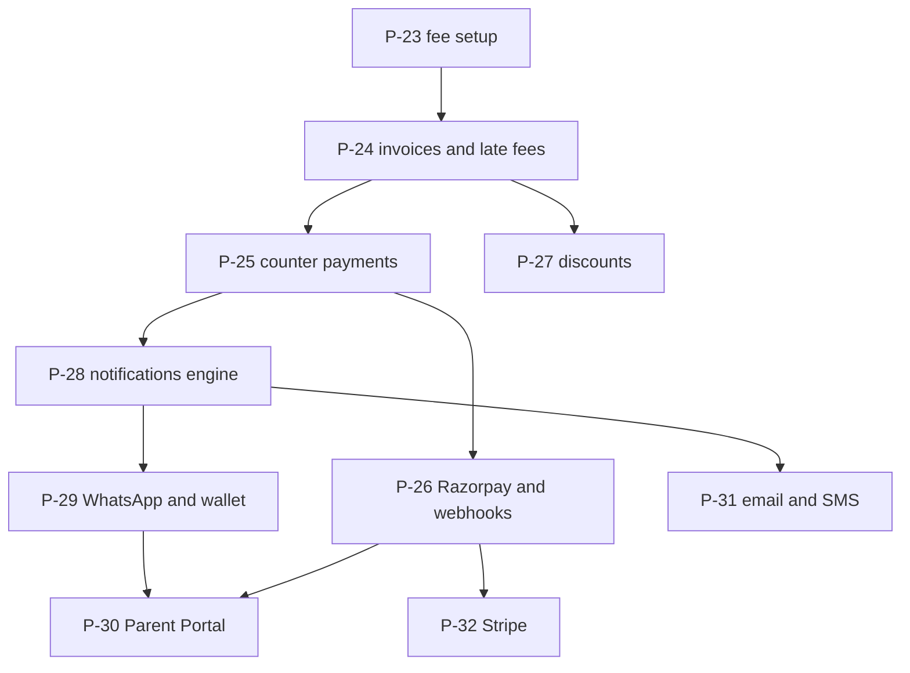

# Prompts: Finance and Communication

**In simple words:** This chapter holds ten ready-to-paste Claude Code prompts, P-23 to P-32, for the money and parent side of EduFlow: fees, payments, discounts, notifications, WhatsApp, the Parent Portal, email, SMS and Stripe. Each prompt makes Claude read your specs first, so it never invents a table, a field, an endpoint or a permission key.

## What these ten prompts build

After P-30 an institute can bill Aarav Sharma, collect at the counter or by UPI, close the cash box at night, remind Sunita Devi on WhatsApp and let her pay from her phone. P-31 (Phase 2) and P-32 (Phase 4) sit here because they reuse the same message log, wallet and payment code.

| ID | Prompt | Reads these docs | Builds | Typical time |
|---|---|---|---|---|
| P-23 | Fees part 1: fee heads, fee structures, student fee assignment | `25-fees-module.md`, `08-fees.prisma` | FEE-API-01 to 23, setup screens | 2 days (Days 31, 32) |
| P-24 | Fees part 2: invoice generation, late fees, reminders | `25-fees-module.md`, `58-background-jobs-and-events.md` | FEE-API-24 to 46, nightly job | 2 days (Days 33, 34) |
| P-25 | Payments part 1: counter collection, receipt PDF, day close | `26-payments-module.md`, `09-payments.prisma` | PAY-API-01 to 11, 33 to 37, 43 to 46 | 3 days (Days 36 to 38) |
| P-26 | Payments part 2: Razorpay online payments, webhooks, reconciliation | `26-payments-module.md`, `57-integrations-and-webhooks.md` | PAY-API-12 to 17, 24 to 28, 38, 40, 41 | 2 days (Days 39, 40) |
| P-27 | Discounts module | `27-discounts-module.md`, `08-fees.prisma` | DSC-API-01 to 16 | 1 day (Day 41) |
| P-28 | Notifications engine: events, templates, preferences, BullMQ workers, in-app feed | `31-notifications-module.md`, `93-appendix-notification-template-catalog.md` | NTF-API-01 to 07, 19 to 24, 27 to 29, 31 | 1 day (Day 43) |
| P-29 | WhatsApp Cloud API integration and message credit wallet | `32-whatsapp-module.md`, `10-communication.prisma` | WA-API-01 to 13, 17 to 21, 23 to 26 | 1 day (Day 44) |
| P-30 | Parent Portal (mobile-first) | `29-parent-portal-module.md`, `06-authentication-and-sessions.md` | PP-API-01 to 05, 13 to 19, 26 to 28 | 4 days (Days 45 to 48) |
| P-31 | Email (Amazon SES) and SMS (MSG91, DLT) channels | `33-email-module.md`, `34-sms-module.md` | EML-API-01 to 16, SMS-API-01 to 21 | 4 days (Days 65 to 68) |
| P-32 | Stripe payments for international customers | `26-payments-module.md`, `63-internationalization-and-localization.md` | Stripe side of PAY-API-13 to 32, PAY-API-39 | 2 days (Sep 2027) |

IDs, paths and permission keys come from `docs/api/03-finance-portals-comms.md`, model names from `08-fees.prisma`, `09-payments.prisma` and `10-communication.prisma`. The "scope for today" endings are in *Daily Plan: Days 29 to 42* and *Daily Plan: Days 43 to 60*; the prompt anatomy is in *Working with Claude Code*.

## The order and why it cannot change

**Figure: dependencies between the ten prompts**



Read an arrow as "must exist before". The Parent Portal shows dues and takes payments, so it comes last in the sprint.

> **Warning:** Never run P-26 before P-25. A Razorpay webhook calls the same `collectPayment()` as the counter, so a bug there turns every online payment into wrong money rows.

Every prompt also says "Follow every rule in CLAUDE.md": one transaction per money write, `Prisma.Decimal` only, idempotency keys, recomputed totals, nothing deleted, deduplicated webhooks, consent before any message, and tenant scope only from the Prisma extension. *Coding Standards* explains each rule.

## P-23 — Fees part 1: fee heads, fee structures, student fee assignment

**When to use.** Days 31 and 32 (Wed 4 and Thu 5 Nov 2026), Week 5: backend first, then the screens with follow-up 1.

**Before you start.** P-04 to P-06, P-08, P-13, P-16 and P-19 are merged. `server/src/lib/money.ts` exports `toMoney()` and `splitEqually()`. Read the proration rule in `docs/prd/25-fees-module.md` yourself, so you can judge Claude's version.

**The prompt**

```text
CONTEXT TO READ
- docs/prd/25-fees-module.md: Business Rules, Validation Rules,
  API Endpoints
- docs/schema/08-fees.prisma: FeeHead, TaxRate, LateFeeRule,
  FeeStructure, FeeStructureItem, FeeInstallment,
  StudentFeeAssignment, StudentFeeInstallment
- docs/api/03-finance-portals-comms.md: FEE-API-01 to FEE-API-23
- docs/permissions.md: fees.view, fees.manage, fees.create,
  fees.update, fees.delete
- Pattern to copy: server/src/modules/subjects/ from P-14

TASK
Build the fee setup layer of the Fees module, backend only.
Implement exactly FEE-API-01 to FEE-API-23: fee heads with tax
settings, effective-dated tax rates, late-fee rules, structures
with items and installments, and student fee assignment.
FEE-API-16 assigns a structure to a course, batch or student list
as a finance-queue job and returns the job id. FEE-API-18 assigns
one student with overrides, excluded heads and a prorated start.

CONSTRAINTS
- Follow every rule in CLAUDE.md. No schema change. If a field is
  missing in 08-fees.prisma, stop and ask me.
- Money: Prisma.Decimal with toMoney(). Never Number, parseFloat
  or toFixed in a calculation. Split installments with
  splitEqually() so the parts add up.
- Every route: authenticate, requirePermission(<registry key>),
  validate with the Zod schemas from shared/.
- Tenant and campus scope only through the Prisma extension.
- Archive is a soft delete; 409 CONFLICT while an active
  structure still uses the row.
- A structure with issued invoices is locked: only name, notes
  and status may change.

FILES TO CREATE OR CHANGE
- shared/src/schemas/fees.ts, shared/src/index.ts
- server/src/modules/fees/: routes, controller, schemas, mappers,
  events, fee-heads.service.ts, fee-structures.service.ts,
  their repositories, fees.test.ts, fees.isolation.test.ts
- server/src/lib/queue.ts (finance queue), jobs/finance.worker.ts
- server/src/routes.ts (mount the router)
Do not touch any other file without asking.

ACCEPTANCE CHECKS
- [ ] Lint, typecheck and npm run test --workspace server pass.
- [ ] Tuition Rs 36,000 in 3 installments reads back with three
      due dates and parts that sum to exactly 36000.00.
- [ ] Rs 10,000 in 3 installments: 3333.33, 3333.33, 3333.34.
- [ ] Aarav Sharma with a 10 percent Tuition override: 32400.00.
- [ ] A TEACHER calling POST /api/v1/fee-heads gets 403.
- [ ] Sharma Classes sees zero Bright Future fee heads.

WHAT TO REPORT BACK
1. Files changed, one line each, and the test summary lines.
2. FEE-API ids built, and any skipped with the reason.
3. Anything the spec left open, and what you assumed.
```

**Follow-up prompts**

```text
SCOPE: frontend for FEE-API-01 to 23 (Day 32), from the Screens
section of docs/prd/25-fees-module.md. Pages under
client/src/app/(dashboard)/fees/heads, /structures and /assign.
P-10 table and form kit, Can on guarded buttons, money inputs as
strings, loading, empty and error states. No server changes.
```

```text
Write the proration rule of docs/prd/25-fees-module.md as a pure
function in modules/fees/proration.ts with tests: joins on day
one, joins mid-month, joins after the last due date, and a
ONE_TIME head that is never prorated.
```

**Review checklist**

1. Search `fee-structures.service.ts` for `Number(`, `parseFloat` and `toFixed`. None may touch money.
2. Create Rs 36,000 in three installments in the browser. The parts add up exactly.
3. Assign it to Aarav with a 10 percent Tuition override and reopen it. The total reads Rs 32,400.
4. As Priya Nair (Teacher), type `/fees/heads` in the address bar. You see the 403 page.
5. Archive a fee head used by an active structure. Expect 409 `CONFLICT`.
6. `fees.isolation.test.ts` creates data in two organizations and asserts zero rows across the border, not only a 403.

**Common mistakes Claude makes here and how to correct them**

| Mistake | Fix prompt |
|---|---|
| `number` used for amounts | "Replace every number-based money calculation in fees with Prisma.Decimal and toMoney()." |
| Invented `FeeStructure.totalAmount` | "That field is not in 08-fees.prisma. Compute the total from FeeStructureItem rows in the mapper." |
| Guessed key such as `fees.write` | "Use only the registry keys. List every route with its key in a table." |

## P-24 — Fees part 2: invoice generation, late fees, reminders

**When to use.** Days 33 and 34 (Fri 6 and Sat 7 Nov 2026): backend first, then the screens and the dues report with follow-up 1.

**Before you start.** P-23 is merged and the finance worker runs. The `FEE_INVOICE_NO` sequence (P-19) and the PDF worker (P-21) work. Know the invoice lifecycle in `docs/prd/25-fees-module.md`.

**The prompt**

```text
CONTEXT TO READ
- docs/prd/25-fees-module.md: Workflow (invoice lifecycle),
  Business Rules (late fee, carry forward), Edge Cases
- docs/prd/58-background-jobs-and-events.md: nightly schedule
- docs/schema/08-fees.prisma: FeeInvoice, FeeInvoiceItem,
  FeeInvoiceAdjustment, LateFeeRule, FeeReminderLog. The comment
  on FeeInvoice gives the formula of total and balance.
- docs/api/03-finance-portals-comms.md: FEE-API-24 to FEE-API-46
- Existing code: server/src/modules/fees/ from P-23

TASK
Build invoices, late fees, reminders and fee reports, backend
only: FEE-API-24 to 46 except 40 (carry forward comes later).
Bulk generation (FEE-API-37) runs on the finance queue, supports
dryRun and autoIssue, and skips a student who already has a
non-cancelled invoice for the same assignment and installment.
Issuing (FEE-API-28) takes the next FEE_INVOICE_NO from the
Settings sequence service, freezes the tax snapshot and queues
the PDF. A nightly job applies late fees by LateFeeRule and moves
unpaid invoices past due to OVERDUE. Reminders only write
FeeReminderLog and publish an event.

CONSTRAINTS
- Follow every rule in CLAUDE.md. No schema change.
- Recompute total and balance with the schema formula in the
  same transaction as any change. Never increment balance.
- Only DRAFT invoices are edited or deleted. An issued invoice
  changes only by adjustment (FEE-API-33), cancel with credit
  note (FEE-API-29) or write-off (FEE-API-30).
- Numbers are taken inside the transaction, never by count()+1.
- Build invoice lines in one place: invoice-lines.ts.
- The late fee job opens the tenant context per organization
  and makes no query inside a per-student loop.

FILES TO CREATE OR CHANGE
- server/src/modules/fees/: fee-invoices.service.ts and its
  repository, invoice-lines.ts, late-fee.ts, fee-reports.service.ts
  with tests; routes, events and fees.test.ts (change)
- server/src/jobs/finance.worker.ts, jobs/schedulers.ts (01:00)
Do not touch any other file without asking.

ACCEPTANCE CHECKS
- [ ] Lint, typecheck and npm run test --workspace server pass.
- [ ] Installment 1 for 40 students: 40 DRAFT invoices. A second
      run creates 0. dryRun creates nothing, same counts.
- [ ] 20 invoices issued in one call: no gap, no repeat.
- [ ] Rs 12,000, 5 days overdue, Rs 50 per day, cap Rs 500:
      lateFee 250.00 and OVERDUE. A rerun that day adds nothing.
- [ ] A Rs 1,000 credit adjustment lowers total and balance by
      exactly 1000.00.
- [ ] The invoice isolation test passes.

WHAT TO REPORT BACK
1. Files changed, one line each, and the test summary lines.
2. How bulk generation stays idempotent, in three lines.
3. The exact formula you used for total and balance.
```

**Follow-up prompts**

```text
SCOPE: frontend for FEE-API-24 to 46 (Day 34). Invoice list with
filters, a generate dialog with a dry-run step and a second
confirmation, invoice detail with adjustments and PDF, and the
dues and defaulters reports. No maths in the browser.
```

```text
Implement FEE-API-40: year-end carry forward. Each unpaid balance
moves into a new ARREARS invoice in the next academic year with
carriedFromInvoiceId set; the old invoice becomes
CARRIED_FORWARD. Job with a dry run. Tests: zero balance skipped,
partly paid carried, cancelled skipped, second run carries none.
```

**Review checklist**

1. Generate installment 1 twice. Count rows in the database, not on screen: the second run adds zero.
2. On one issued invoice in `psql`: `total = subtotal - discount_total + tax_total + late_fee + adjustment_total`.
3. Same row: `balance = total - scholarship_credit - amount_paid - written_off_amount`.
4. Run the nightly job twice on one day. The late fee and `late_fee_applied_at` appear once.
5. Edit an issued invoice through the API. Expect 422 `BUSINESS_RULE_VIOLATION`, never a 500.
6. Search the diff for `increment:` on `balance` or `amountPaid`. There is none.

**Common mistakes Claude makes here and how to correct them**

| Mistake | Fix prompt |
|---|---|
| `balance` patched with `decrement` | "Never increment a cached money column. Recompute total and balance in the same transaction." |
| Late fee added every night | "Apply it once per rule period with lateFeeAppliedAt. Test two runs on one day." |
| Reminder service calls WhatsApp | "Reminders only log and publish. Delivery belongs to P-28 and P-29." |

## P-25 — Payments part 1: counter collection, receipt PDF, day close

**When to use.** Days 36 to 38 (Mon 9 to Wed 11 Nov 2026). Run it three times with the day's scope ending: the collect API, then the Collect Fee screen and receipt PDF, then day close and reports.

**Before you start.** P-24 is merged. The `RECEIPT_NO` sequence (P-19), the PDF worker (P-21) and `audit.record()` (P-22) work. The worked examples in the PAY-BR rules of `docs/prd/26-payments-module.md` become your manual tests.

**The prompt**

```text
CONTEXT TO READ
- docs/prd/26-payments-module.md: Workflow, PAY-BR-01 to 11,
  PAY-BR-16, 17, 20, 21, screens PAY-S01 to PAY-S03, PAY-S08,
  PAY-S09
- docs/schema/09-payments.prisma: Payment, PaymentAllocation,
  PaymentAllocationItem, Receipt, DayClose. Read every comment.
- docs/api/03-finance-portals-comms.md: PAY-API-01 to 11,
  33 to 37, 43 to 46
- docs/permissions.md: fees.collect and the payments.* keys

TASK
Build counter collection. PAY-API-02 records CASH, UPI, CARD,
CHEQUE, DEMAND_DRAFT or BANK_TRANSFER, allocates oldest first
(PAY-BR-02) or manually (PAY-BR-03), splits each allocation by fee
head with its tax (PAY-BR-04), keeps excess as advance (PAY-BR-05)
and issues one Receipt with a frozen snapshot and contentHash
(PAY-BR-07, 08). Then: cancel and reissue (04, 11), advance
allocation (05), cheque status and bounce (06, 07), receipt PDF
and send (09, 10), day close (33 to 37), reports (43 to 46).
PAY-API-10 only publishes an event. Do NOT build PAY-API-12 to 32
or 38 to 42.

CONSTRAINTS
- Follow every rule in CLAUDE.md. No schema change.
- Export collectPayment(tx, input). It never reads req; P-26
  reuses it for online payments.
- One tenantTransaction per payment: lock the open invoices with
  SELECT ... FOR UPDATE, re-check balances, write the rows, take
  RECEIPT_NO from the Settings sequence, recompute the invoices
  through the Fees service.
- Idempotency-Key required on PAY-API-02: missing gives 400, same
  key and body replays, same key with another body 409 (PAY-BR-11).
- Maker and checker (PAY-BR-20): the recorder cannot cancel, the
  closer cannot verify the day close. Both give 422.
- The PDF renders only from Receipt.snapshot, after the
  contentHash check.

FILES TO CREATE OR CHANGE
- shared/src/schemas/payments.ts
- server/src/modules/payments/: routes, controller, schemas,
  repository, events, collect.service.ts, allocation.ts + .test.ts,
  receipts.service.ts, day-close.service.ts, reports.service.ts,
  payments.test.ts, payments.isolation.test.ts
- server/src/jobs/pdf.worker.ts (receipt template), routes.ts
- client/src/features/payments/ and (dashboard)/payments pages
Do not touch any other file without asking.

ACCEPTANCE CHECKS
- [ ] Lint, typecheck and npm run test --workspace server pass.
- [ ] Rs 13,500 against INV-0912 (12,000) and INV-0977 (3,000):
      INV-0912 PAID, INV-0977 balance 1500.00.
- [ ] Rs 16,000 against dues of Rs 15,000: advance 1000.00.
- [ ] One key sent twice: one payment, same receiptNo.
- [ ] 20 parallel collects: 20 receipt numbers, no gap.
- [ ] Day close: opening 2000, cash 48500, cash refunds 1500,
      counted 48900 gives expected 49000.00, variance -100.00.
- [ ] Sharma Classes gets 404 on every Bright Future payment id.

WHAT TO REPORT BACK
1. Files changed, one line each, and the test summary lines.
2. The allocation algorithm in five plain lines.
```

**Follow-up prompts**

```text
Write one integration test for PAY-BR-17: Aarav pays INV-0912
(Rs 12,000) by cheque, it is DEPOSITED, then BOUNCED with bank
charge 295. Expect: receipt CANCELLED, allocations reversed with
reversedAt, INV-0912 OVERDUE with balance 12000.00, and one
ad-hoc CHEQUE_BOUNCE_CHARGE invoice linked by
bounceChargeInvoiceId. Show the red run, then fix only that.
```

```text
Implement PAY-API-42 only: import past payments from the
FEE_PAYMENTS Excel template as an ImportJob with a dry run. Each
row calls collectPayment() with a key from the file id and row
number, so a re-upload creates nothing twice.
```

**Review checklist**

1. `collect.service.ts` has one `tenantTransaction`, one `FOR UPDATE` lock, and the idempotency lookup before any insert.
2. Collect Rs 13,500 against INV-0912 and INV-0977. Prisma Studio shows allocations of 12,000 and 1,500.
3. Double-click "Collect & Print Receipt", then replay the same key. One payment, one receipt.
4. Rename the student and download the receipt again. The PDF does not change.
5. Suresh Gupta cancels his own payment: 422. The admin cancels it: balances return, and the payment row stays.
6. As a Sharma Classes admin, request a Bright Future receipt PDF by id. Expect 404.

**Common mistakes Claude makes here and how to correct them**

| Mistake | Fix prompt |
|---|---|
| Allocation maths in the controller or form | "Move it into allocation.ts as a pure function with tests. The screen shows the API preview." |
| PDF rendered from live student data | "Render from Receipt.snapshot after the contentHash check. Test a renamed student." |
| Idempotency kept only in Redis | "Store the key in Payment.idempotencyKey under its unique index." |

## P-26 — Payments part 2: Razorpay online payments, webhooks, reconciliation

**When to use.** Days 39 and 40 (Thu 12 and Fri 13 Nov 2026): orders and checkout first, then the webhook and the pending-order job. Refunds and settlements follow with follow-up 2, before the January 2027 launch.

**Before you start.** P-25 is merged. Razorpay is in Test Mode with automatic capture, and its keys are in `server/.env`. Install a tunnel such as ngrok. On a bad webhook signature the PRD answer (401) wins over the daily plan.

**The prompt**

```text
CONTEXT TO READ
- docs/prd/26-payments-module.md: online Workflow, event table,
  PAY-BR-12 to 15, 24, 25, screens PAY-S04 and PAY-S11
- docs/prd/57-integrations-and-webhooks.md: Razorpay section
- docs/schema/09-payments.prisma: PaymentGatewayAccount,
  PaymentOrder, Payment, WebhookEvent. Read every comment.
- docs/api/03-finance-portals-comms.md: PAY-API-12 to 17,
  24 to 28, 38, 40, 41
- Existing code: collectPayment() and modules/payments/ (P-25)

TASK
Add Razorpay online payment.
1. Gateway accounts (PAY-API-24 to 28) store only secretRef and
   webhookSecretRef. PAY-API-28 tests them, sets lastVerifiedAt.
2. PAY-API-13 builds a PaymentOrder from invoice ids. The server
   takes the amount from balances plus the convenience fee
   (PAY-BR-13), converts it to integer paise, creates the
   Razorpay order and saves gatewayOrderId before answering.
3. PAY-API-15 checks the checkout signature and calls
   capturePayment(). PAY-API-16 and 17 send and cancel links.
4. PAY-API-38 stores each event in WebhookEvent and queues it;
   the webhook worker handles the Razorpay column of the event
   table. PAY-API-40 and 41 list and retry events.
5. Every 10 minutes a job asks Razorpay about CREATED or
   ATTEMPTED orders older than 15 minutes and expires old ones.
Do NOT build refunds (PAY-API-18 to 23) or settlements (29 to 32).

CONSTRAINTS
- Follow every rule in CLAUDE.md. No schema change.
- Official razorpay npm package, only in lib/payments/razorpay.ts.
- capturePayment(orderId, gatewayPaymentId) locks the order row
  and calls collectPayment(). Verify and webhook may race:
  exactly one of them records the payment.
- HMAC-SHA256 compared with crypto.timingSafeEqual. Checkout:
  "<orderId>|<paymentId>" with the key secret. Webhook: the RAW
  body with the webhook secret. A bad signature is stored as
  IGNORED and answered 401 UNAUTHENTICATED.
- Webhook router: express.raw, before express.json, no auth.
- The tenant comes from our PaymentOrder, never the payload.
- Never log a secret. methodDetails holds masked data only.
- Starter plan: 403 PLAN_LIMIT_REACHED on gateway routes.

FILES TO CREATE OR CHANGE
- server/src/lib/payments/razorpay.ts (new)
- server/src/modules/payments/: gateway-accounts.service.ts,
  orders.service.ts, capture.ts, webhooks.razorpay.ts,
  webhook-handlers.ts, online.test.ts; routes (change)
- server/src/jobs/webhook.worker.ts, schedulers.ts, src/app.ts
- client/src/features/payments/online/, pages PAY-S04, PAY-S11

ACCEPTANCE CHECKS
- [ ] Lint, typecheck and npm run test --workspace server pass.
- [ ] Test UPI success@razorpay on a Rs 15,000 invoice: PAID, one
      Payment with method ONLINE_GATEWAY, one Receipt.
- [ ] Verify and webhook fired together 20 times: one payment.
- [ ] The same webhook twice: one WebhookEvent row.
- [ ] One changed byte in the body: 401, status IGNORED.
- [ ] Tunnel stopped: the 10-minute job records the payment.

WHAT TO REPORT BACK
1. Files changed, one line each, and the test summary lines.
2. How capturePayment stops a double capture, in three lines.
3. The webhook URL and events to enable in Razorpay.
```

**Follow-up prompts**

```text
Add a table-driven test for PAY-BR-13 before changing code. Card
at 2 percent on Rs 10,800: convenienceFee 216.00, tax 38.88, order
11054.88. UPI at 0 percent: 10800.00. passFeeToPayer false:
10800.00. In every row only 10800.00 is allocated to invoices.
```

```text
Second pass of P-26 (Phase 2). Build refunds PAY-API-18 to 23
(PAY-BR-18 to 20; requester and approver differ, else 422) and
settlements PAY-API-29 to 32 (PAY-BR-22), plus the refund,
dispute and settlement rows of the event table. Reuse the webhook
worker; add no second money path.
```

**Review checklist**

1. In `app.ts`, the webhook routers come before `express.json()`, with no `authenticate` above them.
2. Pay Rs 15,000 with `success@razorpay` and close the tab. Within a minute: paid, one receipt.
3. Resend the webhook from the Razorpay dashboard. Still one payment and one `WebhookEvent` row.
4. Stop the tunnel and pay. Within 25 minutes the job records the payment.
5. Search the day's logs for both secrets. Neither appears.
6. As a Sharma Classes admin, call PAY-API-14 with a Bright Future order id. Expect 404.

**Common mistakes Claude makes here and how to correct them**

| Mistake | Fix prompt |
|---|---|
| Trusts the amount from the browser | "Compute the amount on the server from balances. Remove amount from the PAY-API-13 body." |
| Webhook after `express.json()`, so signatures fail | "Mount the webhook routers before express.json with express.raw. Test a signed raw body." |
| Allocation copied into `capture.ts` | "capture.ts calls collectPayment() from P-25. Delete the copy." |

## P-27 — Discounts module

**When to use.** Day 41 (Sat 14 Nov 2026), API and screens in one pass. Keep 90 minutes for the end-to-end money test from *Daily Plan: Days 29 to 42*.

**Before you start.** P-24 and P-25 are merged, and invoice lines are built only in `invoice-lines.ts`. An unpaid ISSUED invoice gets a discount as a FEE-API-33 concession (follow-up 1), never by repricing.

**The prompt**

```text
CONTEXT TO READ
- docs/prd/27-discounts-module.md: Business Rules (stacking,
  priority, cap, validity, sibling), Validation Rules, screens
- docs/schema/08-fees.prisma: Discount, StudentDiscount, and the
  discount fields of FeeInvoice and FeeInvoiceItem. Read the
  partial unique index comment on StudentDiscount.
- docs/api/03-finance-portals-comms.md: DSC-API-01 to DSC-API-16
- docs/permissions.md: the discounts.* keys
- Existing code: server/src/modules/fees/invoice-lines.ts

TASK
Build the Discounts module, API and screens, in one pass.
Schemes (DSC-API-01 to 05): PERCENT or FIXED, scope INVOICE_TOTAL
or FEE_HEADS, maxAmount cap, course filter, validity dates,
isStackable, priority, requiresApproval. Grants (06 to 12) stay
PENDING until a second user approves, unless requiresApproval is
false. Approval applies to DRAFT and future invoices. DSC-API-13
previews one student. DSC-API-14 suggests SIBLING grants from
Family and StudentGuardian. DSC-API-15, 16: impact report, export.

CONSTRAINTS
- Follow every rule in CLAUDE.md. No schema change.
- One pure applyDiscounts(lines, grants) in
  modules/discounts/apply-discounts.ts does all the maths.
  invoice-lines.ts calls it. The client never computes one.
- Lower priority number first. Non-stackable grants never
  combine. PERCENT is capped by maxAmount. A line never goes
  below 0.00. Round each line with toMoney().
- Discount before tax: taxableAmount = amount - discountAmount.
- appliedDiscounts holds studentDiscountId, name and amount;
  discountTotal equals the sum of the line discounts.
- Issued invoices are never repriced. Approver differs from
  requester, else 422. A second live grant of the same scheme,
  student and year gives 409 CONFLICT.

FILES TO CREATE OR CHANGE
- shared/src/schemas/discounts.ts
- server/src/modules/discounts/: routes, controller, schemas,
  service, repository, events, apply-discounts.ts + .test.ts,
  discounts.test.ts, discounts.isolation.test.ts
- server/src/modules/fees/invoice-lines.ts (apply APPROVED
  grants valid on the invoice date), server/src/routes.ts
- client/src/features/discounts/ and (dashboard)/discounts pages

ACCEPTANCE CHECKS
- [ ] Lint, typecheck and npm run test --workspace server pass.
- [ ] Sibling 10 percent on Tuition Rs 12,000 plus Transport
      Rs 3,000: discountTotal 1200.00, total 13800.00.
- [ ] 10 percent with maxAmount 500 on Rs 12,000 gives 500.00.
- [ ] Two non-stackable grants: only the lower priority applies.
- [ ] FIXED Rs 5,000 on a Rs 3,000 line gives 3000.00.
- [ ] Suresh Gupta approving his own grant gets 422.

WHAT TO REPORT BACK
1. Files changed, one line each, and the test summary lines.
2. The applyDiscounts rules as a numbered list.
3. Any rule the PRD left open and what you chose.
```

**Follow-up prompts**

```text
On an unpaid ISSUED invoice, add "Apply approved discount as
concession": a FEE-API-33 CONCESSION adjustment for the amount
applyDiscounts() returns, in the normal approval queue. Never
edit issued lines. Test that the total drops only after approval.
```

```text
When a student leaves, revoke APPROVED SIBLING grants whose
siblingStudentId is that student from the leaving date, with the
DSC-API-11 logic. Tests: one sibling leaves, both leave, a
re-admitted sibling.
```

**Review checklist**

1. Search `client/src` for maths near the word "discount". The browser shows only DSC-API-13 numbers.
2. Work the Day 41 example by hand: Rs 15,000 gross, Rs 1,200 sibling discount, Rs 500 late fee, Rs 14,300 to collect.
3. Grant as Suresh Gupta, approve as the admin, generate the next installment, and read `applied_discounts`.
4. Approve a discount while an ISSUED invoice exists. Its total does not move.
5. A second PENDING grant of the same scheme, student and year gives 409.
6. On an 18 percent GST head: `taxable_amount = amount - discount_amount`.

**Common mistakes Claude makes here and how to correct them**

| Mistake | Fix prompt |
|---|---|
| Discount maths also in the React preview | "Keep one applyDiscounts() on the server. The preview calls DSC-API-13." |
| ISSUED invoices repriced on approval | "Approval touches DRAFT and future invoices only. Add a test." |
| Tax on the gross amount | "taxableAmount = amount - discountAmount. Test an 18 percent GST head." |

## P-28 — Notifications engine: events, templates, preferences, BullMQ workers, in-app feed

**When to use.** Day 43 (Mon 16 Nov 2026). From now on modules only publish events; this engine decides who hears about them.

**Before you start.** P-18, P-24 and P-25 publish their events. `lib/events.ts`, `lib/queue.ts` and the `MessageSender` interface from P-07 exist. Seed Sunita Devi as a parent user linked to Aarav.

**The prompt**

```text
CONTEXT TO READ
- docs/prd/31-notifications-module.md: Workflow, Business Rules
- docs/prd/93-appendix-notification-template-catalog.md: event
  keys, variables and default texts
- docs/prd/58-background-jobs-and-events.md: notifications queue
- docs/schema/10-communication.prisma: NotificationTemplate,
  Notification, NotificationPreference, MessageLog
- docs/api/03-finance-portals-comms.md: block "NTF - Notifications"

TASK
Build the Notifications engine and the in-app feed.
1. Listeners for the events of Weeks 5 and 6 (absent, invoice
   issued, receipt, fee reminder). A listener only adds a job to
   the notifications queue. The BullMQ jobId is the event key
   plus the entity id, so one event is queued once.
2. notification.worker.ts: find recipients (guardians through
   StudentGuardian), skip a disabled NotificationPreference, pick
   the template (tenant row, then the system default with
   organizationId null; language falls back to en), render
   {{variables}}, write one MessageLog per recipient and channel,
   then call the channel adapter.
3. ChannelAdapter with send() and mapStatus(). IN_APP is real and
   writes a Notification row. WHATSAPP is a stub that logs
   "would send" with a masked phone.
4. NTF-API-01 to 07, 19 to 24, 27 to 29 and 31, the bell menu in
   the app shell, and a template editor with preview.
Do NOT build NTF-API-08 to 18 (announcements), 25, 26 or 30.

CONSTRAINTS
- Follow every rule in CLAUDE.md. No schema change.
- The API never waits for a message, and a failed publish never
  fails the request that published it.
- Each job runs inside runWithTenant(orgId).
- Retries as in docs/prd/58 (default 3, exponential backoff);
  then MessageLog FAILED and the job stays in the failed list.
- A missing variable fails the render with a clear error. OTP
  values are masked in MessageLog.body.
- The ACCOUNT category cannot be switched off.

FILES TO CREATE OR CHANGE
- server/src/modules/notifications/: routes, controller, service,
  repository, schemas, listeners.ts, render.ts + .test.ts,
  channels/ (adapter, in-app, whatsapp stub), tests and an
  isolation test
- server/src/jobs/notification.worker.ts, server/src/routes.ts
- shared/src/schemas/notifications.ts
- client/src/features/notifications/ and the header bell
Do not change fees or payments code.

ACCEPTANCE CHECKS
- [ ] Lint, typecheck and npm run test --workspace server pass.
- [ ] Worker stopped: marking Aarav absent still answers in under
      1 second, and the notification appears after a restart.
- [ ] Attendance switched off for Sunita Devi: no MessageLog row.
- [ ] A tenant template beats the system default.
- [ ] The same event published twice: one row per channel.
- [ ] Sharma Classes sees no Bright Future notification or log.

WHAT TO REPORT BACK
1. The event keys handled and the template each one uses.
2. Files changed, one line each, and the test summary lines.
```

**Follow-up prompts**

```text
Failing case: Aarav has two guardians, and his mother has a
second child here. Each guardian gets one absent alert. When both
children are absent on one day, the mother gets two messages,
each naming the child. Test first, then fix recipients.ts only.
```

```text
Build the preferences screen for NTF-API-23 and 24: categories by
channel, saved with one PUT. ACCOUNT is locked on. No WhatsApp or
SMS column on Starter.
```

**Review checklist**

1. Stop the worker and mark Aarav absent as Priya Nair. Attendance saves at once; the notification comes after a restart.
2. In Prisma Studio, every `MessageLog` row has `eventKey`, `studentId` and `channel`.
3. Switch off Attendance for Sunita Devi and mark absent again. No new row for her.
4. Switching off `ACCOUNT` through NTF-API-24 fails with 422.
5. Change the absent text for Bright Future only. Sharma Classes keeps the system default.
6. `notification.worker.ts` has no query outside `runWithTenant`.

**Common mistakes Claude makes here and how to correct them**

| Mistake | Fix prompt |
|---|---|
| Listener sends the message itself | "A listener only adds a job. Move the send into notification.worker.ts." |
| Worker queries without tenant context | "Wrap every job in runWithTenant(job.data.orgId). Test two organizations in one queue." |
| `{{studentName}}` printed raw | "A missing variable fails the render and the MessageLog. Add a test." |

## P-29 — WhatsApp Cloud API integration and message credit wallet

**When to use.** Day 44 (Tue 17 Nov 2026). After today a real message reaches a real phone and costs real money.

**Before you start.** P-28 is merged. A WhatsApp Cloud API app and test number exist, with your phone on its recipient list. The Day 29 templates are approved, including the OTP authentication template. The token, phone number ID, app secret and verify token are in `server/.env`.

**The prompt**

```text
CONTEXT TO READ
- docs/prd/32-whatsapp-module.md: Business Rules, wallet, opt-in
- docs/prd/57-integrations-and-webhooks.md: WhatsApp section
- docs/schema/10-communication.prisma: WhatsAppAccount,
  WhatsAppTemplate, WhatsAppInboundMessage, MessageLog,
  MessageCreditWallet, CreditTransaction. Read every comment.
- docs/api/03-finance-portals-comms.md: block "WA - WhatsApp"
- Existing code: modules/notifications/channels/ from P-28

TASK
Replace the WHATSAPP stub with the real channel and the wallet.
1. lib/whatsapp.ts sends template messages through the Cloud API
   (Graph version and ids from env). Nothing else calls Meta.
2. WA-API-01 to 11: accounts and templates with approval sync.
   NotificationTemplate links its WhatsAppTemplate; variables
   keep Meta's placeholder order.
3. WA-API-12, 13: send only when COMMUNICATION_WHATSAPP consent is
   GRANTED, the template is APPROVED and credit is available.
   Charge = provider cost x 1.15; store providerCost,
   exchangeRate and marginAmount on MessageLog.
4. WA-API-19 to 21: wallet. CONSUME row and balance change in one
   transaction; a provider failure writes one REFUND row. At zero:
   MessageLog FAILED and one in-app alert to ORG_ADMIN. Below
   lowBalanceThreshold: one warning.
5. WA-API-17, 18: opt-in and opt-out as ConsentRecord with proof.
6. WA-API-23 handshake (hub.verify_token) and WA-API-24: check
   X-Hub-Signature-256 on the raw body, store WebhookEvent, then
   the webhook worker updates MessageLog status, stores inbound
   messages and records an opt-out when a parent sends STOP.
7. WA-API-25, 26, plus the WhatsApp settings and wallet screens.
8. MessageSender from P-07: OTP by the WhatsApp authentication
   template, never charged to the tenant wallet.
Do NOT build top-ups (WA-API-22) or the inbox API (14 to 16).

CONSTRAINTS
- Follow every rule in CLAUDE.md. No schema change.
- Wallet amounts are Decimal(12, 4). The debit is one
  conditional update, so parallel sends never overdraw.
- The tenant comes from the WhatsAppAccount found by
  phoneNumberId, never from payload text.
- Outside production, send only to allow-listed numbers.
- Never log the access token, an OTP or a full phone number.
- Starter plan: WhatsApp sending gives 403 PLAN_LIMIT_REACHED.

FILES TO CREATE OR CHANGE
- server/src/lib/whatsapp.ts (new)
- server/src/modules/whatsapp/: routes, controller, service,
  wallet.service.ts + .test.ts, webhooks.whatsapp.ts, tests and
  an isolation test
- server/src/modules/notifications/channels/whatsapp.ts,
  server/src/jobs/webhook.worker.ts, server/src/app.ts
- client/src/features/whatsapp/
Do not change fees or payments code.

ACCEPTANCE CHECKS
- [ ] Lint, typecheck and npm run test --workspace server pass.
- [ ] Marking Aarav absent reaches your allow-listed phone within
      a minute, and MessageLog moves to DELIVERED.
- [ ] 50 parallel sends with credit for 10: 10 sent, 40 FAILED,
      balance never below 0.0000.
- [ ] A failed delivery writes one REFUND row, never two.
- [ ] One changed byte in the webhook body: 401, nothing handled.
- [ ] No consent, no message. Sharma Classes sees no Bright
      Future wallet row or log.

WHAT TO REPORT BACK
1. Files changed, one line each, and the test summary lines.
2. The charge formula with one worked example in rupees.
3. The webhook URL and the fields to subscribe to in Meta.
```

**Follow-up prompts**

```text
Build the inbox API WA-API-14 to 16 and its screen. Inbound rows
match a Guardian by phone. A free-form reply is allowed only
within 24 hours of the parent's last message; after that, offer
an approved template. Test both sides of the line.
```

```text
Failing case: Meta sends "read" before "delivered". Status only
moves forward: QUEUED, SENT, DELIVERED, READ; FAILED only from
QUEUED or SENT. Test the events out of order, then fix the
status mapper only.
```

**Review checklist**

1. Mark Aarav absent. Your phone gets it, and `MessageLog` moves to `DELIVERED`, then `READ`.
2. Both columns are equal: `select w.balance, sum(t.amount) from message_credit_wallets w join credit_transactions t on t.wallet_id = w.id where t.transaction_type not in ('RESERVE', 'RELEASE') group by w.id, w.balance;`
3. Empty a test wallet and send. `FAILED` with a reason, and one admin alert, not one per message.
4. Replay a stored webhook. One `WebhookEvent` row, statuses unchanged.
5. Reply STOP from your phone. The next absent alert arrives in-app only.
6. Search the logs for the token and for full phone numbers. Neither appears.

**Common mistakes Claude makes here and how to correct them**

| Mistake | Fix prompt |
|---|---|
| Balance read, then written in a second step | "Debit with one conditional update (balance >= charge) in the CONSUME transaction. Add the parallel test." |
| Webhook parsed by `express.json()` | "Mount it before express.json with express.raw, like the Razorpay one." |
| Tenant taken from the payload | "Find the tenant by phoneNumberId. Test a forged payload." |

## P-30 — Parent Portal (mobile-first)

**When to use.** Days 45 to 48 (Wed 18 to Sat 21 Nov 2026), four build hours a day while pilots onboard. Run it four times with the scope endings from *Daily Plan: Days 43 to 60*: backend, frontend part 1, frontend part 2, finish.

**Before you start.** P-26, P-28 and P-29 are merged, and OTPs travel by WhatsApp. Seed one parent with two children. Test at 360 px and on your own phone.

**The prompt**

```text
CONTEXT TO READ
- docs/prd/29-parent-portal-module.md: all sections
- docs/prd/06-authentication-and-sessions.md: OTP login
- docs/prd/61-privacy-and-compliance.md: parental consent
- docs/prd/08-design-system-and-ux-guidelines.md: mobile rules
- docs/api/03-finance-portals-comms.md: block "PP - Parent
  Portal" and NTF-API-19 to 24
- docs/schema/04-people.prisma: Guardian, StudentGuardian
- docs/schema/02-auth.prisma: OtpCode, ConsentRecord

TASK
Build the Parent Portal, mobile-first.
1. OTP login reuses P-07. Add only: a code is created when the
   phone matches an active Guardian, the PARENT User is created
   and linked at first login, and known and unknown numbers get
   the same answer.
2. One helper, guardianStudentIds(), used by every endpoint with
   a student or invoice id. Not linked gives 404.
3. Consent gate: until PRIVACY_POLICY, CHILD_DATA_PROCESSING and
   COMMUNICATION_WHATSAPP ConsentRecords exist (method OTP),
   every PP endpoint except 01, 26 and 27 answers 403.
4. PP-API-01 to 05, 13 to 19, 26 to 28. PP-API-16 and 17 call the
   P-26 order and verify services after the Own check.
5. Pages in client/src/app/(portal)/portal/: login, consent, home,
   attendance, fees, fees/[invoiceId], receipts, notices (feed)
   and settings. Bottom bar: Home, Attendance, Fees, More. A
   child switcher when there are two or more children.
Do NOT build PP-API-06 to 12, 20 to 25 or 29 to 32 (Phase 2).

CONSTRAINTS
- Follow every rule in CLAUDE.md. No schema change.
- No new money code. Amounts arrive as strings and use the shared
  money formatter; the client never calculates a balance.
- DRAFT invoices never reach a parent.
- Pay Now sends an Idempotency-Key and is hidden when the
  organization has no active PaymentGatewayAccount.
- PDF links are fresh pre-signed URLs on every tap.
- 360 px wide, touch targets 44 px, no sideways scroll, skeletons
  on slow networks. No staff route inside this layout.

FILES TO CREATE OR CHANGE
- server/src/modules/parent-portal/: routes, controller, service,
  guardian-scope.ts + .test.ts, consent.service.ts, tests and an
  isolation test
- server/src/modules/auth/ (change): guardian lookup on OTP only
- shared/src/schemas/parent-portal.ts
- client/src/app/(portal)/ and client/src/features/parent-portal/
Do not change fees or payments services.

ACCEPTANCE CHECKS
- [ ] Lint, typecheck and npm run test --workspace server pass.
- [ ] Two parents in batch 10-A: each gets 404 on the other
      child's id in every PP endpoint.
- [ ] A parent with two children sees both, data per child.
- [ ] No consent: 403 on PP-API-03. After consent: 200.
- [ ] Unknown number: same OTP answer, no OtpCode row.
- [ ] Pay Rs 12,000 with success@razorpay and close the tab at
      once: invoice PAID, exactly one receipt.

WHAT TO REPORT BACK
1. PP-API ids built, with method and path.
2. Files changed, one line each, and the test summary lines.
3. Where the Own check lives and which endpoints call it.
```

**Follow-up prompts**

```text
Day 48: parent invites. Staff pick a batch and send the portal
invite through the Notifications engine with its own approved
template. Until it is approved, show a "Copy invite text" button.
```

```text
PP-API-28: withdrawing COMMUNICATION_WHATSAPP stops WhatsApp to
that guardian at once but keeps in-app messages. Withdrawing a
required consent brings the consent gate back. Test each.
```

**Review checklist**

1. Log in as Sunita Devi on your phone. Consent comes first, with no pre-ticked boxes.
2. Put another child's id into the attendance URL. The answer is 404: never 403, never data.
3. Aarav's balance matches the staff dues screen to the paisa.
4. Tap Pay Now twice quickly. One order, one payment, one receipt.
5. As a parent, type `/fees` in the address bar. You land on `/portal`.
6. `otp_codes` holds only hashes, and the production log holds no OTP.

**Common mistakes Claude makes here and how to correct them**

| Mistake | Fix prompt |
|---|---|
| 403 for another family's child | "Return 404, so the API never confirms that the student exists. Add a test." |
| Order code copied into `parent-portal` | "PP-API-16 and 17 call the P-26 services after the Own check. Delete the copy." |
| Balance computed in React | "Show the API balance only, with the shared money formatter." |

## P-31 — Email (Amazon SES) and SMS (MSG91, DLT) channels

**When to use.** Days 65 to 68 (Tue 8 to Fri 11 Dec 2026), Phase 2. Run it twice, ending with "SCOPE: email only", then "SCOPE: SMS only".

**Before you start.** P-28 and P-29 are merged. SES production access and your sending domain are approved, and your DLT header and templates are approved in MSG91. SES, MSG91 and Twilio test keys are in `server/.env`.

**The prompt**

```text
CONTEXT TO READ
- docs/prd/33-email-module.md, docs/prd/34-sms-module.md:
  Business Rules, Validation Rules, API Endpoints
- docs/prd/57-integrations-and-webhooks.md: SES, MSG91, Twilio
- docs/schema/10-communication.prisma: EmailSenderIdentity,
  EmailSuppression, SmsSenderId, SmsDltTemplate, MessageLog,
  MessageCreditWallet, CreditTransaction
- docs/api/03-finance-portals-comms.md: blocks "EML - Email" and
  "SMS - SMS"
- Existing code: notifications/channels/, the P-29 wallet service,
  lib/mailer.ts from P-07

TASK
Add EMAIL and SMS as channels of the P-28 engine.
Email, EML-API-01 to 16: custom sender domains in SES with DKIM
records, the shared EduFlow domain as fallback, log, send and
resend, suppressions, a signed one-click unsubscribe (13) that
also switches the preference off, and the SES/SNS webhook (14):
a hard bounce or complaint adds an EmailSuppression.
SMS, SMS-API-01 to 21 except the import (10, a follow-up):
headers with DLT entity id, DLT templates, send with credit
check, and preview (13): the text must match the registered
bodyText with {#var#} placeholders, with Unicode detection and
segment count. Wallet 14 to 17 as in P-29. MSG91 and Twilio
webhooks (18, 19); STOP opts out. lib/sms/index.ts picks MSG91
for India and Twilio for other countries.

CONSTRAINTS
- Follow every rule in CLAUDE.md. No schema change. One template
  system: NotificationTemplate. No second one.
- System emails (reset, invitations, receipts) work on every
  plan. SMS sending on Starter gives 403 PLAN_LIMIT_REACHED.
- Never mail a suppressed address. Never send an Indian SMS
  without an APPROVED DLT template; copy dltTemplateId and
  dltEntityId onto MessageLog.
- Charge Rs 0.25 per SMS segment unless docs/prd/34 says
  otherwise, with CONSUME in the send transaction.
- Webhooks: SNS message signature, Twilio request signature, a
  secret URL token for MSG91. WebhookEvent dedup, 401 if bad.
- Provider SDKs live only in lib/.

FILES TO CREATE OR CHANGE
- server/src/lib/mailer.ts (change); lib/sms/index.ts, msg91.ts,
  twilio.ts (new)
- server/src/modules/email/ and server/src/modules/sms/, each
  with tests and an isolation test
- server/src/modules/notifications/channels/email.ts and sms.ts
- client/src/features/email/ and client/src/features/sms/
Do not change fees or payments code.

ACCEPTANCE CHECKS
- [ ] Lint, typecheck and npm run test --workspace server pass.
- [ ] A fee collected for Aarav: Sunita Devi gets the receipt by
      email and SMS within a minute, both DELIVERED in the log.
- [ ] Text that differs from the DLT text by one word is refused
      before any provider call.
- [ ] A 170-character English SMS: 2 segments, Rs 0.50.
- [ ] SES hard bounce: address suppressed, next email skipped.
- [ ] Sharma Classes sees no Bright Future sender, header or log.

WHAT TO REPORT BACK
1. Files changed, one line each, and the test summary lines.
2. The DNS records and DLT data I must enter, as a list.
3. How DLT text matching works, in five lines.
```

**Follow-up prompts**

```text
Email fallback: when a WhatsApp message to a guardian FAILED and
the guardian has an email, send the same event by email once and
publish message.fallback_triggered. Never for OTPs. Test: one
fallback per message, never a loop.
```

```text
Implement SMS-API-10: import DLT templates from the DLT portal
Excel file as an ImportJob with a dry run. An existing template
id is updated, not duplicated. Unknown headers go to
ImportJobRowError.
```

**Review checklist**

1. Collect a fee as Suresh Gupta. Sunita Devi gets email and SMS within a minute, and both rows reach `DELIVERED`.
2. The SMS row in the message log has `dlt_template_id` and a cost.
3. Send to the SES mailbox simulator bounce address. It is suppressed, and the next email to it is skipped.
4. Change one character of an unsubscribe token. Expect 401.
5. On a Starter organization, a password reset email still arrives, and an SMS send gets 403.
6. No provider SDK is imported outside `lib/`.

**Common mistakes Claude makes here and how to correct them**

| Mistake | Fix prompt |
|---|---|
| A separate template store for email | "Use NotificationTemplate with channel EMAIL. Delete the new store." |
| SMS text only "close to" the DLT text | "Rendered text equals bodyText except the {#var#} parts. Test a one-word change." |
| Soft bounces suppressed forever | "Only HARD_BOUNCE and COMPLAINT never expire. Soft bounces set expiresAt." |

## P-32 — Stripe payments for international customers

**When to use.** Phase 4, 1 to 14 Sep 2027, with the locale packs of P-60 and before the UAE entry in Year 2.

**Before you start.** The P-26 refunds and settlements pass is merged. Stripe test keys and the webhook signing secret are in `server/.env`. The Stripe CLI command `stripe listen --forward-to` sends test events to your local webhook route.

**The prompt**

```text
CONTEXT TO READ
- docs/prd/26-payments-module.md: online Workflow, the Stripe
  column of the event table, notes on PAY-API-15 and PAY-API-39
- docs/prd/63-internationalization-and-localization.md: currency
  and tax rules
- docs/schema/09-payments.prisma: PaymentGatewayAccount,
  PaymentOrder, Payment, Refund, Settlement, WebhookEvent
- docs/api/03-finance-portals-comms.md: PAY-API-13 to PAY-API-32,
  PAY-API-39
- Existing code: lib/payments/razorpay.ts, capture.ts,
  webhook-handlers.ts, orders.service.ts

TASK
Add Stripe as a second gateway behind the same services.
1. A PaymentGatewayClient interface (createOrder, fetchStatus,
   refund, listPayouts, verifyWebhook). Move Razorpay behind it
   with no behaviour change, then add lib/payments/stripe.ts
   with the official stripe package.
2. PAY-API-24 to 28 accept provider STRIPE. PAY-API-13 creates a
   PaymentIntent and stores its id in gatewayOrderId. PAY-API-15
   takes { paymentIntentId }, fetches it, requires the status
   succeeded, then calls capturePayment().
3. PAY-API-39 checks Stripe-Signature with
   stripe.webhooks.constructEvent on the raw body and handles the
   Stripe column of the event table in the same worker.
4. Refunds (PAY-API-23) and payout sync (PAY-API-31) go through
   the interface.
5. The parent checkout uses Stripe Elements when the account is
   STRIPE, and Razorpay Checkout otherwise.

CONSTRAINTS
- Follow every rule in CLAUDE.md. No schema change.
- One money path: capturePayment() and collectPayment() are
  reused, never copied. Providers differ only inside lib/.
- Gateway account currency and invoice currency must match,
  else 422. Minor units come from toMinorUnits() in
  lib/money.ts, never an inline "x 100".
- No card data reaches our server; Stripe Elements only.
- Tax comes from the frozen invoice snapshot. The gateway never
  adds tax.
- Every Razorpay test stays green without edits.

FILES TO CREATE OR CHANGE
- server/src/lib/payments/gateway.ts and stripe.ts (new);
  razorpay.ts (change: implements the interface)
- server/src/modules/payments/: orders.service.ts, capture.ts,
  webhooks.stripe.ts, webhook-handlers.ts, stripe.test.ts
- server/src/app.ts (Stripe webhook before express.json)
- client/src/features/payments/online/ and the portal pay page
Do not change fees or discounts code.

ACCEPTANCE CHECKS
- [ ] Lint, typecheck and npm run test --workspace server pass.
- [ ] An AED 4,500 invoice paid with a Stripe test card: PAID,
      one Payment ONLINE_GATEWAY, one Receipt in AED.
- [ ] Verify and payment_intent.succeeded together 20 times: one
      payment each time.
- [ ] A replayed event: one WebhookEvent. Bad signature: 401.
- [ ] An INR invoice on a USD account: 422.

WHAT TO REPORT BACK
1. Files changed, one line each, and the test summary lines.
2. The interface, method by method, in plain words.
3. The Stripe events to enable and the webhook URL.
```

**Follow-up prompts**

```text
Implement PAY-API-32 for Stripe: match each paid payout to its
payments and refunds through Stripe balance transactions. Equal
totals: RECONCILED. Otherwise MISMATCH with the difference and
the missing ids. Test a clean payout and one with a refund.
```

```text
Failing case: payment_intent.succeeded arrives for an order that
is already EXPIRED here. Follow docs/prd/26 for late captures; if
it is silent, record the payment, issue the receipt, set the
order PAID and write an audit entry. Money that arrived is never
ignored. Test first.
```

**Review checklist**

1. The Razorpay suite stays green, and no Razorpay test file appears in the diff.
2. Only `lib/payments/stripe.ts` imports the `stripe` package.
3. Pay with Stripe's standard and 3-D Secure test cards. Each ends `PAID` exactly once.
4. Resend an event from the Stripe dashboard. Still one `WebhookEvent` row.
5. The receipt shows AED and the VAT line from the snapshot, with no rupee sign.
6. PAY-API-24 returns the publishable key only, never a secret.

**Common mistakes Claude makes here and how to correct them**

| Mistake | Fix prompt |
|---|---|
| Amount multiplied by 100 inline | "Use toMinorUnits() from lib/money.ts. Test each currency." |
| A second capture function for Stripe | "Route Stripe events to capturePayment(). Delete the copy." |
| `constructEvent` fed parsed JSON | "It needs the raw body Buffer: express.raw before express.json." |
