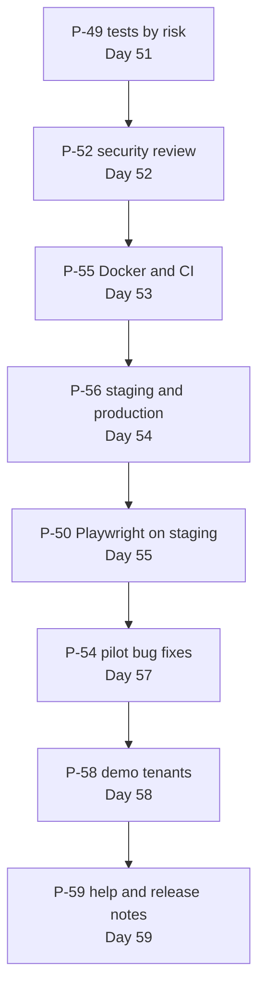

# Prompts: Quality, Security and DevOps

**In simple words:** This chapter holds the last twelve ready-to-paste Claude Code prompts, P-49 to P-60. They add no new module. They prove that the modules work (tests), that they are safe and fast (security and performance reviews), that every change reaches customers the same careful way (Docker, CI/CD, staging, production, later AWS), and that people can buy, learn and use EduFlow (demo data, help articles, Hindi UI). Eight of them run in Weeks 8 and 9 of the sprint, when five pilot institutes already depend on you.

## What these twelve prompts build

Before P-49, EduFlow works on your laptop and on one hand-made hosted environment. After P-59, every pull request is tested by a machine, every merge reaches staging by itself, production changes only when you push a version tag, an error reaches your phone within minutes, a backup lands in S3 every night, and one command gives you two fresh demo institutes for a sales call.

Four prompts run after the sprint. P-51 (refactor) and P-53 (performance) belong to Phase 2, before V1.0. P-60 (Hindi UI and locale packs) and P-57 (AWS) belong to Phase 4. They sit here because they use the same tools: the test suite, the pipeline and the review habit.

| ID | Prompt | Reads these docs | Builds | Typical time |
|---|---|---|---|---|
| P-49 | Write unit and integration tests for a module (Vitest, Supertest) | `65-testing-and-quality-assurance.md`, module PRD file | Gap table, missing unit, API and isolation tests | 1 day, Day 51 (three runs) |
| P-50 | End-to-end tests for critical flows (Playwright) | `65-testing-and-quality-assurance.md`, `02-users-roles-and-key-journeys.md` | Flows E2E-02 to E2E-07, staging OTP rule, e2e job | 1 day, Day 55 |
| P-51 | Refactor a module safely | `docs/tech-debt.md`, module PRD file | Smaller files, one home per rule, same behaviour | 1 day, Day 90 (Sat 2 Jan 2027) |
| P-52 | Security review of a module (OWASP, tenant isolation) | `60-security-architecture.md`, `05-multi-tenancy-and-data-isolation.md` | Findings table per area, fixes with tests | 1 day, Day 52 (four runs) |
| P-53 | Performance review: slow queries, indexes, N+1, caching | `64-non-functional-requirements.md`, `50-database-design-overview.md` | Diagnosis table, indexes, query-count tests, cache | 2 days, Days 117 and 118 |
| P-54 | Debug a production error from Sentry or logs | Module PRD file, `92-appendix-error-codes.md` | Regression test, smallest fix, data-fix script | 1 to 3 hours per cause, Day 57 |
| P-55 | Dockerfiles and GitHub Actions CI/CD pipeline | `04-system-architecture.md`, workspace `package.json` files | `server/Dockerfile`, `.dockerignore`, `ci.yml` | 1 day, Day 53 |
| P-56 | Deploy to Railway and Vercel (staging and production) | `04-system-architecture.md`, `62-audit-logs-backups-and-disaster-recovery.md` | Staging, two deploy workflows, Sentry, backups | 1 day, Day 54 |
| P-57 | Migrate to AWS (ECS Fargate, RDS, ElastiCache, S3, CloudFront) with Terraform | `04-system-architecture.md`, `64-non-functional-requirements.md` | `infra/terraform/` for staging, OIDC deploy, cutover runbook | 1 week, 15 to 22 Sep 2027 |
| P-58 | Seed realistic demo data for sales demos | `docs/canon.md` section 4, your demo record list | Two `demo-` tenants, `npm run demo:reset` | 1 day, Day 58 |
| P-59 | Generate API docs, help-centre articles and release notes | `91-appendix-screen-inventory.md`, OpenAPI setup | Ten `/help` articles, private API file, release notes | 1 day, Day 59 |
| P-60 | Internationalization: Hindi and English UI, currency, timezone and locale packs | `63-internationalization-and-localization.md`, `01-platform.prisma` | Hindi UI, shared formatters, four country packs | 2 weeks, Aug and Sep 2027 |

The day-by-day context, including the short "scope for today" ending you add under each prompt, is in *Daily Plan: Days 43 to 60* and *After Day 60: The Road to V2.0*. The six-part prompt anatomy is explained in *Working with Claude Code*. The complete Docker and workflow files to compare against are in *Docker and CI/CD*.

## The order and why

**Figure: Order of the eight sprint prompts (Days 51 to 59)**



Read each arrow as "must exist before". A security fix needs a test that proves it, so P-49 comes first. CI must refuse red code before a pipeline deploys anything, so P-55 comes before P-56. Playwright runs against staging, so P-50 waits for P-56. P-54 is the exception: you use it from the first pilot bug on Day 45, and Day 57 is simply the day it gets the most hours.

## Rules this whole block repeats

| Rule | Why it matters here |
|---|---|
| Review prompts end with a table, not with code | You decide what to fix. A reviewer that fixes its own findings marks its own homework. |
| Tests are never weakened, skipped or deleted to get green | A green suite that lies is worse than no suite |
| Claude never touches production: no production URL, data or live key | Pilot data is children's data under the DPDP Act. You paste masked evidence only. |
| No invented CLI flag or GitHub Action. Unsure means a dashboard checklist line. | A guessed flag fails at 11 p.m. in the middle of a deploy |
| Final commands are yours: `terraform apply`, `COMMIT` of a data fix, the version tag | These are the moments where your judgement is the product |
| Demo and test data use canon names only | A real student's name in a test file is a data leak with a long life |

## P-49 — Write unit and integration tests for a module (Vitest, Supertest)

### When to use

Day 51 (Tue 24 Nov 2026), once per area in the order isolation, auth, fees, payments. After the sprint, run it as the closing step of every Phase 2 module (P-33 to P-42).

### Before you start

The module is merged and its happy path works in the browser. Docker is running with the `eduflow_test` database. `server/.env.test`, `server/vitest.config.ts`, the global setup and the helpers (`createTenant()`, `createUser()`, `uniqueTag()`, `api()`, `authHeader()`) exist as described in *Testing Strategy for a Solo Founder*. Start a fresh session on the branch `test/risk-suite`, and run the isolation-matrix opener from Day 51 first.

### The prompt

**Script: P-49 (paste into Claude Code)**

```text
CONTEXT TO READ
- CLAUDE.md, and docs/canon.md section "API conventions"
- docs/prd/65-testing-and-quality-assurance.md: test levels, the
  three-test minimum, isolation rules
- docs/prd/25-fees-module.md: Business Rules, Acceptance Criteria,
  Edge Cases, Test Scenarios
- docs/api/03-finance-portals-comms.md: FEE-API-01 to FEE-API-46
  with their permission keys
- server/vitest.config.ts and server/src/test/: global-setup.ts,
  setup.ts, test-app.ts, factories.ts, tenant-isolation.test.ts
- Existing tests: server/src/modules/fees/**/*.test.ts

TASK
Close the test gaps of the Fees module.
Step 1, no code: print a gap table, one row per endpoint ID, with
the columns happy path, wrong role 403, other tenant 404, invalid
body 400 (POST, PUT and PATCH only). Each cell names the file and
test, or says MISSING. Wait for my OK.
Step 2: write the missing tests, plus these AREA CASES:
- Rs 10,000 in 3 installments gives 3333.33, 3333.33 and 3333.34.
- Late fee Rs 50 per day with a cap of Rs 500: 30 days late = 500.00.
- Order of maths: gross, minus discount, plus late fee, minus paid.
- FEE-API-27 on an ISSUED invoice gives 422 BUSINESS_RULE_VIOLATION.
- A PAID invoice keeps its total when its structure changes later.
- Two parallel FEE-API-28 calls give two invoice numbers with no gap
  and no duplicate.
- Every fees model has a row in CASES of tenant-isolation.test.ts.

CONSTRAINTS
- Follow CLAUDE.md. Change test files and factories only. If a test
  shows a real bug, stop, show me the red test and do not fix it.
- Real PostgreSQL and Redis. Never mock lib/prisma.ts, the tenant
  context or the service under test. Provider wrappers stay mocked
  as in src/test/setup.ts.
- Tests connect as eduflow_app, never as the owner role.
- Every test creates its own tenants with createTenant() and
  uniqueTag(). No shared rows, no order dependence between tests.
- Money: compare exact strings, expect(total).toBe('32400.00').
  Never toBeCloseTo, Number() or parseFloat on money.
- Error tests assert the status, error.code and a requestId.
- No it.skip, it.todo, expect(true), or snapshots of whole bodies.

FILES TO CREATE OR CHANGE
- server/src/modules/fees/late-fee.test.ts (new or change)
- server/src/modules/fees/proration.test.ts (new or change)
- server/src/lib/money.test.ts (change)
- server/src/modules/fees/fees.test.ts (change)
- server/src/modules/fees/fees.isolation.test.ts (change)
- server/src/test/tenant-isolation.test.ts (change) - CASES rows only
- server/src/test/factories.ts (change) - new factory functions only
Do not touch any other file without asking.

ACCEPTANCE CHECKS
- [ ] The gap table has no MISSING cell.
- [ ] cd server && npx vitest run fees passes three times in a row.
- [ ] npm run test:coverage -w server keeps modules/fees at 90
      percent lines and 85 percent branches.
- [ ] Break-it proof: remove the DRAFT-only guard of FEE-API-27 on
      purpose, show the red test, then restore the code.
- [ ] The full server suite stays under 5 minutes.
- [ ] npm run lint and npm run typecheck pass.

WHAT TO REPORT BACK
1. The gap table before and after.
2. Files changed, one line each, with the number of new tests.
3. Commands run, the real summary lines and the fees coverage.
4. Every real bug found: test name, expected and actual value.
5. PRD cases you could not test, and why.
```

### Follow-up prompts

**Script: P-49 follow-up 1 (auth area)**

```text
Run P-49 again for auth. Replace the module lines of CONTEXT with
docs/prd/06-authentication-and-sessions.md and AUTH-API-01 to
AUTH-API-18 in docs/api/01-platform-people.md. AREA CASES:
- AUTH-API-05 rotates the refresh token. Reusing the old token
  revokes the whole family (REUSE_DETECTED): logged out everywhere.
- The 6th wrong login for one account and IP within 15 minutes
  gives 429 RATE_LIMITED.
- An OTP fails after its expiry and after the attempt limit.
- A password reset token works once. The second use fails.
- An expired invitation cannot be accepted (AUTH-API-10).
- One changed character in the access token gives 401
  UNAUTHENTICATED. An expired token gives 401 TOKEN_EXPIRED.
Same constraints. Files under server/src/modules/auth/ only.
```

**Script: P-49 follow-up 2 (payments area)**

```text
Run P-49 again for payments with docs/prd/26-payments-module.md and
PAY-API-01 to PAY-API-46. AREA CASES:
- PAY-API-02 twice with one Idempotency-Key: one Payment, one
  Receipt, the same response body both times.
- Two parallel PAY-API-02 calls on one Rs 12,000 invoice: amountPaid
  never exceeds total; extra money stays as unallocated advance.
- The same Razorpay event sent three times to PAY-API-38: one Payment.
- The webhook arrives before PAY-API-15: verify returns the existing
  payment and receipt.
- A SUBMITTED day close blocks PAY-API-04 with 422.
- Receipt numbers are consecutive within their series.
Same constraints. Files under server/src/modules/payments/ only.
```

**Script: P-49 follow-up 3 (a test found a bug)**

```text
Test "<name>" is red because it found a real bug. Fix the code, not
the test: the smallest change in the service or repository. Show
the test red before and green after, then run the module tests.
Add one line to docs/testing/regression.md: bug ID, what went
wrong, the test that now guards it.
```

### Review checklist

1. Read the gap table yourself. Pick three rows at random and open the named tests. They must exist and must test what the row claims.
2. Open three money tests. Every assertion compares an exact string such as `'3333.34'`, never a rounded number.
3. Run `grep -rnE 'it\.skip|it\.todo|expect\(true\)|toBeCloseTo' server/src`. No hits.
4. Run `git diff --stat main`. Only test files, `factories.ts` and CASES rows changed. A changed service file means Claude fixed code without asking.
5. Break it yourself on a throwaway branch: make one fees repository read go through `runAsPlatform()`. At least one isolation test must turn red.
6. Switch off Wi-Fi and run `npm run test`. Everything still passes, because no test may call the internet.
7. Run the suite three times. The same tests pass every time.
8. Open the coverage report for `modules/fees`. Every red line in an error path that can cost money gets one more case.

### Common mistakes Claude makes here and how to correct them

| Mistake | Fix prompt |
|---|---|
| Mocks Prisma or the service it tests | "Remove the mock of lib/prisma in this file. Call the real route with Supertest against eduflow_test. Show the test failing when I break the service." |
| Checks only the status code | "Every happy-path test also asserts the money fields and the saved database row. Add those assertions." |
| Changes a service to make a test pass | "Revert every change outside test files. If the code is wrong, show me the red test and stop." |
| One shared organization, so tests fail in random order | "Each test creates its own tenant with createTenant() and uniqueTag(). Remove the shared beforeAll rows." |

## P-50 — End-to-end tests for critical flows (Playwright)

### When to use

Day 55 (Sat 28 Nov 2026), right after the pipeline from P-56 has deployed staging once. It builds the six flows that *Daily Plan: Days 43 to 60* names, which are E2E-02 to E2E-07 in *Testing Strategy for a Solo Founder*. E2E-01 (signup) and E2E-08 (parent sees the receipt) follow after Day 60 with the same prompt.

### Before you start

P-56 is merged and staging deploys itself from `main`. Staging holds the demo organizations of the seed, a Razorpay test gateway account for the demo organization, and `OTP_TEST_NUMBERS` and `OTP_TEST_CODE` values. The main action buttons carry the `data-testid` attributes from Day 47. The GitHub environment `staging` holds the secrets `E2E_STAFF_PASSWORD` and `E2E_RAZORPAY_WEBHOOK_SECRET` (the webhook secret of the demo organization's test gateway account). Work on the branch `test/e2e-critical-flows`.

### The prompt

**Script: P-50 (paste into Claude Code)**

```text
CONTEXT TO READ
- CLAUDE.md, docs/prd/65-testing-and-quality-assurance.md: E2E flows
- docs/prd/02-users-roles-and-key-journeys.md: accountant, teacher
  and parent journeys
- docs/prd/06-authentication-and-sessions.md: OTP login rules
- docs/api/: AUTH-API-01 to 03, STU-API-02, ATT-API-02 and 04,
  FEE-API-37 and 28, PAY-API-02, PP-API-13, 16 and 17, PAY-API-38
- client/playwright.config.ts and client/e2e/fixtures.ts
- server/src/config/env.ts: OTP_TEST_NUMBERS, OTP_TEST_CODE

TASK
Write six Playwright flows that run against staging, one spec file
each: E2E-02 login and RBAC (the accountant sees Fees, the teacher
gets the no-access screen on /fees/collect), E2E-03 admit a
student, E2E-04 mark attendance for a batch, E2E-05 generate and
issue invoices, E2E-06 collect Rs 12,000 cash with a receipt PDF,
E2E-07 parent pays online.
In E2E-07 the parent logs in by OTP in the phone project, opens the
dues (PP-API-13) and creates the order (PP-API-16). The test then
posts a signed payment.captured event to PAY-API-38 and waits until
the portal shows the invoice as Paid.
Add a job to .github/workflows/deploy-staging.yml that runs the six
flows after the staging deploy has finished.

CONSTRAINTS
- Base URLs come from E2E_BASE_URL and E2E_API_URL. The config
  throws for any production host (under eduflow.app but not under
  staging.eduflow.app).
- Staff passwords come from E2E_STAFF_PASSWORD. None in a file.
- Each test seeds its own student and invoice through the API with
  a unique suffix. No test depends on another test.
- Main action buttons by data-testid; everything else by role and
  label. Never by CSS class or position.
- No waitForTimeout. Wait for a visible end state.
- Staff log in through the UI once in a setup project. The flows
  reuse the saved storage state.
- The fixed OTP works only when APP_ENV is not production and the
  phone is in OTP_TEST_NUMBERS. If this rule is missing, build it in
  the OTP verify service with a server test proving production
  refuses it.
- The webhook signature is HMAC SHA256 of the raw body with
  E2E_RAZORPAY_WEBHOOK_SECRET, in the X-Razorpay-Signature header.
- The CI job waits until GET /api/v1/health on staging reports the
  new commit SHA as version. It uploads the HTML report and traces
  only when a test fails. No third-party actions.

FILES TO CREATE OR CHANGE
- client/playwright.config.ts (change) - setup project, host guard
- client/e2e/auth.setup.ts (new), fixtures.ts (change) - env secrets
- client/e2e/login-rbac.spec.ts, admit-student.spec.ts,
  mark-attendance.spec.ts, generate-invoices.spec.ts,
  collect-fee.spec.ts, parent-pay-online.spec.ts (new)
- server/src/modules/auth/ (change only if the OTP rule is missing)
- .github/workflows/deploy-staging.yml (change) - the e2e job
- .gitignore (change) - storage state file, test-results/
Do not touch any other file without asking.

ACCEPTANCE CHECKS
- [ ] E2E_BASE_URL=https://staging.eduflow.app npx playwright test
      passes 6 of 6, twice in a row, in under 8 minutes.
- [ ] Changing the label of the Collect button does not break E2E-06.
- [ ] A broken PAY-API-02 on staging makes E2E-06 fail with a trace.
- [ ] The server test "production refuses the fixed OTP" passes.

WHAT TO REPORT BACK
1. Files created or changed, one line each.
2. The run summary and the time of each flow.
3. Every data-testid you had to add, with the file.
4. Anything flaky you saw, and its cause.
```

### Follow-up prompts

**Script: P-50 follow-up 1 (a flaky flow)**

```text
E2E-04 failed once in five runs. Open the trace of the failed run in
test-results/. Tell me the step, what the screen showed and what the
test expected. Fix the cause (a missing wait on a visible result,
or shared data), never with a retry count or a sleep.
```

**Script: P-50 follow-up 2 (E2E-08 after Day 60)**

```text
Add E2E-08: Sunita Devi logs in by OTP on the phone project, sees
only her own child, opens the latest receipt (PP-API-19) and the PDF
link answers 200. Then the test calls PP-API-19 with a receipt id of
another family and expects 404. Same rules as the other flows.
```

### Review checklist

1. Open each spec. It asserts an end state a customer cares about: the invoice row says Paid, the receipt is a PDF, the attendance count is right.
2. Search `client/e2e` for `waitForTimeout`, `.locator('.` and `nth(`. No hits.
3. Search the repo for the staff password and for the staging OTP code. Only GitHub secrets and the staging dashboard hold them.
4. Run with `E2E_BASE_URL=https://app.eduflow.app`. The config refuses before the browser opens.
5. On production, try the fixed OTP with your test phone. Refused.
6. Open the artifact of a failed CI run and run `npx playwright show-trace` on it. You can see every click.
7. Check the job order in the Actions tab: e2e ran after the deploy job, and only after the health version matched the commit.

### Common mistakes Claude makes here and how to correct them

| Mistake | Fix prompt |
|---|---|
| Fixed sleeps between steps | "Replace every waitForTimeout with an expect on the visible end state. Playwright waits by itself." |
| Drives the real Razorpay Checkout window and fails at random | "Stop at order created (PP-API-16). Confirm with a signed payment.captured event to PAY-API-38, then assert Paid." |
| Flows reuse yesterday's student | "Each spec seeds its own student and invoice through the API with a unique suffix before the browser starts." |
| The fixed OTP works in every environment | "Accept OTP_TEST_CODE only when APP_ENV is not production and the phone is in OTP_TEST_NUMBERS. Add the server test." |

## P-51 — Refactor a module safely

### When to use

Day 90 (Sat 2 Jan 2027), in Week 14, on the module that hurt most during the pilot. Usually that is Fees or the student import. Run it again whenever `docs/tech-debt.md` lists a file over 300 lines or money logic that lives in two places.

### Before you start

`main` is green in CI. The module's coverage meets its target from *Testing Strategy for a Solo Founder*; if not, run P-49 on it first. No other open branch changes the same module. The debt entries are written in `docs/tech-debt.md`. Pick a quiet day, not the days right after a fee due date when counters are busiest. Work on the branch `refactor/fees-services`.

### The prompt

**Script: P-51 (paste into Claude Code)**

```text
CONTEXT TO READ
- CLAUDE.md: folder map, size rules (files under 300 lines,
  functions under 50), layer rules (routes, controller, service,
  repository)
- docs/tech-debt.md: the entries for the fees module
- docs/prd/25-fees-module.md: Business Rules (behaviour to keep)
- server/src/modules/fees/ and all its tests
- The coverage report from npm run test:coverage -w server

TASK
Refactor the Fees module without changing its behaviour. Targets:
- Files over 300 lines and functions over 50 lines.
- Invoice total and balance recomputed in more than one place.
  Replace them with one function, recomputeInvoiceTotals(tx,
  invoiceId), in fee-invoices.service.ts.
- A controller that calls a repository, or a repository that makes
  a business decision.
- Release flags that have been on everywhere for 2 weeks or more.
- Every any type and every commented-out block.
Step 1, no code: list the module's tests with their count.
Step 2, no code: a move table with from, to and reason for each
change. Wait for my approval.
Step 3: one move per step. Run the module tests after each step and
stop for my commit.

CONSTRAINTS
- Same behaviour: same routes, status codes, response fields, error
  codes and database writes.
- No schema change, no migration, no new dependency.
- Exports that other modules import keep their names. If a path
  must change, leave a re-export in the old file.
- Tests change only in import paths. Never an assertion.
- If fees coverage is under 90 percent of lines, first add
  characterization tests (tests that pin down what the code does
  today) in their own step, before any move.
- One module only. Do not improve another module on the way.
- A bug you find is reported, not fixed, in this branch.

FILES TO CREATE OR CHANGE
- server/src/modules/fees/** (change; new files split by resource)
- server/src/modules/fees/*.test.ts (import paths only)
- docs/tech-debt.md (change) - mark the entries done
Do not touch any other file without asking.

ACCEPTANCE CHECKS
- [ ] The same test names pass before and after. The count is equal
      or higher.
- [ ] The OpenAPI document exported before and after is identical.
- [ ] Every file in modules/fees is under 300 lines.
- [ ] No fees file imports another module's repository.
- [ ] npm run check passes.

WHAT TO REPORT BACK
1. The move table with the status of each move.
2. Test count and fees coverage, before and after.
3. Line count of every fees file, before and after.
4. Anything that looked like a bug, with file and line.
```

### Follow-up prompts

**Script: P-51 follow-up 1 (characterization tests)**

```text
Before any move, write characterization tests for
fee-invoices.service.ts. Use 10 inputs from the demo seed: invoice
with a discount, with a late fee, with an adjustment, partly paid,
cancelled. Record today's output as exact strings. If an output
looks wrong, add a BUG comment on that test and ask me. No
production code changes in this step.
```

**Script: P-51 follow-up 2 (split the controller)**

```text
fees.controller.ts is now 420 lines. Split it by resource into
fee-heads, fee-structures and fee-invoices controllers. Keep one
fees.routes.ts that lists every URL of the module. Move code only.
Run the module tests and paste the summary.
```

### Review checklist

1. `git diff --stat main` shows only `server/src/modules/fees/` and `docs/tech-debt.md`.
2. `git diff main -- '*.test.ts'` shows import lines only. One changed `expect` line is a red flag.
3. Export the OpenAPI document on `main` and on the branch, then `diff` the two files. No output.
4. Run `wc -l server/src/modules/fees/*.ts | sort -n | tail -5`. Nothing above 300.
5. Search for `recomputeInvoiceTotals`. Every place that changes invoice money calls it, and no other file assigns `balance`.
6. On staging, take one test invoice through a partial payment, an adjustment and a receipt cancellation. The ledger (FEE-API-42) matches the same steps on the old version.

### Common mistakes Claude makes here and how to correct them

| Mistake | Fix prompt |
|---|---|
| Renames exports and breaks other modules | "Keep every exported name. Put re-exports in the old files and run the full suite." |
| Edits an assertion "because the shape changed" | "Behaviour must not change. Restore the assertion and change the code until the old test passes." |
| Rewrites the whole module in one step | "Restore the last commit. One move per step, tests after each, then stop and wait." |
| Fixes a bug found on the way | "Revert the fix. Write the bug in docs/tech-debt.md. It gets its own branch with a failing test." |

## P-52 — Security review of a module (OWASP, tenant isolation)

### When to use

Day 52 (Wed 25 Nov 2026), four runs: auth, fees, payments, Parent Portal. Run it again for every Phase 2 module before its release train, and before you sign the first Enterprise contract.

### Before you start

P-49 is done for the area, so every fix can come with a test. `docs/prd/60-security-architecture.md` and `docs/prd/61-privacy-and-compliance.md` are in the repo. Create the branch `fix/security-review` and the folder `docs/security/`. Start a fresh session for each area: the session that wrote the code is a weak reviewer of it. OWASP Top 10 is a public list of the ten most common web security mistakes, and the prompt uses its categories.

### The prompt

**Script: P-52 (paste into Claude Code)**

```text
REVIEW ONLY. Do not change code in this run.

CONTEXT TO READ
- CLAUDE.md (all 15 rules), docs/permissions.md
- docs/prd/60-security-architecture.md
- docs/prd/05-multi-tenancy-and-data-isolation.md
- docs/prd/06-authentication-and-sessions.md
- docs/prd/61-privacy-and-compliance.md
- server/src/middleware/, server/src/config/cors.ts, and in
  server/src/lib/: prisma.ts, tenant-context.ts, s3.ts, logger.ts
- AREA (keep one line, delete the others):
  auth           server/src/modules/auth/           AUTH-API-01 to 18
  fees           server/src/modules/fees/           FEE-API-01 to 46
  payments       server/src/modules/payments/       PAY-API-01 to 46
  parent portal  server/src/modules/parent-portal/  PP-API-01 to 32

TASK
Review the AREA as an attacker with a valid login in another
tenant, or with a parent login in the same tenant. Check:
1. Access control: every route has authenticate and the registry
   permission key. Every :id and :studentId is checked for tenant,
   campus and ownership (parents through StudentGuardian). IDOR.
2. Tenant source: orgId only from the JWT. X-Organization-Id only
   for SUPER_ADMIN. Raw SQL filters organization_id. RLS is set.
3. Mass assignment: can a body set organizationId, role, status,
   amountPaid, balance, total or createdById? Zod must strip or
   reject them.
4. Injection: $queryRawUnsafe, string-built SQL, unescaped HTML in
   PDF templates.
5. Auth: OTP expiry, attempts and rate limits, refresh token reuse,
   bcrypt, tokens and OTPs stored hashed.
6. Money integrity: amounts computed on the server, Idempotency-Key,
   webhook signature checked on the raw body, one transaction.
7. Configuration: CORS origins, security headers, cookie flags,
   stack traces in errors, /api/v1/docs off in production.
8. Data exposure: no password hashes or secrets in responses; no
   OTP, token or full phone number in logs; pre-signed URLs short
   and checked against the owning record.
9. Components: run npm audit --omit=dev, list high and critical.
10. SSRF: any server call to a URL that a user can set.

OUTPUT
A table sorted by severity: ID (SEC-<AREA>-01), file:line, what an
attacker can do in one sentence, OWASP category, severity, smallest
fix, the test that will prove the fix.
Severity: High = another tenant's or another family's data, wrong
money, or login as someone else. Medium = needs an unlikely
condition. Low = hardening.
Then "checked and clean": evidence for each of the 10 points.
No praise, no summary.
Append both to docs/security/review-2026-11.md under a heading with
the AREA name. That is the only file you may write.

WHAT TO REPORT BACK
1. The count of High, Medium and Low findings.
2. Routes you could not trace, and why.
3. The commands you ran and their output lines.
```

### Follow-up prompts

**Script: P-52 follow-up 1 (fix one High finding)**

```text
Fix SEC-PP-01 only. Step 1: write the test that performs the attack
and show it red. Step 2: the smallest fix. Step 3: run the area
tests and tenant-isolation.test.ts. Set SEC-PP-01 to FIXED in
docs/security/review-2026-11.md, with the test name.
```

**Script: P-52 follow-up 2 (mass assignment tests)**

```text
For every POST, PUT and PATCH route of the AREA add one test that
sends organizationId of another tenant, role, status, amountPaid and
balance in the body. Expect 400 VALIDATION_ERROR, or the fields
ignored and the saved row unchanged. Never a changed tenant or
amount.
```

**Script: P-52 follow-up 3 (secrets in Git history)**

```text
Search the whole Git history, not only the current files, for
rzp_live_, rzp_test_, sk_live_, AKIA, BEGIN PRIVATE KEY and long
random strings next to SECRET or TOKEN. Use git log -p. Report the
commit and file of each hit. Do not rewrite history. I rotate keys.
```

### Review checklist

1. `git status` after each run shows only `docs/security/review-2026-11.md`. Any other changed file means the review started fixing.
2. Compare the "checked and clean" list with the registry block of the area. Every route that takes an ID is either in the table or in the clean list.
3. On staging, as a parent, replace the student ID in a Parent Portal call (PP-API-05) with the ID of another family's child. Expect `404`.
4. As Suresh Gupta, send `"organizationId"` of Sharma Classes in a `POST /api/v1/fee-heads` body. The row stays in his tenant, or the answer is `400`.
5. Run `curl -sI https://api.staging.eduflow.app/api/v1/health` and the same with `-H "Origin: https://evil.example"`. Security headers are present, and no allow-origin header names the evil site.
6. Search one hour of staging logs for `otp`, `Bearer` and 10-digit phone numbers. No hits.
7. Before the merge, every High finding says FIXED with a test name, and every Medium has a date before Day 60.

### Common mistakes Claude makes here and how to correct them

| Mistake | Fix prompt |
|---|---|
| Starts fixing during the review | "REVIEW ONLY. Revert the code changes. Findings table first. I choose what gets fixed." |
| Generic OWASP advice without file and line | "Delete every finding without file:line and a concrete attack sentence. Trace the routes instead." |
| Calls tenant scope clean because the Prisma extension exists | "For each repository function show how organizationId reaches the query, including raw SQL, runAsPlatform() and transactions." |
| Rates a cross-family portal read as Medium | "Reading another family's child is High by our rule. Re-rate it and sort the table again." |

## P-53 — Performance review: slow queries, indexes, N+1, caching

### When to use

Week 18, Fri 29 and Sat 30 Jan 2027 (Days 117 and 118), just before V1.0. Run it again before V1.5 in June 2027, and any time a pilot screen takes more than 3 seconds with real data.

### Before you start

You need numbers, not feelings. Take the 10 slowest endpoints of the last 7 days from the Pino request logs in your log tool: p95 (the time within which 95 of 100 requests finish) and calls per day. Load the P-58 demo data into your local database and scale it with follow-up 1, so local tables are as big as production will be in a year. Keep the k6 script from *Testing Strategy for a Solo Founder* ready. Work on the branch `perf/v1-review`. An N+1 query means one query for a list plus one more query for every row.

### The prompt

**Script: P-53 (paste into Claude Code)**

```text
CONTEXT TO READ
- CLAUDE.md rules 9 and 10 (lists, N+1, indexes, soft delete)
- docs/prd/64-non-functional-requirements.md: response time targets
- docs/prd/50-database-design-overview.md: index rules
- docs/schema/*.prisma: the @@index lines of the models involved
- The code path of each endpoint in the INPUT table

INPUT (example numbers; I replace them with my ten rows)
ID           Path                          p95 ms   calls/day
FEE-API-44   GET /fee-reports/defaulters     6200         140
STU-API-01   GET /students?q=...             2100        5400
FEE-API-24   GET /fee-invoices               1800        2300
PAY-API-44   GET /payment-reports/day-book   1500         300
DASH-API-01  GET /dashboard/summary          1300        9800

TASK
Step 1, no code. For each endpoint:
a) count the SQL queries of one request with 20 rows and with 100
   rows, with a test helper that counts Prisma query events;
b) run EXPLAIN (ANALYZE, BUFFERS) on the slowest query against the
   local database;
c) name the cause: missing index that starts with organization_id,
   N+1, no pagination, too many columns, count on a big join, live
   maths that DailyMetricSnapshot already holds, or no cache;
d) propose the fix and the expected p95.
Print one table and wait for my approval.
Step 2: fix in the order I approve, one endpoint per step.

CONSTRAINTS
- Correctness first: same response, same tenant and campus scope.
- A new index is a schema change. Add the @@index in docs/schema
  and in server/prisma/schema in the same step, then run
  npx prisma migrate dev --name add_<table>_<columns>_index.
  Every index starts with organizationId.
- Cache only read endpoints that I approve, in Redis, with keys
  org:<organizationId>:campus:<campusId or all>:<name> and a TTL of
  at most 300 seconds. Delete the key on the events that change the
  data. Never cache permission results in this prompt.
- No new library. Raw SQL only when Prisma cannot express the query,
  and then with organization_id in the WHERE clause.
- Query counts become tests: a list of 100 rows uses the same number
  of queries as a list of 20.

FILES TO CREATE OR CHANGE
- server/src/modules/<module>/*.repository.ts and *.service.ts
  (change)
- docs/schema/<file>.prisma and server/prisma/schema/<file>.prisma
  (change, approved indexes only) and the new migration folder
- server/src/test/query-counter.ts (new), one query-count test per
  endpoint in its module
Do not touch any other file without asking.

ACCEPTANCE CHECKS
- [ ] Each fixed endpoint meets the p95 target of docs/prd/64 on the
      local scaled data, measured over 20 requests.
- [ ] EXPLAIN uses the new index: no Seq Scan on a table above
      10,000 rows.
- [ ] Query-count tests pass and stay flat from 20 to 100 rows.
- [ ] diff -r -x migrations docs/schema server/prisma/schema prints
      nothing.
- [ ] npm run check passes.

WHAT TO REPORT BACK
1. The diagnosis table, then p95 before and after per endpoint.
2. Every index added, with its migration name.
3. Every cache key, its TTL and the events that clear it.
```

### Follow-up prompts

**Script: P-53 follow-up 1 (scale the local data)**

```text
Write server/scripts/perf/scale-demo.ts. It copies the tenant
demo-sharma-classes into 20 extra local tenants with createMany in
chunks of 1,000, so the local database holds about 9,000 students
and 500,000 attendance records. It refuses to run unless
APP_ENV=local. Print the row counts and the seconds taken.
```

**Script: P-53 follow-up 2 (one N+1)**

```text
FEE-API-24 makes 1 + N queries: one per invoice for the student
name. Write the query-count test first and show it red. Then load
the students with one include or one findMany with an in filter.
Show the test green and the new p95.
```

### Review checklist

1. Read the diagnosis table before you approve it. Each cause is backed by a query count or an EXPLAIN line, not a guess.
2. Every new `@@index` starts with `organizationId` and appears in both schema folders.
3. Open the migration SQL. It holds `CREATE INDEX` lines only: no `DROP`, no table change. Tables are still small in January 2027 (Estimate: under a few million rows), so a normal index build in the deploy window is fine.
4. Repeat one EXPLAIN yourself in `psql` as `eduflow_app`. Run `SET app.current_org = '<demo organization id>';` first, or Row-Level Security hides every row and the plan means nothing.
5. Log in to two demo tenants one after the other and open the cached dashboard. Each sees only its own numbers.
6. Collect a fee, then reload the dashboard at once. The collected amount changes without waiting for the TTL.
7. Run the k6 script again. p95 stays under 500 ms and errors under 1%.

### Common mistakes Claude makes here and how to correct them

| Mistake | Fix prompt |
|---|---|
| Index without `organizationId` in front | "Every index on a tenant table starts with organizationId. Change the index and the migration." |
| Cache key without tenant or campus | "Rebuild every key as org:<organizationId>:campus:<campusId or all>:<name>. Add a test: two tenants, same endpoint, different numbers." |
| Drops the tenant filter from raw SQL for speed | "Restore organization_id in the WHERE clause. Speed never removes a tenant filter." |
| Adds an index for every filter column | "Keep only indexes backed by an EXPLAIN in the table. Every index slows every write." |

## P-54 — Debug a production error from Sentry or logs

### When to use

From Day 45 for every Leak and P1 bug a pilot reports, and during Day 57 (Mon 30 Nov 2026), when you fix the top pilot problems once per root cause. On Day 60 use it only for a P1. The bug levels (Leak, P1, P2, P3) are defined in *Testing Strategy for a Solo Founder*.

### Before you start

The bug has an ID and a level in your bug log. You have the Sentry issue or at most 30 log lines with the `requestId`, and the release version (`APP_VERSION`) from Sentry. Mask every name, phone number and admission number before you paste. Staging is healthy. A Leak also starts the incident process in *Monitoring, Backups and Incident Response*. A data fix is run by you, after a fresh backup, never by Claude.

### The prompt

**Script: P-54 (paste into Claude Code)**

```text
PRODUCTION BUG. You never connect to production. I paste evidence.

CONTEXT TO READ
- CLAUDE.md: freeze, pilot and money rules
- docs/prd/<module file>.md: Business Rules and Edge Cases
- docs/prd/92-appendix-error-codes.md
- docs/testing/regression.md
- The code path in the stack trace below

INPUT
Bug ID and level: BUG-021, P1
Reported by: ACCOUNTANT of a coaching institute
Release: v0.6.2 (APP_VERSION in Sentry)
Where: finance worker, nightly late-fee job, 30 Nov 2026 00:30 IST
Expected: no late fee on a PAID invoice. Actual: Rs 200 added.
Sentry title and stack trace (max 30 lines, names masked):
  <paste>
Log lines for this job or requestId (max 30 lines):
  <paste>

TASK
Step 1, no code: the three most likely causes, in order, each with
the log line or read-only query that would confirm it. Wait.
Step 2: a failing test at the lowest level that shows the bug,
named after the effect. Show it red.
Step 3: the smallest fix. Show the test green, then run the module
tests and tenant-isolation.test.ts.
Step 4: does bad data exist because of this bug? If yes, write
server/scripts/data-fixes/BUG-021-<slug>.sql: BEGIN, a SELECT that
counts the rows to change, the change scoped by organization_id and
ids, the same SELECT again, and no COMMIT. I type COMMIT or
ROLLBACK. Money is corrected by the service rules: reverse the wrong
rows and recompute totals, never edit a cached total alone.
Step 5: list other code paths that call the same function.
Step 6: one line for docs/testing/regression.md.

CONSTRAINTS
- Smallest fix. No refactor, no schema change, no new dependency.
- Never ask for real names, phone numbers or a production dump.
- The fix ships through a pull request, CI, staging and the six
  Playwright flows. You never deploy.
- If the evidence is not enough, name the data you need. Do not
  guess a cause and fix it.

FILES TO CREATE OR CHANGE
- The one or two source files of the cause (change)
- The matching test file (change) - the regression test
- server/scripts/data-fixes/BUG-021-<slug>.sql (new, only if needed)
- docs/testing/regression.md (change) - one line
Do not touch any other file without asking.

ACCEPTANCE CHECKS
- [ ] The regression test fails on main and passes on this branch.
- [ ] npm run check passes.
- [ ] The data-fix script counts rows before and after the change
      and has no COMMIT line.

WHAT TO REPORT BACK
1. The root cause in three plain sentences for my pilot message.
2. Files changed and the regression test name.
3. Affected tenants and rows, if the evidence shows them.
4. Other places at risk, from step 5.
```

### Follow-up prompts

**Script: P-54 follow-up 1 (message to the institute)**

```text
Write my message to the institute in simple English, five lines:
what went wrong, who was affected, what we fixed, what they must do
(if anything), and a short apology. No technical words. Then the
same message in Hinglish, written in Latin script.
```

**Script: P-54 follow-up 2 (catch it earlier next time)**

```text
This bug was silent for 3 days. Propose one guard that would have
caught it on day one: a warn-level log line, a Sentry message, or a
nightly check query in the finance worker. One guard only, with a
test. Do not change the fix itself.
```

### Review checklist

1. Copy only the new test onto `main` and run it: red. Back on the branch: green. A test that passes on `main` tests the wrong thing.
2. The diff touches one or two source files. More means a refactor slipped in.
3. Read the data-fix script line by line. Every `UPDATE` has `organization_id = '...'` and an ID list in its `WHERE`. The count runs before and after. There is no `COMMIT`.
4. Take a fresh backup, run the script in `psql` on production, compare the count with the number Claude predicted, then type `COMMIT`. Any surprise means `ROLLBACK`.
5. Repeat the reporter's steps on staging, and after promotion on production with your own test organization.
6. Message the reporter. The bug is closed when they confirm, not when CI is green.

> **Founder note:** "Pehle sabut, phir ilaaj." Evidence first, then the cure. A fix without a red test is a guess that happens to compile.

### Common mistakes Claude makes here and how to correct them

| Mistake | Fix prompt |
|---|---|
| Guesses a cause and changes several things | "Stop and revert. Give me three causes with the evidence that would confirm each. No code." |
| Fixes the symptom, for example clamps a negative balance to zero | "Find why the balance went negative. The clamp hides wrong money. Remove it and fix the cause." |
| Data fix edits cached totals directly | "Correct the data through the service: reverse the wrong rows and recompute totals, one transaction per invoice." |
| Data-fix script without a tenant filter | "Every statement filters by organization_id and an ID list. Add the count check before and after." |

## P-55 — Dockerfiles and GitHub Actions CI/CD pipeline

### When to use

Day 53 (Thu 26 Nov 2026). Run it again when the Node.js major version, the Prisma version or the workspace layout changes.

### Before you start

`npm run check` is green on `main`. Docker Desktop is running. The GitHub repo has Actions switched on. Copy `server/.env` to `server/.env.docker` with the database and Redis hosts changed to `host.docker.internal`, and keep it out of Git. *Docker and CI/CD* holds the complete reference files. Compare Claude's output with them line by line. Work on the branch `ci/docker-and-actions`.

### The prompt

**Script: P-55 (paste into Claude Code)**

```text
CONTEXT TO READ
- CLAUDE.md: stack and commands
- package.json (root), server/package.json (build, start,
  start:worker), shared/package.json, .nvmrc
- server/vitest.config.ts and server/src/test/global-setup.ts: how
  tests migrate and create the eduflow_app role
- server/prisma/schema/, and the prisma block in server/package.json
  or prisma.config.ts
- docs/prd/04-system-architecture.md: the API and worker processes

TASK
1. server/Dockerfile, multi-stage, built from the repo root with the
   root package-lock.json: a deps stage (npm ci), a build stage
   (build shared, prisma generate, build server) and a run stage on
   the Node 24 slim image. One image for API and worker: the default
   command starts the API, the worker runs node dist/jobs/worker.js.
2. .dockerignore at the repo root.
3. .github/workflows/ci.yml on pull_request and on push to main,
   with four jobs:
   check    npm ci, lint, typecheck, prisma validate
   test     postgres:16 and redis:7 services, npm run test:coverage
            -w server, upload server/coverage/
   build    npm run build, docker build of the server image, no push
   pr-title Conventional Commits check, pull requests only

CONSTRAINTS
- Run stage: NODE_ENV=production, a non-root user, openssl installed
  (the Prisma engine needs it), no .env file, no dev dependencies
  except the Prisma CLI, which P-56 needs for migrate deploy.
- The Prisma client is generated at build time, never at start.
- Tests in CI connect as eduflow_app. Only the global setup uses the
  owner URL. Every provider key is a dummy value.
- Actions: only actions/checkout@v4, actions/setup-node@v4 with the
  npm cache, and actions/upload-artifact@v4. No other action without
  my yes.
- pr-title reads the title through an env variable. Never write
  ${{ github.event.pull_request.title }} inside a run script.
- permissions: contents: read. A concurrency group cancels older
  runs of the same branch.
- The whole workflow finishes in under 10 minutes.
- No deploy jobs today. That is P-56.

FILES TO CREATE OR CHANGE
- server/Dockerfile (new)
- .dockerignore (new)
- .github/workflows/ci.yml (new, or extend the existing one)
- server/package.json (change only if the Prisma CLI must move to
  dependencies)
Do not touch any other file without asking.

ACCEPTANCE CHECKS
- [ ] docker build -f server/Dockerfile -t eduflow-api . succeeds.
- [ ] docker run --rm eduflow-api whoami does not print root.
- [ ] With --env-file server/.env.docker the container answers 200
      on /api/v1/health.
- [ ] A pull request runs all four jobs green in under 10 minutes.
- [ ] A pull request with one broken test turns red.
- [ ] The test job log shows the eduflow_app role in use.

WHAT TO REPORT BACK
1. The final files, with one line per step explaining it.
2. Image size, and build time cold and cached.
3. CI time per job on the first green run.
```

### Follow-up prompts

**Script: P-55 follow-up 1 (security workflow)**

```text
Add .github/workflows/security.yml, on pull_request and every Monday
at 03:00 UTC. Job 1 runs npm audit --omit=dev --audit-level=high.
Job 2 is GitHub's dependency review on pull requests, only if the
official action works for our repository plan: ask me before you
add it. Explain in one line what each job blocks.
```

**Script: P-55 follow-up 2 (the test job is slow)**

```text
The test job takes 9 minutes. Show the time of each step from the
last run. Propose at most three changes, for example a cache for the
Prisma engines or separate unit and integration steps. No change may
skip or shorten the isolation tests.
```

### Review checklist

1. Read the Dockerfile. It uses `npm ci`, runs `prisma generate` in the build stage, has a `USER` line before `CMD`, and never copies a `.env` file.
2. `docker run --rm eduflow-api whoami` prints a user that is not `root`.
3. `docker run --rm eduflow-api ls -a` shows no `.env`, no `docs`, no `client` and no test files.
4. `docker image ls eduflow-api` shows a few hundred MB, not GB.
5. Start the worker from the same image: `docker run --rm --env-file server/.env.docker eduflow-api node dist/jobs/worker.js`. It connects to Redis and waits for jobs.
6. In `ci.yml`, the pull request title reaches the script through `env:`, never through `${{ }}` inside `run:`. That closes a known script-injection hole.
7. Turn on branch protection for `main` with the four checks required and "branch must be up to date". Open a pull request with a broken test: the merge button stays locked.

### Common mistakes Claude makes here and how to correct them

| Mistake | Fix prompt |
|---|---|
| Runs `prisma generate` or a migration when the container starts | "Generate the client in the build stage. Migrations run in the deploy workflow of P-56, never at container start." |
| CI tests connect as the owner, so RLS is silently skipped | "DATABASE_URL in the test job uses eduflow_app. Only the global setup uses the owner URL. Show me the log line." |
| Adds unknown third-party actions | "Remove every action except checkout, setup-node and upload-artifact. Write those steps as shell commands." |
| Copies the whole repo in one layer | "Copy the package files first for the layer cache, then shared/ and server/. Add docs, client, .git and .env files to .dockerignore." |

## P-56 — Deploy to Railway and Vercel (staging and production)

### When to use

Day 54 (Fri 27 Nov 2026). Rerun single steps when you add a service, such as a second worker, or change hosting settings.

### Before you start

P-55 is merged and branch protection is on. The environment you built by hand on Day 44 holds real pilot data and becomes production: do not recreate it. You need a Railway project with the environment `production`, a Vercel project for each environment, DNS for `eduflow.app`, two Sentry projects (server and client), an uptime and heartbeat monitor in Better Stack, and the private bucket `eduflow-prod-backups` with a 30-day expiry rule. Create the GitHub environments `staging` and `production` and type the secret values yourself. Claude only ever sees secret names. Work on the branch `ci/deploy-pipeline`.

### The prompt

**Script: P-56 (paste into Claude Code)**

```text
CONTEXT TO READ
- CLAUDE.md, docs/prd/04-system-architecture.md: hosting and deploys
- docs/prd/62-audit-logs-backups-and-disaster-recovery.md: backup
  schedule, retention and restore rules
- server/src/config/env.ts: APP_ENV, APP_VERSION, DATABASE_URL,
  DATABASE_ADMIN_URL, SENTRY_DSN, S3_BUCKET_BACKUPS
- .github/workflows/ci.yml and server/Dockerfile from P-55
- CMN-API-28 and CMN-API-29 in docs/api/04-operations-intelligence.md

FACTS
The Railway and Vercel setup made by hand on Day 44 holds real pilot
data. It becomes PRODUCTION. Do not recreate it. Do not move or copy
its data. Staging is new and empty: staging.eduflow.app and
api.staging.eduflow.app, Railway environment "staging".

TASK
1. docs/runbooks/staging-setup.md: a checklist for me to create
   staging by hand: PostgreSQL 16, Redis 7, api and worker services
   from server/Dockerfile, the client on Vercel, own secrets, the
   two database roles, the reference seed and the demo tenants.
2. deploy-staging.yml: runs when ci.yml succeeds on main. Migrate
   with DATABASE_ADMIN_URL, deploy api and worker, deploy the
   client, then wait until /api/v1/health/ready answers 200 and
   /api/v1/health reports the commit SHA as version.
3. deploy-production.yml: runs on a pushed tag v*.*.* in the GitHub
   environment "production". Check that the tagged commit is on main
   and passed CI, then migrate, deploy, the same health wait, and a
   smoke check of three read-only URLs.
4. Sentry in API, worker and client: environment = APP_ENV, release
   = APP_VERSION, sendDefaultPii off. beforeSend removes request
   bodies, cookies, Authorization headers and phone numbers. Our
   errorHandler stays the last middleware.
5. backup.yml: daily at 20:30 UTC (02:00 IST). pg_dump in custom
   format, run from the postgres:16 image so versions match. Upload
   to S3_BUCKET_BACKUPS as <date>/eduflow-prod.dump, then call the
   heartbeat URL stored in the secret BACKUP_HEARTBEAT_URL.

CONSTRAINTS
- Run railway --help and the Vercel CLI help in this session before
  you write a command. Use only flags you saw there. If a step is
  easier in a dashboard, make it a checklist line instead.
- Secrets live in GitHub environments and hosting dashboards only.
  Workflows use them by name. Never echo a secret.
- A failed migration stops the deploy. The old version keeps running.
- Migrations: prisma migrate deploy only. Never dev, never reset.
- No push to main ever deploys production.
- Actions: checkout, setup-node, upload-artifact only, unless I agree.

FILES TO CREATE OR CHANGE
- docs/runbooks/staging-setup.md (new)
- .github/workflows/deploy-staging.yml (new)
- .github/workflows/deploy-production.yml (new)
- .github/workflows/backup.yml (new)
- server/src/lib/sentry.ts (new), imported first in
  server/src/server.ts and server/src/jobs/worker.ts (change)
- client: the Sentry files the installed @sentry/nextjs documents
Do not touch any other file without asking.

ACCEPTANCE CHECKS
- [ ] A merge to main reaches staging with no manual step.
- [ ] A migration that fails on purpose stops the staging deploy.
- [ ] git tag v0.6.0 && git push origin v0.6.0 deploys production.
- [ ] A test error on staging shows in Sentry as environment
      staging, release = commit SHA, with no request body.
- [ ] Next morning a backup file for today is in the bucket.

WHAT TO REPORT BACK
1. Secret names each workflow needs, per GitHub environment.
2. The dashboard steps left for me, in order.
3. What each workflow does when one of its steps fails.
```

### Follow-up prompts

**Script: P-56 follow-up 1 (tenant subdomains and reserved slugs)**

```text
Turn on tenant subdomains. The client reads the slug from the host,
for example sharma-classes.eduflow.app, and loads the login page
data from AUTH-API-11. Add a reserved slug list in shared/: app,
api, www, staging, admin, help, status, docs, mail, demo. ORG-API-02
and ORG-API-03 refuse these, and any slug that starts with demo-,
with 400 VALIDATION_ERROR. Only the demo seed may create demo- slugs.
Tests for both endpoints.
```

**Script: P-56 follow-up 2 (rollback runbook)**

```text
Write docs/runbooks/rollback.md, at most 30 lines: how to put the
previous version back on Railway and on Vercel from their
dashboards, and the database rule: no down migrations; a bad
migration is fixed forward with a new migration. No CLI flag that
you have not seen in the help output.
```

### Review checklist

1. Merge a one-word text change to `main`. It appears on `staging.eduflow.app` with no manual step, and `/api/v1/health` shows the new commit SHA.
2. Open the production service in Railway. That merge caused no production deploy.
3. In the deploy window, take a manual backup, then push the tag. Pilots stay logged in, because the refresh cookie domain did not change.
4. Search every workflow for `echo` next to a secret, and for `migrate dev` or `migrate reset`. No hits.
5. In the GitHub environments, staging and production hold different values, and the production `DATABASE_ADMIN_URL` exists only in `production`.
6. Stop the staging API for 2 minutes. The uptime alert reaches your phone, then the recovery message.
7. Next morning, the backup file is in the bucket and the heartbeat monitor is green. The timed restore of that file is the Day 55 task.
8. Look at staging data. Only demo organizations exist, never a pilot name.

### Common mistakes Claude makes here and how to correct them

| Mistake | Fix prompt |
|---|---|
| Invents Railway or Vercel CLI flags | "Run the help command and paste it. Use only flags from that output, or turn the step into a dashboard checklist line." |
| Production deploys on every push to `main` | "Production deploys only from a pushed v*.*.* tag in the production environment. Remove every other trigger." |
| Migrates with the runtime role, or after the new code starts | "Run prisma migrate deploy with DATABASE_ADMIN_URL as its own step before the deploy step. Stop on failure." |
| Sends request bodies to Sentry | "In beforeSend delete the request data, cookies and Authorization header, and mask 10-digit numbers. Add a unit test for the scrubber." |

## P-57 — Migrate to AWS (ECS Fargate, RDS, ElastiCache, S3, CloudFront) with Terraform

### When to use

Phase 4, 15 to 22 Sep 2027, as a rehearsal against staging only. Production moves later, when the triggers in *Scaling Overview and Architecture Evolution* are met, such as 300 to 500 customers, a customer that asks for a private database network, or a cost crossover. The complete steps are in *Deploy on AWS*.

### Before you start

Your AWS root user has MFA and is not used for daily work. You have your own admin identity for Terraform, an AWS Budgets alert, Terraform installed, and a private, versioned S3 bucket for Terraform state. Terraform is a tool that creates cloud resources from text files; `plan` shows what would change and `apply` makes the change. This prompt adds a new top-level folder, `infra/terraform/`, next to `client/`, `server/` and `shared/` (an assumption of this chapter). The Day 55 restore test gives you the baseline minutes. Work on the branch `infra/aws-staging`.

### The prompt

**Script: P-57 (paste into Claude Code)**

```text
CONTEXT TO READ
- CLAUDE.md
- docs/prd/04-system-architecture.md: the scale architecture
- docs/prd/64-non-functional-requirements.md: availability, RPO, RTO
- docs/prd/62-audit-logs-backups-and-disaster-recovery.md
- server/Dockerfile, server/src/config/env.ts, .github/workflows/

TASK
Write Terraform for a STAGING copy of EduFlow in ap-south-1 under
infra/terraform/: modules network, ecr, rds, redis, alb, ecs,
cloudfront, secrets and iam, and one root folder envs/staging.
- network: VPC over 2 AZs, public subnets for the ALB, private
  subnets for tasks and data, one NAT gateway.
- rds: PostgreSQL 16, private, encrypted, backups 7 days, deletion
  protection on, Multi-AZ off for staging, master password managed
  by RDS in Secrets Manager.
- redis: ElastiCache Redis 7, private, encryption in transit.
- ecs: Fargate cluster, two services from one ECR image: api behind
  the ALB with health check /api/v1/health/ready, and worker with
  command node dist/jobs/worker.js. CPU target 60 percent, 1 to 3
  tasks each.
- cloudfront: in front of the ALB, caching off, all viewer headers,
  cookies and query strings forwarded except Host.
- secrets: Secrets Manager entries, names only. I set the values.
- iam: a task role with least privilege (upload bucket, SES send,
  app secrets) and a GitHub OIDC role for deploys.
Then .github/workflows/deploy-aws-staging.yml (manual trigger):
OIDC login, build, push to ECR, migrate deploy as a one-off ECS
task, update both services.
Then docs/runbooks/aws-staging-cutover.md: pg_dump from Railway
staging, pg_restore into RDS, expected minutes, and rollback.

CONSTRAINTS
- STAGING ONLY. No production resource, no production data.
- You may run terraform fmt, init, validate and plan with my staging
  profile. You never run apply or destroy. I do.
- No secret value in any .tf or .tfvars file.
- Remote state: the S3 bucket with state locking, by the method my
  installed Terraform version documents. Tell me which one.
- The database and Redis accept traffic only from the ECS tasks.
  Nothing private is reachable from the internet.
- Tag every resource Project=eduflow and Env=staging.
- Pin provider versions. No community modules without my yes.
- New actions only: the official aws-actions/configure-aws-credentials
  and aws-actions/amazon-ecr-login, at their current major version.
- No app code change. If S3 access must move from access keys to the
  task role, list the change and wait.

FILES TO CREATE OR CHANGE
- infra/terraform/modules/<name>/main.tf, variables.tf, outputs.tf
- infra/terraform/envs/staging/main.tf, backend.tf, variables.tf
- .github/workflows/deploy-aws-staging.yml (new)
- docs/runbooks/aws-staging-cutover.md (new)
- .gitignore (change) - .terraform/, *.tfstate*, *.tfplan
Do not touch any other file without asking.

ACCEPTANCE CHECKS
- [ ] terraform fmt -check -recursive and terraform validate pass.
- [ ] terraform plan for envs/staging lists only staging resources
      and nothing to destroy.
- [ ] A monthly cost table for this plan, labelled Estimate.
- [ ] After my apply: /api/v1/health/ready answers 200 through
      CloudFront, and the six Playwright flows pass on AWS staging.

WHAT TO REPORT BACK
1. The resources in the plan, grouped by module.
2. The monthly cost estimate and its three biggest items.
3. What I must click or type by hand, in order.
```

### Follow-up prompts

**Script: P-57 follow-up 1 (staging costs too much)**

```text
The estimate is above US$250 a month for staging. List the three
biggest items and one cheaper staging choice for each (NAT gateway,
RDS size, Fargate size), with the trade-off in one line. Change no
file yet.
```

**Script: P-57 follow-up 2 (restore drill)**

```text
Write the RDS restore drill as a checklist that I run: restore to a
point in time one hour ago into a new instance, point a copy of the
api task at it, run the student and receipt counts from the Day 55
restore test, record the minutes, delete the copy.
```

### Review checklist

1. Read the plan output. Every resource carries the staging tags and nothing is destroyed. The only resource outside `ap-south-1` is the CloudFront certificate, which AWS requires in `us-east-1`.
2. The RDS resource has `publicly_accessible = false`, `storage_encrypted = true` and `deletion_protection = true`.
3. The database security group has one inbound rule: port 5432 from the ECS task group.
4. `git grep -niE 'password|secret' infra/` shows names and references only, never a value.
5. The trust policy of the GitHub deploy role names your repository in its `sub` condition, not every GitHub repository.
6. After `terraform apply`, the six Playwright flows pass against the AWS staging URL, and the cutover minutes are written in the runbook.
7. On the last day, decide: keep AWS staging (and pay for it) or destroy it after a final RDS snapshot.

> **Warning:** `terraform apply` and `terraform destroy` are always typed by you. A wrong `destroy` on a database with deletion protection switched off is the fastest way to lose a year of data.

### Common mistakes Claude makes here and how to correct them

| Mistake | Fix prompt |
|---|---|
| Database password in `terraform.tfvars` | "Remove every secret value. Let RDS manage the master password in Secrets Manager and read it from there." |
| OIDC trust open to any repository | "Restrict the sub condition to repo:<owner>/eduflow:environment:staging." |
| Opens the database to 0.0.0.0/0 "for the migration" | "Close it. Migrations run as a one-off ECS task inside the VPC." |
| Runs `terraform apply` itself | "Never apply. Save the plan to a file and give me the file name. I apply it." |

## P-58 — Seed realistic demo data for sales demos

### When to use

Day 58 (Tue 1 Dec 2026). After that, run the reset before every demo day, and extend the data each time a new module ships, so demos always show it.

### Before you start

Read *Demo Script* and write down every record it shows: which student, invoice, parent and report. Save that list as `docs/demo-script-records.md`. P-20 (dashboard snapshots) and P-56 (environments) are merged. Put your second phone number in the GitHub environment secret `DEMO_PARENT_PHONE`, and on the staging `MESSAGING_ALLOWLIST`. Put a demo staff password in `DEMO_STAFF_PASSWORD`. The slug rule from P-56 follow-up 1 must exist, so that no customer can own a `demo-` slug. Work on the branch `chore/demo-data`.

### The prompt

**Script: P-58 (paste into Claude Code)**

```text
CONTEXT TO READ
- docs/canon.md section 4 (sample names) and section 6 (plans)
- docs/demo-script-records.md (the records my demo shows)
- docs/schema/*.prisma for every model you write
- server/prisma/seed/, and server/src/lib/tenant-context.ts
  (runWithTenant, runAsPlatform)
- The services that create students, enrollments, attendance,
  invoices, discounts and payments

TASK
Build a one-command reset of two demo tenants:
- demo-bright-future: SCHOOL, Lucknow, 2 campuses, 1,200 students,
  Class 10-A with Aarav Sharma, admission no. BF-2027-0142.
- demo-sharma-classes: COACHING, Patna, 350 students, JEE and NEET
  batches including Morning Batch M1.
Both on the Pro plan. Canon people with fixed logins: Rajesh Sharma
(ORG_ADMIN), Dr. Anita Verma (PRINCIPAL), Priya Nair (TEACHER),
Suresh Gupta (ACCOUNTANT), Sunita Devi (PARENT of Aarav).
All dates relative to today: 60 working days of attendance near 92
percent, the seed fee structures, two installments invoiced, about
70 percent paid, 20 percent partly paid, 10 percent overdue, Aarav's
approved Sibling 10 percent discount, closed days, notifications,
and 60 days of DailyMetricSnapshot rows.
Aarav, his batch and his family go through the real services, so
receipts, allocations and snapshots agree. Other students may use
createMany in chunks of 1,000.
Entry points: npm run demo:reset -w server, and a manual workflow
.github/workflows/demo-reset.yml with an input staging or production
that runs the command with that environment's secrets.

CONSTRAINTS
- Only slugs that start with demo-. Any other slug stops the run
  before the first delete, even for SUPER_ADMIN.
- Stop if a target tenant has a PaymentGatewayAccount in LIVE mode.
- Keep the Organization rows, the canon User rows (reset their
  passwords) and every AuditLog row. Delete and rebuild everything
  else of these two tenants only, in dependency order, inside
  runAsPlatform, with an audit entry "demo reset" and a reason.
- If a trigger or an append-only rule blocks a delete, stop and
  tell me. Never disable a trigger.
- WhatsApp: only Sunita Devi has WhatsApp consent, with the phone in
  DEMO_PARENT_PHONE. No other demo guardian has WhatsApp consent.
- Staff passwords come from DEMO_STAFF_PASSWORD. None in code.
- No product code changes.

FILES TO CREATE OR CHANGE
- server/scripts/demo/reset.ts (new) - entry, safety checks, timing
- server/scripts/demo/build-<area>.ts (new) - one file per area
- server/package.json (change) - the demo:reset script
- .github/workflows/demo-reset.yml (new)
- CLAUDE.md (change) - one line under Commands
Do not touch any other file without asking.

ACCEPTANCE CHECKS
- [ ] The reset of both tenants on staging takes under 5 minutes.
- [ ] A second run at once gives the same counts and no duplicates.
- [ ] A run with any slug without demo- is refused before a delete.
- [ ] Per tenant: invoiced - discounts + late fees = collected +
      outstanding.
- [ ] Marking Aarav absent sends one WhatsApp, to DEMO_PARENT_PHONE.
- [ ] npm run check passes.

WHAT TO REPORT BACK
1. Row counts per table and seconds per step.
2. The logins created (emails only, never passwords).
3. Every demo-script record you could not build, and why.
```

### Follow-up prompts

**Script: P-58 follow-up 1 (walk the demo)**

```text
Use the Playwright tools on staging. Log in as each canon user and
walk through docs/demo-script-records.md. For each record say FOUND
or MISSING, and list every screen that shows an empty state or an
error. Do not change code.
```

**Script: P-58 follow-up 2 (a new module joins the demo)**

```text
Homework (P-36) is live. Extend the demo data: 3 homework items per
batch in the last 2 weeks, about 80 percent submitted, 10 graded in
Aarav's batch. Use the real homework service for Aarav. The reset
must stay under 5 minutes.
```

### Review checklist

1. Run the reset on staging with a stopwatch. It finishes in under 5 minutes and prints the counts.
2. Run it again at once. Same counts, no errors.
3. Run it with the slug of the staging test organization. It is refused, and nothing is deleted.
4. Open both dashboards. The 30-day charts have data on every working day.
5. For one batch, check with a calculator: invoiced minus discounts plus late fees equals collected plus outstanding.
6. Mark Aarav absent as Priya Nair. Only your second phone buzzes, and the message log has exactly one new row.
7. Run the full *Demo Script* once. No error, no empty screen, no placeholder text.
8. After the first production run, open one pilot organization's audit trail. Nothing changed there.

### Common mistakes Claude makes here and how to correct them

| Mistake | Fix prompt |
|---|---|
| Fixed dates such as 2026-11-01 | "Every date is relative to today: today minus N working days. A demo must never look old." |
| Aarav's payments inserted with raw createMany | "Aarav's fees go through the real invoice and payment services, so receipts, allocations and snapshots agree." |
| Second run fails on a unique key | "Build the delete order from Prisma.dmmf for every model with organizationId, and add a test that runs the reset twice." |
| Every demo guardian gets WhatsApp consent | "Only Sunita Devi has WhatsApp consent. Remove it from all other demo guardians and test that no message is queued for them." |

## P-59 — Generate API docs, help-centre articles and release notes

### When to use

Day 59 (Wed 2 Dec 2026). After that: one help article with every new module, release notes with every release train, and the API reference when the first Enterprise customer asks for API access (API access is an Enterprise feature in the canon).

### Before you start

Save your onboarding notes from Days 45 to 47 as `docs/onboarding-notes.md`. The places where accountants and teachers got stuck are your best source. Save your parked list (the features you cut) as `docs/parked.md`. The demo tenants from P-58 exist for screenshots. The OpenAPI setup from P-05 works in development. Work on the branch `docs/help-and-release-notes`.

### The prompt

**Script: P-59 (paste into Claude Code)**

```text
CONTEXT TO READ
- docs/prd/91-appendix-screen-inventory.md: screen IDs and names
- docs/prd/08-design-system-and-ux-guidelines.md: tone of UI text
- docs/onboarding-notes.md: where pilot users got stuck
- docs/parked.md: features that were cut
- The client screens behind each article, for exact button labels
- server/src/config/openapi.ts, and git log since the first commit

TASK
1. Ten help articles as Markdown files in client/src/content/help/:
   01 log in, set and reset your password; 02 add a student and
   enroll the student in a batch; 03 import students from Excel and
   fix errors; 04 mark attendance on your phone; 05 set up fee heads
   and a fee structure; 06 generate invoices for a batch; 07 collect
   a fee and print or share the receipt; 08 cancel a wrong receipt
   and close the day; 09 give a discount and get it approved;
   10 invite parents and help a parent log in and pay.
   Each: a title that is a task, "Who this is for", numbered steps
   with the exact button labels from the code, one placeholder per
   screenshot ("SCREENSHOT: FEE-S02 Collect Fee with Aarav Sharma
   selected"), and one "If it does not work" line. Under 300 words.
2. Pages /help and /help/[slug] that render these files, and a Help
   link in the header of every screen that has an article.
3. docs/api-reference/openapi.json exported from the OpenAPI setup.
   It stays private and is never served in production.
4. A CHANGELOG.md entry for the next version tag, and a customer
   page docs/releases/whats-in-eduflow-2026-12.md grouped by the 16
   Phase 1 modules. Only what is merged on main. Then "Coming next"
   (Phase 2 modules) and "Known limits" (from docs/parked.md).

CONSTRAINTS
- Reading level: a fee counter clerk whose second language is
  English. Sentences under 15 words. No jargon, no adjectives.
- Demo tenant names only. No pilot name, no real phone number.
- Rendering Markdown needs a library. Propose one (name, size,
  reason) and wait for my yes.
- /help works on every tenant subdomain and at 360 px width.
- No other product code changes.

FILES TO CREATE OR CHANGE
- client/src/content/help/*.md (new, 10 files)
- client/src/app/help/page.tsx and
  client/src/app/help/[slug]/page.tsx (new)
- client/src/components/help-link.tsx (new), and the page headers
  that show it (change)
- docs/api-reference/openapi.json (new)
- CHANGELOG.md (change or new)
- docs/releases/whats-in-eduflow-2026-12.md (new)
Do not touch any other file without asking.

ACCEPTANCE CHECKS
- [ ] Every button label in an article exists in the client code.
- [ ] No pilot name and no 10-digit number in client/src/content/.
- [ ] /help renders at 360 px, and the Help link on FEE-S02 opens
      article 07.
- [ ] https://api.staging.eduflow.app/api/v1/docs is not served.
- [ ] npm run check passes.

WHAT TO REPORT BACK
1. Each article with its word count.
2. Every label you could not find in the code.
3. The release notes, in full.
```

### Follow-up prompts

**Script: P-59 follow-up 1 (fix one confusing step)**

```text
Article 07 confused a tester at step 4: on a phone she could not
find the Collect button. Rewrite step 4 for a phone screen and say
where the button sits. Keep the article under 300 words. Change only
client/src/content/help/07-collect-a-fee.md.
```

**Script: P-59 follow-up 2 (release notes for the next train)**

```text
Read git log --oneline from the last version tag to HEAD. Group the
commits by module, in words a principal understands. Drop chore,
test and ci commits. Add them to CHANGELOG.md under the next
version. Mark anything that changes a screen with "New" or "Changed".
```

For release notes you can also skip the chat. Claude Code's headless mode reads piped text: `git log --oneline v0.6.0..HEAD | claude -p "Group these commits by module for release notes"`.

### Review checklist

1. Give article 07 to a person who has never seen EduFlow. They collect a fee on the demo tenant without asking you anything.
2. Open `/help` on a phone at 360 px width. Text and screenshots fit the screen.
3. Click Help on the Collect Fee screen. Article 07 opens.
4. Take every screenshot yourself from a demo tenant, and crop out the browser bar. Replace each placeholder line.
5. Search `client/src/content/` for pilot names and phone numbers. None found.
6. Open `https://api.eduflow.app/api/v1/docs` without logging in. Not served.
7. Read "Known limits". It matches `docs/parked.md` and the cuts you made.

### Common mistakes Claude makes here and how to correct them

| Mistake | Fix prompt |
|---|---|
| Invents button labels | "For each step, quote the label with its file and line in client/src. Replace every label you cannot find." |
| Writes brochure text | "This is a how-to. Remove adjectives. One action per numbered step." |
| Lists features that are not merged | "Release notes list only commits on main. Move everything else to Coming next." |
| Makes the OpenAPI page public | "Remove the public route. The API reference is a file in docs/ that I share by hand with Enterprise customers." |

## P-60 — Internationalization: Hindi and English UI, currency, timezone and locale packs

### When to use

Phase 4. The Hindi UI runs from 1 to 14 Aug 2027, in this order: Parent Portal, Student Portal, the teacher's mobile views, then the admin screens. The country packs run from 1 to 14 Sep 2027, together with P-32 (Stripe), before the UAE entry in Year 2.

### Before you start

P-30 (Parent Portal) and P-40 (Student Portal) are merged. `docs/prd/63-internationalization-and-localization.md` is in the repo. Book a Hindi-speaking teacher from a pilot institute to review the words, and pay for her time. Machine translation alone is not good enough for parents. The Country rows from the P-04 seed exist. Work on the branch `feat/i18n-hindi`. Internationalization means making the code ready for many languages and formats; localization means adding one language or country.

### The prompt

**Script: P-60 (paste into Claude Code)**

```text
CONTEXT TO READ
- docs/prd/63-internationalization-and-localization.md
- docs/canon.md sections 1, 4 and 6 (markets, labels, prices)
- docs/schema/01-platform.prisma: Country, Currency, Organization
  (locale, timezone, currency, financialYearStartMonth), Campus
- docs/schema/02-auth.prisma: User.locale
- docs/schema/04-people.prisma: Guardian.preferredLanguage
- docs/schema/10-communication.prisma: NotificationTemplate
- client/src/app/(portal)/, client/src/features/, shared/src/

TASK
Part A, Hindi and English UI:
1. Propose one i18n library for the Next.js App Router, for example
   next-intl, with the reason. Wait for my yes.
2. Move every user-visible string of the (portal) group into
   client/messages/en.json and client/messages/hi.json, keyed by
   feature, for example portal.fees.payNow. Then the teacher mobile
   views, then the (dashboard) group, each as its own step.
3. Locale order: User.locale, then Campus.locale, then
   Organization.locale. Parents: Guardian.preferredLanguage. A
   language switch in the portal header saves it with AUTH-API-15.
4. Labels by Organization.type stay in both languages: Batch or
   Section, Session or Academic year.
Part B, formats and country packs:
5. shared/src/format/: formatMoney(amount, currency, locale),
   formatDate(value, timezone, locale) and formatNumber, built on
   Intl. formatMoney passes the Decimal string straight to
   Intl.NumberFormat, which accepts strings exactly.
6. Packs for IN, AE, AU and US: default locale, timezone, currency,
   tax label (GST, VAT, sales tax) and financial year start month,
   read from the Country rows and applied at signup (ORG-API-03).

CONSTRAINTS
- Money stays a Decimal string until formatMoney. No Number maths.
- Stored timestamps stay UTC; only the display changes. Pure
  calendar dates (@db.Date) are shown with no timezone shift.
- One message per sentence with placeholders, for example
  "{amount} due on {date}". Never glue translated pieces together.
- hi.json holds reviewed text only. Machine drafts go to a side file
  with "review": true and never reach the screen.
- WhatsApp and email texts use NotificationTemplate rows per
  language. Never translate DLT-registered SMS text: it must match
  the registered template word for word.
- Check every portal screen at 360 px: Hindi labels are longer.
- No schema change.

FILES TO CREATE OR CHANGE
- client/messages/en.json, client/messages/hi.json (new)
- client/src/i18n/ (new) - config and locale resolution
- shared/src/format/*.ts with tests (new)
- client/src/app/(portal)/** and client/src/features/** (change)
- server/prisma/seed/reference-data.ts (change) - pack defaults
Do not touch any other file without asking.

ACCEPTANCE CHECKS
- [ ] Sunita Devi with preferredLanguage hi sees the whole portal
      in Hindi, and switching to English works without a reload.
- [ ] formatMoney('120000.00', 'INR', 'en-IN') shows the lakh
      grouping 1,20,000.00 with the rupee sign.
- [ ] A fee due on 10 July shows 10 July for organizations in
      Asia/Kolkata and in Asia/Dubai, never 9 July.
- [ ] Zero hard-coded user-visible strings in converted folders.
- [ ] npm run check and the six Playwright flows pass.

WHAT TO REPORT BACK
1. Keys per namespace, and the screens converted.
2. Strings you could not move, and why.
3. Every screen where Hindi text broke the layout.
```

### Follow-up prompts

**Script: P-60 follow-up 1 (string checker)**

```text
Write scripts/i18n-check.mjs with the TypeScript compiler API that
is already installed. List every JSX text node and every label,
placeholder, title or aria-label string in the converted folders
that is not a translation call. Print file:line and exit 1 when the
list is not empty. Add it to npm run lint.
```

**Script: P-60 follow-up 2 (human review round)**

```text
Export every hi.json key to docs/i18n/hindi-review.csv with the
columns key, English, Hindi, reviewer comment. I send it to the
reviewer. When it comes back, apply only the rows that have a
comment, and show me the diff of hi.json.
```

### Review checklist

1. Log in as Sunita Devi with Hindi. Walk through home, attendance, fees and Pay Now. No English is left except names and numbers.
2. Switch to English and back without a page reload.
3. Narrow the browser to 360 px. No label is cut, and no button breaks its layout.
4. Check money on screen for one INR organization (1,20,000.00) and one AED test organization on staging.
5. Create a fee due on 10 July in a UAE test organization. It shows 10 July, not 9 July.
6. Send an absence alert to a Hindi-speaking test parent. The WhatsApp template is in Hindi. The SMS text is unchanged from its DLT template.
7. The review CSV carries the reviewer's name and date. A person, not a machine, approved `hi.json`.

### Common mistakes Claude makes here and how to correct them

| Mistake | Fix prompt |
|---|---|
| Glues translated pieces together ("Fee" + " due") | "Use one message with placeholders: {amount} due on {date}. Word order differs in Hindi." |
| Money formatted with `toFixed` and a hard-coded symbol | "Use formatMoney from shared/src/format. No currency symbol anywhere in the code." |
| Due dates shift by one day in another timezone | "Show @db.Date values as calendar dates with no timezone conversion. Add the 10 July test." |
| Translates DLT SMS text | "SMS text must match its DLT template word for word. Revert. A Hindi SMS needs its own registered template first." |

## Exit check for this chapter

Run this check on Day 59, after P-59, and again in the week before the January 2027 launch. It proves that the eight sprint prompts work together as one release system.

| Step | What you do | Must be true |
|---|---|---|
| 1 | Open a pull request with one broken money test | CI turns red and the merge button stays locked |
| 2 | Merge a small real change | Staging updates by itself and the six Playwright flows pass |
| 3 | Take a backup, then push a version tag in the deploy window | Production shows the change and pilots stay logged in |
| 4 | Trigger a test error on production | A Sentry alert reaches your phone within minutes, with no personal data |
| 5 | Open last night's backup | The file exists and `docs/runbooks/restore-test.md` holds your restore minutes |
| 6 | Run the demo reset on production | Two fresh `demo-` tenants; every pilot organization unchanged |
| 7 | Read `docs/security/review-2026-11.md` | No High finding is open |
| 8 | Open `/help` on a phone | Ten articles, demo names only |

If any step fails, fix it before you sell another plan. A paying customer in January depends on each of these eight lines, even though they will never see one of them.
