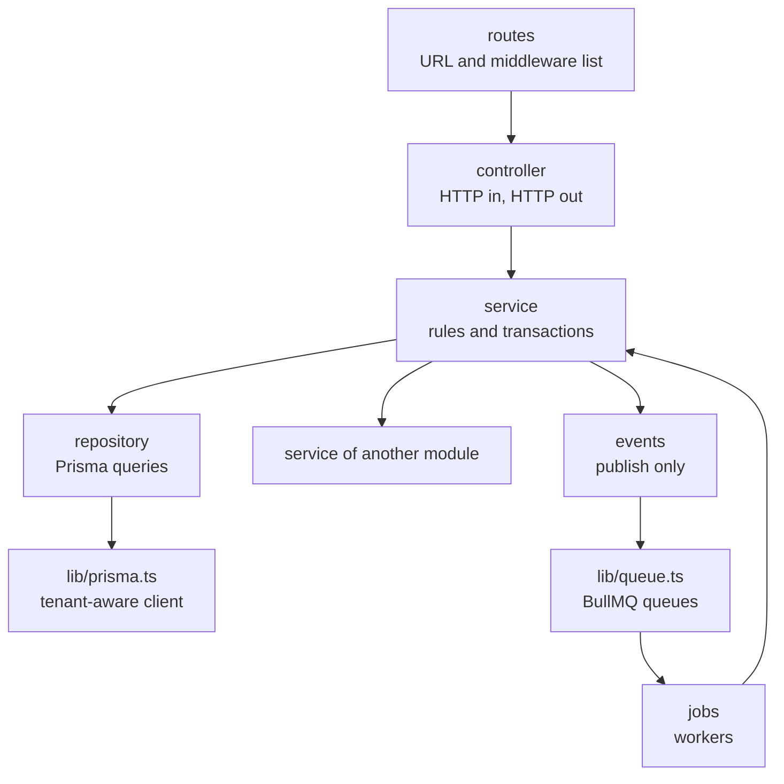
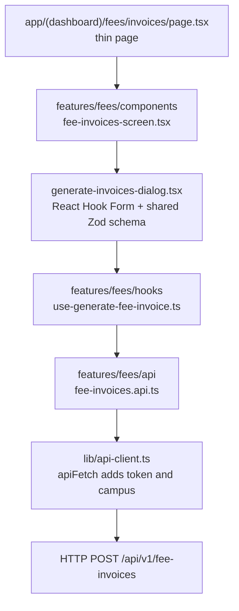
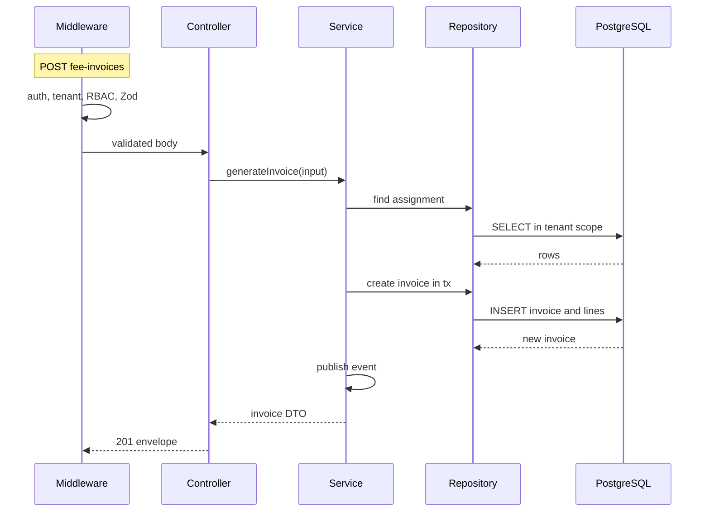
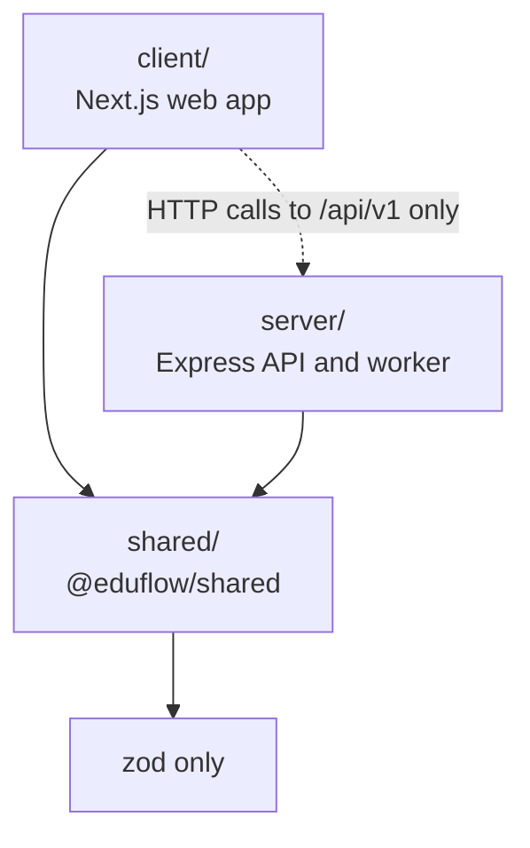

# Folder Structure

**In simple words:** This chapter shows where every file of EduFlow lives, and why. The code sits in one Git repository with three main folders. `client/` is the web app. `server/` is the API and the background worker. `shared/` is the code that both sides use. When every file has one fixed home, you find things in seconds, Claude Code puts new code in the right place, and a bug in one module stays inside that module.

## Why the layout matters

You are one person. You will build 16 modules in 60 days, and Claude Code will write most of the lines. A fixed layout gives you three things.

1. **Speed.** You never stop to think "where should this file go?". The answer is on this page. Twenty small decisions like that cost you an hour every day.
2. **Better output from Claude Code.** Claude Code copies the patterns it sees in the repo. If the Students module has seven files with clear names, the Fees module comes out in the same shape. If the repo is messy, every new module is messy in a new way.
3. **Small blast radius.** Blast radius means how much breaks when one thing goes wrong. Database queries live in one kind of file. Business rules live in another kind. So a security review reads one file per module, not ten, and a fix in Fees cannot break Attendance.

> **Founder note:** Ek line yaad rakhiye: "Har cheez ki ek jagah, aur har jagah par ek hi cheez." One home for every thing, and one kind of thing in every home. Jab bhi confusion ho, isi page par wapas aaiye.

Prompt P-01 creates this layout on Day 1 of the sprint. Prompt P-02 adds `CLAUDE.md` and the `docs/` folder. Use this chapter in three ways: to review what Claude Code generated, to decide where a new file goes, and to pull the repo back into shape when it drifts. How to write the code inside the files is covered in *Coding Standards*.

## The repository at a glance

EduFlow is a monorepo (one Git repository that holds several projects). It uses npm workspaces (an npm feature that treats folders of one repo as linked packages, with one `node_modules` folder and one lock file at the root). There are exactly three workspaces: `client`, `server` and `shared`.

**Figure: The repository root**

```text
eduflow/
|-- client/                  # Next.js web app (deploys to Vercel)
|-- server/                  # Express API + BullMQ worker (Railway)
|-- shared/                  # Zod schemas, types, constants for both
|-- docs/                    # specs that you and Claude Code read
|-- .claude/                 # Claude Code commands, agents, hooks
|-- .github/
|   |-- workflows/           # GitHub Actions pipelines
|-- CLAUDE.md                # project rules, loaded in every session
|-- README.md                # one page: what this is, how to start it
|-- CHANGELOG.md             # starts after Day 60
|-- docker-compose.yml       # local PostgreSQL 16 + Redis 7
|-- package.json             # workspace list + root scripts
|-- package-lock.json        # the only lock file in the repo
|-- tsconfig.base.json       # strict TypeScript rules for all three
|-- eslint.config.mjs        # one ESLint setup, with boundary rules
|-- .prettierrc.json         # one Prettier config
|-- .prettierignore
|-- .editorconfig            # indent, line endings, final newline
|-- .gitattributes           # forces LF line endings in Git
|-- .gitignore
|-- .nvmrc                   # 24
|-- .env.example             # values that docker-compose.yml reads
```

The table below explains every top-level item and the rule that decides what goes into it.

| Folder or file | What it holds | Rule for what goes in | Runs on |
|---|---|---|---|
| `client/` | Next.js app: pages, screens, forms, UI kit | Anything that renders in the browser. No secrets, no database code. | Vercel |
| `server/` | Express API, BullMQ worker, Prisma schema, seed | Anything that touches the database, a secret, a queue or a third-party API | Railway, later AWS |
| `shared/` | Zod schemas, TypeScript types, constants, tiny pure helpers | Only what the browser and the API must agree on. Depends on `zod` only. | Built into both sides |
| `docs/` | Canon, PRD files, schema copy, API registry, permissions, sprint log | Specs and notes only. A spec change lands here before the code changes. | Nowhere |
| `.claude/` | Slash commands, subagents, hooks, settings | Claude Code configuration only | Your laptop |
| `.github/workflows/` | CI and deploy pipelines | One YAML file per pipeline | GitHub Actions |
| `CLAUDE.md` | Rules that Claude Code loads in every session | Rules for every task, under about 150 lines | Your laptop |
| `docker-compose.yml` | PostgreSQL 16 and Redis 7 for local work | Local services only. No app code, no production secrets. | Your laptop |
| `package.json` | Workspace list, root scripts, dev tools | Scripts that span workspaces. Tools used by all three. | Everywhere |
| `tsconfig.base.json` | Strict TypeScript options | Options that every workspace shares | Everywhere |
| `eslint.config.mjs` | Lint rules and import boundaries | One config for the whole repo | Laptop and CI |
| `.editorconfig`, `.prettierrc.json`, `.gitattributes` | Formatting and line endings | Editor and formatter settings only | Laptop and CI |
| `.nvmrc` | The Node.js major version: `24` | One line | Laptop and CI |
| `.env.example` | Names and safe sample values for Docker Compose | Never a real secret | Your laptop |

### The three-question test

When you hold a new file in your hand and do not know where it goes, ask these questions in order.

1. Does it render a page or run in the browser? It goes in `client/`.
2. Does it touch the database, a secret, a queue, a file bucket or a third-party API such as Razorpay or WhatsApp? It goes in `server/`.
3. Must the browser and the API agree on it, such as the shape of a request, a permission key or an error code? It goes in `shared/`.

If the answer to all three is "no" and the file is a spec, a note or a review, it goes in `docs/`.

> **Rule:** `client/` never imports from `server/`. `server/` never imports from `client/`. Both import from `shared/`. `shared/` imports from neither. The client talks to the server only through HTTP calls to `/api/v1`.

## Root files

This section gives you the root files in full. Compare them with what P-01 generated. Small differences are fine. A missing workspace, a second lock file or a loose TypeScript setting is not fine.

### The root package.json

**File: `package.json` (repo root)**

```json
{
  "name": "eduflow",
  "version": "0.1.0",
  "private": true,
  "engines": {
    "node": ">=24 <25"
  },
  "workspaces": [
    "shared",
    "server",
    "client"
  ],
  "scripts": {
    "predev": "npm run build -w shared",
    "dev": "concurrently \"npm:dev:shared\" \"npm:dev:api\" \"npm:dev:web\"",
    "dev:shared": "npm run dev -w shared",
    "dev:api": "npm run dev -w server",
    "dev:web": "npm run dev -w client",
    "dev:worker": "npm run dev:worker -w server",
    "build": "npm run build -w shared && npm run build -w server && npm run build -w client",
    "lint": "eslint .",
    "typecheck": "npm run build -w shared && npm run typecheck --workspaces --if-present",
    "test": "npm run build -w shared && npm run test --workspaces --if-present",
    "check": "npm run lint && npm run typecheck && npm run test",
    "format": "prettier --write ."
  }
}
```

The file has no `devDependencies` block yet. npm writes that block, with current version numbers, when you install the shared tools from the root:

```bash
npm install -D typescript eslint prettier concurrently
```

Five points to understand in this file.

- `"private": true` stops you from publishing the repo to the npm registry by accident. It is the normal setting for a workspace root.
- The order in `workspaces` is `shared`, `server`, `client`. Scripts that run in every workspace follow this order, so `shared` is always handled first.
- `-w server` is the short form of `--workspace server`. It accepts the folder path, so it works whatever the package inside is named.
- `predev` runs by itself before `dev`. npm runs any script named `pre` plus the script name first. It builds `shared/` once, so the API and the web app find `shared/dist/` on a fresh clone.
- `concurrently` is a small npm package that runs several commands in one terminal. `"npm:dev:api"` is its short form for `npm run dev:api`. It prefixes every log line with the script name.

| Script | What it does | When you run it |
|---|---|---|
| `npm run dev` | Builds `shared` once, then starts the `shared` watcher, the API and the web app | Every morning |
| `npm run dev:worker` | Starts the BullMQ worker in watch mode, in a second terminal | From Week 5, when the first background job exists |
| `npm run lint` | Runs ESLint on all three workspaces | Before every commit |
| `npm run typecheck` | Builds `shared`, then type-checks every workspace without writing files | Before every commit |
| `npm run test` | Builds `shared`, then runs Vitest in every workspace | Before every merge |
| `npm run build` | Builds `shared`, then `server`, then `client` | CI and deploys |
| `npm run check` | Lint, then typecheck, then test. Stops at the first failure. | Your "may I merge?" button |
| `npm run format` | Prettier rewrites all files in the standard format | When a diff is noisy |

> **Warning:** Always install packages from the repo root: `npm install razorpay -w server` or `npm install zod -w shared -w server -w client`. Never run `npm install` inside `client/`, `server/` or `shared/`. That creates a second `package-lock.json`, and then your laptop and CI install different versions.

### How the three workspaces are linked

Each workspace has its own `package.json` with its own name: `@eduflow/shared`, `@eduflow/server` and `@eduflow/client`. The server and the client list the shared package as a normal dependency:

```json
{
  "dependencies": {
    "@eduflow/shared": "*"
  }
}
```

When you run `npm install` at the root, npm sees that a workspace with this name exists. It does not download anything. It creates a symlink (a shortcut folder) at `node_modules/@eduflow/shared` that points to your `shared/` folder. From then on, `import { PERMISSIONS } from '@eduflow/shared'` works in the client and in the server like any other npm package.

> **Note:** npm does not understand the `workspace:*` version that you may see in blog posts. That syntax belongs to pnpm and Yarn. With npm, write `"*"`.

### The base TypeScript config

**File: `tsconfig.base.json` (repo root)**

```json
{
  "compilerOptions": {
    "target": "ES2022",
    "strict": true,
    "noUncheckedIndexedAccess": true,
    "noImplicitOverride": true,
    "noFallthroughCasesInSwitch": true,
    "forceConsistentCasingInFileNames": true,
    "esModuleInterop": true,
    "skipLibCheck": true
  }
}
```

This is the same file that *Coding Standards* explains option by option. It holds only the strictness rules. Each workspace has its own `tsconfig.json` that starts with `"extends": "../tsconfig.base.json"`. It adds only what that side needs. The client adds browser types and the `@/*` alias. The server and `shared` add Node.js module settings and an output folder. You will see those files later in this chapter. `noUncheckedIndexedAccess` is the option that catches the most real bugs. It forces you to handle "this array item may not exist", which is what happens when a student has no invoice yet.

### Editor, Node and Git files

**File: `.editorconfig`**

```text
root = true

[*]
charset = utf-8
end_of_line = lf
indent_style = space
indent_size = 2
insert_final_newline = true
trim_trailing_whitespace = true

[*.md]
trim_trailing_whitespace = false
```

**File: `.nvmrc`**

```text
24
```

**File: `.gitattributes`**

```text
* text=auto eol=lf
```

**File: `.gitignore`**

```text
node_modules/
dist/
.next/
coverage/
playwright-report/
test-results/
*.tsbuildinfo

.env
.env.*
!.env.example

.claude/settings.local.json
.DS_Store
Thumbs.db
```

- `.editorconfig` makes VS Code and every other editor use 2 spaces and LF line endings. Prettier reads it too.
- `.nvmrc` tells nvm (Node Version Manager, a tool that switches Node.js versions) which major version to use. CI reads the same file, so your laptop and CI run the same Node.js.
- `.gitattributes` matters because you work on Windows. Without it, Git may convert line endings to CRLF, and every file then shows up as changed.
- In `.gitignore`, the three `.env` lines work as a group: ignore `.env`, ignore every `.env.something`, but keep `.env.example`. This covers `server/.env` and `client/.env.local` as well, because the patterns match in every folder.

### The three .env.example files

An `.env.example` file lists the names of the environment variables (settings that live outside the code, such as the database URL) with safe sample values. It is committed. The real `.env` file is never committed.

| Committed file | Real file on your laptop | Read by | Contains |
|---|---|---|---|
| `.env.example` | `.env` | Docker Compose | Local database user, password and database name, if your compose file uses variables for them |
| `server/.env.example` | `server/.env` | `server/src/config/env.ts` | `DATABASE_URL`, `REDIS_URL`, JWT secrets, keys for Razorpay, S3, WhatsApp, SES, MSG91 |
| `client/.env.example` | `client/.env.local` | Next.js | Only names that start with `NEXT_PUBLIC_`, for example the API base URL |

The full list of names and values is in *Environment Variables and Command Reference*. How the values change between local, staging and production is in *Environments and Configuration*.

> **Warning:** Every variable that starts with `NEXT_PUBLIC_` is copied into the JavaScript that the browser downloads. Anyone can read it. A secret never gets this prefix, and a secret never goes into `client/` at all.

### docker-compose.yml

`docker-compose.yml` sits at the root because it serves the whole repo, not one workspace. It starts two services for local work: PostgreSQL 16 and Redis 7, each with a named volume (a Docker-managed disk folder, so data survives a restart) and a health check. It does not run the API or the web app. You run those with `npm run dev`, because watch mode is faster outside Docker. The complete file and its commands are in *Local Development Setup*. The production image is built from `server/Dockerfile`, which is covered in *Docker and CI/CD*.

### CLAUDE.md and the .claude folder

`CLAUDE.md` is the rule book that Claude Code loads at the start of every session. The `.claude/` folder holds the rest of the Claude Code setup. The content of each file is in *Working with Claude Code*. This chapter only fixes where they live.

```text
eduflow/
|-- CLAUDE.md                    # rules for every task (max ~150 lines)
|-- client/CLAUDE.md             # optional: UI-only rules
|-- server/CLAUDE.md             # optional: API-only rules
|-- .claude/
    |-- settings.json            # permissions and hooks (committed)
    |-- settings.local.json      # your own overrides (git-ignored)
    |-- commands/                # your slash commands
    |   |-- start-session.md
    |   |-- review-module.md
    |   |-- prove-it.md
    |   |-- handoff.md
    |-- agents/
    |   |-- tenant-reviewer.md   # subagent that hunts tenant leaks
    |-- hooks/
        |-- guard-bash.mjs       # blocks dangerous shell commands
        |-- lint-file.mjs        # lints a file right after an edit
```

### .github/workflows

This folder holds the GitHub Actions pipelines (YAML files that GitHub runs on every push or pull request). You need one file from Week 1: `ci.yml`, which runs `npm ci`, `npm run lint`, `npm run typecheck`, `npm run test` and `npm run build` on every pull request. The deploy pipelines for staging and production arrive in Week 8 with P-55. Their full content is in *Docker and CI/CD*. Keep one pipeline per file, and name the file after what it does.

### docs

`docs/` holds the specs that Claude Code reads before it writes code, plus your own sprint notes. P-02 copies the first five items from the documentation sources.

```text
docs/
|-- canon.md                     # fixed facts: roles, modules, conventions
|-- permissions.md               # permission keys by role
|-- prd/                         # 25-fees-module.md and the other PRD files
|-- schema/                      # reference copy of the Prisma schema
|-- api/                         # endpoint registry: IDs, paths, keys
|-- sprint-log.md                # one line every evening
|-- reviews/                     # week-03.md: one file per weekly review
|-- releases/                    # v1.0.0.md: release notes, after Day 60
|-- tech-debt.md                 # known shortcuts, after Day 60
```

> **Rule:** No code lives in `docs/`, and no spec lives outside it. When a pilot institute asks for a change, edit the file in `docs/prd/` first, then ask Claude Code to change the code.

## The client workspace

`client/` is the Next.js web app. It uses the App Router (the Next.js routing system where every folder inside `src/app/` becomes a URL). The workspace has two big areas. `src/app/` holds routes only. `src/features/` holds the real screens, one folder per module. Everything else is shared support code.

**Figure: `client/` root files and routes**

```text
client/
|-- package.json                 # name: @eduflow/client
|-- next.config.ts
|-- tsconfig.json                # extends the base, defines "@/*"
|-- postcss.config.mjs           # Tailwind CSS runs through PostCSS
|-- components.json              # shadcn/ui settings, written by its CLI
|-- vitest.config.ts             # unit tests, same "@" alias
|-- playwright.config.ts         # end-to-end tests
|-- .env.example                 # NEXT_PUBLIC_ names only
|-- public/                      # static files, served as they are
|   |-- favicon.ico
|   |-- logo.svg
|   |-- templates/
|       |-- student-import-template.xlsx
|-- tests/
|   |-- setup.ts                 # Vitest setup file
|   |-- e2e/                     # Playwright specs (P-50)
|       |-- login.spec.ts
|       |-- admission-to-receipt.spec.ts
|-- src/
    |-- middleware.ts            # runs before every page request
    |-- app/                     # ROUTES ONLY: thin pages and layouts
        |-- layout.tsx           # html, body, fonts, AppProviders
        |-- globals.css          # Tailwind layers and design tokens
        |-- not-found.tsx        # 404 page
        |-- error.tsx            # error page
        |-- (auth)/              # centred card, no menu
        |   |-- layout.tsx
        |   |-- login/page.tsx
        |   |-- otp-login/page.tsx
        |   |-- forgot-password/page.tsx
        |   |-- reset-password/page.tsx
        |   |-- accept-invite/page.tsx
        |-- (dashboard)/         # staff app: header + sidebar
        |   |-- layout.tsx       # session guard, campus switcher
        |   |-- dashboard/page.tsx
        |   |-- students/
        |   |   |-- page.tsx                 # list
        |   |   |-- new/page.tsx             # create
        |   |   |-- [studentId]/page.tsx     # profile
        |   |-- fees/                        # see the worked example
        |   |-- admissions/  attendance/  batches/  campuses/
        |   |-- discounts/  notifications/  payments/
        |   |-- settings/  subjects/  teachers/
        |   |-- forbidden/page.tsx           # 403 page
        |-- (portal)/            # parent and student portal
            |-- layout.tsx       # bottom tab bar, PARENT/STUDENT guard
            |-- portal/
                |-- page.tsx                 # home: my children
                |-- attendance/page.tsx
                |-- fees/page.tsx
                |-- fees/[invoiceId]/page.tsx
                |-- notices/page.tsx
```

> **Note:** The config files at the `client/` root are generated by `create-next-app` and by the shadcn/ui CLI. The exact set depends on the versions you install. Do not create them by hand, and do not delete one because this tree does not show it.

### Route groups

A route group is a folder whose name is in round brackets, such as `(auth)`. Next.js leaves the group name out of the URL. Every page inside the group shares the group's `layout.tsx`. EduFlow uses three groups because it has three different page frames.

| Group | URL examples | Frame | Who uses it | Built by |
|---|---|---|---|---|
| `(auth)` | `/login`, `/otp-login`, `/forgot-password`, `/accept-invite` | Centred card, no menu | Anyone without a session | P-09 |
| `(dashboard)` | `/dashboard`, `/students`, `/fees/invoices`, `/settings/roles` | Header, role-based sidebar, campus switcher | Staff roles and `SUPER_ADMIN` | P-09, then every module prompt |
| `(portal)` | `/portal`, `/portal/fees`, `/portal/attendance` | Mobile-first, bottom tab bar | `PARENT` now, `STUDENT` in Phase 2 | P-30, P-40 |

Because the group name is not part of the URL, two groups must never define the same path. That is why every portal page sits under a real folder named `portal/`. `/fees` is the accountant's screen. `/portal/fees` is what Sunita Devi sees on her phone.

> **Note:** *Daily Plan: Days 1 to 14* and one example in *Coding Standards* call the staff group `(app)`. It is the same group. Name it `(dashboard)` when you run P-09, so the repo matches this chapter.

### Pages stay thin

A `page.tsx` file does three things at most: set the page title, read the URL parameters, and render one feature screen. It has no data fetching, no form and no table. This is a complete page file:

```tsx
// client/src/app/(dashboard)/fees/invoices/page.tsx
import type { Metadata } from 'next';
import { FeeInvoicesScreen } from '@/features/fees';

export const metadata: Metadata = { title: 'Fee invoices' };

export default function FeeInvoicesPage() {
  return <FeeInvoicesScreen />;
}
```

The reason is practical. URLs change when you reorganize menus. Screens change when the product changes. If they live in different folders, one kind of change never disturbs the other. The Parent Portal can also reuse a Fees component without importing anything from a staff route.

### Features, components, lib and providers

**Figure: the rest of `client/src/`**

```text
client/src/
|-- features/                    # one folder per module
|   |-- fees/
|   |   |-- index.ts             # public door: what others may import
|   |   |-- components/          # screens, forms, tables, dialogs
|   |   |   |-- fee-heads-screen.tsx
|   |   |   |-- fee-structure-builder.tsx
|   |   |   |-- fee-invoices-screen.tsx
|   |   |   |-- generate-invoices-dialog.tsx
|   |   |-- hooks/               # TanStack Query hooks
|   |   |   |-- use-fee-invoices.ts
|   |   |   |-- use-generate-fee-invoice.ts
|   |   |-- api/                 # one function per endpoint
|   |   |   |-- fee-invoices.api.ts
|   |   |   |-- fees.keys.ts     # query key factory of this module
|   |   |-- schemas/             # form-only Zod schemas (rare)
|   |       |-- fee-structure-form.schema.ts
|   |-- auth/                    # login forms, useSession()
|   |-- campuses/                # campus screens, useCampus()
|   |-- students/  attendance/  payments/    # same shape
|-- components/                  # used by two or more features
|   |-- ui/                      # shadcn/ui files, added by its CLI
|   |-- data-table/              # table, pagination, column toggles
|   |-- form/                    # field wrappers for RHF + Zod
|   |-- layout/                  # sidebar, header, campus switcher
|   |-- states/                  # EmptyState, ErrorState, skeletons
|   |-- can.tsx                  # shows children only with permission
|-- config/
|   |-- navigation.ts            # menu: route, permission key, module
|-- hooks/                       # hooks used by two or more features
|   |-- use-debounce.ts
|-- i18n/
|   |-- index.ts                 # t('fees.collect.title')
|   |-- en.ts                    # English texts; hi.ts arrives with P-60
|-- lib/
|   |-- api-client.ts            # apiFetch, ApiError, refresh and retry
|   |-- auth.ts                  # access token in memory, login, logout
|   |-- permissions.ts           # can(user, 'fees.collect')
|   |-- forms.ts                 # maps API field errors onto a form
|   |-- query-client.ts          # TanStack Query defaults
|   |-- env.ts                   # Zod-checked NEXT_PUBLIC_ values
|   |-- utils.ts                 # cn() helper from shadcn/ui
|   |-- formatters/
|       |-- currency.ts          # "12000.00" + INR -> Rs 12,000.00
|       |-- date.ts              # UTC -> organization timezone
|-- providers/
    |-- app-providers.tsx        # wraps the three below
    |-- query-provider.tsx
    |-- auth-provider.tsx
    |-- theme-provider.tsx
```

Every module gets one folder under `src/features/`. Every feature folder has the same four subfolders and one `index.ts`.

| Part | What goes in | What never goes in |
|---|---|---|
| `components/` | Screens, forms, tables and dialogs of this module. They call hooks. | `fetch` calls, money maths, hand-written permission checks |
| `hooks/` | `useQuery` and `useMutation` wrappers, one per use case | JSX, formatting, URLs |
| `api/` | One small function per endpoint, built on `apiFetch`, plus the query key factory | React code, state, toasts |
| `schemas/` | Zod schemas that only a form needs, built from a shared schema with `.extend()` or `.pick()` | Copies of a shared schema |
| `index.ts` | Export lines for the few things other folders may use: screens for pages, a hook such as `useCampus` | Logic of any kind |

A feature may import from `@/components`, `@/hooks`, `@/lib`, `@/config`, `@/i18n`, `@/providers` and `@eduflow/shared`. A feature imports another feature only through that feature's `index.ts`, never from a deep path. When two features need the same component, for example a student picker used by Fees and Attendance, move it up to `src/components/`. A feature may add a small `lib/` subfolder for pure helpers that only this feature uses.

> **Note:** *Coding Standards* shows the hook files inside `api/`, next to the API functions. The files and their names are the same. In your repo, keep them in `hooks/` as shown here, so that `api/` stays free of React code.

The files in `src/lib/` are small, but every screen depends on them.

| File | Its job | Rule |
|---|---|---|
| `api-client.ts` | One `apiFetch` wrapper: base URL, `Authorization` header, `X-Campus-Id`, envelope unwrap, typed `ApiError`, refresh once on `TOKEN_EXPIRED` | The only file in the client that calls `fetch` |
| `auth.ts` | Keeps the access token in memory. Login, logout and session restore. | Never write a token to `localStorage` |
| `permissions.ts` | `can(user, 'fees.collect')` for menus and buttons | Hides UI only. The API is the real lock. |
| `formatters/currency.ts` | Turns the API's money string and currency code into display text with `Intl.NumberFormat` | Display only. Never do money maths in the browser. |
| `formatters/date.ts` | Shows UTC timestamps in the organization's timezone. Formats calendar dates. | No `new Date()` formatting inside components |
| `forms.ts` | Puts the `details` of a `VALIDATION_ERROR` under the right form fields | Forms never parse error envelopes by hand |
| `query-client.ts` | TanStack Query defaults: no retry on 401, 403, 404 | One query client for the app |
| `env.ts` | Reads and checks the `NEXT_PUBLIC_` values once | No `process.env` anywhere else in the client |
| `utils.ts` | The `cn()` class-name helper that shadcn/ui generates | Do not turn it into a dumping ground |

`src/components/ui/` belongs to shadcn/ui. Its CLI copies component source files into this folder, for example `npx shadcn@latest add dialog`. You may adjust styles there, but do not put EduFlow logic in those files. Build your own parts, such as the data table and the form kit from P-10, in the sibling folders.

### What middleware.ts does

`src/middleware.ts` runs on the server before every page request. In EduFlow it does two light jobs. It reads the tenant slug from the host name, for example `sharma-classes` from `sharma-classes.eduflow.app`, and passes it to the pages so the login screen can show the institute's name and logo. It also redirects `/` to the right start page. It is not a security layer. The access token lives in browser memory, so this file cannot see it. The real checks are `authenticate` and `requirePermission` on the API, plus the session guard in the `(dashboard)` and `(portal)` layouts.

> **Note:** Next.js 16 renamed this file convention from `middleware.ts` to `proxy.ts`, with an exported function named `proxy`. If your build prints a deprecation warning about `middleware`, rename the file and the function. The job and the location (`client/src/`) stay the same.

## The server workspace

`server/` holds two programs that share one codebase. The API process starts from `src/server.ts` and answers HTTP requests. The worker process starts from `src/jobs/worker.ts` and runs background jobs from BullMQ queues. Both use the same modules, the same Prisma client and the same environment file.

**Figure: `server/` root, Prisma folder and top of `src/`**

```text
server/
|-- package.json                 # name: @eduflow/server, scripts
|-- tsconfig.json                # type-check: src + prisma/seed
|-- tsconfig.build.json          # build: src only, output in dist/
|-- vitest.config.ts
|-- Dockerfile                   # see "Docker and CI/CD"
|-- .env.example
|-- prisma/
|   |-- schema/                  # live copy of docs/schema/
|   |   |-- 00-base.prisma       # generator, datasource, shared enums
|   |   |-- 01-platform.prisma
|   |   |-- 02-auth.prisma
|   |   |-- ...                  # one file per domain
|   |   |-- 08-fees.prisma
|   |   |-- 09-payments.prisma
|   |   |-- migrations/          # written by "prisma migrate dev"
|   |       |-- 20261007093000_init/
|   |       |   |-- migration.sql
|   |       |-- migration_lock.toml
|   |-- seed/
|       |-- index.ts             # runs the files below, in order
|       |-- reference-data.ts    # countries, currencies
|       |-- plans.ts             # 4 plans with canon prices
|       |-- permissions.ts       # keys from docs/permissions.md
|       |-- roles.ts             # the 7 system roles
|       |-- demo-organizations.ts    # Bright Future, Sharma Classes
|       |-- demo-fees.ts         # demo fee heads and one structure
|-- src/
    |-- server.ts                # read env, listen, graceful shutdown
    |-- app.ts                   # createApp(): middleware + routes
    |-- routes.ts                # mounts every module under /api/v1
    |-- config/
    |-- middleware/
    |-- modules/
    |-- lib/
    |-- jobs/
    |-- test/
    |-- types/
```

**File: `server/package.json` (scripts and Prisma block; npm adds the dependency blocks)**

```json
{
  "name": "@eduflow/server",
  "version": "0.1.0",
  "private": true,
  "scripts": {
    "dev": "tsx watch src/server.ts",
    "dev:worker": "tsx watch src/jobs/worker.ts",
    "build": "tsc -p tsconfig.build.json",
    "start": "node dist/server.js",
    "start:worker": "node dist/jobs/worker.js",
    "typecheck": "tsc -p tsconfig.json",
    "test": "vitest run --passWithNoTests"
  },
  "prisma": {
    "schema": "prisma/schema",
    "seed": "tsx prisma/seed/index.ts"
  }
}
```

`tsx` is an npm package that runs TypeScript files directly, and `tsx watch` restarts the process when a file changes. `app.ts` and `server.ts` are separate on purpose. `app.ts` exports `createApp()`, which builds the Express app but does not open a port. Tests import it with Supertest. `server.ts` is the only file that calls `listen`, and it also closes Prisma, Redis and the queues cleanly when the host sends a stop signal.

> **Note:** The `prisma` block in `package.json` is one valid way to tell Prisma 6 where the schema folder and the seed script are. Newer Prisma 6 releases prefer a `prisma.config.ts` file for the same two settings. Use what works with the exact version you pinned in P-04, and keep only one of the two.

> **Warning:** Do not move the `migrations/` folder by hand. In recent Prisma 6 releases, a multi-file schema keeps `migrations/` next to the file that holds the `datasource` block, so the path is `server/prisma/schema/migrations/`. If your pinned version or your Prisma config puts it at `server/prisma/migrations/`, leave it there. Because of this folder, compare the two schema copies with `diff -r -x migrations docs/schema server/prisma/schema`. No output means they match.

**Figure: inside `server/src/`**

```text
server/src/
|-- config/
|   |-- env.ts                   # Zod-checked env, only process.env user
|   |-- cors.ts                  # allowed origins per environment
|   |-- openapi.ts               # Swagger document setup
|-- middleware/                  # file name = the function it exports
|   |-- request-id.ts            # requestId: "req_..." on req and logs
|   |-- http-logger.ts           # one Pino line per request
|   |-- authenticate.ts          # auth: verify JWT, load user
|   |-- tenant.ts                # opens tenant context, campus header
|   |-- require-permission.ts    # RBAC: requirePermission('fees.collect')
|   |-- validate.ts              # validate({ body, query, params })
|   |-- rate-limit.ts            # rateLimit: user, organization, login
|   |-- idempotency.ts           # Idempotency-Key on payment POSTs
|   |-- not-found.ts             # 404 in the error envelope
|   |-- error-handler.ts         # errorHandler: always the last one
|-- modules/
|   |-- auth/  users/  roles/  audit/  files/     # platform parts
|   |-- organizations/  campuses/  batches/  subjects/
|   |-- admissions/  students/  teachers/  attendance/
|   |-- fees/                    # expanded in the worked example
|   |-- payments/  discounts/  notifications/  whatsapp/
|   |-- parent-portal/  dashboard/  settings/
|-- lib/
|   |-- prisma.ts                # the ONE client: db, tenantTransaction
|   |-- tenant-context.ts        # runWithTenant, getTenant, runAsPlatform
|   |-- redis.ts                 # one shared Redis connection
|   |-- queue.ts                 # BullMQ queues and their names
|   |-- events.ts                # publishEvent(name, payload)
|   |-- logger.ts                # Pino, with secrets redacted
|   |-- app-error.ts             # AppError with the canon error codes
|   |-- respond.ts               # sendOk, sendCreated, sendList
|   |-- list-query.ts            # page, limit (max 100), sort, filters
|   |-- audit.ts                 # audit.record() writes the audit trail
|   |-- money.ts                 # Decimal helpers, rupees to paise
|   |-- s3.ts                    # pre-signed upload and download URLs
|   |-- mailer.ts                # Amazon SES
|   |-- whatsapp.ts              # WhatsApp Cloud API client
|   |-- pdf.ts                   # HTML template in, PDF buffer out
|   |-- sms/
|   |   |-- index.ts             # picks the provider by country
|   |   |-- msg91.ts             # India, DLT templates
|   |   |-- twilio.ts            # international
|   |-- payments/
|       |-- razorpay.ts          # orders, signature check, refunds
|       |-- stripe.ts            # international customers (P-32)
|-- jobs/
|   |-- worker.ts                # entry point of the worker process
|   |-- schedulers.ts            # repeatable jobs: nightly, 15 minutes
|   |-- notification.worker.ts
|   |-- pdf.worker.ts
|   |-- import.worker.ts
|   |-- report.worker.ts
|   |-- webhook.worker.ts
|   |-- finance.worker.ts        # bulk invoices, late fees, reconcile
|-- test/
|   |-- test-app.ts              # createApp() + login helpers
|   |-- factories.ts             # build a tenant, a student, an invoice
|-- types/
    |-- express.d.ts             # adds req.id and req.user to Express
```

### The files of one module

Every folder in `src/modules/` has the same files. The file name starts with the module folder name and ends with the layer. A layer is one step in the path of a request, and each layer has exactly one job.

| File | Its one job | May import | Must never |
|---|---|---|---|
| `fees.routes.ts` | Maps a URL and HTTP method to a middleware list and one controller function | Middleware, controller, schemas | Contain logic or call a service |
| `fees.controller.ts` | Reads the validated request, calls one service function, sends the envelope | Services, `lib/respond` | Import Prisma, do maths, decide business rules |
| `fees.service.ts` | Business rules, calculations, status changes, transactions, calls to other modules' services | Repositories, other services, `lib/` wrappers, events | Touch `req` or `res`, write queries |
| `fees.repository.ts` | Every Prisma query of this module, through `db` or the `tx` it receives | `lib/prisma`, `lib/tenant-context` | Make decisions, call other modules |
| `fees.schemas.ts` | Zod schemas that only the API needs: URL params, list filters | `zod`, `@eduflow/shared` | Duplicate a shared schema |
| `fees.events.ts` | Names and payload types of the events this module publishes | `lib/events` | Send a WhatsApp message or email itself |
| `fees.test.ts` | API tests with Supertest: happy path, permissions, tenant isolation | `test/` helpers | Be skipped or weakened to get a green run |

> **Note:** The `CLAUDE.md` template in *Working with Claude Code* lists five files per module. This chapter adds `.repository.ts` and `.events.ts`. Add these two names to the folder map in your `CLAUDE.md` on Day 1. A module that returns many DTOs may add an eighth file, `fees.mappers.ts`, which turns Prisma rows into DTOs (`Decimal` to string, dates to ISO text).

A repository is a file that holds database queries and nothing else. A service is a file that holds decisions and nothing about HTTP. This split pays off in three places. Tenant isolation reviews (P-52) read only repository files. Unit tests for money rules call service functions without starting Express. The worker process reuses the same services, because a service does not know whether a browser or a queue called it.

**Figure: allowed direction of calls inside the server**



Calls flow downward only. A controller never skips the service to reach a repository. A repository never calls a service. A worker is treated like a controller: it takes the job data, opens the tenant context and calls one service function.

**Splitting a big module.** `CLAUDE.md` keeps files under about 300 lines. When `fees.service.ts` grows past that, split it by resource and keep the layer suffix: `fee-heads.service.ts`, `fee-structures.service.ts`, `fee-invoices.service.ts`, each with its own repository file. Keep one `fees.routes.ts` per module, so there is one place that lists every URL of the module. Pure calculations get their own small file named after what they compute, for example `late-fee.ts` with `late-fee.test.ts`.

**Calling another module.** Fees needs the next invoice number, and number sequences belong to Settings. The Fees service calls the exported function of the Settings service. It never opens the Settings repository and never queries the `number_sequences` table itself. One module owns each table.

### Middleware order

Middleware is a function that runs before the controller, for every request or for chosen routes. The order in `app.ts` matters. A wrong order produces bugs that are hard to see, such as webhook signatures that always fail.

| Order | Middleware | File | Runs for | What it does |
|---|---|---|---|---|
| 1 | `requestId` | `request-id.ts` | Every request | Creates the `req_...` ID for logs and error envelopes |
| 2 | `httpLogger` | `http-logger.ts` | Every request | One Pino log line per request, with the request ID |
| 3 | Security headers and CORS | `config/cors.ts` | Every request | Allows only the EduFlow web origins, with credentials |
| 4 | Webhook routers | Inside `modules/payments/` | Webhook URLs only | Reads the raw body, because signatures need the exact bytes |
| 5 | JSON and cookie parsers | `app.ts` | Every other request | Parses the body with a size limit |
| 6 | `authenticate` with the tenant step | `authenticate.ts`, `tenant.ts` | Per router or route | Verifies the JWT and opens the tenant context from `orgId` |
| 7 | `rateLimit` | `rate-limit.ts` | After `authenticate`; login limiter on the auth routes | 100 per minute per user, 1,000 per organization, 5 login tries per 15 minutes |
| 8 | `requirePermission` | `require-permission.ts` | Per route | Checks the permission key and sets the scope |
| 9 | `validate` | `validate.ts` | Per route | Parses body, query and params with Zod |
| 10 | Controller | Module folder | Per route | Calls one service function |
| 11 | `notFound`, `errorHandler` | `not-found.ts`, `error-handler.ts` | Last | Turn every miss and every error into the canon error envelope |

`authenticate` calls the tenant step itself, so a route lists one middleware for both. Payment-creating POST routes add `idempotency` after `validate`.

> **Warning:** A module with one resource mounts its router at the resource path, for example `/api/v1/payments`, and may call `router.use(authenticate)` once at the top, as *Coding Standards* shows. Fees has three resources (`/fee-heads`, `/fee-structures`, `/fee-invoices`), so its router is mounted at `/api/v1` and every route lists `authenticate` itself. Never call `router.use(authenticate)` on a router that is mounted at `/api/v1`. It would also guard the public login and webhook routes that are registered after it.

### The lib folder

`lib/` holds wrappers around infrastructure: the database, Redis, queues, file storage and outside providers. A wrapper is a small file that hides a third-party SDK behind a few functions that EduFlow controls. Services call `sendWhatsAppTemplate()`. They never import Meta's HTTP details.

| Rule for `lib/` | Why |
|---|---|
| `lib/` files know nothing about modules. They never import from `modules/`. | The wrapper stays reusable, and there are no circular imports |
| `lib/prisma.ts` is the only file that runs `new PrismaClient()` | One connection pool, and no query can skip the tenant extension |
| Each provider has exactly one file | When you change provider, or mock one in tests, you touch one file |
| `lib/whatsapp.ts` is how to talk to Meta. `modules/whatsapp/` is what EduFlow does with it: templates, credit wallet, message log. | The same split applies to `lib/payments/razorpay.ts` and `modules/payments/` |
| Secrets come from `config/env.ts`, never from `process.env` | A missing key stops the server at start, not in front of a parent |

### The jobs folder

`jobs/` holds the BullMQ workers (functions that take jobs from a Redis queue and run them outside the web request). The canon names five job families: notifications, PDFs, imports, reports and webhooks. This Blueprint adds a sixth family, `finance`, for bulk invoice generation, the nightly late fee run and payment reconciliation. This is an assumption of this chapter. If *Background Jobs and Events* in the PRD names the queue differently, use the PRD name.

Queues are defined once in `lib/queue.ts`. The API adds jobs to a queue. The worker process, started by `jobs/worker.ts`, runs them. Each worker file follows the controller rule: read the job data, open the tenant context with the `organizationId` stored in the job, call one service function, and let BullMQ handle retries. A worker file contains no business rules. On Railway the worker is a second service built from the same code, with a different start command. That setup is in *Deploy on Vercel and Railway*.

## The shared workspace

`shared/` is the contract between the browser and the API. It is a small package named `@eduflow/shared`. It depends on `zod` and on nothing else.

**Figure: `shared/`**

```text
shared/
|-- package.json                 # name: @eduflow/shared
|-- tsconfig.json
|-- dist/                        # build output, git-ignored
|-- src/
    |-- index.ts                 # the ONLY public door of the package
    |-- schemas/                 # Zod schemas used by forms AND the API
    |   |-- common.ts            # uuid, phone, email, money string
    |   |-- list-query.ts        # page, limit, sort, q
    |   |-- auth.ts
    |   |-- students.ts
    |   |-- fees.ts
    |   |-- payments.ts
    |-- types/                   # DTO and envelope types
    |   |-- api.ts               # ApiSuccess, ApiFailure, PaginationMeta
    |   |-- auth.ts              # AuthUser, session shape
    |   |-- fees.ts              # FeeInvoiceDto, FeeHeadDto
    |-- constants/
    |   |-- permissions.ts       # PERMISSIONS: 'fees.collect' and the rest
    |   |-- roles.ts             # the 7 system role keys
    |   |-- error-codes.ts       # the 11 canon codes + HTTP status
    |   |-- enums.ts             # mirrors of the Prisma enums
    |   |-- modules.ts           # the 34 module codes and phases
    |   |-- plans.ts             # plan keys and limits
    |-- utils/                   # tiny pure helpers
        |-- money.ts             # "12000.50" <-> integer paise
        |-- phone.ts             # normalise Indian mobile numbers
        |-- dates.ts             # calendar-date helpers
        |-- labels.ts            # Class/Section vs Program/Batch
```

**File: `shared/package.json` (npm adds `zod` when you install it)**

```json
{
  "name": "@eduflow/shared",
  "version": "0.1.0",
  "private": true,
  "main": "./dist/index.js",
  "types": "./dist/index.d.ts",
  "exports": {
    ".": {
      "types": "./dist/index.d.ts",
      "default": "./dist/index.js"
    }
  },
  "scripts": {
    "build": "tsc -p tsconfig.json",
    "dev": "tsc -p tsconfig.json --watch --preserveWatchOutput",
    "typecheck": "tsc -p tsconfig.json --noEmit",
    "test": "vitest run --passWithNoTests"
  }
}
```

**File: `shared/tsconfig.json`**

```json
{
  "extends": "../tsconfig.base.json",
  "compilerOptions": {
    "module": "NodeNext",
    "moduleResolution": "NodeNext",
    "lib": ["ES2023"],
    "types": [],
    "rootDir": "src",
    "outDir": "dist",
    "declaration": true,
    "declarationMap": true,
    "sourceMap": true
  },
  "include": ["src"],
  "exclude": ["src/**/*.test.ts"]
}
```

How this works, in plain words:

- `shared/` is compiled to plain JavaScript in `shared/dist/`. The server and the client import the compiled package, not the TypeScript source. So neither side needs special settings to read it.
- The `exports` block opens exactly one door: `@eduflow/shared`. An import such as `@eduflow/shared/src/schemas/fees` fails. This keeps the inside of the package free to change.
- `"lib": ["ES2023"]` and `"types": []` mean that shared code sees no browser types and no Node.js types. If someone writes `window` or `process` in `shared/`, the build fails. That is the point: shared code must run on both sides.
- `declarationMap` makes "Go to definition" in VS Code jump to the `.ts` source instead of the generated `.d.ts` file.
- Install `zod` with one command for all three workspaces, so npm keeps a single copy: `npm install zod -w shared -w server -w client`.

| Goes into `shared/` | Stays out of `shared/` |
|---|---|
| The Zod schema of a request body that a form and the API both use | Anything from `@prisma/client`, including Prisma enum imports |
| DTO types, such as `FeeInvoiceDto` with money as the string `"12000.00"` | React components, hooks, anything with JSX |
| Permission keys, role keys, error codes, enum values, module codes, plan limits | Express code, middleware, anything that knows about `req` or `res` |
| Pure helpers with no side effects: phone normaliser, money string to paise | Anything that reads `process.env`, `window`, a file or the network |
| Labels that depend on `Organization.type` | Business rules that need a database lookup, such as the late fee calculation |

> **Tip:** `shared/` cannot import Prisma, so `constants/enums.ts` repeats enum values such as `FeeInvoiceStatus`. Add one small server test that compares every shared enum with the matching Prisma enum. Then the two lists can never drift apart without a red test.

## What goes where

Use this table when you, or Claude Code, are about to create a file.

| You need to add | Put it in | Not in |
|---|---|---|
| A new page URL | `client/src/app/(group)/.../page.tsx`, kept thin | `features/` |
| A screen, form, table or dialog of one module | `client/src/features/<module>/components/` | `app/` |
| A call from the UI to the API | A function in `features/<module>/api/` and a hook in `hooks/` | The body of a component |
| A button, dialog or table used by two or more modules | `client/src/components/` | A feature folder |
| Currency or date display | `client/src/lib/formatters/` | Inline `toLocaleString()` calls |
| A rule about money, dates or status changes | A `.service.ts` file of the owning module | A controller, a React component, a worker |
| A Prisma query | A `.repository.ts` file of the owning module | Anywhere else |
| A request body shape used by a form and the API | `shared/src/schemas/<module>.ts` | Two copies, one per side |
| A params or query schema that only the API uses | `<module>.schemas.ts` on the server | `shared/` |
| A permission key | `shared/src/constants/permissions.ts`, `docs/permissions.md` and the seed | String literals spread over the code |
| A call to Razorpay, S3, WhatsApp, SES or MSG91 | One wrapper in `server/src/lib/` | An SDK call inside a service |
| Slow work: a PDF, an Excel import, 500 messages | A queue in `lib/queue.ts` and a worker in `jobs/` | The web request |
| A new environment variable | `server/src/config/env.ts` and `server/.env.example` | A loose `process.env.X` |
| A table or column | `docs/schema/`, then `server/prisma/schema/`, then a migration | The database by hand |
| Demo or reference data | `server/prisma/seed/` | A migration file |
| A change in how the product should behave | `docs/prd/` first | The code first |

## Worked example: every file the Fees module touches

The Fees module (code FEE) is built by P-23 and P-24 in Week 5. It is the largest Phase 1 module, so it is a good test of the layout. The lists below show every path it creates or changes.

**Figure: Fees files in `docs/`, `shared/` and `server/`**

```text
# Specs: read first, change first
docs/prd/25-fees-module.md
docs/api/                         (the FEE-API rows of the registry)
docs/permissions.md               (the fees.* keys)
docs/schema/08-fees.prisma

# shared/
shared/src/schemas/fees.ts
shared/src/types/fees.ts
shared/src/constants/permissions.ts       (the fees.* keys)
shared/src/constants/enums.ts             (FeeInvoiceStatus, FeeFrequency)
shared/src/index.ts                       (two export lines)

# server/: owned by Fees
server/prisma/schema/08-fees.prisma
server/prisma/seed/demo-fees.ts
server/src/modules/fees/fees.routes.ts
server/src/modules/fees/fees.controller.ts
server/src/modules/fees/fees.schemas.ts
server/src/modules/fees/fees.events.ts
server/src/modules/fees/fees.mappers.ts              (Prisma row to DTO)
server/src/modules/fees/fee-heads.service.ts
server/src/modules/fees/fee-heads.repository.ts
server/src/modules/fees/fee-structures.service.ts
server/src/modules/fees/fee-structures.repository.ts
server/src/modules/fees/fee-invoices.service.ts
server/src/modules/fees/fee-invoices.repository.ts
server/src/modules/fees/invoice-lines.ts          (pure calculation)
server/src/modules/fees/invoice-lines.test.ts
server/src/modules/fees/late-fee.ts               (pure calculation)
server/src/modules/fees/late-fee.test.ts
server/src/modules/fees/fees.test.ts
server/src/modules/fees/fees.isolation.test.ts

# server/: changed by Fees
server/src/routes.ts                      (one line mounts feesRouter)
server/src/lib/queue.ts                   (the finance queue)
server/src/jobs/finance.worker.ts         (bulk invoices, late fee run)
server/src/jobs/schedulers.ts             (the nightly schedule)

# server/: called by Fees, owned by other modules
server/src/modules/settings/number-sequence.service.ts
server/src/lib/audit.ts
server/src/lib/events.ts
```

**Figure: Fees files in `client/`**

```text
client/src/config/navigation.ts           (the Fees menu entries)

client/src/app/(dashboard)/fees/page.tsx
client/src/app/(dashboard)/fees/heads/page.tsx
client/src/app/(dashboard)/fees/structures/page.tsx
client/src/app/(dashboard)/fees/structures/[structureId]/page.tsx
client/src/app/(dashboard)/fees/assign/page.tsx
client/src/app/(dashboard)/fees/invoices/page.tsx
client/src/app/(dashboard)/fees/invoices/[invoiceId]/page.tsx
client/src/app/(dashboard)/fees/dues/page.tsx

client/src/features/fees/index.ts         (exports the screens)
client/src/features/fees/components/      (8 to 12 screen and form files)
client/src/features/fees/hooks/           (one hook file per use case)
client/src/features/fees/api/             (one .api.ts file per resource,
                                           plus fees.keys.ts)
client/src/features/fees/schemas/         (form-only schemas, if any)

client/src/app/(portal)/portal/fees/page.tsx      (Week 7, same API)
```

Count them: about 60 files for the biggest module, and every one has a predictable name. A small module such as Subjects needs about 20.

### The request flow

The example request: Suresh Gupta, the accountant of Bright Future Public School, generates the Tuition Q2 invoice for Aarav Sharma (`BF-2027-0142`). The amount is ₹12,000 and the due date is 10 July.

> **Note:** The path `POST /api/v1/fee-invoices`, the permission key `fees.generate` and the helper names in the code below are working names for this example. The real endpoint IDs, paths and keys come from `docs/api/` and `docs/permissions.md`. The helpers are created by P-05 to P-08. If your names differ, keep the layers and change the names.

**Figure: the request inside the browser**



The page picks the screen. The dialog validates the form with the same Zod schema that the API uses. The hook owns loading, error and cache refresh. The API function knows the URL. `apiFetch` knows the token. Each file knows one thing.

**Figure: the same request inside the server**



Step by step:

1. `fees.routes.ts` matches the URL and runs the middleware list. `authenticate` verifies the JWT and opens the tenant context for Bright Future. `requirePermission` checks Suresh's key. `validate` parses the body with `generateFeeInvoiceSchema` from `@eduflow/shared`.
2. `fees.controller.ts` takes the parsed body and calls one function of `fee-invoices.service.ts`. It knows nothing about fees.
3. The service loads the student's fee assignment through the repository. It stops with `NOT_FOUND` if there is none, and with `CONFLICT` if this instalment already has an invoice.
4. The service builds the invoice lines with the pure function in `invoice-lines.ts`. No database is involved, so the money maths has fast unit tests.
5. The service opens one transaction. Inside it, the Settings service gives the next number from the `FEE_INVOICE_NO` sequence, and the repository inserts the invoice and its lines. Either everything is saved or nothing is.
6. The service publishes an "invoice generated" event through `fees.events.ts`. The Notifications engine (P-28) decides later whether Sunita Devi gets a WhatsApp message. Fees does not know and does not care.
7. The controller sends `201` with the success envelope. If any step throws an `AppError`, the central `errorHandler` builds the error envelope with the request ID.

Bulk generation for the whole of Class 10-A takes the second road. The controller adds one job to the `finance` queue and returns a job ID at once. `finance.worker.ts` picks up the job, opens the tenant context and calls the same service function once per student.

### The layers in code

These short files show how little each layer does. Use them as a review reference, the same way you use the references in the daily plan chapters.

**File: `shared/src/schemas/fees.ts` and `shared/src/types/fees.ts` (extract)**

```typescript
// shared/src/schemas/fees.ts
import { z } from 'zod';

export const generateFeeInvoiceSchema = z.object({
  assignmentId: z.string().uuid(),
  installmentId: z.string().uuid(),
});

export type GenerateFeeInvoiceInput = z.infer<typeof generateFeeInvoiceSchema>;

// shared/src/types/fees.ts
export interface FeeInvoiceDto {
  id: string;
  invoiceNo: string;
  studentId: string;
  dueDate: string; // "2027-07-10"
  currency: string; // "INR"
  total: string; // "12000.00" - money travels as a string, never a float
  balance: string;
  status: string; // one of the FeeInvoiceStatus values
}
```

**File: `server/src/modules/fees/fees.routes.ts` (extract)**

```typescript
import { Router } from 'express';
import { generateFeeInvoiceSchema } from '@eduflow/shared';
import { authenticate } from '../../middleware/authenticate';
import { requirePermission } from '../../middleware/require-permission';
import { validate } from '../../middleware/validate';
import * as controller from './fees.controller';

// Mounted at /api/v1 in server/src/routes.ts, so every route lists authenticate itself.
export const feesRouter = Router();

feesRouter.post(
  '/fee-invoices',
  authenticate,
  requirePermission('fees.generate'), // use the key from docs/api/
  validate({ body: generateFeeInvoiceSchema }),
  controller.generateInvoice,
);
```

**File: `server/src/modules/fees/fees.controller.ts` (extract)**

```typescript
import type { Request, Response } from 'express';
import type { GenerateFeeInvoiceInput } from '@eduflow/shared';
import { sendCreated } from '../../lib/respond';
import * as feeInvoicesService from './fee-invoices.service';

export async function generateInvoice(_req: Request, res: Response): Promise<void> {
  const input = res.locals.body as GenerateFeeInvoiceInput; // parsed by validate()
  const invoice = await feeInvoicesService.generateInvoice(input);
  sendCreated(res, invoice);
}
```

There is no `try` and `catch` here. Express 5 passes a rejected promise from an async handler to the error handler by itself.

**File: `server/src/modules/fees/fee-invoices.service.ts` (extract)**

```typescript
import type { GenerateFeeInvoiceInput } from '@eduflow/shared';
import { AppError } from '../../lib/app-error';
import { tenantTransaction } from '../../lib/prisma';
import { nextNumber } from '../settings/number-sequence.service';
import { publishInvoiceGenerated } from './fees.events';
import { toFeeInvoiceDto } from './fees.mappers';
import * as repo from './fee-invoices.repository';
import { buildInvoice } from './invoice-lines';

export async function generateInvoice(input: GenerateFeeInvoiceInput) {
  const assignment = await repo.findAssignment(input.assignmentId);
  if (!assignment) throw new AppError('NOT_FOUND', 'Fee assignment not found');

  const existing = await repo.findInvoice(input.assignmentId, input.installmentId);
  if (existing) throw new AppError('CONFLICT', 'This instalment already has an invoice');

  const draft = buildInvoice(assignment, input.installmentId); // pure Decimal maths

  const invoice = await tenantTransaction(async (tx) => {
    const invoiceNo = await nextNumber(tx, 'FEE_INVOICE_NO');
    const created = await repo.createInvoice(tx, { ...draft.invoice, invoiceNo });
    await repo.createInvoiceItems(tx, created.id, draft.items);
    return created;
  });

  await publishInvoiceGenerated(invoice.id); // after the commit, never inside it
  return toFeeInvoiceDto(invoice);
}
```

`tenantTransaction()` is the helper from P-06 that *Coding Standards* explains. It opens one database transaction and hands the service a tenant-scoped `tx` client. The service passes `tx` to every repository call that must succeed or fail together.

**File: `server/src/modules/fees/fee-invoices.repository.ts` (extract)**

```typescript
import { db, type TenantTx } from '../../lib/prisma';
import type { NewInvoice, NewInvoiceItem } from './invoice-lines';

// No organizationId in any "where": the tenant-aware client adds it.
export function findInvoice(assignmentId: string, installmentId: string) {
  return db.feeInvoice.findFirst({
    where: { assignmentId, installmentId, deletedAt: null },
  });
}

// Writes that belong to a transaction take the "tx" client from the service.
export function createInvoice(tx: TenantTx, data: NewInvoice) {
  return tx.feeInvoice.create({ data });
}

export function createInvoiceItems(tx: TenantTx, invoiceId: string, items: NewInvoiceItem[]) {
  return tx.feeInvoiceItem.createMany({
    data: items.map((item) => ({ ...item, invoiceId })),
  });
}
```

> **Warning:** A Prisma query extension sees only the top-level operation. It does not run again for nested writes such as `items: { create: [...] }`. So the tenant extension cannot add `organizationId` to nested child rows. The safe habit: a repository writes child rows with their own `create` or `createMany` call inside the same transaction, as shown above. Check how your P-06 extension treats `createMany`, and cover it in the isolation tests.

**File: `client/src/features/fees/api/fee-invoices.api.ts` and the hook (extract)**

```typescript
// client/src/features/fees/api/fee-invoices.api.ts
import type { FeeInvoiceDto, GenerateFeeInvoiceInput } from '@eduflow/shared';
import { apiFetch } from '@/lib/api-client';

export function generateFeeInvoice(input: GenerateFeeInvoiceInput) {
  return apiFetch<FeeInvoiceDto>('/fee-invoices', { method: 'POST', body: input });
}

// client/src/features/fees/hooks/use-generate-fee-invoice.ts
import { useMutation, useQueryClient } from '@tanstack/react-query';
import { generateFeeInvoice } from '../api/fee-invoices.api';
import { feeKeys } from '../api/fees.keys';

export function useGenerateFeeInvoice() {
  const queryClient = useQueryClient();
  return useMutation({
    mutationFn: generateFeeInvoice,
    onSuccess: () => queryClient.invalidateQueries({ queryKey: feeKeys.invoices() }),
  });
}
```

The same type, `GenerateFeeInvoiceInput`, appears in the form, in the API function, in the route and in the service. It is written once, in `shared/`. If you rename a field there, TypeScript shows a red line in every one of those files within seconds.

## Module folder names

Each of the 34 modules has one folder name. The same name is used in `server/src/modules/`, in `client/src/features/`, in `shared/src/schemas/` and usually in the URL. Folder names are lower case, with a hyphen between words.

| Module | Code | Folder | Module | Code | Folder |
|---|---|---|---|---|---|
| Dashboard | DASH | `dashboard` | Discounts | DSC | `discounts` |
| Organizations | ORG | `organizations` | Scholarships | SCH | `scholarships` |
| Multi Campus | CAMP | `campuses` | Parent Portal | PP | `parent-portal` |
| Student Admission | ADM | `admissions` | Student Portal | SP | `student-portal` |
| Student Profile | STU | `students` | Notifications | NTF | `notifications` |
| Teachers | TCH | `teachers` | WhatsApp | WA | `whatsapp` |
| Staff | STF | `staff` | Email | EML | `email` |
| Attendance | ATT | `attendance` | SMS | SMS | `sms` |
| Leave | LEV | `leave` | Library | LIB | `library` |
| Batch | BAT | `batches` | Inventory | INV | `inventory` |
| Timetable | TT | `timetable` | Transport | TRN | `transport` |
| Subjects | SUB | `subjects` | Hostel | HST | `hostel` |
| Homework | HW | `homework` | Payroll | PRL | `payroll` |
| Exams | EXM | `exams` | Certificates | CRT | `certificates` |
| Report Cards | RPT | `report-cards` | Analytics | ANL | `analytics` |
| Fees | FEE | `fees` | AI Insights | AI | `ai-insights` |
| Payments | PAY | `payments` | Settings | SET | `settings` |

Three notes on this table.

- The folder name should equal the prefix of the module's permission keys. `students.create` lives in `students/`, and `attendance.mark` lives in `attendance/`. If `docs/permissions.md` uses a different prefix for a module, use that prefix as the folder name.
- The `batches` folder also holds academic years, courses and enrollments, because P-13 builds them together. Inside it the files are split by resource: `academic-years.service.ts`, `courses.service.ts`, `batches.service.ts`, `enrollments.service.ts`.
- Five server folders are not canon modules. They are platform parts that every module uses: `auth`, `users`, `roles`, `audit` and `files`. They follow the same file rules.

## Naming rules for files and folders

| Thing | Rule | Right | Wrong |
|---|---|---|---|
| Any folder | kebab-case (lower case, hyphens) | `report-cards/` | `ReportCards/`, `report_cards/` |
| Server module file | resource, dot, layer | `fee-invoices.service.ts` | `feeInvoiceService.ts`, `service.ts` |
| Pure calculation file | named after what it computes | `late-fee.ts` | `helpers.ts`, `utils2.ts` |
| Test file | same name plus `.test.ts`, next to the code | `late-fee.test.ts` | `tests/test1.ts` |
| End-to-end spec | the user flow plus `.spec.ts` | `admission-to-receipt.spec.ts` | `e2e1.spec.ts` |
| React component file | kebab-case file, PascalCase component inside | `fee-invoices-screen.tsx` exports `FeeInvoicesScreen` | `FeeInvoicesScreen.tsx` |
| Hook file | `use-` plus the thing | `use-fee-invoices.ts` exports `useFeeInvoices` | `feeHooks.ts` |
| Client API file | resource plus `.api.ts` | `fee-invoices.api.ts` | `api.ts`, `services.ts` |
| Next.js special file | the name Next.js fixes | `page.tsx`, `layout.tsx`, `loading.tsx`, `error.tsx` | `index.tsx`, `FeesPage.tsx` |
| Dynamic route folder | the ID name in camelCase | `[invoiceId]/` | `[id]/` |
| Zod schema constant | camelCase plus `Schema` | `generateFeeInvoiceSchema` | `FeeSchema1` |
| Type from a schema | PascalCase plus `Input` | `GenerateFeeInvoiceInput` | `IGenerateFee` |
| Response type | PascalCase plus `Dto` | `FeeInvoiceDto` | `FeeInvoiceResponseType` |
| Prisma schema file | two digits, then the domain | `08-fees.prisma` | `fees_new.prisma` |
| Migration name | snake_case, verb first | `add_invoice_pdf_file` | `update`, `fix2` |
| Worker file | job family plus `.worker.ts` | `pdf.worker.ts` | `pdfJob.ts` |
| Constant | UPPER_SNAKE_CASE | `PERMISSIONS`, `ERROR_CODES` | `permissionList` |

Why kebab-case for every file? Windows and macOS treat `FeeCard.tsx` and `feecard.tsx` as the same file. Linux, which runs your CI, Vercel and Railway, does not. An import with the wrong letter case works on your laptop and fails in the build. If no file name has a capital letter, this bug cannot happen. shadcn/ui also generates kebab-case files, so the whole client looks the same.

Why `[invoiceId]` and not `[id]`? A nested route such as `/students/[studentId]/documents/[documentId]` stays readable, and the parameter name in the code tells you what the ID belongs to.

Banned names: `utils/` inside a module, `helpers.ts`, `misc.ts`, `common.ts` outside `shared/src/schemas/`, `new-`, `old-`, `temp-` and `final-` prefixes, and any file name with a number at the end. A file with a vague name becomes a drawer where everything lands.

## How to add a new module in eight steps

The example is the Discounts module (DSC), built with P-27 in Week 6. The steps are the same for every module, including the Phase 3 ones next year.

1. **Read the spec and fix the names.** Open `docs/prd/27-discounts-module.md`, the module's rows in `docs/api/` and its keys in `docs/permissions.md`. Take the folder name from the table above: `discounts`. Write down the endpoint IDs you will build today.
2. **Check the data model.** The models `Discount` and `StudentDiscount` already exist in `docs/schema/08-fees.prisma`, and the Day 3 migration created the tables. So there is no migration. If the spec needs a new column, change both schema copies and run `npx prisma migrate dev --name add_discount_field` inside `server/`.
3. **Write the contract in `shared/`.** Create `shared/src/schemas/discounts.ts` and `shared/src/types/discounts.ts`. Add the keys to `constants/permissions.ts` and any enum to `constants/enums.ts`. Export both new files from `shared/src/index.ts`. The running `npm run dev` rebuilds `shared/dist/` by itself.
4. **Create the server module.** Make the folder and its files with the commands below. Build from the bottom up: repository, then service, then controller, then routes. Events come last.
5. **Register the module.** Add one line in `server/src/routes.ts` that mounts `discountsRouter`. If the module has background work, add the queue in `lib/queue.ts` and the worker in `jobs/`. Confirm that the new endpoints appear in the OpenAPI page.
6. **Write the tests.** `discounts.test.ts` covers the happy path and one permission failure per endpoint. `discounts.isolation.test.ts` proves that Sharma Classes cannot read a Bright Future discount. Money maths gets unit tests next to its file. Run `npm run test -w server -- src/modules/discounts`.
7. **Build the client feature.** Create `client/src/features/discounts/` with its four subfolders, then the thin pages under `client/src/app/(dashboard)/discounts/`. Add the menu entry, with its permission key and module code, to `client/src/config/navigation.ts`.
8. **Verify and ship.** Run `npm run check`. Walk through the acceptance criteria of the PRD file in the browser. Update `CLAUDE.md` only if the module created a new pattern. Commit with `feat(discounts): ...` and open the pull request as described in *Git Workflow: Branches, Commits and Pull Requests*.

Run these commands from the repo root in Git Bash, macOS or Linux. They create empty files in the right places, so Claude Code fills a known shape instead of inventing one.

```bash
M=discounts

mkdir -p server/src/modules/$M
touch server/src/modules/$M/$M.routes.ts \
      server/src/modules/$M/$M.controller.ts \
      server/src/modules/$M/$M.service.ts \
      server/src/modules/$M/$M.repository.ts \
      server/src/modules/$M/$M.schemas.ts \
      server/src/modules/$M/$M.events.ts \
      server/src/modules/$M/$M.test.ts \
      server/src/modules/$M/$M.isolation.test.ts

touch shared/src/schemas/$M.ts shared/src/types/$M.ts

mkdir -p client/src/features/$M/components client/src/features/$M/hooks \
         client/src/features/$M/api client/src/features/$M/schemas
mkdir -p "client/src/app/(dashboard)/$M"
```

Add this block at the end of any module prompt from the prompt library. It makes Claude Code state the file plan before it writes code.

```text
FOLDER RULES FOR THIS TASK
- Follow the layout in CLAUDE.md. Module folder name: discounts.
- Server files: discounts.routes.ts, .controller.ts, .service.ts,
  .repository.ts, .schemas.ts, .events.ts, .test.ts, .isolation.test.ts
- Prisma calls only in repository files. Transactions only in services.
- Request body schemas and DTO types go in shared/ and are exported
  from shared/src/index.ts. Import them as "@eduflow/shared".
- Client: features/discounts/{components,hooks,api,schemas} and thin
  pages under app/(dashboard)/discounts/.
- Before you write code, list every file you will create or change,
  with one line on its job. Wait for my OK.
```

**Checklist: the module is structurally complete**

- [ ] The folder name matches the table in this chapter and the permission key prefix.
- [ ] The server folder has routes, controller, service, repository, schemas, events and tests.
- [ ] `grep -rn "lib/prisma" server/src/modules/discounts` lists only repository, service and test files.
- [ ] Every route has `authenticate`, `requirePermission` and `validate`.
- [ ] The router is mounted in `server/src/routes.ts`, and the endpoints show in the OpenAPI page.
- [ ] Shared schemas and types are exported from `shared/src/index.ts`.
- [ ] The client feature has its four subfolders, and no page file is longer than about 30 lines.
- [ ] The menu entry exists in `navigation.ts` with the right permission key.
- [ ] `npm run check` is green.

## Import boundaries and path aliases

An import boundary is a rule about which folder may import from which other folder. EduFlow has few of them, and a lint rule enforces each one.

**Figure: who may import whom**



Solid arrows are imports. The dotted arrow is the network. There is no import arrow between `client/` and `server/`, in either direction.

| Code in | May import | Must never import |
|---|---|---|
| `client/` | `@eduflow/shared`, its own files through `@/`, browser npm packages | Anything in `server/`, `@prisma/client`, `express`, files inside `shared/src/` by path |
| `server/` | `@eduflow/shared`, its own files by relative path, Node.js packages | Anything in `client/`, `react`, `next` |
| `shared/` | `zod` and its own files | `client/`, `server/`, `react`, `next`, `express`, `@prisma/client`, Node.js built-ins |
| One server module | Its own files, and the service of another module | The repository or the tables of another module |
| One client feature | Its own files, `@/components`, `@/hooks`, `@/lib`, `@/config` | The inside of another feature, anything in `app/` |
| `server/src/lib/` | npm packages, `config/env.ts`, other `lib/` files | Anything in `modules/` |

Why the client must never import server code, even "just one type":

1. **Secrets and size.** The bundler follows imports. One import from `server/` can pull Prisma, Pino and your environment module into the browser bundle. The build breaks, or worse, it works and ships server code to parents' phones.
2. **Separate deploys.** Vercel builds `client/` and `shared/`. Railway builds `server/` and `shared/`. If the two sides are tangled, neither build works alone.
3. **The API is the product.** The white-label mobile apps in Phase 4 will use the same `/api/v1`. Everything the web app needs must be reachable over HTTP, with types in `shared/`.

### Path aliases

A path alias is a short name for a long import path. EduFlow uses exactly two.

| Alias | Works in | Points to | Example |
|---|---|---|---|
| `@/*` | `client/` only | `client/src/*` | `import { apiFetch } from '@/lib/api-client'` |
| `@eduflow/shared` | `client/` and `server/` | The built `shared` package, through the workspace link | `import { PERMISSIONS } from '@eduflow/shared'` |

**File: `client/tsconfig.json`**

```json
{
  "extends": "../tsconfig.base.json",
  "compilerOptions": {
    "lib": ["dom", "dom.iterable", "esnext"],
    "module": "esnext",
    "moduleResolution": "bundler",
    "jsx": "preserve",
    "allowJs": true,
    "noEmit": true,
    "incremental": true,
    "resolveJsonModule": true,
    "isolatedModules": true,
    "plugins": [{ "name": "next" }],
    "paths": {
      "@/*": ["./src/*"]
    }
  },
  "include": ["next-env.d.ts", "**/*.ts", "**/*.tsx", ".next/types/**/*.ts"],
  "exclude": ["node_modules"]
}
```

Next.js understands the `paths` setting by itself, in development and in the build. Next.js may also rewrite a few lines of this file when it starts, for example the `jsx` value. Let it. Vitest does not read `paths`, so `client/vitest.config.ts` repeats the alias:

```typescript
import path from 'node:path';
import { defineConfig } from 'vitest/config';

export default defineConfig({
  resolve: {
    alias: { '@': path.resolve(__dirname, 'src') },
  },
});
```

**File: `server/tsconfig.json`**

```json
{
  "extends": "../tsconfig.base.json",
  "compilerOptions": {
    "module": "NodeNext",
    "moduleResolution": "NodeNext",
    "lib": ["ES2023"],
    "types": ["node"],
    "noEmit": true
  },
  "include": ["src", "prisma/seed"]
}
```

**File: `server/tsconfig.build.json`**

```json
{
  "extends": "./tsconfig.json",
  "compilerOptions": {
    "noEmit": false,
    "rootDir": "src",
    "outDir": "dist",
    "sourceMap": true
  },
  "include": ["src"],
  "exclude": ["src/**/*.test.ts", "src/test"]
}
```

The server has two files because it has two needs. `tsconfig.json` type-checks everything, including the seed scripts, and writes nothing. `tsconfig.build.json` compiles only `src/` into `dist/` and leaves the tests out, so `node dist/server.js` starts a clean build.

The server has no `@/` alias, and this is on purpose. The TypeScript compiler checks aliases from `paths`, but it does not rewrite them in the JavaScript it writes. The code would run under `tsx` in development and then crash with "Cannot find module" under `node dist/server.js` in production. Relative imports need no extra tool. The longest one you will write is `../../lib/prisma`, because modules are only two folders deep.

> **Tip:** `server/package.json` has no `"type": "module"` line. With `"module": "NodeNext"`, TypeScript then compiles the server and `shared/` to CommonJS (the classic Node.js module format). This is why relative imports work without a `.js` ending, as in `'../config/env'`.

### Boundary rules in ESLint

ESLint has a built-in rule named `no-restricted-imports`. It needs no plugin. Add these blocks to the root `eslint.config.mjs`, after the TypeScript and Next.js blocks that P-01 created. The full lint setup is in *Coding Standards*.

```typescript
// eslint.config.mjs (extract: import boundaries only)
const onlyPublicShared = {
  group: ['@eduflow/shared/*', '**/shared/src/**'],
  message: 'Import from "@eduflow/shared" only.',
};

const serverBoundaries = [
  onlyPublicShared,
  {
    group: ['**/client/src/**', 'react', 'react-dom', 'next', 'next/*'],
    message: 'The server never imports client code.',
  },
];

export default [
  // ...the base, TypeScript and Next.js blocks come first
  {
    files: ['client/**/*.{ts,tsx}'],
    rules: {
      'no-restricted-imports': ['error', {
        patterns: [
          onlyPublicShared,
          {
            group: ['**/server/src/**', '@prisma/client', 'express', 'bullmq', 'ioredis'],
            message: 'The client never imports server code. Call the API.',
          },
        ],
      }],
    },
  },
  {
    files: ['server/**/*.ts'],
    rules: {
      'no-restricted-imports': ['error', { patterns: serverBoundaries }],
    },
  },
  {
    files: [
      'server/src/modules/**/*.{controller,routes,schemas,events}.ts',
      'server/src/middleware/**/*.ts',
      'server/src/jobs/**/*.ts',
    ],
    rules: {
      'no-restricted-imports': ['error', {
        patterns: [
          ...serverBoundaries,
          {
            group: ['**/lib/prisma', '@prisma/client'],
            message: 'Prisma belongs in repository and service files only.',
          },
        ],
      }],
    },
  },
  {
    files: ['shared/**/*.ts'],
    rules: {
      'no-restricted-imports': ['error', {
        patterns: [{
          group: [
            '**/client/src/**', '**/server/src/**',
            'react', 'next', 'express', '@prisma/client',
          ],
          message: 'shared/ depends on zod only.',
        }],
      }],
    },
  },
];
```

When two blocks match the same file, the later block replaces the rule settings of the earlier one. That is why the third server block repeats `serverBoundaries` and then adds the Prisma pattern. Test the rules once: add `import { PrismaClient } from '@prisma/client'` to any client file and run `npm run lint`. It must fail. Remove the line.

## What not to do

Each row below is a mistake that Claude Code, or a tired founder at 11 pm, makes easily. The right column is the fix.

| Mistake | Why it hurts | Do this instead |
|---|---|---|
| Business logic in a controller | It cannot be reused by a worker or tested without HTTP | Controller calls one service function. Rules live in the service. |
| Business logic in a React component, such as a late fee computed in the browser | Anyone can change it in the browser. The Parent Portal will compute it differently. | The API returns the final numbers. The UI only shows them. |
| A Prisma call in a controller, middleware, worker or route file | Queries spread out, and tenant reviews miss some | Queries live in `.repository.ts`. Transactions live in `.service.ts`. |
| `new PrismaClient()` outside `lib/prisma.ts` | That client has no tenant extension. It reads every institute's data. | Import `db` from `lib/prisma.ts`, inside a repository |
| Passing `organizationId` from `req.body`, or down from the controller | One forged request reads another institute's data | The tenant context supplies it. Repositories never take it as an argument. |
| One module querying another module's tables | Two owners for one table means two sets of rules | Call the other module's service function |
| `process.env.X` anywhere except the env module | A missing value fails late, in front of a user | Add it to `config/env.ts` and read `env.X` |
| A client import from `server/`, or a deep import into `shared/src/` | Broken builds and server code in the browser bundle | Import `@eduflow/shared` only. Call the API for everything else. |
| `fetch()` inside a component | No token refresh, no error envelope handling, no cache | Component, then hook, then API function, then `apiFetch` |
| The same Zod schema written on both sides | The two copies drift, and the form accepts what the API rejects | One schema in `shared/`, imported by both |
| A Razorpay or WhatsApp SDK call inside a service | Hard to mock in tests, hard to swap the provider | One wrapper per provider in `lib/` |
| Slow work inside the request, such as 40 PDFs in a loop | The request times out, and the accountant clicks again | Add a job to a queue and return a job ID |
| A `helpers.ts` or `utils/` drawer inside a module | It fills with unrelated code that nobody can find | Name the file after the one thing it computes |
| A page file with 300 lines | Routes and screens become welded together | Thin page, real screen in `features/` |

> **Founder note:** Teen line mein poora structure: "Controller sirf darwaza hai. Dimaag service mein hai. Database ki chaabi sirf repository ke paas hai." If a file breaks this, move the code before you merge.

### Quick structure checks

Run these from the repo root. No output means the structure is clean. They take ten seconds, and they complement the security greps in *Working with Claude Code*.

```bash
# 1. Prisma client used outside repository, service, lib and test files
grep -rn "lib/prisma" server/src --include="*.ts" \
  | grep -vE "\.(repository|service|test)\.ts:|/lib/|/test/"

# 2. Client code that imports server packages or server files
grep -rnE "from '(@prisma/client|express|bullmq|.*/server/src/)" client/src

# 3. Deep imports into the shared package
grep -rnE "@eduflow/shared/|shared/src/" client/src server/src

# 4. process.env outside the two env modules
grep -rn "process\.env" server/src client/src \
  | grep -vE "server/src/config/env\.ts|client/src/lib/env\.ts"

# 5. Raw fetch calls outside the API client
grep -rnE "\bfetch\(" client/src | grep -v "lib/api-client.ts"

# 6. A second lock file anywhere below the root
find client server shared -name package-lock.json -not -path "*/node_modules/*"
```

### The weekly structure check

Add these five minutes to your Sunday review.

1. Run the six commands above. Fix any output on Monday morning, before new work.
2. Run `npm run lint`. The boundary rules must still be active. A deleted rule makes no noise.
3. Open `server/src/modules/` and `client/src/features/`. Both must show the same module names.
4. Sort the files in `server/src/modules/` by size. Any file over 300 lines gets a split task, using P-51.
5. Compare the folder map in `CLAUDE.md` with the real tree. If they differ, fix `CLAUDE.md` the same day. Claude Code trusts that file more than it trusts you.

## Key takeaways

- One monorepo, three npm workspaces: `client/` renders, `server/` owns data and secrets, `shared/` holds the contract. Install packages from the root only, so there is one lock file.
- The client never imports the server, and the server never imports the client. Both import `@eduflow/shared` through its single entry point. ESLint enforces this, so you do not have to remember it.
- On the server, a request moves through routes, controller, service and repository. The controller holds no rules, the service holds no queries, and only `lib/prisma.ts` creates a Prisma client.
- On the client, `src/app/` holds thin pages in three route groups, and `src/features/<module>/` holds the real screens in four subfolders: components, hooks, api and schemas.
- Every module uses the same folder name on all three sides, and every file is kebab-case with its layer in the name. You can guess any path without opening the file tree.
- A new module is eight steps: spec, schema, shared contract, server files, registration, tests, client feature, check. Give Claude Code the folder rules block, and ask for the file list before the code.
- When the repo drifts, the six grep checks and the weekly five-minute review bring it back. Fix structure first, then build the next feature.
