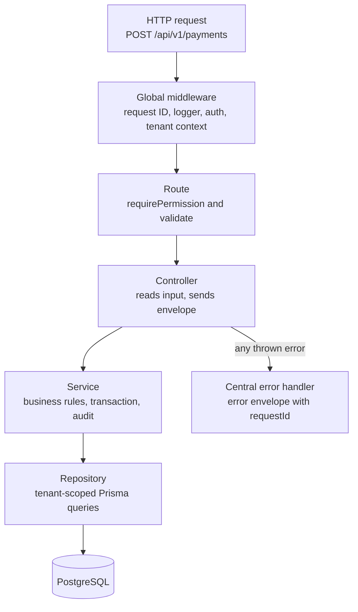

# Coding Standards

**In simple words:** This chapter is the rule book for every line of EduFlow code. It shows one right way to name things, build an API endpoint, touch money and build a screen, each with a short bad and good example. You and Claude Code follow the same rules, so code written on Day 50 looks like code written on Day 5. That sameness is what lets one person maintain 34 modules.

## How to use these standards

You are a solo founder. Nobody reviews your code except you and Claude Code. These standards do the job of the senior developer you do not have yet. They are not about taste. Every rule here exists because breaking it has cost other SaaS teams a data leak, a money bug or a week of rework.

Rules are enforced at three levels. Push every rule to the highest level you can.

| Level | Who checks | Examples |
|---|---|---|
| Machine-checked | TypeScript, ESLint, Prettier, tests, CI | No `any`, unused variables, formatting, tenant isolation tests |
| Prompt-checked | Claude Code, through `CLAUDE.md` | Layering, response envelope, money rules, permission on every route |
| Review-checked | You, with the checklist at the end of this chapter | Clear names, useful error messages, missing empty states |

> **Founder note:** "Jo cheez machine check kar sakti hai, use yaad rakhne ki zaroorat nahi." If a machine can check a rule, do not rely on your memory. Add an ESLint rule or a test, and free your head for the customer.

How this chapter fits with the others:

- *Working with Claude Code* holds the `CLAUDE.md` template. Its 15 non-negotiable rules are the short version of this chapter. When you change a rule here, change it there on the same day.
- *Folder Structure* says where each file lives. This chapter says how the code inside the file must look.
- *Git Workflow: Branches, Commits and Pull Requests* has the full branch and commit rules. Here you get only the naming line.
- *Testing Strategy for a Solo Founder* says what to test and how. Here you get only the naming of tests.

You may break a rule only with a one-line comment that says why. "No time" is not a reason. "Razorpay sends this field in snake_case" is a reason.

### Helper names this chapter assumes

The code examples use the helper names below. The prompts in Part III create them. If your generated code uses a different name, keep your name and stay consistent. The rule matters, not the spelling.

| Helper | Lives in | Created by |
|---|---|---|
| `env` (validated config object) | `server/src/config/env.ts` | P-03 |
| `AppError`, `sendOk()`, `sendCreated()`, `sendList()` | `server/src/lib/` | P-05 |
| `validate()`, `errorHandler`, request ID and HTTP logger | `server/src/middleware/` | P-05 |
| `db` (tenant-aware Prisma client), `tenantTransaction()` | `server/src/lib/prisma.ts` | P-06 |
| `runWithTenant()`, `getTenant()`, `runAsPlatform()` | `server/src/lib/tenant-context.ts` | P-06 |
| `authenticate` | `server/src/middleware/` | P-07 |
| `requirePermission()` | `server/src/middleware/` | P-08 |
| `audit.record()` | `server/src/lib/audit.ts` | P-22 |
| `apiFetch()`, `ApiError`, `useSession()` | `client/src/lib/` and `client/src/features/auth/` | P-09 |
| `Can`, `DataTable`, `EmptyState`, `ErrorState`, `TableSkeleton` | `client/src/components/` | P-10 |

This chapter also assumes that the `shared/` workspace is imported as `@eduflow/shared`. P-01 sets that package name. If yours differs, use yours.

## General TypeScript rules

TypeScript (JavaScript with types — the compiler checks that you pass the right kind of value) is your first reviewer. It works for free, at every save. Give it the strictest settings from Day 1. Turning strict mode on later means fixing hundreds of errors in one painful week.

### Strict mode is always on

All three workspaces extend one base file. Each workspace adds only its own `module` and path settings.

**File: `tsconfig.base.json` (repo root)**

```json
{
  "compilerOptions": {
    "target": "ES2022",
    "strict": true,
    "noUncheckedIndexedAccess": true,
    "noImplicitOverride": true,
    "noFallthroughCasesInSwitch": true,
    "forceConsistentCasingInFileNames": true,
    "esModuleInterop": true,
    "skipLibCheck": true
  }
}
```

`strict` turns on null checks: the compiler forces you to handle "student not found" before you read `student.firstName`. `noUncheckedIndexedAccess` does the same for arrays: `invoices[0]` may be `undefined`, and the compiler makes you check. Never switch these off, not in one file and not "for now".

### No any

`any` tells the compiler "stop checking here". One `any` spreads silently through every function that touches the value. Use a real type. When the shape is truly unknown, for example a webhook body, use `unknown` and parse it with Zod (a library that checks data at runtime and gives you the TypeScript type for free).

```typescript
// Bad: any hides two bugs. "amount" may be a string, and float maths is used on money.
function getTotal(items: any) {
  return items.reduce((sum: any, item: any) => sum + item.amount, 0);
}
```

```typescript
// Good: real types, Decimal maths, and the compiler checks every caller.
import { Prisma } from '@prisma/client';

interface InvoiceLine {
  feeHeadId: string;
  amount: Prisma.Decimal;
}

function sumLines(lines: InvoiceLine[]): Prisma.Decimal {
  return lines.reduce((sum, line) => sum.plus(line.amount), new Prisma.Decimal(0));
}

// Good: outside data starts as unknown and becomes typed only after parsing.
const payload: unknown = JSON.parse(rawBody);
const event = razorpayWebhookSchema.parse(payload);
```

The same rule covers the quiet cousins of `any`: no `// @ts-ignore`, no `as unknown as Student`, and no non-null `!` to silence the compiler. If the compiler complains, it has usually found a real case you forgot.

### Small functions and early returns

A function does one job. Keep functions under about 50 lines and files under about 300 lines. When a function grows, pull out a helper with a clear name. Small functions are also what Claude Code edits most safely, because the whole function fits in its attention.

Use early returns (check the failure cases first and leave the function, so the main path is not nested). The example is a simplified flat late fee.

```typescript
// Bad: four levels of nesting. The real rule is hidden in the middle.
function lateFeeFor(invoice: FeeInvoice, rule: LateFeeRule | null, today: Date) {
  if (rule) {
    if (!invoice.lateFeeWaived) {
      if (invoice.balance.greaterThan(0)) {
        if (daysLate(invoice.dueDate, today) > rule.graceDays) {
          return rule.amount ?? new Prisma.Decimal(0);
        }
      }
    }
  }
  return new Prisma.Decimal(0);
}
```

```typescript
// Good: guard clauses first, the rule at the end, no nesting.
const ZERO = new Prisma.Decimal(0);

function lateFeeFor(
  invoice: FeeInvoice,
  rule: LateFeeRule | null,
  today: Date,
): Prisma.Decimal {
  if (!rule) return ZERO;
  if (invoice.lateFeeWaived) return ZERO;
  if (invoice.balance.lessThanOrEqualTo(0)) return ZERO;
  if (daysLate(invoice.dueDate, today) <= rule.graceDays) return ZERO;
  return rule.amount ?? ZERO;
}
```

### Meaningful names

A name says what the thing is in the language of a school, not in the language of a computer. Use the canon's domain words: `Organization`, `Campus`, `Batch`, `Enrollment`, `Guardian`. Never invent a synonym such as `Tenant`, `Branch`, `Section` or `Parent` for a model or a variable that holds one. The UI label may change by organization type. The code name never changes.

```typescript
// Bad
const d = await svc.get(id2, true);
const list = d.filter((x) => x.s === 'OVERDUE');

// Good
const invoices = await feeInvoiceService.listForStudent(studentId, { includePaid: true });
const overdueInvoices = invoices.filter((invoice) => invoice.status === 'OVERDUE');
```

### More small rules

| Rule | Why |
|---|---|
| `const` by default, `let` only when the value changes, never `var` | Fewer moving parts to follow |
| Named exports everywhere; default export only where Next.js needs it (`page.tsx`, `layout.tsx`) | Search and rename work across the repo |
| `import type` for imports used only as types | Smaller bundles, clearer intent |
| No TypeScript `enum`; use Prisma enums on the server and `z.enum` in `shared/` | One source of truth for every value list |
| `===` always, never `==` | No surprise type conversion |
| `async` and `await`, never `.then()` chains | Errors flow to one place |
| No magic numbers; name them (`MAX_PAGE_LIMIT = 100`) | The reader learns what 100 means |
| More than 3 parameters: pass one object | Call sites stay readable |
| No commented-out code; Git remembers it | Dead code confuses you and Claude Code |

## Naming conventions

One table, used by all three workspaces. When Claude Code proposes a name that breaks this table, reject the diff. Wrong names are cheap to fix on the day they appear and costly after 20 files use them.

| Thing | Convention | Good | Bad |
|---|---|---|---|
| Files and folders | kebab-case | `fee-invoice-table.tsx` | `FeeInvoiceTable.tsx` |
| Server module files | `<module>.<layer>.ts` | `payments.service.ts` | `paymentsSvc.ts` |
| React components | PascalCase name, kebab-case file | `CollectFeeForm` in `collect-fee-form.tsx` | `collectFeeForm` |
| Hooks | `useX`, file `use-x.ts` | `useStudents` in `use-students.ts` | `getStudentsHook` |
| Variables and functions | camelCase; functions start with a verb | `overdueInvoices`, `collectPayment()` | `data2`, `payment()` |
| Booleans | `is`, `has`, `can` prefix | `isOverdue`, `canCollect` | `overdue_flag` |
| Types and interfaces | PascalCase, no `I` prefix | `CollectPaymentInput` | `ICollectPayment` |
| Zod schemas | camelCase with `Schema` suffix | `collectPaymentSchema` | `CollectPaymentValidator` |
| Constants | UPPER_SNAKE | `OTP_EXPIRY_MINUTES` | `otpExpiry` |
| Enum values | UPPER_SNAKE | `PARTIALLY_PAID` | `partiallyPaid` |
| Prisma models and tables | PascalCase singular model, snake_case plural table with `@@map` | `FeeInvoice` to `fee_invoices` | `fee_invoice` model |
| Prisma fields and columns | camelCase field, snake_case column with `@map` | `dueDate` to `due_date` | `due_date` field |
| API paths | kebab-case, plural nouns, no verbs | `/fee-invoices`, `/students/:id/documents` | `/getFeeInvoice` |
| Query params and JSON fields | camelCase | `?batchId=...&sort=-createdAt` | `?batch_id=` |
| Permission keys | `module.action`, lower case | `fees.collect` | `CollectFees` |
| Event names | `domain.entity.verb`, verb in past tense | `fees.invoice.created` | `newInvoice` |
| Queue names | kebab-case | `pdf-receipts` | `PDFQueue` |
| Redis keys | `org:{orgId}:{thing}:{id}` | `org:9f2c...:settings` | `settings_9f2c` |
| Env vars | UPPER_SNAKE; `NEXT_PUBLIC_` only for browser-safe values | `DATABASE_URL` | `dbUrl` |
| Translation keys | `module.screen.element` | `fees.collect.title` | `title1` |
| Branch names | `type/short-kebab-description` | `feat/payments-counter-api` | `mehdi-new-work` |
| Commit messages | Conventional Commits | `feat(fees): add invoice generation` | `changes` |
| Test files | `<module>.test.ts` next to the code | `payments.test.ts` | `test2.ts` |
| Test names | A sentence that states the behaviour | `it('returns the same receipt when the key is replayed')` | `it('works')` |

> **Note:** The database mapping is already done in the approved schema in `docs/schema/`. You never write `@map` by hand for existing models. The row is here so that you can spot a wrong mapping when a future migration adds a field.

## Backend patterns

Every EduFlow endpoint is built the same way. Learn the pattern once with the fee counter example below (the accountant Suresh Gupta collects ₹15,000 from Sunita Devi for Aarav Sharma). All 34 modules repeat it.

### Route, controller, service, repository

Each server module has four layers. A layer talks only to the layer directly below it.

**Figure: The path of one API request**



A request passes through the global middleware, then the route checks permission and input. The controller hands clean input to the service. The service applies the rules and calls the repository, which is the only layer that talks to the database. Any error thrown anywhere lands in one central error handler.

| Layer | File | Its job | It must never |
|---|---|---|---|
| Route | `payments.routes.ts` | URL, HTTP method, middleware order | Contain logic |
| Controller | `payments.controller.ts` | Read validated input, call one service function, send the envelope | Import Prisma or hold business rules |
| Service | `payments.service.ts` | Business rules, transactions, audit log, events | Know about `req` or `res` |
| Repository | `payments.repository.ts` | Prisma queries with `select`; raw SQL when needed | Decide business rules or HTTP status codes |

Why four layers for a solo founder? Because each layer can be tested and replaced alone. A BullMQ worker (a background job runner) can call the same service without HTTP. When a query becomes slow, you fix one repository function and nothing else changes.

**File: `server/src/modules/payments/payments.routes.ts`**

```typescript
import { Router } from 'express';
import { collectPaymentSchema, listPaymentsQuerySchema } from '@eduflow/shared';
import { authenticate } from '../../middleware/authenticate';
import { requirePermission } from '../../middleware/require-permission';
import { validate } from '../../middleware/validate';
import * as controller from './payments.controller';

export const paymentsRouter = Router();

paymentsRouter.use(authenticate);

paymentsRouter.get(
  '/',
  requirePermission('payments.view'),
  validate({ query: listPaymentsQuerySchema }),
  controller.listPayments,
);

paymentsRouter.post(
  '/',
  requirePermission('fees.collect'),
  validate({ body: collectPaymentSchema }),
  controller.collectPayment,
);
```

The middleware order on every route is fixed: `authenticate`, then `requirePermission`, then `validate`, then the controller. Exact paths and permission keys come from `docs/api/` and `docs/permissions.md`. The key `payments.view` above is an example.

**File: `server/src/modules/payments/payments.controller.ts`**

```typescript
import type { Request, Response } from 'express';
import type { CollectPaymentInput } from '@eduflow/shared';
import { AppError } from '../../lib/app-error';
import { sendCreated } from '../../lib/respond';
import * as paymentsService from './payments.service';

export async function collectPayment(req: Request, res: Response): Promise<void> {
  const input = res.locals.body as CollectPaymentInput;
  const idempotencyKey = req.get('Idempotency-Key');
  if (!idempotencyKey) {
    throw new AppError('VALIDATION_ERROR', 'Idempotency-Key header is required', [
      { field: 'Idempotency-Key', issue: 'Header is missing' },
    ]);
  }

  const receipt = await paymentsService.collectPayment(input, idempotencyKey);
  sendCreated(res, receipt);
}
```

A controller is boring on purpose: about 10 lines, no `try` and `catch`, no Prisma. The service and the repository for this endpoint appear in the money sections below.

### Zod request validation

Every body, query string and URL parameter is parsed by a Zod schema before the controller sees it. Schemas that the client also needs live in `shared/`, so the form in the browser and the API on the server can never disagree.

**File: `shared/src/schemas/payments.ts`**

```typescript
import { z } from 'zod';

export const moneySchema = z
  .string()
  .regex(/^\d{1,10}(\.\d{1,2})?$/, 'Enter an amount like 12000 or 12000.50');

export const collectPaymentSchema = z.object({
  studentId: z.string().uuid(),
  // Counter modes only. The server sets ONLINE_GATEWAY for Razorpay and Stripe payments.
  mode: z.enum(['CASH', 'UPI', 'CARD', 'NETBANKING', 'CHEQUE', 'BANK_TRANSFER']),
  amount: moneySchema,
  reference: z.string().trim().max(100).optional(),
  note: z.string().trim().max(500).optional(),
  allocations: z
    .array(z.object({ feeInvoiceId: z.string().uuid(), amount: moneySchema }))
    .min(1, 'Select at least one invoice'),
});

export type CollectPaymentInput = z.infer<typeof collectPaymentSchema>;
```

Field names follow the `PAY-API` spec in `docs/prd/26-payments-module.md`. If the spec uses a different name, the spec wins.

**File: `server/src/middleware/validate.ts`**

```typescript
import type { RequestHandler } from 'express';
import type { ZodType } from 'zod';

interface RequestSchemas {
  body?: ZodType;
  query?: ZodType;
  params?: ZodType;
}

export function validate(schemas: RequestSchemas): RequestHandler {
  return (req, res, next) => {
    if (schemas.body) res.locals.body = schemas.body.parse(req.body);
    if (schemas.query) res.locals.query = schemas.query.parse(req.query);
    if (schemas.params) res.locals.params = schemas.params.parse(req.params);
    next();
  };
}
```

Three things to know about this file:

1. `parse()` throws a `ZodError` when the input is wrong. The central error handler turns it into `VALIDATION_ERROR` with one `details` row per bad field.
2. The parsed values go into `res.locals`, not back into `req`. In Express 5, `req.query` is read-only, so writing to it fails. Parsed values also carry defaults and number conversion, which the raw request does not have.
3. Zod removes unknown keys from objects by default. A user who sends `"organizationId"` or `"status": "PAID"` in the body gains nothing, because the controller never sees those keys.

The controller reads `res.locals.body` with one `as` cast. This is the only place where a cast is allowed, because `validate()` has just proved the shape.

Validation rules of thumb:

| Input | Rule |
|---|---|
| IDs | `z.string().uuid()` |
| Free text | `.trim()` and a `.max()` that matches the column size in the schema |
| Money | The shared `moneySchema` string, never `z.number()` |
| Calendar dates | `YYYY-MM-DD` string checked with a regex, then converted in the service |
| Lists | `.min()` and `.max()`; bulk endpoints accept at most 500 rows per call |
| Enums | `z.enum([...])` with the same values as the Prisma enum |
| Phone | E.164 format such as `+919876543210`, checked by one shared schema |

### The response envelope helpers

The canon fixes one success shape and one error shape. No controller builds JSON by hand. Three helpers are the only code that calls `res.json()` for a success.

**File: `server/src/lib/respond.ts`**

```typescript
import type { Response } from 'express';

export interface ListMeta {
  page: number;
  limit: number;
  total: number;
  totalPages: number;
}

export function sendOk<T>(res: Response, data: T): void {
  res.status(200).json({ success: true, data });
}

export function sendCreated<T>(res: Response, data: T): void {
  res.status(201).json({ success: true, data });
}

export function sendList<T>(res: Response, items: T[], meta: ListMeta): void {
  res.status(200).json({ success: true, data: items, meta });
}
```

```typescript
// Bad: a hand-made shape. The client wrapper cannot unwrap it.
res.json({ ok: true, students, count: students.length });

// Good
sendList(res, result.items, result.meta);
```

Never return a Prisma row as it is. Map it to the response shape from the PRD, so that columns such as `nationalIdEncrypted` or `passwordHash` can never leak by accident. The `select` rule in the performance section helps here too: a column you never selected cannot leak.

### AppError and the canon error codes

Services signal a problem by throwing one class, `AppError`, with one of the 11 canon codes. The codes and their HTTP status live in `shared/`, because the client also switches on them.

**File: `shared/src/errors.ts`**

```typescript
export const ERROR_STATUS = {
  VALIDATION_ERROR: 400,
  UNAUTHENTICATED: 401,
  TOKEN_EXPIRED: 401,
  FORBIDDEN: 403,
  PLAN_LIMIT_REACHED: 403,
  NOT_FOUND: 404,
  CONFLICT: 409,
  BUSINESS_RULE_VIOLATION: 422,
  RATE_LIMITED: 429,
  INTERNAL_ERROR: 500,
  SERVICE_UNAVAILABLE: 503,
} as const;

export type ErrorCode = keyof typeof ERROR_STATUS;

export interface ErrorDetail {
  field: string;
  issue: string;
}
```

**File: `server/src/lib/app-error.ts`**

```typescript
import { ERROR_STATUS, type ErrorCode, type ErrorDetail } from '@eduflow/shared';

export class AppError extends Error {
  readonly code: ErrorCode;
  readonly status: number;
  readonly details: ErrorDetail[];

  constructor(code: ErrorCode, message: string, details: ErrorDetail[] = []) {
    super(message);
    this.name = 'AppError';
    this.code = code;
    this.status = ERROR_STATUS[code];
    this.details = details;
  }
}
```

Which code to throw:

| Situation | Code | Example message |
|---|---|---|
| Input has the wrong shape | `VALIDATION_ERROR` | "Enter an amount like 12000 or 12000.50" |
| Record is not in this organization, or is soft-deleted | `NOT_FOUND` | "Student not found" |
| Duplicate of a unique value | `CONFLICT` | "Admission number BF-2027-0142 is already used" |
| Input is valid but a business rule says no | `BUSINESS_RULE_VIOLATION` | "Invoice is already paid" |
| User lacks the permission or the campus | `FORBIDDEN` | "You do not have permission to collect fees" |
| Plan limit hit (student 51 on Starter) | `PLAN_LIMIT_REACHED` | "Your plan allows 50 active students" |

Messages are written for Suresh Gupta at the fee counter, not for a developer. Say what is wrong and what to do. Never put SQL, stack traces or internal IDs in a message.

> **Rule:** A record that belongs to another organization returns `NOT_FOUND`, never `FORBIDDEN`. `FORBIDDEN` would confirm to an attacker that the ID exists.

### Async error handling in Express 5

Express 5 forwards a rejected promise from an `async` handler to the error handler by itself. So EduFlow code has no `asyncHandler()` wrapper and no `try` and `catch` in controllers. You throw, and one place answers.

```typescript
// Bad: every controller repeats this, and each copy formats errors differently.
export async function getStudent(req: Request, res: Response) {
  try {
    const student = await studentsService.getById(req.params.id);
    res.json(student);
  } catch (e) {
    res.status(500).json({ message: 'error' });
  }
}
```

```typescript
// Good: the service throws AppError('NOT_FOUND', ...). Express 5 forwards it.
export async function getStudent(_req: Request, res: Response): Promise<void> {
  const { id } = res.locals.params as StudentIdParams;
  sendOk(res, await studentsService.getById(id));
}
```

**File: `server/src/middleware/error-handler.ts`**

```typescript
import type { ErrorRequestHandler } from 'express';
import { Prisma } from '@prisma/client';
import { ZodError } from 'zod';
import { AppError } from '../lib/app-error';

function isBodyParseError(err: unknown): boolean {
  if (typeof err !== 'object' || err === null) return false;
  return 'type' in err && err.type === 'entity.parse.failed';
}

function toAppError(err: unknown): AppError {
  if (err instanceof AppError) return err;

  if (err instanceof ZodError) {
    const details = err.issues.map((issue) => ({
      field: issue.path.join('.'),
      issue: issue.message,
    }));
    return new AppError('VALIDATION_ERROR', 'Please check the highlighted fields', details);
  }

  if (err instanceof Prisma.PrismaClientKnownRequestError) {
    if (err.code === 'P2002') return new AppError('CONFLICT', 'This record already exists');
    if (err.code === 'P2025') return new AppError('NOT_FOUND', 'Record not found');
  }

  if (isBodyParseError(err)) {
    return new AppError('VALIDATION_ERROR', 'Request body is not valid JSON');
  }

  return new AppError('INTERNAL_ERROR', 'Something went wrong. Please try again.');
}

export const errorHandler: ErrorRequestHandler = (err, req, res, _next) => {
  const appError = toAppError(err);

  if (appError.status >= 500) {
    req.log.error({ err }, 'Unhandled error');
  } else {
    req.log.warn({ code: appError.code }, appError.message);
  }

  res.status(appError.status).json({
    success: false,
    error: { code: appError.code, message: appError.message, details: appError.details },
    requestId: req.id,
  });
};
```

Notes on this file:

- The handler must keep all four parameters, even the unused `_next`. Express recognises an error handler by its four arguments.
- An unknown error becomes `INTERNAL_ERROR` with a safe message. The real error goes only to the log and to Sentry, together with the `requestId`. When a customer sends you a screenshot with `req_8f3a...`, you find the full story in seconds.
- The only `try` and `catch` blocks allowed in services are those that handle a specific expected failure, for example the idempotency replay shown later. A `catch` that only logs and continues is forbidden, because it hides the bug.
- BullMQ workers have no Express. Each worker wraps its job in one `try` and `catch`, logs with the job ID and rethrows, so BullMQ can retry.

### Tenant-scoped Prisma access

This is the most important rule in the whole codebase. One query without tenant scope can show Bright Future Public School's students to Sharma Classes. That single bug can end the company.

The defence has three layers, all built in P-06 (see *Daily Plan: Days 1 to 14*):

1. `authenticate` reads `orgId` from the JWT and starts `runWithTenant()`. The tenant never comes from the body, the query string or the URL.
2. `db`, the tenant-aware Prisma client, adds `organizationId` to every read, write, count and aggregate. Without a tenant context it throws.
3. PostgreSQL Row-Level Security blocks rows of other organizations even if layers 1 and 2 have a bug.

Your daily coding rule is simple: import `db` from `server/src/lib/prisma.ts`, and only inside repository files.

```typescript
// Bad: a new client has no tenant scope. It can read every institute's rows.
import { PrismaClient } from '@prisma/client';
const prisma = new PrismaClient();
const students = await prisma.student.findMany();

// Bad: the tenant comes from the request. A user can type any organization ID.
const invoices = await db.feeInvoice.findMany({
  where: { organizationId: req.body.organizationId },
});
```

```typescript
// Good: server/src/modules/students/students.repository.ts
import { db } from '../../lib/prisma';

export function findStudentById(id: string) {
  return db.student.findFirst({
    where: { id, deletedAt: null },
    select: { id: true, admissionNo: true, firstName: true, lastName: true, status: true },
  });
}
```

The good example has no `organizationId` in it. That is the point. The client adds it, so you cannot forget it.

| Situation | What to do |
|---|---|
| Normal request code | Use `db` inside a repository. Nothing else. |
| Background job for one organization | The job payload carries `orgId`. The worker starts `runWithTenant()` before it calls a service. |
| Job across all organizations (nightly late fees) | Use `runAsPlatform(reason, fn)` only to list organization IDs. Then loop and run each one inside `runWithTenant()`. |
| Raw SQL | Allowed only in repositories, only as a tagged template, and the `WHERE` always has `organization_id`. |
| Campus scope | Repositories add `campusId: { in: campusIds }` from `getTenant()` for campus-scoped roles. |
| Soft delete | Every read of a business record has `deletedAt: null`. |
| Own-data roles (`PARENT`, `STUDENT`, `TEACHER`) | The service checks ownership: a parent may read only students linked through `StudentGuardian`. |

> **Warning:** Tenant scope stops organization A from reading organization B. It does not stop Sunita Devi from reading another parent's child inside the same school. That "own records" check is business logic, and it lives in the service. Test it for every Parent Portal endpoint.

### Transactions for money writes

A transaction (a group of database writes that succeed together or fail together) is required for every write that touches an invoice, a payment, a receipt, a discount or a wallet balance. Without it, a crash between two writes leaves a payment with no receipt.

Use the `tenantTransaction()` helper from P-06. It opens one Prisma interactive transaction, sets `app.current_org` once for Row-Level Security, and hands you a `tx` client that is tenant-scoped in the same way as `db`. Its type, `TenantTx`, is exported from the same file.

**File: `server/src/modules/payments/payments.service.ts`**

```typescript
import { Prisma } from '@prisma/client';
import type { CollectPaymentInput } from '@eduflow/shared';
import { AppError } from '../../lib/app-error';
import { audit } from '../../lib/audit';
import { tenantTransaction } from '../../lib/prisma';
import * as repo from './payments.repository';
import type { LockedInvoice, ReceiptSummary } from './payments.repository';

type Allocation = CollectPaymentInput['allocations'][number];

export async function collectPayment(input: CollectPaymentInput, idempotencyKey: string) {
  const replay = await repo.findReceiptByIdempotencyKey(idempotencyKey);
  if (replay) return assertSameRequest(replay, input);

  const amount = new Prisma.Decimal(input.amount);
  assertAllocationsMatch(amount, input.allocations);

  try {
    return await tenantTransaction(async (tx) => {
      const invoiceIds = input.allocations.map((allocation) => allocation.feeInvoiceId);
      const invoices = await repo.lockInvoices(tx, invoiceIds);
      assertBalancesCover(invoices, input.allocations);

      const payment = await repo.createPayment(tx, input, amount, idempotencyKey);
      await repo.applyAllocations(tx, payment.id, input.allocations);
      const receipt = await repo.createReceipt(tx, payment);

      await audit.record(tx, {
        action: 'fees.collect',
        entityType: 'Payment',
        entityId: payment.id,
        entityLabel: `Receipt ${receipt.receiptNo}`,
        after: { amount: amount.toFixed(2), mode: input.mode },
      });
      return receipt;
    });
  } catch (err) {
    if (isUniqueViolation(err)) {
      const existing = await repo.findReceiptByIdempotencyKey(idempotencyKey);
      if (existing) return assertSameRequest(existing, input);
    }
    throw err;
  }
}

function assertSameRequest(receipt: ReceiptSummary, input: CollectPaymentInput): ReceiptSummary {
  const isSameRequest =
    receipt.studentId === input.studentId && receipt.amount.equals(input.amount);
  if (!isSameRequest) {
    throw new AppError('CONFLICT', 'This Idempotency-Key was already used for another payment');
  }
  return receipt;
}

function assertAllocationsMatch(amount: Prisma.Decimal, allocations: Allocation[]): void {
  const allocated = allocations.reduce(
    (sum, allocation) => sum.plus(allocation.amount),
    new Prisma.Decimal(0),
  );
  if (!allocated.equals(amount)) {
    throw new AppError('BUSINESS_RULE_VIOLATION', 'Allocations must equal the payment amount');
  }
}

function assertBalancesCover(invoices: LockedInvoice[], allocations: Allocation[]): void {
  for (const allocation of allocations) {
    const invoice = invoices.find((row) => row.id === allocation.feeInvoiceId);
    if (!invoice) throw new AppError('NOT_FOUND', 'Invoice not found');
    if (invoice.balance.lessThan(allocation.amount)) {
      throw new AppError('BUSINESS_RULE_VIOLATION', 'Amount is more than the invoice balance');
    }
  }
}

function isUniqueViolation(err: unknown): boolean {
  return err instanceof Prisma.PrismaClientKnownRequestError && err.code === 'P2002';
}
```

Read this file slowly once. It shows five standards at the same time:

1. Everything that must stay together is inside one `tenantTransaction()`: payment, allocations, invoice updates, receipt number and audit log.
2. Every repository call inside the transaction receives `tx`. A call that uses `db` by mistake runs outside the transaction and will not roll back.
3. Two accountants may collect the same invoice at the same second. So the repository locks the invoice rows first, and the service checks the balance again after the lock.
4. Nothing slow happens inside the transaction. No WhatsApp message, no PDF, no HTTP call. The service adds those jobs to BullMQ after the transaction commits. A transaction holds database locks, and a slow one blocks the whole fee counter.
5. Each helper function is small and has a name that reads like the business rule.

Prisma has no row-lock option, so the lock is the one approved use of raw SQL in this module:

```typescript
// Part of server/src/modules/payments/payments.repository.ts
import { Prisma } from '@prisma/client';
import type { TenantTx } from '../../lib/prisma';
import { getTenant } from '../../lib/tenant-context';

export interface LockedInvoice {
  id: string;
  balance: Prisma.Decimal;
}

export function lockInvoices(tx: TenantTx, invoiceIds: string[]) {
  const { orgId } = getTenant();
  const ids = Prisma.join(invoiceIds.map((id) => Prisma.sql`${id}::uuid`));
  return tx.$queryRaw<LockedInvoice[]>`
    SELECT id, balance
    FROM fee_invoices
    WHERE organization_id = ${orgId}::uuid
      AND id IN (${ids})
      AND deleted_at IS NULL
    FOR UPDATE
  `;
}
```

`FOR UPDATE` makes the second transaction wait until the first one commits. The values inside `${...}` are sent as parameters, never as SQL text, and the query filters by `organization_id` by hand because raw SQL does not pass through the Prisma extension.

### Idempotency for payments

Idempotency (sending the same request twice has the same effect as sending it once) protects against double clicks and network retries. The canon requires an `Idempotency-Key` header on every payment-creating POST. The client creates the key with `crypto.randomUUID()` when the form opens, as described in *Daily Plan: Days 29 to 42*.

The pattern has three steps, and you can see all three in `collectPayment()` above:

1. **Look first.** Find a payment with this key in this organization. If it exists, return its receipt. Do not create anything.
2. **Let the database decide.** The `payments` table has a unique index on `organization_id` plus `idempotency_key`. If two identical requests race, the second insert fails with Prisma error `P2002`.
3. **Catch the race.** On `P2002`, read by key again and return the first receipt. Any other error is thrown again.

```typescript
// Part of payments.repository.ts
const receiptSummarySelect = {
  id: true,
  receiptNo: true,
  receiptDate: true,
  studentId: true,
  amount: true,
  currency: true,
} as const;

export function findReceiptByIdempotencyKey(idempotencyKey: string) {
  return db.receipt.findFirst({
    where: { payment: { idempotencyKey } },
    select: receiptSummarySelect,
  });
}

export type ReceiptSummary = NonNullable<
  Awaited<ReturnType<typeof findReceiptByIdempotencyKey>>
>;
```

`createReceipt()` returns the same `receiptSummarySelect` fields, so a first call and a replay give the client the same shape.

| Rule | Reason |
|---|---|
| A replay returns the same receipt | The accountant sees one receipt, the parent pays once |
| The key is stored with the payment row, not in Redis | The record and its key can never drift apart |
| Webhooks use the provider's event ID as the key (`WebhookEvent` unique on provider and event ID) | Razorpay may deliver the same event many times |
| Generation jobs are idempotent too: a second run creates 0 invoices | You can safely press the button again after a crash |
| The same key with a different student or amount is rejected with `CONFLICT` | It is a client bug, and hiding it would be worse |

### Pagination, sort and filter helper

Every list endpoint accepts the same query parameters from the canon: `page`, `limit` (maximum 100), `sort` (a minus sign means descending) and `q`, plus field filters. One shared schema and one small helper give all 34 modules the same behaviour.

**File: `shared/src/schemas/list-query.ts`**

```typescript
import { z } from 'zod';

export const listQuerySchema = z.object({
  page: z.coerce.number().int().min(1).default(1),
  limit: z.coerce.number().int().min(1).max(100).default(20),
  sort: z.string().trim().max(60).optional(),
  q: z.string().trim().max(100).optional(),
});

export const listStudentsQuerySchema = listQuerySchema.extend({
  batchId: z.string().uuid().optional(),
  status: z
    .enum([
      'ACTIVE',
      'INACTIVE',
      'SUSPENDED',
      'GRADUATED',
      'TRANSFERRED',
      'DROPPED_OUT',
      'EXPELLED',
    ])
    .optional(),
});

export type ListStudentsQuery = z.infer<typeof listStudentsQuerySchema>;
```

**File: `server/src/lib/list-query.ts`**

```typescript
import { AppError } from './app-error';
import type { ListMeta } from './respond';

type SortOrder = 'asc' | 'desc';

export function toPaging(page: number, limit: number) {
  return { skip: (page - 1) * limit, take: limit };
}

export function toOrderBy<F extends string>(
  sort: string | undefined,
  allowed: readonly F[],
  fallback: Partial<Record<F, SortOrder>>,
): Partial<Record<F, SortOrder>> {
  if (!sort) return fallback;
  const direction: SortOrder = sort.startsWith('-') ? 'desc' : 'asc';
  const field = sort.replace(/^-/, '') as F;
  if (!allowed.includes(field)) {
    throw new AppError('VALIDATION_ERROR', 'Cannot sort by this field', [
      { field: 'sort', issue: `Allowed values: ${allowed.join(', ')}` },
    ]);
  }
  return { [field]: direction } as Partial<Record<F, SortOrder>>;
}

export function toMeta(page: number, limit: number, total: number): ListMeta {
  return { page, limit, total, totalPages: Math.ceil(total / limit) };
}
```

**Use in a repository**

```typescript
import type { Prisma } from '@prisma/client';
import type { ListStudentsQuery } from '@eduflow/shared';
import { toMeta, toOrderBy, toPaging } from '../../lib/list-query';
import { db } from '../../lib/prisma';

const SORTABLE = ['createdAt', 'firstName', 'admissionNo'] as const;

export async function listStudents(query: ListStudentsQuery) {
  const where: Prisma.StudentWhereInput = {
    deletedAt: null,
    ...(query.batchId ? { currentBatchId: query.batchId } : {}),
    ...(query.status ? { status: query.status } : {}),
    ...(query.q
      ? {
          OR: [
            { firstName: { contains: query.q, mode: 'insensitive' } },
            { lastName: { contains: query.q, mode: 'insensitive' } },
            { admissionNo: { contains: query.q, mode: 'insensitive' } },
          ],
        }
      : {}),
  };

  const [items, total] = await Promise.all([
    db.student.findMany({
      where,
      select: { id: true, admissionNo: true, firstName: true, lastName: true, status: true },
      orderBy: toOrderBy(query.sort, SORTABLE, { createdAt: 'desc' }),
      ...toPaging(query.page, query.limit),
    }),
    db.student.count({ where }),
  ]);

  return { items, meta: toMeta(query.page, query.limit, total) };
}
```

The sort field is checked against an allow-list. A user must never be able to sort or filter by a column you did not plan for, because that column may have no index, or may be private. No endpoint returns an unbounded list. Even a dropdown of batches uses `limit=100`.

### Permission middleware

Every route names its permission key with `requirePermission('fees.collect')`. The keys are a typed list in `shared/`, so a spelling mistake fails the typecheck instead of failing in production.

```typescript
// Part of shared/src/permissions.ts
export const PERMISSION_KEYS = ['students.create', 'fees.collect', 'attendance.mark'] as const;
export type PermissionKey = (typeof PERMISSION_KEYS)[number];
```

```typescript
// Bad: a role check. It breaks the day a school creates a custom "Front Desk" role.
if (user.role !== 'ACCOUNTANT') throw new AppError('FORBIDDEN', 'Not allowed');

// Good: a permission check on the route. Any role that holds the key may pass.
paymentsRouter.post('/', requirePermission('fees.collect'), /* validate, controller */);
```

Rules:

- Check permissions, never role names. The only exception is `SUPER_ADMIN` for the platform console.
- The route check answers "may this user do this action at all?". The service answers "on this record?" (own child, own batch, assigned campus).
- A route without `requirePermission` is a bug, except the public ones in the spec: login, refresh, OTP, password reset, webhooks and health. Webhooks verify a signature instead.
- The client hides buttons the user cannot use, but the server check is the real lock. Never rely on a hidden button.

### Audit log helper

The audit log answers "who changed what, and when" for the owner, for support, and for the law. One helper writes it: `audit.record()`. The actor, the organization, the IP address and the `requestId` come from the tenant context, never from the caller.

```typescript
await audit.record(tx, {
  action: 'students.update',
  entityType: 'Student',
  entityId: student.id,
  entityLabel: 'Aarav Sharma (BF-2027-0142)',
  before: { phone: before.phone, status: before.status },
  after: { phone: after.phone, status: after.status },
});
```

| Always audit | Never put in an audit row |
|---|---|
| Create, cancel and refund of payments and receipts | Passwords, OTPs, tokens |
| Invoice cancel, write-off, late fee waiver, discount approval | Full Aadhaar or passport numbers |
| Role and permission changes, user invitations, logins by Super Admin | Card or bank details (EduFlow never stores them) |
| Student status change, delete, data export | Whole rows when only two fields changed |
| Settings and number sequence changes | Medical notes in plain text |

When the change is part of a transaction, pass `tx`, so the audit row and the change commit together. Audit rows are append-only. No code path updates or deletes them.

### Structured logging with Pino and request IDs

A structured log (each line is a JSON object, not a sentence) can be searched by field: "show all lines with this `requestId`". Every request gets an ID that starts with `req_`. The same ID is in every log line, in the error envelope, in the audit row and in the `X-Request-Id` response header.

**File: `server/src/lib/logger.ts`**

```typescript
import pino from 'pino';
import { env } from '../config/env';

export const logger = pino({
  level: env.LOG_LEVEL,
  redact: {
    paths: [
      'req.headers.authorization',
      'req.headers.cookie',
      '*.password',
      '*.otp',
      '*.token',
      '*.refreshToken',
    ],
    censor: '[REDACTED]',
  },
});
```

**File: `server/src/middleware/http-logger.ts`**

```typescript
import { randomUUID } from 'node:crypto';
import { pinoHttp } from 'pino-http';
import { logger } from '../lib/logger';

export const httpLogger = pinoHttp({
  logger,
  genReqId: (_req, res) => {
    const id = `req_${randomUUID().replaceAll('-', '').slice(0, 16)}`;
    res.setHeader('X-Request-Id', id);
    return id;
  },
});
```

```typescript
// Bad: no level, no fields, and the whole body (with phone numbers) lands in the log.
console.log('payment done ' + JSON.stringify(req.body));

// Good: a fixed message plus searchable fields. IDs only, no personal data.
req.log.info({ paymentId: payment.id, receiptNo: receipt.receiptNo }, 'Payment collected');
```

| Level | Use it for |
|---|---|
| `error` | A bug or a failed dependency. Someone must look. Goes to Sentry. |
| `warn` | Expected failures worth counting: validation errors, forbidden, rate limit hits |
| `info` | Business events: payment collected, invoice run finished, webhook processed |
| `debug` | Developer detail. Off in production. |

Services have no `req`. They use `logger.child({ requestId: getTenant().requestId })`, or the logger gets the ID from the tenant context in one central place. Never log passwords, OTPs, tokens, full phone numbers or message bodies. Mask a phone number as `+91******3210`. `console.log` is blocked by ESLint in `server/` and `client/`.

### Config through a Zod-validated env module

Configuration comes from environment variables, and only one file reads them. It validates everything at startup. If `DATABASE_URL` is missing, the server refuses to start and names the missing variable. That is far better than a crash at 11 pm when the first parent pays.

**File: `server/src/config/env.ts`**

```typescript
import { z } from 'zod';

const envSchema = z.object({
  NODE_ENV: z.enum(['development', 'test', 'production']).default('development'),
  PORT: z.coerce.number().int().default(4000),
  LOG_LEVEL: z.enum(['debug', 'info', 'warn', 'error']).default('info'),
  DATABASE_URL: z.string().min(1),
  REDIS_URL: z.string().min(1),
  JWT_ACCESS_SECRET: z.string().min(32),
  JWT_REFRESH_SECRET: z.string().min(32),
});

const parsed = envSchema.safeParse(process.env);

if (!parsed.success) {
  const names = parsed.error.issues.map((issue) => issue.path.join('.')).join(', ');
  throw new Error(`Invalid or missing environment variables: ${names}`);
}

export const env = parsed.data;
```

The example shows seven variables. The full list, with the exact names, is in *Environment Variables and Command Reference*, and the per-environment values are in *Environments and Configuration*.

- The error prints variable names only, never values.
- `process.env` is banned everywhere else by ESLint. Code imports `env`.
- The client has its own small file for `NEXT_PUBLIC_` values. Anything with that prefix is visible to every visitor, so it never holds a secret.
- A new variable is added in three places in the same commit: the schema above, `.env.example`, and the appendix.

### Date and time rules

Time bugs are silent. An attendance record saved on the wrong day looks fine until a parent complains. The canon rule is: store UTC, show the organization's timezone.

| Kind of value | Prisma type | In the API | Example |
|---|---|---|---|
| A moment in time | `DateTime @db.Timestamptz(6)` | ISO 8601 string in UTC | `2026-11-18T06:45:00.000Z` (payment time) |
| A calendar date | `DateTime @db.Date` | `YYYY-MM-DD` string | `2027-04-10` (fee due date) |
| A time of day | `String`, `HH:mm` | `HH:mm` string | `07:30` (batch start, campus timezone) |

The timezone comes from `Organization.timezone` (default `Asia/Kolkata`). A campus may override it with `Campus.timezone`. Two helpers in `shared/` cover almost every need.

**File: `shared/src/dates.ts`**

```typescript
/** Today's calendar date in the given IANA timezone, as YYYY-MM-DD. */
export function todayInTimeZone(timeZone: string, now: Date = new Date()): string {
  return new Intl.DateTimeFormat('en-CA', {
    timeZone,
    year: 'numeric',
    month: '2-digit',
    day: '2-digit',
  }).format(now);
}

/** A UTC timestamp shown in the organization's timezone and locale. */
export function formatDateTime(iso: string, timeZone: string, locale = 'en-IN'): string {
  return new Intl.DateTimeFormat(locale, {
    dateStyle: 'medium',
    timeStyle: 'short',
    timeZone,
  }).format(new Date(iso));
}
```

> **Example:** Sharma Classes runs an early JEE batch. The teacher marks attendance at 5:15 am on 6 October 2026 in Patna. In UTC it is still 11:45 pm on 5 October. `new Date().toISOString().slice(0, 10)` gives `2026-10-05`, the wrong day. `todayInTimeZone('Asia/Kolkata')` gives `2026-10-06`, the right day.

Rules:

- The server process runs in UTC. Never depend on the machine's local timezone.
- "Today", "this month" and "overdue" are always worked out in the organization's timezone, on the server.
- To save a calendar date, convert `'2027-04-10'` with `new Date('2027-04-10')`. That is midnight UTC, which PostgreSQL stores as the correct date.
- The client never sends a local time string such as `10/04/2027 5:30 PM`. It sends ISO strings or `YYYY-MM-DD`.
- Due dates are calendar dates. An invoice due on 10 April becomes overdue at the start of 11 April in the organization's timezone, not at midnight UTC.

### Money rules

Money in EduFlow is `Decimal(12, 2)` plus a 3-letter `currency` code. A JavaScript `number` is a binary float, and it cannot hold most decimal fractions exactly.

```typescript
// Bad: float maths. Both results are wrong, and the receipt shows it.
0.1 + 0.2;           // 0.30000000000000004
1.005 * 100;         // 100.49999999999999
const total = invoice.subtotal * 1.18;

// Good: Decimal maths, rounded once, by one shared rule.
const tax = toMoney(subtotal.times('0.18'));
const total = subtotal.plus(tax);
```

**File: `server/src/lib/money.ts`**

```typescript
import { Prisma } from '@prisma/client';

/** Rounds to 2 decimal places, half up: 925.875 becomes 925.88. */
export function toMoney(value: string | Prisma.Decimal): Prisma.Decimal {
  return new Prisma.Decimal(value).toDecimalPlaces(2, Prisma.Decimal.ROUND_HALF_UP);
}

/** Splits a total into equal parts. The last part absorbs the leftover paise. */
export function splitEqually(total: Prisma.Decimal, parts: number): Prisma.Decimal[] {
  const share = total.div(parts).toDecimalPlaces(2, Prisma.Decimal.ROUND_DOWN);
  const shares = Array.from({ length: parts }, () => share);
  shares[parts - 1] = total.minus(share.times(parts - 1));
  return shares;
}
```

> **Example:** A yearly fee of ₹10,000 in 3 instalments gives ₹3,333.33, ₹3,333.33 and ₹3,333.34. The three parts add up to exactly ₹10,000. A 7.5% sibling discount on ₹12,345.00 is 925.875, which rounds half up to ₹925.88.

| Rule | Detail |
|---|---|
| Type | `Prisma.Decimal` on the server, string in JSON (`"12000.00"`), never `number` |
| Build a Decimal | From a string or another Decimal. `toMoney()` does not accept a `number` on purpose. |
| Rounding | Half up to 2 places, once per line. Totals are sums of rounded lines. |
| Splits | The last part absorbs the remainder, so parts always add up to the total |
| Compare | `.equals()`, `.lessThan()`, `.greaterThan()`. Never `===` or `<` on Decimals. |
| Currency | Every amount travels with its `currency`. Never add two amounts with different currencies. |
| Output | Map amounts with `.toFixed(2)` in the response mapper, so ₹12,000 is always `"12000.00"` |
| Gateway units | Razorpay and Stripe want the smallest unit (paise, cents) as an integer. Convert from Decimal with one helper. |
| Client | The client only shows money. It may call `Number(amount)` for display, never for a calculation that is saved. |
| Stored totals | `FeeInvoice.balance` is kept in the row. Update it in the same transaction as the payment, never later. |

## Frontend patterns

The client is a Next.js App Router project with Tailwind CSS, shadcn/ui, TanStack Query and React Hook Form. The rules below keep 100 screens looking and behaving like one product.

### Server and client components

A server component renders on the server and sends HTML. It cannot hold state or handle clicks. A client component starts with the line `'use client'`, runs in the browser, and can use state, effects and event handlers.

EduFlow makes one clear decision here. The access token lives only in browser memory (see *Daily Plan: Days 1 to 14*), so the Next.js server cannot call the API as the user. So:

- `page.tsx` and `layout.tsx` stay server components. They set the page title, render the shell and render one feature component. A page file has under 30 lines.
- All data loading happens in client components through TanStack Query hooks.
- Put `'use client'` as deep in the tree as you can. Mark the form or the table, not the layout, so static parts stay light.

```tsx
// client/src/app/(app)/students/page.tsx - a server component, no 'use client'
import type { Metadata } from 'next';
import { StudentList } from '@/features/students';

export const metadata: Metadata = { title: 'Students' };

export default function StudentsPage() {
  return <StudentList />;
}
```

| The component uses | Needs `'use client'` |
|---|---|
| `useState`, `useEffect`, `useRef` | Yes |
| `onClick`, `onChange`, `onSubmit` | Yes |
| TanStack Query hooks, React Hook Form | Yes |
| `window`, `localStorage`, `crypto.randomUUID()` | Yes |
| Only headings, text, layout and other components | No |

### Feature folders

Code is grouped by module, not by file type. Everything for fees sits in one folder, so you and Claude Code open one place per task. The full tree is in *Folder Structure*. The shape of one feature is:

```text
client/src/features/fees/
  api/
    fees.keys.ts            query key factory
    fees.api.ts             one function per endpoint, built on apiFetch
    use-fee-invoices.ts     useQuery hooks
    use-collect-fee.ts      useMutation hooks
  components/
    collect-fee-form.tsx
    fee-invoice-table.tsx
  lib/
    format-invoice.ts       small pure helpers
  index.ts                  the only file other features may import
```

- A feature imports another feature only through its `index.ts`, never from a deep path.
- A component used by two features moves to `client/src/components/`. A component used once stays in its feature.
- Components never call `fetch` or `apiFetch` directly. They use a hook from `api/`.

### TanStack Query keys, queries and mutations

TanStack Query caches server data in the browser under a query key (an array that names the data). Wrong keys cause the classic bug "I saved it, but the list still shows the old value". So keys are never typed by hand inside components. Each feature has one key factory.

```typescript
// client/src/features/students/api/students.keys.ts
import type { ListStudentsQuery } from '@eduflow/shared';

export const studentKeys = {
  all: ['students'] as const,
  list: (campusId: string | null, query: ListStudentsQuery) =>
    [...studentKeys.all, 'list', campusId, query] as const,
  detail: (id: string) => [...studentKeys.all, 'detail', id] as const,
};
```

```typescript
// client/src/features/students/api/use-students.ts
import { keepPreviousData, useQuery } from '@tanstack/react-query';
import type { ListStudentsQuery } from '@eduflow/shared';
import { useCampus } from '@/features/campuses';
import { fetchStudents } from './students.api';
import { studentKeys } from './students.keys';

export function useStudents(query: ListStudentsQuery) {
  const { campusId } = useCampus();
  return useQuery({
    queryKey: studentKeys.list(campusId, query),
    queryFn: () => fetchStudents(query),
    placeholderData: keepPreviousData,
  });
}
```

The selected campus is part of the key, because the API sends `X-Campus-Id` and returns different rows per campus. On logout the app calls `queryClient.clear()`, so the next user on a shared office computer never sees cached data. `fetchStudents()` is built on the `apiFetch` wrapper from P-09 and returns `{ items, meta }`.

Mutations that touch money wait for the server. They do not guess the result.

```typescript
// client/src/features/fees/api/use-collect-fee.ts
import { useMutation, useQueryClient } from '@tanstack/react-query';
import type { CollectPaymentInput } from '@eduflow/shared';
import { studentKeys } from '@/features/students';
import { collectFee } from './fees.api';
import { feeKeys } from './fees.keys';

interface CollectFeeArgs {
  input: CollectPaymentInput;
  idempotencyKey: string;
}

export function useCollectFee() {
  const queryClient = useQueryClient();
  return useMutation({
    mutationFn: ({ input, idempotencyKey }: CollectFeeArgs) => collectFee(input, idempotencyKey),
    onSuccess: async (_receipt, { input }) => {
      await Promise.all([
        queryClient.invalidateQueries({ queryKey: feeKeys.all }),
        queryClient.invalidateQueries({ queryKey: studentKeys.detail(input.studentId) }),
      ]);
    },
  });
}
```

An optimistic update (the screen shows the new value before the server answers, and rolls back on failure) makes the app feel fast. Use it only where a wrong guess is harmless.

```typescript
// client/src/features/notifications/api/use-mark-notification-read.ts
import { useMutation, useQueryClient } from '@tanstack/react-query';
import type { NotificationItem } from '../types';
import { markNotificationRead } from './notifications.api';
import { notificationKeys } from './notifications.keys';

export function useMarkNotificationRead() {
  const queryClient = useQueryClient();
  const feedKey = notificationKeys.feed();

  return useMutation({
    mutationFn: (id: string) => markNotificationRead(id),
    onMutate: async (id) => {
      await queryClient.cancelQueries({ queryKey: feedKey });
      const previous = queryClient.getQueryData<NotificationItem[]>(feedKey);
      queryClient.setQueryData<NotificationItem[]>(feedKey, (old) =>
        old?.map((item) =>
          item.id === id ? { ...item, readAt: new Date().toISOString() } : item,
        ),
      );
      return { previous };
    },
    onError: (_error, _id, context) => {
      queryClient.setQueryData(feedKey, context?.previous);
    },
    onSettled: () => queryClient.invalidateQueries({ queryKey: feedKey }),
  });
}
```

| Action | Optimistic? | Why |
|---|---|---|
| Mark a notification as read | Yes | No money, easy to roll back, affects one user |
| Reorder fee heads, pin a dashboard card | Yes | A wrong guess is only cosmetic |
| Tick students on the attendance sheet | Local state, then one Save | The teacher edits 40 rows and saves once |
| Collect fee, cancel receipt, refund | No | The server decides the receipt number and the balance |
| Create a student, approve an admission | No | The server creates the admission number and checks plan limits |
| Delete or cancel anything | No | Confirm dialog first, then wait for the server |

### Forms with React Hook Form and shared Zod schemas

Every form uses React Hook Form with the Zod resolver, and the schema comes from `shared/`. The browser and the API then apply the same rules. You fix a rule once.

```typescript
// Part of shared/src/schemas/fees.ts
export const createFeeHeadSchema = z.object({
  name: z.string().trim().min(2, 'Enter a name of at least 2 characters').max(100),
  code: z
    .string()
    .trim()
    .min(2)
    .max(30)
    .regex(/^[A-Z0-9_]+$/, 'Use capital letters, digits and underscore only'),
});

export type CreateFeeHeadInput = z.infer<typeof createFeeHeadSchema>;
```

```tsx
// client/src/features/fees/components/fee-head-form.tsx
'use client';

import { zodResolver } from '@hookform/resolvers/zod';
import { useForm } from 'react-hook-form';
import { createFeeHeadSchema, type CreateFeeHeadInput } from '@eduflow/shared';
import { Button } from '@/components/ui/button';
import { Input } from '@/components/ui/input';
import { Label } from '@/components/ui/label';
import { t } from '@/i18n';
import { ApiError } from '@/lib/api-client';
import { applyServerErrors } from '@/lib/forms';
import { useCreateFeeHead } from '../api/use-create-fee-head';

export function FeeHeadForm({ onDone }: { onDone: () => void }) {
  const form = useForm<CreateFeeHeadInput>({
    resolver: zodResolver(createFeeHeadSchema),
    defaultValues: { name: '', code: '' },
  });
  const createFeeHead = useCreateFeeHead();
  const { errors } = form.formState;

  const onSubmit = form.handleSubmit(async (values) => {
    try {
      await createFeeHead.mutateAsync(values);
      onDone();
    } catch (error) {
      if (error instanceof ApiError) applyServerErrors(form.setError, error);
    }
  });

  return (
    <form onSubmit={onSubmit} noValidate className="space-y-4">
      <div className="space-y-1">
        <Label htmlFor="fee-head-name">{t('fees.heads.name')}</Label>
        <Input
          id="fee-head-name"
          aria-invalid={Boolean(errors.name)}
          aria-describedby={errors.name ? 'fee-head-name-error' : undefined}
          {...form.register('name')}
        />
        {errors.name && (
          <p id="fee-head-name-error" role="alert" className="text-sm text-destructive">
            {errors.name.message}
          </p>
        )}
      </div>
      {/* The "code" field repeats the same block. */}
      <Button type="submit" disabled={createFeeHead.isPending}>
        {createFeeHead.isPending ? t('common.saving') : t('common.save')}
      </Button>
    </form>
  );
}
```

The server can still reject a valid-looking form, for example when the code `TUITION` already exists. The error envelope carries `details` with `field` and `issue`. One helper puts those messages under the right inputs.

```typescript
// client/src/lib/forms.ts
import type { FieldValues, Path, UseFormSetError } from 'react-hook-form';
import type { ApiError } from './api-client';

export function applyServerErrors<T extends FieldValues>(
  setError: UseFormSetError<T>,
  error: ApiError,
): void {
  for (const detail of error.details) {
    setError(detail.field as Path<T>, { type: 'server', message: detail.issue });
  }
}
```

Form rules:

- Keep form schemas free of `transform` and `coerce`, so the form type and the API type are the same type. Convert values in the service.
- Always give `defaultValues`. An input that starts as `undefined` makes React warn and makes "reset" unreliable.
- Disable the submit button while the mutation is pending. For payments, also send the `Idempotency-Key`.
- Money inputs are text inputs with `inputMode="decimal"`. The value stays a string from the input to the API.
- Long forms (admission) are split into steps. Each step has its own schema, and the final schema merges them.
- Validation messages in shared schemas are plain English during the MVP. P-60 replaces them with translation keys.

### Permission-aware UI with the Can component

The "who am I" call returns the user's permission keys. One small component uses them to show or hide parts of the screen.

```tsx
// client/src/components/can.tsx
'use client';

import type { ReactNode } from 'react';
import type { PermissionKey } from '@eduflow/shared';
import { useSession } from '@/features/auth';

interface CanProps {
  permission: PermissionKey;
  children: ReactNode;
  fallback?: ReactNode;
}

export function Can({ permission, children, fallback = null }: CanProps) {
  const { permissions } = useSession();
  return <>{permissions.includes(permission) ? children : fallback}</>;
}
```

```tsx
// Bad: a role name in the UI. Custom roles such as "Front Desk" never see the button.
{user.role === 'ACCOUNTANT' && <Button>Collect fee</Button>}

// Good: the same key that protects the API route.
<Can permission="fees.collect">
  <Button onClick={openCollectDialog}>{t('fees.collect.action')}</Button>
</Can>
```

Hide what the user can never do. Disable, with a tooltip, what the user cannot do right now, for example "Collect" on a fully paid invoice. The sidebar, route guards and `Can` all read the same permission list. The server remains the real lock.

### Table and list pattern with loading, empty and error states

Every list screen has the same five parts: page header with the main action, filter bar, data table, pagination, and the three states. P-10 builds them once. A list screen then needs about 40 lines.

```tsx
// client/src/features/students/components/student-list.tsx
'use client';

import Link from 'next/link';
import { useState } from 'react';
import type { ListStudentsQuery } from '@eduflow/shared';
import { Can } from '@/components/can';
import { DataTable } from '@/components/data-table';
import { EmptyState, ErrorState, TableSkeleton } from '@/components/states';
import { Button } from '@/components/ui/button';
import { t } from '@/i18n';
import { useStudents } from '../api/use-students';
import { studentColumns } from './student-columns';

export function StudentList() {
  const [query, setQuery] = useState<ListStudentsQuery>({ page: 1, limit: 20 });
  const students = useStudents(query);

  if (students.isPending) return <TableSkeleton rows={8} />;
  if (students.isError) {
    return <ErrorState error={students.error} onRetry={() => students.refetch()} />;
  }
  if (students.data.items.length === 0) {
    return (
      <EmptyState
        title={t('students.list.emptyTitle')}
        description={t('students.list.emptyHint')}
        action={
          <Can permission="students.create">
            <Button asChild>
              <Link href="/students/new">{t('students.list.add')}</Link>
            </Button>
          </Can>
        }
      />
    );
  }

  return (
    <DataTable
      columns={studentColumns}
      rows={students.data.items}
      meta={students.data.meta}
      onPageChange={(page) => setQuery((current) => ({ ...current, page }))}
    />
  );
}
```

| State | What the user sees | Rule |
|---|---|---|
| Loading | Grey skeleton rows in the shape of the table | No full-page spinner. The header and filters stay visible. |
| Empty, no data yet | One sentence and one button: "No students yet. Add your first student." | Always offer the next step |
| Empty, filters active | "No students match these filters." and a "Clear filters" button | Never show the "add first" message here |
| Error | A plain message, a Retry button and the `requestId` in small text | The support call starts with that ID |
| Forbidden | The 403 page from the app shell | Never an empty table that looks like "no data" |

More list rules: sorting, filtering and paging always happen on the server. Filters and the page number live in the URL query string on real screens, so the Back button and shared links work. The search box waits 300 ms after the last key press before it calls the API. On a phone, a table with more than four columns becomes a list of cards.

### Accessibility basics

Accessibility means that people can use the app with a keyboard, a screen reader, weak eyesight or a cheap phone in sunlight. Parents in Patna on a 5-inch screen are your real test. shadcn/ui is built on Radix, which handles focus and ARIA (extra HTML attributes that describe the screen to assistive tools) inside dialogs, menus and selects. The rest is your job:

- Use the right element: `button` for actions, a link for navigation. Never a clickable `div`.
- Every input has a visible `Label` tied to it with `htmlFor` and `id`. A placeholder is not a label.
- Every icon-only button has an `aria-label`, for example `aria-label="Download receipt"`.
- Form errors use `role="alert"`, `aria-invalid` and `aria-describedby`, as in the form example.
- Colour is never the only signal. An overdue badge is red and also says "Overdue".
- Text contrast is at least 4.5 to 1. The theme tokens already meet it. Custom greys usually do not.
- Touch targets are at least 44 by 44 pixels on the Parent Portal.
- Never remove the focus ring. Test each new screen for two minutes with the keyboard only: Tab, Shift+Tab, Enter, Escape.

### Tailwind conventions

```tsx
// Bad: a built class name, a magic pixel value and an inline style.
<span className={`bg-${color}-500 p-[13px]`} style={{ marginTop: 7 }}>
  {label}
</span>
```

```tsx
// Good: full class names, theme tokens, the spacing scale, and cn() for conditions.
<span
  className={cn(
    'rounded-md px-2 py-1 text-sm font-medium',
    isOverdue ? 'bg-destructive/10 text-destructive' : 'bg-muted text-muted-foreground',
  )}
>
  {label}
</span>
```

- Tailwind finds class names by scanning your source files as text. A name built at runtime, such as `bg-${color}-500`, is never found, so no CSS is made for it. Always write full class names.
- Use theme tokens (`bg-primary`, `text-muted-foreground`, `border-border`), not raw colours such as `bg-blue-600` or hex values. White-label branding and dark mode later depend on this.
- Use the spacing scale (`p-2`, `p-4`, `gap-6`). Arbitrary values such as `p-[13px]` need a comment that says why.
- Write mobile first. Plain classes are for phones, and `md:` and `lg:` add the desktop layout.
- Combine conditional classes with the `cn()` helper that shadcn/ui creates in `client/src/lib/utils.ts`.
- When the same 8 classes appear three times, make a component. Do not reach for `@apply`.
- Class order is fixed by `prettier-plugin-tailwindcss`. You never sort classes by hand.

### Strings that are ready for translation

Hindi and other languages arrive with P-60 in Phase 4. The cheap part of that work is done now: no user-facing text is typed inside a component. All text goes through one function, `t()`, which reads a typed dictionary. No translation library is needed until P-60.

```typescript
// client/src/i18n/en.ts
export const en = {
  'common.save': 'Save',
  'common.saving': 'Saving...',
  'fees.collect.title': 'Collect fee',
  'fees.collect.success': 'Receipt {receiptNo} created for {studentName}',
  'students.list.emptyTitle': 'No students yet',
} as const;
```

```typescript
// client/src/i18n/index.ts
import { en } from './en';

export type MessageKey = keyof typeof en;

export function t(key: MessageKey, params: Record<string, string | number> = {}): string {
  return en[key].replace(/\{(\w+)\}/g, (_match, name: string) => String(params[name] ?? ''));
}
```

```tsx
// Bad: glued sentence parts. Hindi word order is different, so this cannot be translated.
<p>{'Receipt ' + receiptNo + ' created for ' + studentName}</p>

// Good: one full sentence with placeholders.
<p>{t('fees.collect.success', { receiptNo, studentName })}</p>
```

- A wrong key fails the typecheck, because `MessageKey` is built from the dictionary.
- Dates, numbers and money are formatted with `Intl` and the organization's `locale`, `timezone` and `currency`. Never format by hand: `en-IN` groups digits as 1,20,000.
- Domain labels that change by organization type ("Class" or "Program", "Section" or "Batch") come from the label helper of the app shell, not from `t()` keys typed twice.
- Server error messages are English in the MVP. The client may map an error `code` to a translated text later, which is one more reason the codes are fixed.

## Comments and documentation rules

Good names remove most comments. The comments that remain explain why, not what.

```typescript
// Bad: repeats the code.
// increment attempts by 1
attempts += 1;

// Good: explains a decision the code cannot show. Points to the rule ID in the PRD.
// FEE-BR-07: the late fee is charged once per invoice, even if the job runs twice a day.
if (invoice.lateFeeAppliedAt) return;
```

| Item | Rule |
|---|---|
| Why-comments | One or two lines above the code. Mention the PRD rule ID where one exists. |
| Exported helpers in `shared/` and `server/src/lib/` | A one-line `/** ... */` summary, as in `money.ts` |
| Work left for later | `// TODO(#123): short text`, where 123 is a GitHub issue. A TODO without an issue is not allowed. |
| Commented-out code | Forbidden. Delete it. Git keeps the history. |
| Workarounds | Comment with the reason, for example "Razorpay sends the amount in paise, not rupees" |
| API docs | Generated from the Zod schemas into OpenAPI. Never written by hand. |
| Module behaviour | Lives in `docs/prd/`. When behaviour changes, update the PRD file in the same PR. |
| Conventions | Live in `CLAUDE.md` and this chapter. Update both on the day a convention changes. |
| Pull request text | What changed, why, how you tested. See *Git Workflow: Branches, Commits and Pull Requests*. |

## ESLint and Prettier configuration

Prettier (a formatter — it decides spaces, quotes and line breaks) ends all style debates. ESLint (a linter — it finds risky code patterns) enforces the rules of this chapter. P-01 creates both. Compare its output with the files below.

**File: `.prettierrc.json` (repo root)**

```json
{
  "semi": true,
  "singleQuote": true,
  "trailingComma": "all",
  "printWidth": 100,
  "tabWidth": 2,
  "plugins": ["prettier-plugin-tailwindcss"]
}
```

**File: `eslint.config.mjs` (repo root)**

```javascript
import js from '@eslint/js';
import eslintConfigPrettier from 'eslint-config-prettier';
import tseslint from 'typescript-eslint';

export default tseslint.config(
  { ignores: ['**/dist/**', '**/.next/**', '**/coverage/**', '**/node_modules/**'] },
  js.configs.recommended,
  ...tseslint.configs.recommended,
  {
    rules: {
      '@typescript-eslint/no-explicit-any': 'error',
      '@typescript-eslint/consistent-type-imports': 'error',
      '@typescript-eslint/no-unused-vars': [
        'error',
        { argsIgnorePattern: '^_', varsIgnorePattern: '^_' },
      ],
      'no-console': 'error',
      eqeqeq: ['error', 'always'],
      'max-lines': ['warn', { max: 300, skipBlankLines: true, skipComments: true }],
      'max-lines-per-function': ['warn', { max: 50, skipBlankLines: true, skipComments: true }],
    },
  },
  {
    files: ['server/src/**/*.ts'],
    rules: {
      'no-restricted-properties': [
        'error',
        { object: 'process', property: 'env', message: 'Import env from config/env.ts.' },
      ],
      'no-restricted-imports': [
        'error',
        {
          paths: [
            {
              name: '@prisma/client',
              importNames: ['PrismaClient'],
              message: 'Use the tenant-aware db from lib/prisma.ts.',
            },
          ],
        },
      ],
    },
  },
  {
    files: ['server/src/config/env.ts', 'server/src/lib/prisma.ts'],
    rules: { 'no-restricted-properties': 'off', 'no-restricted-imports': 'off' },
  },
  {
    files: ['**/*.tsx'],
    rules: {
      'max-lines-per-function': ['warn', { max: 120, skipBlankLines: true, skipComments: true }],
    },
  },
  {
    files: ['**/*.test.ts', '**/*.test.tsx'],
    rules: { 'max-lines': 'off', 'max-lines-per-function': 'off' },
  },
  eslintConfigPrettier,
);
```

What this file gives you:

- `no-explicit-any`, `no-console` and the size limits turn chapter rules into red lines in the editor. React components get a higher function limit (120 lines), because JSX is long by nature.
- The two `no-restricted` rules protect the two most dangerous shortcuts: reading `process.env` anywhere, and creating a raw `PrismaClient`. Only the two named files may do so.
- `eslint-config-prettier` comes last. It switches off every ESLint rule that would fight with Prettier.
- The `client` workspace also needs the Next.js rule set. Keep the ESLint setup that `create-next-app` generated for your Next.js version and add it to this file as that version's documentation describes.

**Root `package.json` scripts**

```json
{
  "scripts": {
    "lint": "eslint .",
    "format": "prettier --write .",
    "format:check": "prettier --check .",
    "typecheck": "npm run typecheck --workspaces --if-present"
  }
}
```

Each workspace has its own `"typecheck": "tsc --noEmit"` script. Turn on "format on save" in your editor. CI runs `lint`, `format:check` and `typecheck` on every pull request, as set up in *Docker and CI/CD*. A red check is never merged.

> **Tip:** After the MVP, switch `tseslint.configs.recommended` to the type-checked rule set and enable `@typescript-eslint/no-floating-promises`. It catches a forgotten `await`, which is the most common async bug. It makes linting slower, so add it when the rush of the 60 days is over.

## Security coding rules

The full threat model is in the PRD chapter *Security Architecture*, and P-52 runs a security review per module. The rules below are the daily habits that keep most problems out of the code in the first place.

| Area | Rule |
|---|---|
| Input validation | Every body, query and params object passes a Zod schema. Text has a `.max()`. Lists have a `.max()`. IDs are UUIDs. |
| Mass assignment | Never pass `req.body` or a spread of it into Prisma `data`. Map field by field from the validated input. |
| Tenant and ownership | `orgId` from the JWT only. Services check campus scope and "own records" for parents, students and teachers. |
| Output encoding | React escapes text by default. Never use `dangerouslySetInnerHTML` with user content. Escape user text in email HTML and PDF templates. |
| Exports | In CSV and Excel exports, prefix a cell that starts with `=`, `+`, `-` or `@` with a single quote, so it cannot run as a formula. |
| Secrets | No keys, tokens or passwords in code, tests, logs, commits or `NEXT_PUBLIC_` variables. `.env` files stay out of Git. |
| Passwords and tokens | bcrypt for passwords. Refresh tokens are stored hashed. OTPs expire and are single use. |
| Webhooks | Verify the signature on the raw body with HMAC SHA-256 and a constant-time compare (`crypto.timingSafeEqual`). |
| Errors | The response never carries a stack trace, an SQL message or a file path. |
| Dependencies | Ask before adding a library. Fewer packages means fewer holes. Run `npm audit` every Sunday. |

### Raw queries and SQL injection

Prisma's normal API is safe from SQL injection (an attack where user text becomes part of the SQL command). Raw SQL is safe only in its tagged-template form.

```typescript
// Bad: string building. One quote inside "q" changes the SQL command.
await db.$queryRawUnsafe(`SELECT id FROM students WHERE first_name = '${q}'`);

// Good: a tagged template. Prisma sends q and orgId as parameters, never as SQL text.
await db.$queryRaw`
  SELECT id FROM students
  WHERE organization_id = ${orgId}::uuid AND first_name = ${q}
`;
```

`$queryRawUnsafe` and `$executeRawUnsafe` are banned in application code. Table and column names never come from user input. Sorting uses the allow-list from the pagination helper.

### File upload checks

Files go from the browser straight to a private S3 bucket through a pre-signed URL (a short-lived upload link that the API signs). The API never trusts what the browser says about the file.

```typescript
// Part of shared/src/schemas/files.ts
export const ALLOWED_UPLOAD_TYPES = [
  'image/jpeg',
  'image/png',
  'image/webp',
  'application/pdf',
] as const;

export const MAX_UPLOAD_BYTES = 5 * 1024 * 1024;

export const requestUploadSchema = z.object({
  fileName: z.string().trim().min(1).max(255),
  contentType: z.enum(ALLOWED_UPLOAD_TYPES),
  sizeBytes: z.number().int().min(1).max(MAX_UPLOAD_BYTES),
});
```

- The allow-list and the 5 MB limit are the defaults. A module spec may set its own, for example Excel files for the student import.
- The server builds the S3 key: `org/{orgId}/{category}/{uuid}-{safeName}`. The client never chooses the key. `safeName` keeps only letters, digits, dot and dash.
- The pre-signed URL is valid for 5 minutes and is bound to the content type.
- After the upload, a confirm call checks the real size and type of the object in S3. Only then the `FileAsset` row leaves `PENDING_UPLOAD`.
- Downloads use short-lived pre-signed URLs too, created only after a permission and tenant check. Buckets are never public.

### Rate limiting

| Limit (from the canon) | Key | Answer when exceeded |
|---|---|---|
| 100 requests per minute | User ID | 429 `RATE_LIMITED` |
| 1,000 requests per minute | Organization ID | 429 `RATE_LIMITED` |
| 5 login attempts per 15 minutes | Account plus IP address | 429 `RATE_LIMITED`, then account lock rules from the spec |

```typescript
// Part of server/src/middleware/rate-limit.ts
import { rateLimit } from 'express-rate-limit';
import { AppError } from '../lib/app-error';
import { getTenant } from '../lib/tenant-context';

export const userRateLimit = rateLimit({
  windowMs: 60 * 1000,
  limit: 100,
  standardHeaders: true,
  legacyHeaders: false,
  keyGenerator: () => getTenant().userId,
  handler: (_req, _res, next) => {
    next(new AppError('RATE_LIMITED', 'Too many requests. Please wait a minute.'));
  },
  // store: the Redis store set up by P-05, so that all API instances share one counter.
});
```

This limiter runs after `authenticate`, because it needs the user ID from the tenant context. Public routes have no user ID yet, so they are keyed by IP address, and login is keyed by account plus IP address. Counters live in Redis, never in process memory, because production runs more than one API instance. Costly endpoints get their own stricter limit: OTP send, password reset, exports, bulk imports and WhatsApp broadcasts. The 429 answer goes through the normal error envelope.

## Performance rules

EduFlow does not need clever tricks at 100 customers. It needs four habits that keep every query small. The scaling chapters (*Stage 1: The First 100 Customers* onward) build on these habits, and P-53 reviews them per module.

### Select only the fields you need

```typescript
// Bad: loads about 40 columns per student, including medical notes and the encrypted ID.
const students = await db.student.findMany({ where: { currentBatchId: batchId } });

// Good: five columns for a five-column table.
const students = await db.student.findMany({
  where: { currentBatchId: batchId, deletedAt: null },
  select: { id: true, admissionNo: true, firstName: true, lastName: true, rollNo: true },
});
```

`select` is a speed rule and a privacy rule at the same time. Repositories always use `select` for lists. `include` without `select` is allowed only for small detail reads.

### Avoid N+1 queries

N+1 means 1 query for a list plus 1 more query for each row. With 40 batches that is 41 round trips to the database.

```typescript
// Bad: one count query per batch, inside a loop.
const batches = await db.batch.findMany({ where: { deletedAt: null } });
for (const batch of batches) {
  const studentCount = await db.enrollment.count({
    where: { batchId: batch.id, status: 'ACTIVE' },
  });
  rows.push({ ...batch, studentCount });
}
```

```typescript
// Good: one query. Prisma counts the related rows for every batch at once.
const batches = await db.batch.findMany({
  where: { deletedAt: null },
  select: {
    id: true,
    name: true,
    _count: {
      select: { enrollments: { where: { status: 'ACTIVE', deletedAt: null } } },
    },
  },
});
```

The rule is easy to check in review: an `await` on the database inside a `for` loop or a `.map()` is almost always wrong. Load related data with `select`, with `include`, or with one second query that uses `where: { id: { in: ids } }`. Bulk writes use `createMany` and `updateMany`. Marking attendance for 40 students is one `createMany`, not 40 creates.

### Indexes

- Every tenant index starts with `organization_id`. The approved schema already follows this.
- Before you add a filter or a sort option to a list, open the model in `docs/schema/` and check that an index covers it. If none does, the change needs a spec update and a migration, not only code.
- The search box uses `contains`, which cannot use a normal index. That is fine for the 1,200 students of Bright Future Public School. When one organization passes about 20,000 rows in a searched table, plan a PostgreSQL trigram index with P-53.
- When a list feels slow, do not guess. Run the query with `EXPLAIN ANALYZE` on staging data. "Seq Scan" on a big table means a missing index.

### Cache hot reads in Redis with tenant-prefixed keys

Some data is read on almost every request and changes rarely: organization settings, the permission list of a role, plan limits. Cache those in Redis. Every key starts with the organization ID, so a cache can never serve one tenant's data to another.

**File: `server/src/lib/cache.ts`**

```typescript
import { redis } from './redis';
import { getTenant } from './tenant-context';

function tenantKey(key: string): string {
  return `org:${getTenant().orgId}:${key}`;
}

export async function cached<T>(
  key: string,
  ttlSeconds: number,
  load: () => Promise<T>,
): Promise<T> {
  const fullKey = tenantKey(key);
  const hit = await redis.get(fullKey);
  if (hit !== null) return JSON.parse(hit) as T;

  const value = await load();
  await redis.set(fullKey, JSON.stringify(value), 'EX', ttlSeconds);
  return value;
}

export async function invalidate(key: string): Promise<void> {
  await redis.del(tenantKey(key));
}
```

```typescript
// Read: 5 minutes is long enough to help and short enough to forgive a missed invalidate.
const settings = await cached('settings', 300, () => settingsRepository.getSettings());

// Write: the service that updates settings clears the key after the transaction commits.
await invalidate('settings');
```

| Data | Cache? | TTL |
|---|---|---|
| Organization settings, labels, branding | Yes | 5 minutes |
| Permission keys of a role | Yes | 5 minutes, and cleared when the role changes |
| Plan and plan limits of the organization | Yes | 5 minutes |
| Dashboard numbers | Yes, from the daily snapshot | 1 minute |
| Invoice balances, payments, receipts | Never | Always read from PostgreSQL |
| Attendance being marked right now | Never | Always read from PostgreSQL |

A value that holds a `Decimal` or a `Date` comes back from JSON as a string. Cache plain response shapes, not Prisma rows. The key builder is the only code that writes Redis keys for tenant data. A key without the `org:` prefix is a review failure.

## Code review checklist

Run this list on every pull request before you merge, even when Claude Code wrote all of it and all checks are green. It takes about ten minutes. The diff review commands in *Working with Claude Code* find several of these points with one `grep`. The longer release list is in *Checklists*.

| # | Check | How to verify |
|---|---|---|
| 1 | No new `PrismaClient`, no `organizationId` from body, query or params | Search the diff |
| 2 | Every new route has `authenticate`, `requirePermission` and `validate`, in that order | Read the routes file |
| 3 | The permission key and path match `docs/api/` and `docs/permissions.md` | Compare with the registry |
| 4 | Services check campus scope and "own records" where the role needs it | Read the service, find the test |
| 5 | Raw SQL is a tagged template and filters by `organization_id` | Search for `queryRaw` |
| 6 | Money uses Decimal and `toMoney()`. No `number` maths, no `parseFloat` | Search for `Number(` and `parseFloat` |
| 7 | Every money write is inside one `tenantTransaction()`, and every call in it uses `tx` | Read the service |
| 8 | Payment-creating POSTs handle the `Idempotency-Key`, and a replay test exists | Run the test |
| 9 | Creates, cancels and approvals call `audit.record()` | Read the service |
| 10 | Responses use `sendOk`, `sendCreated` or `sendList`. Errors are `AppError` with a canon code | Search for `res.json` |
| 11 | Lists are paginated, the sort field is allow-listed, `limit` is at most 100 | Call the API with `limit=500` |
| 12 | Queries use `select`. No database call inside a loop | Read the repository |
| 13 | New filters and sorts are covered by an index | Check `docs/schema/` |
| 14 | No schema change without a spec update and a migration | Look for `schema/` in the diff |
| 15 | Dates: UTC in the database, "today" from the organization timezone | Search for `new Date()` in services |
| 16 | No `any`, no `@ts-ignore`, no `console.log`, no commented-out code | `npm run lint` |
| 17 | Logs carry IDs, not personal data. No secrets in code or tests | Read new log lines |
| 18 | Names follow the naming table. Files are under about 300 lines | Skim the file list |
| 19 | Client: data through hooks and key factories. Money mutations are not optimistic | Read the hooks |
| 20 | Client: forms use the shared Zod schema and show server field errors | Submit a duplicate value |
| 21 | Client: loading, both empty states and the error state exist | Throttle the network, use an empty tenant |
| 22 | Client: actions are wrapped in `Can`, text goes through `t()`, inputs have labels | Log in as Priya Nair and as Sunita Devi |
| 23 | Tests exist for rules, permissions and tenant isolation. No test was skipped or weakened | `npm run test`, search for `.skip` |
| 24 | `lint`, `typecheck`, `format:check` and tests are green locally and in CI | Check the pull request page |

You can also ask Claude Code to run the list for you first. Start a fresh session, so it reviews the code with fresh eyes, and paste this prompt:

```text
Review the diff of the current branch against main. Do not change any
file. Read docs/canon.md and CLAUDE.md first. Then check the diff
against the 24 points of the code review checklist in the Coding
Standards chapter. For each point answer PASS, FAIL or NOT APPLICABLE
with the file and line. List FAIL items first. For every FAIL, propose
the smallest fix. Pay special attention to: tenant scope, permission on
every route, Decimal for money, one transaction per money write,
idempotency on payment POSTs, and missing loading, empty or error
states.
```

> **Best practice:** When the same FAIL appears in two pull requests, stop fixing it by hand. Move the rule up one level: add an ESLint rule, a test, or one line in `CLAUDE.md`. Standards that live only in your head will not survive Week 5.

## Key takeaways

- One pattern for every endpoint: route, controller, service, repository. Validate with Zod, answer with the envelope helpers, fail with `AppError` and a canon error code.
- Tenant safety is never typed by hand. Use the tenant-aware `db`, take `orgId` only from the JWT, and keep raw SQL rare, parameterised and filtered by `organization_id`.
- Money is Decimal plus currency, rounded half up once per line, written inside one transaction, protected by an idempotency key and recorded in the audit log.
- On the client, data flows through key factories and hooks, forms share their Zod schema with the API, `Can` mirrors the server permissions, and every list has loading, empty and error states.
- Store UTC and show the organization's timezone. Work out "today" on the server with the organization's timezone.
- Let machines hold the rules: strict TypeScript, ESLint, Prettier, tests and CI. Use the 24-point checklist for what machines cannot see.
- When a rule changes, update this chapter and `CLAUDE.md` on the same day, so that you and Claude Code keep writing the same code.
