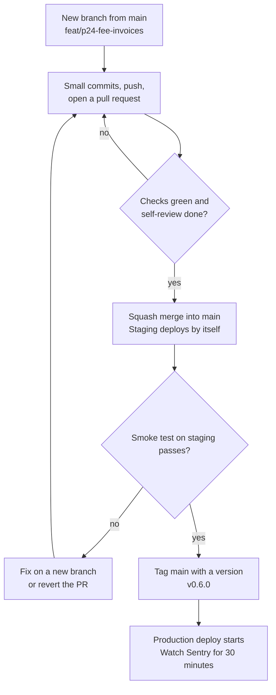
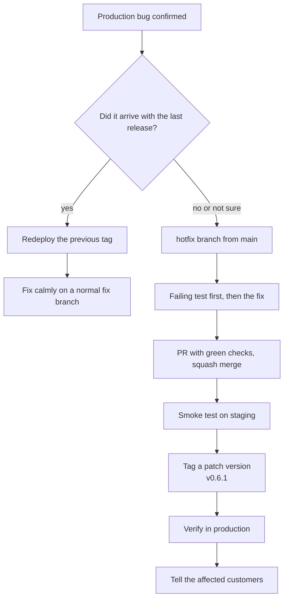

# Git Workflow: Branches, Commits and Pull Requests

**In simple words:** Git is the tool that stores every version of the EduFlow code. This chapter gives you one fixed way to use it: short branches, clean commit messages, one pull request per task, and a version tag for every production release. The same rules work for you alone today and for a team of 14 later. They also protect you from the three costly Git accidents: a broken `main`, a damaged database migration and a leaked secret.

## The strategy in one page

A solo founder needs a Git workflow that is boring. Boring means the same steps for every change, no clever branching, and an undo button for every mistake.

We use **trunk-based development** (one main line of code, called `main`; every change joins it in small pieces within a day or two). There is no second long-running line of code.

| Decision | Our choice | Why |
|---|---|---|
| Main line | `main` only. It is always ready to deploy. | One source of truth. Nothing to keep in sync. |
| Work branches | Short branches that live two days at most | Small diffs are easy to review and rarely conflict |
| `develop` branch | Not used | It doubles every merge and hides bugs. Staging does its job. |
| Merge method | Squash merge (all commits of the branch become one commit on `main`) | One PR is one line of history and one easy `git revert` |
| Staging | Every merge into `main` deploys to staging by itself | You test the real thing minutes after the merge |
| Production | A version tag such as `v0.6.0` on `main` starts the production deploy | You choose the moment. Every release has a name. |
| Commit messages | Conventional Commits | Readable history and an easy changelog |
| Review | A pull request for every change, even when you work alone | The PR page is where you really read the diff |
| Hotfix | `hotfix/` branch from `main`, then a patch tag | The same road as every change, only faster |

Five things you never do:

1. You never commit directly on `main`.
2. You never keep a branch alive for more than two working days.
3. You never merge while a check is red.
4. You never deploy to production without a tag.
5. You never edit a database migration that has already run outside your laptop.

> **Note:** *Working with Claude Code* already covers the build loop, the fifteen-point diff review and the Git undo commands. This chapter does not repeat them. It covers what happens around that loop: branch names, message rules, pull requests, GitHub protection, releases, migrations, hotfixes and leaked secrets.

### Why there is no develop branch

Many tutorials teach Git Flow (a model with `main`, `develop`, `feature/*`, `release/*` and `hotfix/*` branches). It was designed for software that ships a few times per year. EduFlow ships many times per week. This table compares the three common models.

| Point | Trunk-based (our choice) | `main` + `develop` | Git Flow |
|---|---|---|---|
| Long-running branches | 1 | 2 | 2, plus release branches |
| Merges per feature | 1 | 2 | 2 to 3 |
| Hotfix steps | Branch, PR, tag | Fix `main`, then copy the fix back to `develop` | Fix `main`, copy back to `develop` and to the release branch |
| Where bugs hide | Nowhere. `main` is what runs on staging. | In the gap between `develop` and `main` | In several gaps |
| Fits deploy-on-merge CI/CD | Yes | Partial | No |
| Fits a solo founder | Yes | Partial | No |

Three reasons decide it for us:

1. **Double merging wastes your hours.** With `develop`, each feature is merged twice: first into `develop`, later into `main`. You have about six build hours per day. None of them should go to moving code between your own branches.
2. **Two lines drift apart.** A hotfix goes to `main`. If you forget to copy it back to `develop` once, the same bug returns with the next release. A parent who sees a wrong fee balance twice does not trust the third receipt.
3. **Staging and tags already do the job.** People want `develop` as a place where merged code waits and gets tested. Our staging environment is that place. People want a merge into `main` as the release moment. Our version tag is that moment.

> **Tip:** One case needs an extra branch later. When a QA person must test a frozen version for a week, create a short `release/1.5` branch, fix only bugs on it, tag it, merge it back and delete it. It lives for days, not forever.

## Branch model

Only four kinds of Git objects matter in the EduFlow repository.

| Git object | What it means | What it deploys | Who creates it |
|---|---|---|---|
| `main` | The latest reviewed code | Staging, on every merge | GitHub, when you merge a PR |
| Short branch (`feat/`, `fix/`, `chore/`, `docs/`, `hotfix/`) | One task in progress | Nothing. Vercel can build a preview of the client for it. | You |
| Release tag (`v0.6.0`) | One exact commit on `main` that customers get | Production | You, after the staging test |
| Milestone tag (`m5-attendance-invoices`) | Proof of a weekly sprint milestone | Nothing | You, on Sunday |

The pipeline files that run these deploys are in *Docker and CI/CD* and *Deploy on Vercel and Railway*. This chapter fixes only the Git side: which branch or tag starts which deploy.

> **Note:** Before Week 8 there is no pipeline. You deploy by hand on Days 43 and 44, as *60-Day Roadmap Overview and Weekly Milestones* explains. Branches, commits and PRs still follow this chapter from Day 1. Release tags start with the pilot on Day 45.

**Figure: From a branch to production**



Every change walks the same road. Green checks and your review turn a pull request into one commit on `main`. Staging updates by itself, and production updates only when you push a version tag.

A smoke test is a quick manual check of the main flows: log in, mark attendance, collect a fee, open the Parent Portal. It takes five to ten minutes.

### Branch naming

The format is `type/short-description`. Use lowercase letters, digits and hyphens. No spaces, no capital letters, no personal names. Keep it under 40 characters.

| Prefix | Use it for | Example | Commit types inside |
|---|---|---|---|
| `feat/` | A new feature or one slice of a module | `feat/fee-invoices` | `feat`, `test` |
| `fix/` | A bug that can wait for the next normal release | `fix/attendance-lock` | `fix`, `test` |
| `hotfix/` | An urgent production bug | `hotfix/receipt-total-rounding` | `fix` |
| `chore/` | Tooling, dependencies, config, release preparation | `chore/release-v0-6-0` | `chore`, `build`, `ci` |
| `docs/` | Docs, specs and `CLAUDE.md` only | `docs/p02-claude-md-and-specs` | `docs` |
| `refactor/` | Restructure code with no behaviour change (P-51) | `refactor/fees-service-split` | `refactor` |
| `test/` | Tests only (P-49, P-50) | `test/payments-integration` | `test` |

Naming rules:

1. **During the 60-day sprint, put the prompt ID first.** Example: `feat/p24-fee-invoices`. The daily plan chapters use this form. Your branch list then reads like your sprint plan.
2. **Split a big prompt with letters.** Example: `feat/p06a-tenant-context` and `feat/p06b-rls-and-isolation-tests`. Each one is its own PR.
3. **After the sprint, use the issue number if there is one.** Example: `fix/142-attendance-lock`, where 142 is the GitHub issue number.
4. **Name the thing, not the activity.** `fix/attendance-lock` is good. `fix/bug`, `mehdi-work` and `new-changes` are useless in three weeks.
5. **One branch is one task and one PR.** If you notice a second problem while you work, write it in a GitHub issue. Do not fix it on the same branch.
6. **Delete the branch after the merge.** GitHub does this for you with the setting shown later in this chapter.

### The two-day rule

A branch lives for two working days at most. Each day a branch lives, `main` moves further away from it. The diff grows, the review gets weaker and merge conflicts appear. A conflict means Git cannot combine two changes to the same lines by itself, so you must choose by hand.

When a task is bigger than two days, split it into slices. Each slice leaves `main` in a working state.

| Slice | Contents | State of `main` after the merge |
|---|---|---|
| A | Prisma schema files, migration, seed data | App works. New tables are empty and unused. |
| B | API routes, services, Zod schemas, tests | API works. No screen calls it yet. |
| C | Screens, forms, sidebar link, permissions in the UI | The feature is visible to users |

Unfinished work stays hidden because slice C adds the sidebar link last. This is the simplest form of a feature flag (a switch that hides unfinished work from users). You do not need a feature-flag service in Year 1.

### The daily branch routine

```bash
# 1. Start from a fresh main
git switch main
git pull origin main
git switch -c feat/p24-fee-invoices

# 2. Work in small steps. Commit after every green step of the build loop.
git status
git add -A
git commit -m "feat(fees): add invoice generation service"

# 3. Back up to GitHub at the end of every work block
git push -u origin feat/p24-fee-invoices

# 4. Did main move while you worked? Bring it into your branch.
git fetch origin
git merge origin/main
npm run check

# 5. Open the pull request in the browser, with the template filled in
gh pr create --web
```

> **Note:** Many teams use `git rebase` in step 4 (rebase replays your commits on top of the new `main`). Rebase rewrites history and then needs a force push (a push that overwrites the branch on GitHub). We squash every PR, so the extra merge commit disappears anyway. `git merge` is safer and gives the same final result.

## Commit rules

### The message format

We use Conventional Commits 1.0.0, a small public standard for commit messages. A message has a header, an optional body and optional footers.

```text
type(scope): short summary, imperative mood, max 72 characters

Optional body. Say WHY the change was needed and what is different
now. Wrap the lines at 72 characters.

Refs: FEE-API-03, FEE-AC-07
```

Rules for the header:

- Start the summary with a verb in the imperative mood (the command form): "add", "fix", "remove". Not "added", not "adding".
- Use lowercase after the colon. Do not end with a full stop.
- Keep the whole header at 72 characters or less, so it fits in one line of `git log --oneline` and of the GitHub list.
- The header says **what** changed. The body says **why**.
- PRD IDs go into the `Refs:` footer. This links the code history to the spec.

### Commit types

| Type | Use it when | EduFlow example | Changelog section |
|---|---|---|---|
| `feat` | Users get new behaviour | `feat(fees): add late fee calculation` | Added |
| `fix` | A bug is fixed | `fix(attendance): block edits after the lock time` | Fixed |
| `perf` | Same behaviour, faster | `perf(students): add index for the list filters` | Changed |
| `refactor` | Structure changes, behaviour stays | `refactor(payments): split the receipt service` | None |
| `test` | Only tests change | `test(tenancy): add isolation test for fee invoices` | None |
| `docs` | Only docs, specs or `CLAUDE.md` change | `docs(repo): add the hotfix runbook` | None |
| `build` | Dependencies, Docker, build scripts | `build(deps): pin prisma to one exact 6.x version` | None |
| `ci` | GitHub Actions files | `ci(repo): run playwright on pull requests` | None |
| `chore` | Housekeeping that fits nowhere else | `chore(release): v0.6.0` | None |
| `style` | Formatting only, no logic | `style(client): apply prettier` | None |
| `revert` | Undo an earlier commit | `revert(fees): undo the late fee calculation` | Fixed or Removed |

A breaking change (a change that forces API users to change their code) gets an exclamation mark and a footer: `feat(api)!: rename the receipts list filter`, plus a footer line that starts with `BREAKING CHANGE:`. Before `v1.0.0` you have no outside API users, so you will rarely need it.

### Scopes

The scope says which part of the product changed. The canon gives every module a code, such as FEE or ATT. We use both, in different places:

- **Scope in the header = the module name in lowercase.** It is the same word as the module folder in `server/src/modules/` and the first part of the permission key (`fees.collect` gives `fees`). So `feat(fees): ...` is readable without a lookup table.
- **Module code in the footer = inside the PRD IDs.** `Refs: FEE-API-03` already contains the code FEE.

| Code | Scope | Code | Scope |
|---|---|---|---|
| DASH | `dashboard` | DSC | `discounts` |
| ORG | `organizations` | SCH | `scholarships` |
| CAMP | `campuses` | PP | `parent-portal` |
| ADM | `admissions` | SP | `student-portal` |
| STU | `students` | NTF | `notifications` |
| TCH | `teachers` | WA | `whatsapp` |
| STF | `staff` | EML | `email` |
| ATT | `attendance` | SMS | `sms` |
| LEV | `leave` | LIB | `library` |
| BAT | `batches` | INV | `inventory` |
| TT | `timetable` | TRN | `transport` |
| SUB | `subjects` | HST | `hostel` |
| HW | `homework` | PRL | `payroll` |
| EXM | `exams` | CRT | `certificates` |
| RPT | `report-cards` | ANL | `analytics` |
| FEE | `fees` | AI | `ai-insights` |
| PAY | `payments` | SET | `settings` |

> **Note:** Assumption: the scope words above follow the module folder names. If *Folder Structure* names a folder differently, the folder name wins. Change the scope list to match it.

Platform work that belongs to no single module uses these scopes:

| Scope | Covers |
|---|---|
| `repo` | Root config, workspaces, ESLint, Prettier, `CLAUDE.md`, `.gitignore` |
| `db` | Prisma schema files, migrations and seed data that touch many modules |
| `tenancy` | Tenant context, the Prisma extension, Row-Level Security |
| `auth` | Login, tokens, OTP, password reset, invitations |
| `rbac` | Roles, permissions, campus scoping |
| `api` | Response envelope, error handler, OpenAPI, rate limits |
| `ui` | App shell and the shared UI kit |
| `jobs` | BullMQ workers and queues |
| `files` | S3 uploads and pre-signed URLs |
| `audit` | Audit log and activity trail |
| `deps` | Dependency upgrades |
| `ci` | GitHub Actions workflows |
| `infra` | Docker, Railway, Vercel, AWS, Terraform |
| `release` | Version bumps and `CHANGELOG.md` |
| `i18n` | Languages, currency, timezone and locale packs |

> **Rule:** One scope per commit. If a commit needs two module scopes, it is two commits. The one exception is a true cross-module change, and that takes a platform scope such as `db` or `api`.

### Good and bad messages

| Bad message | What is wrong | Good message |
|---|---|---|
| `update` | Says nothing | `feat(fees): add fee head endpoints with permission checks` |
| `fixed bug` | Which bug? Past tense. No type. | `fix(payments): stop duplicate receipt on double click` |
| `WIP` | Work in progress is not a change | `feat(attendance): add batch marking screen without save` |
| `Fees module done` | Far too big for one commit. No type. | Four to eight commits, one per slice |
| `feat: invoices, login fix and deps update` | Three changes in one commit | Three commits: `feat(fees)`, `fix(auth)`, `build(deps)` |
| `fix(FEE): Fixed Rounding.` | Code as scope, capital letters, past tense, full stop | `fix(fees): round the late fee to 2 decimals` |
| `feat(fees): changes as suggested by claude` | Describes the process, not the change | `feat(fees): reject a due date before the issue date` |
| `chore: final final fix` | No information, wrong type | `fix(parent-portal): show paid invoices in the fee tab` |

Here is a complete message with a body and a footer. The IDs are examples. Use the real ones from `docs/api/` and the PRD module file.

```text
fix(payments): stop duplicate receipt on double click

The Collect button stayed active while the request was running.
A double click created two payments of Rs 12,000 for one invoice.
The API now honours the Idempotency-Key header on this route and
the button is disabled until the response arrives.

Refs: PAY-API-02, PAY-AC-06
```

### Commit size

| Question | Guideline |
|---|---|
| What is one commit? | One logical change. You can describe it without the word "and". |
| How many lines? | Usually 20 to 300 changed lines. At about 400 lines, stop and split. This matches the review limit in *Working with Claude Code*. |
| How often? | After every green step of the build loop. Four to ten commits on a normal build day. |
| Must it work? | Yes. Lint and typecheck pass on every commit. Then `git bisect` can find the commit that introduced a bug. |
| What gets its own commit? | A schema change with its migration. A dependency change. A formatting-only change. A file move or rename. |
| What always travels together? | `package.json` with `package-lock.json`. A Prisma schema change with its migration and with the copy in `docs/schema/`. Code with its tests. |

When one file holds two logical changes, stage them separately. `git add -p` shows each changed block and asks yes or no.

```bash
git add -p server/src/modules/fees/fees.service.ts
git commit -m "fix(fees): round the late fee to 2 decimals"
git add -A
git commit -m "feat(fees): add late fee waiver endpoint"
```

### Committing AI-generated code

Claude Code writes most of the code, but Git records you as the author. The customer, the auditor and the law look at you, not at the tool.

> **Founder note:** "Code Claude ka, zimmedari aapki." Claude writes it. You answer for it.

1. **Review first, commit second.** No diff read means no commit. The reading order and the fifteen-point checklist are in *Working with Claude Code*.
2. **You decide when a commit happens.** Claude Code commits only when you ask, as rule 15 of `CLAUDE.md` says. Ask only after you have read the diff.
3. **One logical change per commit.** Claude often adds "helpful extras": a renamed variable in another module, a new helper, a reformatted file. Put them back with `git restore <path>`, or commit them separately with the correct type.
4. **Read `git status` before `git add -A`.** Look for surprise files: a changed `package.json`, files outside the module folder, a new `.env` file, a huge generated file. If anything surprises you, add files by path.
5. **Never commit code you cannot explain.** Ask Claude: "Explain this file in five lines for a junior developer." If the answer is still unclear, ask for a simpler version. Confusing code in the fees module becomes a wrong receipt one day.
6. **Write about the change, not about the tool.** "As suggested by Claude" is not a reason. If Claude Code adds a `Co-Authored-By` line at the end of the message, keep it. It is honest, and you can later find those commits with `git log --grep`.
7. **Tests travel with the code.** A `feat` commit without its tests is half a commit. A commit that contains `it.skip` is never acceptable.
8. **Schema commits are complete.** The Prisma change, the migration folder and the copy in `docs/schema/` go into the same commit.

### Let a tool check the format

This step is optional and takes 15 minutes. Husky runs a script before each commit. Commitlint checks the message against Conventional Commits. Run this at the repo root:

```bash
npm install --save-dev husky @commitlint/cli @commitlint/config-conventional
npx husky init
```

`npx husky init` creates the `.husky/` folder with a sample `pre-commit` file and adds a `prepare` script to `package.json`. Replace the content of `.husky/pre-commit` with one fast check:

```bash
npm run lint && npm run typecheck
```

Create `.husky/commit-msg` with this single line:

```bash
npx --no -- commitlint --edit "$1"
```

Create `.commitlintrc.json` at the repo root. Add the remaining module scopes from the table above to the list.

```json
{
  "extends": ["@commitlint/config-conventional"],
  "rules": {
    "header-max-length": [2, "always", 72],
    "scope-empty": [2, "never"],
    "scope-enum": [
      2,
      "always",
      [
        "repo", "db", "tenancy", "auth", "rbac", "api", "ui", "jobs", "files",
        "audit", "deps", "ci", "infra", "release", "i18n",
        "dashboard", "organizations", "campuses", "admissions", "students",
        "teachers", "attendance", "batches", "subjects", "fees", "payments",
        "discounts", "parent-portal", "notifications", "whatsapp", "settings"
      ]
    ]
  }
}
```

Test it once. The first command must fail and the second must pass.

```bash
git commit --allow-empty -m "updated stuff"
git commit --allow-empty -m "chore(repo): test the commit message hook"
```

Commitlint ignores the messages that Git writes by itself for merges and for `git revert`, so those still work.

> **Warning:** The hook checks only commits made on your laptop. The squash commit is created by GitHub and its message is the PR title. So the PR title must follow the same format. The next section shows how CI can check it.

## Pull requests

A pull request (PR) is a page on GitHub that shows all changes of one branch before they enter `main`. For a solo founder the PR does four jobs: it runs the automatic checks, it shows the diff in a clean reading view, it stores your test evidence, and it becomes the permanent record of why the change was made.

### Pull request rules

1. **One prompt, one branch, one PR.** This is the rule of the daily plan chapters. A big prompt is split with letters, as shown above.
2. **The PR title is a Conventional Commit header.** With squash merge, the title becomes the commit message on `main`. Example: `feat(fees): add invoice generation and late fee rules`.
3. **Open the PR early as a draft.** A draft PR cannot be merged, but CI already runs on it. You see red checks after the first push, not at the end of the day.
4. **Keep it small.** Use the size table below.
5. **Fill in the whole template.** An empty section is a skipped check. Write "N/A" with a reason when a point does not apply.
6. **Merge only with green checks and a finished review log.** The merge method is always squash.

| Changed lines (without lock file and generated SQL) | Verdict |
|---|---|
| Up to 200 | Ideal. Review takes 10 to 15 minutes. |
| 200 to 400 | Fine. Review in one sitting. |
| 400 to 800 | Split if you can. If not, review in two sittings. |
| More than 800 | Split. Exceptions: the P-01 skeleton, the first migration, pure file moves. |

### The pull request template

Save this file as `.github/pull_request_template.md`. GitHub then fills every new PR with it. The lines between `<!--` and `-->` are hints for you. GitHub does not show them in the finished PR.

```markdown
<!-- The PR title becomes the squash commit on main. Use Conventional Commits:
     feat(fees): add invoice generation and late fee rules -->

## Summary

<!-- 2 to 4 lines. What changed and why. Write for yourself in six months. -->

## Type of change

- [ ] feat - new behaviour for users
- [ ] fix - bug fix
- [ ] hotfix - urgent production fix (link the incident note)
- [ ] refactor or perf - no behaviour change
- [ ] chore, build, ci, docs or test

## PRD IDs covered

<!-- Exact IDs from docs/prd/ and docs/api/. Example:
     FEE-API-03, FEE-API-04, FEE-US-05, FEE-AC-07, FEE-BR-02 -->

- Endpoints:
- User stories and acceptance criteria:
- Business rules:
- Left for the next slice:

## Screenshots or recording

<!-- UI change: before and after, desktop plus one mobile width (390 px).
     Seed data only (Bright Future Public School, Aarav Sharma).
     Never real student or parent data. API-only change: write "No UI". -->

## Test evidence

<!-- Paste real output. "Tests pass" is not evidence. -->

- Output of `npm run check`:
- New or changed tests:
- Manual test steps (role, screen, result):

## Risk level

- [ ] Low - docs, copy text, styling, tests only
- [ ] Medium - normal module code
- [ ] High - money, auth, RBAC, tenancy, data-changing migration, webhooks

High risk means: 24-hour rule plus a P-52 security review before the merge.

## Checklist

- [ ] Tenant scope: every query uses the tenant-aware Prisma client. No
      `organizationId` from body, query or params. Isolation test added or updated.
- [ ] Campus scope: lists and writes respect assigned campuses and `X-Campus-Id`.
- [ ] Permissions: every new route has auth plus `requirePermission` with the key
      from `docs/api/`. The UI hides what the role cannot do.
- [ ] Validation: Zod parses body, query and params. Strings and arrays have limits.
      Schemas used by both sides live in `shared/`.
- [ ] Envelope and errors: canon response envelope and canon error codes only.
- [ ] Money: Decimal only, currency stored, writes in one transaction,
      `Idempotency-Key` honoured on payment POSTs. (N/A if no money code.)
- [ ] Migrations: the schema change has a migration. No applied migration was edited.
      `docs/schema/` and `server/prisma/schema/` match. A destructive change
      follows expand-and-contract.
- [ ] Tests: new code has tests. No `it.skip`. Money, auth and permission code
      is covered.
- [ ] Docs: OpenAPI updated. `CLAUDE.md`, `.env.example` and `CHANGELOG.md`
      updated where needed.
- [ ] Secrets and personal data: no keys in code, no personal data in logs,
      no real data in screenshots.
- [ ] Scope: only files of this task changed. No surprise dependency.

## Migration and deploy notes

<!-- Write "None", or: migration name, whether the code now in production still
     works with the new schema, new env variables, backfill, order of steps. -->

## Rollback plan

<!-- Usually "Revert this PR". With a migration: say why the old code still
     works with the new schema. -->

## Review log

- PR opened (date, time):
- Self-review done (date, time):
- Second reviewer (fresh Claude Code session, P-52): PASS or FAIL
- Findings fixed in commit:
```

### From open to merged

```bash
# Open the PR as a draft after the first push
gh pr create --draft --title "feat(fees): add invoice generation and late fee rules"

# When the work is complete
npm run check
git push
gh pr ready                 # draft becomes "ready for review"
gh pr checks --watch        # wait for CI
gh pr view --web            # read "Files changed" in the browser

# After your review
gh pr merge --squash --delete-branch
git switch main
git pull origin main
```

`gh pr create` asks a few questions in the terminal. When it asks for the body, keep the template, and fill it in later on the PR page. After the merge, open the staging URL and run your smoke test. Only then start the next branch.

### Let CI check the PR title

This small job pipes the PR title into commitlint. Add it to the CI workflow from *Docker and CI/CD*. It needs the commitlint setup shown above.

```yaml
  pr-title:
    if: github.event_name == 'pull_request'
    runs-on: ubuntu-latest
    steps:
      - uses: actions/checkout@v4
      - uses: actions/setup-node@v4
        with:
          node-version: 24
          cache: npm
      - run: npm ci
      - name: Lint the PR title
        env:
          PR_TITLE: ${{ github.event.pull_request.title }}
        run: echo "$PR_TITLE" | npx commitlint
```

The title goes through an environment variable on purpose. A PR title is user input. Pasting it straight into a shell command would be a script-injection hole.

## Self-review routine for a solo founder

A team has a second person who reads every PR. You do not. You replace that person with three things: **time**, a **fixed routine** and a **second reviewer that did not write the code**.

> **Founder note:** "Aaj likho, kal review karo, phir merge karo." Write today, review tomorrow, then merge. After one night you read your own code like a stranger. That is exactly what a review needs.

### Risk tiers

| Tier | Examples | Wait before merge | Who reviews |
|---|---|---|---|
| Low | Docs, copy text, CSS, tests only, demo seed data | None. Merge when CI is green. | You, one read on the PR page |
| Medium | Normal module screens and CRUD, reports, a migration that only adds a table or a nullable column | One real break of 30 minutes away from the screen | You, plus `/review-module` in a fresh session |
| High | Fees, Payments and Discounts maths. Auth. RBAC. Tenancy layer and RLS. Migrations that change or delete data. Razorpay and WhatsApp webhooks. S3 file access. CI/CD secrets. | 24 hours | You, every line, plus P-52 in a fresh session |

`/review-module` is the custom command from *Working with Claude Code*. P-52 is the security review prompt from *Prompts: Quality, Security and DevOps*.

### The 24-hour rule

A high-risk PR is never merged on the day it was written. This does not cost you a full day:

1. Finish the high-risk PR by the evening. Mark it ready. CI runs while you eat.
2. Next morning, before you write any new code, review it. Your daily rhythm already has a 30-minute review slot. Use it here.
3. Merge, smoke-test staging, then start the day's build work.

If today's task depends on the waiting PR, create the new branch from the waiting branch instead of `main`. After the first PR is merged, run `git fetch origin` and `git merge origin/main` on the second branch. Do this only one level deep. A chain of three waiting branches is a sign that your PRs are too big.

The only exception is a production outage. A hotfix may merge without the wait, and you then review it within 24 hours after the merge. The hotfix section explains this.

### The review routine

1. **Checks first.** If CI is red, do not read anything. Fix it.
2. **Read on GitHub, not in the editor.** Open the "Files changed" tab. The different screen breaks your writer's view of the code.
3. **Read in the fixed order:** schema and migrations, then routes, services, tests, shared contracts and last the UI. Tick "Viewed" on each file when you finish it.
4. **Comment on your own PR.** Anything odd gets a comment on that line. Branch protection will block the merge until each comment is resolved. This stops the thought "I will fix it later".
5. **Run the second reviewer** for Medium and High tiers, with the script below.
6. **Fix findings in new commits on the same branch.** Push. CI runs again.
7. **Test by hand** as the correct role. For Fees this is the accountant Suresh Gupta, not the Organization Admin. Many permission bugs show only with the smaller role.
8. **Fill in the review log** in the PR. Squash merge. Watch the staging deploy.

**Script: second reviewer for a high-risk PR (fresh Claude Code session)**

```text
You did not write this code. Act as the security reviewer of
prompt P-52.
Read CLAUDE.md, docs/canon.md and the PRD file of this module first.
Review only the diff between main and this branch:
  git diff origin/main...HEAD
Check in this order:
1. Tenant isolation: can organization A read or change data of
   organization B through any new route, query, job or raw SQL?
2. Permission key and campus scope on every new route.
3. Input validation and mass assignment.
4. Money: Decimal, one transaction, idempotency, rounding.
5. Secrets, tokens and personal data in code, logs and errors.
6. The migration: data loss, long locks, backward compatibility.
For each finding give: severity (Critical, High, Medium, Low),
file and line, how to abuse it in one sentence, the smallest fix.
Do not change any file.
End with a table: check, PASS or FAIL, evidence.
If everything passes, name the two riskiest lines that I should
still read myself.
```

This is the short PR version. The full P-52 prompt, with the OWASP checklist, is in *Prompts: Quality, Security and DevOps*. Run the full prompt once per module in Week 8, as the sprint skeleton plans.

| Finding | What you do |
|---|---|
| Critical or High | Fix before the merge. Run the review again on the new diff. |
| Medium | Fix now if it takes under 30 minutes. If not, create a GitHub issue with a date and link it in the PR. |
| Low | Your judgement. Do not let ten Low notes delay a release. |
| Reviewer is wrong | Write one line in the PR saying why. A future team member will ask the same question. |

> **Warning:** The second reviewer is a second pair of eyes, not a guarantee. For money code and auth code you still read every line yourself.

## Branch protection on GitHub

Branch protection is a set of GitHub rules that block unsafe actions on a branch. It protects `main` from your own tired evenings. Two places need settings.

> **Note:** For a private repository, GitHub enforces branch protection only on a paid plan: GitHub Pro for a personal account, or GitHub Team for an organization. Estimate: about US$4 per month, roughly ₹340 at the canon planning rate. Verify the current price and plan rules on GitHub's pricing page before you rely on this.

### Repository settings

Open the repository, then Settings, then General, and scroll to "Pull Requests".

| Setting | Value | Why |
|---|---|---|
| Allow merge commits | Off | Keeps `main` a straight line |
| Allow squash merging | On, with the default commit message set to "Default to pull request title" | One PR becomes one Conventional Commit |
| Allow rebase merging | Off | One way to merge means no daily decision |
| Always suggest updating pull request branches | On | Reminds you to bring in `main` before the merge |
| Allow auto-merge | On | A Low-tier PR can merge by itself when checks turn green |
| Automatically delete head branches | On | No graveyard of old branches |

### Protection rule for main

Open Settings, then Branches, then add a branch protection rule with the branch name pattern `main`. GitHub may label the button "Add classic branch protection rule". A ruleset with the same choices also works.

| Setting | Solo (now) | Team (from 2 developers) | Why |
|---|---|---|---|
| Require a pull request before merging | On | On | No direct push to `main` |
| Required approvals | 0 | 1 | GitHub does not let you approve your own PR |
| Dismiss stale approvals on new commits | Off | On | An approval must cover the final code |
| Require review from Code Owners | Off | On | Money, auth and tenancy need a senior reviewer |
| Require status checks to pass | On, from Week 8 | On | Red CI can never reach `main` |
| Require branches to be up to date | On | On | Checks run against the latest `main` |
| Require conversation resolution | On | On | Your notes to yourself must be closed |
| Require linear history | On | On | Fits squash merge. `git bisect` stays simple. |
| Require signed commits | Off | Optional | Useful later for audits. Not needed in Year 1. |
| Do not allow bypassing the above settings | On | On | The rules bind the admin too, and that is you |
| Allow force pushes | Off | Off | History on `main` is never rewritten |
| Allow deletions | Off | Off | Nobody deletes `main` |

### Required checks

A required check is a CI job that must be green before GitHub enables the merge button. GitHub lists a check in the search box only after it has run at least once in the repository. So you add these in Week 8, right after P-55 has created the pipeline.

| Check (job name) | What it runs | What it catches |
|---|---|---|
| `lint` | `npm run lint` | Unused code, bad imports, broken style rules |
| `typecheck` | `npm run typecheck` | Type errors across `client/`, `server/` and `shared/` |
| `test` | `npx prisma migrate deploy` on an empty CI database, then `npm run test` | Broken logic, tenant leaks, migrations that do not replay from zero |
| `build` | `npm run build` | Code that works in dev mode but does not build |
| `pr-title` | Commitlint on the PR title | A bad squash commit message |

> **Note:** Assumption: the job names above match the workflow that P-55 creates. The required check name is the job name in the workflow file. If your `ci.yml` uses other names, select those. The Playwright end-to-end job is slower, so it is not required on every PR at first. Run it on `main` after each merge. Make it required before the first hire.

Also protect the release tags. Open Settings, then Rules, then Rulesets, and create a tag ruleset for the pattern `v*` that restricts deletions and updates. A release tag that moves is a lie about what ran in production.

Roll the protection out in three steps:

| When | What you switch on |
|---|---|
| Day 1 | Pull request required, force pushes off, deletions off, squash merge only |
| Week 8, after P-55 | Required checks, up-to-date branches, conversation resolution, tag ruleset |
| Before the first developer joins | 1 approval, Code Owners, dismiss stale approvals |

> **Tip:** If your own rules block you during an outage, do not switch them off. The hotfix path uses the same PR and the same checks and costs about ten minutes. Only when CI itself is broken and production is down may you untick "Do not allow bypassing", merge, and tick it again at once. Write that in the incident note.

## Versioning and releases

### Semantic versioning for a SaaS

Semantic Versioning (SemVer) is a public standard for version numbers: `MAJOR.MINOR.PATCH`, for example `1.4.2`. Nobody installs EduFlow, so why version it? There are four reasons. Sentry can show which release introduced an error. A rollback needs a clear target. A support chat needs a clear answer to "since when?". And customers trust a product that publishes what changed.

| Part | You raise it when | Example |
|---|---|---|
| MAJOR | A product generation ships (V1.0, V2.0), or the public API changes in a breaking way | `v1.9.3` to `v2.0.0` |
| MINOR | A new module, screen, endpoint or setting ships. Old behaviour still works. | `v0.5.1` to `v0.6.0` |
| PATCH | A bug fix, hotfix, text change or speed improvement ships | `v0.6.0` to `v0.6.1` |

The version numbers line up with the canon release phases. This mapping is an assumption of this chapter, and it is consistent with the canon dates.

| Version | What it is | Target date |
|---|---|---|
| `v0.1.0` | First pilot release for the 5 friendly institutes | Day 45, 18 Nov 2026 |
| `v0.2.0`, `v0.3.0` and so on | Each feature release during the pilot and the public launch. After `v0.9.0` comes `v0.10.0`. | Nov 2026 to Jan 2027 |
| `v0.x.1`, `v0.x.2` | Bug-fix and hotfix releases | Any time |
| `v1.0.0` | Phase 2 complete (V1.0) | Day 120, 1 Feb 2027 |
| `v1.1.0` to `v1.4.x` | Phase 3 modules as they ship | Feb to May 2027 |
| `v1.5.0` | Phase 3 complete (V1.5) | June 2027 |
| `v2.0.0` | Phase 4 complete (V2.0) | September 2027 |

There are two tag families, and they do not collide. Milestone tags such as `m9-launch-ready` prove sprint progress and deploy nothing. They are defined in *60-Day Roadmap Overview and Weekly Milestones*. Release tags start with `v` and deploy to production. The launch-ready commit of Day 60 carries both: `m9-launch-ready` and the next free `v0.x.0`.

### The release procedure

A release is three small steps: a release PR, a tag and a GitHub release page.

```bash
# 1. Release PR: version number and changelog
git switch main
git pull origin main
git switch -c chore/release-v0-6-0
npm version 0.6.0 --no-git-tag-version     # updates the root package.json only
# Edit CHANGELOG.md: move the "Unreleased" items under "## [0.6.0] - 2026-12-10"
git add -A
git commit -m "chore(release): v0.6.0"
git push -u origin chore/release-v0-6-0
gh pr create --web

# 2. After the merge and a full smoke test on staging: tag main
git switch main
git pull origin main
git tag -a v0.6.0 -m "v0.6.0 - email and SMS channels for fee reminders"
git push origin v0.6.0

# 3. Publish the release page on GitHub
gh release create v0.6.0 --title "v0.6.0" --generate-notes
```

The tag push starts the production workflow. The trigger in the workflow file looks like this. The jobs below it are in *Docker and CI/CD*.

```yaml
on:
  push:
    tags:
      - "v*.*.*"
```

`--generate-notes` builds the release text from the titles of the merged PRs. Your titles are Conventional Commits, so the list is readable without editing.

Release timing rules (assumption, based on how schools and coaching institutes work):

- Release on Monday to Thursday. Never on a Friday evening, and never on the evening before a holiday.
- Avoid 8:00 to 11:00 IST, when teachers mark attendance and the fee counter opens.
- A release with a migration goes out after 21:00 IST, when almost nobody is logged in.
- Avoid risky releases in the week of the fee due date. For many institutes that is around the 10th of the month.
- Stay at your desk for 30 minutes after every release. Watch Sentry and the API logs.

### The changelog

`CHANGELOG.md` lives at the repo root. It follows the Keep a Changelog format: newest version on top, and fixed section names (Added, Changed, Fixed, Removed, Security). Every `feat` and `fix` PR adds one line under "Unreleased". The release PR moves those lines under the new version.

```markdown
# Changelog

All notable changes to EduFlow are written in this file.
Format: Keep a Changelog. Version numbers: Semantic Versioning.

## [Unreleased]

### Added
- Staff module: staff list and staff profile screens (STF).

## [0.6.0] - 2026-12-10

### Added
- Email channel through Amazon SES for fee reminders and receipts (EML).
- SMS channel through MSG91 with DLT template IDs (SMS).

### Changed
- The fee reminder job now runs at 10:00 in the organization's timezone (FEE).

### Fixed
- Parent Portal showed cancelled invoices in the pending list (PP, FEE).

### Security
- The login rate limit now counts attempts per account and IP together (AUTH).

## [0.5.1] - 2026-12-07

### Fixed
- The receipt PDF printed the late fee twice when the invoice had a discount (PAY).
```

Write each line in words that an institute owner understands. "Fixed receipt total" is good. "Fixed Decimal serialisation in the PDF worker" belongs in the commit body.

### Release notes for customers

The changelog is for you and for technical buyers. Customers need something shorter, in their own language, on the channel they read. Prompt P-59 drafts it from the changelog. Send it as a WhatsApp broadcast and as an in-app notice. Longer templates are in *WhatsApp and Email Templates*.

**Script: WhatsApp release note (Hinglish)**

```text
EduFlow update - 10 Dec 2026

Namaste! Is hafte EduFlow mein 2 naye features aaye hain:

1. Fee reminder ab email par bhi jaata hai.
2. SMS reminder shuru ho gaya hai (DLT approved templates).

Ek bug bhi theek hua hai: Parent Portal mein cancelled invoice
ab pending list mein nahi dikhega.

Koi dikkat ho to isi number par message karein.
- Mehdi, EduFlow
```

### Rolling back a release

| Situation | Action |
|---|---|
| The new release is broken. Its migration is backward compatible, or it has none. | Redeploy the previous tag with the rollback steps in *Deploy on Vercel and Railway*. Target: under 10 minutes. |
| You rolled back and now have time | Revert the bad commit through a PR, or fix it. Release it as the next patch version. |
| The release dropped or changed data | Do not redeploy old code. Fix forward, or restore with *Monitoring, Backups and Incident Response*. |
| You tagged the wrong commit | Leave the tag. Release the correct commit as the next patch version. |

> **Rule:** A pushed tag is never moved and never deleted. Version numbers are free. A bad `v0.6.0` is followed by `v0.6.1`, not by a second `v0.6.0`.

## Database migrations in Git

A migration is a small SQL file that changes the database structure: a new table, a new column, a new index. Prisma creates these files and Git stores them. Code can be rolled back in minutes. Data cannot. So migrations get stricter rules than any other file in the repository.

### How a migration travels

| Place | Command | Who runs it |
|---|---|---|
| Your laptop | `npx prisma migrate dev --name add_fee_invoice_index` | You, inside `server/` |
| CI | `npx prisma migrate deploy` on an empty test database | GitHub Actions, on every PR |
| Staging | `npx prisma migrate deploy` before the new API starts | The deploy pipeline, on every merge into `main` |
| Production | `npx prisma migrate deploy` before the new API starts | The deploy pipeline, on every release tag |

`migrate dev` creates a new migration and applies it to your local database. `migrate deploy` only applies the migration files that already exist in Git. It never creates anything. That is why it is the only migration command allowed on staging and production.

### The ten migration rules

1. **Never edit or delete an applied migration.** "Applied" means it has run anywhere outside your laptop. In practice that is the moment it is merged into `main`. Prisma stores a checksum (a fingerprint of the file content) for every applied migration in the `_prisma_migrations` table. If you edit the file later, the fingerprint no longer matches, and `migrate dev` asks you to reset the database. On production a reset means all customer data is gone.
2. **Fix forward.** A mistake in an applied migration is repaired by a new migration. Prisma has no automatic "down" migrations, and you do not need them.
3. **Schema and migration travel together.** The `.prisma` change, the migration folder and the copy in `docs/schema/` are in the same commit and the same PR.
4. **One migration per PR.** Name it in snake_case with the verb first: `add_fee_invoice_pdf_status`, `create_transport_tables`, `drop_guardian_phone`.
5. **Read the SQL before you commit.** Open the new `migration.sql` file. Prisma sometimes turns a field rename into `DROP COLUMN` plus `ADD COLUMN`. That deletes the data of the column. The warning box below shows how to avoid this.
6. **Use `--create-only` when the SQL needs hand work.** This covers a backfill (filling a new column from old data), a partial index or an RLS policy. It creates the file and does not apply it. Edit the SQL, then run `npx prisma migrate dev` to apply it.
7. **Only `migrate deploy` touches shared databases.** Never run `migrate dev`, `migrate reset` or `db push` against staging or production.
8. **Re-create your unmerged migration after a conflict.** If `main` received a new migration while your branch had its own, first run `git merge origin/main`. Then delete your own migration folder, which exists only on your laptop. Run `npx prisma migrate reset` locally and then `npx prisma migrate dev --name <same-name>` again. Your migration now sorts after the one from `main`.
9. **A destructive change follows expand-and-contract.** Destructive means a drop, a rename, a type change, or a nullable column that becomes required. The pattern is explained below.
10. **Back up before a risky production migration.** Take a manual snapshot first, as *Monitoring, Backups and Incident Response* describes. Write the snapshot name into the PR.

> **Warning:** If you only want a nicer field name in the code, do not rename the column. Rename the Prisma field and keep the old column with `@map("old_column_name")`. The database does not change, and no data can be lost.

### Safe and unsafe changes

| Change | Safe in one step? | How to do it safely |
|---|---|---|
| Add a table | Yes | Normal migration |
| Add a nullable column | Yes | Normal migration |
| Add a required column with a constant default | Yes | PostgreSQL 16 adds it without rewriting the table |
| Add a required column without a default | No | Add it as nullable, backfill, then set NOT NULL in a later release |
| Rename a column or table | No | Expand-and-contract, or only `@map` |
| Drop a column or table | No | First release code that no longer uses it. Drop it one release later. |
| Change a column type | No | New column, backfill, switch the code, drop the old column |
| Add a unique constraint | Partial | First check for duplicates per organization with a SQL query |
| Add an index on a very large table | Partial | A normal index blocks writes while it builds. Below about one million rows this takes seconds. |
| Add an enum value | Yes | Put it alone in one migration. Use the new value in code only after that. |
| Remove an enum value | No | Move the rows to another value first. Then re-create the enum type. |

### Expand-and-contract, step by step

During a deploy, old and new API containers run side by side for a minute or two. After a bad release you may also redeploy the previous version. In both cases **old code meets the new database**. Expand-and-contract is the pattern that keeps this safe. First you add (expand). Then you move the code. Last you remove (contract).

> **Note:** The next example is for teaching only. It renames `guardians.phone` to `guardians.primary_phone`. The canon schema is fixed, and this rename is not planned. If you only wanted a better name in the code, `@map` would do it with no migration at all.

| Step | Release | Migration | Application code | Rollback |
|---|---|---|---|---|
| Expand | `v0.7.0` | Add nullable `primary_phone`. Backfill it from `phone`. | Writes both columns. Reads `phone`. | Safe. Old code ignores the new column. |
| Switch reads | `v0.7.1` | None | Reads `primary_phone`. Still writes both. | Safe. Both columns are full. |
| Wait | None | None | Watch for one week. Check that no row has an empty `primary_phone`. | Not needed |
| Contract | `v0.8.0` | Set `primary_phone` to NOT NULL. Drop `phone`. | `phone` is gone from the Prisma schema and from the code | Point of no return. Back up first. |

The expand migration. Create it with `--create-only`, then add the `UPDATE` by hand:

```sql
-- migrations/20261214153000_add_guardian_primary_phone/migration.sql
ALTER TABLE "guardians" ADD COLUMN "primary_phone" VARCHAR(20);

UPDATE "guardians"
SET "primary_phone" = "phone"
WHERE "primary_phone" IS NULL;
```

The contract migration, at least one week and one stable release later:

```sql
-- migrations/20261228153000_drop_guardian_phone/migration.sql
UPDATE "guardians"
SET "primary_phone" = "phone"
WHERE "primary_phone" IS NULL;

ALTER TABLE "guardians" ALTER COLUMN "primary_phone" SET NOT NULL;
ALTER TABLE "guardians" DROP COLUMN "phone";
```

> **Warning:** Prisma names every column it knows in its SQL queries. Code whose Prisma schema still has `phone` fails after the column is dropped. So the contract step cannot be undone by redeploying old code. That is why you wait one week, take a backup and release it in the quiet evening hour.

If a migration fails halfway on staging or production, do not edit files in panic. Read the error and repair the database state by hand. Then tell Prisma what happened with `npx prisma migrate resolve --rolled-back "<migration_name>"`, and ship the repair as a new migration. The incident steps are in *Monitoring, Backups and Incident Response*.

## Hotfix procedure

A hotfix is an urgent fix for a production bug that cannot wait for the next normal release. Examples: receipts show a wrong total, parents cannot log in, attendance cannot be saved. With trunk-based development a hotfix is not a special road. It is the normal road with a faster clock.

**Figure: Hotfix decision flow**



First ask if a rollback solves it. Redeploying the previous tag is the fastest repair, and it works because migrations stay backward compatible. If the bug is older than the last release, fix forward through a `hotfix/` branch.

### Steps with time targets

| Step | What you do | Target |
|---|---|---|
| Confirm | Reproduce the bug on production or staging with a test account. Note the Sentry link. | 10 min |
| Decide | Rollback or fix forward, as in the figure above | 5 min |
| Branch | `git switch main`, `git pull origin main`, `git switch -c hotfix/receipt-total-rounding` | 1 min |
| Fix | Write a failing test that shows the bug. Then fix it. Prompt P-54 helps you find the cause. | 30 to 60 min |
| Check | `npm run check`. Open the PR and tick "hotfix". CI must be green. Never skip CI. | 10 min |
| Review | Read every changed line. For money or auth code, run the short P-52 script. The 24-hour wait is waived. | 15 min |
| Merge | Squash merge. Staging deploys. Smoke-test the broken flow and one neighbour flow. | 10 min |
| Release | Add a line to `CHANGELOG.md`, tag the patch version and push the tag | 5 min |
| Verify | Repeat the failing case on production. Watch Sentry for 30 minutes. | 30 min |
| Tell | Message the affected institutes with the script below | 10 min |
| Learn | Within 24 hours: re-read the merged diff and write five lines in the incident log. What broke, why, and which test now prevents it. | 20 min |

```bash
git switch main
git pull origin main
git switch -c hotfix/receipt-total-rounding
# failing test, fix, then:
npm run check
git add -A
git commit -m "fix(payments): count the late fee once on discounted invoices"
git push -u origin hotfix/receipt-total-rounding
gh pr create --web
# after green checks, review and merge:
git switch main
git pull origin main
git tag -a v0.6.1 -m "v0.6.1 - hotfix: receipt total on discounted invoices"
git push origin v0.6.1
```

### When main is not ready for production

Sometimes `main` holds merged work that is fine on staging but must not reach customers yet. Then a hotfix from `main` would ship that work too. In this rare case, branch from the production tag instead:

```bash
git switch -c hotfix/receipt-total-rounding v0.6.0
# failing test, fix, commit, then tag the fix on this branch:
git tag -a v0.6.1 -m "v0.6.1 - hotfix: receipt total on discounted invoices"
git push -u origin hotfix/receipt-total-rounding
git push origin v0.6.1
# bring the same fix into main through a normal PR:
gh pr create --web
```

Production now runs `v0.6.0` plus the fix. `main` receives the same fix through the PR, so the next release contains it as well. If you need this path more than once per quarter, your PRs stay unreleased for too long. Release more often.

**Script: WhatsApp message to affected institutes after a hotfix**

```text
Namaste Rajesh ji,

Aaj subah 10:15 se 11:40 ke beech EduFlow ki fee receipt mein
ek galti thi: discount wale invoice par late fee do baar print
ho rahi thi. Payment ki entry sahi thi. Sirf PDF mein total
galat dikh raha tha.

Ab yeh theek ho gaya hai. Us time ki 3 receipts humne dobara
bana di hain. Aap unhe Fees > Receipts mein dekh sakte hain.

Is dikkat ke liye maafi. Koi sawaal ho to isi number par
message ya call karein.
- Mehdi, EduFlow
```

Tell the customer before the customer tells you. An owner like Rajesh Sharma forgives a bug that you report yourself within two hours. He does not forgive a bug that a parent finds.

## Gitignore essentials

`.gitignore` is a list of files that Git must never track. P-01 creates it. Check that your root `.gitignore` contains at least these lines.

```text
# Dependencies
node_modules/

# Environment files. Real values never go into Git.
.env
.env.*
!.env.example

# Build output
.next/
out/
dist/
build/
*.tsbuildinfo
next-env.d.ts

# Test output
coverage/
playwright-report/
test-results/

# Logs
*.log
npm-debug.log*
logs/

# Keys and certificates
*.pem
*.key
*.p12

# Database dumps and local data. They contain personal data.
*.dump
*.sql.gz
backups/
tmp/
uploads/

# Editors and operating systems
.DS_Store
Thumbs.db
.idea/
.vscode/*
!.vscode/extensions.json
!.vscode/settings.json

# Claude Code: shared settings are committed, personal ones are not
.claude/settings.local.json

# Hosting and infrastructure
.vercel/
.terraform/
*.tfstate
*.tfstate.*
```

| Always committed | Never committed |
|---|---|
| `package-lock.json` (one file, at the root) | `.env` files with real values |
| `.env.example` files with fake sample values | Database dumps and backups |
| The Prisma migration folders | Excel files from real institutes with student data |
| `CLAUDE.md`, `.claude/settings.json`, `.claude/commands/` | Private keys and certificates (`.pem`, `.key`) |
| `.nvmrc`, `.editorconfig`, `.gitattributes`, `.github/` | Screenshots that show real names or phone numbers |
| `CHANGELOG.md` and `docs/` | `node_modules/`, build and test output |

Student data is children's personal data under the DPDP Act. A customer's Excel import file must never enter the repository, not even "only for a test". Keep such files outside the repo folder. Delete them after the import is done.

`.gitignore` does not help for a file that Git already tracks. Stop tracking it like this:

```bash
git rm --cached server/.env
git commit -m "chore(repo): stop tracking server env file"
git check-ignore -v server/.env      # prints the rule that now ignores the file
git ls-files "*.env*"                # only .env.example files may appear here
```

If that `.env` file held real secrets, the next section applies.

Add one more small file, `.gitattributes`. You work on Windows and CI runs on Linux. Without this file, line endings differ between the two, and Prettier reports every line as changed.

```text
* text=auto eol=lf
*.png binary
*.jpg binary
*.pdf binary
*.xlsx binary
```

## When a secret leaks by mistake

A secret is any value that gives access: a database password, a JWT signing secret, an API key, a webhook secret, a token. One day you or Claude Code will commit one by mistake. What you do in the next 15 minutes matters most.

> **Rule:** A pushed secret is a burnt secret. Rotate first, clean up second. Deleting the line in a new commit does not help, because the old commit still holds the value.

"Rotate" means you create a new value at the provider, put it into the hosting environment and make the old value invalid.

### The first fifteen minutes

1. **Rotate the secret at the provider.** Use the table below. Do this before anything else.
2. **Update the variable** in Railway, Vercel and your local `.env`. Restart the API and the worker. The variable names are in *Environment Variables and Command Reference*.
3. **Check for misuse.** Look at the provider's logs for the time between the push and the rotation: the AWS CloudTrail events for the access key, the Razorpay dashboard, the database connection logs.
4. **Remove the secret from the current code.** Commit and merge through a PR as usual.
5. **Decide about history.** For a private repository that only you can read, rotation is the real fix. Purge the history anyway when the secret cannot be fully rotated, or before another person gets access to the repository.
6. **Write five lines in the incident log.** If the logs show that someone used the secret and could reach personal data, this is a personal data breach. Follow the breach steps in *Monitoring, Backups and Incident Response* and the PRD chapter *Privacy and Compliance*. The canon baseline is a breach notice within 72 hours.

| Secret | Where you rotate it | Side effect |
|---|---|---|
| Database password (inside `DATABASE_URL`) | Railway PostgreSQL service, later AWS RDS | API and worker restart. About one minute of errors. |
| Redis password (inside `REDIS_URL`) | Railway Redis service, later ElastiCache | Workers reconnect. Waiting jobs stay in the queue. |
| JWT signing secrets | Your hosting environment variables | Every user is logged out and logs in again |
| AWS access key (S3, SES) | AWS IAM: deactivate the key, create a new one, delete the old one | Uploads and emails fail until the new key is live |
| Razorpay key secret and webhook secret | Razorpay dashboard | Online payments fail until the new key is live. Do it at once anyway. |
| Stripe secret key and webhook secret | Stripe dashboard ("roll key") | Same as Razorpay |
| WhatsApp Cloud API access token | Meta Business settings: revoke the token, create a new one | Messages wait in the queue and go out after the change |
| MSG91 auth key | MSG91 dashboard | SMS messages wait in the queue |
| Sentry auth token (used in CI) | Sentry account settings | Release uploads fail until it is updated in GitHub secrets |

### Purging the history

Only after the rotation. The tool is `git filter-repo`, a separate program (install it with `pip install git-filter-repo`). It rewrites every commit, so every commit ID changes.

```bash
# 1. Work in a fresh clone, never in your working folder
git clone git@github.com:YOUR-USER/eduflow.git eduflow-clean
cd eduflow-clean

# 2a. Remove one file from the whole history
git filter-repo --invert-paths --path server/.env

# 2b. Or replace a leaked value wherever it appears
#     replacements.txt holds one line per secret:  the-leaked-value==>REMOVED
git filter-repo --replace-text ../replacements.txt

# 3. filter-repo removes the "origin" remote on purpose. Add it again.
git remote add origin git@github.com:YOUR-USER/eduflow.git

# 4. Overwrite GitHub. Allow force pushes on main for these two minutes only.
git push origin --force --all
git push origin --force --tags
```

After the purge:

- Switch "Allow force pushes" off again at once.
- Delete every old clone on every machine and clone again. An old clone pushes the secret back with its next push.
- Close or re-create open PRs, because their commits no longer exist.
- GitHub may still hold the old commits in cached views and in PR references. GitHub's guide "Removing sensitive data from a repository" explains how to ask GitHub Support to remove them.
- Search once more: `git log --all -S "first-8-characters-of-the-secret" --oneline` must print nothing.

If the secret is only in a local commit that you never pushed, it never left your laptop. Run `git reset --soft HEAD~1`, remove the value and commit again. No rotation is needed.

### Preventing the next leak

| Layer | What it does |
|---|---|
| `.gitignore` | `.env` files cannot be added by accident |
| `.env.example` | Shows every variable name with a fake value, so nobody needs to share a real file |
| `CLAUDE.md` rule 11 | Claude Code never opens or prints `.env` files and never writes keys into code |
| Quick scan before merge | The `grep` for secrets in *Working with Claude Code* |
| Secret scanner in the pre-commit hook | A tool such as gitleaks checks staged files and blocks the commit. Use the command from its current README. |
| GitHub secret scanning and push protection | Free for public repositories. For private repositories it is a paid add-on. Verify the current plans. |
| Separate keys per environment | A leaked staging key can never touch production data or real money |

## How the workflow grows with the team

The canon targets a team of 4 at the end of Year 1, 14 in Year 2 and 40 in Year 3. The workflow stays trunk-based at every stage. Only the guard rails grow.

| Stage | Team | What changes |
|---|---|---|
| Now | You and Claude Code | 0 approvals. Self-review routine. P-52 as the second reviewer. |
| First hire to Year 1 | 2 to 4 developers | 1 approval. Code Owners for money, auth and tenancy. Playwright becomes a required check. PRs under 400 lines stay the rule. |
| Year 2 | 5 to 14 developers | GitHub merge queue, so "up to date" does not block people. Feature flags for work that takes weeks. A release owner who rotates weekly. |
| Year 3 and later | 40 and more | Squads own module folders through Code Owners. Still one `main`, still short branches, still tags for production. |

A Code Owners file tells GitHub who must review which folders. Create `.github/CODEOWNERS` on the day the first developer joins:

```text
# The last matching line wins. Replace YOUR-USER with real GitHub users.
*                                @YOUR-USER
/server/prisma/                  @YOUR-USER
/server/src/middleware/          @YOUR-USER
/server/src/modules/fees/        @YOUR-USER
/server/src/modules/payments/    @YOUR-USER
/.github/                        @YOUR-USER
```

## Git command cheat sheet

The undo commands (`restore`, `reset`, `revert`, `stash`, `reflog`) are in the "How to undo" table of *Working with Claude Code*. This table covers the rest of the daily work.

| Task | Command | Note |
|---|---|---|
| Start a task | `git switch main`, `git pull origin main`, `git switch -c feat/x` | Always from a fresh `main` |
| See what changed | `git status`, then `git diff --stat` | Before every `git add` |
| Stage parts of a file | `git add -p <path>` | Splits two logical changes |
| Commit | `git commit -m "feat(fees): add late fee rules"` | Conventional Commits |
| Fix the last message (not pushed) | `git commit --amend -m "new message"` | Never after a push to a shared branch |
| Add a forgotten file (not pushed) | `git add <path>`, then `git commit --amend --no-edit` | Same warning |
| Push a new branch | `git push -u origin feat/x` | Later a plain `git push` is enough |
| Bring `main` into your branch | `git fetch origin`, then `git merge origin/main` | Run `npm run check` after it |
| Cancel a merge with conflicts | `git merge --abort` | Returns to the state before the merge |
| List conflicted files | `git diff --name-only --diff-filter=U` | Fix them, `git add`, then `git commit` |
| Compare your branch with `main` | `git diff origin/main...HEAD --stat` | The same diff that the PR shows |
| Readable history | `git log --oneline --graph -15` | The last 15 commits |
| Who changed these lines | `git blame -L 40,60 <path>` | Shows the commit for each line |
| Find the commit that broke something | `git bisect start`, `git bisect bad`, `git bisect good v0.5.0` | Git then checks out commits for you to test |
| Search all history for a text | `git log --all -S "some-text" --oneline` | Also used after a secret leak |
| Stop tracking a file | `git rm --cached <path>` | The file stays on disk |
| Ask why a file is ignored | `git check-ignore -v <path>` | Prints the matching rule |
| List release tags, newest first | `git tag --list "v*" --sort=-v:refname` | The top line is the production version |
| Create and push a release tag | `git tag -a v0.6.0 -m "v0.6.0 - summary"`, `git push origin v0.6.0` | Starts the production deploy |
| Merged but not yet released | `git log v0.6.0..main --oneline` | Read it before every release |
| Branch from a release | `git switch -c hotfix/x v0.6.0` | Only for the rare hotfix path |
| Copy one commit to this branch | `git cherry-pick <commit-id>` | Moves a fix between branches |
| Clean up local branches | `git fetch --prune`, then `git branch -d feat/x` | `-d` refuses to delete unmerged work |
| Open a PR | `gh pr create --web` | The template is filled in |
| Watch the checks | `gh pr checks --watch` | Ends when CI is finished |
| Merge a PR | `gh pr merge --squash --delete-branch` | The only merge method |
| Publish a release page | `gh release create v0.6.0 --generate-notes` | Text comes from the PR titles |

## Key takeaways

- One `main`, short branches that live two days at most, squash merge, staging from `main`, production from a version tag. There is no `develop`, because staging and tags already do its job.
- Every commit and every PR title follows Conventional Commits: `type(scope): summary`. The scope is the module name. The PRD IDs such as `FEE-API-03` go into the `Refs:` footer.
- AI-written code is committed only after you have read the diff, one logical change at a time. Claude writes it, and you answer for it.
- High-risk PRs (money, auth, tenancy, data-changing migrations) wait 24 hours. They get a second review by a fresh Claude Code session with P-52.
- An applied migration is never edited. Destructive changes follow expand-and-contract, so old code always works with the new database.
- A hotfix uses the same road with a faster clock: branch from `main`, failing test, PR with green checks, patch tag, customer message.
- A pushed secret is a burnt secret. Rotate it within 15 minutes, check the logs, and purge the history afterwards with `git filter-repo`.

