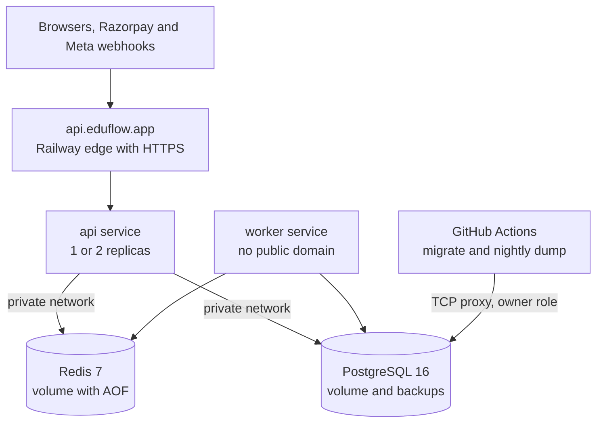

# Deploy on Vercel and Railway

**In simple words:** This chapter puts EduFlow on the internet for the pilot and the first paying customers. The Next.js client runs on Vercel. The API, the worker, PostgreSQL and Redis run on Railway. Files and email use AWS. You get the exact settings, the live-activation checklists for Razorpay, WhatsApp and MSG91, the monthly bill, and the checks to run before a real parent pays a real fee.

> **Note:** Dashboards change often. Each step says what to achieve, then the menu path as of September 2026. If a menu name differs, search the settings page for the key word, for example "Root Directory". Plans, limits and prices are based on public information as of September 2026; verify them before you rely on them.

Variable names and values come from *Environments and Configuration*. This chapter says where each one goes.

## Why Vercel and Railway first

For the first 100 customers, hosting must stay up, stay cheap and take no time from building and selling. Vercel and Railway are PaaS (platform as a service: you give it code, it runs the code, you manage no servers). The first deploy takes one afternoon, HTTPS certificates renew themselves, PostgreSQL and Redis take two clicks, and the bill is about ₹4,400 a month at pilot size. The API runs from the same Docker image that later runs on AWS, so leaving is easy.

| Limit | When it hurts | Your answer |
|---|---|---|
| No Railway region in India; Singapore is the nearest | A school group or a new rule asks for data in India | Move to AWS Mumbai (*Deploy on AWS*) |
| PostgreSQL is one container on one volume: no point-in-time recovery, no failover | A disk or data accident loses up to 24 hours | Two backup layers now; RDS later |
| One region | A Railway outage takes EduFlow down | Status page and honest messages |
| Security questionnaires (VPC, ISO 27001, SOC 2) | Enterprise deals | AWS stage |
| Usage pricing grows in a straight line | Around US$400 to 600 a month (Estimate) | Read the bill monthly |

The move to AWS is planned at 300 to 500 customers or at the first hard trigger above. The triggers are in *Deploy on AWS*.

**Regions.** Put every Railway service in Singapore, and set the Vercel function region to Singapore (`sin1`), next to the API. S3 and SES stay in Mumbai (`ap-south-1`). The DPDP Act allows processing outside India unless the government restricts a country; say in the privacy policy that the database runs in Singapore.

**Plans.** Vercel Hobby forbids commercial use, so use Vercel Pro with one seat. Use Railway's Pro plan from the day real data arrives, for scheduled backups, replicas and longer log history.

## The launch layout

| Platform | Name | What runs there | Domains | Deploys when |
|---|---|---|---|---|
| Vercel | Project `eduflow-client` | Production client | `app.eduflow.app`, `*.eduflow.app` | Release tag, by the pipeline |
| Vercel | Project `eduflow-client-staging` | Staging client, pull-request previews | `staging.eduflow.app`, `*.staging.eduflow.app` | Merge to `main`, by Vercel's Git link |
| Railway | Project `eduflow`, environment `production` | `api`, `worker`, `Postgres`, `Redis` | `api.eduflow.app` | Release tag, by the pipeline |
| Railway | Project `eduflow`, environment `staging` | The same four services | `api.staging.eduflow.app` | Green CI on `main`, by the pipeline |

A Railway environment is a full copy of the same services with its own variables, data and token, which is exactly staging. A Vercel project has one production build with the `NEXT_PUBLIC_` values baked in, so staging needs its own project.

**Figure: Inside one Railway environment**



Only the API is public. PostgreSQL has one public door, the TCP proxy (a public port that forwards to the private database), used only by GitHub Actions with the owner role. Redis has no public door. The day-by-day order (production on Days 43 and 44, staging and pipeline on Day 54) is in *Daily Plan: Days 43 to 60*. Switch off automatic deploys on Day 44, before pilot data arrives.

## Vercel: the client

### Create the production project

Choose "Add New Project", import the GitHub repository, name it `eduflow-client`, and enter these settings before the first build:

| Setting | Value | Why |
|---|---|---|
| Framework preset | Next.js | App Router build and routing |
| Root Directory | `client` | Vercel builds one package of the monorepo |
| Include files outside the Root Directory | On | The client imports `shared/` and needs the root lockfile |
| Install Command | `cd .. && npm ci` | Installs every workspace from the root lockfile |
| Build Command | `cd .. && npm run build -w shared && npm run build -w client` | `shared/dist` must exist before `next build` |
| Node.js Version | 24.x | Vercel reads `engines` from `client/package.json` only |
| Function Region | Singapore (`sin1`) | Next to the API |

Put the seven `NEXT_PUBLIC_` variables and `SENTRY_AUTH_TOKEN` into the Production environment (dashboard, or `vercel env add NEXT_PUBLIC_API_URL production`). The pipeline sets `NEXT_PUBLIC_APP_VERSION`. A changed value needs a new build.

### Domains and tenant subdomains

1. Settings, then Domains: add `app.eduflow.app`. Add the CNAME that Vercel shows at Cloudflare, proxy off. Wait for the certificate.
2. On Day 54, add `*.eduflow.app`. A wildcard certificate needs proof that you own the domain; at the time of writing Vercel asks for its nameservers or a verification record. If it insists on nameservers, move the zone to Vercel DNS, and first copy every record from the DNS table in *Environments and Configuration*.
3. Nothing is added per institute. One wildcard serves `sharma-classes.eduflow.app` and every future slug. The client reads the slug from the host name (Day 54, *Daily Plan: Days 43 to 60*).

### Staging project and preview deployments

On Day 54:

1. Import the repository again as `eduflow-client-staging`, same build settings, Production Branch `main`. Every merge to `main` now builds `staging.eduflow.app`.
2. Put staging values into both its Production and Preview environments. Add `staging.eduflow.app` and `*.staging.eduflow.app`.
3. Every pull request gets a preview on `*.vercel.app`. Keep Deployment Protection (Vercel Authentication) on. Previews show screens but cannot log in, because the cookie belongs to `.staging.eduflow.app`.
4. Settings, then Git, Ignored Build Step, custom command. Exit code 0 means "nothing changed, skip the build":

```bash
git diff --quiet HEAD^ HEAD -- . ../shared ../package-lock.json
```

5. In `eduflow-client`, disconnect Git. Production is now deployed only by the release pipeline with the Vercel CLI (`vercel pull`, `vercel build --prod`, `vercel deploy --prebuilt --prod`) and `VERCEL_TOKEN`; see *Docker and CI/CD*.

## Railway: API, worker, PostgreSQL and Redis

### Create the project and the four services

1. Create the project `eduflow`. Its first environment is `production`.
2. Add PostgreSQL from the database templates. Check the source image tag in its settings: major version 16, for example `ghcr.io/railwayapp-templates/postgres-ssl:16` (check the name in Railway's docs). Change it before any data exists; `pg_dump` 16 refuses a newer server.
3. Add Redis. Keep the names `Postgres` and `Redis`; the reference variables below use them.
4. Add two services from the GitHub repository, named `api` and `worker`. Only `api` gets a public domain.
5. Set all four to the Singapore region.

### Build settings for a monorepo

Leave the Root Directory empty. The Docker build needs the whole repository: root `package.json`, lockfile, `shared/` and `server/`. A Root Directory of `server` hides three of them and the build fails. Instead, point each service to its own config file (config as code: settings in Git, reviewed like code) under "Config file", for example `/server/railway.api.json`. The file wins over the dashboard.

**File: `server/railway.api.json`**

```json
{
  "$schema": "https://railway.com/railway.schema.json",
  "build": {
    "builder": "DOCKERFILE",
    "dockerfilePath": "server/Dockerfile"
  },
  "deploy": {
    "healthcheckPath": "/api/v1/health/ready",
    "healthcheckTimeout": 120,
    "restartPolicyType": "ON_FAILURE",
    "restartPolicyMaxRetries": 5
  }
}
```

**File: `server/railway.worker.json`**

```json
{
  "$schema": "https://railway.com/railway.schema.json",
  "build": {
    "builder": "DOCKERFILE",
    "dockerfilePath": "server/Dockerfile"
  },
  "deploy": {
    "startCommand": "node dist/jobs/worker.js",
    "restartPolicyType": "ON_FAILURE",
    "restartPolicyMaxRetries": 10
  }
}
```

The API keeps the image's start command. The worker swaps it and has no healthcheck, because it opens no port.

The Dockerfile arrives with P-55 on Day 53. Until then, use no config file and let Railway's default builder build the repository root (check that the log shows Node.js 24):

| Service | Build command | Start command |
|---|---|---|
| `api` | `npm ci && npm run build -w shared && npm exec -w server -- prisma generate && npm run build -w server` | `npm run start -w server` |
| `worker` | Same as `api` | `npm run start:worker -w server` |

### Database roles on a new Railway PostgreSQL

Railway creates the superuser `postgres` and a database `railway`. EduFlow needs an owner for migrations and the runtime role `eduflow_app`, which Row-Level Security applies to (*Daily Plan: Days 1 to 14*). Create both once per environment, before the first migration. Open `psql` as `postgres` with `railway connect Postgres`, or with `docker compose exec postgres psql "<DATABASE_PUBLIC_URL>"`.

```sql
-- Once per environment, as the Railway superuser "postgres".
-- Passwords: openssl rand -hex 24. Hex only, so no / + = can break a URL.
CREATE ROLE eduflow LOGIN PASSWORD 'owner-password-from-openssl';
CREATE ROLE eduflow_app LOGIN PASSWORD 'app-password-from-openssl';
CREATE DATABASE eduflow OWNER eduflow;

\connect eduflow
GRANT USAGE ON SCHEMA public TO eduflow_app;
-- Tables and sequences that "eduflow" creates later are usable by the app role.
ALTER DEFAULT PRIVILEGES FOR ROLE eduflow IN SCHEMA public
  GRANT SELECT, INSERT, UPDATE, DELETE ON TABLES TO eduflow_app;
ALTER DEFAULT PRIVILEGES FOR ROLE eduflow IN SCHEMA public
  GRANT USAGE, SELECT ON SEQUENCES TO eduflow_app;
```

Skip the `CREATE ROLE eduflow_app` line if a migration already creates it. The owner is not a superuser, so a leaked owner URL cannot touch server files or other databases.

### Variables, shared variables and references

Railway has service variables (one service), shared variables (one environment, pulled in with `${{shared.NAME}}`) and reference variables, which copy a value from another service, such as `${{Postgres.PGHOST}}`, and follow its changes. Seal every secret (variable menu, "Seal"). A sealed value is hidden after saving and, at the time of writing, is not copied when an environment is duplicated. Only these lines are special on Railway; every other name is in the catalog.

**Railway raw editor: service `api`, environment `production`**

```env
# Shared variable of this environment (sealed): APP_PW = eduflow_app password
DB_HOST=${{Postgres.PGHOST}}
DATABASE_URL=postgresql://eduflow_app:${{shared.APP_PW}}@${{DB_HOST}}/eduflow?connection_limit=10
# family=0 lets ioredis (and so BullMQ) use IPv4 or IPv6 private addresses
REDIS_URL=${{Redis.REDIS_URL}}?family=0
TRUST_PROXY=1
# PORT is injected by Railway. APP_VERSION is set by the pipeline.
```

**Railway raw editor: service `worker`, environment `production`**

```env
DB_HOST=${{Postgres.PGHOST}}
DATABASE_URL=postgresql://eduflow_app:${{shared.APP_PW}}@${{DB_HOST}}/eduflow?connection_limit=5
REDIS_URL=${{Redis.REDIS_URL}}?family=0
# Seconds between the stop signal and a forced kill, so running jobs can finish
RAILWAY_DEPLOYMENT_DRAINING_SECONDS=60
```

`DATABASE_ADMIN_URL` is not on Railway. It lives in the GitHub environment secrets and uses the TCP proxy host and port from the Postgres service's Networking settings:

```env
DATABASE_ADMIN_URL=postgresql://eduflow:<pw>@<proxy-host>:<proxy-port>/eduflow?sslmode=require
```

### Private networking

Each service gets a private name, `<service>.railway.internal`, and traffic between services stays inside Railway without egress cost. Remove the public TCP proxy of Redis in both environments (Settings, Networking). Older private networks resolve names to IPv6 only, while ioredis looks up IPv4 by default; `family=0` accepts both.

### Healthchecks and graceful restarts

With `healthcheckPath` set, Railway starts the new API version next to the old one and moves traffic only when `/api/v1/health/ready` answers `200`. If it does not within 120 seconds, the deploy fails and the old version keeps serving. Use the readiness route (CMN-API-29), not liveness (CMN-API-28): a version that cannot reach PostgreSQL or Redis must never go live. Railway checks only during deploys.

The API listens on the injected `PORT`, on all interfaces. On stop, Railway sends `SIGTERM`: `server.ts` closes HTTP, Prisma and Redis, and the worker's `worker.close()` waits for running jobs within the draining seconds.

### Custom domain api.eduflow.app

In `api`, open Settings, Networking, "Custom Domain", and enter `api.eduflow.app` (and the listening port if asked). Add the CNAME and any TXT record that Railway shows at Cloudflare, proxy off. When the certificate is ready, `curl -s https://api.eduflow.app/api/v1/health` must answer. On Day 54, do the same for `api.staging.eduflow.app`.

### Replicas and the connection budget

Start with one replica each. Move `api` to two replicas at about 50 customers or before the first fee peak (the 1st to 10th of a month), so one crash never takes the API down. First move rate-limit counters, OTP attempts and caches into Redis, or two replicas silently double every limit. Worker replicas are always safe, because BullMQ gives each job to one worker.

Prisma sizes its pool from the CPU count, which in a container can be the host's. So set `connection_limit` in every URL and keep this sum under 80% of `max_connections` (100 by default):

```text
(api replicas x 10) + (worker replicas x 5) + 5 for migrations, dumps and you
Example at 100 customers: (2 x 10) + (1 x 5) + 5 = 30 connections
```

Railway bills usage. Set a usage email alert at 1.5 times last month's bill; a hard limit stops the services, so keep any hard limit at 3 times the bill or more.

### Volumes, backups and a restore test

Postgres and Redis keep data on volumes (disks that survive restarts). Before you remove the Redis TCP proxy, run `CONFIG GET maxmemory-policy` and `CONFIG GET appendonly` via `railway connect Redis`. BullMQ needs `noeviction`, and `appendonly yes` keeps queued jobs through a restart. If either is wrong, append `--appendonly yes --maxmemory-policy noeviction` to the Redis start command.

In the Postgres Backups tab, enable the Daily, Weekly and Monthly schedules (kept for about 6 days, a month and 3 months at the time of writing). They protect against a bad migration or a dropped table, not against losing the Railway account; the nightly `pg_dump` to S3 (`backup.yml`, P-56) is the copy outside Railway.

Test the restore on staging on Day 54, and after any plan or template change:

1. Create a manual backup. As `eduflow`, run `CREATE TABLE restore_marker (id int);`.
2. Restore the backup from the Backups tab and deploy the staged change.
3. `SELECT * FROM restore_marker;` must fail with "relation does not exist". Log in and open Aarav Sharma.
4. Write down the minutes from click to working app: your real recovery time.

The dump-file drill and single-tenant restores are in *Monitoring, Backups and Incident Response*. Restore a production dump only into a temporary Postgres service inside the production environment, never into staging.

## Migrations on every release

`prisma migrate deploy` runs once per release, as its own step, before the new code starts. Not in the Dockerfile: the private network does not exist during the build. Not in the start command: two replicas would race.

Railway's pre-deploy command would run with the API's own variables, and the API must never hold the owner URL. So the migration runs from GitHub Actions through the TCP proxy (*Docker and CI/CD*). Until the pipeline exists, it runs from your laptop:

```bash
# Manual release, Days 44 to 53, inside the deploy window.
# 1. Postgres service, Backups tab: "Create backup".
# 2. Paste the owner URL from the password manager. It never lands in a file.
read -rs DATABASE_ADMIN_URL && export DATABASE_ADMIN_URL
cd server
DATABASE_URL="$DATABASE_ADMIN_URL" npx prisma migrate status
DATABASE_URL="$DATABASE_ADMIN_URL" npx prisma migrate deploy
unset DATABASE_ADMIN_URL
# 3. Dashboard: deploy the same commit of main to api, then to worker.
# 4. Run the eight smoke checks from "Environments and Configuration".
```

Rules for staging and production:

1. Migrations are backward compatible (expand, then contract): the old API keeps serving while one runs. Add a column now, drop the old one a release later.
2. A migration that never ran on staging never runs on production.
3. Production data never goes to staging (demo organizations only, P-58). The two share no token, database, Redis, bucket or Razorpay mode.

## Logs and metrics

| Question | Where to look | How |
|---|---|---|
| Why did this request fail? | Railway, `api`, Logs | Search the `requestId` of the error envelope |
| All errors of the last hour | Railway Log Explorer | Filter `@level:error` |
| Did the build or deploy break? | Build and Deploy logs; Vercel Deployments | Read the first red line |
| Memory leak or full disk? | Service Metrics tab | Memory rising for days; Postgres volume at 70% |
| Slow pages? | Vercel Logs and Observability | Function duration per route |

Pino writes the level as a number (30, 50), but Railway filters on a text level. Add one option to the logger from *Coding Standards*:

```typescript
// server/src/lib/logger.ts: add inside the pino({ ... }) options
formatters: {
  level: (label) => ({ level: label }), // "info", "error" instead of 30, 50
},
```

In the terminal, run `railway link` once, then `railway logs --service api`. Both platforms keep logs for days, not months; ship them to Better Stack (*Monitoring, Backups and Incident Response*).

## Scheduled jobs

| Tool | Use it for | Why |
|---|---|---|
| BullMQ job schedulers in the worker | Late fees, fee reminders, snapshots, metrics roll-up | Retries, tenant context, same logs as every job |
| GitHub Actions schedule | Nightly `pg_dump` to S3 and its check | Still works when Railway has a problem |
| Railway cron service | Nothing in Year 1 | Runs one command and exits; UTC; 5-minute minimum interval |

**File: `server/src/jobs/schedulers.ts`**

```typescript
import { queues } from '../lib/queue';
import { logger } from '../lib/logger';

const IST = 'Asia/Kolkata'; // containers run in UTC, so always pass tz

// upsertJobScheduler is idempotent: every worker start and every replica
// calls it with the same ID, and Redis keeps exactly one schedule per ID.
export async function registerSchedulers(): Promise<void> {
  await queues.snapshots.upsertJobScheduler(
    'daily-snapshot-tick',
    { pattern: '30 0 * * *', tz: IST },
    { name: 'daily-snapshot-tick' },
  );
  await queues.snapshots.upsertJobScheduler(
    'metrics-rollup',
    { every: 15 * 60 * 1000 },
    { name: 'metrics.rollup' },
  );
  // Hourly ticks. Each tick picks the organizations whose local time matches.
  await queues.invoices.upsertJobScheduler(
    'late-fee-tick',
    { pattern: '5 * * * *', tz: IST },
    { name: 'late-fee-tick' },
  );
  await queues.reminders.upsertJobScheduler(
    'fee-reminder-tick',
    { pattern: '15 * * * *', tz: IST },
    { name: 'fee-reminder-tick' },
  );
  logger.info({ schedulers: 4 }, 'job schedulers registered');
}
```

`worker.ts` calls `registerSchedulers()` at start. The times are examples; the real list is in the PRD chapter *Background Jobs and Events*. To drop or rename a schedule, call `removeJobScheduler('<id>')` in the same release, or Redis keeps firing the old one.

## AWS: files on S3 and email on SES

Everything here lives in `ap-south-1` (Mumbai). Run the commands as your own admin user with MFA (multi-factor login), never with the app's keys.

### Buckets

Create `eduflow-prod-uploads`, `eduflow-staging-uploads` and `eduflow-prod-backups`. For each uploads bucket:

```bash
B=eduflow-prod-uploads
aws s3api create-bucket --bucket "$B" --region ap-south-1 \
  --create-bucket-configuration LocationConstraint=ap-south-1
aws s3api put-public-access-block --bucket "$B" --public-access-block-configuration \
  BlockPublicAcls=true,IgnorePublicAcls=true,BlockPublicPolicy=true,RestrictPublicBuckets=true
aws s3api put-bucket-ownership-controls --bucket "$B" \
  --ownership-controls 'Rules=[{ObjectOwnership=BucketOwnerEnforced}]'
aws s3api put-bucket-encryption --bucket "$B" --server-side-encryption-configuration \
  '{"Rules":[{"ApplyServerSideEncryptionByDefault":{"SSEAlgorithm":"AES256"}}]}'
aws s3api put-bucket-versioning --bucket "$B" --versioning-configuration Status=Enabled
aws s3api put-bucket-policy --bucket "$B" --policy file://bucket-policy.json
aws s3api put-bucket-cors --bucket "$B" --cors-configuration file://cors-prod.json
aws s3api put-bucket-lifecycle-configuration --bucket "$B" \
  --lifecycle-configuration file://lifecycle.json
```

Versioning keeps the old copy when a file is replaced or deleted; the lifecycle rule removes it after 30 days. Backup bucket rules are in *Monitoring, Backups and Incident Response*.

**File: `bucket-policy.json`** (refuses every request that does not use HTTPS)

```json
{
  "Version": "2012-10-17",
  "Statement": [
    {
      "Sid": "DenyInsecureTransport",
      "Effect": "Deny",
      "Principal": "*",
      "Action": "s3:*",
      "Resource": [
        "arn:aws:s3:::eduflow-prod-uploads",
        "arn:aws:s3:::eduflow-prod-uploads/*"
      ],
      "Condition": { "Bool": { "aws:SecureTransport": "false" } }
    }
  ]
}
```

**File: `cors-prod.json`** (lets the browser `PUT` to a pre-signed URL)

```json
{
  "CORSRules": [
    {
      "AllowedOrigins": ["https://app.eduflow.app", "https://*.eduflow.app"],
      "AllowedMethods": ["PUT", "GET", "HEAD"],
      "AllowedHeaders": ["*"],
      "ExposeHeaders": ["ETag"],
      "MaxAgeSeconds": 3000
    }
  ]
}
```

The staging file lists `https://staging.eduflow.app` and `https://*.staging.eduflow.app`. Never add `http://localhost:3000` to a hosted bucket.

**File: `lifecycle.json`**

```json
{
  "Rules": [
    {
      "ID": "expire-old-versions",
      "Status": "Enabled",
      "Filter": { "Prefix": "" },
      "NoncurrentVersionExpiration": { "NoncurrentDays": 30 },
      "AbortIncompleteMultipartUpload": { "DaysAfterInitiation": 7 }
    }
  ]
}
```

### The app's IAM user

Each environment has one IAM user, `eduflow-prod` or `eduflow-staging`. It may use objects in its own bucket and send email as `eduflow.app`, nothing else.

**File: `iam-eduflow-prod.json`** (replace `123456789012` with your AWS account ID)

```json
{
  "Version": "2012-10-17",
  "Statement": [
    {
      "Sid": "UploadsObjects",
      "Effect": "Allow",
      "Action": ["s3:PutObject", "s3:GetObject", "s3:DeleteObject"],
      "Resource": "arn:aws:s3:::eduflow-prod-uploads/*"
    },
    {
      "Sid": "UploadsList",
      "Effect": "Allow",
      "Action": "s3:ListBucket",
      "Resource": "arn:aws:s3:::eduflow-prod-uploads"
    },
    {
      "Sid": "SendEmailAsEduflow",
      "Effect": "Allow",
      "Action": ["ses:SendEmail", "ses:SendRawEmail"],
      "Resource": [
        "arn:aws:ses:ap-south-1:123456789012:identity/eduflow.app",
        "arn:aws:ses:ap-south-1:123456789012:configuration-set/eduflow-prod"
      ],
      "Condition": { "StringLike": { "ses:FromAddress": "*@eduflow.app" } }
    }
  ]
}
```

`s3:ListBucket` makes a missing file answer `404` instead of `403`, which the confirm endpoint (CMN-API-05) needs. For staging, change the bucket name, the SES region to `ap-southeast-1` and the set to `eduflow-staging`.

```bash
aws iam create-user --user-name eduflow-prod
aws iam put-user-policy --user-name eduflow-prod --policy-name eduflow-prod-app \
  --policy-document file://iam-eduflow-prod.json
aws iam create-access-key --user-name eduflow-prod   # paste into Railway, sealed
```

### SES in Mumbai

1. In SES, region Asia Pacific (Mumbai), create a domain identity for `eduflow.app` with Easy DKIM (RSA 2048 bit). Add the three DKIM CNAME records at Cloudflare, proxy off.
2. Set the custom MAIL FROM domain `bounce.eduflow.app` and add its MX and TXT records. Every record is in the DNS table of *Environments and Configuration*.
3. Create the configuration set `eduflow-prod`. P-31 later routes its bounce and complaint events to `/api/v1/webhooks/ses` (EML-API-14); until then, the account-level suppression list covers them.
4. Request production access with the text from *Environments and Configuration*. If refused, reply in the same case with more detail.
5. Check the result:

```bash
aws sesv2 get-account --region ap-south-1 --query ProductionAccessEnabled   # true
aws sesv2 get-email-identity --email-identity eduflow.app --region ap-south-1 \
  --query DkimAttributes.Status                                            # "SUCCESS"
aws sesv2 send-email --region ap-south-1 --from-email-address no-reply@eduflow.app \
  --destination ToAddresses=you@gmail.com \
  --content 'Simple={Subject={Data=EduFlow test},Body={Text={Data=Hello}}}'
```

Open the test mail in Gmail with "Show original". SPF, DKIM and DMARC must all say PASS.

## Live activation checklists

> **Founder note:** These depend on other people's approval, not on your code. Start each one weeks before you need it.

### Razorpay

EduFlow's own account collects only subscription money, from January 2027. Parents' fees settle into each institute's own Razorpay account, so EduFlow never holds fee money for others (that would make it a payment aggregator, a regulated role in India).

- [ ] KYC sent in Week 6: company PAN, incorporation and GST certificates, current-account proof, director PAN and address proof.
- [ ] Website shows pricing, Terms, Privacy, Refund and Cancellation, and Contact pages (*Company Setup, Legal and Finance Basics*).
- [ ] Business description: "SaaS subscription for schools and coaching institutes; fees go to each institute's own account."
- [ ] Two-factor login on. Live keys go straight into Railway production, sealed.
- [ ] UPI, cards and netbanking on; payment capture automatic.
- [ ] Live webhook `https://api.eduflow.app/api/v1/webhooks/billing/razorpay` (ORG-API-30), own secret, events `payment.captured`, `payment.failed`, `order.paid`, `refund.processed`.
- [ ] A ₹10 live UPI payment shows `200` in the webhook log, then a refund.

For each institute, at onboarding: its own KYC done, its live keys saved in EduFlow with mode `LIVE`, a live webhook to `https://api.eduflow.app/api/v1/webhooks/razorpay/<gatewayAccountId>` (PAY-API-38) with the same events plus `settlement.processed`, and one ₹10 fee paid and refunded.

### WhatsApp Cloud API

- [ ] Meta business portfolio in the company's legal name, business verification done (unverified businesses get low daily limits).
- [ ] A dedicated number not used on the WhatsApp app; two-step PIN in the password manager.
- [ ] Display name "EduFlow" approved; it must match the website. Payment method added.
- [ ] Every template of the PRD chapter *Notification Template Catalog* approved in the live account: Utility, English and Hindi, same names as on staging.
- [ ] System User token with `whatsapp_business_messaging` and `whatsapp_business_management`.
- [ ] Webhook `https://api.eduflow.app/api/v1/webhooks/whatsapp` (WA-API-23, WA-API-24), verify token = production `WHATSAPP_VERIFY_TOKEN`, field `messages` subscribed.
- [ ] Meta app in Live mode and subscribed to the live business account; without both, real webhooks never arrive.
- [ ] One template message reaches your phone; its delivered and read statuses reach `message_logs`.

### MSG91 and DLT

SMS arrives with P-31 after Day 60, but DLT (TRAI's register of senders and message texts) takes one to two weeks (Estimate). Start in the first week of December 2026.

- [ ] Principal Entity registered on one operator's DLT portal (company PAN, GST certificate, authorisation letter; about ₹5,900 with GST, Estimate). Note the Entity ID.
- [ ] A 6-letter header (sender ID) tied to the brand, for example `EDUFLW`; it becomes `MSG91_SENDER_ID`.
- [ ] Templates registered as Service Implicit (reminders, receipts, OTP), variables as `{#var#}`.
- [ ] Link domains in templates (`eduflow.app`) whitelisted; unlisted links are blocked.
- [ ] MSG91 linked as your telemarketer on the portal (the "chain"; MSG91 support gives its ID).
- [ ] Entity ID, header and templates added in MSG91, texts identical to DLT character for character.
- [ ] Delivery reports go to `/api/v1/webhooks/msg91` (SMS-API-18). One real SMS reaches your phone.

## Monthly cost

Estimate: public list prices as of September 2026, US$1 = ₹85, without GST. Institutes pay WhatsApp and SMS through credit packs; monitoring tools are costed in *Monitoring, Backups and Incident Response*.

| Item | 5 pilots | 50 customers | 100 customers |
|---|---|---|---|
| Vercel Pro, 1 seat, both projects | ₹1,700 ($20) | ₹1,700 ($20) | ₹2,550 ($30) |
| Railway: `api` and `worker` | ₹1,200 ($14) | ₹4,250 ($50) | ₹10,450 ($123) |
| Railway: Postgres and Redis | ₹750 ($9) | ₹3,400 ($40) | ₹9,000 ($106) |
| Railway: staging, egress, snapshots | ₹600 ($7) | ₹1,300 ($15) | ₹2,800 ($33) |
| AWS: S3, SES, backup bucket | ₹150 ($2) | ₹700 ($8) | ₹3,200 ($38) |
| Total per month | ₹4,400 ($52) | ₹11,350 ($133) | ₹28,000 ($330) |

Railway per month = average vCPU x US$20 + average GB of RAM x US$10 + volume GB x US$0.15 + egress GB x US$0.05. Example, Postgres and Redis at 50 customers: 0.5 vCPU ($10) + 2.5 GB RAM ($25) + 25 GB volume ($3.75) = about $40. The US$20 Pro fee counts as usage, so it sits inside the rows. The 100-customer column matches the BRD chapter *Financial Plan and Projections*, with headroom for fee-season peaks.

## Go-live smoke test

Run it once before the first paid customer, after the eight release checks from *Environments and Configuration*. Use your own phone, inbox and card.

| Check | Passes when |
|---|---|
| Certificates | `app`, `api`, `sharma-classes` and `staging` hosts serve valid HTTPS |
| Health | `appEnv` is `production`; version is the release tag |
| Runtime role | `pg_stat_activity` shows app connections only as `eduflow_app` |
| Cross-tenant probe | A Sharma Classes token asking for a Bright Future student gets `404` |
| Upload from a subdomain | Photo uploads and shows; no CORS error |
| Live payment | ₹10 UPI marks the invoice Paid within 30 seconds; refund works |
| WhatsApp and email | Receipt arrives from "EduFlow"; password reset lands in the inbox |
| Worker and Redis | Receipt PDF within 10 seconds; 4 schedulers logged; `noeviction` |
| Staging stays safe | A message to a phone outside the allow list is logged as skipped |
| Backups and errors | Today's snapshot and dump exist; a test error reaches Sentry |

## Known pitfalls

| Symptom | Cause | Fix |
|---|---|---|
| Vercel cannot find `shared` | Outside files not included, or `shared` not built | Switch the setting on; keep the build command above |
| Railway: lockfile not found | Root Directory set to `server` | Leave it empty; use the config file path |
| Deploy fails the healthcheck | API listens on `localhost` or a fixed port | Listen on `PORT` with no host, or host `::` |
| Timeouts to `redis.railway.internal` | IPv6-only private network | Keep `?family=0` on `REDIS_URL` |
| Upload `403 SignatureDoesNotMatch` | Browser sent another `Content-Type` than the pre-sign | Send exactly the signed type |
| Logged in on `app` but not on a subdomain | `COOKIE_DOMAIN` without the leading dot | `.eduflow.app` |
| Webhook signature always invalid | JSON parser before the raw body, or test secret on a live webhook | Raw body on `/api/v1/webhooks`; check the mode |
| Nightly job ran at 05:30 IST | No `tz`; containers use UTC | `tz: 'Asia/Kolkata'` |

## Key takeaways

- Vercel runs the client; one Railway project with `staging` and `production` environments runs `api`, `worker`, Postgres and Redis in Singapore; S3 and SES stay in Mumbai.
- Railway builds the whole monorepo from `server/Dockerfile`, with config files in Git. Only the API is public.
- Migrations run once per release with the owner role, after a backup, outside the container. The app keeps `eduflow_app`, so RLS stays on.
- Schedules are BullMQ job schedulers with an explicit timezone; backups run outside Railway.
- Razorpay KYC, WhatsApp verification, SES production access and DLT need outside approval. Start early.
- Hosting costs about ₹4,400 a month for the pilot and ₹28,000 at 100 customers (Estimate).
- Go live only when the go-live list passes with your own card, phone and inbox.
