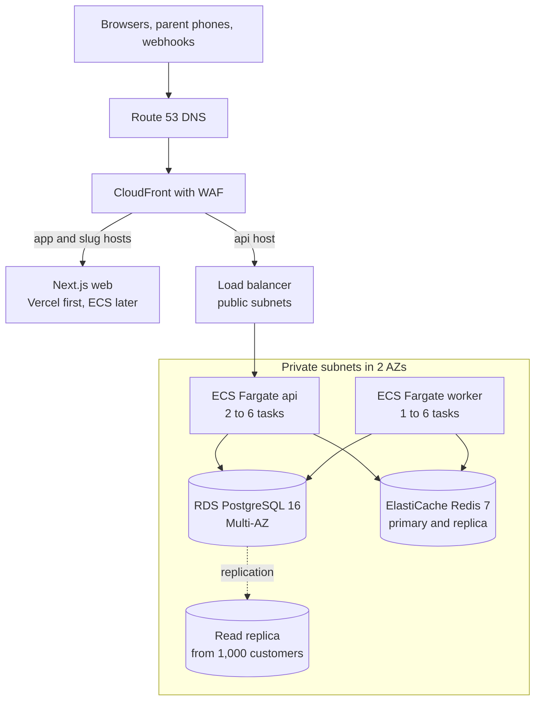
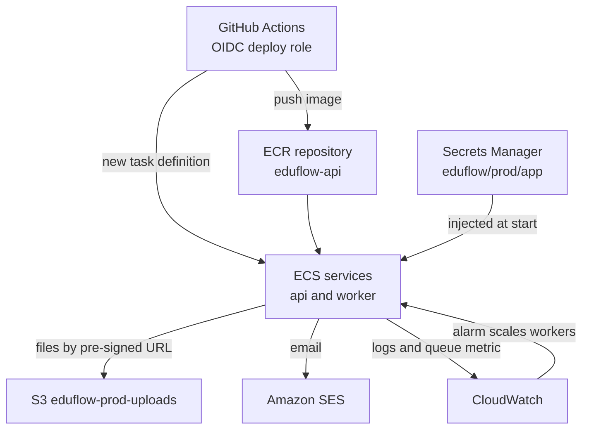

# Deploy on AWS

**In simple words:** This chapter moves EduFlow from Railway to AWS Mumbai (`ap-south-1`). It gives the triggers, the target design, the Terraform layout, the database move minute by minute, the deploy pipeline, the bill at three stages and the disaster-recovery plan. Every step runs on staging first.

> **Note:** AWS menus and prices change. Prices are on-demand estimates from public price lists as of September 2026; check them in the AWS Pricing Calculator. Snippets assume Terraform 1.11+ and AWS provider 6.x.

## When to move

Plan the move at 300 to 500 organizations (paying plus free), about September 2027; P-57 rehearses it on staging from 15 to 22 Sep 2027. A hard trigger moves it earlier.

| Trigger | Signal you can measure | Type |
|---|---|---|
| Size | 300 to 500 organizations, or 60,000 active students | Soft |
| Private network | An enterprise buyer asks for a VPC (virtual private cloud) and a private database | Hard |
| Compliance | A contract, DPDP audit question or new rule asks for data stored in India | Hard |
| Recovery | You need point-in-time recovery or a standby database; Railway has neither | Hard |
| Cost crossover | Railway bill above US$500 a month for two months (Estimate) | Soft |
| Latency | API p95 (95% of requests are faster) above 400 ms at 9 am for two weeks | Soft |

Mumbai cuts a round trip from Indian cities from about 50 to 90 ms (Singapore) to 10 to 40 ms (Estimate). Recovery copies go to Hyderabad (`ap-south-2`), so "your data stays in India" becomes true. Never move from 1 January to 30 April or from the 1st to the 10th of a month (fee window); pick a Sunday night after the 15th.

> **Founder note:** AWS is not cheaper than Railway at 500 customers. You pay for recovery, a standby database and Mumbai.

## Target architecture

**Figure: Request path on AWS**



Only CloudFront and the load balancer face the internet; the rest sits in private subnets in two AZs (availability zones: separate data centres in one region). While the web stays on Vercel, the `app` and `*` records point straight at Vercel, which has its own CDN; CloudFront takes them when the web moves to ECS at 10,000 customers.

**Figure: Supporting services around the tasks**



GitHub borrows a short-lived role through OIDC (AWS trusts GitHub's signed token), so no AWS key is stored. S3 and SES stay as they are; only their credentials change.

**CloudFront and WAF.** The API distribution uses the managed policies `CachingDisabled` and `AllViewerExceptHostHeader`. WAF (web application firewall) runs the AWS managed Common, Known Bad Inputs and IP Reputation rules plus a rate rule of 10,000 requests per 5 minutes per IP (mobile networks put thousands of parents behind one address). Count mode for 7 days, then Block; `SizeRestrictions_BODY` stays in Count (bulk attendance exceeds 8 KB).

## Build order

Build staging first with P-57, then production with the same modules.

| Step | Work | Done when |
|---|---|---|
| Accounts | AWS Organizations with `staging` and `production` accounts; IAM Identity Center with MFA | No access keys exist |
| State | Versioned, encrypted bucket `eduflow-tfstate-<account-id>` | `terraform init` works |
| Base | `network`, `ecr` (push the current image), `secrets` (values by hand) | Image tag visible |
| Data | `rds`, `redis` | Both `available`, private |
| Compute and edge | `alb`, `ecs` at 0 tasks, certificates, `cloudfront`, `waf` | CloudFront hostname answers |
| DNS | Route 53 zone with every record copied | `dig NS eduflow.app` shows Route 53 |
| Pipeline and alarms | `iam`, deploy workflow, `alarms`, AWS Budgets | Staging deploy green; test alarm arrives |

> **Warning:** Copy every record from the DNS table in *Environments and Configuration* before changing nameservers. If Vercel still requires its own nameservers for the wildcard, keep the zone there, add only the `api` records, and move the zone with the web.

### Small app changes for AWS

| Change | Why |
|---|---|
| `TRUST_PROXY=2` | Two proxies (CloudFront, load balancer); with `1` every user looks like CloudFront and per-IP limits break. Widen the env schema if needed. |
| Remove `AWS_ACCESS_KEY_ID` and `AWS_SECRET_ACCESS_KEY` | The AWS SDK then uses the task role; delete the IAM user keys 14 days later |
| `REDIS_URL=rediss://:<token>@<primary-endpoint>:6379` | TLS; `?family=0` was a Railway fix |
| `sslmode=require` in database URLs | RDS forces TLS |
| Worker `stopTimeout` 120 seconds | Fargate's maximum; PDF jobs finish during deploys |

## Terraform layout

Terraform turns text files into cloud resources: `plan` shows the change, `apply` makes it. Modules live in `infra/terraform/modules/`; root folders in `infra/terraform/envs/` are `staging`, `production`, later `dr-ap-south-2` and `prod-me-central-1`. State sits in the S3 backend with `use_lockfile = true`; the provider sets `default_tags` `Project` and `Env`.

| Module | Key resources |
|---|---|
| `network` | VPC `10.20.0.0/16`, 2 public and 2 private subnets, NAT gateway, S3 gateway endpoint |
| `ecr`, `secrets` | Repository `eduflow-api` (immutable tags, scan on push); secrets `eduflow/prod/app` and `eduflow/prod/migrate` |
| `rds`, `redis` | Subnet groups, parameter groups, primary instance, replication group |
| `alb`, `ecs` | Load balancer, target group on `/api/v1/health/ready`; cluster `eduflow-prod`, task definitions, services, autoscaling |
| `cloudfront`, `waf`, `dns` | Distribution for `api.eduflow.app` (certificate in `us-east-1`), web ACL, Route 53 zone |
| `iam`, `alarms` | Execution, task and deploy roles, GitHub OIDC provider; alarms, SNS topic, AWS Budgets |

**File: `modules/network/main.tf` (core)**

```plaintext
data "aws_availability_zones" "all" { state = "available" }

resource "aws_vpc" "main" {
  cidr_block           = "10.20.0.0/16"
  enable_dns_hostnames = true
}

# aws_subnet.public: the same shape, offset count.index, map_public_ip_on_launch
resource "aws_subnet" "private" {
  count             = 2
  vpc_id            = aws_vpc.main.id
  availability_zone = data.aws_availability_zones.all.names[count.index]
  cidr_block        = cidrsubnet(aws_vpc.main.cidr_block, 8, count.index + 10)
}
# Plus: internet gateway, NAT gateway (aws_eip domain = "vpc"), route tables,
# S3 gateway endpoint (file traffic skips the NAT).
```

One NAT gateway saves about US$40 a month at the 500 stage; if its AZ fails, tasks lose outside access (WhatsApp, Razorpay), not the database. Add a second at 1,000 customers.

**File: `modules/ecs/api.tf` (core)**

```plaintext
resource "aws_ecs_task_definition" "api" {
  family                   = "eduflow-prod-api"
  requires_compatibilities = ["FARGATE"]
  network_mode             = "awsvpc"
  cpu                      = 512
  memory                   = 1024
  execution_role_arn       = aws_iam_role.exec.arn
  task_role_arn            = aws_iam_role.api_task.arn
  container_definitions = jsonencode([{
    name         = "api"
    image        = "${var.ecr_url}:bootstrap"
    essential    = true
    portMappings = [{ containerPort = 4000, protocol = "tcp" }]
    environment  = [{ name = "TRUST_PROXY", value = "2" }] # plus APP_ENV and others
    secrets = [
      { name = "DATABASE_URL", valueFrom = "${var.app_secret_arn}:DATABASE_URL::" },
      { name = "REDIS_URL", valueFrom = "${var.app_secret_arn}:REDIS_URL::" }
      # ...one line per secret in the catalog
    ]
    # logConfiguration: awslogs driver, group /ecs/eduflow-prod/api
  }])
}

resource "aws_ecs_service" "api" {
  name                               = "api"
  cluster                            = aws_ecs_cluster.main.id
  task_definition                    = aws_ecs_task_definition.api.arn
  desired_count                      = 2
  launch_type                        = "FARGATE"
  health_check_grace_period_seconds  = 60
  deployment_minimum_healthy_percent = 100
  deployment_maximum_percent         = 200
  deployment_circuit_breaker {
    enable   = true
    rollback = true
  }
  network_configuration {
    subnets         = var.private_subnet_ids
    security_groups = [aws_security_group.api.id]
  }
  load_balancer {
    target_group_arn = aws_lb_target_group.api.arn
    container_name   = "api"
    container_port   = 4000
  }
  lifecycle {
    ignore_changes = [task_definition, desired_count] # pipeline and autoscaling own these
  }
}
```

The worker differs in four places: `cpu = 1024`, `memory = 2048` (Chromium), `command = ["node", "dist/jobs/worker.js"]` with `stopTimeout = 120`, and no `load_balancer`. The migrate task runs `["npx", "prisma", "migrate", "deploy"]` with its own execution role and one secret: `DATABASE_URL` from the `DATABASE_ADMIN_URL` key of `eduflow/prod/migrate`.

**File: `modules/rds/main.tf` (core)**

```plaintext
resource "aws_db_parameter_group" "pg16" {
  name   = "eduflow-prod-pg16"
  family = "postgres16"
  dynamic "parameter" {
    for_each = {
      "rds.force_ssl"                     = "1"
      log_min_duration_statement          = "500"   # slow query log, ms
      idle_in_transaction_session_timeout = "60000" # kill forgotten transactions
      log_lock_waits                      = "1"
      random_page_cost                    = "1.1" # SSD storage
    }
    content {
      name  = parameter.key
      value = parameter.value
    }
  }
}

resource "aws_db_instance" "main" {
  identifier                  = "eduflow-prod"
  engine                      = "postgres"
  engine_version              = "16"
  instance_class              = "db.m7g.large"
  allocated_storage           = 100
  max_allocated_storage       = 500
  storage_type                = "gp3"
  storage_encrypted           = true
  multi_az                    = true
  username                    = "eduflow_master"
  manage_master_user_password = true # password lives in Secrets Manager
  db_subnet_group_name        = aws_db_subnet_group.main.name
  vpc_security_group_ids      = [aws_security_group.rds.id]
  parameter_group_name        = aws_db_parameter_group.pg16.name
  publicly_accessible         = false
  backup_retention_period     = 14
  backup_window               = "20:00-21:00"         # 01:30 to 02:30 IST
  maintenance_window          = "sun:21:30-sun:22:30" # Mon 03:00 to 04:00 IST
  copy_tags_to_snapshot       = true
  deletion_protection         = true
  final_snapshot_identifier   = "eduflow-prod-final"
}
```

There is no `db_name`: the runbook creates the `eduflow` database with the right owner.

## IAM roles with least privilege

| Role | Used by | Allowed | Never |
|---|---|---|---|
| `eduflow-prod-ecs-exec` | ECS starting api and worker | Pull image, write logs, read `eduflow/prod/app` | The migrate secret |
| `eduflow-prod-migrate-exec` | ECS starting the migrate task | Pull, logs, read `eduflow/prod/migrate` | Anything else |
| `eduflow-prod-api-task` | API code | Objects in `eduflow-prod-uploads`; SES send via set `eduflow-prod` | Secrets, other buckets |
| `eduflow-prod-worker-task` | Worker code | As api, plus `cloudwatch:PutMetricData` in `EduFlow/Queues` | Same |
| `eduflow-prod-deploy` | GitHub Actions (OIDC) | Push `eduflow-api`, register task definitions, update services, run migrate, snapshot `pre-*` | IAM, Terraform, deletes |

Task roles reuse the statements of `iam-eduflow-prod.json` from *Deploy on Vercel and Railway*. The deploy role may pass only `role/eduflow-prod-*`, and only to `ecs-tasks.amazonaws.com`.

**File: `infra/iam/deploy-trust.json`** (tag releases through the `production` environment only)

```json
{
  "Version": "2012-10-17",
  "Statement": [{
    "Effect": "Allow",
    "Principal": {
      "Federated": "arn:aws:iam::123456789012:oidc-provider/token.actions.githubusercontent.com"
    },
    "Action": "sts:AssumeRoleWithWebIdentity",
    "Condition": {
      "StringEquals": {
        "token.actions.githubusercontent.com:aud": "sts.amazonaws.com",
        "token.actions.githubusercontent.com:sub": "repo:<owner>/eduflow:environment:production"
      }
    }
  }]
}
```

## Security groups

A security group is a stateful firewall around one resource.

| Group | Attached to | Inbound | Outbound |
|---|---|---|---|
| `sg-alb` | Load balancer | 443 from the CloudFront origin-facing prefix list | 4000 to `sg-api` |
| `sg-api` | api tasks | 4000 from `sg-alb` | 5432 `sg-rds`, 6379 `sg-redis`, 443 internet |
| `sg-worker` | worker, migrate tasks | None | As `sg-api` |
| `sg-rds` | RDS | 5432 from `sg-api`, `sg-worker`, `sg-ops` | None |
| `sg-redis` | ElastiCache | 6379 from `sg-api`, `sg-worker` | None |
| `sg-ops` | Migration box | None (Session Manager, no SSH) | 5432 `sg-rds`, 443 out |

The prefix list admits every CloudFront customer, so CloudFront also sends a secret header, `X-Origin-Verify`; the listener answers `403` without it.

## Autoscaling

| Service | Policy | Rule | Tasks at 500 stage |
|---|---|---|---|
| api | Target tracking | Average CPU 60% | 2 to 6 |
| api | Scheduled (attendance) | Mon to Sat 07:30 IST minimum 4; 11:00 back to 2 | 4 to 8 |
| api | Scheduled (fee window) | 1st of month 08:00 IST minimum 4; 11th back to 2 | 4 to 8 |
| worker | Step scaling on `WaitingJobs` | Above 500 for 2 minutes +1; above 2,000 +3; below 50 for 15 minutes -1 | 1 to 6 |

Scheduled actions take `timezone = "Asia/Kolkata"`. CPU reacts minutes late; the schedule is ready before attendance opens.

**File: `server/src/jobs/queue-metrics.ts`** (run every 60 seconds from `worker.ts`, except locally)

```typescript
import { CloudWatchClient, PutMetricDataCommand } from '@aws-sdk/client-cloudwatch';
import { env } from '../config/env';
import { allQueues } from '../lib/queue'; // adapt to what lib/queue.ts exports

const cloudwatch = new CloudWatchClient({ region: env.AWS_REGION });

export async function publishQueueDepth(): Promise<void> {
  let waiting = 0;
  for (const queue of allQueues) {
    const counts = await queue.getJobCounts('wait', 'prioritized');
    waiting += (counts.wait ?? 0) + (counts.prioritized ?? 0);
  }
  await cloudwatch.send(new PutMetricDataCommand({
    Namespace: 'EduFlow/Queues',
    MetricData: [{ MetricName: 'WaitingJobs', Value: waiting, Unit: 'Count',
      Dimensions: [{ Name: 'Env', Value: env.APP_ENV }] }],
  }));
}
```

Each worker task publishes the same total; the alarm reads `Maximum`, so duplicates are harmless. In Terraform, an `aws_cloudwatch_metric_alarm` on `WaitingJobs` (period 60, 2 periods, threshold 500) triggers an `aws_appautoscaling_policy` of type `StepScaling`; scale-in mirrors it.

## RDS settings and connection pooling

| Stage | Primary (Multi-AZ) | Replica | Storage | Backups |
|---|---|---|---|---|
| 500 customers | `db.m7g.large`, 2 vCPU, 8 GiB | None | 100 GB gp3, grows to 500 | 14 days |
| 1,000 customers | `db.m7g.xlarge`, 4 vCPU, 16 GiB | 1 x `db.m7g.large` for reports | 300 GB gp3 | 21 days |
| 10,000 customers | `db.r7g.2xlarge`, 8 vCPU, 64 GiB | 2 x `db.r7g.xlarge`, plus 1 in `ap-south-2` | 2 TB gp3, 12,000 IOPS | 35 days, monthly copies kept 1 year |

- **Backups and PITR.** Daily snapshots and transaction logs are kept 7 to 35 days (staging 7). PITR (point-in-time recovery) restores any second in that window, up to about 5 minutes ago, into a new instance.
- **Multi-AZ.** The standby takes over in about 1 to 2 minutes; Prisma reconnects, requests in flight fail once.
- **Replica use.** Reports and exports get a second Prisma client on `DATABASE_REPLICA_URL` with the same tenant extension. Prisma's read-replica extension alone sends tenant queries, which run in transactions, to the primary.

**Connection budget.** RDS sets `max_connections` from memory: about 850 on `db.m7g.large`, 1,700 on `db.m7g.xlarge` (Estimate). Keep `connection_limit` in every URL and size by maximum task counts:

```text
budget = (api max tasks x 10) + (worker max tasks x 5) + 5
500 stage:     (6 x 10)  + (6 x 5)  + 5 =  95   fine
1,000 stage:   (10 x 10) + (8 x 5)  + 5 = 145   fine
10,000 stage:  (30 x 10) + (20 x 5) + 5 = 405   add PgBouncer
```

Add PgBouncer (a connection pooler) when the budget passes 300 or half of `max_connections`: two tasks behind an internal Network Load Balancer on port 6432 (group `sg-pgbouncer`), `pool_mode = transaction`, `default_pool_size = 40`, and `pgbouncer=true` in `DATABASE_URL`; migrations keep a direct URL. The tenant setting is transaction-local (`set_config(..., true)`), so transaction pooling is safe. RDS Proxy pins connections when session state changes; if you try it, watch `DatabaseConnectionsCurrentlySessionPinned`.

## ElastiCache Redis

- Redis OSS 7.1, `cache.t4g.medium` primary plus replica in the other AZ, automatic failover; `cache.m7g.large` from 1,000 customers.
- A parameter group (family `redis7`) with `maxmemory-policy = noeviction`. The default evicts keys under memory pressure, and BullMQ loses jobs silently.
- Encryption in transit and at rest; the AUTH token lives in `eduflow/prod/app`. One daily snapshot, kept 3 days.

## Moving the database from Railway to RDS

Rehearse the chosen path on staging; record the minutes.

| Question | Logical replication (default) | Dump and restore (fallback) |
|---|---|---|
| Write pause | 15 to 20 minutes | About 2 hours for 20 GB (Estimate) |
| Extra risk | One Railway restart; a replication slot to watch | None |
| Use when | Railway accepts `wal_level = logical` | Railway refuses it, or the database is under 5 GB |

Logical replication copies every row once, then streams each change to RDS until you switch.

### Preparation

Work from a temporary migration box: a `t3.small` Amazon Linux 2023 instance in a private subnet (`sg-ops`, Session Manager), with `sudo dnf install -y postgresql16`. `RAILWAY_URL` is the superuser `postgres` via Railway's TCP proxy (`sslmode=require`); `RDS_OWNER_URL` is the `eduflow` owner on RDS.

**On RDS, as `eduflow_master` in database `postgres`:**

```sql
CREATE ROLE eduflow LOGIN PASSWORD '<owner-pw>';
ALTER ROLE eduflow BYPASSRLS;          -- migrations and restores see all tenants
CREATE ROLE eduflow_app LOGIN PASSWORD '<app-pw>'
  NOSUPERUSER NOCREATEDB NOCREATEROLE NOBYPASSRLS;
GRANT eduflow TO eduflow_master;       -- lets the master act for the owner
CREATE DATABASE eduflow OWNER eduflow;
\connect eduflow
GRANT USAGE ON SCHEMA public TO eduflow_app;
ALTER DEFAULT PRIVILEGES FOR ROLE eduflow IN SCHEMA public
  GRANT SELECT, INSERT, UPDATE, DELETE ON TABLES TO eduflow_app;
ALTER DEFAULT PRIVILEGES FOR ROLE eduflow IN SCHEMA public
  GRANT USAGE, SELECT ON SEQUENCES TO eduflow_app;
ALTER ROLE eduflow_app SET statement_timeout = '30s';
```

**On Railway, as `postgres` in database `eduflow`, at night:**

```sql
ALTER SYSTEM SET wal_level = logical;
-- Restart the Postgres service in Railway (about 1 minute), then:
SHOW wal_level;                         -- must say logical
CREATE PUBLICATION eduflow_move FOR ALL TABLES;
SELECT count(*) FROM pg_sequences;      -- 0: EduFlow keys are UUIDs
```

**Copy the schema, then subscribe on RDS as `eduflow_master` in `eduflow`:**

```bash
pg_dump --schema-only --no-owner --no-privileges "$RAILWAY_URL" > schema.sql
psql "$RDS_OWNER_URL" -v ON_ERROR_STOP=1 -f schema.sql
```

```sql
CREATE SUBSCRIPTION eduflow_move
  CONNECTION 'host=<proxy-host> port=<proxy-port> dbname=eduflow
              user=postgres password=<pw> sslmode=require'
  PUBLICATION eduflow_move;
-- Progress: 0 rows means every table is copied and streaming
SELECT srrelid::regclass, srsubstate FROM pg_subscription_rel WHERE srsubstate <> 'r';
```

On Railway, `SELECT slot_name, pg_size_pretty(pg_wal_lsn_diff(pg_current_wal_lsn(), confirmed_flush_lsn)) FROM pg_replication_slots;` shows the lag. When the copy is done, run `ANALYZE;` on RDS, because statistics are not replicated.

> **Warning:** The slot makes Railway keep WAL (the change log) until RDS confirms it; if replication stops, the Railway volume fills up. Check the lag daily. To abort, `DROP SUBSCRIPTION eduflow_move;` on RDS removes the slot too.

### Cutover runbook

Example: Sunday 17 October 2027. T-n means n days before.

| Time (IST) | Step | Check |
|---|---|---|
| T-7 | Maintenance notice by WhatsApp and email: Sunday 22:00 to 22:30 | Every admin reached |
| T-3 | Freeze deploys and migrations; start replication; `api` record TTL to 60 s | All tables in state `r` |
| 21:30 | Go or no-go | Lag under 1 MB; ECS api and worker at 0 tasks |
| 22:00 | Status page "maintenance"; Railway `api` to 0; `worker` drains 10 minutes, then 0 | Writes stop, queues empty |
| 22:10 | Lag zero; row counts compared (below); on RDS `DROP SUBSCRIPTION eduflow_move;` | Counts match |
| 22:13 | ECS api to 2 tasks; worker stays at 0 | Targets healthy |
| 22:18 | Point `api.eduflow.app` at CloudFront; ECS worker to 1 | `dig` shows CloudFront |
| 22:20 | `scripts/ci/smoke.sh` against production; log in to the demo organization | All PASS |
| 22:25 | Vercel function region to Mumbai (`bom1`); redeploy the web | Login works |
| 22:30 | Status page "resolved"; watch Sentry and CloudWatch, and Monday's 08:00 peak | Error rate normal |
| +14 days | Final Railway dump to S3, then delete the Railway project | The dump restores |

Row counts: `SELECT count(*)` on `organizations`, `students`, `attendance_records`, `fee_invoices`, `payments` and `receipts`, as `postgres` on Railway and `eduflow` on RDS. Razorpay and Meta retry failed webhooks to the unchanged URL. BullMQ retries scheduled for later stay in Railway Redis; requeue `message_logs` rows still waiting.

### Rollback

| Moment | Action | Data lost |
|---|---|---|
| Before 22:18 | Railway services back to 1, ECS to 0; try another Sunday | None |
| 22:18 to Monday 06:00 | Stop ECS, dump RDS, restore into Railway (fallback in reverse), switch DNS back | None; about 2 hours down |
| After Monday 06:00 | Fix forward on AWS | None |

### Fallback: dump and restore

Same roles and database, no publication; announce 22:00 to 00:30. Timings for 20 GB (Estimate):

| Time (IST) | Step |
|---|---|
| 22:00 | Stop Railway `api`; the worker drains 10 minutes |
| 22:10 | `pg_dump -Fd -j 4 -f /data/eduflow "$RAILWAY_URL"` (20 minutes) |
| 22:30 | `pg_restore -j 4 --no-owner --no-privileges -d "$RDS_OWNER_URL" /data/eduflow` (40 minutes) |
| 23:10 | `psql "$RDS_OWNER_URL" -c 'ANALYZE;'`, row counts |
| 23:20 | Continue from the 22:13 row above |

## Deploying from GitHub Actions

EduFlow uses rolling deploys: ECS starts new tasks beside the old ones (up to 200%), moves traffic when the health check passes, then stops the old ones; if new tasks keep failing, the circuit breaker rolls back. That is zero downtime without blue/green's second target group; add blue/green later for releases you want to test on live traffic.

**File: `scripts/ci/ecs-register.sh`**

```bash
#!/usr/bin/env bash
# Usage: bash scripts/ci/ecs-register.sh <family> <image> <version>
# Registers a copy of the latest revision with a new image; prints its ARN.
set -euo pipefail
aws ecs describe-task-definition --task-definition "$1" \
  --query taskDefinition --output json \
| jq --arg img "$2" --arg ver "$3" '
    .containerDefinitions[0].image = $img
    | .containerDefinitions[0].environment |=
        ((. // []) | map(select(.name != "APP_VERSION")) + [{name: "APP_VERSION", value: $ver}])
    | del(.taskDefinitionArn, .revision, .status, .requiresAttributes,
          .compatibilities, .registeredAt, .registeredBy)' > /tmp/td.json
aws ecs register-task-definition --cli-input-json file:///tmp/td.json \
  --query taskDefinition.taskDefinitionArn --output text
```

A variable that Terraform added to the latest revision reaches production with the next release.

**File: `.github/workflows/deploy-aws-production.yml`**

```yaml
name: deploy-aws-production
on:
  push:
    tags: ["v*"]
  workflow_dispatch:
permissions:
  id-token: write
  contents: read
concurrency:
  group: deploy-aws-production
  cancel-in-progress: false
env:
  CLUSTER: eduflow-prod
jobs:
  release:
    runs-on: ubuntu-24.04
    environment: production
    timeout-minutes: 60
    steps:
      - uses: actions/checkout@v4
      - uses: aws-actions/configure-aws-credentials@v4
        with:
          role-to-assume: ${{ vars.AWS_DEPLOY_ROLE_ARN }}
          aws-region: ap-south-1
      - id: ecr
        uses: aws-actions/amazon-ecr-login@v2
      - name: Build and push, unless the tag exists (rollback)
        env:
          IMAGE: ${{ steps.ecr.outputs.registry }}/eduflow-api:${{ github.ref_name }}
        run: |
          if ! aws ecr describe-images --repository-name eduflow-api \
               --image-ids imageTag="$GITHUB_REF_NAME" >/dev/null 2>&1; then
            docker build -f server/Dockerfile -t "$IMAGE" .
            docker push "$IMAGE"
          fi
          echo "IMAGE=$IMAGE" >> "$GITHUB_ENV"
      - name: Snapshot, then migrate in a one-off task
        if: github.event_name == 'push'
        env:
          SUBNETS: ${{ vars.PRIVATE_SUBNETS }}
          SG: ${{ vars.WORKER_SG }}
        run: |
          SNAP="pre-${GITHUB_REF_NAME//./-}-$(date +%Y%m%d%H%M)"
          aws rds create-db-snapshot --db-instance-identifier eduflow-prod \
            --db-snapshot-identifier "$SNAP"
          aws rds wait db-snapshot-available --db-snapshot-identifier "$SNAP"
          TD=$(bash scripts/ci/ecs-register.sh eduflow-prod-migrate "$IMAGE" "$GITHUB_REF_NAME")
          NET="awsvpcConfiguration={subnets=[$SUBNETS],securityGroups=[$SG],assignPublicIp=DISABLED}"
          TASK=$(aws ecs run-task --cluster "$CLUSTER" --task-definition "$TD" \
            --launch-type FARGATE --network-configuration "$NET" \
            --query 'tasks[0].taskArn' --output text)
          aws ecs wait tasks-stopped --cluster "$CLUSTER" --tasks "$TASK"
          CODE=$(aws ecs describe-tasks --cluster "$CLUSTER" --tasks "$TASK" \
            --query 'tasks[0].containers[0].exitCode' --output text)
          test "$CODE" = "0"
      - name: Rolling deploy of api and worker
        run: |
          for svc in api worker; do
            TD=$(bash scripts/ci/ecs-register.sh "eduflow-prod-$svc" "$IMAGE" "$GITHUB_REF_NAME")
            aws ecs update-service --cluster "$CLUSTER" --service "$svc" \
              --task-definition "$TD" >/dev/null
          done
          aws ecs wait services-stable --cluster "$CLUSTER" --services api worker
      - name: Verify
        run: |
          bash scripts/ci/wait-for-version.sh https://api.eduflow.app "$GITHUB_REF_NAME"
          bash scripts/ci/smoke.sh https://api.eduflow.app https://app.eduflow.app
```

`PRIVATE_SUBNETS` (comma-separated), `WORKER_SG` and `AWS_DEPLOY_ROLE_ARN` are variables of the GitHub `production` environment. The Vercel job stays as in *Docker and CI/CD*. `wait tasks-stopped` gives up after 10 minutes; longer migrations need a polling loop. Roll back with `gh workflow run deploy-aws-production.yml --ref v1.4.2`, which skips build, snapshot and migration.

## Monthly cost by stage

All figures are estimates: US$ per month, on-demand, production plus staging, before Savings Plans, ₹85 per US$. Basis: Fargate about $0.042 per vCPU-hour plus $0.0047 per GB-hour; `db.m7g.large` about $0.19 an hour, doubled for Multi-AZ; 730 hours a month.

| Item | 500 customers | 1,000 customers | 10,000 customers |
|---|---|---|---|
| ECS Fargate (plus web and PgBouncer at 10,000) | $110 | $260 | $1,300 |
| RDS: Multi-AZ, replicas, storage, backups | $320 | $800 | $3,200 |
| ElastiCache Redis, 2 nodes | $100 | $240 | $700 |
| Load balancer, CloudFront, WAF | $60 | $110 | $450 |
| NAT gateways and data transfer | $70 | $150 | $500 |
| CloudWatch | $30 | $80 | $400 |
| S3, SES, Secrets Manager, Route 53, ECR | $30 | $80 | $900 |
| DR copies in `ap-south-2` | $10 | $40 | $900 |
| Staging, scaled down at night | $120 | $150 | $400 |
| Vercel (web) | $40 | $60 | $0 |
| Three international stacks | $0 | $0 | $2,100 |
| Total | $890 (about ₹76,000) | $1,970 (about ₹1.67 lakh) | $10,850 (about ₹9.2 lakh) |
| Per customer | about ₹150 | about ₹170 | about ₹92 |

At the Year 2 target of ₹30 lakh MRR (500 customers), hosting is about 2.5% of revenue.

### Cost controls

- **Commitments.** After three stable months: a 1-year Compute Savings Plan for about 70% of Fargate spend, 1-year reserved nodes for RDS and ElastiCache; 20 to 30% off those lines (Estimate).
- **Right-sizing.** Monthly, a service with p95 CPU under 30% for two weeks drops one size. An ARM64 (Graviton) image cuts Fargate by about 20% (Estimate).
- **Fargate Spot** for extra worker tasks only; BullMQ retries jobs from a stopped task.
- **S3 lifecycle.** Uploads to Intelligent-Tiering after 30 days; old versions deleted, backups to Glacier after 30 days.
- **Logs.** 30 days for app logs, 14 for WAF logs; never "Never expire".
- **Staging.** ECS at 0 tasks from 22:00 to 08:00 and on Sundays; stop the staging RDS when idle.
- **Guards.** AWS Budgets alerts at 80% and 100%, Cost Anomaly Detection, a monthly review by the `Env` tag.

## Multi-region plan for international tenants

| Region | Code | Serves | When |
|---|---|---|---|
| Mumbai | `ap-south-1` | India, tenant directory, platform console | Now |
| UAE | `me-central-1` | UAE schools; KHDA and ADEK expect local data | Year 2 |
| N. Virginia | `us-east-1` | USA pilots | Year 3 |
| Sydney | `ap-southeast-2` | Australian pilots | Year 3 |

If a needed service is missing in `me-central-1`, use `eu-central-1` and say so in the contract.

1. One full stack per region from the same modules (`envs/prod-<region>`) and image, with its own VPC, RDS, Redis, bucket and secrets. No database spans regions.
2. `Organization.dataRegion`, set at signup from the country, is the tenant's home region. Each region has an API host: `api.ae.eduflow.app`, `api.us.eduflow.app`, `api.au.eduflow.app`.
3. A tenant directory in Mumbai maps slug to region and keeps slugs unique worldwide, with no personal data. Assumption: a small platform-level table, added to the schema docs before the UAE launch.
4. The web reads the slug from the host, asks the directory once (cached 5 minutes) and calls that region's API. Signup reserves the slug in Mumbai; the regional API creates the organization.
5. Refresh cookies carry a region suffix (`ef_rt_ae`), so sessions never mix.
6. No latency or geolocation routing: a Dubai teacher visiting Lucknow still needs UAE data.

## Disaster recovery

Targets at scale: RPO (data you may lose) 15 minutes and RTO (time to recover) 1 hour, even if Mumbai fails. Backup rules and incident steps are in *Monitoring, Backups and Incident Response*.

| Event | RPO | RTO | How |
|---|---|---|---|
| Task or AZ fails | 0 | 2 to 5 min | ECS replaces tasks; RDS and Redis fail over |
| Bad migration or deleted rows | 5 min | 1 hour | PITR to a new instance; copy rows back or swap |
| Redis lost | Recent jobs | 15 min | New cluster; schedulers re-register; requeue from `message_logs` |
| Region lost, 1,000 stage | Up to 1 hour (Estimate) | 4 hours | Backups and S3 replicated to `ap-south-2`; apply `envs/dr-ap-south-2` |
| Region lost, 10,000 stage | 15 min | 1 hour | Promote the `ap-south-2` replica, scale the standby stack, switch DNS |

**Quarterly DR drill checklist** (a Sunday after the 15th). It starts with a timed restore:

```bash
aws rds restore-db-instance-to-point-in-time \
  --source-db-instance-identifier eduflow-prod \
  --target-db-instance-identifier eduflow-drill \
  --use-latest-restorable-time --db-subnet-group-name eduflow-prod \
  --vpc-security-group-ids <sg-rds-id> --no-publicly-accessible
```

1. Record the minutes until the drill instance is `available`.
2. Run a copy of the api task against it; compare row counts with production.
3. At 23:00, `aws rds reboot-db-instance --db-instance-identifier eduflow-prod --force-failover`; count the seconds of `5xx`.
4. `aws elasticache test-failover --replication-group-id eduflow-staging --node-group-id 0001`; queues must keep working.
5. Yearly: apply `envs/dr-ap-south-2` with one task, restore the replicated backup, pass `smoke.sh` on a test hostname.
6. Record achieved RPO, RTO, gaps and fixes; delete drill resources the same day.

## Key takeaways

- Move at 300 to 500 organizations or the first hard trigger, on a Sunday night outside the buying season and fee window.
- One image, two ECS services, private RDS and Redis in two AZs; only CloudFront and the load balancer face the internet.
- Logical replication moves the data with a 15 to 20 minute pause; rehearse on staging first.
- Deploys roll out from GitHub through OIDC: snapshot, one-off migrate task, service update, version check.
- Expect about ₹76,000 a month at 500 customers (Estimate); international tenants get full regional stacks; drill recovery quarterly.
