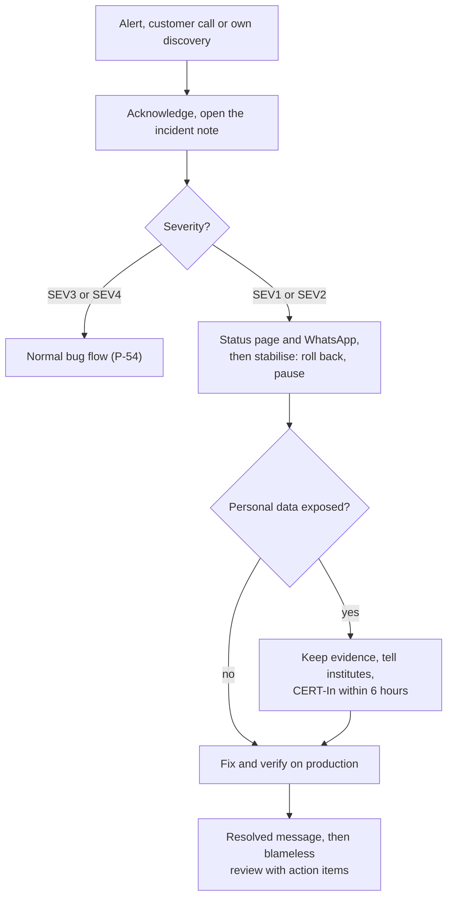

# Monitoring, Backups and Incident Response

**In simple words:** This chapter tells you what to watch in production, what may wake you at night, how to get data back, and what to do when something breaks. It covers monitoring tools, alert rules, backups with a monthly restore drill, and an incident process with ready customer messages. Schools forgive a short outage. They do not forgive silence, lost fee records or another institute seeing their data.

> **Note:** Dashboards change often, so each step says what to achieve. Prices are public information as of September 2026; verify them. Platform clicks live in *Deploy on Vercel and Railway*, workflow files in *Docker and CI/CD*.

## The monitoring stack

| Tool | Answers the question | Wakes you |
|---|---|---|
| Sentry | Which code broke, for whom, in which release? | No |
| Better Stack Uptime | Is EduFlow reachable? Did the nightly jobs run? | Yes, phone call |
| Better Stack Telemetry (logs) | What happened around this request? How slow? | Through page rules |
| Railway monitors | Is a service short of CPU, RAM or disk? | No |
| `ops-watch` worker job | Are queues, payments, messages, logins and institutes normal? | Through page rules |
| PostHog | Are staff using EduFlow? Did an institute activate? | No |

Grafana Cloud is the canon's alternative; Better Stack wins here because uptime, phone calls, logs and the status page share one account.

### Setup steps

**Sentry** (projects and SDK code from P-56): three alert rules for `production` (a new issue, one issue seen 50 times in 10 minutes, a resolved issue that returns), each by email and Sentry app push.

**Better Stack:**

1. Install the phone app, allow critical alerts, and let the calling number ring through Do Not Disturb.
2. Create two escalation policies. "Page" calls you at once, and your backup person after 15 minutes without acknowledgement. "Notify" sends email and push only.
3. Create the monitors and heartbeats from *Uptime checks and the public status page*.
4. Create a Node.js Telemetry source in Singapore, next to Railway, and copy its token and ingesting host into the `api` and `worker` variables.

**Railway** (Pro plan): Observability dashboard monitors for Postgres CPU above 80% for 15 minutes, Postgres disk above 70%, `api` RAM above 85% and Redis RAM above 80%, by email.

**PostHog:** production only, staff roles only; parents and students are never tracked (DPDP children's data rule). Identify users by UUID, no session recording. Six events with an `organization_id` property (`org.signed_up`, `student.imported`, `attendance.marked`, `fee.collected`, `invoice.generated`, `parent.invited`) measure activation: first receipt or attendance within 7 days, Year-1 target 60%.

### What monitoring costs

| Item | Pilot | 100 customers |
|---|---|---|
| Sentry | Free plan | ₹2,200 ($26) |
| Better Stack phone-call licences | One, ₹2,500 ($29) | Two, ₹4,900 ($58) |
| Better Stack logs | Free tier | ₹900 ($10) |
| PostHog | Free tier | Free tier |
| Total per month | About ₹2,500 | About ₹8,000 |

Estimate: annual list prices seen in 2025 and 2026, US$1 = ₹85, without GST.

## Golden signals and alert rules

Golden signals are the four numbers of a service's health: latency (how slow), traffic (how much), errors (how often it fails) and saturation (how full). EduFlow adds business signals, because a green system can still collect no fees.

| Channel | Tool | Meaning | 22:00 to 07:00 IST |
|---|---|---|---|
| Page | Better Stack phone call | Customers are blocked now | Rings |
| WhatsApp | `ops-watch`, template `ops_alert` | Something is going wrong | Held until 07:00 |
| Email | Sentry, Railway, Better Stack | Look today | Silent |

> **Rule:** An alert that needs no action is a bug in the alert. Fix its threshold that week, or you learn to ignore your phone.

| Signal | Alert when | Source | Channel | First action |
|---|---|---|---|---|
| API down | Ready route fails from 2 regions for 2 min | Uptime | Page | The first fifteen minutes |
| Web app down | `/login` not 200 for 2 min | Uptime | Page | Vercel status; roll back client |
| p95 latency | Over 800 ms / over 2 s for 10 min | Log alert | WhatsApp / Page | Railway metrics, P-53 |
| 5xx rate | Over 2% / over 10% of 50+ requests, 10 min | Log alert | WhatsApp / Page | Newest Sentry issue; recent deploy? Roll back |
| Queue backlog | 500+ waiting, or oldest over 10 min | `ops-watch` | WhatsApp | Worker logs; restart |
| Job failures | 10+ failed in 5 min in one queue | `ops-watch` | WhatsApp | The job's Sentry issue |
| Worker dead | No `ops-watch` heartbeat for 15 min | Heartbeat | Page | Restart worker; check Redis |
| DB connections | Over 80% of `max_connections` | `ops-watch` | WhatsApp | Connection budget |
| DB CPU, disk | CPU over 80% for 15 min; disk over 70% | Railway | Email | Slow queries; bigger volume |
| Redis memory | Over 70% / over 85% of `maxmemory` | `ops-watch` | WhatsApp / Page | Trim completed jobs; add RAM |
| Razorpay webhooks | 1 to 4 / 5+ `FAILED` in 30 min | `ops-watch` | WhatsApp / Page | Webhook log; secret changed? |
| Payment failures | Over 30% of 20+ orders in 60 min | `ops-watch` | WhatsApp | Razorpay status, UPI downtime |
| WhatsApp failures | Over 10% of 50+ messages in 60 min | `ops-watch` | WhatsApp, email | Meta error code |
| Login failures | 100+ in 15 min, or 20+ from one IP | `ops-watch` | WhatsApp | *Security monitoring basics* |
| Platform login | Any `SUPER_ADMIN` login | `ops-watch` | WhatsApp, day and night | Not you: SEV1 |
| Certificate, domain | Under 14 / 30 days to expiry | Uptime | Email | Renew; check DNS |
| Backups | No heartbeat by 03:30 IST; check failed | Heartbeat | Email, push | Re-run the workflow |

The two log alerts need no code: in Better Stack, chart the p95 of `responseTime` and the share of `res.statusCode` 500 or above from the `pino-http` lines, per 5 minutes, and attach a threshold alert to each.

### The ops-watch job

One worker job runs the query-based rules every 5 minutes and pings a Better Stack heartbeat. A broken page rule calls the heartbeat's `/fail` URL instead, so Better Stack pages you. If the worker dies, the pings stop, and you are paged too.

First get the WhatsApp utility template `ops_alert` approved: "EduFlow system alert: {{1}}. Please check the monitoring dashboard." The new variables are an assumption of this chapter; add them to the catalog in *Environments and Configuration*.

**File: `server/src/config/env.ts`** (add to the Zod object)

```typescript
OPS_WATCH_HEARTBEAT_URL: z.string().url().optional(),
OPS_ALERT_PHONES: z
  .string()
  .default('')
  .transform((s) => s.split(',').map((p) => p.trim()).filter(Boolean)), // 91XXXXXXXXXX,...
BETTERSTACK_SOURCE_TOKEN: z.string().optional(),
BETTERSTACK_INGEST_URL: z.string().url().optional(),
SERVICE_NAME: z.enum(['api', 'worker']).default('api'),
```

**File: `server/src/jobs/ops-watch.worker.ts`**

```typescript
import type { Job } from 'bullmq';
import type { Prisma } from '@prisma/client';
import { db } from '../lib/prisma';
import { redis } from '../lib/redis';
import { queues } from '../lib/queue';
import { logger } from '../lib/logger';
import { env } from '../config/env';
import { runAsPlatform } from '../lib/tenant-context';
import { sendWhatsAppTemplate } from '../lib/whatsapp'; // your P-29 client's function

type Breach = { rule: string; level: 'page' | 'warn'; text: string; always?: boolean };
const MIN = 60_000;
const since = (minutes: number) => new Date(Date.now() - minutes * MIN);
const istHour = new Intl.DateTimeFormat('en-GB', {
  hour: 'numeric',
  hourCycle: 'h23',
  timeZone: 'Asia/Kolkata',
});

async function checkQueues(out: Breach[]): Promise<void> {
  for (const [name, q] of Object.entries(queues)) {
    const c = await q.getJobCounts('waiting', 'failed');
    const [oldest] = await q.getJobs(['waiting'], 0, 0, true);
    const ageMin = oldest ? Math.round((Date.now() - oldest.timestamp) / MIN) : 0;
    if (c.waiting > 500 || ageMin > 10) {
      const text = `${name}: ${c.waiting} waiting, oldest ${ageMin} min`;
      out.push({ rule: `queue-${name}`, level: 'warn', text });
    }
    const key = `ops:failed:${name}`;
    const prev = Number((await redis.get(key)) ?? c.failed);
    await redis.set(key, String(c.failed));
    const newFails = c.failed - prev;
    if (newFails > 10) {
      out.push({ rule: `jobs-${name}`, level: 'warn', text: `${name}: ${newFails} jobs failed` });
    }
  }
}

async function checkInfra(out: Breach[]): Promise<void> {
  const [pg] = await db.$queryRaw<{ used: number; max: number }[]>`
    SELECT count(*)::int AS used, current_setting('max_connections')::int AS max
    FROM pg_stat_activity WHERE backend_type = 'client backend'`;
  if (pg.used > pg.max * 0.8) {
    const text = `DB connections ${pg.used}/${pg.max}`;
    out.push({ rule: 'db-connections', level: 'warn', text });
  }
  const info = await redis.info('memory');
  const used = Number(/used_memory:(\d+)/.exec(info)?.[1] ?? 0);
  const max = Number(/maxmemory:(\d+)/.exec(info)?.[1] ?? 0);
  const pct = max > 0 ? Math.round((used / max) * 100) : 0;
  if (pct > 70) {
    const level = pct > 85 ? 'page' : 'warn';
    out.push({ rule: 'redis-memory', level, text: `Redis memory ${pct}%` });
  }
}

async function checkProduct(out: Breach[]): Promise<void> {
  const hooks = await db.webhookEvent.count({
    where: { provider: 'RAZORPAY', status: 'FAILED', receivedAt: { gte: since(30) } },
  });
  if (hooks > 0) {
    const level = hooks >= 5 ? 'page' : 'warn';
    out.push({ rule: 'razorpay-webhooks', level, text: `${hooks} Razorpay webhooks failed` });
  }

  const orders = await db.paymentOrder.groupBy({
    by: ['status'],
    where: { updatedAt: { gte: since(60) }, status: { in: ['PAID', 'FAILED'] } },
    _count: { _all: true },
  });
  const done = orders.reduce((sum, o) => sum + o._count._all, 0);
  const failed = orders.find((o) => o.status === 'FAILED')?._count._all ?? 0;
  if (done >= 20 && failed / done > 0.3) {
    const text = `${failed} of ${done} online payments failed in 60 min`;
    out.push({ rule: 'payment-failures', level: 'warn', text });
  }

  const wa = await db.messageLog.groupBy({
    by: ['status'],
    where: { channel: 'WHATSAPP', queuedAt: { gte: since(60) } },
    _count: { _all: true },
  });
  const sent = wa.reduce((sum, g) => sum + g._count._all, 0);
  const waFailed = wa.find((g) => g.status === 'FAILED')?._count._all ?? 0;
  if (sent >= 50 && waFailed / sent > 0.1) {
    const text = `${waFailed} of ${sent} WhatsApp messages failed in 60 min`;
    out.push({ rule: 'whatsapp-failures', level: 'warn', text });
  }

  const bad: Prisma.LoginHistoryWhereInput = {
    result: { in: ['FAILED', 'LOCKED'] },
    createdAt: { gte: since(15) },
  };
  const failedLogins = await db.loginHistory.count({ where: bad });
  const byIp = await db.loginHistory.groupBy({
    by: ['ipAddress'],
    where: { ...bad, ipAddress: { not: null } },
    _count: { _all: true },
  });
  const hotIps = byIp.filter((g) => g._count._all >= 20).map((g) => g.ipAddress);
  if (failedLogins >= 100 || hotIps.length > 0) {
    const text = `${failedLogins} failed logins in 15 min; hot IPs: ${hotIps.join(', ') || 'none'}`;
    out.push({ rule: 'login-failures', level: 'warn', text });
  }

  // Platform users (SUPER_ADMIN) log in with no organization. Every login is reported.
  const platformLogins = await db.loginHistory.findMany({
    where: { organizationId: null, result: 'SUCCESS', createdAt: { gte: since(10) } },
    select: { id: true, ipAddress: true, createdAt: true },
  });
  for (const l of platformLogins) {
    const text = `Platform login from ${l.ipAddress} at ${l.createdAt.toISOString()}`;
    out.push({ rule: `platform-login-${l.id}`, level: 'warn', text, always: true });
  }
}

// Active institute = 20+ receipts in the last 14 days. Runs Mon-Sat at 11:15 IST.
async function checkReceiptsByEleven(): Promise<Breach[]> {
  const ist = new Date().toLocaleDateString('en-CA', { timeZone: 'Asia/Kolkata' });
  const today = new Date(ist); // YYYY-MM-DD at UTC midnight, as Prisma compares @db.Date
  const from = new Date(today.getTime() - 14 * 24 * 60 * MIN);
  const usual = await db.receipt.groupBy({
    by: ['organizationId'],
    where: { status: 'ISSUED', receiptDate: { gte: from, lt: today } },
    _count: { _all: true },
  });
  const busy = usual.filter((u) => u._count._all >= 20);
  const ids = busy.map((b) => b.organizationId);
  if (ids.length === 0) return [];
  const withReceipts = await db.receipt.groupBy({
    by: ['organizationId'],
    where: { organizationId: { in: ids }, receiptDate: today },
  });
  const holidays = await db.holiday.findMany({
    where: {
      organizationId: { in: ids },
      campusId: null,
      deletedAt: null,
      startDate: { lte: today },
      endDate: { gte: today },
    },
    select: { organizationId: true },
  });
  const skip = new Set([...withReceipts, ...holidays].map((r) => r.organizationId));
  const silent = await db.organization.findMany({
    where: { id: { in: ids.filter((id) => !skip.has(id)) }, status: 'ACTIVE' },
    select: { id: true, name: true },
  });
  return silent.map((o): Breach => {
    const last14 = busy.find((b) => b.organizationId === o.id)?._count._all ?? 0;
    const text = `${o.name}: 0 receipts by 11 am (usual about ${Math.round(last14 / 12)} a day)`;
    return { rule: `receipts-${o.id}`, level: 'warn', text };
  });
}

async function dispatch(breaches: Breach[], pingHeartbeat: boolean): Promise<void> {
  const pages = breaches.filter((b) => b.level === 'page');
  const beat = env.OPS_WATCH_HEARTBEAT_URL;
  if (pingHeartbeat && beat) {
    await fetch(pages.length ? `${beat}/fail` : beat, {
      method: 'POST',
      body: pages.map((p) => p.text).join('\n') || 'ok',
      signal: AbortSignal.timeout(10_000),
    }).catch((err: unknown) => logger.error({ err }, 'ops-watch heartbeat failed'));
  }
  const hour = Number(istHour.format(new Date()));
  const quiet = hour >= 22 || hour < 7;
  for (const b of breaches) {
    logger.warn({ event: 'ops.alert', rule: b.rule, level: b.level }, b.text);
    if (quiet && !b.always) continue; // pages already rang through the heartbeat
    const first = await redis.set(`ops:alerted:${b.rule}`, '1', 'EX', 2 * 60 * 60, 'NX');
    if (first !== 'OK') continue; // this rule already alerted in the last 2 hours
    for (const to of env.OPS_ALERT_PHONES) {
      await sendWhatsAppTemplate(to, 'ops_alert', [b.text]).catch((err: unknown) =>
        logger.error({ err, rule: b.rule }, 'ops alert WhatsApp failed'),
      );
    }
  }
}

export async function processOpsJob(job: Job): Promise<void> {
  if (job.name === 'business-check') {
    const found = await runAsPlatform('ops: receipts by 11 am', checkReceiptsByEleven);
    return dispatch(found, false);
  }
  const out: Breach[] = [];
  await checkQueues(out);
  await checkInfra(out);
  await runAsPlatform('ops-watch: platform counters', () => checkProduct(out));
  await dispatch(out, true);
}
```

**File: `server/src/jobs/schedulers.ts`** (add inside `registerSchedulers()`)

```typescript
await queues.ops.upsertJobScheduler('ops-watch', { every: 5 * 60 * 1000 }, { name: 'ops-watch' });
await queues.ops.upsertJobScheduler(
  'business-check',
  { pattern: '15 11 * * 1-6', tz: IST }, // Monday to Saturday, 11:15 IST
  { name: 'business-check' },
);
```

- Add an `ops` queue to `lib/queue.ts` and register `processOpsJob` in `worker.ts` with concurrency 1.
- It reads only counts and IDs across tenants, inside `runAsPlatform()`, as *Coding Standards* allows for maintenance jobs.
- Set Redis `maxmemory` to about 80% of its RAM (`--maxmemory <bytes>`); at 0, the Redis rule stays silent.
- Year 1 tenants are in India, so the check uses IST. Loop over `timezone` when UAE tenants arrive.
- Test on staging: stop the worker for 20 minutes, then queue 600 dummy jobs. Expect one page and one WhatsApp message.

## Structured logs and retention

*Coding Standards* sets the basics: JSON lines, the `req_` request ID, levels and no personal data. Monitoring adds fields you can search and count:

| Field | Example | Set by |
|---|---|---|
| `service`, `env`, `version` | `worker`, `production`, `v0.9.2` | Logger `base` |
| `requestId` | `req_8f3a91c2d4e5f607` | `pino-http` |
| `queue`, `jobId` | `notifications`, `4411` | Worker wrapper |
| `orgId`, `campusId`, `userId` | UUIDs only | Tenant child logger |
| `event` | `payment.collected` | Service, a fixed dotted name |
| `durationMs`, `provider` | `840`, `RAZORPAY` | Every outside call |
| `err` | Error with stack | `logger.error({ err }, '...')` |

**File: `server/src/lib/logger.ts`** (ships logs to Better Stack and to stdout)

```typescript
import pino from 'pino';
import { env } from '../config/env';

const betterStack = env.BETTERSTACK_SOURCE_TOKEN
  ? [
      {
        target: '@logtail/pino',
        level: env.LOG_LEVEL,
        options: {
          sourceToken: env.BETTERSTACK_SOURCE_TOKEN,
          options: { endpoint: env.BETTERSTACK_INGEST_URL },
        },
      },
    ]
  : [];

export const logger = pino({
  level: env.LOG_LEVEL,
  base: { service: env.SERVICE_NAME, env: env.APP_ENV, version: env.APP_VERSION },
  redact: {
    paths: [
      'req.headers.authorization',
      'req.headers.cookie',
      '*.password',
      '*.otp',
      '*.token',
      '*.refreshToken',
    ],
    censor: '[REDACTED]',
  },
  transport: {
    targets: [
      { target: 'pino/file', level: env.LOG_LEVEL, options: { destination: 1 } }, // stdout
      ...betterStack,
    ],
  },
});
```

Run `npm install @logtail/pino -w server`, and set `SERVICE_NAME=worker` on the worker service.

> **Warning:** This file drops the `formatters.level` option from *Deploy on Vercel and Railway*: Pino refuses it with `transport.targets`, and the Better Stack transport needs numeric levels. Railway's log view then shows 30, 40 and 50; search in Better Stack.

| Where | What | Kept |
|---|---|---|
| Railway, Sentry | stdout; error events | Plan default |
| Better Stack | Application logs | 30 days |
| PostgreSQL | `audit_logs`, `login_histories`, `webhook_events` | Per the PRD chapter *Audit Logs, Backups and Disaster Recovery* |
| Backups in S3 Mumbai | The same tables, in every dump | Up to 12 months |

> **Note:** The CERT-In directions of 2022 ask for system logs kept for a rolling 180 days inside India. Assumption: the security tables in the Mumbai backups cover this in Year 1. Confirm it with your lawyer. If not, keep application logs for 180 days in CloudWatch Logs (`ap-south-1`) after the AWS move, and raise the Better Stack retention until then.

## Uptime checks and the public status page

| Monitor | Target | Every | Policy |
|---|---|---|---|
| API | `https://api.eduflow.app/api/v1/health/ready` | 1 min, 2+ regions | Page |
| Web app | `https://app.eduflow.app/login` | 1 min | Page |
| Tenant subdomain | Your test organization's login page | 3 min | Page |
| Nightly backup | Heartbeat `BACKUP_HEARTBEAT_URL`, grace 90 min | 24 h | Notify |
| Backup check | Heartbeat `BACKUP_CHECK_HEARTBEAT_URL`, grace 60 min | 24 h | Notify |
| `ops-watch` | Heartbeat `OPS_WATCH_HEARTBEAT_URL`, grace 10 min | 5 min | Page |

On the API and web monitors, turn on SSL expiry (14 days) and domain expiry (30 days) alerts, and alert only when two regions agree.

Set up the status page:

1. Create a public Better Stack status page on `status.eduflow.app` (a CNAME at Cloudflare, proxy off; `status` is a reserved slug from P-56).
2. Components: Web app, API, Online fee payments, WhatsApp and SMS, Parent Portal.
3. Allow email subscriptions. Link the page from the login screen, the support WhatsApp auto-reply and the welcome email.
4. Announce maintenance 48 hours ahead, never on fee days (the 1st to the 10th).

> **Rule:** Name the effect, not the part: "Parents cannot pay online", not "webhook worker degraded". Update every 30 minutes, even with no news.

## Business monitors

A green dashboard can hide a broken business. If Sharma Classes has no receipt by 11 am, its counter, login or network is broken.

| Monitor | Alert when | Built in | First action |
|---|---|---|---|
| Receipts by 11 am | Active institute, zero receipts at 11:15 IST, Mon to Sat, no holiday | `ops-watch` | Call the accountant |
| Invoices on the 1st | No monthly invoices by 09:00 on the 1st | `ops-watch`, Phase 2 | Check the finance worker |
| Online payments silent | 10+ orders, none paid in 2 hours, 09:00 to 21:00 | `ops-watch`, Phase 2 | Razorpay status, webhook log |
| Traffic drop | A working hour under 30% of last week's | Log alert | DNS, Vercel, outage news |
| Silent customer | Paying institute, no staff login for 5 working days | PostHog, weekly | *Onboarding and Customer Success Playbook* |

> **Example:** "Namaste Suresh ji, Mehdi from EduFlow. Aaj Sharma Classes mein abhi tak koi fee receipt nahi bani. Counter theek chal raha hai?" Often it is an unknown holiday; add it to their list. Sometimes you found a bug before the owner did.

## Backups

| Layer | What, when | Where | Kept | Protects against |
|---|---|---|---|---|
| Railway backups | Volume: daily, weekly, monthly | Railway, Singapore | About 6 days, 1 and 3 months | Bad migration |
| Nightly dump | `pg_dump`, 02:00 IST (`backup.yml`) | `<date>/` in S3 Mumbai | 30 days | Losing Railway |
| Pre-deploy dump | Every release | `pre-deploy/<tag>.dump` | 90 days | A damaging release |
| Monthly copy | The dump of the 1st | `monthly/<YYYY-MM>.dump` | 12 months | Damage found late |
| Uploaded files | S3 object versions | `eduflow-prod-uploads` | 30 days | Overwrites, deletes |
| Redis | Append-only file | Railway volume | Not backed up | Rebuildable |
| Secrets, `FIELD_ENCRYPTION_KEY` | Each rotation | Password manager, sealed paper | While in use | Lost laptop |

Four lifecycle rules on `eduflow-prod-backups` replace the 30-day rule from P-56. Every date folder starts with `20`, so that prefix matches them and nothing else.

**File: `backup-lifecycle.json`**

```json
{
  "Rules": [
    {
      "ID": "daily-30-days",
      "Status": "Enabled",
      "Filter": { "Prefix": "20" },
      "Expiration": { "Days": 30 },
      "NoncurrentVersionExpiration": { "NoncurrentDays": 7 }
    },
    {
      "ID": "pre-deploy-90-days",
      "Status": "Enabled",
      "Filter": { "Prefix": "pre-deploy/" },
      "Expiration": { "Days": 90 },
      "NoncurrentVersionExpiration": { "NoncurrentDays": 7 }
    },
    {
      "ID": "monthly-12-months",
      "Status": "Enabled",
      "Filter": { "Prefix": "monthly/" },
      "Transitions": [{ "Days": 30, "StorageClass": "STANDARD_IA" }],
      "Expiration": { "Days": 365 },
      "NoncurrentVersionExpiration": { "NoncurrentDays": 7 }
    },
    {
      "ID": "abort-incomplete-uploads",
      "Status": "Enabled",
      "Filter": { "Prefix": "" },
      "AbortIncompleteMultipartUpload": { "DaysAfterInitiation": 2 }
    }
  ]
}
```

```bash
# Run as your own admin user with MFA. backup-bucket-policy.json is the HTTPS-only
# policy from "Deploy on Vercel and Railway" with the bucket name changed.
B=eduflow-prod-backups
aws s3api put-public-access-block --bucket "$B" --public-access-block-configuration \
  BlockPublicAcls=true,IgnorePublicAcls=true,BlockPublicPolicy=true,RestrictPublicBuckets=true
aws s3api put-bucket-encryption --bucket "$B" --server-side-encryption-configuration \
  '{"Rules":[{"ApplyServerSideEncryptionByDefault":{"SSEAlgorithm":"AES256"}}]}'
aws s3api put-bucket-versioning --bucket "$B" --versioning-configuration Status=Enabled
aws s3api put-bucket-policy --bucket "$B" --policy file://backup-bucket-policy.json
aws s3api put-bucket-lifecycle-configuration --bucket "$B" \
  --lifecycle-configuration file://backup-lifecycle.json
aws s3api get-bucket-lifecycle-configuration --bucket "$B"   # must list four rules
```

Add the monthly copy to `backup.yml` after the upload step, with the same `env` block and local file name:

```yaml
      - name: Keep a monthly copy on the 1st (IST)
        run: |
          if [ "$(TZ=Asia/Kolkata date +%d)" = "01" ]; then
            aws s3 cp eduflow-prod.dump \
              "s3://$BUCKET/monthly/$(TZ=Asia/Kolkata date +%Y-%m).dump" --only-show-errors
          fi
```

- S3 encrypts at rest; the bucket policy refuses requests without HTTPS.
- The writer key can only put objects, and versioning keeps overwritten copies, so a stolen key cannot erase history. Only you delete, with MFA.
- Encrypted columns are useless without `FIELD_ENCRYPTION_KEY`, so the key never lives next to the dumps.
- A downloaded dump stays on your encrypted laptop disk and is deleted the same day.

RPO (recovery point objective: how much recent data you may lose) and RTO (recovery time objective: how long until EduFlow works again):

| Target | Year 1 on Railway | After the move to AWS |
|---|---|---|
| RPO | 24 hours (the last dump) | 15 minutes (point-in-time recovery) |
| RTO, whole database | 2 hours | 1 hour |
| RTO, one institute's rows | 1 working day | 4 hours |

To close the gap: online payments come back through the P-26 Razorpay reconciliation; the unique gateway payment ID blocks duplicates. Counter receipts come back from paper copies, which accountants keep until the next morning.

## Restore runbooks

| Situation | Use | You lose |
|---|---|---|
| Damage across tenants, found within 6 days | Railway Backups tab, fastest | All changes since that backup |
| Railway volume or account gone | Nightly dump into a new PostgreSQL 16 | Changes since 02:00 IST |
| A release damaged data | `pre-deploy/<tag>.dump` | Changes since the release |
| One institute broke its own data | One-institute restore | Nothing for others |

> **Rule:** Restore production dumps only into a temporary PostgreSQL service in the Railway production environment, never into staging or local Docker.

### Full database restore

```bash
# Laptop, AWS admin with MFA. URLs come from the password manager, never from a file.
# SUPER_URL: superuser URL of the NEW PostgreSQL 16 service (TCP proxy)
# OWNER_URL: the same service, database eduflow, role eduflow
DAY=2027-01-18                                  # last good IST date
aws s3 cp "s3://eduflow-prod-backups/$DAY/eduflow-prod.dump" restore.dump

# 1. Same role names as production, so the grants in the dump apply again.
psql "$SUPER_URL" -v ON_ERROR_STOP=1 <<'SQL'
CREATE ROLE eduflow LOGIN PASSWORD 'new-owner-password-from-manager';
CREATE ROLE eduflow_app LOGIN PASSWORD 'new-app-password-from-manager' NOSUPERUSER NOBYPASSRLS;
CREATE DATABASE eduflow OWNER eduflow;
SQL
# Extensions that production uses (\dx there) are created now, as superuser.

# 2. Restore as the owner. No --no-acl: the grants carry the append-only audit rules.
docker run --rm -v "$PWD:/work" -e OWNER_URL postgres:16 sh -c \
  'pg_restore --dbname="$OWNER_URL" --no-owner --exit-on-error --jobs=4 /work/restore.dump'

# 3. Checks
psql "$OWNER_URL" -At -c "SELECT count(*) FROM organizations"
psql "$OWNER_URL" -c "\dp audit_logs"          # same privileges as production
(cd server && DATABASE_URL="$OWNER_URL" npx prisma migrate status)
rm restore.dump
```

4. Point `DATABASE_URL` (role `eduflow_app`) of `api` and `worker` at the new service. Update `DATABASE_ADMIN_URL` in GitHub and in the password manager.
5. Redeploy both and run the eight smoke checks from *Environments and Configuration*.
6. Close the gap, then set the status page to "Monitoring". Keep the broken service 7 days for the review.

The same steps work on any PostgreSQL 16, including RDS in Mumbai (*Deploy on AWS*).

### Restoring one institute's data

Example: at 15:10 on 16 Feb 2027, a wrong Excel import at Sharma Classes overwrote the phone and roll numbers of 140 students. Others kept working, so a full restore is wrong.

1. Find the scope in `audit_logs`. Soft-deleted rows need no restore, only an undo.
2. Take a fresh manual backup, so the repair itself can be undone.
3. Restore the last dump before the mistake into a temporary `pg-scratch` (steps 1 and 2 above).
4. Copy the institute's rows, one table per run, into a side table. `PGOPTIONS` sets the tenant for Row-Level Security on both sides; rows stream through memory, never onto disk.

```bash
ORG=6f1c2a9e-5b7d-4c11-9a3e-2d8f0b4c7e19      # organizations.id of Sharma Classes
T=students
export PGOPTIONS="-c app.current_org=$ORG"
psql "$PROD_ADMIN_URL" -v ON_ERROR_STOP=1 -c "CREATE TABLE restore_$T (LIKE $T)"
psql "$SCRATCH_URL" -v ON_ERROR_STOP=1 \
  -c "COPY (SELECT * FROM $T WHERE organization_id = '$ORG') TO STDOUT" |
  psql "$PROD_ADMIN_URL" -v ON_ERROR_STOP=1 -c "COPY restore_$T FROM STDIN"
```

5. Repair in one transaction in `psql` on production. Read the counts, then type `COMMIT` or `ROLLBACK`.

```sql
BEGIN;
SELECT set_config('app.current_org', '6f1c2a9e-5b7d-4c11-9a3e-2d8f0b4c7e19', true);

-- Rows that exist in the backup but are missing now
SELECT count(*) FROM restore_students r
WHERE NOT EXISTS (SELECT 1 FROM students s WHERE s.id = r.id);
INSERT INTO students
SELECT r.* FROM restore_students r
WHERE NOT EXISTS (SELECT 1 FROM students s WHERE s.id = r.id);

-- Rows the import changed: put back only the damaged columns
UPDATE students s
SET phone = r.phone, roll_no = r.roll_no, updated_at = now()
FROM restore_students r
WHERE s.id = r.id
  AND s.updated_at >= '2027-02-16 15:10+05:30'
  AND (s.phone IS DISTINCT FROM r.phone OR s.roll_no IS DISTINCT FROM r.roll_no);
-- Expect about 140 rows. Anything else: ROLLBACK.
```

6. Drop the `restore_` tables, delete `pg-scratch`, note the change in the incident file and tell the owner.

> **Warning:** Never restore money rows this way; money is corrected through the services (P-54). A unique-key error, such as a reused admission number, means ROLLBACK and a manual decision.

### The monthly restore drill

Third Monday of each month, 16:00 IST, 45 minutes. The Sunday robot proves the file is readable; this drill proves you can bring EduFlow back.

1. Pick a random date from the last 30 days.
2. Run the full restore into a temporary `pg-drill`, with a stopwatch.
3. Check the counts of `organizations`, `students` and `receipts`. The newest receipt is just before 02:00 IST of that date.
4. Delete `pg-drill` and the file. Log date, dump, restore minutes, checks and problems in `docs/runbooks/restore-test.md`.
5. Every second month, drill the one-institute path on your test organization instead.

## Incident response

An incident is any unplanned event that hurts customers or their data. Meet it with a calm routine.

### Severity levels

| Level | Meaning | Examples | Respond | Who is told |
|---|---|---|---|---|
| SEV1 | Data exposed, money wrong at scale, or all down | Cross-tenant exposure; online payments down; full outage; data loss | 15 min, any hour | Status page in 15 min; WhatsApp to admins |
| SEV2 | Core flow broken for many, no workaround | Receipt PDFs fail; parent OTP fails; WhatsApp stuck | 30 min, 07:00 to 22:00 | Status page in 30 min |
| SEV3 | Partial or one institute, workaround exists | One import stuck; slow reports | Same working day | That institute |
| SEV4 | No customer impact | Staging down; a Sentry error nobody hit | Weekly review | Nobody |

A Leak (*Testing Strategy for a Solo Founder*) is always SEV1; a P1 bug that hits several institutes is SEV2. When unsure, choose the higher level.

**Figure: The incident process**



Stabilise before you understand: a 5-minute rollback beats a 2-hour diagnosis. A data exposure adds the legal clock, so keep all evidence.

### The first fifteen minutes

1. **Minute 0 to 2.** Acknowledge in the Better Stack app; this stops the call to your backup person. Create `docs/incidents/2027-01-18-api-down.md` from the template and note the time. IDs only, no names.
2. **Minute 2 to 5.** Confirm from outside on mobile data (commands below), then check Sentry, the 5xx chart and the vendor status pages. Everyone, or one institute?
3. **Minute 5.** Set the severity. For SEV1 or SEV2, post "Investigating".
4. **Minute 5 to 10.** Find the last change: release, migration, variable, vendor incident. A release in the last 2 hours means roll back first ("Rolling back" in *Docker and CI/CD*).
5. **Minute 10 to 15.** Stabilise with the smallest action: roll back, restart, pause a queue, switch a feature off. For a data exposure, also revoke leaked sessions and delete nothing.
6. **Minute 15.** Second update, with the time of the next one. Call your backup person if you need hands.

```bash
curl -s https://api.eduflow.app/api/v1/health/ready
curl -s -o /dev/null -w "%{http_code} %{time_total}s\n" https://app.eduflow.app/login
railway logs --service api      # after "railway link" to the production environment
```

> **Founder note:** "Pehle aag bujhao, phir jaanch karo." Put the fire out, then investigate. Log every action with its time; your memory at 2 a.m. is not evidence.

### Customer messages

Send WhatsApp updates from the support number's broadcast list or an approved utility template, and email every affected Organization Admin. Never write "no data was lost" before you have checked.

**Script: status page updates**

```text
INVESTIGATING (10:42 IST)
Some users cannot open EduFlow right now. We are working on it.
Next update by 11:15 IST.

IDENTIFIED (11:05 IST)
We found the cause: a problem at our hosting provider. We are
moving EduFlow to a backup setup. Next update by 11:35 IST.

RESOLVED (11:48 IST)
EduFlow works normally again since 11:40 IST. If a parent paid
online during this time and got no receipt, do not collect again.
Send us the details and we will match it within one working day.
We are sorry for the trouble.
```

**Script: WhatsApp to institute admins (English and Hinglish)**

```text
EduFlow update (10:45 IST): EduFlow is not opening for some users.
We are fixing it now. Please write fee receipts on paper for the
next hour and enter them later. Live updates: status.eduflow.app
- Mehdi, EduFlow

EduFlow update (10:45 IST): Abhi kuch users ke liye EduFlow nahi
khul raha. Hum fix kar rahe hain. Agle ek ghante fees ki receipt
paper par bana lijiye, baad mein entry kar dijiye. Updates:
status.eduflow.app - Mehdi, EduFlow
```

**Script: email after a SEV1 or SEV2**

```text
Subject: EduFlow was unavailable today from 10:31 to 11:40 IST

Dear Rajesh ji,

Today from 10:31 to 11:40 IST, EduFlow did not open for most users.
The cause was a failure at our hosting provider. No data was lost.
Online payments made in this time were matched automatically.

What we are changing: a second API server from next week, so one
failure cannot stop EduFlow again.

If anything still looks wrong, reply to this email or WhatsApp us
on the support number. We are sorry for the trouble this caused.

Mehdi Alam, Founder, EduFlow
```

A data exposure never uses these templates: call each owner first, then send a notice your lawyer has read.

### Legal notification duties

| Duty | Applies when | Deadline | You do |
|---|---|---|---|
| CERT-In directions 2022 (IT Act) | Cyber incident: breach, leak, unauthorised access | 6 hours from noticing | Report via the CERT-In website |
| DPDP Act 2023, DPDP Rules 2025 | Personal data breach; institute is Data Fiduciary, EduFlow its Processor | Fiduciary tells people and the Board without delay; full report within 72 hours | Tell each institute in writing within hours |
| GDPR (international customers) | EU residents' data | Controller: authority within 72 hours; processor: controller without undue delay | Tell the customer at once |
| Australian NDB scheme (Year 3) | Eligible data breach | Assess within 30 days, then notify promptly | Help the customer notify |

> **Warning:** This is product guidance, not legal advice. DPDP Rules start in phases, so check which apply on the incident date. Notice wording and the breach log are in the PRD chapter *Privacy and Compliance*. Save your lawyer's number today.

### Blameless post-incident review

Blameless means asking what in the system allowed the mistake, never who made it; punished people hide problems. Review every SEV1 and SEV2 within 3 working days, and send affected institutes a 5-line summary after a SEV1.

**File: `docs/incidents/_template.md`**

```markdown
# Incident review: 2027-01-18 API down (SEV1)

## Summary
Two sentences: what customers saw and for how long.

## Impact
- Institutes affected: 37 of 112. Users: about 900 staff and 2,100 parents.
- Duration: 10:31 to 11:40 IST (69 minutes).
- Money: 14 online payments delayed, none lost. Data lost: none.

## Timeline (IST)
- 10:31 first failed health check
- 10:33 page acknowledged
- 10:41 status page "Investigating"

## Root cause
Ask "why" until you reach something you can change.

## Detection
Found by: alert, customer or luck. Minutes from start to page: 2.

## What went well, what was hard

## Action items
| Action | Type (prevent, detect, respond) | Owner | Due |
|---|---|---|---|
| Second api replica | Prevent | Mehdi | 2027-01-25 |
```

Every review ends with one action that prevents and one that detects faster.

## On-call for a solo founder

Alone, you cannot be awake all the time, so decide in advance what may wake you.

| When | What reaches you | Your promise |
|---|---|---|
| 07:00 to 22:00 IST | Pages and WhatsApp warnings | SEV1 in 15 min, SEV2 in 30 min |
| 22:00 to 07:00 IST | Pages and platform logins | SEV1 in 15 min |
| Fee days (1st to 10th), result days, pilot weeks | Everything | Laptop and mobile data always with you |

**The backup person** is a developer you trust, on a small retainer (Estimate: ₹3,000 to ₹5,000 a month) plus an hourly rate, under an NDA with data-protection clauses.

- **Access:** second step of the "Page" policy, a Railway role that reads logs and redeploys (never the owner account), status page editor, read-only Sentry. No database URL, AWS keys or password manager.
- **May:** acknowledge, roll back, restart, post the templates, call you or your family. **May not:** touch data, migrate, change secrets, or promise anything to customers.
- **Gets:** `docs/runbooks/backup-person.md` and a practice drill each quarter. If you are unreachable for 24 hours, they post a status note and message your ten biggest institutes.

| Vendor | When | Support path | Account ID |
|---|---|---|---|
| Railway | API, worker or database down | Dashboard support (Pro plan) | Fill in |
| Vercel | Web app or builds down | Dashboard support (Pro plan) | Fill in |
| Cloudflare | DNS, certificates | Dashboard support case | Fill in |
| AWS | S3, SES, account locked | Support Center (Basic: account and billing only) | Fill in |
| Razorpay | Payments, webhooks, settlements | Dashboard ticket; account manager | Fill in |
| Meta | WhatsApp number, templates | Business Support Home | Fill in |
| MSG91, registrar | SMS and DLT; `eduflow.app` renewal | Dashboard support | Fill in |
| Lawyer | Personal data breach | Phone, agreed in advance | Fill in |

Keep this table and the runbooks in the password manager's notes too, so your phone has them.

## Security monitoring basics

| Signal | Where | How often | Action |
|---|---|---|---|
| Failed-login spike | `ops-watch` | Every 5 min | Block the IP at Cloudflare |
| `SUPER_ADMIN` login | `ops-watch` | Every login | Not you: SEV1, rotate the password |
| Impersonation, role changes, exports, cancellations | Query below | Monday | Ask the institute about anything odd |
| Many `FORBIDDEN` answers for one user | Better Stack search | Monday | Someone may be guessing IDs |
| Vulnerable dependencies | Dependabot, `npm audit` | Weekly | Critical or high: fixed within 48 hours |
| Leaked secret | gitleaks in CI | Every pull request | Rotate the secret first |
| Public S3 bucket or unknown IAM key | AWS console | Monthly | SEV2 until explained |

```sql
-- Monday review: sensitive actions of the last 7 days, all tenants, read-only.
-- Adjust the action names to your permission keys.
BEGIN READ ONLY;
SELECT set_config('app.platform_mode', 'on', true);
SELECT created_at, organization_id, actor_label, actor_type, action, entity_label, ip_address
FROM audit_logs
WHERE created_at > now() - interval '7 days'
  AND (actor_type = 'IMPERSONATION'
       OR action LIKE 'roles.%'
       OR action LIKE '%export%'
       OR action IN ('fees.receipt.cancel', 'students.delete'))
ORDER BY created_at DESC
LIMIT 200;
COMMIT;
```

## Key takeaways

- Every alert has one channel and one first action; only customers blocked right now make your phone ring.
- `ops-watch` and its heartbeat watch queues, payments, messages, logins and the 11 am receipt pattern.
- The backup that matters most sits outside Railway: in Mumbai, encrypted, versioned, deletable only by you.
- A backup counts only after a restore: a robot every Sunday, you every month with a stopwatch.
- Restore one institute through a scratch copy with Row-Level Security on both sides; never restore money rows by hand.
- In an incident, stabilise first, tell customers early, and start the 6-hour CERT-In clock when personal data may be exposed.
- A backup person, a vendor list and quiet hours make solo on-call survivable.
