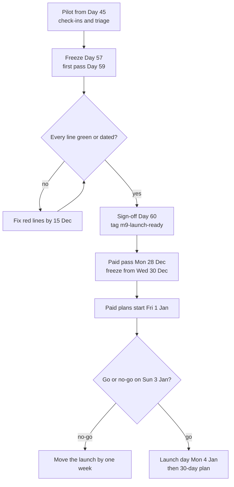

# Launch Checklist and Go-Live Runbook

**In simple words:** This chapter is the list you tick before real institutes and real money touch EduFlow. It holds seven pre-launch checklists, the pilot runbook for Days 45 to 60, an hour-by-hour runbook for the launch week with clear rollback triggers, the checklist for your first paying customer and a 30-day plan after launch. A line without proof is not done.

## How to use this chapter

You run the checklists three times.

| Pass | Date | Goal |
|---|---|---|
| First pass | Day 59, Wed 2 Dec 2026 | Give every line a colour |
| Sign-off | Day 60, Thu 3 Dec 2026 | Every line green or dated, file signed |
| Paid pass | Mon 28 Dec 2026 (T-7) | Check again for paying strangers, not friendly pilots |

In the Done column write G (done and proven today, with the date), A (a named date before launch) or R (unknown). Keep the file in the repository as `docs/launch/checklist.md`, so every pass is a commit.

> **Rule:** A red line in Security, Payments or Legal blocks the launch. Other groups may launch amber, with a fix date inside the first 14 days.

Two dates come from *After Day 60: The Road to V2.0*. Paid plans start on Friday 1 January 2027. The public launch push is Monday 4 January 2027. In this chapter that Monday is "T". Production is frozen from the last release train on Wednesday 30 December at 21:30 until T, except for P1 fixes.

**Figure: The launch sequence from pilot to the first 30 days**



Most of the work happens in the loop before the sign-off, so the Sunday decision should be a formality.

## Pre-launch checklists

### Product readiness

Smoke test the 16 Phase 1 modules on production. Log in to the demo tenants (`demo-bright-future`, `demo-sharma-classes`) as the canon people. A smoke test is one real action per module, not a full test.

| Item | Why | How to verify | Done |
|---|---|---|---|
| Dashboard | The first screen an owner sees | Rajesh Sharma sees today's collection and attendance cards | |
| Organizations | Every sale starts with signup | A new test signup finishes the wizard in under 10 minutes | |
| Multi Campus | Pro customers run branches | Pro adds campus 2; Growth is refused with `PLAN_LIMIT_REACHED` | |
| Student Admission | Admission season starts in January | One inquiry becomes an admission with a new admission number | |
| Student Profile | Every module depends on it | Excel import of 20 rows: dry run shows errors, then saves | |
| Teachers | Teachers mark attendance | Invite Priya Nair; she sets a password on her phone | |
| Attendance | The daily habit and an activation event | Mark one batch on a 360 px phone | |
| Batch | Groups students for fees and attendance | Create a batch and enroll 5 students | |
| Subjects | Needed by Batch now and Exams later | Add a subject and assign it to Priya Nair | |
| Fees | Wrong invoices mean wrong money | Invoices for one batch match a hand calculation | |
| Payments | Money comes in here | Cash collection gives a receipt PDF in under 10 seconds | |
| Discounts | A wrong discount is lost money | Sibling 10% changes the invoice only after approval | |
| Parent Portal | Parents are the proof of value | Sunita Devi logs in by OTP and sees only Aarav | |
| Notifications | A silent product feels dead | Marking Aarav absent creates an in-app item | |
| WhatsApp | The feature owners pay for | The receipt reaches the allow-listed demo phone | |
| Settings | Receipt series and branding | A new logo appears on the next receipt | |
| Critical flows | Protects everything above | Playwright flows green on staging for the release tag | |
| Bug log | Honest state of the product | 0 open P1, fewer than 10 P2, each with a date | |

### Security

| Item | Why | How to verify | Done |
|---|---|---|---|
| Tenant isolation suite green | A leak between institutes is a SEV1 incident | CI run of the release tag: isolation tests pass for every Phase 1 tenant table | |
| RBAC matrix spot-check | A wrong role sees wrong data | Try 10 cells of `docs/permissions.md` by hand, including Priya Nair calling a fee endpoint (`403`) | |
| Rate limits on | Stops password guessing and floods | 6th wrong login in 15 minutes answers `429 RATE_LIMITED` | |
| Secure cookies | The refresh token opens an account for 30 days | `Set-Cookie` shows `HttpOnly`, `Secure`, `SameSite=Lax`, `Domain=.eduflow.app` | |
| CORS locked | Other websites must not call the API | A foreign `Origin` gets no allow-origin header | |
| Headers via Helmet | Blocks clickjacking and content sniffing | HSTS, `x-content-type-options` and `x-frame-options` present | |
| Secrets rotated | Pilot-era secrets travelled through more hands | Every production secret is newer than the last laptop or chat copy; dates in the password manager | |
| Admin MFA | One stolen password must not open everything | `SUPER_ADMIN` login asks for MFA; 2FA on GitHub, AWS, Railway, Vercel, DNS, Razorpay, Meta, Google Workspace | |
| S3 private | Receipts and children's photos live there | A URL without the signed part answers `AccessDenied`; Block Public Access is on | |
| Backups tested | An untested backup is only a hope | Last night's dump restored into a scratch database, row counts match, time written down | |
| Dependency audit | Known holes in packages | `npm audit` for production packages shows no open high or critical issue without a note | |

Run the terminal checks from Git Bash. Use a throwaway test account for the rate-limit loop, because it locks that account for 15 minutes.

```bash
API=https://api.eduflow.app/api/v1

# Helmet headers: expect strict-transport-security, nosniff, frame options
curl -sI "$API/health" | grep -iE "strict-transport|x-content-type|x-frame"

# CORS: this must print nothing
curl -sI -H "Origin: https://evil.example" "$API/health" | grep -i "allow-origin"

# Rate limit: five 401 answers, then 429
for i in 1 2 3 4 5 6; do
  curl -s -o /dev/null -w "%{http_code}\n" -X POST "$API/auth/login" \
    -H "Content-Type: application/json" \
    -d '{"email":"lockout-test@eduflow.app","password":"wrong-password"}'
done

# Cookie flags: log in with a real test account
curl -si -X POST "$API/auth/login" -H "Content-Type: application/json" \
  -d "{\"email\":\"launch-check@eduflow.app\",\"password\":\"$TEST_PASSWORD\"}" \
  | grep -i "set-cookie"

# Dependencies: production packages only, fails on high or critical
npm audit --omit=dev --audit-level=high
```

### Payments

EduFlow's own Razorpay account collects subscription money. Fee money goes to each institute's own Razorpay account. The details are in *Deploy on Vercel and Railway*.

| Item | Why | How to verify | Done |
|---|---|---|---|
| Razorpay live keys | Subscriptions are paid from 1 January | Production holds `rzp_live_` keys; staging still holds `rzp_test_` | |
| Webhook signature verification | A forged "paid" event means free fees | A wrong `X-Razorpay-Signature` answers `400` and changes nothing | |
| Repeated webhook ignored | Razorpay retries deliveries | Resend one event from the dashboard: still one payment, one receipt | |
| Refund test | Parents will ask for refunds | ₹10 live UPI marks the invoice paid in 30 seconds; its refund ends as `refund.processed` | |
| Receipt numbering | Gaps or repeats look like fraud | 20 receipts in a row: no gap, no repeat; a cancelled receipt keeps its number as `CANCELLED` | |
| Reconciliation report | Finds money Razorpay got but EduFlow missed | Next settlement shows `RECONCILED`; a test mismatch shows `MISMATCH` | |
| Day close | The accountant's daily truth | Expected cash = opening + cash collected - cash refunded; a payment dated inside a submitted close gets `422` | |
| Institute gateway accounts | Fee money must never pass through EduFlow | Each live institute: own KYC, mode `LIVE`, ₹10 paid and refunded | |
| Online payment kill switch | A fast stop when money looks wrong | On staging, `RELEASE_FLAGS_OFF=fees.onlinePayment` hides Pay Now; counter collection still works | |

```bash
# Wrong signature: expect 400 and no new processed webhook event
curl -s -o /dev/null -w "%{http_code}\n" -X POST \
  "https://api.eduflow.app/api/v1/webhooks/razorpay/$GATEWAY_ACCOUNT_ID" \
  -H "Content-Type: application/json" \
  -H "X-Razorpay-Signature: not-a-real-signature" \
  -d '{"event":"payment.captured","payload":{}}'
```

### Messaging

| Item | Why | How to verify | Done |
|---|---|---|---|
| WhatsApp templates approved | An unapproved template is never delivered | Every template of *Notification Template Catalog* shows Approved in the live account, English and Hindi | |
| WhatsApp number health | Low quality cuts your sending limit | Business verified; quality rating green; display name "EduFlow" approved | |
| Opt-in captured | No alert may go out without a recorded opt-in | Guardians messaged in the last 7 days all have an opt-in record with a source | |
| Opt-out works | Parents control their phone | Reply STOP from a test phone: consent withdrawn, next message goes in-app only | |
| DLT templates | SMS arrives with P-31 after launch; approval takes 1 to 2 weeks (Estimate) | Entity ID, header and templates approved, or pending with a date | |
| SES out of sandbox | In the sandbox, email reaches only verified addresses | Production access granted in `ap-south-1`; a reset email reaches a fresh Gmail inbox, not spam | |
| Unsubscribe | Gmail and Yahoo require one-click unsubscribe from bulk senders since 2024 | Your product-update and newsletter emails carry it; password resets and receipts do not need it | |
| Messaging mode | Protects real parents from test sends | `MESSAGING_MODE=live` on production only; staging stays `allowlist` | |

### Legal

What each document must contain is in *Company Setup, Legal and Finance Basics*. Here you only prove that it is live and used.

| Item | Why | How to verify | Done |
|---|---|---|---|
| Terms of Service | The contract with every institute | `eduflow.app/terms` live with version and date; signup stores the accepted version | |
| Privacy Policy | DPDP notice to every user | Linked from signup, the app footer and the Parent Portal login | |
| Data Processing Agreement | The institute is the data fiduciary, EduFlow the processor | Accepted DPA on file for every paying customer before the first import | |
| Refund and cancellation policy | Razorpay and buyers ask for it | Page live; linked from the pricing page and every invoice | |
| Parental consent flow | Children's data needs verifiable parental consent | A new parent sees the consent screen before any data; `ConsentRecord` rows with method `OTP` | |
| Cookie notice | Users must know what is stored | Notice on `eduflow.app`; app sets only the essential refresh cookie plus analytics for staff; students are never tracked | |
| Lawyer review | Rules change | One review of all pages by a lawyer before 15 Dec 2026, date noted | |

### Operations

| Item | Why | How to verify | Done |
|---|---|---|---|
| Monitoring and alerts live | You hear about problems before customers do | A test error reaches your phone through Sentry in 5 minutes; stopping staging fires the uptime alert | |
| Status page | One place to speak during an outage | `status.eduflow.app` (assumption) lists web app, API, payments, WhatsApp; linked from help | |
| Support WhatsApp number | Owners expect help on WhatsApp | A separate number on the WhatsApp Business app, never the Cloud API number; greeting and away message set; shown in the app help menu | |
| Help articles | Customers solve common tasks alone | 10 articles under `/help`, each opened from its screen | |
| Onboarding Excel templates | Clean data on day one | Students, guardians, staff, fee structure and opening balances templates import with 0 errors on staging | |
| Demo organization | Every launch demo runs on it | `npm run demo:reset` finishes in under 5 minutes; the full *Demo Script* runs clean | |
| Vendor contact list | Outages happen at night | Support paths for Razorpay, Meta, Railway, Vercel and AWS saved in the password manager | |
| Incident messages ready | Nobody writes well under stress | Outage and apology texts from *Monitoring, Backups and Incident Response* saved as quick replies | |

### Business

| Item | Why | How to verify | Done |
|---|---|---|---|
| Pricing page | Buyers check the price before they call | Starter ₹0, Growth ₹2,499, Pro ₹5,999, Enterprise from ₹14,999, "+ 18% GST", yearly = 10 × monthly | |
| Invoices with GST | Customers claim input tax credit | Test invoice shows your GSTIN, the buyer's GSTIN, SAC code, place of supply, CGST + SGST or IGST, serial number | |
| Subscription billing flow | Money in without automatic billing | One dry run: proforma, payment link, tax invoice, subscription recorded in the platform console, renewal date in the calendar | |
| Trial end on 1 January | Pilots must not be locked out | Every pilot has `trialEndsAt` 31 Dec 2026 and a known next plan | |
| Books | Clean accounts from invoice 1 | Accounting tool set up with a series such as `EF/26-27/0001` | |
| CRM ready | No lead is lost in launch week | Every sprint lead has a stage and a next-action date | |

Intra-state sales carry CGST 9% + SGST 9%. Inter-state sales carry IGST 18%. Example for Growth yearly: ₹24,990 × 0.18 = ₹4,498.20 GST, total ₹29,488.20.

## Pilot runbook for Days 45 to 60

The day-by-day tasks are in *Daily Plan: Days 43 to 60*. This section is the method behind them.

### Selecting the five pilots

| Criterion | Pick | Avoid |
|---|---|---|
| Type mix | 3 coaching institutes, 2 schools | Five of one type |
| Size | 100 to 600 active students | Under 50 (Starter tests little) or over 1,000 |
| Decision maker | Owner answers the phone the same day | Owner abroad, or decisions by committee |
| Fee pattern | Counter collection every week, some UPI | Fees collected once a year |
| Staff | An accountant and one teacher with a smartphone | No computer at the fee counter |
| Distance | Within one hour of travel | Another city |
| Data | Student list in Excel or an export | Paper registers only (at most 1 of 5) |
| Attitude | Complains openly and specifically | Says "sab badhiya hai" and never reports |

Send each chosen owner a one-page pilot letter on WhatsApp and email, and ask for a written "yes".

```text
EduFlow pilot - Sharma Classes
1. Free pilot from 18 Nov 2026 to 31 Dec 2026.
2. You get: setup, data import, staff training, WhatsApp to
   parents (free credits), Parent Portal.
3. We ask: 10 minutes a day for honest feedback in the first
   2 weeks, and a short testimonial only if you are happy.
4. Your data belongs to you. Full Excel export at any time.
5. From 1 Jan 2027 you may continue on a paid plan at list
   price. There is no obligation.
Signed: Mehdi Alam, EduFlow        Accepted: Rajesh Sharma
```

### Onboarding day agenda

| When | What | Done when |
|---|---|---|
| Day minus 3 | Send the five Excel templates and the fee questionnaire | Files are back |
| Day minus 1, evening | Dry-run import; fix the Excel file, never the database; create fee structures | 0 import errors |
| Minutes 0 to 25 | Agree the one number the owner cares about; check their own data together | Wrong rows fixed |
| Minutes 25 to 60 | Create users; the accountant collects one real fee alone | First real receipt |
| Minutes 60 to 75 | A teacher marks today's attendance on a phone | First attendance day |
| Minutes 75 to 90 | Create the pilot WhatsApp group; fix the daily check-in time; say what is not built yet | Time agreed |
| Same evening | Thank-you message with numbers; every confusion goes into the feedback log | Log rows written |

### Daily check-in

Ten minutes, at the fixed time, by call. Ask the same four questions every day, so answers can be compared.

```text
1. Kal EduFlow mein kitni receipts kaati aur kitne din ki
   attendance lagi?        (How many receipts and attendance days?)
2. Kahin atke? Kaunsi screen par?    (Where did you get stuck?)
3. Kisi parent ne kuch bola?         (Did any parent react?)
4. Kal tak ek cheez theek karun to kaunsi?
                           (If I fix one thing by tomorrow, what?)
```

### Success criteria

| Measure | Target by Day 60 | Source |
|---|---|---|
| Pilots activated (first receipt or attendance within 7 days) | 5 of 5 | Usage scoreboard |
| Attendance marked | 8 of the last 10 working days, per pilot | Attendance records |
| Receipts made in EduFlow, not the old book | 80% in the last week | Accountant's count |
| Parents logged in at least once | 120 in total | Parent Portal logins |
| Open P1 bugs | 0 | Bug log |
| Paid commitments in writing | 3 | CRM |
| Testimonials with written permission | 3 | Testimonial folder |
| Owners who would be "very disappointed" without EduFlow | 3 of 5 | Question asked on Day 58 |

### Feedback log and bug triage

The bug log in *Daily Plan: Days 43 to 60* holds only defects. The feedback log holds everything people say, in their own words.

| Column | Example |
|---|---|
| Date, pilot, person | 20 Nov, Sharma Classes, Suresh Gupta (accountant) |
| Exact words | "Receipt mein batch do baar aa raha hai" |
| Type | Bug, Training, Wish or Praise |
| Link | BUG-014, help article 7, or backlog item |
| Told the customer | Yes, 21 Nov 21:50 |

Triage each row the same morning:

1. **Bug:** it goes into the bug log as P1, P2 or P3. P1 (wrong data, wrong money, cannot log in) is fixed the same day.
2. **Training:** fix or write the help article. Two training rows on the same screen mean the screen is the bug.
3. **Wish:** backlog. It counts only when two or more pilots ask for it.
4. **Praise:** copy it to the testimonial folder and ask for permission later.

## Go-live runbook

### T-7 days: the week of Monday 28 December 2026

| Day | Action | Done when |
|---|---|---|
| Mon 28 Dec | Paid pass of all seven checklists | 0 red lines |
| Tue 29 Dec | Timed restore test; k6 load test on staging from *Testing Strategy for a Solo Founder* | Restore time written; p95 under 500 ms at 200 users |
| Wed 30 Dec | Last release train at 21:30, smoke test, then freeze | Smoke test green, tag pushed |
| Thu 31 Dec | List every pilot with its plan from 1 January; message each owner | List matches signed invoices |
| Fri 1 Jan, 09:00 | Check the trial-end result | Paying pilots on paid plans, small pilots on Starter, nobody locked out |
| Sat 2 Jan | Draft launch messages in the CRM from *WhatsApp and Email Templates* | Drafts saved, nothing scheduled |

### T-1: Sunday 3 January 2027

Sunday stays a rest day. Give the launch 90 minutes in the evening.

| Time | Action |
|---|---|
| 18:00 | Health route answers `200`; no new Sentry issue types in 24 hours; no failed jobs in the queues |
| 18:15 | Last night's dump is in S3, with a size close to the day before |
| 18:30 | ₹10 UPI on EduFlow's own account, then refund; one WhatsApp template to your phone |
| 19:00 | `npm run demo:reset`; run the first 5 minutes of the demo |
| 19:30 | Go or no-go with the table below |
| 20:00 | Phone and laptop charged, alerts loud; asleep by 22:30 |

| Question | Go when |
|---|---|
| Open P1 bugs | 0 |
| Uptime in the last 24 hours | 100%, or the gap is explained |
| Restore test | Done within the last 7 days |
| Live payment tonight | Paid and refunded |
| WhatsApp quality rating | Green |
| Security, Payments, Legal checklists | All green |
| Committed customers | All invoiced |

One "no" means no-go. The public push moves to Monday 11 January. Customers already on EduFlow notice nothing, and you announce nothing.

### Launch day: Monday 4 January 2027

This expands the launch-day table in *After Day 60: The Road to V2.0*. There is no build block today.

| Time | Action | Watch for |
|---|---|---|
| 07:00 | Morning routine: health, backup, Sentry, failed jobs | Anything red stops the launch push until fixed |
| 07:30 | Open `docs/launch/launch-log.md`; write start numbers: organizations, paying, MRR | |
| 09:00 | Check payments of December invoices; call unpaid owners | |
| 10:00 | Personal launch messages to leads you have spoken with, in batches of 20 | Replies and new signups |
| 10:30 | 10-minute health look | 5xx rate, p95 latency, queue depth |
| 11:00 to 14:00 | Demos (target 3); 5-minute health look between demos | |
| 14:00 | Answer every message in under 30 minutes | Support replies |
| 15:00 | Onboard the first customer who paid (checklist below) | Import errors |
| 16:30 | Write numbers: invoices, money received, demos, signups | |
| 17:00 | Stop active work; alerts stay on the phone | |
| 21:30 | Last look at Sentry and queues; deploy only a P1 fix | |

### Rollback triggers

| Trigger | Threshold | First action within 15 minutes |
|---|---|---|
| One institute sees another's data | 1 confirmed report | SEV1: take the app offline, follow *Monitoring, Backups and Incident Response* |
| API errors after a deploy | 5xx above 2% of requests for 10 minutes | Roll back API and worker |
| Slow API | p95 above 2 seconds for 15 minutes | Roll back if a deploy came first; else check database and Redis |
| Wrong money | Any wrong paid status, or 3 webhook failures in 15 minutes | `RELEASE_FLAGS_OFF=fees.onlinePayment`; counter continues |
| Message flood | One parent gets the same message twice, or 1,000 jobs waiting | `RELEASE_FLAGS_OFF=wa.autoReminders` |
| Logins fail | A confirmed "cannot log in" from 2 institutes | Roll back the last deploy |
| Migration fails | Any error in the release job | Stop; the old version keeps serving; do not retry by hand |

How to roll back, by intent (menu names change over time):

1. **Client:** in Vercel, promote the previous production deployment.
2. **API and worker:** in Railway, redeploy the last good deployment of both services, always the same version.
3. **Database:** never run a down migration. Migrations are additive, so old code runs on the new schema. Restore from backup only for data corruption, and only as a SEV1 decision.
4. **Kill switch:** set `RELEASE_FLAGS_OFF` in Railway. The services restart in about a minute.
5. **Tell people:** update the status page within 15 minutes for anything customers feel.

### T+1: Tuesday 5 January 2027

| Time | Action |
|---|---|
| 07:00 | Morning routine; read every new Sentry issue from launch day |
| 08:00 | Reconciliation for yesterday's online payments; day closes of live institutes submitted |
| 09:00 | Ask each new customer one question: "How was day one?" |
| 10:00 | Reply to every launch message; book demos |
| 11:00 to 14:00 | Build 3 hours (Exams part two) |
| 16:30 | Numbers into the launch log |

The next deploy is the normal Thursday 7 January train, not earlier, unless there is a P1.

### T+7: Monday 11 January 2027 review

Spend 45 minutes, alone, with the launch log open.

| Measure | Target | Actual |
|---|---|---|
| Paying organizations live | 3 | |
| Demos done since T | 10 | |
| Open P1 bugs | 0 | |
| Uptime since T | 99.9% | |
| Median first reply to support | Under 30 minutes | |
| New signups activated within 7 days | 60% | |

Then answer three questions in one line each: what broke, what surprised you, and what you stop doing this week.

## First-customer onboarding checklist

Your first paying stranger gets the pilot treatment, with a paper trail. The full method is in *Onboarding and Customer Success Playbook*.

| Step | Done when | Done |
|---|---|---|
| Order and payment | Tax invoice paid, or a payment date agreed in writing | |
| DPA accepted | Copy stored with the invoice | |
| Organization created by the signup wizard | Type, plan and limits correct; subdomain login works | |
| Kickoff call, 30 minutes | Data list and go-live date agreed | |
| Excel templates returned | Dry-run import shows 0 errors | |
| Fee heads, structures, receipt series | Prefix and start number never clash with the old receipt book | |
| Opening balances | Outstanding total equals the old register total | |
| Users and roles | Owner, accountant and teachers each logged in once | |
| Institute's own Razorpay (Growth and up) | KYC done, keys `LIVE`, ₹10 paid and refunded | |
| WhatsApp | Credits loaded; one template reached the owner's phone | |
| Training | Owner 30 minutes, accountant 60, teachers 30 | |
| Parent invites | First 20 parents logged in | |
| Activation | First receipt or attendance within 7 days | |
| Day-7 call | Health row green in the tracking sheet | |

## Post-launch 30-day plan

All numbers are targets from *After Day 60: The Road to V2.0*, not forecasts.

| Week | Dates | Focus | Target by the end of the week |
|---|---|---|---|
| 1 | 4 to 10 Jan | Stabilise and onboard committed customers | 3 paying and live, 0 open P1 |
| 2 | 11 to 17 Jan | T+7 review, onboarding pipeline | 5 paying, every paid customer activated |
| 3 | 18 to 24 Jan | Referrals and the first case study | 2 referral introductions, 1 case study draft |
| 4 | 25 to 31 Jan | Close the month, prepare V1.0 | 8 paying, MRR ₹32,000 |
| Day 30 | Wed 3 Feb | 30-day retrospective | Launch checklist moved into the monthly security checklist in *Checklists* |

MRR check: 8 paying × ₹4,000 ARPA (average revenue per account) = ₹32,000.

Three rules hold for these 30 days:

1. No price changes and no new discounts. You need clean data on what the list price sells.
2. No big refactor. Paying customers get fixes before features.
3. Write one line in the launch log every evening: signups, demos, paying organizations, MRR, open P1, first-reply time.

## Key takeaways

- Run the checklists three times: Day 59, Day 60 and T-7. A line is done only with proof and a date.
- A red line in Security, Payments or Legal blocks the launch. Everything else may launch amber with a fix date within 14 days.
- Pick pilots who complain openly, run a 10-minute daily check-in, and log every comment by type: Bug, Training, Wish or Praise.
- Launch day is Monday 4 January 2027, after a production freeze from 30 December. The go or no-go decision on Sunday evening needs seven yes answers.
- Know your rollback triggers before launch: cross-tenant data, 5xx above 2%, wrong money, message floods and login failures. Roll back code or flip a kill switch. Never run a down migration.
- Onboard the first paying customer with a paper trail: payment, DPA, clean import, own gateway, trained staff, activation within 7 days.
- For 30 days after launch, stability and onboarding come before features. The target is 8 paying organizations and ₹32,000 MRR by 31 January 2027.
