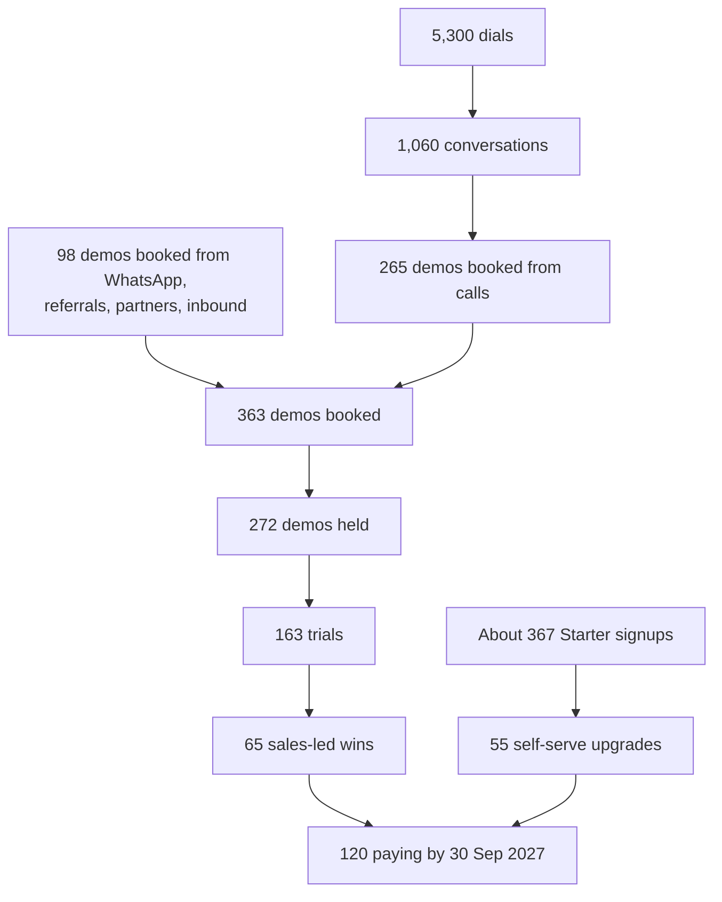

# Sales Foundation and Lead Generation

**In simple words:** This chapter turns you from a developer into a seller who follows a system. It fixes whom you sell to, your three pitches, where to find 500 institutes in two weeks and how one Google Sheet tracks every lead. It also sets your daily numbers, the 21-day follow-up rhythm, the first referral and partner steps, the sales calendar and the Monday review. Call, message, demo and objection scripts have their own chapters.

## Sales for a Technical Founder

Selling works like a deploy pipeline: every lead passes the same stages, and every stage has a test. You need a list, a script, a sheet and a fixed hour, not charm. Work in this order: know the buyer, learn three pitches, build the list, set up the sheet, hit the daily numbers, follow up for 21 days, review every Monday. Most "yes" answers come after the third touch.

Track dials, not moods. Ask one question, then stay silent for 3 seconds. Say the price when asked.

## Who You Sell To

The ICP (ideal customer profile — the institute that gains most from EduFlow and is easiest to win) comes from *Customer Segments and Ideal Customer Profile*.

| Item | Year 1 ICP |
|---|---|
| Type | Coaching institutes first; budget and mid private unaided schools second |
| Size | 100 to 1,500 active students (sweet spot 150 to 800); 1 to 3 campuses |
| Where | Tier 2 and 3 cities of Bihar, UP, MP, Rajasthan, plus Delhi NCR |
| City order | Patna and Lucknow (Jan 2027), Delhi NCR (Mar), Indore (May), Jaipur (Jul) |
| Money | Fee income ₹25 lakh to ₹5 crore a year; instalments with dues |
| Today's tools | Registers, receipt book, Excel, Tally, WhatsApp groups, old desktop program |
| Decision maker | Owner or director who takes calls and decides within 30 days |
| Readiness | Laptop with internet at the fee counter; one Excel user |
| Year 1 targets | Coaching 80; budget schools (300–800) 20; mid schools (800–1,500) 8; others 12 |
| Hard no | Tender-buying government or aided school; outside India; on-premise or lifetime licence; fees off the books |

> **Tip:** Grade every row before you call: **A** = owner-run, 100 to 500 students, close to you; **B** = fits, but far or larger; **C** = weak fit. After the first conversation, the BRD lead score (Hot, Warm or Cold) replaces the letter.

## Your Three Pitches

The one-liner goes on your WhatsApp Business profile, the 30-second pitch into calls and walk-ins, the 2-minute pitch to an owner who says "tell me more".

### One Line

- **EN:** "EduFlow is one simple system to run a school or coaching institute: admissions, attendance, fees, exams, staff and parent communication."
- **HI:** "EduFlow school ya coaching chalane ka ek simple system hai: admission, attendance, fees, exams, staff aur parents se baat, sab ek jagah."

### Thirty Seconds

```text
EN
I am Mehdi, founder of EduFlow. We make software for institutes in
{{city}}, so that owners stop losing fee money. Your accountant
collects a fee in under a minute, and the receipt reaches the
parent's WhatsApp at once. If a child is absent, the parent gets an
alert the same morning. And you see today's collection and pending
dues on your phone, from anywhere. Plans start at Rs 2,499 a month.
Can I show it on your own phone, in 25 minutes, on {{slot_1}} or
{{slot_2}}?

HI
Namaste {{owner_name}} ji, main Mehdi, EduFlow ka founder. Hum
{{city}} ke institutes ke liye software banate hain, taaki fees ka
paisa na doobe. Aapka accountant ek minute mein fees le leta hai, aur
receipt turant parent ke WhatsApp par pahunch jaati hai. Bachcha
absent ho toh parent ko usi subah alert chala jaata hai. Aaj ki
collection aur pending dues aap apne phone par kahin se bhi dekh
sakte hain. Plan Rs 2,499 mahine se shuru hote hain. Kya main 25
minute mein aapke phone par dikha doon, {{slot_1}} ya {{slot_2}}?
```

### Two Minutes

Six parts: pain (20 seconds), cost of the pain (20), what changes (40), proof (15), price and offer (15), ask (10). Put only a true pilot result in `{{pilot_result}}`.

```text
EN
{{owner_name}} ji, most owners I meet in {{city}} have three
problems. Fees come late, and nobody knows the exact dues list
without opening three registers. Parents call to ask "did my child
reach class?" and "where is my receipt?". And you cannot leave the
counter, because the cash must match at night.

Small leaks add up. If 300 students pay Rs 3,000 a month, you bill
Rs 9 lakh. Losing only 2 percent is Rs 18,000 every month.

EduFlow fixes this in one day. I import your Excel or register list.
Your accountant collects fees in under a minute, by cash or UPI.
Every receipt goes to the parent's WhatsApp with a number, so there
is no argument later. Teachers mark attendance on the phone, and
absent alerts go out the same morning. You open one screen on your
phone: today's collection, dues by batch, attendance.

{{pilot_name}} in {{pilot_city}} started with us in November.
{{pilot_result}}.

Growth is Rs 2,499 a month for up to 300 students, GST extra. Pay
yearly and 2 months are free. Till 30 April, the first 100
institutes pay for 8 months and use it for 12.

Let me show you on your own phone. It will get a real receipt during
the demo. Is {{slot_1}} or {{slot_2}} better for you?

HI
{{owner_name}} ji, {{city}} mein jitne owners se milta hoon, sabki
teen pareshaani hain. Fees late aati hai, aur teen register khole
bina exact dues list nahi milti. Parents phone karte hain - "bachcha
class pahuncha?", "receipt kahan hai?". Aur aap counter chhod nahi
sakte, kyunki raat ko cash match karna hota hai.

Chhota leakage bhi bada hota hai. 300 students Rs 3,000 mahina dein
toh Rs 9 lakh ka bill banta hai. Sirf 2 percent bhi chhoota toh har
mahine Rs 18,000 gaye.

EduFlow yeh ek din mein theek karta hai. Aapki Excel ya register
list main khud import karunga. Accountant ek minute mein fees leta
hai, cash ho ya UPI. Har receipt number ke saath parent ke WhatsApp
par jaati hai, toh baad mein koi behas nahi. Teacher phone par
attendance lagate hain, absent alert usi subah chala jaata hai. Aap
phone par ek screen kholte hain: aaj ki collection, batch-wise dues,
attendance.

{{pilot_city}} mein {{pilot_name}} November se use kar rahe hain.
{{pilot_result}}.

Growth plan Rs 2,499 mahina hai, 300 students tak, GST alag. Saal
bhar ka ek saath dein toh 2 mahine free. 30 April tak pehle 100
institutes 8 mahine ka paisa dekar 12 mahine chalayenge.

Main aapke phone par hi dikhata hoon, demo mein asli receipt aayegi.
{{slot_1}} theek rahega ya {{slot_2}}?
```

> **Note:** The loss figure is an example, not a claim about his institute. Ask for his real student count and fee, then redo the sum aloud: students × monthly fee × 2%.

## Value Messages by Persona

The owner pays, but four people decide whether EduFlow gets used. Give each one message and one proof on screen. Full profiles are in *Customer Personas*.

| Persona | Wants | Say (EN) | Say (HI) | Show |
|---|---|---|---|---|
| Owner (Rajesh Sharma) | Money and control | "Every rupee of dues on your phone, from anywhere." | "Har rupaye ka hisaab aapke phone par, kahin se bhi." | Owner dashboard, dues by batch, discount report |
| Principal (Dr. Anita Verma) | Academic visibility | "Know which class is slipping before the PTM, not after." | "PTM se pehle pata chale kaunsi class peeche hai." | Class-wise attendance; exams and report cards from 1 Feb 2027 |
| Accountant (Suresh Gupta) | Fewer errors, faster day close | "Numbered receipts, no hand totals, day close in minutes." | "Galti nahi, hisaab automatic, day close minuton mein." | Collect a fee in under a minute, day-close report, reprint |
| Parent (Sunita Devi) | Transparency | "Fee paid, receipt received, child present: you always know." | "Fees, receipt, attendance, sab aapke WhatsApp par." | WhatsApp receipt, absent alert, Parent Portal with OTP login |

PTM is the parent-teacher meeting; OTP login sends a one-time code to the phone. Parents do not buy, so tell the owner their message as "fewer parent calls and fee disputes".

> **Best practice:** Sell to the owner, win the accountant. Ask the owner to bring the accountant to the demo.

## Building Lead Lists

### Where to Find Institutes

All sources are public. Copy rows by hand: the data is cleaner, and you learn the market as you type.

| Source | How to search | What you get | Watch out |
|---|---|---|---|
| Google Maps | "NEET coaching Boring Road Patna" | Name, phone, area, reviews | Copy one parent pain into Notes |
| Justdial | Category, city, area | Phone, sometimes owner name | Old or forwarded numbers |
| Sulekha | "Coaching classes" plus city | Name, area, sometimes phone | Skip home tutors |
| UDISE+ school directory | Filter state, district, block | Official name, UDISE code, management | Keep "Private Unaided"; phone from Maps |
| CBSE affiliation directory | SARAS portal search by district | Principal, address, often phone | Data can be old |
| Coaching listing sites | "Best JEE coaching in {{city}}" | 10 to 30 names a page | Skip national brands |
| Local newspapers | Admission ads, January to April | Institutes spending on admissions now | Enter the same day |
| Facebook and Instagram | "Coaching {{city}}"; posted in 30 days | Owner name, batch dates | Business number only |
| Coaching street walk | Boring Road (Patna), Aliganj (Lucknow), Mukherjee Nagar (Delhi) | 40 to 60 signboards in 2 hours | Never pitch at a busy reception |
| Network and pilots | "Which 3 owners do you know?" | Warm leads | Source "Referral" |

### What to Capture at List Time

Fill columns A to O of the Leads tab (layout below), about 2 minutes a row. No phone, no row. Students is a best guess, corrected on the call. Current tool stays "Unknown" without proof. Skip national chains, government schools and home tutors.

### The 500-Lead Sprint

Year 1 needs about 3,100 leads (see the funnel math), so the list is never "done". The unit you repeat: 500 rows in 10 working days, 50 rows (about 100 minutes) a day.

| Working days | Focus | Main sources | Rows |
|---|---|---|---|
| 1–2 | Coaching, Patna | Google Maps, Justdial | 100 |
| 3–4 | Coaching, Lucknow | Google Maps, Justdial, Sulekha | 100 |
| 5 | Coaching street walk | Signboard photos | 50 |
| 6–7 | Schools, both cities | UDISE+, CBSE directory, Google Maps | 100 |
| 8 | Satellite towns (Muzaffarpur, Gaya, Kanpur) | Google Maps, Justdial | 50 |
| 9 | Institutes showing intent now | Newspapers, social pages, listing sites | 50 |
| 10 | Thinnest area; then clean and grade | Sheet | 50 |

That gives about 350 coaching institutes and 150 schools.

> **Founder note:** Timing is an assumption. Run the first sprint on evenings from 7 to 18 December 2026, so January calls never run out. Then one per new cluster: Delhi NCR in February, Indore in April, Jaipur in June 2027.

Catch bad rows with two colour rules on column H (Format, Conditional formatting, "Custom formula is"):

```text
Duplicate phone (yellow):
=AND($H2<>"",COUNTIF($H:$H,$H2)>1)

Phone is not 10 digits (orange):
=AND($H2<>"",LEN($H2)<>10)
```

### Contact Rules: Compliance and Politeness

1. **Public business numbers only:** listing, website, signboard, ad or directory. Never buy lists or collect parent and student numbers.
2. **No scraping tools.** Site terms forbid automated copying.
3. **A human dials, one call at a time.** No auto-dialers, recorded calls or bulk SMS; TRAI rules on unsolicited commercial communication target exactly these (see *Compliance, Legal and Data Protection Requirements*).
4. **Name and reason in the first 10 seconds.** Call 09:30 to 19:00, Monday to Saturday; never on festivals or result days.
5. **"Do not call" is final.** Set column W to Yes during the call.
6. **WhatsApp limits.** At most 15 cold first-touches a day, no link in a first message, 3 messages to a silent lead.
7. **Personal data care.** An owner's mobile is personal data under the DPDP Act 2023. Use it only to offer EduFlow, never share the sheet, and delete a row within 7 days of a request (our own rule).
8. **Respect.** "Ji", "sir", "aap". Never pose as a parent or official; never criticise the owner's current software.
9. **Company-owned accounts** for the SIM, WhatsApp and Google, with 2-step login.

## Simple CRM Setup

A CRM (customer relationship management tool) holds every lead, touch and next step. Start with the Google Sheet "EduFlow CRM" from *How to Use This Blueprint*. In early January 2027 the BRD tool plan moves you to Zoho Bigin (about ₹500 per user a month, estimate), or HubSpot's free CRM. Same stages and columns, so the move is one CSV import.

### Tabs

Create six tabs: **Leads** (one row per institute), **Calls** (one row per dial; layout and outcome codes in *Cold Call Scripts*), **Today** (the scoreboard from *Cold Call Scripts* plus the due list), **Weekly** (Monday review numbers), **Partners** (candidates, signed partners, registered leads) and **Lists** (dropdown values).

### Leads Tab Column Layout

| Col | Header | Type or rule | Example |
|---|---|---|---|
| A | Lead ID | Typed by hand, never a formula (it shifts on sort) | L-0142 |
| B | Institute | Text | Sharma Classes |
| C | Type | Dropdown: COACHING, SCHOOL, COLLEGE, TRAINING_CENTRE | COACHING |
| D | City | Text | Patna |
| E | Area | Text | Boring Road |
| F | Contact name | Text | Rajesh Sharma |
| G | Role | Dropdown: Owner, Principal, Accountant, Front desk, Other | Owner |
| H | Phone | Plain text, 10 digits | 9XXXXXX142 |
| I | WhatsApp opt-in | Date of first reply; blank means none | 12 Jan 2027 |
| J | Students | Number | 350 |
| K | Campuses | Number | 1 |
| L | Current tool | Dropdown: Register, Excel, Tally, Desktop program, Other SaaS, Unknown | Excel |
| M | Source | Dropdown: the ten sources above, plus Partner, Starter signup, Inbound | Google Maps |
| N | Referred by | Customer or partner name | (blank) |
| O | List grade | Dropdown: A, B, C | A |
| P | Stage | Dropdown: ten BRD stages (below) | Demo Scheduled |
| Q | Score | BRD lead score 0 to 100, after first talk | 96 |
| R | Grade | Formula: Hot, Warm, Cold | Hot |
| S | Main pain | Dropdown: Fee dues, Cash mismatch, Parent complaints, Attendance, Branch control | Fee dues |
| T | Last touch | Date | 12 Jan 2027 |
| U | Next action | Starts with a verb | Demo with owner and accountant |
| V | Next action date | Date; blank only for Won and Lost | 14 Jan 2027 |
| W | Do not contact | Dropdown: Yes, No | No |
| X | Notes | One line, pain in their words | "Dues kept in a diary" |
| Y | Due | Formula: "Due" when V is today or earlier | Due |

### The Ten Stages

From *Sales Process and Playbooks*. BANT-R means five checks: Budget, Authority, Need, Timeline, Readiness.

| Stage | Move a lead here when | Maximum time in stage |
|---|---|---|
| Lead | Row has name, type, city and phone | 2 working days to the first attempt |
| Contacted | First call or WhatsApp is logged | 10 days, or 3 unanswered calls |
| Qualified | BANT-R score 4 or 5; owner reachable | 3 days to book a demo |
| Demo Scheduled | Date, time and attendees confirmed on WhatsApp | Demo within 7 days |
| Demo Done | Owner saw the demo for 15 minutes or more | 2 days to start a trial |
| Trial | Account live with their real data | 14 days |
| Negotiation | Written quote sent | 7 days |
| Won | Money received | Handover in 1 working day |
| Lost | One lost-reason code (L1 to L9) picked | Same day |
| Nurture | Good fit, wrong time; next date set | Next touch within 30 days |

On 4 December 2026, convert the sprint's simpler status words once: New = Lead; No answer, Talked = Contacted; Discovery done = Qualified; Pilot maybe = Demo Done; Pilot yes = Trial; Not interested = Lost or dated Nurture.

### Dropdowns, Formulas and Colours

1. In the Lists tab, put each list in its own column: A Stages, B Sources, C Roles, D Tools, E Pains.
2. Select P2:P, then Data, Data validation, Add rule. Choose "Dropdown (from a range)" and enter `=Lists!A2:A11`. Repeat for the other dropdown columns.
3. Format column H as Plain text (Format, Number, Plain text), so phone numbers keep every digit.
4. Type these two formulas once; each fills its whole column.

```text
Cell R2 (Grade):
=ARRAYFORMULA(IF(Q2:Q="","",IF(Q2:Q>=70,"Hot",IF(Q2:Q>=45,"Warm","Cold"))))

Cell Y2 (Due):
=ARRAYFORMULA(IF((V2:V<>"")*(V2:V<=TODAY())*(W2:W<>"Yes"),"Due",""))
```

5. Add colour rules on A2:Y with "Custom formula is", in this order:

| Rule | Custom formula | Colour |
|---|---|---|
| Do not contact | `=$W2="Yes"` | Grey text |
| Overdue | `=AND($V2<>"",$V2<TODAY())` | Light red |
| Hot lead | `=$R2="Hot"` | Light green |

> **Tip:** Ctrl and ; (semicolon) types today's date. Update T, U and V after every touch.

### Daily Views

On the Today tab, below the scoreboard, enter in cell A10:

```text
=QUERY(Leads!A2:Y,"select A,B,H,P,U,V where Y='Due' order by V",0)
```

It lists every lead due today or late, oldest first, without "Do not contact" rows. Clear it before you touch a new row. Also save four filter views on Leads (Data, Filter views): "Hot to call" (R is Hot, P before Demo Scheduled), "A rows never called" (O is A, P is Lead), "Demos this week" and "Trials" (filter P, sort by V).

## Daily and Weekly Activity Targets

### The Numbers

Calling days are Monday to Thursday; Friday is for closing calls, Saturday for field visits and next week's bookings. A dial is one call attempt; a first-touch is the first WhatsApp message to a lead.

| Activity | Per calling day | Per week (4 days) | Per month (16 days) |
|---|---|---|---|
| Dials | 40 | 160 | 640 |
| Conversations with a decision maker | 8 | 32 | 128 |
| WhatsApp first-touches | 15 | 60 | 240 |
| Demos booked | 2 | 8 | 32 from calls; about 44 in total |
| Demos held, January to March | 2 | 8 | About 33 |
| New rows added to the list | — | About 90 | About 370 |

Most first-touches are the same-hour message after an unanswered call.

### A Launch-Season Day

Inside the 11:00 to 14:00 sales block of *After Day 60: The Road to V2.0*:

- **11:00–12:45:** 40 dials: due list, then Hot, then A rows.
- **12:45–13:30:** 15 WhatsApp first-touches, missed calls first.
- **13:30–14:00:** replies and demo confirmations; every row gets a next date.
- **Demos:** 14:15 for schools (principals are free around dispersal); 20:00 for coaching owners after evening batches (January to March only).

### Funnel Math to 120 Paying Customers

The canon target is 120 paying organizations by 30 September 2027: 65 sales-led wins and 55 self-serve upgrades from Starter, as split in the BRD. Work backwards. Every rate is a BRD **Estimate**.

| Step | Rate | Formula | Year 1 number |
|---|---|---|---|
| Sales-led wins | Plan | — | 65 |
| Trials | 40% trial to paid | 65 ÷ 0.40 | 163 |
| Demos held | 60% demo to trial | 163 ÷ 0.60 | 272 |
| Demos booked | 75% show-up | 272 ÷ 0.75 | 363 |
| Booked from calls | About 73% of bookings | 363 × 0.73 | 265 |
| Conversations | 25% book a demo | 265 ÷ 0.25 | 1,060 |
| Dials | 20% reach a decision maker | 1,060 ÷ 0.20 | 5,300 |
| Calling days | 40 dials a day | 5,300 ÷ 40 | 133 |
| Leads on the list | 1.7 dials per lead | 5,300 ÷ 1.7 | About 3,100 |
| Starter signups | 15% free-to-paid | 55 ÷ 0.15 | About 367 |

**Figure: Year 1 funnel to 120 paying customers**



The left path is your daily work; the right path is the product selling itself. January to September gives about 144 calling days (36 weeks × 4) against 133 needed; the spare days absorb festivals and illness.

> **Founder note:** Replace each rate with your own after 500 dials. If only 12% of dials reach a decision maker, you need 8,833 dials, not 5,300. Fix the list and call hours before adding hours.

## Follow-Up Cadence Over 21 Days

Day 1 is the first attempt. A **silent** lead never answered or replied: it gets 3 calls and 3 messages in 10 days (the BRD limit), then Nurture. An **engaged** lead talked or replied but has no demo date. Stop once a demo is booked. Texts are in *WhatsApp and Email Templates*.

| Day | Channel | Message purpose | Who gets it |
|---|---|---|---|
| 1 | Call 1 | Book the demo in the segment's best hour | All |
| 1 | WhatsApp | Missed call: who, why them, one question, no link. Talked: thanks and promises | All |
| 2 | WhatsApp | 60-second video: receipt reaching a parent | Engaged |
| 3 | Call 2 | Other time window; if busy, fix a time | All |
| 3 | WhatsApp | One same-state pilot result; two demo slots | All |
| 5 | WhatsApp | One useful tip (cutting dues before April); no pitch | Engaged |
| 7 | Call 3 | New hour; demo ask with two slots | All |
| 7 | WhatsApp | Demo or weekly Hindi webinar invite | Engaged |
| 10 | WhatsApp | "I will not message again" plus the free Starter link; Nurture | Silent (last) |
| 12 | Call | Ask who else decides; offer a slot the owner can join | Engaged |
| 14 | WhatsApp | Price per student per month; Founding 100 end date | Engaged |
| 17 | Voice note | 30 seconds from you, by name, one question | Engaged |
| 21 | Call, then WhatsApp | Final ask: demo this week, or a dated Nurture slot | Engaged |

Leave at least 48 hours between two unanswered messages. After Day 21, Nurture means one useful message a month and a call before each buying season.

## Referral and Reseller Kick-Off

### Referrals From the First Customer

The terms are fixed in *Go-To-Market Strategy*: "give a month, get a month" (referrer's free month capped at ₹5,999; ₹2,000 to a non-paying referrer).

1. By 31 December 2026, print the terms on your price PDF. Log every referral in column N.
2. Ask each pilot owner once they pay, and every customer on Day 30 after go-live: "Which 3 owners do you know?" Never during a trial or an open complaint.
3. Call a referred lead within 2 working hours, opening with the referrer's name. Thank the referrer the same day.

### Recruiting the First Five Local Partners

A reseller partner is a local business that sells EduFlow for a commission. Per *Go-To-Market Strategy*, partner talks start mid-April 2027, and partners sell once 30 direct customers are live (expected May 2027).

1. **Collect 20 candidates, January to March.** Ask every customer: "Who set up your computers, and who is your CA (chartered accountant)?" Add education consultants and book or uniform suppliers.
2. **Shortlist** those who already serve 3 or more ICP institutes and have an office.
3. **Meet 12 in April** with the pitch below; **sign 5 by 30 June 2027** on a one-page letter with the terms below.
4. **Train for 2 hours:** demo login, pitch, prices, and a Google Form to register leads.
5. **Do the first deal together:** you demo while the partner watches, then swap.
6. **Review monthly.** No registered lead in 90 days: stop investing time (our own rule).

### Partner Pitch

```text
EN
{{partner_name}} ji, you already visit institutes in {{city}}, and
many still run fees on registers and Excel. EduFlow gives them
WhatsApp receipts, a dues list and an owner dashboard in one day. You
introduce us and help with the demo. We do setup, support and
billing. You earn 20 percent of what the institute pays us in its
first year, and 10 percent every year after, while it stays. A Pro
yearly plan is Rs 59,990, so your first-year share is Rs 11,998, then
Rs 5,999 a year. No stock, no investment, one public price for all.
Shall we start with 3 institutes you know well?

HI
{{partner_name}} ji, aap {{city}} ke institutes mein jaate hi hain,
aur bahut se abhi bhi register aur Excel par fees chalate hain.
EduFlow unhe ek din mein WhatsApp receipt, dues list aur owner
dashboard deta hai. Aap introduce karein aur demo mein saath dein.
Setup, support aur billing hum karenge. Institute pehle saal jo bhi
humein dega, uska 20 percent aapka, aur uske baad har saal 10
percent, jab tak woh saath hai. Pro yearly Rs 59,990 ka hai, toh
pehle saal aapke Rs 11,998, phir har saal Rs 5,999. Na stock, na
investment, sabke liye ek hi price. Aapke jaan-pehchaan ke 3
institutes se shuru karein?
```

### Commission and Rules

BRD terms from *Business Model*, adopted in *Go-To-Market Strategy*. They are proposals: test them with these 5 partners before publishing.

| Item | Rule |
|---|---|
| Commission | 20% of subscription and recurring add-on fees in the first 12 months, before GST; 10% from month 13 while the customer pays |
| Introducer level | ₹2,000 per paying customer, for suppliers who only introduce |
| Not commissionable | WhatsApp and SMS packs, gateway charges, GST, one-time setup fees |
| Protection and clawback | Lead protected 90 days; a refund within 30 days reverses the commission |
| Guard rails | Same public price; EduFlow owns contract, billing and data; no `SUPER_ADMIN` access; no exclusive territory in Years 1–2 |

## Sales Calendar for the Academic Year

This is the execution view of the buying calendar in *Customer Segments and Ideal Customer Profile*. Paying numbers are month-end targets from *After Day 60: The Road to V2.0*.

| Month | Buyer mood | Your sales focus | Paying (target) |
|---|---|---|---|
| Oct 2026 | Low: exams, Dussehra | Build the list; fill 5 pilot seats | 0 |
| Nov 2026 | Low, rising after Diwali | Pilot from 18 Nov; before-and-after numbers | 0 |
| Dec 2026 | Rising | 500-lead sprint; pilot-to-paid; book January demos | 0 |
| Jan 2027 | High | Paid launch; 2 demos a day; coaching first | 8 |
| Feb 2027 | High | V1.0 on 1 Feb; school demos; Delhi NCR sprint | 18 |
| Mar 2027 | Highest | Close before 1 April; Delhi NCR opens | 30 |
| Apr 2027 | Medium: session starts | Onboard; Founding 100 ends 30 Apr; partner talks; Indore sprint | 42 |
| May 2027 | Coaching admission peak | Coaching campaign; Indore opens; partners sell | 55 |
| Jun 2027 | Second coaching peak | Chains adding centres; Jaipur sprint | 70 |
| Jul 2027 | Medium | Referral push; campus upsells; Jaipur opens | 85 |
| Aug 2027 | Low to medium | Case studies, webinars, partner reviews | 102 |
| Sep 2027 | Low; big schools plan | Early-bird talks for April 2028 | 120 |

From Year 2 the wave repeats. Make renewal calls in months 10 and 11 of each contract (see *Onboarding and Customer Success Playbook*).

## Weekly Sales Review Template

Every Monday, 30 minutes, before the dial block. This is the fill-in version of the BRD one-pager in *Sales Process and Playbooks*, for your Weekly tab. Put the review week's Monday date in B1 and `=B1+7` in C1. Then:

```text
B2 Dials:         =COUNTIFS(Calls!A:A,">="&B1,Calls!A:A,"<"&C1)
B3 Demos booked:  =COUNTIFS(Calls!A:A,">="&B1,Calls!A:A,"<"&C1,Calls!E:E,"DB")
```

```text
EDUFLOW WEEKLY SALES REVIEW              Week of: ____________
1. INPUTS                              Target    Actual
   Dials                                  160    ______
   WhatsApp first-touches                  60    ______
   Demos booked                             8    ______
   New rows added to the list              90    ______
2. OUTPUTS
   Demos held                               8    ______
   Trials started                           5    ______
   Won (money received)                     2    ______
   New first-year value (Rs)           72,000    ______
3. HYGIENE
   Open rows with no next date: ____ (must be 0)
   Deals over the stage time limit: ____
   Trials Green / Amber / Red: ___ / ___ / ___
4. LOST THIS WEEK (codes L1 to L9): _______________________
5. WHAT WORKED: ___________________________________________
6. WHAT FAILED: ___________________________________________
7. ONE EXPERIMENT NEXT WEEK: ______________________________
8. THREE ACTIONS WITH DATES: ______________________________
```

Mark each line Green at 100% of target or more, Amber at 80% to 99%, Red below 80%. Read inputs first: this week's wins come from calls made 3 to 6 weeks ago. Test one change a week, such as a new opener.

## Mindset

### Handling Rejection

A normal day gives 2 "yes" answers and about 38 "not today" answers. That is the plan working.

1. **Price each dial.** 65 wins × ₹36,000 first-year value ÷ 5,300 dials = about ₹440 per dial (estimate). A "no" still earned it.
2. **"No" usually means "not now".** Log the reason code and a Nurture date.
3. **Ask one learning question:** "May I ask what made it a no: price, timing or something else?"
4. **Reset fast.** After a rude call, stand up, drink water and dial again within 2 minutes.
5. **Judge weeks, not days.** Rates mean nothing below 100 dials. Keep kind replies and first payments in a "wins" folder.

Close every "no" warmly: "Koi baat nahi sir, session ke liye all the best. April mein ek baar yaad dila doon?"

### Selling Before the Product Is Perfect

You sell from October 2026, while the product is half-built. Three rules keep it honest: show only what runs; give the real phase date for the rest (Phase 2 by 1 February 2027, Phase 3 by June 2027); promise full data export at any time. The pilot offer follows the BRD: 5 free seats from 18 November 2026, free until 31 January 2027, then list price with the Founding 100 offer.

```text
EN
{{owner_name}} ji, from 18 November I am opening a free pilot for
only 5 institutes. I set it up myself and import your Excel list, so
your staff type nothing. You get admissions, attendance, fees with
receipts, and parent updates on WhatsApp. It is free until
31 January. If you like it, you continue on a yearly plan with our
launch offer: pay for 8 months, use it for 12. If not, you export
your data and leave. Exams and report cards come by 1 February. In
return I need 20 minutes of feedback every week, and your team using
it daily. {{open_seats}} of 5 seats are open. Shall I write your name?

HI
{{owner_name}} ji, 18 November se main sirf 5 institutes ke saath
free pilot shuru kar raha hoon. Setup main khud karunga, aapki Excel
list bhi main import karunga, staff ko kuch type nahi karna. Admission,
attendance, receipt ke saath fees, aur parents ko WhatsApp updates -
sab milega. 31 January tak bilkul free. Pasand aaye toh launch offer
ke saath yearly plan: 8 mahine ka paisa, 12 mahine use. Pasand na
aaye toh apna data export karke nikal jaiye. Exams aur report card
1 February tak aa jayenge. Badle mein har hafte 20 minute ka feedback,
aur team roz use kare. 5 mein se {{open_seats}} seat khaali hain.
Aapka naam likh loon?
```

If he asks "What if it breaks?", answer: "You have the founder's own number. Anything that stops fee collection is fixed the same day."

## Key takeaways

- Sell only to the ICP: coaching institutes and budget or mid private schools, 100 to 1,500 students, Tier 2 and 3 North India and Delhi NCR.
- Learn three pitches in English and Hinglish; give each persona one message.
- Build lists in 500-row sprints from public sources, by hand, within the contact rules. Year 1 needs about 3,100 leads.
- One Google Sheet with the ten BRD stages and a "Due" view runs sales until the CRM move in January 2027.
- 40 dials, 15 WhatsApp first-touches and 2 demos a day yield 65 sales-led wins; plus 55 self-serve upgrades, that is 120 paying (targets).
- Follow up for 21 days, ask every paying customer for referrals, and sign 5 partners by June 2027.
- Review inputs every Monday, treat "no" as "not now", and sell the pilot honestly.
