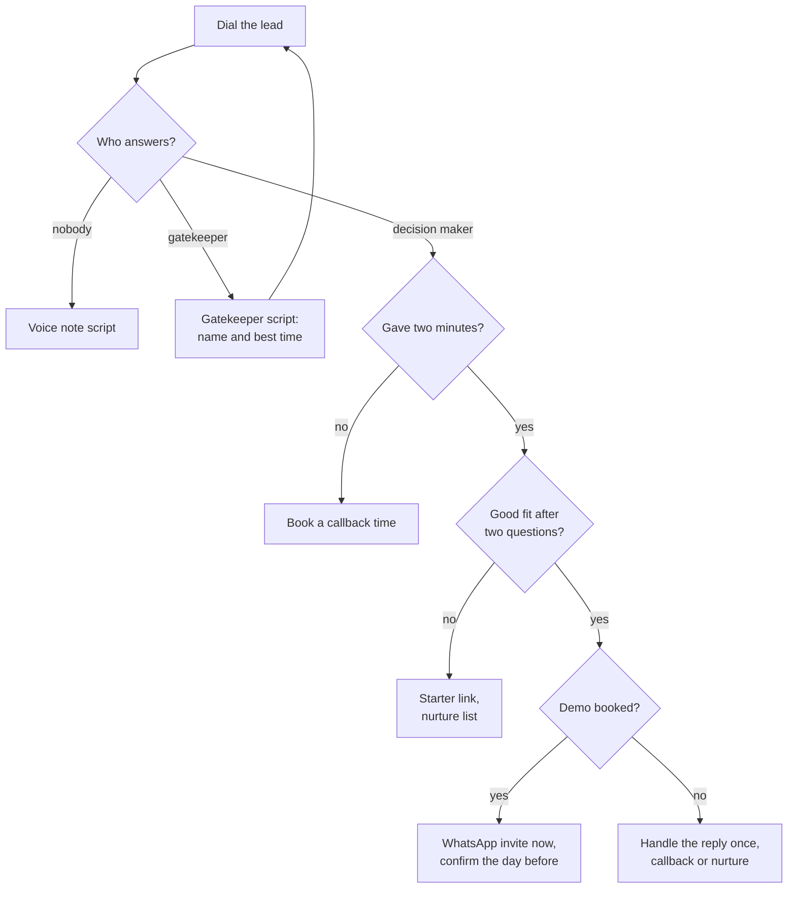

# Cold Call Scripts

**In simple words:** This chapter gives you word-for-word phone scripts for selling EduFlow, in English and Hinglish, for nine situations. Each script shows what to say, how to answer the six most common replies, and the exact next step.

## How to Use These Scripts

- A cold call is a call to someone who does not know you yet. Its only goal is a booked 25-minute demo, not a sale.
- Practise each script aloud ten times, then say it in your own words.
- Match the prospect's language. "Hello, good morning" means English; "Haan ji, boliye" means Hinglish.
- **EN** marks the English line, **HI** the Hinglish line (Hindi in Latin script). Fill placeholders such as `{{owner_name}}` and `{{slot_1}}` from your lead sheet before you dial.
- Objection answers are in *Objection Handling and Closing*, follow-up texts in *WhatsApp and Email Templates*, lead lists in *Sales Foundation and Lead Generation*.

> **Rule:** Dial one person at a time, yourself, only on numbers the institute made public (Google Maps, Justdial, website, signboard). No auto-dialers or robo-calls: TRAI rules punish bulk unsolicited calling. If someone says "don't call again", mark `DNC` and stop.

> **Founder note:** Before the January 2027 launch, you sell early access: "I am choosing a few institutes in {{city}} for early access, and I set them up personally."

## The Call Structure

Every script uses the same seven steps and takes about three minutes. Never speak for more than 30 seconds without asking a question.

| Step | Time | Your goal |
|---|---|---|
| Opener | 0:00–0:10 | Right person; say who you are |
| Permission | 0:10–0:20 | A yes for two minutes |
| Hook | 0:20–0:40 | Name one pain in one sentence |
| Two qualifying questions | 0:40–1:40 | Size and today's method |
| Value | 1:40–2:10 | Link one or two features to their answers |
| Demo ask | 2:10–2:30 | 25 minutes, two time options |
| Close and next step | 2:30–3:00 | Confirm; send the WhatsApp invite during the call |

A hook names a pain (a problem that costs time, money or peace of mind). Two time options beat "When are you free?", because choosing is easier than thinking.

**Figure: Cold call decision tree**



A call with no dated next step is not finished. Before dialling, note one real detail per lead, such as a new batch or branch.

## Qualification Question Bank

A qualifying question tells you whether a lead can pay soon. On a cold call ask only two; keep the rest for the discovery part of the *Demo Script*.

| Topic | EN | HI | Good sign |
|---|---|---|---|
| Students | "Roughly how many students this session?" | "Is session mein lagbhag kitne students hain?" | 100–1,500; under 50 is Starter |
| Campuses | "One centre, or branches too?" | "Ek hi centre hai ya branches bhi?" | 2–3 fit Pro |
| Current tools | "Records today: register, Excel or software?" | "Record kaise rakhte hain: register, Excel ya software?" | Registers or Excel |
| Fee collection | "How do parents pay, and how do they get receipts?" | "Parents fees kaise dete hain, receipt kaise milti hai?" | UPI, handwritten receipts |
| Fee follow-up | "When fees are late, how do you remind parents?" | "Fees late ho toh parents ko kaise yaad dilaate hain?" | Staff make reminder calls |
| Who decides | "Apart from you, who decides on software?" | "Aapke alawa yeh decision kaun leta hai?" | Decider joins the demo |
| Timing | "If it fits, start now or with the new session?" | "Pasand aaye toh abhi ya naye session se?" | Before April 2027 |
| Budget | "Any monthly spend on software or SMS now?" | "Abhi software ya SMS pe mahine ka kharcha hai?" | ₹1,000+ a month |

Sort each conversation. **Hot** (100+ students, pain named, decider on the call): demo within 3 days. **Warm** (good fit, decider absent or later start): demo with the decider or a dated callback. **Cold** (under 50 students or happy today): Starter link or nurture list.

## Script: Coaching Institute Owner

**Goal:** a 25-minute demo with the owner. **Best time:** 11:00–13:00, between batches. **Exact next step:** slot on your calendar and WhatsApp invite sent before you hang up.

**Opener options**

1. Direct.
   - EN: "Good morning, am I speaking with {{owner_name}} sir? This is Mehdi, founder of EduFlow."
   - HI: "Namaste sir, kya meri baat {{owner_name}} ji se ho rahi hai? Main Mehdi, EduFlow ka founder."
2. Local detail.
   - EN: "Good morning sir, I saw your new NEET batch advertisement. Congratulations. Mehdi from EduFlow."
   - HI: "Namaste sir, aapke naye NEET batch ka ad dekha, badhai ho. Main Mehdi, EduFlow se."

**Dialogue**

- **Permission.** EN: "Did I catch you at a bad time, or can I take two minutes?"
  - HI: "Abhi do minute baat ho sakti hai, ya baad mein call karoon?"
- **Hook.** EN: "I call coaching owners in {{city}} about one problem: fee follow-up. EduFlow sends reminders and receipts on WhatsApp by itself."
  - HI: "Sir, main {{city}} ke coaching owners se ek hi problem pe baat karta hoon: fees ka follow-up. EduFlow reminder aur receipt WhatsApp pe apne aap bhejta hai."
- **Questions.** EN: "How many students this session, one centre? And when fees are late, how do you remind parents?"
  - HI: "Is session mein kitne students hain, ek hi centre? Aur fees late ho toh parents ko kaise yaad dilaate hain?"
  - Owner: "About 350, one centre. My staff calls them from an Excel."
- **Value.** EN: "Then it fits. All 350 parents get a WhatsApp reminder on the due date, pay by UPI, and get the receipt in seconds. You see the day's collection on your phone."
  - HI: "Toh sir, sahi fit hai. Sabhi 350 parents ko due date pe WhatsApp reminder, UPI se payment, receipt turant. Aaj ka collection aapke phone pe."
- **Demo ask.** EN: "Let me show you in 25 minutes, with your own batch names. {{slot_1}} or {{slot_2}}?"
  - HI: "25 minute ka demo, aapke hi batch names ke saath? {{slot_1}} ya {{slot_2}}?"
- **Close.** EN: "Done. Confirmation on WhatsApp now; bring your accountant if you can."
  - HI: "Done sir, {{slot_1}} fix. Confirmation abhi WhatsApp pe; accountant saath ho toh aur accha."

**Likely replies**

| Reply | EN | HI |
|---|---|---|
| Interested | "Best is to see it. {{slot_1}} or {{slot_2}}, 25 minutes?" | "Dekh lena sabse accha. {{slot_1}} ya {{slot_2}}, 25 minute?" |
| Busy, in a class | "Sorry sir. 3 today, or 11:30 tomorrow?" | "Maaf kijiye sir. Aaj 3 baje ya kal 11:30?" |
| Not interested | "Understood. Is the current system working, or is it just not the right time?" | "Samajh gaya. System theek chal raha hai, ya abhi time sahi nahi?" |
| Already using software | "Good. Which one, and what would you change in it?" | "Accha hai. Kaunsa, aur usmein kya badalna chahenge?" |
| Send details | "Sending now. I'll call Thursday to check." | "Abhi bhejta hoon. Guruvaar ko call karunga." |
| Price first | "Free up to 50 students. ₹2,499 a month up to 300; ₹5,999 up to 1,000 and 3 branches. GST extra." | "50 tak free. 300 tak ₹2,499 mahina; 1,000 aur 3 branch tak ₹5,999. GST alag." |

After the price, add "Yearly, two months are free" and repeat the demo ask. After "already using", switch to the competitor script.

## Script: School Principal or Owner

**Goal:** a demo with the principal and the person who signs (owner, director or trust member). **Best time:** 14:00–15:30, after dismissal. **Exact next step:** demo slot with both people named in the invite.

**Opener options**

1. Direct.
   - EN: "Good afternoon, ma'am. Am I speaking with {{owner_name}}, principal of {{institute_name}}? This is Mehdi, founder of EduFlow."
   - HI: "Namaste ma'am. Kya meri baat {{institute_name}} ki principal {{owner_name}} ji se ho rahi hai? Main Mehdi, EduFlow ka founder."
2. Season hook.
   - EN: "Good afternoon, sir. Admissions for the new session start soon, so I will be quick."
   - HI: "Namaste sir. Naye session ke admissions shuru hone wale hain, isliye jaldi baat karunga."

**Dialogue**

- **Permission and hook.** EN: "Is this a bad time? (Wait for the yes.) I help private schools in {{city}} send absent alerts and fee dues to parents on WhatsApp, automatically."
  - HI: "Abhi do minute mil sakte hain? (Haan ke baad.) Ma'am, main {{city}} ke private schools ko absent alert aur fees ke dues parents ko WhatsApp pe apne aap bhejne mein madad karta hoon."
- **Questions.** EN: "How many students and campuses? When a child is absent, how do parents come to know today?"
  - HI: "Kitne students aur kitne campus hain? Bachcha absent ho toh parents ko abhi kaise pata chalta hai?"
  - Principal: "About 1,200, two campuses. Mostly parents don't know."
- **Value.** EN: "Teachers mark attendance on the phone in a minute. Parents of absent children get a WhatsApp before the second period. You see both campuses and fee dues on one screen."
  - HI: "Teacher phone pe ek minute mein attendance lagati hain. Absent bachchon ke parents ko doosre period se pehle WhatsApp. Dono campus aur fees ke dues ek hi screen pe."
- **Who decides and demo ask.** EN: "Who else decides, the director or the trust? Can we do 25 minutes together, {{slot_1}} or {{slot_2}}?"
  - HI: "Decision mein aur kaun hoga, director sir ya trust? Saath mein 25 minute, {{slot_1}} ya {{slot_2}}?"
- **Close.** EN: "Thank you. Invite on WhatsApp now, with the director's name."
  - HI: "Dhanyavaad ma'am. Invite abhi WhatsApp pe, director sir ke naam ke saath."

**Likely replies**

| Reply | EN | HI |
|---|---|---|
| Interested | "Let's include your fee person too. {{slot_1}} or {{slot_2}}?" | "Fees wale ko bhi saath rakhein. {{slot_1}} ya {{slot_2}}?" |
| Busy, in a meeting | "Of course. Tomorrow after dismissal, around 2:30?" | "Bilkul ma'am. Kal chhutti ke baad, 2:30 baje?" |
| Not interested, "we have systems" | "Glad to hear it. What still takes the most staff time?" | "Acchi baat hai. Staff ka sabse zyada time abhi bhi kahan jaata hai?" |
| Already using software | "Which one? Do parents get absent alerts and receipts on WhatsApp?" | "Kaunsa? Parents ko absent alert aur receipt WhatsApp pe milti hai?" |
| Send details | "Sending now, to you and the director. I'll call Friday for a time." | "Abhi bhejta hoon, aapke aur director sir ke naam. Shukravaar ko call karunga." |
| Price first | "Up to 1,000 students and 3 campuses: ₹5,999 a month, ₹59,990 yearly. GST extra." | "1,000 students, 3 campus tak ₹5,999 mahina, saal ka ₹59,990. GST alag." |

Above 1,000 students or three campuses is Enterprise (from ₹14,999 a month): "I will quote after the demo." Asked about report cards, say "Planned for February 2027, before your April session." Never promise a date outside the release plan.

## Script: Accountant or Office Admin

**Goal:** the decision maker's name, number and best time. **Best time:** 11:00–13:00, never on days 1–10 of the month (fee rush). **Exact next step:** call the decider at that time and mention the accountant by name.

**Opener options**

1. Ask for help.
   - EN: "Good morning, sir. Mehdi from EduFlow. A small help: who decides on fee software, the director or the principal?"
   - HI: "Namaste sir, main Mehdi, EduFlow se. Ek chhoti madad: fees software ka decision kaun leta hai, director sir ya principal ma'am?"
2. Start with their work.
   - EN: "Good morning. Do you run the fee counter?"
   - HI: "Namaste ji. Fee counter aap sambhaalte hain?"

**Dialogue**

- Accountant: "Director sir. What is it about?"
- **Hook.** EN: "Fee receipts, dues and day close. One question: how long does day close take you?"
  - HI: "Fee receipt, dues aur day close. Ek sawal: din ka hisaab milane mein kitna time lagta hai?"
  - Accountant: "One hour, sometimes more."
- **Value and ask.** EN: "In EduFlow every receipt, cash or UPI, is in one list; day close takes minutes. What is the director's name, and when is he free?"
  - HI: "EduFlow mein har receipt ek list mein, day close minuton ka kaam. Director sir ka naam kya hai, aur woh kab free hote hain?"
- **Close.** EN: "Thank you, {{accountant_name}} ji. I'll call him at {{time}}. May I say we spoke?"
  - HI: "Shukriya {{accountant_name}} ji. {{time}} baje unhe call karunga. Bata doon ki aapse baat hui?"

**Likely replies**

| Reply | EN | HI |
|---|---|---|
| Interested | "Please tell sir I'll call at {{time}}. Shall I send a one-page note?" | "Sir ko bata dijiye {{time}} baje call karunga. Ek page ka note bhej doon?" |
| Busy | "Just one thing: the best time to reach the director?" | "Bas ek baat: director sir se baat ka sahi time?" |
| Not interested, "sir won't want it" | "Understood. Only two minutes of his time. When is he least busy?" | "Samajh gaya. Bas do minute. Woh kab thode free hote hain?" |
| Already using software | "Which one? What is hardest with it at the counter?" | "Kaunsa? Counter pe usmein sabse mushkil kya hai?" |
| Send details | "Of course. In the director's name? What is his name?" | "Zaroor. Director sir ke naam se? Unka naam?" |
| Price first | "From ₹2,499 a month for 300 students. When can I reach the director?" | "300 students tak ₹2,499 mahina se. Director sir se kab baat ho?" |

## Script: Reception Gatekeeper

**Goal:** the decision maker's name and best time, or a transfer, in under 60 seconds. **Best time:** 10:00–12:00. **Exact next step:** log `GK` with the name and time, then call back at exactly that time.

Ask the receptionist's name first; people help those who treat them as people. Never lie ("Sir knows me"): one lie, and the desk blocks you forever.

**Opener options**

1. Name first.
   - EN: "Good morning, this is Mehdi. May I know your name? Thank you, {{receptionist_name}} ji. Could you tell me your director's name?"
   - HI: "Namaste ji, main Mehdi. Aapka naam jaan sakta hoon? Shukriya {{receptionist_name}} ji. Director sahab ka naam bata denge?"
2. Role first.
   - EN: "Good morning. Who looks after fees and admissions software there?"
   - HI: "Namaste ji. Wahan fees aur admission ka software kaun dekhta hai?"

**Dialogue**

- Reception: "What is it regarding?"
- EN: "Software for fees and attendance. I need two minutes with sir to see if it is useful. When is the best time?"
  - HI: "Fees aur attendance ke software ke baare mein. Sir se bas do minute, dekhne ke liye ki kaam ka hai ya nahi. Sahi time kya rahega?"
- **Close.** EN: "Thank you. I'll call at {{time}} and ask for {{owner_name}} sir."
  - HI: "Shukriya ji. {{time}} baje call karke {{owner_name}} sir ko poochh loonga."

**Likely replies**

| Reply | EN | HI |
|---|---|---|
| Interested, offers to transfer | "Thank you so much." Then the owner opener. | "Bahut shukriya ji." Phir owner opener. |
| Busy, "sir is in a meeting" | "No problem. After 4 today, or tomorrow morning?" | "Koi baat nahi. Aaj 4 ke baad, ya kal subah?" |
| Not interested, "we don't need anything" | "I understand. Please note my name for sir: Mehdi, EduFlow, {{my_number}}." | "Samajh gaya. Sir ke liye naam likh lenge? Mehdi, EduFlow, {{my_number}}." |
| Already using software | "Good. Sir can compare in two minutes. When is he free?" | "Accha hai. Sir do minute mein compare kar lenge. Kab free hain?" |
| Send details | "Sure. Which number, and in whose name?" | "Zaroor. Kis number pe, kiske naam se?" |
| Price first | "It depends on students; free up to 50. Sir can decide quickly." | "Students pe depend karta hai; 50 tak free. Sir jaldi decide kar lenge." |

After two blocked calls, try another public number or send the voice note.

## Script: Referral-Based Warm Call

**Goal:** a demo within three days. **Best time:** the day the referrer introduces you. **Exact next step:** demo booked, and a thank-you WhatsApp to the referrer the same day.

A warm call follows an introduction from someone the prospect trusts. Use the referrer's name only with his permission, ideally after his WhatsApp introduction. Never share his price or data.

**Opener options**

1. Name the referrer.
   - EN: "Good morning, {{owner_name}} ji. {{referrer_name}} ji of {{referrer_institute}} asked me to call you. I'm Mehdi, founder of EduFlow."
   - HI: "Namaste {{owner_name}} ji. {{referrer_institute}} ke {{referrer_name}} ji ne kaha tha aapse baat karun. Main Mehdi, EduFlow ka founder."
2. After his WhatsApp intro.
   - EN: "Good morning, sir. {{referrer_name}} ji sent you my name yesterday."
   - HI: "Namaste sir. Kal {{referrer_name}} ji ne aapko mera naam bheja tha."

**Dialogue**

- **Hook.** EN: "He uses EduFlow for fees and attendance. {{referrer_result}}. He felt it could help you too."
  - HI: "Woh EduFlow fees aur attendance ke liye use karte hain. {{referrer_result}}. Unhe laga aapke bhi kaam aayega."
  - Example result: "Parents get receipts on WhatsApp; reminder calls have almost stopped." Use only a result he confirmed.
- **Questions.** EN: "How many students do you have? And why did he think of you: fees or attendance?"
  - HI: "Aapke yahan kitne students hain? Aur unhe aapka khayal kyun aaya, fees ya attendance?"
- **Demo ask.** EN: "Since he has seen it, 25 minutes is enough. {{slot_1}} or {{slot_2}}?"
  - HI: "Unhone dekha hua hai, toh 25 minute kaafi hain. {{slot_1}} ya {{slot_2}}?"

**Likely replies**

| Reply | EN | HI |
|---|---|---|
| Interested | "Great. I'll set it up with your batch names. {{slot_1}}?" | "Badiya. Aapke batch names ke saath taiyaar rakhunga. {{slot_1}}?" |
| Busy | "Of course. After 2 today, or 11 tomorrow?" | "Bilkul. Aaj 2 ke baad, ya kal 11 baje?" |
| Not interested, "I'll ask him first" | "Please do. Shall I call you Friday, after you talk?" | "Zaroor poochhiye. Shukravaar ko call karoon?" |
| Already using software | "Then compare honestly. Which one do you use?" | "Toh imaandari se compare kijiye. Kaunsa use karte hain?" |
| Send details | "Sending now, with {{referrer_name}} ji's name in it." | "Abhi bhejta hoon, {{referrer_name}} ji ka naam likh ke." |
| Price first, "what does he pay?" | "I never share a client's price. Public plans: free, ₹2,499 or ₹5,999 a month." | "Client ka price share nahi karta. Plans: free, ₹2,499 ya ₹5,999 mahina." |

## Script: Re-Engaging an Old Lead

**Goal:** a fresh demo date, or a clear "no" that closes the file. **Best time:** the month the lead named, or 30–45 days after the last contact. **Exact next step:** demo booked, a new callback date, or stage `Lost` with the reason.

Never call "just to follow up". Bring a new reason: a new feature, the season, or a result from a similar institute.

**Opener options**

1. Remember them.
   - EN: "Good morning, {{owner_name}} ji. Mehdi from EduFlow. We spoke in {{last_month}}; you said to call after {{their_reason}}."
   - HI: "Namaste {{owner_name}} ji, Mehdi, EduFlow se. {{last_month}} mein baat hui thi; aapne kaha tha {{their_reason}} ke baad call karun."
2. Something new, for example "parents can now pay by UPI from the Parent Portal".
   - EN: "Good morning, sir. Something new since we spoke: {{new_thing}}. I thought of you first."
   - HI: "Namaste sir. Pichhli baat ke baad kuch naya aaya hai: {{new_thing}}. Sabse pehle aapka khayal aaya."

**Dialogue**

- **Check.** EN: "Two minutes? Has anything changed on your side?"
  - HI: "Do minute milenge? Aapki taraf kuch badla hai?"
  - Owner: "Admissions are over. Now fees are pending."
- **Value and demo ask.** EN: "Then this is the right time. Enter pending fees once, and reminders go on WhatsApp by themselves. {{slot_1}} or {{slot_2}}?"
  - HI: "Toh yahi sahi time hai. Pending fees ek baar daaliye, reminders WhatsApp pe apne aap jaayenge. {{slot_1}} ya {{slot_2}}?"
- **Breakup line** (a polite last try that lets them close the file). EN: "Sir, I don't want to disturb you. Shall I close your file, or call in {{month}}?"
  - HI: "Sir, pareshaan nahi karna chahta. File band kar doon, ya {{month}} mein call karoon?"

**Likely replies**

| Reply | EN | HI |
|---|---|---|
| Interested | "Great. WhatsApp me three batch names; I'll set them up." | "Badiya. Teen batch ke naam WhatsApp kar dijiye." |
| Busy | "Which week is calmer? I'll put that date in my calendar." | "Kaunsa hafta free hai? Wahi date likh leta hoon." |
| Not interested | "Thanks for being clear. May I ask why, so I improve?" | "Saaf batane ka shukriya. Wajah bata denge?" |
| Already using software now | "Good that you decided. May I check in after the session?" | "Accha kiya. Session ke baad haal poochh loon?" |
| Send details | "Sending a one-minute fee reminder video. I'll call {{day}}." | "Ek minute ka video bhejta hoon. {{day}} ko call karunga." |
| Price first | "Same as before: ₹2,499 a month up to 300 students, ₹24,990 yearly." | "Pehle jaisa: 300 tak ₹2,499 mahina, saal ka ₹24,990." |

> **Rule:** Two re-engagement calls at most; after that, season greetings only.

## Script: Competitor or Excel User

**Goal:** a side-by-side comparison demo, timed for a switch at the new session. **Best time:** January to March, before the April 2027 session, or right after a fee cycle closes. **Exact next step:** comparison demo booked; Excel users bring their student sheet for import.

Use it for users of Teachmint, Classplus, Fedena, a local vendor or Excel. Never criticise the current tool: the owner chose it. Ask what works and what still hurts, and compare only that. Never state a competitor's price or feature from memory.

**Opener options**

1. Respect first.
   - EN: "Good morning, sir. Mehdi from EduFlow. I believe you use {{current_tool}}. It's a known product, so I'll be brief. One question?"
   - HI: "Namaste sir, Mehdi, EduFlow se. Suna hai aap {{current_tool}} use karte hain. Jaana-maana product hai, chhoti baat karunga. Ek sawal?"
2. Excel user.
   - EN: "Sir, many institutes run well on Excel. I only want to ask how reminders and receipts work around it."
   - HI: "Sir, bahut institutes Excel pe accha chalate hain. Bas poochhna tha ki reminders aur receipts kaise hote hain."

**Dialogue**

- **Questions.** EN: "What do you like most in it? And what one thing would you change?"
  - HI: "Usmein sabse accha kya lagta hai? Aur ek cheez badal sakte toh kya badalte?"
  - Owner: "Parents don't open the app. We still call them for fees."
- **Value.** EN: "That is our focus. EduFlow sends reminders and receipts on WhatsApp, which every parent opens. Parents need no new app."
  - HI: "Hamara focus yahi hai. EduFlow reminders aur receipts WhatsApp pe bhejta hai, jo har parent kholta hai. Naya app nahi chahiye."
- **Switch plan and demo ask.** EN: "Switch at the new session, not mid-year; your list imports from Excel. Compare for 25 minutes: {{slot_1}} or {{slot_2}}?"
  - HI: "Switch naye session se kariye; list Excel se import hoti hai. 25 minute compare: {{slot_1}} ya {{slot_2}}?"

**Likely replies**

| Reply | EN | HI |
|---|---|---|
| Interested | "Keep one real fee report ready. I'll build the same in EduFlow." | "Ek asli fee report rakhiye. Wahi EduFlow mein banaunga." |
| Busy | "Of course. Tuesday next week, before session planning?" | "Bilkul. Agle hafte Tuesday, planning se pehle?" |
| Not interested, "happy with it" | "Then stay with it. May I call in February, at session planning?" | "Toh wahi rakhiye. February mein call karoon?" |
| Already paid for the year | "Fair. When does it renew? I'll call a month before." | "Theek hai. Renewal kab hai? Ek mahina pehle call karunga." |
| Send details | "Sending a one-page feature checklist. Tick what your tool does today." | "Ek page ki checklist bhejta hoon. Jo aapka tool karta hai, tick kijiye." |
| Price first | "Growth is ₹2,499 a month up to 300 students, GST extra." | "Growth 300 tak ₹2,499 mahina, GST alag." |

Log the renewal date: it is your best callback date.

## Script: Voice Note After No Answer

**Goal:** a callback or a WhatsApp reply. **When:** within 10 minutes of the missed call, once per lead. **Exact next step:** no reply in 2 days means one more call at a different hour, then the 21-day cadence in *Sales Foundation and Lead Generation*.

Few owners check voicemail, but most play a WhatsApp voice note. Send it from your WhatsApp Business number, under 25 seconds.

```text
EN (about 20 seconds)
"Good morning {{owner_name}} sir, this is Mehdi, founder of EduFlow,
here in {{city}}. I just called you. EduFlow sends fee reminders and
receipts to parents on WhatsApp by itself. I'd like to show you in
25 minutes. Please reply with a good time. If it is not useful, just
reply 'no' and I won't message again. Thank you. Mehdi, EduFlow."

HI (about 20 seconds)
"Namaste {{owner_name}} sir, main Mehdi, EduFlow ka founder, {{city}}
se. Abhi aapko call kiya tha. EduFlow parents ko fee reminder aur
receipt WhatsApp pe apne aap bhejta hai. 25 minute mein dikhana
chahta hoon. Sahi time reply kar dijiye. Kaam ka na lage toh bas
'no' likh dijiye, dobara message nahi karunga. Dhanyavaad. Mehdi."
```

For a real voicemail box, say only: "Mehdi from EduFlow, {{my_number}}. I will try again tomorrow at {{time}}."

**Likely replies**

| Reply | EN | HI |
|---|---|---|
| Interested, "call me" | Call within 5 minutes; start the owner script at the hook. | Same action. |
| Busy, "call later" | "Sure sir, {{time}} it is. Thanks for replying." | "Zaroor sir, {{time}} baje. Reply ka shukriya." |
| Not interested, "no" | "Thank you sir, noted." Mark `DNC`. | "Shukriya sir, note kar liya." |
| Already using software | "Thanks. Which one? Happy to compare in 25 minutes." | "Shukriya. Kaunsa? 25 minute mein compare kar lein?" |
| Send details | Send the one-page PDF and a 60-second video; call in 2 days. | Same action. |
| Price first | Send the three prices in one message, then ask for a slot. | Same action. |

## Script: Demo Confirmation Call the Day Before

**Goal:** the demo happens, with the decision maker, and you arrive with their batch names. **When:** 24 hours before, near the demo hour. **Exact next step:** WhatsApp with time, Google Meet link or address, and a three-line agenda; the 1-hour reminder is in *WhatsApp and Email Templates*.

A no-show (a prospect who skips the demo) wastes your best hour; this call prevents most of them.

**Dialogue**

- **Confirm.** EN: "Good afternoon, {{owner_name}} ji. Mehdi from EduFlow, confirming our demo tomorrow at {{slot}}. Still good?"
  - HI: "Namaste {{owner_name}} ji, Mehdi, EduFlow se. Kal {{slot}} baje ka demo confirm karna tha. Theek hai na?"
- **People and data.** EN: "Will {{decider_name}} and your accountant join? Please WhatsApp three batch names and your fee heads."
  - HI: "{{decider_name}} ji aur accountant bhi honge? Teen batch ke naam aur fee heads WhatsApp kar dijiye."
- **Format and close.** EN: "Google Meet, or shall I come to your office? The agenda is on WhatsApp now. See you tomorrow."
  - HI: "Google Meet pe, ya main office aa jaaun? Agenda abhi WhatsApp pe. Kal milte hain."

> **Warning:** Ask only for batch names and fee heads. No student or parent data before signup and terms acceptance; the DPDP Act 2023 protects children's data.

**Likely replies**

| Reply | EN | HI |
|---|---|---|
| Confirmed | "Thank you. Please keep those 25 minutes free of calls." | "Shukriya. Woh 25 minute calls se free rakhiye." |
| Busy, must move | "No problem. {{slot_3}} or {{slot_4}}, this week?" | "Koi baat nahi. Isi hafte {{slot_3}} ya {{slot_4}}?" |
| Not interested any more | "Thanks for telling me. What changed?" Then offer 10 minutes. | "Batane ka shukriya. Kya badla?" Phir 10 minute offer. |
| Chose other software | "Congratulations. Compare for 25 minutes before you pay?" | "Badhai ho. Pay se pehle 25 minute compare kar lein?" |
| Send details | "Sending now. The demo shows your own batches. Keep the slot?" | "Abhi bhejta hoon. Demo mein aapke batches dikhenge. Slot rakhein?" |
| Price first | "Growth ₹2,499, Pro ₹5,999 a month; yearly, two months free." | "Growth ₹2,499, Pro ₹5,999 mahina; saal ka lein toh do mahine free." |

If a prospect moves the demo twice, ask: "Is this still a priority, or should we pick a date after {{event}}?"

## Best Calling Hours by Segment

| Segment | Best hours | Avoid | Why |
|---|---|---|---|
| Coaching owner | 11:00–13:00, 14:00–15:30 | 07:00–10:00, 16:00–20:00 | Batches run morning and evening |
| School principal | 14:00–15:30 | 07:30–13:30, exam weeks | Teaching day and invigilation |
| School owner or trust | 11:00–13:00, 17:00–18:30 | Monday mornings | Often runs other businesses |
| Accountant or office | 11:00–13:00 | Days 1–10 of the month | Fee rush at the counter |
| Reception | 10:00–12:00 | First hour after opening | Parents crowd the desk |

Tuesday to Thursday connect best. Never call on Sundays, festivals or result days, or before 09:30 or after 19:00. Buying seasons: January to March for schools, March to July for coaching. Estimate, based on typical Indian timetables; after 200 dials, check your own connect rate by hour.

## Call Tracking Sheet

Log every dial as one row in a `Calls` tab beside your lead sheet (see *Sales Foundation and Lead Generation*).

| Column | Example | Rule |
|---|---|---|
| A Date and time | 12 Oct 2026 11:40 | Format as date time |
| B Lead ID | L-0142 | Same ID as the lead sheet |
| C Contact | Rajesh Sharma, owner | Name and role |
| D Script | Coaching owner | One of the nine scripts |
| E Outcome | DB | One code from the list below |
| F Temperature | Hot | Hot, Warm or Cold |
| G Next step and date | Demo 15 Oct 12:00 | Never empty |
| H Notes | 350 students, Excel, staff call parents | Pain in their words |

Outcome codes: `NA` no answer or wrong number, `VN` voice note sent, `GK` gatekeeper gave name and time, `CB` callback booked, `WA` details sent on WhatsApp, `DB` demo booked, `NI` not interested, `DNC` do not call.

Scoreboard on a `Today` tab:

```text
Cell  Label          Formula
B1    Dials today    =COUNTIFS(Calls!A:A,">="&TODAY())
B2    No answer      =COUNTIFS(Calls!A:A,">="&TODAY(),Calls!E:E,"NA")
B3    Voice notes    =COUNTIFS(Calls!A:A,">="&TODAY(),Calls!E:E,"VN")
B4    Demos booked   =COUNTIFS(Calls!A:A,">="&TODAY(),Calls!E:E,"DB")
B5    Connect rate   =(B1-B2-B3)/B1
B6    Demo rate      =B4/(B1-B2-B3)
```

Connect rate is the share of dials that reached a person; demo rate is the share of those that booked a demo.

## Do and Don't

| Do | Don't |
|---|---|
| Say your name and "founder" in the first 10 seconds | Pretend to be a parent, an official or "sir's friend" |
| Use "ji", "sir", "ma'am" and "aap" | Use "tum", "bhai" or "boss" |
| Quote public prices exactly, GST extra | Invent discounts on the phone |
| Speak well of every competitor | Criticise the tool the owner chose |
| Promise only what is live or in the release plan | Give feature dates you cannot keep |

**Tone tips**

- Stand and smile while you talk; both are audible.
- Speak a little slower than normal. Say the demo ask as a plan, then stay silent for three seconds.
- Sound like a founder, not a call centre.
- Take "no" warmly: "Thank you, sir. All the best for the session."

## Ten Common Mistakes

1. **Selling on the phone.** Sell only the demo.
2. **A long opener.** Get permission within 20 seconds.
3. **Asking "Is this a good time?"** It invites "no". Ask "Is this a bad time?"
4. **No dated next step.** Column G is never empty.
5. **Skipping "who decides".** You then demo to someone who cannot sign.
6. **Arguing with an objection.** Ask a question; answers are in *Objection Handling and Closing*.
7. **Discounting on the first call.** Quote public prices; discuss discounts only after the demo.
8. **Calling at the wrong hour.** An owner in the middle of a class hears nothing.
9. **"Details on WhatsApp" with no follow-up date.** The message dies unread.
10. **Not logging calls.** Callbacks get forgotten, and a `DNC` number gets called again.

## Key takeaways

- Every call follows seven steps in about three minutes. The only goal is a booked 25-minute demo.
- Match the prospect's language, and prepare the six replies that repeat everywhere.
- Respect gatekeepers and competitors: ask names, never lie, never criticise the owner's tool.
- Call each segment at its calm hour, and confirm every demo the day before.
- Log every dial with an outcome code and a dated next step; review connect and demo rates daily.
