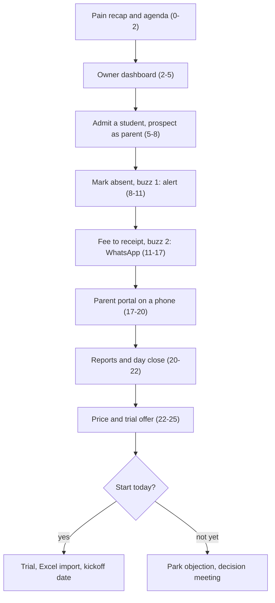

# Demo Script

**In simple words:** This chapter is the word-for-word script for a 25-minute EduFlow demo that ends with a trial account, not with "we will think about it". It covers what to know before the demo, how to prepare the demo institutes with P-58, the script minute by minute in English and Hinglish, four buyer variants, and the close and follow-up. The centre of the demo is one moment: a fee receipt lands on the prospect's own WhatsApp while they watch.

## How the Demo Works

A demo (a live showing of the product to a buyer) follows three rules.

- **One storyline.** One new student goes through one day: admitted, marked absent, billed, paid, seen by the parent, counted in the day close. Every screen belongs to the same story.
- **Two buzzes.** The prospect's own phone gets an absent alert and a fee receipt on WhatsApp. The receipt is the wow moment (where the buyer feels the product instead of just seeing it).
- **25 minutes, then the close.** The trial, the Excel import and the next meeting take up to 20 more minutes. Block 45 minutes. Tell the prospect: "25 minutes, and 15 more if you want to start today."

Amounts in the script come from the demo data. If your screen differs, say the number on the screen.

**Figure: The demo storyline**



Numbers in brackets are minutes. The first eight boxes are the demo, the last three are the close. Both buzzes sit in the middle, where attention is highest.

## Before the Demo

### Discovery answers you need

Discovery means the questions you ask before you show anything. Their wording is in *Cold Call Scripts*. Before the demo, the lead sheet must hold these answers. Ask any missing one on the confirmation call the day before.

| Answer you need | Example: Sharma Classes | Where you use it |
|---|---|---|
| Type of institute and courses | Coaching, JEE and NEET, 8 batches | Pick the demo tenant; rename two batches to theirs |
| Active students and branches | 350, one centre | Plan and price at minute 22 |
| How fees are paid and receipted | UPI to the owner's phone, handwritten receipt book | Fee segment and the receipt wow |
| Main pain, in their own words | "Staff spend two hours a day calling parents for fees" | The first sentence of the demo |
| Current tool | Excel plus registers | Excel import at the close |
| Who attends, who decides | Rajesh Sharma decides; Suresh Gupta, accountant, joins | Who gets the mouse; persona variant |
| Start date | Before the April 2027 session | Urgency in the price step |
| Device at the fee counter | Laptop with internet | Trial readiness |
| WhatsApp number for the demo, with a yes | Owner's number; "Hi" already sent to EduFlow | Both buzzes |

> **Rule:** No decider and no named pain means no demo. Move the slot and ask the owner to join (the BANT-R gate in *Sales Process and Playbooks*).

### Set up the demo organization with P-58

P-58 (in *Prompts: Quality, Security and DevOps*) builds two fake institutes on production with a one-command reset: `demo-sharma-classes` (coaching) and `demo-bright-future` (school). They hold only canon sample people and fake students.

1. **Before you run P-58 on Day 58,** save the record list below as `docs/demo-script-records.md`. P-58 reads it.
2. **Put the demo school on Enterprise, not Pro.** Its 1,200 active students exceed the Pro limit of 1,000, so the live admission at minute 5 would fail with `PLAN_LIMIT_REACHED`.
3. **Every demo morning, run the reset.** In GitHub Actions, open the demo reset workflow, click Run workflow and pick production. It takes under 5 minutes and moves all dates to today.
4. **Tailor it in 5 minutes.** Rename two batches and one course to the prospect's names, for example "NEET 2028 Dropper Batch". Never rename the organization: the reset keeps organization rows, so the name would survive.
5. **After the last demo of the day, reset again.** It deletes the student you admitted with the prospect's number.

**Script: docs/demo-script-records.md (the records this demo shows)**

```markdown
# Demo script records (read by P-58)

## demo-sharma-classes (COACHING, Patna, Pro plan)
- Logins: Rajesh Sharma (ORG_ADMIN), Priya Nair (TEACHER),
  Suresh Gupta (ACCOUNTANT), Sunita Devi (PARENT)
- Course "JEE Main 2028"; Morning Batch M1 with about 40 students
- Fee structure "JEE Main 2028": Course fee 85000 in 3 instalments
  (35000, 25000, 25000); Study material 5000 with instalment 1
- Aarav Sharma in Morning Batch M1; guardian Sunita Devi with
  WhatsApp consent on DEMO_PARENT_PHONE; instalment 1 paid;
  instalment 2 invoice of 25000 unpaid, due in 5 days
- Dashboard today: collections in cash and UPI; about 46 students
  with dues of about 4.2 lakh; attendance per batch
- Today: attendance of Morning Batch M1 NOT yet marked
- Today: day NOT closed; the last 30 working days closed
- Admission number sequence ready (next number shown on save)
- WhatsApp credit wallet with balance for at least 50 messages
- Razorpay in TEST mode only

## demo-bright-future (SCHOOL, Lucknow, Enterprise plan, 2 campuses)
- Same logins; Dr. Anita Verma (PRINCIPAL) assigned to campus 1 only
- Section 10-A with Aarav Sharma, admission no. BF-2027-0142
- Class 10 structure: 60000 = 4 instalments of 15000
  (Tuition 12000 + Transport 3000); Aarav has Sibling 10 percent
- Aarav's instalment 3 invoice of 13800 unpaid; guardian Sunita Devi
- Both campuses have students, attendance and fee data
- Today: attendance of 10-A NOT yet marked; day NOT closed
```

> **Note:** In P-58 only Sunita Devi has WhatsApp consent, on your second phone. The prospect gets messages only because you add them live, with their yes, as a parent.

### Checklist

| When | Check | Done when |
|---|---|---|
| Day before | Send the demo reminder (template in *WhatsApp and Email Templates*) | Owner replied yes |
| Day before | Ask the prospect to send "Hi" to the EduFlow WhatsApp number | Their "Hi" is in the chat; number is in the lead sheet |
| Day before | Ask for the student Excel "if easy" and ask the accountant to join | File received or promised |
| Morning | Reset the demo tenants; rename two batches; charge laptop, both phones, power bank | Today's date on the dashboard; all at 100% |
| Morning | Check the WhatsApp credit balance and template status | 50+ messages; receipt and absent templates Approved |
| 30 min before | Three browser profiles: owner Rajesh, teacher Priya, accountant Suresh; all other tabs and notifications closed | Each on its home screen |
| 30 min before | Test the pipeline on the other demo tenant: mark Aarav absent there | Your second phone buzzes within 10 seconds |
| 30 min before | Parent phone: second phone logged in as Sunita Devi, Do Not Disturb on | Portal home shows Aarav |
| 30 min before | Internet backup: phone hotspot on a second network (Jio if your Wi-Fi is Airtel) | Speed test passes |
| 30 min before | Backup recordings: absent alert, receipt, parent payment, 30 seconds each | Each opens in one click |

## The Minute-by-Minute Script

**Time** is the start of each beat. **Say (EN)** and **Hinglish** are word for word; use the language of the owner's first sentence. The script is for Rajesh Sharma on `demo-sharma-classes`. Fill `{{owner_name}}`, `{{pain}}`, `{{student}}` and `{{batch}}` live.

### Opening and agenda

**Time:** 00:00 to 02:00. Camera on. Screen not shared yet.

| Time | Show | Say (EN) | Hinglish | Pain it answers |
|---|---|---|---|---|
| 00:00 | Your face | "{{owner_name}} ji, thank you for your time. I will finish in 25 minutes." | "{{owner_name}} ji, time dene ke liye shukriya. 25 minute mein khatam karunga." | No time to waste |
| 00:20 | Your face | "On the call you said: '{{pain}}'. Is that still the biggest problem?" | "Call pe aapne kaha tha: '{{pain}}'. Kya yahi sabse badi problem hai?" | Their pain, named first |
| 00:50 | Share one browser window | "I will show one student's full day: admission, attendance, fees, the parent's phone. Then the price." | "Ek student ka pura din dikhaunga: admission, attendance, fees, parent ka phone. Phir price." | Fear of a long sales talk |
| 01:20 | Owner profile, still loading | "Keep your phone close. Your WhatsApp will get two messages from this demo." | "Phone paas rakhiye. Is demo mein aapke WhatsApp pe do message aayenge." | Proof instead of promises |
| 01:40 | Owner dashboard | "Stop me any time. Long questions I will write down and answer at the end." | "Beech mein kabhi bhi rokiye. Lambe sawaal note karke end mein jawab dunga." | Sets the parking lot |

### Owner dashboard

**Time:** 02:00 to 05:00. Owner profile (Organization Admin).

| Time | Show | Say (EN) | Hinglish | Pain it answers |
|---|---|---|---|---|
| 02:00 | Top cards | "This is your screen every morning. Today's fee collection, split into cash and UPI." | "Yeh aapki roz subah ki screen hai. Aaj ka collection, cash aur UPI alag." | Numbers only at month end |
| 02:45 | Click the pending dues card | "Pending dues: about ₹4.2 lakh from 46 students. One click shows exactly who." | "Pending dues: lagbhag ₹4.2 lakh, 46 students ke. Ek click mein naam ke saath." | Nobody knows who has not paid |
| 03:30 | Dues list, filter by batch | "Filter one batch. Staff call only these parents, or EduFlow sends the reminder itself." | "Ek batch filter kijiye. Staff sirf inhe call kare, ya EduFlow khud reminder bheje." | Hours of reminder calls |
| 04:15 | Attendance by batch, 30-day chart | "Today's attendance for every batch, and the last 30 days. It opens on your phone too." | "Har batch ki aaj ki attendance, aur pichhle 30 din. Phone pe bhi khulta hai." | Calling the centre to know |

### Admission to student profile

**Time:** 05:00 to 08:00. Owner profile, Admissions, New Admission.

| Time | Show | Say (EN) | Hinglish | Pain it answers |
|---|---|---|---|---|
| 05:00 | Empty admission form | "Now a new student joins. Give me a name: your child's, or any name." | "Ab ek naya admission karte hain. Koi naam boliye: apne bachche ka, ya koi bhi." | Lost admission forms |
| 05:30 | Name, course JEE Main 2028, {{batch}} | "Course and batch come from a list. No spelling mistakes, no wrong batch." | "Course aur batch list se aate hain. Na spelling galti, na galat batch." | Messy registers |
| 06:00 | Guardian, WhatsApp number, consent tick, Save | "As parent I enter your WhatsApp number, with your OK. Consent is recorded. I delete it tonight." | "Parent mein aapka WhatsApp number, aapki permission ke saath. Consent record hua. Raat ko delete kar dunga." | Data protection worry |
| 07:00 | Admission number, then the profile | "Saved. The admission number came by itself. One profile: details, documents, attendance, fees." | "Save ho gaya. Admission number apne aap aaya. Ek profile mein sab: details, documents, attendance, fees." | Searching files |

**If it fails:** if the prospect will not share a number, use your second phone's number and turn it to the camera when it buzzes.

### Attendance with the absent alert

**Time:** 08:00 to 11:00. Switch to the teacher profile (Priya Nair).

| Time | Show | Say (EN) | Hinglish | Pain it answers |
|---|---|---|---|---|
| 08:00 | Attendance, {{batch}}, today | "This is the teacher's view. It works on her phone too. One batch takes under a minute." | "Yeh teacher ka view hai. Unke phone pe bhi chalta hai. Ek batch ek minute se kam." | Paper registers |
| 08:30 | All present, {{student}} absent, Submit | "Everyone present, {{student}} absent today. Submit." | "Sab present, {{student}} aaj absent. Submit." | Late entries |
| 09:00 | Stay on screen, silent | "Please look at your phone." Then wait up to 15 seconds in silence. | "Zara apna phone dekhiye." | Parents learn too late |
| 09:30 | Prospect reads the alert | "Every absent student's parent gets this in the same minute. Your staff make zero calls." | "Har absent bachche ke parent ko usi minute yeh jaata hai. Staff ka ek bhi call nahi." | Calls to absent homes |
| 10:15 | Owner profile, batch attendance report | "You also see who is absent again and again, before he drops out." | "Aur aap dekhte hain kaun baar-baar absent hai, chhodne se pehle." | Silent dropouts, lost fees |

**If it fails:** after 20 seconds, show the student's message log: "The network is slow. This is the message the system sent." Never debug live.

### Fees: structure, invoice, collection, receipt

**Time:** 11:00 to 17:00, the wow moment. Accountant profile (Suresh Gupta).

| Time | Show | Say (EN) | Hinglish | Pain it answers |
|---|---|---|---|---|
| 11:00 | Fees, Structures, JEE Main 2028 | "Your fee structure is set once. Course fee ₹85,000 in three instalments, study material ₹5,000." | "Fee structure ek baar banta hai. Course fee ₹85,000 teen instalment mein, study material ₹5,000." | Fee rules in notebooks |
| 12:00 | Student profile, Fees tab, Assign | "I attach it to {{student}}. All due dates come with it." | "Isse {{student}} ko assign karte hain. Saari due dates saath aa gayi." | Wrong amounts per student |
| 12:40 | Generate the instalment 1 invoice | "Instalment 1 invoice: ₹40,000, numbered by the system. A full batch takes one click." | "Instalment 1 ka invoice: ₹40,000, number system deta hai. Poora batch ek click mein." | Hand-made bills |
| 13:20 | Collect Fee; give the mouse to the accountant | "Suresh ji, you do this one. Pick the invoice, choose UPI, press Collect." | "Suresh ji, yeh aap kijiye. Invoice chuniye, UPI chuniye, Collect dabaiye." | Fear of software |
| 14:20 | Receipt screen; stop talking | "Now, your phone." Then silence, up to 15 seconds. | "Ab apna phone dekhiye." | Receipt books |
| 14:50 | Prospect opens the PDF receipt | "Institute name, receipt number, amount, mode, balance. No parent can say 'paid, no receipt'." | "Institute ka naam, receipt number, amount, mode, balance. Koi parent nahi kahega 'paise diye, receipt nahi mili'." | Payment disputes |
| 15:40 | Dues list of the batch | "The dues list changed by itself: ₹50,000 left for {{student}}. Nobody touched Excel." | "Dues list khud badal gayi: {{student}} ke ₹50,000 baaki. Excel kisi ne nahi chhua." | Excel and register mismatch |
| 16:20 | Your face, sharing paused | "How many receipts does your counter write in a month? How long does each take?" | "Aapke counter pe mahine mein kitni receipts banti hain? Ek mein kitna time?" | They count the saving |

After the buzz, say nothing for five seconds. The prospect's first sentence is often the reason they buy, so write it down.

**If it fails:** show the message log, then the recording: "This recording is from this morning, same screen." Never pretend a recording is live.

### Parent portal on the phone

**Time:** 17:00 to 20:00. Second phone as Sunita Devi: handed to the owner on-site, screen-shared in the Meet remotely.

| Time | Show | Say (EN) | Hinglish | Pain it answers |
|---|---|---|---|---|
| 17:00 | Parent portal home | "This is the parent's side. Sunita Devi, Aarav's mother. She logs in with an OTP, no password." | "Yeh parent ki side hai. Sunita Devi, Aarav ki mummy. OTP se login, koi password nahi." | Parents call for everything |
| 17:40 | Attendance calendar | "She sees every present and absent day herself." | "Har present aur absent din woh khud dekhti hain." | Office phone busy all day |
| 18:20 | Fees: ₹25,000 due, Pay | "Fees due, with the date. She pays by UPI from here. This is test mode, no real money." | "Kitni fees baaki, kab tak. Yahin se UPI se pay. Yeh test mode hai, asli paisa nahi." | Late payments, cash handling |
| 19:10 | Success, receipt in the portal | "Paid. The receipt is in the portal and on WhatsApp. Your dues list is already updated." | "Pay ho gaya. Receipt portal mein bhi, WhatsApp pe bhi. Dues list already update." | Reconciliation work |

### Reports and day close

**Time:** 20:00 to 22:00. Accountant profile.

| Time | Show | Say (EN) | Hinglish | Pain it answers |
|---|---|---|---|---|
| 20:00 | Collection report, today, by mode | "Evening: today's collection by cash, UPI and cheque. One click to Excel for your CA." | "Shaam ko: aaj ka collection cash, UPI, cheque ke hisaab se. CA ke liye ek click mein Excel." | Night-time tally |
| 20:45 | Day close: cash counted, Close | "Suresh ji counts the drawer and types the total. If it matches, he closes the day." | "Suresh ji galla ginte hain aur total daalte hain. Match hua toh day close." | Cash leakage |
| 21:20 | The closed day | "After closing, nobody can quietly change that day's receipts. You see the total on your phone." | "Close ke baad us din ki receipt chupke se koi nahi badal sakta. Total aapke phone pe." | Trust and control |

### Pricing and next steps

**Time:** 22:00 to 25:00. Camera on; the one-page price sheet.

| Time | Show | Say (EN) | Hinglish | Pain it answers |
|---|---|---|---|---|
| 22:00 | Price table | "You have 350 students, so Pro fits: ₹5,999 a month plus GST. About ₹17 per student." | "350 students ke liye Pro: ₹5,999 mahina plus GST. Ek student ka lagbhag ₹17." | "Software is expensive" |
| 22:40 | Yearly column | "Yearly is ₹59,990, so two months are free. WhatsApp uses credits, packs from ₹499." | "Saal ka ₹59,990, yaani do mahine free. WhatsApp ke credits alag, ₹499 se pack." | Hidden costs |
| 23:20 | Trial line | "Try Pro free for 14 days with your own students. No card, 100 WhatsApp messages included." | "14 din Pro free chalaiye, apne students ke saath. Card nahi, 100 WhatsApp message free." | Fear of a wrong purchase |
| 24:00 | Your face | "Shall we create your account now and load one batch from your Excel? 10 to 15 minutes." | "Abhi account bana dein aur Excel se ek batch daal dein? 10-15 minute lagenge." | Delay kills momentum |
| 24:30 | Parking lot sheet | Yes: "First your parked questions." No: "What stops you from starting today?" | "Pehle aapke sawaal." / "Aaj shuru karne mein kya rok raha hai?" | Open doubts |

Price lines by size (GST 18% extra; per student = monthly price ÷ active students):

| Size of institute | Plan | Monthly | Yearly | Per student per month |
|---|---|---|---|---|
| 200 students | Growth | ₹2,499 | ₹24,990 | ₹12.50 |
| 350 students, 1 centre | Pro | ₹5,999 | ₹59,990 | ₹17.14 |
| 900 students, 3 campuses | Pro | ₹5,999 | ₹59,990 | ₹6.67 |
| 1,200 students, 2 campuses | Enterprise | from ₹14,999 | Custom contract | from ₹12.50 |

If the owner asks for "free": Starter (up to 50 students) sends no WhatsApp, so neither buzz would happen on it.

> **Founder note:** Demos in December 2026 come before the paid launch in January 2027. Say: "This is early access. I set it up with you personally." Launch offer and discount rules are in *Objection Handling and Closing*. Never discuss a discount inside the demo.

## Persona Variants

Keep the storyline and both buzzes for every buyer. Only the minutes move.

| Segment | Coaching owner | School principal | Accountant-led | Multi-campus group |
|---|---|---|---|---|
| Opening and agenda | 2 | 2 | 2 | 2 |
| Owner dashboard | 3 | 2 | 1 | 5 |
| Admission to profile | 3 | 3 | 2 | 2 |
| Attendance and absent alert | 3 | 5 | 2 | 3 |
| Fees and receipt | 6 | 4 | 9 | 5 |
| Parent portal | 3 | 4 | 2 | 3 |
| Reports and day close | 2 | 2 | 4 | 2 |
| Pricing and next steps | 3 | 3 | 3 | 3 |

- **Coaching owner.** The base script. If he fears staff giving discounts, show Aarav's approved Sibling 10% discount and who approved it. Close: "Which batch shall we load first?" / "Pehle kaunsa batch daalein?"
- **School principal.** Use `demo-bright-future` as Dr. Anita Verma (labels read Class and Section). Admit into 10-A; add class-wise attendance and the absent list. The parent phone shows Aarav's ₹13,800 invoice. She rarely pays: quote Enterprise from ₹14,999 a month and ask for the chairman. Open: "Ma'am, I will show how attendance reaches parents without one call from your office." / "Ma'am, dikhata hoon attendance bina office ki call ke parents tak kaise pahunchti hai." Close: "Which class can pilot attendance for two weeks?"
- **Accountant-led.** Suresh Gupta drives the fee segment: full payment, part payment, receipt reprint, day close, Excel export. Name his fear first: "This does not replace you. It removes the writing and the night-time tally." / "Yeh aapki jagah nahi leta. Bas likhna aur raat ka hisaab khatam karta hai." Never negotiate price with him. Close: "Would this make your day-end faster? Then let us show Sir for 20 minutes."
- **Multi-campus group.** Use `demo-bright-future` as Organization Admin. Show the campus switcher and both campuses, then log in as Dr. Anita Verma: she sees only campus 1. Pro covers 3 campuses and 1,000 students; an extra campus is ₹999 a month; bigger groups go Enterprise. Close: "Shall we start one campus this month and add the second after 30 days?"

## Handling Questions During the Demo

| Question type | Example | What you do |
|---|---|---|
| About the screen on show | "Can I print this receipt?" | Answer in one line, under 30 seconds |
| Needs another screen | "How do you handle transport fee?" | Park it |
| A later phase | "Do you have report cards?" | Honest date, then park it |
| Price, asked early | "First tell me the cost" | Say the plan price in one sentence, continue |
| Objection | "My staff are not computer-friendly" | Acknowledge, park, answer at the end |
| The accountant's worry | "Will this replace me?" | Answer at once, kindly |

The **parking lot** is a written list of questions you promise to answer later, so the story is not broken.

1. Keep a sheet titled "Your questions" (on-site) or a note on your second screen (remote).
2. Say the parking line and write the question in the prospect's words.
3. At 24:30, read each one back and answer it. Anything you cannot answer goes into the 2-hour follow-up.
4. Four or more parked questions mean the demo is off track. Ask: "Which of these matters most?"

- **Parking line.** EN: "Good question. It needs two minutes, so I am writing it here. I will answer it before we finish." HI: "Accha sawaal hai. Do minute ka jawab hai, yahan likh raha hoon. Khatam hone se pehle bataunga."
- **Later-phase line.** EN: "That is coming in Phase 2, planned by February 2027. I will not show you a half-built screen. I will send the date in writing." HI: "Woh Phase 2 mein aa raha hai, February 2027 tak planned. Adhoora screen nahi dikhaunga. Date likh kar bhej dunga."
## Do, Don't and What Never to Show

| Do | Don't |
|---|---|
| Open with their pain in their words | Open with company history or slides |
| Give the mouse or the phone to the accountant | Click fast while they watch |
| Use their batch names and plain words | Show "Test Batch 1" or say "multi-tenant" |
| Say the price clearly, with GST | Say "I will send details on WhatsApp" |
| Stop at 25 minutes and ask for the next step | Keep showing screens because it goes well |

Never show, not even for a second: real customer or pilot data; the Super Admin console, staging, Sentry, logs, developer tools or code; competitor screens or put-downs; a custom feature promised with a date; any module that is not live. If a menu item leads to an unfinished page, do not click it.

| Phase | Modules not to show | Planned by | Say |
|---|---|---|---|
| Phase 2 | Staff, Leave, Timetable, Homework, Exams, Report Cards, Scholarships, Student Portal, Email, SMS, Certificates, Analytics | 1 Feb 2027 | "Coming in Phase 2, planned by February 2027." |
| Phase 3 | Library, Inventory, Transport, Hostel, Payroll | June 2027 | "Planned for Phase 3, by June 2027." |
| Phase 4 | AI Insights, white-label mobile apps | September 2027 | "Planned for September 2027." |

> **Rule:** When a module goes live, add it to the demo data with a P-58 follow-up prompt, rehearse it once, and remove it from this table.

## Remote and On-Site Demos

| Topic | Remote (Google Meet) | On-site |
|---|---|---|
| Arrival | Join 5 minutes early | Arrive 15 minutes early; sit near a plug |
| Screen | Share one Chrome window, zoom 125% | Laptop turned towards them, zoom 125% |
| Parent phone | Second phone joins the Meet, muted, and shares its screen | Hand the phone to the owner |
| The buzz | If they watch on the same phone, a banner appears | Watch their face, not your screen |
| Internet | Hotspot on a second network, ready | Your own hotspot; never their Wi-Fi |
| Fee collection | The accountant tells you invoice and mode | The accountant clicks |
| Materials | Price sheet as a PDF in the chat | Printed price sheet, HDMI adapter, power bank |

Remote: ask for earphones in the reminder, and record only with a spoken OK. On-site: at the price step, no laptop between you and the owner.

## Closing the Demo

### Set up the trial on the call

1. The owner opens `app.eduflow.app` on his own device. The account must be his, and the OTP goes to his number. EN: "Open app.eduflow.app on your phone. I will guide you. Two minutes." HI: "Apne phone pe app.eduflow.app kholiye. Main bataata hoon. Do minute."
2. He signs up with mobile and email and picks Coaching (or School) in the onboarding wizard, so the labels fit.
3. The 14-day Pro trial starts by itself. No card. Create the course and batch names from the demo.
4. Do not invite parents or turn on messages yet. That happens at the kickoff, after the data is checked.

### Import their Excel during the call

1. Ask for the file they already use: "Send the student Excel on WhatsApp, no changes needed."
2. Import one batch only (20 to 50 rows). The full list comes at the kickoff.
3. In their account: Students, Import, upload. Map their columns to four fields: student name, batch, guardian name, guardian phone.
4. Read the preview. Fix flagged rows together (a 9-digit phone, a missing batch) or skip them.
5. Import, then let the owner search a student he knows. EN: "Your own students, in EduFlow." HI: "Dekhiye, aapke apne students ab EduFlow mein."
6. After the call, delete the file from your devices. It is his data.

Remote, the owner shares his screen and clicks while you guide. Or he sends a written OK on WhatsApp and you import as Super Admin within the hour. Full import templates are in *Onboarding and Customer Success Playbook*.

### Book the next meeting

Before you hang up, a date is in both calendars. Send the WhatsApp confirmation while still on the call.

| Outcome | Next meeting | Script (EN / HI) |
|---|---|---|
| Yes, started | Kickoff and training within 48 hours | "Thursday 11:00 or Friday 12:30? Suresh ji joins, 60 minutes." / "Guruvaar 11 baje ya Shukravaar 12:30? Suresh ji bhi rahein." |
| Partner or trust decides | 20-minute decision meeting within 7 days | "Who else must see this? I will show them only fees." / "Aur kisko dikhana hai? Unhe sirf fees dikhaunga." |
| Not now | A dated callback | "Shall I call on 5 January, before admissions start?" / "5 January ko call karoon, admission se pehle?" |

The nurture plan after a clear "no" is in *Objection Handling and Closing*.

## After the Demo

### Follow-up within two hours

Send the post-demo summary from *WhatsApp and Email Templates* within 2 hours. It must contain:

1. Their pain, in their words, in one line.
2. The two messages they received on their phone.
3. Plan and price with GST in rupees. For Pro: ₹5,999 + ₹1,079.82 GST = ₹7,078.82 a month, or ₹59,990 + ₹10,798.20 GST = ₹70,788.20 a year.
4. Answers to every parked question.
5. The trial login (if created) and the next meeting date.

Then move the CRM deal to Demo Done with notes, objections, proposed plan and the next action date.

### Demo scorecard

Score every demo the same day. 0 = missed, 1 = partly, 2 = done well. Maximum 28; target 22 or more.

| Item | Full marks (2) when |
|---|---|
| Discovery complete | All ten answers in the lead sheet before the demo |
| Decider present | Owner present for 15 minutes or more |
| On time | Started within 2 minutes; demo ended by 25:00 |
| Pain confirmed | Owner said "yes, that is the problem" in minute 1 |
| Both buzzes | Each arrived within 15 seconds |
| Hands on | Accountant collected a fee or owner held the parent phone |
| Talk share | You spoke less than 60% of the time |
| Clean demo | No unfinished module, no error screen |
| Parking lot closed | Every parked question answered or promised in writing |
| Price said clearly | Plan, price and GST said without being asked twice |
| Trial created | Account created on the call |
| Data in | At least one batch imported |
| Next step dated | Meeting in both calendars |
| Follow-up | Summary sent within 2 hours |

After every five demos, average each line. The lowest line is next week's one fix. For example, if "Trial created" averages 0.6 because no Excel was ready, ask for the file in the day-before message. Also track demo-to-trial (target 60%) and trial-to-paid (target 40%) from *Sales Process and Playbooks*.

## Key takeaways

- One storyline, one new student, two buzzes on the prospect's own phone. The WhatsApp receipt sells.
- No decider and no named pain means no demo. Move the slot.
- Reset the P-58 demo tenants every demo morning and after the last demo. Stay silent after each buzz; park long questions until 24:30.
- Show only live modules. For later phases, give the planned date honestly.
- Close on the call: trial account, one batch from their Excel, a dated next meeting. Follow up within 2 hours and score every demo.
