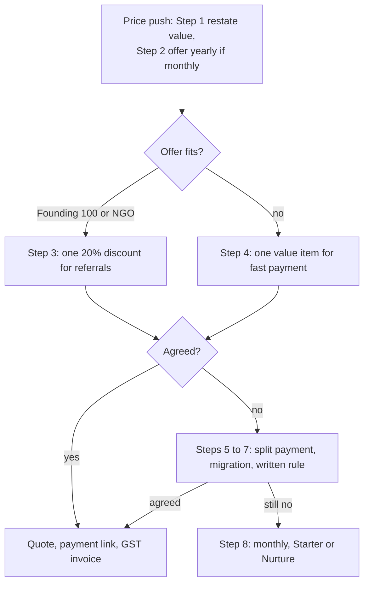

# Objection Handling and Closing

**In simple words:** An objection is a doubt the buyer says out loud, such as "too expensive". This chapter gives you one method for any objection and word-for-word English and Hinglish answers to 26 objections that Indian institute owners raise. Then it covers what turns a "yes" into money: the close, discount rules, quote, payment, terms and handover. It ends with what to do after a "no".

## The Five-Step Answer Method

Use these five steps for every objection, in this order. Most founders jump to step four and argue.

| Step | What you do | EN line | HI line |
|---|---|---|---|
| Listen | Let them finish. Note their exact words. | "Please go on." | "Boliye, boliye." |
| Acknowledge | Show the doubt is fair, without agreeing it ends the deal. | "Fair point. Many owners ask this." | "Sahi baat hai, kai owners yeh poochhte hain." |
| Ask | Find the real reason behind the words. | "May I ask what makes you say that?" | "Aisa kyun lag raha hai?" |
| Answer | One short answer with a number or proof. Under 30 seconds. | Library below | Library below |
| Confirm | Check it is settled, then move on. | "Does that answer it?" | "Kya isse jawab mil gaya?" |

Rules for the method:

1. **Answer the reason, not the words.** "Too expensive" can mean "no value", "cash is tight" or "my partner decides".
2. **Isolate first:** "If this were solved, would you start today?" / "Agar yeh solve ho jaye, toh kya aaj shuru karenge?" A "no" means another objection is hiding.
3. **One answer, then confirm.** Five arguments sound like pressure, not proof.
4. **A price question gets a price:** plan, amount and GST in one sentence.
5. **Twice, then step back.** The third time, offer the pilot close or the nurture plan.
6. **Log it** in the owner's words in the CRM the same day (fields in *Sales Foundation and Lead Generation*).

> **Example:** Rajesh Sharma says, "Bahut mehnga hai." Asked why, he says, "March mein sab paisa admission ads mein gaya." That is cash timing, not value: offer monthly now, yearly in April.

## The Objection Library

**Reason** is what usually sits behind the words. Answer in the language of the owner's first sentence. Fill `{{placeholders}}` from the lead sheet; `...` means pause for his reply. Prices exclude 18% GST unless stated.

### Price and Money

**"It is too expensive."**

- *Reason:* He sees the cost, not his own fee leakage.
- **EN:** "For 350 students, Pro is ₹5,999 a month, about ₹17 per student. Recovering one student's yearly dues pays for the whole year. How much is pending today?"
- **HI:** "350 students ke liye Pro ₹5,999 mahina, ek student ka lagbhag ₹17. Ek student ki saal ki pending fees aayi, toh saal ka kharcha nikal gaya. Abhi kitni fees pending hai?"

**"Give me 50% discount."**

- *Reason:* Bargaining habit. He tests whether the price is real.
- **EN:** "Sir, 50% is not possible; our price is public and the same everywhere. Yearly gives 2 months free. As one of our first 100 customers, you also get 20% off the first year: ₹47,992 instead of ₹59,990. Nobody pays less."
- **HI:** "Sir, 50% nahi ho payega, price public hai, har jagah same. Yearly lenge toh 2 mahine free. Pehle 100 customers mein hone se pehle saal 20% off: ₹59,990 ki jagah ₹47,992. Isse kam kisi ko nahi."

**"Give me one-time price software, not monthly."**

- *Reason:* He bought desktop software once and dislikes monthly bills.
- **EN:** "One-time software ages from day one and needs a yearly AMC (maintenance charge). Our price covers server, backups, new features and support. For one payment, take yearly: one bill, 2 months free, and a 24-month price lock for founding customers."
- **HI:** "One-time software pehle din se purana hota hai, aur har saal AMC lagta hai. Hamare price mein server, backup, naye features aur support shamil hai. Yearly lijiye: ek bill, 2 mahine free, founding customer ko 24 mahine price lock."

**"The free plan is enough for us."**

- *Reason:* He wants to avoid paying, or he is truly small.
- **EN:** "Under 50 students, Starter is enough, free forever. But you have {{students}} students. Starter stops at 50 and sends no WhatsApp reminders, which is where money comes back. Growth covers 300 students for ₹2,499 a month."
- **HI:** "50 se kam students hon toh Starter kaafi hai, hamesha free. Par aapke {{students}} students hain. Starter 50 pe rukta hai aur WhatsApp reminder nahi bhejta, jahan se paisa wapas aata hai. Growth mein 300 students tak ₹2,499 mahina."

**"WhatsApp costs extra?"**

- *Reason:* He fears hidden costs after signing.
- **EN:** "Yes. Meta charges for every business message, and we pass it on at cost plus 15%. For 300 students with 15 messages each a month, that is about ₹700 with GST. Packs are prepaid from ₹499, so no surprise bills."
- **HI:** "Haan. Meta har business message ka charge leti hai, hum cost plus 15% lete hain. 300 students, har ek ko mahine mein 15 message, toh GST ke saath lagbhag ₹700. Pack ₹499 se prepaid, surprise bill nahi."

The ₹700 is an estimate from *Pricing Strategy* (300 × 15 × ₹0.1323 × 1.18 = ₹703). Re-check Meta's rates each quarter.

**"We have three branches. Do I pay three times?"**

- *Reason:* He expects a bill that grows with every branch.
- **EN:** "No, you pay by total students. Pro covers 3 branches and 1,000 students for ₹5,999 a month; each extra branch is ₹999. Two small branches with 250 students take Growth plus one branch: ₹3,498. How many students in total?"
- **HI:** "Nahi, total students ke hisaab se. Pro mein 3 branch aur 1,000 students tak ₹5,999 mahina; har extra branch ₹999. Do chhoti branch, 250 students, toh Growth plus ek branch: ₹3,498. Kul kitne students hain?"

Above 1,000 students, or for white-label and SSO, quote Enterprise from ₹14,999 a month.

**"Will I get a GST bill?"**

- *Reason:* His CA wants clean invoices, or he hopes for a cash deal.
- **EN:** "Yes, a GST tax invoice with both GSTINs within 24 hours of every payment. If you are GST-registered, your CA can usually claim the 18% as input credit. Please share your GSTIN and billing name."
- **HI:** "Haan ji, har payment ke 24 ghante mein dono GSTIN ke saath GST invoice. Registered hain toh CA aam taur pe 18% input credit le sakte hain. GSTIN aur billing naam bhej dijiye."
- **If he wants no GST:** EN: "Sorry, payment goes only to the company account, with a GST bill." HI: "Maaf kijiye, payment sirf company account mein, GST bill ke saath."

Schools usually cannot claim the credit, so tell them the total with GST: Growth yearly is ₹29,488.20.

### Status Quo and Competitors

**"We use Excel and registers, and it works."**

- *Reason:* The system is familiar; the pain is invisible to him.
- **EN:** "You built a system that works. One question: how long does it take to know who has not paid this month? ... In EduFlow that list is ready every morning, and WhatsApp reminders go by themselves. Your Excel comes in with one import."
- **HI:** "Aapka system chal raha hai. Ek sawaal: is mahine kisne fees nahi di, yeh jaanne mein kitna time lagta hai? ... EduFlow mein yeh list roz subah taiyaar, reminder WhatsApp pe apne aap. Aapka Excel ek import mein aa jaata hai."

**"We already use Teachmint / Classplus / Fedena / a local vendor."**

- *Reason:* Sunk cost, a running contract, or quiet unhappiness.
- **EN:** "Good, you know the value of software. If {{competitor}} does everything you need, keep it. What do you wish it did better? ... Then run EduFlow on one batch for 14 days alongside. When does your plan renew?"
- **HI:** "Achha hai, aap software ki value jaante hain. {{competitor}} sab kar raha hai toh usi ko rakhiye. Aap chahte hain woh kya behtar kare? ... Toh 14 din ek batch pe EduFlow saath mein chalaiye. Current plan kab renew hota hai?"
- **For a local desktop program, add:** EN: "Can you see today's collection on your phone from home?" HI: "Aaj ka collection ghar baithe phone pe dikhta hai?"

> **Rule:** Never criticise a competitor, and never state its price or missing features. Log the renewal date in the CRM and call 30 days before it.

**"A relative is building one for us."**

- *Reason:* Family loyalty, and it looks free.
- **EN:** "Family help is valuable. Ask him: who fixes it at 9 pm on fee day? Who tests the backups? Does WhatsApp use Meta's official API, so the number is not blocked? Good answers, go with him. If not, EduFlow is ready today."
- **HI:** "Ghar ki madad keemti hai. Unse poochhiye: fee wale din raat 9 baje kaun theek karega? Backup kaun check karta hai? WhatsApp Meta ki official API se jaata hai, taaki number block na ho? Achha jawab ho toh unke saath chaliye, nahi toh EduFlow taiyaar hai."

**"We had a bad experience with an ERP before."**

- *Reason:* He lost money. Staff refused it, or the vendor vanished.
- **EN:** "Sorry to hear that. What went wrong: the software, the training or the vendor? ... That is why you first use EduFlow free for 14 days, no setup fee. A first yearly payment is refundable within 30 days. And I train your staff myself."
- **HI:** "Sunke bura laga. Kya galat hua: software, training ya vendor? ... Isiliye pehle 14 din free chalaiye, koi setup fee nahi. Pehli yearly payment 30 din mein refundable hai. Aur staff ki training main khud karunga."

**"Migration is painful."**

- *Reason:* He fears re-typing records and losing old dues.
- **EN:** "Most of the work is ours. Send your student Excel as it is. We import one batch together today in 10 minutes, the rest within 48 hours. Pending dues come in as opening balances."
- **HI:** "Zyada kaam hamara hai. Student Excel jaisa hai waisa bhejiye. Aaj saath mein ek batch 10 minute mein, baaki 48 ghante mein. Pending fees opening balance ban ke aati hai."

Old fee history needs assisted migration (₹9,999). Give it free only at step 6 of the discount ladder.

### People and Adoption

**"My staff are not computer-friendly."**

- *Reason:* Staff refused an earlier software. The accountant may fear for his job.
- **EN:** "Do your staff use WhatsApp? Then they can use EduFlow. Attendance takes under a minute; a fee takes three clicks. I train your accountant for 60 minutes in Hindi. Shall Suresh ji collect one fee himself right now?"
- **HI:** "Staff WhatsApp chalata hai? Toh EduFlow bhi chala lega. Attendance ek minute se kam, fees teen click mein. Accountant ko 60 minute Hindi mein training main dunga. Suresh ji abhi khud ek fees collect karke dekhein?"

**"Parents will not use an app."**

- *Reason:* Earlier apps were never downloaded.
- **EN:** "Parents download nothing. Absent alerts and fee receipts come on WhatsApp. The parent portal opens in the phone browser with an OTP, no password. Even without the portal, WhatsApp alone cuts your reminder calls."
- **HI:** "Parents ko kuch download nahi karna. Absent alert aur fee receipt WhatsApp pe aati hai. Parent portal browser mein OTP se khulta hai, password nahi. Portal ke bina bhi WhatsApp se reminder calls kam ho jaate hain."

**"Is there Hindi support?"**

- *Reason:* His staff are more comfortable in Hindi.
- **EN:** "Support, training and videos are fully in Hindi, and parent messages can go in Hindi. Screens use simple English words like Fees and Receipt. Hindi screens are on our roadmap, not before September 2027."
- **HI:** "Support, training aur videos poori Hindi mein, parents ko message bhi Hindi mein. Screen simple English mein hai, jaise Fees, Receipt. Hindi screen roadmap mein hai, September 2027 se pehle nahi."

### Trust and Risk

**"What if my data leaks?"**

- *Reason:* He fears his student list reaching a rival institute.
- **EN:** "Fair fear. Your data is locked away from every other institute. Teachers see only their batches; fee totals only you. Every export is logged with name and time. And our terms say we never sell or share your data."
- **HI:** "Darr sahi hai. Aapka data har doosre institute se alag band hai. Teacher sirf apna batch dekhti hai, fee total sirf aap. Har export ka naam aur time record hota hai. Terms mein likha hai, data kabhi bechte ya share nahi karte."

**"What if you shut down?"**

- *Reason:* A vendor vanished on him before.
- **EN:** "Honest answer: we are young, so you are never trapped. Export every list to Excel any day. Monthly plans have no lock-in. And if we ever close, our terms promise 90 days notice and a full data export."
- **HI:** "Seedhi baat: hum nayi company hain, isliye aap kabhi fanse nahi. Har list kabhi bhi Excel mein nikaaliye. Monthly plan mein lock-in nahi. Kabhi band hue toh terms mein likha hai: 90 din notice aur poora data export."

> **Warning:** Say the last sentence only after your Terms of Service contain this wind-down clause (see *Company Setup, Legal and Finance Basics*).

**"You are a new company."**

- *Reason:* No references yet. He wants proof that someone like him uses it.
- **EN:** "True, and it helps you: you get the founder's own number, not a call centre. Pilot institutes have run fee counters on EduFlow since November. Shall I connect you with {{pilot_owner}} of {{pilot_institute}} for five minutes?"
- **HI:** "Sahi, aur isme aapka fayda hai: call centre nahi, founder ka apna number. Pilot institutes November se EduFlow pe fee counter chala rahe hain. {{pilot_institute}} ke {{pilot_owner}} ji se paanch minute baat karwa dun?"

Name a pilot institute only with its owner's written OK.

**"Internet is unreliable here."**

- *Reason:* He pictures a stuck fee counter with parents waiting.
- **EN:** "The counter needs little data; a phone hotspot runs it, with a second network's SIM as backup. Attendance waits on the teacher's phone until the signal returns. In a full outage, write a paper receipt and enter it the same day."
- **HI:** "Counter ko kam data chahiye, phone hotspot kaafi hai, backup mein doosre network ki SIM. Attendance signal aane tak phone mein rehti hai. Net poora band ho toh kachchi receipt, usi din entry."

### Timing and Decision

**"Send details on WhatsApp, I'll see."**

- *Reason:* Usually a polite exit. Sometimes he is truly busy.
- **EN:** "Sure, sending now. Is fee follow-up or attendance the bigger headache? ... Then it makes more sense on your own phone. May I show you in 20 minutes, Thursday 12:30 or Friday 11:00?"
- **HI:** "Bilkul, abhi bhejta hoon. Fees follow-up badi pareshani hai ya attendance? ... Toh apne phone pe dekh ke zyada samajh aayega. 20 minute mein dikha dun, Guruvaar 12:30 ya Shukravaar 11 baje?"

**"Not now. After admissions / after exams."**

- *Reason:* Switching mid-season feels risky, and he has no time.
- **EN:** "Right, never switch mid-admissions. So the best time is two weeks before: setup takes one day, and the counter runs on EduFlow from the first admission. Shall we fix the go-live date, and I call you on {{date}}?"
- **HI:** "Sahi, admission ke beech system nahi badalna. Isiliye do hafte pehle: setup ek din ka, pehle admission se counter EduFlow pe. Go-live date fix karein, main {{date}} ko call karun?"

If he still says no, move the lead to Nurture with a season call date.

**"I need to ask my partner / the trust / management."**

- *Reason:* Authority is split, or it is a polite exit.
- **EN:** "Of course, decide together. What will {{partner}} ask first: the price, or whether staff will use it? ... Then let me show {{partner}} just that in 20 minutes. Can the three of us meet on {{day}}?"
- **HI:** "Bilkul, milke faisla kijiye. {{partner}} ji pehle kya poochhenge: price, ya staff chala payega? ... Toh unhe 20 minute mein sirf wahi dikha deta hoon. {{day}} ko teeno mil sakte hain?"

### Product Fit

**"I need customisation."**

- *Reason:* He thinks his institute is unique.
- **EN:** "Show me the register or report you need. ... Most customisation is settings: fee heads, instalments, receipt format, admission number style and extra fields. I set those up. Anything truly missing goes on the roadmap, without a fake date."
- **HI:** "Jo register ya report chahiye, dikhaiye. ... Zyada tar customisation settings hai: fee heads, instalments, receipt format, admission number style, extra fields. Yeh main set karunga. Sach mein kuch missing ho toh roadmap mein, par jhoothi date nahi."

**"Do you have a mobile app?"**

- *Reason:* A Play Store app looks like proof of a real company.
- **EN:** "EduFlow works on every phone. Open it in the browser, tap 'Add to Home screen', and it sits there like an app. A Play Store app in your institute's name is planned as an add-on by September 2027."
- **HI:** "EduFlow har phone pe chalta hai. Browser mein kholiye, 'Add to Home screen' dabaiye, app ki tarah icon ban jaata hai. Aapke institute ke naam ka Play Store app September 2027 tak add-on mein planned hai."

**"We need offline or desktop software."**

- *Reason:* He knows Tally-style programs and trusts his own PC.
- **EN:** "EduFlow is online, I will not pretend otherwise. But if that one desktop crashes or is stolen, the data goes with it. With EduFlow, backups are automatic, you see collections from home, and a new laptop works in five minutes."
- **HI:** "EduFlow online hai, jhooth nahi bolunga. Par woh ek computer kharab ya chori hua, toh data bhi gaya. EduFlow mein backup apne aap, collection ghar se dikhta hai, naya laptop paanch minute mein chalu."

**"Can it connect to our biometric machine?"**

- *Reason:* He already paid for a staff attendance machine.
- **EN:** "Keep the machine for staff. EduFlow imports staff attendance from its Excel file. Students are marked on the teacher's phone. A direct machine link needs a hardware partner; it is on our roadmap, without a date."
- **HI:** "Machine staff ke liye rakhiye. Uski Excel file se EduFlow staff attendance import karta hai. Students ki attendance teacher phone pe lagati hai. Machine se direct link hardware partner ke saath roadmap mein hai, date nahi."

> **Note:** Before you say this, test the import once with a real file from the prospect's machine. EduFlow sells no hardware.

## Buying Signals

A buying signal shows the owner already pictures EduFlow in his institute. Stop answering and start closing.

| Signal | You hear or see | Your move |
|---|---|---|
| Asks how to pay | "UPI chalega?" | Send quote and payment link |
| Asks about the start | "Kitne din mein chalu hoga?" | Assumptive date close |
| Gives billing details | GSTIN or billing name | Quote within the hour |
| Brings in staff | Calls the accountant to the screen | Hand him the mouse |
| Bargains after the plan | "Thoda kam karo" | Discount ladder, step 1 |
| Asks "what if" | "Parent aadhi fees de toh?" | Answer, then ask for the decision |
| Asks for a reference | "Kisi aur ne liya hai?" | Pilot contact plus decision date |
| Trial is Green | 4 or 5 milestones by Day 7 | Quote early; ask for yearly |
| Checks the exit | "Chhodna ho toh data ka kya?" | Export promise, then close |
| Cooling: silence | No reply 48 hours after the quote | One call, not five messages |
| Cooling: empty trial | No students imported by Day 3 | Import call, or Nurture |

## Closing Techniques

Closing means asking for a decision. These five fit Indian owners, who buy in seasons and trust a person more than a brochure.

| Technique | Use when | EN | HI |
|---|---|---|---|
| Pilot close | Likes it, fears a full switch | "One batch for 14 days. If Suresh ji saves an hour a day, all batches move on {{date}}." | "14 din ek batch. Suresh ji ka roz ghanta bache, toh {{date}} ko saare batch." |
| Season deadline | Admissions or session start is near | "Admissions open 1 March and setup needs a week, so we start by 20 February." | "Admission 1 March se, setup mein hafta, toh 20 February tak shuru karein." |
| Yearly plan | Plan agreed, billing open | "Monthly is ₹71,988 a year. Yearly is ₹59,990, two months free. Yearly quote?" | "Monthly saal ka ₹71,988. Yearly ₹59,990, do mahine free. Yearly quote bana dun?" |
| Founder's launch offer | Yearly Growth or Pro, before customer 100 or 30 April 2027 | "First 100 customers pay for 8 months, use 12, price locked 24 months." | "Pehle 100 customers: 8 mahine ka paisa, 12 mahine chalaiye, 24 mahine price lock." |
| Assumptive date | Two or more buying signals | "Kickoff with Suresh ji Thursday 11:00 or Friday 12:30?" | "Kickoff Suresh ji ke saath Guruvaar 11 baje ya Shukravaar 12:30?" |

- **Deadlines must be real.** Quote the true Founding 100 count ("today we are at customer 37"). Fake deadlines spread through owners' WhatsApp groups.
- **The launch offer has a price:** a testimonial, logo permission and two referrals. Never on monthly plans, Enterprise, add-ons or credits.
- **A school group's pilot is paid:** one campus on a paid plan.
- **Assume only after value is confirmed.**

## The Closing Script

The decision call on trial Day 12 (Monday 25 January 2027) with Rajesh Sharma. His trial is Green. Block 15 minutes.

1. **Open.** EN: "Rajesh ji, as agreed, 15 minutes to decide the plan. Is now good?" HI: "Rajesh ji, jaisa tay hua, plan ke liye 15 minute. Abhi theek hai?"
2. **His numbers.** EN: "In 12 days Suresh ji issued 96 receipts for ₹3.8 lakh on parents' WhatsApp. The dues list shows ₹4.2 lakh pending from 46 students." HI: "12 din mein Suresh ji ne ₹3.8 lakh ki 96 receipts parents ke WhatsApp pe bheji. Dues list mein 46 students ke ₹4.2 lakh pending."
3. **Value check, then wait.** EN: "Is this useful for Sharma Classes?" HI: "Kya yeh Sharma Classes ke kaam ka hai?"
4. **Clear the last doubt.** EN: "Is anything still stopping you?" HI: "Ab bhi kuch rok raha hai?" Use the five steps on any answer.
5. **Recommend.** EN: "Pro fits 350 students. As a Founding 100 customer, yearly is ₹47,992 plus GST, ₹56,630.56 in total: about ₹11 per student a month, locked for 24 months." HI: "350 students ke liye Pro. Founding 100 mein yearly ₹47,992 plus GST, total ₹56,630.56: ek student ka mahine ka lagbhag ₹11, 24 mahine lock."
6. **Ask, then silence.** EN: "Shall I send the quote and payment link now?" HI: "Quote aur payment link abhi bhej dun?" Let him speak first.
7. **If yes.** EN: "Sending now. Your trial data stays as it is. Kickoff Thursday 11:00 with Suresh ji?" HI: "Abhi bhejta hoon. Trial ka data waisa hi rahega. Kickoff Guruvaar 11 baje Suresh ji ke saath?"
8. **If "let me think".** EN: "Of course. Think over what: the price, the staff or the timing?" HI: "Zaroor. Kis baat pe sochna hai: price, staff ya timing?" Answer it, then offer the pilot close or a call within 48 hours.
9. **If he bargains,** use the discount ladder below.

## Negotiation Rules and the Discount Ladder

In Year 1 you are both seller and approver, so the approver is a written rule, based on the discount policy in *Pricing Strategy*. Print it, sign it and keep it above your desk.

```text
MY DISCOUNT RULE                       Mehdi Alam, signed 1 Jan 2027
1. One public price. The same for every institute in every city.
2. One discount per deal, never two. Yearly billing is the list
   price, not a discount.
3. Never more than 20% off list. For anything above 20%: write the
   reason, end date and expected value, wait 24 hours, then decide.
   The default answer is no.
4. No discount on add-ons, credits or gateway fees. Monthly plans
   get only the NGO and low-fee discount.
5. Every give has a get: yearly payment, payment in 48 hours,
   a testimonial, logo permission or two referrals.
6. Quotes end after 7 days. No cash. Every payment gets a GST bill.
7. No custom development and no feature dates outside the roadmap.
8. Enterprise never below Rs 14,999 a month.
9. Log every concession in the CRM: what, why, approved by whom.
```

Go down the ladder one step at a time. An angry tone is no reason to skip a step.

| Step | You give | You get |
|---|---|---|
| 1 | Restate value: dues found, price per student | Nothing |
| 2 | Yearly billing, two months free | 12 months paid now |
| 3 | One standard discount: Founding 100 or NGO and low-fee (20%) | Testimonial, logo, two referrals |
| 4 | One value item: ₹499 credit pack, extra training or trial extension | Payment within 48 hours |
| 5 | Yearly paid 50% now, 50% in 60 days | Written commitment on WhatsApp |
| 6 | Free assisted migration (₹9,999) or one on-site training day; Pro yearly or Enterprise only | Yearly payment and a case study |
| 7 | Special discount under the written rule, instead of step 3 | Reason and end date in the CRM |
| 8 | Step back: monthly plan, Starter or Nurture | Nothing |

**Figure: The negotiation path**



Every path ends in a quote with a payment link or in a polite step back. No path ends in a secret price.

## Quotation and Payment Collection

1. **Quote within one hour of the yes:** a numbered one-page PDF on WhatsApp and email, valid for 7 days.
2. **Payment link.** In the Razorpay dashboard, create a Payment Link for the exact total, with the quote number in the description, the owner's phone and email, and expiry on the quote's last day.
3. **Monthly plans** pay on EduFlow's billing page with a UPI AutoPay mandate. Growth (₹2,948.82 with GST) and Pro (₹7,078.82) fit under the ₹15,000 auto-debit limit.
4. **Bank transfer:** print the company current account on the quote and ask for the UTR (transfer reference). When the money arrives, mark the invoice paid in the platform console (ORG-API-44).
5. **Check the money yourself** in the Razorpay dashboard or bank statement, never a screenshot. Only then mark the deal Won.
6. **GST tax invoice within 24 hours,** with both GSTINs, place of supply and the SAC code your CA confirmed.
7. **TDS** (tax deducted at source): if a large customer deducts it, accept the short payment and collect the TDS certificate every quarter (see *Company Setup, Legal and Finance Basics*).

Never take money into a personal UPI ID, in cash, or "without bill".

**Template: quotation (Sharma Classes, sent after the Day 12 call)**

```text
EDUFLOW QUOTATION                             No: Q-2027-0031
Date: 25 Jan 2027                             Valid till: 1 Feb 2027
To: Sharma Classes, Patna, Bihar              Attn: Rajesh Sharma
GSTIN: {{customer_gstin}}                     Billing: yearly
---------------------------------------------------------------------
Item                                                       Amount Rs
Pro plan, 12 months (1,000 students, 3 campuses)           59,990.00
Founding 100 offer, 20% off the first year                -11,998.00
Taxable value                                              47,992.00
GST 18% (IGST, or CGST 9% + SGST 9%)                        8,638.56
TOTAL PAYABLE                                              56,630.56
---------------------------------------------------------------------
Includes: all live Pro modules; online training for owner, accountant
and teachers; price lock for 24 months.
Promised in writing: free assisted migration of old fee records
(list price Rs 9,999).
Extra, prepaid: WhatsApp credit packs from Rs 499.
Pay by: Razorpay link (UPI, netbanking, card) or NEFT to the company
current account. No cash.
Refund: full refund if asked within 30 days of this first payment.
Terms: EduFlow Terms of Service and Privacy Policy (links attached).
```

If the link is unpaid after 48 hours, call once. EN: "Rajesh ji, the link for ₹56,630.56 is valid till Monday. Shall I stay on the line while you pay by UPI?" HI: "Rajesh ji, ₹56,630.56 ka link Somvaar tak valid hai. Main line pe rahun, aap UPI se kar dein?"

## Contract and Terms Acceptance

- **Growth and Pro have no paper contract.** The owner accepts the Terms of Service and Privacy Policy by checkbox at signup; EduFlow stores who accepted and when.
- **Get a written "Agreed" before payment.** EN: "Please read our Terms and Privacy Policy: the data is yours, you can export it any time, and a first yearly payment is refundable within 30 days. Reply 'Agreed' and I'll send the link." HI: "Terms aur Privacy Policy dekh lijiye. Short mein: data aapka, kabhi bhi export, pehli yearly payment 30 din mein refundable. 'Agreed' likh dijiye, main link bhejta hoon."
- **Every extra promise goes on the quote** under "Promised in writing". Nothing stays verbal.
- **Enterprise e-signs** an order form, a Data Processing Agreement and an SLA (service level agreement: 99.5% monthly uptime, 4-hour response to urgent tickets).
- **DPDP roles:** the institute collects student data and parental consent; EduFlow processes it only on its instructions.

## Handover to Onboarding Within 24 Hours

| Within | Action | Done when |
|---|---|---|
| 1 hour | Money checked; thank-you sent; CRM stage Won | Won date and invoice number filled |
| 4 hours | Plan active in the platform console; GST invoice sent; handover note written | Status `ACTIVE`; note in the CRM |
| 24 hours | Kickoff with owner and accountant booked within 48 hours; data checklist sent | Invite accepted on WhatsApp |
| 24 hours | Customer on the health sheet; Day 30 referral task set | Row and task exist |

Thank-you message. EN: "Rajesh ji, payment received, thank you for trusting EduFlow. The GST invoice comes today; kickoff is Thursday 11:00 with Suresh ji. I stay with you until your first fee day runs smoothly." HI: "Rajesh ji, payment mil gaya, bharosa karne ka shukriya. GST invoice aaj; kickoff Guruvaar 11 baje Suresh ji ke saath. Pehla fee day smooth chalne tak main saath hoon."

**Template: handover note (paste into the CRM)**

```text
HANDOVER NOTE     Sharma Classes (sharma-classes)
Won: 27 Jan 2027  Pro yearly, Founding 100, Rs 56,630.56, netbanking
Invoice: {{invoice_no}}
Decider:    Rajesh Sharma, owner, {{phone}}
Daily user: Suresh Gupta, accountant, {{phone}}
Champion:   Priya Nair, teacher (attendance)
Pain in their words: "Staff spend two hours a day calling parents
for fees"
Trial so far: 350 students, 96 receipts, attendance on 6 days
Promised in writing: free migration of old fee records
Open worry: Suresh fears day-close mistakes
Go-live: all batches 1 Feb 2027; parent invites 3 Feb 2027
Kickoff: Thu 28 Jan 2027, 11:00, Google Meet, 60 minutes
Referral ask: 26 Feb 2027 (Day 30)
```

From the kickoff onwards, follow *Onboarding and Customer Success Playbook*.

## After a No: the Nurture Plan

A "no" is usually "not now". Respect it, learn from it and keep the door open.

1. **Ask the reason once.** EN: "Thank you for being clear, Rajesh ji. What is the main reason? ... Understood. The free plan and my number are always here. May I send one useful tip a month?" HI: "Saaf batane ka shukriya, Rajesh ji. Main reason kya hai? ... Samajh gaya. Free plan aur mera number hamesha hai. Mahine mein ek kaam ki tip bhejun?"
2. **Sort it.** Good fit with wrong timing, budget or authority: Nurture with a date. A hard disqualifier: Lost, with a reason code from *Sales Process and Playbooks*.
3. **Follow the calendar.** If he says "stop", mark Do not contact and never message again.

| When | Channel | What you send | Goal |
|---|---|---|---|
| Day 0 | WhatsApp | Thanks, Starter link, your number; no pitch | Door stays open |
| Day 7 | WhatsApp | One tip, such as three ways to cut dues before April | Be helpful |
| Day 30 | WhatsApp | One result from a customer in his city, with permission | Local proof |
| Day 45 | WhatsApp | Lost-deal revive template from *WhatsApp and Email Templates* | Re-open the talk |
| Monthly | WhatsApp | At most one useful message | Stay remembered |
| Season call | Phone | Early January (schools), March (coaching), June (chains) | Book a demo |
| Trigger | Phone, within 2 working hours | Starter signup, new branch, admission ad, vendor complaint | Back to Contacted |
| 12 silent months | CRM | Mark Lost, code L7 | Clean pipeline |

Season call. EN: "Rajesh ji, last time you said '{{reason}}'. Admissions start next month. May I show you what has changed, in 20 minutes?" HI: "Rajesh ji, pichhli baar aapne kaha tha '{{reason}}'. Agle mahine admission shuru hain. 20 minute mein dikha dun kya badla hai?"

## Key takeaways

- Use Listen, Acknowledge, Ask, Answer, Confirm on every objection. Answer the real reason once.
- Be honest about limits: WhatsApp costs extra, screens are English for now, and there is no offline mode or hardware.
- Close on buying signals. Deadlines and the Founding 100 count must always be true.
- Your written rule is the approver: one discount, never above 20% without a written note and a 24-hour wait, and every give has a get.
- Money goes only to company accounts, with a GST invoice within 24 hours.
- Hand over within 24 hours with a written note; every "no" goes to Nurture with a date.
