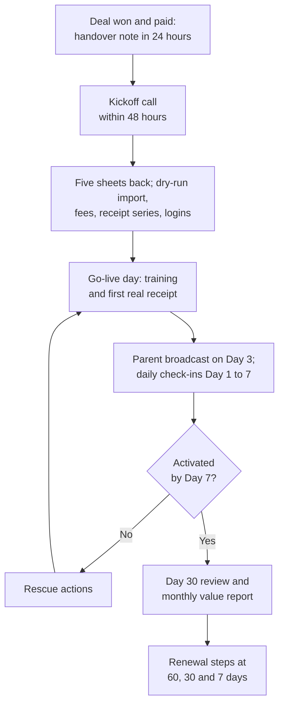

# Onboarding and Customer Success Playbook

**In simple words:** A customer who has paid is not yet a happy customer. This chapter is your method to take a paying institute live in one day, train its people, run support alone, spot trouble early and win the renewal. Every agenda, template and script is ready for your first paying customer in January 2027.

## The journey after the sale

**Figure: Onboarding journey from payment to renewal**



The only loop is the rescue, back to the go-live tasks. Activation (the first real fee receipt or attendance within 7 days of signup; canon target 60%) is the gate. The handover note is in *Objection Handling and Closing*.

## Onboarding in one day

"One day" means one go-live day, prepared over the three days before it. Example: Sharma Classes (Patna, 350 students, Pro yearly) pays on Wednesday 27 January 2027. Kickoff is Thursday, sheets return Friday, you do the dry-run import and setup on Saturday evening, and go-live is Monday 1 February.

| Time on 1 Feb | Session | Output |
|---|---|---|
| 10:00 | Final import and verification | Counts signed off |
| 10:30 | Owner session, 30 minutes | Rajesh Sharma reads his Dashboard alone |
| 11:00 | Accountant session, 60 minutes | Suresh Gupta makes the first real receipt |
| 12:30 | Teachers session, 30 minutes | Priya Nair and 7 teachers logged in |
| 17:10 | First real attendance, evening batch | Absence alerts reach parents |
| 18:30 | Message CS-02 with the day's numbers | Owner sees proof the same day |

For a school, hold the teachers session at 3:30 pm, after classes.

> **Rule:** Go live on the first day of a month or of an instalment cycle. Everything due earlier becomes an opening balance, so the dues list is right from the first morning.

### Kickoff call agenda

Growth gets 30 minutes, Pro 45. Book 60, so a live fix never runs out of time.

| Minutes | Topic | Output |
|---|---|---|
| 0 to 5 | Goal: "Thirty days from now, what must be better?" | One written goal |
| 5 to 12 | People: who collects fees, trains teachers, owns the Excel | Two champions |
| 12 to 22 | Data: walk the checklist with their Excel on screen share | Data owner and return date |
| 22 to 30 | Go-live date, training slots, support hours | Calendar invites |
| 30 to 40 (Pro) | Centres, Front Desk role; start Razorpay KYC on the call | KYC started |
| 40 to 45 (Pro) | Last paper receipt number; how old dues are tracked | Receipt start number |

A champion is the staff member who owns EduFlow for one job. With two, one resignation cannot kill the account.

### Data collection checklist

| Item | From whom |
|---|---|
| Students, batches, parent names and mobiles | Front desk |
| Teachers and office users | Owner |
| Courses, batches, timings, holidays | Owner |
| Fees, instalments, discounts, late fee | Accountant |
| Pending dues per student | Accountant |
| Photo of the last paper receipt (for the receipt series) | Accountant |
| Logo, address, GSTIN (GST number), receipt footer | Owner |
| Bank proof for online fees (Growth and up) | Owner, on Razorpay only |

> **Rule:** Data files arrive only by email to `support@eduflow.app`, never on your personal WhatsApp. Delete them within 7 days of go-live. They hold children's data.

### Excel templates

Download each template from the import screen (`CMN-API-09`). Its column names match the PRD fields, so column mapping (matching Excel columns to EduFlow fields) is automatic. Every sheet: one header row, no merged cells, no formulas, dates as DD-MM-YYYY, one mobile per cell, at most 5,000 rows.

**Template: Students**

| Column | Format | Example |
|---|---|---|
| Admission no (optional) | Unique; blank takes the next number | SC-2026-0311 |
| First name | Letters only | Riya |
| Last name (optional) | Letters only | Singh |
| Date of birth | DD-MM-YYYY; age 2 to 60 | 22-06-2010 |
| Gender | MALE, FEMALE, OTHER or UNDISCLOSED | FEMALE |
| Admission date | DD-MM-YYYY; not in the future | 01-04-2026 |
| Batch | Exact batch name in EduFlow | Morning Batch M1 |

**Template: Guardians (same row as the student)**

Up to two guardians per row. Parent 1 gets messages and pay links. Students sharing a parent phone become siblings under one parent login.

| Column | Format | Example |
|---|---|---|
| Parent 1 name | Letters only | Rakesh Singh |
| Parent 1 relation | FATHER, MOTHER, LEGAL_GUARDIAN or another listed value | FATHER |
| Parent 1 phone | 10-digit mobile | 94310 22871 |
| Parent 1 email (optional) | Valid email | rakesh.singh@example.com |
| Parent 2 name (optional) | Letters only | Meena Singh |
| Parent 2 relation (optional) | Same list | MOTHER |
| Parent 2 phone (optional) | 10-digit mobile | 94310 55120 |

Parental consent is never a column; each parent gives it personally (see *Privacy and Compliance*).

**Template: Staff**

Teacher rows go through the Teachers import (`TCH-API-15`). You create other roles by hand.

| Column | Format | Example |
|---|---|---|
| Faculty Code (optional) | Unique code | T-07 |
| Name | Letters only | Priya |
| Surname (optional) | Letters only | Nair |
| Mobile | 10-digit mobile | 98011 45672 |
| Joining Date | DD-MM-YYYY | 15-06-2024 |
| Type | FULL_TIME, PART_TIME, CONTRACT, VISITING or INTERN | FULL_TIME |
| Subjects (optional) | Codes joined by semicolons; first is primary | PHY;MATH |
| Login role | TEACHER, ACCOUNTANT, PRINCIPAL or ORG_ADMIN | TEACHER |

**Sheet: Fee structure**

Not imported. You type it into the fee setup screens (P-23) in 20 minutes while the accountant watches.

| Column | Example |
|---|---|
| Course or batch | JEE Main 2028, all batches |
| Fee head and head type | Course Fee, TUITION (other types: ADMISSION, EXAM, TRANSPORT) |
| Amount before tax | ₹60,000 |
| Frequency | YEARLY (or ONE_TIME, MONTHLY, QUARTERLY, HALF_YEARLY) |
| Instalments with due dates | 4 × ₹15,000: 10 Apr, 10 Jul, 10 Oct, 10 Jan |
| Tax, confirmed by the institute's CA | TAXABLE, GST 18% (or EXEMPT) |
| Late fee | FIXED_ONCE ₹200 after 5 grace days |
| Discounts | Sibling 10% on Course Fee |

**Template: Opening balances**

Each row becomes one issued invoice (`FEE-API-41`).

| Column | Rule | Example |
|---|---|---|
| Admission no | Must match an imported student | SC-2026-0311 |
| Fee head code | An existing head | ARREARS |
| Title | Shown on the invoice | Dues till 31 Jan 2027 |
| Amount | Rupees, 2 decimals, no commas | 7500.00 |
| Due date | Normally the go-live date | 01-02-2027 |
| Academic year | Name as in EduFlow | 2026-27 |

> **Warning:** This import sends no messages, but reminders start the next morning. A wrong amount becomes a wrong WhatsApp reminder. Commit only after the accountant signs the total.

### Import and verification

1. Finish the setup wizard: campus, academic year, courses, batches.
2. Import staff, then students with guardians, then opening balances (dues need admission numbers).
3. Run each import as a dry run (a test that checks every row and saves nothing).
4. Fix rows in the Excel error file, never in the database, and upload again. Commit at 0 errors.

| Row error | Usual cause | Fix in Excel |
|---|---|---|
| `INVALID_PHONE` | 9 digits, a landline, two numbers in a cell | One 10-digit mobile |
| `INVALID_DATE` | Date stored as text, or month first | Format as DD-MM-YYYY |
| `BATCH_NOT_FOUND` | "M-1" in Excel, "Morning Batch M1" in EduFlow | Exact batch name |
| `DUPLICATE_STUDENT`, `DUPLICATE_IN_FILE` | Student already in EduFlow, or twice in the file | Delete the extra row |
| `PLAN_LIMIT_REACHED` | More active students than the plan allows | Drop leavers, or upgrade first |

**Verify with the owner** before any training: students per batch within 5% of his register, no student without a parent phone, 10 random students read aloud and correct, three sibling families under one parent login, and the dues total equal to the old register to the rupee.

> **Rule:** If you import for the customer, get a written "OK" on the ticket and work in an audited Super Admin session. Never ask for a password or an OTP.

### Fee heads and receipt format

1. Create fee heads, then one structure per course with instalments, late fee and discounts.
2. Generate invoices only for instalments due after go-live; earlier dues are opening balances, so nothing is billed twice. Dry-run first and check the total: 350 × ₹15,000 = ₹52,50,000 for April.
3. Set the receipt series in Settings with a new prefix, such as `SC/26-27/`, that never clashes with the paper book. Stay under 16 characters, the GST limit for invoice numbers.
4. Add logo, address, GSTIN and footer. Print a test receipt on their printer; get the owner's written OK.

### Roles and logins

| Person | Role | First task |
|---|---|---|
| Rajesh Sharma, owner | `ORG_ADMIN` (created at signup) | Read the Dashboard daily |
| Suresh Gupta, accountant | `ACCOUNTANT` | First receipt |
| Priya Nair and 7 teachers | `TEACHER` | Mark attendance |
| Front desk (Pro only) | Custom role "Front Desk" | Add an admission |
| Parents | `PARENT`, OTP login | See the child's fees |

Staff get invitations and set their own passwords. One person, one login. Starter allows 1 admin and 3 staff users.

## Training sessions

One short session per role; the learner clicks, you watch. Until 30 paying customers, everyone gets all three live; after that, Growth accountants join the weekly webinar from *Customer Success, Onboarding and Support*.

**Owner session (30 minutes)**

| Minutes | Topic | The owner does it |
|---|---|---|
| 0 to 10 | Login; Dashboard: collection, dues, absentees | Reads today's numbers aloud |
| 10 to 18 | Dues list by batch | Sends a reminder to a test parent |
| 18 to 24 | Control: concessions need a second person; audit log | Finds today's receipts in the audit log |
| 24 to 30 | Portal as a parent sees it | Logs in as the test parent |

**Accountant session (60 minutes)**

| Minutes | Drill | Pass when |
|---|---|---|
| 0 to 10 | Find students by name, admission number, parent phone | Each in under 5 seconds |
| 10 to 25 | Collect cash, UPI and cheque; print and share receipts | Three receipts without help |
| 25 to 35 | Part payment, discount, cancel a wrong receipt | Done without help |
| 35 to 45 | Dues list by batch; send reminders | Reminder reaches the test parent |
| 45 to 55 | Day close and the collection report | Cash in hand equals the report |
| 55 to 60 | Real receipt for a waiting parent | Printed: the account is activated |

Drills use the test student; cancel the practice receipts at the end. Ask the owner the day before to invite one parent to pay at 11:55.

**Teachers session (30 minutes, on their own phones)**

| Minutes | Topic | Each teacher does it |
|---|---|---|
| 0 to 5 | Open the invitation, set a password | Icon on the home screen |
| 5 to 15 | Mark attendance | Submits the practice batch |
| 15 to 20 | Correct a wrong mark | Changes one mark |
| 20 to 30 | The parent's absence alert; questions | Reads the alert on your phone |

> **Tip:** Practise on a test batch whose one student has your phone as the parent phone. No real parent gets a false alert.

**Parent broadcast.** Send it on Day 3, after ten receipts without help. Growth and higher send it from EduFlow as a utility template (a pre-approved service message) with no offers. Starter owners post it in their class WhatsApp groups. Drop line 3 until online payment is live. In the boxes, `Rs` means ₹.

```text
EN
Dear Parent, {{institute}} now uses EduFlow. From today you can see
your child's attendance, fees and receipts on your phone.
1. Open {{portal_link}}
2. Enter this mobile number and the OTP you receive.
3. Pay fees by UPI in the portal, or at the counter as before.
Never share your OTP with anyone, not even our staff.
Questions? Call our office: {{office_phone}}. - {{owner_name}}

HI
Aadarniya Abhibhavak, {{institute}} ab EduFlow use karta hai. Aaj se
aap bachche ki attendance, fees aur receipt phone par dekh sakte hain.
1. {{portal_link}} kholiye
2. Yahi mobile number daaliye aur aaya hua OTP bhariye.
3. Fees portal mein UPI se dijiye, ya pehle ki tarah counter par.
Apna OTP kisi ko na batayein, hamare staff ko bhi nahi.
Sawal ho toh office call kijiye: {{office_phone}}. - {{owner_name}}
```

## Go-live checklist for the institute

Send this to the owner right after the kickoff. Your internal list is in *Launch Checklist and Go-Live Runbook*.

```text
EDUFLOW GO-LIVE CHECKLIST - Sharma Classes     Go-live: Mon 1 Feb 2027
[ ] Five sheets emailed to support@eduflow.app        by Fri 29 Jan
[ ] Student count per batch checked and signed        Rajesh Sharma
[ ] Opening dues total equals the old register        Suresh Gupta
[ ] Test receipt printed and approved                 Rajesh Sharma
[ ] Owner, accountant and all teachers logged in      1 Feb
[ ] Owner, accountant and teacher sessions done       1 Feb
[ ] First real receipt and first attendance           1 Feb
[ ] Paper receipt book kept only as a backup          from 1 Feb
[ ] Razorpay KYC submitted for online fees            by 3 Feb
[ ] WhatsApp credits loaded (Rs 499 pack or more)     by 3 Feb
[ ] Parent message sent to every parent mobile        3 Feb
[ ] Portal shown live at the next parent meeting      by 6 Mar
```

## First-week daily check-ins

Call for 10 minutes at a fixed time with the four questions from *Launch Checklist and Go-Live Runbook*. Check one console signal first.

| Day | Check first | Act if |
|---|---|---|
| 1 | Go-live day receipts and attendance | No attendance: mark a batch with Priya Nair |
| 2 | Staff never logged in | Resend invitations; staff-room QR poster |
| 3 | Broadcast delivery report | Failed numbers go to the front desk |
| 4 | Receipts against the paper backup | Paper still used: screen share with the accountant |
| 5 | Parent logins | Under 10%: owner announces the portal in class |
| 6 | Razorpay KYC status | Fill the missing item together |
| 7 | Health row, 30-day goal | Not Green: rescue actions below |

## Activation milestones

Only real data counts; receipts for sample students, or cancelled within 10 minutes, are tests.

| Milestone | By | If missed, within 24 hours |
|---|---|---|
| Batches and 10 real students | Day 2 | Import call, or import for them with a written OK |
| First real receipt or attendance | Day 7 (aim: go-live day) | Day 3: CS-03 and screen share. Day 5: founder call. Day 7: log the blocker |
| 80% of staff logged in | Day 7 | Resend invitations; 15-minute teacher call |
| Online payments live | Day 14 | Finish Razorpay KYC together; ₹1 test payment |
| 30% of students with a parent logged in | Day 30 | Correct failed numbers; poster and parent video |
| Attendance on 8 of 10 days, or 20 receipts a month | Day 30 | Repeat the weak role's session |
| 70% parents, 40% of fee value online | Day 90 | Live online payment at a parent meeting |

> **Founder note:** A missed milestone is your problem, not the customer's. If two customers get stuck on the same screen, fix the product.

## Support playbook for a solo founder

### Channels, hours and targets

Live support runs Monday to Saturday, 10 am to 7 pm IST; system alerts reach your phone at all hours. Help centre and email (`support@eduflow.app`) serve all plans. In-app chat and a WhatsApp support number, on a separate phone, start at Growth. Phone support starts at Pro.

Until 30 paying customers, log tickets in a "Tickets" tab of the health sheet (date, institute, severity, type, summary, first reply, closed). Then move to the helpdesk chosen in *Stage 1: The First 100 Customers*.

First-response targets come from the BRD. S1: the institute cannot work or data is at risk. S2: a key task is broken with no workaround. S3: one user's problem or a how-to. S4: a request.

| Severity | Starter | Growth | Pro | Enterprise |
|---|---|---|---|---|
| S1 Critical | 4 working hours | 1 working hour | 30 minutes | 15 minutes |
| S2 High | 1 working day | 2 working hours | 1 working hour | 30 minutes |
| S3 Normal | 2 working days | 8 working hours | 4 working hours | 2 working hours |
| S4 Low | 3 working days | 2 working days | 4 working hours | 4 working hours |

S1 is fixed within 4 clock hours for Growth and Pro. Meet the first-response target on 90% of tickets. Answer in three windows: 10:00 to 10:45 (S1 and S2 first), 14:00 to 14:20, and 18:15 to 19:00, when every open ticket gets a promised time. Only S1 breaks into build time.

### Triage: bug, training or feature request

First ask: "Does the help article describe this?"

| Type | You recognise it when | You do this |
|---|---|---|
| Bug | The product differs from the article or PRD | Reproduce on staging; log with the screen ID; give a fix date |
| Training | The product works; the user did not know how | Steps and video; two tickets on one screen: fix the screen |
| Data fix | The user entered wrong data | Guide the user; fix it yourself only with a written OK |
| Feature request | The product does not do it | Log institute and reason; promise no date |

### Ten saved replies

Save them as WhatsApp Business quick replies (type `/` and the shortcut). Staff write to you; parents go to their institute.

```text
SR-01 /otp  A parent cannot log in
Check the parent's number in the student profile; the OTP goes only
there. Ask the parent to wait 1 minute and tap Resend OTP. After 5
wrong tries, login locks for 15 minutes. Still nothing? Send me the
last 4 digits and the time; I will check the delivery log.

SR-02 /receipt  A wrong receipt was made
Open the receipt, choose Cancel and write the reason. The invoice is
due again, so you can make the right receipt. The cancelled number
stays in the series, so the audit trail stays clean.

SR-03 /batch  A student changed batch
Open the profile and use Transfer. Attendance history stays. Issued
invoices do not change; if the new batch has another fee, tell me and
we adjust it together.

SR-04 /paid  Paid online, invoice still shows due
Online payments update the invoice within minutes. Still due after 30
minutes? Send me the UPI reference or Razorpay payment ID and the
admission number; I will match it today. Do not collect again.

SR-05 /wa  WhatsApp messages are not going
Check: 1. wallet balance (top up below Rs 100), 2. the parent's
number, 3. the delivery report. All fine? Send me a screenshot of the
delivery report and I will check it with Meta.

SR-06 /sibling  Two children, one parent number
Use the same parent mobile for both children; the parent then sees
both after one login. Added with different numbers? Send me both
admission numbers and I will show you the fix.

SR-07 /discount  A concession for one student
Before the invoice is issued, pick the discount on the student's fee
assignment, for example Sibling 10%. After it is issued, request a
Concession with a reason; a second user, usually the owner, approves.

SR-08 /password  Staff forgot the password
Tap Forgot password on the login page and follow the link. The owner
can also resend your invitation. We never ask for passwords or OTPs.

SR-09 /limit  Plan limit reached
Your plan counts active students. Mark students who left as withdrawn;
they stop counting at once. Need more seats? {{next_plan}} is
Rs {{price}} a month; I can switch today and you pay only the
difference for the remaining days.

SR-10 /bank  When does online fee money reach our bank?
EduFlow never holds your money. Razorpay pays online fees into your
own bank account, usually 2 working days after the payment. Its
settlement report shows each transfer.
```

### Saying no to customisation

One codebase serves every institute, so never build a screen, report or rule for one customer. Ask which problem the request solves; settings, custom fields, custom roles (Pro) or an Excel export usually solve it. When three paying customers ask for the same thing, it enters the roadmap review, without a date. Enterprise gets API access.

```text
EN
Rajesh ji, I understand why you need {{request}}. EduFlow is one system
for hundreds of institutes, so I never build a separate version. That
keeps it affordable and better for you every month. Let me show you how
{{setting}} gives the same result today. Your request is on our
roadmap list; if more institutes need it, we build it for everyone.

HI
Rajesh ji, samajh gaya ki aapko {{request}} kyun chahiye. EduFlow
saikdon institutes ka ek hi system hai, isliye main alag version nahi
banata. Isi se yeh sasta aur har mahine behtar rehta hai. Dikhata hoon
ki {{setting}} se aaj hi yahi result kaise milega. Request roadmap list
mein likh li hai; zyada institutes ko chahiye toh sabke liye banegi.
```

## Customer health tracking sheet

Until the Super Admin console shows a health score, keep a Google Sheet "EduFlow Health", one row per paying account, updated every Monday. It simplifies the BRD score: Green 75 to 100, Amber 50 to 74, Red under 50. Accounts younger than 30 days follow the activation milestones instead. CSAT (customer satisfaction) is the 1 to 5 rating after each ticket.

```text
COLUMNS IN ROW 1
A Organization                   K WhatsApp wallet (Rs)
B Plan                           L Days since last message sent
C Renewal date                   M Open S1 or S2 ticket (Y or N)
D Go-live date                   N Last CSAT 1 to 5 (5 if no ticket)
E Attendance % of working days,  O Billing: OK, GRACE or PAST_DUE
  last 30 days                     (PAST_DUE = over 7 days late)
F Receipts / invoices due %,     P Score (formula below)
  last 30 days (100 if none due) Q Colour (formula below)
G Staff logged in %, 7 days      R Next action
H Days since owner opened        S Next action date
  the Dashboard
I Students with a parent login %, last 30 days
J Fee value paid online %, last 90 days

P2 (type it as one line; it is split here to fit the page)
=IF(E2>=80,20,IF(E2>=50,10,0))+IF(F2>=70,20,IF(F2>=40,10,0))
+IF(G2>=70,10,IF(G2>=40,5,0))+IF(H2<=7,10,IF(H2<=21,5,0))
+IF(I2>=60,10,IF(I2>=30,5,0))+IF(J2>=40,6,IF(J2>=15,3,0))
+IF(AND(K2>100,L2<=14),4,IF(L2<=30,2,0))
+IF(N2<=2,0,IF(AND(M2="N",N2>=4),10,5))
+IF(O2="OK",10,IF(O2="GRACE",5,0))

Q2
=IF(OR(O2="PAST_DUE",P2<50),"Red",IF(P2<75,"Amber","Green"))
```

Copy P2 and Q2 down; colour column Q with Format, Conditional formatting, "Text is exactly". A cancel request sets Red by hand; a new admin or accountant sets at least Amber.

### Red-flag playbooks

Start with the flag worth the most points. First move within 2 working days.

| Red flag | Sheet shows | First move |
|---|---|---|
| Attendance stopped | E under 50 | Call the champion teacher; refresher for the stopped batches |
| Fees back on paper | F under 40 | Screen share with the accountant; repeat the fee drills |
| Owner not looking | H over 21 | Switch on his daily WhatsApp summary; send the value report |
| Staff not logging in | G under 40 | Resend invitations; name a second champion |
| Parents not connected | I under 30 | Correct failed numbers; parent-meeting poster |
| Messages stopped | L over 14 | Help top up; one alert costs about 13 paise |
| Support pain | N is 1 or 2 | Founder call the same day; written fix date |
| Payment past due | O is PAST_DUE | Call; offer UPI QR, bank transfer or monthly billing |
| Champion left | New admin or accountant | Kickoff and role session within 7 days |

> **Rule:** Never answer a usage problem with a discount. A discount does not make teachers mark attendance.

## Monthly value report

On the 3rd of every month, send each Growth and Pro owner a one-page PDF with CS-04. It answers "What did I get for this money?" Build it from Dashboard exports in 15 minutes; from Phase 2, schedule it in Analytics (P-42).

| Section | Sharma Classes, February 2027 (sample) |
|---|---|
| Fees collected | ₹7,85,000 from 142 receipts |
| Paid online | 18% of fee value (online fees live from 9 Feb) |
| Dues | ₹4,20,000 from 61 students, down from ₹6,10,000 on 1 Feb |
| Attendance | 23 of 24 working days; 410 absence alerts to parents |
| Parents connected | 41% of students |
| Staff time saved (estimate) | 142 × 3 min + 92 sessions × 8 min = about 19 hours |
| Cost of EduFlow | About ₹4,999 (Pro yearly ÷ 12), 64 paise per ₹100 collected |
| One suggestion | Show online payment live at the 6 March parent meeting |

Real numbers only; show a weak number with its fix; never name a student.

## Testimonials, case studies and referrals

Ask only at a win moment.

| Trigger | Ask for | Use |
|---|---|---|
| Day 30, Green, first full fee month | Written testimonial | CS-05 |
| NPS answer 9 or 10 | Referral and a Google review | W-15 in *WhatsApp and Email Templates* |
| Owner praises EduFlow unasked | Permission to quote him | CS-05 |
| Day 90, Green, three good numbers | Case study | Interview below |
| Renewal paid | Referral and a 60-second video | W-15, prompts below |

NPS (net promoter score) is a 0 to 10 "would you recommend us" answer. Every quote needs written permission, shows only the owner's name, institute and city, and is approved before publishing; never use a student. The referral reward is one free month per paying referral, capped at ₹5,999.

```text
VIDEO TESTIMONIAL (60 seconds, owner's phone, Hindi or English)
1. Fees aur attendance pehle kaise chalte the?
2. EduFlow ke baad kya badla? Ek number bataiye.
3. Kis tarah ke institute ko aap yeh recommend karenge?

CASE STUDY INTERVIEW (20 minutes; numbers come from the console)
1. Tell me about the institute: students, batches, staff.
2. What was hardest about fees and attendance before?
3. Why EduFlow, and what almost stopped you?
4. How did the first week go?
5. What changed after 90 days? (you bring the numbers)
6. What would you tell an owner who still uses registers?
Page: Snapshot - Before - Go-live - Three numbers - Owner quote

REFERRAL CALL (right after a win moment)
EN: Rajesh ji, you said {{win_line}}. Do you know two owners who still
chase fees by phone? With their OK, share their numbers and I will
call them myself. For each one who pays, you get one month free.
HI: Rajesh ji, aapne kaha {{win_line}}. Kya aap do aise owners ko
jaante hain jo abhi bhi phone karke fees maangte hain? Unki haan le kar
number dijiye, main khud call karunga. Har paid join par ek mahina free.
```

## Renewal playbook

Monthly plans renew by auto-debit. A yearly renewal needs the owner to pay a link, so it is a small sale. Sharma Classes renews on 27 January 2028 (R).

| When | Your actions | Template |
|---|---|---|
| R minus 60 (28 Nov 2027) | Update the health row; fix every weak input; check plan fit | E-15 |
| R minus 30 (28 Dec 2027) | System sends invoice and pay link; you send the yearly value report and call | W-19, R-30 call |
| R minus 7 (20 Jan 2028) | If unpaid: call; offer UPI QR or bank transfer | W-19, R-7 call |
| R (27 Jan 2028) | Paid: thank-you and referral ask if Green. Unpaid: dunning with 14 days of full service | W-15 |

Dunning is the automatic series of payment reminders after a missed payment, set in *Pricing Strategy*.

```text
R-30 CALL
EN: Rajesh ji, this year EduFlow handled {{receipts}} receipts and
Rs {{collected}} of fees; {{online_share}}% came online. Your plan
renews on 27 January. Is Pro still right, or is a new centre planned?
HI: Rajesh ji, is saal EduFlow se {{receipts}} receipts aur
Rs {{collected}} fees aayi; {{online_share}}% online. Plan 27 January
ko renew hoga. Pro hi theek hai, ya naya centre aane wala hai?

R-7 CALL
EN: Rajesh ji, the renewal is due on 27 January. Is anything stopping
it: a question, the amount or the payment mode? I can send a UPI QR
or bank details right now.
HI: Rajesh ji, renewal 27 January ko due hai. Kuch atka hai: koi
sawal, amount, ya payment ka tareeka? UPI QR ya bank details abhi bhej
deta hoon.
```

> **Rule:** A renewal discount is only for a real price problem and follows the discount ladder in *Objection Handling and Closing*. An honest downgrade to a cheaper plan keeps the customer.

## Handling a cancellation

1. Reply the same day with CS-06. The account turns Red.
2. Hold a 15-minute exit call within 1 working day. Listen; do not argue.
3. Log one reason code and make the one offer that fits it.
4. If the owner still leaves, send the full Excel export the same day. The account stays readable until the paid period ends; data is deleted 90 days later, confirmed in writing.
5. Refunds follow the Terms: a first yearly payment is refundable within 30 days.
6. Send win-back W-20 after 60 to 90 days, only if the reason is fixed.

```text
EXIT CALL (15 minutes; write the answers word for word)
1. What made you decide to stop?
   Band karne ka faisla kis wajah se liya?
2. When did you first feel it was not working?
   Pehli baar kab laga ki kaam nahi ban raha?
3. What did you expect that did not happen?
   Kya umeed thi jo poori nahi hui?
4. What will you use instead?
   Ab uski jagah kya use karenge?
5. If we fixed one thing, would you stay?
   Ek cheez theek ho jaye toh rukenge?
Close: "Thank you. Your export link comes today, and your data stays
safe until the date in my message." / "Shukriya. Export link aaj hi
aayega, aur message wali date tak data surakshit rahega."
```

| Code | Reason | The one offer |
|---|---|---|
| C1 | Never went live properly | Free re-onboarding within a week |
| C2 | Staff went back to registers | Role sessions again and a 30-day habit plan |
| C3 | Institute closed or merged | None; a clean export and a kind goodbye |
| C4 | Price or cash problem | Monthly billing, a lower plan, or Starter (up to 50 students) |
| C5 | Moved to a competitor | None; log what the other product does better |
| C6 | Bad support or repeated bugs | Founder call and a written fix date |
| C7 | The champion left | Kickoff and training for the new person within 7 days |

## Hinglish versions of key customer messages

Placeholders follow *WhatsApp and Email Templates*. Reply in the customer's last language.

```text
CS-01 Data request (right after the kickoff)
EN: {{owner_name}}, thank you for the call. Attached: students with
parents, staff, fee structure, opening dues and your go-live checklist.
Please email them to support@eduflow.app by {{return_date}}. Small
mistakes are fine; the import shows each one. Go-live: {{golive_date}}.
HI: {{owner_name}} ji, call ke liye shukriya. Sheets bhej raha hoon:
students aur parents, staff, fee structure, pending fees aur go-live
checklist. {{return_date}} tak support@eduflow.app par email kar
dijiye. Chhoti galti chalegi, import har galti dikhata hai.

CS-02 Go-live evening
EN: {{owner_name}}, congratulations, {{institute}} is live. Today:
{{receipts}} receipts worth Rs {{amount}}, attendance in {{batches}}
batches, {{alerts}} absence alerts. I call tomorrow at {{time}}.
HI: {{owner_name}} ji, badhai ho, {{institute}} aaj live hai. Aaj:
Rs {{amount}} ki {{receipts}} receipts, {{batches}} batch ki
attendance, {{alerts}} absence alert. Kal {{time}} baje call karunga.

CS-03 Not activated yet (Day 3)
EN: {{owner_name}}, I see no receipt or attendance in EduFlow yet.
That is normal in week one. Can I join {{accountant_name}} for 15
minutes today and make the first receipt together? 12 noon or 4 pm?
HI: {{owner_name}} ji, EduFlow mein abhi receipt ya attendance nahi
dikh rahi. Pehle hafte mein aisa hota hai. Aaj 15 minute
{{accountant_name}} ji ke saath pehli receipt kaat lein? 12 ya 4 baje?

CS-04 Monthly value report
EN: {{owner_name}}, your EduFlow report for {{month}} is attached:
Rs {{collected}} collected, {{online_share}}% online, dues down by
Rs {{dues_drop}}, about {{hours}} staff hours saved. One idea for next
month: {{suggestion}}.
HI: {{owner_name}} ji, {{month}} ki EduFlow report bhej raha hoon:
Rs {{collected}} fees aayi, {{online_share}}% online, pending fees
Rs {{dues_drop}} kam hui, staff ke lagbhag {{hours}} ghante bache.
Agle mahine ka sujhav: {{suggestion}}.

CS-05 Testimonial ask
EN: {{owner_name}}, {{win_line}}. Would you write 2 or 3 lines on what
changed since EduFlow? I show only your name, institute and city,
never a student, and you see the final text first.
HI: {{owner_name}} ji, {{win_line}}. EduFlow ke baad kya badla, 2-3
line mein likh denge? Sirf aapka naam, institute aur shehar dikhega,
kisi bachche ka naam kabhi nahi. Final text pehle aapko dikhaunga.

CS-06 Cancellation received, with the data promise
EN: {{owner_name}}, I have your request to cancel. Thank you for the
time you gave EduFlow. Our promise: 1. full Excel export today,
2. read access until {{end_date}}, 3. deletion 90 days later,
confirmed in writing. May I call for 15 minutes to learn why?
HI: {{owner_name}} ji, cancel ki request mil gayi. EduFlow ko samay
dene ka shukriya. Hamara vaada: 1. aaj hi poora Excel export,
2. {{end_date}} tak data dekh sakenge, 3. uske 90 din baad delete,
likhit confirmation ke saath. Wajah samajhne ke liye 15 minute call
kar loon?

CS-07 Outside support hours (auto-reply)
EN: Thank you for writing to EduFlow Support. We reply Monday to
Saturday, 10 am to 7 pm. If nobody can log in or fees cannot be saved,
write URGENT; urgent messages are checked daily until 10 pm.
HI: EduFlow Support ko likhne ka shukriya. Hum Somvaar se Shanivaar,
subah 10 se shaam 7 baje tak jawab dete hain. Login ya fees save na ho
rahi ho toh URGENT likhiye; urgent message roz raat 10 baje tak dekhe
jaate hain.
```

## Key takeaways

- Prepare for three days, then import, train three roles and make the first real receipt on go-live day.
- Five sheets, a dry run and a signed opening-dues total prevent most onboarding failures.
- Activation by Day 7 is the gate; each missed milestone gets a named action within 24 hours.
- Support in fixed windows, with BRD targets, saved replies and a polite "no" to one-customer code.
- Update the health sheet every Monday and fix the biggest red flag first, never with a discount.
- Earn the renewal monthly with the value report; a cancellation gets an exit call, one offer and a clean export.
