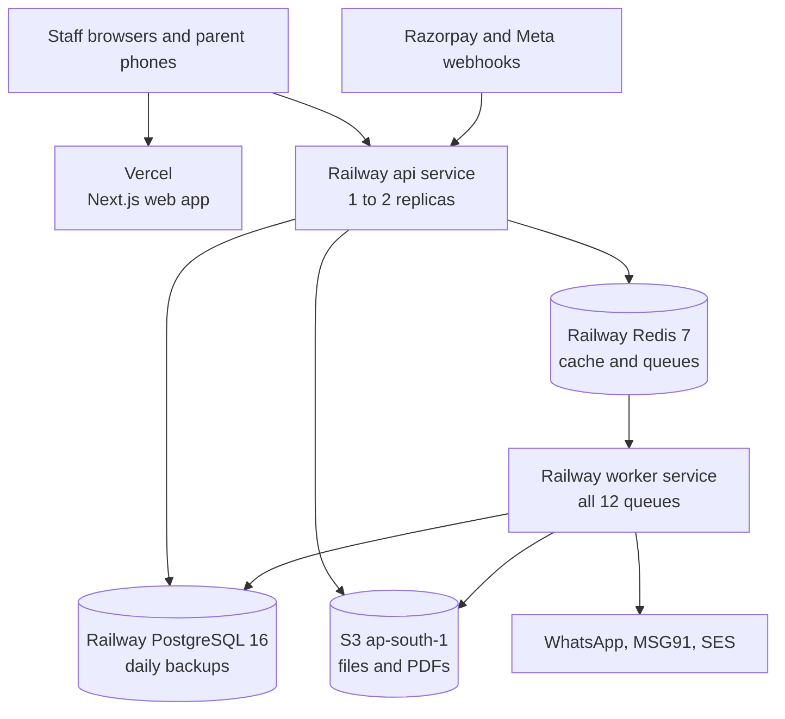
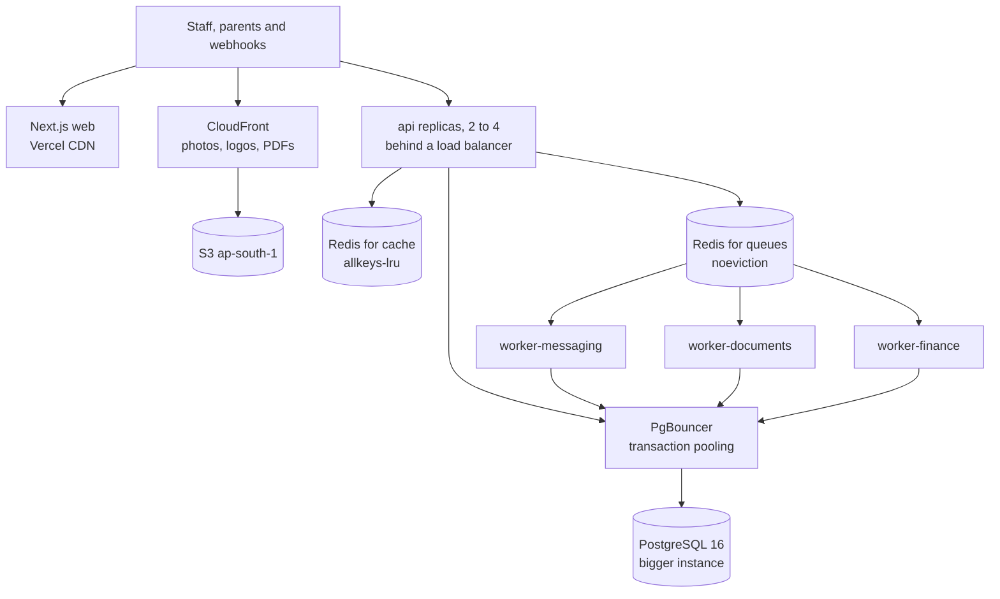
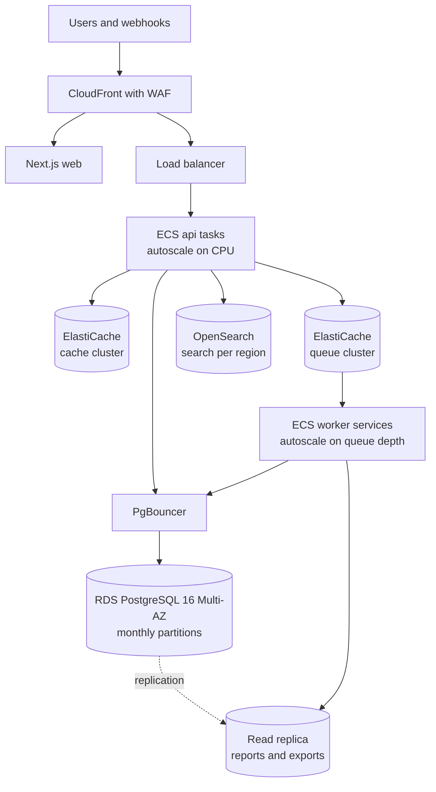
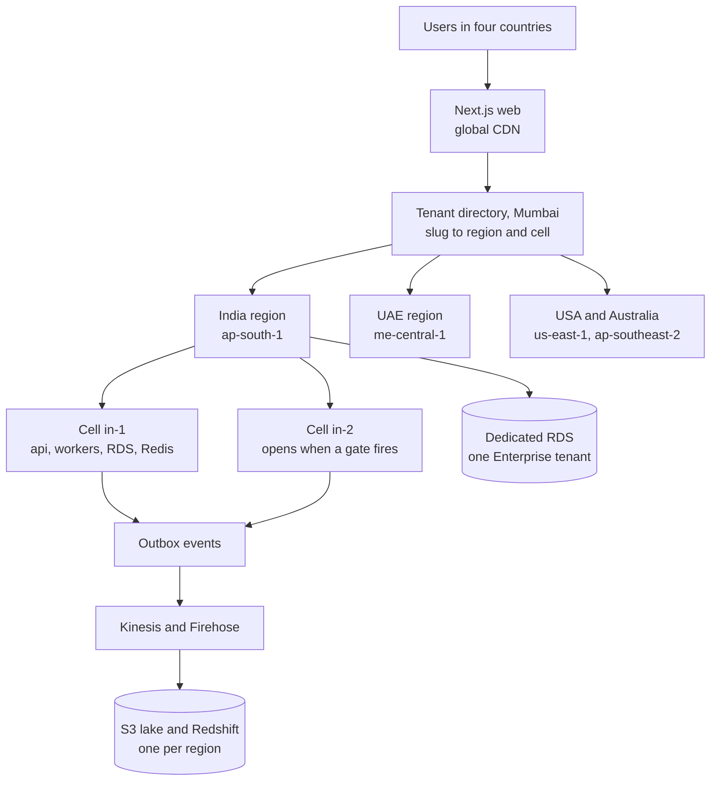

# Scaling Overview and Architecture Evolution

**In simple words:** This chapter is the map for growing EduFlow from the first customer to 10,000. It turns customers into load numbers, shows the architecture at each of the four stages, and names the metric that tells you to move to the next stage. It also shows the cost per customer and the parts of the system that never change. The four stage chapters that follow give the detailed operating plan for each stage.

## The four stages at a glance

| Stage | Paying customers | When (canon targets) | Team | Hosting | Main job of the architecture |
|---|---|---|---|---|---|
| Stage 1 | 0 to 100 | Oct 2026 to about Aug 2027 | 1 to 4 | Vercel + Railway | Ship fast, never lose data |
| Stage 2 | 100 to 500 | Year 2 (Oct 2027 to Sep 2028) | 4 to 14 | Hardened Railway, then AWS Mumbai | Survive fee day; remove single points of failure |
| Stage 3 | 500 to 1,000+ | Late Year 2 to Year 3 | 14 to 40 | AWS in two data centres | 99.9% uptime, big tables, enterprise security |
| Stage 4 | 1,000 to 10,000 | Year 3 to Year 5 (Sep 2031) | 40 to 220 | AWS in four regions, cells | Data residency, certifications, a data platform |

A stage is named by paying customers, but the architecture moves when a metric says so. Institutes differ a lot in size. One Pro school with 1,000 students loads the system like 20 small coaching centres. So this chapter counts students, requests and rows, not logos.

> **Founder note:** Startups rarely die from too much load; they die from too few customers. An hour spent on Stage 3 architecture during Stage 1 is an hour not spent selling. Every next step is written down here, with the number that triggers it.

## Principles

### Do not over-engineer early

Build for the next stage, not the last one. Each part should carry 3 times today's measured peak. When the measured peak passes half of the tested capacity, start the next upgrade. That gives you weeks of warning, not hours.

- At 100 customers the real peak is about 86 requests per second (the load model below adds headroom on top). Two API replicas at 150 each give 300: 3.5 times the real peak.
- No Kubernetes, no microservices, no Kafka in Stages 1 to 3. Each adds a system that someone must watch at night.
- A managed service beats a self-run one until the bill is clearly larger than an engineer's salary.

### Measure, then scale the bottleneck

A bottleneck is the one part that limits everything else. Money spent on any other part is wasted. First find it with numbers: p95 latency (the time 95 out of 100 requests stay under), CPU, database connections, queue age and slow queries. Then pull the cheapest lever that fixes it. The full lever order is in *System Architecture* in the PRD.

> **Example:** On 5 November at 9:40 am the Collect Fee screen at Sharma Classes takes 1.8 s. API CPU is 35%, database CPU is 90%, and another tenant's defaulters report is scanning `fee_invoices` without a usable index. More API replicas would change nothing. The fix is an index plus moving that report to the night queue.

### Keep the monolith modular

EduFlow is one codebase and one Docker image, split into modules with hard walls. Modules talk through service functions, events and queues, never through each other's tables. Extract a separate service only when the module needs a different scaling profile and a team of its own will own it. The first candidates, at Stage 4, are the message sender, PDF rendering and AI Insights, still in the same repository.

### Keep tenants apart at every stage

A tenant is one customer organization. Every new component must carry `organization_id` from the day it arrives. A cross-tenant leak is a SEV1 incident at every stage (see *Monitoring, Backups and Incident Response*).

| Component | How the tenant travels | Arrives | Check |
|---|---|---|---|
| PostgreSQL rows | `organization_id` column, Prisma extension, RLS | Stage 1 | Isolation suite (P-06) on every pull request |
| Cache keys | Prefix `org:{orgId}:` from one key builder | Stage 1 | No raw Redis keys in code review |
| Queue jobs | `organizationId` in job data; job fails without it | Stage 1 | Test TI-16 |
| Files | S3 key `org/{orgId}/...` | Stage 1 | Download of tenant A as tenant B gives 404 |
| Logs | `orgId` field in every log line | Stage 1 | Log search by organization |
| Read replica | Same tenant extension on the replica client | Stage 3 | Isolation suite runs against both clients |
| Search index | `organization_id` field, filter added by the server | Stage 3 | Search isolation test |
| Events and warehouse | `organization_id` on every event and row | Stage 4 | Row filter per tenant in the warehouse |
| Cells and dedicated databases | Tenant directory maps tenant to cell; RLS stays | Stage 4 | Cross-cell smoke test after every move |

> **Rule:** A new component goes live only after the tenant isolation suite has a test for it.

### Scale along the calendar

Load in education is predictable. Peaks come from 8:30 to 10:00 am on working days, from the 1st to the 10th of each month (fee due dates), on result days and in the April admission season. Big moves happen on a Sunday night after the 15th, outside the freeze windows named in the gates section below.

## Load model

The load model turns "customers" into numbers a server understands. Every input is an assumption. Replace each one with a measured value as soon as production gives you one.

### Assumptions

| Input | Value | Source or reason |
|---|---|---|
| Active students per paying customer | 500 | Assumption: 425 in the paying institute plus the free-tier tail; 120 paying x 500 = the canon 60,000 students |
| Parent users | 70% of students | Canon Year-1 parent adoption target |
| Staff users | 1 per 20 students | Assumption, as in *System Architecture* |
| Batch size | 30 students | Assumption |
| Working days | 220 a year | Assumption: Indian academic calendar |
| Attendance records | 1 per student per working day | Assumption; two sessions a day in coaching doubles it |
| Fee invoices | 1 per student per month | Assumption: safe upper bound; quarterly billing makes fewer |
| Payments | 0.9 per invoice, 40% online | Assumption; 40% is the canon online share target |
| Messages | 15 per student per month, 60% on WhatsApp | 15 from *System Architecture*; 60% is an Estimate |
| Absent on a working day | 8% | Assumption |
| Headroom on peaks | x 1.6 | Assumption: covers bursts and a bad day |
| Database growth | 0.33 GB per 1,000 students a year | PRD Year-1 estimate: 20 GB for 60,000 students |
| S3 growth | 4 MB per student a year | 3 MB of documents and photos, plus 10 PDFs of 100 KB |
| API capacity | 150 simple requests per second per vCPU | Assumption; replace with your Week 8 load-test result |

RPS means requests per second. A vCPU is one virtual processor core. The two peak formulas, per 1,000 students:

```text
Attendance peak, 9:00 to 10:00 am, per 1,000 students
  marking      33 batches x 8 calls x burst 3 / 1,800 s     = 0.44 rps
  alert opens  1,000 x 8% absent x 50% open x 6 / 900 s     = 0.27 rps
  staff pages  50 staff x 40% screens open / 60 s refresh   = 0.33 rps
  total        1.04 rps x headroom 1.6                      = 1.67 rps

Fee-day extra, reminders sent at 9:00 am, per 1,000 students
  clicks       1,000 x 60% reminded x 10% click x 6 / 900   = 0.40 rps
  payments     900 x 15% on the day x 30% in the hour
               x 25 calls / 3,600 s                         = 0.28 rps
  fee-day peak 1.67 + (0.68 x 1.6)                          = 2.76 rps
```

### Load by stage

One lakh is 100,000. One crore is 10 million. At 10,000 customers the India region carries about 85% of the load, because 1,500 customers are international.

| Quantity | Formula | 100 | 500 | 1,000 | 10,000 |
|---|---|---|---|---|---|
| Active students | paying x 500 | 50,000 | 2.5 lakh | 5 lakh | 50 lakh |
| Parent users | students x 70% | 35,000 | 1.75 lakh | 3.5 lakh | 35 lakh |
| Staff users | students / 20 | 2,500 | 12,500 | 25,000 | 2.5 lakh |
| Attendance records a day | students x 1 | 50,000 | 2.5 lakh | 5 lakh | 50 lakh |
| Attendance rows a year | a day x 220 | 1.1 crore | 5.5 crore | 11 crore | 110 crore |
| Fee invoices a month | students x 1 | 50,000 | 2.5 lakh | 5 lakh | 50 lakh |
| Payments a month (online) | invoices x 0.9 (x 40%) | 45,000 (18,000) | 2.25 lakh (90,000) | 4.5 lakh (1.8 lakh) | 45 lakh (18 lakh) |
| Messages a month, all channels | students x 15 | 7.5 lakh | 37.5 lakh | 75 lakh | 7.5 crore |
| WhatsApp messages a month | messages x 60% | 4.5 lakh | 22.5 lakh | 45 lakh | 4.5 crore |
| Absence alerts, 9 to 10 am | students x 8% | 4,000 | 20,000 | 40,000 | 4 lakh |
| Time to send them at 40 a second | alerts / 40 | 2 min | 8 min | 17 min | 2.8 hours |
| Attendance peak (rps) | students / 1,000 x 1.67 | 84 | 418 | 836 | 8,356 |
| Fee-day peak (rps) | students / 1,000 x 2.76 | 138 | 690 | 1,381 | 13,806 |
| API vCPUs at fee-day peak | peak / 150 | 1 | 5 | 10 | 93 |
| Database growth a year | students / 1,000 x 0.33 GB | 17 GB | 83 GB | 165 GB | 1.65 TB |
| S3 growth a year | students x 4 MB | 200 GB | 1 TB | 2 TB | 20 TB |

### What the numbers tell you

- **The API is not the first problem.** Stateless API containers scale by adding copies. Even 93 vCPUs at the busiest hour of the year is an ordinary cloud bill.
- **Messaging breaks first.** With one global limit of 40 WhatsApp sends a second, 40,000 absence alerts take 17 minutes at 1,000 customers. The target is under 10 minutes (Assumption). That forces per-sender limits in Stage 3.
- **Three tables grow fastest:** `attendance_records`, `message_logs` and `audit_logs`. Attendance passes 10 crore rows, the partition trigger in *System Architecture*, during Stage 3.
- **The cheapest lever is free.** The fee-day peak is 65% above the attendance peak only because reminders go out at 9:00 am. Send them from 11:30 am, spread by organization, and the fee-day peak falls back to the attendance peak.
- **Growth, not size, sets the database bill.** Messages are 6.5 of the 20 GB in the Year-1 estimate. Moving `message_logs` older than 13 months to S3 removes about a third of the yearly growth.

### Recompute it yourself

Keep the model in the repository and run it at every monthly capacity review.

```typescript
// scripts/capacity/load-model.ts
// Run from the repo root: node scripts/capacity/load-model.ts
// (Node 24 strips the TypeScript types itself; no build step needed.)
// Change an input, run again, compare with what production measures.

const stages = [100, 500, 1000, 10000]; // paying customers

const a = {
  studentsPerPaying: 500, // 425 in the paying institute + free-tier tail
  parentAdoption: 0.7,
  studentsPerStaff: 20,
  studentsPerBatch: 30,
  workingDays: 220,
  invoicesPerStudentMonth: 1,
  paymentsPerInvoice: 0.9,
  onlineShare: 0.4,
  messagesPerStudentMonth: 15, // all channels
  whatsappShare: 0.6,
  absentShare: 0.08,
  headroom: 1.6,
  dbGbPer1000StudentsYear: 0.33,
  s3MbPerStudentYear: 4,
  rpsPerVcpu: 150, // replace with your own load-test result
  alertSendsPerSecond: 40, // one global WhatsApp limit
};

// Peak requests per second for every 1,000 students.
const k = 1000;
const marking = ((k / a.studentsPerBatch) * 8 * 3) / 1800;
const alertOpens = (k * a.absentShare * 0.5 * 6) / 900;
const staffPages = ((k / a.studentsPerStaff) * 0.4) / 60;
const reminderClicks = (k * a.invoicesPerStudentMonth * 0.6 * 0.1 * 6) / 900;
const payFlows =
  (k * a.invoicesPerStudentMonth * a.paymentsPerInvoice * 0.15 * 0.3 * 25) / 3600;
const attendancePeak = (marking + alertOpens + staffPages) * a.headroom;
const feeDayPeak = attendancePeak + (reminderClicks + payFlows) * a.headroom;

const inr = new Intl.NumberFormat('en-IN', { maximumFractionDigits: 0 });
const rows: Record<string, string>[] = [];

for (const paying of stages) {
  const s = paying * a.studentsPerPaying;
  const payments = s * a.invoicesPerStudentMonth * a.paymentsPerInvoice;
  const messages = s * a.messagesPerStudentMonth;
  const alerts = s * a.absentShare;
  const feeRps = (s / k) * feeDayPeak;
  rows.push({
    payingCustomers: inr.format(paying),
    students: inr.format(s),
    parentUsers: inr.format(s * a.parentAdoption),
    staffUsers: inr.format(s / a.studentsPerStaff),
    attendancePerYear: inr.format(s * a.workingDays),
    invoicesPerMonth: inr.format(s * a.invoicesPerStudentMonth),
    paymentsPerMonth: inr.format(payments),
    onlinePerMonth: inr.format(payments * a.onlineShare),
    messagesPerMonth: inr.format(messages),
    whatsappPerMonth: inr.format(messages * a.whatsappShare),
    alertMinutes: (alerts / a.alertSendsPerSecond / 60).toFixed(1),
    attendanceRps: inr.format((s / k) * attendancePeak),
    feeDayRps: inr.format(feeRps),
    apiVcpu: String(Math.ceil(feeRps / a.rpsPerVcpu)),
    dbGrowthGbYear: inr.format((s / k) * a.dbGbPer1000StudentsYear),
    s3GrowthGbYear: inr.format((s * a.s3MbPerStudentYear) / 1000),
  });
}

console.log(`Per 1,000 students: attendance ${attendancePeak.toFixed(2)} rps,`
  + ` fee day ${feeDayPeak.toFixed(2)} rps`);
for (const key of Object.keys(rows[0] ?? {})) {
  const cells = rows.map((r) => (r[key] ?? '').padStart(16)).join('');
  console.log(key.padEnd(18) + cells);
}
```

With these inputs the first output line reads `attendance 1.67 rps, fee day 2.76 rps`. Each quarter, replace inputs with real numbers: students per customer from `students`, messages from `message_logs`, requests per vCPU from your load test.

## Architecture at each stage

The four diagrams show the same product at four sizes. Each stage keeps everything from the stage before and adds only what its load needs. Setup steps live in *Deploy on Vercel and Railway* and *Deploy on AWS*; the operating plan for each stage lives in its stage chapter.

### Stage 1: one of everything

**Figure: Stage 1 architecture, 0 to 100 customers**



One API service, one worker, one database, one Redis and one bucket; the API and the worker run from the same Docker image. At 100 customers this carries the design peak of 138 requests per second and 17 GB of new data a year. The weak point is a database without a standby copy, so backups and a tested restore are the safety net.

Do these five things inside Stage 1, because they make Stage 2 cheap:

1. Move rate-limit counters, OTP attempts and caches to Redis before adding a second API replica; in memory, two replicas double every limit.
2. Put `connection_limit` in every `DATABASE_URL`.
3. Give every job a fixed job ID and a handler that is safe to run twice.
4. Restore last night's backup into a scratch database monthly, and time it.
5. Schedule fee reminders from 11:30 am, spread by organization.

### Stage 2: replicas and split workers

**Figure: Stage 2 architecture, 100 to 500 customers**



Every box except the database now has a second copy; the database gets its standby with the AWS move later in this stage. The changes:

- **API replicas.** Two to four copies behind the host's load balancer. A new copy gets traffic only after the ready check (CMN-API-29) passes.
- **Workers split by queue group.** Three services from the same image. Messaging runs `notifications`, `whatsapp`, `sms`, `email` and `reminders`. Documents runs `pdf`, `imports`, `exports`, `snapshots` and `ai`. Finance runs `invoices` and `webhooks`. A 50,000-row import can no longer delay a Razorpay webhook.
- **Two Redis instances.** The cache may evict old keys (`allkeys-lru`). The queue store must never evict (`noeviction`), or BullMQ loses jobs silently.
- **Connection pooling.** PgBouncer (a pooler that shares a few database connections among many clients) runs in transaction mode. The tenant setting is transaction-local, so this is safe.
- **CDN.** A CDN (content delivery network: servers near the user that keep copies of files) serves photos, logos and generated PDFs through signed URLs. The web app already sits on Vercel's CDN.
- **Managed backups.** The host's scheduled backups, plus a nightly dump to a separate S3 bucket and a monthly restore test. PITR (point-in-time recovery: restore the database to any minute) arrives with RDS.
- **Staging parity.** Staging has the same services, versions, variable names and queue groups, only smaller. It holds demo data (P-58), never real student data. Every migration runs on staging first.

Stage 2 starts on Railway. The move to AWS Mumbai happens inside Stage 2, when a trigger in *Deploy on AWS* fires; the plan expects it from 300 to 500 organizations, free ones included, with P-57 rehearsed in September 2027. The diagram has the same shape on both hosts.

### Stage 3: redundant and partitioned

**Figure: Stage 3 architecture on AWS, 500 to 1,000+ customers**



Stage 3 makes each part survive the loss of a data centre and keeps big tables fast. If the AWS move already happened in Stage 2, Multi-AZ, the WAF and ECS arrived with it; Stage 3 then adds the replica, partitions, search and per-sender limits.

- **Multi-AZ RDS.** An AZ (availability zone) is a separate data centre in the same region. A standby copy waits in the second AZ and takes over in about 1 to 2 minutes.
- **Reporting from the replica.** A read replica is a read-only copy of the database. Reports, exports and Analytics use a second Prisma client on `DATABASE_REPLICA_URL` with the same tenant extension. The fee counter never waits for a report again.
- **Autoscaling.** ECS adds API tasks on CPU and worker tasks on waiting jobs, and removes them after the peak.
- **Queue separation.** Cache and queues sit on separate clusters. WhatsApp sends get a limit per sending number, so one big school's alerts cannot hold back everyone else's (the noisy-neighbour problem).
- **Partitioning.** A partitioned table is one table stored as many smaller monthly pieces. `attendance_records` splits by `date`; `message_logs` and `audit_logs` split by `created_at`. PostgreSQL needs the partition column inside the primary key, so the key becomes `id` plus the date column. This needs a custom SQL migration; the steps are in *Stage 3: Growing to 1,000 Customers*.
- **Search service.** Amazon OpenSearch Service inside the private network, when search p95 stays above 500 ms after index tuning. It is managed and stays in Mumbai; the search API contract does not change.
- **WAF.** A WAF (web application firewall) with managed rule sets and per-IP rate rules blocks common attacks before they reach the API.

### Stage 4: regions, cells and a data platform

**Figure: Stage 4 architecture, 1,000 to 10,000 customers**



A cell is a full copy of the Stage 3 stack (API, workers, database, Redis) that serves a fixed list of tenants. The tenant directory, a small platform table in Mumbai, maps each slug to a region and a cell; it holds no personal data and its answers are cached for 5 minutes. Region routing and API hosts are in *Deploy on AWS*.

- **Database per region first.** Each region runs one primary database. `Organization.dataRegion` names the tenant's home region.
- **Sharding only on a gate.** Sharding means splitting tenants across several databases. A second India cell opens only when the India primary hits the Stage 3 to 4 database gate below on its largest planned size; the model suggests between 5,000 and 10,000 customers (Estimate).
- **Dedicated databases for Enterprise.** A dedicated database is a cell with one tenant, running the same code and schema. It opens when a contract or regulator demands it, or when one tenant causes more than 20% of cluster load. The move steps are in *Multi-Tenancy and Data Isolation*.
- **Event streaming.** Each change writes an event into an outbox table in the same transaction (Assumption: a new table added to the schema docs at Stage 4). A relay sends the events to Amazon Kinesis Data Streams, and Amazon Data Firehose stores them in S3 as Parquet files. Amazon Redshift Serverless reads them as the data warehouse (a database built for large reports) for Analytics and AI Insights. Kinesis is chosen over Kafka because there are no brokers to run. Only aggregated, anonymous numbers leave a region.
- **SRE practices.** SRE (site reliability engineering) means running production with engineering methods. Every region gets SLOs (service level objectives): 99.9% uptime, and 99.95% for Enterprise contracts (Assumption). An error budget is the downtime an SLO allows, about 43 minutes a month at 99.9%; when it is spent, feature releases pause. Add a six-person on-call rotation, a runbook per alert, blameless reviews and a quarterly game day (a planned failure drill).
- **Certifications.** SOC 2 Type II for US buyers and ISO 27001 for UAE, Australian and Indian enterprise buyers. Readiness starts in Stage 3 with written policies, access reviews and evidence collection; the audits run in Stage 4.

> **Note:** The first regional cell opens before Stage 4. The canon puts the UAE entry in Year 2, so a small UAE stack in `me-central-1` goes live with the first UAE school, and the tenant directory is born with it. Stage 4 turns regions and cells into routine work.

## Evolution table

| Component | Stage 1 | Stage 2 | Stage 3 | Stage 4 |
|---|---|---|---|---|
| Hosting | Vercel + Railway, 1 to 2 API replicas | 2 to 4 replicas; AWS Mumbai when a trigger fires | ECS Fargate in 2 AZs, autoscaling | Regional stacks; cells inside India |
| Database | One PostgreSQL 16, daily backups | Bigger instance, PgBouncer, nightly dump to S3 | RDS Multi-AZ, read replica, monthly partitions | Database per region, extra cells, Enterprise databases |
| Cache | Shares Redis with queues; TTL on every key | Own Redis, `allkeys-lru` | ElastiCache cluster with replica | Per-cell clusters, per-tenant hot-key limits |
| Queues | One worker, all 12 queues | Three worker services | Own cluster; per-sender WhatsApp limits | Per-cell queues; outbox to Kinesis |
| Files | S3 `ap-south-1`, pre-signed URLs | CloudFront, lifecycle rules | Intelligent-Tiering; copy in `ap-south-2` | One bucket per region |
| Search | PostgreSQL full-text and trigram | Same, tuned indexes | OpenSearch when p95 passes 500 ms | One search domain per region |
| Analytics | `daily_metric_snapshots` at night | Heavy reports on the night queue | Reports and Analytics on the replica | S3 lake and Redshift; AI Insights reads it |
| Observability | Sentry, Better Stack or Grafana Cloud, PostHog | Slow-query log, queue dashboard, first SLOs | CloudWatch alarms, tracing, error budgets | SRE team, per-region SLOs, game days |
| Security | HTTPS, RLS, bcrypt, audit log | Admin 2FA, dependency alerts, first pen test | WAF, private subnets, Secrets Manager | SOC 2 Type II, ISO 27001, SSO |
| CI/CD | GitHub Actions, one image, migrate then deploy | Staging parity, weekly release train | OIDC deploys, Terraform, rolling updates | Per-region pipelines, canary releases |
| Support tooling | Helpdesk, WhatsApp number, status page | Help centre, Super Admin console | Tiered support, SLA timers | Account managers, regional support hours |

A pen test (penetration test) is a paid, controlled attack by outside experts. A canary release sends a new version to a small share of traffic first and widens only if errors stay flat.

## Migration triggers and metric gates

Move to the next stage when the business signal is close and one technical gate has held on peak days for two weeks. Move at once when a hard trigger fires: a contract or a law demands the change. Never move on customer count alone. The hard triggers for the AWS move are listed in *Deploy on AWS*.

| Gate | Stage 1 to 2 | Stage 2 to 3 | Stage 3 to 4 |
|---|---|---|---|
| Business signal | 100 paying or ₹5 lakh MRR | 500 paying or ₹30 lakh MRR | 1,000 paying; USA or Australia pilots signed |
| Load | API CPU above 70% at 9 to 10 am, or p95 above 500 ms | 4 API replicas above 60% CPU at peak | Analytics queries on the replica take over 5 minutes |
| Database | Connections above 60% of the limit | CPU above 60% at peak after query fixes | Largest planned instance above 60% CPU, or storage above 4 TB |
| Data size | Restore takes over 1 hour | Any table above 5 crore rows | Yearly growth above 1 TB |
| Queues | Any queue waits over 2 min at peak | Absence alerts take over 10 min | Events above 1,000 a second at peak |
| Customers ask for | First uptime clause in a contract | Multi-AZ, WAF and PITR in questionnaires | Dedicated database, SOC 2 report, local data |
| Proof before moving | Restore drill under 1 hour; load test at 2x peak | Staging built by Terraform; PITR drill; rollback rehearsed | Tenant move tested on a copy; 3 months of error budgets |

MRR means monthly recurring revenue. Read p95 from Sentry, CPU from the host, queue waits from the queue dashboard and the database numbers from the script below.

> **Warning:** The freeze windows apply to every move: no big change from 1 January to 30 April or from the 1st to the 10th of a month. A gate that fires in February gets a quick lever (bigger instance, more replicas) and the real move in May.

### Monthly gate check

On the first Monday of each month, spend 30 minutes: run this script at a quiet hour, rerun the load model with real inputs, and write both results into the capacity sheet next to the gate table.

```sql
-- scripts/capacity/gate-check.sql
-- Run at a quiet hour: psql "$DATABASE_URL" -f scripts/capacity/gate-check.sql
-- Platform context, so the RLS policies let this session read all tenants.
SELECT set_config('app.platform_bypass', 'on', false);

-- 1. Database size
SELECT pg_size_pretty(pg_database_size(current_database())) AS database_size;

-- 2. Ten biggest tables (row counts are estimates)
SELECT relname AS table_name,
       n_live_tup AS approx_rows,
       pg_size_pretty(pg_total_relation_size(relid)) AS total_size
FROM pg_stat_user_tables
ORDER BY pg_total_relation_size(relid) DESC
LIMIT 10;

-- 3. Connections in use against the limit
SELECT count(*) AS in_use,
       current_setting('max_connections')::int AS max_allowed
FROM pg_stat_activity;

-- 4. Cache hit ratio: keep it above 0.99
SELECT round(sum(heap_blks_hit)::numeric
       / nullif(sum(heap_blks_hit) + sum(heap_blks_read), 0), 4) AS hit_ratio
FROM pg_statio_user_tables;

-- 5. Ten most expensive statements (needs the pg_stat_statements extension)
SELECT left(query, 80) AS query, calls,
       round(mean_exec_time::numeric, 1) AS mean_ms
FROM pg_stat_statements
ORDER BY total_exec_time DESC
LIMIT 10;

-- 6. Biggest tenants: noisy-neighbour and dedicated-database candidates
SELECT o.slug, count(*) AS active_students
FROM students s
JOIN organizations o ON o.id = s.organization_id
WHERE s.status = 'ACTIVE' AND s.deleted_at IS NULL
GROUP BY o.slug
ORDER BY active_students DESC
LIMIT 10;

-- 7. Messages per month, all channels (an input for the load model)
SELECT date_trunc('month', created_at) AS month, count(*) AS messages
FROM message_logs
WHERE created_at >= now() - interval '3 months'
GROUP BY 1
ORDER BY 1;
```

The bypass lasts for the whole session, so close it when done. Query 5 fails until `pg_stat_statements` is enabled; enable it in Stage 1, because slow-query review depends on it.

## Cost per customer by stage

All figures are estimates in ₹ per paying customer per month. Hosting uses the planning figures in *Business Model*: ₹28,000 ÷ 120, ₹90,000 ÷ 500, ₹1.7 lakh ÷ 1,000 and ₹12 lakh ÷ 10,000. Free tenants are inside the hosting bill.

| Cost line | 100 | 500 | 1,000 | 10,000 |
|---|---|---|---|---|
| Hosting | 233 | 180 | 170 | 120 |
| Support people and tools (one person per about 250 customers) | 208 | 180 | 200 | 220 |
| Gateway fees on our billing (ARPA x 1.18 x 1.5%) | 89 | 106 | 133 | 168 |
| AI compute | 25 | 40 | 60 | 150 |
| Software cost to serve | 555 | 506 | 563 | 658 |
| ARPA from the canon | 5,000 | 6,000 | 7,500 | 9,500 |
| Software gross margin (1 - cost / ARPA) | 88.9% | 91.6% | 92.5% | 93.1% |

ARPA means average revenue per account per month. What to read from this table:

- **Support costs more than servers after Stage 1.** Better import tools, clear error messages and a good help centre save more than any database tuning.
- **Cost per customer jumps at each stage entry.** Multi-AZ, the replica and recovery copies arrive before the customers who fill them; the bottom-up estimate in *Deploy on AWS* rises from ₹150 at 500 to ₹170 at 1,000. Plan cash for the step.
- **Messages are left out.** WhatsApp and SMS resale carries a thin margin, so reported gross margin is lower: 83.8% in the September 2027 picture of *Business Model*, against the canon target of 80% or more. SOC 2 and ISO audits (Estimate: US$25,000 to 50,000 in the first year) are operating costs.

## What stays the same

| Thing | Stays the same at every stage | Why it matters |
|---|---|---|
| Codebase shape | One monorepo with `client/`, `server/`, `shared/`; one image for api and every worker | Each stage is a hosting change, not a rewrite |
| API contract | `/api/v1`, response envelopes, error codes, endpoint IDs | Web, parent portal, apps and partners never break |
| Tenant model | `organization_id` on every row, `orgId` from the JWT, Prisma extension plus RLS | One filter lifts a tenant into a cell or its own database |
| Schema conventions | UUID keys, per-tenant unique keys, `Decimal` money, UTC times | Tenant copies never collide on IDs |
| Job contracts | Queue names, fixed job IDs, `organizationId` in every job | Queues move between worker services without code changes |
| Configuration names | `DATABASE_URL`, `REDIS_URL`, `QUEUE_PREFIX` and the rest | The same image runs on Railway, ECS and every region |

The one planned schema change is the composite primary key on the three partitioned tables in Stage 3. It changes their Prisma models and repository lookups, but no API contract.

> **Rule:** If a scaling change needs a change to anything in this table, stop and write a one-page decision record first: the problem, the options, the choice and how to roll it back.

## Key takeaways

- Four stages, one product: each stage adds only what its measured load needs, and the codebase, API contract and tenant model never change.
- Count students, requests and rows, not customers. At 10,000 customers expect about 50 lakh students, a fee-day peak near 14,000 requests a second and 1.65 TB of new data a year (Estimate).
- Messaging and big tables break before the API does: plan per-sender WhatsApp limits and monthly partitions for Stage 3, and send fee reminders after the morning peak today.
- Move a stage when a business signal and one technical gate agree for two weeks, or when a contract or law demands it, and never inside the freeze windows.
- Every new component carries `organization_id` and gets an isolation test before it goes live.
- Software gross margin stays near 90% at every stage (Estimate); support, not servers, is the largest cost to watch.
