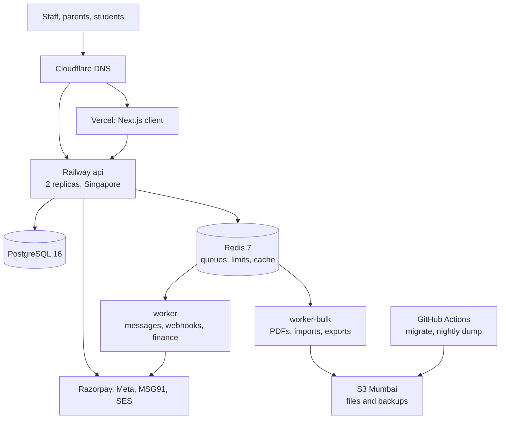

# Stage 1: The First 100 Customers

**In simple words:** This chapter is your operating guide from the first paying institute to about 100: October 2026 to about August 2027 in the plan, with one to four people on Vercel and Railway. It shows the load to expect, what to upgrade and when, what will break, whom to add, what it costs and when you are ready for the next stage. The rule of this stage: keep the setup boring, measure everything, and spend your hours on customers.

## What this stage looks like

The plan reaches 103 paying organizations in August 2027 (BRD *Financial Plan and Projections*). The rows below are the 100-customer column of the load model in *Scaling Overview and Architecture Evolution*, which holds all four stages. Every row is an estimate.

| Quantity | Formula (assumption) | At 100 paying |
|---|---|---|
| Paying organizations | 60 Growth + 33 Pro + 7 Enterprise (BRD plan mix) | 100 |
| Free Starter organizations | On the path to 300 at Year-1 end | About 250 |
| Active students | 60 × 180 + 33 × 600 + 7 × 1,600 + 250 × 34 | About 50,000 |
| Staff users | Students ÷ 20 | 2,500 |
| Parent users | Students × 70% portal adoption | 35,000 |
| Batches and sections | Students ÷ 30 | About 1,700 |
| Attendance rows | 50,000 × 220 working days | 11 million a year |
| Message log rows, all channels | 50,000 × 15 a month | 7.5 lakh a month |
| Attendance peak, 8:30 to 10:00 | Students / 1,000 x 1.67 (Scaling Overview model) | 84 requests/s |
| Fee-day design peak | Students / 1,000 x 2.76 (reminders at 9 am) | 138 requests/s |
| Database size | 20 GB × 50/60 | About 17 GB |
| S3 storage | 240 GB × 50/60 | About 200 GB |
| Database connections | (2 API × 10) + (2 workers × 5) + 5 | 35 of 100 |

> **Note:** Peaks size the system, not averages: 8:30 to 10:00 am on working days, the 1st to 10th of each month, result days, and 1 to 14 April (new session).

## Goals and exit criteria

The goals: 100 paying organizations with monthly logo churn (the share of paying customers who leave in a month) under 3%; 60% activation within 7 days; zero cross-tenant data exposure; uptime of 99.9% as the goal, never under 99.5%; gross margin of 80% or more. You leave Stage 1 when every gate below holds. Readiness decides, not the calendar.

| Gate | Pass when |
|---|---|
| Customers | 100 or more paying for 2 months in a row |
| Retention | Logo churn under 3% for 3 months |
| Activation | 60% or more of new organizations activate within 7 days |
| Reliability | Uptime 99.5% or more for 3 months; 99.9% in 2 of them |
| Speed | API p95 (95 of 100 requests are faster) under 500 ms on last month's fee days |
| Recovery | Restore drill passed 3 months in a row, minutes written down |
| Security | No open high finding; no SEV1 (top-severity) data incident ever |
| Money | Gross margin 80% or more for 2 months |
| People | Hire 1 onboards alone; runbooks cover the top 10 tasks |
| Next step | Stage 2 triggers on the dashboard; AWS rehearsal done on staging |

## Architecture at this stage

**Figure: EduFlow at 100 customers**



Still one codebase and one database; only the API is public. You start with one worker and split it in two on the trigger in upgrade 5. Both run the same image with different queue groups, so an import or a report-card run never delays a payment webhook. Lines from the workers and GitHub Actions to PostgreSQL are left out for readability.

| Component | Stage 1 choice | Size at 100 customers (estimate) | Next step when |
|---|---|---|---|
| Hosting | Vercel Pro (client, `sin1`); Railway Singapore (the rest) | Production plus staging | Stage 2 triggers |
| API | Docker image on Railway | 2 replicas, about 1 vCPU and 1 GB each | CPU over 70% for 10 min at peak |
| Workers | `worker` and `worker-bulk` | About 0.5 vCPU and 1 GB each | Queue age over 2 min at peak |
| Database | One Railway PostgreSQL 16 on a volume | 17 GB data, 50 GB volume, about 2 vCPU and 4 GB | CPU over 60% at peak for a week |
| Redis | Railway Redis 7, append-only file, `noeviction` | Under 1 GB used | Memory over 70% |
| Files | S3 `ap-south-1`, private, versioned | About 200 GB | Lifecycle to cheaper class after 2 years |
| CDN (servers near users) | Vercel edge for client files; pre-signed S3 links | No CloudFront | Stage 2 or 3 |
| Search | PostgreSQL `pg_trgm` indexes from the schema | No search service | Stage 3 |
| Observability | Sentry, Better Stack, PostHog, Railway metrics, `ops-watch` | 2 phone licences | Stays |
| Backups | Railway schedules plus nightly `pg_dump` to S3 | RPO 24 h, RTO 2 h | Point-in-time recovery on AWS |

RPO is the data you may lose; RTO is the time until EduFlow works again. Setup is in *Deploy on Vercel and Railway* and *Monitoring, Backups and Incident Response*.

### Upgrades during this stage

Do them in this order. Each has a trigger; do not pull one early.

| Order | Upgrade | Trigger | Effort | Risk |
|---|---|---|---|---|
| 1 | Verify role timeouts; add `lock_timeout` to the owner role | Before the first paid invoice | 1 hour | Low |
| 2 | Rate limits, OTP counters and caches in Redis; API to 2 replicas | 50 paying, or before the first fee peak | 1 day | Low |
| 3 | Slow-query log and a weekly top-10 review | 20 paying | 2 hours, then 30 min a week | Low |
| 4 | Move reminders to 11:30 am, spread over 30 minutes | Before the 1 February 2027 fee cycle | Half a day | Low |
| 5 | Split `worker-bulk` from `worker` | Queue age over 2 min, or the first 5,000-row import | Half a day | Low |
| 6 | Move large Pro tenants to their own WhatsApp numbers | Shared sender near its daily tier, or quality turns yellow | 1 hour per tenant | Medium |
| 7 | Staging with real-size demo tenants (P-58) | Before V1.0 on 1 Feb 2027 | 1 day | Low |
| 8 | Raise database limits and grow the volume | CPU over 70% after query fixes, or disk over 70% | Minutes, short restart | Medium |
| 9 | AWS rehearsal on staging only (P-57) | September 2027 | 1 week | None for production |

Upgrade 1 checks the role settings from the PRD chapter *Multi-Tenancy and Data Isolation* and stops migrations from waiting on locks:

```sql
-- As the Railway superuser "postgres", once per environment
SELECT rolname, rolconfig FROM pg_roles WHERE rolname IN ('eduflow', 'eduflow_app');
-- eduflow_app must show statement_timeout=15s, lock_timeout=5s,
-- idle_in_transaction_session_timeout=30s. If not, run the PRD block again.
ALTER ROLE eduflow SET lock_timeout = '5s';   -- migrations fail fast, never block the app
```

Upgrade 4 removes a self-made spike: the 9 am tick queues every institute's reminders in the same second, which is why the fee-day peak sits 65% above the attendance peak. Run the tick at 11:30 am and give each institute a fixed offset in a 30-minute window:

```typescript
// Where the daily reminder tick adds one job per organization
function spreadDelayMs(organizationId: string, windowMs = 30 * 60 * 1000): number {
  let hash = 0;
  for (const ch of organizationId) hash = (hash * 31 + ch.charCodeAt(0)) >>> 0;
  return hash % windowMs; // same institute, same minute, every day
}

// dateKey is the local date, for example "2027-02-01"
await queues.reminders.add(
  'fee-reminder',
  { organizationId },
  { delay: spreadDelayMs(organizationId), jobId: `fee-reminder-${organizationId}-${dateKey}` },
);
```

For upgrade 5, give this prompt to Claude Code, then add a Railway service `worker-bulk` from the same image with `WORKER_GROUP=bulk` and `connection_limit=5`:

```text
Read docs/canon.md and docs/prd/04-system-architecture.md (Queues).
Add WORKER_GROUP to the Zod env schema: "all" (default), "fast", "bulk".
fast = notifications, whatsapp, sms, email, webhooks, reminders,
       invoices, snapshots. bulk = pdf, imports, exports, ai.
In src/jobs/worker.ts start only the workers of the chosen group.
Keep graceful shutdown for every started worker. No other changes.
Add a unit test for the group selection. Show me the diff first.
```

Not in this stage: PgBouncer, a connection pooler (trigger: connections over 60% of the limit), a read replica (reports slow down counters), partitioning (a table near 100 million rows), a search service and CloudFront. With PgBouncer in transaction mode, the tenant context must be set per transaction with `set_config('app.current_org', ..., true)`, never with a session `SET`.

## Database work

| Task | What you do in Stage 1 | Cadence |
|---|---|---|
| Indexes | Every tenant index starts with `organization_id`; add one only for a top-10 slow query | Weekly |
| Slow-query review | Log statements over 500 ms; read the top 10 with Claude Code and P-53 | Monday, 30 minutes |
| Partitioning | None. 11 million attendance rows a year fit one table with good indexes | Stage 3 |
| Archival | Archive free organizations with no login for 90 days (BRD rule); keep all paying data | Monthly |
| Connection pooling | Prisma pool per process, `connection_limit` in every URL, budget formula | Each new service |
| Replicas | None. Heavy reports run as export jobs and at night | Stage 2 trigger |
| Backups and drills | Full restore drill monthly; one-institute restore drill quarterly | Monthly, quarterly |

Turn on the slow-query log (no restart needed), and check the biggest tables and dead rows each month:

```sql
-- As "postgres": log every statement slower than 500 ms (new sessions pick it up)
ALTER DATABASE eduflow SET log_min_duration_statement = '500ms';

-- Monthly: ten biggest tables and their dead rows
SELECT relname,
       pg_size_pretty(pg_total_relation_size(relid)) AS total_size,
       n_live_tup, n_dead_tup, last_autovacuum
FROM pg_stat_user_tables
ORDER BY pg_total_relation_size(relid) DESC
LIMIT 10;
```

Find the slow statements in Railway's Log Explorer for the Postgres service by searching `duration:`. Also enable `pg_stat_statements`, which ranks queries by total time; the weekly review depends on it. It must be loaded at server start (`shared_preload_libraries`), so follow the current Railway Postgres template docs and restart only after 21:30.

> **Rule:** A new index on a big table is built with `CREATE INDEX CONCURRENTLY`, alone in its own migration file (`npx prisma migrate dev --create-only`, then edit the SQL), because PostgreSQL refuses `CONCURRENTLY` inside a transaction. If `migrate deploy` still refuses it on staging, run the statement by hand as the owner and mark the file applied with `npx prisma migrate resolve --applied <migration-name>`. A failed concurrent build leaves an INVALID index: drop it and retry at night. Add the same `@@index` to the Prisma schema so schema and database never drift.

## Performance and reliability targets

An SLO (service level objective) is a target you measure yourself against. It is internal. The only written promise is the Enterprise SLA of 99.5%.

| SLO | Target | Measured by |
|---|---|---|
| Availability of login, attendance, fees, Parent Portal | 99.9% a month; never under 99.5% | Better Stack uptime |
| API p95 latency | Under 500 ms; under 800 ms on fee days | Better Stack log chart |
| Server errors | Under 0.5% of requests | Better Stack log chart |
| Fast queues (messages, webhooks) | 95% of jobs start within 60 s | `ops-watch` |
| Receipt PDF | Ready within 10 s | `ops-watch` |
| Bulk queues (imports, report cards) | Start within 10 min | `ops-watch` |
| Online payment status | Invoice shows Paid within 2 min for 99% of payments | Webhook log |
| Recovery | RPO 24 hours, RTO 2 hours | Monthly drill |

**The error budget in simple words.** 99.9% of a 30-day month allows 43 minutes of downtime. That is your budget; one bad 20-minute deploy spends half of it. While budget remains, ship features on the weekly train. Once it is spent, the train carries only reliability fixes until the month ends. Under 99.5% (216 minutes), freeze features until the root cause is fixed (*KPI Framework and Dashboard*).

## Security and compliance work

| When | Work | Cost (estimate) |
|---|---|---|
| Before paid launch | Freelance test of tenant isolation and login; P-52 per Phase 1 module; MFA (a second login factor) on every platform account; privacy policy, data processing agreement, parental consent | ₹20,000 once |
| Every release | Cross-tenant tests in CI; no high `npm audit` or Dependabot alert ships | ₹0 |
| Monthly | Access review of platform accounts; read the `SUPER_ADMIN` audit log | 1 hour |
| With hire 1 | Named logins, least privilege, encrypted laptops, confidentiality clause | ₹0 |
| First Enterprise deal | One-page "Security at EduFlow" plus saved questionnaire answers | 1 day |
| June 2027 | Second freelance test on online payments, OTP login and the Parent Portal | ₹25,000 |
| Stage 2 | Yearly test by a CERT-In empanelled auditor; ISO 27001 work starts | Year 2 budget |
| Stage 3 | ISO 27001 certificate; SOC 2 Type II report | Year 3 budget |

> **Tip:** ISO 27001 and SOC 2 auditors ask for evidence of habits. Keep the records from today: release notes, access reviews, incident reviews, drill logs. CERT-In and DPDP breach duties are in *Monitoring, Backups and Incident Response*.

## What breaks at this stage

| Failure | Symptom | Root cause | Fix |
|---|---|---|---|
| Fee-day spike | 503s and slow dues lists on the 1st to 10th | One API replica; all reminders in one second | Two replicas before the 1st; upgrade 4 |
| WhatsApp rate limits | Messages stay `QUEUED`; Meta errors 130429, 131048 | Shared sender over its per-second or daily limit | 40 sends a second in chunks of 100; own numbers for big Pro tenants |
| Long report query | One report runs 60 s; counters slow for all | A year of attendance scanned without an index | 15 s API timeout; report as an export job; add the index |
| Noisy-neighbour tenant | All institutes slow at 10 am | One big school runs report cards, import and broadcast at once | Per-tenant job slots (PRD); bulk work at night |
| Import of 50,000 rows | Import takes hours; receipts wait | A school group loads 5 years of fee history | Chunks of 200 on `worker-bulk`, after 21:30 |
| Migration lock | Deploy hangs; requests time out | `ALTER TABLE` waits behind a long query | `lock_timeout` 5 s; the index rule; retry |
| Connections run out | Prisma P2024 pool timeouts | A new service without `connection_limit` | Connection budget before every new service |
| Redis full | Jobs cannot be added | Completed jobs kept; whole records in payloads | Remove completed jobs; IDs only; more RAM |
| Payment not marked | Parent paid by UPI; invoice still Unpaid | Webhook secret changed or webhook worker down | Store-then-process webhooks; reconciliation (P-26) |
| Disk full | Every write fails | Message and audit logs grow unseen | Alert at 70%; grow the volume |
| Session rollover | Ticket flood, 1 to 14 April | Every institute promotes students the same week | Feature freeze; extra support windows |
| PDF worker memory | Worker restarts; PDFs stall | Browser pages not closed after rendering | Close pages in `finally`; concurrency 2 |

When a row first happens, write a ten-line runbook. The second time, hire 1 or hire 3 fixes it from the runbook.

## Team and roles to add

The BRD chapter *Organization and Hiring Plan* governs. *After Day 60: The Road to V2.0* shows a slightly later path; where they differ, use the BRD.

| Role | Trigger | Expected | Monthly cost | Takes from you |
|---|---|---|---|---|
| Tele-caller, part-time contractor | Buying season needs 30 dials a day | Feb 2027 | About ₹6,500 | First call to each lead |
| Onboarding helper, part-time | April onboarding peak | Apr 2027 | ₹1,500 per onboarding (assumption) | Excel clean-up, imports |
| Hire 1: onboarding and customer success | 30 paying, or 15 of your hours a week on onboarding | Apr 2027 | ₹30,000 | Onboarding, L1 support |
| Hire 2: inside sales | MRR ₹3 lakh and 8+ demos a week for 4 weeks | Jul 2027 | ₹25,000 in ramp | Growth demos |
| Hire 3: full-stack engineer | MRR ₹4.5 lakh, or bugs eat 40% of your coding for 4 weeks | Aug 2027 | ₹70,000 | Bugs, release train, half of on-call |

Each hire also passes the BRD hiring gate: no cheaper fix, break-even check, 3 months of cash.

## Processes to introduce

| Process | Starts | How it works |
|---|---|---|
| Release train | December 2026 | Freeze Wednesday 6 pm, release Thursday 9:30 pm (*After Day 60: The Road to V2.0*) |
| On-call | Paid launch | You are primary; the backup person after 15 minutes. From hire 3, alternate weeks |
| QA | Paid launch | Playwright flows on staging every train; a 2-hour bug bash before each version, with hire 1 from April |
| Change management | Paid launch | Pull request plus changelog line; money, auth and migration changes carry a rollback step; data fixes only by audited script with written OK |
| Incident review | First SEV1 or SEV2 | Blameless, within 3 days (*Monitoring, Backups and Incident Response*) |
| Customer advisory board | March 2027 | 6 to 8 institutes; 45-minute call on the second Saturday; they see the roadmap first and vote on the pull board |

> **Example:** Advisory board invitation to Rajesh Sharma on WhatsApp: "Sharma ji, EduFlow ka ek chhota advisory group bana raha hoon. Mahine mein ek baar 45 minute ka video call. Naye features aap sabse pehle dekhenge, aur aapka vote decide karega ki pehle kya banega. Kya aap judna chahenge?"

## Support model and tooling

Channels, targets and saved replies are in *Onboarding and Customer Success Playbook*. This stage adds levels and a helpdesk.

| Level | Who | Handles |
|---|---|---|
| L1 | Hire 1 (you until April 2027) | How-to questions, imports, data fixes with written OK |
| L2 | You; hire 3 from August | Bugs, reproduced on staging with the screen ID |
| L3 | Razorpay, Meta, MSG91, Railway support | Provider faults; you keep the customer informed |

**Helpdesk decision.** Tickets stay in the health sheet until 30 paying customers. Then move to Zoho Desk, with the WhatsApp support number and `support@eduflow.app` as ticket channels. It sits next to Zoho Books and Bigin and bills in rupees, about ₹1,000 per agent a month (Estimate; check which plan includes WhatsApp). Freshdesk is the fallback.

## Monthly cost and gross margin

A month at 100 paying customers (August 2027). Estimates, without GST.

| Line | What | ₹ a month | Cost of service? |
|---|---|---|---|
| Hosting and monitoring | Vercel, Railway production and staging, S3, SES, Sentry, Better Stack, PostHog | 25,000 | Yes |
| Messages | Meta and MSG91; wallets pay it back plus 15% | 22,800 | Yes |
| Gateway fees | On subscription payments | 13,300 | Yes |
| Software tools | Claude seats, helpdesk, Zoho Books, CRM, Workspace, password manager | 36,000 | No |
| People | You ₹60,000, hire 1 ₹30,000, hire 2 ₹25,000, hire 3 for half a month | 1,50,000 | 60% of hire 1 |
| Total before marketing, legal, misc | | 2,47,100 | |

Every line is the August 2027 row of BRD *Financial Plan and Projections*. Marketing of ₹68,000, legal and misc sit outside this table.

**Gross margin check.** Cost of service = 25,000 + 22,800 + 13,300 + (60% × 30,000) = ₹79,100. August revenue in the BRD model is ₹4,74,150. Gross margin = (4,74,150 − 79,100) ÷ 4,74,150 = **83%**, above the 80% floor. Watch hosting per active student every month: ₹25,000 ÷ 50,000 = ₹0.50, on the way to the ₹0.47 target at Year-1 end (₹28,200 for 60,000 students). If it rises two months in a row, find the cause before adding servers.

## Key metrics dashboard

Fill it every Sunday in the KPI sheet of *KPI Framework and Dashboard*. Any red row gets one action in next week's plan.

| Metric | Target | Source |
|---|---|---|
| Paying organizations, MRR | On the monthly plan path | Super Admin console |
| Logo churn, monthly | Under 3% | Billing |
| Activation within 7 days | 60% | PostHog |
| Free-to-paid conversion | 15% | Billing, PostHog |
| Online share of fee value; parent adoption | 40%; 70% | Payments; logins |
| Uptime; API p95 | 99.9%; under 500 ms | Better Stack |
| Fast-queue delay | Under 60 s | `ops-watch` |
| Database CPU at peak; connections; disk | Under 60%; 60%; 70% | Railway, `ops-watch` |
| Hosting per active student | ₹0.47 by Year-1 end | Railway bill |
| First response within target | 90% of tickets | Helpdesk |

## Top risks

| Risk | Early sign | Response |
|---|---|---|
| Cross-tenant data leak | An isolation test fails | SEV1 process; isolation tests on every pull request; P-52 per module |
| You are the single point of failure | Three sick days stop releases and support | Backup person; runbooks; a second admin on every account from hire 3 |
| Shared WhatsApp sender throttled or blocked | Quality rating turns yellow | Utility templates only; opt-outs honoured; own numbers for Pro |
| Buying-season overload | First response under 90% for 2 weeks | Helper and hire 1 on trigger; protect build hours |
| A migration damages data | Errors right after a release | Pre-deploy dump; expand then contract; roll back code, never data by hand |

## Stage checklist

- [ ] Role timeouts verified; `lock_timeout` set on the owner role.
- [ ] API on 2 replicas, limits and caches in Redis, before the first fee peak.
- [ ] Reminders spread over 30 minutes; `worker-bulk` split when its trigger fires.
- [ ] Slow-query log on; top-10 review every Monday.
- [ ] Monthly restore drill and quarterly one-institute drill logged.
- [ ] SLOs and error budget on the Sunday KPI sheet.
- [ ] Two freelance security tests done; MFA on every platform account.
- [ ] Helpdesk live at 30 paying; hire 1 works from runbooks.
- [ ] Advisory board meets monthly.
- [ ] Exit gates green; *Stage 2: Growing to 500 Customers* opened.

## Key takeaways

- Stage 1 means up to 100 paying institutes, about 50,000 students and a fee-day design peak of 138 requests a second. One Railway database carries it.
- Upgrade in order, on triggers: timeouts, two API replicas, slow-query review, spread reminders, split workers. PgBouncer, replicas and partitioning wait.
- Most failures are self-made peaks: 9 am reminders, big imports, reports on the primary, migrations waiting for locks.
- Aim for 99.9% uptime and p95 under 500 ms. When the monthly error budget is spent, ship only fixes.
- Hire by trigger, as the BRD sets: onboarding first, sales second, the engineer last.
- At 100 customers a month costs about ₹2.5 lakh before marketing; gross margin is about 83%.
