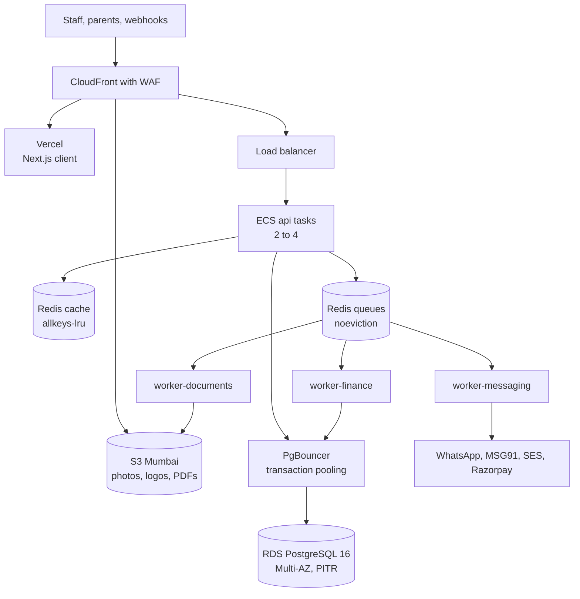

# Stage 2: Growing to 500 Customers

**In simple words:** This is your operating guide from about 100 paying institutes to 500. That is Year 2 in the canon: October 2027 to September 2028, a team growing from 4 to 14, hosting that starts as hardened Railway and ends on AWS Mumbai. Stage 1 was about shipping fast. Stage 2 is about surviving fee day, removing every single point of failure, and getting the founder out of production.

## What this stage looks like

The canon target for the end of Year 2 is 500 paying organizations, ₹30 lakh MRR and ₹3.6 crore ARR. The table uses the load model of *Scaling Overview and Architecture Evolution*, so all four stage chapters count the same way. *Stage 1: The First 100 Customers* counted the morning peak more narrowly; the load model wins.

| Quantity | Formula (assumption) | At 500 paying |
|---|---|---|
| Organizations | 300 Growth + 165 Pro + 35 Enterprise; free pool 1,200 | 500 paying |
| Active students | 300 x 180 + 165 x 600 + 35 x 1,600 + 1,200 x 34 | About 2.5 lakh |
| Staff and parent users | Students / 20; students x 70% | 12,500; 1.75 lakh |
| Attendance rows | Students x 220 working days | 5.5 crore a year |
| Invoices and payments a month | 1 per student; 0.9 paid, 40% online | 2.5 lakh; 2.25 lakh |
| Messages a month | Students x 15, all channels | 37.5 lakh |
| Absence alerts, 9 to 10 am | Students x 8%, sent at 40 a second | 20,000 in 8 minutes |
| Attendance peak | Students / 1,000 x 1.67 a second | 418 requests/s |
| Fee-day design peak | Students / 1,000 x 2.76 a second | 690 requests/s |
| Database and S3 size | 17 + 50 GB; 200 + 600 GB | 70 GB; 800 GB |

> **Note:** The fee-day peak is 65% above the ordinary peak only because reminders, dues lists and invoice generation land in the same hour. Spread all three over 30 minutes and the real peak stays near 450.

## Goals and exit criteria

Goals: 500 paying organizations, churn under 2.5%, gross margin 84%, zero cross-tenant incidents, and a system that runs while the founder is on a plane.

| Gate | Pass when |
|---|---|
| Customers and retention | 500 paying for 2 months; churn under 2.5% for 3 months |
| Reliability | Uptime 99.9% or more for 3 months |
| Speed | API p95 under 400 ms on the last two fee cycles |
| Recovery | PITR drill passed; full restore under 1 hour at 70 GB |
| Hosting | On AWS Mumbai; Multi-AZ, WAF, Terraform-built staging |
| Database | Partition migration written and rehearsed on a copy |
| Security | CERT-In test done, no open high finding; ISO 27001 policies |
| People | On-call rotation of three; founder not primary for a month |
| Money | Gross margin 84% for 2 months; hosting under 3% of revenue |

PITR means point-in-time recovery: restoring the database to any chosen minute. A gate that says "rehearsed" counts as much as one that says "done", because Stage 3 opens with partitioning.

## Architecture at this stage

**Figure: EduFlow at 500 customers, end of Stage 2 on AWS Mumbai**



Every box now has a second copy, except the database, which gets a standby in the second data centre. The same shape works on hardened Railway in the first half of the stage: read "Railway service" for "ECS task". Codebase, image and API contract do not change.

| Component | Stage 2 choice | Size at 500 (estimate) |
|---|---|---|
| Hosting | AWS `ap-south-1` ECS Fargate; Vercel client | Production plus staging |
| API | Tasks of 1 vCPU, 2 GB | 2 to 4 tasks, 5 vCPU at peak |
| Workers | Three queue groups, one image | 2 + 2 + 1 tasks |
| Database | RDS PostgreSQL 16 `db.m7g.large`, Multi-AZ | 70 GB data, 200 GB disk |
| Pooler | PgBouncer, transaction mode | 75 client, 30 server connections |
| Redis | Two: cache `allkeys-lru`, queues `noeviction` | Under 4 GB and 2 GB |
| Files and CDN | S3 Mumbai versioned, Intelligent-Tiering; CloudFront | 800 GB; 1.5 TB a month |
| Search and observability | `pg_trgm`, no search service; Sentry, Better Stack, PostHog | p95 under 500 ms; 5 licences |
| Backups | PITR 7 days, snapshots, nightly dump | RPO 5 min, RTO 1 hour |

RPO is the data you may lose; RTO is the time until EduFlow is back. Setup stays in *Deploy on AWS* and *Monitoring, Backups and Incident Response*.

### When the AWS move happens

*Deploy on AWS* holds the triggers; P-57 rehearses the move on staging from 15 to 22 September 2027. Pick one of two plans in October 2027.

- **Planned: Sunday 21 May 2028,** fallback Sunday 18 June 2028. The senior engineer joins in April 2028 and leads it. Both dates fall after the 15th, outside the fee window and the January to April freeze.
- **Early: Sunday 21 November 2027,** fallback 19 December 2027. Only on a hard trigger: an Enterprise buyer demands a private network, a contract or DPDP audit demands data in India, or a scare shows you need PITR.

> **Example:** Move-weekend message to Rajesh Sharma: "Rajesh ji, Sunday 21 May raat 11 baje se 1 baje tak EduFlow band rahega. Hum servers Mumbai shift kar rahe hain, isse app aur tez chalega. Aapka data waise ka waisa rahega. Monday subah sab normal."

### Upgrades during this stage

In this order, each on its trigger. Effort is working days for one person.

| Order | Upgrade | Trigger | Effort | Risk |
|---|---|---|---|---|
| 1 | Split Redis: queues and cache | Before the API passes 2 replicas | 0.5 | Low |
| 2 | API to 4 replicas, gated on CMN-API-29 | API CPU over 70% at 9 am | 0.5 | Low |
| 3 | Split the worker into three queue groups | A queue waits over 2 min | 1 | Low |
| 4 | Spread invoice generation like reminders | Before the 1 Dec 2027 fee cycle | 0.5 | Low |
| 5 | PgBouncer in transaction mode | Connections over 60% of the limit | 1 | Medium |
| 6 | CloudFront in front of S3 | Photo load p95 over 1 s | 1 | Low |
| 7 | Per-tenant job slots, fair share | One tenant over 20% of queue time | 2 | Medium |
| 8 | AWS move: ECS, Multi-AZ, PITR, WAF (P-57) | The window chosen above | 15 | High |
| 9 | Archive `message_logs`, `audit_logs` to S3 | Database over 120 GB | 3 | Medium |
| 10 | Read replica for reports and exports | Database CPU over 60% | 1 | Low |

Items 9 and 10 are Stage 3 work in the overview's evolution table; pull them forward only when the trigger fires early. Partitioning always waits.

Upgrade 1 is the cheapest disaster to avoid. One Redis with `allkeys-lru` quietly evicts BullMQ keys under memory pressure, and jobs vanish with no error in any log.

```env
# server/.env.production - after upgrade 1
REDIS_URL=rediss://:<password>@eduflow-queues.xxxx.ap-south-1.cache.amazonaws.com:6379
REDIS_CACHE_URL=rediss://:<password>@eduflow-cache.xxxx.ap-south-1.cache.amazonaws.com:6379
```

Add `REDIS_CACHE_URL` to the Zod environment schema as optional, falling back to `REDIS_URL`, so one instance still serves local and staging.

## Database work

| Task | What you do in Stage 2 | Cadence |
|---|---|---|
| Indexes | Partial and covering indexes for slow queries; drop unused | Weekly |
| Slow queries | Budget: no statement above 200 ms mean; each gets an owner | Monday |
| Partitioning | Not run; rehearse the `attendance_records` migration on a copy | By June 2028 |
| Archival | `message_logs` over 13 months, `audit_logs` over 24, to S3 | Monthly |
| Pooling | PgBouncer transaction mode; a written connection budget | New services |
| Replicas | Only on trigger; same tenant extension on the replica client | — |
| Backups and drills | PITR 7 days, snapshots, nightly dump; restore drills with minutes logged | Daily, monthly |

**Connection budget.** Write it before adding any service. Four api tasks at `connection_limit=10`, two messaging, two document and one finance worker at 5 each, plus 10 for migrations, cron and the admin console, make 75 client connections. PgBouncer carries them on 30 server connections (pool 25 plus reserve 5) of the roughly 850 a `db.m7g.large` allows.

```ini
; /etc/pgbouncer/pgbouncer.ini
[databases]
eduflow = host=eduflow-prod.xxxx.ap-south-1.rds.amazonaws.com port=5432 dbname=eduflow

[pgbouncer]
listen_addr = 0.0.0.0
listen_port = 6432
auth_type = scram-sha-256
auth_file = /etc/pgbouncer/userlist.txt
pool_mode = transaction
max_client_conn = 400
default_pool_size = 25
reserve_pool_size = 5
reserve_pool_timeout = 3
server_idle_timeout = 60
ignore_startup_parameters = extra_float_digits,options
```

> **Warning:** In transaction mode Prisma's prepared statements break with `prepared statement "s0" already exists`. Add `?pgbouncer=true&connection_limit=10` to every `DATABASE_URL`. Set the tenant per transaction with `set_config('app.current_org', $1, true)`; the third argument makes it transaction-local. A session-level `SET` leaks the last tenant to the next customer on the same server connection, so add an isolation test that runs through PgBouncer.

Archival runs as a BullMQ job on `worker-documents` after 22:00. Export first, delete second, in small batches.

```sql
-- scripts/db/archive-message-logs.sql
-- Step 1 (before this file): export the same rows to S3 as CSV, verify the count.
-- Step 2: delete in batches of 5,000, committing between them.
DO $$
DECLARE moved integer;
BEGIN
  LOOP
    WITH doomed AS (
      SELECT id FROM message_logs
      WHERE created_at < now() - interval '13 months'
      ORDER BY created_at
      LIMIT 5000
      FOR UPDATE SKIP LOCKED
    )
    DELETE FROM message_logs m USING doomed d WHERE m.id = d.id;
    GET DIAGNOSTICS moved = ROW_COUNT;
    EXIT WHEN moved = 0;
    COMMIT;                 -- allowed inside a DO block from PostgreSQL 11
    PERFORM pg_sleep(1);    -- let replication and autovacuum breathe
  END LOOP;
END $$;
```

Messages are about a third of yearly growth, so this job alone keeps `db.m7g.large` enough for the stage. Autovacuum also needs help on the hot tables: its default 20% threshold waits for 1 crore dead rows.

```sql
ALTER TABLE attendance_records SET (autovacuum_vacuum_scale_factor = 0.02,
                                    autovacuum_analyze_scale_factor = 0.01);
ALTER TABLE message_logs SET (autovacuum_vacuum_scale_factor = 0.02);
```

## Performance and reliability targets

An SLO is a target you measure yourself against. The only written promise stays the Enterprise SLA of 99.5% uptime and a 4-hour response to urgent tickets.

| SLO | Target | Measured by |
|---|---|---|
| Login, attendance, fees, portal up | 99.9% a month; never under 99.7% | Better Stack |
| API p95 latency | Under 400 ms; 600 ms on fee days | CloudWatch, Sentry |
| API p99; server errors | Under 1.5 s; under 0.3% | CloudWatch |
| Fast queues: messages, webhooks | 95% of jobs start in 30 s | `ops-watch` |
| Absence alerts fully sent | Within 10 min of 9:00 am | `ops-watch` |
| Receipt PDF; bulk queues | Ready in 8 s; started in 5 min | `ops-watch` |
| Online payment reflected | Paid within 90 s for 99% | Webhook log |
| Recovery | RPO 5 minutes, RTO 1 hour | Monthly drill |

**The error budget in simple words.** At 99.9%, a 30-day month allows 43 minutes of downtime. That is the budget, and a bad release now hurts 500 institutes. Under half spent, the release train runs twice a week. Past half, only fixes and reliability work ship. Fully spent, features freeze and the next Monday goes to the top cause with an owner and a date.

## Security and compliance work

Stage 1 bought freelance tests. Stage 2 buys an auditable habit, because Enterprise buyers send questionnaires and auditors ask for evidence a year old.

| When | Work | Cost (estimate) |
|---|---|---|
| Oct – Nov 2027 | Security owner named; disclosure page; Workspace SSO; 2FA everywhere | ₹0 |
| With the move | WAF rules, private subnets, Secrets Manager, OIDC deploys | In hosting |
| Jan 2028 | CERT-In test: API, isolation, OTP login, payments; critical fixed in 7 days, high in 30 | ₹1.5 to 2.5 lakh |
| Feb 2028 | ISO 27001 starts: scope, 20 policies, risk and vendor registers | ₹3 lakh with a consultant |
| Monthly, quarterly | Patch train, no high `npm audit` alert over 30 days; access and sub-processor review | 5 hours |
| Ongoing | DPDP: parental consent, grievance contact, 72-hour breach notice | ₹0 |
| Year 3 | ISO 27001 certificate; SOC 2 Type II when USA pilots sign | Year 3 budget |

> **Best practice:** Keep one folder per quarter with the access review, patch report, restore drill log, incident reviews and release notes. An ISO 27001 or SOC 2 audit is mostly "show me the evidence", and collecting it later costs ten times more.

## What breaks at this stage

Ten failures that are normal between 100 and 500 customers. Each gets a ten-line runbook the first time it happens.

| Failure | Symptom | Root cause | Fix |
|---|---|---|---|
| Fee-day database wall | p95 1.5 s on the 1st to 5th | Dues lists scan `fee_invoices` | Partial index on org, status, due date; dues as an export job |
| Pool exhaustion | Prisma P2024; clients waiting | Pool size unchanged after task 4 | Pool 25, lower `connection_limit`, reserve pool |
| Migration lock storm | Deploy hangs; 502s | NOT NULL default on a huge table | Expand then contract; batched backfill; `lock_timeout` |
| WhatsApp quality drop | Templates paused; 131049 | Marketing on a utility template | Category rules at approval; opt-out; alert at yellow |
| Noisy-neighbour reports | Everyone slow at 8 pm | One group renders 12,000 report cards | Per-tenant job slots; bulk work after 22:00 |
| Import of 50,000 students | Four hours; worker restarts | Whole CSV parsed in memory | Stream chunks of 500 into a staging table |
| Redis ate queue jobs | Jobs vanish, no error | Cache and queues share `allkeys-lru` | Split instances; `noeviction` on queues |
| S3 and CDN bill jump | Storage and requests double | PDF rendered on every view | Store the PDF key on the invoice |
| Webhook backlog on the 5th | Unpaid for 20 minutes | Finance jobs behind PDFs | `worker-finance` split; store then process |
| First UAE school is slow | 400 ms extra in Dubai | One Mumbai stack, no edge | CDN for static; plan `me-central-1` |

## Team and roles to add

*Organization and Hiring Plan* governs: 4 people to 14 in Year 2, about ₹9.4 lakh a month by September 2028. Every role passes the four-question hiring gate.

| Role | Trigger | Expected | Monthly cost |
|---|---|---|---|
| Mobile engineer | 3 signed white-label app orders | Oct 2027 | ₹1,20,000 |
| Inside sales, second and third | The previous one holds 10 wins a month | Nov 2027, May 2028 | ₹35,000 |
| Onboarding executive, second | Wins above 25 a month for 2 months | Jan 2028 | ₹33,000 |
| Support executive | Over 500 tickets per agent for 2 months | Jan 2028 | ₹32,000 |
| QA engineer | 250 paying, or 3 serious escaped bugs | Feb 2028 | ₹70,000 |
| Senior full-stack engineer | MRR ₹12 lakh, or roadmap 3 weeks late | Apr 2028 | ₹1,30,000 |
| Finance and operations | MRR ₹15 lakh, or 6 founder hours a week | May 2028 | ₹60,000 |
| Product designer | Freelance design over ₹40,000 for 3 months | Jun 2028 | ₹1,00,000 |
| Sales lead, owns partners | 6 people selling; 8 coaching hours a week | Jul 2028 | ₹70,000 |

The founder's job changes here. He moves into sales and marketing: Enterprise and school-group deals, new cities, the UAE entry, hiring and the seed decision. He stops writing daily code and stops being on-call primary.

## Processes to introduce

| Process | Starts | How it works |
|---|---|---|
| On-call rotation | Mar 2028 | Weekly primary and secondary; Better Stack paging; escalation after 15 minutes; a day off after a night page |
| Release train | Feb 2028 | Freeze Monday and Wednesday 18:00, release Tuesday and Thursday 21:30; flags for risky work |
| QA gate | Feb 2028 | Playwright green on staging, a test plan per release, a bug bash before each version |
| Change management | Nov 2027 | One-page record for money, auth, migration and infrastructure changes: blast radius, rollback, approver |
| Freeze calendar | Oct 2027 | Told to customers: no big change 1 January to 30 April, or the 1st to the 10th |
| Capacity review | First Monday | Run `gate-check.sql` and the load model; write both beside the gates |
| Incident review | Every SEV1, SEV2 | Blameless, within 3 days; action items with owners; list read monthly |
| Advisory board | Jan 2028 | Quarterly, 12 institutes in two groups; first look at the roadmap and a vote |

> **Rule:** The founder may not be on-call primary after March 2028. If the rotation cannot run without him, that is the bug to fix, not the roster.

## Support model and tooling

Response and resolution targets by plan and severity stay in *Customer Success, Onboarding and Support*. Stage 2 adds tiers and tooling.

| Level | Who | Handles | Volume at 500 (estimate) |
|---|---|---|---|
| L0 | Help centre, in-app tips, saved replies | Questions before a ticket | Deflects about 30% |
| L1 | 2 support, 2 onboarding executives | Training, imports, approved fixes | 1,400 tickets a month |
| L2 | QA engineer, engineer on rota | Bugs with screen ID and org slug | About 120 a month |
| L3 | Razorpay, Meta, MSG91, AWS | Provider faults | About 10 a month |

Tooling: Zoho Desk with SLA timers per plan and severity; plan and organization slug on every ticket; a status page fed by Better Stack; impersonation that writes an audit entry; CSAT on every closed ticket; and a monthly review of the top five ticket causes that must produce two product fixes.

## Monthly cost and gross margin

A month at 500 paying customers, September 2028. Estimates, without GST.

| Line | What | ₹ a month | Cost of service? |
|---|---|---|---|
| Hosting | AWS production and staging, Vercel, S3, CDN | 90,000 | Yes |
| Monitoring and security | Sentry, Better Stack, PostHog, WAF, support plan | 25,000 | Yes |
| Messages | Meta and MSG91; wallets repay at cost plus 15% | 1,10,000 | Yes |
| Gateway fees | 1.8% of MRR on our own billing | 54,000 | Yes |
| Support people and tools | 3 people plus the helpdesk | 1,20,000 | Yes |
| Other software tools | Claude seats, CRM, books, Workspace | 90,000 | No |
| People other than support | 14 people, less the support share | 8,35,000 | No |
| Total before marketing, legal, misc | | 15,24,000 | |

**Gross margin check.** Cost of service = 90,000 + 25,000 + 1,10,000 + 54,000 + 1,20,000 = ₹3,99,000. September 2028 revenue in *Financial Plan and Projections* is ₹28.12 lakh. Gross margin = (28,12,000 − 3,99,000) ÷ 28,12,000 = **85.8%**, above the Year 2 plan of 84%.

Two unit checks a month. **Hosting per active student** = ₹90,000 ÷ 2.5 lakh = **₹0.36**, down from ₹0.56 at Stage 1; if it rises twice in a row, find the cause first. **Software cost to serve per customer**, messages excluded = ₹2,89,000 ÷ 500 = **₹578**, against ₹506 in the overview's stage model; the gap is monitoring and support.

## Key metrics dashboard

Review every Monday in the KPI sheet of *KPI Framework and Dashboard*. Any red row gets an owner and a date.

| Metric | Target | Source |
|---|---|---|
| Paying organizations; MRR; churn; NRR | Path to 500 and ₹30 lakh; under 2.5%; above 100% | Super Admin, billing |
| Activation in 7 days; free-to-paid; parent adoption | 60%; 15%; 70% | PostHog, billing |
| Uptime; error budget left | 99.9%; above half on the 15th | Better Stack |
| API p95; p99; errors | 400 ms; 1.5 s; 0.3% | CloudWatch |
| Queue delay; alert send time | Under 30 s; under 10 min | `ops-watch` |
| Database CPU; connections; largest table | 60%; 60%; under 5 crore rows | `gate-check.sql` |
| Hosting per active student | ₹0.36 or lower | AWS bill |
| First response in target; CSAT; tickets per agent | 90%; 4.5 of 5; under 500 | Zoho Desk |
| Deploys a week; change failure rate | 2 or more; under 15% | GitHub Actions |

## Top risks

| Risk | Early sign | Response |
|---|---|---|
| The AWS move goes wrong | Rehearsal runs over the write-pause budget | Do not move. Fix, rehearse, keep the old host warm 7 days |
| Cross-tenant leak through the pooler | An isolation test through PgBouncer fails | SEV1 process; transaction-local `set_config` only |
| One tenant dominates the database | One slug above 15% of query time | Own sending number, job slots, report window; plan a dedicated database |
| New people break quality | Change failure rate above 15% for a month | Slow hiring; pair new engineers 4 weeks; keep the QA gate |
| Buying-season overload | First response under 90% for 2 weeks | Freeze features; add a contract helper; longer support hours |
| Cash is really customer advance | Own cash below 3 months of spend | Hold the next hire; push yearly plans; decide on the seed early |

## Stage checklist

- [ ] Redis split into cache and queue instances; queues on `noeviction`.
- [ ] API on 4 replicas; workers split into messaging, documents and finance.
- [ ] PgBouncer live with a written connection budget and `?pgbouncer=true`.
- [ ] Invoice generation, reminders and dues lists spread over 30 minutes.
- [ ] AWS Mumbai move done in the chosen window; Multi-AZ, PITR and WAF on.
- [ ] Monthly restore and quarterly PITR drills logged with the minutes.
- [ ] Archival job running; partition migration rehearsed on a copy.
- [ ] CERT-In test done; ISO 27001 policies and evidence folder started.
- [ ] On-call rotation of three running without the founder for a month.
- [ ] Exit gates green; *Stage 3: Growing to 1,000 Customers* opened.

## Key takeaways

- Stage 2 is 500 institutes, 2.5 lakh students, a design peak of 690 requests a second and about 70 GB of data. One tuned PostgreSQL still carries it.
- Harden Railway first, then move to AWS Mumbai on a Sunday after the 15th, outside the January to April freeze: 21 May 2028 planned, 21 November 2027 on a hard trigger.
- Split Redis before adding replicas, split workers before the first big import, and give PgBouncer transaction-local tenant settings and its own isolation test.
- Raise the bar to 99.9% uptime and p95 under 400 ms, and decide now what happens when half the error budget is gone.
- Hire to 14 on triggers, start on-call in March 2028, and get the founder out of production.
- A month costs about ₹15.2 lakh before marketing, gross margin is about 86%, and hosting per student falls from ₹0.56 to ₹0.36.
