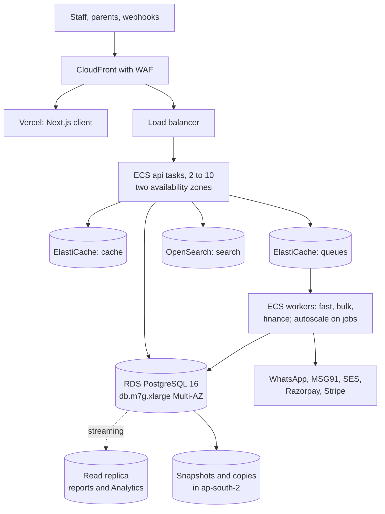

# Stage 3: Growing to 1,000 Customers

**In simple words:** This is your operating guide from about 500 paying institutes to 1,000 and beyond: late Year 2 through Year 3, with a team growing from 14 to 40 people on AWS Mumbai. Load is ten times Stage 1, the first international tenants are live, and Enterprise buyers read your uptime numbers before they sign. The job of this stage: hold 99.9% uptime while the biggest tables pass 10 crore rows.

## What this stage looks like

Stage 3 starts when the Stage 2 to 3 gates in *Scaling Overview and Architecture Evolution* hold, at about 500 paying organizations, and ends when the Stage 3 to 4 gates hold, between 1,000 and 1,500 in Year 3. The table below is that chapter's 1,000-customer column. Every row is an estimate.

| Quantity | Formula | At 1,000 paying |
|---|---|---|
| Active students | Paying x 500, free-tier tail included | 5 lakh |
| Parent users; staff users | Students x 70%; students / 20 | 3.5 lakh; 25,000 |
| Attendance rows | 5 lakh a day x 220 working days | 11 crore a year |
| Message logs; WhatsApp | Students x 15 a month; 60% | 75 lakh; 45 lakh |
| Absence alerts, 9 to 10 am | Students x 8% absent | 40,000 |
| Attendance peak | Students / 1,000 x 1.67 | 836 requests/s |
| Fee-day design peak | Students / 1,000 x 2.76 | 1,381 requests/s |
| Database size; S3 storage | 165 GB and 2 TB a year, plus past years | 400 GB; 3 TB |

Three numbers change how you work. The fee-day peak needs 10 API vCPUs, an ordinary bill. The 40,000 alerts need 17 minutes on one WhatsApp sender, missing the 10-minute target. And `attendance_records`, `message_logs` and `audit_logs` each pass 5 crore rows, where one table stops working.

> **Note:** The peaks that hurt are yearly now: 1 to 14 April, when 1,000 institutes roll over the session together; result weeks in May and June; the 1st to 10th of each month.

## Goals and exit criteria

The goals: 1,000 paying organizations, logo churn under 2.2% a month (BRD *Financial Plan and Projections*), 99.9% uptime, no cross-tenant incident, gross margin above 83%. Leave when every gate holds.

| Gate | Pass when |
|---|---|
| Customers | 1,000 paying for 2 months; USA or Australia pilots signed |
| Retention | Churn under 2.2%, net revenue retention above 100%, 2 quarters |
| Reliability | 99.9% uptime for 6 months; no SEV1 last quarter |
| Speed | p95 under 400 ms, fee-day p95 under 600 ms, 3 months |
| Data and recovery | Three tables partitioned, archival running; PITR drill under 1 hour |
| Security | Pen test closed, no high finding; ISO 27001 audit booked |
| Money and people | Gross margin 83%+; on-call rotation of 4+; DevOps engineer hired |
| Next step | Tenant directory designed; a tenant move rehearsed on a copy |

## Architecture at this stage

**Figure: EduFlow at 1,000 customers, AWS Mumbai**



Same codebase, same image, same database engine as on Day 1. New: every part has a copy in a second data centre, reports read a replica, search leaves PostgreSQL, and a copy of everything lands in `ap-south-2`. Build steps are in *Deploy on AWS*.

| Component | Stage 3 choice | Size at 1,000 customers |
|---|---|---|
| Hosting | ECS Fargate, two AZs, one region | api 2 to 10 tasks, 1 vCPU each |
| Workers | Three services: fast, bulk, finance | 8 tasks at peak |
| Database | RDS `db.m7g.xlarge` Multi-AZ | 4 vCPU, 16 GiB, 300 GB gp3 |
| Replica | `db.m7g.large` on `DATABASE_REPLICA_URL` | Reports, exports, Analytics |
| Cache, queues | Two ElastiCache clusters, `cache.m7g.large` | `allkeys-lru`; `noeviction` |
| Files | S3 Intelligent-Tiering, CloudFront | 3 TB, copied to `ap-south-2` |
| Search | OpenSearch, 2 nodes, private subnet | 5 lakh students indexed |
| Observability | CloudWatch alarms, tracing, Sentry, Better Stack | Error budget on the board |
| Backups | Snapshots, PITR, nightly dump to S3 | RPO 5 min, RTO 1 hour |

### Upgrades during this stage

Do them in this order. Each waits for its trigger, and nothing big ships from 1 January to 30 April or on the 1st to 10th.

| Order | Upgrade | Trigger | Effort | Risk |
|---|---|---|---|---|
| 1 | Scheduled autoscaling; load test at 2x fee-day peak | Above 600 paying | 2 days | Low |
| 2 | Read replica and a reporting Prisma client | A report over 5 s, or database CPU 60% | 3 days | Medium |
| 3 | Per-sender WhatsApp limits; own numbers, top 50 | Alerts over 10 min | 1 week | Medium |
| 4 | Second NAT gateway; WAF rules, per-IP limits | Before the first pen test | 1 day | Low |
| 5 | Partition the three big tables | A table above 5 crore rows | 2 weeks | High |
| 6 | Monthly archival of messages and audit rows | Growth above 15 GB a month | 1 week | Medium |
| 7 | Per-tenant job slots and a query budget | A tenant above 20% of load | 3 days | Medium |
| 8 | Tracing across the API and the workers | An unexplained p95 rise | 3 days | Low |
| 9 | OpenSearch for students, invoices, messages | Search p95 above 500 ms | 1 week | Medium |
| 10 | PgBouncer in front of RDS | Connection budget above 300 | 1 day | Medium |
| 11 | DR environment in `ap-south-2`, then torn down | First uptime clause signed | 3 days | Low |

Upgrade 1 is the cheapest insurance of the stage. CPU autoscaling reacts minutes after a peak starts, and fee day starts at 08:00 sharp. Set scheduled minimums in `Asia/Kolkata` as *Deploy on AWS* shows, then load-test staging at 2,800 requests a second and put the measured requests per vCPU back into the load model.

Upgrade 3 fixes the number that misses target. Count sends per number in Redis and put a job back to sleep when the second is full.

```typescript
// server/src/jobs/whatsapp/sender-limit.ts
import { DelayedError, type Job } from 'bullmq';
import { redis } from '../../lib/redis';

// One counter per sending number per second. Call before the Cloud API send.
export async function holdIfThrottled(
  job: Job, token: string, accountId: string, perSecond = 40,
): Promise<void> {
  const second = Math.floor(Date.now() / 1000);
  const key = `wa:rate:${accountId}:${second}`;
  const used = await redis.incr(key);
  if (used === 1) await redis.expire(key, 2);
  if (used > perSecond) {
    await job.moveToDelayed((second + 1) * 1000, token);
    throw new DelayedError(); // BullMQ keeps the job; no retry is counted
  }
}
```

Then give the top 50 tenants by message volume their own WhatsApp Business number. With five senders the same 40,000 alerts go out in under 4 minutes, and a quality-rating drop hits one group, not all.

## Database work

| Task | What you do in Stage 3 | Cadence |
|---|---|---|
| Indexes | Add only from the weekly top-10; drop indexes unused 90 days | Weekly |
| Slow queries | `pg_stat_statements` top 10 by total time, with prompt P-53 | Monday, 1 hour |
| Partitioning | Monthly range partitions on the three big tables | Once, then automatic |
| Archival | Messages over 13 months, audit rows over 25 months, to S3 | Monthly job |
| Pooling | `connection_limit` everywhere; PgBouncer past a budget of 300 | Each new service |
| Replicas | One replica for reports, with the same tenant extension | Continuous |
| Backups | Snapshots and PITR; restore drill monthly, region drill quarterly | Monthly, quarterly |

**Partitioning, step by step.** A partitioned table is one table stored as many monthly pieces, so a November query reads one piece and an old month detaches in a second. Two PostgreSQL rules shape the work: the partition column must sit inside the primary key, and every unique key must contain it. So `attendance_records` gets `(id, date)` and the unique key `(organization_id, session_id, student_id, date)`.

```sql
-- server/prisma/migrations/<stamp>_partition_attendance/migration.sql
-- Made with: npx prisma migrate dev --create-only, then edited by hand.

-- 1. New parent table, same columns, no data.
CREATE TABLE attendance_records_p (
  LIKE attendance_records INCLUDING DEFAULTS INCLUDING CONSTRAINTS
) PARTITION BY RANGE (date);

ALTER TABLE attendance_records_p ADD PRIMARY KEY (id, date);
ALTER TABLE attendance_records_p ADD CONSTRAINT attendance_records_p_session_key
  UNIQUE (organization_id, session_id, student_id, date);

-- 2. Indexes on the parent are copied to every partition automatically.
CREATE INDEX ON attendance_records_p (organization_id, student_id, date);
CREATE INDEX ON attendance_records_p (organization_id, batch_id, date, status);
CREATE INDEX ON attendance_records_p (organization_id, campus_id, date, status);

-- 3. One partition per month of history, plus three months ahead.
SELECT create_monthly_partitions('attendance_records_p', DATE '2027-04-01', 36);

-- 4. Backfill month by month, one transaction each, after 21:30. ANALYZE often.
INSERT INTO attendance_records_p SELECT * FROM attendance_records
WHERE date >= DATE '2027-04-01' AND date < DATE '2027-05-01';

-- 5. Swap inside the Sunday window, in one short transaction.
BEGIN;
SET LOCAL lock_timeout = '5s';
INSERT INTO attendance_records_p SELECT * FROM attendance_records a
WHERE NOT EXISTS (SELECT 1 FROM attendance_records_p p WHERE p.id = a.id);
ALTER TABLE attendance_records RENAME TO attendance_records_old;
ALTER TABLE attendance_records_p RENAME TO attendance_records;
COMMIT;

-- 6. Re-create foreign keys and the row-level security policy: LIKE copies
--    defaults and checks, not those. Keep the old table 7 days, then drop it.
```

The helper runs once, then a nightly job calls it, so a missing partition can never stop an insert:

```sql
CREATE OR REPLACE FUNCTION create_monthly_partitions(
  parent text, start_month date, months int
) RETURNS void LANGUAGE plpgsql AS $$
DECLARE m date; name text;
BEGIN
  FOR i IN 0..months - 1 LOOP
    m := (start_month + (i || ' month')::interval)::date;
    name := parent || '_' || to_char(m, 'YYYY_MM');
    EXECUTE format(
      'CREATE TABLE IF NOT EXISTS %I PARTITION OF %I FOR VALUES FROM (%L) TO (%L)',
      name, parent, m, (m + interval '1 month')::date);
  END LOOP;
END $$;
```

Run it nightly on the `snapshots` queue for all three tables, and alert at SEV2 when fewer than two future partitions exist. `message_logs` and `audit_logs` partition by `created_at`, with two extra points. The unique key `(provider, provider_message_id)` used by delivery webhooks cannot survive partitioning: move it to a small unpartitioned table `message_provider_refs` that the webhook reads first. And `audit_logs` carries a hash chain per organization, so verify the chain across the boundary after the swap.

In Prisma the model changes from `id String @id` to `@@id([id, date])`. Every `findUnique` by id must pass the date, or become `findFirst({ where: { id } })`. Find those calls before the migration.

> **Warning:** Partitioning is the only High-risk change here. Rehearse twice on a restored copy and time every step. If the swap passes 10 minutes in a rehearsal, split the backfill over more nights instead of shortening the test.

**Archival.** After 13 months a message row matters only for disputes. A monthly `bulk` job writes finished partitions to S3 as Parquet, checks the row count, then detaches and drops the partition, removing about a third of yearly growth. Academic and financial records are never archived away: only messages, audit rows past the retention in *Privacy and Compliance*, and old metric snapshots.

## Performance and reliability targets

An SLO (service level objective) is a target you measure yourself against. These numbers also go into Enterprise contracts, so promise only what the drills prove.

| SLO | Target | Measured by |
|---|---|---|
| Availability: login, attendance, fees, portal | 99.9% a month, never under 99.7% | Better Stack |
| Enterprise SLA | 99.9% with service credits | Uptime report |
| API p95; p99 | Under 400 ms (600 ms on fee days); 1.5 s | Tracing, Sentry |
| Server errors | Under 0.2% of requests | Load balancer 5xx |
| Fast queues: messages, webhooks | 95% start within 30 s | `ops-watch` |
| Absence alerts fully sent | Within 10 min of the last batch | Message log |
| Receipt PDF; bulk start | 5 s; 5 min | `ops-watch` |
| Online payment shown as Paid | Within 60 s for 99% | Webhook log |
| Search p95; replica lag | Under 300 ms; under 30 s | OpenSearch, CloudWatch |
| Recovery | RPO 5 min, RTO 1 hour; region 4 hours | Drill logs |

**The error budget in simple words.** 99.9% of a 30-day month allows 43 minutes of downtime, one budget the whole team shares. Above half the budget, the release train runs normally. Below half, every release carries a rehearsed rollback and risky migrations wait. At zero, only reliability and security fixes ship. The reverse counts too: two months that barely touch the budget mean you ship too slowly.

## Security and compliance work

| When | Work | Cost (estimate) |
|---|---|---|
| Stage entry | Yearly test by a CERT-In empanelled auditor | ₹2.5 to 4 lakh |
| Stage entry | WAF rules, private subnets, secret rotation | Inside hosting |
| Every release | Isolation suite and scans; a high finding blocks the train | ₹0 |
| Every quarter | Access review of AWS, GitHub, database, console; leavers same day | 4 hours |
| From 500 customers | ISO 27001: policies, risk register, suppliers, evidence | ₹8 to 12 lakh |
| Year 3 | ISO 27001 Stage 1 and Stage 2 audits, then the certificate | Inside the above |
| First USA pilot | SOC 2 Type I, then Type II after 6 months | US$25,000 to 50,000 |
| First UAE tenants | Residency answers, DPA templates, breach drill | 1 week of the adviser |

Two habits decide whether audits are cheap or painful. Collect evidence as you work: every access review, incident review, drill log and release note is an artefact. And answer questionnaires from one maintained document, which saves about two days per Enterprise deal (Estimate).

> **Tip:** ISO 27001 opens UAE and Indian enterprise doors; SOC 2 Type II opens USA doors. Start the one your next ten deals need, not both.

## What breaks at this stage

| Failure | Symptom | Root cause | Fix |
|---|---|---|---|
| Fee-day autoscale lag | Slow 08:00 to 08:20 on the 1st | CPU scaling reacts late | Scheduled tasks from 07:30 |
| Alerts too slow | Alerts take 17 minutes | One sender at 40 a second | Per-sender counters; own numbers |
| Replica lag grows | Stale reports; queries cancelled | A 40-minute Analytics scan | Cap replica statements at 15 min |
| Noisy neighbour | Everyone slow at 10 am | One group imports and broadcasts | Job slots; query budget |
| Import of 50,000 rows | Write spikes; autovacuum behind | A group loads 5 years at once | Chunks of 200 on `bulk`, after 21:30 |
| Migration lock | Deploy hangs; timeouts | `ALTER TABLE` waits behind readers | `lock_timeout` 5 s; expand, contract |
| Missing partition | Insert fails: no partition | Nightly job failed silently | Create 3 months ahead; alert |
| Connection storm | Prisma P2024 after failover | Every task reconnects at once | PgBouncer; retry with jitter |
| Queue Redis full | Jobs cannot be added | Completed jobs kept; big payloads | `removeOnComplete`; IDs only |
| Result-day PDF flood | Report cards take hours | 2 lakh PDFs in two hours | Autoscale `bulk`; pre-render |
| Search too slow | Search p95 above 500 ms | Trigram scan, 5 lakh students | OpenSearch with a tenant filter |
| SMS rejections | Bulk SMS fails after a change | DLT template not approved | Pre-send check; use WhatsApp |

Every row needs a runbook before it happens a second time. The on-call engineer must fix any of them from the runbook alone, without calling you.

## Team and roles to add

*Organization and Hiring Plan* in the BRD governs; the team goes from 14 to 40 here.

| Role | Trigger | Monthly cost | Takes over |
|---|---|---|---|
| DevOps engineer | AWS live; 99.9% in a contract | ₹1,80,000 | Infrastructure, deploys, alarms |
| Engineering manager | Engineers pass 6 | ₹2,80,000 | Sprints, code review, releases |
| Product manager | 34 modules, 3 countries | ₹1,80,000 | Backlog, specs, release notes |
| QA engineers, 2 | Two escaped P1 bugs in a quarter | ₹80,000 each | Regression suite, sign-off |
| Support team lead | Over 4 agents, or 2,000 tickets | ₹55,000 | Rosters, quality, escalation |
| Head of customer success | Churn needs an owner | ₹1,20,000 | Onboarding, support, renewals |
| Head of sales | Sellers pass 8 | ₹2,00,000 | Quota, forecast, coaching |
| UAE account manager | 15 paying UAE schools | ₹2,50,000 | The UAE relationship |
| Security adviser, contract | ISO 27001 or SOC 2 starts | Per day | Policies, evidence, answers |

> **Founder note:** The DevOps engineer is the hire that buys back your nights. Hire before the partition work, not after. One person owning AWS, alarms and the rotation makes everything else safer.

## Processes to introduce

| Process | Starts | How it works |
|---|---|---|
| On-call rotation | Fourth engineer | Primary and secondary, weekly, Monday handover; under 3 pages a week |
| Release train | Stage entry | Two trains a week, 21:30 IST, feature flags, one canary task for 30 minutes |
| Change management | Stage entry | Money, auth, migration and infrastructure changes need a decision record, rollback, approver |
| QA gate | First QA engineer | Playwright suite green on staging with real-size demo data; bug bash each version |
| Capacity review | First Monday monthly | Run `gate-check.sql`, rerun the load model, update the gates |
| Game day | Quarterly | Kill a task, fail over the database, expire a WhatsApp token; fix what runbooks missed |
| Error budget review | Monthly, with the KPI board | Budget spent, incidents, what next month changes |
| Advisory boards | Stage entry | Two boards of 8, schools and coaching; Enterprise reviews quarterly |

> **Example:** Quarterly review invitation to Rajesh Sharma of Sharma Classes: "Sharma ji, is quarter ka review call 12 tareekh ko rakha hai. Aapke centre ka data, nayi reports aur agle 3 mahine ka roadmap dikhayenge. Aap jo teen cheezein maangenge, unmein se ek is quarter mein banegi."

## Support model and tooling

| Level | Who | Handles |
|---|---|---|
| L0 | Help centre, in-app guides, WhatsApp bot | Password reset, receipt reprint, downloads |
| L1 | 3 support executives, 07:00 to 21:00 IST | How-to, imports, approved data fixes |
| L2 | Support team lead, squad on duty | Bugs reproduced with a screen and request ID |
| L3 | AWS, Meta, Razorpay, MSG91 | Provider faults; you inform the customer |
| Account | Head of customer success, UAE manager | Enterprise accounts, renewals, reviews |

First response: Enterprise 1 hour with a 4-hour workaround and a named manager; Pro 4 hours; Growth 8 working hours; Starter 2 working days.

Tooling: a helpdesk with SLA timers and plan tags, the Super Admin console with audited impersonation, a status page, a help centre in Hindi and English, and a weekly ticket-theme report that feeds the backlog. Target 3 tickets per customer a month; each 10% cut saves one support hire.

## Monthly cost and gross margin

One month at 1,000 paying customers, about mid Year 3. Estimates in ₹, without GST. Revenue is 1,000 x the canon ARPA of ₹7,500 = ₹75,00,000, including about ₹5,30,000 of message usage revenue.

| Line | What | ₹ a month | Cost of service? |
|---|---|---|---|
| Hosting and monitoring | AWS, DR copies, Vercel, Sentry | 1,70,000 | Yes |
| Messages | Meta, MSG91, SES at cost; wallets repay cost plus 15% | 4,50,000 | Yes |
| Gateway fees | 2.0% of our own billing | 1,50,000 | Yes |
| AI compute | AI Insights add-on | 70,000 | Yes |
| Support | Team lead, 3 executives, tools | 3,00,000 | Yes |
| Software tools | 30 seats, AI seats, CRM, helpdesk | 3,50,000 | No |
| People | About 30 outside support | 25,00,000 | No |
| Security and compliance | Pen test, ISO and SOC work | 1,50,000 | No |
| Total before marketing | | 41,40,000 | |

**Gross margin check.** Cost of service = 1,70,000 + 4,50,000 + 1,50,000 + 70,000 + 3,00,000 = ₹11,40,000. Gross margin = (75,00,000 − 11,40,000) ÷ 75,00,000 = **84.8%**, above the canon floor of 80% and the BRD Year-3 plan of 83%. Hosting is 2.3% of revenue, inside the 2.5% target in *Deploy on AWS*. Watch one unit number monthly: ₹1,70,000 ÷ 5,00,000 students = **₹0.34 per student**, down from ₹0.47 in Stage 1. If it rises twice in a row, find the query or job behind it.

## Key metrics dashboard

Reviewed every Monday by the founder, the engineering manager and the head of customer success. Any red row gets an owner and a date.

| Metric | Target | Source |
|---|---|---|
| Paying organizations, MRR, net revenue retention | Year-3 path; NRR above 100% | Billing |
| Logo churn, monthly | Under 2.2% | Billing |
| Uptime; error budget left | 99.9%; half by mid-month | Better Stack |
| API p95 and p99; 5xx share | 400 ms; 1.5 s; 0.2% | Tracing |
| Alert send time; fast-queue delay | Under 10 min; under 30 s | `ops-watch` |
| Database CPU; replica lag; connections | Under 60%; 30 s; 60% | CloudWatch |
| Partition headroom | 3 future months, all tables | Nightly job |
| Hosting per active student | ₹0.34 or lower | AWS bill |
| Tickets per customer; response in SLA | 3 or fewer; 95% | Helpdesk |
| Open high security findings; review age | Zero; under 90 days | Scanner, log |

## Top risks

| Risk | Early sign | Response |
|---|---|---|
| Cross-tenant leak in a new component | Replica or search isolation test fails | Every component carries `organization_id` and a test before go-live; a leak is SEV1 |
| Partition migration damages data | Row counts differ in rehearsal | Two rehearsals; old table kept 7 days; Sunday window only |
| Meta quality rating falls | Yellow rating; 131049 errors | Utility templates; honour opt-outs; split the top 50 |
| One tenant dominates load | Above 20% of database time | Job slots and query budget; dedicated database in Stage 4 |
| DevOps is a single point of failure | One person can deploy or restore | Two people trained per runbook; the game day proves it |
| Certification slips, deals stall | Audit booked, evidence missing | Evidence folder from month one; adviser reviews monthly |
| April rollover overload | Ticket flood, slow imports | Feature freeze; extra support windows; rehearse in March |

## Stage checklist

- [ ] Scheduled autoscaling live; a 2x fee-day load test passed on staging.
- [ ] Read replica serving reports and Analytics with the tenant extension.
- [ ] Per-sender WhatsApp limits live; top 50 on own numbers; alerts under 10 minutes.
- [ ] Three big tables partitioned, with partitions created 3 months ahead.
- [ ] Archival job moving old message and audit rows to S3 monthly.
- [ ] PITR drill under 1 hour and one region drill passed and logged.
- [ ] WAF, private subnets, secret rotation; pen test closed with no high finding.
- [ ] On-call rotation of 4 or more, with a runbook per failure row above.
- [ ] Error budget, SLOs and hosting per student on the Monday board.
- [ ] Exit gates green; *Stage 4: Growing to 10,000 Customers* opened.

## Key takeaways

- Stage 3 means 500 to 1,000+ paying institutes, 5 lakh students, a fee-day design peak of 1,381 requests a second and 11 crore attendance rows a year.
- The API is not the problem. Messaging throughput and three very large tables are: per-sender WhatsApp limits and monthly partitions define this stage.
- Partitioning is the only High-risk change. Rehearse twice on a copy, swap in a Sunday window, keep the old table seven days.
- Promise 99.9% uptime and p95 under 400 ms, and let the error budget set how fast you ship.
- Hire the DevOps engineer before the hard infrastructure work, then the engineering manager, QA and the two function heads.
- A month at 1,000 customers costs about ₹41 lakh before marketing; gross margin is 85% and hosting ₹0.34 per student.
