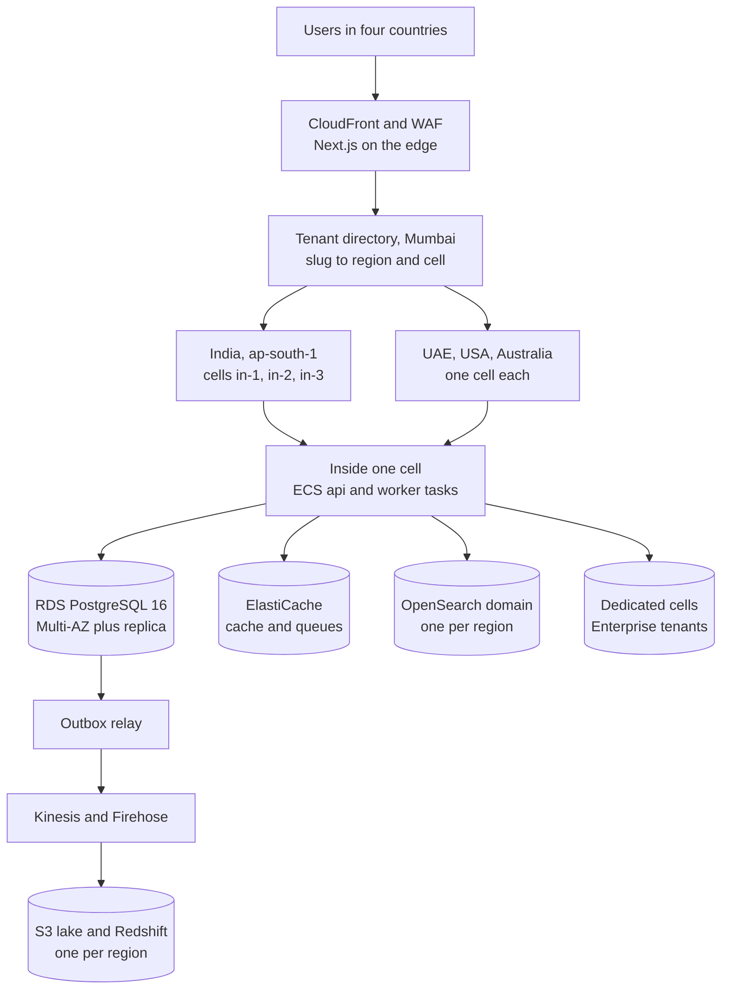

# Stage 4: Growing to 10,000 Customers

**In simple words:** This is your operating guide from about 1,000 paying institutes to 10,000: Year 3 through Year 5, with a team growing from 40 to 220 people across four countries. The product does not change. One stack becomes many small copies called cells, each region keeps its own data, and a separate data platform answers the big questions. The job of this stage: run six production stacks with the discipline you once gave to one.

## What this stage looks like

Stage 4 starts when the Stage 3 to 4 gates in *Scaling Overview and Architecture Evolution* hold, at 1,000 to 1,500 paying organizations in Year 3. It ends at the canon Year-5 target of 10,000 paying organizations in September 2031, 1,500 of them international. Every row below is an estimate from that chapter's 10,000-customer column.

| Quantity | Formula | At 10,000 paying |
|---|---|---|
| Free Starter organizations | 2.5 free per paying one | About 25,000 |
| Active students | Paying x 500, free tail included | 50 lakh |
| Parent users; staff users | Students x 70%; students / 20 | 35 lakh; 2.5 lakh |
| Attendance rows | 50 lakh a day x 220 working days | 110 crore a year |
| Message logs; WhatsApp share | Students x 15 a month; 60% | 7.5 crore; 4.5 crore |
| Absence alerts, 9 to 10 am | Students x 8% | 4 lakh |
| Fee-day design peak, all regions | Students / 1,000 x 2.76 | 13,806 requests/s |
| Fee-day design peak, India | 85% of the total | 11,735 requests/s |
| API vCPUs at fee-day peak | Peak / 150 | 93 |
| Database; S3 growth | 1.65 TB and 20 TB a year, plus history | 6 to 8 TB live; 60 TB |

Three facts define the stage. 93 vCPUs of API is a small bill, so raw compute is never your problem. No single PostgreSQL instance should carry 50 lakh students, so India splits into three cells. And the UAE, the USA and Australia each expect their data to stay in their region, so the split is a legal need before a technical one.

A cell is a full copy of the Stage 3 stack (API tasks, workers, database, Redis, search) serving a fixed list of tenants. Six shared cells carry 10,000 customers (Estimate): `in-1`, `in-2`, `in-3` in `ap-south-1` Mumbai for about 8,500 Indian customers, `ae-1` in `me-central-1` for 700, `us-1` in `us-east-1` for 500, `au-1` in `ap-southeast-2` for 300. Enterprise tenants who buy a dedicated database get a cell of one.

> **Note:** The first cell outside India opens in Year 2, with the first UAE school. Stage 4 does not invent cells. It makes them routine work a two-person platform team runs without you.

## Goals and exit criteria

The goals: 10,000 paying organizations, logo churn under 1.8% a month (BRD *Financial Plan and Projections*), 99.9% uptime everywhere and 99.95% for Enterprise, no cross-tenant and no cross-region incident, gross margin above 82%.

| Gate | Pass when |
|---|---|
| Customers | 10,000 paying, 1,500 of them international, 2 months |
| Retention | Churn under 1.8%, net revenue retention above 110%, 4 quarters |
| Reliability | 99.9% per region for 12 months; Enterprise 99.95% met |
| Speed | p95 under 350 ms per region, fee-day p95 under 500 ms |
| Cells | A tenant move done live, under 10 minutes of write pause |
| Data platform | Analytics and AI Insights read the warehouse, not the replica |
| Recovery | Region failover drill passed twice; a cell rebuilt from code |
| Certification | SOC 2 Type II clean; ISO 27001 held and renewed |
| Money | Gross margin 82%+; hosting under 1.5% of revenue |
| Next step | Public API live; profit-or-raise decision made |

After this gate there is no Stage 5 architecture, only more of the same: new cells from the same module, new regions from the same runbook. The next decision is a business one, covered in *Founder Operating System*.

## Architecture at this stage

**Figure: EduFlow at 10,000 customers, regions and cells**



Read it from the top. A request reaches CloudFront, the edge router asks the directory where this slug lives, and the request goes to one cell. Inside a cell nothing is new: it is the Stage 3 picture. Below it, every write also drops an event in an outbox table, and a relay carries those events to the region's warehouse. Only anonymous, aggregated numbers cross a border.

| Component | Stage 4 choice | Size at 10,000 customers | Next step when |
|---|---|---|---|
| Edge | CloudFront, WAF, router with directory cache | Global, 5-minute cache | Past 4 regions |
| Hosting | ECS Fargate per cell, two availability zones | api 6 to 40 tasks per cell | New cell |
| Workers | fast, bulk, finance, messaging per cell | 20 tasks per cell at peak | Messaging pool per region |
| Database | RDS `db.m7g.4xlarge` Multi-AZ, plus a reporting replica | 16 vCPU, 64 GiB, 2 TB per cell | CPU above 60% |
| Cache, queues | Two ElastiCache clusters per cell | `allkeys-lru`; `noeviction` | Memory above 70% |
| Files | One S3 bucket per region, Intelligent-Tiering | 60 TB, Glacier for archives | Cost above ₹1 lakh |
| Search | One OpenSearch domain per region, 3 nodes | 50 lakh students indexed | p95 above 300 ms |
| Data platform | Outbox, Kinesis, Firehose, S3 Parquet, Redshift | 1,000 events/s per region | Streaming reads needed |
| Observability | Per-region SLOs, tracing, error-budget board | 6 dashboards, 1 rotation | Follow-the-sun on-call |
| Backups | Snapshots, PITR, cross-region copies per cell | RPO 5 min, RTO 1 hour | Warm standby region |

The codebase, the image, the API contract and the tenant model are unchanged from Day 1. A cell is a deployment target, not a fork.

### Upgrades during this stage

Do them in this order. Each waits for its trigger, and nothing big ships from 1 January to 30 April, or on the 1st to 10th of a month, in any region.

| Order | Upgrade | Trigger | Effort | Risk |
|---|---|---|---|---|
| 1 | Tenant directory is the only source of placement, cached at the edge | Second region live | 1 week | Medium |
| 2 | One Terraform module builds a whole cell | Before the second India cell | 3 weeks | Medium |
| 3 | Per-region deploy pipeline with canary tasks | Past two regions | 2 weeks | Medium |
| 4 | Online tenant move tool, rehearsed on a copy | Before the first real move | 4 weeks | High |
| 5 | Outbox table and the relay to Kinesis | Analytics on the replica over 5 min | 2 weeks | Medium |
| 6 | S3 lake and Redshift; Analytics and AI Insights move onto it | Warehouse queries asked for by 50 customers | 4 weeks | Medium |
| 7 | Second India cell opens; top 300 tenants move into it | India database above 60% CPU at its largest size | 2 weeks | High |
| 8 | Dedicated database cells for Enterprise tenants | A contract demands it, or a tenant passes 20% of load | 1 week each | Medium |
| 9 | Messaging split into its own service, same repository | Above 2 crore messages a month in one cell | 3 weeks | Medium |
| 10 | Follow-the-sun on-call, per-region error budgets | 99.95% signed in a contract | 2 weeks | Low |
| 11 | Public API keys, per-app quotas, partner sandbox | Ten partner integrations asked for | 3 weeks | Low |

Upgrades 1 to 4 are the real work, and they come before any new cell is needed. Building the move tool while the database is still comfortable is the difference between a planned Sunday and an emergency.

The directory answer must be cheap, because every request needs it. It holds only a slug, a region, a cell and a move flag, so it stays in Mumbai and still serves a school in Dubai.

```typescript
// server/src/platform/tenant-directory.ts
// Maps a tenant slug to its region and cell. The edge router calls it, and so
// does every cell, so a request in the wrong cell is redirected instead of
// reading the wrong database.
import { redis } from '../lib/redis';
import { platformDb } from '../lib/platform-db';

export type Placement = {
  region: string;          // 'ap-south-1'
  cell: string;            // 'in-2'
  movingTo: string | null; // set only while a move is running
};

const TTL_SECONDS = 300; // a move clears the key itself, so 5 minutes is safe

export async function resolvePlacement(slug: string): Promise<Placement | null> {
  const key = `dir:slug:${slug}`;
  const cached = await redis.get(key);
  if (cached) return JSON.parse(cached) as Placement;

  const row = await platformDb.tenantDirectory.findUnique({
    where: { slug },
    select: { region: true, cell: true, movingTo: true },
  });
  if (!row) return null;

  await redis.set(key, JSON.stringify(row), 'EX', TTL_SECONDS);
  return row;
}

// The move tool calls this in every region at cutover, before traffic switches.
export async function invalidatePlacement(slug: string): Promise<void> {
  await redis.del(`dir:slug:${slug}`);
}
```

The data platform starts with one new table, written inside the same transaction as the business change:

```sql
-- server/prisma/migrations/<stamp>_domain_events/migration.sql
CREATE TABLE domain_events (
  id              uuid PRIMARY KEY DEFAULT gen_random_uuid(),
  organization_id uuid NOT NULL REFERENCES organizations(id),
  event_type      text NOT NULL,
  payload         jsonb NOT NULL,
  created_at      timestamptz NOT NULL DEFAULT now(),
  published_at    timestamptz
);

-- The relay reads only unpublished rows, so this index stays small.
CREATE INDEX domain_events_unpublished_idx
  ON domain_events (created_at) WHERE published_at IS NULL;

CREATE INDEX domain_events_org_idx
  ON domain_events (organization_id, created_at);
```

The relay claims 500 rows in one transaction with `FOR UPDATE SKIP LOCKED`, sends them to Kinesis, sets `published_at` and commits. A failure rolls back and the next run picks the same rows again, so delivery is at-least-once and every consumer must be idempotent on the event id. The nightly `bulk` job deletes published rows after seven days. Kinesis beats Kafka here: no brokers for your team to run at 3 am.

## Database work

| Task | What you do in Stage 4 | Cadence |
|---|---|---|
| Indexes | Weekly top-10 per cell; a drift check proves all cells match | Weekly |
| Slow queries | `pg_stat_statements` per cell, reviewed with prompt P-53 | Monday, per cell |
| Partitioning | Already live; check pruning and three months of headroom | Nightly job |
| Archival | Messages over 13 months, audit over 25, to S3 then Glacier | Monthly |
| Pooling | RDS Proxy or PgBouncer per cell; budget 400 connections | Each new service |
| Replicas | Reporting replica per cell; one cross-region for recovery | Continuous |
| Backups | Snapshots, PITR, copies in a second region, per cell | Continuous |
| Restore drills | One cell restored fully, rotating through the six | Monthly |
| Region drill | Rebuild a cell from Terraform plus a snapshot, timed | Quarterly |
| Tenant move | Logical replication of one tenant, cutover under 10 min | On demand |

**Schema drift is the new danger.** With one database a migration either ran or failed. With six it can run in five. Make the pipeline refuse to finish until every cell reports the same migration name in `_prisma_migrations`, and put that check on the Monday board.

**Moving a tenant, step by step.** This is the only High-risk routine of the stage.

1. Pick a Sunday after the 15th. Tell the customer two weeks ahead, and again the day before.
2. Set `movingTo` in the directory. The source cell now refuses long exports for that tenant.
3. Copy the tenant's rows into the target cell with logical replication filtered by `organization_id`, or a filtered dump under 50 GB.
4. Let replication catch up until lag is under 5 seconds. This can take hours; the tenant keeps working meanwhile.
5. Cutover: pause writes for that tenant, wait for lag zero, copy the S3 prefix, flip `cell` in the directory, call `invalidatePlacement` in every region, resume writes.
6. Run the isolation suite and a smoke test as a real user. Keep the source rows read-only seven days, then delete them with the customer's written agreement.

Target: under 10 minutes of write pause. Rehearse twice on a restored copy, and never move two tenants in one night.

> **Warning:** A tenant move and a schema migration must never share a window. Logical replication breaks when the two sides have different columns. Freeze migrations for that cell pair from the day replication starts until the move closes.

## Performance and reliability targets

These numbers go into Enterprise contracts, so promise only what the drills prove. Measure each one per region, not as a global average, or one bad region hides behind five good ones.

| SLO | Target | Measured by |
|---|---|---|
| Availability per region: login, attendance, fees, portal | 99.9% a month | Better Stack |
| Enterprise contract SLA | 99.95% with service credits | Uptime report |
| API p95; p99, per region | Under 350 ms (500 ms on fee days); 1.2 s | Tracing |
| Server errors | Under 0.15% of requests | Load balancer |
| Fast queues: messages, webhooks | 95% start within 20 s | `ops-watch` |
| Absence alerts sent, per cell | Within 10 min of the last batch | Message log |
| Online payment shown as Paid | Within 45 s for 99% | Webhook log |
| Warehouse freshness | Events queryable within 15 min | Firehose |
| Directory lookup p99; replica lag | Under 10 ms; under 30 s | Edge logs |
| Recovery | RPO 5 min, RTO 1 hour per cell; region 4 hours | Drill logs |

**The error budget in simple words.** 99.9% of a 30-day month allows 43 minutes of downtime; 99.95% allows 21 minutes. Each region keeps its own budget, and a region that spends half of it stops shipping features until the cause is fixed. A cell-only outage spends only that cell's budget, which is the whole reason cells are worth the trouble. An incident that could have hit every cell, such as a bad migration caught on the canary, spends budget everywhere: the risk was shared even if the damage was not.

> **Founder note:** At this size your calendar should hold zero production alerts. If you still get paged, the platform team is understaffed and the runbooks are incomplete. Fix that before the next region opens.

## Security and compliance work

Stage 3 got you a pen test and an ISO 27001 audit. Stage 4 turns security into a standing function with its own lead, because four countries now ask four sets of questions about one product.

| When | Work | Cost (estimate) |
|---|---|---|
| Stage entry | SOC 2 Type I, then Type II after 6 months of evidence | US$25,000 to 50,000 |
| Stage entry | ISO 27001 kept alive: surveillance audit, risk register | ₹4 to 6 lakh a year |
| Twice a year | Pen test of the API, web app and edge router | ₹6 to 8 lakh a year |
| Every release | Isolation suite, cross-cell smoke test, image and dependency scans | ₹0 |
| Every quarter | Access review: AWS, GitHub, six databases, consoles | 2 days |
| Year 4 | SSO with SAML and OIDC, SCIM sync, customer-managed keys | 4 weeks of work |
| Year 4 | Residency statements, DPA templates, sub-processor list | Legal counsel |
| Continuous | DPDP, FERPA, COPPA, Australian Privacy Principles, PDPL | Compliance officer |

Two drills decide whether a bad day becomes a bad year: a breach drill twice a year ending in a written notice inside 72 hours, and a rehearsed deletion request for a full tenant, backups and warehouse included. The legal detail sits in *Privacy and Compliance*.

> **Tip:** Keep one living security document. Every Enterprise questionnaire is answered from it, and the security lead updates it the day a control changes. It saves about two days per Enterprise deal (Estimate) and doubles as SOC 2 evidence.

## What breaks at this stage

| Failure | Symptom | Root cause | Fix |
|---|---|---|---|
| Fee-day spike in every cell | Slow 08:00 on the 1st, six cells at once | Scaling schedule drifted between cells | One schedule in the cell module; load-test each new cell |
| WhatsApp quality tier drop | Alerts late; 131049 errors rise | Per-number limits and tier caps at 4 lakh alerts | Sender pool per cell; utility templates; watch the rating daily |
| Warehouse cost blowout | Redshift bill doubles in a month | One tenant's Analytics scans the whole lake | Per-tenant query budget; daily rollup tables; result cache |
| Noisy-neighbour tenant | One cell slow at 10 am | A 40-campus group imports and broadcasts | Job slots and query budget; move it to a dedicated cell |
| Import of 50,000 students | Write spikes; autovacuum behind; replica lag | A group loads every campus in one night | Chunks of 200 on `bulk`, spread over nights, before any move |
| Migration lock, multiplied | Deploy hangs in cell 4 of 6 | `ALTER TABLE` waits behind a long reader | `lock_timeout` 5 s; expand then contract; one cell at a time |
| Schema drift between cells | Works in `in-1`, 500 error in `in-3` | A migration failed quietly in one cell | Pipeline gate on `_prisma_migrations`; alert when cells differ |
| Stale directory after a move | Tenant sees old data for minutes | Cache not cleared in one region | Clear in every region; version number checked by the cell |
| Long report queries | Replica cancels queries; stale reports | Analytics still reading the replica | Move Analytics to the warehouse; cap replica statements at 10 min |
| Timezone bug across regions | Session rollover a day early in Sydney | Job scheduled in UTC, not the org timezone | Schedule per organization timezone; test on UAE and Australia data |
| Partner app floods the API | 429 errors for everyone in one cell | One integration polls every second | Per-app keys and quotas; webhooks instead of polling |

Every row needs a runbook and an owner before it happens twice. On-call must know which cell is hit within 60 seconds, so every alert carries the cell name in its title.

## Team and roles to add

*Organization and Hiring Plan* in the BRD governs: 40 people to 95 by September 2030, then 220 by September 2031. Costs are the BRD loaded averages in 2026 rupees.

| Role | Trigger | Monthly cost | Takes over |
|---|---|---|---|
| VP Engineering | Engineers pass 20 | ₹4,60,000 | Squads, architecture, hiring |
| Platform and SRE engineers, 2 to 6 | Second region live | ₹2,20,000 each | Cells, Terraform, on-call, drills |
| Data engineers, 2 to 5 | Outbox and warehouse work starts | ₹2,10,000 each | Lake, Redshift, AI Insights data |
| Security lead | SOC 2 Type II work starts | ₹2,40,000 | Policies, evidence, pen tests |
| Head of product | Four country packs, one backlog | ₹5,00,000 | Roadmap across 34 modules |
| Country leads: UAE, USA, Australia | 60 paying in that country | ₹5,50,000 each | Local sales, support, compliance |
| Implementation managers, 3 to 8 | First ten school groups signed | ₹1,10,000 each | Managed rollouts, data migration |
| Partner managers, 3 to 8 | One per 100 active partners | ₹70,000 each | Reseller network, certification |
| Head of support | Support passes 12 people | ₹3,00,000 | Shifts across four time zones |
| CFO | Four legal entities; profit-or-raise call | ₹4,50,000 | Multi-currency books, audits, board |
| Legal and compliance, 2 | Four privacy laws at once | ₹1,08,000 each | Contracts, DPAs, breach notices |
| Developer relations, 4 | Public API opens | ₹1,08,000 each | Docs, samples, partner support |

> **Founder note:** The platform and SRE team must never drop below three. Two is a rotation that breaks when someone takes leave; three survives a resignation. Hire the third before the second India cell opens.

## Processes to introduce

| Process | Starts | How it works |
|---|---|---|
| Follow-the-sun on-call | Third region live | Three shifts, primary and secondary each, written handover, under 2 pages a shift |
| Release train per region | Second India cell | India twice a week at 21:30 IST; other regions next day if India stays green 12 hours; canary on 5% |
| Change advisory, weekly | Stage entry | Money, auth, migration, cell and directory changes need a decision record, a rollback step, an approver |
| QA per squad, contract tests | VP Engineering joins | Playwright suite per region on real-size demo data; contract tests block a breaking API change |
| Capacity review per cell | First Monday monthly | Gate check in every cell, load model rerun, cell map updated |
| Game day, rotating cell | Quarterly | Kill a cell, fail over a database, expire a WhatsApp token, poison the directory cache |
| Error budget review | Monthly, per region | Budget spent, incidents, what changes next month |
| Customer advisory boards | Stage entry | Four boards of eight: India schools, India coaching, international, Enterprise; quarterly, one promise kept each time |
| Architecture decision records | Stage entry | One page per change to the API contract, tenant model or cell layout; numbered, never deleted |

> **Example:** Advisory board invitation to Rajesh Sharma of Sharma Classes: "Sharma ji, advisory board ka agla call 14 tareekh ko hai. Pichhle quarter aapne jo bulk fee-reminder maanga tha, wo live ho gaya hai. Is baar naye parent app par aapki raay chahiye."

## Support model and tooling

| Level | Who | Handles |
|---|---|---|
| L0 | Help centre, in-app guides, WhatsApp bot, status page | Password reset, receipt reprint, report download |
| L1 partner | Certified partners, for their own customers | Setup, training, how-to for about 40% of Growth |
| L1 | 22 support agents on shifts | How-to, imports, data fixes with written approval |
| L2 | 3 team leads plus the squad on duty | Bugs reproduced with a screen ID and request ID |
| L3 | On-call platform engineer | Cell, directory, database and region faults |
| Account | Country leads, success executives, implementation managers | Enterprise, groups, renewals, reviews |

Shifts in Indian time: 07:00 to 21:00 covers India and the UAE, 05:00 to 13:00 Australia, 18:30 to 02:30 the USA. First response by plan: Enterprise 30 minutes with a named manager, Pro 2 hours, Growth 6 working hours, Starter 2 working days, best effort.

Tooling: a helpdesk tagged by region, cell and plan; the Super Admin console with a cell selector and audited impersonation; a status page per region; the help centre in Hindi, English and Arabic; a partner portal with its own ticket queue; a weekly ticket-theme report per region. Target 2.5 tickets per customer a month, down from 3 in Stage 3; each 10% cut is worth about three support hires.

## Monthly cost and gross margin

One month at 10,000 paying customers, about September 2031. Estimates in ₹, without GST. Revenue is 10,000 x the canon ARPA of ₹9,500 = ₹9,50,00,000, including about ₹72,00,000 of message usage.

| Line | What | ₹ a month | Cost of service? |
|---|---|---|---|
| Hosting and monitoring | Six cells, edge, warehouse, staging, recovery copies | 12,00,000 | Yes |
| Messages | Meta, MSG91, Twilio, SES at cost; wallets repay cost plus 15% | 62,00,000 | Yes |
| Gateway fees | 1.8% of our own billing, negotiated rates | 17,00,000 | Yes |
| AI compute | AI Insights on about 30% of Growth and Pro | 15,00,000 | Yes |
| Support and customer success | 50 people and their tools | 45,00,000 | Yes |
| Software tools | 220 seats, engineer AI seats, CRM, helpdesk, data tools | 18,00,000 | No |
| People | About 170 people outside support and success | 2,60,00,000 | No |
| Security and compliance | SOC 2, ISO surveillance, two pen tests, bug bounty | 8,00,000 | No |
| Total before marketing | | 4,37,00,000 | |

**Gross margin check.** Cost of service = 12 + 62 + 17 + 15 + 45 = ₹1,51,00,000. Gross margin = (9,50,00,000 − 1,51,00,000) ÷ 9,50,00,000 = **84.1%**, above the canon floor of 80% and the BRD Year-5 plan of 82%. Hosting is 1.3% of revenue, matching *Business Model*. Watch two unit numbers monthly: ₹12,00,000 ÷ 50,00,000 students = **₹0.24 per active student**, down from ₹0.34 in Stage 3, and messages at 6.5% of revenue, the line that decides whether margin sits near 82% or 84%.

## Key metrics dashboard

Reviewed every Monday by the founder, the VP Engineering, the CFO and the heads of success and sales. Every metric is shown per region and in total. Any red row gets an owner and a date.

| Metric | Target | Source |
|---|---|---|
| Paying organizations, MRR, net revenue retention | Year-5 path; NRR above 110% | Billing |
| Logo churn; international share | Under 1.8%; 15% of customers | Billing |
| Uptime and error budget left, per region | 99.9%; above half by mid-month | Better Stack |
| API p95 and p99 per region; 5xx share | 350 ms; 1.2 s; 0.15% | Tracing |
| Alert send time per cell; fast-queue delay | Under 10 min; under 20 s | `ops-watch` |
| Database CPU, connections, lag, per cell | Under 60%; 60%; 30 s | CloudWatch |
| Cells at the same migration; partition headroom | All six; 3 future months | Deploy job |
| Hosting per student; messages as share of revenue | ₹0.24 or less; under 7% | Provider bills |
| Tickets per customer; first response in SLA | 2.5 or fewer; 97% | Helpdesk |
| Open high security findings; access review age | Zero; under 90 days | Scanner, log |

## Top risks

| Risk | Early sign | Response |
|---|---|---|
| Cross-region data leak | A tenant's rows found outside its region | Residency test in the isolation suite; SEV1 with regulator notice inside 72 hours |
| Tenant move corrupts data | Row counts differ in the rehearsal | Two rehearsals; source read-only 7 days; one move a night |
| Schema drift between cells | A cell reports an older migration | Deploy gate blocks the train until all six match |
| Certification lapses | Audit finding, or evidence gaps | Monthly evidence review; audits booked a year ahead |
| Support quality falls with volume | Tickets per customer rises two months | Partner-delivered L1, better in-app guidance, theme backlog |
| One region never reaches scale | Under 60 paying after 18 months | Decide early: reseller-only, or exit that region cleanly |
| Key-person risk on the platform team | Only two people can open or move a cell | Three-person minimum; every runbook proven by a second person |

## Stage checklist

- [ ] Tenant directory is the only source of placement, cached at the edge, cleared in every region on a move.
- [ ] One Terraform module builds a complete cell, proven on a throwaway cell.
- [ ] Per-region pipelines with canary tasks; the train blocks until all cells report the same migration.
- [ ] Move tool rehearsed twice, then used live with under 10 minutes of write pause.
- [ ] Outbox, Kinesis and the regional warehouse live; Analytics and AI Insights read the warehouse.
- [ ] Second and third India cells open, with the largest tenants spread across them.
- [ ] Dedicated cells ready for Enterprise tenants who ask, with a written move plan.
- [ ] Follow-the-sun on-call of six or more; per-region SLOs and error budgets on the board.
- [ ] SOC 2 Type II clean, ISO 27001 renewed, two pen tests closed, breach drill passed twice.
- [ ] Exit gates green; the profit-or-raise decision taken with the CFO and written down.

## Key takeaways

- Stage 4 means 1,000 to 10,000 paying institutes, about 50 lakh students, 110 crore attendance rows a year, six cells in four regions.
- Compute is never the problem. Data residency, six copies of everything and the discipline to keep them identical are.
- Build the cell module and the move tool before you need them; a move rehearsed on a Sunday is routine, the same move under pressure is an outage.
- Give every region its own SLO and error budget, and let a cell-only outage spend only that cell's budget.
- Hire the VP Engineering, a platform team of at least three, a security lead and the CFO; the BRD plan goes 40 to 95 to 220.
- A month at 10,000 customers costs about ₹4.37 crore before marketing; gross margin is about 84% and hosting ₹0.24 per active student.
