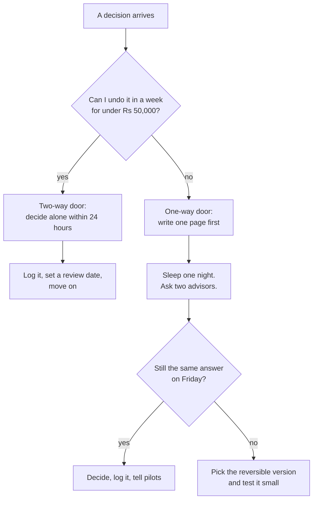

# Founder Operating System

**In simple words:** You are one person doing the work of a product team, a sales team and a finance team. This chapter is the machine that keeps that person running: a weekly rhythm, a one-page review, a metrics sheet, a decision log, a money plan and habits that protect your health. Set it up in the weekend before Day 1 (Monday 5 October 2026) and run it for twelve months.

A system means you decide once and stop deciding every morning. If a ritual runs longer than the time written next to it, cut the ritual, never the build hours. *Roadmap Overview and Weekly Milestones* says what to build; this chapter keeps you able to build it.

## The week on one page

The canon fixes the rhythm: about 6 build hours, 2 customer hours and 30 minutes of review per working day, Sunday off. Six days times 8 hours is 48 hours of real work a week.

| Day | Build block (6 hrs) | Customer block (2 hrs) | Close (30 min) |
|---|---|---|---|
| Monday | Week plan first, then the week's first prompt | 10 new institutes called, demos booked | Sheet updated, day note |
| Tuesday | Deep build, no calls before 15:00 | 2 discovery calls or 1 demo | Sheet, commit, push |
| Wednesday | Deep build | 1 demo plus 5 follow-up messages | Sheet, commit, push |
| Thursday | Deep build | 2 customer check-in calls | Sheet, commit, push |
| Friday | Finish, test, release to staging and production | 1 pilot visit or video call | Release notes written |
| Saturday | Bug fixes, small debt, documentation | 1 churned or stalled lead called | Week's numbers frozen |
| Sunday | Off | Off | Weekly review, 45 min |

> **Rule:** Never move the customer block into the build block. On the day you skip calls "because the build is behind", the build stays behind and the pipeline dies too.

**Figure: A normal build day (Monday to Saturday)**

```text
+------------------------------------------------------------------+
| 06:30 - 07:15  Wake, 30 min walk or gym, no phone, no email      |
| 07:15 - 08:00  Breakfast with family. Phone in another room.     |
| 08:00 - 08:15  Open the sheet. Read yesterday's note. Write ONE  |
|                outcome for today on paper.                      |
+------------------------------------------------------------------+
| 08:15 - 11:15  BUILD BLOCK 1  (3 hrs, phone on silent)           |
|                Claude Code prompt of the day, review, test       |
| 11:15 - 11:45  Break, tea, walk. No screens.                     |
| 11:45 - 14:45  BUILD BLOCK 2  (3 hrs)                            |
|                Finish the feature, write tests, commit, push     |
+------------------------------------------------------------------+
| 14:45 - 15:30  Lunch and 15 min rest                             |
| 15:30 - 17:30  CUSTOMER BLOCK (2 hrs, phone ON)                  |
|                Calls, demos, follow-ups, support replies         |
| 17:30 - 18:00  CLOSE (30 min)                                    |
|                Update the sheet, write tomorrow's ONE outcome,   |
|                empty the inbox, push all code                    |
+------------------------------------------------------------------+
| 18:00 - 21:30  Family, dinner, no laptop                         |
| 21:30 - 22:15  Optional light work: reading, notes, learning     |
| 23:00          Lights off. Every day, Saturday included.         |
+------------------------------------------------------------------+
```

- The two build blocks are the only hours that ship code. The customer block sits in the afternoon because institute owners are free once classes start.

### Monday plan, forty-five minutes

Do this before the first line of code, in this order.

1. Read the week's row in *Roadmap Overview and Weekly Milestones* and the matching day pages. Write down this week's prompt IDs, for example P-23 and P-24 in Week 5.
2. Open the sheet, copy last week's row down, and put this week's targets into it.
3. Pick three priorities: one build, one customer, one company. Write them at the top of the week note.
4. Put every demo, call-back and pilot visit in the calendar as a real event with the phone number in the title.
5. Check cash: balance minus this month's bills. Under six months of runway, the build priority becomes whatever unblocks a sale.
6. Send the Monday message to pilot institutes: what shipped last week, what ships this week, one question.

### Friday release

Friday is the only planned release day, and Saturday exists so a Friday problem has an owner. The full procedure is in *Launch Checklist and Go-Live Runbook*.

| Time | Step | Stop rule |
|---|---|---|
| 12:00 | Feature freeze for the week | Unfinished work moves to next week |
| 12:00-13:30 | Full test run, staging deploy, manual smoke test | A red test stops the release |
| 13:30-14:00 | Production deploy, watch Sentry 20 minutes | Two new error types mean roll back |
| 14:00-14:30 | Release notes in easy words, sent to pilots | No notes, no release |
| 14:30 | Tag the release, update the module progress row | Never deploy after 16:00 on Friday |

> **Warning:** Never release on a Friday evening or a Saturday night. You will debug alone at 23:00 with nobody to call. Not deployed by 16:00 on Friday means it ships Monday.

### Sunday review

Sunday is a rest day with one exception: 45 minutes in the morning to close the week. No code, no email, no calls. Fill the template below, then shut the laptop.

## The weekly review template

Keep one file per week in `docs/founder/weeks/`, for example `2026-W41.md`, so it is versioned and searchable. The fixed shape is what makes twelve months comparable.

```markdown
# Week 05 - 2 Nov to 8 Nov 2026 (sprint days 29-35)

## Numbers
| Metric        | Target | Actual | Last week | Note               |
|---------------|--------|--------|-----------|--------------------|
| Leads added   | 12     |        |           |                    |
| Demos done    | 3      |        |           |                    |
| Pilots signed | 1      |        |           |                    |
| New paying    | 0      |        |           | Paid starts Jan 27 |
| MRR (Rs)      | 0      |        |           |                    |
| Build hours   | 36     |        |           |                    |
| Modules done  | 8/16   |        |           |                    |
| Open P1 bugs  | 0      |        |           |                    |
| Cash (Rs)     |        |        |           | Runway: __ months  |

## Three wins
1.
2.
3.

## Three misses, each with the one cause behind it
1.
2.
3.

## What customers taught me this week
- Institute and person: what they said in their own words
- What I believed before, and what I believe now
- What this changes in the product or the pitch, or "nothing yet"

## Decisions made (copy each one to the decision log)
- D-000: what I decided, reversible yes or no, review date

## Health check (1 to 5, five is best)
Sleep __ | Energy __ | Mood __ | Exercise days __ | Day off taken __

## Next week's three priorities
1. Build:
2. Customer:
3. Company:

## One thing I will stop doing
```

> **Tip:** Fill "Three misses" before "Three wins", or you will explain the misses away. The cause matters more than the miss: "demo cancelled" is a fact, "booked on WhatsApp, never confirmed by call" is fixable.

## The founder metrics sheet

One Google Sheet, six tabs, opened daily at the close. No dashboard tool in Year 1: you type the numbers by hand, because typing a number is how you notice it.

```text
+-----------------------------------------------------------------------+
| Tab "Week"  - one row per week, keyed by the Monday date              |
+-----+---------------------+--------+--------+--------+--------+-------+
| Col | Heading             | Wk 1   | Wk 2   | Wk 3   | ...    | Type  |
+-----+---------------------+--------+--------+--------+--------+-------+
| A   | Week no             | 1      | 2      | 3      |        | int   |
| B   | Monday date         | 05 Oct | 12 Oct | 19 Oct |        | date  |
| C   | Leads added         | 12     | 15     | 14     |        | int   |
| D   | Owners talked to    | 6      | 9      | 8      |        | int   |
| E   | Demos done          | 2      | 3      | 3      |        | int   |
| F   | Pilots live         | 0      | 0      | 1      |        | int   |
| G   | New paying orgs     | 0      | 0      | 0      |        | int   |
| H   | Churned orgs        | 0      | 0      | 0      |        | int   |
| I   | MRR (Rs)            | 0      | 0      | 0      |        | money |
| J   | Cash in bank (Rs)   |1300000 |1272000 |1244000 |        | money |
| K   | Burn this week (Rs) | 28000  | 28000  | 28000  |        | money |
| L   | Runway (months)     | = J / (K * 4.33)               | calc  |
| M   | Modules done of 16  | 0      | 1      | 3      |        | int   |
| N   | Build hours         | 34     | 37     | 36     |        | int   |
| O   | Open P1 / P2 bugs   | 0 / 2  | 0 / 3  | 1 / 4  |        | text  |
| P   | Tickets open / late | 0 / 0  | 0 / 0  | 2 / 0  |        | text  |
| Q   | Sleep average (hrs) | 7.1    | 6.4    | 7.0    |        | dec   |
+-----+---------------------+--------+--------+--------+--------+-------+
| Other tabs: Money (monthly in and out), Pipeline (one row per         |
| institute), Customers (one row per paying org), Decisions (the        |
| decision log), Build (one row per module: prompt ID, status, date)    |
+-----------------------------------------------------------------------+
```

Every metric has one formula and one source. Do not change a formula in the middle of the year. A changed formula hides a trend.

| Metric | Formula | Source | Year-1 target |
|---|---|---|---|
| Leads added | New institutes added to Pipeline tab | Pipeline tab | 12 a week |
| MRR | Monthly plan value of active paid orgs; a yearly plan counts as price / 12 | Razorpay, Customers tab | ₹6,00,000 by Sep 2027 |
| ARPA | MRR / paying organizations | Week tab | ₹5,000 |
| Paying and free orgs | Count of paid plans; count of Starter orgs | Customers tab | 120 and 300 |
| Free to paid | Paid orgs / free orgs older than 3 months | Customers tab | 15% |
| Logo churn per month | Orgs lost / orgs at month start | Customers tab | Under 3% |
| Activation | First receipt or attendance within 7 days | PostHog and database | 60% |
| CAC | Sales and marketing spend / new paying orgs | Money tab | Under ₹12,000 |
| LTV | ARPA x gross margin / monthly churn | Calculated | ₹1.33 lakh |
| LTV to CAC | LTV / CAC | Calculated | Above 4:1 |
| Burn per month | Company spend + founder draw − cash collected | Money tab | See budget below |
| Runway | Cash in bank / burn per month | Money tab | Never under 6 months |
| Build progress | Phase-1 modules done / 16 | Build tab | 16 of 16 by Day 60 |
| Open bugs | P1 blocks work, P2 shows a wrong number | GitHub issues | P1 zero overnight |
| Tickets | Open tickets, and tickets older than 24 hours | Support inbox | None older than 24 hrs |
| NPS | Promoters (9-10) % minus detractors (0-6) % | Quarterly survey | 50 or more |

> **Example:** ARPA ₹5,000 x 80% gross margin / 3% monthly churn = LTV ₹1,33,333. With CAC ₹12,000 that is 11:1. If churn doubles to 6%, LTV halves and the ratio drops to 5.5:1. Churn, not CAC, is the first number to watch.

> **Founder note:** Update cash and burn every Saturday. Founders stop checking the bank balance exactly when they most need to look.

## The decision log

You will make about 300 decisions this year and remember ten. The log is a tab in the same sheet, one row per decision, written the same day. Two minutes now saves a week next March.

| ID | Date | Decision | Type | Why (one line) | Review on |
|---|---|---|---|---|---|
| D-001 | 05 Oct 2026 | Coaching institutes first, schools later | Two-way | Shorter sales cycle, one decision maker | 05 Jan 2027 |
| D-002 | 12 Oct 2026 | PostgreSQL 16 and Prisma 6, pinned | One-way | Canon stack, relational data, RLS | Never |
| D-003 | 09 Nov 2026 | Free pilot until 31 Jan 2027, then paid | Two-way | Need real data before pricing talk | 31 Jan 2027 |
| D-004 | 18 Nov 2026 | No custom report builder before 100 customers | Two-way | One customer asked, nine did not | 01 Apr 2027 |
| D-005 | 04 Jan 2027 | Keep Growth at ₹2,499, no launch discount | Two-way | Discounts teach the market to wait | 01 Apr 2027 |

**Figure: How to decide, by how hard it is to undo**



Most decisions are two-way doors: a credit pack price, a button colour, which institute to call first. Decide them fast and alone; speed beats being right when you can walk back through the door.

One-way doors are few and all cost money, data or trust to undo. The one page you write first has four lines: what I am deciding, what I give up, what must be true, and how I will know in 90 days that I was wrong.

| Decision | Door | How to handle it |
|---|---|---|
| Database engine, tenant model, money type | One-way | Follow the canon, never revisit in Year 1 |
| Product name, domain, trademark class | One-way | Search first, see *Company Setup, Legal and Finance Basics* |
| Investment, advisor equity, first full-time hire | One-way | 30 days, written terms, one lawyer reads it |
| Enterprise contract with custom terms | One-way | Never sign a term you cannot deliver twice |
| Plan prices, packaging, credit pack sizes | Two-way | Test with the next 10 prospects, not all |
| Next module, marketing channel, support tool | Two-way | Decide in 15 minutes, ₹5,000 test, move on |

> **Rule:** If a two-way door is taking more than 24 hours, the decision is not the problem. You are tired. Take Sunday off and decide on Monday.

## Money: personal budget and company budget

You cannot run a company if your home is on fire. Plan both budgets before Day 1 and keep two separate bank accounts. Every number below is an Estimate: tier-2 Indian city, 2026 prices, small family.

| Personal item (monthly) | Amount (₹) | Twelve months (₹) |
|---|---|---|
| Rent or home EMI | 18,000 | 2,16,000 |
| Food and household, family of three | 14,000 | 1,68,000 |
| Electricity, water, gas | 3,000 | 36,000 |
| Internet and mobile | 1,800 | 21,600 |
| Transport and fuel | 3,500 | 42,000 |
| Health insurance, family floater ₹10 lakh | 2,500 | 30,000 |
| Term life insurance ₹1 crore | 1,200 | 14,400 |
| Child school fees | 4,000 | 48,000 |
| Doctor and medicines | 1,500 | 18,000 |
| Personal spending | 3,000 | 36,000 |
| **Total, your founder draw** | **52,500** | **6,30,000** |

Buy both insurances before you leave any job. Those two lines are not optional.

| Company item | Monthly (₹) | Twelve months (₹) |
|---|---|---|
| Claude Code subscription, highest tier | 9,000 | 1,08,000 |
| Hosting: Railway, Vercel, S3 | 3,000 | 36,000 |
| Domain and email for two seats | 1,000 | 12,000 |
| WhatsApp and SMS credits you send | 2,000 | 24,000 |
| Monitoring: Sentry, Better Stack, PostHog | 1,500 | 18,000 |
| CA, bookkeeping, GST filings | 2,500 | 30,000 |
| Company registration and trademark | one time | 40,000 |
| Laptop upgrade, 32 GB RAM, and backup drive | one time | 90,000 |
| Legal review of ToS, Privacy, DPA | one time | 25,000 |
| Travel and demo visits | 4,000 | 48,000 |
| Content and small ads | 3,000 | 36,000 |
| Part-time support help, Months 8 to 12 | 15,000 | 75,000 |
| Buffer, ten per cent | — | 55,000 |
| **Total** | — | **5,97,000** |

The one-time rows are Estimates paid in October 2026; *Company Setup, Legal and Finance Basics* has the steps. Twelve months need ₹6.30 lakh personal plus ₹5.97 lakh company, about **₹12.3 lakh**. Keep ₹13 lakh in the bank on 5 October 2026, or a working spouse or freelance retainer covering the personal side.

With only ₹8 lakh, cut in this order: laptop upgrade if you already have 16 GB RAM (₹90,000), trademark to March 2027 (₹25,000), ads dropped (₹36,000), helper delayed to Month 11 (₹45,000), personal spending and transport down a third (₹26,000). That is ₹2.2 lakh saved, touching neither food, insurance nor the Claude Code subscription.

> **Rule:** Never cut health insurance, never cut the AI subscription, never cut the two customer hours. Everything else is negotiable.

Cash and runway use one formula each, checked every Saturday.

```text
Burn per month   = company spend + founder draw - cash collected
Runway (months)  = cash in bank / burn per month

Example, March 2027:
  company spend   = Rs 38,000
  founder draw    = Rs 52,500
  cash collected  = Rs 41,000  (16 paying orgs, blended Rs 2,560)
  burn            = 38,000 + 52,500 - 41,000 = Rs 49,500
  cash in bank    = Rs 6,80,000
  runway          = 6,80,000 / 49,500 = 13.7 months
```

Runway decides the week. Above 9 months: build to plan. Between 6 and 9: move one build hour a day into selling. Under 6: stop new modules and call every stalled lead of the last 90 days.

## Energy, sleep and not breaking down

Burnout is what happens when output stays high and input stays zero for months. The sprint ends on Day 60, the company does not, so treat your body as production infrastructure.

| Rule | The number | Why it holds |
|---|---|---|
| Sleep | 23:00 to 06:30, seven days a week | Below 6.5 hours, code review quality drops first |
| Exercise | 30 minutes, five days a week | A walk counts; consistency beats intensity |
| Full day off | Every Sunday, no laptop | Day 60 arrives either way, rested or not |
| Screens | Laptop closed by 21:30, except release nights | Midnight screens cost you the next morning |
| Food | Three meals, lunch never skipped | Skipped lunch is why the 15:30 calls go badly |
| Family | One meal a day together, one outing a week | They are funding this with your absence |
| Peer group | Two founder friends, a 45-minute call weekly | Nobody else understands this week |

Watch these signals in the weekly health check. Two in one week means act; three means take two days off immediately.

| Signal | What it usually means | Do this week |
|---|---|---|
| Under 6 hours of sleep for four nights | You are working past the close | Hard stop at 18:00 for three days |
| No exercise for ten days | The schedule has collapsed | Walk at 06:45 before anything else |
| Irritated with a customer on a call | Empathy tank empty | Move the next demo, take Saturday off |
| Reading the same code for an hour | Decision fatigue, not a hard bug | Stop, sleep, ask Claude Code fresh tomorrow |
| Skipping the weekly review twice | Avoiding a number you dislike | Read the number with a friend on a call |
| Low mood lasting two weeks | Not a schedule problem | See a doctor; this is health, not work |

> **Founder note:** Akela chalne ka matlab akela rehna nahi hai. Three days stuck on one bug means ask a forum or a friend. Two weeks of zero sales means the script is wrong, not you.

## Five customer conversations every week

Five real conversations a week for twelve months is about 250 in Year 1. This one habit prevents the most expensive founder mistake: building for six months for nobody.

| Who | How many | Purpose |
|---|---|---|
| New prospect who has never seen EduFlow | 2 | Is the pain real, and do they say it in your words |
| Active pilot or paying customer | 2 | What they actually did last week, not what they want |
| Stalled lead or churned customer | 1 | The truth nobody volunteers |

Rules: 30 minutes, no slides, no demo (the demo is a separate meeting, see *Demo Script*). Ask about last week, never about the future. "Aap pichhle hafte fees kaise collect ki?" gives a fact; "would you use online fees?" gives a polite lie. Record only with permission, and never keep a student's personal data in your notes.

```markdown
# Conversation note - Sharma Classes, Patna - 12 Nov 2026

Person: Rajesh Sharma, owner. 350 students, JEE and NEET.
Type: pilot check-in (week 2). Channel: phone, 26 min.

## What happened last week (facts only)
- Collected fees from 41 students. 9 still pending after 10 Nov.
- Front desk wrote receipts in a register, then typed them again
  into EduFlow at night. Took about 40 minutes daily.
- Sent absence messages to 30 parents by hand on WhatsApp.

## Exact words worth keeping
- "Register chhodna mushkil hai, parents ko kagaz chahiye."
- "If the receipt prints with my logo, I will stop the register."

## What hurts, ranked by what they already pay to avoid
1. Double entry at the fee counter (40 min a day, one staff)
2. Manual absence messages (1 hour a day, one staff)
3. Monthly fee report for the owner (2 hours a month)

## What this changes
- Receipt PDF branding moves ahead of the analytics work.
- Bulk absence message is confirmed as a Phase-1 must, not a wish.

## Next step and date
- Send branded receipt sample by 14 Nov. Call back 17 Nov, 16:00.
```

Keep one note file per institute in `docs/founder/customers/` and one row in the Pipeline tab. On the last Sunday of the month, read them together and write the three pains that repeat most. Only those three may change the roadmap. One loud customer is not data; three quiet ones are.

## The learning plan

Two hours every Sunday afternoon, one topic a month. The order matters: sales before metrics, metrics before money, money before hiring.

| Month | Topic | How, two hours a Sunday | Done when |
|---|---|---|---|
| Oct 2026 | Spec-driven work with Claude Code | *Working with Claude Code* | A prompt reused without edits |
| Nov 2026 | Discovery and cold calling | *Cold Call Scripts*, 20 calls | Owners use your exact words |
| Dec 2026 | SaaS metrics | MRR, churn, CAC, LTV, cohorts | Sheet rebuilt from memory |
| Jan 2027 | Pricing and objections | *Objection Handling and Closing* | Five closes, no discount |
| Feb 2027 | Security basics | OWASP Top 10, DPDP Act duties | P-52 passed on two modules |
| Mar 2027 | Onboarding and support | *Onboarding and Customer Success Playbook* | Activation hits 60% |
| Apr 2027 | Content, SEO, video demos | 8 help articles, 4 videos | First lead from search |
| May 2027 | Hiring and interviewing | 3 job descriptions, 10 questions | First hire, not regretted |
| Jun 2027 | Unit economics and taxes | Money tab, GST, TDS with the CA | Gross margin explained fast |
| Jul 2027 | PostgreSQL performance | Indexes, N+1, EXPLAIN, P-53 | p95 under 400 ms on fee day |
| Aug 2027 | Fundraising basics | Seed terms, dilution, safe notes | Data room ready |
| Sep 2027 | Managing a small team | One-to-ones, goals, feedback | Team runs a week without you |

## Building in public

Building in public is free distribution and free accountability: 2,000 people waiting for your Day 38 post makes Day 38 happen.

| Channel | Cadence | What to post |
|---|---|---|
| LinkedIn | Tue, Thu, Sat mornings | Day number, one number, one lesson, one screenshot |
| YouTube | One video every two weeks | 6-minute build log or a product walkthrough |
| X or Threads | One line daily during the sprint | Today's shipped feature, in ten words |
| Newsletter or blog | Monthly, same day as the investor update | The public half of the monthly update |
| Local WhatsApp groups | Weekly, where owners already talk | Help first, product last |

Share revenue, churn, prices, bugs you caused and what failed. Never share a real student's name, photo or marks, a customer's private numbers without written permission, or an unlaunched price. Use the P-58 demo data for every screenshot: it looks better and it is safe under the DPDP Act.

## Advisors and mentors

Five people, 30 minutes a month each, no equity at the start.

| Who | Where to find them | What to ask them |
|---|---|---|
| An institute owner who is not a customer | Local coaching association | Is this pricing sane, who really decides |
| A SaaS founder two years ahead | LinkedIn, SaaSBoomi, local meetups | What broke at 100 and 500 customers |
| A chartered accountant | Referral from another founder | Structure, GST, books, compliance calendar |
| A senior engineer outside your stack | Ex-colleague, open source, X | One-way architecture decisions, security |
| An ex-Teachmint or Classplus sales person | LinkedIn, warm intro | Field objections and what the market pays |

```text
The ask, sent as a short message (keep it under 90 words):

  Sir/Ma'am, I am Mehdi. I am building EduFlow, software for
  coaching institutes and schools, alone, with my own money.
  I have 6 pilot institutes and Rs 0 revenue today.
  I read your post on <exact thing>. I have ONE question:
  <the question, one line>.
  Can I take 20 minutes on a call, any day this week after 6 pm?
  If not, a two-line reply here would help me a lot. Thank you.
```

If an advisor becomes truly regular, offer 0.1% to 0.25% equity, vesting over two years with a one-year cliff, on a written agreement. That is a one-way door.

## Investor readiness without losing focus

The canon stance is bootstrap to ₹3 to 5 lakh MRR, then optionally raise ₹3 to 5 crore in Year 2. Until then investor work gets two hours a month: a folder that stays current, and one email.

```text
Google Drive folder "EduFlow - Data Room" (update it monthly)
+-- 01 Company: incorporation, PAN, GST, cap table, DPIIT
+-- 02 Financials: monthly P and L, bank statements, MRR sheet
+-- 03 Metrics: customers, churn, cohorts, CAC, LTV, activation
+-- 04 Product: this Blueprint, the PRD, the roadmap, uptime log
+-- 05 Customers: logos with permission, 3 case studies, NPS
+-- 06 Team: founder profile, hiring plan, advisor list
+-- 07 Legal: ToS, Privacy, DPA, vendor contracts, trademark
+-- 08 Updates: every monthly update, oldest to newest
```

```markdown
Subject: EduFlow update - March 2027 - MRR Rs 82,000 (+18%)

The number: MRR Rs 82,000, 21 paying institutes, churn 0.
Cash Rs 6.8 lakh, burn Rs 49,500, runway 13.7 months.

What worked: WhatsApp fee reminders cut pending fees by 31%
at Sharma Classes. Three referrals came from that one result.
What did not: 2 of 6 pilots never marked attendance. Cause:
teacher training, not the product. Fixing with a 5-min video.
Next month: report cards live, 30 paying institutes, first
Pro plan sale.
Ask: one intro to a school group in Lucknow with 3+ campuses.
```

Send it on the 3rd to advisors, investors and your CA. After nine of them, a raise is a conversation with people who already know your numbers.

## The delegation ladder

Every task climbs five steps: do it, document it, hand it over, check it weekly, stop checking. Nothing is delegated before it is documented. The canon Year-1 team is four people including you.

| Trigger | Hire | What leaves your plate | Cost (₹/month) |
|---|---|---|---|
| 10 support messages a week | Part-time support helper, Month 8 | First-line replies, data entry, imports | 15,000 |
| 40 paying institutes | Customer success and onboarding, full time | Onboarding calls, training, health checks | 30,000 |
| You cannot take 5 demos a week | Inside sales executive | Calling, demos, follow-ups, pipeline | 35,000 + incentive |
| Bug backlog older than two weeks | Junior full-stack developer | Bug fixes, small features, tests | 45,000 |

> **Best practice:** Write the SOP before the job post. If you cannot fit "how to onboard an institute" on one page, you cannot hire for it yet. *Checklists* already holds most of those pages.

## The tools stack

Run the whole company under ₹12,000 a month. Free tiers are the right size here.

| Tool | Use | Cost (₹/month) | Add on |
|---|---|---|---|
| Google Sheets | Metrics, pipeline, decisions, money | 0 | Day 1 |
| Google Workspace, two seats | Mail on `eduflow.app`, Drive, Meet | 500 | Day 1 |
| GitHub Free | Private repo, issues, Actions CI | 0 | Day 1 |
| Claude Code | The entire build | 9,000 | Day 1 |
| Notion or Obsidian | Week notes, customer notes, SOPs | 0 | Day 1 |
| Bitwarden, SSD plus cloud backup | Passwords, weekly laptop backup | 300 a year | Day 1 |
| Canva Free, free screen recorder | One-pager, posts, demo videos | 0 | Day 15 |
| Sentry, PostHog, Better Stack | Errors, analytics, uptime | 0 free tiers | Day 20 |
| Razorpay, WhatsApp Cloud API, MSG91 | Payments, parent messages, OTP | At cost | Day 36 |
| Zoho Books or similar | Invoices, GST returns with the CA | 800 | Nov 2026 |

## Monthly and quarterly rituals

These are the only meetings a solo founder has. Put all of them in the calendar for the whole year on Day 1.

| Ritual | When | Time | Output |
|---|---|---|---|
| Month-end finance close | Last working day | 2 hrs | Money tab updated, CA files sent |
| Monthly update and data room | 3rd of the month | 1 hr | Email sent, folder current |
| Customer pain synthesis | Last Sunday | 45 min | Top three repeated pains |
| Security and backup check | First Monday | 1 hr | *Checklists* run, restore tested |
| Pricing review | Quarterly | 2 hrs | ARPA vs ₹5,000, discount leakage |
| Roadmap review against the BRD | Quarterly | 3 hrs | Shipped modules mapped to BR IDs |
| Risk review | Quarterly | 1 hr | Risk register R-01 onward updated |
| Personal review | Quarterly, on the day off | 1 hr | One thing started, one stopped |

The roadmap review is the honest one: open the BRD requirement list, mark only what is truly live, and move a module out of next quarter if the numbers say so.

## Key takeaways

- Fix the rhythm once: 6 build hours, 2 customer hours, 30 minutes close, Sunday off. Never trade customer hours for build hours.
- One sheet, typed by hand daily, formulas never changing mid-year, and a 45-minute Sunday review: misses before wins, ending with next week's three priorities.
- Decide two-way doors alone within 24 hours; for one-way doors write one page, sleep on it, ask two advisors. Log both.
- Hold twelve months of money, about ₹6.3 lakh personal and ₹6 lakh company, and check runway every Saturday.
- Five customer conversations a week. Only a pain repeated by three institutes may change the roadmap.
- Protect sleep, exercise and the day off like production infrastructure. Two warning signals in one week means act that week.
