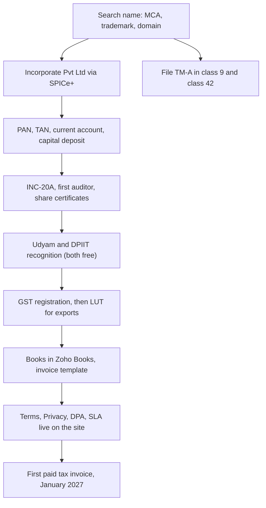

# Company Setup, Legal and Finance Basics

**In simple words:** EduFlow is not only code. It is a company that signs contracts, raises invoices, pays tax and owns a name. This chapter is the India-first setup list: which company type to register, how to register it, GST and invoicing, the documents every institute accepts, the vendor contracts to read, your books and the compliance calendar.

> **Warning:** Every fee, threshold and due date here is an Estimate as of September 2026, and Indian rules change with every budget. A CA (chartered accountant, for tax and books) and a CS (company secretary, for company-law filings) must confirm before you file. This is a checklist, not legal advice.

**Figure: The order of company setup, October 2026 to January 2027**



Each arrow is a dependency. Udyam and DPIIT come before the trademark filing because DPIIT halves that fee. Budget 30 hours across four months.

## Choosing the company structure

| Item | Proprietorship | LLP | OPC | Private Limited |
|---|---|---|---|---|
| Setup cost and time | ₹0, same day | ₹8,000, 12 days | ₹12,000, 10 days | ₹15,000, 10 days |
| Minimum people | 1 | 2 partners | 1 plus nominee | 2 directors, 2 members |
| Personal liability | Unlimited | Limited | Limited | Limited |
| Outside investors | No | Very hard | No | Yes, standard |
| ESOP for staff | No | No | No | Yes |
| Yearly compliance | ₹5,000 | ₹15,000 | ₹25,000 | ₹30,000 |

**Register a private limited company.** Investors in India buy equity only in one. ESOP (employee stock option plan) is legal only here, and your Year 2 hires will ask for it. A ₹5 lakh school contract is signed with a company, not with "Mehdi Alam, proprietor". The extra ₹15,000 a year over an LLP is one month of one Growth customer.

**The solo-founder problem.** A private limited company needs two directors and two members, and you are one person.

| Option | How it works | Pick it when |
|---|---|---|
| Family member as second member | Holds 100 shares (1%) with a signed share transfer agreement | Default |
| OPC now, convert later | One Person Company with a nominee, converted before the seed round | Nobody available |
| Real co-founder | Equal directors, vesting from day one | You have worked together |

> **Founder note:** Give the second member 1% or less and sign the transfer agreement the same week. A 50-50 split with someone who neither builds nor sells is the costliest mistake on this page. The spend fits the ₹40,000 one-time company line in *Founder Operating System*.

## Registering the private limited company

| Step | What it is | Time | Cost estimate |
|---|---|---|---|
| Digital signature (DSC) | Signing token per director | 1 day | ₹1,500 each |
| Name reservation | SPICe+ Part A, two choices | 1 to 3 days | ₹1,000 |
| SPICe+ Part B | Main form with eMOA and eAOA | 3 to 7 days | Stamp duty ₹500 to ₹5,000 |
| AGILE-PRO-S | Same form: EPFO, ESIC, bank, GST | Included | ₹0 |
| Incorporation certificate | Arrives with CIN, PAN and TAN | Same approval | ₹0 |
| CS fee | Drafting, filing, follow-up | Across all steps | ₹6,000 to ₹12,000 |

- **Name.** "EduFlow Technologies Private Limited" is the legal name, "EduFlow" the brand. The Registrar rejects names that clash with an existing trademark.
- **Capital.** Authorised ₹10,00,000, paid-up ₹1,00,000: 10,000 shares of ₹10. The MCA fee is nil below ₹15 lakh authorised (Estimate), so the headroom is free and saves a later filing for the ESOP pool.
- **Registered office.** Home address is allowed, with a rent or ownership proof, a utility bill under two months old, and the owner's no-objection letter.
- **Objects clause.** "Development, licensing and hosting of software for educational institutions", plus training and support, so the training add-on stays legal.

## The first thirty days after incorporation

| Task | Where | Deadline | Why it matters |
|---|---|---|---|
| Current account | Bank, with COI, MOA, AOA, PAN, resolution | Week 1 | Nothing starts without it |
| Deposit capital | ₹1,00,000 from your own account | Week 2 | Proof of paid-up capital |
| Commencement of business | Form INC-20A | 180 days | ₹50,000 plus ₹1,000 a day |
| First auditor | Board resolution, then Form ADT-1 | 30 days | Books cannot close |
| Share certificates | Physical, with state stamp duty | 60 days | Asked at every funding round |
| Registers and letterhead | Minutes book; CIN, address and GSTIN printed | Ongoing | Due diligence, and the law |

> **Rule:** Company money and personal money never touch. One current account, one company card, one company UPI ID. An AWS bill paid from a personal card is a reimbursement claim, filed the same week with the receipt.

## GST registration, invoicing and exports

GST on software subscriptions is 18%. Registration is mandatory above ₹20 lakh of service turnover in a year, ₹10 lakh in some special-category states (Estimates). Register anyway in November 2026: institutes want a tax invoice for input credit, the LUT (letter of undertaking) for foreign customers needs a GSTIN, and only a registered business claims back the GST paid on AWS and gateway fees.

| Item | Decision for EduFlow |
|---|---|
| SAC code | 998314 (IT design and development) or 998315 (hosting) |
| Alternative | 997331 (right to use software), if the CA prefers it |
| Rate | 18% on subscriptions, add-ons and message packs |
| Same state | CGST 9% plus SGST 9% |
| Other state | IGST 18% |
| Place of supply | The institute's registered address, or its address on record |
| Exports | Zero-rated under a LUT, filed fresh before 1 April each year |

Pick one SAC with the CA and keep it all year. Schools supply exempt education services and often have no GSTIN; that sale is B2C and still carries 18%.

**Screen: a Growth plan tax invoice**

```text
+--------------------------------------------------------------------------+
| EduFlow Technologies Private Limited        TAX INVOICE                   |
| Reg. office: <address>        CIN: U62010UP2026PTC000000                  |
| GSTIN: 09AAAAA0000A1Z5        eduflow.app                                 |
+--------------------------------------------------------------------------+
| Invoice no: EF/2026-27/0001        Date: 10 Jan 2027                      |
| Bill to : Sharma Classes, Patna, Bihar                                    |
| GSTIN   : 10BBBBB0000B1Z2    Place of supply: Bihar (10)                  |
+--------------------------------------------------------------------------+
| # | Description                    | SAC    | Qty |      Amount (Rs)      |
| 1 | EduFlow Growth plan, monthly   | 998314 |  1  |            2,499.00   |
|   | 10 Jan 2027 to 09 Feb 2027     |        |     |                       |
+--------------------------------------------------------------------------+
|                               Taxable value            :      2,499.00    |
|                               IGST @ 18%               :        449.82    |
|                               Total payable            :      2,948.82    |
| Amount in words: Two thousand nine hundred forty eight and 82/100 only    |
| Pay by UPI or card: <razorpay payment link>   Due on receipt              |
+--------------------------------------------------------------------------+
```

- Invoice numbers run in one unbroken series per financial year; a gap invites a notice. Bihar is a different state from the office, so the tax is IGST.
- For a Dubai customer the tax line becomes "Supply of services for export under LUT, IGST nil".

**Reverse charge.** Paying AWS, Meta, Anthropic or Vercel is importing a service. You pay 18% yourself under RCM and claim it back the same month. It nets to zero, but skipping it creates interest and notices. Give the CA your foreign vendor list. GSTR-1 and GSTR-3B are then due monthly, even with zero sales.

## Startup India, MSME and the free registrations

| Registration | Cost | What it gives EduFlow | Do it |
|---|---|---|---|
| Udyam (MSME) | ₹0 | Buyers must pay in 45 days; collateral-free loan schemes | Week after incorporation |
| DPIIT Startup India | ₹0 | 50% rebate on trademark fees, labour self-certification | Before the trademark filing |
| GST | ₹0 | Input credit, LUT, tax invoices | November 2026 |

DPIIT recognition needs the incorporation certificate and one page on what is innovative: one system replacing five registers for institutes too small for PowerSchool. It also opens the section 80-IAC tax holiday and the Seed Fund, but both need committee approval, so treat them as a bonus. Professional tax and Shops and Establishment registration arrive with your first employee.

## Protecting the name EduFlow

Search before you spend one rupee on branding: MCA company names; the IP India public search for the word mark in classes 9, 41 and 42, with near spellings such as "EduFlo"; Google and the app stores; then domains and handles. Two hours.

| Class | Covers | Needed |
|---|---|---|
| 9 | Downloadable software and mobile apps | Yes |
| 42 | Software as a service, hosting, software design | Yes |
| 41 | Education and training services | Only for the training add-on |

| Item | Estimate |
|---|---|
| Government fee | ₹4,500 per class with Udyam or DPIIT, otherwise ₹9,000 |
| Attorney fee | ₹3,000 to ₹6,000 per class |
| Word mark, two classes, with rebate | About ₹16,000 |
| Time to registration if unopposed | 8 to 24 months |

File the word mark through Form TM-A in classes 9 and 42. Use the trademark symbol from the filing day; the registered symbol comes only after registration. Expect an examination report to answer within 30 days, then a four-month opposition window.

> **Warning:** Decide by 31 October 2026. If the search finds a live EduFlow in class 9 or 42, change the brand that week. A logo, cards, a domain and an app listing built on a name you must abandon cost far more than the search you skipped.

## Domain, accounts and brand assets

| Asset | Owned by | Rule |
|---|---|---|
| eduflow.app and the .com | Company, registrar account on company email | Lock on, auto-renew 5 years, 2FA |
| DNS and Google Workspace | Company | founder@, billing@, support@ |
| GitHub | An organization, never a personal account | Two owners where possible |
| AWS, Vercel, Railway, Razorpay | Company email, company card | Billing alerts to billing@ |
| Logo and design files | Company, by written assignment | Otherwise the designer owns it |

The last row catches founders. A freelancer who draws your logo keeps the copyright unless the contract assigns it, so put one clause on every design invoice: all work products and intellectual property pass to the company on payment.

## If a co-founder joins

Sign only after that person has worked with you for a full month. Equity without a written agreement is how companies die in year two.

| Clause | What it must say |
|---|---|
| Equity split | Exact percentages and share numbers, not "roughly half" |
| Vesting | 4 years, 1-year cliff, monthly after the cliff |
| Roles | Who owns product, who owns sales, who signs cheques |
| Joint decisions | Funding, hiring, pricing, selling the company |
| IP assignment | All code and design by either person belongs to the company |
| Leaver terms | Good leaver keeps vested shares; bad leaver bought out at face value |
| Deadlock and exit | Buy-back formula, right of first refusal, arbitration seat, full-time duty |

**Vesting in numbers.** A co-founder gets 2,000 shares (20%), four-year vest, one-year cliff. He leaves at 18 months, so 18 of 48 months vest: 750 shares, and 1,250 return to the company. Without vesting he keeps 20% and blocks your seed round.

**ESOP basics**, for the pool you create before the first real hire in Year 2.

| Item | Practical rule |
|---|---|
| Pool size | 10% of the cap table, created before a seed round |
| Approvals | Board resolution, special resolution, written scheme |
| Grant letter | Options, vesting (one year before the first vest), window after exit |
| Exercise price | Face value or a discount to fair value, with a valuer report |
| Employee tax | Perquisite tax at exercise; DPIIT startups may defer it |

| Shareholder | Shares | Percent |
|---|---|---|
| Mehdi Alam | 9,900 | 99.0 |
| Family member | 100 | 1.0 |
| ESOP pool, Year 2 | 1,111 new | 10.0 after issue |

## The documents every customer accepts

Six short documents in plain English, versioned in `docs/legal/` and published on the site. Signup stores the accepted version, time and IP address, as *Launch Checklist and Go-Live Runbook* requires.

| Document | Accepted by | Where it lives |
|---|---|---|
| Terms of Service | Organization Admin at signup | eduflow.app/terms |
| Privacy Policy | Every user, by notice | eduflow.app/privacy |
| Data Processing Agreement | Every paying institute | Attached to the invoice |
| Service Level Agreement | Enterprise only | Contract annexure |
| Refund and cancellation | Shown at checkout | eduflow.app/refunds |
| Acceptable Use Policy | Referenced by the Terms | eduflow.app/aup |

**Terms of Service.**

| Clause | What it must say |
|---|---|
| Plans and limits | Student and campus limits per plan, as in the price list |
| Trial | 14 days free, no card, no setup fee, data kept 30 days |
| Fees and payment | 18% GST extra, 30 days notice on a price change, read-only after 15 days overdue |
| Ownership | The institute owns its data; the platform stays with EduFlow |
| Availability | 99.9% monthly target; service credits only on Enterprise |
| Third parties | Razorpay, Meta WhatsApp, MSG91, AWS named as sub-processors |
| Termination | Either side, 30 days notice; no refund of an unused month |
| Wind-down | If EduFlow closes: 90 days notice and a full data export |
| Refund | A first yearly payment is refundable within 30 days |
| Liability cap | Limited to the fees paid in the last 12 months |
| Law and changes | Indian law, your city, arbitration; version and date on the page |

**Privacy Policy.** Under the Digital Personal Data Protection Act 2023 the institute is the data fiduciary and EduFlow is the data processor.

| Clause | What it must say |
|---|---|
| What data | Student, guardian and staff records; fees; attendance; logs |
| Children | Verifiable parental consent via the institute; no ads, no tracking |
| Purpose | Only to run the service; never to train outside models |
| Sharing and location | Named sub-processors; AWS ap-south-1; deleted 90 days after closure |
| Rights | Access, correction, erasure, portability, and how to ask |
| Grievance officer | Name, email, 30-day reply commitment |
| Security and breach | Encryption, access control, audit logs, breach notice |

**Data Processing Agreement**, one page attached to every paying institute's invoice.

| Clause | What it must say |
|---|---|
| Roles and scope | Processor acting only on instructions; data types and duration |
| Sub-processors | The current list, plus 30 days notice before a change |
| Rights requests | EduFlow helps the institute answer a parent in time |
| Breach notice | To the institute within 24 hours of confirming a breach |
| Audit | Written security summary yearly; on-site only for Enterprise |
| Exit | Machine-readable export, then deletion within 90 days |

**Service Level Agreement, Enterprise only.** Credits on Growth or Pro cost more in accounting than they earn.

| Monthly uptime | Credit on that month's fee |
|---|---|
| 99.9% or above | None |
| 99.0% to 99.89% | 10% |
| 95.0% to 98.99% | 25% |
| Below 95.0% | 30%, capped |

- Excluded: announced maintenance, the customer's own internet, an outage at the gateway or WhatsApp, misuse.
- Response: SEV1 (no login or no fee collection) one hour; SEV2 (one module down) four business hours; SEV3 one business day.
- Claims within 30 days. Credits go on the next invoice, never in cash.

**Refund and cancellation.** Monthly plans cancel any time and run to the end of the paid cycle. A first yearly payment is refundable in full within 30 days; after that there is no pro-rata refund. Message credits, migration and training days are used services and are not refunded. Money returns to the original payment method in 7 to 10 working days.

**Acceptable use.** No illegal content, no messages to parents who never opted in, no reselling, no scraping, no security testing without notice, no card numbers in any field. One written warning, then suspension; immediate suspension if other institutes are at risk.

## Vendor agreements you must actually read

| Vendor | Clause that can hurt | What to do |
|---|---|---|
| Razorpay | Chargebacks debited back, prohibited business list, T+2 settlement | Keep a cash buffer; read the list before signing |
| Meta WhatsApp | Template approval, opt-in is your duty, pricing changes | Store opt-in with a timestamp; re-check prices quarterly |
| AWS | Shared responsibility for backups; SES starts in a sandbox | Sign the AWS DPA; ask for SES production access in Week 4 |
| MSG91 and DLT | Unregistered headers and templates are dropped | Register entity, header and template first |
| Stripe | Restricted businesses, dispute fees, Stripe Tax is paid | Read it before promising a US date |
| Vercel, Railway, Sentry | Data location and their own sub-processors | Collect each DPA for your list |

> **Rule:** An institute's fee money never passes through EduFlow's bank account; each institute connects its own Razorpay account. Holding other people's money needs an RBI payment-aggregator licence you will not get.

> **Warning:** School contract paper often carries unlimited liability, a penalty clause, and ownership of "all software developed". Strike all three: liability capped at twelve months of fees, no penalty, a licence to use the platform. One bad master agreement follows you into every due diligence.

## Books, invoicing and subscription billing

Open Zoho Books or a similar Indian GST tool (about ₹800 a month, Estimate) in November 2026, before the first invoice. It files GST returns, reads the bank feed and raises recurring invoices. Give the CA his own login.

| Account | Type | Example |
|---|---|---|
| Subscription revenue | Income | Growth and Pro plans |
| Add-ons and credits | Income | Extra campus, AI Insights, migration, message packs |
| Hosting and tools | Expense | AWS, Vercel, Railway, Claude Code, Sentry |
| Gateway charges | Expense | Razorpay fee on each collection |
| Professional fees | Expense | CA, CS, trademark attorney |
| Unearned revenue | Liability | Yearly plans not yet earned |

| Paying customers | How you bill | Your effort a month |
|---|---|---|
| 1 to 30 | Invoice plus a Razorpay payment link, sent on WhatsApp | 3 hours |
| 30 to 150 | Razorpay Subscriptions with UPI Autopay or e-mandate | 1 hour |
| Above 150 | Self-serve billing in the app (*After Day 60: The Road to V2*) | 30 minutes |

**Yearly money is not yearly revenue.** Sharma Classes pays ₹24,990 plus GST on 10 January 2027 for a year of Growth. The bank shows ₹29,488 that day, but revenue is ₹2,082.50 a month for twelve months and the rest is unearned revenue. Book it the wrong way and your MRR chart lies.

**Reading a Razorpay settlement**, for one Growth invoice paid by card.

| Line | Amount (₹) |
|---|---|
| Subscription value | 2,499.00 |
| IGST at 18% | 449.82 |
| Charged to the institute | 2,948.82 |
| Gateway fee at 2% | 58.98 |
| GST on the gateway fee | 10.62 |
| Settled to your bank on T+2 | 2,879.22 |

Record revenue ₹2,499, output GST ₹449.82 as payable, the gateway fee ₹58.98 as expense and ₹10.62 as input credit. Never book ₹2,879.22 as revenue: it hides the cost and the GST return stops matching the books.

**TDS deducted by your customers.** An audited school usually deducts TDS (tax deducted at source) on the invoice value, often 10% under section 194J. It pays ₹2,948.82 minus ₹249.90, so ₹2,698.92, because TDS applies to ₹2,499 and not to the GST. That ₹249.90 is your tax, already with the government. Raise the full invoice, book "TDS receivable", check Form 26AS and the AIS quarterly, and chase Form 16A from institutes that deduct but never file.

**TDS you must deduct.** On contractor bills, professional fees and rent above the yearly limits: deduct, deposit by the 7th, file the quarterly return. A large foreign payment can need Form 15CA and 15CB.

## The compliance calendar

Put every line in the calendar in January 2027, with a reminder two days before.

| Task | Form | Due | Done by |
|---|---|---|---|
| Sales return | GSTR-1 | 11th of next month | CA |
| Tax payment and summary | GSTR-3B | 20th of next month | CA |
| TDS deposit | Challan | 7th of next month | CA |
| TDS return | 26Q | Quarterly | CA |
| Advance tax | Challan | 15 Jun, 15 Sep, 15 Dec, 15 Mar | CA |
| Books and bank close | None | Last working day | You |

| Yearly task | Form | Due |
|---|---|---|
| LUT for exports | RFD-11 | Before 1 April |
| GST annual return | GSTR-9 | 31 December |
| Income tax return | ITR-6 | As notified for companies |
| Financial statements | AOC-4 | 30 days after the AGM |
| Annual return | MGT-7 or MGT-7A | 60 days after the AGM |
| Director KYC | DIR-3 KYC | 30 September |

A late ROC (Registrar of Companies) filing costs about ₹100 per day per form with no upper limit (Estimate). Two skipped years turn the company into a struck-off company no investor will touch.

## Insurance

| Cover | Buy when | Cost estimate | Why |
|---|---|---|---|
| Term life and health | Before Day 1 | ₹35,000 a year | Family first (*Founder Operating System*) |
| Cyber liability and tech errors | First Enterprise deal or 100 customers | ₹30,000 to ₹60,000 for ₹1 crore | Buyers ask for it |
| Directors and officers | With the seed round | Set by the investor | Investors require it |

## Selling outside India

The detail belongs to Year 2.

| Market | How you sell first | Tax to handle | Trigger to change |
|---|---|---|---|
| UAE | Indian entity, export invoice under LUT | VAT 5% is the buyer's duty while you have no UAE office | A KHDA school wants a local entity |
| USA | Indian entity plus Stripe | SaaS sales tax in many states; Stripe Tax watches nexus | A district needs a US counterparty |
| Australia | Indian entity plus Stripe | GST 10% above A$75,000 turnover (Estimate) | That threshold is crossed |

- Export of services is zero-rated only when the money arrives in convertible foreign exchange. Ask the bank for the FIRC or e-FIRA on every foreign receipt.
- A US C-Corp through Stripe Atlas costs about $500 plus yearly Delaware and agent fees (Estimate). An Indian company owning a foreign subsidiary is an Overseas Direct Investment under FEMA, done through your bank. Undoing that structure later costs lakhs.

## Red flags and common founder mistakes

| Mistake | What it costs, and the fix |
|---|---|
| INC-20A not filed in 180 days | ₹50,000 plus ₹1,000 a day. Calendar it on incorporation day |
| Customer money in a personal account | Books and GST break. One current account only |
| Equity without vesting | A dead weight on the cap table. Vesting or no equity |
| Net settlement booked as revenue | Revenue and cost both wrong. Always book gross |
| TDS credits never claimed | Real cash lost. Check Form 26AS every quarter |
| A school MSA signed unread | Unlimited liability or lost IP. Strike three clauses |
| Free pilot with no end date | It runs forever. Written scope, end date, price after |
| Holding institutes' fee money | Needs an RBI licence. Each institute uses its own gateway |
| LUT renewal forgotten | Export invoices turn taxable. Renew before 1 April |

## Key takeaways

- Register a private limited company in October 2026, with a family member on 1% and a signed share transfer agreement that same week.
- Do the free registrations first: Udyam and DPIIT, because DPIIT halves the trademark fee.
- Search the name before any branding, file the word mark in classes 9 and 42, and decide by 31 October 2026.
- Register for GST before the January 2027 launch, fix one SAC with the CA, and file the LUT before every 1 April.
- Publish six legal documents before the first paid customer, with the accepted version stored at signup.
- Book revenue gross, spread yearly payments over twelve months, and chase every rupee of TDS credit.
- Never hold an institute's fee money, never sign unlimited liability, never give equity without vesting.
