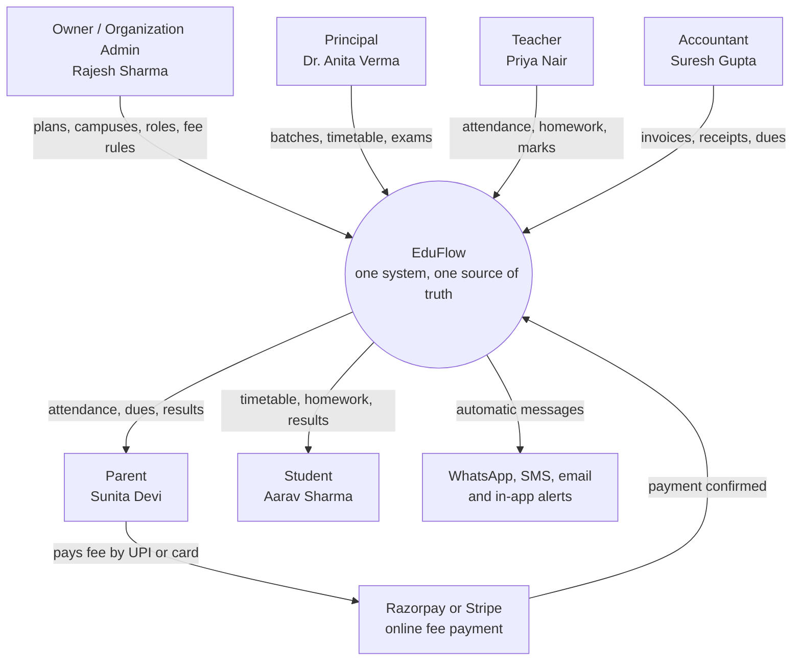

# Executive Summary

**In simple words:** This chapter puts the whole EduFlow business on a few pages. It says what EduFlow is, why institutes need it and how it earns money. It also gives the five-year targets and the founder's tasks for the next 90 days. Read it first, because every other chapter explains one part of it in detail.

> **Note:** Every customer and revenue number in this chapter is a target, not a forecast. Every market number is an estimate from public sources. The detailed chapters show the formula and the source behind each number, so the founder can change the inputs.

## EduFlow at a glance

| Item | Value |
|---|---|
| Product | EduFlow |
| One-line pitch | One simple system to run a school or coaching institute: admissions, attendance, fees, exams, staff and parent communication. |
| Product type | Multi-tenant SaaS ERP (both terms are explained in the next section) |
| First customers | Coaching institutes in India (our entry point), then K-12 private schools |
| Later customers | Colleges and training centres |
| Markets | Phase 1: India. Phase 2: UAE, USA and Australia |
| Founder | Mehdi Alam, solo founder, builds with Claude Code |
| Build sprint | 60 days, from Mon 5 Oct 2026 to Thu 3 Dec 2026 |
| Pilot | 5 friendly institutes, free of cost, from 18 Nov 2026 |
| Paid launch in India | January 2027, before the April 2027 academic session |
| Year-1 target | 120 paying organizations and ₹6 lakh MRR by Sep 2027 |
| Year-5 target | 10,000 paying organizations and ₹114 crore ARR by Sep 2031 |
| Funding stance | Bootstrap to ₹3–5 lakh MRR, then an optional seed round of ₹3–5 crore in Year 2 |

MRR means monthly recurring revenue. It is the subscription money that comes in every month. ARR means annual recurring revenue. It is MRR multiplied by 12.

## Product overview

### What EduFlow is

EduFlow is a web application that runs the daily work of a school or a coaching institute. It covers admissions, student records, batches, attendance, fees, online payments, exams, report cards, staff and parent communication. All of this sits in one place, with one login.

Two terms describe the product:

- **SaaS** (software as a service) means the customer rents the software every month and uses it in a browser. There is nothing to install and no server to buy.
- **ERP** (enterprise resource planning) means one system that runs all the daily operations of an organization, instead of many small tools.

The main app runs at `app.eduflow.app`. Each institute also gets its own address in the form `{slug}.eduflow.app`, for example `sharma-classes.eduflow.app`. Office staff use it on a laptop. Teachers, parents and students use it on a phone browser. White-label mobile apps (apps that carry the institute's own name and logo) come in Phase 4.

### One codebase, many organizations

EduFlow is **multi-tenant**. A tenant is one customer organization, for example Sharma Classes or Bright Future Public School. Multi-tenant means all customers use the same running software and the same database, but each one sees only its own data.

Think of an apartment building. There is one building, one lift and one water tank. But every flat has its own lock. EduFlow works the same way:

- There is one codebase and one PostgreSQL database for all customers.
- Every row of customer data carries an `organization_id`. This is the lock on the flat.
- The application adds the `organization_id` filter to every database query automatically. The tenant is read from the login token, never from what the user types.
- PostgreSQL Row-Level Security (a database rule that blocks rows of other tenants) is the second lock.

This design is a business decision, not only a technical one.

| Benefit of multi-tenant design | What it means for the business |
|---|---|
| Low cost per customer | One server setup serves hundreds of institutes. This supports the 80%+ gross margin target. |
| Start within one day | A new institute signs up and gets a ready workspace in minutes. No installation visit is needed. |
| One upgrade for everyone | A new feature or bug fix reaches all customers on the same day. |
| Free plan is affordable | A 40-student tuition centre costs us almost nothing to host, so we can serve it free. |
| Grows from 1 campus to 100 | A school group adds campuses inside the same organization. No new software is needed. |
| Solo founder can run it | One product to build, test, deploy and support, instead of one copy per customer. |

### One product for schools and coaching

Schools and coaching institutes use different words for the same things. EduFlow keeps one data model and only changes the labels on screen, based on the organization type.

| Concept | School label | Coaching label |
|---|---|---|
| Customer organization | School or school group | Institute |
| Branch | Campus | Centre |
| Session | Academic year 2027-28 | Session 2027-28 |
| Grade or program | Class 10 | JEE Main 2028 |
| Teaching group | Section 10-A | Morning Batch M1 |
| Guardian | Parent | Parent |

This is why one small team can serve both markets. We do not build two products.

### Who uses EduFlow

EduFlow has exactly seven system roles. Organizations on the Pro and Enterprise plans can also create custom roles such as Librarian, Transport Manager or Front Desk.

| Role | Who it is | What this person does most in EduFlow |
|---|---|---|
| Super Admin | EduFlow platform staff | Manages all organizations, plans and support from the platform console |
| Organization Admin | Owner, director or head admin | Sets up campuses, plans, roles and fee rules. Watches the whole business. |
| Principal | Academic head of a campus, or centre head | Manages batches, teachers, timetable, exams and campus reports |
| Teacher | Teaching staff | Marks attendance, gives homework, enters marks for own batches |
| Accountant | Fee counter or finance staff | Creates invoices, collects fees, prints receipts, follows up dues |
| Parent | Parent or guardian | Sees attendance, fees, homework and results of own children. Pays online. |
| Student | Learner | Sees own timetable, homework, results and attendance |

**Figure: EduFlow as the central system that connects every person in the institute**

Staff enter data once, at the top of the picture. EduFlow then sends the right information to parents and students at the bottom, without anyone typing it again. When a parent pays a fee online, the payment gateway tells EduFlow, and the receipt and the owner's dashboard update on their own.

### The 34 modules in four phases

EduFlow has 34 modules. They are released in four phases so that the first version reaches customers fast.

| Phase | Version | Ready by | Modules | Main plans |
|---|---|---|---|---|
| Phase 1 | MVP | Day 60 (3 Dec 2026) | 16 | Starter, Growth, Pro, Enterprise |
| Phase 2 | V1.0 | Day 120 (1 Feb 2027) | 12 | Growth, Pro, Enterprise |
| Phase 3 | V1.5 | June 2027 | 5 | Pro, Enterprise |
| Phase 4 | V2.0 | September 2027 | 1 plus packs | Enterprise, or add-on for Growth and Pro |

MVP means minimum viable product. It is the smallest version that a real customer can use and pay for.

- **Phase 1 (16 modules):** Dashboard, Organizations, Multi Campus, Student Admission, Student Profile, Teachers, Attendance, Batch, Subjects, Fees, Payments, Discounts, Parent Portal, Notifications, WhatsApp, Settings.
- **Phase 2 (12 modules):** Staff, Leave, Timetable, Homework, Exams, Report Cards, Scholarships, Student Portal, Email, SMS, Certificates, Analytics.
- **Phase 3 (5 modules):** Library, Inventory, Transport, Hostel, Payroll.
- **Phase 4:** AI Insights, international packs for UAE, USA and Australia, and white-label mobile apps.

> **Founder note:** Phase 1 is chosen with one test in mind: can an institute admit a student, mark attendance, collect a fee and inform the parent? If yes, it can run on EduFlow from day one. Everything else can wait for Phase 2.

## Why this product exists

Most small and mid-size institutes in India do not run on one system. They run on a mix of tools that were never made for this work. Here is a normal day at Sharma Classes, a JEE and NEET coaching institute in Patna with 350 students:

1. At 8:00 am the teacher marks attendance in a paper register.
2. At 11:00 am the front desk types absent names into a WhatsApp group. Some parents never see the message.
3. At the fee counter, the accountant writes a receipt by hand and later types it into an Excel sheet.
4. At month end, the owner Rajesh Sharma asks, "How much fee is still pending?" Nobody can answer in less than two days.
5. One parent calls three times in a week to ask if her son's instalment was received.

The table below lists the tools institutes use today and the problem with each.

| Tool used today | What it is used for | The problem | What it costs the institute |
|---|---|---|---|
| Excel or Google Sheets | Student lists, fee tracking, marks | Many copies of the same file. No audit trail. Formulas break. One wrong sort mixes up records. | Fee dues are missed. Reports take days. |
| WhatsApp groups | Notices, absent lists, fee reminders | Messages get buried. No proof of delivery per parent. Parents' phone numbers are visible to all. | Parents miss alerts. Privacy complaints. |
| Paper registers and receipt books | Attendance, admissions, fee receipts | Cannot be searched. Can be lost, damaged or changed. Totals are done by hand. | Staff hours. Cash leakage that nobody can trace. |
| Desktop ERP on one office PC | Fees and records | Works only in the office. No parent access. Backups are manual. Updates need a vendor visit. | Yearly maintenance fees. Data loss when the PC fails. |
| Many separate apps | One app for fees, one for SMS, one for online classes, one for accounts | Data is typed again in each app. Nothing matches. Staff need many logins. | Several subscriptions. Errors between systems. |
| Phone calls and the owner's memory | Follow-ups with parents and staff | Nothing is recorded. The owner becomes the bottleneck. | Growth stops at one campus. |

All six tools share the same weak points. Data is scattered. Parents are left out. The owner has no live view. Nothing is secure or provable. EduFlow exists to replace this mix with one simple system. The full analysis is in *Problem Statement and Proposed Solution*.

## Vision, mission and guiding principles

**Vision:** Become the operating system for every educational institution.

**Mission:** Give institutions of every size affordable, enterprise-grade software they can start using within one day.

Enterprise-grade means the quality, security and reliability that large companies expect. "Within one day" is a real promise: sign up in the morning, import students from Excel, and collect the first fee in EduFlow by evening.

Five guiding principles shape every product and business decision.

| Principle | What it means | How it shows in the product | How we check it |
|---|---|---|---|
| Simplicity | A new user learns the product in hours, not weeks | Plain labels, few clicks, school or coaching words on screen | A new accountant collects a first fee within 10 minutes, without training |
| Automation | Software does the repeated admin work | Absence alerts, fee reminders, receipts and reports send themselves | Staff hours saved per month, asked in customer reviews |
| Transparency | Parents always know | Parent Portal, WhatsApp alerts, instant digital receipts | Parent portal adoption of 70% (Year-1 target) |
| Scalability | The same product fits 1 campus or 100 | Multi Campus module, campus-wise roles, shared database design | A 100-campus group works as fast as a single centre (speed targets are in the PRD) |
| Security | Enterprise-grade data protection | Tenant isolation, role-based access, encrypted passwords, audit logs | Zero cross-tenant data leaks, ever |

> **Rule:** When two principles pull in different directions, Security wins first and Simplicity wins second. We never ship a feature that weakens tenant isolation, and we never ship a screen that needs a training session to understand.

## Problem statement in brief

The problem in one sentence: **coaching institutes and private schools run admissions, attendance, fees and parent communication on scattered manual tools, so they lose money, staff time and parent trust, and the owner cannot see the real state of the institute.**

| Problem | Who feels it | Example | Estimated cost |
|---|---|---|---|
| Fee leakage and late fees | Owner, accountant | Instalments are tracked in Excel. Some dues are never followed up. | 2–5% of yearly fee income (estimate) |
| Attendance does not reach parents | Parent, principal | The parent learns about a week of absence only at the monthly meeting | Lost trust, dropouts, safety risk |
| Student data is scattered | Front desk, teachers | Phone numbers are in one sheet, fee data in another, marks in a third | Hours lost each week, wrong messages sent |
| Owner has no live view | Owner, director | Pending fee total takes two days to prepare | Slow and late decisions |
| Teachers carry admin load | Teachers | Registers, mark sheets and report cards are made by hand | 3–5 hours per teacher per week (estimate) |
| Compliance exposure | Owner | No proof of parental consent, no clean receipts, no records for inspection | Legal and reputation risk |

> **Example:** Sharma Classes has 350 students. Assume an average fee of ₹60,000 per student per year. Yearly fee income is 350 × ₹60,000 = ₹2.1 crore. If 4% is collected very late or never (assumption), that is ₹8.4 lakh a year. The EduFlow Pro plan costs ₹59,990 a year, or about ₹70,788 with 18% GST. Recovering just one-tenth of the leakage (₹84,000) pays for the software.

GST is the Goods and Services Tax that India charges on the subscription. The deeper problem analysis, with root causes, is in *Problem Statement and Proposed Solution*. The people who feel these problems are described in *Customer Personas*.

## The opportunity in brief

The market is very large, badly served at the small and mid-size end, and ready for cloud software. The headline numbers are below. The full research is in *Market Research: India* and *Market Research: USA, Australia and UAE*. The exact TAM, SAM and SOM are worked out in *Market Sizing: TAM, SAM and SOM*. TAM is the total market, SAM is the part we can serve, and SOM is the part we can realistically win.

| Market | Headline numbers | Source and status |
|---|---|---|
| India: all schools | About 14.7 lakh schools, 24.7 crore students and 1 crore teachers | UDISE+ 2024-25, Ministry of Education (rounded) |
| India: private unaided schools | About 3.3 lakh schools. These buy their own software. | UDISE+ (rounded estimate) |
| India: coaching industry | About ₹58,000 crore revenue in 2022, projected to cross ₹1.3 lakh crore by 2028 | Infinium Global Research, as quoted in press (estimate) |
| India: coaching institutes | No official count exists. Most have fewer than 500 students and use no ERP. | Assumption, sized in *Market Sizing: TAM, SAM and SOM* |
| USA | About 1.3 lakh (130,000) K-12 schools and 5.4 crore (54 million) students | NCES (rounded) |
| Australia | About 9,600 schools and 41 lakh (4.1 million) students | Australian Bureau of Statistics, Schools (rounded) |
| UAE | Roughly 1,200 schools, including roughly 100 Indian-curriculum schools | Estimate, to be verified before external use |

K-12 means kindergarten to Class 12. Two simple calculations show why this market is big enough:

- **A small share is a real business.** 1% of 3.3 lakh private schools is 3,300 organizations. At ₹6,000 ARPA per month, that is ₹1.98 crore MRR, or about ₹23.8 crore ARR. ARPA means average revenue per account, the average amount one paying organization pays per month.
- **Our Year-5 target is modest against the market.** 10,000 paying organizations is about 3% of India's private unaided schools alone, before counting any coaching institute or any international customer.

### Why now

| Driver | What changed | Why it helps EduFlow |
|---|---|---|
| UPI everywhere | Parents pay by UPI for almost everything. UPI handles more than 1,500 crore transactions a month (NPCI, 2025). | Online fee payment is now normal, even in small towns |
| WhatsApp is the default channel | Almost every parent with a smartphone uses WhatsApp daily | Alerts reach parents without asking them to install an app |
| Cheap smartphones and data | Teachers and parents are online all day | A phone-first product works for every role |
| Data protection law | The DPDP Act 2023 and DPDP Rules need verifiable parental consent for children's data | Excel and WhatsApp groups cannot prove consent. A proper system can. |
| Coaching centre guidelines, 2024 | The Ministry of Education asks for registration, clear fees, receipts and proper records | Coaching owners now need clean, provable records |
| NEP 2020 | Continuous assessment and richer report cards mean more data work for schools | Manual report cards become too slow |

DPDP is India's Digital Personal Data Protection law. NEP is the National Education Policy.

### Why coaching institutes first

We enter through coaching institutes and then move to schools. A narrow entry point like this is often called a wedge.

| Factor | Coaching institute | K-12 private school |
|---|---|---|
| Who decides | The owner, alone | Owner, principal, trustees and accountant together |
| Time to decide | Days to two weeks (estimate) | One to four months (estimate) |
| Buying season | All year, peaks before each new batch | Mostly January to March, before the April session |
| Strongest pain | Instalment fees and batch attendance | Fees, report cards, parent communication, transport |
| Modules needed on day one | Phase 1 is enough | Needs Phase 2 (Exams, Report Cards, Timetable) |
| Switching cost | Low. Most have no ERP today. | Higher. Many have an old desktop ERP. |

Coaching owners can say yes fast, and Phase 1 already covers what they need. Schools join strongly from Phase 2 onward. Details are in *Customer Segments and Ideal Customer Profile*.

## Proposed solution and core capabilities

The solution is one cloud system that every person in the institute uses, each with a role-based view. Data is entered once and used everywhere. For example, a teacher marks a student absent. In the same minute the parent gets a WhatsApp alert and the principal's report updates. The owner's dashboard shows the new attendance percentage for the day.

| Core capability | Main modules | What changes for the customer |
|---|---|---|
| Admissions and student records | Student Admission, Student Profile | One profile per student with guardians, documents and full history |
| Batches, subjects and teachers | Batch, Subjects, Teachers | Clear picture of who teaches what, to whom and when |
| Attendance with instant alerts | Attendance, Notifications, WhatsApp | A batch is marked in about 2 minutes. Parents of absent students know at once. |
| Fees and online payments | Fees, Payments, Discounts | Instalment plans, auto reminders, UPI and card payment, instant receipts, live dues list |
| Parent and student access | Parent Portal (Phase 1), Student Portal (Phase 2) | Parents and students see their own data on the phone at any time |
| Academics | Timetable, Homework, Exams, Report Cards, Certificates (Phase 2) | Marks are entered once. Report cards and certificates are made in one click. |
| Staff management | Staff, Leave (Phase 2), Payroll (Phase 3) | Staff records, leave requests and salary in the same system |
| Campus operations | Library, Inventory, Transport, Hostel (Phase 3) | Schools stop buying separate software for each department |
| Control and insight | Dashboard, Multi Campus, Analytics (Phase 2), AI Insights (Phase 4) | Owner sees all campuses live. Early warnings on fee risk and falling attendance. |
| Security and roles | Organizations, Settings, 7 system roles, custom roles | Each person sees only what the role allows. Every sensitive action is logged. |

### How a new institute starts within one day

1. The owner signs up at `app.eduflow.app` and picks the type: School or Coaching.
2. The owner creates the first campus, the courses and the batches. Sample templates make this fast.
3. The front desk uploads the student list from an Excel or CSV file, using the EduFlow template.
4. The accountant sets the fee structure and instalment dates.
5. The owner invites teachers and the accountant by phone number or email.
6. A teacher marks the first attendance, or the accountant collects the first fee.
7. Parents receive a link and log in with a one-time password (OTP) on their phone.

Step 6 is our **activation** event. Activation means the customer has received real value for the first time. The Year-1 target is that 60% of new signups reach it within 7 days. The onboarding process is described in *Customer Success, Onboarding and Support*.

### How EduFlow aims to be different

The table below is based on public information as of September 2026; verify before external use. It describes each competitor's main focus only in broad terms. The full study is in *Competitor Analysis* and *Feature Comparison Matrix*.

| Competitor | Main focus (public information) | Where EduFlow aims to differ |
|---|---|---|
| Teachmint | Indian platform for schools with ERP and classroom tools | One product for coaching and schools, open price list, start within one day |
| Classplus | Branded apps that help coaching owners and creators sell courses online | EduFlow runs the offline institute: batches, attendance, fee counter, parents |
| PowerSchool | Student information system for K-12 schools and districts, strong in the USA | Lighter and cheaper, made for small private schools first |
| Blackboard (Anthology) | Learning management system, strong in higher education | EduFlow runs operations and fees, not course delivery |
| Fedena | School ERP of Indian origin with many modules | WhatsApp-first parent communication and self-serve signup on a modern cloud design |
| MyClassCampus | Indian school ERP with a mobile app | Coaching entry point, free Starter plan, multi-campus and custom roles in Pro |

Our position in one line: **enterprise-grade multi-campus ERP, at a small-institute price, that a coaching owner can start using the same day.**

## Value proposition per audience

A value proposition is the clear reason why a person should choose the product. EduFlow has four audiences, and each one gets a different benefit.

| Audience | Main pain today | What EduFlow gives | Number we track |
|---|---|---|---|
| Institution (staff and daily operations) | Double data entry, registers, manual receipts | Enter once, use everywhere. Automatic alerts, receipts and reports. | Activation 60%, staff hours saved |
| Management (owner, director, principal) | No live view of fees, attendance or campuses | Live dashboard, dues list, campus comparison, audit trail | Online fee share 40%, fewer overdue days |
| Parents | No timely information, fee payment needs a visit | WhatsApp alerts, UPI payment, instant receipt, results on phone | Parent portal adoption 70% |
| Students | Scattered timetable, homework and results | One place for own timetable, homework, marks and attendance | Student Portal weekly active use |

### For the institution

- **Less typing.** Student data is entered once at admission. Attendance, fees, exams and certificates all reuse it.
- **Faster fee counter.** Suresh Gupta searches "Aarav", ticks the pending invoice, picks cash or UPI, and prints the receipt. It takes under a minute.
- **Fewer phone calls.** Parents see dues, receipts and attendance themselves, so the front desk gets fewer "did you receive my payment?" calls.
- **Clean records.** Every receipt has a number. Every change has a name and a time. Inspections and audits become simple.

> **Example:** Bright Future Public School in Lucknow has 1,200 students, 2 campuses and about 36 sections (assumption). On paper, attendance takes about 5 minutes per section, and office staff spend about 2 hours a day compiling registers and calling parents. With EduFlow, a teacher needs about 2 minutes and alerts go out on their own. Saving: 36 × 3 minutes = 1.8 hours, plus 2 office hours = 3.8 hours a day. Over 22 working days that is about 80 staff hours a month (estimate).

### For management

- **One screen for the whole business.** Rajesh Sharma opens the dashboard on his phone. He sees today's collection, total dues, attendance percentage and new admissions for each campus.
- **Money under control.** Dues are listed by batch, by student and by age of the due. Discounts need permission and leave a trail. Cash collected at each counter is matched daily.
- **Growth without chaos.** A second centre is added as a new campus in the same organization. Roles, fee rules and reports carry over.
- **Decisions from data.** Dr. Anita Verma sees which batches have falling attendance or weak exam results, and acts in the same week.

> **Example:** Bright Future Public School collects about ₹4.3 crore a year (1,200 students × ₹36,000 average fee, assumption). An Enterprise plan starts at ₹14,999 a month, about ₹1.8 lakh a year before GST. That is about ₹12.50 per student per month, or 0.4% of fee income. Collecting fees even one week earlier on average is worth more than that.

### For parents

- Sunita Devi gets a WhatsApp message by 9:15 am if Aarav is absent.
- She gets a fee reminder with a payment link before the due date. She pays by UPI in about a minute and gets the receipt at once.
- She sees attendance, homework, exam marks and report cards on her phone. She logs in with an OTP, so there is no password to forget.
- Her phone number is not shown to other parents, unlike in a WhatsApp group.
- Her child's data is protected. EduFlow takes parental consent, shows no ads to children and does no tracking of children.

### For students

- Aarav Sharma (Class 10-A, admission no. `BF-2027-0142`) sees today's timetable and pending homework in one place.
- He sees his marks, report cards and attendance percentage without waiting for the parent-teacher meeting.
- He can download certificates, such as a bonafide certificate, when the institute issues them.
- Coaching students see batch schedules and test results, which matter most before JEE and NEET.

The Student Portal arrives in Phase 2. Until then, students see their information through the Parent Portal.

## Business model in one table

EduFlow is a subscription business. Institutes pay a fixed monthly or yearly price based on student count and campuses. The full model is in *Business Model*.

| Element | Decision |
|---|---|
| Customer who pays | The institution (owner or management). Parents and students never pay EduFlow. |
| Core revenue | Subscription plans: Starter (free), Growth, Pro, Enterprise. Monthly or yearly. |
| Yearly plan rule | Yearly price = 10 × monthly price. The customer gets 2 months free. We get cash upfront. |
| Add-on revenue | Extra campus, AI Insights, white-label mobile app, assisted data migration, on-site training |
| Usage revenue | WhatsApp credits at Meta cost + 15% margin. SMS packs at ₹0.25 per SMS. |
| Payment revenue | None in Year 1. Gateway charges are passed through at cost, with no EduFlow markup. |
| Role of the free plan | Starter (up to 50 students) brings signups at near-zero sales cost. It upgrades as the institute grows. |
| Billing | Razorpay in India. Stripe in USA, Australia and UAE. Prepaid. Taxes added on top. |
| Main costs | Cloud hosting, messaging, payment gateway, support staff, sales and marketing, founder and team salaries |
| Gross margin target | 80% or more |
| Unit economics targets | ARPA ₹5,000 per month in Year 1, CAC under ₹12,000, LTV:CAC above 4:1, monthly churn under 3% |
| Funding | Bootstrap to ₹3–5 lakh MRR. Optional seed round of ₹3–5 crore in Year 2. |

Four terms in this table need a short explanation:

- **Gross margin** is the share of revenue left after the direct cost of serving customers, such as hosting and messaging.
- **CAC** (customer acquisition cost) is the sales and marketing money spent to win one paying customer.
- **LTV** (lifetime value) is the gross profit one customer brings over the whole time it stays with us.
- **Churn** is the share of paying customers who cancel in a month.

> **Example:** A simple LTV check with the Year-1 targets. Gross profit per customer per month = ₹5,000 × 80% = ₹4,000. With 3% monthly churn, a customer stays about 1 ÷ 0.03 = 33 months. LTV = ₹4,000 × 33 = about ₹1.3 lakh. With CAC at ₹12,000, LTV:CAC is about 11:1, and CAC is earned back in 3 months. Even if churn doubles to 6%, the ratio stays above 5:1. This is an illustration; the full model is in *Financial Plan and Projections*.

## Pricing snapshot

All prices exclude tax. India adds 18% GST. The student limit counts active students only. Full reasoning is in *Pricing Strategy*.

| Plan | Students | Campuses | India price | Main contents |
|---|---|---|---|---|
| Starter (free forever) | Up to 50 | 1 | ₹0 | Phase 1 core modules, EduFlow branding, 1 admin + 3 staff users, in-app and email alerts only |
| Growth | Up to 300 | 1 | ₹2,499 per month or ₹24,990 per year | All Phase 1 and Phase 2 modules, unlimited staff users, WhatsApp and SMS credits, online fee payment |
| Pro | Up to 1,000 | Up to 3 | ₹5,999 per month or ₹59,990 per year | Growth + Phase 3 modules, multi-campus, custom roles, advanced analytics, priority support |
| Enterprise | Unlimited | Unlimited | From ₹14,999 per month, custom yearly contract | Pro + AI Insights, white-label, SSO, account manager, custom SLA, migration, API access |

SSO means single sign-on, one company login for all tools. SLA means service level agreement, a written promise on uptime and support speed.

| Plan | USA (USD) | Australia (AUD) | UAE (AED) |
|---|---|---|---|
| Starter | $0 | A$0 | AED 0 |
| Growth | $79 per month or $790 per year | A$119 per month or A$1,190 per year | AED 299 per month or AED 2,990 per year |
| Pro | $199 per month or $1,990 per year | A$299 per month or A$2,990 per year | AED 749 per month or AED 7,490 per year |
| Enterprise | From $499 per month | From A$749 per month | From AED 1,849 per month |

Taxes abroad: Australia GST 10%, UAE VAT 5%, and USA sales tax by state where it applies.

| Add-on (India price) | Price |
|---|---|
| Extra campus | ₹999 per month |
| AI Insights (for Growth and Pro) | ₹1,499 per month |
| White-label mobile app | ₹49,999 setup + ₹4,999 per month |
| WhatsApp credit packs | ₹499, ₹1,999 or ₹7,999. Charged per message at Meta cost + 15%. |
| SMS pack | ₹1,250 per 5,000 SMS (₹0.25 each) |
| Assisted data migration | ₹9,999 one-time |
| On-site training | ₹4,999 per day |

The worked examples below show what real customers would pay. Cost per student uses the monthly price.

| Sample customer | Students | Right plan | Price per month | Cost per student per month |
|---|---|---|---|---|
| Home tuition centre | 40 | Starter | ₹0 | ₹0 |
| Small coaching institute | 250 | Growth | ₹2,499 | About ₹10 |
| Sharma Classes, Patna | 350 | Pro | ₹5,999 | About ₹17 |
| Bright Future Public School, Lucknow | 1,200 in 2 campuses | Enterprise | From ₹14,999 | About ₹12.50 |

> **Tip:** In a sales talk, always say the price per student. "₹17 per student per month" sounds small next to a monthly coaching fee of ₹5,000. "₹5,999 per month" sounds like a cost.

## Go-to-market in brief

Go-to-market (GTM) is the plan for how we find customers, sell to them and keep them. EduFlow starts narrow and local, then widens. The full plan is in *Go-To-Market Strategy* and *Sales Process and Playbooks*.

| Stage | When | Main motion | Channels | Goal |
|---|---|---|---|---|
| Pilot | 18 Nov 2026 to Dec 2026 | Founder onboards 5 friendly institutes, free | Founder's own network and city | 5 active pilots, 3 testimonials |
| India launch | Jan to Mar 2027 | Founder-led sales to coaching institutes | WhatsApp outreach, live demos, referrals from pilots, free Starter signups | First 30–40 paying organizations (estimate) |
| Widen to schools | Apr to Sep 2027 | Add small K-12 schools once Phase 2 is live | Hindi and English demo videos, search content, local partners such as computer vendors and accountants | 120 paying and 300 free organizations |
| Scale India, enter UAE | Year 2 | Inside sales team and partner channel | Referral program, education events, Indian-curriculum schools in UAE | 500 paying organizations |
| International pilots | Year 3 | Pilots in USA and Australia with local compliance packs | Partners, online self-serve, Stripe billing | 1,500 paying, including 100 international |

Inside sales means selling by phone, WhatsApp and video call, without travel.

### Sales motion by plan

| Plan | How it is sold | Who sells | Typical time to close (estimate) |
|---|---|---|---|
| Starter | Self-serve signup on the website | Nobody. The product sells itself. | Same day |
| Growth | Self-serve, with help on WhatsApp chat | Support or founder | 1 to 7 days |
| Pro | 30-minute live demo, then a guided trial | Founder, later inside sales | 1 to 3 weeks |
| Enterprise | Meetings with owner and trustees, custom yearly contract | Founder | 1 to 3 months |

### How 120 paying organizations can be reached

This is an illustration with estimated rates. It shows that the Year-1 target is demanding but reachable.

| Path | Calculation | Paying organizations |
|---|---|---|
| Free plan upgrades | About 350 Starter signups × 15% free-to-paid conversion | About 52 |
| Founder-led demos | About 270 demos × 25% close rate (estimate) | About 68 |
| Total | | 120 |

- To book 270 demos in nine months, the founder needs about 30 demos a month, or 7 a week.
- If 1 in 10 contacted institutes agrees to a demo (estimate), that means about 2,700 contacts, or 15 per working day.
- About 300 of the 350 Starter signups stay on the free plan. This matches the Year-1 target of 300 free organizations.
- The CAC limit of ₹12,000 gives a total sales and marketing budget of 120 × ₹12,000 = ₹14.4 lakh for Year 1.

> **Best practice:** Time the big push for January to March 2027. Schools choose software before the April session, and coaching institutes open new JEE and NEET batches in the same months. A demo in February is worth three demos in July.

## Year-1 objectives and five-year targets

Business Year 1 runs from October 2026 to September 2027. The objectives below are the promises the business makes to itself. Each one has a number and a way to measure it. The full list, with scope and stakeholders, is in *Business Objectives, Scope and Stakeholders*. The way each number is tracked is in *KPI Framework and Dashboard*.

| Year-1 objective | Target by Sep 2027 | How it is measured |
|---|---|---|
| Ship the product on time | Phase 1 by 3 Dec 2026, Phase 2 by 1 Feb 2027, Phase 3 by June 2027, Phase 4 by Sep 2027 | Release dates |
| Win paying customers | 120 paying organizations | Active paid subscriptions |
| Build the free base | 300 Starter organizations | Active free organizations |
| Reach real usage | 60,000 active students on the platform | Active student records |
| Recurring revenue | ₹6 lakh MRR, ₹72 lakh ARR run-rate | Billing system |
| Free-to-paid conversion | 15% | Upgrades ÷ Starter signups |
| Activation | 60% within 7 days of signup | First fee receipt or first attendance |
| Keep customers | Monthly logo churn under 3% | Cancelled ÷ paying organizations |
| Customer love | NPS of 50 or more | Survey every quarter |
| Digital fee collection | 40% of fee value paid online | Online payments ÷ total fee collected |
| Parent reach | 70% parent portal adoption | Parents who logged in ÷ parents invited |
| Healthy economics | CAC under ₹12,000, LTV:CAC above 4:1, gross margin 80%+ | Finance sheet, monthly |
| Team | 4 people | Payroll |

Logo churn counts cancelled customers by number, not by revenue. NPS (net promoter score) measures how likely customers are to recommend us, on a scale from -100 to +100.

### Five-year targets

These are targets, not forecasts.

| End of | Paying organizations | Blended ARPA per month | MRR | ARR (run-rate) | Team size |
|---|---|---|---|---|---|
| Year 1 (Sep 2027) | 120 | ₹5,000 | ₹6 lakh | ₹72 lakh | 4 |
| Year 2 (Sep 2028) | 500 | ₹6,000 | ₹30 lakh | ₹3.6 crore | 14 |
| Year 3 (Sep 2029) | 1,500 (incl. 100 international) | ₹7,500 | ₹1.1 crore | ₹13.5 crore | 40 |
| Year 4 (Sep 2030) | 4,000 (incl. 500 international) | ₹8,500 | ₹3.4 crore | ₹41 crore | 95 |
| Year 5 (Sep 2031) | 10,000 (incl. 1,500 international) | ₹9,500 | ₹9.5 crore | ₹114 crore | 220 |

The formula behind every row is simple, so the founder can change the inputs:

- MRR = paying organizations × blended ARPA. Example for Year 2: 500 × ₹6,000 = ₹30 lakh.
- ARR run-rate = MRR × 12. Example for Year 2: ₹30 lakh × 12 = ₹3.6 crore.
- Blended ARPA rises each year for three reasons: more Pro and Enterprise customers, more add-ons, and international customers who pay higher prices.

| Year | Theme | What must be true at the end of the year |
|---|---|---|
| Year 1 | Prove it | Coaching owners pay, stay and refer others. All four product phases are shipped. |
| Year 2 | Make sales repeatable | A small sales team closes deals without the founder. UAE entry begins. Optional seed round. |
| Year 3 | Go wider | Schools are a major segment. USA and Australia pilots run. 100 international customers. |
| Year 4 | Scale through partners | Resellers and school groups bring a large share of new customers |
| Year 5 | Become the platform | 10,000 paying organizations. EduFlow is a known name in three or more countries. |

The year-by-year plan is in *Five-Year Roadmap*. The people needed are in *Organization and Hiring Plan*. The money is in *Financial Plan and Projections*.

## Key risks in brief

Every plan has risks. The table lists the ones that matter most in the first two years. The full register, with risk IDs, owners and triggers, is in *Risk Analysis and Mitigation*.

| Risk | Likelihood | Impact | Main mitigation |
|---|---|---|---|
| Solo founder dependence: illness or burnout stops everything | High | High | Full documentation, automated tests, Claude Code prompts, first hires in Year 1 |
| Data of one institute leaks to another | Low | Very high | `organization_id` on every table, automatic query filter, Row-Level Security, isolation tests before each release |
| Sales are slower than planned, mainly with schools | Medium | High | Coaching-first entry, free Starter plan, push in the January to March season |
| Funded competitors give their product free | High | Medium | Low cost base, clear fee-recovery benefit, fast personal support, open pricing |
| WhatsApp rules or message prices change | Medium | Medium | SMS, email and in-app as backup channels. Credits are passed through with a 15% margin. |
| Breaking children's data rules under the DPDP Act | Medium | High | Parental consent flow, no ads or tracking for children, breach notice within 72 hours |
| Customers sign up but never start | Medium | High | One-day onboarding, Excel import, assisted migration, activation tracked weekly |
| A money bug creates wrong receipts or dues | Low | High | Exact decimal amounts, idempotent payments, daily matching with gateway reports, audit log |
| Cash runs short before revenue grows | Medium | High | Bootstrap with low fixed costs, yearly prepaid plans, hire only against MRR milestones |
| Going abroad too early splits focus | Medium | Medium | UAE only in Year 2 and only Indian-curriculum schools first. USA and Australia as pilots in Year 3. |

Idempotent means a repeated payment request is processed only once, so a parent is never charged twice.

## What the founder needs to do in the next 90 days

The 90-day window runs from Sunday 20 September 2026 to Saturday 19 December 2026. It has four blocks. The day-by-day build plan is in the Founder Blueprint. The table below adds the business actions that must run in parallel.

| Block | Dates | Product actions | Business actions |
|---|---|---|---|
| Prepare | 20 Sep to 4 Oct 2026 (15 days) | Read the PRD and the Founder Blueprint fully. Set up GitHub, Vercel, Railway, Sentry and the domain. | Start company registration, GST and a current bank account. Start Razorpay KYC and Meta business verification. Hold 15 customer interviews. |
| Build | 5 Oct to 17 Nov 2026 (Day 1 to 44) | Build Phase 1 modules in the planned order. Show a live demo to one institute owner every Saturday. | Sign 5 pilot institutes. Hold 15 more interviews. Collect their Excel formats. Draft the legal pack. Open a landing page with a waiting list. Submit WhatsApp templates for approval. |
| Pilot and finish | 18 Nov to 3 Dec 2026 (Day 45 to 60) | Onboard the 5 pilots one by one. Fix bugs daily. Run tenant isolation tests and a backup restore drill. | Sit beside each accountant and teacher for the first fee and first attendance. Record every question. Collect 3 testimonials. |
| Get ready to sell | 4 Dec to 19 Dec 2026 | Fix the top 10 pilot issues. Test the paid upgrade flow with Razorpay and a GST invoice. Begin Phase 2. | Publish the price page. Record a 5-minute demo video in Hindi and English. Build a list of 500 coaching institutes. Book 20 demos for January. |

KYC means "know your customer", the identity check that banks and payment gateways require. The legal pack is four documents: Terms of Service, Privacy Policy, parental consent text and a Data Processing Agreement. Their contents are in *Compliance, Legal and Data Protection Requirements*.

> **Warning:** Razorpay KYC, Meta business verification and WhatsApp template approval can each take one to three weeks (estimate). Start them in the Prepare block. If they start in November, the pilot will run without online payments and WhatsApp alerts, which are the two features owners care about most.

### The Day-90 scorecard

On Saturday 19 December 2026 the founder should be able to tick every line below. These 90-day targets are set in this chapter as working goals.

| Item | Target on 19 Dec 2026 |
|---|---|
| Phase 1 modules live in production | 16 of 16 |
| Pilot institutes using EduFlow every working day | 5 |
| Students loaded across the pilots | 1,000 or more |
| Pilots that reached activation within 7 days | At least 4 of 5 |
| Fee receipts created in EduFlow | 500 or more |
| Parents who logged in at pilot institutes | 50% or more, on the way to 70% |
| Tenant isolation tests passed | 100% |
| Customer interviews completed | 30 |
| Waiting-list signups | 100 |
| Demos booked for January 2027 | 20 |
| Pilots that agree to pay from January 2027 | At least 3 of 5 |
| Company, GST, bank account, Razorpay and WhatsApp API | All active |
| Legal pack published | 4 of 4 documents |

### What not to do in these 90 days

- Do not build any Phase 3 module. Library, Transport, Hostel, Inventory and Payroll wait until 2027.
- Do not start any international work. UAE begins in Year 2.
- Do not spend time on investors. Revenue proof comes first.
- Do not build a custom feature for one pilot institute. Note the request and check if three others want it.
- Do not build a native mobile app. The phone browser is enough until Phase 4.

> **Founder note:** Keep one simple weekly rhythm. Build from Monday to Friday. Talk to at least one institute owner every day. Give a live demo every Saturday. Review the scorecard every Sunday evening and write down the three most important tasks for the coming week.

## Sources

Figures are rounded. Links are not listed because they were not verified while writing this chapter. Re-check every figure before external use.

- UDISE+ 2024-25 and 2023-24 reports, Ministry of Education, Government of India (school, student and teacher counts).
- Infinium Global Research, India coaching industry estimate for 2022 to 2028, as quoted in Indian business press.
- National Center for Education Statistics (NCES), USA, Digest of Education Statistics (school and enrolment counts).
- Australian Bureau of Statistics, Schools, 2024 release.
- UAE Ministry of Education open data and KHDA (Dubai) publications; the school counts here are estimates.
- National Payments Corporation of India (NPCI), UPI product statistics, 2025.
- Ministry of Education, Guidelines for Regulation of Coaching Centres, January 2024.
- Digital Personal Data Protection Act, 2023 and the DPDP Rules, Government of India.

## Key takeaways

- EduFlow is one multi-tenant SaaS ERP for coaching institutes and K-12 private schools. One codebase serves many organizations, with strict data isolation by `organization_id`.
- It replaces Excel, WhatsApp groups, paper registers, desktop ERP and many small apps with one system that staff, parents and students all use.
- We enter through coaching institutes in India because owners decide fast and Phase 1 already fits them. Schools follow from Phase 2, and UAE, USA and Australia follow from Year 2 and Year 3.
- Pricing is simple and public: Starter free, Growth ₹2,499, Pro ₹5,999 and Enterprise from ₹14,999 per month. That is about ₹10 to ₹17 per student per month.
- Targets, not forecasts: 120 paying organizations and ₹6 lakh MRR by Sep 2027, growing to 10,000 paying organizations and ₹114 crore ARR by Sep 2031.
- The biggest risks are solo founder dependence, tenant data leaks, slow sales and free competitors. Each one has a clear mitigation.
- The next 90 days decide everything: prepare by 4 Oct, build Phase 1 by 3 Dec, run 5 pilots from 18 Nov, and enter January 2027 with 20 demos booked.
