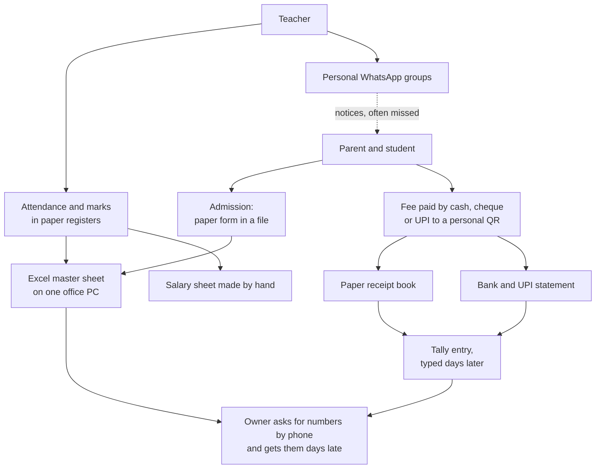
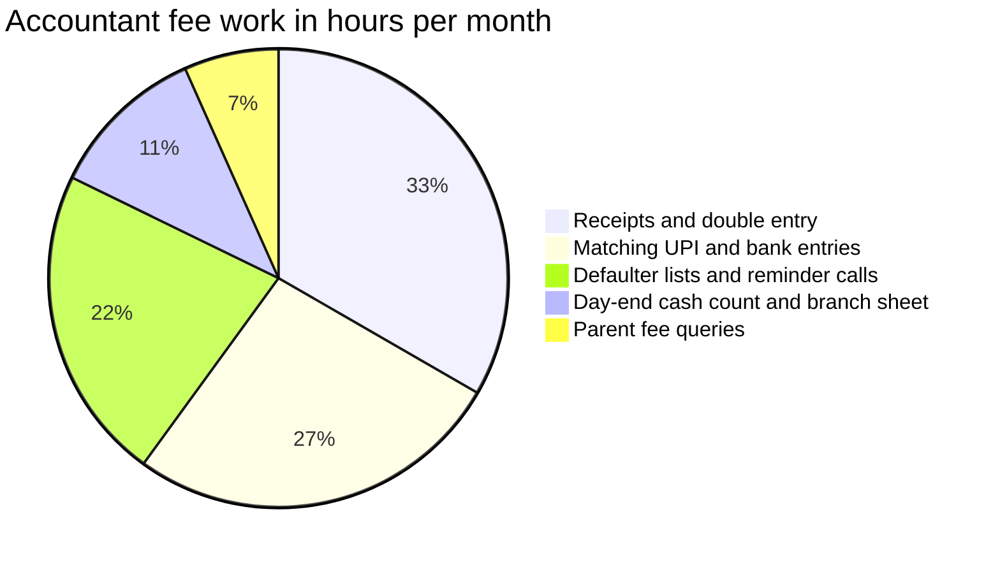
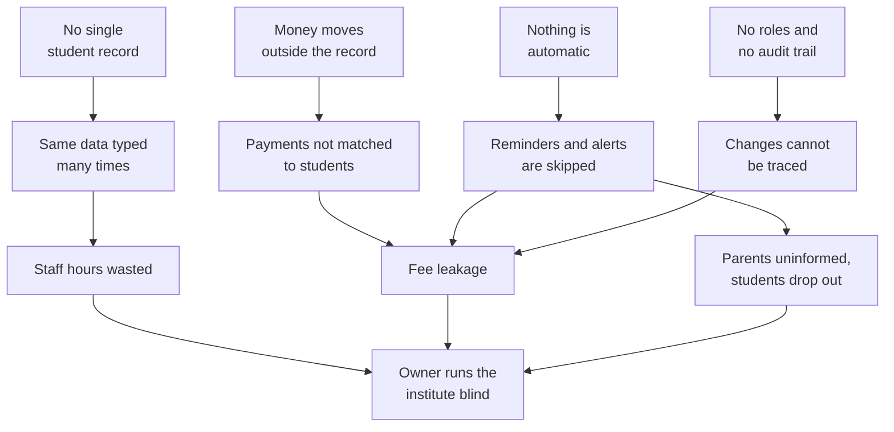
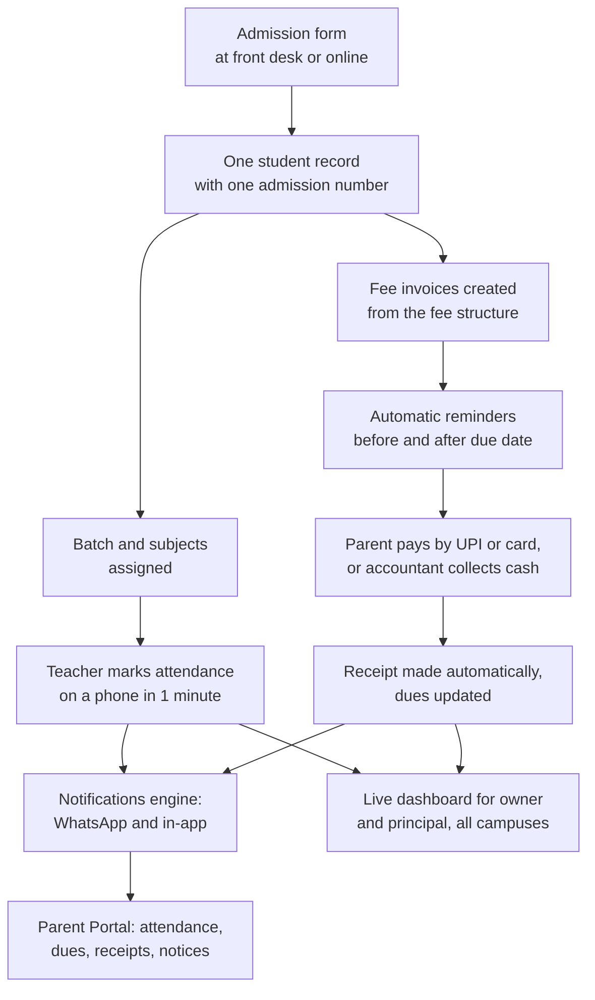

# Problem Statement and Proposed Solution

**In simple words:** This chapter shows how a typical Indian coaching institute and a typical private school run their daily work today, and where they lose time and money. Then it shows how EduFlow replaces the scattered registers, Excel sheets and WhatsApp groups with one system. It also explains why 2026 is the right time to build this, why one founder with Claude Code can build it, and what EduFlow will not build in Phase 1.

> **Note:** Every time and money figure in this chapter is an estimate made by the founder. None of them is a measured fact. Each one will be tested in the pilot interviews described in *Assumptions, Open Questions and Validation Plan*. The formula is shown next to each number so that the inputs can be changed.

## The problem in one page

A small or mid-sized institute in India runs six core processes every day: admission, attendance, fee collection, exams, communication and salaries. Each process uses a different tool. The tools do not talk to each other.

**Problem statement:** Small and mid-sized Indian coaching institutes and private schools run their daily work on paper registers, Excel sheets, receipt books, Tally, personal WhatsApp groups and UPI apps. These tools do not share one student record. So staff type the same data many times, owners see numbers days late, fees leak without anyone noticing, and parents do not know what is happening with their child.

Three terms appear often in this chapter:

- **Tally** is a popular Indian accounting software. It records money, but it knows nothing about students, batches or attendance.
- **UPI** (Unified Payments Interface) is India's instant bank-to-bank payment system. Parents use it through apps such as PhonePe, Google Pay and Paytm.
- **Fee leakage** means fee money that the institute should have received but never did, and nobody noticed. Examples are a forgotten instalment, a discount nobody approved, or cash that was never entered.

The table below shows the six processes and the tools used today.

| Process | Main tool today | Second tool | Who holds the data | Typical failure |
|---|---|---|---|---|
| Admission | Paper form in a file | Excel master sheet | Front desk | Same student is typed 4 to 6 times |
| Attendance | Paper register | None | Each teacher | Parents learn about absence weeks later |
| Fee collection | Receipt book | Excel, Tally, bank app | Accountant | Payments are not matched. Dues are forgotten. |
| Exams and tests | Paper mark lists | Excel | Each teacher | Report card errors. No trend per student. |
| Communication | Personal WhatsApp groups | Diary, SMS pack | Each teacher | Notices are missed. No delivery record. |
| Salaries | Staff register | Excel | Owner or accountant | Disputes about days and lectures |

The institute has a lot of data. But the data is in six places, so nobody can turn it into an answer. A simple question like "who has not paid the August instalment?" takes hours.

This chapter stays on the problem and the solution. Other topics live in their own chapters:

- Market numbers are in *Market Research: India* and *Market Sizing: TAM, SAM and SOM*.
- Existing products and their gaps are in *Competitor Analysis* and *Feature Comparison Matrix*.
- The people behind each role are described in *Customer Personas*.
- The full numbered requirement list is in *Business Requirements Catalog*.

## How institutes work today

### The two sample institutes

All EduFlow documents use the same two sample institutes. The numbers below are illustrative assumptions. They are used only for worked examples.

| Item | Sharma Classes | Bright Future Public School |
|---|---|---|
| City | Patna | Lucknow |
| Type | Coaching institute for JEE and NEET | K-12 private school |
| Students | 350 | 1,200 |
| Campuses | 1 centre | 2 campuses |
| Teaching staff (assumption) | 12 teachers | 50 teachers |
| Academic heads (assumption) | 1 centre head | Principal Dr. Anita Verma plus 1 campus in-charge |
| Office staff (assumption) | 2 front desk and accounts staff | 2 accountants, 2 office clerks |
| Average fee per student per year (assumption) | ₹60,000 | ₹36,000 |
| Yearly fee billing | 350 × ₹60,000 = ₹2.10 crore | 1,200 × ₹36,000 = ₹4.32 crore |
| Fee pattern | 3 instalments per session | Quarterly, with 4 fee heads |
| Tools today | Registers, Excel, receipt book, owner's UPI QR code, WhatsApp groups | Registers, Tally on one PC, Excel, SMS pack, WhatsApp groups |
| EduFlow plan that fits | Pro (₹5,999 per month) | Enterprise (from ₹14,999 per month) |

JEE and NEET are India's national entrance exams for engineering and medical colleges. K-12 means kindergarten to Class 12. A fee head is one named part of the fee, for example tuition, transport, exam fee or annual charges.

> **Note:** We reuse the same sample people in both institutes. Rajesh Sharma is always the owner. Dr. Anita Verma is always the principal. Priya Nair is the teacher, Suresh Gupta is the accountant, Sunita Devi is the parent and Aarav Sharma is the student.

### As-is workflow in a coaching institute

"As-is" means the way work is done today, before any change. Sharma Classes is a good picture of thousands of coaching institutes in Indian cities. The owner, Rajesh Sharma, teaches physics himself and also runs the business.

| Process | How it is done today | Where it breaks |
|---|---|---|
| Enquiry | A walk-in or phone enquiry is written in a diary. The counsellor follows up from memory. | No follow-up list exists. Enquiries get lost in the April to June rush. |
| Admission | Parent fills a paper form. Photo and marksheet copies go into a file. | The same details are typed again into Excel and into the phone. |
| Fee deal | The owner agrees a discount verbally. Someone writes it on the corner of the form. | Later, nobody can prove which discount was approved. |
| Batch allotment | The name is added to the Excel sheet and to the batch WhatsApp group. | A batch change in July is updated in one place and not the other. |
| Attendance | The teacher calls the roll or passes a sign-in sheet. | Parents are not told about absence. Friends sign for each other. |
| Fee collection | 3 instalments by cash, cheque or UPI to the owner's QR code. Receipts come from a carbon-copy book. | The Excel fee sheet is updated once a week. Due dates pass silently. |
| Tests | Weekly test marks are typed into Excel. A photo of the rank list goes to the group. | No trend per student. Every student sees everyone's marks. |
| Communication | Each teacher runs a WhatsApp group from a personal number. | Often only the student is in the group, not the parent. |
| Salaries | Teachers are paid per lecture. The owner counts lectures from a diary. | The lecture count is disputed almost every month. |

> **Example:** An instalment of ₹20,000 is due from a student on 10 August. The student's father pays ₹20,000 by UPI to Rajesh Sharma's personal QR code on 14 August. The bank statement shows only "UPI/R KUMAR/9431xxxxxx". Suresh Gupta at the front desk does not know about it. On 20 August he calls the father to ask for the fee. The father is angry. Suresh then spends 20 minutes finding the entry in the owner's bank app. This happens many times every month.

### As-is workflow in a private school

Bright Future Public School has 1,200 students on 2 campuses. It has more staff and more rules than a coaching institute, but the tools are the same: paper, Excel, Tally and WhatsApp.

| Process | How it is done today | Where it breaks |
|---|---|---|
| Admission | Parent buys a paper form. The office checks birth certificate, Aadhaar copy and TC, then fills the admission register and Excel. | The same details are typed again for fees, class lists and board registration. Spelling errors multiply. |
| Class and section | The principal's office allots sections on paper lists. | By June, the notice board list, the Excel list and the teacher's list do not match. |
| Attendance | The class teacher marks a paper register in the first period. Monthly totals are added by hand. | Attendance percentage is known only at month-end. Low attendance is noticed too late. |
| Fee collection | Fees are quarterly with 4 fee heads. Two accountants write receipts at the counter. | Long queues near the 10th. Late fine is applied unevenly. |
| Second campus | The branch sends a photo of its daily collection sheet on WhatsApp. | The main office retypes it. Totals do not match at month-end. |
| Exams | Teachers fill paper mark lists, then type marks in Excel. Class teachers build report cards by hand. | Every report card season brings totalling errors and reprints. |
| Communication | School diary, printed circulars, a bulk SMS pack and class WhatsApp groups. | Nobody knows which parent actually got the notice. |
| Salaries | The accountant reads the staff register and calculates salaries in Excel. | Leave deductions are disputed. The work takes 2 to 3 days every month. |

TC means transfer certificate. It is the paper a student gets from the old school when moving to a new one. Aadhaar is India's national identity number.

### The fragmented as-is process

**Figure: As-is process — six processes, six tools, no shared record**

Follow any arrow and you find a person copying data from one place to another. The parent's payment touches three tools (receipt book, bank statement, Tally) before the owner sees it. Attendance and marks never reach the parent at all, except as a late WhatsApp message. No box in this picture knows what the other boxes know.

### One student, eight copies

Aarav Sharma studies in Class 10-A at Bright Future Public School. His admission number is `BF-2027-0142`. Today his details live in eight separate places.

| Copy | Where it lives | Who updates it |
|---|---|---|
| 1 | Paper admission form in a file | Front desk |
| 2 | Admission register | Office clerk |
| 3 | Excel master sheet on the office PC | Office clerk |
| 4 | Class 10-A attendance register | Class teacher Priya Nair |
| 5 | Fee register and fee card | Accountant Suresh Gupta |
| 6 | Tally ledger | Accountant Suresh Gupta |
| 7 | Report card Excel file | Class teacher Priya Nair |
| 8 | Phone contacts and WhatsApp groups | Each teacher, on a personal phone |

> **Example:** In August, Aarav's mother Sunita Devi changes her mobile number. She tells the class teacher. Priya Nair updates her own phone contacts. The other seven copies keep the old number. In October, the fee reminder SMS goes to the old number. Sunita Devi misses the due date and pays a late fine of ₹100 that she did not deserve. She blames the school, and she is right.

## Pain points by stakeholder

A stakeholder is any person who is affected by the problem. This section lists the pain of six stakeholders: owner, principal, teacher, accountant, parent and student. Each pain has a real-life example and an estimated cost.

To turn hours into rupees, we use these assumed costs per hour. The formula is monthly pay ÷ 160 working hours, rounded.

| Role | Assumed monthly pay | Cost per hour used here |
|---|---|---|
| Owner | Not a salary. We value the owner's time. | ₹500 |
| Principal or centre head | ₹48,000 | ₹300 |
| Teacher | ₹24,000 | ₹150 |
| Accountant or front desk | ₹18,000 | ₹110 |

### Owner

The owner is the Organization Admin in EduFlow. Rajesh Sharma owns the business risk. He feels every other person's pain as lost money.

| Pain | Concrete example | Estimated cost |
|---|---|---|
| No daily view of money | At 8 pm he calls the front desk to ask how much came in today. He gets a rough number. | About 25 hours a month spent chasing numbers |
| Fee leakage he cannot see | A ₹5,000 discount marked "sir approved" that he never approved. A cash receipt never typed into Excel. | 2% to 5% of yearly fee billing |
| Late payments | Parents pay 30 to 60 days late because nobody reminds them on time. | About ₹62,000 a year for Sharma Classes (worked out below) |
| Dropouts noticed late | A student is absent for 12 days. Nobody tells the owner. The student has joined another institute. | ₹60,000 of yearly fee per lost student |
| Lost enquiries | 600 enquiries a year sit in a diary. About 5% never get a follow-up call. | About 7 lost admissions, or ₹4.2 lakh a year |
| Dependence on one person | The accountant resigns. The only up-to-date Excel file is on his laptop. | 2 to 4 weeks of confusion in fee records |
| Growth is blocked | He wants a second centre. He cannot watch two cash counters with one diary. | The second centre is delayed or runs at a loss |

### Principal

Dr. Anita Verma is the academic head. In a coaching institute the same role is the centre head. Her pain is that she manages quality without data.

| Pain | Concrete example | Estimated cost |
|---|---|---|
| Attendance data arrives late | She gets the list of students below 75% attendance in February. Board exams are in March. | 6 hours a month making absentee lists by hand |
| Report card season | She checks 1,200 report cards for totalling and spelling errors, three times a year. | 30 to 40 hours per term |
| No campus comparison | For the monthly management meeting she collects numbers from both campuses by phone. | 1 full working day every month |
| Parent escalations | A parent says "nobody told me about the unit test". The teacher says the notice was in the group. | 5 to 8 escalations a week, 15 minutes each |
| Teacher admin load | Teachers ask for a free period to finish register totals and mark lists. | Teaching time lost in every exam month |

Adding up the items above, we assume an academic head loses about 30 hours a month in a school and about 20 hours a month in a coaching institute.

### Teacher

Priya Nair is paid to teach. A large part of her week goes into clerical work. *Executive Summary* uses a range of 3 to 5 hours per teacher per week. Here we use the low end of that range: 3 hours a week, or 12 hours a month.

| Pain | Concrete example | Estimated cost per month |
|---|---|---|
| Attendance register | Roll call takes 5 minutes a day. At month-end she adds totals for 40 students by hand. | 3 hours |
| Marks typed three times | Marks go on paper, then into Excel, then into the report card. | 5 hours (averaged across the year) |
| Parent messages on her own phone | Parents message her personal number at 10 pm. She repeats the same notice in the diary and in the group. | 3 hours |
| Lists for the office | The office asks for the class list, fee defaulters' names and bus list again and again. | 1 hour |
| **Total for a school teacher** | | **12 hours** |

A coaching teacher has no report cards and no school diary. We assume 6 hours a month for a coaching teacher. There is also a privacy cost that has no price. Every parent and every student in the batch has the teacher's personal phone number.

### Accountant

Suresh Gupta sits at the fee counter. He is honest and hard-working, but his tools make him slow. Fee reconciliation means checking that every rupee in the bank and in the cash box matches a receipt and a student.

| Task | What he does today | Estimated hours per month |
|---|---|---|
| Writing receipts and double entry | Writes each receipt by hand. Types it into Excel the same evening and into Tally later. | 15 |
| Matching UPI and bank entries | Reads the bank statement line by line and guesses which student paid. | 12 |
| Defaulter lists and reminder calls | Compares the fee register with the class list. Calls parents one by one. | 10 |
| Day-end cash count and branch sheet | Counts cash, tallies the receipt book, retypes the second campus sheet. | 5 |
| Parent fee queries | Answers "how much is pending?" by searching the register. | 3 |
| **Total per accountant** | | **45** |

**Figure: Where one accountant's 45 fee hours go each month (estimate)**

Pure fee reconciliation is the second and fourth slice: 12 + 5 = 17 hours per accountant per month. Bright Future has two accountants, so the school spends about 34 hours a month only on matching money to students. Almost all of the 45 hours is work that software can do on its own.

### Parent

Sunita Devi pays the fee and trusts the institute with her child. She is left out of almost every process.

| Pain | Concrete example | Estimated cost |
|---|---|---|
| Does not know about absence | Aarav misses 4 days of class. She learns about it at the parent-teacher meeting a month later. | Lost trust. A safety risk for the child. |
| Queue at the fee counter | She stands 45 to 60 minutes in the queue near the 10th. She takes half a day off work. | ₹300 to ₹800 of lost wages per visit |
| Lost paper receipt | The school says the April fee is pending. She paid it, but cannot find the receipt. | An argument, and sometimes a second payment |
| Notices buried in the group | The class group has 150 messages a day. The exam date sheet is somewhere inside. | Missed dates and last-minute panic |
| Late fine for forgetting | Nobody reminded her of the due date. | ₹50 to ₹100 per month of delay |
| No view of progress | She sees marks only on the report card, three times a year. | Problems are found too late to fix |

### Student

Aarav Sharma is the reason the institute exists. He has the least information of all.

| Pain | Concrete example | Estimated cost |
|---|---|---|
| No single place for his own data | Timetable is on the notice board, homework in the diary, marks in a group photo. | 10 to 15 minutes a day spent asking friends |
| Marks shared in public | The rank list photo in the WhatsApp group shows every student's marks. | Embarrassment. A privacy complaint waiting to happen. |
| Attendance shortage found late | He learns in February that he is at 71% attendance. | Risk of not being allowed to sit the exam |
| Slow certificates | A bonafide certificate takes 3 to 7 days because the office searches paper files. | Missed deadlines for scholarships and competitions |
| Wrong details copied forward | His name is spelt "Arav" in one register. The error reaches the board registration. | Weeks of correction letters |

A bonafide certificate is a letter from the institute that confirms the student studies there.

### What the pain costs in a year

The tables above give pieces. This section adds them up for both sample institutes.

**Worked example: Sharma Classes (350 students, yearly fee billing ₹2.10 crore)**

| Cost item | Formula (all inputs are estimates) | Yearly cost |
|---|---|---|
| Fee leakage | ₹2.10 crore × 4% | ₹8.40 lakh |
| Cost of late payments | ₹2.10 crore × 20% paid late × 12% yearly cost of money × 45 ÷ 365 days | ₹0.62 lakh |
| Staff time on avoidable admin | 177 hours a month, worth ₹35,900 a month, × 12 | ₹4.31 lakh |
| Lost enquiries | 600 enquiries × 5% not followed up × 25% would have joined = 7 students × ₹60,000 | ₹4.20 lakh |
| **Total estimated cost of the pain** | | **₹17.53 lakh** |

The 4% leakage figure is the same one used in *Executive Summary*. The staff time line comes from this breakdown:

| Role | People | Hours each per month | Total hours | Cost per month |
|---|---|---|---|---|
| Owner | 1 | 25 | 25 | 25 × ₹500 = ₹12,500 |
| Centre head | 1 | 20 | 20 | 20 × ₹300 = ₹6,000 |
| Teachers | 12 | 6 | 72 | 72 × ₹150 = ₹10,800 |
| Front desk and accounts | 2 | 30 | 60 | 60 × ₹110 = ₹6,600 |
| **Total** | | | **177** | **₹35,900** |

**Worked example: Bright Future Public School (1,200 students, yearly fee billing ₹4.32 crore)**

| Cost item | Formula (all inputs are estimates) | Yearly cost |
|---|---|---|
| Fee leakage | ₹4.32 crore × 2% | ₹8.64 lakh |
| Cost of late payments | ₹4.32 crore × 25% paid late × 12% × 45 ÷ 365 days | ₹1.60 lakh |
| Staff time on avoidable admin | 775 hours a month, worth ₹1,30,400 a month, × 12 | ₹15.65 lakh |
| **Total estimated cost of the pain** | | **₹25.89 lakh** |

We use 2% leakage for the school, the low end of the range. Schools collect better than coaching institutes because students stay for many years. The 775 hours are: owner 25, two academic heads 60, fifty teachers 600 and two accountants 90.

Now compare the pain with the price of EduFlow. All prices exclude 18% GST (Goods and Services Tax).

| Item | Sharma Classes | Bright Future Public School |
|---|---|---|
| Estimated yearly cost of the pain | ₹17.53 lakh | ₹25.89 lakh |
| EduFlow plan | Pro, ₹59,990 a year | Enterprise, about ₹1.80 lakh a year at the starting price |
| WhatsApp credits (estimate) | 350 students × 40 messages × ₹0.13 × 12 = about ₹22,000 | 1,200 × 40 × ₹0.13 × 12 = about ₹75,000 |
| Total yearly cost of EduFlow | About ₹0.82 lakh | About ₹2.55 lakh |
| If EduFlow removes only one-third of the pain | ₹5.84 lakh saved | ₹8.63 lakh saved |
| Saving compared with cost | About 7 times | About 3 times |

> **Founder note:** Do not quote these totals to customers as promises. Use them as questions in a sales call: "How many hours does your accountant spend matching UPI payments?" Let the owner fill in his own numbers. His number will convince him more than ours. The sales use of this method is in *Sales Process and Playbooks*.

## Root causes

The pains above are symptoms. If we only treat symptoms, we build a better Excel sheet. EduFlow must remove the causes. We find seven root causes behind all the pains.

| Root cause | What it looks like in the institute | What it leads to |
|---|---|---|
| No single student record | Eight copies of Aarav's details, each updated by a different person | Retyping, spelling errors, old phone numbers |
| Tools built for one task only | Tally knows money but not students. Excel knows students but not payments. | Manual matching every month |
| Data sits on personal devices | Parent numbers on teachers' phones. The fee sheet on one laptop. | Data leaves when the person leaves |
| Money moves outside the record | UPI to a personal QR code. Cash in a drawer. | Payment and student are not linked at the moment of payment |
| Nothing happens automatically | Reminders, absence alerts and late fines all need a person to remember them | The work is skipped on busy days |
| No roles and no audit trail | Everyone opens the same Excel file. Anyone can change or delete a row. | Leakage cannot be traced to a person or a date |
| Older software does not fit | Many school ERPs are desktop-based, made for big schools, and need weeks of training | Small institutes try them, give up and return to Excel |

An audit trail is a log that records who changed what, and when. The last row is the founder's reading of public product information as of September 2026. It must be verified before external use. The product-by-product view is in *Competitor Analysis*.

### Five whys for fee leakage

"Five whys" is a simple method. You ask "why?" five times until you reach the real cause. Here it is applied to the biggest money pain at Sharma Classes.

| Step | Question | Answer |
|---|---|---|
| Problem | What happened? | About ₹8.4 lakh of fees was never collected last year (estimate). |
| Why 1 | Why was it not collected? | About 40 instalments were never paid in full, and some discounts were never approved. |
| Why 2 | Why did nobody chase them? | Nobody knew they were overdue until weeks later. |
| Why 3 | Why did nobody know? | The Excel fee sheet was 2 to 3 weeks behind the receipt book. |
| Why 4 | Why was it behind? | Receipts are written in a book first and typed into Excel later, when there is time. |
| Why 5 | Why are they typed later? | The receipt book, the Excel sheet and the bank account are three systems with no shared student ID. |

The real cause is not a careless accountant. The real cause is that collecting a fee and recording a fee are two separate acts. In EduFlow they are one act.

**Figure: How four root causes turn into business damage**

The top row shows causes. The middle rows show what staff experience. The bottom shows what the owner experiences. Three of the four causes feed fee leakage, which is why fees are the centre of EduFlow Phase 1.

## The proposed solution

EduFlow is a multi-tenant SaaS ERP for education. Three short definitions:

- **SaaS** (software as a service) means the institute uses the software in a browser and pays a subscription. There is nothing to install.
- **ERP** (enterprise resource planning) means one system that runs all the daily operations, instead of many small tools.
- **Multi-tenant** means many institutes use the same running software, but each one sees only its own data.

**Solution statement:** EduFlow gives every student one record, created once at admission. Attendance, fees, payments, exams and messages all read and write that same record. Every action updates the record at the moment it happens. Parents are informed automatically. Owners and principals see the result live, on a phone or a laptop.

The solution follows three working rules.

1. **Record once, at the moment of the action.** Collecting a fee creates the receipt, updates the dues and updates the dashboard in one step. Nobody types it again.
2. **Inform automatically.** An absence, a due date or a payment sends a message without a person remembering to send it.
3. **Show live, by role.** Each person sees the numbers that belong to the role, and nothing more.

The five guiding principles of EduFlow each answer one part of the problem.

| Principle | The problem it answers | How it shows up |
|---|---|---|
| Simplicity | Older software needs weeks of training | An accountant collects the first fee within 10 minutes of first login |
| Automation | Nothing happens unless a person remembers | Reminders, alerts and receipts send themselves |
| Transparency | Parents are left out | Parent Portal and WhatsApp alerts for attendance, dues and receipts |
| Scalability | Growth breaks the diary-and-Excel method | The same account grows from 1 campus to 100 |
| Security | One open Excel file holds everything | Roles, permissions, tenant isolation and an audit trail |

### To-be process with EduFlow

"To-be" means the way work will be done after the change.

**Figure: To-be process — one record, many automatic results**

The numbered steps below explain the picture, using Aarav Sharma as the example.

1. **Admission.** The front desk fills one admission form, or Sunita Devi fills it online. EduFlow creates one student record with the admission number `BF-2027-0142`. Documents are uploaded once.
2. **Batch.** Aarav is enrolled in Section 10-A. His subjects come from the batch. The class list is now correct everywhere, because there is only one list.
3. **Invoices.** A fee invoice is a bill for one due amount. EduFlow creates Aarav's invoices from the Class 10 fee structure, with his approved sibling discount already applied.
4. **Attendance.** Priya Nair opens 10-A on her phone. Everyone is marked present by default. She taps the 3 absent students and saves. It takes about one minute.
5. **Absence alert.** The parents of the 3 absent students get a WhatsApp message within minutes. Sunita Devi does not wait for the parent-teacher meeting.
6. **Reminders.** Three days before the due date, Sunita Devi gets a WhatsApp reminder with the amount and a payment link. Nobody in the office has to remember.
7. **Payment.** She pays by UPI from the link. Or she pays cash at the counter, where Suresh Gupta searches her son's name and clicks Collect. Both ways update the same invoice.
8. **Receipt.** EduFlow creates a numbered receipt, sends it on WhatsApp and stores it in the Parent Portal. A lost paper receipt is no longer a problem.
9. **Dashboard.** Rajesh Sharma sees today's collection, pending dues and attendance for both campuses, live. He stops calling the office at 8 pm.

Exams, report cards, homework and timetable join the same record in Phase 2 (by 1 Feb 2027). Payroll joins in Phase 3 (by June 2027). The release plan is in *Five-Year Roadmap*.

### Before and after: ten daily tasks

All times are estimates for one occurrence of the task. They will be measured during the pilot that starts on 18 Nov 2026.

| Task | Today | With EduFlow | Time today | Time with EduFlow | Phase |
|---|---|---|---|---|---|
| Mark attendance for a batch of 40 | Roll call in a register. Totals added at month-end. | Tap only the absent students on a phone | 5 to 7 min | 1 min | 1 |
| Tell parents about absence | Teacher calls, or nobody does | Automatic WhatsApp alert after attendance is saved | 3 min per parent | 0 min | 1 |
| Collect a fee at the counter | Find the student in the register, write a receipt, type into Excel later | Search name, pick invoice, collect, receipt goes on WhatsApp | 6 to 8 min | 1 min | 1 |
| Know today's collection | Owner phones the accountant, who counts cash and checks the UPI app | Dashboard tile, split by cash, UPI, card and cheque | 20 to 30 min | 10 sec | 1 |
| Make the defaulter list | Compare fee register with class lists | One filter: overdue by more than 7 days | 3 hours | 1 min | 1 |
| Send fee reminders | Call or message each parent one by one | Automatic schedule with a payment link | 2 to 3 min per parent | 0 min | 1 |
| Register a new admission | Paper form, photocopies, Excel entry, new fee card | One form, documents uploaded, invoices created automatically | 25 to 30 min | 8 min | 1 |
| Answer "how much is pending?" | Search the register, call the parent back | Parent sees dues and receipts in the Parent Portal | 5 to 10 min | 0 min of staff time | 1 |
| Send a notice to parents | Post in 12 WhatsApp groups. Some parents miss it. | One announcement to chosen batches, with delivery status | 20 min | 2 min | 1 |
| Enter test marks and share results | Paper, then Excel, then a photo in the group | Enter marks once. Each parent sees only own child's result. | 2 to 3 hours per test | 30 min | 2 |

> **Example:** Bright Future has about 30 sections (1,200 students ÷ 40). If attendance drops from 6 minutes to 1 minute per section per day, the school saves 30 × 5 minutes × 24 working days = 60 teacher hours every month. That is from the first row alone.

### Core capabilities

Seven capabilities deliver the to-be process. Each one maps to named modules, so it can be traced into the product requirements document (PRD).

#### Single source of truth

A single source of truth means there is one official copy of each fact, and every screen reads that copy.

- Each student has one record and one admission number per organization. Attendance, invoices, receipts, marks and messages all link to it.
- When Sunita Devi's phone number changes, staff update it once. Every reminder and every alert uses the new number from that moment.
- Each parent is one guardian record, linked to all of his or her children. Siblings are handled without duplicate entries.
- Institutes can start within one day. Staff import the existing Excel student list in the first session. Assisted data migration is available as an add-on at ₹9,999 one-time.
- Modules: Student Admission (ADM), Student Profile (STU), Batch (BAT), Subjects (SUB), Teachers (TCH), Organizations (ORG). All are Phase 1.

#### Real-time dashboards

A dashboard is one screen that shows the most important numbers. Real-time means the numbers update as soon as the work is done.

- The owner's dashboard shows today's collection by payment mode, total overdue dues, today's attendance percentage, new admissions this month and students absent 3 days in a row.
- Each role gets its own dashboard. The principal sees the campus. The accountant sees finance. The teacher sees own batches.
- Module: Dashboard (DASH) in Phase 1. Deeper reports come with Analytics (ANL) in Phase 2.

> **Example:** At 6 pm Rajesh Sharma opens EduFlow on his phone. Today's collection is ₹1,84,500: UPI ₹1,12,000, cash ₹62,500 and cheque ₹10,000. Dues overdue by more than 7 days are ₹3,40,000 from 22 students. Attendance today is 91%. Four students have been absent 3 days in a row. He reads this in 10 seconds and makes 4 phone calls that matter.

#### Automated fee reminders

Reminders are the fastest way to reduce late payment and leakage. EduFlow uses this default reminder schedule. The institute can change the days and the wording in Settings.

| When | Channel | What the message says | Who gets it |
|---|---|---|---|
| 3 days before the due date | WhatsApp | Amount, due date and payment link | Parent |
| On the due date | WhatsApp and in-app | "Due today", with payment link | Parent |
| 3 days after the due date | WhatsApp | Overdue amount and the late fee rule | Parent |
| 7 days after the due date | WhatsApp and in-app task | Second notice. The student is added to the accountant's call list. | Parent and accountant |
| 15 days after the due date | In-app alert | Escalation list of long-overdue students | Owner and principal |

- Reminders stop the moment the payment is recorded. No parent is reminded after paying.
- Every reminder carries a payment link. Parents pay by UPI, card or netbanking through Razorpay. Gateway charges are passed through at cost, and UPI is low or zero.
- We chose 5 steps because fewer steps lose money and more steps annoy parents. The detailed rules are in the *Fees Module* and *Notifications Module* chapters of the PRD.
- Modules: Fees (FEE), Payments (PAY), Discounts (DSC), Notifications (NTF), WhatsApp (WA). All are Phase 1.

#### Multi-campus

- One organization can have many campuses. Each campus has its own batches, staff, fee counter and reports.
- Staff see only the campuses assigned to them. The owner sees all campuses side by side.
- Bright Future's second campus stops sending a photo of its collection sheet. Its receipts appear on the owner's dashboard as they are made.
- Plan limits: Starter and Growth have 1 campus. Pro has up to 3. An extra campus costs ₹999 per month. Enterprise has no limit.
- Module: Multi Campus (CAMP), Phase 1.

#### Parent Portal

- Parents log in with an OTP (one-time password sent to the phone). There is no password to forget.
- In Phase 1 a parent sees attendance, fee dues, receipts and notices, and can pay online. Homework, marks and report cards are added in Phase 2.
- One login shows all children of the same parent.
- The portal is mobile-first. It works in the phone browser, so parents do not have to install anything. White-label mobile apps come in Phase 4.
- The portal also records parental consent for the child's data, which the DPDP Act 2023 (India's data protection law) requires. Details are in *Compliance, Legal and Data Protection Requirements*.
- Year-1 target: 70% of parents use the portal. Module: Parent Portal (PP), Phase 1.

#### WhatsApp integration

- EduFlow uses the official WhatsApp Cloud API from Meta. Messages go from the institute's business number, not from a teacher's personal phone.
- Meta approves each message format in advance. These formats are called templates. Phase 1 templates cover absence alerts, fee reminders, receipts and notices.
- EduFlow stores the status of every message: sent, delivered, read or failed. The school can finally answer "did the parent get the notice?".
- Messages use prepaid credits. The price is Meta's cost plus 15% margin. We estimate about ₹0.13 per service message. An SMS costs ₹0.25. Meta's prices change, so check the current rate card.
- The free Starter plan does not send WhatsApp messages. It uses in-app and email messages only.
- Phase 1 sends notifications. It is not a chatbot, and it does not replace staff replies to parents.
- Module: WhatsApp (WA), Phase 1. SMS and Email modules follow in Phase 2.

#### Role-based permissions

Role-based access control (RBAC) means each user sees and does only what the role allows.

| Role | What the role sees | Example of the limit |
|---|---|---|
| Organization Admin | Whole organization, all campuses | Rajesh Sharma sees both campuses |
| Principal | Assigned campuses only | Dr. Anita Verma cannot see the other campus unless assigned |
| Teacher | Own batches and subjects | Priya Nair marks 10-A attendance but cannot see fee collection totals |
| Accountant | Finance data of assigned campuses | Suresh Gupta collects fees but cannot change marks |
| Parent | Own children only | Sunita Devi sees Aarav's record, not his classmates' records |
| Student | Own record only | Aarav sees his own attendance and dues |

- The seventh system role, Super Admin, belongs to EduFlow platform staff only.
- Permissions use simple keys such as `fees.collect` and `attendance.mark`. Pro and Enterprise customers can build custom roles such as Front Desk or Transport Manager.
- Every sensitive action is written to the audit trail: a discount, a cancelled receipt, a changed fee amount. The "sir approved" discount now has a name and a time next to it.
- The full matrix is in the *RBAC and Permissions Matrix* chapter of the PRD.

### From pain to capability

This table links each major pain to the capability and module that removes it. Module codes are fixed across all EduFlow documents.

| Pain | Capability | Modules | Phase |
|---|---|---|---|
| Same student typed 4 to 6 times | Single source of truth | ADM, STU, BAT | 1 |
| Parents learn about absence late | WhatsApp integration, Parent Portal | ATT, NTF, WA, PP | 1 |
| Fee leakage and late payment | Automated fee reminders, audit trail | FEE, PAY, DSC, NTF | 1 |
| UPI payments not matched to students | Payment links tied to an invoice | PAY | 1 |
| Owner gets numbers days late | Real-time dashboards | DASH | 1 |
| Second campus runs on photos of sheets | Multi-campus | CAMP | 1 |
| Anyone can edit the Excel file | Role-based permissions and audit trail | Platform RBAC layer, SET | 1 |
| Lost enquiries | Enquiry tracking inside admissions | ADM | 1 |
| Report card errors and marks typed three times | Single source of truth | EXM, RPT | 2 |
| Slow certificates | Single source of truth | CRT | 2 |
| Salary disputes | Single source of truth | STF, LEV, PRL | 2 and 3 |

### How we will know it works

EduFlow succeeds only if the customer's numbers change. The business-level rows are the fixed Year-1 targets used across all EduFlow documents. They are targets, not forecasts. The institute-level rows are the founder's estimates for the pilot.

| Measure | Target | Level |
|---|---|---|
| Activation: first fee receipt or first attendance within 7 days of signup | 60% of new signups | Business, Year 1 |
| Share of fee value collected online | 40% | Business, Year 1 |
| Parents using the Parent Portal | 70% | Business, Year 1 |
| Net Promoter Score (NPS — how likely customers are to recommend us) | 50 or more | Business, Year 1 |
| Accountant hours on fee reconciliation | Down by 70% within 3 months (estimate) | Per institute |
| Dues overdue by more than 30 days | Cut by half within 2 fee cycles (estimate) | Per institute |
| Time to mark attendance for one batch | About 1 minute | Per institute |

The full measurement system is in *KPI Framework and Dashboard*.

## Why now

This problem is not new. Institutes have lived with registers and Excel for 20 years. What is new is that six forces have come together, so a simple, low-priced, phone-first product can now work even in a small town. A seventh force, new rules, adds pressure from the legal side.

| Force | What changed | What it means for EduFlow |
|---|---|---|
| UPI adoption | More than 1,500 crore UPI transactions a month (NPCI, 2025). Parents pay even the vegetable seller by QR code. | Online fee payment feels normal, even in small towns. A payment link in a reminder gets used. |
| WhatsApp penetration | An estimated 50 crore or more WhatsApp users in India (press estimates, unverified). Most parents open it daily. | Alerts reach parents without asking them to install a new app. |
| Cheap smartphones and data | An entry-level 4G smartphone costs about ₹6,000 to ₹8,000. Mobile data costs about ₹10 to ₹15 per GB (estimates). | Every teacher and almost every parent already owns the only device EduFlow needs. |
| NEP 2020 digital push | The National Education Policy 2020 asks for technology in school administration and for richer, continuous assessment. | Schools need clean student-wise digital records. Excel cannot keep up. |
| Post-COVID parent expectations | During 2020 and 2021, parents and teachers used apps for classes, homework and fees. | The habit stayed. Parents now expect updates on the phone. |
| AI | AI coding tools cut the cost of building software. AI can also read clean data and find patterns. | One founder can build the product. Later, AI Insights can warn about dropouts and fee defaults. |
| New rules | The DPDP Act 2023 needs verifiable parental consent. The 2024 coaching centre guidelines ask for clear fees, receipts and records. | Excel and WhatsApp groups cannot prove consent or produce clean records. A proper system can. |

### UPI adoption

Five years ago, a fee payment link would have failed. Parents did not trust online payment, and card charges were high. Today a parent in Patna pays ₹20 for tea by UPI. Paying a ₹20,000 instalment by UPI is the same action. UPI charges are low or zero, so neither the parent nor the institute loses money on the payment. This one change makes "pay from the reminder" possible. It is the base for the Year-1 target of 40% of fee value collected online.

### WhatsApp penetration

Indian parents do not read email, and they ignore SMS because of spam. They do read WhatsApp. Since 2022, Meta offers the WhatsApp Cloud API directly to businesses. Before that, a business had to go through a paid partner. EduFlow connects directly to Meta, so message cost stays low and we control the quality. For the parent, nothing changes. The message simply arrives in the app she already uses 20 times a day.

### Cheap smartphones and data

EduFlow does not ask an institute to buy computers, biometric machines or servers. A teacher marks attendance on her own phone. A parent opens the Parent Portal in the phone browser. The office needs one laptop and a printer, which it already has. This removes the hardware cost that blocked school software in small towns ten years ago.

### NEP 2020 digital push

NEP 2020 is India's National Education Policy. It asks schools to use technology for planning, administration and assessment. It moves schools away from one final exam towards continuous assessment and a holistic progress card (a report card that also covers skills and activities, not only marks). The government has also built national digital systems for school and student data. All of this means more student-wise data work every year. A school that runs on paper will need more clerks. A school on EduFlow will need fewer clicks.

### Post-COVID parent expectations

During the school closures of 2020 and 2021, even small schools used apps and video calls. Online classes mostly stopped when schools reopened. But the expectation did not stop. A parent who can track a ₹200 food order minute by minute now asks a fair question: "Why can I not see whether my child reached class?" Institutes that answer this question win admissions by word of mouth. Institutes that do not answer it lose them.

### AI

AI helps EduFlow in two ways. First, it cuts the cost of building the product. The next section explains how. Second, it makes the product more valuable over time. Once an institute's data sits clean in one system, AI can find patterns that a busy owner misses, such as a student whose attendance is falling or a family that is likely to default. This is the AI Insights module, planned for Phase 4 by September 2027. AI Insights needs about a year of clean data to be useful. That is one more reason to start collecting clean data now.

### Timing of the launch

Schools decide on software between January and March, before the new session starts in April. Coaching institutes buy all year, with a peak before new batches start between April and June. The 60-day sprint ends on 3 Dec 2026. The pilot starts on 18 Nov 2026. Paid launch is in January 2027. This puts EduFlow in front of buyers exactly when they are deciding for the April 2027 session. The launch plan is in *Go-To-Market Strategy*.

## Why a solo founder with Claude Code can build this now

Claude Code is Anthropic's AI coding assistant. It works inside the developer's terminal and code editor. It reads the whole codebase, writes code across many files, runs the tests and fixes the errors it finds. The founder, Mehdi Alam, directs it and reviews its work.

A school ERP used to need a team of six to eight people. Five things make it possible for one founder in 2026.

1. **ERP work is pattern work.** The 34 modules look different to the user, but they share one pattern: a list screen, a form, a detail page, API endpoints, permissions and tests. Once the pattern is built well for one module, an AI assistant repeats it fast and consistently.
2. **The specification comes first.** The canon of fixed facts, the validated Prisma database schema, the API registry and the PRD module chapters tell Claude Code exactly what to build. The Founder Blueprint holds 60 ready prompts, numbered P-01 to P-60. Clear input gives consistent output.
3. **Managed services replace infrastructure work.** Payments, messaging, email, file storage and hosting are rented, not built.
4. **Open-source building blocks are mature.** Next.js, shadcn/ui, Prisma and BullMQ give screens, database access and background jobs without writing them from zero.
5. **Multi-tenant SaaS means one product to run.** There is one deployment for all customers. There are no on-site installations and no customer-specific versions.

| Need | What a team had to build or hire before | What EduFlow rents today |
|---|---|---|
| Online payments | Bank tie-ups and a payments developer | Razorpay in India, Stripe abroad |
| Parent messaging | SMS vendor contracts and a WhatsApp partner | WhatsApp Cloud API direct from Meta, MSG91 for SMS |
| Email | A mail server and an administrator | Amazon SES |
| File storage | Own servers and backups | AWS S3 in the Mumbai region |
| Hosting | A server administrator | Vercel and Railway at the start, AWS later |
| Error tracking | A testing and support team | Sentry and automated tests |

### Team build compared with solo build

All figures below are estimates. The final numbers are in *Financial Plan and Projections*.

| Item | Traditional small team | Solo founder with Claude Code |
|---|---|---|
| People | 1 product manager, 1 designer, 3 developers, 1 tester | 1 founder |
| Time to MVP | 6 to 9 months | 60 days: 5 Oct 2026 to 3 Dec 2026 |
| Cost to MVP | 6 people × ₹1 lakh a month × 8 months = about ₹48 lakh | Tools and hosting of about ₹25,000 a month, plus the founder's living costs |
| Coordination | Daily meetings, handovers, documents that go out of date | None. One person holds the whole product in one head. |
| Main risk | Money runs out before launch | The founder is a single point of failure |

MVP means minimum viable product. It is the smallest version that a real customer can use and pay for.

### The sprint arithmetic

- The sprint has 60 days and 8 Sundays. That leaves 52 working days.
- The daily rhythm is about 6 focused build hours, 2 sales and customer hours, and 30 minutes of review.
- 52 days × 6 hours = about 312 build hours for 16 Phase 1 modules plus the foundation.
- Weeks 1 and 2 build the foundation: repository, database, multi-tenancy, login and roles. Weeks 3 to 8 build the modules. Week 9 fixes pilot feedback.
- The pilot with 5 friendly institutes starts on Day 45 (18 Nov 2026), before the sprint ends. Real users find problems that tests do not.

### What Claude Code does and what the founder must do

| Work | Claude Code does | The founder must do |
|---|---|---|
| Code | Writes routine code, database migrations, tests and documentation | Reviews every change. Keeps the code true to the canon. |
| Bugs | Reads error logs and proposes fixes | Confirms each fix with real data |
| Security | Runs checklist reviews of each module | Owns the tenant isolation tests and never skips them |
| Customers | Drafts help articles and release notes | Talks to owners, runs demos, supports the pilot |
| Decisions | Lists options with pros and cons | Chooses, and says no |

> **Warning:** AI writes code fast. It also writes mistakes fast. One leak of data between two institutes would end the business. So the safety rules are fixed: every tenant table carries `organization_id`, automated tests try to read another tenant's data and must fail, and nothing goes to production without passing through staging. Tenant isolation means one institute can never see another institute's data. The full risk list is in *Risk Analysis and Mitigation*.

A solo start is not a solo company forever. The plan is a team of 4 by the end of Year 1. The hiring order is in *Organization and Hiring Plan*.

## What EduFlow will not do in Phase 1

Phase 1 here means the MVP built in the 60-day sprint that ends on 3 Dec 2026. A solo founder wins by saying no. Every feature below was considered and refused for Phase 1, with a reason.

> **Rule:** A feature enters Phase 1 only if it helps an institute do one of four things: admit a student, mark attendance, collect a fee or inform a parent.

### Five things we will not build

| Not in Phase 1 | Why not | What institutes do instead | When we look again |
|---|---|---|---|
| LMS video hosting | Storing and streaming video is costly and is a different product. Our customers teach in classrooms. | Paste YouTube or Google Drive links into Homework (Phase 2) | Not before Year 2, and only if paying customers ask in large numbers |
| Live classes | It needs real-time video systems. Zoom and Google Meet already do it well at low cost. | Share the meeting link in a notice | No plan to build. Link only. |
| AI proctoring | It watches children through a camera, which is sensitive under the DPDP Act. Our customers hold exams on paper. | Paper exams. The Exams module (Phase 2) records the marks. | No plan. AI Insights reads attendance and fee data, never cameras. |
| Marketplace | Selling courses or tutors is a two-sided business that needs big marketing money. Institutes would fear we take their students. | Institutes run their own admissions. EduFlow tracks the enquiries they bring. | Not before Year 3 |
| Government integrations | Each portal has its own format and access rules. Most give no open connection to small vendors (assumption). | Clean Excel and CSV exports for manual upload. Custom fields in Settings hold government ID numbers. | Year 2, when schools become a larger share of customers |

An LMS (learning management system) is software that delivers courses, videos and quizzes online. AI proctoring is software that watches a student through the camera during an online exam. A marketplace is a platform where many sellers meet many buyers. Government integrations here mean direct connections to school data portals, student ID registries, board registration portals and state scholarship portals.

Two integrations are in Phase 1 because the core job fails without them: Razorpay for online fee payment and the WhatsApp Cloud API for parent messages.

### Planned, but not in Phase 1

These features are part of EduFlow. They are simply not part of the first 60 days.

| Feature group | Phase | Ready by |
|---|---|---|
| Staff, Leave, Timetable, Homework, Exams, Report Cards | Phase 2 | 1 Feb 2027 |
| Scholarships, Student Portal, Email, SMS, Certificates, Analytics | Phase 2 | 1 Feb 2027 |
| Library, Inventory, Transport, Hostel, Payroll | Phase 3 | June 2027 |
| AI Insights, international packs, white-label mobile apps | Phase 4 | September 2027 |

This order has a business effect. Coaching institutes can run fully on Phase 1. Most schools will wait for Exams and Report Cards in Phase 2. So the first paying customers will be coaching institutes, as explained in *Customer Segments and Ideal Customer Profile*.

> **Tip:** When a prospect asks for live classes, do not apologise. Say: "Keep using Zoom or Google Meet. They are very good at it. Put the link in EduFlow, and EduFlow will tell the parents." Then bring the talk back to fees and attendance. The complete scope list is in *Business Objectives, Scope and Stakeholders*.

## Sources

- NPCI (National Payments Corporation of India), UPI Product Statistics, 2025. Monthly transaction volume, rounded. Verify the latest month before external use.
- Ministry of Education, Government of India, National Education Policy 2020.
- Ministry of Education, Government of India, Guidelines for Regulation of Coaching Centres, January 2024.
- Government of India, Digital Personal Data Protection Act 2023 and DPDP Rules.
- Meta, WhatsApp Business Platform documentation and rate card, 2025. Per-message prices change. Verify before quoting.
- WhatsApp user numbers, smartphone prices and mobile data prices are press estimates. They are not verified.
- All hours, costs, leakage percentages and savings in this chapter are founder estimates. They will be validated in the pilot, as listed in *Assumptions, Open Questions and Validation Plan*.

## Key takeaways

- Institutes run six processes on six tools that share no student record. The same student is typed 4 to 6 times, and one student's details can live in eight places.
- The pain has a price. Our estimate is about ₹17.5 lakh a year for a 350-student coaching institute and about ₹25.9 lakh a year for a 1,200-student school. Fee leakage of 2% to 5% is the largest single item for coaching.
- The root cause is that doing the work and recording the work are two separate acts. EduFlow makes them one act, on one record.
- Seven capabilities deliver the solution: single source of truth, real-time dashboards, automated fee reminders, multi-campus, Parent Portal, WhatsApp integration and role-based permissions. All seven are in Phase 1.
- The timing is right because of UPI, WhatsApp, cheap smartphones, NEP 2020, post-COVID parent expectations, AI and new data and coaching rules.
- One founder with Claude Code can build the MVP in 60 days because ERP work is pattern work, the specification is written first, and payments, messaging and hosting are rented.
- Phase 1 says no to LMS video hosting, live classes, AI proctoring, a marketplace and government integrations. It says yes only to admitting students, marking attendance, collecting fees and informing parents.

