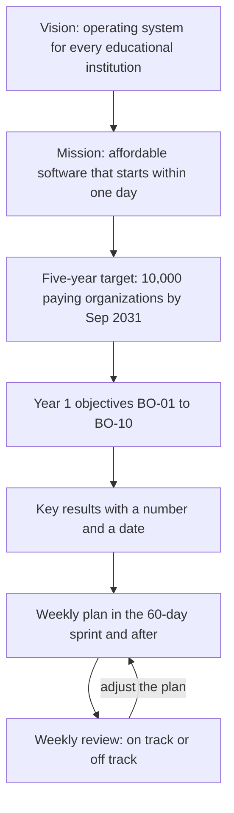
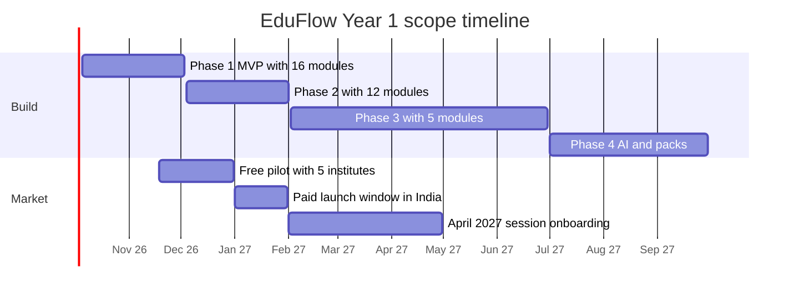
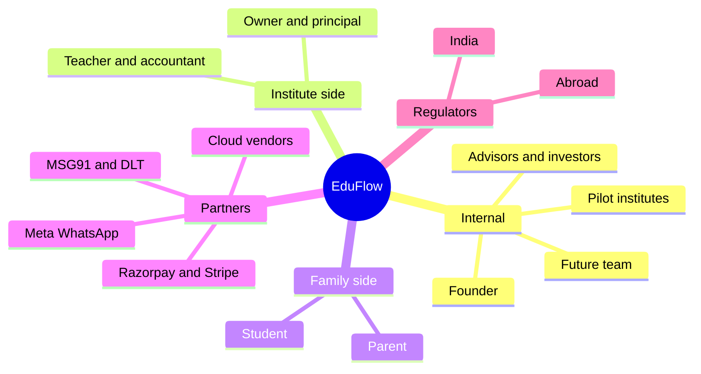
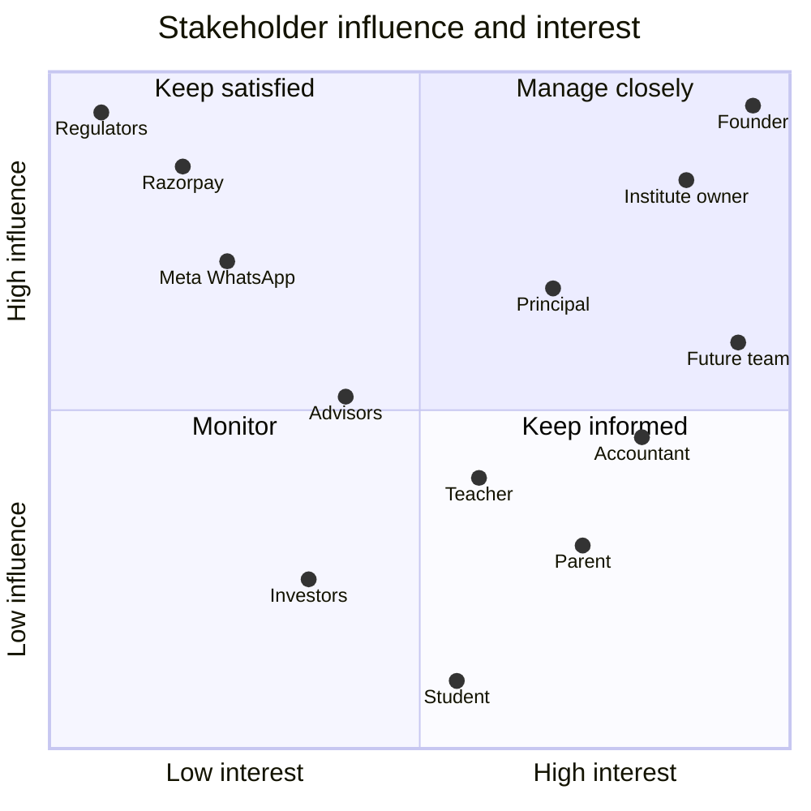
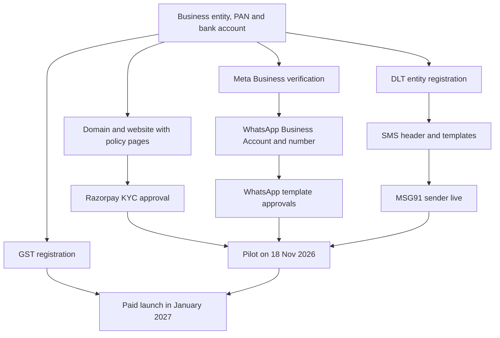

# Business Objectives, Scope and Stakeholders

**In simple words:** This chapter says what EduFlow must achieve, what we will build, what we will not build, and who is affected. It turns the canon targets into clear objectives with numbers and dates. It also lists the people and companies we depend on, and the assumptions, limits and outside approvals that can help or block the plan. After reading it, the founder should know what "success" means and what to say "no" to.

## How to use this chapter

Every item in this chapter has a short ID. Use the ID in task lists, sprint notes and review meetings.

| Prefix | Meaning | Example |
|---|---|---|
| BO | Business objective (a result the business must reach) | BO-03 |
| KR | Key result (a number that proves an objective is met) | KR-3.1 |
| CSF | Critical success factor (a thing that must go right) | CSF-02 |
| SH | Stakeholder (a person or company that affects us, or is affected by us) | SH-05 |
| A | Assumption (something we believe but have not proved yet) | A-04 |
| C | Constraint (a limit we must work inside) | C-01 |
| D | Dependency (something an outside party must give or approve) | D-05 |

> **Rule:** Every business number from the canon is a target, not a forecast. A target is what we aim for. A forecast is what we expect to happen. Numbers marked "estimate" or "assumption" are working values of this chapter and must be tested.

## From vision to weekly work

The vision is big: become the operating system for every educational institution. A vision cannot be checked on a Monday morning. So we break it into smaller pieces until each piece has a number and a date.

**Figure: How the vision becomes weekly work**

The figure shows a chain. The vision sets the mission. The mission sets the five-year target. The target sets the Year 1 objectives. Each objective has key results. The key results drive the weekly plan, and the weekly review sends corrections back into the plan.

We write every objective in SMART form. SMART means Specific (clear), Measurable (has a number), Achievable (possible with our means), Relevant (helps the vision) and Time-bound (has a date).

## Business objectives for Year 1

Business Year 1 runs from October 2026 to September 2027. It has three jobs: build the product, prove that institutes will pay, and prove that they stay.

| ID | Objective | Measure | Target | Deadline | Why it matters |
|---|---|---|---|---|---|
| BO-01 | Ship the MVP (minimum viable product — the smallest product a customer can really use) | Phase 1 modules live in production | 16 of 16 modules | 3 Dec 2026 (Day 60) | Nothing else can start without it |
| BO-02 | Prove it with real institutes | Friendly pilot institutes using it free, every week | 5 institutes | Pilot starts 18 Nov 2026; all 5 active by 31 Dec 2026 | Real use finds the real problems before paid launch |
| BO-03 | Launch paid in India and grow revenue | Paying organizations and MRR | 120 paying; MRR ₹6 lakh; ARR ₹72 lakh | Launch January 2027; target 30 Sep 2027 | Proves the business, funds the first hires |
| BO-04 | Build a free user base | Starter organizations, active students, free-to-paid conversion | 300 free; 60,000 students; 15% | 30 Sep 2027 | Free users bring referrals and future upgrades |
| BO-05 | Make sure customers get real value | Activation, online fee share, parent adoption, NPS | 60%; 40%; 70%; 50+ | Measured monthly from Feb 2027; met by 30 Sep 2027 | Value today is renewal tomorrow |
| BO-06 | Keep the customers we win | Monthly logo churn | Under 3% a month | Every month after launch | A leaking bucket cannot be filled |
| BO-07 | Keep unit economics healthy | CAC, LTV:CAC, gross margin | Under ₹12,000; above 4:1; 80%+ | 30 Sep 2027 | Growth must not burn cash we do not have |
| BO-08 | Finish the product roadmap | Phase 2, Phase 3 and Phase 4 releases | 12 + 5 + 1 modules | 1 Feb 2027; June 2027; Sep 2027 | Pro and Enterprise plans need these modules |
| BO-09 | Earn trust on data and uptime | Cross-tenant data leaks; parental consent flow; uptime | Zero leaks; consent live before pilot; 99.5% uptime (assumption) | From 18 Nov 2026, always | One leak of children's data can end the company |
| BO-10 | Stay independent and build the core team | MRR reached without outside money; team size | ₹3–5 lakh MRR bootstrapped; team of 4 | 30 Sep 2027 | Keeps control with the founder and gives a choice on funding |

Terms used in the table, in one line each:

- **MRR** (monthly recurring revenue) is the subscription money that comes in every month.
- **ARR** (annual recurring revenue, run-rate) is MRR × 12.
- **ARPA** (average revenue per account) is MRR ÷ paying organizations.
- **Logo churn** is the share of paying organizations that cancel in a month.
- **Activation** means a new organization issues its first fee receipt or marks its first attendance within 7 days of signup.
- **NPS** (Net Promoter Score) is the share of happy customers minus the share of unhappy customers, from one survey question.
- **CAC** (customer acquisition cost) is all sales and marketing spend ÷ new paying customers.
- **LTV** (lifetime value) is the gross profit one customer gives before it leaves.
- **Gross margin** is revenue minus the direct cost of serving customers, as a share of revenue.
- **Tenant** is one customer organization inside our shared system. A cross-tenant leak means one institute sees another institute's data.

> **Example:** SMART check for BO-03. **Specific:** 120 organizations in India on a Growth, Pro or Enterprise plan. **Measurable:** count of active paid subscriptions on 30 Sep 2027, read from the billing records. **Achievable:** the paid launch is in January 2027, so there are 9 selling months. 120 ÷ 9 = about 13 new customers a month, or 3 a week. **Relevant:** ₹6 lakh MRR is above the ₹3–5 lakh bootstrap line and pays for the first three hires. **Time-bound:** 30 Sep 2027, with checkpoints on 31 Mar 2027 and 30 Jun 2027.

### Checkpoint path inside Year 1

The Year 1 target is too far away to steer by. So we set a checkpoint at the end of each quarter. The end values come from the canon. The values in between are estimates of this chapter.

| Quarter | Dates | Paying orgs (total) | Free orgs (total) | MRR at quarter end | Main focus |
|---|---|---|---|---|---|
| Q1 | Oct–Dec 2026 | 0 | 5 pilots | ₹0 | Build MVP, run the pilot, start Phase 2 |
| Q2 | Jan–Mar 2027 | 30 | 80 | ₹1.2 lakh (30 × ₹4,000) | Paid launch, buying season before the April session |
| Q3 | Apr–Jun 2027 | 70 | 180 | ₹3.15 lakh (70 × ₹4,500) | Onboard for new session, coaching admission season, Phase 3 |
| Q4 | Jul–Sep 2027 | 120 | 300 | ₹6 lakh (120 × ₹5,000) | Phase 4, first hires, referrals |

ARPA rises through the year for two reasons. First, the Pro plan share grows once Phase 3 modules ship in June 2027. Second, WhatsApp and SMS credit use grows as parents join. Around June 2027 the MRR crosses ₹3 lakh (estimate). That is the point where the canon allows the founder to think about a seed round. The month-by-month model in *Financial Plan and Projections* governs if any number differs.

### How the ₹6 lakh MRR target can be built

This is one possible plan mix. It is an illustration, not a forecast. It uses monthly list prices from the canon.

| Revenue line | Organizations | Price per month | MRR |
|---|---|---|---|
| Growth plan | 72 | ₹2,499 | ₹1,79,928 |
| Pro plan | 40 | ₹5,999 | ₹2,39,960 |
| Enterprise plan | 8 | ₹14,999 | ₹1,19,992 |
| Add-ons (WhatsApp credit margin, SMS packs, extra campus, AI Insights) | 120 | about ₹500 each | ₹60,120 |
| **Total** | **120** | **ARPA ₹5,000** | **₹6,00,000** |

Formula: ARPA = total MRR ÷ paying organizations = ₹6,00,000 ÷ 120 = ₹5,000.

> **Warning:** A customer on yearly billing pays 10 months for 12. For MRR we count the yearly price ÷ 12, so Growth becomes ₹24,990 ÷ 12 = ₹2,083. If half of all customers choose yearly billing, plan MRR falls by about 8% (about ₹45,000). We then need about 9 more customers, or more add-on revenue, to reach ₹6 lakh. Yearly billing is still good: it brings cash early and lowers churn.

### How the 60,000 active students target can be built

| Segment | Organizations | Average active students (estimate) | Students |
|---|---|---|---|
| Starter (free, up to 50) | 300 | 34 | 10,200 |
| Growth (up to 300) | 72 | 180 | 12,960 |
| Pro (up to 1,000) | 40 | 600 | 24,000 |
| Enterprise (unlimited) | 8 | 1,600 | 12,800 |
| **Total** | **420** | **about 143** | **59,960** |

The table shows that 48 Pro and Enterprise customers carry more than 60% of all students. Sharma Classes (350 students) fits the Pro plan. Bright Future Public School (1,200 students, 2 campuses) fits Enterprise by student count. A few large customers matter a lot for this target.

### How the free-to-paid target connects to the customer count

Free-to-paid conversion is the share of Starter signups that move to a paid plan. The working definition here is: upgrades within 90 days of signup ÷ Starter signups (assumption; *KPI Framework and Dashboard* governs).

One consistent picture for Year 1 (estimate):

1. About 365 organizations sign up on Starter during the year.
2. 15% of them upgrade: 365 × 15% = about 55 paying customers from self-serve.
3. The other 65 paying customers come from direct sales: demo, then paid plan.
4. About 10 free accounts go inactive and are closed.
5. Free organizations at year end: 365 − 55 − 10 = 300. Paying: 55 + 65 = 120.

The full funnel, with channels and costs, is in *Go-To-Market Strategy* and *Sales Process and Playbooks*.

## Business objectives for Year 2 to Year 5

The canon fixes the end-of-year targets. This chapter adds the main theme of each year and turns the targets into objectives.

| End of | Paying orgs | ARPA per month | MRR | ARR run-rate | Team | Main theme |
|---|---|---|---|---|---|---|
| Year 1 (Sep 2027) | 120 | ₹5,000 | ₹6 lakh | ₹72 lakh | 4 | Build, launch in India, prove retention |
| Year 2 (Sep 2028) | 500 | ₹6,000 | ₹30 lakh | ₹3.6 crore | 14 | Scale India city by city; enter UAE; optional seed round |
| Year 3 (Sep 2029) | 1,500 (100 international) | ₹7,500 | ₹1.1 crore | ₹13.5 crore | 40 | USA and Australia pilots; school groups |
| Year 4 (Sep 2030) | 4,000 (500 international) | ₹8,500 | ₹3.4 crore | ₹41 crore | 95 | Enterprise, partners, international growth |
| Year 5 (Sep 2031) | 10,000 (1,500 international) | ₹9,500 | ₹9.5 crore | ₹114 crore | 220 | Category leader for small and mid-size institutions |

Formula check: MRR = paying organizations × ARPA. For Year 3: 1,500 × ₹7,500 = ₹1.125 crore, shown as ₹1.1 crore. ARR = MRR × 12 = ₹13.5 crore.

| ID | Objective (Year 2 to Year 5) | Target | Deadline |
|---|---|---|---|
| BO-11 | Scale India from 120 to 500 paying organizations | 500 paying; MRR ₹30 lakh | 30 Sep 2028 |
| BO-12 | Enter the UAE with Indian-curriculum schools first | First paying UAE schools on AED pricing | Year 2 (by Sep 2028) |
| BO-13 | Run USA and Australia pilots and build an international base | 100 international paying organizations | 30 Sep 2029 |
| BO-14 | Raise ARPA through plan mix, add-ons and international pricing | ₹5,000 to ₹9,500 | 30 Sep 2031 |
| BO-15 | Build the team without losing speed | 4 to 14 to 40 to 95 to 220 people | Each September |
| BO-16 | Reach the five-year target | 10,000 paying (1,500 international); ARR ₹114 crore | 30 Sep 2031 |
| BO-17 | Decide on funding from a position of strength | Optional seed round of ₹3–5 crore after ₹3–5 lakh MRR | Year 2 |

Three sanity checks help the founder see if these targets hang together.

| Check | Year 1 | Year 2 | Year 3 | Year 4 | Year 5 |
|---|---|---|---|---|---|
| Growth in paying orgs over the previous year | start | 4.2 times | 3.0 times | 2.7 times | 2.5 times |
| International share of paying orgs | 0% | small (UAE entry) | 6.7% | 12.5% | 15% |
| ARR per team member (ARR ÷ team) | ₹18 lakh | ₹25.7 lakh | ₹33.8 lakh | ₹43.2 lakh | ₹51.8 lakh |

Growth slows each year, which is normal as the base gets bigger. ARR per team member rises each year, which means the company becomes more efficient as it grows.

> **Example:** Why international customers lift ARPA. The Growth plan costs ₹2,499 in India. In the USA it costs $79, which is ₹6,715 at the planning rate of ₹85. In the UAE it costs AED 299, which is ₹6,877 at ₹23. In Australia it costs A$119, which is ₹6,664 at ₹56. One international Growth customer brings about 2.7 times the revenue of an Indian one.

## Objectives and key results

OKR means "objectives and key results". The objective says where we want to go. The key results are the numbers that prove we arrived. Each key result below has a target, a date and the place where we will see the evidence.

### Build and pilot

| KR | Key result | Target | Due date | Evidence |
|---|---|---|---|---|
| KR-1.1 | Phase 1 modules pass their acceptance criteria | 16 of 16 | 3 Dec 2026 | Acceptance checklists in the PRD module chapters |
| KR-1.2 | Tenant isolation tests pass in the automated test run | 100% pass | 3 Dec 2026 | CI test report on GitHub Actions |
| KR-1.3 | A new institute goes from signup to first fee receipt | Within 1 day | 15 Dec 2026 | Timed with the 5 pilots |
| KR-2.1 | Pilot institutes onboarded with their real student data | 5 | 30 Nov 2026 | Organization list in the Super Admin console |
| KR-2.2 | Pilots that mark attendance at least 4 days a week, 4 weeks in a row | 5 of 5 | 31 Dec 2026 | Attendance usage report |
| KR-2.3 | Pilots that agree to pay at launch and give a written testimonial | 3 of 5 | 15 Jan 2027 | Signed pilot feedback form |
| KR-8.1 | Phase 2 (V1.0) modules live | 12 of 12 | 1 Feb 2027 (Day 120) | Release notes |
| KR-8.2 | Phase 3 (V1.5) modules live | 5 of 5 | 30 Jun 2027 | Release notes |
| KR-8.3 | Phase 4 (V2.0) live: AI Insights, international packs, white-label apps | 3 of 3 | 30 Sep 2027 | Release notes |

### Growth

| KR | Key result | Target | Due date | Evidence |
|---|---|---|---|---|
| KR-3.1 | Paying organizations | 30, then 70, then 120 | 31 Mar, 30 Jun, 30 Sep 2027 | Billing records |
| KR-3.2 | MRR | ₹6 lakh | 30 Sep 2027 | Billing records |
| KR-3.3 | Blended ARPA | ₹5,000 | 30 Sep 2027 | MRR ÷ paying organizations |
| KR-4.1 | Free Starter organizations | 300 | 30 Sep 2027 | Organization list by plan |
| KR-4.2 | Active students on the platform | 60,000 | 30 Sep 2027 | Count of students with status active |
| KR-4.3 | Free-to-paid conversion | 15% | Each monthly cohort from Mar 2027 | Signup cohort report in PostHog |

### Customer value and retention

| KR | Key result | Target | Due date | Evidence |
|---|---|---|---|---|
| KR-5.1 | Activation within 7 days of signup | 60% | Monthly from Feb 2027 | First receipt or first attendance event |
| KR-5.2 | Online share of fee value collected | 40% | 30 Sep 2027 | Payments by mode report |
| KR-5.3 | Parent portal adoption | 70% | 30 Sep 2027 | Parent logins in the last 30 days |
| KR-5.4 | NPS from institute owners and staff | 50+ | Surveys in Jun and Sep 2027 | In-app survey |
| KR-6.1 | Monthly logo churn | Under 3% | Every month | Cancelled ÷ paying at month start |
| KR-6.2 | New paying customers who get an onboarding call within 48 hours (assumption) | 100% | From January 2027 | Onboarding tracker |

### Economics, trust and team

| KR | Key result | Target | Due date | Evidence |
|---|---|---|---|---|
| KR-7.1 | CAC | Under ₹12,000 | Average for Jan–Sep 2027 | Spend sheet ÷ new paying customers |
| KR-7.2 | LTV:CAC | Above 4:1 | 30 Sep 2027 | Formula in the next section |
| KR-7.3 | Gross margin | 80% or more | From Apr 2027 | Monthly profit and loss sheet |
| KR-9.1 | Cross-tenant data incidents | Zero | Always | Incident log, Sentry alerts |
| KR-9.2 | Verifiable parental consent flow live | Live | 18 Nov 2026 (pilot start) | Consent records in the database |
| KR-9.3 | Monthly uptime of the web app and API (assumption) | 99.5% | From January 2027 | Uptime monitor |
| KR-9.4 | Backup restore test passes (assumption) | Once a quarter | From Dec 2026 | Restore test note |
| KR-10.1 | MRR of ₹3 lakh reached with no outside funding (estimate) | ₹3 lakh | 30 Jun 2027 | Billing records, bank statement |
| KR-10.2 | Team size | 4 people | 30 Sep 2027 | See *Organization and Hiring Plan* |
| KR-10.3 | Cash in bank never below 3 months of spend (assumption) | 3 months | Always | Monthly cash sheet |

> **Best practice:** Review the key results every Sunday evening for 30 minutes. Mark each one green, amber or red. Pick only one red item to fix in the coming week. A solo founder cannot fix five things at once.

## Success metrics

This section gives the formula and the alarm levels for the numbers that define success in Year 1. The full metric list, with dashboards, is in *KPI Framework and Dashboard*.

| Metric | Formula | Year 1 target | Review |
|---|---|---|---|
| Paying organizations | Count of organizations with an active paid subscription | 120 | Weekly |
| MRR | Sum of monthly subscription value, yearly plans ÷ 12, plus recurring add-ons | ₹6 lakh | Weekly |
| ARPA | MRR ÷ paying organizations | ₹5,000 | Monthly |
| Free organizations | Count of active Starter organizations | 300 | Monthly |
| Active students | Students with active status across all organizations | 60,000 | Monthly |
| Free-to-paid conversion | Upgrades within 90 days ÷ Starter signups in the cohort | 15% | Monthly |
| Activation | Signups with first receipt or attendance in 7 days ÷ all signups | 60% | Weekly |
| Monthly logo churn | Paid organizations that cancelled in the month ÷ paid at month start | Under 3% | Monthly |
| Online fee share | Fee value paid online ÷ total fee value recorded | 40% | Monthly |
| Parent adoption | Students with a guardian login in the last 30 days ÷ active students | 70% | Monthly |
| NPS | % promoters (score 9–10) − % detractors (score 0–6) | 50+ | Twice a year |
| CAC | Sales and marketing spend ÷ new paying organizations | Under ₹12,000 | Monthly |
| LTV:CAC | (ARPA × gross margin ÷ monthly churn) ÷ CAC | Above 4:1 | Quarterly |
| Gross margin | (Revenue − cost of service) ÷ revenue | 80%+ | Monthly |

### Worked examples

**LTV and LTV:CAC.** Use the target values. LTV = ARPA × gross margin ÷ monthly churn = ₹5,000 × 0.80 ÷ 0.03 = ₹1,33,333. LTV:CAC = ₹1,33,333 ÷ ₹12,000 = 11.1 to 1. So if we hit every target, we are far above the 4:1 floor.

**Stress test.** Suppose churn is 5% and CAC is ₹18,000. LTV = ₹5,000 × 0.80 ÷ 0.05 = ₹80,000. LTV:CAC = ₹80,000 ÷ ₹18,000 = 4.4 to 1. We are still above 4:1, but only just. This is why 5% churn is the red line below.

**CAC payback.** Payback months = CAC ÷ (ARPA × gross margin) = ₹12,000 ÷ ₹4,000 = 3 months. A bootstrapped company needs a short payback, because it funds growth from customer money.

**Sales and marketing ceiling.** 120 new paying customers × ₹12,000 = ₹14.4 lakh. This is the most we may spend on sales and marketing in Year 1, including the pay of any sales hire.

**Cost of service ceiling.** At ₹6 lakh MRR and 80% gross margin, the direct cost of serving customers must stay under ₹1.2 lakh a month. This covers hosting, message costs that we do not recover, payment charges on our own subscriptions, support tools and support pay.

### Alarm levels

The levels below are estimates of this chapter. Green means on target. Amber means watch. Red means stop and fix.

| Metric | Green | Amber | Red | Action when red |
|---|---|---|---|---|
| Activation | 60% or more | 45–59% | Under 45% | Fix onboarding before spending on marketing |
| Free-to-paid conversion | 15% or more | 8–14% | Under 8% | Review Starter limits and upgrade prompts |
| Monthly logo churn | Under 3% | 3–5% | Above 5% | Call every lost customer; pause new features |
| Online fee share | 40% or more | 25–39% | Under 25% | Put the UPI pay link in every WhatsApp fee reminder |
| Parent adoption | 70% or more | 50–69% | Under 50% | Simplify OTP login; send invite on WhatsApp |
| NPS | 50 or more | 30–49 | Under 30 | Interview 10 customers in 2 weeks |
| CAC | Under ₹12,000 | ₹12,000–18,000 | Above ₹18,000 | Stop the most costly channel |
| Gross margin | 80% or more | 70–79% | Under 70% | Check message cost leaks and hosting size |

## Critical success factors

A critical success factor is a thing that must go right. If it goes wrong, the objectives fail even when everything else is fine.

| ID | Factor | Why it is critical | How we secure it | Early warning sign |
|---|---|---|---|---|
| CSF-01 | Onboarding within one day | It is the mission, and the founder cannot hand-hold 120 customers | Excel import, ready fee templates, sample data, setup checklist | Pilots need more than 2 calls to go live |
| CSF-02 | Fee collection that is never wrong | Money errors destroy trust at once | Decimal money, receipt number series, day-end tally, idempotent payments | Any receipt that Suresh Gupta must correct by hand |
| CSF-03 | WhatsApp delivery | Parents feel the product through WhatsApp every day | Early Meta verification, utility templates, quality rating checks | Template rejections; delivery under 95% |
| CSF-04 | January 2027 launch date | Schools buy before the April session | Hard scope control; Phase 1 frozen on Day 1 | MVP slips past 3 Dec 2026 |
| CSF-05 | Scope discipline | 16 modules in 60 days leaves under 4 days per module | Thin slices, "one in, one out" rule | More than 2 modules behind plan on Day 30 |
| CSF-06 | Data isolation and security | We hold children's data for many institutes | `organization_id` on every table, Prisma extension, RLS, automated tests | Any query without a tenant filter in code review |
| CSF-07 | Simple screens for non-technical staff | Accountants and teachers decide daily use | Few fields, large buttons, Indian number format, mobile-first | Staff go back to the paper register |
| CSF-08 | Coaching-first focus | The owner decides alone and fast, so sales cycles are short | Coaching labels, batch-based fees, test scores | Sales time goes to large schools with long cycles |
| CSF-09 | Self-serve support | One founder cannot answer every call | In-app guides, 2-minute videos, help centre, WhatsApp support hours | More than 10 support chats a day per 50 customers |
| CSF-10 | Referrals inside city clusters | Owners in one city know each other; trust travels | Start in Patna and Lucknow (assumption), referral reward | Fewer than 1 in 5 new customers come by referral |

## Scope

Scope means the list of things we will build and sell. A clear scope protects the 60-day sprint. It also helps the founder answer customers who ask for "just one more feature".

### Scope at a glance

EduFlow has 34 modules. The canon fixes each module's name, code and release phase. The phases are below.

| Phase | Release | Build window | Modules | What an institute can do after it |
|---|---|---|---|---|
| Phase 1 | MVP | 5 Oct 2026 to 3 Dec 2026 (Day 1–60) | 16 | Admit students, mark attendance, collect fees, inform parents on WhatsApp |
| Phase 2 | V1.0 | 4 Dec 2026 to 1 Feb 2027 (Day 61–120) | 12 | Run the full academic cycle: timetable, homework, exams, report cards, certificates |
| Phase 3 | V1.5 | February 2027 to June 2027 | 5 | Run operations: library, inventory, transport, hostel, payroll |
| Phase 4 | V2.0 | July 2027 to September 2027 | 1 module plus 2 packs | Use AI Insights, sell abroad, offer institute-branded mobile apps |

Count check: 16 + 12 + 5 + 1 = 34 modules.

**Figure: Release phases and market milestones in Year 1**

The figure shows that the pilot starts before the MVP sprint ends. It also shows that Phase 2 finishes on 1 Feb 2027, inside the buying season. A school that signs in February gets exams and report cards before its session starts in April. The detailed plan is in *Five-Year Roadmap*.

In the plan columns below, `Yes` means included, `No` means not included, `Partial` means included with a limit, and `Add-on` means it can be bought for an extra price.

### In scope: Phase 1 (MVP)

| # | Module | Code | In scope for this release | Starter | Growth | Pro | Enterprise |
|---|---|---|---|---|---|---|---|
| 1 | Dashboard | DASH | Role-wise home page: attendance today, fees collected, dues, new admissions | Yes | Yes | Yes | Yes |
| 2 | Organizations | ORG | Signup, institute profile, type (school or coaching), logo, subscription plan | Yes | Yes | Yes | Yes |
| 3 | Multi Campus | CAMP | Create campuses, assign users to campuses, campus-wise views | Partial | Partial | Yes | Yes |
| 4 | Student Admission | ADM | Enquiry, application, approval, admission number, bulk Excel import | Yes | Yes | Yes | Yes |
| 5 | Student Profile | STU | Student record, guardians, documents, enrollment history | Partial | Yes | Yes | Yes |
| 6 | Teachers | TCH | Teacher records, batch and subject assignment, login | Partial | Yes | Yes | Yes |
| 8 | Attendance | ATT | Daily student attendance by batch, absence alert, monthly register | Yes | Yes | Yes | Yes |
| 10 | Batch | BAT | Courses and batches such as Class 10-A or Morning Batch M1, capacity, enrollment | Yes | Yes | Yes | Yes |
| 12 | Subjects | SUB | Subject list per course, teacher mapping | Yes | Yes | Yes | Yes |
| 16 | Fees | FEE | Fee heads, fee structures, installments, invoices, due list, late fee | Yes | Yes | Yes | Yes |
| 17 | Payments | PAY | Counter collection (cash, UPI, card, cheque), online payment by Razorpay, receipts, refunds | Partial | Yes | Yes | Yes |
| 18 | Discounts | DSC | Sibling, early payment, staff child and custom discounts with approval | Yes | Yes | Yes | Yes |
| 20 | Parent Portal | PP | OTP login, child's attendance, dues, pay online, receipts, notices | Yes | Yes | Yes | Yes |
| 22 | Notifications | NTF | In-app alerts, message templates, event triggers, delivery log | Partial | Yes | Yes | Yes |
| 23 | WhatsApp | WA | Approved templates for fee reminder, receipt, absence alert, notice; credit wallet | No | Yes | Yes | Yes |
| 34 | Settings | SET | Academic year, roles and permissions, receipt format, number series, plan and billing | Yes | Yes | Yes | Yes |

What `Partial` means in this table:

- **Multi Campus:** Starter and Growth have one campus only. Pro has up to 3. Enterprise has no limit. An extra campus costs ₹999 a month.
- **Student Profile:** Starter stops at 50 active students. The API returns `PLAN_LIMIT_REACHED` for student number 51.
- **Teachers:** Starter allows 1 admin and 3 staff users.
- **Payments:** Starter records counter payments only. Online fee payment starts on Growth.
- **Notifications:** Starter sends in-app and email only. WhatsApp and SMS sending start on Growth and use prepaid credits.

> **Founder note:** Sixteen modules in 60 days means about 3.75 days per module. That is possible only if each module is a thin slice. A thin slice is the smallest version that completes one real job, from start to end. For Fees, the job is: set a fee structure, raise an invoice for Aarav Sharma, collect ₹12,000, print the receipt. Fee analytics, scholarships and bulk SMS reminders wait for Phase 2.

### In scope: Phase 2 (V1.0)

| # | Module | Code | In scope for this release | Starter | Growth | Pro | Enterprise |
|---|---|---|---|---|---|---|---|
| 7 | Staff | STF | Non-teaching staff records, departments, documents | No | Yes | Yes | Yes |
| 9 | Leave | LEV | Leave types, apply and approve, leave balance | No | Yes | Yes | Yes |
| 11 | Timetable | TT | Period grid per batch, teacher clash check, substitute teacher | No | Yes | Yes | Yes |
| 13 | Homework | HW | Assign homework with files, parent and student view, submission status | No | Yes | Yes | Yes |
| 14 | Exams | EXM | Exam schedule, marks entry, grading scales, coaching test scores and ranks | No | Yes | Yes | Yes |
| 15 | Report Cards | RPT | Report card templates, PDF, publish to parents | No | Yes | Yes | Yes |
| 19 | Scholarships | SCH | Schemes, eligibility, award, link to the fee invoice | No | Yes | Yes | Yes |
| 21 | Student Portal | SP | Student login, timetable, homework, marks, attendance | No | Yes | Yes | Yes |
| 24 | Email | EML | Amazon SES, templates, bulk email with logs | No | Yes | Yes | Yes |
| 25 | SMS | SMS | MSG91 with DLT templates, SMS credit packs | No | Yes | Yes | Yes |
| 31 | Certificates | CRT | Bonafide, transfer, character and fee certificates from templates | No | Yes | Yes | Yes |
| 32 | Analytics | ANL | Fee, attendance and admission trends, defaulter list; advanced analytics on Pro | No | Partial | Yes | Yes |

### In scope: Phase 3 (V1.5)

| # | Module | Code | In scope for this release | Starter | Growth | Pro | Enterprise |
|---|---|---|---|---|---|---|---|
| 26 | Library | LIB | Book catalogue, issue and return, fines | No | No | Yes | Yes |
| 27 | Inventory | INV | Stock items, purchase entries, issue to departments, low-stock alert | No | No | Yes | Yes |
| 28 | Transport | TRN | Routes, stops, vehicles, driver details, student allocation, transport fee | No | No | Yes | Yes |
| 29 | Hostel | HST | Rooms and beds, allocation, hostel fee | No | No | Yes | Yes |
| 30 | Payroll | PRL | Salary structures, monthly salary run, payslips, basic PF, ESI and TDS fields | No | No | Yes | Yes |

### In scope: Phase 4 (V2.0)

| # | Item | Code | In scope for this release | Starter | Growth | Pro | Enterprise |
|---|---|---|---|---|---|---|---|
| 33 | AI Insights | AI | Fee default risk, attendance drop alerts, at-risk students, plain-language summaries for the owner | No | Add-on | Add-on | Yes |
| – | International packs | – | Currency, tax, Stripe, Twilio SMS and compliance settings for UAE, USA and Australia | Partial | Yes | Yes | Yes |
| – | White-label mobile apps | – | Android and iOS apps with the institute's name and logo | No | Add-on | Add-on | Yes |

AI Insights costs ₹1,499 a month on Growth and Pro, and is included in Enterprise. The white-label mobile app costs ₹49,999 for setup and ₹4,999 a month on Growth and Pro. Enterprise includes white-label, and the app price sits inside its custom contract (assumption). Starter abroad gets local currency and date formats, but no online payment and no SMS, the same as in India. Before Phase 4, parents, students and teachers use the mobile-friendly web app in the phone browser (assumption; the *Parent Portal* module chapter governs).

### Cross-cutting scope (not modules)

Some work belongs to no single module but must still be done. It is in scope.

| Item | When | Note |
|---|---|---|
| Login and security: JWT tokens, OTP login for parents and students, seven system roles | Phase 1 | Roles are fixed by the canon |
| Tenant isolation by `organization_id`, plus PostgreSQL Row-Level Security | Phase 1 | Tested in every release |
| Plan limits (students, campuses, users) and the `PLAN_LIMIT_REACHED` rule | Phase 1 | Needed for the free Starter plan |
| EduFlow's own subscription billing with GST invoices | Before the January 2027 launch | Razorpay for India |
| Excel and CSV import of students, guardians and opening fee dues | Phase 1 | Key for one-day onboarding |
| Audit log of sensitive actions (fee edits, refunds, role changes, data export) | Phase 1 | Supports BO-09 |
| Super Admin platform console (basic) | Phase 1 | Used by EduFlow staff only |
| Custom roles such as Librarian or Transport Manager | Phase 2 (assumption) | Pro and Enterprise plans |
| Marketing website, pricing page, help centre | Before the January 2027 launch | Also needed for gateway approval |
| Legal pages: terms, privacy policy, refund policy, data processing agreement, parental consent text | Before 18 Nov 2026 | Pilots hold real children's data |
| Enterprise items: white-label branding, SSO (single sign-on), API access | Phase 4 (assumption) | Sold on custom yearly contracts |

### Scope by customer type

Schools and coaching institutes use the same modules. Only the labels change, as fixed in the canon (for example "Class 10-A" for a school and "Morning Batch M1" for coaching). Their priorities are different.

| Need | Sharma Classes (coaching, 350 students) | Bright Future Public School (1,200 students) | Modules |
|---|---|---|---|
| Collect fees on time | Installments per course, reminders on WhatsApp | Quarterly fees, transport fee, sibling discount | Fees, Payments, Discounts, WhatsApp |
| Show parents daily value | Absence alert, test scores | Absence alert, homework, report card | Attendance, Parent Portal, Homework, Report Cards |
| Organize teaching | Batches by timing and target exam | Sections, timetable, substitute teachers | Batch, Subjects, Timetable |
| Measure results | Weekly test marks and ranks | Term exams and report cards | Exams, Report Cards |
| Run operations | Usually not needed | Transport, library, payroll | Phase 3 modules |
| Control branches | 2–3 centres in one city | 2 campuses | Multi Campus |

This is why coaching is the first wedge. A coaching owner gets full value from Phase 1 alone. A school gets full value only after Phase 2 and Phase 3.

### Geographic scope

| Market | When | First customers | Payments | Messaging | Tax on subscription | Main law |
|---|---|---|---|---|---|---|
| India | January 2027 | Coaching institutes, K-12 private schools | Razorpay, UPI | WhatsApp, MSG91 SMS, SES email | GST 18% | DPDP Act 2023, IT Act 2000, TRAI DLT rules |
| UAE | Year 2 | Indian-curriculum schools | Stripe | WhatsApp, Twilio SMS, email | VAT 5% | PDPL; KHDA and ADEK expectations |
| USA | Year 3 pilots | Small private schools and tutoring centres (assumption) | Stripe | Twilio SMS, email | Sales tax by state (Stripe Tax) | FERPA, COPPA, state laws |
| Australia | Year 3 pilots | Small private schools and tutoring centres (assumption) | Stripe | Twilio SMS, email | GST 10% | Privacy Act 1988, Australian Privacy Principles |

Legal detail for each market is in *Compliance, Legal and Data Protection Requirements*.

### Out of scope

These items are not part of EduFlow in Year 1. Each one has a reason and a simple answer for the customer.

| Out of scope | Why | What the customer does instead |
|---|---|---|
| Live classes and video hosting | Costly to run; good free tools exist; not our promise | Paste a Zoom, Google Meet or YouTube link in Homework or a notice |
| Selling courses or content to the public | It is a marketplace business, not an ERP | Use a content-selling app alongside EduFlow |
| Online test engine with question bank | Large product by itself; see future scope | Enter marks of offline tests in Exams |
| Full accounting (ledger, balance sheet, tax filing) | Accountants already use Tally | Export fee collections to Excel for Tally entry |
| Statutory payroll filing (PF, ESI, TDS returns) | Needs constant legal updates | Payroll gives the figures; the CA files the returns |
| Biometric, RFID and GPS hardware | Hardware support needs field staff | Mark attendance in the web app; track buses by phone |
| On-premise installation | Breaks the one-codebase SaaS model | Cloud only; files for India stay in AWS Mumbai (`ap-south-1`) |
| Custom development for one customer | Kills speed for a solo founder | Request goes to the roadmap; Enterprise gets API access |
| Government portal filing (UDISE+, board registration) | Formats differ by state and board | Export student lists to Excel |
| Storing card numbers | Not allowed by our own rule; gateways do this safely | Razorpay and Stripe hold card data |
| Ads to children or sale of data | Against the DPDP Act and our principles | Never offered |
| College features (credits, semesters, university rules) | Colleges come later per the canon | Not sold to colleges in Year 1 |

> **Note:** Several competitors grew from live classes and content selling (based on public information as of September 2026; verify before external use). EduFlow chooses the opposite side: the daily office work of the institute. See *Competitor Analysis* and *Feature Comparison Matrix*.

### Future scope

These items are likely after Year 1. The windows and triggers are estimates of this chapter. Each item starts only when its trigger is met.

| Future item | Earliest window (estimate) | Trigger to start |
|---|---|---|
| Hindi screens for parents, then other Indian languages and Arabic | Year 2 | Parent adoption stays under 70% because of language |
| Online tests and question bank for coaching | Year 2 | Asked by 30% or more of paying coaching customers |
| Tally export format and accounting integration | Year 2 | Asked by 25% or more of accountants in surveys |
| Biometric and RFID attendance integration | Year 2 | A hardware partner supports installs in our main cities |
| GPS bus tracking through a partner | Year 2 to Year 3 | 100 or more customers use Transport |
| Per-institute WhatsApp number (own sender name) | Year 2 | Meta Tech Provider approval |
| College and training-centre editions | Year 3 | 1,000 paying customers in the core segments |
| Government reporting formats (UDISE+, APAAR ID) | Year 3 | School share of customers passes 50% |
| Fee financing or EMI through a lending partner | Year 3 | Online fee value passes ₹100 crore a year |
| Public API marketplace and partner apps | Year 3 to Year 4 | 50 or more Enterprise customers |

### Scope change control

During the 60-day sprint, scope is frozen on Day 1 (5 Oct 2026). New ideas will still come every day, from pilots, friends and the founder himself. This process handles them.

1. Write the idea in one line in the backlog, with the name of the person who asked.
2. Ask three questions. Does it block admission, attendance or fee collection? Did 3 of the 5 pilots ask for it? Can it be built in 2 days or less?
3. If all three answers are "yes", it may enter the current phase.
4. Apply the "one in, one out" rule: something of equal size leaves the phase.
5. If any answer is "no", it moves to the next phase list. Tell the requester the phase, not a date.
6. Note the decision in the weekly review.

> **Rule:** No change may move a module to a different phase than the canon states. If that ever becomes necessary, the canon is changed first, and then every chapter that names the module.

### From objectives to scope

Every module must serve an objective. This table shows the link, so that the founder can see what to protect when time is short.

| Objective | Modules that deliver it | Proof we look for |
|---|---|---|
| BO-03 Revenue | Organizations, Settings, Fees, Payments, WhatsApp | Paid subscriptions in billing |
| BO-04 Free base | Organizations (self-signup), Student Admission (Excel import), Dashboard | Signups that add 20 or more students |
| BO-05 Activation | Attendance, Fees, Payments | First attendance or first receipt within 7 days |
| BO-05 Online fee share | Payments, Parent Portal, WhatsApp | Fee value paid through Razorpay |
| BO-05 Parent adoption | Parent Portal, Notifications, WhatsApp | Guardian logins in the last 30 days |
| BO-06 Retention | Exams, Report Cards, Analytics, Timetable | More modules in weekly use per customer |
| BO-07 Margin | WhatsApp (15% credit margin), SMS (packs), Settings (plan limits) | Message revenue above message cost |
| BO-09 Trust | Organizations (isolation), Settings (roles), Parent Portal (consent) | Zero incidents; consent records |
| BO-14 ARPA growth | Phase 3 modules, AI Insights, Multi Campus | Pro share of customers; add-on revenue |

## Stakeholders

A stakeholder is any person or company that can affect EduFlow, or is affected by it. We list them for one reason: to know whose needs to serve first, and whom to keep informed, so that no one surprises us.

**Figure: Stakeholder map**

The map has five groups. The internal group builds and funds the product. The institute side buys and uses it every day. The family side receives the messages and pays the fees. Partners give us payments, messaging and hosting. Regulators set the rules for children's data, tax, SMS and payments.

### Internal stakeholders

| ID | Stakeholder | Interest | Influence | What they want | What we need from them | Risk if ignored |
|---|---|---|---|---|---|---|
| SH-01 | Founder: Mehdi Alam | High | High | A working product by 3 Dec 2026, paying customers, a pace he can keep | About 60 focused hours a week (assumption), scope discipline | Burnout; the whole plan stops |
| SH-02 | Future team: 3 hires by Sep 2027 | High | Medium | Clear role, fair pay, learning, a stable company | Ownership of support, sales and code | Founder stays the bottleneck |
| SH-03 | Advisors: an institute owner, a SaaS founder, a CA, a lawyer | Medium | Medium | Short honest updates and specific questions | Introductions, price check, GST and legal review | Costly mistakes in tax, contracts and consent |
| SH-04 | Investors: none in Year 1; possible seed in Year 2 | Medium | Low now, High after funding | Growth, retention, big market, clean records | ₹3–5 crore if the founder chooses to raise | Weak terms if approached late and without data |
| SH-05 | Pilot institutes: 5 friendly institutes | High | High until launch | Free use, quick fixes, being heard | Real data, honest feedback, testimonials | We build the wrong product |

The exact roles and hiring order are in *Organization and Hiring Plan*. A CA (chartered accountant) handles GST, bookkeeping and tax. Pilot institutes sit in the internal table because, until launch, they work like part of the product team.

### External stakeholders: customers and users

These stakeholders match the system roles in the canon. The names are the canon's sample people.

| ID | Stakeholder (system role) | Interest | Influence | What they want | What we need from them | Risk if ignored |
|---|---|---|---|---|---|---|
| SH-06 | Institute owner, Rajesh Sharma (`ORG_ADMIN`) | High | High: buyer and final decision maker | More fees collected on time, fewer parent calls, control of all branches, low price | Payment, data, referrals, testimonial | No sale, or churn at renewal |
| SH-07 | Principal, Dr. Anita Verma (`PRINCIPAL`) | High | Medium to High: key voice in schools | Attendance, exams and report cards on time; less paperwork | Pushes staff to use it daily | Low usage, then churn |
| SH-08 | Teacher, Priya Nair (`TEACHER`) | Medium | Medium: can block adoption silently | Attendance in under 1 minute per batch; no double entry | Daily data entry | Empty data; parents see nothing |
| SH-09 | Accountant, Suresh Gupta (`ACCOUNTANT`) | High | Medium | Fast fee counter, correct receipts, easy day-end tally | Correct fee setup, daily collection entries | Wrong receipts destroy trust |
| SH-10 | Parent, Sunita Devi (`PARENT`) | High | Medium: pays the fees; many voices together | Know the child is present; clear dues; pay by UPI; messages on WhatsApp | Login, online payment, consent for the child's data | Online fee and adoption targets fail |
| SH-11 | Student, Aarav Sharma (`STUDENT`) | Medium | Low | Timetable, homework, marks; privacy | Use of the Student Portal from Phase 2 | Harm to a child's privacy; legal and brand damage |

Deep profiles of these people are in *Customer Personas*. Here the key point is simple. The owner buys, but the accountant and the teacher decide if the product lives. A sale to Rajesh Sharma fails if Suresh Gupta goes back to his paper receipt book.

### External stakeholders: partners, vendors and regulators

| ID | Stakeholder | Interest | Influence | What they want | What we need from them | Risk if ignored |
|---|---|---|---|---|---|---|
| SH-12 | Payment gateways: Razorpay (India), Stripe (abroad) | Low | High | Verified merchants, low fraud, few disputes | Account approval, settlement to institutes, uptime | Online payments stop |
| SH-13 | Meta (WhatsApp Cloud API) | Low | High | Opt-in from users, policy-safe templates, good quality rating | Business verification, template approval, higher sending limits | Number blocked; core value lost |
| SH-14 | MSG91 and telecom DLT operators | Low | Medium | Registered entity, sender header, approved templates | SMS and OTP delivery | SMS blocked by operators |
| SH-15 | Cloud and tool vendors: AWS, Railway, Vercel, GitHub, Anthropic (Claude Code) | Low | Medium to High | Bills paid, fair use | Uptime, storage, email, build speed | Outage, or a slower build |
| SH-16 | Regulators in India: Data Protection Board and MeitY, GST department, TRAI, RBI through gateways, Ministry of Education, state education departments | Low | High | Lawful use of children's data, consent, tax paid, no spam | Clear rules; nothing directly | Penalties; a feature forced off |
| SH-17 | Regulators abroad: USA (FERPA, COPPA), Australia (privacy regulator), UAE (PDPL, KHDA, ADEK) | Low | High from Year 2 | Local compliance | Market entry | Entry blocked or delayed |
| SH-18 | Future channel partners: local IT vendors, CA firms, education consultants | Medium | Low now | Commission, easy demo | Leads in smaller cities | Slower reach; see *Go-To-Market Strategy* |

Competitors are not stakeholders in this register. They are covered in *Competitor Analysis*.

### Influence and interest grid

The grid places each stakeholder by two questions. How much do they care about EduFlow (interest)? How much can they help or hurt us (influence)? The positions are the author's judgement for Year 1.

**Figure: Stakeholder influence and interest in Year 1**

| Quadrant | Who is in it | How we treat them |
|---|---|---|
| Manage closely (high interest, high influence) | Founder, institute owner, principal, future team | Talk often, involve in decisions, fix their problems first |
| Keep satisfied (low interest, high influence) | Razorpay, Meta, regulators, advisors | Follow their rules fully; never surprise them; keep documents ready |
| Keep informed (high interest, lower influence) | Accountant, teacher, parent, student | Make daily use easy; clear messages; fast help |
| Monitor (low interest, lower influence) | Investors in Year 1 | Light updates; build the relationship before we need it |

### Communication plan

| Stakeholder | What we share | Channel | How often | Owner |
|---|---|---|---|---|
| Founder (self-review) | Key results: green, amber, red | Written log | Every Sunday, 30 minutes | Founder |
| Future team | Plan of the day; metrics; wins and problems | 15-minute stand-up; weekly metrics review | Daily; weekly | Founder |
| Advisors | One-page update with 3 numbers and 1 question | Email, then a 45-minute call | Monthly | Founder |
| Investors | Short progress note; after funding, a monthly report | Email; board meeting after funding | Quarterly from Apr 2027; monthly after funding | Founder |
| Pilot institutes | Fixes done, what is next, questions for them | WhatsApp group; 20-minute call; one visit | Weekly during the pilot | Founder |
| Institute owner | Onboarding call; monthly value report; renewal reminder | Call, WhatsApp, email | Within 48 hours of payment; monthly; 30 days before renewal | Founder, later customer success |
| Principal | Release notes; training webinar | In-app, email, webinar | Monthly | Founder, later customer success |
| Teacher | Tips and 2-minute help videos | In-app, WhatsApp help | At onboarding; with each release | Customer success |
| Accountant | One-hour fee counter training; support on working days | Video call; phone and WhatsApp, 10 am to 7 pm, Monday to Saturday (assumption) | At onboarding; on demand | Customer success |
| Parent | Messages from the institute only; consent notice at first login | WhatsApp, Parent Portal | As events happen | The institute |
| Student | In-app information only; no marketing and no tracking | Student Portal | As events happen | The institute |
| Razorpay and Stripe | KYC papers, dispute replies, rate review as volume grows | Dashboard, support ticket, account manager | As needed; rate review twice a year | Founder |
| Meta (WhatsApp) | Template requests; policy updates; quality rating check | Meta Business Manager | Quality check weekly | Founder |
| MSG91 and DLT operators | Header and template requests | Operator DLT portal, MSG91 panel | When templates change | Founder |
| Regulators | No routine contact; breach notice if ever needed | Official portals and email | Law watch monthly; breach notice within 72 hours | Founder with lawyer |
| CA and lawyer | Books, GST returns, contract and policy review | Email, call | Monthly; on each new policy | Founder |

> **Example:** The monthly value report to Rajesh Sharma at Sharma Classes can be three lines. "In August you collected ₹18.4 lakh through EduFlow, 46% of it online. Attendance was marked on 25 of 26 working days. 82% of parents opened the portal." A report like this makes renewal an easy decision.

> **Rule:** EduFlow never markets to parents or students directly. They are the institute's relationship. Children's data is used only to run the institute's work, with verifiable parental consent, as the DPDP Act requires.

### RACI for key decisions

RACI is a simple way to say who does what in a decision. **R** is Responsible (does the work). **A** is Accountable (gives the final yes or no; only one per row). **C** is Consulted (asked before the decision). **I** is Informed (told after the decision). A dash means not involved.

The table shows the target state with the first hires in place. Until a role is hired, the founder holds its R. The hire names are generic; exact titles are in *Organization and Hiring Plan*.

| Decision | Founder | Engineering hire | Customer success hire | Sales hire | Advisors | Key customers | Investors (from Year 2) |
|---|---|---|---|---|---|---|---|
| Change the scope of a phase | A, R | C | C | C | C | C | I |
| Change a price or a plan limit | A, R | I | C | C | C | I | C |
| Go or no-go for the January 2027 launch | A, R | C | C | C | C | C | – |
| Pick or replace a vendor (gateway, SMS, hosting) | A | R | I | I | C | – | – |
| Move hosting from Railway to AWS | A | R | I | – | C | – | I |
| Accept a custom feature for one customer | A | R | C | C | – | C | – |
| Give a discount beyond the standard offers, or sign a custom Enterprise contract | A | – | C | R | C | I | – |
| Hire a team member or let one go | A, R | C | C | C | C | – | I |
| Raise a seed round | A, R | I | I | I | C | – | C |
| Enter a new country | A | R | C | R | C | C | C |
| Respond to a security incident and send breach notices within 72 hours | A | R | R | I | C | I | I |
| Act on a tenant's data export or deletion request | A | R | R | – | C | C | – |
| Add or change a WhatsApp or SMS template | A | C | R | I | – | C | – |
| Remove a feature or make a breaking API change | A | R | C | I | – | I | – |

> **Founder note:** In Year 1 almost every row ends at the founder. That is normal for a solo founder. The table still helps: it shows which work to hand over first. The R for templates, onboarding and data requests can move to the first customer success hire within a week of joining.

## Assumptions

An assumption is something we believe today without proof. Each one below has a reason, the damage if it is wrong, and a quick test. The full validation plan is in *Assumptions, Open Questions and Validation Plan*.

| ID | Assumption | Why we believe it | If it is wrong | Quick test |
|---|---|---|---|---|
| A-01 | Institutes with 100 to 1,000 students will pay ₹2,499 to ₹5,999 a month | The price is below the pay of one office clerk | ARPA falls; we need more customers | Ask 3 of 5 pilots to pay at launch |
| A-02 | Coaching owners decide in 1 to 2 weeks; schools take 4 to 12 weeks (estimate) | The coaching owner is the only decision maker | The sales plan for Q2 slips | Track days from demo to payment |
| A-03 | Most parents in our cities use WhatsApp daily (estimate: above 90%) | WhatsApp is the default messaging app in India | Parent adoption stays low | Count delivered and read messages in the pilot |
| A-04 | Parents will pay fees online if the pay link comes on WhatsApp | UPI is a daily habit for small payments | The 40% online share target fails | Online share in the 5 pilots by Jan 2027 |
| A-05 | The free Starter plan creates referrals and 15% upgrades | Small institutes grow past 50 students | Free users cost money and never pay | Cohort report from March 2027 |
| A-06 | One founder with Claude Code can build 16 modules in 60 days | Thin slices, fixed stack, ready documents | Launch misses the buying season | Modules done by Day 30 must be 8 or more |
| A-07 | Blended ARPA of ₹5,000 is reachable with the mix shown earlier | One third of customers need Pro for 300+ students | MRR target needs 150+ customers | Plan mix after the first 30 customers |
| A-08 | Churn stays under 3% when activation is 60% or more | Institutes that run fees on a system rarely go back | LTV falls; growth stalls | Churn reasons from every lost customer |
| A-09 | Vendor prices stay stable: gateway about 2%, UPI low or zero, WhatsApp utility message about ₹0.12 (estimate) | Rates have been stable or falling | Margin on credits shrinks | Check rate cards each quarter |
| A-10 | DPDP duties for children's data can be met with a parent OTP consent flow | The law asks for verifiable parental consent | Rework of admission and portal flows | Lawyer review before 18 Nov 2026 |
| A-11 | Planning exchange rates hold: $1 = ₹85, A$1 = ₹56, AED 1 = ₹23 | Canon planning values | International ARPA in rupees shifts | Review once a year |
| A-12 | Five friendly institutes are ready to pilot for free | Founder's own network | Pilot starts late or with fewer users | Signed pilot letters by 3 Nov 2026 |
| A-13 | Institutes keep data in Excel or paper registers, so Excel import is enough | Common practice in small institutes | Onboarding takes more than one day | Time the import for each pilot |
| A-14 | No outside money is needed before ₹3–5 lakh MRR | Tool and hosting costs are low; no office | The founder runs out of savings | Monthly cash sheet; 3-month floor |
| A-15 | Indian-curriculum schools in the UAE work like Indian schools | Same boards, terms and report formats | The UAE pack needs more work | 10 discovery calls in early Year 2 |

## Constraints

A constraint is a limit we cannot remove. We can only plan inside it.

| ID | Constraint | Effect on the plan | How we work inside it |
|---|---|---|---|
| C-01 | Solo founder: one person does product, code, sales and support | Work happens in a line, not in parallel | Build in the morning, customers in the afternoon; no custom work |
| C-02 | Bootstrap budget: no outside money before ₹3–5 lakh MRR | Tools and hosting must stay under about ₹50,000 a month before launch (estimate) | Free tiers first; Vercel and Railway before AWS; no paid ads before activation is 60% |
| C-03 | 60-day MVP: 5 Oct 2026 to 3 Dec 2026 for 16 modules | About 3.75 days per module | Thin slices; scope frozen on Day 1; "one in, one out" |
| C-04 | Fixed technology stack from the canon | No time to test other tools | Use the stack as written; upgrade only after the MVP |
| C-05 | Fixed price list from the canon | No price rise to fix low revenue in Year 1 | Grow ARPA by plan mix and add-ons |
| C-06 | Seasonal buying: schools decide from January to March for the April session | A late launch loses most of a year with schools | Launch in January 2027; sell to coaching all year |
| C-07 | Law: DPDP consent for children, DLT for SMS, no card data, GST invoices | Some features need approvals before they can go live | Start approvals on Day 1; design consent into admission |
| C-08 | Low-cost phones and slow networks for parents; old desktops at the fee counter | Heavy pages will not be used | Light pages, mobile-first, few images, OTP login |
| C-09 | English screens first | Some parents and staff read Hindi more easily | Simple words, icons, Hindi WhatsApp templates (assumption) |
| C-10 | Founder can personally onboard about 3 to 4 institutes a week (estimate) | 13 new customers a month is close to the limit | Self-serve setup, videos, import templates |
| C-11 | Platform rules of Meta and Razorpay | Templates can be rejected; each institute needs its own gateway KYC | Utility templates only; KYC help guide for owners |
| C-12 | One person on call | No 24-hour support in Year 1 | Status page, alerts to the founder's phone, support hours stated clearly |

KYC means "know your customer". It is the identity and business check that a payment gateway must do before it moves money for a business.

## Dependencies

A dependency is something an outside party must give or approve. Dependencies are dangerous because they take calendar days, not work days. The founder cannot speed them up by working harder. He can only start them early.

**Figure: Order of outside approvals before the pilot and the launch**

The figure shows that everything starts from the business entity and its papers. Three chains then run side by side: payments, WhatsApp and SMS. All three must finish before the pilot gets full value. GST registration must finish before the first paid invoice in January 2027.

### Dependency register

Lead times and fees in this table are estimates from common experience. Verify each one with the vendor before relying on it.

| ID | Dependency | Outside party | Needed for | Apply by | Needed by | Lead time (estimate) | Fallback |
|---|---|---|---|---|---|---|---|
| D-01 | Business entity, PAN, current bank account | Registrar, bank | Every other approval | Before 5 Oct 2026 | 19 Oct 2026 | 2–3 weeks for a company | Start as a sole proprietorship |
| D-02 | GST registration | GST department | Tax invoices with 18% GST | 1 Nov 2026 | 1 Jan 2027 | 1–3 weeks | None; launch waits |
| D-03 | Razorpay account approval (KYC) | Razorpay | Live online payments; our own billing | 19 Oct 2026 (Day 15) | 13 Nov 2026 (Day 40) | 3–10 working days | Build in test mode; pilots record counter payments |
| D-04 | Settlement of fees straight to each institute's bank | Razorpay and each institute | Parents pay the institute, not EduFlow | With D-03 | 1 Dec 2026 | 3–7 days per institute | Institute's own UPI QR on the invoice, manual matching |
| D-05 | Meta Business verification, WhatsApp Business Account, number, display name | Meta | All WhatsApp sending | 5 Oct 2026 (Day 1) | 8 Nov 2026 (Day 35) | 1–3 weeks | Build on Meta's test number; send email and in-app |
| D-06 | WhatsApp template approvals: fee reminder, receipt, absence, notice, OTP | Meta | Pilot messages | 9 Nov 2026 | 18 Nov 2026 (Day 45) | Minutes to 2 days each | Reword and resubmit; keep text factual |
| D-07 | DLT registration as a principal entity, sender header, SMS templates | Telecom operator portal under TRAI rules | OTP by SMS; SMS module in Phase 2 | 11 Oct 2026 (Day 7) | 13 Nov 2026 (Day 40) | 1–2 weeks; fee about ₹5,900 | OTP by WhatsApp and email |
| D-08 | MSG91 account linked to the DLT entity | MSG91 | SMS delivery | After D-07 | 13 Nov 2026 | 1–2 days | Another DLT-ready SMS provider |
| D-09 | AWS account: S3 in `ap-south-1`, SES production access, domain email records | Amazon Web Services | File storage, email | 5 Oct 2026 | 14 Oct 2026 (Day 10) | 1–3 days for SES | Local file storage in development only |
| D-10 | Domain `eduflow.app`, wildcard subdomains, brand name check | Domain registrar, trademark search | App, tenant subdomains, brand | Before 5 Oct 2026 | 5 Oct 2026 | 1 day | Pick a close domain; update the canon |
| D-11 | Vercel, Railway, GitHub, Sentry, PostHog accounts | Each vendor | Hosting, CI, monitoring | 5 Oct 2026 | 5 Oct 2026 | Same day | Any similar host |
| D-12 | Claude Code subscription | Anthropic | Build speed of the solo founder | Active now | All of Year 1 | None | Cut scope; build slower by hand |
| D-13 | Legal documents reviewed: terms, privacy policy, refund policy, data processing agreement, consent text | Lawyer | Pilot with real children's data; gateway approval | 12 Oct 2026 | 13 Nov 2026 | 2–3 weeks | Standard templates, reviewed later (higher risk) |
| D-14 | Signed pilot letters from 5 institutes | Institute owners | Pilot start | 12 Oct 2026 | 3 Nov 2026 (Day 30) | 2–3 weeks | Start with 3 pilots |
| D-15 | Stripe account, and the legal entity it needs | Stripe; company registrar abroad | UAE, USA and Australia billing | Early Year 2 | UAE entry in Year 2 | 1–2 months | Invoice and bank transfer for first UAE schools |
| D-16 | Apple and Google developer accounts | Apple, Google | White-label apps in Phase 4 | June 2027 | July 2027 | 1–2 weeks; Apple $99 a year, Google $25 once | Mobile web app only |

> **Warning:** A new WhatsApp Business number starts with a low daily sending limit, about 250 business-started conversations a day (estimate; verify Meta's current rules). Bright Future Public School has 1,200 students. One fee reminder to all parents needs 1,200 messages. So Meta Business verification (D-05) is on the critical path. Start it on Day 1.

> **Founder note:** Three design choices in this register are assumptions that other chapters may refine. First, parents' fee money settles straight into the institute's bank account; EduFlow never holds it (D-04). Second, OTP goes by WhatsApp first and SMS second, so DLT work starts in week one, not in Phase 2 (D-07). Third, all institutes share one EduFlow WhatsApp sender at the start, with the institute name inside the message; own numbers come later (see future scope).

### First-week action list

These steps take little work but start the longest clocks. Do them in the first week of the sprint.

1. Confirm the business entity papers, PAN and current account are ready (D-01).
2. Confirm the `eduflow.app` domain and check the brand name for conflicts (D-10).
3. Start Meta Business verification and request the WhatsApp Business Account (D-05).
4. Start DLT principal entity registration on one operator portal (D-07).
5. Open the AWS account, create the S3 bucket in `ap-south-1`, and request SES production access (D-09).
6. Publish a simple website with pricing, contact, terms, privacy and refund pages, then apply to Razorpay (D-03).
7. Send the draft legal documents to the lawyer (D-13).
8. Send the one-page pilot letter to the 5 friendly institutes (D-14).

Risks that come from these assumptions, constraints and dependencies are scored in *Risk Analysis and Mitigation*.

## Key takeaways

- Year 1 has ten objectives. The headline is 120 paying organizations and ₹6 lakh MRR by 30 Sep 2027, from a paid launch in January 2027. All numbers are targets.
- At target values, LTV is ₹1,33,333 and LTV:CAC is about 11 to 1. Churn above 5% or CAC above ₹18,000 are the red lines.
- Scope is fixed by the canon: 16 modules in Phase 1, 12 in Phase 2, 5 in Phase 3, and AI Insights with international packs and white-label apps in Phase 4.
- Live classes, content selling, full accounting, hardware and custom development are out of scope. Say "no" with a simple alternative.
- The owner buys, but the accountant, the teacher and the parent decide if the product is used. Serve their daily jobs first.
- Razorpay, Meta and the DLT system have low interest in us but high power over us. Follow their rules fully and start their approvals in week one.
- The three hard limits are a solo founder, a bootstrap budget and a 60-day MVP. Thin slices and the "one in, one out" rule protect all three.
