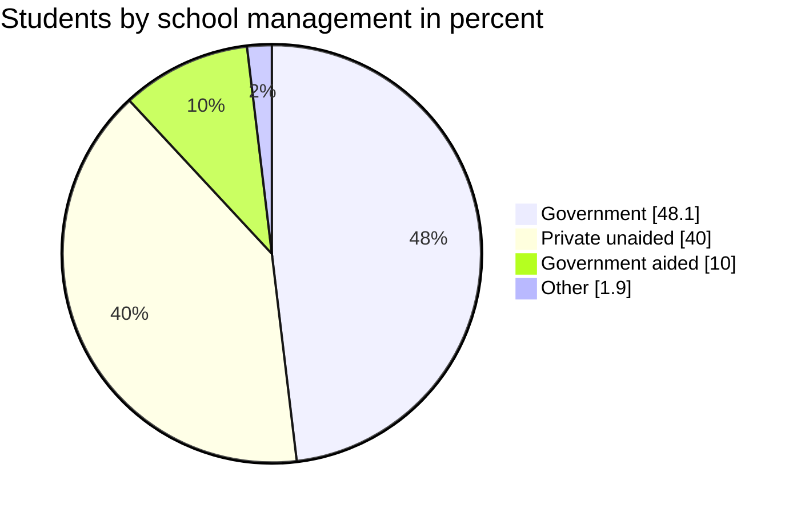
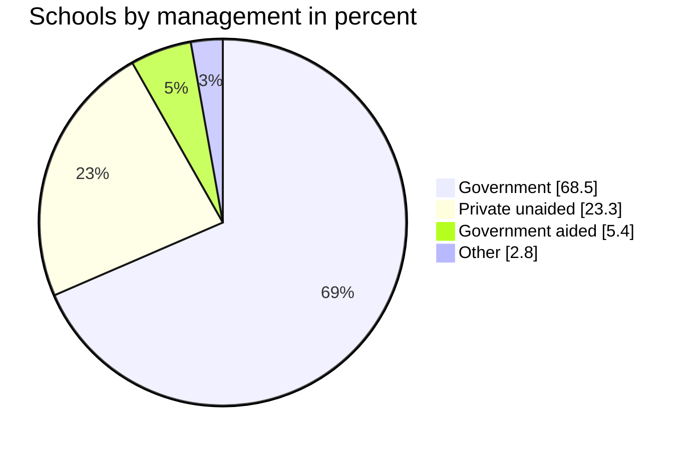
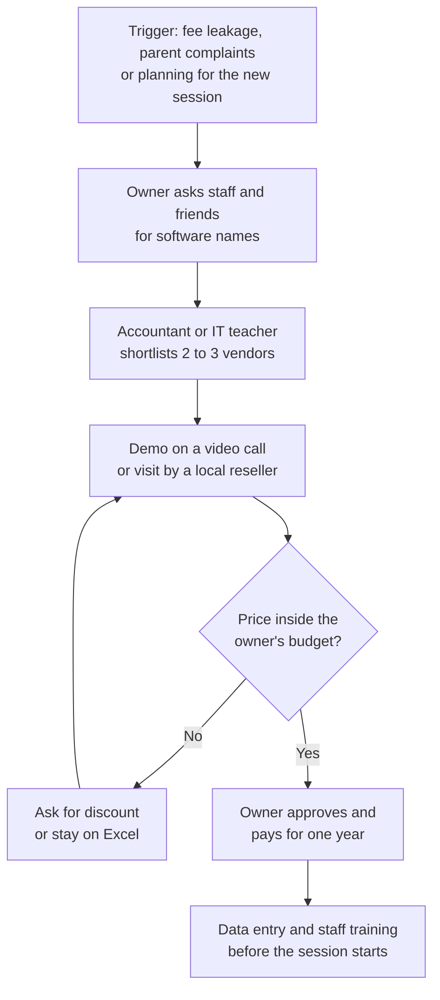
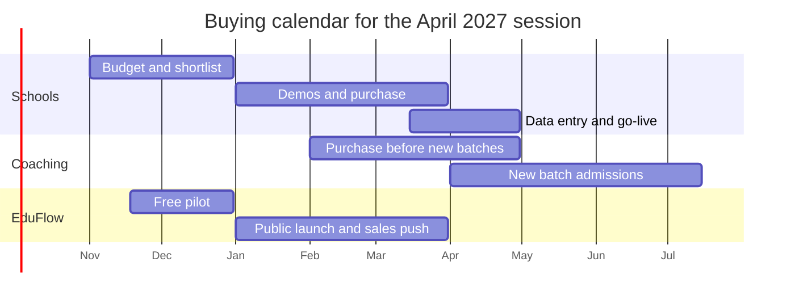

# Market Research: India

**In simple words:** This chapter shows how big the Indian education market is, who the buyers are, and how they buy software. It uses the latest public data on schools, coaching institutes, phones, UPI and new laws. It matters because EduFlow launches in India first, in January 2027, and every sales and product decision should rest on real numbers, not on feelings.

## How to read this chapter

This chapter mixes two kinds of numbers. The founder must always know which kind he is reading.

| Label | Meaning | How to treat it |
|---|---|---|
| Fact | A number published by a government body, a regulator or a named research firm | Safe to quote with the source name and year |
| Estimate | Our own calculation, built from facts plus assumptions | Show the formula; change the inputs when better data arrives |
| Assumption | A value we chose because no data exists | Test it during the pilot; see *Assumptions, Open Questions and Validation Plan* |

Three rules apply everywhere in this chapter.

1. Money is shown in rupees first. Dollar figures from research firms are converted at the canon planning rate of US$1 = ₹85.
2. "Private unaided school" means a school that is privately owned and gets no government grant. This is the school segment EduFlow targets.
3. The final market-size maths (TAM, SAM, SOM) is not done here. It lives in *Market Sizing: TAM, SAM and SOM*. This chapter supplies the raw material.

> **Note:** All competitor remarks in this chapter are based on public information as of September 2026; verify before external use. The detailed comparison lives in *Competitor Analysis* and *Feature Comparison Matrix*.

## India education landscape in numbers

### Schools, students and teachers

The main source is UDISE+ (Unified District Information System for Education Plus — the yearly school census run by the Ministry of Education). The latest report is UDISE+ 2025-26, released on 7 July 2026. The table compares it with the previous year.

| Indicator | UDISE+ 2024-25 | UDISE+ 2025-26 (latest) | What it tells us |
|---|---|---|---|
| Recognised schools | 14,71,473 | 14,66,682 | School count is flat; growth comes from private share, not new schools |
| Students (pre-primary to Class 12) | 24.69 crore | 24.72 crore | Enrolment has stopped falling |
| Teachers | 1.01 crore | About 1.02 crore | Teacher count crossed 1 crore for the first time in 2024-25 |
| Female teachers | 54.2% | 54.9% | Most staff users of EduFlow will be women; design and training should reflect this |
| Schools with computer access | 64.7% | 69.9% | A computer in the office is now normal |
| Schools with internet | 63.5% | Not seen in the summaries we opened | Two out of three schools can use cloud software |
| Schools with electricity | 93.6% | 95.0% | Power is no longer a blocker |
| Secondary dropout rate | 8.2% | 7.0% | More students stay until Class 10; more demand for coaching later |
| PTR at secondary level (pupil-teacher ratio — students per teacher) | 21 | 21 | Well inside the NEP limit of 30 |

> **Note:** India has about 1.04 lakh single-teacher schools (UDISE+ 2024-25). Almost all are small government schools in villages. They are not EduFlow customers. They explain why the average school in India looks tiny.

### Government versus private unaided schools

Government schools do not buy software one by one. The state buys for all of them through tenders. EduFlow does not chase tenders in Phase 1 (see *Business Objectives, Scope and Stakeholders*). So the real school market is the private unaided school, plus some aided schools.

| Management type | Share of schools | Schools (approx.) | Share of students | Avg students per school | EduFlow view |
|---|---|---|---|---|---|
| Government | 68.5% | 10.05 lakh | 48.1% | About 118 | Not a target; tender-driven |
| Government aided | 5.4% | 0.79 lakh | 10.0% | About 310 | Secondary target; trust-run, slow buyers |
| Private unaided | 23.3% | 3,41,689 | 40.0% | About 289 | Primary school target |
| Other (includes unrecognised, madrasa and similar) | 2.8% | 0.41 lakh | 1.9% | About 115 | Not a target in Phase 1 |

How the numbers were built: shares and the private unaided count come from UDISE+ 2025-26 Tables 3.1 and 5.1–5.5 as reported by the Education for All in India portal. School counts for the other rows are the share multiplied by 14,66,682. Average students per school is enrolment divided by schools, using the aided figure of 2.46 crore students as the anchor. Treat the averages as Estimates.

**Figure: Share of students by school management, UDISE+ 2025-26**

Private unaided schools are less than one quarter of all schools. Yet they now teach four out of every ten students. Their share of students was 31.1% in 2021-22, 38.8% in 2024-25 and 40.0% in 2025-26. This is the fastest shift in Indian schooling, and it moves students toward the schools that can buy EduFlow.

**Figure: Share of schools by management, UDISE+ 2025-26**

The two pies side by side tell the story. Government owns most buildings. Private owners hold a large and growing share of students and of fee money.

### Size bands of private unaided schools

UDISE+ does not publish a clean size split for private schools. The split below is an Estimate. It is tuned so that the weighted average matches the known average of about 289 students per private school.

| Size band (students) | Share of private schools | Schools (Estimate) | Typical yearly fee per student | Best-fit EduFlow plan |
|---|---|---|---|---|
| Under 100 | 30% | About 1.03 lakh | ₹4,000 – ₹9,000 | Starter (free) or Growth |
| 100 – 300 | 40% | About 1.37 lakh | ₹6,000 – ₹18,000 | Growth (₹2,499/mo) |
| 300 – 1,000 | 25% | About 85,000 | ₹12,000 – ₹45,000 | Pro (₹5,999/mo) |
| Above 1,000 | 5% | About 17,000 | ₹30,000 – ₹2,00,000 | Enterprise (from ₹14,999/mo) |

Check of the estimate: (30% × 60) + (40% × 180) + (25% × 500) + (5% × 1,500) = 18 + 72 + 125 + 75 = 290 students. This matches the UDISE+ based average.

> **Example:** Bright Future Public School in Lucknow has 1,200 students and 2 campuses. It sits in the top band with about 17,000 other schools. These schools already use some software. The 2.2 lakh schools in the two middle bands are where most owners still run on registers, Excel and Tally.

Two more facts shape the school segment.

- **Low fees are normal.** The Central Square Foundation report "State of the Sector: Private Schools in India" found that about 70% of private school students pay under ₹1,000 a month, and about 45% pay under ₹500 a month. Software must be cheap to fit these schools.
- **Household spending confirms it.** The MoSPI Comprehensive Modular Survey on Education 2025 (NSS 80th round) found average yearly household spending of ₹25,002 per student in private schools, against ₹2,863 in government schools.

### School boards

The board decides the report card format, the exam pattern and the session dates. EduFlow's Exams and Report Cards modules (Phase 2) must respect this.

| Board | Affiliated schools | Session start | Note for EduFlow |
|---|---|---|---|
| CBSE | About 28,000+ in India and abroad (public summaries, 2025-26) | April | Largest single format; build this report card first |
| CISCE (ICSE / ISC) | About 2,800 – 3,300 (sources differ) | April (some in March) | Premium urban schools; fewer but richer |
| State boards (UP, Bihar, Maharashtra, Tamil Nadu and others) | The large remainder of 3.42 lakh private schools | April in the north; June in the south and Maharashtra | Formats vary by state; keep report cards template-driven |

## Private coaching industry

Coaching institutes are EduFlow's primary wedge (the first narrow segment we attack). This section sizes them.

### Industry size and growth

No census of coaching exists. So we look at the industry through three different windows and compare.

| Window | Figure | Year | Source type | What it covers |
|---|---|---|---|---|
| Research firm A | ₹58,088 crore, going to ₹1,33,995 crore by 2028 | 2022 | Infinium Global Research, quoted by Outlook Business and others | All coaching classes |
| Research firm B | US$7.2 billion (about ₹61,200 crore), going to US$17.8 billion by 2034 at 10.29% CAGR | 2025 | IMARC Group | Academic, entrance and skill coaching |
| Tax data | ₹5,517.45 crore GST collected, which implies ₹30,653 crore of taxed revenue at 18% | FY 2023-24 | Ministry of Education reply in the Rajya Sabha, using Department of Revenue data | Only GST-registered institutes |
| Household survey | About ₹60,000 crore spent by families of school students | 2025 | Our calculation from the MoSPI CMS Education 2025 | School students only; includes home tuition |

CAGR means compound annual growth rate — the steady yearly growth that takes you from the start number to the end number.

How the household figure was calculated: 24.72 crore students × 27% who take coaching = 6.67 crore students. News reports of the survey give an average spend of ₹8,973 per student who takes coaching. 6.67 crore × ₹8,973 = about ₹59,900 crore. This is an Estimate; verify the ₹8,973 figure in the full MoSPI report.

What the four windows tell us together:

1. The industry is worth roughly ₹60,000 crore a year. Three independent windows agree on this.
2. Only about half of it (₹30,653 crore) pays GST. The other half is small tutors below the ₹20 lakh GST threshold, plus cash income.
3. The taxed half is growing very fast. GST from coaching rose from ₹2,240.73 crore in FY 2019-20 to ₹5,517.45 crore in FY 2023-24. That is about 25% growth a year, because (5,517 ÷ 2,241) raised to the power ¼ = 1.25.
4. Formal, tax-paying institutes are exactly the ones that need receipts, records and software. Formalisation is the wind behind EduFlow.

### Who takes coaching

The MoSPI CMS Education survey (April–June 2025, 52,085 households) gives the cleanest picture of demand.

| Indicator | Rural | Urban | All India |
|---|---|---|---|
| Students taking private coaching | 25.5% | 30.7% | 27.0% |
| Average coaching spend per student (all students) | ₹1,793 | ₹3,988 | About ₹2,450 (weighted) |
| Average coaching spend, higher secondary level | ₹4,548 | ₹9,950 | Not published in the summary |
| Students in government schools | 66.0% | 30.1% | 55.9% |
| Main source of education money: family | 95.3% | 94.4% | 95.0% |

Reading the table: coaching is not a big-city habit only. One in four rural students also pays for it. Spending doubles in cities and more than doubles again at Class 11–12, when JEE, NEET and board exams arrive.

### Exam demand behind the coaching

| Exam | Latest public number | Why it matters for EduFlow |
|---|---|---|
| NEET UG 2026 (medical entrance) | 22,79,743 registered; 19,99,895 appeared | The largest single coaching funnel; batches named by target year, exactly like the canon example "JEE Main 2028" |
| JEE Main 2026 (engineering entrance) | About 17 lakh unique candidates across two sessions, a record (reported by ALLEN) | Two-year and one-year programmes; heavy test schedules |
| Board exams, Classes 10 and 12 | Several crore students across CBSE and state boards | Feeds neighbourhood tuition centres in every town |
| UPSC, state PSC, SSC, banking, railways | Several crore applications a year across exams (no single official total) | Drives the hubs of Delhi, Patna, Prayagraj, Indore, Pune |

> **Example:** Sharma Classes in Patna has 350 students across JEE and NEET batches. Each student pays about ₹45,000 a year, often in 3 or 4 instalments. That is ₹1.58 crore of yearly fees, collected by one accountant, Suresh Gupta, with a receipt book and Excel. This is the typical EduFlow buyer.

### How many coaching institutes exist

There is no official count. We build an Estimate from two sides and check that they meet.

**Method A — from student demand**

| Step | Input | Result |
|---|---|---|
| School students who take coaching | 24.72 crore × 27% | 6.67 crore |
| Share who study at a named centre with 50+ students (rest use home tutors) | Assumption: 30% | 2.0 crore |
| Post-school aspirants in physical centres (droppers, UPSC, SSC, banking, CA, IELTS, computer courses) | Assumption | 0.8 crore |
| Total centre-based learners | 2.0 + 0.8 | 2.8 crore |
| Average learners per institute | Assumption: 110 | — |
| Institutes with 50+ students | 2.8 crore ÷ 110 | About 2.5 lakh |

The 50-student line is not random. The Ministry of Education's 2024 guidelines define a coaching centre as one that teaches more than 50 students. It is also the upper limit of EduFlow's free Starter plan.

**Method B — from GST data**

| Step | Input | Result |
|---|---|---|
| Taxed coaching revenue, FY 2023-24 | ₹5,517 crore ÷ 18% | ₹30,653 crore |
| Share taken by about 25 national chains | Assumption: 40% | ₹12,260 crore |
| Revenue left for local GST-registered institutes | 60% | ₹18,390 crore |
| Average yearly revenue of a local registered institute | Assumption: ₹40 – 60 lakh | — |
| GST-registered local institutes | ₹18,390 crore ÷ ₹40–60 lakh | About 30,000 – 46,000 |

Method B counts only institutes above the ₹20 lakh GST threshold. A centre with 100 students paying ₹15,000 each earns ₹15 lakh and stays below it. So Method B should be smaller than Method A, and it is. The two methods fit together.

**Working estimate of coaching institutes by size (Estimate)**

| Size band (students) | Institutes | Learners (approx.) | Typical owner | Best-fit EduFlow plan |
|---|---|---|---|---|
| Under 50 (home and single-room tutors) | 8 – 10 lakh individuals | 4.5 crore+ | One teacher | Starter (free); low revenue, high word of mouth |
| 50 – 100 | About 1.9 lakh | 1.2 crore | Teacher-owner with 2–4 staff | Starter to Growth |
| 100 – 300 | About 45,000 | 72 lakh | Owner plus accountant and 5–15 teachers | Growth (₹2,499/mo) |
| 300 – 1,000 | About 12,000 | 54 lakh | Director with centre heads | Pro (₹5,999/mo) |
| Above 1,000 (multi-centre brands) | About 2,000 | 36 lakh | Management team | Enterprise |

> **Founder note:** The sweet spot is the 57,000 institutes with 100 to 1,000 students. They are big enough to feel fee leakage and small enough to have no IT team. The Year-1 target of 120 paying organizations is about 0.2% of this band. The target is small against the market; execution, not market size, is the risk.

## Where the customers are: city tiers and hubs

### City tiers

India has no official tier list for education. We use this working definition: Tier 1 is the 8 largest metros (Delhi NCR, Mumbai, Bengaluru, Chennai, Kolkata, Hyderabad, Pune, Ahmedabad). Tier 2 is about 100 cities with 5 lakh to 40 lakh people, including most state capitals. Tier 3 is every smaller town, plus rural areas. The split below is an Estimate. It rests on the CMS finding that urban coaching participation (30.7%) is only slightly above rural (25.5%), while urban spend is 2.2 times higher.

| Tier | Example cities | Private unaided schools | Coaching institutes (50+) | Share of coaching revenue | Buyer character |
|---|---|---|---|---|---|
| Tier 1 | Delhi NCR, Mumbai, Bengaluru, Hyderabad, Pune | About 12% | About 25% | About 40% | Already uses some software; compares features; expects an app |
| Tier 2 | Lucknow, Patna, Indore, Jaipur, Kota, Nagpur, Bhopal | About 23% | About 35% | About 35% | Fast growing; low software use; buys on trust and demo |
| Tier 3 and rural | Sitapur, Sikar, Muzaffarpur, Satna, Latur | About 65% | About 40% | About 25% | Very price sensitive; needs Hindi support and a local face |

EduFlow's first focus is Tier 2. Reasons: owners there have money and pain, competitors' field sales teams are thin, and the canon sample customers (Lucknow and Patna) sit exactly in this tier. The detailed segment choice is in *Customer Segments and Ideal Customer Profile*.

### Key coaching hubs

| Hub | Known for | Market facts | What it means for EduFlow |
|---|---|---|---|
| Kota, Rajasthan | JEE and NEET | Students fell to 85,000 – 1 lakh in 2024 from 2 – 2.5 lakh; yearly revenue fell to about ₹3,500 crore from ₹6,500 – 7,000 crore; about 4,500 hostels at 40–50% occupancy (PTI, December 2024) | Students now study near home. Demand is spreading to hundreds of towns, which favours small local institutes |
| Delhi | UPSC, SSC, CA, JEE/NEET | Clusters at Mukherjee Nagar, Old Rajinder Nagar, Karol Bagh, Laxmi Nagar; only about 583 centres were registered per a Delhi Police status report | Safety and registration checks after the 2024 basement tragedy push owners to keep clean records |
| Patna | JEE/NEET, BPSC, SSC, railways, banking | Boring Road and Kankarbagh clusters; Bihar has had a coaching Act since 2010 (registration with the District Magistrate, ₹5,000 fee, 3-year validity) | Home of the sample customer Sharma Classes; strong Hindi-first market |
| Hyderabad | IIT-JEE, NEET, IT skills, civil services | Ameerpet (IT training) and Ashok Nagar (civil services); large school-integrated chains | Many training centres fit the `TRAINING_CENTRE` organization type |
| Pune | MPSC, UPSC, engineering, IT | Student city with a large hostel population | Hostel and batch features matter; Marathi-medium parents |
| Lucknow | UPSC/UPPSC, NEET, SSC, school tuition | Hazratganj, Aliganj and Kapoorthala clusters | Home of Bright Future Public School; good pilot city for both segments |
| Indore | MPPSC, JEE/NEET, CA | Bhanwarkuan cluster; feeder for all of Madhya Pradesh | Classic Tier 2 hub with low software use |
| Sikar, Prayagraj, Jaipur, Kolkata, Chennai, Thrissur, Guwahati | NEET, state PSC, SSC, banking | Second-line hubs growing as students avoid long-distance migration | Second wave of city launches in Year 2 |

National brands confirm the move to smaller cities. PhysicsWallah had crossed 150 offline Vidyapeeth and Pathshala centres by January 2025 and announced 75+ more centres across 24 states for FY 2026-27, with a stated focus on Tier 2 and Tier 3 cities (company announcements in the press). When a national brand opens in Udaipur or Dibrugarh, every local institute in that town must look more professional. Receipts, apps and parent updates become the minimum standard.

## School ERP and education ERP software market

ERP means enterprise resource planning — one software that runs the daily operations of an organization. A school ERP covers admissions, fees, attendance, exams and parent communication.

### What research firms say

| Source | Scope | Base value | Forecast | Growth rate |
|---|---|---|---|---|
| Grand View Research (Horizon), India Education ERP outlook | K-12 and higher education, software and services | About US$0.8 billion in 2024 (about ₹6,800 crore); India = 4.3% of the global market | About US$3.4 billion by 2030 | 27.7% CAGR, 2025–2030 |
| 6Wresearch, India Education ERP Market | K-12 and higher education; software and services; cloud and on-premise | US$499 million in 2025 (about ₹4,240 crore) | US$718 million by 2032 | 6.5% CAGR, 2026–2032 |
| Grand View Research, global Education ERP | Global, all segments | US$18.59 billion in 2024 | — | Cloud held 61.3% share in 2023 |

> **Warning:** The two India reports disagree by a wide margin (27.7% growth against 6.5%). Both include universities, implementation services and large government projects. Neither measures the small-institute subscription market that EduFlow sells into. Also, the Grand View page could not be opened directly; its India value was seen in search summaries and cross-checked as 4.3% × US$18.59 billion = US$0.8 billion. Quote these reports only as a range: "about ₹4,000 – 7,000 crore, growing between 6% and 28% a year, depending on the source".

### Bottom-up view of today's spend (Estimate)

To see EduFlow's real playing field, we estimate what private schools and coaching institutes pay for management software today. Formula for each row: institutes × share that pays for software × average yearly spend.

| Segment | Institutes | Paid adoption (Assumption) | Avg yearly spend | Spend today |
|---|---|---|---|---|
| Private schools, under 100 students | 1.03 lakh | 5% | ₹12,000 | ₹6 crore |
| Private schools, 100 – 300 | 1.37 lakh | 20% | ₹25,000 | ₹69 crore |
| Private schools, 300 – 1,000 | 85,000 | 45% | ₹70,000 | ₹268 crore |
| Private schools, above 1,000 | 17,000 | 75% | ₹2,50,000 | ₹319 crore |
| Coaching, 50 – 100 students | 1.9 lakh | 3% | ₹10,000 | ₹6 crore |
| Coaching, 100 – 300 | 45,000 | 15% | ₹25,000 | ₹17 crore |
| Coaching, 300 – 1,000 | 12,000 | 35% | ₹60,000 | ₹25 crore |
| Coaching, above 1,000 | 2,000 | 70% | ₹4,00,000 | ₹56 crore |

Total: about ₹765 crore a year (about US$90 million). Roughly 84,000 private schools (24%) and 18,000 coaching institutes (7% of those with 50+ students) pay for software today. The other 76% of schools and 93% of coaching institutes are white space (customers who have not bought from anyone yet).

> **Founder note:** EduFlow's main competitor is not Teachmint or Fedena. It is the paper register, the Excel sheet, the Tally file and the WhatsApp group. Sales material should compare EduFlow with "how you work today" first, and with other vendors second.

### Market price bands

Vendor pricing pages and buyer guides published in 2025–2026 show a consistent range.

| Buyer size | Typical yearly spend on school ERP | Per student per year | EduFlow comparison |
|---|---|---|---|
| Small (up to 500 students) | ₹20,000 – ₹75,000 | ₹100 – ₹500 | Growth ₹24,990/yr; Pro ₹59,990/yr |
| Medium (500 – 1,500 students) | ₹75,000 – ₹2,50,000 | ₹100 – ₹300 | Pro ₹59,990/yr up to 1,000 students; Enterprise above |
| Large or multi-branch | ₹2,50,000 and above | Negotiated | Enterprise from ₹14,999/mo |

Buyer guides also warn that the first-year bill is often 40–60% above the advertised price. The extra comes from setup fees, training visits, SMS packs and custom work. EduFlow's answer is a flat public price, free self-onboarding and optional paid add-ons (assisted migration ₹9,999, on-site training ₹4,999 a day). The full logic is in *Pricing Strategy*.

### Growth drivers

| Driver | Evidence | Effect on demand |
|---|---|---|
| Shift of students to private schools | Private share of students rose from 31.1% (2021-22) to 40.0% (2025-26) | More fee-paying students to manage; more competition between schools |
| Formalisation of coaching | GST from coaching up about 25% a year for four years | Registered institutes need receipts, GST invoices and records |
| Regulation | Coaching guidelines 2024, Rajasthan Act 2025, DPDP Rules 2025, state fee Acts | Records, refunds and consent must be provable |
| UPI and online payments | 24.51 billion UPI transactions in August 2026 | Parents expect to pay fees from the phone |
| Parent expectations | 535 million+ Indians on WhatsApp | Parents want attendance and marks on the phone the same day |
| Cheap cloud and data | ₹7.51 per GB of mobile data (TRAI, March 2026) | No server, no IT person needed |
| NEP 2020 digital records | APAAR ID, UDISE+ student-level data, holistic progress cards | Schools must keep clean digital student data |

## Digital readiness

Can a small institute in Sitapur really run on cloud software? Can Sunita Devi, a parent, really use a parent portal? The data says yes.

| Indicator | Latest figure | Source and date |
|---|---|---|
| Internet subscribers | 1,092 million | TRAI performance indicators, quarter ending March 2026 |
| Broadband subscribers | 1,065.88 million | TRAI, March 2026 |
| Wireless (mobile) internet subscribers | 1,046.26 million | TRAI, March 2026 |
| Tele-density (phone connections per 100 people) | 93.26% overall; urban 151.47%; rural 60.46% | TRAI, March 2026 |
| Mobile data used per subscriber | 26.70 GB a month at about ₹7.51 per GB | TRAI, March 2026 |
| Active internet users | 958 million; 57% of them rural (about 548 million) | IAMAI and Kantar, Internet in India 2025 |
| Internet users who use AI features (voice search, chatbots, filters) | About 44% | IAMAI and Kantar, 2025 |
| Rural teenagers (14–16) with a smartphone at home | About 90% | ASER 2024 (Pratham) |
| Rural teenagers who can use a smartphone | 82.2%; only 57% used it for study in the past week | ASER 2024 |
| UPI transactions in one month | 24.51 billion, worth ₹29.82 lakh crore; up 22% in a year | NPCI data for August 2026, reported by Business Standard |
| UPI daily average and ticket size | 791 million a day; about ₹1,217 per transaction | NPCI, August 2026 |
| WhatsApp monthly users in India | About 535.8 million (third-party estimate, 2025; Meta has not published a newer official figure) | Industry roundups, 2025–2026 |
| WhatsApp Business accounts in India | About 15 million active | Industry roundups, 2025–2026 |
| Schools with computer access | 69.9% | UDISE+ 2025-26 |

UPI means Unified Payments Interface — India's instant bank-to-bank payment system used through apps such as PhonePe, Google Pay and Paytm.

### What this means for the product

| Finding | Product decision it supports |
|---|---|
| Almost every parent has a smartphone with data | Parent Portal (Phase 1) is mobile-first; OTP login instead of passwords |
| WhatsApp is the default inbox | WhatsApp module in Phase 1; SMS and Email only in Phase 2 |
| UPI is the default way to pay | Razorpay UPI links and QR on every fee invoice; target of 40% online fee share in Year 1 is realistic |
| Rural internet users are now the majority | Pages must be light and work on slow 4G; Hindi labels for parent screens are a sensible Phase 2 assumption |
| 30% of schools still lack a computer | Core staff tasks (attendance, fee receipt) must work on a phone browser |
| Students use phones more for social media (76%) than study (57%) | Student Portal (Phase 2) stays simple; no feeds, no tracking, no ads — which also fits the DPDP Act |

> **Example:** WhatsApp cost for Sharma Classes. Reported Meta rates for India in 2026 are about ₹0.115 per utility message and ₹0.8631 per marketing message. EduFlow charges Meta cost plus 15%. If Sharma Classes sends 20 utility messages per student per month (attendance, fee reminders, test marks), that is 350 × 20 = 7,000 messages × ₹0.132 = about ₹926 a month. The ₹1,999 credit pack lasts about two months.

> **Warning:** WhatsApp API vendors report that Meta will change its India rate card on 1 October 2026, including charges for some messages that were free. Check Meta's official rate card again before the January 2027 launch and update the credit-pack maths in *Pricing Strategy*.

## Policy and regulation

Four sets of rules shape this market. Each one creates work for the institute. Work that repeats is exactly what software should remove. The legal detail and EduFlow's own duties are in *Compliance, Legal and Data Protection Requirements*. This section looks only at the market effect.

### National Education Policy 2020

NEP 2020 is the national policy that guides school education until about 2040. It is a policy, not a law, but CBSE and the states turn it into circulars that schools must follow.

| NEP 2020 element | What schools must do | Effect on EduFlow |
|---|---|---|
| New 5+3+3+4 structure (foundational, preparatory, middle, secondary) | Organise classes and report cards by stage | `Course` and `Batch` models must not assume a fixed "Class 1–12" ladder |
| Holistic progress card (a 360-degree report with skills and teacher, peer and self review) | Record more than marks | Report Cards (Phase 2) must be template-driven, with non-scholastic areas |
| APAAR ID (a 12-digit lifelong student academic ID linked to DigiLocker) | CBSE requires it for board exam registration lists from the 2026-27 session; under half of students in affiliated schools had one by 2025-26 (news reports) | Student Profile needs an APAAR ID field and a "missing APAAR" report — a small feature with a strong sales hook |
| UDISE+ student-level data | Schools upload every student's record every year | A clean export from EduFlow in the UDISE+ column order saves days of clerk time |
| Pupil-teacher ratio of 30:1 or better | Track teachers and sections | Analytics (Phase 2) can show PTR per campus |
| Technology use in school administration | States fund digital systems for government schools | Raises the general expectation that a "good school" is a digital school |

> **Note:** The APAAR field and the UDISE+ export are proposals from this research. They are Assumptions until the PRD module chapters confirm them against the schema in `docs/src/_schema/`.

### Coaching centre guidelines 2024 and the rules that followed

In January 2024 the Ministry of Education issued "Guidelines for Regulation of Coaching Centres" to all states and union territories. Education is a shared subject, so states must adopt the guidelines through their own laws. The main points, as reported by Business Today, Business Standard and Careers360:

| Rule in the guidelines | Detail | Software need it creates |
|---|---|---|
| Who is covered | Centres that coach more than 50 students | Matches the line between the free Starter plan and paid plans |
| Registration | Every centre, and every branch separately, must register with the state authority | Multi Campus records with a registration number and expiry date per centre |
| Age limit | No enrolment below 16 years, or before the secondary school exam | Date-of-birth check at admission with a clear warning |
| Tutors | Must be at least graduates; no one convicted of a moral offence | Teacher profile with qualification and document upload |
| Fees | Fair and reasonable; receipts for every payment; prospectus and notes at no extra cost; no fee increase during a course | Fee structure locked per enrolment; printed and digital receipts |
| Refunds | If a student leaves mid-course, refund the remaining period pro-rata within 10 days; hostel and mess fees too | Refund calculator and refund receipt in the Fees module |
| Website | Must show tutor qualifications, courses, duration, fees, hostel details and the refund policy | Public institute page fed from EduFlow data (later phase) |
| Classes | Not during school hours; at most 5 hours a day; a weekly off; no test the day after the weekly off | Batch and timetable checks |
| Space and safety | About 1 square metre per student; fire and building safety certificates; first aid; CCTV where needed | Batch capacity field per room |
| Wellbeing | Counselling support; mental health workshops; test results not made public | Marks visible only to the student and parent, never as a public rank list by default |
| Marketing | No misleading promises, no rank or marks guarantees | Not a software matter, but affects how institutes advertise |
| Penalty | ₹25,000 for the first violation, ₹1,00,000 for the second, then cancellation of registration | Owners have a money reason to keep records clean |

**Worked example of the refund rule.** Aarav Sharma joins a 12-month course at Sharma Classes and pays the full ₹48,000 on 1 April. He leaves on 31 July, after 4 months. Remaining period = 8 months. Refund = ₹48,000 × 8 ÷ 12 = ₹32,000. It must be paid within 10 days, so by 10 August. With a receipt book this takes an argument and a calculator. In EduFlow it should take one screen. The exact rule design belongs to the *Fees* module chapter of the PRD.

Rules that followed the guidelines:

| Rule | Date | Key points | Status for planning |
|---|---|---|---|
| CCPA Guidelines for Prevention of Misleading Advertisement in Coaching Sector | In force from 13 November 2024 | Covers centres with more than 50 students; bans false claims on selections, ranks, fees and refunds; needs written consent before using a topper's name or photo | National; enforced by the Central Consumer Protection Authority, which has issued notices and penalties |
| Rajasthan Coaching Centres (Control and Regulation) Bill, 2025 | Passed by the Assembly on 3 September 2025 | Applies to centres with 100+ students; registration; counselling system; 5-hour daily cap; graduate tutors; fine of ₹50,000 then ₹2 lakh (PRS and press summaries) | First large state law after the guidelines; covers Kota, Sikar and Jaipur |
| Bihar Coaching Institute (Control and Regulation) Act | 2010 | Registration with the District Magistrate; ₹5,000 fee; valid 3 years | Old law, unevenly enforced; the state has moved to tighten it |
| Other states (Assam and others) | 2025 onward | Bills approved or under drafting, modelled on the central guidelines | Expect most large states to have a law by 2028 (Assumption) |

> **Best practice:** Sell compliance as a side benefit, not as fear. The pitch is: "EduFlow gives every student a receipt, a refund trail and an age check, so an inspection takes ten minutes." Do not promise that EduFlow makes an institute legally compliant. Only the owner can do that.

### DPDP Act 2023 and student data

The Digital Personal Data Protection Act 2023 (DPDP Act) is India's privacy law. The DPDP Rules 2025 were notified on 13 November 2025 and come into force in phases.

| Phase | Date | What starts |
|---|---|---|
| Phase 1 | 13 November 2025 | Data Protection Board of India is set up; definitions and basic provisions |
| Phase 2 | About November 2026 (12 months) | Consent manager registration framework |
| Phase 3 | 13 May 2027 (18 months) | Core duties: notice, consent, security safeguards, breach reporting, retention limits, children's data rules, user rights |

Key terms: a Data Fiduciary is the organization that decides why and how personal data is used — here, the school or institute. A Data Processor handles data on the fiduciary's behalf — here, EduFlow.

| DPDP point | What the law says (public legal summaries) | Effect on the market and on EduFlow |
|---|---|---|
| A child is anyone under 18 | Almost every school and coaching student is a "child" in law | Nearly all student data in EduFlow is children's data |
| Verifiable parental consent | Needed before processing a child's data; the fiduciary must check that the parent is a real adult | Admission flow captures the guardian's consent with OTP on the parent's phone, and stores proof |
| No tracking, behavioural monitoring or targeted ads aimed at children | General ban | EduFlow shows no ads, sells no data and keeps product analytics away from student screens |
| Education exemption (Rule 12 and the Fourth Schedule) | Educational institutions get limited relief for tracking and monitoring needed for educational activities and child safety | Attendance and transport tracking are allowed purposes for a school. Whether a private coaching centre counts as an "educational institution" here is an open legal question |
| Security safeguards and breach notice | Reasonable safeguards; report breaches to the Board and to affected people | Institutes will ask vendors for written security terms; a data processing agreement becomes a sales document |
| Penalties | Up to ₹250 crore for security failures; up to ₹200 crore for breaking children's data duties (Schedule to the Act) | Owners start asking "where is my data stored?" Answer: AWS Mumbai (`ap-south-1`), isolated by `organization_id` |

Timing matters. Public launch is January 2027. The core DPDP duties start on 13 May 2027, only four months later. Free apps that earn money from student leads or ads will be under pressure. A paid, no-ads, consent-first ERP is on the right side of this law from day one.

> **Rule:** EduFlow must never market to students or parents using data that an institute has entered. The institute owns its data. This is a legal need under DPDP and also the base of owner trust.

### State fee-regulation Acts

India has no central law on private school fees. Many states have their own Act. The table is built from public legal summaries and news reports; verify the current text of each Act with a lawyer before quoting it to customers.

| State | Law | How it controls fees | What a school must be able to show |
|---|---|---|---|
| Tamil Nadu | Schools (Regulation of Collection of Fee) Act, 2009 | A government committee fixes or approves each school's fee | Fee heads and amounts exactly as approved |
| Maharashtra | Educational Institutions (Regulation of Fee) Act, 2011 | Fee proposals go through a parent-teacher body; increases limited to about 15% and not every year | Year-wise fee structure history and approval notes |
| Rajasthan | Schools (Regulation of Fee) Act, 2016 | School-level fee committee with parent members | Committee-approved structure per class |
| Gujarat | Self Financed Schools (Regulation of Fees) Act, 2017 | Fee caps by level; schools above the cap must justify to a Fee Regulatory Committee; upheld by the High Court | Audited, head-wise fee collection reports |
| Uttar Pradesh | Self-Financed Independent Schools (Fee Regulation) Act, 2018 | Yearly increase for existing students linked to consumer inflation plus a small margin; fee heads defined; receipts compulsory | Per-student fee history across years; proper receipts for every rupee |
| Delhi | School Education (Transparency in Fixation and Regulation of Fees) Act, 2025 (notified August 2025) | 11-member School Level Fee Fixation Committee with 5 parents chosen by lottery; fees proposed for 3-year blocks with audited accounts; district appeal committee | Three-year fee proposal, audited statements, committee minutes |
| Punjab, Karnataka, Haryana and others | State-specific Acts or rules | Usually a yearly cap (for example 8% in Punjab) or prior approval | Proof that the increase stayed inside the cap |

Market effect for EduFlow:

1. **Fee heads must be clean.** Regulators look at each head (tuition, transport, annual charges). EduFlow's Fees module already models fee heads and structures per academic year.
2. **History must be kept.** A school needs to prove what Aarav Sharma paid in 2026-27 and in 2027-28. Soft delete and audit logs are selling points, not only technical choices.
3. **Hike calculators help.** A simple report, "this year's structure against last year's, with percentage change per class", answers the first question of every fee committee. This is a cheap feature with high perceived value in Uttar Pradesh, Delhi, Gujarat and Maharashtra.
4. **Coaching fees are not covered by these Acts.** Coaching fees fall under the 2024 guidelines and state coaching laws instead.

## Buying behaviour

### Who decides

In this market one person signs: the owner. But two or three people can block the deal.

| Person | Role in EduFlow terms | Role in the purchase | What they care about | How to win them |
|---|---|---|---|---|
| Owner, director, trustee or chairman (Rajesh Sharma) | `ORG_ADMIN` | Decision maker and payer | Fee leakage, control from the phone, image in the town, price | Show the daily collection dashboard and defaulter list in the first 5 minutes |
| Principal or centre head (Dr. Anita Verma) | `PRINCIPAL` | Strong influencer in schools; often the first user in coaching | Attendance, results, parent complaints, less paperwork | Show absent alerts on WhatsApp and, from Phase 2, report cards |
| Accountant (Suresh Gupta) | `ACCOUNTANT` | Gatekeeper; can quietly kill the project | Fear of job loss, fear of mistakes, Tally habits | Show that receipts are faster and that day-end totals match cash |
| IT teacher, computer operator or owner's son or daughter | Often a second `ORG_ADMIN` user | Technical evaluator | Easy import from Excel, no server, phone support | Offer a 1-hour guided import of the real student list |
| Teachers (Priya Nair) | `TEACHER` | Users, not buyers | Attendance in under a minute; no extra work at home | Mobile attendance demo |
| Parents (Sunita Devi) | `PARENT` | Indirect pressure | Updates on WhatsApp, online fee payment, receipts | Their demand is the owner's reason to buy |
| Local reseller or the owner's chartered accountant | Outside the system | Trusted adviser | Commission; not looking foolish after recommending | Reseller margin and quick support line |

**Figure: Typical purchase path in a Tier 2 institute**

The path is short. There is no tender, no committee and no legal review in most private institutes. A typical cycle is 1 to 4 weeks for coaching and 3 to 8 weeks for a school (Assumption, to be measured in the pilot). The risk is not a long cycle. The risk is the "stay on Excel" exit, which is why the free Starter plan and a same-day setup matter. The full sales steps are in *Sales Process and Playbooks*. The people behind these roles are described in *Customer Personas*.

### Budget ranges

| Buyer | Students | Yearly fee income (approx.) | What they spend on software today | Comfortable yearly budget (Estimate) |
|---|---|---|---|---|
| Home tutor or small centre | Under 50 | Under ₹6 lakh | ₹0 (WhatsApp, notebook) | ₹0 – ₹3,000 |
| Neighbourhood coaching centre | 50 – 300 | ₹8 lakh – ₹90 lakh | ₹0 – ₹15,000 (a branded app or Excel) | ₹12,000 – ₹30,000 |
| Established coaching institute | 300 – 1,000 | ₹90 lakh – ₹5 crore | ₹20,000 – ₹80,000 | ₹40,000 – ₹1,00,000 |
| Budget private school | 100 – 300 | ₹8 lakh – ₹40 lakh | ₹0 – ₹20,000 (often a desktop fee program) | ₹10,000 – ₹30,000 |
| Mid-fee private school | 300 – 1,000 | ₹50 lakh – ₹4 crore | ₹30,000 – ₹1,20,000 | ₹50,000 – ₹1,50,000 |
| Large school or school group | 1,000+ | ₹3 crore and above | ₹1.5 lakh – ₹10 lakh | ₹1.8 lakh and above |

A rule of thumb from these ranges: Indian institutes accept software that costs about 0.3% to 1% of yearly fee income. Above 1%, the owner starts to bargain hard.

**Worked examples with canon prices (all before 18% GST):**

| Institute | Students | Plan that fits | Yearly price | Yearly fee income | Software as % of income | Per student per month |
|---|---|---|---|---|---|---|
| Sharma Classes, Patna | 350 | Pro (Growth stops at 300) | ₹59,990 | ₹1.58 crore (₹45,000 × 350) | 0.38% | ₹14.3 |
| Bright Future Public School, Lucknow | 1,200 (2 campuses) | Enterprise, entry price | About ₹1.8 lakh (₹14,999 × 12) | ₹3.6 crore (₹30,000 × 1,200) | 0.50% | ₹12.5 |
| A 250-student budget school in Sitapur | 250 | Growth | ₹24,990 | ₹21 lakh (₹700 × 12 × 250) | 1.19% | ₹8.3 |
| A 40-student home tuition centre | 40 | Starter | ₹0 | ₹3.8 lakh | 0% | ₹0 |

The budget school row is the tight one. At 1.19% of income the owner will hesitate. Two levers keep this buyer. The first is the free Starter plan as a foot in the door for very small schools. The second is simple maths: one recovered defaulter (₹700 × 12 = ₹8,400 a year) pays for a third of the yearly plan.

### Academic calendar and the buying season

Most North, Central and East Indian schools, and all CBSE schools, start the session in April. Schools in Kerala, Tamil Nadu, Karnataka and Maharashtra's state board start in June. Coaching institutes start their main batches between April and July, right after board exams and entrance results.

| Month | What the institute is busy with | Buying mood | EduFlow action |
|---|---|---|---|
| October – November | Half-yearly exams; Dussehra, Diwali and Chhath holidays | Low; owners travel and spend on festivals | Build pipeline; run the pilot (starts 18 November 2026) |
| December | Winter break; admission forms for next session open in cities | Rising; owners plan next year's fees and staff | Publish pilot case studies; book January demos |
| January | New-session admissions; budgets fixed | High | Public launch (January 2027); daily demos |
| February | Pre-boards and practical exams; admission rush | High for owners; principals are busy | Sell to the owner and the accountant; keep demos to 20 minutes |
| March | Board and annual exams; financial year-end on 31 March | Highest; "start clean from 1 April" | Close deals; run assisted data migration |
| April | Session starts; fee collection peak; new coaching batches | Medium; late buyers rush; others say "next year" | Onboarding sprints; first fee receipt within 7 days (activation target 60%) |
| May – June | Summer break in the north; June session start in the south and west; NEET and JEE results; dropper batches fill | Second, smaller peak for coaching and southern schools | Coaching-focused campaign; southern pilot cities |
| July – September | Steady teaching; first-term exams | Low for schools; medium for coaching chains adding centres | Upsell add-ons; referrals; renewals for mid-year joiners |

**Figure: Buying calendar for the April 2027 session**

The chart shows why the canon dates were chosen. The pilot ends just as owners begin to plan. The paid launch lands in January, at the start of the three strongest buying months. An institute that misses the April start often waits a full year. A slip of the launch from January to April would cost most of the Year-1 school pipeline.

> **Tip:** Coaching has a softer calendar than schools. A JEE institute can switch software in any month, because batches start several times a year. This is one more reason coaching is the wedge: sales do not stop after April.

### Price sensitivity

| Behaviour seen in this market | Why it happens | EduFlow response |
|---|---|---|
| Owners compare on per-student price | Vendors quote ₹15–40 per student per month | Show the flat plan price and the per-student maths (₹8–15 per student per month in the examples above) |
| "Give me a free trial for the full session" | Free apps trained the market to expect zero price | Starter is free forever up to 50 students; upgrade rules are in *Pricing Strategy* |
| Strong dislike of surprise costs | First-year bills often run 40–60% over the quote | One public price list; add-ons listed with prices; no setup fee |
| Preference for yearly payment with a discount | Cash comes in at admission time; owners like to "finish the payment" | Yearly = 10 × monthly (2 months free) |
| Bargaining is expected | It is the normal way to buy in Tier 2 and Tier 3 | Give value, not discounts: free migration or extra WhatsApp credits instead of price cuts |
| GST is a real cost for schools, not for coaching | School fees are mostly GST-exempt, so schools cannot claim input credit; coaching institutes charge 18% GST and can claim it | For coaching, the 18% GST on EduFlow is recoverable. For schools, ₹24,990 becomes ₹29,488 |
| Fear of data loss and vendor closure | Several edtech firms shut or changed direction in 2023–2025 | Promise full data export at any time; publish uptime and backups |

> **Founder note:** For a school, always quote the GST-inclusive figure in conversation (Growth yearly = ₹29,488; Pro yearly = ₹70,788). A school owner who hears ₹24,990 and then sees ₹29,488 on the invoice feels cheated, even though it is the law. Confirm the input-credit position with a chartered accountant before putting it in sales material.

### Role of local resellers

In Tier 2 and Tier 3 towns, school software is often sold by a local dealer, not by the software company. The same dealer sells ID cards, biometric machines, CCTV, smart boards, printed diaries, uniforms or Tally licences. He already visits 50 to 200 institutes every year.

| Aspect | How it works today (Estimate from market practice) | What EduFlow should do |
|---|---|---|
| What the reseller adds | A known local face; demo in Hindi or the local language; on-site data entry; first-line support | Use resellers for reach in towns the founder cannot visit |
| Commission | About 20–30% of first-year value; 10–15% on renewals | Offer a simple, public partner margin inside this band; details in *Go-To-Market Strategy* |
| Extra income | Data entry, training days, hardware bundles | Let partners deliver the ₹4,999 a day on-site training and the ₹9,999 migration add-on, and share that revenue |
| Risks | Over-promising features; holding the customer relationship; heavy discounting | The customer always signs up on `app.eduflow.app` in its own name and pays EduFlow directly; EduFlow pays the partner |
| When to start | Most vendors start with resellers on day one | Start after the first 30–50 direct customers, when the pitch and onboarding are proven (Assumption) |

Other trusted channels in this market are chartered accountants, school owner associations, coaching federations, board-affiliation consultants and WhatsApp groups of owners in one city. One happy owner in a Patna coaching group is worth more than a paid advertisement.

## Market trends and impact on EduFlow

| Trend | Evidence | Impact on EduFlow | Action |
|---|---|---|---|
| Students moving from government to private schools | Private share of students 31.1% (2021-22) to 40.0% (2025-26) | The paying school base grows every year without new schools | Keep schools as the second segment; build CBSE report cards in Phase 2 |
| Coaching spreading out of mega-hubs to home towns | Kota students down to 85,000 – 1 lakh from 2 – 2.5 lakh; national brands opening in Tier 2 and 3 | Thousands of local institutes must look professional to compete | Tier 2 first; quick setup; branded receipts and parent portal |
| Formalisation of coaching | GST from coaching up about 146% in five years | More institutes need GST invoices and clean books | GST-ready receipts; accountant-friendly exports |
| Regulation of coaching | Central guidelines 2024; CCPA advertising rules 2024; Rajasthan law 2025; more states drafting | Records, age checks, refunds and registration data become must-haves | Propose the refund calculator and age warning for the Fees and Student Admission modules |
| Data protection becomes real | DPDP Rules notified 13 November 2025; core duties from 13 May 2027 | Ad-funded and lead-selling models weaken; buyers ask about data | Consent capture at admission; no ads; data processing agreement template ready by launch |
| UPI as the default payment | 24.51 billion transactions in August 2026, up 22% in a year | Online fee collection is now expected even in small towns | UPI link and QR on every invoice; auto-reconciliation |
| WhatsApp as the parent channel, with changing prices | 535 million+ users; Meta moved to per-message pricing and revised rates in 2026 | The WhatsApp module is a top reason to buy, but margin needs watching | Credit packs at cost plus 15%; re-check the rate card each quarter |
| NEP digital records | APAAR ID needed for CBSE exam lists from 2026-27; UDISE+ student-level uploads | Schools need one clean student database | APAAR field, UDISE+ export, missing-data reports |
| State fee regulation widening | Delhi Act 2025 joins Uttar Pradesh, Gujarat, Maharashtra, Tamil Nadu, Rajasthan | Schools must prove fee structures and history | Fee structure history and year-on-year hike report |
| AI becoming familiar | About 44% of internet users already use AI features | Owners will ask "does it have AI?" by 2027 | AI Insights in Phase 4; sell simple, useful insights such as dropout and defaulter risk |
| Edtech shake-out after the funding boom | Press reports describe Teachmint moving toward classroom hardware and Classplus moving toward test-prep content | Buyers are wary of free tools that change direction; a focused paid ERP gains trust | Message: "We only do institute management, and you can export your data any day" |

> **Note:** The last row is based on public information as of September 2026; verify before external use. See *Competitor Analysis* for the full and sourced picture.

## Market gaps and opportunity summary

| Gap in the market | Evidence | Who suffers | EduFlow answer |
|---|---|---|---|
| Most institutes have no system at all | About 76% of private schools and 93% of coaching institutes with 50+ students pay for no software (Estimate) | Owners lose fees; accountants drown in registers | Free Starter plan; setup within one day |
| School ERPs are too heavy for coaching; coaching apps are too light for schools | School ERPs assume classes and sections; coaching apps centre on content selling | Institutes that run both a school and coaching, or coaching with hostels | One domain model (`Course`, `Batch`, `Enrollment`) with labels that change by `Organization.type` |
| Pricing is unclear | First-year cost often 40–60% above the quote | Price-sensitive owners in Tier 2 and 3 | Public flat pricing from ₹2,499 a month; no setup fee |
| Compliance is arriving faster than tools | Coaching rules 2024–2025; DPDP duties from May 2027; Delhi fee Act 2025 | Owners who face fines of ₹25,000 to ₹2 lakh, and far more under DPDP | Refund calculator, age check, consent proof, fee history |
| Parents want phone updates; institutes send them by hand | 535 million+ WhatsApp users; teachers type messages one by one | Teachers and front-desk staff | WhatsApp module in Phase 1 with automatic attendance and fee messages |
| Fees are still collected in cash and reconciled by hand | UPI is universal, yet many institutes only show a static QR and match payments manually | Accountants; owners who cannot see the day's collection | Razorpay UPI links on invoices; automatic receipt and ledger entry |
| Tier 2 and 3 towns get little vendor attention | Vendor field teams sit in metros; resellers push whatever pays them most | About 75% of coaching institutes and 88% of private schools are outside Tier 1 (Estimate) | Self-serve signup, Hindi-friendly onboarding, partner programme after the first 30–50 customers |
| Multi-branch growth has no simple tool | National brands and local chains are adding centres in small cities | Owners with 2 to 10 centres | Multi Campus in Phase 1; extra campus add-on at ₹999 a month |

**Opportunity in one paragraph.** India has about 3.42 lakh private unaided schools and about 2.5 lakh coaching institutes with more than 50 students (Estimate). Together they spend only about ₹765 crore a year on management software (Estimate), and most of them spend nothing. Phones, data, UPI and WhatsApp are already in every parent's hand. New rules on coaching, privacy and fees now force owners to keep proper records. The buyer is a single owner who decides fast, mostly between January and March. EduFlow's Year-1 target of 120 paying organizations needs only about 0.2% of the 57,000 mid-sized coaching institutes, before counting a single school. The market is large enough. What decides success is reaching owners cheaply, onboarding them in one day and keeping them. Those plans are in *Go-To-Market Strategy* and *Customer Success, Onboarding and Support*.

> **Warning:** Every Estimate in this chapter must be tested. The pilot with 5 institutes (from 18 November 2026) and the first 50 sales conversations should replace the adoption rates, budget ranges and sales-cycle lengths used here. Log the corrections in *Assumptions, Open Questions and Validation Plan*.

## Key takeaways

- India has 14.67 lakh schools, 24.72 crore students and about 1.02 crore teachers (UDISE+ 2025-26). The real school market is the 3.42 lakh private unaided schools, which now teach 40% of all students.
- Coaching is a roughly ₹60,000 crore industry. Its tax-paying half is growing about 25% a year. We estimate about 2.5 lakh institutes with 50+ students, of which about 57,000 (100 to 1,000 students) are the sweet spot.
- Most of the market is white space: about three out of four private schools and nine out of ten coaching institutes pay for no management software today.
- Digital readiness is no longer a barrier: 1,092 million internet subscribers, 24.51 billion UPI transactions a month and 535 million+ WhatsApp users.
- Regulation is a tailwind: coaching guidelines (2024), state coaching laws (2025 onward), DPDP core duties (13 May 2027) and state fee Acts all demand clean records, receipts, refunds and consent.
- One owner decides, budgets sit at about 0.3–1% of fee income, and the strongest buying months are January to March. The January 2027 launch date is therefore critical.
- Tier 2 cities such as Patna, Lucknow and Indore are the first battlefield; local resellers become useful after the first 30–50 direct customers.

## Sources

Entries marked "opened" were read directly during research in September 2026, and their URL is given. Entries marked "search summary" were seen only as search-result summaries. Their URLs are not listed, and their figures should be re-checked before external use.

- Ministry of Education, Government of India — UDISE+ 2025-26 report, released 7 July 2026 (PIB press release; search summary).
- Ministry of Education, Government of India — UDISE+ 2024-25 report, released 28 August 2025 (PIB press release; search summary).
- Education for All in India (Prof. Arun C. Mehta) — "Private Schools Cross the 40% Enrolment Mark: The Government-to-Private Shift in UDISE+ 2025-26", 2026 (opened): https://educationforallinindia.com/private-schools-cross-the-40-enrolment-mark-the-government-to-private-shift-in-udise-2025-26/
- Education for All in India — "UDISEPlus 2024-25 Data", 2025 (opened): https://educationforallinindia.com/udiseplus-2024-25-data/
- Education for All in India — "Analysing Distribution of UDISEPlus 2024-25 Schools, Enrolment and Teachers towards NEP 2020 Goals", 2025 (opened): https://educationforallinindia.com/analysing-distribution-of-udiseplus-2024-25-schools-enrolment-teachers-towards-nep-2020-goals/
- Vision IAS — "Union Ministry of Education released the UDISE+ 2025-26 report", 8 July 2026 (opened): https://visionias.in/current-affairs/news-today/2026-07-08/society/union-ministry-of-education-released-the-unified-district-information-system-for-education-plus-udise-2025-26-report
- MoSPI, National Statistics Office — "Results of Comprehensive Modular Survey: Education, 2025" (NSS 80th round), August 2025 (PIB press release; search summary).
- Careers360 — "27% of students rely on private coaching, urban participation higher: CMS Education Survey 2025", 2025 (opened): https://news.careers360.com/27-of-students-rely-on-private-coaching-urban-participation-higher-cms-education-survey-2025
- Countercurrents — "When School is Only the First Shift: Increasing Shadow Education in India", May 2026 (search summary; source of the ₹8,973 per coaching student figure).
- Central Square Foundation and Omidyar Network India — "State of the Sector Report: Private Schools in India", 2020 (search summary).
- Pratham — Annual Status of Education Report (ASER) 2024, January 2025, as reported by The Print and Business Standard (search summary).
- Infinium Global Research — India Coaching Classes Market, as quoted in Outlook Business, "Why Rs 58,000 Cr Coaching Industry Needs Strict Regulations", 2024 (search summary).
- IMARC Group — "India Coaching Institutes Market", 2025 edition (opened): https://www.imarcgroup.com/india-coaching-institutes-market
- The Print (PTI) — "Centre's GST revenue from coaching centres jumped nearly 150% in 5 years, at Rs 5,500 cr in FY24", 2024; and Factly — "GST Revenue from Coaching Industry More Than Doubled Between 2019-20 and 2023-24", 2024 (search summary; both based on a Rajya Sabha reply).
- The Print and Business Standard (PTI) — "Drop in student numbers impact Kota's coaching, hostel industry", December 2024 (search summary).
- BW Education — "Inside India's Rs 50,000 Cr Coaching Industry", 2025 (search summary; Delhi registered-centre count).
- ALLEN News — "JEE Main 2026: Highest Ever Registrations Recorded", 2026; and PW Live — "NEET-UG 2026 vs 2025: State-wise Registered, Appeared and Qualified Numbers", 2026 (search summary).
- Elets digitalLEARNING — "PhysicsWallah Crosses 150 Centres Across India", January 2025; and Punekar News — "Physics Wallah to Launch 77 New Tech-enabled Vidyapeeth Centres Nationwide", 2026 (search summary).
- Grand View Research (Horizon) — "India Education ERP Market Size and Outlook, 2025-2030"; and "Education ERP Market Size and Share Report, 2024-2030" (search summary; the pages could not be opened).
- 6Wresearch — "India Education ERP Market (2025-2031)" (opened): https://www.6wresearch.com/industry-report/india-education-erp-market
- Extramarks — "School ERP Software for Indian Schools: Complete Guide 2026"; VAPS Technosoft — "How Much Does School ERP Software Cost in India 2026?"; CampusOnClick — "School ERP Software Pricing in India 2026" (search summary; vendor price ranges).
- TRAI — "The Indian Telecom Services Performance Indicators, January–March 2026", as reported by ANI and The Tribune, June 2026 (search summary).
- IAMAI and Kantar — "Internet in India Report 2025", January 2026, as reported by YourStory and BestMediaInfo (search summary).
- NPCI — UPI product statistics for August 2026, as reported by Business Standard and Medianama, September 2026 (search summary).
- WhatsApp user and pricing figures — industry roundups and WhatsApp API vendor rate pages (MyOperator, AiSensy and others), 2026 (search summary; not official Meta figures).
- Business Today — "Education ministry issues new rules for coaching centres; orders no enrolment of students below 16", 19 January 2024 (opened): https://www.businesstoday.in/india/story/education-ministry-issues-new-rules-for-coaching-centres-orders-no-enrolment-of-students-below-16-414059-2024-01-19
- Business Standard — "Fine over high fee, 16 years age limit: New coaching centre norms explained", January 2024 (search summary).
- Central Consumer Protection Authority — "Guidelines for Prevention of Misleading Advertisement in Coaching Sector, 2024", PIB release, November 2024 (search summary).
- PRS Legislative Research — "The Rajasthan Coaching Centres (Control and Regulation) Bill, 2025", legislative brief, September 2025 (search summary).
- Careers360 — "Bill to regulate coaching centres tabled in Rajasthan Assembly", 2025 (opened): https://news.careers360.com/rajasthan-passes-coaching-regulation-bill-2025-no-enrollment-below-16-mandatory-registration-for-institutes
- Government of Bihar — Bihar Coaching Institute (Control and Regulation) Act, 2010, text hosted by PRS India and Indian Kanoon (search summary).
- Ministry of Electronics and Information Technology — Digital Personal Data Protection Act, 2023 and DPDP Rules, 2025 (notified 13 November 2025); summaries by DSCI, Medianama, ORF and law-firm notes (search summary).
- Government of NCT of Delhi — Delhi School Education (Transparency in Fixation and Regulation of Fees) Act, 2025; summaries by Fox Mandal and Careers360 (search summary).
- Insights on India — "Private School Fee Regulation in India", May 2025; and Careers360 — "State governments and the battle against fee hikes in private schools" (search summary; state fee Acts).
- Careers360 — "CBSE: APAAR ID must for LOC registration from 2026-27 session", 2026 (search summary).
- Inc42 — "Why Classplus Flipped Its Edtech Playbook From SaaS To Test Prep", 2025 (search summary; competitor direction, verify before external use).
