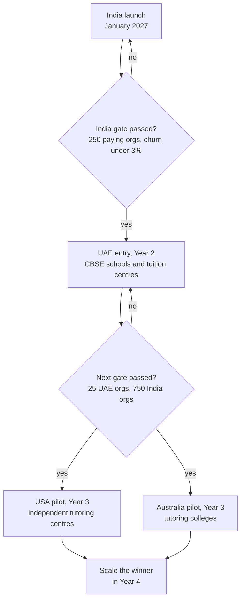
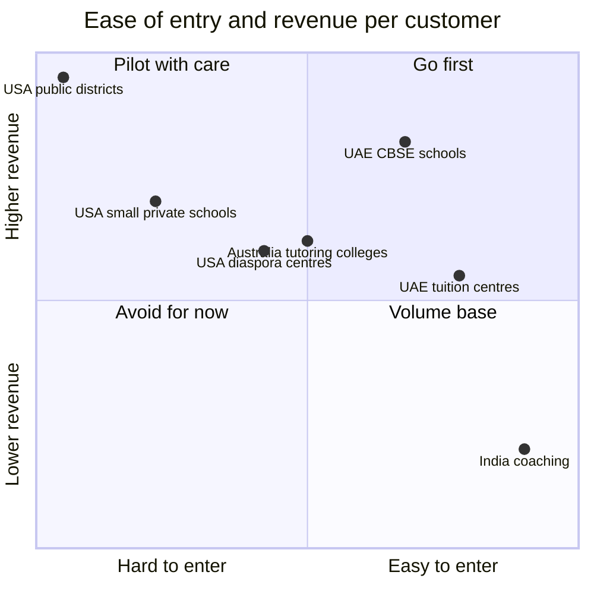
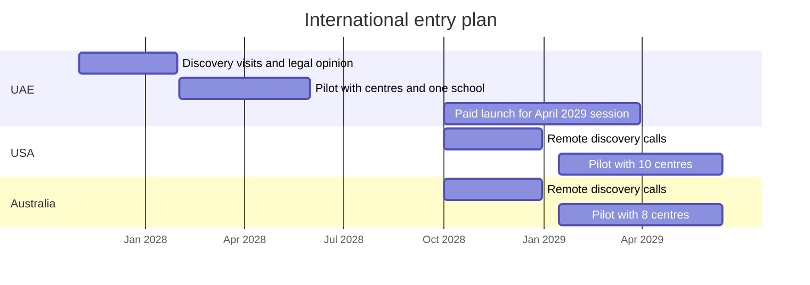

# Market Research: USA, Australia and UAE

**In simple words:** This chapter studies the three countries EduFlow plans to enter after India: the UAE in Year 2, and the USA and Australia as pilots in Year 3. For each country it explains how schools and tutoring centres work, which software they already use, what they pay, which laws apply, and how parents pay and communicate. It ends with a clear go/no-go checklist for each country, so the founder enters a market only when the facts say "go".

## How to read this chapter

EduFlow wins in India first. The canon fixes the order after that: UAE in Year 2 (Oct 2027 – Sep 2028), then USA and Australia pilots in Year 3 (Oct 2028 – Sep 2029). This chapter gives the market facts behind that order.

Three rules apply to every number in this chapter.

1. A number with a named source was found through web research in September 2026. The source is in the *Sources* list at the end.
2. A number marked **Estimate** is the author's own calculation. The reasoning is written next to it, so the founder can change the inputs.
3. All competitor facts are based on public information as of September 2026. Verify them before any external use (pitch decks, website, investor documents).

This chapter does not calculate TAM, SAM and SOM (the three standard market-size layers). That work is in *Market Sizing: TAM, SAM and SOM*. It also does not compare features one by one. That is in *Competitor Analysis* and *Feature Comparison Matrix*. Legal duties are listed here only at market level. The full control list is in *Compliance, Legal and Data Protection Requirements*.

Planning exchange rates from the canon are used everywhere: US$1 = ₹85, A$1 = ₹56, AED 1 = ₹23.

## The three markets at a glance

| Item | USA | Australia | UAE |
|---|---|---|---|
| K-12 schools | About 98,600 public + about 29,700 private | 9,673 | Dubai 227 private; Abu Dhabi about 219 private |
| K-12 students | About 49.6 million public + 4.7 million private | 4.16 million | Dubai private: 387,441 |
| Private share of students | About 9% | 37.2% (Catholic + independent) | Very high; about 90% of Dubai private pupils are expatriates |
| Coaching equivalent | Tutoring, test-prep and enrichment centres | Tutoring colleges; OC, selective and HSC coaching | Tuition centres; CBSE board and JEE/NEET coaching |
| Indian diaspora | About 5.2 million people | 971,020 India-born residents | About 4.36 million Indians |
| Parent messaging habit | Email + SMS + school apps | Email + school app + SMS | WhatsApp + email |
| EduFlow entry (canon) | Pilot in Year 3 | Pilot in Year 3 | Year 2 |

The pattern is simple. The UAE looks like "India abroad" for our product: CBSE schools, Indian owners, WhatsApp, April session. The USA is the largest market but the hardest to sell into. Australia is small, rich and well served at school level, but its tutoring sector is large and almost unregulated.

**Figure: Order of international entry with decision gates**

The diagram shows that each new country opens only after the previous market passes a gate. The gates are explained in the go/no-go checklists later in this chapter.

## United States

### Education system in the USA

The USA has no national school board. Each of the 50 states runs its own system. Inside a state, local school districts (local government bodies that run public schools) make most buying decisions. There are more than 13,000 school districts.

| Segment | Count | Students | Source and year |
|---|---|---|---|
| Public schools (all) | 98,577 | About 49.6 million (fall 2022) | NCES, 2020–21 and 2022 |
| of which charter schools | About 7,800 | 3.7 million (7% of public pupils) | NCES, 2021–22 |
| Private K-12 schools | 29,730 | About 4.7 million | NCES Private School Universe Survey, 2021–22 |
| School districts | More than 13,000 | Not applicable | A4L Student Data Privacy Consortium |

A charter school is a public school that is publicly funded but run by an independent operator. Charter schools buy software more freely than district schools. Charter enrolment has grown for over a decade.

Private schools matter most to EduFlow. The average private school is small.

> **Example:** 4.7 million private students divided by 29,730 private schools gives about 158 students per school. A school of this size fits inside the EduFlow Growth plan (up to 300 students) at $79 per month.

Many US private schools are faith-based (Catholic, other Christian, Jewish, Islamic) and run on thin budgets. NCES reports that Catholic school enrolment fell 4% while other religious schools grew 8% between the last two surveys. Small faith-based and Montessori schools are the ones that big SIS vendors ignore.

### Tutoring, after-school and test-prep centres in the USA

The USA has no "coaching institute" culture like Kota or Patna. But it has a large supplementary education sector with three layers.

| Layer | What it is | Examples | Software today |
|---|---|---|---|
| Franchise learning centres | Branded centres owned by local franchisees | Kumon, Mathnasium, Sylvan Learning, Huntington Learning Center | Mostly franchisor-mandated systems |
| Independent centres | Owner-run tutoring, test-prep (SAT, ACT, SSAT), coding, abacus, language and enrichment centres | Local brands, often one to three branches | Spreadsheets, Jackrabbit Class, TutorCruncher, Teachworks, generic booking tools |
| Online and home tutors | Marketplaces and solo tutors | Varsity Tutors, Wyzant, local tutors | Marketplace tools |

Franchise sizes, from the Entrepreneur 2025 education franchise ranking:

| Franchise | Units reported | Initial investment (US$) | Note |
|---|---|---|---|
| Kumon | 25,563 worldwide | 73,123 – 165,360 | About 1,700 US centres reported by 2026 franchise listings (not verified on Kumon's site) |
| Mathnasium | 1,231 | 112,936 – 149,616 | Maths only |
| Sylvan Learning | 570 | 107,922 – 239,012 | Multi-subject tutoring |
| Huntington Learning Center | 268 | 163,521 – 302,211 | Tutoring and test prep |

Market size signals, all from industry research firms:

- IBISWorld reports 19,881 online tutoring businesses in the USA in 2025, with revenue of about US$1.8 billion.
- IBISWorld's broader "Tutoring and Driving Schools" industry is estimated at US$18.9 billion revenue in 2025.
- Technavio expects the US private tutoring market to add US$28.85 billion between 2025 and 2029, at about 11.1% growth per year.

> **Note:** These three reports define "tutoring" differently, so the numbers do not add up. Use them only to show that the sector is large and growing. The careful bottom-up count is in *Market Sizing: TAM, SAM and SOM*.

**Estimate — independent centres that could buy EduFlow.** The four franchises above have about 3,800 US units in total. Franchisees usually must use the franchisor's system, so they are not our buyers. Independent centre-based businesses with 50 or more students are harder to count. A working estimate is 10,000 to 20,000 centres. Reasoning: online-only tutoring businesses alone number almost 20,000, and physical enrichment centres (maths, reading, coding, test prep, language, music) exist in most suburbs of the 50 largest metro areas. Validate this estimate with a Google Maps scrape of 10 metro areas before the Year 3 pilot.

**The Indian diaspora angle.** About 5.2 million people in the USA identified as Indian in 2023 (Pew Research Center, using Census Bureau data). Indian-origin families spend heavily on maths enrichment, spelling bee and olympiad training, SAT preparation, coding classes, and weekend language and music schools. Many of these centres are run by Indian-origin owners in New Jersey, the San Francisco Bay Area, Dallas, Houston, Chicago, Atlanta and Seattle. These owners already understand batch-based teaching and monthly fees. They are the warmest first buyers for an Indian product.

### Size of the SIS software market in the USA

SIS means student information system. It is the American name for the core school ERP: student records, attendance, grades, schedules and parent portal.

| Measure | Value | Source |
|---|---|---|
| US SIS market, K-12 plus higher education, 2025 | US$2.8 billion | IMARC Group, 2026 |
| Forecast for 2034 | US$4.7 billion (5.7% growth per year) | IMARC Group, 2026 |
| Global SIS market, 2025 | US$15.44 billion | Mordor Intelligence, 2026 |
| North America share of global | 37.6% (about US$5.8 billion) | Mordor Intelligence, 2026 |
| Higher education share of global | 58.2% (K-12 is the faster-growing part) | Mordor Intelligence, 2026 |
| Cloud share of deployments | 72% | Mordor Intelligence, 2026 |

Research firms disagree by a factor of two. A sensible planning range for US K-12 SIS spend is US$1.5 billion to US$2.8 billion per year. **Estimate:** the part that EduFlow can address (small private schools and independent centres) is well under 10% of this, because public districts take most of the spend. Even 5% of US$2 billion is US$100 million per year (about ₹850 crore). That is large enough for a Year 3 pilot.

### Leading products in the USA

| Product | Main customers | Public pricing signal | Gap EduFlow can use |
|---|---|---|---|
| PowerSchool | Public districts, large private schools | District contracts reported at US$4,160 – 24,939 per year; no public price list | Too heavy for a 150-student school; bought by Bain Capital for US$5.6 billion |
| Infinite Campus | Public districts, state-wide deals | Reported tiered pricing of about US$4 – 6 per student per year at large scale | Sells to districts only |
| Skyward | Public districts (student + finance bundle) | Reported US$14,500 – 19,000 per year | District focus |
| Blackbaud | Established independent schools | Quote only | Expensive; long implementation |
| Gradelink | Small private and faith-based schools | Quote only (online quote form) | Closest rival in small schools; no coaching batch model |
| Jackrabbit Class | Dance, gym, swim and class-based businesses | From US$49 per month; Plus from US$93; Enterprise US$245 | Not built for academics, exams or report cards |
| TutorCruncher | Tutoring agencies | Reported from US$30 per month plus 1% of revenue | Built for one-to-one tutor matching, not batches |
| Teachworks | Small tutoring companies | Reported from US$16.49 per month plus per-lesson fees | Per-lesson charges grow with volume |

Market share and contract values for PowerSchool, Infinite Campus and Skyward come from a 2026 Civic IQ analysis of public contracts, which puts PowerSchool at about 23% of the K-12 SIS market. Treat these as indications.

> **Note:** PowerSchool disclosed a cybersecurity incident that took place in December 2024. Media reports say data of about 62 million students and 9.5 million teachers was taken through a support portal that had no multi-factor authentication. After this event, US buyers ask hard security questions of every vendor. EduFlow must have its security answers ready before the first US sales call.

### Typical pricing in the USA

| Buyer type | How vendors charge | Typical yearly spend | EduFlow canon price |
|---|---|---|---|
| Public district | Per student per year, per module, 3–5 year contract | US$10,000 – 45,000+ per district | Not targeted |
| Private school, 150 students | Flat yearly quote plus setup fee | **Estimate:** US$1,500 – 4,000 | Growth: US$790 per year |
| Private school, 600 students | Per student, with paid onboarding | **Estimate:** US$5,000 – 15,000 | Pro: US$1,990 per year |
| Tutoring centre, 150 students | Flat monthly or percentage of revenue | US$600 – 4,000 | Growth: US$790 per year |

The two private school estimates use this reasoning: district-scale per-student prices of US$4 – 6 rise sharply for small buyers, and small-school vendors add setup and training fees. Confirm with 10 discovery calls before the pilot.

> **Example:** A test-prep centre in Edison, New Jersey has 150 students and bills US$30,000 per month. On a "US$30 plus 1% of revenue" plan it pays US$30 + US$300 = US$330 per month. EduFlow Growth costs US$79 per month flat. The saving is US$251 per month, or about US$3,000 per year (about ₹2.55 lakh).

### Procurement process in the USA

Procurement means the steps a buyer follows to choose and pay for software. It differs sharply by buyer type.

| Step | Public district | Small private school | Independent tutoring centre |
|---|---|---|---|
| Who decides | IT director, superintendent, school board | Head of school and business manager | Owner |
| Formal process | RFP (request for proposal) or cooperative purchasing contract | Two or three demos, reference calls | Free trial, then card payment |
| Sales cycle | 6 – 18 months | 1 – 3 months | 1 – 14 days |
| Contract | 3 – 5 years, board vote, signed data privacy agreement | 1 year, renewable | Monthly or yearly, cancel any time |
| Budget timing | Fiscal year starts 1 July; decisions January – May | Decide in spring for an August start | Any time; peaks in August and January |
| Security paperwork | SOC 2 report, accessibility statement, state privacy terms | Short security questionnaire | Usually none |

SOC 2 is an independent audit report on a vendor's security controls. Large US buyers expect it. It costs several lakh rupees per year, so EduFlow delays it until US revenue justifies it.

> **Founder note:** Do not answer public district RFPs in Year 3. One RFP can take 80 hours and needs SOC 2, insurance and US references. Sell only to buyers who can pay by card within 14 days.

### Compliance in the USA

| Law or standard | What it covers | Does it apply to EduFlow's wedge? | What EduFlow must do |
|---|---|---|---|
| FERPA (Family Educational Rights and Privacy Act) | Student education records at institutions that receive federal education funds | Directly to public schools; usually not to private tutoring centres | Act as a "school official" under contract; give parents access and correction rights |
| COPPA (Children's Online Privacy Protection Act) | Online services that collect data from children under 13 | Yes, for the Student Portal | Verifiable parental consent, written security programme, data retention policy |
| State student privacy laws | Bans on selling student data and on targeted ads; contract terms | Yes, when selling to any school | Sign the standard data privacy agreement; never use student data for ads |
| PCI DSS | Card data security | Yes | Use Stripe hosted payment pages; store no card data |
| TCPA and carrier rules | Consent for text messages; sender registration (10DLC) | Yes, for SMS | Opt-in records, STOP keyword, register the sender through Twilio |
| CAN-SPAM | Commercial email rules | Yes | Unsubscribe link, physical address in marketing email |
| Accessibility (ADA, WCAG 2.1 AA) | Usable by people with disabilities | Expected by schools | Keyboard access, contrast, screen-reader labels |
| State sales tax on SaaS | Tax differs by state | Yes, once sales cross state thresholds | Use Stripe Tax, as the canon states |

Key facts found in research:

- The FTC (Federal Trade Commission) amended the COPPA Rule in 2025. The changes took effect on 23 June 2025, with a compliance date of 22 April 2026. They add biometric data to "personal information", require separate parental consent for non-essential disclosure to third parties, and require a written security programme and retention policy.
- The FTC did not write the "school can consent for parents" practice into the rule. It continues as guidance, and only for educational use.
- Since 2014, nearly 150 student privacy laws have passed in 47 states and Washington DC, according to Student Privacy Compass.
- The Student Data Privacy Consortium publishes a National Data Privacy Agreement used by 28 state alliances. Its registry lists more than 130,000 signed agreements between more than 12,000 districts and 6,674 vendors.

> **Rule:** In the USA, EduFlow never sells student data, never shows ads to students, and never builds marketing profiles of children. This one rule satisfies the core of almost every state law.

### Payment habits in the USA

- **Cards first.** Parents pay tutoring and private school fees by credit or debit card. Stripe's standard US card fee is 2.9% + US$0.30 per payment.
- **ACH for large amounts.** ACH (Automated Clearing House) is the US bank-to-bank transfer network. Private schools prefer it for tuition because the fee is far lower than cards. Stripe's list price for ACH Direct Debit is 0.8% with a US$5 cap (verify on Stripe's US pricing page before launch).
- **Autopay is normal.** Parents expect to save a card or bank account and be charged automatically each month. Tutoring centres bill monthly, in advance.
- **Paper cheques still exist** in small private schools. The Payments module's manual "cheque" mode covers this.
- **No UPI, no cash counters.** Cash is rare. Fee receipts matter less than invoices and year-end statements for tax and childcare benefit claims.

> **Example:** A parent pays US$1,200 term tuition. By card, the fee is US$35.10 (2.9% + 30 cents). By ACH, the fee is US$5 (0.8% = US$9.60, capped at US$5). Schools will want an "ACH preferred" option and a way to pass card fees to parents where state law allows.

### Communication habits in the USA

Schools and centres talk to parents by email first, SMS second, and a school app third. Popular parent communication apps include ClassDojo, Remind and ParentSquare. WhatsApp is not a school channel in the USA. Most parents use iMessage or plain SMS, and schools avoid personal messaging apps for record-keeping reasons.

The one exception is useful to us. Indian, Latino and other immigrant parent groups use WhatsApp daily. A diaspora-run centre will value WhatsApp reminders. So EduFlow keeps WhatsApp as an optional channel in the USA, but email and SMS must work perfectly first. Both are Phase 2 modules (Email and SMS), so they exist before any US pilot.

### Entry wedge for EduFlow in the USA

A wedge is the narrow first segment where a new product can win. The US wedge has three parts, in priority order.

1. **Indian diaspora-run tutoring and enrichment centres** with 50 – 500 students. They know the batch model, accept a product built in India, and can be reached through community WhatsApp groups, temple and cultural association networks, and Indian founders' referrals.
2. **Other independent tutoring and test-prep centres** that today use spreadsheets or generic class-booking software.
3. **Small private schools under 300 students** (Montessori, faith-based, micro-schools) that cannot afford Blackbaud or PowerSchool.

EduFlow does not target public districts, charter networks or franchise units in the first five years.

### Localization needs for the USA

| Area | Change needed |
|---|---|
| Language and labels | US English; "Grade 5" not "Class 5"; "Tuition" not "Fees"; "Report card" with GPA (grade point average) and letter grades A – F |
| Dates, units, currency | MM/DD/YYYY, US$ with cents, 12-hour time, multiple time zones per organization |
| Academic calendar | August – June year; semesters or quarters; summer camps as separate short sessions |
| Payments | Stripe cards + ACH, autopay, card-fee pass-through toggle, Stripe Tax for state sales tax |
| Messaging | Email via Amazon SES, SMS via Twilio with 10DLC registration, opt-in and STOP handling |
| Privacy | COPPA parental consent flow, data privacy agreement template, US data hosting option |
| Records | No Aadhaar, caste or category fields; add emergency contact, pickup authorization, allergy notes |
| Support | Coverage for 9 am – 5 pm US Eastern, which is 6:30 pm – 2:30 am IST |

### Risks in the USA

| Risk | Impact | Mitigation |
|---|---|---|
| Trust gap for an unknown Indian vendor after the PowerSchool breach | Lost deals | Publish a security page, offer US hosting, get SOC 2 in Year 4 |
| High customer acquisition cost in a crowded ad market | CAC above plan | Community-led sales in diaspora networks; no paid ads until 20 references exist |
| State-by-state legal differences | Legal cost, delays | Start in 3 states (New Jersey, Texas, California); use standard agreement templates |
| Support hours at night in India | Slow replies, churn | Chat bot plus one night-shift support hire when US paying customers cross 30 |
| Lawsuit culture | Rare but costly | US-style terms of service, liability cap, cyber insurance before 50 US customers |

### Go/no-go checklist for the USA

| Check | "Go" threshold | How to verify |
|---|---|---|
| India base is healthy | 750+ paying organizations, monthly churn under 3% | *KPI Framework and Dashboard* |
| Email and SMS modules proven | 6 months in production, delivery above 98% | Notification logs |
| International pack shipped | US labels, grades, time zones, Stripe cards + ACH live | Phase 4 release notes |
| Privacy pack ready | COPPA consent flow, privacy agreement template, US privacy policy reviewed by a US lawyer | Legal sign-off |
| Demand signal | 30 discovery calls, 10 centres agree to pilot, 5 say they would pay US$79 | Call notes |
| Pilot result | 10 pilot centres, 6 convert to paid within 60 days | Billing data |
| Unit economics | CAC under US$500 (about ₹42,500); payback under 8 months at 80% gross margin | *Financial Plan and Projections* |
| Support cover | Night-shift or US-based part-time support in place | Roster |

CAC means customer acquisition cost: the sales and marketing money spent to win one paying customer. Six or more passes out of eight means "go". If five or fewer checks pass, the decision is "no-go": stay in pilot mode and do not spend on US marketing.

## Australia

### Education system in Australia

Australia has six states and two territories. Each runs its own government schools and its own Year 12 certificate. Schools fall into three sectors: government, Catholic and independent. The school year runs from late January to mid-December, in four terms of about ten weeks.

| Sector | Schools | Share of students | Approximate students |
|---|---|---|---|
| Government | 6,737 | 62.8% | 2,608,098 |
| Catholic | 1,758 | 20.0% | 831,535 |
| Independent | 1,178 | 17.2% | 715,386 |
| **Total** | **9,673** | **100%** | **4,160,918** |

Source: Australian Bureau of Statistics, *Schools, 2025* (released March 2026). Three facts stand out.

- Independent school enrolment grew 15.3% between 2021 and 2025. Government school enrolment fell 0.4% in the same period.
- The average independent school has about 607 students (715,386 divided by 1,178). The average Catholic school has about 473. These are mid-size schools with budgets, and they already own software.
- There are 325,190 full-time equivalent teachers, a ratio of 12.8 students per teacher.

### Tutoring colleges and OC, selective and HSC coaching in Australia

Australia is the closest match to Indian coaching culture among Western countries. The reason is a set of high-stakes tests.

| Test or stage | What it is | Why parents pay for coaching |
|---|---|---|
| OC test (New South Wales) | Entry test in Year 4 for "opportunity classes" in Years 5 – 6 | Seen as the first step towards a selective high school |
| Selective high school test (NSW) | Entry test in Year 6 for Year 7 places in selective government schools | About 15,000 applicants for a little over 4,300 places, as reported by test-prep providers |
| Selective entry and scholarship tests (Victoria and other states) | Entry to selective government schools and scholarships at private schools | Free or discounted seats at top schools |
| NAPLAN | National literacy and numeracy tests in Years 3, 5, 7 and 9 | Results are used in some school applications |
| HSC, VCE, QCE, WACE, SACE | Year 12 certificates by state; they produce the university entrance rank | Same role as Class 12 boards plus entrance rank in India |

Facts from research:

- One in six Australian students receives private tutoring. In parts of Sydney it is one in four (University of Wollongong, 2025).
- Tutor numbers are estimated between 45,000 (Jobs and Skills Australia) and 80,000 (SBS).
- Trade media value the sector at about A$2.2 billion, with around 5,000 tutoring businesses. The informal cash sector is not counted.
- There is "little to no concrete state or federal regulation of tutoring in Australia" (University of Wollongong, 2025). The Australian Tutoring Association runs a voluntary code of conduct.
- From 2025 the NSW selective and OC tests moved from paper to computer.

The sector has three layers, like the USA. Franchise brands such as Kumon and Kip McGrath run local centres. Large "tutoring colleges" in Sydney and Melbourne run term-based classes for hundreds or thousands of students across several branches. Below them sit thousands of single-owner centres and home tutors.

**Estimate — centres that could buy EduFlow.** If about 5,000 tutoring businesses exist and 30% to 40% are centre-based with 50 or more students, the target is 1,500 to 2,000 centres. Validate with state business registers and Google Maps before the pilot.

**The Indian diaspora angle.** At 30 June 2025, 971,020 residents of Australia were born in India. For the first time, this was the largest overseas-born group, just ahead of England at 970,950 (ABS, 2026). Indian-origin families cluster in western Sydney (Parramatta, Harris Park, Blacktown) and in Melbourne's west and south-east (Tarneit, Point Cook, Dandenong). Many selective-test and maths coaching centres in these suburbs are run by Indian, Sri Lankan, Chinese, Korean and Vietnamese-origin owners. They teach in batches, bill per term and run weekly tests, exactly like Sharma Classes in Patna.

### Size of the school software market in Australia

No reliable public report gives a number for Australian school administration software alone. So this section uses an estimate.

**Estimate:** 4.16 million students multiplied by A$10 – 25 per student per year gives A$42 million to A$104 million per year (about ₹235 crore to ₹580 crore). Reasoning: per-student SIS prices reported in the USA are US$4 – 6 at very large scale and much higher for single schools. Australian vendors sell school by school, with more modules (payments, events, canteen, parent app), so a higher per-student figure is likely. Government schools in some states also use state-built core systems, which lowers the open market.

The tutoring software market is separate and much smaller. **Estimate:** 1,500 – 2,000 centres multiplied by A$1,190 – 2,990 per year gives A$1.8 million to A$6 million per year. This is a niche, but a profitable one with almost no local specialist vendor.

### Leading products in Australia

| Product | Main customers | Public facts | Gap EduFlow can use |
|---|---|---|---|
| Compass | Government, Catholic and independent schools | 5,000+ schools and 5 million users worldwide; 50+ modules; bought by EQT in January 2025; bought Music Monitor (2025) and Inklass (2026) | Does not serve tutoring centres; priced for schools |
| Sentral | Government and independent K-12 schools | 35+ modules; says it has helped "thousands of Australian schools"; runs 90 schools for the ACT Education Directorate | School-only focus |
| SEQTA (Education Horizons) | Independent and Catholic schools | Group reports 1,900 schools and 1 million+ users in 60 countries | Teaching and learning focus; premium |
| TASS | Independent schools | Named with Compass, Sentral and SEQTA as the main Sydney systems | Finance-heavy; large schools |
| Xplor Education | Childcare and early learning | 8,700+ services across Australia and New Zealand | Childcare subsidy workflows; not K-12 or tutoring |
| Teachworks, TutorCruncher | Tutoring businesses | Global tools priced in US$ | Built for one-to-one lessons, not batch coaching with tests and ranks |

None of the four school vendors publishes a price list. All use "book a demo" and custom quotes.

### Typical pricing in Australia

| Buyer type | How vendors charge | Typical yearly spend | EduFlow canon price |
|---|---|---|---|
| Independent school, 600 students | Per student per year plus modules plus onboarding | **Estimate:** A$9,000 – 25,000 | Pro: A$2,990 per year |
| Small independent school, 200 students | Same, with a minimum fee | **Estimate:** A$4,000 – 8,000 | Growth: A$1,190 per year |
| Tutoring college, 250 students | Global tutoring tools in US$; or spreadsheets plus Xero accounting | A$0 – 4,000 | Growth: A$1,190 per year |
| Multi-branch tutoring college, 900 students | Custom-built system or several tools | **Estimate:** A$5,000 – 20,000 | Pro: A$2,990 per year |

The estimates assume A$15 – 40 per student per year for a single school, which is higher than US district pricing because volumes are smaller. Confirm in discovery calls.

> **Example:** A selective-test coaching college in Parramatta has 250 students who each pay A$600 per ten-week term. Term revenue is A$150,000. EduFlow Growth at A$1,190 per year is 0.2% of yearly revenue (A$600,000). One recovered unpaid term fee pays for half a year of EduFlow.

### Procurement process in Australia

| Buyer | Who decides | Process | Cycle |
|---|---|---|---|
| Government school | Principal and business manager, within state department rules | Must use department-approved systems for core records; add-ons bought from school budget | 3 – 9 months |
| Catholic systemic school | Diocesan education office | Central choice for all schools in the diocese; formal tender | 9 – 18 months |
| Independent school | Principal, business manager and IT manager | Demos, reference visits, board approval for large spend | 3 – 9 months |
| Tutoring college | Owner or centre director | Online trial, one demo, card payment | 1 – 21 days |

Schools decide in Terms 3 and 4 (July – December) for a January start. The financial year runs from 1 July to 30 June. Many schools now ask vendors about the Safer Technologies for Schools (ST4S) assessment, a national security and privacy review for school software. Verify its current requirements before approaching any school.

### Compliance in Australia

| Law or rule | What it covers | What EduFlow must do |
|---|---|---|
| Privacy Act 1988 and the 13 Australian Privacy Principles (APPs) | Collection, use, disclosure, security, access and correction of personal information | Clear privacy policy, collect only what is needed, access and correction tools |
| APP 8 (cross-border disclosure) | Sending personal information overseas | Offer hosting in AWS Sydney; name overseas processors in the contract |
| Notifiable Data Breaches scheme | Must notify the regulator (OAIC) and affected people of serious breaches | Breach runbook; assess suspected breaches within 30 days; canon baseline is notice within 72 hours |
| Privacy and Other Legislation Amendment Act 2024 | New statutory tort for serious invasions of privacy (from 10 June 2025); new OAIC fine powers | Treat privacy failures as a lawsuit risk, not only a regulator risk |
| Children's Online Privacy Code | Code for online services likely to be used by children; must be registered by 10 December 2026 | Read the final code in early 2027; adjust the Student Portal if covered |
| Spam Act 2003 and the SMS Sender ID Register | Consent and unsubscribe for marketing; sender names must be registered from 1 July 2026 | Register the "EduFlow" and school sender IDs through Twilio, or messages show as "Unverified" |
| Working with Children Check (state based) | Clearance for adults who work with children | Staff profile needs check number and expiry date, with renewal reminders |
| GST | 10% goods and services tax | Charge GST as per canon; register once Australian turnover reaches the A$75,000 threshold (confirm with a tax adviser) |

A small business with turnover under A$3 million is currently exempt from most of the Privacy Act. Many tutoring centres fall under this line. Law firms widely expect the exemption to be removed in the next round of reform, which has not yet passed. EduFlow will follow the Act fully from day one, because its customers may lose the exemption at any time.

### Payment habits in Australia

- **Cards lead.** The Reserve Bank of Australia's 2025 Consumer Payments Survey found that cards remain the most common payment method. Cash was about 15% of payments. Cheques were 0.02%.
- **BPAY for bills.** BPAY is a bill payment service inside every Australian online banking app. The payer enters a biller code and a customer reference number. School fee invoices usually carry BPAY details. Its share of payments has been stable.
- **Direct debit for instalments.** Direct debit means the school pulls money from the parent's bank account on agreed dates, through the BECS bank system. It is the standard way to pay school fees monthly or fortnightly.
- **PayTo is new and little used.** Fewer than 20% of people know about it and under 5% have used it (RBA, 2026).
- **Stripe fees.** Stripe's standard fee for domestic cards in Australia is 1.70% + A$0.30 since April 2024. Stripe also supports BECS Direct Debit.
- **Term billing.** Tutoring colleges invoice a full ten-week term in advance. Make-up lessons and credits for missed classes are common.

> **Founder note:** BPAY needs a biller arrangement through a bank or a payments partner. It is not part of Stripe. Launch the Australian pilot with cards and BECS Direct Debit only. Add BPAY when more than 10 school customers ask for it.

### Communication habits in Australia

Schools use email and a parent app (Compass, Sentral for Parents, SEQTA Engage). SMS is used for same-day absence alerts and emergencies. WhatsApp is common inside migrant communities but is not an official school channel. Tutoring colleges use email, SMS and, in diaspora suburbs, WhatsApp or WeChat groups run from a staff phone. EduFlow's default channel set for Australia is email + SMS + in-app, with WhatsApp as an option.

### Entry wedge for EduFlow in Australia

1. **Tutoring colleges for OC, selective, scholarship and Year 12 coaching** with 100 – 1,000 students, starting in western Sydney and Melbourne. They need batches, weekly tests with ranks, term invoices, make-up class tracking and parent updates. EduFlow's coaching model already does this.
2. **Indian diaspora-run centres first**, because trust and referrals travel fast in a community of nearly one million people.
3. **Very small independent schools** (under 200 students: community, faith-based, Montessori and Steiner schools) only after 30 tutoring customers. The school segment is well defended by Compass, Sentral, SEQTA and TASS.

### Localization needs for Australia

| Area | Change needed |
|---|---|
| Language and labels | Australian English ("enrolment", "Year 7", "Term 2"); grades A – E; state certificate names |
| Calendar | January – December year, four terms, state-specific holiday calendars |
| Currency and tax | A$; "Tax invoice" layout with the seller's ABN (Australian Business Number) and 10% GST line |
| Payments | Stripe cards and BECS Direct Debit; BPAY reference field on invoices (manual reconciliation at first) |
| Billing model | Term-based invoices, make-up lesson credits, sibling discounts, trial lessons |
| Messaging | Email, SMS through Twilio with a registered sender ID, optional WhatsApp |
| Staff records | Working with Children Check number, state, expiry date and reminder |
| Hosting and time | AWS Sydney region option; three main time zones and daylight saving differences |
| Support | 9 am Sydney is 3:30 am or 4:30 am IST; early-morning shift or local part-time agent |

### Risks in Australia

| Risk | Impact | Mitigation |
|---|---|---|
| Small total market | Growth ceiling of a few thousand customers | Treat Australia as a niche with high revenue per customer, not a volume market |
| Strong, well-funded school vendors | School segment closed | Stay in tutoring until EduFlow has local references |
| Privacy reform removes the small business exemption | More customer questions, contract changes | Full Privacy Act compliance from day one; Sydney hosting |
| New regulation of tutoring | Centres may need registration and records | Turn it into a feature: compliance records and child-safety fields |
| Distance and time zone | Slow support, weak relationships | Partner with one local reseller or a part-time customer success person in Sydney |

### Go/no-go checklist for Australia

| Check | "Go" threshold | How to verify |
|---|---|---|
| India base is healthy | 750+ paying organizations, monthly churn under 3% | *KPI Framework and Dashboard* |
| International pack shipped | Australian labels, terms, GST tax invoice, Stripe cards + BECS | Phase 4 release notes |
| Sender ID and consent | Sender ID registered; opt-out handling tested | Twilio console |
| Privacy pack | Privacy policy mapped to the 13 APPs; breach runbook; Sydney hosting option priced | Legal sign-off |
| Demand signal | 25 discovery calls; 8 centres agree to pilot | Call notes |
| Pilot result | 8 pilot centres; 5 convert to paid within one school term | Billing data |
| Unit economics | CAC under A$750 (about ₹42,000); payback under 8 months | *Financial Plan and Projections* |
| Local presence | One reseller or part-time local agent signed | Contract |

Six or more passes means "go". Five or fewer means stay in pilot.

## United Arab Emirates

### Education system in the UAE

The UAE has seven emirates. Public schools follow the national Ministry of Education (MoE) curriculum and mainly serve Emirati citizens. Expatriates, who are the large majority of residents, use private schools. Each big emirate has its own private school regulator.

| Regulator | Area | Role |
|---|---|---|
| KHDA (Knowledge and Human Development Authority) | Dubai | Licenses, inspects and rates private schools; controls fee increases |
| ADEK (Department of Education and Knowledge) | Abu Dhabi, Al Ain, Al Dhafra | Same role for Abu Dhabi emirate |
| SPEA (Sharjah Private Education Authority) | Sharjah | Same role for Sharjah |
| Ministry of Education | Federal; northern emirates | Public schools; private school oversight where no local body exists |

Dubai publishes the best data. For the 2024–25 academic year (Dubai Media Office and KHDA, January 2025):

| Dubai private schools, 2024–25 | Value |
|---|---|
| Private schools | 227 |
| Students | 387,441 from 185 nationalities |
| Enrolment growth in one year | 6% |
| New schools opened | 10 |
| Curricula offered | 17 |
| Share by curriculum | UK 37%, Indian 26%, US 14%, IB (International Baccalaureate) 7%, UK/IB 4% |
| Teachers | 27,284 |
| Dubai Education Strategy (E33) target | At least 100 new private schools by 2033 |

Abu Dhabi lists about 219 private schools in ADEK's inspection tables (as reported by WhichSchoolAdvisor). The wider UAE private K-12 sector is valued at about US$7.17 billion in fee revenue for 2025, rising to US$10.29 billion by 2030 (Mordor Intelligence).

### Indian-curriculum schools and tuition centres in the UAE

This is the heart of the UAE opportunity.

- The UAE has **106 CBSE-affiliated schools**, "the largest CBSE school network outside India" (Gulf News, 2025).
- In Dubai, Indian-curriculum schools number 34 with about 99,600 students, based on reports of KHDA's 2024–25 landscape data. That is about 2,930 students per school.
- About 4.36 million Indians live in the UAE, and more than half live in Dubai (Gulf News, 2025, quoting Indian diplomats).
- CBSE announced a "CBSE Global Curriculum" for its schools abroad, planned from April 2026, after talks with KHDA, ADEK and SPEA.
- Indian-curriculum schools start their year in April, like India. Most other UAE schools start in late August.

> **Note:** A Dubai CBSE school with 2,930 students is far above the Pro plan limit of 1,000 students. Large UAE schools are Enterprise deals (from AED 1,849 per month). Mid-size schools of 500 – 1,000 students in Sharjah, Ajman and Ras Al Khaimah fit the Pro plan at AED 749 per month.

**Tuition centres.** Indian families in the UAE use tuition heavily for CBSE board exams and for JEE and NEET. Supply comes from three places: licensed training institutes and coaching branches of Indian brands, small tuition centres in residential areas such as Karama, Bur Dubai, Al Nahda and Sharjah, and home tutors. On 18 December 2023 the MoE and the Ministry of Human Resources and Emiratisation introduced a free two-year Private Teacher Work Permit. It lets qualified people give private lessons legally, online or in person, to individuals or groups. Unlicensed tutoring can be fined. This rule pushes tutors towards proper records, which helps a product like EduFlow.

**Estimate — UAE target count.** 106 CBSE schools plus about 40 other Indian-board, Pakistani, Bangladeshi and Filipino-curriculum budget schools gives about 150 schools. Add 300 to 600 tuition and coaching centres with 50 or more students. Reasoning for centres: one centre per 7,000 – 14,000 Indian residents, which is far lower than Indian city density because of licence costs. Validate through Google Maps and KHDA's training institute directory.

### Size of the school software market in the UAE

No public report isolates UAE school ERP spend. **Estimate:** about 800,000 private school students across the UAE, multiplied by AED 40 – 100 per student per year, gives AED 32 million to AED 80 million per year (about ₹74 crore to ₹184 crore). Reasoning: Dubai alone has 387,441 private students. Abu Dhabi, Sharjah and the northern emirates together are assumed to add a similar number. The per-student range sits between Indian ERP pricing and UK-style pricing, because both types of vendor sell here. A cross-check: AED 80 million is about 0.3% of the US$7.17 billion (AED 26 billion) fee pool, a normal software share for schools.

### Leading products in the UAE

| Product | Origin | Main customers | Public facts |
|---|---|---|---|
| iSAMS | United Kingdom | British, IB and premium international schools | 1,800+ schools worldwide; "hundreds" in the Middle East; KHDA and ADEK report extracts; Arabic right-to-left parent portal; Sunday support |
| Orison School ERP | UAE and India | Mid-market schools in UAE, Saudi Arabia, Qatar, Oman | Building business and school software since 2003 |
| Schoolvoice | UAE | School-to-parent communication | Communication app with UAE school partnerships |
| In-house systems | UAE school groups | Large groups with 10+ schools | Not publicly listed |
| Indian ERP vendors | India | Indian-curriculum schools | Gulf presence is claimed by several vendors; not publicly verified |
| Zenda with Tabby | UAE | School fee payments and instalments | Tabby offers fee plans of up to 12 months through Zenda |

Pricing is not published by any of these vendors. **Estimate** for a mid-market school ERP in the UAE: AED 40 – 100 per student per year, with a setup fee. A 1,000-student school would then pay AED 40,000 – 100,000 per year. EduFlow Pro at AED 7,490 per year is far below this. The low price is a strength with budget Indian-curriculum schools, whose fees are controlled by regulators. It can also look "too cheap" to premium schools, which EduFlow does not target.

### Typical pricing in the UAE

| Buyer type | How vendors charge | Typical yearly spend | EduFlow canon price |
|---|---|---|---|
| Premium British or IB school, 1,500 students | Per student per year plus onboarding; quote only | **Estimate:** AED 120,000 – 250,000 (AED 80 – 165 per student) | Not targeted |
| Indian-curriculum school, 2,500 students | Per student or flat yearly licence plus setup | **Estimate:** AED 75,000 – 175,000 (AED 30 – 70 per student) | Enterprise: from AED 22,188 per year |
| Indian-curriculum school, 800 students | Flat yearly licence; often desktop software with a support contract | **Estimate:** AED 32,000 – 80,000 (AED 40 – 100 per student) | Pro: AED 7,490 per year |
| Tuition centre, 150 students | Spreadsheets, WhatsApp and an accounting tool | AED 0 – 5,000 | Growth: AED 2,990 per year |

Reasoning for the estimates: the mid-market range of AED 40 – 100 per student per year from the previous section. Premium schools pay more for UK products, and very large schools get a lower per-student rate for volume. The Enterprise figure is 12 × AED 1,849, the canon "from" price. All four rows must be confirmed in the 20 discovery meetings listed in the UAE checklist.

> **Example:** An 800-student CBSE school in Ajman charges average fees of AED 7,000 per year, so fee revenue is AED 5.6 million (about ₹12.9 crore). EduFlow Pro at AED 7,490 per year is 0.13% of revenue, or about AED 9.40 per student per year (about ₹215).

### Procurement process in the UAE

| Buyer | Who decides | Process | Cycle |
|---|---|---|---|
| Large school group | Group IT head and chief financial officer | Central evaluation, security review, regulator reporting needs | 6 – 12 months |
| Standalone Indian-curriculum school | Owner or trustee, principal, finance manager | In-person demo, reference from a known school, price negotiation | 1 – 4 months |
| Tuition or coaching centre | Owner | WhatsApp demo, free trial, card or bank transfer | 1 – 21 days |

Four local habits matter.

1. **Relationships and presence.** Owners expect to meet the vendor. Plan two founder visits per year and one local partner.
2. **Invoices in AED with a tax registration number.** Schools prefer a UAE-registered supplier. **Estimate:** a free-zone company costs AED 12,000 – 25,000 per year. Start through a reseller and open the entity after 25 paying customers.
3. **Buying season.** Indian-curriculum schools decide between December and February for the April session. This is the same season as India, so one sales calendar serves both.
4. **Regulator reporting.** Schools must send student and staff data to KHDA, ADEK, SPEA or the MoE. A vendor who makes these reports easy wins the finance and admin staff.

### Compliance in the UAE

| Law or body | What it covers | Status and what EduFlow must do |
|---|---|---|
| PDPL (Federal Decree-Law 45 of 2021) | Personal data protection on the UAE mainland | In force, but Executive Regulations are still awaited (DLA Piper 2025, Chambers 2026). Follow the canon baseline. |
| DIFC and ADGM data laws | Separate data laws inside the two financial free zones | Apply only if EduFlow or a customer is based there; these regulators actively fine |
| Child Digital Safety law (Federal Decree-Law 26 of 2025) | Protection of children from online risks | One-year grace period reported; review the final duties for the Student Portal before entry |
| KHDA, ADEK, SPEA expectations | School licensing, inspections, fee rules, parent contracts, data reporting | Support report extracts; keep fee changes auditable; keep safeguarding records private |
| VAT | 5% value added tax | Charge 5% as per canon once registered; confirm the registration threshold and reverse-charge rules with a UAE tax adviser |
| Health data rules | Health information generally must stay inside the UAE | Do not store detailed medical records for UAE tenants; keep only allergy and emergency notes |

The canon baseline means GDPR-style principles (the European data protection standard): consent, access, correction, deletion, portability and breach notice within 72 hours. The legal guides also report that the UAE Data Office, the planned regulator, is not yet fully working.

> **Warning:** Several vendor blogs claim that the PDPL Executive Regulations are already issued and enforced. Two established legal guides say the opposite. Before UAE entry, pay a UAE law firm for a one-page written opinion on PDPL status, data hosting location and child data consent.

Data hosting is a sales question as much as a legal one. Schools feel safer when data stays in the country. AWS runs a UAE region, so EduFlow can offer in-country hosting for Enterprise customers. This is an assumption to be costed in *Financial Plan and Projections*.

### Payment habits in the UAE

- **Cards with 3D Secure (the one-time-password step for card payments), Apple Pay and Google Pay** are the main online methods. Parents also pay by card at the school counter.
- **Bank transfer** to the school's IBAN (international bank account number) with the student's reference is common.
- **Cheques** are still used. Post-dated cheques (cheques dated for future terms) are becoming less common, and many Dubai schools no longer accept them (Gulf News).
- **Instalments are in demand.** Tabby, a buy-now-pay-later company, launched school fee plans of up to 12 months through the Zenda platform. Khaleej Times reported a survey in which 88% of parents felt financial strain from school fees.
- **Fees are term-wise** in most schools (three terms). Many Indian-curriculum schools also allow monthly payment.
- **Stripe works in the UAE.** Stripe adds 1% for non-UAE cards and 1% for currency conversion on top of its domestic rate. Charge in AED and settle in AED to avoid both.

### Communication habits in the UAE

WhatsApp is the default. Market trackers put WhatsApp use above 90% of UAE internet users. Schools send circulars by email and app, but teachers, transport staff and parents coordinate on WhatsApp. For Indian-curriculum schools the languages are English first, then Hindi, Malayalam, Tamil and Urdu. Arabic is required for communication from MoE-curriculum and Arabic-medium schools, which are not in the first wedge.

This is a direct fit. EduFlow's WhatsApp module is a Phase 1 feature and needs almost no change for the UAE.

### Entry wedge for EduFlow in the UAE

1. **Mid-size Indian-curriculum schools** (500 – 3,000 students) in Sharjah, Ajman, Ras Al Khaimah, Abu Dhabi and Dubai that run on older desktop software or a mix of tools.
2. **Tuition and coaching centres** for CBSE, JEE and NEET with 50 – 500 students. These are the same buyers as Sharma Classes, with AED pricing.
3. **Budget schools of other South Asian and Filipino curricula**, after 10 CBSE references.

The entry message is simple: "The system your sister school in India uses, priced in AED, with WhatsApp, VAT invoices and April-to-March sessions ready."

### Localization needs for the UAE

| Area | Change needed |
|---|---|
| Currency and tax | AED; VAT 5% tax invoice with the supplier's tax registration number |
| Student records | Emirates ID, passport number, visa expiry, sponsor name; student name in Arabic as an optional field |
| Calendar | April – March and August – July sessions; Monday – Friday week with a short Friday; Sharjah's four-day week |
| Subjects | Arabic, Islamic Studies, UAE Social Studies and Moral Education as standard subjects |
| Reports | Student and staff data extracts in regulator formats (start with KHDA and ADEK) |
| Payments | Stripe in AED; bank transfer and cheque modes with post-dated cheque tracking |
| Messaging | WhatsApp Cloud API, email; SMS through Twilio for OTP |
| Language | English in Year 2; Arabic right-to-left Parent Portal in Year 3 or 4 |
| Hosting and support | Optional AWS UAE region; UAE time is 1.5 hours behind IST, so the India support team covers it |

### Risks in the UAE

| Risk | Impact | Mitigation |
|---|---|---|
| Unclear PDPL rules | Contract delays, rework | Written legal opinion; GDPR-style baseline; in-country hosting option |
| Large groups use in-house systems | Biggest schools are closed | Target standalone schools and small groups of 2 – 5 schools |
| Relationship-driven sales | Remote selling fails | Local reseller with 20% revenue share; founder visits in November and January |
| Indian competitors follow | Price pressure | Win on WhatsApp automation, speed of setup and parent experience |
| Slow payment by schools | Cash flow strain | Yearly prepaid plans only for schools; card on file for centres |
| Arabic requirement grows | Lost deals outside Indian schools | Schedule Arabic right-to-left work in the *Five-Year Roadmap* |

### Go/no-go checklist for the UAE

| Check | "Go" threshold | How to verify |
|---|---|---|
| India base is healthy | 250+ paying organizations (halfway to the Year 2 target of 500), monthly churn under 3% | *KPI Framework and Dashboard* |
| School modules mature | Exams, Report Cards, Transport and Certificates live and used by 50+ Indian schools | Usage analytics |
| UAE pack shipped | AED, VAT invoice, Emirates ID and visa fields, UAE subjects, Monday – Friday week | Release notes |
| Legal opinion in hand | Written advice on PDPL, hosting and child data | Law firm letter |
| Stripe UAE account live | AED charges and AED settlement tested | Test payments |
| Demand signal | 20 discovery meetings; 3 schools and 7 centres agree to pilot | Meeting notes |
| Reference customer | 1 CBSE school with 1,000+ students live for one full term | Case study |
| Local partner | One reseller or advisor signed in Dubai or Sharjah | Contract |
| Unit economics | CAC under AED 1,800 (about ₹41,400) for centres; payback under 8 months | *Financial Plan and Projections* |

Seven or more passes out of nine means "go". Fewer means extend the pilot by one term.

## Comparison across India, UAE, USA and Australia

India figures are shown only for comparison. The detailed and authoritative India numbers are in *Market Research: India*.

| Factor | India | UAE | USA | Australia |
|---|---|---|---|---|
| K-12 schools | About 14.7 lakh (UDISE+ 2024–25) | Dubai 227 + Abu Dhabi about 219 private; 106 CBSE schools nationwide | About 98,600 public + 29,730 private | 9,673 |
| K-12 students | About 24.7 crore | Dubai private 387,441; **Estimate** 8 lakh private nationwide | About 5.4 crore (54.3 million) | 41.6 lakh (4.16 million) |
| Private school role | Large and growing; budget private schools dominate the wedge | Private schools serve almost all expatriates | About 9% of students | 37.2% of students |
| Coaching culture | Very strong (JEE, NEET, boards, tuition) | Strong among Indian families (CBSE, JEE, NEET) | Moderate; enrichment and test prep | Strong in Sydney and Melbourne (OC, selective, Year 12) |
| First buyer for EduFlow | Coaching owner; budget school owner | CBSE school owner; tuition centre owner | Independent centre owner | Tutoring college owner |
| Main incumbents | Teachmint, Classplus, Fedena, MyClassCampus | iSAMS, Orison, in-house systems | PowerSchool, Infinite Campus, Skyward, Blackbaud, Gradelink | Compass, Sentral, SEQTA, TASS |
| Incumbent pricing style | Low per-student or flat yearly; freemium | Quote only | Per student per year; long contracts | Quote only; per student |
| EduFlow Growth price per month | ₹2,499 | AED 299 (₹6,877) | US$79 (₹6,715) | A$119 (₹6,664) |
| EduFlow Pro price per month | ₹5,999 | AED 749 (₹17,227) | US$199 (₹16,915) | A$299 (₹16,744) |
| Subscription tax | GST 18% | VAT 5% | State sales tax where it applies | GST 10% |
| Parent fee payments | UPI, cash, cheque, cards | Cards, bank transfer, cheques, instalment plans | Cards, ACH bank debit, autopay | Cards, BPAY, direct debit |
| Payment gateway (canon) | Razorpay | Stripe | Stripe | Stripe |
| Main parent channel | WhatsApp | WhatsApp, then email | Email, then SMS | Email and school app, then SMS |
| Main privacy law | DPDP Act 2023 | PDPL 2021 (rules awaited) | FERPA, COPPA, state laws | Privacy Act 1988 and APPs |
| Children's data rule | Verifiable parental consent; no tracking or ads | Child Digital Safety law 2025 (grace period) | Parental consent under 13 (COPPA) | Children's Online Privacy Code due December 2026 |
| Academic year | April – March | April – March (Indian schools); August – July (others) | August – June | January – December |
| Buying season | December – March | December – February (Indian schools) | March – July (schools); any time (centres) | August – November (schools); any time (centres) |
| Sales motion | WhatsApp demo, field visits, referrals | In-person demo, reseller, referrals | Self-serve trial, community referrals | Self-serve trial, reseller |
| Time gap from IST | None | 1.5 hours behind | 9.5 – 13.5 hours behind | 4.5 – 5.5 hours ahead (east coast) |
| Product change needed | None (home market) | Small | Large | Medium |
| Entry timing (canon) | January 2027 | Year 2 | Pilot in Year 3 | Pilot in Year 3 |

### What one international customer is worth

The canon prices make one overseas customer worth much more than one Indian customer on the same plan.

| Plan | India per month | UAE in ₹ | USA in ₹ | Australia in ₹ | Overseas multiple |
|---|---|---|---|---|---|
| Growth | ₹2,499 | ₹6,877 | ₹6,715 | ₹6,664 | About 2.7 times |
| Pro | ₹5,999 | ₹17,227 | ₹16,915 | ₹16,744 | About 2.8 times |
| Enterprise (from) | ₹14,999 | ₹42,527 | ₹42,415 | ₹41,944 | About 2.8 times |

Formula: local price multiplied by the canon planning rate. Example: AED 749 × 23 = ₹17,227.

> **Example:** The canon target for the end of Year 3 is 100 international paying organizations. Assume a mix of 70 on Growth and 30 on Pro at an average of ₹6,750 and ₹16,950. Monthly revenue is (70 × 6,750) + (30 × 16,950) = ₹4,72,500 + ₹5,08,500 = ₹9.81 lakh. That is about 9% of the Year 3 target for MRR (monthly recurring revenue) of ₹1.1 crore, from under 7% of customers.

**Assumption — split of the 100 international customers at the end of Year 3:** UAE 70, USA 18, Australia 12. Reasoning: the UAE opens a full year earlier and needs the least product change. The USA and Australia pilots start only after the India base reaches 750 paying organizations, which leaves about two quarters of selling in Year 3. The split for Year 4 (500) and Year 5 (1,500) is decided after the pilots, in *Five-Year Roadmap*.

### Attractiveness against ease of entry

**Figure: Where each wedge sits on ease of entry and revenue per customer**

The chart places each segment by the author's judgement from this chapter. UAE segments sit in the "go first" corner. US public districts pay the most but are the hardest to enter, so EduFlow avoids them. India coaching remains the easy volume base that funds everything else.

## Shared international pack

Most localization work is common to all three countries. Building it once keeps the cost low. The canon places "international packs" in Phase 4 (V2.0, by September 2027), which is before UAE entry.

| Capability | Needed by | Build note |
|---|---|---|
| Country profile per organization (currency, tax name and rate, date format, time zone, week days) | UAE, USA, Australia | Driven by the `countries` and `currencies` reference tables |
| Label sets (Class or Grade or Year; Fees or Tuition; Session or Term) | USA, Australia | Extends the existing school and coaching label switch |
| Stripe payments with local methods | UAE (cards), USA (cards, ACH), Australia (cards, BECS) | One Stripe integration, methods switched on by country |
| Tax invoice templates | UAE (VAT, tax registration number), Australia (GST, ABN), USA (sales tax line) | Same PDF engine, country template |
| Channel defaults | UAE WhatsApp first; USA and Australia email and SMS first | Setting in the Notifications module |
| Consent and child privacy flows | All three | Parental consent record, opt-in and opt-out log, data export and delete |
| Extra profile fields | UAE (Emirates ID, visa), Australia (Working with Children Check), USA (pickup authorization) | Use flexible `Json` settings columns where possible |
| Regional hosting option | All three, mainly Enterprise | **Assumption:** AWS regions in the UAE, Sydney and the USA after the move from Railway to AWS |
| Term-based and autopay billing | USA, Australia | Extends the Fees module's instalment logic |
| Arabic right-to-left interface | UAE, later | Not needed for the Indian-curriculum wedge |

> **Best practice:** Build a country as configuration, not as a code fork. Every rule above should be a setting on the organization or a row in a reference table. One codebase serves all four countries, as the canon requires.

## Entry timeline

**Figure: International research, pilot and launch windows**

The UAE work starts in November 2027, early in Year 2, so that pilots run before the April 2028 session. USA and Australia discovery starts in October 2028, the first month of Year 3. Pilots start in January 2029, when Australian centres begin their school year and US centres start their spring term.

## Decisions taken in this chapter

| Decision | Choice | Reason in one line |
|---|---|---|
| First overseas market | UAE | Same curriculum, same buyers, same channel (WhatsApp), same buying season as India |
| First overseas buyer type | Indian-curriculum schools and tuition centres | Lowest product change and highest trust |
| USA and Australia buyer type | Independent tutoring and test-prep centres | Fast decisions, card payment, ignored by big SIS vendors |
| Segments to avoid for five years | US public districts, Australian government and Catholic systems, large UAE school groups | Long tenders, heavy compliance paperwork, strong incumbents |
| Pricing abroad | Canon prices, no discounting below them | Already far below local alternatives; discounting signals low quality |
| Legal approach | One GDPR-style baseline plus a short country add-on | Cheaper than three separate programmes; matches the canon |
| Local presence | Reseller first, legal entity after 25 paying customers per country | Keeps fixed cost near zero during pilots |
| Kill rule | If a pilot fails its checklist twice, pause that country for 12 months | Protects focus on India, which funds the company |

Open questions that need field validation are tracked in *Assumptions, Open Questions and Validation Plan*. Country risks are scored with IDs in *Risk Analysis and Mitigation*.

## Key takeaways

- The UAE is the natural first step abroad: 106 CBSE schools, about 4.36 million Indians, WhatsApp-first parents and an April session make it "India abroad" for EduFlow.
- In the USA and Australia, EduFlow does not fight PowerSchool, Infinite Campus, Compass or Sentral. It sells to independent tutoring and test-prep centres and very small private schools that those vendors ignore.
- Indian diaspora-run centres are the warm entry point in both countries: about 5.2 million people of Indian origin in the USA and 971,020 India-born residents in Australia.
- Parents abroad pay and talk differently: cards, ACH, BPAY and direct debit replace UPI; email and SMS replace WhatsApp in the USA and Australia. Email, SMS and Stripe must be solid before any pilot.
- One overseas customer is worth about 2.7 to 2.8 times an Indian customer on the same plan, so 100 international customers can bring about 9% of Year 3 MRR.
- Privacy is the main trust test: COPPA and state laws in the USA, the Privacy Act and the coming children's code in Australia, and an unsettled PDPL in the UAE. One strict baseline plus local legal advice covers all three.
- Each country has a written go/no-go checklist. No marketing money is spent in a country until its checklist passes.

## Sources

Sources marked "opened" were read directly during research in September 2026. Others were seen as search result summaries only, so no URL is given for them. Re-check every figure before external use.

1. National Center for Education Statistics (NCES), Fast Facts: Educational institutions (data for 2019–20 and 2020–21), accessed 2026 — opened — https://nces.ed.gov/fastfacts/display.asp?id=84
2. NCES, Fast Facts: Charter schools (data to 2021–22), accessed 2026 — opened — https://nces.ed.gov/fastfacts/display.asp?id=30
3. NCES, Fast Facts: Private School Universe Survey (PSS) 2021–22, accessed 2026 — opened — https://nces.ed.gov/fastfacts/display.asp?id=1225
4. NCES, Condition of Education: Public School Enrollment (fall 2022), 2024 — search summary
5. Entrepreneur, "The Top 10 Education Franchises in 2025", 2025 — opened — https://www.entrepreneur.com/franchises/the-top-10-education-franchises-in-2025/495188
6. IBISWorld, "Online Tutoring Services in the US" and "Tutoring and Driving Schools in the US" industry statistics, 2025 — search summary
7. Technavio, "Private Tutoring Market in the US 2025–2029", 2025 — search summary
8. Pew Research Center, "Indians in the U.S." fact sheet, 2025 — search summary
9. IMARC Group, "United States Student Information System Market", 2026 — opened — https://www.imarcgroup.com/united-states-student-information-system-market
10. Mordor Intelligence, "Student Information System Market", 2026 — opened — https://www.mordorintelligence.com/industry-reports/student-information-system-market
11. Civic IQ, "PowerSchool Government Contracts: K-12 SIS Market Share, Pricing and Competitor Analysis", 2026 — search summary (page blocked direct access)
12. Jackrabbit Class, Pricing page, 2026 — opened — https://www.jackrabbitclass.com/pricing/
13. Gradelink, online quote page, 2026 — opened — https://buy.gradelink.com/
14. TutorCruncher, "TutorCruncher vs Teachworks" and Capterra pricing listings, 2026 — search summary
15. TechCrunch, SecurityWeek and PowerSchool incident notice on the December 2024 PowerSchool breach, 2025 — search summary
16. Federal Trade Commission, Children's Online Privacy Protection Rule amendments (Federal Register, 22 April 2025) and law firm summaries, 2025 — search summary
17. Student Privacy Compass, "State Student Privacy Laws", 2024 — search summary
18. Access 4 Learning Community, Student Data Privacy Consortium and National Data Privacy Agreement, 2025 — search summary
19. Stripe, pricing pages and support articles for the USA, Australia and the UAE, 2024–2026 — UAE article opened — https://support.stripe.com/questions/how-much-does-stripe-cost-in-the-uae
20. Australian Bureau of Statistics, "Schools, 2025", released March 2026 — opened — https://www.abs.gov.au/statistics/people/education/schools/latest-release
21. Australian Bureau of Statistics, "Australia's population by country of birth, June 2025", 2026 — opened — https://www.abs.gov.au/statistics/people/population/australias-population-country-birth/latest-release
22. University of Wollongong, "Private tutoring for school kids is booming but poses risks for students", 2025 — opened — https://www.uow.edu.au/media/2025/private-tutoring-for-school-kids-is-booming-but-poses-risks-forstudents.php
23. EducationDaily, "Inside Australia's $2.2 Billion Tutoring Boom", 2025 — search summary
24. NSW Department of Education, selective high schools and opportunity classes pages, and test-prep provider guides, 2025 — search summary
25. EQT Group, Compass Education portfolio page and case study, 2025 — search summary
26. Sentral, company website, 2026 — opened — https://www.sentral.com.au/
27. Education Horizons (SEQTA) and Xplor Education company websites, 2026 — search summary
28. Office of the Australian Information Commissioner, "Children's Online Privacy Code", 2026 — opened — https://www.oaic.gov.au/privacy/privacy-registers/privacy-codes/childrens-online-privacy-code
29. Corrs Chambers Westgarth and Norton Rose Fulbright, notes on the Privacy and Other Legislation Amendment Act 2024, 2024–2025 — search summary
30. Australian Communications and Media Authority, SMS Sender ID Register, and Twilio guidance, 2026 — search summary
31. Reserve Bank of Australia, Bulletin articles on the 2025 Consumer Payments Survey, April and May 2026 — search summary
32. Government of Dubai Media Office, "Dubai's private school sector records 6% enrolment growth in 2024-25 academic year", January 2025 — opened — https://mediaoffice.ae/en/news/2025/january/09-01/dubais-private-school-sector
33. Gulf News, "CBSE schools in UAE, GCC to follow new global curriculum from April 2026", 2025 — opened — https://gulfnews.com/uae/education/cbse-schools-in-uae-gcc-to-follow-new-global-curriculum-from-april-2026-1.500334377
34. Gulf News, report on the Indian expatriate population in the UAE reaching 4.36 million, 2025 — search summary
35. WhichSchoolAdvisor, reports on KHDA Indian-curriculum schools and ADEK inspection ratings, 2025 — search summary
36. Mordor Intelligence, "UAE Private K-12 Education Market", 2025 — search summary
37. Ministry of Human Resources and Emiratisation and EY, Private Teacher Work Permit announcements, December 2023 — search summary
38. iSAMS, "School management software in the Middle East", 2026 — opened — https://www.isams.com/school-management-software-in-middle-east/
39. Orison and Schoolvoice company websites, 2026 — search summary
40. DLA Piper, "Data Protection Laws of the World: UAE – General", 2025 — opened — https://www.dlapiperdataprotection.com/countries/uae-general/law.html
41. Chambers and Partners, "Data Protection and Privacy 2026: UAE – Trends and Developments", 2026 — opened — https://practiceguides.chambers.com/practice-guides/data-protection-privacy-2026/uae/trends-and-developments
42. Gulf News and Khaleej Times, articles on UAE school fee payment methods and Tabby school fee plans, 2025 — search summary
43. Infobip and other WhatsApp statistics compilations, 2026 — search summary
44. Press Information Bureau, Ministry of Education release on UDISE+ 2024–25, August 2025 — search summary
