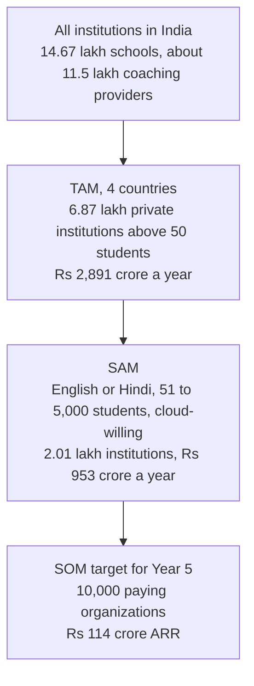
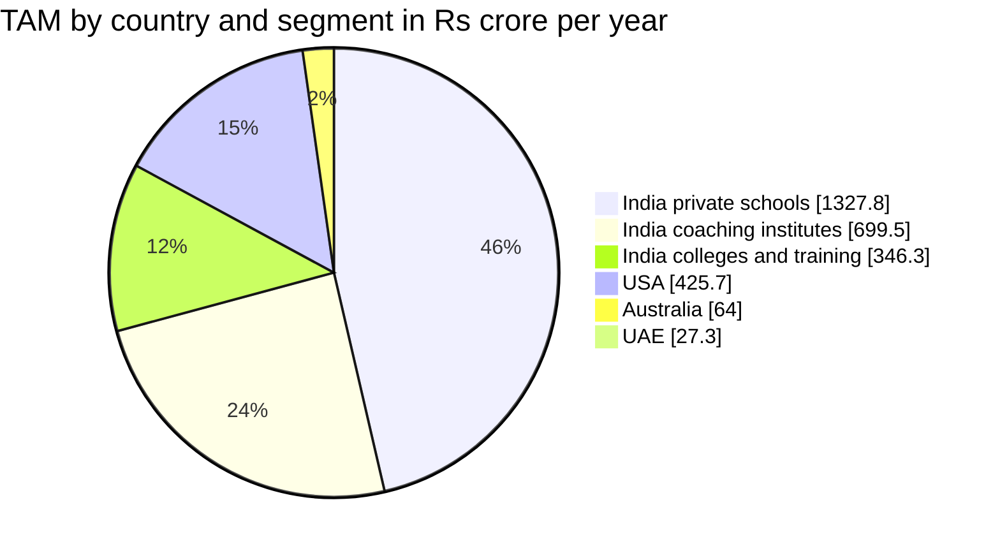
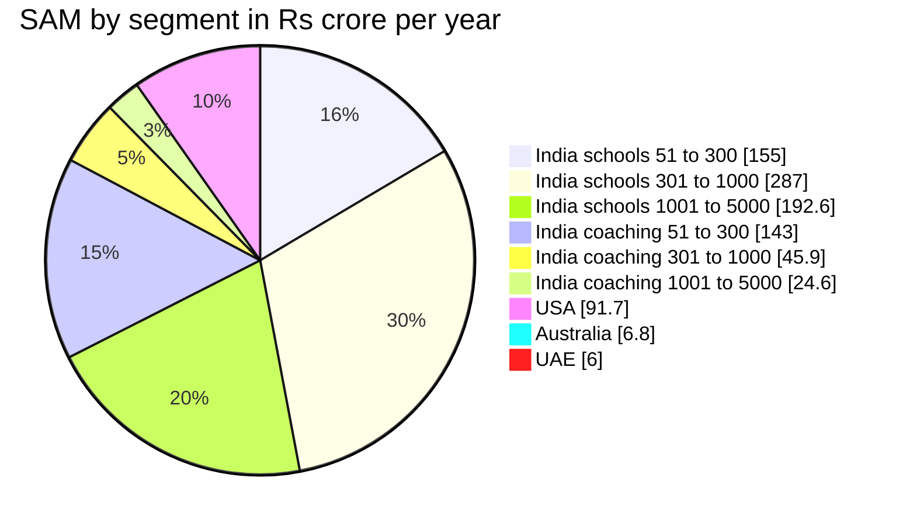

# Market Sizing: TAM, SAM and SOM

**In simple words:** This chapter answers one question: how big is the market for EduFlow, in rupees and in number of customers? We count institutions segment by segment (private schools, coaching institutes, later colleges and training centres), multiply by EduFlow's own prices, and show every input in a table. Then we check the result against published market reports. All numbers here are estimates for planning, not promises. The last section shows how to replace them with real sales data.

## What TAM, SAM and SOM mean

These three terms are three circles, one inside the other.

| Term | Full form | Simple meaning | EduFlow meaning |
|---|---|---|---|
| TAM | Total Addressable Market | All the money we could earn if every possible customer bought from us | Every private institution with more than 50 students, in India, UAE, USA and Australia, paying EduFlow list price |
| SAM | Serviceable Available Market | The part of TAM that our current product and team can really serve | Institutions that work in English or Hindi, have 51 to 5,000 students, and are willing to use and pay for cloud software |
| SOM | Serviceable Obtainable Market | The part of SAM we can realistically win in a fixed time | The canon target: 10,000 paying organizations by the end of Year 5 (September 2031) |

> **Example:** Think of a tiffin service in Patna. TAM is everyone in Patna who buys lunch outside home. SAM is office workers within 5 km who want vegetarian food, because that is what the kitchen can cook and deliver. SOM is the 200 customers the owner can win and serve this year with two delivery boys.

Three more terms appear in every table:

- **ARPA** (average revenue per account — the money one customer organization pays us in a period). In this chapter ARPA is per year unless we say "per month".
- **Bottom-up model** (a model that starts from counting real customers and real prices). This is our main method, because it is the most honest one for a new company.
- **Top-down view** (a view that starts from a big published market number and cuts it down). We use it only as a cross-check.

**Figure: From all institutions to the five-year target**



The funnel gets narrow quickly. Government schools, very small tuition classes, and institutions that cannot use an English or Hindi cloud product fall out. What remains is still about 2 lakh institutions.

## Headline numbers

All values are subscription revenue per year at EduFlow list prices, before tax. Add-ons are sized separately in the section "Add-on revenue pool".

| Layer | Institutions | Value per year | In US dollars | Compared with the layer above |
|---|---|---|---|---|
| TAM (4 countries, all segments) | 6,87,205 | ₹2,890.6 crore | about $340 million | not applicable |
| SAM (current product) | 2,00,972 | ₹952.5 crore | about $112 million | 33% of TAM value |
| SOM (Year 5 target) | 10,000 | ₹114 crore ARR | about $13 million | 5.0% of SAM institutions |

ARR (annual recurring revenue — the yearly value of all running subscriptions) of ₹114 crore is the canon target for September 2031. It is a target, not a forecast.

> **Warning:** Only the school counts come from government data. Coaching institute counts, size bands and "cloud-willing" shares are estimates. Read every number in this chapter as "about". The sensitivity section shows how far the result moves when the estimates are wrong.

## How the bottom-up model works

### The formula

```text
TAM institutions = Institutions in segment x addressable share
TAM value        = TAM institutions x ARPA per year
                   (ARPA = list price of the best-fit plan)

SAM institutions = TAM institutions in the 51-5,000 student band
                   x language share x cloud-willing share
SAM value        = SAM institutions x ARPA per year

SOM              = Canon target (paying organizations and ARR)
Penetration      = SOM institutions / SAM institutions
```

"Addressable share" means the part of a segment that could buy a paid plan at all. The institution must be private, charge fees, choose its own software, and have more than 50 active students. Institutions with 50 or fewer students use the free Starter plan. They count as ₹0 in every revenue table. They still matter, because they are the free-to-paid funnel described in *Business Model*.

### Which plan fits which size band

The canon fixes plan limits by student count. So the size of an institution decides its plan, and the plan decides the ARPA.

| Size band (active students) | Best-fit plan | India per year | USA per year | Australia per year | UAE per year |
|---|---|---|---|---|---|
| Up to 50 | Starter | ₹0 | $0 | A$0 | AED 0 |
| 51 to 300 | Growth | ₹24,990 | $790 | A$1,190 | AED 2,990 |
| 301 to 1,000 | Pro | ₹59,990 | $1,990 | A$2,990 | AED 7,490 |
| 1,001 to 5,000 | Enterprise (floor price) | ₹1,79,988 | $5,988 | A$8,988 | AED 22,188 |
| Above 5,000 | Enterprise (large contract) | ₹6,00,000 | not modelled | not modelled | AED 60,000 |

Assumptions behind this table:

1. Growth and Pro use the yearly price (10 × monthly). This is the lower price, so the model is conservative.
2. Enterprise is a custom yearly contract "from ₹14,999 per month". The model uses the floor price × 12 months: ₹14,999 × 12 = ₹1,79,988. Real contracts for multi-campus groups will often be higher.
3. The ₹6,00,000 and AED 60,000 values for very large chains are an **Estimate** (about ₹50,000 per month). There are few such accounts, so the total barely moves.
4. Planning exchange rates from the canon: US$1 = ₹85, A$1 = ₹56, AED 1 = ₹23.

> **Example:** Sharma Classes in Patna has 350 students. That is above the Growth limit of 300, so its best-fit plan is Pro at ₹59,990 a year. Bright Future Public School in Lucknow has 1,200 students on 2 campuses. That is above the Pro limit of 1,000, so it is an Enterprise account at ₹1,79,988 a year or more.

### Is the price affordable? A per-student check

A TAM at list price is fair only if customers can afford the list price. This table tests that.

| Institution | Students | Plan price per year | Cost per student per year | Share of fee income |
|---|---|---|---|---|
| Small budget school | 77 | ₹24,990 | ₹325 | about 5% (fees ₹6,500 per student) |
| Typical Growth school | 180 | ₹24,990 | ₹139 | about 1.2% (fees ₹12,000 per student) |
| Typical Pro school | 500 | ₹59,990 | ₹120 | about 0.5% (fees ₹25,000 per student) |
| Enterprise school (floor price) | 1,420 | ₹1,79,988 | ₹127 | about 0.3% (fees ₹40,000 per student) |
| Small coaching centre | 63 | ₹24,990 | ₹397 | about 3.3% (fees ₹12,000 per student) |
| Sharma Classes, Patna | 350 | ₹59,990 | ₹171 | 0.38% (fees ₹45,000 per student) |

The fee levels are typical values from *Market Research: India*. The message is clear. From about 100 students upward, EduFlow costs about 1% of fee income or less. Below 100 students, the Growth price is 3% to 5% of income, which is heavy. So the model keeps these small institutions in TAM, but it lets only one in four of them into SAM.

### Confidence labels used in this chapter

| Label | Meaning |
|---|---|
| Government data | Published by a ministry or statistics office; we opened the source or a direct analysis of it |
| Reported | Published by a company, research firm or news outlet; treat as an indication |
| Estimate | Our own number, with the reasoning shown; must be tested with real data |

## India: counting the institutions

The detailed research behind these counts is in *Market Research: India*. This chapter reuses the same counts and converts them into money.

### Private unaided schools

UDISE+ (Unified District Information System for Education Plus — the Ministry of Education's yearly school census) is the source. The 2025-26 report was released in July 2026.

| Management type | Schools (2025-26) | Share of students | In TAM? | Reason |
|---|---|---|---|---|
| Government | about 10.05 lakh | 48.1% | No | The state chooses and pays for software, through tenders |
| Private unaided (recognised) | 3,41,689 | 40.0% | Yes | The owner decides and pays; this is our school market |
| Government aided | about 0.79 lakh | 10.0% | No (upside) | Fees and budgets are controlled; slow buyers; not counted |
| Other and unrecognised | about 0.41 lakh | 1.9% | No | Not a target in Phase 1 |
| All recognised schools | 14,66,682 | 100% | | |

Private unaided schools are the growing part. The count was 3,39,583 in 2024-25 and 3,41,689 in 2025-26. Their share of students rose from 38.8% to 40.0% in the same year. The average private unaided school has 289 students, against 118 in a government school.

UDISE+ does not publish a simple size-band table for private schools. *Market Research: India* built one with four bands. Here we split its smallest band at 50 students, because 50 is the limit of the free Starter plan. We also separate the few giant schools above 5,000 students.

| Size band | Share of schools | Schools | Average students | Students in band |
|---|---|---|---|---|
| Up to 50 | 12% | 41,003 | 35 | 14.4 lakh |
| 51 to 100 | 18% | 61,504 | 77 | 47.4 lakh |
| 101 to 300 | 40% | 1,36,676 | 180 | 2.46 crore |
| 301 to 1,000 | 25% | 85,422 | 500 | 4.27 crore |
| 1,001 to 5,000 | 4.9% | 16,784 | 1,420 | 2.38 crore |
| Above 5,000 | 0.1% | 300 | 6,000 | 18 lakh |
| Total | 100% | 3,41,689 | 290 | 9.91 crore |

Check: real enrolment is 40.0% of 24.72 crore students, which is 9.89 crore. The model total (9.91 crore) is within 0.3% of it. Status: the school count is **Government data**; the band split is an **Estimate**.

### Coaching institutes

There is no government census of coaching institutes. *Market Research: India* estimates the count from two sides: student demand (the MoSPI education survey of 2025 found that 27.0% of students take private coaching) and GST data (₹5,517.45 crore of GST collected from coaching centres in FY 2023-24). We use its working estimate without change.

| Size band | Institutes | Average students | Learners in band | Best-fit plan |
|---|---|---|---|---|
| Up to 50 (home and single-room tutors) | about 9,00,000 | under 50 | 4.5 crore or more | Starter (free) |
| 51 to 100 | 1,90,000 | 63 | 1.2 crore | Growth |
| 101 to 300 | 45,000 | 160 | 72 lakh | Growth |
| 301 to 1,000 | 12,000 | 450 | 54 lakh | Pro |
| 1,001 to 5,000 | 1,900 | 1,500 | 28.5 lakh | Enterprise |
| Above 5,000 (national chains) | 100 | 7,500 | 7.5 lakh | Enterprise (large) |
| Total above 50 students | 2,49,000 | 113 | 2.82 crore | |

Two outside facts say this estimate is in a sensible range.

- Classplus states on its website that more than 1 lakh coaching institutes in 1,100+ cities have built apps with it. So at least 1 lakh coaching businesses already use some software. This count includes solo tutors. It is public information as of September 2026; verify before external use.
- The GST method in *Market Research: India* finds 30,000 to 46,000 tax-registered local institutes. Our three bands above 100 students hold 59,000 institutes. The two numbers are close, because most institutes above 100 students cross the ₹20 lakh GST threshold.

Status: every row is an **Estimate**. This is the weakest input in the whole model and the first one to fix with field data.

> **Founder note:** Sharma Classes (350 students) sits in the 301 to 1,000 band. There are only about 12,000 such institutes in India by our estimate, but each is worth 2.4 times a small one. The 51 to 100 band is huge in count but weak in buying power.

### Colleges and training centres (later segments)

The canon lists colleges and training centres as later customers. We size them now so that the roadmap can see the upside. College counts come from AISHE (All India Survey on Higher Education — the Ministry of Education's yearly census of colleges and universities).

| Segment | Count | Basis | Addressable share | TAM institutions |
|---|---|---|---|---|
| Private unaided colleges | 32,528 | AISHE 2023-24: 46,468 colleges, 70.0% private unaided (Government data) | 95% have more than 50 students (Estimate) | 30,902 |
| Private standalone institutions (polytechnic, nursing, teacher training, PGDM) | 8,780 | AISHE: 12,543 registered, 70% private unaided (Reported) | 90% (Estimate) | 7,902 |
| Private ITIs | 11,343 | Ministry of Skill Development, 2025 (Reported) | 90% (Estimate) | 10,209 |
| Other training centres above 50 students (computer, language, skill) | 40,000 | Estimate | 100% | 40,000 |

ITI means Industrial Training Institute. India has 14,688 ITIs, of which 3,345 are government and 11,343 are private. Government-aided colleges (about 5,994) are left out for the same reason as aided schools. Pre-schools are not in the canon's customer list, so we do not count them.

Blended ARPA for these segments (Estimate). The average private unaided college has about 486 students, so most colleges are Pro size.

- Colleges: 30% Growth, 60% Pro, 10% Enterprise = ₹7,497 + ₹35,994 + ₹17,999 = **₹61,490** a year.
- Standalone institutions: 60% Growth, 40% Pro = ₹14,994 + ₹23,996 = **₹38,990** a year.
- ITIs and other training centres: Growth plan = **₹24,990** a year.

## India TAM

Formula for each row: institutions × addressable share × ARPA per year.

| Segment | Institutions | Addressable share | TAM institutions | ARPA per year | TAM per year | Data status |
|---|---|---|---|---|---|---|
| Schools, up to 50 | 41,003 | 0% (free plan) | 0 | ₹0 | ₹0 | Estimate |
| Schools, 51 to 100 | 61,504 | 100% | 61,504 | ₹24,990 | ₹153.7 crore | Count: Government data; band: Estimate |
| Schools, 101 to 300 | 1,36,676 | 100% | 1,36,676 | ₹24,990 | ₹341.6 crore | Same |
| Schools, 301 to 1,000 | 85,422 | 100% | 85,422 | ₹59,990 | ₹512.4 crore | Same |
| Schools, 1,001 to 5,000 | 16,784 | 100% | 16,784 | ₹1,79,988 | ₹302.1 crore | Same |
| Schools, above 5,000 | 300 | 100% | 300 | ₹6,00,000 | ₹18.0 crore | Estimate |
| **Schools sub-total** | | | **3,00,686** | | **₹1,327.8 crore** | |

| Segment | Institutions | Addressable share | TAM institutions | ARPA per year | TAM per year | Data status |
|---|---|---|---|---|---|---|
| Coaching, up to 50 | about 9,00,000 | 0% (free plan) | 0 | ₹0 | ₹0 | Estimate |
| Coaching, 51 to 100 | 1,90,000 | 100% | 1,90,000 | ₹24,990 | ₹474.8 crore | Estimate |
| Coaching, 101 to 300 | 45,000 | 100% | 45,000 | ₹24,990 | ₹112.5 crore | Estimate |
| Coaching, 301 to 1,000 | 12,000 | 100% | 12,000 | ₹59,990 | ₹72.0 crore | Estimate |
| Coaching, 1,001 to 5,000 | 1,900 | 100% | 1,900 | ₹1,79,988 | ₹34.2 crore | Estimate |
| Coaching, above 5,000 | 100 | 100% | 100 | ₹6,00,000 | ₹6.0 crore | Estimate |
| **Coaching sub-total** | | | **2,49,000** | | **₹699.5 crore** | |

| Segment (later) | Institutions | Addressable share | TAM institutions | ARPA per year | TAM per year | Data status |
|---|---|---|---|---|---|---|
| Private unaided colleges | 32,528 | 95% | 30,902 | ₹61,490 | ₹190.0 crore | Count: Government data; mix: Estimate |
| Private standalone institutions | 8,780 | 90% | 7,902 | ₹38,990 | ₹30.8 crore | Reported count; Estimate mix |
| Private ITIs | 11,343 | 90% | 10,209 | ₹24,990 | ₹25.5 crore | Reported count |
| Other training centres | 40,000 | 100% | 40,000 | ₹24,990 | ₹100.0 crore | Estimate |
| **Later segments sub-total** | | | **89,013** | | **₹346.3 crore** | |

| India TAM summary | TAM institutions | TAM per year | Share of India TAM |
|---|---|---|---|
| Private unaided schools | 3,00,686 | ₹1,327.8 crore | 55.9% |
| Coaching institutes | 2,49,000 | ₹699.5 crore | 29.5% |
| Colleges and training centres (later) | 89,013 | ₹346.3 crore | 14.6% |
| **India total** | **6,38,699** | **₹2,373.5 crore** | 100% |

Totals can differ by ₹0.1 crore because of rounding. The blended India ARPA is ₹2,373.5 crore ÷ 6,38,699 = about ₹37,160 a year, or about ₹3,100 a month.

Schools and coaching together are ₹2,027.2 crore, which is 85% of India TAM. On top of this, about 9.4 lakh tiny institutions (41,003 schools and about 9 lakh home and single-room tutors) fit the free Starter plan. They add ₹0 to TAM today. Some will grow past 50 students and become paid accounts.

> **Example:** Worked row for mid-size schools: 85,422 schools × 100% × ₹59,990 = ₹512.4 crore a year. This one row is bigger than the whole coaching market above 100 students (₹112.5 + ₹72.0 + ₹34.2 + ₹6.0 = ₹224.7 crore).

## International TAM: UAE, USA and Australia

The detail on these markets is in *Market Research: USA, Australia and UAE*. Here we only count and price. Government and public-district schools are left out in all three countries. They buy through the state or district, with long tenders and mandatory state reporting that EduFlow does not plan to build in the first five years.

### UAE

| Segment | Count | Basis | TAM institutions | ARPA per year | TAM per year |
|---|---|---|---|---|---|
| Private schools | about 650 | Dubai 227 (KHDA, 2024-25, Government data); Abu Dhabi about 220 (Reported); other emirates about 200 (Estimate) | 650 | AED 16,218 | AED 10.54 million |
| Tuition and coaching centres above 50 students | 450 | Estimate: midpoint of the 300 to 600 range in the UAE research | 450 | AED 2,990 | AED 1.35 million |
| **UAE total** | | | **1,100** | | **AED 11.89 million = ₹27.3 crore** |

UAE schools are large. KHDA (Knowledge and Human Development Authority — Dubai's private school regulator) reports that Dubai's 227 private schools teach 387,441 students. That is an average of about 1,700 per school. So our Estimate of the band split is: 65 schools of Growth size, 228 of Pro size, 338 of Enterprise size and 19 above 5,000 students. Working: (65 × 2,990) + (228 × 7,490) + (338 × 22,188) + (19 × 60,000) = AED 10.54 million. Divide by 650 schools to get the blended AED 16,218.

### USA

| Segment | Count | Basis | TAM institutions | ARPA per year | TAM per year |
|---|---|---|---|---|---|
| Private K-12 schools | 29,730 | NCES Private School Universe Survey 2021-22 (Government data) | 19,920 (67% have more than 50 students) | $1,148 | $22.87 million |
| Charter schools | about 7,800 | NCES, 2021-22 (Government data) | 7,800 | $1,970 | $15.36 million |
| Independent tutoring and test-prep centres above 50 students | 15,000 | Estimate: midpoint of the 10,000 to 20,000 range in the USA research | 15,000 | $790 | $11.85 million |
| **USA total** | | | **42,720** | | **$50.09 million = ₹425.7 crore** |

NCES (National Center for Education Statistics — the US government's education data office) shows that US private schools are small. About 4.7 million students in 29,730 schools is an average of 158. Our Estimate of the band split is 33% up to 50 students (free), 52% Growth size (15,460 schools), 13.5% Pro size (4,014) and 1.5% Enterprise size (446). With average sizes of 25, 130, 470 and 1,300 students, the split reproduces the 4.7 million total. A charter school is a public school run by an independent operator. Charter schools average about 474 students (3.7 million ÷ 7,800). Our Estimate for them is 35% Growth size, 55% Pro size and 10% Enterprise size, which gives $1,970. Franchise units of Kumon, Mathnasium, Sylvan and Huntington are not counted, because the franchisor chooses their software. The 13,000+ public school districts are outside TAM.

### Australia

| Segment | Count | Basis | TAM institutions | ARPA per year | TAM per year |
|---|---|---|---|---|---|
| Independent schools | 1,178 | ABS Schools 2025 (Government data) | 1,178 | A$3,652 | A$4.30 million |
| Catholic schools | 1,758 | ABS Schools 2025 (Government data) | 1,758 | A$2,871 | A$5.05 million |
| Tutoring colleges and centres above 50 students | 1,750 | Estimate: midpoint of the 1,500 to 2,000 range in the Australia research | 1,750 | A$1,190 | A$2.08 million |
| **Australia total** | | | **4,686** | | **A$11.43 million = ₹64.0 crore** |

Australia has 9,673 schools and 4,160,918 students (ABS — Australian Bureau of Statistics, 2025). The 6,737 government schools are outside TAM. Independent schools average about 608 students (715,822 ÷ 1,178). Our Estimate for them is 30% Growth size, 50% Pro size and 20% Enterprise size. Catholic schools average about 473 students; our Estimate is 40%, 50% and 10%. Both splits reproduce the real enrolment within 1%.

### Total TAM

| Country | TAM institutions | TAM per year (local) | TAM per year (₹) | Share |
|---|---|---|---|---|
| India | 6,38,699 | ₹2,373.5 crore | ₹2,373.5 crore | 82.1% |
| USA | 42,720 | $50.09 million | ₹425.7 crore | 14.7% |
| Australia | 4,686 | A$11.43 million | ₹64.0 crore | 2.2% |
| UAE | 1,100 | AED 11.89 million | ₹27.3 crore | 0.9% |
| **Total** | **6,87,205** | | **₹2,890.6 crore** | 100% |

**Figure: TAM by country and segment (₹ crore per year)**



India has 93% of the institutions but 82% of the value. One US account is worth about 2.7 times an Indian account on the same plan (US$790 = ₹67,150 against ₹24,990). This is why the canon adds international markets from Year 2, after the product is proven in India.

## SAM: the part we can serve with the current product

### The four filters

| Filter | Rule | Why this rule | Basis |
|---|---|---|---|
| Segment | Schools and coaching now; colleges and training centres later | The 34 modules have no semester, credit or university-affiliation features yet | Canon module list |
| Size | 51 to 5,000 active students | Below 51 is free; above 5,000 needs tenders, custom integrations and on-site teams | Canon plan limits |
| Language | Office staff can work in English or Hindi | The product ships in English and Hindi first | Estimate by band, see below |
| Cloud-willing | Has internet and a computer or smartphone, accepts online data, and will pay a subscription | EduFlow is cloud-only; there is no offline or desktop version | UDISE+ plus Estimate |

How we set the two percentage filters:

- **Language.** Hindi-belt states hold a little under half of India's people. Most private schools elsewhere are English-medium on paper. But a small regional-medium school often has an office clerk who is not comfortable in either language. So we use 70% for the smallest schools, 75% and 80% for the middle bands, and 85% for large schools. Coaching owners are younger and teach exam content in English or Hindi, so we use 75%, 80%, 85% and 90%.
- **Cloud-willing.** UDISE+ 2024-25 says 63.5% of all schools have internet (53.9% a year earlier) and 64.7% have computers. Private schools are better equipped than this average. But "has internet" is not the same as "will pay for cloud software". Many small owners are happy with registers, Excel or a one-time desktop package. The per-student check above shows that the price is heavy below 100 students. So we use 25% for the 51 to 100 band, 50% for 101 to 300, 70% for 301 to 1,000 and 75% for large schools. For coaching we use 25%, 60%, 75% and 80%, because a mobile-first owner needs only a phone.

All these shares are an **Estimate**. They are the second thing to fix with real data, after the coaching count.

### India SAM

Formula: TAM institutions × language share × cloud-willing share × ARPA per year.

| Segment | TAM institutions | Language | Cloud-willing | SAM institutions | ARPA per year | SAM per year |
|---|---|---|---|---|---|---|
| Schools, 51 to 100 | 61,504 | 70% | 25% | 10,763 | ₹24,990 | ₹26.9 crore |
| Schools, 101 to 300 | 1,36,676 | 75% | 50% | 51,254 | ₹24,990 | ₹128.1 crore |
| Schools, 301 to 1,000 | 85,422 | 80% | 70% | 47,836 | ₹59,990 | ₹287.0 crore |
| Schools, 1,001 to 5,000 | 16,784 | 85% | 75% | 10,700 | ₹1,79,988 | ₹192.6 crore |
| Coaching, 51 to 100 | 1,90,000 | 75% | 25% | 35,625 | ₹24,990 | ₹89.0 crore |
| Coaching, 101 to 300 | 45,000 | 80% | 60% | 21,600 | ₹24,990 | ₹54.0 crore |
| Coaching, 301 to 1,000 | 12,000 | 85% | 75% | 7,650 | ₹59,990 | ₹45.9 crore |
| Coaching, 1,001 to 5,000 | 1,900 | 90% | 80% | 1,368 | ₹1,79,988 | ₹24.6 crore |
| **India SAM today** | **5,49,286** | | | **1,86,796** | **₹45,400 blended** | **₹848.1 crore** |

Schools are 1,20,553 institutions and ₹634.5 crore. Coaching is 66,243 institutions and ₹213.5 crore.

> **Example:** Worked row for small coaching institutes: 1,90,000 × 75% = 1,42,500. Then 1,42,500 × 25% = 35,625 institutes. Then 35,625 × ₹24,990 = ₹89.0 crore a year.

Bridge from India TAM to India SAM, for schools and coaching:

| Step | Value per year |
|---|---|
| India TAM, schools and coaching | ₹2,027.2 crore |
| Minus institutions above 5,000 students | minus ₹24.0 crore |
| Minus language and cloud-willing filters | minus ₹1,155.1 crore |
| India SAM today | ₹848.1 crore (42% of the starting value) |

The plan-size mix inside India SAM matters for later sections:

| Plan size | SAM institutions | Share of institutions | SAM value | Share of value |
|---|---|---|---|---|
| Growth size (51 to 300) | 1,19,242 | 63.8% | ₹298.0 crore | 35.1% |
| Pro size (301 to 1,000) | 55,486 | 29.7% | ₹332.9 crore | 39.2% |
| Enterprise size (1,001 to 5,000) | 12,068 | 6.5% | ₹217.2 crore | 25.6% |

> **Founder note:** Coaching is the wedge because owners decide fast. But schools are 75% of India SAM value. The wedge gets EduFlow started; schools decide whether it becomes a ₹100 crore company.

### India SAM that opens later

| Segment | TAM institutions | SAM share (Estimate) | SAM institutions | ARPA per year | SAM per year |
|---|---|---|---|---|---|
| Private unaided colleges | 30,902 | 50% | 15,451 | ₹61,490 | ₹95.0 crore |
| Private standalone institutions | 7,902 | 50% | 3,951 | ₹38,990 | ₹15.4 crore |
| ITIs and other training centres | 50,209 | 45% | 22,594 | ₹24,990 | ₹56.5 crore |
| **Future India SAM** | **89,013** | | **41,996** | | **₹166.9 crore** |

This ₹166.9 crore is **not** inside the ₹952.5 crore headline. It enters SAM only when the `COLLEGE` and `TRAINING_CENTRE` organization types get their own features, as planned in the *Five-Year Roadmap*.

One more lever is language. Suppose EduFlow later adds six regional languages (Marathi, Tamil, Telugu, Bengali, Gujarati, Kannada) and the language share rises to 95% in every band. India SAM then grows from ₹848.1 crore to about ₹1,008.9 crore. That is ₹160.9 crore more, or 19%, with no new segment.

### International SAM

These markets open in Year 2 (UAE) and Year 3 (USA and Australia pilots). *Market Research: USA, Australia and UAE* decided the entry wedge for each country. SAM follows those decisions. It includes only the buyer types that EduFlow will really sell to in the first five years.

| Country | Segment in SAM | In size band | SAM share | Main reason for the cut | SAM institutions | ARPA per year | SAM per year |
|---|---|---|---|---|---|---|---|
| UAE | Indian-curriculum and budget schools | 150 | 70% | Some are locked into group-wide systems | 105 | AED 15,859 | AED 1.67 million |
| UAE | Tuition and coaching centres | 450 | 70% | Some are too informal to pay | 315 | AED 2,990 | AED 0.94 million |
| USA | Private schools of Growth size | 15,460 | 30% | Many use a system chosen by their diocese or association | 4,638 | $790 | $3.66 million |
| USA | Private schools of Pro size | 4,014 | 15% | Established SIS vendors; longer buying cycle | 602 | $1,990 | $1.20 million |
| USA | Independent tutoring centres | 15,000 | 50% | Half run on marketplace or one-to-one tools that fit them better | 7,500 | $790 | $5.93 million |
| Australia | Independent schools of Growth size | 353 | 40% | Strong incumbents such as Compass and Sentral | 141 | A$1,190 | A$0.17 million |
| Australia | Tutoring colleges and centres | 1,750 | 50% | Small owners; easy to reach online | 875 | A$1,190 | A$1.04 million |

Left out of SAM on purpose: other UAE private schools (they need Arabic and regulator reports first), US charter schools and Enterprise-size private schools (state reporting and long tenders), Australian Catholic schools (a diocese buys one system for all its schools) and larger independent schools. A diocese is a regional Catholic church body that runs many schools. SIS means student information system, the US name for school ERP. The UAE school ARPA assumes 15 Growth-size, 45 Pro-size and 90 Enterprise-size schools among the 150.

| Country | SAM institutions | SAM per year (local) | SAM per year (₹) |
|---|---|---|---|
| UAE | 420 | AED 2.61 million | ₹6.0 crore |
| USA | 12,740 | $10.79 million | ₹91.7 crore |
| Australia | 1,016 | A$1.21 million | ₹6.8 crore |
| **International SAM** | **14,176** | | **₹104.5 crore** |

Every SAM share in this section is an **Estimate**. Competitor names are based on public information as of September 2026; verify before external use. See *Competitor Analysis* for detail.

### Total SAM

| Segment | SAM institutions | SAM per year | Share of value |
|---|---|---|---|
| India schools | 1,20,553 | ₹634.5 crore | 66.6% |
| India coaching | 66,243 | ₹213.5 crore | 22.4% |
| USA | 12,740 | ₹91.7 crore | 9.6% |
| Australia | 1,016 | ₹6.8 crore | 0.7% |
| UAE | 420 | ₹6.0 crore | 0.6% |
| **Total SAM** | **2,00,972** | **₹952.5 crore** | 100% |

**Figure: SAM by segment (₹ crore per year)**



Mid-size Indian schools (301 to 1,000 students) are the largest single slice. The three India school slices together are two-thirds of SAM. The UAE and Australia slices are small in value. The UAE is still the right first step abroad, because its Indian-curriculum schools need almost no product change.

## Add-on revenue pool

Subscriptions are not the only income. The canon lists add-ons. Here we size the add-on pool for the India SAM only. The India SAM holds 1,86,796 institutions with about 6.04 crore students: 4.92 crore in schools and 1.12 crore in coaching, using the band averages above.

| Add-on | Formula and inputs | Pool per year | Status |
|---|---|---|---|
| WhatsApp credits (billed value) | 6.04 crore students × (120 utility messages × ₹0.115 + 6 marketing messages × ₹0.8631) × 1.15 | ₹131.7 crore | Meta rates: Reported (2026); volumes: Estimate |
| SMS packs | 30% of students × 20 SMS a year × ₹0.25 | ₹9.1 crore | Estimate |
| White-label mobile app (monthly fee) | 8% of Pro-size and Enterprise-size institutions = 5,404 × ₹59,988 | ₹32.4 crore | Estimate |
| AI Insights | 15% of Growth-size and Pro-size institutions = 26,209 × ₹17,988 | ₹47.1 crore | Estimate |
| Extra campus | 8% of institutions × 1.5 extra campuses × ₹11,988 | ₹26.9 crore | Estimate |
| Payment partner share | ₹36,217 crore of online fees × 0.10% | ₹36.2 crore | Assumption; not in Year 1 |
| **Recurring add-on pool** | | **₹283.4 crore** | 33% on top of India SAM |

Notes on the two big lines:

- **WhatsApp.** Meta's India rates in 2026 are reported as ₹0.115 per utility message and ₹0.8631 per marketing message. The marketing rate rose from ₹0.7846 during 2026. The canon charges Meta cost + 15%. That gives ₹21.83 billed per student per year. Of the ₹131.7 crore billed, ₹114.6 crore goes to Meta. EduFlow keeps about **₹17.2 crore** as margin. So WhatsApp is large in billing but small in profit. From 1 October 2026, service messages and utility messages inside the 24-hour window are also reported to become chargeable. This supports a per-message credit model.
- **Payment volume.** Fees flowing through SAM institutions: 6.04 crore students × ₹15,000 average yearly fee = about ₹90,540 crore a year. The ₹15,000 is an **Estimate**. The MoSPI survey of 2025 found that families spend ₹19,554 (rural) to ₹31,782 (urban) per student in private schools, and that figure also includes books, uniform and transport. At the canon's 40% online share, about ₹36,217 crore moves through the gateway. The canon says EduFlow adds **no markup in Year 1**. The 0.10% line assumes a partner revenue share from the gateway from Year 2. This is an **Assumption**, not an agreed deal. Without it, the pool is ₹247.2 crore.

One-time pools are not recurring, so they are not in the total above.

| One-time add-on | Formula | Pool |
|---|---|---|
| White-label app setup | 5,404 institutions × ₹49,999 | ₹27.0 crore |
| Assisted data migration | 25% of institutions × ₹9,999 | ₹46.7 crore |
| On-site training | 5% of institutions × 2 days × ₹4,999 | ₹9.3 crore |
| **One-time pool** | | **about ₹83 crore** |

> **Note:** India SAM plus the recurring add-on pool is ₹848.1 crore + ₹283.4 crore = ₹1,131.5 crore a year. With international SAM it is about ₹1,236 crore. Add-on attach rates (the share of customers who buy an add-on) are covered in *Business Model* and *Pricing Strategy*.

## SOM: what we can realistically win in five years

SOM is not calculated. It is the canon target. This section tests whether that target is reasonable against SAM.

### Year-by-year targets against SAM

| End of | Paying organizations (target) | India | International | Share of India SAM | Share of international SAM | ARR target | ARR as share of SAM value |
|---|---|---|---|---|---|---|---|
| Year 1 (Sep 2027) | 120 | 120 | 0 | 0.06% | 0% | ₹72 lakh | 0.08% |
| Year 2 (Sep 2028) | 500 | 500 | UAE pilots only | 0.27% | 0% | ₹3.6 crore | 0.38% |
| Year 3 (Sep 2029) | 1,500 | 1,400 | 100 | 0.75% | 0.71% | ₹13.5 crore | 1.4% |
| Year 4 (Sep 2030) | 4,000 | 3,500 | 500 | 1.87% | 3.5% | ₹41 crore | 4.3% |
| Year 5 (Sep 2031) | 10,000 | 8,500 | 1,500 | 4.6% | 10.6% | ₹114 crore | 12.0% |

Reading the table:

- In India the target needs 4.6% of SAM institutions by Year 5. That is about 1 in 22. For a focused product with a free plan, this is ambitious but realistic. Classplus alone reports more than 1 lakh coaching users, which shows that one vendor can reach this scale in India.
- The Year 1 target of 120 accounts is 0.06% of India SAM. Market size is not the risk in Year 1. Execution is.
- The international target needs 10.6% of a small SAM within three years of entry. This is the most stretched number in the canon. Either the USA must carry about three-quarters of it, or EduFlow must add nearby markets (other Gulf countries with CBSE schools, New Zealand, Canada). This choice belongs in the *Five-Year Roadmap*.

### A possible Year 5 mix for India (illustration)

The canon does not split the 8,500 Indian accounts. One reasonable split is shown below. It is cut in two ways: first by segment, then by plan.

| Cut | Year 5 accounts | SAM institutions | Penetration |
|---|---|---|---|
| Coaching institutes | 5,000 | 66,243 | 7.5% |
| Schools | 3,200 | 1,20,553 | 2.7% |
| Colleges and training centres | 300 | 41,996 (future SAM) | 0.7% |
| Growth plan | 4,250 | 1,19,242 | 3.6% |
| Pro plan | 3,230 | 55,486 | 5.8% |
| Enterprise plan | 1,020 | 12,068 | 8.5% |

The first three rows and the last three rows each add up to 8,500. Note the last row. To reach the canon ARPA, EduFlow must win about 1 in 12 of all Enterprise-size institutions in SAM. See *Customer Segments and Ideal Customer Profile* for who these accounts are.

### The ARPA gap between SAM and the target

The canon's Year 5 blended ARPA is ₹9,500 a month, which is ₹1,14,000 a year. The SAM average at list price is only ₹45,400 a year. The bridge below shows what must be true to close this gap.

| Step | What changes | Blended ARPA per year |
|---|---|---|
| Start | India SAM average: list price, yearly billing, market mix | ₹45,400 |
| Customer mix | India base is 50% Growth, 38% Pro, 12% Enterprise (Enterprise at ₹3,00,000 average) | ₹71,290 |
| International | Add 1,500 accounts at about ₹97,480 average (USA 1,100, Australia 250, UAE 150) | ₹75,220 |
| Monthly billing | 40% of Growth and Pro accounts pay monthly, which costs 20% more per year | ₹78,670 |
| Add-ons needed | The rest must come from add-ons: ₹35,330 per account | ₹1,14,000 |

Working for the mix step: (4,250 × ₹24,990) + (3,230 × ₹59,990) + (1,020 × ₹3,00,000) = ₹60.6 crore. Divide by 8,500 accounts to get ₹71,290. Working for the international step: 80% of US and Australian accounts on Growth and 20% on Pro; UAE accounts split 75 Growth, 45 Pro and 30 Enterprise. This gives ₹14.6 crore from 1,500 accounts.

So add-ons must bring about **₹35.3 crore** in Year 5, which is 31% of the ARR target. A bottom-up estimate, using the attach rates from the add-on table, gives less:

| Add-on line (8,500 India accounts, about 37.3 lakh students) | Year 5 estimate |
|---|---|
| WhatsApp credits billed (₹21.83 per student) | ₹8.2 crore |
| SMS packs | ₹0.6 crore |
| White-label app fees (340 accounts) | ₹2.0 crore |
| AI Insights (1,122 accounts) | ₹2.0 crore |
| Extra campuses (680 accounts × 1.5) | ₹1.2 crore |
| Payment partner share (Assumption) | ₹2.2 crore |
| International add-ons (Estimate) | ₹3.0 crore |
| **Total** | **₹19.2 crore** |

> **Warning:** The bridge leaves a gap of about ₹16.1 crore, or 14% of the Year 5 ARR target. Account numbers alone will not deliver ₹114 crore. The target also needs a customer base that is much more Pro and Enterprise heavy than the market, plus strong add-on sales.

Three levers can close the gap. The numbers show the size of each lever.

| Lever | What must be true | Extra ARR in Year 5 |
|---|---|---|
| Richer Enterprise mix | India base is 46% Growth, 38% Pro, 16% Enterprise, and Enterprise contracts average ₹3,60,000 (₹30,000 a month) | about ₹17.5 crore |
| Price rise | List prices rise 5% in Year 3 and 5% in Year 5 (10.25% in total) | about ₹8.1 crore |
| Higher white-label attach | 16% of Pro and Enterprise accounts buy the white-label app, not 8% | about ₹2.0 crore |

The first lever alone closes the gap. It needs 1,360 Enterprise accounts, which is 11.3% of all Enterprise-size institutions in India SAM. Multi-campus school groups are the accounts that make this possible, because each extra campus and each white-label app raises the contract value. The official revenue model is in *Financial Plan and Projections*. This bridge is only a market-side check.

### What the SOM means in sales effort

Net new paying accounts needed in Year 5: 10,000 minus 4,000 = 6,000. Assume 2% monthly logo churn (logo churn means customers who cancel) on an average base of 7,000 accounts. Then about 140 accounts leave each month, or 1,680 in the year. So gross new accounts must be about 7,680. That is about 640 a month, or 26 every working day. The plans for reaching this pace are in *Go-To-Market Strategy* and *Sales Process and Playbooks*.

## Top-down cross-check

A top-down view starts from published market sizes. Research firms define "education ERP" very differently, so their numbers disagree with each other. We use them only to see if our bottom-up result is in a sensible range. CAGR means compound annual growth rate (the average growth per year).

### What published reports say

| Publisher and year | What it measures | Published figure | What it tells us |
|---|---|---|---|
| The Business Research Company, 2026 | Global school management system market | US$22.3 billion in 2025; US$42.66 billion in 2030; 13.4% CAGR | Our 4-country TAM (US$340 million) is 1.5% of it; North America is largest, Asia-Pacific fastest |
| Grand View Research (Horizon), 2025 | India education ERP market, software and services | About US$0.8 billion in 2024; 27.7% CAGR to 2030; software is 75% of revenue | About ₹6,800 crore; see the note below |
| 6Wresearch, as quoted in *Market Research: India* | India education ERP market | US$499 million in 2025 (about ₹4,240 crore); 6.5% CAGR | The low end of the India range |
| IMARC Group, 2026 | India coaching institutes market (their fee income) | US$7.2 billion in 2025; US$17.8 billion by 2034; 10.29% CAGR | Our coaching customers' income grows about 10% a year |
| Mordor Intelligence, 2026 | UAE private K-12 education (school fee income) | US$10.34 billion in 2025; US$19.02 billion by 2031 | Rich schools; Dubai holds 57.63% of revenue |
| MoSPI CMS Education survey, 2025 | Household spend per student in India | ₹19,554 (rural) and ₹31,782 (urban) in private schools; ₹2,639 and ₹4,128 in government schools | Private-school parents pay 7 to 8 times more; supports a private-only TAM |

> **Note:** The Grand View Research figure needs care. Its public summary, as shown in search results, prints India's market as "USD 0.8 million" in 2024 and "USD 3.4 million" by 2030. A national market of that size is not believable. *Market Research: India* reads it as about US$0.8 billion, which equals 4.3% of the firm's global figure. We could not open the page to confirm the unit. Mordor Intelligence also revises its UAE figure often; an earlier edition quoted in *Market Research: USA, Australia and UAE* gave US$7.17 billion for 2025. Verify both before external use.

### Cutting the India report down to our segments

The India reports include universities, government projects and services. We cut them down step by step.

| Step | Low report (6Wresearch) | High report (Grand View Research) | Basis |
|---|---|---|---|
| India education ERP market | ₹4,240 crore | ₹6,800 crore | Reported |
| × software share 75% | ₹3,180 crore | ₹5,100 crore | Reported (Grand View Research) |
| × K-12 and coaching share 45% | ₹1,431 crore | ₹2,295 crore | Estimate; the rest is higher education |
| × private share 70% | ₹1,002 crore | ₹1,607 crore | Estimate; the rest is government projects |

| Comparison for India schools and coaching | Value per year |
|---|---|
| Bottom-up SAM (this chapter) | ₹848 crore |
| Today's actual software spend, estimated in *Market Research: India* | about ₹765 crore |
| Top-down range after the cuts | ₹1,002 crore to ₹1,607 crore |
| Bottom-up TAM (this chapter) | ₹2,027 crore |

The top-down range sits between our SAM and our TAM. That is where it should sit. It measures what institutions spend today, often at higher prices than EduFlow's, while our TAM counts every institution, including the 76% of schools and 93% of coaching institutes that buy nothing yet.

### A second check: software spend as a share of fee income

A common rule of thumb is that a small service business spends 0.5% to 1% of its revenue on administration software. This rule is an **Estimate**, not a published statistic.

| Segment | Fee income per year | Bottom-up TAM | TAM as share of fee income |
|---|---|---|---|
| Private unaided schools | 9.89 crore students × ₹15,000 = ₹1,48,350 crore | ₹1,327.8 crore | 0.90% |
| Coaching institutes | ₹61,200 crore (IMARC, 2025) | ₹699.5 crore | 1.14% |
| Coaching institutes, SAM only | ₹61,200 crore | ₹213.5 crore | 0.35% |

The school TAM is inside the 0.5% to 1% range. The coaching TAM is slightly above it. The reason is the 51 to 100 band: 1,90,000 small centres at ₹24,990 each is too generous. SAM already corrects this by keeping only 19% of that band. In the UAE the same ratio is only about 0.03% (US$3.2 million of TAM against US$10.34 billion of fee income). So our UAE TAM at EduFlow list prices is very conservative.

## Sensitivity: low, base and high

We change the weakest inputs together and see what happens.

| Input | Low case | Base case | High case |
|---|---|---|---|
| Coaching institute counts | 40% lower | As modelled | 40% higher |
| Cloud-willing share, every band | 10 points lower | 25% to 80% | 10 points higher |
| Realised price against list price | 80% (discounts) | 100% | 100% |
| International SAM institutions | × 0.6 | As modelled | × 1.4 |
| Later segments in TAM; international TAM | × 0.7; × 0.8 | As modelled | × 1.3; × 1.2 |
| Recurring add-on pool | × 0.6 | ₹283.4 crore | × 1.3 |

| Result | Low case | Base case | High case |
|---|---|---|---|
| TAM value per year | ₹2,403.5 crore | ₹2,890.6 crore | ₹3,377.7 crore |
| India school SAM institutions | 97,737 | 1,20,553 | 1,43,368 |
| India coaching SAM institutions | 28,321 | 66,243 | 1,19,398 |
| India SAM value | ₹501.8 crore | ₹848.1 crore | ₹1,111.8 crore |
| International SAM value | ₹50.1 crore | ₹104.5 crore | ₹146.2 crore |
| **Total SAM value** | **₹552.0 crore** | **₹952.5 crore** | **₹1,258.1 crore** |
| Total SAM institutions | 1,34,564 | 2,00,972 | 2,82,612 |
| SOM (10,000) as share of SAM institutions | 7.4% | 5.0% | 3.5% |
| Year 5 ARR as share of SAM value | 20.7% | 12.0% | 9.1% |
| Recurring add-on pool (India) | ₹170.1 crore | ₹283.4 crore | ₹368.5 crore |
| Year 5 ARR as share of SAM plus add-on pool | 15.8% | 9.2% | 7.0% |

Even in the low case, 10,000 paying organizations is 7.4% of SAM institutions. The account target survives bad inputs. The revenue target is more fragile: in the low case EduFlow would need about one-fifth of all SAM subscription value.

Which single input moves total SAM the most (each changed alone, from the base case):

| Input changed alone | Effect on total SAM | In percent |
|---|---|---|
| Realised price falls to 80% of list | minus ₹190.5 crore | minus 20% |
| Cloud-willing share 10 points lower | minus ₹156.9 crore | minus 16% |
| Coaching counts 40% lower | minus ₹85.4 crore | minus 9% |
| International SAM × 0.6 | minus ₹41.8 crore | minus 4% |

> **Best practice:** Discounting hurts more than any counting error. A habit of giving 20% off removes more market value than being wrong about 1 lakh coaching institutes. Hold list price and use the free Starter plan as the "discount". See *Pricing Strategy*.

The market also grows while we sell. Private unaided schools grew by about 2,100 in the latest year and by 8,475 the year before. School internet coverage rose almost 10 points in one year. Coaching fee income is forecast to grow about 10% a year. We keep SAM flat for five years in this chapter, which is a conservative choice.

## Limits of this model and how to refine it with real sales data

These numbers are estimates. They are good enough to choose a market and set targets. They are not good enough to show an investor as facts without the labels. From the pilot (18 November 2026) and the public launch (January 2027), real data starts to arrive. Each weak input has a planned replacement.

| Input | Today's basis | Confidence | Real data that replaces it | By when |
|---|---|---|---|---|
| Private school count | UDISE+ 2025-26 | High | Next UDISE+ release | Every year |
| School size bands | Estimate fitted to enrolment | Medium | UDISE+ school-level data download; student counts of our own leads | March 2027 |
| Coaching institute count | Estimate from learner survey and GST data | Low | City census in 5 cities (method below) | December 2026 |
| Language share | Estimate | Low | "Lost: language" reasons in the CRM (the sales lead tracker); signups by state | After 500 qualified leads |
| Cloud-willing share | Estimate plus UDISE+ internet data | Low | Demo-to-paid rate by band; "Lost: prefers register" and "Lost: price" reasons | After 500 qualified leads |
| ARPA | Canon list price | Medium | Realised ARPA, discount rate, share of monthly against yearly billing | After 100 paying accounts |
| Plan mix | Market size bands | Medium | Actual plan mix of paying accounts | After 100 paying accounts |
| Add-on attach rates | Estimate | Low | Credits bought per student per month; white-label and AI Insights orders | After 100 paying accounts |
| International SAM shares | Estimate | Low | UAE pilot results with CBSE schools; Google Maps counts in 10 US metro areas | Year 2 |

### The city census method for coaching institutes

Our model says India has 2,49,000 coaching institutes with more than 50 students. *Market Research: India* places about 35% of them, or about 87,000, in Tier 2 cities. Those cities hold roughly 12 crore people (Estimate). That is about 73 institutes per lakh people in a Tier 2 city. This is a testable claim.

1. Pick five cities of different types: Patna, Lucknow, Indore, Pune and Coimbatore.
2. For each city, list coaching institutes from Google Maps, Justdial and Sulekha. Remove duplicates by phone number.
3. Call or visit a random sample of 100 per city. Ask three things: number of students, language of office work, software used today.
4. Compute institutes with more than 50 students per lakh people in each city.
5. Compare with 73 per lakh. If the five-city average is 100, multiply the coaching count by 100 ÷ 73. If it is 40, cut it in the same way.

> **Example:** Patna has roughly 25 lakh people. The model predicts about 25 × 73 = 1,825 institutes with more than 50 students. Patna is a known coaching hub, so the real count should be at least this high. If the census finds fewer than 900, the national estimate is about double the truth, and the coaching SAM falls from ₹213.5 crore to about ₹107 crore.

The same 500 calls also give real values for the language filter, the cloud-willing filter and competitor share. One month of part-time work by one intern replaces the three weakest inputs in this chapter.

### What the first 100 paying accounts will tell us

| Question | How to measure it | What to change in this model |
|---|---|---|
| Are small institutions really buying? | Share of paying accounts with 51 to 100 students | The 25% cloud-willing share of the smallest bands |
| Do customers pay list price? | Realised ARPA ÷ list ARPA for the same plan mix | The "realised price" row in the sensitivity table |
| Is coaching or school the bigger buyer? | Paying accounts by `Organization.type` | The Year 5 mix table |
| How much WhatsApp do they use? | Credits used per active student per month | The 126 messages per student per year in the add-on pool |
| How many pay monthly? | Monthly subscriptions ÷ all subscriptions | The 40% monthly-billing step in the ARPA bridge |

### Refresh rules

- Update this model twice a year, in April and October, and after each UDISE+ and AISHE release.
- Keep the model in one spreadsheet with the same table layout as this chapter, so that any input can be changed in one cell.
- Track the assumptions in *Assumptions, Open Questions and Validation Plan*, and the live penetration numbers in *KPI Framework and Dashboard*.

> **Rule:** If the real cloud-willing share in the first 500 qualified leads is below 40% for institutions above 100 students, cut SAM by one-quarter and review the Year 3 to Year 5 targets. If realised ARPA after 100 paying accounts is below ₹3,500 a month, review the ARPA targets before hiring for Year 2.

## Key takeaways

- TAM is about ₹2,891 crore a year (about US$340 million) across 6.87 lakh private institutions with more than 50 students, in four countries. India is 82% of the value.
- SAM is about ₹953 crore a year across 2.01 lakh institutions. Indian schools are 67% of it, Indian coaching 22%, and the three international markets 11%.
- The recurring add-on pool in India adds about ₹283 crore. WhatsApp is mostly pass-through: ₹131.7 crore billed gives only about ₹17.2 crore of margin.
- The SOM target of 10,000 paying organizations needs 5.0% of SAM institutions. It holds even in the low case (7.4%).
- The ₹114 crore ARR target is harder than the account target. It needs an ARPA 2.5 times the SAM average. That means a Pro and Enterprise heavy base, about 1,360 Enterprise accounts, and ₹19 crore or more from add-ons.
- The international target (1,500 accounts) is about 10.6% of a small three-country SAM. It likely needs more countries or a stronger USA plan.
- Only school and college counts are government data. Coaching counts, size bands and filter shares are estimates. A five-city census and the first 500 leads will replace the weakest inputs by early 2027.

## Sources

Sources marked "opened" were read directly on 21 September 2026. Others were seen only as search-result summaries, or the page blocked access; verify them before external use.

- Education for All in India (Prof. Arun C. Mehta), "Private Schools Cross the 40% Enrolment Mark: The Government-to-Private Shift in UDISE+ 2025-26", July 2026, opened: https://educationforallinindia.com/private-schools-cross-the-40-enrolment-mark-the-government-to-private-shift-in-udise-2025-26/
- Education for All in India (Prof. Arun C. Mehta), "Analysis of UDISE+ 2024-25 Data", 2025, opened: https://educationforallinindia.com/analysis-of-udise-2024-25-data-by-prof-arun-c-mehta/
- Ministry of Education, Government of India, UDISE+ 2024-25 and 2025-26 reports (not opened; figures taken from the two analyses above and from *Market Research: India*)
- Education for All in India, "India's Education Evolution: Decoding NSS 2025 Insights and NEP 2020 Pathways" (summary of the MoSPI CMS Education survey 2025), 2025, opened: https://educationforallinindia.com/indias-education-evolution-decoding-nss-2025-insights-and-nep-2020-pathways/
- Ministry of Statistics and Programme Implementation (MoSPI), "Results of Comprehensive Modular Survey: Education, 2025 (April to June 2025)", NSS 80th round, press release, August 2025 (page blocked access; figures taken from the summary above)
- ThePrint, "Centre's GST revenue from coaching centres jumped nearly 150% in 5 years, at Rs 5,500 cr in FY24" (Rajya Sabha reply of 24 July 2024), 2024, opened: https://theprint.in/economy/centres-gst-revenue-from-coaching-centres-jumped-nearly-150-in-5-years-at-rs-5500-cr-in-fy24/2204201/
- Education for All in India, "Private vs. Government Higher Education in India: Who Really Runs the System?" (analysis of AISHE 2023-24), 2026, opened: https://educationforallinindia.com/private-vs-government-higher-education-in-india-who-really-runs-the-system/
- Ministry of Education, All India Survey on Higher Education (AISHE) 2022-23, count of registered standalone institutions (not opened; search summary)
- Ministry of Skill Development and Entrepreneurship, press release "Industrial Training Institutes (ITIs) in the Country", 2025 (page blocked access; search summary)
- IMARC Group, "India Coaching Institutes Market", 2026, opened: https://www.imarcgroup.com/india-coaching-institutes-market
- Classplus, "About us" page, company website, 2026, opened: https://classplusapp.com/aboutus.html
- MyOperator, "WhatsApp Business API Pricing in India: What You're Actually Paying For in 2026", 2026, opened: https://myoperator.com/blog/whatsapp-business-api-pricing-india-2026
- The Business Research Company, "School Management System Global Market Report", 2026, opened: https://www.thebusinessresearchcompany.com/report/school-management-system-global-market-report
- Grand View Research, "India Education ERP Market Size and Outlook, 2025-2030" (Horizon) (page blocked access; search summary; unit of the India figure unconfirmed)
- 6Wresearch, "India Education ERP Market" (not opened; figure taken from *Market Research: India*)
- Mordor Intelligence, "UAE Private K-12 Education Market", 2026, opened: https://www.mordorintelligence.com/industry-reports/uae-private-k12-education-market
- Government of Dubai Media Office and KHDA, "Dubai's private school sector records 6% enrolment growth in 2024-25 academic year", January 2025, opened: https://mediaoffice.ae/en/news/2025/january/09-01/dubais-private-school-sector
- WhichSchoolAdvisor and Gulf News, reports on the number of private schools in Abu Dhabi, 2025-2026 (not opened; search summary)
- National Center for Education Statistics (NCES), Fast Facts: Private School Universe Survey 2021-22, opened: https://nces.ed.gov/fastfacts/display.asp?id=1225
- National Center for Education Statistics (NCES), Fast Facts: Charter schools, opened: https://nces.ed.gov/fastfacts/display.asp?id=30
- Australian Bureau of Statistics, "Schools, 2025", 2026, opened: https://www.abs.gov.au/statistics/people/education/schools/latest-release
- EduFlow BRD chapters *Market Research: India* and *Market Research: USA, Australia and UAE* (internal; source of the coaching size bands and of the UAE, USA and Australia centre-count ranges)
- EduFlow Canon, pricing, targets and exchange rates, version 1.0, 20 September 2026 (internal)
