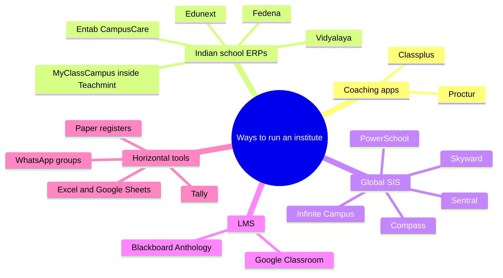
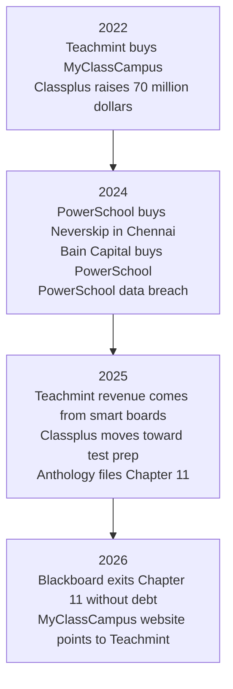
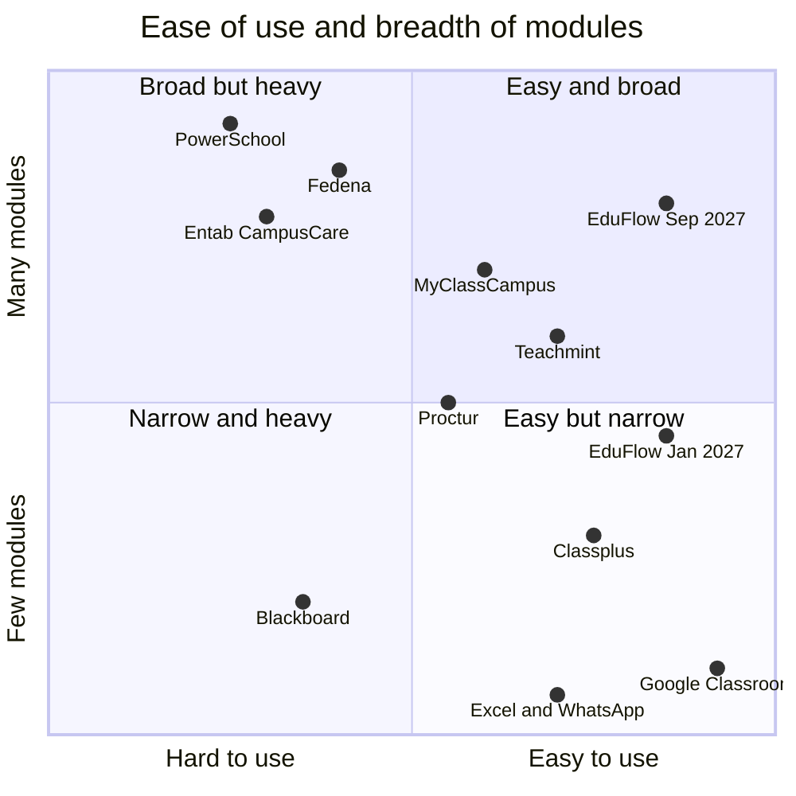
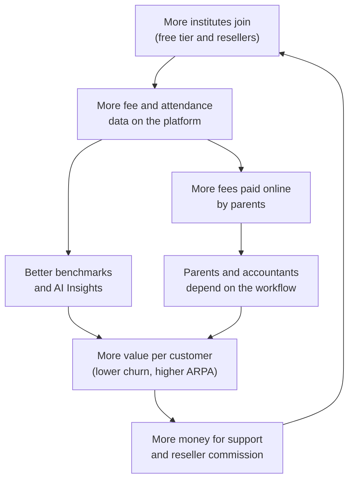
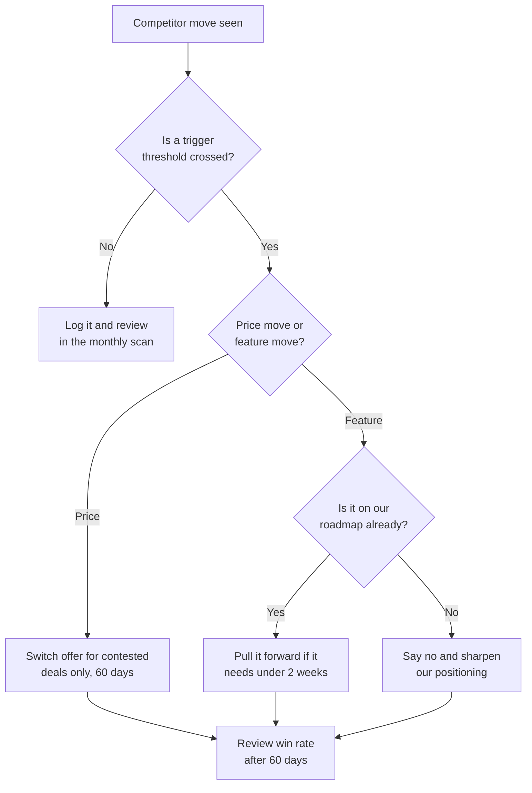

# Competitor Analysis

**In simple words:** This chapter shows who else sells software to schools and coaching institutes, what they charge, where they are strong and where they are weak. It then explains how EduFlow wins against each of them, and what we do if a big player cuts its price or copies our features. This matters because every owner we meet will ask, "Why not Teachmint, Classplus or Fedena?" We need a short, honest answer ready.

> **Note:** All competitor facts in this chapter are based on public information as of September 2026; verify before external use. We have no access to any competitor's private numbers. Where a number is our own judgement, it is marked "Estimate".

## How to read this chapter

Every fact about a competitor carries one of four labels. The labels tell the founder how much to trust the fact.

| Label | Meaning | How to use it |
|---|---|---|
| Opened | We read the page ourselves in September 2026. The URL is in the Sources list. | Safe for internal planning. Re-check before quoting outside. |
| Search summary | We saw the figure only in a search-result summary. | Treat as an indication. Open the source before external use. |
| Estimate | Our own judgement or calculation. The reasoning is shown. | Change the inputs when better data arrives. |
| Not publicly listed | We could not find public information. We do not guess. | Ask the vendor or a customer during a real deal. |

This chapter does not repeat other chapters. The feature-by-feature grid is in *Feature Comparison Matrix*. Market numbers are in *Market Research: India* and *Market Research: USA, Australia and UAE*. Our own price logic is in *Pricing Strategy*. This chapter answers four questions:

1. Who competes for the same buyer and the same budget?
2. What do they charge, as far as the public can see?
3. Why will an owner pick EduFlow over them?
4. What do we do when they react to us?

## Competitive landscape map

An institute owner can solve the "run my institute" problem in five ways. Each way is a category of competitor. Two terms first. An SIS (student information system) is the master record of students, attendance and grades, mostly used by school districts abroad. An LMS (learning management system) is software that delivers courses, assignments and grades online.

| Category | Main players | Main job they do | Typical buyer | Where they stop | Threat to EduFlow |
|---|---|---|---|---|---|
| Coaching apps | Classplus, Proctur, early Teachmint app | Branded app, online courses, live classes, tests | Coaching owner, teacher with an online audience | Offline fee counter, multi-centre control, payroll | High in coaching |
| Indian school ERPs | Fedena, MyClassCampus, Entab CampusCare, Edunext, Vidyalaya | Many school modules: fees, exams, transport, library | School owner, principal, school group | Slow setup, quote pricing, weak fit for coaching | High in schools |
| Global SIS | PowerSchool, Infinite Campus, Skyward, Compass, Sentral | District-grade student records, state reporting | US districts, Australian schools, premium international schools | Price, complexity, no Indian fee or GST fit | Low in India, Medium abroad later |
| LMS | Blackboard (Anthology), Google Classroom | Course delivery, assignments, grading | Universities, teachers | No admissions, fees, payroll or transport | Low |
| Horizontal tools | Excel, Google Sheets, Tally, WhatsApp groups, paper registers, UPI QR code | Free, general tools that everyone already knows | Every small and mid-size institute | No single student record, no reminders, no audit trail | Highest |

LEAD is a special case. It sells curriculum, books, teacher training and a school system as one bundle. It competes for the school's budget, not for the ERP seat. It is covered under secondary competitors.

**Figure: The five categories of competition**

The map shows that EduFlow sits between two Indian groups: coaching apps and school ERPs. Nobody in the map serves both groups with one simple product. That gap is our starting position.

### The biggest competitor is no software at all

*Market Research: India* makes this point and it shapes this whole chapter. Most deals are not lost to Teachmint or Fedena. They are lost to "we will continue with Excel this year". So the horizontal tools need their own analysis.

| Tool | What institutes use it for | Yearly cost | Why owners like it | What breaks above 200 students |
|---|---|---|---|---|
| Paper register and receipt book | Attendance, fee receipts | About ₹2,000–5,000 for printing (Estimate) | No training needed; works without power | No dues list; lost pages; no proof for parents |
| Excel or Google Sheets | Student list, fee dues, marks | ₹0 | Flexible; the accountant already knows it | One file per person; formulas break; no access control |
| Tally | Accounts and GST returns | Paid licence (price not checked for this chapter) | The chartered accountant demands it | Knows ledgers, not students, batches or instalments |
| WhatsApp groups | Parent notices, homework, fee reminders | ₹0 | Every parent is already there | Messages get buried; no record of who was told what |
| UPI QR code on the wall | Fee collection | ₹0 | Instant money, zero charges | Accountant must match each payment to a student by hand |

How we sell against "no software":

| Owner's thought | Our answer | Proof we show |
|---|---|---|
| "Excel is free." | Excel is free, but the unpaid fees it hides are not. | Dues list by batch in the demo, built from his own Excel file |
| "My staff will not learn software." | The teacher marks attendance in 2 minutes on a phone. | Live attendance demo on the owner's own phone |
| "I will start next session." | Start free today with 50 students. Move the rest in April. | Starter plan signup during the call |
| "Tally is enough for accounts." | Keep Tally. EduFlow gives your accountant a clean daily collection report for Tally entry. | Daily collection report sample |

> **Founder note:** Do not attack Excel, Tally or WhatsApp. The owner chose them and trusts them. Show that EduFlow works with them: import from Excel, export for Tally, send on WhatsApp.

## What changed in the market from 2022 to 2026

The competitor set looks very different from four years ago. The founder must know these events, because buyers remember them.

| When | Event | Label | What it means for EduFlow |
|---|---|---|---|
| January 2022 | Teachmint bought the school ERP company MyClassCampus. It was Teachmint's fourth acquisition. | Opened (Free Press Journal) | MyClassCampus is no longer an independent seller |
| March 2022 | Classplus raised US$70 million at a valuation of about US$600 million. | Opened (Entrackr) | The best-funded coaching player; cannot be outspent |
| FY24 (April 2023 – March 2024) | Classplus operating revenue doubled to ₹213 crore. Loss fell 57% to ₹110.4 crore. | Opened (Entrackr) | Coaching owners do pay for software; but the leader still lost money |
| January 2024 | PowerSchool announced expansion in India: 1,300 staff in India and the purchase of Chennai-based school ERP Neverskip (900+ schools, 1.2 million students). | Opened (PowerSchool release) | A global giant now owns an Indian school ERP |
| October 2024 | Bain Capital completed the purchase of PowerSchool for about US$5.6 billion. | Opened (Bain Capital release) and search summary | Private equity owners push for profit from large accounts |
| December 2024 | PowerSchool data breach. Reports say data of about 62 million students and 9.5 million teachers was taken. | Opened (TechTarget) | Security questions are now normal in every school deal |
| FY25 (April 2024 – March 2025) | Teachmint operating revenue grew 4.3 times to ₹74 crore. Entrackr reports that classroom hardware products and related services were its only revenue source. Loss fell to ₹46.6 crore. | Opened (Entrackr) | Teachmint's money now comes from smart boards, not from ERP subscriptions |
| 2025 | Inc42 reported that Classplus is moving from pure SaaS toward test preparation. | Search summary | Classplus may start to compete with its own coaching customers |
| 29 September 2025 | Anthology, the owner of Blackboard, filed for Chapter 11 bankruptcy protection in the USA. | Opened (Davis Polk) | The LMS giant spent a year fixing its balance sheet |
| 27 February 2026 | Blackboard came out of Chapter 11 as a separate, debt-free company. About US$1.6 billion of debt was removed. | Opened (Davis Polk) | Blackboard is focused on its LMS again, not on new segments |
| 21 September 2026 | The web address of MyClassCampus redirects to the Teachmint website. | Our own check | Schools that used MyClassCampus may be looking for a new home |

**Figure: Key competitor events, 2022 to 2026**

The figure shows a clear pattern. The funded Indian players moved away from pure ERP subscriptions. The global players were busy with owners, debt and security problems.

Three lessons for EduFlow:

1. **Free, investor-funded ERP did not pay.** Teachmint moved to hardware. Classplus moved toward content. Owners who built their work on a free tool saw the vendor change direction. Our message is: "We only do institute management, and you can export your data any day."
2. **The giants look up-market.** PowerSchool and Blackboard earn from large contracts. A 350-student coaching institute in Patna is not on their sales map.
3. **The same trap is open for us.** SaaS (software sold as a subscription) for small institutes is hard to make profitable. Our answer is low cost of sale: self-serve signup, a free tier that feeds paid plans, and extra revenue from message credits and add-ons. The numbers are in *Business Model* and *Financial Plan and Projections*.

## Threat rating method

We rate each competitor on four factors. Each factor gets a score from 1 (low) to 5 (high). The threat score is the simple average. All scores are our Estimate.

| Factor | Question | Score 1 means | Score 5 means |
|---|---|---|---|
| Segment overlap | Do they sell to coaching institutes and private schools of 50–1,000 students? | Different buyer | Same buyer |
| Price overlap | Is their price within reach of our buyer? | Ten times our price or more | Same or lower than ours |
| Product overlap | Do they cover admissions, attendance, fees, exams and parent communication? | One narrow job | Same modules as ours |
| Sales reach | Are they actively selling to our buyer in our launch cities? | Not selling there | Field team or strong brand there |

Rating bands: 1.0–2.0 = Low, 2.1–3.0 = Medium, 3.1–3.9 = Medium-High, 4.0–5.0 = High.

> **Rule:** If sales reach is 1 or 2, the rating is capped at Medium. A product that nobody is selling to our buyer cannot win the deal, however good it is.

| Competitor | Segment | Price | Product | Reach | Score | Threat level |
|---|---|---|---|---|---|---|
| Teachmint | 4 | 3 | 3 | 5 | 3.75 | Medium-High |
| Classplus | 5 | 4 | 2 | 5 | 4.00 | High (coaching) |
| PowerSchool | 1 | 1 | 4 | 2 | 2.00 | Low in India |
| Blackboard (Anthology) | 1 | 1 | 1 | 1 | 1.00 | Low |
| Fedena | 4 | 4 | 5 | 3 | 4.00 | High (schools) |
| MyClassCampus | 4 | 5 | 4 | 1 | 3.50 | Medium (capped) |
| Excel, Tally, WhatsApp, paper | 5 | 5 | 2 | 5 | 4.25 | Highest |

Formula: threat score = (segment + price + product + reach) ÷ 4. Example for Fedena: (4 + 4 + 5 + 3) ÷ 4 = 4.00.

Review these scores every quarter. A single event, such as Teachmint giving away its ERP with every smart board, can move a score by a full point.

## Primary competitor profiles

Each profile has the same parts: a fact table, product focus, pricing, strengths, weaknesses, what customers complain about, threat level and how EduFlow wins. Complaints are described in general terms from public review sites. We do not quote any reviewer.

### Teachmint

| Item | Detail | Label |
|---|---|---|
| Company | Teachmint, Bengaluru. Founded in 2020 by Mihir Gupta, Payoj Jain, Divyansh Bordia and Anshuman Kumar. It started as a free mobile app for tutors to run online classes. | Search summary |
| Funding | Over US$100 million raised. Investors include Lightspeed, Learn Capital, Rocketship, Goodwater and Better Capital. | Opened (Entrackr) |
| Revenue | ₹17.1 crore in FY24; ₹74 crore in FY25 (4.3 times growth). | Opened (Entrackr) and search summary |
| Loss | About ₹110 crore in FY24; ₹46.6 crore in FY25. | Opened (Entrackr) and search summary |
| Acquisitions | Teachmore, Teachee team, Airlearn, MyClassCampus (January 2022). | Opened (Free Press Journal) |
| Products on its website today | Teachmint X interactive flat panels (65, 75 and 86 inch), EduAI assistant, classroom app, Click X student clickers. The menu still lists admission, attendance and fee modules under an "Integrated School Platform". | Opened (company website) |
| Distribution | Partnership with IT distributor Rashi Peripherals for nationwide reach. | Opened (Entrackr) |
| Public rating | About 4.8 out of 5 on Capterra from about 74 reviews. | Search summary |

**Target customer.** Today the main target is a private school that wants smart classrooms. Earlier targets were single teachers, tutors and coaching institutes (2020–21) and then whole schools with the Integrated School Platform (2022–23).

**Product focus.** The company now leads with hardware plus classroom software. An interactive flat panel is a large touch screen that replaces the blackboard. Entrackr reports that sales of these products and related services were the only revenue source in FY25. The ERP modules that came from MyClassCampus still appear in the website menu. A competing vendor's blog (EdunodeX, July 2026) says the ERP is no longer prominent, and also notes that Teachmint has not announced any discontinuation. We make no claim either way.

**Known pricing model.** No public price list. The website says "Book a demo" and "Order now". Software directories describe a free plan plus custom quotes for the older software product. Hardware prices are given on request or in its online cart. ERP price: Not publicly listed.

**Strengths.**

- Strong brand memory among teachers from the free app of 2020–21.
- A physical product gives its sales team a reason to visit every school.
- A deep ERP code base with 40+ modules from MyClassCampus.
- Good public ratings for attendance, fee collection and support response.
- National distribution through an IT hardware distributor.

**Weaknesses.**

- Direction changed three times in five years: free teaching app, then school platform, then hardware. Buyers notice this.
- ERP is not the headline product, so ERP buyers may get less attention.
- No public pricing.
- Coaching institutes are not the focus any more.

**What customers complain about.** Public reviews are mostly positive. The negative themes are: some screens are confusing, study material is hard to organise, frequent updates move things around, the app sometimes crashes during online tests, some records cannot be deleted after a mistake, and small bugs appear.

**Threat level: Medium-High (3.75).** The main risk is a bundle. If Teachmint says "buy ten panels and get the ERP free", a school owner will listen. The risk is lower in coaching, where smart boards matter less.

**How EduFlow wins.**

| Situation in the deal | Our move |
|---|---|
| School is buying Teachmint panels | Say clearly: keep the panels. EduFlow runs the office, not the classroom wall. There is no conflict. |
| School is offered a free ERP with hardware | Ask who will support the ERP in year three. Show our public price list and data export. |
| Coaching institute compares both | Show coaching words in the product: Centre, Batch, Session, instalment plan. Show the fee counter flow. |
| Buyer asks about stability | "We only do institute management." Offer a yearly plan with the right to export all data any day. |

### Classplus

| Item | Detail | Label |
|---|---|---|
| Company | Classplus, Noida. Founded in 2018. | Search summary |
| Funding | Over US$160 million raised. Series D of US$70 million in March 2022 at about US$600 million valuation. Investors include Tiger Global, Alpha Wave, RTP Global, Blume Ventures and GSV Ventures. | Opened (Entrackr) |
| Revenue | ₹213 crore operating revenue in FY24, up from ₹102 crore in FY23. About 96.6% (₹205.5 crore) came from SaaS tools and software. | Opened (Entrackr) |
| Loss | ₹110.4 crore in FY24, down from ₹256 crore in FY23. | Opened (Entrackr) |
| Reach | The company website says more than 1 lakh coaching institutes in 1,100+ cities have built apps with it (see *Market Sizing: TAM, SAM and SOM*). | Opened in that chapter |
| Direction | Inc42 (2025) reports a move from pure SaaS toward test preparation. | Search summary |
| Public rating | Software directories show good ratings. Trustpilot and Sitejabber show about 2.7 out of 5, as reported by a competing vendor's blog. | Search summary |

**Target customer.** A coaching owner or a single teacher who wants to sell courses online under his own brand. The tag line on its website is "Aapki Coaching, Aapki App".

**Product focus.** A white-label app (an app with the institute's own name and logo) on the Play Store. Inside it: recorded courses, live classes, online tests, content protection, an online store, payments and marketing tools. It helps a teacher earn from students outside his city. It does some attendance and fee tracking, but the offline office is not the core. Deep offline modules such as payroll, transport or multi-centre fee control: Not publicly listed.

**Known pricing model.** No public price list. Pricing is by quote, often as multi-year contracts. A competing vendor (AllCoaching) publishes a page that reports ₹8,000 to ₹50,000 or more per year, a setup fee of up to about ₹25,000, a commission of 1.5–4% on sales plus gateway fees, and message credits charged extra. This comes from a competitor, so treat it as unverified.

**Strengths.**

- Largest base of coaching owners in India. Most coaching owners know the name.
- Very strong funding and a large field sales team in Tier 2 and Tier 3 cities.
- The owner's own branded app is an emotional win: "my coaching has an app".
- Proven that coaching owners pay: ₹205.5 crore of software revenue in FY24.

**Weaknesses.**

- Built for selling online, not for running the offline office.
- No public pricing. Different owners pay different prices for the same thing.
- Still loss-making in FY24. Pressure to earn more per customer is high.
- A move toward test preparation can make it a competitor of its own customers.
- The branded app is published under the vendor's developer account, as reported by reviewers.

**What customers complain about.** The negative themes in public reviews are: charges that were not clear at the time of sale, premium features that need extra payment after signing, long contracts, slow or no response from support after the sale, and login problems for students. Positive themes are an easy interface and good tools for online teaching.

**Threat level: High in coaching (4.00).** Classplus is in almost every coaching deal, at least as a name. But product overlap is low (score 2). Many owners have a Classplus app for online courses and still run the fee counter on Excel. Both products can live in the same institute.

**How EduFlow wins.**

| Situation in the deal | Our move |
|---|---|
| Owner already has a Classplus app | Do not ask him to leave it. "Classplus is your shop. EduFlow is your office." Import the student list by CSV. |
| Owner compares price | Show the public price page. Growth is ₹24,990 a year with no setup fee and no commission on fees. |
| Owner wants live classes and course selling | Be honest: EduFlow does not do this. Suggest he keeps his current tool for it. |
| Owner was hurt by a long contract | Offer monthly billing. Cancel any month. Export data any day. |
| Owner fears the vendor will compete with him | "We do not teach students and we never will." Put this line on the website. |

> **Example:** Sharma Classes in Patna has 350 students. Rajesh Sharma sells a recorded NEET crash course through a branded app. His accountant Suresh Gupta still tracks 1,050 instalments a year in Excel (350 students × 3 instalments). EduFlow replaces the Excel file, not the app.

### PowerSchool

| Item | Detail | Label |
|---|---|---|
| Company | PowerSchool, Folsom, California, USA. The founding year is widely given as 1997 (not re-checked for this chapter). | Opened (Bain Capital release) for the head office |
| Owner | Bain Capital bought it for US$22.80 per share, about US$5.6 billion. The deal closed on 1 October 2024. | Opened (Bain Capital release) and search summary |
| Scale | The company says it supports over 60 million students and 18,000+ customers in 90+ countries. | Search summary (company filing) |
| Market share | About 23% of tracked K-12 SIS installations in the USA and Canada. FACTS SIS 15%, Infinite Campus 10%, Skyward 7%. | Opened (ListEdTech, 2025) |
| India presence | Centre of Excellence in Bengaluru with 1,300 staff in January 2024 and a plan for 2,000. Bought Chennai-based school ERP Neverskip (900+ schools, 1.2 million students). Sells Schoology Learning to leading Indian schools. | Opened (PowerSchool release) |
| Security event | December 2024 breach through a support portal. About 62 million students and 9.5 million teachers affected. A ransom of about US$2.85 million was paid. A 19-year-old pleaded guilty. | Opened (TechTarget) and search summary |

**Target customer.** Public school districts in the USA and Canada, large private schools, and premium international schools in other countries.

**Product focus.** A wide suite: PowerSchool SIS, Schoology Learning (an LMS), enrolment, Naviance (college and career planning), staff hiring tools, analytics and an AI assistant. This list comes from review-site product pages and search summaries, so re-check it on the company website. The suite is built for state reporting rules in the USA. Indian fee instalments, GST invoices and WhatsApp messaging in the core product: Not publicly listed.

**Known pricing model.** No public price list. Contracts are per district. A 2026 analysis of public contracts by Civic IQ reports US$4,160 to US$24,939 per year by product type, with base SIS contracts averaging US$10,604 per year. Add-on modules are billed separately. At ₹85 per dollar, US$10,604 is about ₹9 lakh a year. That is 15 times the EduFlow Pro plan.

**Strengths.**

- The category leader in North America with very deep features.
- A full suite from one vendor, which large districts like.
- Large engineering base in India, so it understands Indian talent and cost.
- Owns an Indian school ERP (Neverskip) if it ever wants to go down-market here.

**Weaknesses.**

- Heavy and costly. Needs trained administrators and long implementation.
- The 2024 breach damaged trust. North Carolina is moving state-wide to Infinite Campus, as ListEdTech notes.
- Private equity ownership usually means a focus on large, profitable accounts.
- Not built for coaching institutes at all.

**What customers complain about.** The themes in public reviews are: the interface is hard to navigate, there is a steep learning curve for teachers, parts of the design look old, the system slows down at peak times, and switching to it costs a lot of time and money.

**Threat level: Low in India (2.00), Medium in the USA from Year 3.** We will rarely meet PowerSchool in a deal before Year 3. The point to watch is Neverskip. If PowerSchool pushes it to mid-size Indian schools with a low price, the school-side threat rises.

**How EduFlow wins.**

| Situation in the deal | Our move |
|---|---|
| Premium Indian school compares us with PowerSchool | Qualify honestly. If they need US-style transcripts and an LMS, we are not the fit today. |
| Small US private school or tutoring centre (Year 3) | Lead with price and speed: US$79 or US$199 a month, live in one day, no implementation project. |
| Buyer raises the 2024 breach | Do not attack. Explain our own controls: MFA for staff, tenant isolation, audit logs. See *Compliance, Legal and Data Protection Requirements*. |
| School already uses Neverskip | Treat it like any Indian ERP deal: WhatsApp-first, one-day setup, public pricing. |

### Blackboard (Anthology)

| Item | Detail | Label |
|---|---|---|
| Company | Blackboard was founded in 1997 in Washington, D.C. It merged with Anthology in late 2021. The head office is now in Boca Raton, Florida. | Opened (Wikipedia) |
| Restructuring | Anthology filed for Chapter 11 on 29 September 2025 in the Southern District of Texas. Three business units were sold. The Teaching and Learning business came out on 27 February 2026 as Blackboard, with about US$1.6 billion of debt removed. | Opened (Davis Polk) |
| New owners and name | Wikipedia reports that Nexus Group and Oaktree Capital Management took ownership through the restructuring, and that the company went back to the Blackboard name in March 2026. | Opened (Wikipedia) |
| Market share | 12% of higher-education LMS enrolment in the USA and Canada at the end of 2024. Canvas had 50%, D2L Brightspace 20%, Moodle 9%. Blackboard continues to lose accounts. | Opened (On EdTech newsletter, Phil Hill) |
| Product | Blackboard Learn LMS with tools for course delivery, tests, grading and accessibility. | Search summary |

**Target customer.** Universities, colleges and large training bodies. Some K-12 districts abroad. In India, a few private universities and corporate learning teams.

**Product focus.** Teaching and learning only. It delivers course content, assignments, discussion boards, online tests and grades. Admissions, fee collection, payroll, transport or hostel for a school: Not publicly listed, and not its purpose.

**Known pricing model.** No public price list. Third-party price trackers report contracts from about US$9,500 per year, with US$10,000 to US$50,000 for a 1,000-user institution. A UK public-sector framework shows about £13 to £20 per user per year. Both are search summaries. Pricing is by user band, so the institution pays for all eligible users, not only active ones.

**Strengths.**

- A known name in universities for 25 years.
- Deep teaching features and accessibility tools.
- Now free of debt after the restructuring, so it can invest again.

**Weaknesses.**

- Losing share to Canvas and D2L Brightspace for several years.
- A year of bankruptcy news made buyers careful.
- High price and long contracts.
- Does not run the office of an institute at all.

**What customers complain about.** General themes in public reviews are: the older "Original" interface feels dated and needs many clicks, moving to the newer "Ultra" experience takes effort, the price is high, and support can be slow.

**Threat level: Low (1.00).** Blackboard does a different job for a different buyer at a very different price. It is in the canon set because investors and international partners will ask about it, not because we will meet it in a Patna sales call.

**How EduFlow wins.** We do not compete. We stay out of the LMS business. Homework (HW) and Student Portal (SP) in EduFlow are light tools for school and coaching use, not a university LMS. When EduFlow enters colleges later, the plan is to link to an LMS that the college already has, not to replace it.

| Situation in the deal | Our move |
|---|---|
| Investor asks, "Is Blackboard a competitor?" | "No. Blackboard delivers courses. EduFlow runs admissions, attendance, fees and parent communication." |
| College wants an LMS and an ERP | Offer EduFlow for operations. Let them keep Blackboard, Canvas, Moodle or Google Classroom for teaching. |

### Fedena

| Item | Detail | Label |
|---|---|---|
| Company | Foradian Technologies Pvt Ltd, HSR Layout, Bengaluru. | Opened (company website) |
| History | Started as an open-source school ERP project. The start year is widely given as 2009 (not re-checked). A free basic version is still available as open-source code. | Search summary |
| Scale claim | The website claims 20 million users over 10 years. | Opened (company website) |
| Public plans in India | Standard ₹50,000 a year, Premium ₹75,000 a year, Ultimate ₹1,00,000 a year, all plus GST. Enterprise is custom and includes the source code. | Opened (company pricing page) |
| Plan notes | Unlimited users. Online training, onboarding data setup, updates, email and phone support, and cloud hosting are included. The mobile app is listed only in Ultimate and Enterprise. | Opened (company pricing page) |
| Module count | The pricing page lists four module groups: 20 core, 17 standard, 10 premium and 12 ultimate. | Opened (company pricing page) |
| International price | US$999 to US$2,299 per year by plan. | Search summary (Capterra) |

**Target customer.** K-12 schools first. Also colleges, universities and training institutes, in India and abroad. A typical buyer is a school with 500 to 5,000 students that wants every module.

**Product focus.** A broad, classic school ERP: admissions, attendance, timetable, examinations, gradebook, fees, HR and payroll, library, hostel, transport, inventory, plus a plugin store. It is customisable and supports many languages.

**Known pricing model.** Fedena is one of the few players with a public price list. It charges a flat yearly fee per institution, not per student. This makes it very cheap per student for a large school and costly for a small institute. Multi-campus terms on the public page: Not publicly listed.

**Strengths.**

- Public pricing. This removes our "transparent pricing" edge against this one competitor.
- Flat fee with unlimited students. For 1,200 students, ₹1,00,000 a year is about ₹83 per student per year.
- Very wide module list, including Phase 3 modules that EduFlow ships only by June 2027.
- Long history and customers in many countries.
- Source code option for groups that want full control.

**Weaknesses.**

- The entry price of ₹50,000 a year is too high for a 100-student coaching institute.
- No free tier.
- Mobile app only in the top public plan.
- School vocabulary. A coaching owner sees "Class" and "Section", not "Batch" and "Centre".
- Setup is guided by the vendor team, not self-serve in one day (Estimate, based on the onboarding steps it lists).

**What customers complain about.** The themes in public reviews are: slow support replies, navigation that needs too many clicks to reach basic lists, a gradebook that teachers find hard, and training videos of mixed quality. Some reviewers praise the HR, inventory and student document features.

**Threat level: High in schools (4.00).** Fedena is the closest match to our school product and its price is public and fair.

**How EduFlow wins.** The answer depends on size. The table uses list prices before GST.

| Institute size | Fedena public price | EduFlow public price | Who is cheaper | How we sell |
|---|---|---|---|---|
| Up to 50 students | ₹50,000 a year | ₹0 (Starter) | EduFlow | Free forever; start today |
| 51–300 students | ₹50,000 a year | ₹24,990 a year (Growth) | EduFlow, by half | Price, WhatsApp, one-day setup |
| 301–1,000 students | ₹50,000–1,00,000 a year | ₹59,990 a year (Pro) | About equal | Parent experience, multi-campus, speed |
| Above 1,000 students | ₹1,00,000 a year or custom | From ₹1,79,988 a year (Enterprise) | Fedena | Only if AI Insights, SLA and migration matter |

> **Warning:** Above 1,000 students, EduFlow is not the cheapest option on list price. Do not discount to match. Sell on support, WhatsApp-first communication, multi-campus control and AI Insights. If the school buys only on price, let the deal go.

### MyClassCampus

| Item | Detail | Label |
|---|---|---|
| Company | MyClassCampus, Ahmedabad. Founders Rachit Dave, Rutvij Vora and Raj Kothari. Sources give the founding year as 2015 or 2017. | Opened (StartupTalky, Free Press Journal) |
| Funding | About ₹1.5 crore of seed money from private investors. | Opened (StartupTalky) |
| Scale before the sale | 2,000+ institutes, 3 lakh+ students, 6 lakh+ parents, use in 10 countries. | Opened (StartupTalky, older article) |
| Product | School, college and coaching ERP with 40+ modules and a mobile app. Packages were Basic, Advance and Premium. | Opened (StartupTalky) |
| Price before the sale | ₹100 to ₹150 per student per year. The Basic package was under ₹100. | Opened (StartupTalky) and search summary |
| Status | Bought by Teachmint on 28 January 2022. On 21 September 2026 its web address redirects to the Teachmint website. | Opened (Free Press Journal) and our own check |

**Target customer.** Budget and mid-size private schools, colleges and institutes with 50 or more students. It was strongest in Gujarat and western India (Estimate, based on its home city).

**Product focus.** A mobile-first, all-in-one ERP for staff who are not comfortable with computers. The founders said in interviews that the biggest gap in the market was an all-in-one product. This is the same idea as EduFlow.

**Known pricing model.** Per student per year, in three packages. For a 1,200-student school, ₹100–150 per student means ₹1.2 lakh to ₹1.8 lakh a year. Current price under Teachmint: Not publicly listed.

**Strengths.**

- The closest product shape to EduFlow: simple, mobile-first, many modules.
- A low per-student price that set buyer expectations in its region.
- Its code now sits inside a well-funded parent.

**Weaknesses.**

- It is no longer sold as an independent brand.
- The parent company now earns from hardware, as the Teachmint profile shows.
- Schools that chose it for its founders' attention now deal with a much larger company.

**What customers complain about.** There are too few recent public reviews under the MyClassCampus name to summarise fairly. We do not guess. For current user feedback, see the Teachmint profile.

**Threat level: Medium (capped).** The raw score is 3.50, but sales reach as an independent brand is 1. The real threat is already counted under Teachmint.

**How EduFlow wins.** MyClassCampus is more an opportunity than a threat.

| Situation in the deal | Our move |
|---|---|
| School used MyClassCampus and feels unsure after the merger | Offer assisted data migration (₹9,999 one-time add-on) and a fixed go-live date before April 2027. |
| School quotes the old ₹100–150 per student price | Show the maths. Pro at ₹59,990 for 600 students is ₹100 per student per year, with WhatsApp and multi-campus. |
| School in Gujarat or Maharashtra asks for a local reference | Make two early pilot customers in western India a Year 1 goal (Assumption). |

> **Founder note:** MyClassCampus stays in our fixed competitor set for three reasons. Its old price still anchors what schools in western India expect to pay. Its former customers are a warm lead list. And its story, a good small ERP that was bought and folded into a bigger plan, is a story that buyers remember.

## Secondary competitors

These players will appear in some deals. They do not need a full profile yet. Each row shows what is publicly known and our stance. Where a fact is missing, the cell says so.

| Player | Home market | What it is | Public facts | Threat | Our stance |
|---|---|---|---|---|---|
| Entab CampusCare | India (New Delhi) | Classic school ERP, strong on CBSE formats | Website claims 2,500+ schools (search summary). Price: Not publicly listed. | High for CBSE schools above 1,000 students | Avoid head-on fights in large CBSE schools in Year 1 |
| Edunext | India (Delhi NCR, not re-checked) | Cloud school ERP with mobile apps for CBSE schools | School count and price: Not publicly listed | Medium | Win on setup speed and public pricing |
| Vidyalaya | India | Long-standing school software used across state boards | School count and price: Not publicly listed (search summary) | Medium in budget schools | Win on WhatsApp-first and cloud access from any phone |
| LEAD | India (Mumbai) | Curriculum, books, teacher training and a school system in one bundle | Bought Pearson's India K-12 business in 2023; works with 10,000+ schools (search summary) | Low for ERP, Medium for school budget | Co-exist. LEAD improves teaching; EduFlow runs the office |
| Proctur | India | ERP for coaching institutes and schools | Price depends on student count; no public list (search summary) | Medium in coaching | Closest coaching ERP rival; win on free tier and public price |
| Google Classroom | Global | Free tool for assignments and class streams | 150 million+ users in 190+ countries (search summary) | Low | Not an ERP. Teachers can keep it for assignments |
| Compass | Australia | School management platform | Website claims 1,800+ schools in Australia, Ireland and Canada; investor EQT (search summary) | Low now, High in Australian schools | Do not target mainstream Australian schools |
| Sentral | Australia | Cloud school administration software | Owned by Global Payments since 2019 (search summary) | Low now, High in Australian schools | Same as Compass |
| Infinite Campus | USA | District SIS | About 10% of tracked K-12 SIS installations; North Carolina is moving to it state-wide (Opened, ListEdTech) | Low | We do not sell to districts |
| Skyward | USA | District SIS and finance | About 7% of tracked installations (Opened, ListEdTech) | Low | We do not sell to districts |

### The Indian market is very fragmented

India has about 3.42 lakh private unaided schools (UDISE+ 2025-26, see *Market Research: India*). The UDISE+ 2024-25 count was 3.40 lakh, so the base grows slowly. Compare the vendor claims with this base:

| Vendor claim | Schools | Share of 3.42 lakh private unaided schools |
|---|---|---|
| Entab CampusCare (website claim) | 2,500 | 2,500 ÷ 3,42,000 = 0.73% |
| Neverskip at the time PowerSchool bought it | 900 | 900 ÷ 3,42,000 = 0.26% |
| MyClassCampus before its sale (all institute types) | 2,000 | 2,000 ÷ 3,42,000 = 0.58% |
| LEAD (curriculum bundle, not pure ERP) | 10,000 | 10,000 ÷ 3,42,000 = 2.9% |

These are vendor claims and search summaries, so the shares are Estimates. The message is still clear. No pure school ERP vendor in this list has even 1% of private schools. There is no "Tally of school software" yet. The market is open, but it is also hard: hundreds of small local vendors share it.

## Pricing comparison

This table compares only what the public can see. "Quote" means the vendor gives a price only after a sales call.

| Player | Public price list | Pricing unit | Indicative public price | Setup or extra charges | Label |
|---|---|---|---|---|---|
| EduFlow | Yes | Flat plan by student band | ₹0 / ₹24,990 / ₹59,990 a year; Enterprise from ₹14,999 a month | No setup fee; message credits; optional migration ₹9,999 | Canon |
| Teachmint | No | Quote; hardware sold per panel | ERP price Not publicly listed | Not publicly listed | Opened (company website) |
| Classplus | No | Quote; multi-year contracts reported | ₹8,000–50,000+ a year plus 1.5–4% commission, as reported by a competing vendor | Setup up to about ₹25,000; message credits extra (same source) | Opened (competitor page), unverified |
| PowerSchool | No | Per district contract | US$4,160–24,939 a year; base SIS average US$10,604 | Add-on modules billed separately | Search summary (Civic IQ) |
| Blackboard (Anthology) | No | Per user band | From about US$9,500 a year; £13–20 per user in a UK framework | Implementation and training extra | Search summary |
| Fedena | Yes | Flat fee per institution | ₹50,000 / ₹75,000 / ₹1,00,000 a year plus GST | Onboarding included; mobile app only in top plan | Opened (company pricing page) |
| MyClassCampus | Not any more | Per student per year | ₹100–150 per student a year before its sale | Not publicly listed | Opened (StartupTalky), historical |
| Typical local Indian ERP | No | Per student per month | ₹15–40 per student a month (see *Market Research: India*) | Setup, app and SMS often extra | Search summary |

### Worked example: cost at different sizes

All prices are yearly list prices before GST. "Per-student vendor" uses the old MyClassCampus range of ₹100–150 per student per year.

| Students | EduFlow plan | EduFlow yearly price | EduFlow per student | Fedena Standard per student | Per-student vendor total |
|---|---|---|---|---|---|
| 50 | Starter | ₹0 | ₹0 | ₹1,000 | ₹5,000–7,500 |
| 120 | Growth | ₹24,990 | ₹208 | ₹417 | ₹12,000–18,000 |
| 300 | Growth | ₹24,990 | ₹83 | ₹167 | ₹30,000–45,000 |
| 350 (Sharma Classes) | Pro | ₹59,990 | ₹171 | ₹143 | ₹35,000–52,500 |
| 600 | Pro | ₹59,990 | ₹100 | ₹83 | ₹60,000–90,000 |
| 1,000 | Pro | ₹59,990 | ₹60 | ₹50 | ₹1,00,000–1,50,000 |
| 1,200 (Bright Future) | Enterprise | From ₹1,79,988 | ₹150 | ₹42 | ₹1,20,000–1,80,000 |

Formula: per student = yearly price ÷ active students. Example: ₹59,990 ÷ 350 = ₹171. Fedena Standard is ₹50,000 a year for any size, so ₹50,000 ÷ 350 = ₹143.

What the table tells us:

- **EduFlow is clearly cheapest against Fedena up to 300 students.** This is the largest pool of institutes (see *Market Sizing: TAM, SAM and SOM*).
- **EduFlow has two weak spots, just above each plan limit.** At 301–450 students and at 1,001–1,800 students our per-student price is higher than a flat-fee or per-student vendor. Sharma Classes (350) and Bright Future (1,200) both sit in these weak spots.
- **A per-student vendor is cheaper below about 170 students.** ₹24,990 ÷ ₹150 = 167 students. Below that size our answer is the free Starter plan for up to 50 students, and value, not price, from 51 to 170.
- **The global players are many times our price.** PowerSchool's average base contract of about ₹9 lakh is 15 times Pro and 5 times the Enterprise entry price. Price is never the issue against them; trust and features are.

> **Founder note:** The two weak spots are a known cost of simple plan limits. Do not fix them with discounts. In the sales call, show the cost as a share of fee income. For Sharma Classes, ₹59,990 is about 0.3% of ₹2.10 crore yearly fee billing (see *Customer Personas*). Review the plan limits with real win and loss data after 100 customers (see *Pricing Strategy*).

## Positioning map

The map places each player on two questions an owner cares about. How easy is it to start and use? How many parts of the institute does it cover? The scores are our Estimate on a scale of 0 to 1.

| Player | Ease of use | Breadth of modules | Reason for the score |
|---|---|---|---|
| EduFlow at launch (Jan 2027) | 0.85 | 0.45 | Self-serve, one-day setup; 16 Phase 1 modules |
| EduFlow by Sep 2027 | 0.85 | 0.80 | All 34 modules after Phase 4 |
| Teachmint | 0.70 | 0.60 | Reviews praise ease; ERP breadth from MyClassCampus, but not the focus |
| Classplus | 0.75 | 0.30 | Easy app; narrow on offline operations |
| PowerSchool | 0.25 | 0.92 | Widest suite; reviews report a steep learning curve |
| Blackboard (Anthology) | 0.35 | 0.20 | Teaching only; reviews call the older interface dated |
| Fedena | 0.40 | 0.85 | Very wide; reviews mention hard navigation |
| MyClassCampus | 0.60 | 0.70 | Mobile-first with 40+ modules |
| Entab CampusCare | 0.30 | 0.78 | Classic full ERP; vendor-led setup (Estimate) |
| Proctur | 0.55 | 0.50 | Coaching ERP with school modules (Estimate) |
| Google Classroom | 0.92 | 0.10 | Very easy; assignments only |
| Excel and WhatsApp | 0.70 | 0.06 | Everyone knows them; they cover nothing as a system |

**Figure: Positioning map, ease of use against breadth of modules**

The top-right corner, "easy and broad", is almost empty today. The broad products are heavy, and the easy products are narrow. EduFlow starts on the right side at launch and climbs to the top-right corner as Phases 2, 3 and 4 ship. The climb must not cost us ease of use. Every new module must pass the same test: can a new user finish the main task without training?

> **Warning:** At launch in January 2027, EduFlow has 16 modules. Fedena, Entab and MyClassCampus list more. Until June 2027, do not sell EduFlow as "the most complete ERP". Sell it as "the easiest way to get fees, attendance and parents under control".

## Competitor SWOT summary

SWOT means strengths, weaknesses, opportunities and threats. This table looks at each competitor from its own side. Our own full SWOT is in *SWOT Analysis and Strategic Options*.

| Player | Strengths | Weaknesses | Opportunities for them | Threats to them |
|---|---|---|---|---|
| Teachmint | Brand, funding, hardware channel, ERP code from MyClassCampus | Changed direction often; ERP not the focus | Bundle free ERP with every smart board | Hardware margins; low-cost panel imports |
| Classplus | Largest coaching base, field sales, ₹200+ crore software revenue | Losses; quote pricing; support complaints | Add offline ERP modules to its base | Owners fear it will compete through test prep |
| PowerSchool | North America leader, full suite, India engineering, owns Neverskip | Heavy, costly, trust hit from the 2024 breach | Push Neverskip into mid-size Indian schools | Infinite Campus gains; legal claims; cost cuts under new owners |
| Blackboard (Anthology) | Known university brand; now debt-free | Falling share; bankruptcy memory | Re-invest in the Learn product | Canvas and D2L keep winning accounts |
| Fedena | Public flat pricing, very wide modules, long history | High entry price, dated experience, slow support in reviews | Launch a cheaper small-institute plan | Modern cloud rivals; open-source forks |
| MyClassCampus | Simple mobile-first ERP, low per-student price | No longer independent | Be revived as Teachmint's free ERP bundle | Parent company focus on hardware |
| EduFlow | Simple, public pricing, free tier, one product for coaching and schools | Solo founder, no brand, 16 modules at launch | Orphaned users of free tools; Tier 2 and 3 cities | A funded player copies the offer and outspends us |

## Differentiation strategy

A differentiator is a reason to choose us that the buyer can see and check. We build on seven. For each one the table shows the promise, the proof we must show in a demo, whom it beats, and how fast a competitor could copy it (Estimate).

| Differentiator | Our promise | Proof in the demo | Beats | Time to copy |
|---|---|---|---|---|
| Coaching and school in one | The same product speaks "Batch and Centre" or "Section and Campus" | Switch organization type; labels change on screen | Classplus (no school operations), school ERPs (school words only) | 12–18 months |
| WhatsApp-first | Every key event reaches the parent on WhatsApp by default | Mark Aarav Sharma absent; the parent's phone gets the message in seconds | SMS-first and app-only ERPs | 3–6 months |
| Setup in one day | Sign up, import Excel, collect the first fee the same day | Import the owner's own student sheet during the call | Vendor-led setups that take weeks | 6–12 months |
| Transparent pricing | One public price page; yearly = 10 × monthly; no setup fee | Open the pricing page on the owner's phone | Every quote-based vendor | Fast to copy, but painful for sales-led firms |
| Free tier | Starter is free forever for up to 50 students | Create a live account in the call | Fedena (₹50,000 entry) and most ERPs | Fast for funded players, but they left "free" behind |
| Multi-campus at mid-tier price | Pro includes up to 3 campuses for ₹5,999 a month; extra campus ₹999 | One owner dashboard with centre-wise collection | Vendors that treat each branch as a new licence | 6–12 months |
| AI Insights | Plain-language answers from the institute's own data | From September 2027: "Which students may default on fees next month?" | Report-only ERPs | 6–12 months for big players |

### Coaching and school in one product

The canon domain model uses neutral objects: Organization, Campus, AcademicYear, Course, Batch and Enrollment. The screen label changes with the organization type. Sharma Classes sees "Session 2027-28" and "Morning Batch M1". Bright Future Public School sees "Academic year 2027-28" and "Section 10-A". A school ERP would need to change its data model to copy this. A coaching app would need to build the whole office side. This is why the copy time is long. It also fits a real Indian pattern: many school owners also run a coaching centre, and many coaching owners later open a school.

### WhatsApp-first

EduFlow connects directly to the WhatsApp Cloud API from Meta. Attendance alerts, fee reminders, receipts and exam results go to WhatsApp by default. Credits are billed at Meta's cost plus 15%. Several Indian vendors now advertise WhatsApp messaging as an add-on. So we never say "only we have WhatsApp". Our claim is narrower and true: WhatsApp is the default channel for every event, it is included from the Growth plan, and the price per message is public. This differentiator is easy to copy. It wins deals in 2027, but it is not a long-term moat.

### Setup in one day

The activation target in the canon is a first fee receipt or first attendance within 7 days for 60% of signups. One-day setup needs four product pieces: self-serve signup, Excel import with clear error messages, ready fee structure templates, and sample data to explore. Vendor-led ERPs earn service revenue from setup and training. Removing that revenue is hard for them. This is why copying takes 6 to 12 months even though the idea is simple. Details are in *Customer Success, Onboarding and Support*.

### Transparent pricing

Of the six primary competitors, only Fedena shows a public price list today. Quote pricing lets a sales team charge each buyer a different amount. Owners dislike this, and the review themes for Classplus show it. Our rule: the price on the website is the price. The only public variations are yearly billing and add-ons.

### Free tier

Starter is free forever for up to 50 students, with 1 admin and 3 staff users, EduFlow branding, and in-app and email messages only. It costs us little to serve and it fills the top of the funnel. The Year 1 target is 300 free organizations and 15% free-to-paid conversion. The risk is a repeat of the 2021 pattern, when funded players gave everything away. Our free tier is small by design. A real institute outgrows 50 students quickly.

### Multi-campus at a mid-tier price

A coaching owner with three centres in Patna is a mid-size business, not an enterprise. Pro gives him up to 3 campuses, custom roles and centre-wise reports for ₹5,999 a month. Public multi-branch terms for most competitors: Not publicly listed. In sales calls, ask the buyer what the other vendor quoted for the second branch. Record the answer in the win and loss log.

### AI Insights

AI Insights ships in Phase 4, by September 2027. It is a ₹1,499 a month add-on for Growth and Pro, and it is included in Enterprise. It works on operations data: fee default risk, attendance drops, batch performance and plain-language questions. PowerSchool and Teachmint already market AI assistants, mainly for classroom content. So "we have AI" is not special. "AI on your own fee and attendance data, for ₹1,499 a month" is.

> **Rule:** Never sell a differentiator before it exists. Until September 2027, AI Insights is shown only as a roadmap item with its date. See *Five-Year Roadmap*.

### Claims we must not make

| Tempting claim | Why we must not say it | What we say instead |
|---|---|---|
| "The cheapest ERP in India" | Not true above 1,000 students or below about 170 paid students | "A public price with no setup fee" |
| "Only EduFlow has WhatsApp" | Other vendors advertise it | "WhatsApp is the default, from the Growth plan" |
| "Teachmint has shut its ERP" | No public notice says so | "Ask them who supports the ERP in year three" |
| "PowerSchool is unsafe" | Attacking a breach victim looks bad and invites legal risk | "Here is how we protect your data" |
| "Classplus takes a commission from you" | It comes from a competitor's page; unverified | "We take no commission on your fees" |

## Moat over time

A moat is an advantage that gets stronger each year and is hard to copy. Differentiators win the first deal. Moats keep the customer and make the next deal cheaper. We plan four.

| Moat | How it builds | Year 1 signal (Sep 2027) | Year 3 signal (Sep 2029) | Year 5 signal (Sep 2031) |
|---|---|---|---|---|
| Data | Anonymous benchmarks across many institutes make AI Insights better | 60,000 active students on the platform | Benchmarks by city and institute type inside AI Insights | Default-risk models that a new entrant cannot train |
| Workflow lock-in | Fee history, receipts, report cards and parent habits live in EduFlow | Monthly logo churn under 3%; parent adoption 70% | Second and third academic year of history per customer | Five years of alumni records, certificates and audit trails |
| Reseller network | Local partners in Tier 2 and 3 towns sell and support | First partners after 30–50 direct customers | Partners in most target states (Assumption: 100+ partners) | Partners prefer EduFlow because renewals pay them every year |
| Payments | Online fee collection runs through EduFlow's Razorpay flow | 40% of fee value collected online | Payment data powers reminders and reconciliation | Paying fees in EduFlow is a parent habit; switching would break it |

**Figure: How the four moats build on each other**

The loop shows that each new institute makes the product better for the next one. Data improves AI Insights. Online payments tie parents and accountants to the daily workflow. Both reduce churn, and lower churn pays for the reseller network that brings more institutes.

### The size of the payments moat

Here is a simple model of fee value that could flow through EduFlow at the end of Year 1. All inputs are targets or Estimates.

| Input | Value | Source |
|---|---|---|
| Active students in paying organizations | 49,760 | *Business Objectives, Scope and Stakeholders* (12,960 + 24,000 + 12,800) |
| Average yearly fee per student | ₹30,000 | Estimate |
| Yearly fee billing on the platform | ₹149 crore | 49,760 × ₹30,000 |
| Online share target | 40% | Canon Year 1 target |
| Yearly fee value paid online | About ₹60 crore | ₹149 crore × 40% |

In Year 1 EduFlow adds no markup on gateway charges, so this flow earns nothing directly. Its value is lock-in and data. An accountant who reconciles online fees in two clicks will not go back to matching UPI messages by hand.

### Lock-in must come from value, not from a trap

Indian owners have been hurt by vendors that hold their data. The DPDP Act 2023 also gives people rights over their personal data. So our lock-in rules are strict:

1. Any Organization Admin can export all data to Excel or CSV on any day, on any plan.
2. After cancellation, data stays available for export for a fixed period (see *Compliance, Legal and Data Protection Requirements*).
3. Benchmarks use only anonymous, combined data. No institute can see another institute's numbers.
4. No tracking or targeted advertising to children, ever.

A customer who can leave easily, and stays, is the strongest proof in a sales call.

## Competitive response plan

Big players will notice EduFlow only when we start to win deals in their cities. We plan the response now so that we do not react in panic later.

### Triggers

We act only when a competitor's move hurts real deals. One loud announcement is not a trigger.

| Trigger | Threshold | Who checks | How often |
|---|---|---|---|
| Lost deals naming the same competitor's price | 3 or more in 30 days | Founder, from the win and loss log | Weekly |
| Win rate in contested deals | Falls below 40% over the last 10 contested deals (Assumption) | Founder | Monthly |
| Churned customers moving to the same competitor | 2 or more in a quarter | Founder, later the customer success lead | Monthly |
| Competitor launches a free or near-free plan for our segment | Any public launch | Founder | Monthly scan |

### Scenario playbook

| Scenario | What they do | First 7 days | First 30 days | What we never do |
|---|---|---|---|---|
| Price drop | A funded player offers a Growth-like plan at ₹1,499 a month or free for a year | Check the offer's fine print; brief resellers; do not change the price page | Launch a switch offer for contested deals only | Cut the list price |
| Feature copy | A competitor launches WhatsApp-first alerts or one-day setup | Test their version; list what is still better in ours | Deepen the loop: reminder, payment link, receipt, all on WhatsApp | Claim they "stole" it |
| Hardware bundle | Free ERP with every smart board | Prepare a one-page note: "Keep your boards. Who supports the ERP?" | Offer a side-by-side pilot on the free Starter plan | Sell or bundle hardware |
| Offline modules from a coaching app | Classplus adds a fee counter and multi-centre reports | Try it with a friendly customer | Show the depth gap: instalments, discounts, scholarships, accountant role | Add course selling or live classes |
| Down-market push by a giant | PowerSchool prices Neverskip for mid-size schools | Collect real quotes from prospects | Lead with coaching, Tier 2 cities and one-day setup | Chase premium schools in response |
| Local undercutting | A local vendor quotes ₹20 per student per year | Ask for their uptime, backups and data export proof | Offer Starter free, and a Growth monthly plan with no lock-in | Match the price |
| Doubt about a solo founder | A rival tells buyers that EduFlow is one person | Share the data export promise and status page | Publish customer references and the support response record | Hide the team size |

### Worked example: why we do not match a price cut

Assume a competitor launches a plan at ₹1,499 a month against our Growth plan at ₹2,499. We compare two options using the Year 1 plan mix from *Business Objectives, Scope and Stakeholders* (72 Growth customers). MRR means monthly recurring revenue, the subscription money that comes in every month. ARR is the yearly run-rate of the same money. CAC is the cost to win one customer.

| Item | Option A: match the price | Option B: targeted switch offer |
|---|---|---|
| What we do | Cut Growth to ₹1,499 a month for everyone | Waive the ₹9,999 migration fee and give 14 months for the yearly price, only in contested deals |
| Who gets it | All 72 Growth customers, old and new | About 30 contested deals a year (Assumption) |
| Revenue effect | 72 × ₹1,000 = ₹72,000 MRR lost, every month | 2 extra months × ₹2,083 = ₹4,166 per deal, one time |
| Yearly cost at list value | ₹72,000 × 12 = ₹8.64 lakh, or 12% of the ₹72 lakh ARR target | 30 × (₹9,999 + ₹4,166) = about ₹4.25 lakh, one time |
| Real cash cost | The full ₹8.64 lakh, every year | About 4 hours of migration work per deal, roughly ₹2,000 (Estimate); 30 deals = ₹60,000 |
| Reversible | No. Raising a price again is very hard | Yes. The offer ends after 60 days |

Option A costs about fourteen times more real cash than Option B (₹8.64 lakh against ₹60,000), and it never ends. Option B also keeps CAC under the ₹12,000 target, because it adds only about ₹2,000 per deal.

> **Rule:** We never cut the list price in response to a competitor. We answer with a targeted, time-boxed, one-time offer that goes only to buyers who show a competing quote.

**Figure: Decision flow for a competitor move**

The flow keeps the founder calm. Most competitor news ends in the left branch: log it and move on. Only a crossed threshold leads to action, and every action has a 60-day review.

### If a competitor copies all seven differentiators

This is unlikely before Year 3, but we plan for it. Three things would remain ours:

1. **Focus.** We only do institute management. Teachmint sells hardware. Classplus sells online teaching tools. PowerSchool and Blackboard sell to large institutions. Their best people work on those things.
2. **Cost base.** A solo founder building with Claude Code, growing to 14 people by Year 2, can be profitable at an ARPA (average revenue per account per month) of ₹5,000–6,000. A company with hundreds of staff cannot.
3. **Customer closeness.** In Year 1 the founder himself onboards customers. No funded rival offers that to a 200-student institute in Patna.

The related risks, with owners and early-warning signs, are in *Risk Analysis and Mitigation*.

## Competitive intelligence routine

Competitor tracking must be small and regular. Two hours a month is enough in Year 1.

| What to watch | Where | How often | Action if it changes |
|---|---|---|---|
| Pricing pages of Fedena, Proctur, Teachmint and Classplus | Company websites | Monthly | Update the pricing comparison table in this chapter |
| Product launches and direction | Company blogs, LinkedIn pages, Entrackr, Inc42 | Monthly | Re-score the threat table |
| Review themes | Capterra, G2, SoftwareSuggest, Google Play reviews | Quarterly | Update battle cards with new complaint themes |
| Financial filings of Indian players | Entrackr and Inc42 reports on yearly filings | Yearly, October to December | Update the "what changed" table |
| Quotes seen in real deals | Win and loss log | Every deal | Replace "Not publicly listed" cells with field data, marked "seen in a deal" |
| International players | ListEdTech, EdWeek Market Brief, On EdTech newsletter | Twice a year | Update before Phase 2 market entry |

### Win and loss log

Every qualified deal, won or lost, gets one row. The log is a simple sheet in Year 1.

| Field | Example |
|---|---|
| Date and city | 14 February 2027, Patna |
| Institute type and size | Coaching, 350 students, 1 centre |
| Competitor named by the buyer | Classplus, and "continue with Excel" |
| Competitor's quote, if shown | Not shown |
| Our plan offered | Pro yearly, ₹59,990 plus GST |
| Result | Won |
| Main reason | Instalment tracking and WhatsApp fee reminders |
| Lesson | Lead with the dues list in coaching demos |

Loss reasons use five fixed codes so that they can be counted: Price, Missing feature, Trust, Timing, No decision. We expect "No decision" to be the largest group in Year 1 (Assumption). That would confirm again that the main competitor is doing nothing.

> **Best practice:** Keep one battle card per primary competitor, one page each, built from the "How EduFlow wins" tables above. Review all six cards every quarter and after every lost deal that names that competitor.

## Key takeaways

- The strongest competitor is not a company. It is the mix of Excel, Tally, WhatsApp groups and paper registers. Sell against "how you work today" first.
- In India the real rivals are Classplus in coaching and Fedena in schools. Teachmint is a bundle risk through its smart boards. MyClassCampus now lives inside Teachmint and is more an opportunity than a threat.
- PowerSchool and Blackboard cost 5 to 15 times our price and sell to a different buyer. They matter for investor talks and for Phase 2 markets, not for a sales call in Patna or Lucknow.
- EduFlow is clearly cheapest up to 300 students against flat-fee ERPs. It is not the cheapest just above each plan limit or above 1,000 students. There we sell value and never discount the list price.
- Our seven differentiators win first deals. Only four things become moats over time: data, workflow lock-in, the reseller network and payments.
- When a big player cuts its price or copies a feature, we act only if a trigger threshold is crossed. We answer with a targeted 60-day offer, not a price cut.
- All competitor facts here are public information as of September 2026. Re-check every figure before it goes into a pitch deck, a website or a sales email.

## Sources

Entries marked "opened" were read directly during research in September 2026, and their URL is given. Entries marked "search summary" were seen only as search-result summaries. Their URLs are not listed, and their figures should be re-checked before external use. Pages published by competing vendors are marked as such.

- Entrackr — "Classplus revenue spikes 2X to Rs 260 Cr in FY24; cuts losses by 57%", October 2024 (opened): https://entrackr.com/2024/10/classplus-revenue-spikes-2x-to-rs-260-cr-in-fy24-cuts-losses-by-57/
- Entrackr — "Teachmint's revenue jumps 4.3X in FY25", 2025 (opened): https://entrackr.com/fintrackr/teachmints-revenue-jumps-43x-in-fy25-10550884
- Entrackr and Inc42 — reports on Teachmint's FY24 results (revenue ₹17.1 crore, loss about ₹110 crore), 2024 (search summary).
- YourStory, Business Wire and Entrepreneur India — Teachmint founding year and founders, 2021 (search summary).
- Free Press Journal — "Teachmint acquires education ERP player MyClassCampus; its fourth acquisition", January 2022 (opened): https://www.freepressjournal.in/business/teachmint-acquires-education-erp-player-myclasscampus-its-fourth-acquisition
- StartupTalky — "My Class Campus: A Complete ERP Package for Educational Institutes", article from before the 2022 sale, read in 2026 (opened): https://startuptalky.com/my-class-campus-education-erp/
- Teachmint — company home page and "Integrated School Platform" page, 2026 (opened): https://www.teachmint.com/ and https://www.teachmint.com/isp
- MyClassCampus — company web address, checked on 21 September 2026; it returned a permanent redirect to the Teachmint website (own check).
- EdunodeX — "EdunodeX vs Teachmint: School ERP or Classroom Hardware", July 2026, published by a competing vendor (opened): https://edunodex.in/blog/edunodex-vs-teachmint-comparison-2026
- Capterra, Software Advice, SoftwareSuggest, GetApp and Software Finder listings for Teachmint — ratings and review themes, 2025–2026 (search summary).
- AllCoaching — "Classplus Pricing 2026", published by a competing vendor, unverified figures (opened): https://allcoaching.in/vs/classplus
- Edmingle blog, Techjockey, SoftwareSuggest and Trustpilot listings for Classplus — review themes and ratings, 2026 (search summary; Edmingle is a competing vendor).
- Inc42 — "Why Classplus Flipped Its Edtech Playbook From SaaS To Test Prep", 2025 (search summary; the page could not be opened).
- Classplus — company "About us" page, as cited in *Market Sizing: TAM, SAM and SOM* (opened in that chapter, not re-opened here).
- Fedena — "Pricing and Plans" page, 2026 (opened): https://fedena.com/pricing-and-plans
- Fedena — "The Fedena Difference" page, 2026 (opened): https://fedena.com/fedena-difference
- Capterra and Software Advice listings for Fedena — US dollar prices and review themes, 2025–2026 (search summary).
- Bain Capital — "PowerSchool to be Acquired by Bain Capital in $5.6 Billion Transaction", June 2024 (opened): https://www.baincapital.com/news/powerschool-be-acquired-bain-capital-56-billion-transaction
- PowerSchool — Form 8-K and "Bain Capital Completes Acquisition of PowerSchool", October 2024; EdWeek Market Brief and K-12 Dive coverage, 2024 (search summary).
- PowerSchool — "PowerSchool Announces Strategic Expansion in India", January 2024 (opened): https://www.powerschool.com/news/powerschool-announces-strategic-expansion-in-india/
- TechTarget — "PowerSchool data breach: Explaining how it happened", 2025 (opened): https://www.techtarget.com/whatis/feature/PowerSchool-data-breach-Explaining-how-it-happened
- BleepingComputer, TechCrunch and the Proskauer privacy blog — coverage of the December 2024 PowerSchool breach, 2025 (search summary).
- Civic IQ — "PowerSchool Government Contracts: K-12 SIS Market Share, Pricing and Competitor Analysis", 2026 (search summary).
- G2 — PowerSchool SIS and Schoology Learning review pages, 2025–2026 (search summary).
- ListEdTech — "The 2025 K-12 SIS Market: Steady Leaders, Emerging Shifts", 2025 (opened): https://www.listedtech.com/blog/the-2025-k-12-sis-market/
- Davis Polk — "Anthology chapter 11 restructuring", 2026 (opened): https://www.davispolk.com/experience/anthology-chapter-11-restructuring
- EdWeek Market Brief — "Blackboard's Parent Company Anthology Files for Bankruptcy", October 2025 (search summary).
- On EdTech newsletter (Phil Hill) — "State of Higher Ed LMS Market for US and Canada: Year-End 2024 Edition", 2025 (opened): https://onedtech.philhillaa.com/p/state-of-higher-ed-lms-market-for-us-and-canada-year-end-2024-edition
- Wikipedia — "Anthology Inc." article, read in September 2026 (opened): https://en.wikipedia.org/wiki/Anthology_Inc.
- Costbench, ITQlick and Educate-me — Blackboard Learn price trackers, 2026 (search summary).
- Entab — company website claim of 2,500+ schools, 2026 (search summary).
- Edunext Technologies and Vidyalaya — vendor websites and "top school ERP" roundups, 2026 (search summary).
- Inc42 and Business Standard — LEAD's purchase of Pearson's India K-12 business (2023) and school count (2025) (search summary).
- Proctur — company website and SoftwareSuggest listing, 2026 (search summary).
- TechTimes and Wikipedia — Google Classroom user figures, 2026 (search summary).
- Compass Education — company website claims; EQT and Advent Partners releases, 2024 (search summary; the company page could not be opened).
- Global Payments — "Global Payments Acquires Sentral Education", 2019 (search summary).
- Education for All in India (Prof. Arun C. Mehta) — "Analysis of UDISE+ 2024-25 Data", 2025 (opened): https://educationforallinindia.com/analysis-of-udise-2024-25-data-by-prof-arun-c-mehta/
