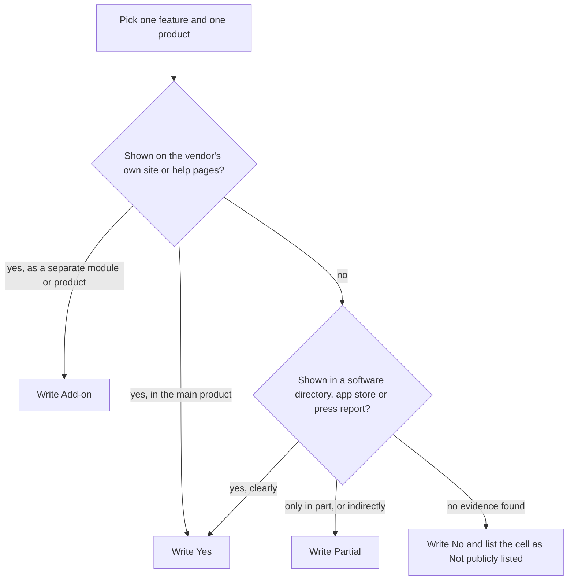
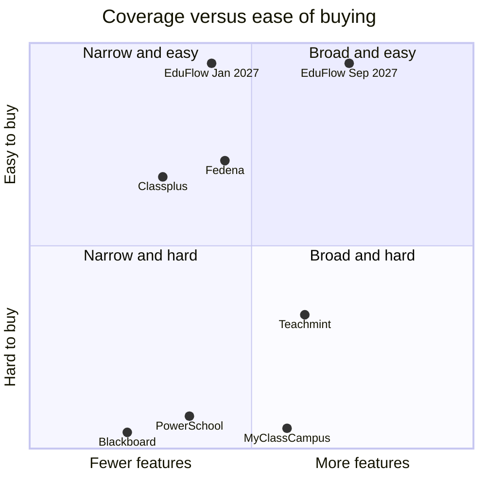

# Feature Comparison Matrix

**In simple words:** This chapter puts EduFlow next to six known products and checks 76 features one by one. It shows where EduFlow will be stronger, where it will be weaker, and what is still only a plan. The founder can use it to decide what to build first and what to say in a demo. Every competitor fact comes from public pages and must be checked again before any outside use.

## How to read this matrix

The matrix has ten feature groups. Each group has one table. Every table has the same eight columns: the feature, EduFlow, and the six competitors that are fixed for all EduFlow documents. The story of each competitor (history, funding, customers, strengths and weaknesses) is in *Competitor Analysis*. This chapter only checks features.

Three short terms appear often:

- **ERP** (enterprise resource planning) is one software for all the office work of an institute.
- **SIS** (student information system) is the master record of students, classes, attendance and marks.
- **LMS** (learning management system) is software that delivers online lessons, content and quizzes.

### The products in the columns

| Product | What it is in September 2026 | Evidence used in this chapter |
|---|---|---|
| EduFlow | Our planned product: 34 modules in four phases. Nothing is live on the document date. | The EduFlow canon and *Business Objectives, Scope and Stakeholders* |
| Teachmint | Indian platform. Its school ERP was listed with many modules. Its public site now leads with Teachmint X classroom boards. | Teachmint site, SoftwareSuggest, Software Finder, third-party articles |
| Classplus | Indian app platform for coaching owners. Strong in branded apps, live classes and course selling. | App Store listing, GetApp, SoftwareSuggest, Edmingle pricing article |
| PowerSchool | Large K-12 suite from the USA. The SIS is the core. Other products are sold separately. | PowerSchool product pages, PowerSchool help pages, Capterra |
| Blackboard (Anthology) | An LMS company. It sold its SIS and ERP business to Ellucian on 31 December 2025. | Blackboard product page, Campus Technology, Anthology help pages |
| Fedena | Indian school ERP with 22 core modules and 39 add-on modules. Open price list. | Fedena feature tour, pricing page and integrations page |
| MyClassCampus | Indian ERP with 40+ modules. Bought by Teachmint in January 2022. Its website now redirects to teachmint.com. | Software directories, StartupTalky, Free Press Journal |

### The four cell words

| Cell word | Meaning for a competitor | Meaning for EduFlow |
|---|---|---|
| Yes | Public information shows the feature in the main product | In scope for the phase written in the feature name |
| Add-on | Sold as a separate module, plugin or product | Sold as a paid add-on on top of a plan |
| Partial | Only a part exists, or the evidence is indirect | Only a part is in scope; the note under the table says which part |
| No | Not offered, or not publicly listed | Not in any of the four phases |

A `Yes` can still depend on the plan. For EduFlow the plan is written in the feature name, for example "Pro plan and above". For competitors the plan is often unknown.

### The phase tags in the feature names

| Tag | Meaning | Ready by |
|---|---|---|
| (P1) | Phase 1, the MVP (minimum viable product — the smallest version we can sell) | 3 Dec 2026; paid launch in January 2027 |
| (P2) | Phase 2, version 1.0 | 1 Feb 2027 |
| (P3) | Phase 3, version 1.5 | June 2027 |
| (P4) | Phase 4, version 2.0 | September 2027 |
| (future scope) | Listed as future scope in *Business Objectives, Scope and Stakeholders* | Year 2 or later, only when its trigger is met |
| (not planned) | Out of scope by choice | No date |

> **Rule:** The EduFlow column shows a plan, not a live product. On the document date (20 September 2026) no EduFlow feature is live. A `Yes` with (P3) or (P4) is a promise for 2027. Never present it to a customer as working software before it ships.

### How one cell is decided

**Figure: Decision steps for one competitor cell**

We first look at the vendor's own pages. If they are silent, we look at software directories, app store listings and press reports. If nothing supports the feature, we write `No` and name the cell in the "Not publicly listed" line under the table. So a `No` for a competitor can mean "they do not have it" or "we could not find it".

### Status notes before you read the tables

> **Warning:** Teachmint's ERP status is unclear. Third-party articles in 2026 say Teachmint's website now shows only Teachmint X classroom hardware, and one vendor blog says the school ERP service stops from April 2026. We found no official notice from Teachmint. Its ERP feature page returned an error when we opened it on 21 September 2026. The Teachmint column shows the last publicly listed ERP feature set. Check the current status before you name Teachmint in any sales talk.

> **Note:** MyClassCampus has been part of Teachmint since January 2022. On 21 September 2026 the address myclasscampus.com redirected to teachmint.com. The MyClassCampus column is built from software directories and press reports, so treat it as the last known feature set of that brand.

> **Note:** Anthology filed for Chapter 11 (a US court process to reorganize debts) in 2025 and sold its SIS and ERP business to Ellucian. The sale closed on 31 December 2025. Its CRM products went into a separate sale with Encoura as the first bidder. So the Blackboard column describes LMS products only. This is why it has many `No` cells for office work.

> **Note:** Fedena's feature tour splits its modules into "core" and "addon". Its pricing page groups the extra modules into the Standard, Premium and Ultimate plans. So `Add-on` in the Fedena column means "not in the core set; it needs a higher plan or a plugin". Ask Fedena which plan holds which module before you quote this.

## Admissions, CRM and student records

CRM (customer relationship management) here means a list of admission enquiries with follow-up dates. At Sharma Classes, Rajesh Sharma gets about 40 walk-in and phone enquiries in a busy week (an illustration, not a measured number). Today they live in a diary. This group checks who can turn that diary into a tracked list, and who holds the full student record after admission.

| Feature | EduFlow | Teachmint | Classplus | PowerSchool | Blackboard | Fedena | MyClassCampus |
|---|---|---|---|---|---|---|---|
| Enquiry and lead tracking with follow-ups (P1) | Yes | Yes | Yes | No | No | Add-on | Yes |
| Online admission or application form (P1) | Yes | Yes | No | Add-on | No | Add-on | Yes |
| Student profile with guardians and documents (P1) | Yes | Yes | Partial | Yes | No | Yes | Yes |
| Bulk student import from Excel or CSV (P1) | Yes | No | No | Yes | Partial | Add-on | No |
| Courses, batches and sections (P1) | Yes | Yes | Yes | Yes | Partial | Yes | Yes |
| Certificates from templates: bonafide, transfer, character (P2) | Yes | Yes | No | Partial | No | Yes | No |
| Student ID card generation (not planned) | No | Yes | No | No | No | Yes | Yes |

Not publicly listed (marked `No`): Teachmint bulk import; Classplus online admission form and bulk import; PowerSchool lead tracking and ID cards; MyClassCampus bulk import and certificates.

Notes on the cells:

- PowerSchool sells online registration as a separate product called PowerSchool Enrollment, so the cell is `Add-on`.
- Fedena lists "Enquiry and Registration", "Custom Import" and "Data Management" as add-on modules.
- Blackboard can load users and course enrolments in bulk, but it holds no admission or guardian record. So it gets `Partial` for import and for courses.
- EduFlow has no ID card generator in the first four phases. The Certificates module (P2) covers bonafide, transfer, character, course completion, merit and fee certificates.

What this table tells us: the Indian ERPs already cover admissions well. EduFlow must match them on day one. Its edge in this group is the Excel import in Phase 1, which makes one-day onboarding possible.

## Attendance

Attendance is the most used feature of any school product. Priya Nair will mark Class 10-A every morning. Sunita Devi wants a message within minutes if Aarav Sharma is absent.

| Feature | EduFlow | Teachmint | Classplus | PowerSchool | Blackboard | Fedena | MyClassCampus |
|---|---|---|---|---|---|---|---|
| Daily or period-wise student attendance (P1) | Yes | Yes | Yes | Yes | Yes | Yes | Yes |
| Teacher marks attendance on a phone (P1) | Yes | Yes | Yes | Partial | Partial | Add-on | Yes |
| Instant absence alert to parents (P1) | Yes | Yes | Partial | Add-on | No | Yes | Yes |
| Attendance reports and low-attendance list (P1) | Yes | Yes | Yes | Yes | Partial | Yes | Yes |
| Biometric or RFID device integration (future scope) | No | Partial | No | No | No | Yes | Yes |

Not publicly listed (marked `No`): Classplus and PowerSchool biometric integration.

Notes on the cells:

- In EduFlow the teacher marks attendance in the mobile-friendly web app. There is no separate teacher app before Phase 4.
- PowerSchool sends attendance calls and messages through PowerSchool Communications (SchoolMessenger), a separate product.
- Fedena's mobile app is sold as an add-on. Its SMS module is a core module, so absence SMS is `Yes`.
- Teachmint gets `Partial` for biometric because only one third-party listing mentions biometric options for staff attendance.
- Biometric and RFID integration is future scope for EduFlow (Year 2), and only after a hardware partner is found.

What this table tells us: attendance is table stakes (a feature every product must have, so it wins no deals). Nobody wins on attendance alone. EduFlow loses one row, biometric devices, to Fedena and MyClassCampus. Mid-size schools that already own a biometric machine will ask about it.

## Academics and exams

This group covers the teaching side: subjects, timetable, homework, exams and report cards. It also covers online teaching, where some competitors started their business.

| Feature | EduFlow | Teachmint | Classplus | PowerSchool | Blackboard | Fedena | MyClassCampus |
|---|---|---|---|---|---|---|---|
| Subjects and teacher allocation (P1) | Yes | Yes | Partial | Yes | Partial | Yes | Yes |
| Timetable with teacher clash check (P2) | Yes | Yes | Partial | Yes | No | Yes | Yes |
| Homework and assignments with files (P2) | Yes | Yes | Yes | Yes | Yes | Add-on | Yes |
| Exam schedule and marks entry (P2) | Yes | Yes | Partial | Yes | Yes | Yes | Yes |
| Report cards as PDF from templates (P2) | Yes | Yes | No | Yes | No | Yes | Yes |
| Online tests with auto-checking (future scope) | No | Yes | Yes | Add-on | Yes | Add-on | Partial |
| Built-in live classes (not planned; link only) | No | Yes | Yes | No | Partial | Add-on | Yes |
| Selling recorded courses and test series (not planned) | No | Partial | Yes | No | No | No | No |
| Course content library, LMS style (links only, P2) | Partial | Yes | Yes | Add-on | Yes | Add-on | Partial |

Not publicly listed (marked `No` or `Partial`): MyClassCampus online test details; Blackboard live classes (no live class tool is on its product page today).

Notes on the cells:

- EduFlow records marks of offline tests, with coaching test scores and ranks, in the Exams module (P2). It has no online test engine. That is future scope for Year 2.
- EduFlow gets `Partial` for content because Homework (P2) accepts files and links to YouTube or Google Drive. It does not host video.
- PowerSchool report cards follow North American formats. They are not built for CBSE or ICSE style.
- PowerSchool sells its LMS (Schoology) and its assessment tool as separate products.
- Fedena lists "Online Examination", "Student Assignment Management", "Google Meet Integration" and "BigBlueButton Integration" as add-on modules.
- Classplus is built around live classes, recorded courses and a test portal. Offline exam schedules and report cards are not its focus.

What this table tells us: on academics EduFlow will equal the ERPs only after Phase 2 (1 February 2027). On online teaching EduFlow chooses to lose. The reasons are given in *Problem Statement and Proposed Solution*.

## Fees and payments

Fees decide the sale. Suresh Gupta collects cash, cheques and UPI at the counter. Rajesh Sharma wants to know tonight how much came in today and who still owes money.

| Feature | EduFlow | Teachmint | Classplus | PowerSchool | Blackboard | Fedena | MyClassCampus |
|---|---|---|---|---|---|---|---|
| Fee structures with installments (P1) | Yes | Yes | Partial | Partial | No | Yes | Yes |
| Counter collection with receipt: cash, cheque, UPI (P1) | Yes | Yes | Partial | Partial | No | Yes | Yes |
| Online fee payment by parents (P1; Growth plan and above) | Yes | Yes | Yes | Yes | No | Add-on | Yes |
| UPI and Indian payment gateways (P1) | Yes | Yes | Yes | No | No | Add-on | Yes |
| Automatic fee reminders (P1) | Yes | Yes | Yes | No | No | Add-on | Partial |
| Discounts, concessions and late fee rules (P1) | Yes | Yes | No | No | No | Yes | No |
| Scholarships linked to the fee invoice (P2) | Yes | No | No | No | No | No | No |
| Day-end cash close and gateway reconciliation (P1) | Yes | No | No | No | No | Partial | Partial |
| Full accounting or Tally integration (not planned; Excel export) | No | Partial | No | Add-on | No | Add-on | Partial |
| Student wallet or canteen payments (not planned) | No | No | No | Yes | No | No | Yes |

Not publicly listed (marked `No`): Teachmint scholarships, day-end close and wallet; Classplus discounts, scholarships and day-end close; PowerSchool reminders, discounts, scholarships and day-end close; Fedena scholarships and wallet; MyClassCampus discounts and scholarships.

Notes on the cells:

- Gateway reconciliation means matching every online payment with the money that reaches the bank account. Day-end close means the accountant confirms that cash in the drawer equals the receipts of the day.
- PowerSchool handles school fees, online payment and meal funds for North American schools. It has no UPI.
- Fedena lists "Payment Gateway Integration", "Reminder", "Tally Integration" and "QuickBooks Integration" as add-on modules. "Instant Fees" is also an add-on.
- MyClassCampus listings mention online fee payment with passbook and settlement reports, a student wallet and a canteen module.
- EduFlow does not do full accounting. The accountant exports collections to Excel and enters them in Tally. A Tally export format is future scope for Year 2.

> **Example:** Sharma Classes charges ₹48,000 for the JEE Main 2028 course in 4 installments of ₹12,000. With the (P1) rows above, EduFlow creates the 4 invoices, sends a WhatsApp reminder 3 days before each due date, takes ₹12,000 by UPI, prints the receipt and shows the amount in tonight's day-end close. All five steps are Phase 1.

What this table tells us: this is EduFlow's strongest group, and every `Yes` but one is in Phase 1. The two rows that may be unique, scholarships and day-end close, rest on "not publicly listed" cells. So verify them in live demos of competitor products before you claim them.

## Communication

Indian parents read WhatsApp, not email. Bulk SMS in India needs DLT registration (a TRAI rule: every sender name and message template must be registered before sending).

| Feature | EduFlow | Teachmint | Classplus | PowerSchool | Blackboard | Fedena | MyClassCampus |
|---|---|---|---|---|---|---|---|
| In-app notices and announcements (P1) | Yes | Yes | Yes | Yes | Yes | Yes | Yes |
| WhatsApp messages through the official API (P1; Growth plan and above) | Yes | Partial | Partial | No | No | No | Partial |
| Bulk SMS to parents (P2; DLT templates in India) | Yes | Partial | Yes | Add-on | No | Yes | Yes |
| Bulk email with logs (P2) | Yes | No | No | Add-on | Yes | Add-on | Yes |
| Two-way chat between teacher and parent or student (not planned) | No | Yes | Yes | Add-on | Yes | Yes | No |
| Voice call broadcast (not planned) | No | No | No | Add-on | No | No | Yes |

Not publicly listed (marked `No`): Teachmint bulk email and voice calls; Classplus bulk email and voice calls; Fedena WhatsApp and voice calls; MyClassCampus two-way chat.

Notes on the cells:

- EduFlow sends WhatsApp messages through Meta's WhatsApp Cloud API. The institute buys credit packs of ₹499, ₹1,999 or ₹7,999. Each message costs Meta's price plus a 15% margin.
- The three `Partial` cells for WhatsApp rest on thin evidence. A third-party article says Teachmint boards share lesson notes with parents over WhatsApp. A third-party price page says Classplus charges WhatsApp and SMS credits separately. A directory listing says MyClassCampus sends fee receipts by WhatsApp link. None of the three shows an official API integration.
- Fedena's integrations page lists SMS, payment gateway, GPS, biometric and video tools. WhatsApp is not on it.
- PowerSchool Communications (SchoolMessenger) covers SMS, email, voice calls and two-way messages as a separate product.
- EduFlow has no chat in the four phases. Our reasoning: open chat between teachers and parents creates moderation work and child-safety risk. Parents get notices and alerts. They reply by phone or in person. We review this in Year 2.

What this table tells us: official WhatsApp messaging in Phase 1 is EduFlow's clearest gap to exploit in this group. It is also the easiest for a competitor to copy, so the lead may last only 12 to 18 months (Estimate).

## Portals and mobile apps

A portal is a login area for one type of user. This group checks what parents, students and teachers get, and whether the institute can have an app with its own name.

| Feature | EduFlow | Teachmint | Classplus | PowerSchool | Blackboard | Fedena | MyClassCampus |
|---|---|---|---|---|---|---|---|
| Parent portal in the phone browser (P1) | Yes | Yes | Partial | Yes | Partial | Yes | Yes |
| Student portal (P2) | Yes | Yes | Yes | Yes | Yes | Yes | Yes |
| Parents see homework, marks and report cards (P2) | Yes | Yes | Partial | Yes | Partial | Yes | Yes |
| Teacher access on a phone (P1) | Yes | Yes | Yes | Partial | Yes | Add-on | Yes |
| Vendor's own Android and iOS apps (EduFlow: mobile web until P4) | No | Yes | Yes | Yes | Yes | Add-on | Yes |
| White-label mobile app with the institute's name (P4) | Add-on | No | Yes | No | No | No | No |
| Institute website builder (not planned) | No | Yes | Yes | No | No | No | Yes |

Not publicly listed (marked `No`): white-label apps for Teachmint, Blackboard, Fedena and MyClassCampus.

Notes on the cells:

- White-label means the app carries the institute's name and logo, not the vendor's.
- EduFlow's white-label app is a paid add-on: ₹49,999 setup plus ₹4,999 a month on Growth and Pro. It is planned for Phase 4 (September 2027).
- Until Phase 4, EduFlow users open the web app in the phone browser. There is no EduFlow app in the Play Store or App Store. This is an honest weakness in demos, because Indian buyers often ask "Where is the app?".
- Classplus is built around the branded app. Public listings say the app and a website are part of its entry plan.
- PowerSchool Mobile is for parents and students. Teachers mainly use the web gradebook, so teacher phone access is `Partial`.

What this table tells us: on apps EduFlow is behind every Indian competitor until Phase 4. The answer for 2027 is a fast mobile web app with OTP login (a one-time password sent to the phone) and WhatsApp alerts that open the right page in one tap.

## Operations: library, transport, hostel and inventory

These modules matter to schools, not to most coaching institutes. Bright Future Public School runs buses and a library. Sharma Classes needs neither.

| Feature | EduFlow | Teachmint | Classplus | PowerSchool | Blackboard | Fedena | MyClassCampus |
|---|---|---|---|---|---|---|---|
| Library catalogue, issue, return and fines (P3) | Yes | Yes | No | Partial | No | Add-on | Yes |
| Transport routes, stops and transport fee (P3) | Yes | Yes | No | No | No | Add-on | Yes |
| Live GPS bus tracking (future scope) | No | Yes | No | No | No | Add-on | Yes |
| Hostel rooms, beds and hostel fee (P3) | Yes | Yes | No | No | No | Add-on | Yes |
| Inventory and stock with low-stock alert (P3) | Yes | Yes | No | Partial | No | Add-on | Yes |
| Purchase orders and vendors (P3) | Yes | No | No | Add-on | No | Add-on | No |
| Gate pass and visitor log (hostel visitor log only, P3) | Partial | No | No | No | No | Add-on | Yes |

Not publicly listed (marked `No`): Teachmint purchase orders and gate pass; MyClassCampus purchase orders.

Notes on the cells:

- Every EduFlow `Yes` in this table is Phase 3 (June 2027) and needs the Pro plan or above.
- Fedena sells Library, Transportation, Hostel, Inventory and Gate Management as add-on modules. This is why its `Yes` count here is zero although it covers almost every row.
- MyClassCampus listings describe app-based vehicle tracking without a GPS device, plus bus attendance.
- PowerSchool's SIS page mentions asset management and a directory lists library management. Both are thin, so they are `Partial`.
- GPS bus tracking is future scope for EduFlow (Year 2 to Year 3, through a partner).

What this table tells us: in January 2027 EduFlow has nothing to show a school in this group. Do not lead school demos with operations before June 2027. For coaching institutes this group does not matter.

## HR and payroll

HR (human resources) covers staff records, staff attendance, leave and salary. Payroll is the monthly salary run with payslips.

| Feature | EduFlow | Teachmint | Classplus | PowerSchool | Blackboard | Fedena | MyClassCampus |
|---|---|---|---|---|---|---|---|
| Teacher and staff records (teachers P1, other staff P2) | Yes | Yes | Partial | Yes | No | Yes | Yes |
| Staff attendance (P2) | Yes | Yes | No | Add-on | No | Yes | Yes |
| Leave requests and approvals (P2) | Yes | Yes | No | Add-on | No | Yes | Partial |
| Payroll run and payslips (P3) | Yes | Yes | No | Add-on | No | Yes | Yes |
| Staff self-service on the phone: payslips and leave (P3) | Yes | Yes | No | Add-on | No | Partial | No |
| Recruitment and applicant tracking (not planned) | No | No | No | Add-on | No | No | No |

Not publicly listed (marked `No` or `Partial`): MyClassCampus leave details and staff self-service; Teachmint and Fedena recruitment.

Notes on the cells:

- Teachmint's HR and payroll cells rest on its own blog, which describes an HRMS portal for staff attendance, and on one third-party listing that describes leave, payroll and payslips on the phone.
- PowerSchool sells "Recruiting and HR" and "ERP Systems" as separate products built for North American school districts.
- Fedena's Human Resources module is a core module. It covers payroll and payslips. Staff use a web login, and the mobile app is an add-on, so self-service on the phone is `Partial`.
- EduFlow Payroll (P3) shows basic PF, ESI and TDS fields on the payslip. It does not file statutory returns. The institute's chartered accountant files them.

What this table tells us: HR and payroll are a Phase 3 story for EduFlow. Fedena, Teachmint and MyClassCampus already list them. EduFlow only reaches parity here. It does not lead.

## Analytics and AI

Analytics means charts and reports that help the owner decide. AI (artificial intelligence) here means software that finds patterns or writes text by itself.

| Feature | EduFlow | Teachmint | Classplus | PowerSchool | Blackboard | Fedena | MyClassCampus |
|---|---|---|---|---|---|---|---|
| Role-based dashboards (P1) | Yes | Yes | Partial | Yes | Partial | Yes | Yes |
| Standard reports: fees, attendance, admissions (P1 basic, P2 full) | Yes | Yes | Partial | Yes | Partial | Yes | Yes |
| Custom report builder and scheduled reports (P2; advanced on Pro) | Yes | No | Partial | Yes | Add-on | Add-on | No |
| Combined analytics across campuses (P2; Pro plan and above) | Yes | No | No | Add-on | Add-on | Add-on | Partial |
| AI risk alerts: fee default, attendance drop, at-risk students (P4) | Add-on | No | No | Add-on | Partial | No | No |
| AI assistant for teachers: lesson plans and quizzes (not planned) | No | Yes | No | Add-on | Yes | No | No |
| Plain-language questions on your own data (P4) | Add-on | No | No | Add-on | No | No | No |

Not publicly listed (marked `No`): Teachmint custom reports and cross-campus analytics; Classplus AI features; Fedena AI features; MyClassCampus custom reports and AI features.

Notes on the cells:

- EduFlow AI Insights is Phase 4 (September 2027). It costs ₹1,499 a month on Growth and Pro and is included in Enterprise. It reads attendance and fee data. It never uses cameras.
- Teachmint's EduAI makes lesson plans, homework and quizzes. It is sold with Teachmint X classroom boards.
- Blackboard lists an AI Design Assistant for course building and an AI Virtual Assistant (AVA). Its analytics product is called Illuminate.
- PowerSchool lists PowerBuddy as its AI assistant, and "Analytics and Insights" as a separate product. We did not verify the exact scope of each.
- No Indian ERP in this set publicly lists fee-default prediction. This is a possible gap, but it is a Phase 4 plan for us, not a fact.

What this table tells us: AI is where the global players invest. EduFlow should not claim an AI lead in 2027. The honest message is: "Your daily numbers are on one screen from day one. Smart alerts come later as an add-on."

## Platform

Platform features decide how the product is bought, connected and trusted. A few terms:

- **RBAC** (role-based access control) means each role sees only what it should.
- **API** (application programming interface) is a way for other software to read and write data.
- **SSO** (single sign-on) means staff log in with their Google or Microsoft account.

| Feature | EduFlow | Teachmint | Classplus | PowerSchool | Blackboard | Fedena | MyClassCampus |
|---|---|---|---|---|---|---|---|
| Multi-campus under one login (built in P1; Pro plan and above) | Yes | Partial | No | Yes | Partial | Add-on | Yes |
| Role-based access with custom roles (system roles P1; custom roles P2, Pro plan) | Yes | Yes | No | Yes | Yes | Yes | No |
| Public REST API with API keys (P4; Enterprise plan) | Yes | No | No | Yes | Yes | Add-on | No |
| Single sign-on with Google or Microsoft (P4; Enterprise plan) | Yes | No | No | Yes | Yes | Add-on | No |
| White-label branding: own logo and domain (P4; Enterprise plan) | Yes | No | Yes | Partial | Yes | Add-on | No |
| Self-service data export to Excel or CSV (P1) | Yes | No | No | Yes | Partial | Add-on | No |
| Interface in more than one language (EduFlow: English at P1; Hindi pack planned) | Partial | Yes | Partial | Yes | Yes | Yes | No |
| Public price list on the vendor's own website (P1) | Yes | No | Partial | No | No | Yes | No |
| Free plan with no time limit (P1) | Yes | Partial | Yes | No | No | Partial | No |
| Self-serve signup and same-day start (P1) | Yes | Partial | Partial | No | No | Partial | No |
| Built for both coaching institutes and schools (P1) | Yes | Partial | Partial | Partial | No | Yes | Yes |
| Open-source or self-hosted option (not planned; cloud only) | No | No | No | Partial | Partial | Yes | No |

Not publicly listed (marked `No`): Teachmint API, SSO, white-label and data export; Classplus multi-campus, custom roles, API, SSO and data export; MyClassCampus custom roles, API, SSO, white-label, data export, languages, free plan and self-serve signup.

Notes on the cells:

- EduFlow builds multi-campus in Phase 1. Starter and Growth allow 1 campus. Pro allows up to 3. An extra campus costs ₹999 a month.
- EduFlow screens are in English at launch. Hindi WhatsApp templates are an assumption for Phase 1. A Hindi and English interface pack is planned no earlier than Phase 4. Until it ships, the honest cell is `Partial`.
- Teachmint listings show 8 interface languages, including Hindi, Bengali, Tamil and Telugu. One listing mentions sub-institutes for branches, so multi-campus is `Partial`.
- Fedena sells "Multi-School", "Fedena Integration Platform", "Google SSO", "Azure Integration", "Theme" and "Data Export" as add-ons. It also offers a free open-source edition and gives source code on its Enterprise plan.
- PowerSchool lists 75+ certified integrations and API partnerships. Its help pages describe SAML single sign-on. Blackboard help pages describe REST APIs, LTI 1.3 and SAML login.
- Classplus gets `Partial` for price because plan prices appear on third-party pages, while live-class credit prices are not published.
- For "both coaching and schools", `Yes` means the product is sold to both. `Partial` means it clearly serves only one of the two.

What this table tells us: open pricing, a free plan and same-day signup are rare in this set. Only Fedena publishes prices on its own site. None of the six shows all three together. This is a go-to-market gap more than a software gap, and it is available from day one.

## Scoring summary

This section counts the cells. A count is a rough tool. It treats every feature as equal, which is not true for any real buyer. The worked examples later in this chapter add weights.

### Count of Yes per product per group

The number in brackets after each group name is the number of features in that group.

| Feature group | EduFlow | Teachmint | Classplus | PowerSchool | Blackboard | Fedena | MyClassCampus |
|---|---|---|---|---|---|---|---|
| Admissions, CRM and student records (7) | 6 | 6 | 2 | 3 | 0 | 4 | 5 |
| Attendance (5) | 4 | 4 | 3 | 2 | 1 | 4 | 5 |
| Academics and exams (9) | 5 | 8 | 5 | 5 | 4 | 4 | 6 |
| Fees and payments (10) | 8 | 6 | 3 | 2 | 0 | 3 | 5 |
| Communication (6) | 4 | 2 | 3 | 1 | 3 | 3 | 4 |
| Portals and mobile apps (7) | 4 | 6 | 5 | 4 | 3 | 3 | 6 |
| Operations (7) | 5 | 5 | 0 | 0 | 0 | 0 | 6 |
| HR and payroll (6) | 5 | 5 | 0 | 1 | 0 | 4 | 3 |
| Analytics and AI (7) | 4 | 3 | 0 | 3 | 1 | 2 | 2 |
| Platform (12) | 10 | 2 | 2 | 6 | 5 | 5 | 2 |
| **Total Yes (76)** | **55** | **47** | **23** | **27** | **17** | **32** | **44** |
| Share of 76 features | 72% | 62% | 30% | 36% | 22% | 42% | 58% |

### All four cell words per product

| Product | Yes | Add-on | Partial | No | In some form (Yes + Add-on + Partial) |
|---|---|---|---|---|---|
| EduFlow (full plan, September 2027) | 55 | 3 | 3 | 15 | 61 |
| Teachmint | 47 | 0 | 9 | 20 | 56 |
| Classplus | 23 | 0 | 18 | 35 | 41 |
| PowerSchool | 27 | 19 | 10 | 20 | 56 |
| Blackboard | 17 | 2 | 14 | 43 | 33 |
| Fedena | 32 | 29 | 4 | 11 | 65 |
| MyClassCampus | 44 | 0 | 8 | 24 | 52 |

Two products look very different in the second table. Fedena covers 65 of 76 features in some form, more than anyone, but 29 of them are add-on modules. PowerSchool covers 56 in some form, but 19 are separate products. For a small institute, each add-on is one more price talk and one more setup.

### EduFlow by phase: the honest view

The 55 in the first table is the full plan. It is not what a customer can buy at launch. The table below shows how the count grows.

| Point in time | Phases live | EduFlow Yes (running total) | Share of 76 | Competitors with more Yes |
|---|---|---|---|---|
| Document date, 20 Sep 2026 | None | 0 | 0% | All six |
| Paid launch, January 2027 | P1 | 31 | 41% | Teachmint 47, MyClassCampus 44, Fedena 32 |
| 1 Feb 2027 | P1 and P2 | 45 | 59% | Teachmint 47 |
| June 2027 | P1 to P3 | 52 | 68% | None |
| September 2027 | P1 to P4 | 55, plus 3 add-ons | 72% | None |

The formula is simple: count the rows where the EduFlow cell is `Yes` and the first phase tag in the feature name is live. Phase 1 gives 31 rows, Phase 2 adds 14, Phase 3 adds 7 and Phase 4 adds 3. The three Phase 4 add-ons are the white-label mobile app and two AI Insights rows.

> **Warning:** The competitor counts are frozen at September 2026. Competitors will also ship features during 2027. Do not tell anyone "we have more features than Teachmint". In January 2027 that will be false, and it may stay false.

### Four limits of these scores

1. **We chose the rows.** The 76 features reflect what small Indian institutes ask for. A list written by a US school district would have state reporting, special education and transcripts, and PowerSchool would win it easily.
2. **A `No` may be a gap in our search.** Under the ten tables we list about 70 cells as "Not publicly listed". If even half of them are really `Yes`, the Teachmint and MyClassCampus totals pass 50.
3. **Depth is invisible.** A `Yes` for report cards says nothing about how many board formats are ready. Only a live demo shows depth.
4. **Plans are not products.** Every competitor `Yes` is something a customer can use today. Every EduFlow `Yes` is a line in a build plan.

### Coverage and buying ease on one picture

**Figure: Feature coverage against ease of buying (September 2026 data; EduFlow values are targets)**

The left-to-right position is the share of `Yes` cells out of 76. The up-down position uses three Platform rows: public price list, free plan and self-serve signup. `Yes` gives 1 point, `Partial` gives 0.5, and the sum is divided by 3. A few dots are moved slightly so that their labels do not overlap. EduFlow's plan is to sit in the top-right corner, where no competitor sits today. At launch it sits top-centre, above Fedena.

## Worked examples: a weighted score for two buyers

A real buyer does not count 76 features. He cares about ten or twelve. So we give each feature a weight, and the weights add up to 100.

> **Rule:** Points for one feature = weight × cell value. The cell values are: `Yes` = 1, `Add-on` = 0.5, `Partial` = 0.5, `No` = 0. The product score is the sum of all points. The maximum is 100.

### Buyer one: Sharma Classes, Patna

Rajesh Sharma runs a JEE and NEET coaching institute with 350 students. He needs the fee counter, reminders, attendance alerts and enquiry follow-up. The weights are our estimate from the needs described in *Customer Personas*.

| Feature | Weight | EduFlow (P1) | Teachmint | Classplus | Fedena | MyClassCampus |
|---|---|---|---|---|---|---|
| Fee structures with installments | 15 | 15 | 15 | 7.5 | 15 | 15 |
| Counter collection with receipt | 10 | 10 | 10 | 5 | 10 | 10 |
| UPI and Indian payment gateways | 10 | 10 | 10 | 10 | 5 | 10 |
| Automatic fee reminders | 10 | 10 | 10 | 10 | 5 | 5 |
| Teacher marks attendance on a phone | 10 | 10 | 10 | 10 | 5 | 10 |
| Instant absence alert to parents | 10 | 10 | 10 | 5 | 10 | 10 |
| WhatsApp through the official API | 10 | 10 | 5 | 5 | 0 | 5 |
| Enquiry and lead tracking | 10 | 10 | 10 | 10 | 5 | 10 |
| Multi-campus under one login | 5 | 5 | 2.5 | 0 | 2.5 | 5 |
| Public price list | 5 | 5 | 0 | 2.5 | 5 | 0 |
| Online tests with auto-checking | 5 | 0 | 5 | 5 | 2.5 | 2.5 |
| **Total** | **100** | **95** | **87.5** | **70** | **65** | **82.5** |

What this means: all 95 EduFlow points come from Phase 1. So this score is true at the paid launch in January 2027. A coaching owner gets almost everything he needs from the MVP. This supports the choice of coaching as the first wedge (the narrow first market we enter before we widen). The only loss is online tests. Multi-campus needs the Pro plan, but at 350 students Rajesh Sharma is on Pro already.

### Buyer two: Bright Future Public School, Lucknow

Dr. Anita Verma's school has 1,200 students and 2 campuses. It needs report cards, transport, payroll and an app. Here EduFlow is scored at three dates.

| Feature | Weight | EduFlow Jan 2027 | EduFlow Feb 2027 | EduFlow June 2027 | Teachmint | Fedena | MyClassCampus |
|---|---|---|---|---|---|---|---|
| Fee structures with installments | 12 | 12 | 12 | 12 | 12 | 12 | 12 |
| UPI and Indian payment gateways | 10 | 10 | 10 | 10 | 10 | 5 | 10 |
| Report cards as PDF | 12 | 0 | 12 | 12 | 12 | 12 | 12 |
| Exam schedule and marks entry | 8 | 0 | 8 | 8 | 8 | 8 | 8 |
| Timetable with clash check | 6 | 0 | 6 | 6 | 6 | 6 | 6 |
| Parent portal | 10 | 10 | 10 | 10 | 10 | 10 | 10 |
| Transport routes and fee | 10 | 0 | 0 | 10 | 10 | 5 | 10 |
| Payroll run and payslips | 10 | 0 | 0 | 10 | 10 | 10 | 10 |
| Multi-campus under one login | 8 | 8 | 8 | 8 | 4 | 4 | 8 |
| Library | 4 | 0 | 0 | 4 | 4 | 2 | 4 |
| Biometric or RFID integration | 5 | 0 | 0 | 0 | 2.5 | 5 | 5 |
| Vendor's own Android and iOS apps | 5 | 0 | 0 | 0 | 5 | 2.5 | 5 |
| **Total** | **100** | **40** | **66** | **90** | **93.5** | **81.5** | **100** |

What this means: a mid-size school is a poor fit in January 2027 (40 points). It is a fair fit from February 2027 (66) and a good fit from June 2027 (90). Even then, a broad Indian ERP equals or beats EduFlow on the checklist. So EduFlow cannot win schools on feature count. It must win on open price, a one-day start, WhatsApp, data export and support. This matches the rollout order in *Customer Segments and Ideal Customer Profile*: coaching first, schools after Phase 2.

> **Founder note:** Change the weights for every serious prospect. Ask the owner to name his top ten needs and divide 100 points among them. It takes five minutes, and it moves the talk from "how many modules" to "what matters to you".

## Price and access facts behind three Platform rows

The rows "public price list", "free plan" and "self-serve signup" need evidence. This table records what we found. The full price comparison and the reasons for EduFlow's prices are in *Pricing Strategy*.

| Product | Public price information found | Where we found it | Free plan or trial |
|---|---|---|---|
| EduFlow | Starter ₹0; Growth ₹2,499 a month; Pro ₹5,999 a month; Enterprise from ₹14,999 a month; GST extra | EduFlow canon; public price page planned before January 2027 | Free forever up to 50 students |
| Teachmint | None on its own site; one directory shows "from $5 per user per year" with custom quotes | Software Finder | No free ERP plan listed; demo on request |
| Classplus | Entry plan reported at ₹19,999 a year plus GST; higher plans reported from ₹22,999 to ₹31,999; live-class credit prices not published | SoftwareSuggest; Edmingle (August 2026); search summaries | A free "Lite" tier is reported |
| PowerSchool | No price list; one directory shows a starting figure of $7 per user per month | Capterra | No free version, no free trial |
| Blackboard | No price list found | Blackboard product page | None found |
| Fedena | ₹50,000, ₹75,000 and ₹1,00,000 a year plus GST; Enterprise on quote | Fedena pricing page | 14-day free trial; free open-source edition |
| MyClassCampus | None on its own site; press reports say ₹100 to ₹150 per student per year (2021) and under ₹100 (2025) | StartupTalky; Techjockey | None found |

> **Example:** Sharma Classes has 350 students. Growth stops at 300 students, so it needs EduFlow Pro at ₹59,990 a year. Per-student pricing at ₹100 to ₹150 would cost ₹35,000 to ₹52,500 a year. Fedena Standard is ₹50,000 a year. So EduFlow is not the cheapest option at 350 students. At 280 students, Growth at ₹24,990 a year would be. Price openness is our gap to exploit. The lowest price is not.

## Key gaps we exploit

A gap is a row, or a set of rows, where EduFlow is `Yes` in Phase 1 or Phase 2 and most competitors are not. We list only gaps that a customer can feel.

| Gap | What the matrix shows | Who feels it | How EduFlow uses it |
|---|---|---|---|
| Open price, free plan and same-day signup together | None of the six shows all three. Only Fedena publishes prices on its own site. | Owners in Tier 2 and Tier 3 towns who never get a sales visit | Price page, free Starter plan for 50 students, signup without a sales call |
| Official WhatsApp messaging in Phase 1 | No competitor cell is `Yes`; three are `Partial` on thin evidence | Parents who ignore SMS and email | Fee reminders and absence alerts on WhatsApp from the first paid month |
| Fee counter depth for offline coaching | Classplus is `Partial` on fee structures and counter receipts, and `No` on discounts and day-end close | Coaching owners who collect cash and UPI at a desk | Demo the full path: invoice, reminder, UPI payment, receipt, day-end close |
| Core modules inside the plan | Fedena has 29 `Add-on` cells and PowerSchool has 19. EduFlow has 3. | Buyers tired of "that module costs extra" | Growth includes all Phase 1 and 2 modules; Pro adds all Phase 3 modules |
| One product for coaching and schools, with branches | Classplus lists no multi-campus; Fedena sells Multi-School separately | Owners with 2 or 3 centres; trusts that run a school and a coaching wing | Labels change by organization type; Pro covers 3 campuses; extra campus ₹999 a month |
| Data freedom | Self-service export is not publicly listed for three Indian rivals, and is an add-on at Fedena | Owners who fear lock-in after edtech pivots | Excel and CSV export in Phase 1; message: "your data is yours any day" |
| Global suites do not fit India | PowerSchool has no UPI and no WhatsApp. Blackboard has no office features after its 2025 sale. | Premium schools that compare global names | Indian payments, GST invoices, DLT SMS and local prices |
| Vendor direction risk | Teachmint leads with hardware; myclasscampus.com redirects to teachmint.com | Schools on those products that worry about support | Offer assisted data migration (₹9,999) to switchers; verify the facts first |

The last gap is the least certain and may be the most valuable. If Teachmint is really leaving school ERP, then two of the six columns in this chapter turn from competitors into a source of customers. Treat it as an assumption until a Teachmint customer or an official notice confirms it. Record it in *Assumptions, Open Questions and Validation Plan*.

## Where competitors are ahead and our answer

We lose these rows today, or we lose them until a later phase. Each one has a clear answer for a demo and a date to look again. The triggers come from *Business Objectives, Scope and Stakeholders*.

| Feature | Who is ahead | Why it matters | Our answer in 2027 | When we look again |
|---|---|---|---|---|
| Apps in the Play Store and App Store | Teachmint, Classplus, PowerSchool, Blackboard, MyClassCampus | Indian buyers ask "Where is the app?" | Fast mobile web, OTP login, WhatsApp alerts that open the right page | Phase 4: white-label app add-on |
| Online tests with auto-checking | Teachmint, Classplus, Blackboard; add-on at Fedena and PowerSchool | Coaching institutes sell test series | Record offline test marks and ranks in Exams (P2); link to any test tool | Year 2, if 30% or more of paying coaching customers ask |
| Live classes and course selling | Classplus, Teachmint, MyClassCampus | Extra income for coaching owners | Paste a Zoom or Google Meet link; use a content app next to EduFlow | Live classes: no plan. Marketplace: not before Year 3 |
| Biometric and RFID attendance | Fedena, MyClassCampus | Mid-size schools already own the machines | Phone marking takes under a minute per class | Year 2, when a hardware partner covers our cities |
| Live GPS bus tracking | Teachmint, MyClassCampus; add-on at Fedena | Parents worry about bus safety | Transport (P3) covers routes, stops, drivers and transport fees | Year 2 to Year 3, when 100 customers use Transport |
| ID card generation | Teachmint, Fedena, MyClassCampus | Schools print ID cards every April | Export the student list to Excel for the local card printer | After Phase 2, using Certificates usage data |
| Operations and payroll live today | Teachmint, MyClassCampus; Fedena with add-ons | Schools will not buy without them | Sell to coaching first; ship Phase 3 by June 2027 | June 2027 |
| Many interface languages | Teachmint, Fedena, PowerSchool, Blackboard | Clerks and parents read Hindi more easily | Simple English, icons, Hindi WhatsApp templates (assumption) | Hindi pack not before Phase 4; trigger is parent adoption under 70% |
| AI help for teachers | Teachmint, Blackboard; add-on at PowerSchool | It sounds modern in a sales pitch | Not our job. AI Insights (P4) helps the owner, not the lesson. | After Phase 4 |
| Two-way chat and voice calls | Teachmint, Classplus, Blackboard, Fedena for chat; MyClassCampus for calls | Some schools want parent replies inside the product | One-way alerts on WhatsApp; parents call the office | Year 2 review |
| Tally or accounting integration | Add-on at Fedena and PowerSchool | The accountant hates double entry | Clean Excel export of collections for Tally entry | Year 2, if 25% or more of accountants ask |
| API and SSO live today | PowerSchool, Blackboard; add-on at Fedena | Premium schools connect many tools | Enterprise plan from Phase 4 | September 2027 |
| Open-source or self-hosted option | Fedena; partly PowerSchool and Blackboard | A few trusts want the data on their own server | Cloud only; India data in AWS Mumbai; export any day | No plan |
| Student wallet and canteen | MyClassCampus, PowerSchool | Large residential schools | Not offered | No plan |

> **Tip:** Never hide a `No` in a demo. Say it first, then give the answer from the table. "We do not have live classes. Keep Zoom. Put the link in EduFlow and we tell the parents." Owners in small towns have heard many false promises. A clear "no" builds more trust than a vague "yes, it is coming".

## How to use and maintain this matrix

### Where it is used

| Use | Who | How |
|---|---|---|
| Decide build order | Founder | A row that loses deals and has a trigger in *Business Objectives, Scope and Stakeholders* moves up in *Five-Year Roadmap* |
| Prepare demos | Founder, later the sales team | Pick 10 to 12 rows per buyer type and weight them as in the worked examples |
| Answer "why not X?" | Anyone who talks to customers | Use the "competitors are ahead" table; battlecards are in *Sales Process and Playbooks* |
| Track risk | Founder | A competitor that turns a gap row to `Yes` is logged in *Risk Analysis and Mitigation* |

### Steps before any external use

1. Open each competitor's own website and help pages again. Note the date.
2. For every cell you want to quote, save a screenshot or the page address.
3. Book a live demo of Fedena, and of Teachmint or MyClassCampus if they still sell an ERP. Check the cells listed as "Not publicly listed" (about 70).
4. Ask 3 current users of each Indian competitor what they really use. The pilot institutes may know some.
5. Remove every EduFlow row that is not live on that day, or mark it clearly as "planned".
6. Do not publish a named comparison table on the EduFlow website in Year 1. Use it in one-to-one talks only. A wrong public claim about a competitor can bring a legal notice.

### Review rhythm

| Item | Decision | Reason |
|---|---|---|
| Owner | Founder in Year 1; product manager from Year 2 | One person must keep it true |
| How often | Every quarter: January, April, July and October | Matches the buying season before April |
| Time needed | About 4 hours per review (Estimate) | 6 competitors at 40 minutes each |
| Extra review | When a competitor is bought, pivots or shuts a product | One confirmed and one reported event of this kind happened in this set within 12 months |
| Version note | Add the review date and what changed at the top of the working copy | So old claims are not reused |

## Disclaimer

> **Warning:** Every competitor cell in this chapter is based on public information as of September 2026. Verify before external use. The sources are vendor websites, help pages, app store listings, software directories and press reports, opened on 21 September 2026. Some directory pages are out of date, and some are written by rival vendors. We did not log in to any competitor product. `No` can mean "not publicly listed". Prices from third parties are not official quotes.

The EduFlow column is a plan with dates. It is not a statement of live features. The counts, shares and weighted scores are tools for internal decisions. They are not claims for marketing. Product names belong to their owners.

## Key takeaways

- The matrix checks 76 features in 10 groups. The full EduFlow plan reaches 55 `Yes` cells by September 2027. At the paid launch in January 2027 it has 31, fewer than Teachmint (47), MyClassCampus (44) and Fedena (32).
- For a coaching institute the Phase 1 product already scores 95 out of 100 on a weighted list. For a 1,200-student school it scores 40 in January 2027, 66 in February 2027 and 90 in June 2027. This confirms the order: coaching first, schools after Phase 2.
- EduFlow's gaps to exploit are mostly about buying and trust: open price list, free plan, same-day signup, official WhatsApp in Phase 1, core modules inside the plan, and data export.
- Competitors are ahead on store apps, online tests, live classes, biometric, GPS, ID cards, languages and AI for teachers. Each has a prepared answer and a date or trigger to look again.
- Fedena covers the most features in some form (65 of 76), but 29 are add-ons. PowerSchool and Blackboard do not fit small Indian institutes. Blackboard is only an LMS after it sold its SIS and ERP business in December 2025.
- Teachmint's ERP status and the redirect of myclasscampus.com are unverified signals. If true, they turn two competitors into a source of switching customers. Verify first.
- About 70 competitor cells are "Not publicly listed". Review the matrix every quarter, and never use it outside the company without fresh checks.

## Sources

Pages marked "opened" were read on 21 September 2026. Pages marked "search summary" were seen only as search-result summaries and carry no address.

- Fedena, "Feature Tour" (core and add-on module list), 2026, opened: https://fedena.com/feature-tour
- Fedena, "Pricing and Plans", 2026, opened: https://fedena.com/pricing-and-plans
- Fedena, "Integrations", 2026, opened: https://fedena.com/integrations
- Teachmint, company home page (Teachmint X, EduAI, languages, offices), 2026, opened: https://www.teachmint.com/
- Teachmint, ERP feature page, 2026. The page returned a server error on 21 September 2026, so only its search summary was used.
- Teachmint blog, "What Are the Functionality of Education ERP Software?", year not shown, search summary.
- SoftwareSuggest, "Teachmint: Pricing, Features, and Integration", 2026, opened: https://www.softwaresuggest.com/teachmint
- Software Finder, "Teachmint: Pricing, Free Demo and Features", 2026, opened: https://softwarefinder.com/lms/teachmint
- EdunodeX blog, "EdunodeX vs Teachmint: School ERP or Classroom Hardware", 2026, opened (written by a rival vendor; treat with care): https://edunodex.in/blog/edunodex-vs-teachmint-comparison-2026
- MySmartSchool blog, "Best Teachmint Alternatives School ERP System in India", 2026, opened (written by a rival vendor; its shutdown claim gives no source): https://mysmartschool.co.in/best-teachmint-alternative-school-erp-system/
- FitGap, "Best free education HR software", March 2026, search summary (Teachmint HR, leave and payroll).
- Free Press Journal, "Teachmint acquires education ERP player MyClassCampus; its fourth acquisition", January 2022, search summary.
- StartupTalky, "My Class Campus: A Complete ERP Package for Educational Institutes", April 2021, opened: https://startuptalky.com/my-class-campus-education-erp/
- SoftwareSuggest, MyClassCampus listing (now shown under the Teachmint name), 2026, opened: https://www.softwaresuggest.com/myclasscampus
- Techjockey, "Top 13 School Management System in India", December 2025, opened: https://www.techjockey.com/blog/school-management-software-list
- MyClassCampus website, redirect to teachmint.com observed on 21 September 2026. The MyClassCampus blog did not load; its search summary was used for SMS, email, voice calls and ID cards.
- Apple App Store, "Classplus" app listing, 2026, opened: https://apps.apple.com/us/app/classplus/id1324522260
- GetApp, "Classplus Pricing, Features, Reviews and Alternatives", 2026, opened: https://www.getapp.com/education-childcare-software/a/classplus/
- SoftwareSuggest, "Classplus: Pricing, Features, and Integration", 2026, opened: https://www.softwaresuggest.com/classplus
- Edmingle blog, "LMS Pricing in India (2026)", updated August 2026, opened (written by a rival vendor): https://www.edmingle.com/blog/lms-pricing-in-india/
- AllCoaching, "Classplus Pricing 2026", 2026, search summary (credits and commission claims; rival vendor).
- PowerSchool, "PowerSchool SIS" product page, 2026, opened: https://www.powerschool.com/solutions/student-information/powerschool-sis/
- PowerSchool, "All Products" page, 2026, opened: https://www.powerschool.com/products/
- PowerSchool help pages on SAML single sign-on, PowerSchool Enrollment payments and PowerSchool Mobile languages, 2025–2026, search summaries.
- Capterra, "PowerSchool SIS Software Pricing, Alternatives and More", 2026, opened: https://www.capterra.com/p/154883/PowerSchool-Student-Information-System/
- Blackboard, "Products" page (anthology.com/products redirects here), 2026, opened: https://www.blackboard.com/products
- Campus Technology, "Ellucian Officially Acquires Anthology's SIS and ERP Business", January 2026, opened: https://campustechnology.com/articles/2026/01/05/ellucian-officially-acquires-anthologys-sis-and-erp-business.aspx
- Anthology help pages on the AI Design Assistant, the Blackboard app, REST APIs, LTI and SAML login, 2025–2026, search summaries.
- EduFlow canon and *Business Objectives, Scope and Stakeholders* for every EduFlow cell, phase, plan and price.
