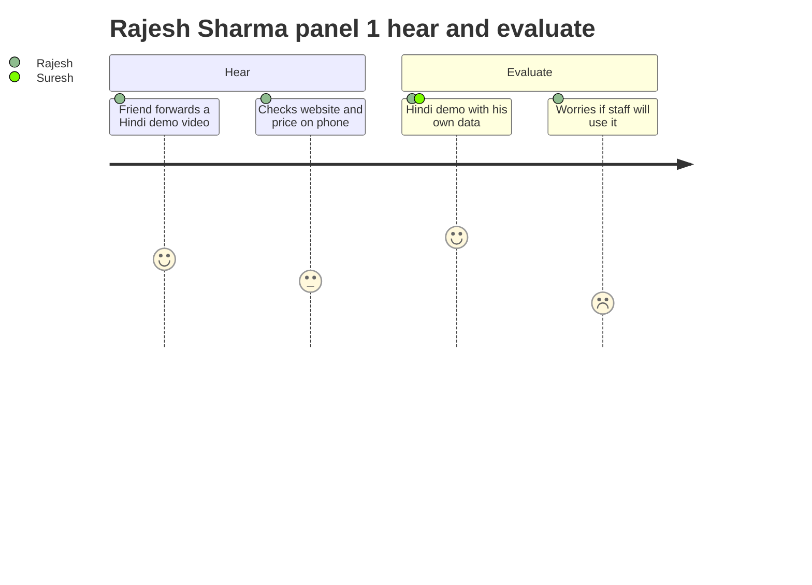
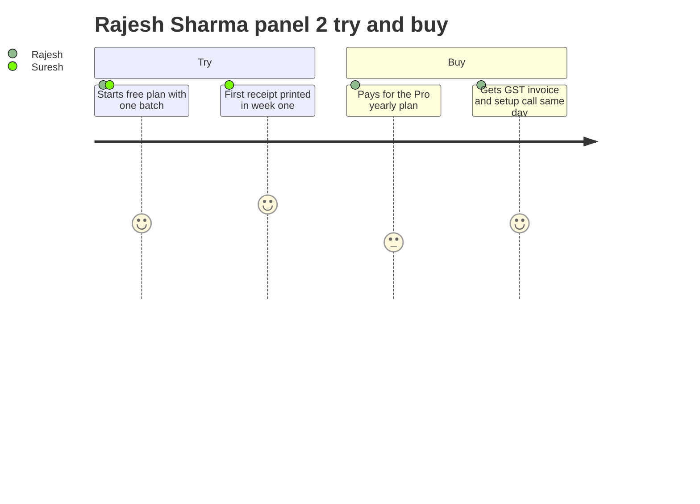
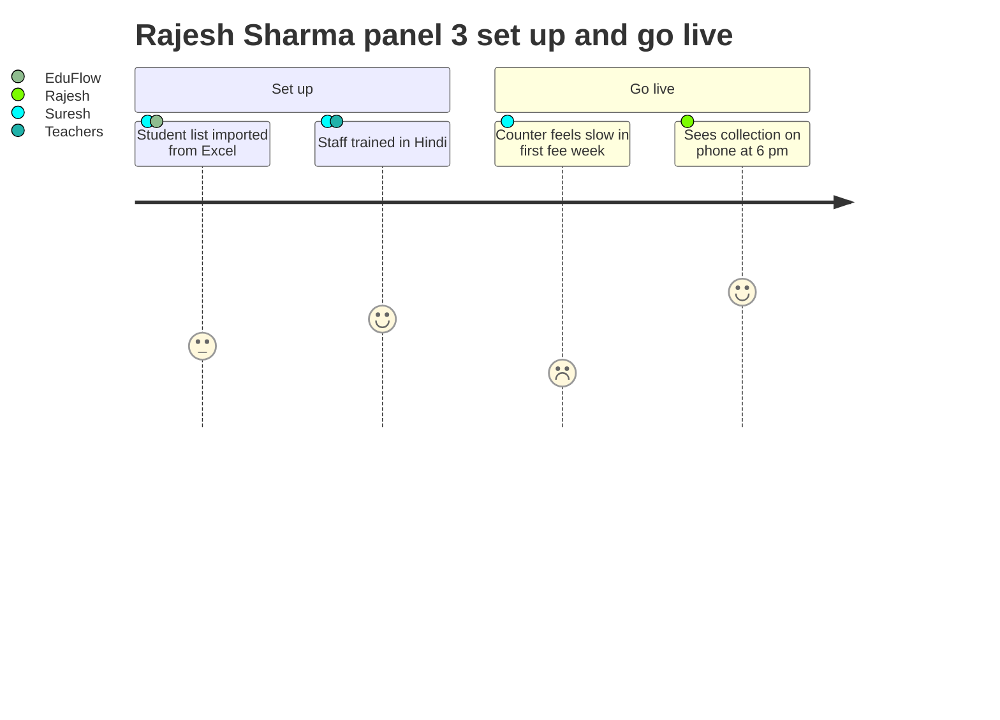
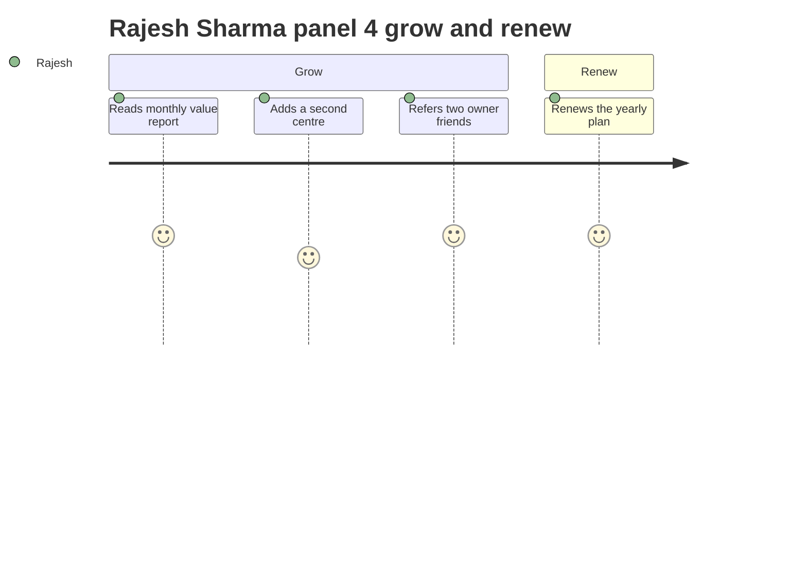

# Customer Personas

**In simple words:** This chapter describes six people who decide whether EduFlow succeeds: the coaching owner, the school principal, the teacher, the accountant, the parent and the student. For each person it shows a normal day, their goals, their fears, the objections they raise and the EduFlow modules that matter most to them. We use these profiles to design screens, to write sales talk and to plan training. If a feature does not help at least one of these six people, we should not build it.

> **Note:** A persona is a made-up but realistic person who stands for a whole group of users. The six personas here are illustrative composites. They are not real people. Every age, income, hour count and percentage in this chapter is an estimate made by the founder. The pilot that starts on 18 November 2026 will test them with real interviews. The test plan is in *Assumptions, Open Questions and Validation Plan*.

## How to read this chapter

### The six personas at a glance

| Persona | Name | Main setting | EduFlow role | Buying role | What they want in one line |
|---|---|---|---|---|---|
| Coaching Owner | Rajesh Sharma, 42 | Sharma Classes, Patna | `ORG_ADMIN` | Decision maker and payer | "Show me my money and my students on my phone." |
| School Principal | Dr. Anita Verma, 51 | Bright Future Public School, Lucknow | `PRINCIPAL` | Strong influencer | "Let me sign papers that I can trust." |
| Teacher | Priya Nair, 29 | Class teacher of 10-A, Bright Future | `TEACHER` | User, silent blocker | "Give me back my first five minutes." |
| Accountant | Suresh Gupta, 38 | Fee counter, Sharma Classes | `ACCOUNTANT` | Gatekeeper, daily user | "Let my day-end total match the first time." |
| Parent | Sunita Devi, 39 | Mother of Aarav, Lucknow | `PARENT` | Indirect influencer | "Tell me he reached, and what I must pay." |
| Student | Aarav Sharma, 15 | Class 10-A, Bright Future | `STUDENT` | End user only | "Show me what is due tomorrow, and only my marks." |

All EduFlow documents reuse the same six sample people in both sample institutes. In this chapter each persona has one main setting. A short "variant" note then explains how the same role differs in the other setting. Aarav Sharma is not related to Rajesh Sharma. Sharma is simply a very common surname.

The size and fee numbers of the two institutes come from *Problem Statement and Proposed Solution*. Sharma Classes has 350 students, an average fee of ₹60,000 a year and a yearly fee billing of ₹2.10 crore. Bright Future Public School has 1,200 students on 2 campuses, an average fee of ₹36,000 a year and a yearly fee billing of ₹4.32 crore.

### Words used in this chapter

- **Jobs-to-be-done (JTBD)** is a way to write a need as a job the person wants finished. The format is "When (situation), I want to (action), so I can (result)". It keeps us focused on the result, not on the feature.
- **Buying role** is the part a person plays when an institute decides to buy software. One person can play more than one role.
- **Objection** is a reason a person gives for not buying or not using the product. Behind every objection there is a fear. We answer the fear, not only the words.
- **Channel** is the way we reach a person: WhatsApp, a phone call, YouTube, a face-to-face meeting, email or SMS.

The four buying roles used in this chapter are below. We add two helper words, payer and champion, because they appear often in sales talk.

| Buying role | Meaning | Example at Sharma Classes |
|---|---|---|
| Decision maker | Says the final yes or no | Rajesh Sharma |
| Influencer | Their opinion changes the decision | The centre head; two friends who own institutes |
| User | Works in the product every day | Suresh Gupta at the counter; 12 teachers |
| Blocker | Can stop the purchase, or quietly stop the usage after purchase | Suresh Gupta, if he fears for his job |
| Payer (helper word) | The person whose money is spent | Rajesh Sharma |
| Champion (helper word) | An insider who wants the product to win and pushes others | A trained and confident Suresh Gupta |

Tech comfort is scored on a simple 1 to 5 scale. The scale is ours. It is not an industry standard.

| Score | What the person can do | Typical example |
|---|---|---|
| 1 | Phone calls and WhatsApp voice notes only | A grandparent who is the guardian |
| 2 | WhatsApp, YouTube and UPI payments, sometimes with help | Sunita Devi |
| 3 | Uses apps, UPI and basic Excel; learns new software in one or two weeks | Rajesh Sharma, Dr. Anita Verma, Suresh Gupta |
| 4 | Learns any new app in a day; helps others | Priya Nair, Aarav Sharma |
| 5 | Builds own sheets and automations; tries new tools for fun | A young centre manager in a big chain |

UPI (Unified Payments Interface) is India's instant bank-to-bank payment system. People use it through apps such as PhonePe, Google Pay and Paytm.

Every feature table in this chapter names a module and its release phase. The phases are fixed for the whole project.

| Phase | Release | Ready by | What it means for a persona |
|---|---|---|---|
| Phase 1 | MVP (16 modules) | 3 December 2026 | Available at the public launch in January 2027 |
| Phase 2 | V1.0 (12 modules) | 1 February 2027 | Ready before the April 2027 academic session |
| Phase 3 | V1.5 (5 modules) | June 2027 | Pro plan modules such as Transport and Payroll |
| Phase 4 | V2.0 | September 2027 | AI Insights and white-label mobile apps |

### What this chapter does not repeat

- The rupee cost of each person's pain is worked out in *Problem Statement and Proposed Solution*. Here we describe the person, not the cost.
- Which types of institutes we target first, and which we avoid, is in *Customer Segments and Ideal Customer Profile*.
- Demo scripts, discovery questions and closing steps are in *Sales Process and Playbooks*.
- Training plans and support hours are in *Customer Success, Onboarding and Support*.
- Facts about other products are in *Competitor Analysis* and *Feature Comparison Matrix*.

## Coaching Owner: Rajesh Sharma

Rajesh Sharma is the most important persona in Phase 1. Coaching institutes are our first market, and in a coaching institute the owner decides alone. He started as a teacher. He became a businessman by accident. He still teaches physics every day.

### Profile

| Item | Detail |
|---|---|
| Age | 42 |
| Education | B.Tech (Mechanical). Taught physics at a large coaching institute for 6 years before starting his own. |
| Institute | Sharma Classes, Patna. Started in 2014. JEE and NEET coaching. 350 students, 1 centre. |
| Team | 12 teachers, 1 centre head, 2 front desk and accounts staff |
| Location | Boring Road area, Patna, Bihar. This is the city's main coaching hub. |
| EduFlow role | `ORG_ADMIN` (Organization Admin) |
| Tech comfort | 3 out of 5 |
| Devices | Android phone (about ₹25,000), one Windows desktop and laser printer in the office, a laptop at home |
| Internet | Office broadband, plus 4G or 5G mobile data as backup |
| Apps used daily | WhatsApp, his bank app, PhonePe, YouTube, Excel, Word for test papers |
| Languages | Hindi first. Reads and writes English well. Prefers a demo in Hindi. |
| Income (estimate) | ₹30 to ₹45 lakh a year before tax, from a fee billing of ₹2.10 crore |
| Budget authority | Full. He approves every spend above ₹2,000 himself. |
| Software spend today | Under ₹15,000 a year: an SMS pack and a Tally renewal |
| EduFlow plan that fits | Pro at ₹5,999 a month or ₹59,990 a year, because 350 students is above the Growth limit of 300 |

JEE and NEET are India's national entrance exams for engineering and medical colleges. Tally is a popular Indian accounting software.

### A day in his life

This is a working day in the second week of August. The second fee instalment was due on 10 August.

| Time | Activity | Tool used today | Pain |
|---|---|---|---|
| 6:00 am | Reads 40 or more unread WhatsApp messages from parents, teachers and groups | Personal WhatsApp | Family and business messages are mixed. Important ones get buried. |
| 7:00 am | Teaches physics to Morning Batch M1 (JEE Main 2028) | Whiteboard, own notes | None. This is the work he loves. |
| 9:00 am | Asks Suresh at the front desk how much fee came yesterday | Verbal answer, receipt book | He gets a rough cash number. UPI paid to his own QR code is missing. |
| 9:30 am | Opens his bank app, takes screenshots of UPI credits and sends them to Suresh | Bank app, WhatsApp | Only he can see the bank account. He has become a clerk. |
| 11:00 am | Meets two walk-in parents. Agrees a ₹5,000 discount for one of them. | Paper form, verbal promise | The discount is written on the corner of the form. There is no approval record. |
| 1:00 pm | Learns that a chemistry teacher is absent. Arranges a substitute by phone. | Phone calls | Students hear about the change after they reach the class. |
| 3:00 pm | Prepares the weekly test paper | Laptop, Word | None |
| 4:30 pm | Teaches the evening NEET batch | Whiteboard | None |
| 6:30 pm | A father calls, angry: "You asked for the fee. I paid six days ago." | Phone, bank app | 20 minutes of searching. He feels embarrassed. |
| 8:00 pm | Calls the front desk for today's collection and writes it in a diary | Phone, diary | The number is late and incomplete. |
| 9:30 pm | On Sundays, updates his own "pending fee" Excel sheet at home | Excel | 2 hours every week. He still does not trust the sheet. |
| 10:30 pm | Thinks about opening a second centre in Kankarbagh, Patna | In his head | He cannot watch two cash counters with one diary. |

A QR code is the square picture that a parent scans with a UPI app to pay. When parents pay to the owner's personal QR code, the front desk never sees the payment.

### Goals

1. Collect every rupee that is billed. He wants fee leakage to fall from an estimated 4% of billing to under 1%.
2. See today's collection, pending dues and attendance on his phone by 6 pm, without calling anybody.
3. Grow from 350 to 450 students in session 2027-28 without hiring more office staff.
4. Open a second centre in Patna within 18 months.
5. Look as professional to parents as the national coaching chains that have their own apps.
6. Spend his best hours on teaching and on meeting parents, not on screenshots and Excel.

Fee leakage means fee money that the institute should have received but never did, and nobody noticed.

### Frustrations

- He is the only person who can see the bank account. So every UPI question comes to him.
- He learns about problems late: a student who stopped coming, a parent who is angry, a discount he never approved.
- His records live in the heads and laptops of two staff members. If one of them resigns, the records leave too.
- He paid ₹35,000 in 2021 for a desktop software that ran on one PC. The vendor stopped answering calls after six months. (Illustrative history. Many owners tell a similar story.)
- He has seen demos of coaching apps. His impression, right or wrong, is that they are built mainly for online classes and for selling courses. His problem is offline: fees, attendance and parents. The facts about those products are in *Competitor Analysis*.
- Software salesmen talk in English about "modules" and "dashboards". Nobody shows him his own fee data on the screen.

### Fears

| Fear | Why it is real for him |
|---|---|
| His student list reaches a rival institute | Student poaching is common in coaching hubs. A list of 350 names with phone numbers has cash value. |
| Staff see his full income | He does not want teachers or the front desk to know the total collection. |
| The vendor shuts down or doubles the price | He has been burned once already. |
| Staff refuse to use it and the money is wasted | He would lose face in front of his own team. |
| Internet or power fails during a fee rush | Patna has short power cuts. The counter cannot stop when 10 parents are waiting. |
| Clean digital records reduce his freedom with cash | Some owners feel this and will not say it openly. |

> **Rule:** EduFlow never offers a feature to hide income or to keep a second set of books. When this fear appears, we do not argue. We sell control: one record that the owner himself can trust. An owner who wants hidden books is not our customer.

### What success looks like

These are the results Rajesh should see 90 days after going live. The "today" values are estimates for an institute like his. The targets match the Year 1 product targets in *KPI Framework and Dashboard*.

| Measure | Today (estimate) | 90 days after go-live (target) |
|---|---|---|
| Time to know today's collection | One phone call at 8 pm, number incomplete | 10 seconds on his phone, at any time |
| Fee overdue by more than 30 days | About ₹12 lakh | Under ₹5 lakh |
| Share of fee value paid online | 0% tracked | 40% |
| Parents who use the portal or get WhatsApp alerts | 0% | 70% |
| Parent calls to him about fee confusion | 8 to 10 a week | 2 a week or fewer |
| His own Excel work on Sundays | 2 hours a week | 0 hours |
| Discounts without a recorded approval | Unknown | 0 |

### Jobs to be done

1. When the day ends, I want to see the exact collection by cash, UPI and cheque on my phone, so I can stop calling the front desk and catch gaps the same day.
2. When an instalment date is near, I want reminders with a payment link to go to parents on their own, so I can get paid on time without awkward calls.
3. When I agree a discount with a parent, I want it recorded with my approval, so nobody can give or claim a discount that I never approved.
4. When a student misses three classes in a row, I want to be told at once, so I can call the parent before the student joins another institute.
5. When I plan a second centre, I want both centres on one screen, so I can grow without doubling my own working hours.

### Buying role

| Buying role | Applies to him | How it shows |
|---|---|---|
| Decision maker | Yes | He alone says yes. There is no committee and no tender. |
| Payer | Yes | He pays from the institute's current account by UPI or netbanking. He needs a GST invoice. |
| Influencer | Partial | He influences other owners in his circle after he buys. |
| User | Yes | He opens the dashboard daily. He approves discounts. He does not do data entry. |
| Blocker | No | If he is convinced, nobody above him can stop the purchase. |

How he buys, step by step (estimate for a typical owner):

1. He hears about EduFlow from another owner or sees a short Hindi video on WhatsApp.
2. He asks one or two owner friends, "Is it working for you? Do they pick up the phone?"
3. He wants a demo in Hindi, on his own data: his batches, his fee amounts, one real student.
4. He involves Suresh only after he likes the product himself. This is late. We must ask for Suresh to join the first demo.
5. He decides in 7 to 21 days. In the admission season (April to June) he has no time, so the sale must close between January and March.
6. He prefers the yearly plan if the saving is clear: ₹59,990 instead of 12 × ₹5,999 = ₹71,988. That saves ₹11,998.

### Objections he raises

| Objection | What is behind it | Honest answer |
|---|---|---|
| "₹5,999 a month is a lot. Excel is free." | He cannot see his leakage, so the price looks like pure cost. | Pro yearly is ₹59,990. That is the fee of one student. Recovering 1% of ₹2.10 crore brings ₹2.1 lakh. |
| "My staff will not use it." | His 2021 software failed for this reason. | Suresh prints a real receipt during the demo. Start with one batch on the free Starter plan. |
| "You are a small company. What if you shut down?" | Vendor risk. He has been burned before. | Every list exports to Excel at any time. Monthly plans have no lock-in. We say honestly that we are small. |
| "Is my student list safe from other institutes?" | Fear of poaching. | Each institute's data is isolated. Teachers see only their own batches. Every export is recorded in an audit log. |
| "Net goes down here." | Fear of a stuck counter. | The counter also works on a phone with mobile data. In a total failure, write a paper receipt and enter it later. |
| "The payment gateway will cut 2%." | Margin worry. | UPI charges are low or zero. Card charges of about 2% are passed at cost. EduFlow adds no markup in Year 1. |
| "Will my staff see all my income?" | Privacy of his earnings. | No. Teachers cannot see fee totals. The accountant sees finance only. The full dashboard is for the owner. |
| "Are WhatsApp messages extra?" | Fear of hidden costs. | Yes, and we say so up front. Messages are charged at Meta's cost plus 15%. Credit packs start at ₹499. |

**Worked example for the price objection.** On the monthly plan, ₹5,999 ÷ 350 students = about ₹17 per student per month. On the yearly plan, ₹59,990 ÷ 12 ÷ 350 = about ₹14 per student per month. His average fee is ₹5,000 per student per month (₹60,000 ÷ 12). So EduFlow costs about 0.3% of what each student pays. With 18% GST the yearly invoice is ₹59,990 + ₹10,798 = ₹70,788. He can claim the GST as input credit only if his institute is registered under GST, so we always quote both numbers.

> **Founder note:** The free Starter plan has no WhatsApp sending. But WhatsApp absence alerts and fee reminders are what excite owners most. So the demo must show real WhatsApp messages from a demo institute to the owner's own phone. How a trial of paid features should work is an open point for *Pricing Strategy*.

### EduFlow features that matter most

| What he needs | Module (code) | Phase | Why it matters to him |
|---|---|---|---|
| Today's collection, dues and attendance on one screen | Dashboard (DASH) | 1 | This is the reason he buys. He checks it every evening. |
| Fee structures, instalments, invoices and the defaulter list | Fees (FEE) | 1 | Ends the Sunday Excel sheet. |
| UPI payment links matched to the right student; printed receipts | Payments (PAY) | 1 | Ends payments to his personal QR code and the screenshot work. |
| Discounts that need his approval | Discounts (DSC) | 1 | Ends "sir approved" notes on form corners. |
| Automatic fee reminders and absence alerts | WhatsApp (WA), Notifications (NTF) | 1 | Parents pay on time. Dropouts are caught early. |
| Daily attendance for each batch | Attendance (ATT), Batch (BAT) | 1 | Three absences in a row trigger his phone call. |
| Enquiry to admission in one form | Student Admission (ADM) | 1 | One student record from the first day. |
| Who can see what | Settings (SET) | 1 | Teachers never see money. His income stays private. |
| A second centre on the same login | Multi Campus (CAMP) | 1 | His growth plan. Needs the Pro plan or the extra campus add-on. |
| Trends by batch, month and fee head | Analytics (ANL) | 2 | Shows which batch makes money and which one leaks. |
| Teacher pay per lecture | Payroll (PRL) | 3 | Ends the monthly dispute about lecture counts. |
| Early warning on students likely to drop out | AI Insights (AI) | 4 | Later add-on at ₹1,499 a month. Not a reason to buy today. |

### Preferred channels

| Purpose | Channel that works | Channel that fails |
|---|---|---|
| First hears about us | Another owner's word; a 2 to 3 minute Hindi demo video forwarded on WhatsApp; YouTube | Cold email, LinkedIn posts, long PDF brochures |
| Checks us out | Google search, our website on his phone, a call to a reference customer | English-only landing pages with no price |
| Demo | In person at his institute, or a video call after 8 pm, in Hindi, with his data | A generic recorded webinar |
| Buying | UPI or netbanking payment link; GST invoice sent on WhatsApp and email | Purchase orders, long contracts |
| Support | WhatsApp chat, phone call, voice notes. He expects a human reply within the hour. | Ticket portals, chatbots that loop |
| Staying informed | A monthly three-line value report on WhatsApp | Feature newsletters by email |

### In his words

> **Example:** Illustrative quote, not from a real person. "I built this institute by teaching. I never planned to become its cashier, its clerk and its call centre. Show me my money on my phone every evening. And make sure my staff can run it without me."

### Variant: the owner of a school

In our samples, Rajesh Sharma is also the owner behind Bright Future Public School. A school owner differs from a coaching owner in four ways.

| Point | Coaching owner | School owner or trust chairman |
|---|---|---|
| Daily presence | In the building all day; teaches | Visits a few times a week; does not teach |
| Who he listens to | Other owners | The principal and the head accountant |
| Decision time (estimate) | 7 to 21 days | 30 to 90 days, often in a management meeting |
| Buying season | January to March | November to February, before the April session |
| Plan that fits | Growth or Pro | Pro or Enterprise (Bright Future needs Enterprise from ₹14,999 a month) |

For Bright Future, ₹14,999 a month ÷ 1,200 students = about ₹12.50 per student per month. That is about 0.4% of the monthly fee of ₹3,000 per student.

## School Principal: Dr. Anita Verma

Dr. Anita Verma does not sign the cheque. But no school owner buys school software against the word of the principal. After the purchase, she is the person who makes 50 teachers use it. In schools she is the second most important persona, right after the owner.

### Profile

| Item | Detail |
|---|---|
| Age | 51 |
| Education | M.Sc. (Chemistry), B.Ed., Ph.D. in Education. 26 years in schools. Principal for the last 8 years. |
| School | Bright Future Public School, Lucknow. English-medium, K-12, CBSE board (assumption). 1,200 students, 2 campuses, 50 teachers. |
| Location | Main campus and a second campus about 9 km apart in Lucknow (illustrative) |
| EduFlow role | `PRINCIPAL`, assigned to both campuses. The in-charge of the second campus is a `PRINCIPAL` for that campus only. |
| Reports to | The owner and the school management committee |
| Tech comfort | 3 out of 5 |
| Devices | Android phone (about ₹30,000), an office desktop shared with her office assistant, a personal laptop for presentations |
| Apps used daily | WhatsApp (14 school groups), Gmail, Google Meet, Word, basic Excel, board portals in exam season |
| Languages | Hindi and English. Writes circulars in formal English. Speaks to most parents in Hindi. |
| Income (estimate) | ₹6 to ₹9 lakh a year. *Problem Statement and Proposed Solution* uses ₹48,000 a month as a blended figure for principals and centre heads. |
| Budget authority | Limited. She approves spends up to about ₹10,000 (estimate). Software needs the owner's yes. She writes the recommendation note. |
| EduFlow plan that fits | Enterprise, from ₹14,999 a month, because 1,200 students is above the Pro limit of 1,000 |

CBSE (Central Board of Secondary Education) is the national school board. It runs the Class 10 and Class 12 board exams. K-12 means kindergarten to Class 12.

### A day in her life

This is a working day in the third week of September. The half-yearly exams start next week.

| Time | Activity | Tool used today | Pain |
|---|---|---|---|
| 7:15 am | Reaches school. Checks which teachers are absent. | Staff attendance register, phone calls | Three teachers are absent. She learns this only when they do not sign. |
| 7:30 am | Makes the substitution list: which free teacher covers which class | Paper arrangement register | 20 minutes every morning. The same teachers get picked and they complain. |
| 8:00 am | Morning assembly, then a round of the corridors | None | None. She values this time. |
| 9:00 am | Meets a parent who says, "Nobody told me about the unit test." | The teacher's word, a scroll through the WhatsApp group | There is no proof that the notice reached this parent. |
| 10:00 am | Signs 6 transfer certificates and 4 bonafide certificates | Word files typed from paper records | Each one was typed from scratch. She finds a wrong date of birth in one. |
| 11:00 am | Phones the in-charge of the second campus for attendance and issues | Phone, WhatsApp photos of registers | Numbers arrive as photos. She cannot compare the two campuses. |
| 12:00 pm | Reviews the exam date sheet and seating plan | Excel printouts | Two versions of the date sheet are in circulation. |
| 1:30 pm | Asks for the list of Class 10 students below 75% attendance | Class teachers count registers by hand | The list takes 3 days. It is out of date when it arrives. |
| 2:30 pm | Staff meeting about the half-yearly exam | Notebook | Teachers ask for free periods to finish register totals. |
| 4:00 pm | Collects numbers for the monthly management meeting | Calls to the accountant and both offices | One full working day every month |
| 8:30 pm | Answers parent messages from home | Personal WhatsApp | There is no line between work and home. |
| Report card weeks | Checks and signs report cards, three times a year | Printed cards, red pen | 30 to 40 hours per term, plus reprints after every error |

A transfer certificate (TC) is the paper a student gets when leaving a school. A bonafide certificate is a letter that confirms the student studies in the school. A date sheet is the exam timetable.

### Goals

1. Good board results, and no student stopped from the board exam because of low attendance.
2. Know the attendance of students and teachers on both campuses by 9 am every day.
3. Sign report cards that she can trust, without checking every total herself.
4. Make sure every circular reaches every parent, with proof.
5. Cut the clerical work of teachers so that teaching time goes up.
6. Keep an inspection file ready. When the board or the district education office asks for data, she wants it within one hour.
7. Look modern to parents who compare Bright Future with newer schools in Lucknow.

### Frustrations

- She manages quality without data. Attendance, marks and complaints reach her late and in pieces.
- She is the final proofreader of the school. Every certificate and every report card waits for her red pen.
- The two campuses work like two schools. Each has its own registers, its own Excel files and its own habits.
- Parents and teachers argue about who said what. WhatsApp groups give no clear record.
- Her best teachers lose hours to totals and lists. She cannot give that time back to them.
- Software demos are aimed at the owner and talk about fees. Nobody shows her a report card in her own format.

### Fears

| Fear | Why it is real for her |
|---|---|
| A failed rollout in the middle of the session | Her name is on the recommendation note. The owner will remember who asked for it. |
| A wrong report card reaches a parent | One wrong mark becomes a forward in the parent group within an hour. |
| Senior teachers refuse to use it | Some teachers have 25 years of service. She cannot order them. She must persuade them. |
| The dashboard is used to judge her | The owner will see each campus's attendance and complaints without asking her. |
| Children's data leaks | The school holds identity papers, photos and addresses of 1,200 children. A leak is a legal and public crisis. |
| Parents without smartphones are left out | About 10% to 15% of her parents (estimate) use a basic phone or share one phone in the family. |

### What success looks like

These are the results she should see after one full term on EduFlow. The "today" values are estimates. They match the pain tables in *Problem Statement and Proposed Solution*.

| Measure | Today (estimate) | After one term (target) |
|---|---|---|
| Time when she knows attendance of both campuses | After 11 am, by phone | By 9 am, on her phone |
| List of students below 75% attendance | 3 days of teacher work, once a term | Live list, checked every Monday |
| Her time on report card checking | 30 to 40 hours per term | Under 10 hours per term |
| Report cards reprinted because of errors | 40 to 60 per term | Under 5 per term |
| Time to issue a TC or bonafide certificate | 3 to 7 days | Same day |
| "Nobody told me" escalations | 5 to 8 a week | 1 to 2 a week |
| Numbers for the management meeting | 1 working day a month | 15 minutes |

### Jobs to be done

1. When the first period ends, I want to see the attendance of both campuses on one screen, so I can act on absent teachers and empty classes before 9 am.
2. When a student's attendance falls below 80%, I want the class teacher and the parent warned at once, so I can prevent a shortage before the board exam instead of explaining it after.
3. When exam marks are entered, I want totals, grades and report cards made by the system, so I can sign with trust and teachers can stop adding numbers by hand.
4. When a parent says "nobody told me", I want to see the delivery record of the notice, so I can settle the matter in two minutes with facts.
5. When a family asks for a transfer certificate, I want it made from the student's record, so I can sign it the same day without checking every date by hand.

### Buying role

| Buying role | Applies to her | How it shows |
|---|---|---|
| Decision maker | Partial | The owner signs. But where the owner is rarely present, her recommendation is the decision in practice. |
| Influencer | Yes | The owner asks her one question: "Will the teachers use it?" Her answer saves or ends the deal. |
| User | Yes | Daily: attendance view, leave approvals, notices. Each term: exams, report cards, certificates. |
| Blocker | Yes | "Not this session" from her delays the sale by a full year. |
| Champion | Yes | If the demo shows her report card format, she will push all 50 teachers herself. |

How she evaluates, step by step (estimate for a typical principal):

1. She asks two or three principals in her city network what they use and what went wrong.
2. She asks to see three things: morning attendance of both campuses, a report card in her format, and a TC.
3. She asks for a small trial: one class, such as 10-A, for two weeks of attendance.
4. She writes a one-page note to the owner with the benefits, the cost and the risks.
5. She fixes the calendar. Setup and training happen from January to March. Go-live is the first day of the April 2027 session.

> **Tip:** In a school demo, give the first ten minutes to the principal's screen, not the fee screen. The owner is watching her face. If she nods, he buys.

### Objections she raises

| Objection | What is behind it | Honest answer |
|---|---|---|
| "My teachers are already overloaded." | She fears a staff revolt. | Attendance takes under 1 minute on a phone. It removes the month-end totals. Start with attendance only. |
| "Our report card has its own format." | Fear of losing the school's identity and board rules. | Report Cards is ready by 1 February 2027. We show her format in the demo, or say clearly what we cannot match. |
| "We cannot change in the middle of the session." | Risk to her name. | We agree. Set up and train from January to March. Go live with the new session in April 2027. |
| "Many parents do not have smartphones." | Fairness to poorer families. | WhatsApp covers most parents. SMS (Phase 2) reaches basic phones. The printed circular stays for the few who need it. |
| "Is the children's data safe and legal?" | The DPDP Act and her own conscience. | Files are stored in the AWS Mumbai region. Access is by role. Parent consent is recorded. No ads, no tracking of children. |
| "We tried an app in 2022. Teachers stopped in two months." | A past failure (illustrative). | Apps fail when they add work. For every digital task we remove one paper task. She gets a weekly usage list by teacher. |
| "Will management use this data against my staff?" | Fear of policing. | We are honest: the owner can see all data. We present the numbers as help for teachers, and she leads the review. |
| "Who will train 50 teachers?" | No spare capacity. | Two 45-minute sessions per campus, plus short Hindi videos. On-site training is ₹4,999 a day. Enterprise includes an account manager. |

The DPDP Act (Digital Personal Data Protection Act 2023) is India's data protection law. It asks for a parent's verifiable consent before a child's data is processed. The full rules are in *Compliance, Legal and Data Protection Requirements*.

**Worked example for the workload objection.** Bright Future has 50 teachers. *Problem Statement and Proposed Solution* estimates 12 hours of clerical work per school teacher per month. That is 50 × 12 = 600 hours a month. At the assumed cost of ₹150 per hour, this is 600 × ₹150 = ₹90,000 of teacher time every month. If EduFlow removes only half of it, the school gets back 300 hours, worth ₹45,000 a month. That is three times the Enterprise starting price of ₹14,999 a month. All inputs are estimates. The pilot will measure the real hours.

### EduFlow features that matter most

| What she needs | Module (code) | Phase | Why it matters to her |
|---|---|---|---|
| Attendance of every class by 9 am | Attendance (ATT), Dashboard (DASH) | 1 | Her first screen every morning |
| Both campuses side by side | Multi Campus (CAMP) | 1 | Ends the phone calls and register photos |
| Notices with a delivery record | Notifications (NTF), WhatsApp (WA) | 1 | Ends the "nobody told me" argument |
| Teacher list, class teachers and subject allotment | Teachers (TCH), Batch (BAT), Subjects (SUB) | 1 | One correct list of who teaches what |
| One student record with documents | Student Profile (STU) | 1 | Her inspection file, ready in minutes |
| Exam schedule, marks entry and grade rules | Exams (EXM) | 2 | Marks are entered once, by the subject teacher |
| Report cards in the school's format | Report Cards (RPT) | 2 | The feature that wins her. Ready before the April 2027 session. |
| TC, bonafide and character certificates | Certificates (CRT) | 2 | Same-day certificates with correct dates |
| Timetable and a list of free teachers | Timetable (TT) | 2 | Faster substitution. We propose this as a requirement for the module. |
| Teacher leave requests and approvals | Leave (LEV), Staff (STF) | 2 | She knows about absence the evening before |
| Homework visible to parents | Homework (HW) | 2 | Fewer "what was the homework" messages |
| Attendance and result trends by class | Analytics (ANL) | 2 | Facts for the management meeting |
| Bus routes and students on each bus | Transport (TRN) | 3 | Safety calls are answered quickly |
| Early warning on weak or irregular students | AI Insights (AI) | 4 | Included in Enterprise. A bonus, not a reason to buy. |

### Preferred channels

| Purpose | Channel that works | Channel that fails |
|---|---|---|
| First hears about us | Another principal's word; a principals' meet or school conference; the owner forwards a video | Cold calls during school hours |
| Checks us out | A sample report card and a one-page PDF she can print for the owner | A long feature list with no samples |
| Demo | In her office after 2:30 pm, with the exam in-charge and one young teacher present | A demo only for the owner, where she is called in at the end |
| Training | In the staff room, on teachers' own phones, 45 minutes, in Hindi and English | A 3-hour webinar on a Sunday |
| Support | A named person on WhatsApp; email for formal requests | An anonymous ticket number |
| Staying informed | A monthly usage report by campus and by teacher | Marketing emails |

### In her words

> **Example:** Illustrative quote, not from a real person. "I sign every report card and every certificate in this school. I want to sign papers that I can trust. And I want my teachers to teach, not to add up registers."

### Variant: the centre head of a coaching institute

At Sharma Classes the same EduFlow role (`PRINCIPAL`) is held by the centre head. The job is lighter on paperwork and heavier on results.

| Point | School principal | Coaching centre head |
|---|---|---|
| Main worry | Board results, inspections, parent complaints | Test ranks, dropouts, teacher absence |
| Report cards | Three times a year, fixed format | None. Weekly test rank lists instead. |
| Certificates | Many: TC, bonafide, character | Few |
| Admin hours lost (estimate) | About 30 hours a month | About 20 hours a month |
| Buying role | Strong influencer | Often the first daily user; the owner decides alone |
| Modules that matter first | Attendance, Exams, Report Cards, Certificates | Attendance, Batch, Exams, Dashboard |

## Teacher: Priya Nair

Priya Nair never appears in a sales meeting. Yet the whole product depends on her thumb. If she marks attendance every morning, parents get alerts and the owner sees live data. If she stops, every screen in EduFlow goes empty. She is a user with a silent veto.

### Profile

| Item | Detail |
|---|---|
| Age | 29 |
| Education | M.Sc. (Mathematics), B.Ed. 6 years of teaching experience. |
| Job | Mathematics teacher for Classes 9 and 10 at Bright Future Public School. Class teacher of 10-A (40 students). |
| Location | Lucknow. Her family is from Kerala. She moved to Lucknow after marriage. |
| EduFlow role | `TEACHER`. She sees only her own batches and subjects. |
| Tech comfort | 4 out of 5 |
| Devices | Her own Android phone (about ₹14,000). One shared desktop in the staff room for 12 teachers. No school laptop. |
| Internet | Her own prepaid mobile data (about ₹300 a month). School Wi-Fi is for the office only. |
| Apps used daily | WhatsApp, YouTube, Google Drive, Instagram, a UPI app |
| Languages | Malayalam at home. English and Hindi at work. |
| Income (estimate) | ₹24,000 a month from the school, as assumed in *Problem Statement and Proposed Solution*. About ₹8,000 a month from home tuitions. |
| Budget authority | None. She has never been asked which software the school should buy. |
| Workload | 6 teaching periods out of 8 each day, plus class teacher duties |

### A day in her life

This is a working day in the same week of September. Unit test marks are due and the month is ending.

| Time | Activity | Tool used today | Pain |
|---|---|---|---|
| 7:20 am | Reaches school and signs the staff register | Paper register | None |
| 7:40 am | First period with 10-A. Calls the roll for 40 students. | Paper attendance register | 5 minutes of a 40-minute period are gone before teaching starts. |
| 8:20 am | Teaches periods 2 to 4 in other classes | Blackboard, textbook | None. This is her real work. |
| 10:30 am | In the short break, the office asks for her class's fee defaulter names again | Handwritten slip | She dislikes naming children for fees. It is not her job. |
| 11:00 am | Collects unit test answer sheets | Paper | None |
| 12:30 pm | Writes the homework on the board. Students copy it into diaries. | Blackboard, school diary | Absent students miss it. Parents ask her later on WhatsApp. |
| 1:30 pm | Waits for the staff room desktop to type marks | Shared PC, Excel | Four teachers are ahead of her in the queue. |
| 2:15 pm | Types 40 marks into the Excel file of the exam in-charge | Excel | The same marks are already on paper. They will be typed once more into report cards. |
| 3:30 pm | Reaches home | None | None |
| 5:00 pm | Home tuition for six students | Notebook | None |
| 8:00 pm | Checks notebooks and adds the month's attendance totals for 40 students | Register, calculator | About one hour at every month-end. One slip means starting again. |
| 10:00 pm | Three parents message her personal number about the test syllabus | Personal WhatsApp | She answers, because ignoring parents leads to complaints. |

### Goals

1. Finish attendance in under one minute and start teaching.
2. Enter each mark only once. Never add totals by hand again.
3. Keep her personal phone number away from 40 families.
4. Do no clerical work at home after 8 pm.
5. Get good board results for 10-A. That is how the school and she herself measure her work.
6. Have proof that she sent a notice, when a parent says she did not.
7. Be seen by the principal as a capable, modern teacher. It helps her increment.

### Frustrations

- She is paid to teach, and about 12 hours of every month go into clerical work.
- The same data is typed again and again. She knows this is a waste, and nobody asks her opinion.
- She uses her own phone and her own mobile data for school work. Nobody pays for it.
- Parents message her at night. There is no polite way to stop it.
- The office uses her as a messenger for fee reminders. This hurts her bond with students.
- New tools arrive as orders. Training is a single rushed session. Then she becomes the unpaid helper for older colleagues.

### Fears

| Fear | Why it is real for her |
|---|---|
| Double work: the register and the app | In most rollouts the paper register stays "for some time". That time never ends. |
| Being watched and ranked | A dashboard can show who marked attendance late. She fears it will be used in her appraisal. |
| Mistakes become public at once | A wrong absent mark sends a WhatsApp alert to a parent in seconds. |
| Her phone becomes the school's tool | Battery, storage, data cost and privacy are all hers. |
| Parents reach her at any hour through the app | She wants fewer channels to her, not one more. |
| The app is slow at 7:40 am | 50 teachers mark attendance in the same 10 minutes. If it hangs, 40 children sit idle. |

### What success looks like

| Measure | Today (estimate) | After 30 days on EduFlow (target) |
|---|---|---|
| Time to mark attendance for 40 students | 5 minutes | Under 1 minute |
| Month-end attendance totals | 1 hour by hand | 0 minutes. The system adds them. |
| Times she types the same marks | 3 | 1 |
| Parent messages on her personal number | 15 to 20 a week | Under 5 a week |
| Clerical work per month | 12 hours | 4 hours or less |
| Days in a month when attendance is marked before 8:30 am | Not measured | 24 out of 26 working days |

The way to mark 40 students in under a minute is simple. All students are "present" by default. She taps only the absent ones, usually two to four, and presses save.

### Jobs to be done

1. When the first period starts, I want to mark only the absent students on my phone, so I can finish attendance in under a minute and begin teaching.
2. When I finish checking a test, I want to enter marks once, so I can stop typing them into three different files.
3. When I give homework, I want it to reach all parents and absent students from one place, so I can stop answering the same question ten times at night.
4. When a parent wants to reach me, I want the message to come through the school's system, so I can keep my personal number and my evenings.
5. When I need a day off, I want to apply on my phone and see the answer, so I can stop chasing a paper form through the office.

### Buying role

| Buying role | Applies to her | How it shows |
|---|---|---|
| Decision maker | No | She is never in the room when the school decides. |
| Influencer | Partial | The principal asks two or three trusted teachers, "Will this work?" She is one of them. |
| User | Yes | Every working day, on her phone. She creates most of the data that others read. |
| Blocker | Yes | A silent one. She does not say no. She just goes back to the register. |
| Champion | Yes | Young teachers like her become the helpers of the staff room. One per campus is enough. |

> **Warning:** Teachers do not complain to the vendor. They simply stop. The first sign is a fall in "attendance marked before 9 am". This number must be on the customer health screen from the first day. The measures are defined in *KPI Framework and Dashboard*.

### Objections she raises

Priya does not object to a purchase. She objects to usage. These are the lines we hear in the staff room on training day.

| Objection | What is behind it | Honest answer |
|---|---|---|
| "Will I have to keep the register and the app?" | Fear of double work. | For the first two weeks, yes. We ask the principal to announce a fixed end date for the paper register. |
| "I will not use my own mobile data for school." | A fair point about cost. | One attendance save uses very little data. We still advise schools to open staff Wi-Fi or pay a small data allowance. |
| "What if I mark a child absent by mistake?" | Fear of an angry parent. | She can correct the entry. We advise schools to send absence alerts after a short delay, so there is time to fix slips. |
| "Will parents chat with me at midnight?" | Her evenings. | No. Phase 1 has notices from school to parent, not open chat. Her number stays hidden. |
| "Will the principal see who marked late?" | Fear of policing. | Yes, she can. We say so openly. We ask principals to use it to help teachers, not to punish them. |
| "My phone is old and full." | Device limits. | EduFlow runs in the phone's browser. There is nothing heavy to install. The staff room PC works too. |
| "Nobody trained me last time." | A bad past rollout. | 45 minutes of hands-on training on her own phone, a 2-minute Hindi video for each task, and a WhatsApp helpline. |

> **Best practice:** Follow the "one in, one out" rule in every rollout. When a digital task starts, a paper task must stop on a fixed date. Attendance in EduFlow means the paper register ends. Marks in EduFlow means the Excel mark list ends. If the paper stays, teachers will choose the paper.

**Worked example of her time.** Attendance today takes 5 minutes × 26 working days = 130 minutes a month, plus 60 minutes of month-end totals. That is 190 minutes. With EduFlow it takes 1 minute × 26 days = 26 minutes, and no totals. She gets back 164 minutes, which is four full teaching periods of 40 minutes every month. All numbers are estimates.

### EduFlow features that matter most

| What she needs | Module (code) | Phase | Why it matters to her |
|---|---|---|---|
| Tap-the-absentees attendance on her phone | Attendance (ATT) | 1 | The daily habit that feeds every other screen |
| Her own class lists, always current | Batch (BAT), Subjects (SUB) | 1 | No more lists copied from the office |
| Student details and the right parent number | Student Profile (STU) | 1 | She stops keeping 40 contacts on her phone |
| Notices to her class without sharing her number | Notifications (NTF), WhatsApp (WA) | 1 | Her privacy comes back |
| Her own profile and allotted classes | Teachers (TCH) | 1 | She sees only what is hers |
| Homework given once, seen by all | Homework (HW) | 2 | Absent students and parents stop asking |
| Marks entered once | Exams (EXM) | 2 | Ends typing the same marks three times |
| Report cards built from those marks | Report Cards (RPT) | 2 | Ends hand-made report cards for 40 students |
| Her timetable on her phone | Timetable (TT) | 2 | She sees changes and extra periods early |
| Leave request and status | Leave (LEV) | 2 | No paper form, no waiting |
| Correct salary with leave counted | Payroll (PRL) | 3 | Fewer disputes on pay day |

### Preferred channels

| Purpose | Channel that works | Channel that fails |
|---|---|---|
| First hears about us | The principal's announcement; a friend who teaches in another school | Any vendor advertisement |
| Learning | Hands-on practice on her own phone; 2-minute videos in Hindi or English; a printed one-page guide on the staff room wall | A long PDF manual; a lecture with slides |
| Help | A staff room helper (the champion); the school's admin; WhatsApp helpline | Calling a vendor during class hours |
| Feedback | A 3-question poll on WhatsApp after 2 weeks | A long survey form by email |
| Motivation | A thank-you from the principal in the staff meeting; "my class has 100% attendance marking" | Public ranking of slow teachers |

### In her words

> **Example:** Illustrative quote, not from a real person. "I became a teacher to teach mathematics. Give me back my first five minutes and my evenings. And please do not give my number to forty families."

### Variant: the teacher in a coaching institute

| Point | School teacher | Coaching teacher at Sharma Classes |
|---|---|---|
| Pay | Monthly salary | Per lecture. Many teach at two institutes. |
| Attendance | Once a day, as class teacher | For every lecture, in every batch |
| Clerical load (estimate) | 12 hours a month | 6 hours a month |
| Biggest worry | Report cards, parents at night | Lecture count for pay; students' test ranks |
| Module that matters most | Attendance, Exams, Report Cards | Attendance, Batch, Exams; later Payroll for lecture pay |
| Risk to EduFlow | Goes back to the register | Skips attendance, because "the owner only cares about results" |

## Accountant: Suresh Gupta

Suresh Gupta sits at the fee counter of Sharma Classes. He handles more EduFlow screens per day than any other persona. He is also the person most likely to feel threatened by the product. *Market Research: India* calls him the gatekeeper who "can quietly kill the project". This section explains why, and how to make him our champion instead.

### Profile

| Item | Detail |
|---|---|
| Age | 38 |
| Education | B.Com from a local college, plus a 6-month Tally course |
| Job | Accounts and front desk at Sharma Classes, Patna, since 2017. One of 2 office staff. |
| EduFlow role | `ACCOUNTANT`. He sees finance data of his own centre only. |
| Tech comfort | 3 out of 5. Fast on a keyboard in Tally and Excel. Less sure with new phone apps. |
| Devices | The office Windows desktop and laser printer. A carbon-copy receipt book. A calculator. His own Android phone (about ₹10,000). |
| Internet | Office broadband on the desktop. His own prepaid data on the phone. |
| Apps used daily | Tally, Excel, WhatsApp, a UPI app |
| Languages | Hindi at work, Magahi at home. Reads English on screens slowly. Prefers Hindi labels and Hindi training. |
| Income (estimate) | ₹18,000 a month, as assumed in *Problem Statement and Proposed Solution*. About ₹2.2 lakh a year. |
| Budget authority | None for software. He handles petty cash below ₹2,000. |
| Who he answers to | Rajesh Sharma directly, every morning and every night |
| Fee work today | About 45 hours a month (estimate from *Problem Statement and Proposed Solution*) |

### A day in his life

This is the same August day that we followed for Rajesh Sharma. The second instalment was due on 10 August.

| Time | Activity | Tool used today | Pain |
|---|---|---|---|
| 8:30 am | Opens the office and counts the opening cash | Cash box, diary | Yesterday's cash was ₹500 short. He still does not know why. |
| 9:00 am | The owner asks for yesterday's collection | Receipt book, calculator | He adds receipt copies by hand. The UPI part is unknown to him. |
| 9:30 am | Gets 7 UPI screenshots from the owner on WhatsApp | WhatsApp, fee register | The name on a screenshot is the payer's, not the student's. He guesses. |
| 10:00 am | Fee counter rush until 1 pm. Writes receipts by hand. | Carbon-copy receipt book | 4 to 5 minutes per receipt. Eight parents wait in line. |
| 1:30 pm | A mother asks, "How much is still pending for my son?" | Fee register | 10 minutes of page-turning for one answer |
| 2:30 pm | Types the morning's receipts into Excel | Excel on the office PC | Second entry of the same data. One typing slip creates a false defaulter. |
| 4:00 pm | Makes the defaulter list for Morning Batch M1 and calls parents | Fee register, class list, his own phone | He calls a father who paid six days ago by UPI. The father shouts at him. |
| 5:30 pm | Fills the cheque deposit slip and goes to the bank | Bank slip | A cheque from last week bounced. Nobody updated the register. |
| 7:00 pm | Day-end cash count and receipt book total | Calculator | The totals differ by ₹500. He recounts for 40 minutes. |
| 8:00 pm | The owner phones for today's number | Phone | He gives the cash figure. He cannot give the UPI figure. |
| Saturday | Enters the week's receipts into Tally | Tally | Third entry of the same receipt |
| Month-end | Counts teacher lectures from a diary for their pay | Diary, Excel | The count is disputed almost every month. |

### Goals

1. See the day-end total match the cash in the drawer on the first count.
2. Give a receipt in under one minute, even on the busiest day.
3. Never again phone a parent who has already paid.
4. Have clear proof for every rupee. This protects his name as an honest man.
5. Answer "how much is pending?" in ten seconds.
6. Go home by 7 pm in fee week.
7. Keep his job and grow in it. He wants to be the office manager when the second centre opens.

### Frustrations

- He writes the same receipt three times: in the book, in Excel and in Tally.
- He is blamed for payments he cannot see. UPI money goes to the owner's personal QR code.
- Parents shout at him for reminder calls that were wrong. The mistake was in the system, not in him.
- A cash shortage of ₹500 comes out of his own peace of mind, and sometimes out of his pocket.
- Discounts are agreed without him. He learns about them when the parent pays less at the counter.
- Every "software demo" he has seen was given to the owner. He was called in only to be told, "You will use this from Monday."

### Fears

| Fear | Why it is real for him |
|---|---|
| The software will take his job | If the computer makes receipts and lists, he asks, "What am I for?" |
| Every mistake will carry his name | An audit log shows who did what. He fears blame more than he values proof. |
| The counter will be slower in the rush | He can write a receipt half-asleep. A new screen with eight parents waiting is a nightmare. |
| English screens will make him look slow | He is a respected senior staff member. He does not want to ask a 25-year-old for help. |
| He will lose his special position | Today only he understands the fee register. That knowledge is his job security. |
| Moving the old data will fall on him | 350 students, part-paid instalments and old dues, typed after office hours without extra pay |

> **Founder note:** Never sell EduFlow to the owner as "you can manage with fewer office staff". Suresh will hear about it, and the rollout will die. Sell it as "Suresh gets 30 hours back for enquiries and follow-ups, which bring admissions". This is also the more honest claim. Small institutes do not cut staff. They stop hiring more.

### What success looks like

| Measure | Today (estimate) | 60 days after go-live (target) |
|---|---|---|
| Time to make one receipt | 4 to 5 minutes | Under 1 minute |
| Entries of the same receipt | 3 (book, Excel, Tally) | 1, plus one daily summary entry in Tally |
| Day-end tally | 40 to 45 minutes, often with a gap | 5 minutes. Cash in drawer equals cash in report. |
| Matching UPI payments to students | 12 hours a month | About 1 hour a month, only for payments made outside EduFlow |
| Reminder calls made by him | About 10 hours a month | About 2 hours a month, only for long-overdue cases |
| Wrong reminder calls to parents who paid | A few every week | 0 |
| Total fee work | 45 hours a month | 15 hours a month |

### Jobs to be done

1. When a parent is at the counter, I want to find the student, take the money and print the receipt in under a minute, so I can keep the queue short and the parents calm.
2. When the day ends, I want one report of cash, UPI and cheque that matches my drawer, so I can close the counter in five minutes and go home.
3. When a parent pays by UPI, I want the payment to attach itself to the right student, so I can stop guessing from screenshots.
4. When dues are pending, I want reminders to go out on their own, so I can stop making calls that get me shouted at.
5. When the owner gives a discount, I want to see his approval on my screen, so I can never be accused of giving it myself.

### Buying role

| Buying role | Applies to him | How it shows |
|---|---|---|
| Decision maker | No | He has no budget. |
| Influencer | Yes | The owner asks him, "Can you work with this?" A doubtful face can end the deal. |
| User | Yes | The heaviest user. Six or more hours a day on fee screens. |
| Blocker | Yes | The gatekeeper. "Sir, it is slow and parents are complaining" is enough to stop usage. |
| Champion | Yes | If he prints a real receipt in the demo, he starts to defend the product. |

How to win him, step by step:

1. Ask the owner to invite him to the first demo, not the last one.
2. Give him the mouse. Let him search a real student and collect a sample fee himself.
3. Print the receipt on his own office printer. Let him hold it.
4. Show the day-end report. Ask him, "How long does this take you today?"
5. Ask the owner to say, in front of him, that EduFlow is there to end the Excel work, not his job.
6. Train him first and alone, in Hindi, before any teacher is trained. Give him the title "EduFlow fee in-charge".

### Objections he raises

| Objection | What is behind it | Honest answer |
|---|---|---|
| "We already have Tally." | Fear of learning a second system. | EduFlow does not replace Tally. It replaces the receipt book and the Excel fee sheet. One daily summary goes into Tally. |
| "Writing by hand is faster in the rush." | Fear of a slow counter. | We time it in the demo. The target is under 1 minute per receipt, against 4 to 5 minutes by hand. |
| "What if I make a wrong entry?" | Fear of blame. | A receipt is never silently deleted. He cancels it with a reason and makes a new one. The record protects him too. |
| "Parents want a stamped paper receipt." | Habit and trust. | The printed receipt has the institute's name and number. He can stamp it. A copy also goes to the parent's WhatsApp. |
| "Who will enter all the old dues?" | Fear of unpaid extra work. | We import the student list from his Excel file. Assisted data migration is a one-time ₹9,999 if the owner wants us to do it. |
| "What about cheques and part payments?" | Real daily cases. | Part payment against an instalment is a basic flow. Cheque status tracking (received, cleared, bounced) is a requirement we propose for Payments. |
| "The owner will watch every entry I make." | Fear of distrust. | The owner sees totals and exceptions, not keystrokes. Clean records are the best defence an honest accountant has. |
| "Does it export to Tally directly?" | He wants zero retyping. | Not promised in Phase 1. Day-wise Excel export is. We record direct Tally export as an open question for the pilot. |

**Worked example for the counter-speed objection.** On an instalment day about 60 parents come to the counter (estimate). By hand, 60 receipts × 4.5 minutes = 270 minutes, or four and a half hours of writing. In EduFlow, 60 receipts × 1 minute = 60 minutes. When 40% of fee value moves online, which is the Year 1 target, only about 36 parents come to the counter. That is 36 minutes of receipt work on the busiest day of the quarter.

### EduFlow features that matter most

| What he needs | Module (code) | Phase | Why it matters to him |
|---|---|---|---|
| Collect a fee and print the receipt in under a minute | Fees (FEE), Payments (PAY) | 1 | His main screen, used all day |
| Online and UPI-link payments matched to the student | Payments (PAY) | 1 | Ends the screenshot guessing |
| Day-end collection report by cash, UPI, cheque and card | Fees (FEE), Dashboard (DASH) | 1 | The five-minute closing he dreams of |
| Defaulter list in one click, with automatic reminders | Fees (FEE), WhatsApp (WA), Notifications (NTF) | 1 | Ends the calls that get him shouted at |
| Discounts that show the owner's approval | Discounts (DSC) | 1 | He is never blamed for a discount again |
| Enquiry and admission form at the front desk | Student Admission (ADM) | 1 | One entry creates the student and the fee plan |
| Find any student in seconds | Student Profile (STU) | 1 | "How much is pending?" is answered at once |
| His own permissions, limited to finance | Settings (SET) | 1 | Clear limits protect him from blame |
| Scholarships and fee waivers kept apart from discounts | Scholarships (SCH) | 2 | Cleaner books at year-end |
| Fee reports by batch, month and fee head | Analytics (ANL) | 2 | The owner stops asking him for Excel summaries |
| SMS reminders for parents on basic phones | SMS (SMS) | 2 | Reaches the few parents without WhatsApp |
| Sale of books and study material | Inventory (INV) | 3 | Stock and cash for books finally match |
| Teacher pay from lecture counts | Payroll (PRL) | 3 | Ends the month-end diary dispute |

### Preferred channels

| Purpose | Channel that works | Channel that fails |
|---|---|---|
| First hears about us | From the owner. Best case: the owner brings him to the first demo. | Learning about it on the day it is installed |
| Learning | Sitting at his own desk with his own data; a printed Hindi cheat sheet next to the monitor | A group training with teachers, in English |
| Help | A phone call or WhatsApp voice note to a named support person, answered within minutes during counter hours | Email; a help centre in English |
| Feedback | A call from the founder after the first fee week | Online survey forms |
| Recognition | The owner thanks him when the first month closes without a gap | Silence |

### In his words

> **Example:** Illustrative quote, not from a real person. "I am not afraid of work. I am afraid of blame. If the computer total and my cash drawer match on the first count, I will go home happy. If this software makes me look slow in front of parents, I will go back to my receipt book."

### Variant: the accountant of a school

In our samples Suresh Gupta also stands for the accounts team of Bright Future Public School. A school fee counter differs in several ways.

| Point | Coaching accountant | School accountant |
|---|---|---|
| Team | 1 person who is also the front desk | 2 accountants and 2 clerks, across 2 campuses |
| Fee pattern | 3 instalments per session | Quarterly, with 4 fee heads such as tuition and transport |
| Rush days | Around each instalment date | Around the 10th of April, July, October and January |
| Extra rules | Owner's discounts | Late fines, sibling discounts, fee concessions, transport changes |
| Second campus | None yet | A daily collection sheet arrives as a photo and is retyped |
| Fee work (estimate) | 45 hours a month | 45 hours each, so 90 hours for two accountants |
| Modules that matter first | Fees, Payments, Discounts | Fees, Payments, Discounts, Multi Campus; later Transport and Payroll |

## Parent: Sunita Devi

Sunita Devi will never buy EduFlow. She may never know its name. But two of our Year 1 targets rest on her: 70% of parents using the portal or alerts, and 40% of fee value paid online. If she trusts the payment link, the owner sees value and renews. If she does not, the owner has bought a costly attendance register.

### Profile

| Item | Detail |
|---|---|
| Age | 39 |
| Family (illustrative) | Husband Manoj Sharma, 44. Son Aarav, 15, Class 10-A. Daughter Kavya, 11, Class 6. Both children study at Bright Future. |
| Education | Class 12 pass, Hindi medium |
| Work | Tailor at a boutique. Paid about ₹600 a day (estimate). No paid leave. |
| Location | Lucknow. A rented two-room house about 4 km from the school. |
| Household income (estimate) | About ₹6.4 lakh a year: husband ₹38,000 a month in a private job, plus her ₹15,000 a month |
| School fees | Aarav ₹36,000 plus Kavya ₹32,000 = ₹68,000 a year. That is about 11% of household income. |
| Budget authority | She runs the monthly household budget and pays the school fee. She and her husband chose the school together. |
| EduFlow role | `PARENT`. She sees only her own two children. |
| Tech comfort | 2 out of 5 |
| Devices | One Android phone (about ₹9,000) with a cracked screen and nearly full storage. The children share it in the evening. No computer at home. |
| Internet | Prepaid mobile data, 1.5 GB a day. No home Wi-Fi. |
| Apps used daily | WhatsApp (mostly voice notes), YouTube, a UPI app for small payments |
| Languages | Hindi. She reads single English words such as "fee", "paid" and "absent". She cannot read an English paragraph. |

### A day in her life

This is 10 October. The third quarter's fee is due today.

| Time | Activity | Tool used today | Pain |
|---|---|---|---|
| 5:30 am | Wakes up, cooks and packs two tiffin boxes | None | None |
| 7:00 am | Aarav leaves on his cycle. Kavya leaves in the school van. | None | She does not know if Aarav reached school. No news is taken as good news. |
| 9:30 am | Reaches the boutique | None | None |
| 11:30 am | Looks at the class WhatsApp group: 150 new messages | WhatsApp | The exam date sheet is somewhere inside. Most messages are in English. |
| 12:30 pm | Asks her employer for a half day to pay the fee | Spoken request | She loses ₹300 of wages. |
| 1:15 pm | Stands in the queue at the school fee counter | Cash, paper fee card | 45 to 60 minutes. The counter closes at 2:30 pm. |
| 2:20 pm | Pays ₹17,000 in cash for two children and gets two paper receipts | Carbon-copy receipts | She carried ₹17,000 in cash in a shared auto-rickshaw. |
| 4:00 pm | Aarav comes home. She asks, "Any homework? Any test?" He says, "Nothing." | Conversation | She has no way to check. |
| 6:00 pm | Aarav is at tuition. Kavya watches YouTube on the phone. | Shared phone | The phone is not in her hand when school messages arrive. |
| 8:30 pm | Her husband asks for the April receipt. The school says April is pending. | Steel cupboard, plastic folder | The receipt is missing. An argument is coming. |
| 9:30 pm | Asks Aarav to read out an English circular | Her son as translator | The child controls what the mother knows. |
| 10:00 pm | Messages the class teacher about the exam syllabus | Personal WhatsApp | She feels bad about the late hour. She has no other way. |

### Goals

1. Know every morning that Aarav reached school. This is his board exam year.
2. Pay the fee without losing a half day's wage, and hold a receipt that cannot be lost.
3. Know the exact amount due for both children before the due date. No late fine, ever.
4. Understand school notices by herself, without asking her son to translate.
5. See attendance and marks early enough to act, not three times a year on a report card.
6. See Aarav score well and get the science stream in Class 11.
7. Be treated with respect. She never wants her child named in class for a late fee.

### Frustrations

- She is left out of almost every process. The school talks to her through her son.
- The class group is a flood. Greetings, homework photos and important notices all look the same.
- Fee day costs her money twice: the fee itself and the lost wage.
- Paper receipts are small and thin, and easy to lose. The school's word always wins an argument.
- When her phone number changed, she told the teacher. The office kept using the old number for months.
- Notices are in English. She feels small when she has to ask what they mean.

### Fears

| Fear | Why it is real for her |
|---|---|
| Aarav skips school and she never learns | He is 15 and cycles to school alone. Last year he missed 4 days and she heard of it a month later. |
| Online fraud | Relatives have lost money after tapping unknown links. Everyone warns her not to tap links. |
| Money is cut but the school says "not received" | UPI sometimes shows "pending". She cannot afford to pay ₹17,000 twice. |
| Being shamed for a late fee | Some schools send reminder slips through the child or read names in class. |
| Not understanding the screen | An English app makes her depend on her son even more. |
| Misuse of her children's photos and details | She cannot judge which app is safe. She trusts the school to judge for her. |
| Hidden charges | She suspects any "convenience fee". ₹100 matters in her budget. |

### What success looks like

| Measure | Today (estimate) | With EduFlow at her school (target) |
|---|---|---|
| When she learns that Aarav is absent | At the parent-teacher meeting, up to a month later | The same morning, on WhatsApp, in Hindi |
| Time to pay a quarterly fee | Half a day, with 45 to 60 minutes in a queue | 2 minutes by UPI, from the boutique |
| Wages lost per fee payment | ₹300 | ₹0 |
| Receipts | Paper. One is lost this year. | Every receipt on WhatsApp and in the Parent Portal, for all years |
| Late fines for forgetting | ₹100 to ₹200 a year | ₹0. Reminders come 5 days and 1 day before the due date. |
| Finding the exam date sheet | Scrolling through 150 messages | One notice, easy to find in the portal |
| Knowing test marks | Three times a year | After each test, from Phase 2 |

### Jobs to be done

1. When Aarav is marked absent, I want a WhatsApp message in Hindi the same morning, so I can call him or the school at once.
2. When the fee is due, I want a reminder with the exact amount and a safe way to pay from my phone, so I can avoid the queue, the lost wage and the late fine.
3. When I pay, I want the receipt on WhatsApp within seconds, so I can stop guarding paper and never argue about a payment again.
4. When the school sends a notice, I want one clear message in Hindi, away from group chatter, so I can understand it without asking my son.
5. When my phone number changes, I want to tell the school once, so that every message reaches me from that day.

### Buying role

| Buying role | Applies to her | How it shows |
|---|---|---|
| Decision maker | No | She does not choose the school's software. She does choose the school. |
| Influencer | Partial | Indirect. Parents ask, "The other school has an app. Why not ours?" Owners hear this at every admission. |
| User | Yes | Reads alerts, pays fees, downloads receipts. A few minutes a week. |
| Blocker | Partial | She cannot stop the purchase. But if parents ignore the portal, the owner sees no value at renewal. |
| Consent giver | Yes | Under the DPDP Act she gives consent for her children's data. Without it the school cannot process that data. |

She never pays EduFlow. But she is the payer of every rupee of fees that flows through EduFlow. For Bright Future that is ₹4.32 crore a year. Her trust in the payment page is a business asset.

### Objections she raises

These are objections to using EduFlow, not to buying it. The school's staff will hear them, not us. So the answers must be simple enough for Suresh Gupta or Priya Nair to repeat.

| Objection | What is behind it | Honest answer |
|---|---|---|
| "My phone is full. I cannot install one more app." | Storage and data limits. | No app is needed in Phase 1. Alerts come on WhatsApp. The Parent Portal opens in the phone's browser with an OTP. |
| "How do I know the payment link is real?" | Fear of fraud. | The message comes from the school's own WhatsApp name. It shows the child's name and exact amount. The school explains it in person. |
| "Will I pay extra for paying online?" | Fear of hidden charges. | UPI charges are low or zero. Card charges of about 2% are at cost. EduFlow adds no markup in Year 1. |
| "I cannot read English." | Language and dignity. | Messages can be sent in Hindi. We treat a Hindi Parent Portal as a must-have for the India launch. |
| "The OTP goes to my husband's phone." | One number on record for the family. | A student can have more than one guardian on record. Each guardian logs in with their own number. |
| "Who can see my children's details?" | Privacy. | Only school staff, by role. EduFlow shows no ads and never sells data. She can ask the school to correct any detail. |
| "What if money is cut and the school says not received?" | Fear of paying twice. | The payment status comes to the school directly from the gateway. Failed payments are returned by the bank under its rules. |
| "I prefer cash and a stamped receipt." | Habit and trust. | Cash stays. The counter gives a printed receipt and a WhatsApp copy. Nobody is forced to pay online. |

An OTP (one-time password) is a short code sent to the phone to prove who is logging in. Parents and students log in to EduFlow with an OTP, not with a password they must remember.

**Worked example of what fee day costs her.** She makes 4 fee visits a year. Each visit costs ₹300 in lost wages and about ₹60 in auto-rickshaw fare. That is 4 × ₹360 = ₹1,440. Add one late fine of ₹100 for a forgotten date. The total is ₹1,540 a year, which is more than 2% on top of the ₹68,000 fee. With a UPI payment from her workplace this cost becomes zero. All inputs are estimates.

> **Best practice:** Schools should introduce online fee payment to parents in person, at a parent-teacher meeting, with one live payment shown on a projector. A cold WhatsApp link with no warning looks exactly like fraud. This step belongs in the go-live checklist in *Customer Success, Onboarding and Support*.

### EduFlow features that matter most

| What she needs | Module (code) | Phase | Why it matters to her |
|---|---|---|---|
| Absence alert the same morning | Attendance (ATT), WhatsApp (WA) | 1 | Her strongest need. It is about safety, not software. |
| Fee reminder with the exact amount and a pay link | Fees (FEE), Notifications (NTF), WhatsApp (WA) | 1 | No forgotten dates, no late fine |
| Pay by UPI from her phone | Payments (PAY) | 1 | No queue, no lost wage, no cash in an auto-rickshaw |
| Every receipt stored for all years | Payments (PAY), Parent Portal (PP) | 1 | Ends receipt arguments for good |
| Both children under one login | Parent Portal (PP) | 1 | One place for Aarav and Kavya |
| Sibling discount shown clearly on the invoice | Discounts (DSC) | 1 | She can check that the promise was kept |
| Notices apart from group chatter | Notifications (NTF), Parent Portal (PP) | 1 | She finds the date sheet in seconds |
| Homework list for each day | Homework (HW) | 2 | "Nothing" is no longer the only answer |
| Test marks and report cards | Exams (EXM), Report Cards (RPT) | 2 | She can act in October, not in March |
| SMS when her data pack is over | SMS (SMS) | 2 | Critical alerts still reach her |
| Request for a bonafide or fee certificate | Certificates (CRT) | 2 | No extra trip to the office |
| Kavya's van route and driver contact | Transport (TRN) | 3 | Peace of mind on late days |

### Preferred channels

| Purpose | Channel that works | Channel that fails |
|---|---|---|
| First hears about it | From the school: at the parent-teacher meeting, in a printed Hindi note, from the class teacher | A message from an unknown number |
| Daily alerts | WhatsApp, short, in Hindi, with the child's name first | Email. She has an email ID but never opens it. |
| Learning to pay online | Watching one live payment; a 1-minute Hindi video; help from Aarav | Written instructions in English |
| Help | The school office. She will never contact EduFlow. | A "contact support" form |
| Trust signals | The school's name and logo, her child's name, the exact amount, an instant receipt | A generic payment page with no school name |

> **Rule:** EduFlow never contacts parents for marketing. Parents and students are the institute's people, not our leads. Every message they receive carries the institute's name, not ours. This also keeps us on the right side of the DPDP Act.

### In her words

> **Example:** Illustrative quote, not from a real person. "I do not need an app. I need two messages. Tell me my son reached school. Tell me how much I must pay and by when. And let me pay from my phone, so I do not lose a day's wage."

### Variant: the parent of a coaching student

| Point | School parent (Sunita Devi) | Coaching parent at Sharma Classes |
|---|---|---|
| Who it usually is | The mother, living 4 km away | Often the father, living in a small town 100 km or more from Patna |
| Where the child lives | At home | In a hostel or rented room near the institute |
| Size of the fee | ₹36,000 a year | ₹60,000 a year, often paid from savings or a loan |
| Visits to the institute | Four or more a year | Once in two or three months |
| Strongest need | Absence alert, easy fee payment | Absence alert and weekly test marks. They are his only window. |
| Payment habit | Cash at the counter | UPI from his town, or cash on a visit. Needs part payments. |
| Risk for EduFlow | Ignores the portal | The student gives his own number as the "parent number" |

> **Warning:** In coaching institutes some students write their own phone number in the parent's column. Then every absence alert goes to the student himself. The admission form must verify the guardian's number with an OTP, and a change of guardian number must need office approval. We record this as a requirement for *Business Requirements Catalog*.

## Student: Aarav Sharma

Aarav Sharma is the reason the school exists, and he has the least say in anything. He does not buy, approve or recommend software. He matters for three reasons. First, he is a daily user of the Student Portal from Phase 2. Second, he is the family's translator and phone expert, so he shapes how his mother uses the Parent Portal. Third, he is a child. The law and our own principles demand special care with his data.

### Profile

| Item | Detail |
|---|---|
| Age | 15 |
| Class | 10-A at Bright Future Public School, Lucknow. Admission no. `BF-2027-0142`. Class teacher: Priya Nair. |
| Family | Son of Sunita Devi and Manoj Sharma. Younger sister Kavya is in Class 6. |
| Study | English-medium school. Hindi at home. Board exam at the end of this session. Tuition for maths and science five evenings a week. |
| Aim | Science stream in Class 11, then the JEE entrance exam. In two years he may be a student of an institute like Sharma Classes. |
| EduFlow role | `STUDENT`. He sees his own record only. |
| Tech comfort | 4 out of 5 |
| Devices | No phone of his own. He uses his mother's phone for 60 to 90 minutes in the evening. Phones are not allowed in school. |
| Other access | The school computer lab, once a week |
| Apps used | WhatsApp class group (on his mother's phone), YouTube lessons for maths and science, a few games |
| Languages | Hindi and English. He reads English well. He is the family's translator. |
| Money | Pocket money of about ₹500 a month (estimate). No budget authority of any kind. |
| Legal status | A child under the DPDP Act, because he is below 18. His data needs his parent's verifiable consent. |

### A day in his life

This is the same 10 October that we followed for his mother.

| Time | Activity | Tool used today | Pain |
|---|---|---|---|
| 6:00 am | Revises for the science unit test | Textbook | He is not sure which chapters are in the test. The syllabus was in the group. |
| 7:00 am | Cycles 4 km to school | None | None |
| 7:40 am | Roll call in 10-A | Paper register | Last term he was marked absent by mistake. It was found only at month-end. |
| 9:00 am | The maths and Hindi periods are swapped | Notice board | He brought the wrong books. |
| 11:00 am | Unit test marks are read out in class | Spoken list; later a photo in the group | Everyone hears his 11 out of 25 in science. |
| 12:30 pm | Copies homework from the board | School diary | The bell rings before he finishes. |
| 1:00 pm | Asks the office for a bonafide certificate for a scholarship form | Paper request | "Come after five days." The form is due in four. |
| 2:30 pm | Cycles home | None | None |
| 4:30 pm | Tuition class | Notebook | None |
| 7:30 pm | Gets his mother's phone. Asks friends in the group what the maths homework was. | Shared phone, WhatsApp | 10 to 15 minutes of asking, every day |
| 8:00 pm | Studies. Watches a YouTube lesson on trigonometry. | YouTube | The day's data pack is nearly over. |
| 9:30 pm | Reads out an English circular for his mother | The class group | He decides how much of it to tell her. |

### Goals

1. Score above 85% in the board exam and get the science stream.
2. Know every evening what is due tomorrow: homework, tests and timetable.
3. See his own marks and his own trend in private.
4. Stay above 75% attendance, and never be surprised in February.
5. Get certificates quickly for scholarship and competition forms.
6. Have his name and date of birth correct everywhere before board registration.
7. Keep some independence. He does not want every small thing reported to his parents.

### Frustrations

- His school life is spread across a notice board, a diary, a WhatsApp group and his friends' memory.
- Marks are shared in public. A low score is known to 40 classmates within a minute.
- He learns about problems late: low attendance, a wrong spelling of his name, a missed form.
- The office treats a student's request as the lowest priority. A simple certificate takes a week.
- He has no phone of his own. Friends who have phones get every update first.

### Fears

| Fear | Why it is real for him |
|---|---|
| His marks become public | Rank list photos in the class group are normal today. |
| His parents see everything at once | An absence alert or a low mark reaches his mother before he can explain. |
| An attendance shortage is found too late | Students learn in February that they are at 71%. Then nothing can be done. |
| A wrong name or date of birth goes to the board | "Arav" in one register can travel into his board records. |
| Being compared all the time | Toppers' lists and ranks are everywhere in Class 10. |
| Being left out because he has no phone | If the portal needs a personal phone, he is a second-class user. |

### What success looks like

| Measure | Today (estimate) | With the Student Portal in Phase 2 (target) |
|---|---|---|
| Time to find out the homework | 10 to 15 minutes of asking friends | 1 minute on the portal |
| Who sees his marks | The whole class | Only he, his parents and his teachers |
| When he learns his attendance percentage | At month-end, or in February | Any day. A warning comes at 80%. |
| Time to get a bonafide certificate | 3 to 7 days | Next working day |
| Errors in his name or date of birth | Found at board registration | Seen and reported by him in the first month |
| Timetable changes | Seen on the notice board after reaching school | Seen the evening before |

Until the Student Portal arrives in Phase 2, Aarav gains through his mother's phone. Absence alerts, notices and fee messages reach the family from Phase 1. Phase 2 is ready by 1 February 2027, before the April 2027 session begins.

### Jobs to be done

1. When I get the phone in the evening, I want to see today's homework and tomorrow's timetable in one place, so I can pack my bag and plan my study in five minutes.
2. When test marks come out, I want to see only my own marks and my trend, so I can improve without the whole class knowing my score.
3. When my attendance comes close to 75%, I want an early warning, so I can fix it months before the exam.
4. When I need a bonafide certificate, I want to ask for it on the portal and collect it the next day, so I can meet the last date of the form.
5. When my name or date of birth is wrong, I want to see it and report it early, so I can avoid trouble at board registration.

### Buying role

| Buying role | Applies to him | How it shows |
|---|---|---|
| Decision maker | No | He has no say. |
| Influencer | Partial | He sets up the portal on his mother's phone and reads the English for her. Her adoption depends on him. |
| User | Yes | A few minutes every evening from Phase 2 |
| Blocker | Partial | He can delete an absence message from the shared phone before his mother sees it. |
| Payer | No | He pays nothing. |

> **Rule:** Aarav is a child. EduFlow shows no advertisements to students. It does not track their behaviour for marketing. It has no public leaderboards by default and no open chat with strangers. It collects only the data the institute needs. Verifiable consent from the parent is recorded before his data is processed. These rules come from the DPDP Act and from our Security principle. They are detailed in *Compliance, Legal and Data Protection Requirements*.

### Objections he raises

Aarav's objections are about use, and he tells them to friends, not to us. They still decide whether the Student Portal is opened daily.

| Objection | What is behind it | Honest answer |
|---|---|---|
| "One more thing to check." | Low patience for school systems. | One home screen with three things: due tomorrow, my attendance, my marks. It opens in the browser. |
| "My parents will see everything." | A wish for independence. | Yes. Parents of a minor see attendance, fees and marks. His classmates see nothing. We say this plainly. |
| "I do not have my own phone." | Fear of being left out. | He logs in with an OTP on the shared phone or on a lab computer. His mother's portal shows the same homework. |
| "Will my rank be shown to everyone?" | Fear of shame. | No. A student sees his own record only. Sharing rank lists is the institute's choice, and the default is private. |
| "What if I am marked absent by mistake?" | Fairness. | He sees his attendance the same day. He can tell his class teacher at once, not at month-end. |

### EduFlow features that matter most

| What he needs | Module (code) | Phase | Why it matters to him |
|---|---|---|---|
| A private login to his own record | Student Portal (SP) | 2 | His first personal window into the school |
| Today's homework in one list | Homework (HW) | 2 | Ends the evening round of asking friends |
| Timetable with changes | Timetable (TT) | 2 | He packs the right books |
| His own marks and trend, in private | Exams (EXM) | 2 | Feedback without public shame |
| Report card download | Report Cards (RPT) | 2 | Needed for scholarship and admission forms |
| Attendance with a running percentage | Attendance (ATT) | 1 | The data starts in Phase 1. He sees it in the portal in Phase 2. |
| Certificate request and status | Certificates (CRT) | 2 | A bonafide certificate by the next working day |
| His name, date of birth and photo shown correctly | Student Profile (STU) | 1 | One record, so one place to correct a mistake |
| Exam dates and notices | Notifications (NTF) | 1 | He no longer depends on the class group |
| Library books and return dates | Library (LIB) | 3 | No surprise fines |
| Study help from his own data | AI Insights (AI) | 4 | Staff-facing first. Any student-facing use needs consent and no profiling. |

### Preferred channels

| Purpose | Channel that works | Channel that fails |
|---|---|---|
| First hears about it | The class teacher shows it in class; a demo in the computer lab | A circular sent to parents only |
| Daily use | Mobile browser on a shared phone; short screens; low data use | A heavy app that needs a new phone |
| Learning | He needs none. He learns by tapping. He then teaches his mother. | A user manual |
| Help | The class teacher or a friend | Any support line. A child should never need to contact a vendor. |
| Language | English or Hindi, his choice | Forced English with long sentences |

### In his words

> **Example:** Illustrative quote, not from a real person. "Just show me what is due tomorrow. Show my marks only to me. And tell me my attendance before it becomes a problem, not after."

### Variant: the student of a coaching institute

| Point | School student (Aarav) | Coaching student at Sharma Classes |
|---|---|---|
| Age and course | 15, Class 10-A | 17, JEE Main 2028, Morning Batch M1 |
| Lives | At home with family | Often in a hostel or rented room, away from family |
| Phone | Shared with his mother | His own smartphone |
| Tech comfort | 4 out of 5 | 5 out of 5 |
| Cares most about | Homework, timetable, private marks | Weekly test marks, rank trend, schedule changes |
| Influence | Helps his mother use the portal | Tells juniors which institute is "professional" |
| Risk for EduFlow | Deletes alerts from the shared phone | Gives his own number as the parent's number |

## Empathy summary across personas

An empathy map is a simple picture of what a person thinks, feels, says and does. The table below puts all six personas side by side. Every line is illustrative.

| Persona | Thinks | Feels | Says | Does today | Biggest pain | Biggest gain from EduFlow |
|---|---|---|---|---|---|---|
| Rajesh Sharma, owner | "Money is leaking and I cannot see where." | Tired, alone with the numbers | "Excel is free. Will my staff use it?" | Takes UPI screenshots, keeps a Sunday Excel sheet | No daily view of his own money | Collection, dues and attendance on his phone by 6 pm |
| Dr. Anita Verma, principal | "I run quality without data." | Responsible, watched | "Not in the middle of the session." | Signs and proofreads everything | 30 to 40 hours of report card checking per term | Report cards and certificates she can trust |
| Priya Nair, teacher | "This is not what I studied for." | Overloaded, unheard | "Will I have to do both register and app?" | Marks registers, types marks three times | 12 clerical hours a month and parents on her phone at night | Attendance in under a minute; her number stays private |
| Suresh Gupta, accountant | "If it goes wrong, I will be blamed." | Anxious, proud of his honesty | "Writing by hand is faster." | Writes every receipt three times | Day-end totals that do not match | A five-minute closing and proof for every rupee |
| Sunita Devi, parent | "Did he reach school?" | Left out, worried | "I cannot read English. Is this link safe?" | Stands in fee queues, guards paper receipts | No news of absence; a lost wage on fee day | Same-morning absence alert and fee payment by UPI |
| Aarav Sharma, student | "What is due tomorrow?" | Judged in public | "Will everyone see my rank?" | Asks friends, reads the notice board | Marks shared with the whole class | One private place for homework, marks and attendance |

### Buying roles side by side

| Persona | Decision maker | Payer | Influencer | User | Blocker | Champion |
|---|---|---|---|---|---|---|
| Rajesh Sharma, owner | Yes | Yes | Partial | Yes | No | Partial |
| Dr. Anita Verma, principal | Partial | No | Yes | Yes | Yes | Yes |
| Priya Nair, teacher | No | No | Partial | Yes | Yes | Yes |
| Suresh Gupta, accountant | No | No | Yes | Yes | Yes | Yes |
| Sunita Devi, parent | No | No | Partial | Yes | Partial | No |
| Aarav Sharma, student | No | No | Partial | Yes | Partial | No |

Read this table column by column. Only one person decides and pays. But three people can block, and the same three can become champions. So a sale needs one yes from the owner, and a rollout needs three more from the principal, the teacher and the accountant.

### Which modules matter most to whom

In this table `Yes` means the module is a main reason this persona values EduFlow. `Partial` means it is useful to them. `No` means they do not use or see it.

| Module (code) | Owner | Principal | Teacher | Accountant | Parent | Student |
|---|---|---|---|---|---|---|
| Dashboard (DASH) | Yes | Yes | Partial | Partial | No | No |
| Attendance (ATT) | Yes | Yes | Yes | No | Yes | Partial |
| Fees (FEE) | Yes | No | No | Yes | Yes | No |
| Payments (PAY) | Yes | No | No | Yes | Yes | No |
| Discounts (DSC) | Yes | No | No | Yes | Partial | No |
| WhatsApp (WA) and Notifications (NTF) | Yes | Yes | Yes | Yes | Yes | Partial |
| Parent Portal (PP) | Partial | Partial | No | No | Yes | No |
| Multi Campus (CAMP) | Yes | Yes | No | Partial | No | No |
| Exams (EXM) and Report Cards (RPT) | Partial | Yes | Yes | No | Yes | Yes |
| Homework (HW) and Timetable (TT) | No | Partial | Yes | No | Partial | Yes |
| Certificates (CRT) | No | Yes | No | Partial | Partial | Yes |
| Student Portal (SP) | No | Partial | No | No | No | Yes |
| Payroll (PRL) | Yes | Partial | Partial | Yes | No | No |
| Analytics (ANL) | Yes | Yes | No | Partial | No | No |

Two Phase 1 rows get a `Yes` from four or more personas: Attendance, and WhatsApp with Notifications. Fees and Payments get a `Yes` from three: the owner, the accountant and the parent. These are the three people who touch the money. All of these modules are in Phase 1. This confirms the MVP scope (MVP means minimum viable product, the smallest version worth selling). Exams and Report Cards also get four `Yes` votes. They arrive in Phase 2, before the April 2027 session.

### Where the personas pull in different directions

The six people do not always want the same thing. Each conflict below needs a product decision. We make the decision here so that designers do not have to guess.

| Tension | One side | Other side | Our decision |
|---|---|---|---|
| Visibility against policing | The owner wants to see everything. | Teachers fear being ranked. | Data is visible by role. We coach owners to review totals, and principals to help single teachers. No public ranking of staff. |
| Speed of alerts against mistakes | The parent wants the absence alert at once. | The teacher fears a wrong tap. | The institute sets a short delay before alerts go out. Teachers can correct an entry within that time. |
| Parent's view against student's privacy | The parent wants to see all. | The student wants some space. | Parents of a minor see attendance, fees and marks. Classmates see nothing. Rank lists are private by default. |
| Private income against working access | The owner wants his total income hidden. | The accountant needs finance screens. | The accountant sees finance of his campus. Teachers see no money. Organization-wide totals are for the owner. |
| Firm reminders against dignity | The owner wants dues collected. | The parent fears being shamed. | Reminders go only to the parent's phone, with polite text. Never through the child or the class. |
| Control against counter speed | The owner wants to approve discounts. | The accountant cannot make a parent wait. | Discounts are approved ahead of time on the owner's phone. The counter can always collect the undisputed amount. |
| Selling season against school calendar | We want to close sales from January to March. | The principal will not change mid-session. | We sell in January to March with a written plan to go live on the first day of the April session. |

## The owner's journey from hearing to renewing

This section follows Rajesh Sharma from the first time he hears the name EduFlow to the day he renews. The dates are an example that fits the launch calendar. The sales steps behind each stage are in *Go-To-Market Strategy* and *Sales Process and Playbooks*. Here we look only at what he does and feels.

| Stage | Example timing | What Rajesh does | What he feels | What EduFlow must do |
|---|---|---|---|---|
| Hear | January 2027 | Watches a 3-minute Hindi demo video that an owner friend forwards | Curious, a little doubtful | Make the video about his pain: UPI screenshots and the 8 pm phone call |
| Check | Same week | Opens the website on his phone. Looks for the price. Calls the friend. | Careful. "Do they pick up the phone?" | Show prices openly. Give a WhatsApp number that a human answers. |
| Demo | Within 7 days | Sees a Hindi demo at his institute with Suresh, on his own batches and fees | Excited when Suresh prints a receipt | Bring his data. Hand the mouse to Suresh. Keep it under 40 minutes. |
| Try | Late January 2027 | Starts the free Starter plan with one batch of 40 students | Hopeful, still testing us | Reach activation in 7 days: first fee receipt or first attendance |
| Buy | February 2027 | Pays for Pro yearly: ₹59,990 + 18% GST = ₹70,788 | A pinch of worry about the spend | Send the GST invoice within minutes. Call him the same day to plan setup. |
| Set up | February to March 2027 | Approves fee structures. Suresh imports 350 students from Excel. | Impatient. Wants it done before admissions start. | Guided import, Suresh trained first, teachers trained in 45 minutes |
| Go live | April 2027 | Collects the first instalment of session 2027-28 in EduFlow. Buys a ₹1,999 WhatsApp credit pack. | Nervous in week one, because the counter feels slow | Be on call in the first fee week. Fix problems within hours, not days. |
| See value | May to July 2027 | Checks collection on his phone every evening. Reads the monthly value report. | Relief, then pride | Send the three-line monthly report. Hold a 90-day review with his numbers. |
| Grow | Late 2027 | Opens a second centre inside the Pro plan's 3-campus limit. Looks at the AI Insights add-on. | Confident | Make adding a campus a 10-minute job. Offer add-ons only when they fit. |
| Refer | Any time after value | Tells two owner friends at a gathering | Proud to be the one who knew first | Ask for the referral at the 90-day review. Thank him properly. |
| Renew | February 2028 | Renews the yearly plan | It is now a routine cost, like rent | Remind him 45 days before, with a one-year summary of fees collected and hours saved |

Activation means the moment a new customer first gets real value. For EduFlow it is the first fee receipt or the first attendance within 7 days of signup. The Year 1 target is 60% of signups.

The journey diagram below shows the same path with a mood score for each step. A score of 5 means very happy and 1 means very unhappy. The scores are illustrative. The diagram is drawn in four small panels so that it stays readable on an A4 page. Read the panels in order.

**Figure: Owner journey, panel 1 of 4 — hear and evaluate**

His mood is highest in the demo, when Suresh prints a receipt. It falls right after, when he remembers the software that failed in 2021. The free trial with one batch exists to answer this worry with proof.

**Figure: Owner journey, panel 2 of 4 — try and buy**

Paying ₹70,788 is a low point, even for a convinced owner. A GST invoice within minutes and a setup call on the same day turn the worry into action.

**Figure: Owner journey, panel 3 of 4 — set up and go live**

The most dangerous point after the sale is the first fee week, when the counter feels slower than the old receipt book. If we support Suresh well in that week, every later step rises.

**Figure: Owner journey, panel 4 of 4 — grow and renew**

Renewal is decided long before the renewal date. It is decided by the evening habit of checking the phone at 6 pm and by the monthly value report. By February 2028 the renewal is a routine payment, not a new decision.

> **Founder note:** The journey has two people in it, not one. Rajesh pays, but Suresh appears in six of the sixteen steps, and in both of the steps where things can go wrong after payment. Track both in the customer record: the owner's satisfaction and the accountant's daily usage.

## How the team should use these personas

Personas are useful only if they change daily decisions. The table below turns each persona into one simple acceptance test. A Phase 1 screen is not finished until it passes the tests that apply to it.

| Test | Persona | Pass condition |
|---|---|---|
| The 10-second test | Rajesh Sharma | From opening EduFlow on a phone to seeing today's collection: 10 seconds or less |
| The trust test | Dr. Anita Verma | Report cards made by the system have zero totalling errors across all 1,200 students |
| The 1-minute attendance test | Priya Nair | 40 students marked in under 60 seconds on a ₹10,000 phone with 4G |
| The 1-minute receipt test | Suresh Gupta | Search the student, collect the fee and print the receipt in under 60 seconds |
| The no-English test | Sunita Devi | She can understand an absence alert and pay a fee without reading an English paragraph |
| The privacy test | Aarav Sharma | No screen ever shows him another student's marks, fees or phone number |

The same personas guide the other teams.

| Team activity | Persona to keep in mind | Practical rule |
|---|---|---|
| Marketing content | Rajesh Sharma | Short Hindi videos about fee leakage and the 8 pm phone call. Price shown openly. |
| School demos | Dr. Anita Verma | First ten minutes on attendance, report cards and certificates. Fees come second. |
| Every demo | Suresh Gupta | The accountant is invited to the first demo and holds the mouse. |
| Onboarding | Suresh Gupta, Priya Nair | Train the accountant first and alone. Train teachers on their own phones in 45 minutes. |
| Rollout rules | Priya Nair | One in, one out. A paper task ends on a fixed date when its digital task starts. |
| Message templates | Sunita Devi | Hindi first, child's name first, one idea per message, the institute's name as sender. |
| Parent launch | Sunita Devi | Online payment is introduced in person at a parent-teacher meeting, with one live payment. |
| Data protection | Aarav Sharma | No ads, no tracking, private marks, verified guardian numbers, recorded consent. |
| Customer health | All staff personas | Track attendance marked before 9 am, receipts per day, owner logins per week and parent adoption. |

### What we still need to validate

Everything in this chapter is a starting belief. The pilot with 5 friendly institutes starts on 18 November 2026. It must test the points below. The full list and the method are in *Assumptions, Open Questions and Validation Plan*.

| Belief in this chapter | How the pilot will test it | What we do if it is wrong |
|---|---|---|
| The owner decides alone in 7 to 21 days | Record the dates of first contact, demo and decision for every lead | Change the sales plan and the cash forecast |
| The accountant is the main blocker | Note who raises objections in each demo, and what they say | Shift training time to the real blocker |
| Teachers can mark 40 students in under 1 minute | Time 20 real teachers on their own phones | Redesign the attendance screen before launch |
| Parents will trust a payment link from the school | Measure the online share of fee value in each pilot institute | Add more in-person parent launch steps |
| Parents need Hindi messages and a Hindi portal | Ask 50 parents which language they prefer | Reorder the language work |
| Students share a parent's phone | Ask in two pilot schools and two pilot coaching institutes | Rethink the Student Portal login and session design |
| Owners fear data leaks to rival institutes | Count how often it comes up in demos without our prompting | Move security higher or lower in the sales pitch |

## Key takeaways

- One person buys EduFlow, the owner, but three people decide whether it lives: the principal, the teacher and the accountant. Every demo and every rollout must win all four.
- Rajesh Sharma buys control, not software. His test is simple: today's collection, dues and attendance on his phone in 10 seconds.
- Suresh Gupta is the biggest risk and the best champion. Invite him to the first demo, train him first, and never sell EduFlow as a way to cut office staff.
- Priya Nair will not complain. She will quietly return to the paper register. The "one in, one out" rule and the 1-minute attendance test protect the whole product.
- Sunita Devi never pays us, yet the 70% parent adoption and 40% online fee targets depend on her trust. Hindi messages, the school's name on every message and an in-person launch earn that trust.
- Aarav Sharma is a child. Private marks, no ads, no tracking, verified guardian numbers and recorded parental consent are fixed rules, not features to trade away.
- The modules that matter to the most personas (Attendance, Fees, Payments, WhatsApp and Notifications) are all in Phase 1. Exams and Report Cards in Phase 2 win the principal before the April 2027 session.
