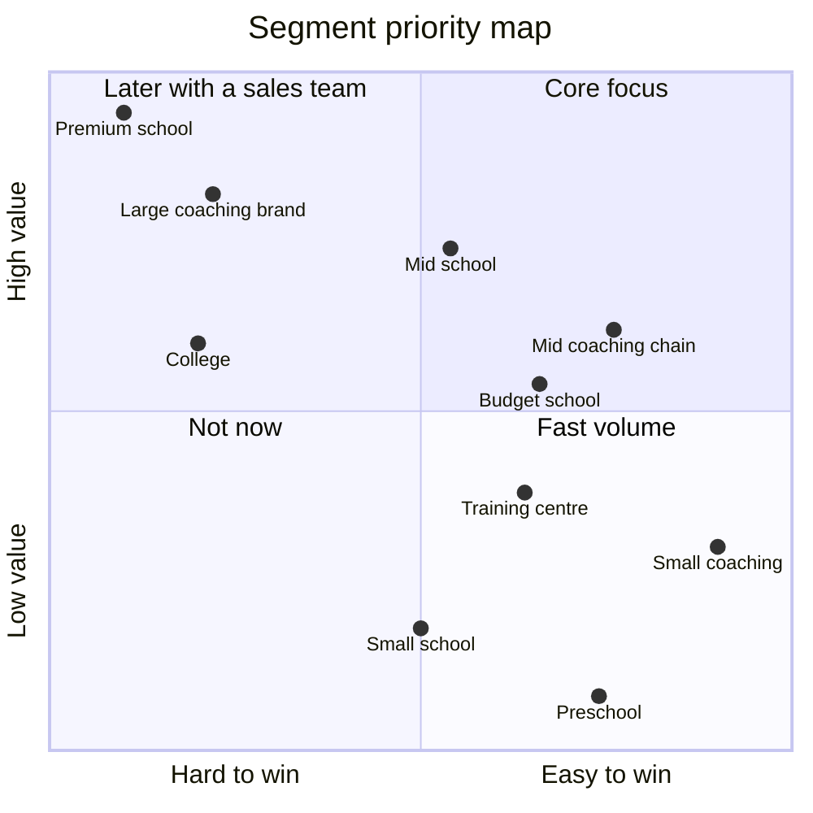
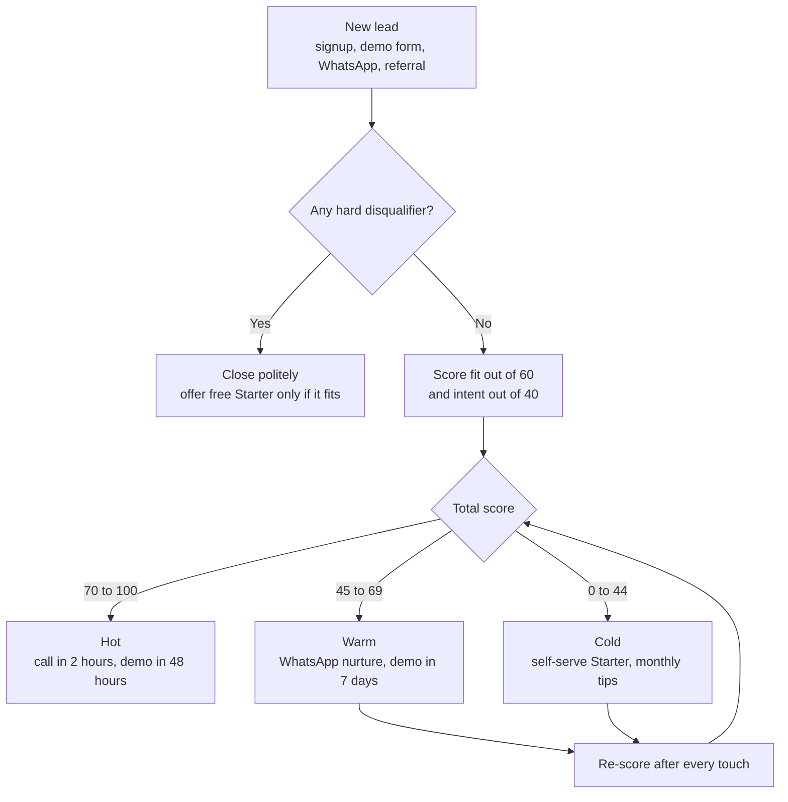
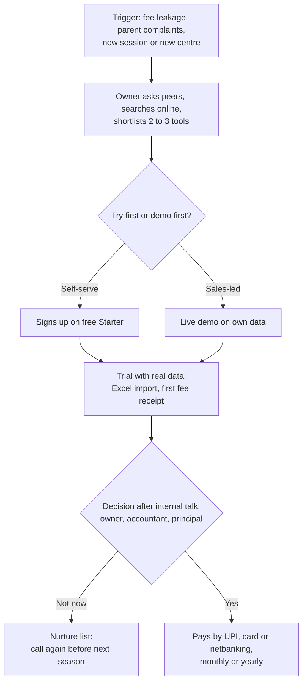
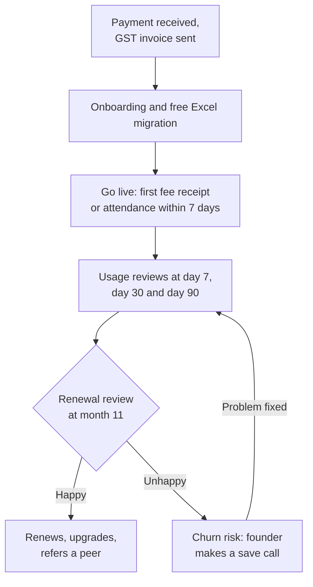

# Customer Segments and Ideal Customer Profile

**In simple words:** This chapter says exactly who EduFlow sells to first, who comes next, and who we politely refuse. It cuts the Indian market into ten segments, picks the first segment to win, and describes the ideal Year 1 customer in a way anyone can check on a phone call. It also gives a lead scoring model, a map of how institutes buy, a month-by-month buying calendar and a plan to make switching easy. A solo founder has few selling hours, so choosing the right customer is the most important sales decision.

## Words used in this chapter

| Term | Simple meaning |
|---|---|
| Segment | A group of customers with the same size, needs and buying behaviour |
| Beachhead | The first small segment we win fully before we move to the next one |
| ICP (ideal customer profile) | A clear description of the institute that gains the most from EduFlow and is easiest to win and keep |
| Lead | An institute that has shown interest but has not paid yet |
| Lead scoring | Giving points to each lead so we know whom to call first |
| Buying committee | All the people who influence one purchase, even when only one person pays |
| Sales cycle | The number of days from first contact to first payment |
| Willingness to pay | The monthly price an owner accepts without a long fight |
| Switching cost | The time, money and risk a customer faces when moving from an old tool to a new one |
| Anti-persona | A type of buyer we choose not to sell to, because serving them costs more than they pay |

This chapter does not repeat other chapters. Market counts come from *Market Sizing: TAM, SAM and SOM*. The people inside each institute are described in *Customer Personas*. Prices are explained in *Pricing Strategy*. Demo scripts and call steps are in *Sales Process and Playbooks*.

## How we cut the market

We ask four questions about every institute. The answers place it in one segment.

| Question | Why it matters | Where it shows in EduFlow |
|---|---|---|
| What type of institution is it? | A coaching owner and a school trust buy in very different ways | `Organization.type`: `COACHING`, `SCHOOL`, `COLLEGE`, `TRAINING_CENTRE` |
| How many active students? | The canon plan limits are 50, 300 and 1,000 active students | Plan: Starter, Growth, Pro or Enterprise |
| How many centres or campuses? | Pro allows up to 3 campuses; more needs the add-on or Enterprise | Multi Campus module |
| What fee level does it charge? | Fee level decides willingness to pay and the features expected | Budget, mid or premium label in our CRM |

> **Rule:** Student count is the main cutting line. It decides the plan, the price and the sales motion. Type is the second line. Everything else is a detail inside the segment.

A CRM (customer relationship management tool) is the simple list where we track every lead and customer. In Year 1 it can be a shared spreadsheet or a free CRM.

## The segmentation table

All counts below are an **Estimate**. Only the total number of private schools comes from government data (UDISE+, the yearly school census of the Ministry of Education). The split into size bands is ours. Coaching counts have no official source at all.

### Size, count, price and priority

| Segment | Students | Count in India (Estimate) | Willingness to pay per month | Sales cycle | Plan fit | Priority |
|---|---|---|---|---|---|---|
| Small coaching institute | 50–300, one centre | About 1,20,000 | ₹1,500–3,000 | 3–14 days | Growth (Starter under 50) | Beachhead |
| Mid coaching chain | 300–2,000, 2–5 centres | About 16,000 | ₹5,000–20,000 | 1–6 weeks | Pro up to 1,000 students; Enterprise above | Beachhead |
| Large coaching brand | 2,000+, 6 or more centres | About 900 | ₹25,000–2,00,000 | 3–9 months | Enterprise | Later (Year 3 onward) |
| Small private school | 50–300 | About 2,00,000 | ₹800–2,500 | 2–6 weeks | Starter or Growth | Later (self-serve welcome) |
| Budget private school | 300–800 | About 60,000 | ₹3,000–7,000 | 4–8 weeks | Pro | Next (first few from Feb 2027, wider push from Apr 2027) |
| Mid private school | 800–2,500, 1–3 campuses | About 23,000 | ₹8,000–25,000 | 2–4 months | Pro up to 1,000 students; Enterprise above | Next (selective in Year 1) |
| Premium school or school group | 2,500+, multi-campus | About 1,700 campuses | ₹30,000–3,00,000 | 4–12 months | Enterprise | Later (Year 3 onward) |
| Pre-school | 40–250 | About 60,000 | ₹500–2,000 | 1–3 weeks | Starter or Growth | Later (self-serve welcome) |
| College | 300–5,000 | About 45,800 private | ₹6,000–40,000 | 3–9 months | Pro or Enterprise | Later (from Year 3) |
| Training centre | 50–500 | About 60,000 | ₹1,500–4,000 | 1–4 weeks | Growth | Later (self-serve welcome; active from Year 3) |

The brief for this chapter lists nine segments. We added one more row, the small private school with 50 to 300 students. It is the largest pool of schools in India, so leaving it out would hide a real choice.

> **Note:** "Later" does not mean "blocked". Any institute can sign up by itself on `app.eduflow.app` and pay by card or UPI. Priority only decides where the founder's hours and the marketing rupees go.

### How the counts were built

We start from the size bands in *Market Sizing: TAM, SAM and SOM* and re-cut them to fit the segments used here.

| Segment | Source band in *Market Sizing* | Working | Result |
|---|---|---|---|
| Small coaching institute | Coaching, 51 to 300 | Taken as it is | 1,20,000 |
| Mid coaching chain | Coaching 301 to 1,000 (15,000) and 1,001 to 5,000 (2,000) | 15,000 + 60% × 2,000 = 16,200 | About 16,000 |
| Large coaching brand | Coaching 1,001 to 5,000 and above 5,000 (100) | 40% × 2,000 + 100 = 900 | About 900 |
| Small private school | Schools, 51 to 300 | 2,03,800, rounded | About 2,00,000 |
| Budget private school | Schools, 301 to 1,000 (71,300) | 85% × 71,300 = 60,605 | About 60,000 |
| Mid private school | Schools 301 to 1,000 and 1,001 to 5,000 (13,243) | 15% × 71,300 + 90% × 13,243 = 10,695 + 11,919 | About 23,000 |
| Premium school or school group | Schools 1,001 to 5,000 and above 5,000 (340) | 10% × 13,243 + 340 = 1,664 | About 1,700 |
| Pre-school | Not counted in *Market Sizing* | 12 per lakh urban people × 5,000 lakh urban people (Assumption) | About 60,000 |
| College | Private colleges (36,400) and standalone institutions (9,400) | 36,400 + 9,400 | 45,800 |
| Training centre | Training centres with more than 50 students | Taken as it is | 60,000 |

Three points to keep in mind:

1. The split shares (85%, 15%, 90%, 10%, 60%, 40%) are an **Assumption**. They are chosen so that the average size of each band stays close to the average used in *Market Sizing*.
2. About 40% of mid coaching institutes (about 6,500) already run 2 to 5 centres. The others have one large centre and plan a second one. Both behave the same way when they buy. This is an **Estimate**.
3. *Market Research: India* builds the coaching count with a different method. It finds about 2.35 lakh institutes with 50 to 300 students. We plan with the lower figure of 1.2 lakh. The five-city census described in *Market Sizing* will settle this by December 2026.

### Needs, current tools and rivals

| Segment | Top needs | Current tools | Rivals usually met |
|---|---|---|---|
| Small coaching institute | Instalment tracking, WhatsApp dues reminders, batch attendance, enquiry follow-up | Receipt book, Excel, WhatsApp groups, UPI QR code on the wall | Classplus, Teachmint, Proctur |
| Mid coaching chain | One view of all centres, centre-wise collection, discount control, test results to parents | One Excel file per centre, Tally, Google Sheets, a course-selling app | Classplus, Teachmint, Proctur |
| Large coaching brand | Custom workflows, links to own app and CRM, SSO, data warehouse | In-house software, custom ERP, a sales CRM | In-house teams and custom vendors |
| Small private school | Fee receipts, simple attendance, report card, UDISE+ data | Registers, printed receipt books, a local desktop program | Local desktop vendors, free apps |
| Budget private school | Fee dues list, report cards, parent updates, UDISE+ and board data | Desktop software with a yearly service fee, Tally, Excel, WhatsApp groups | Fedena, MyClassCampus, Vidyalaya, local vendors |
| Mid private school | All of the above plus multi-campus, transport, payroll, online fees, parent app | Older ERP, Tally, biometric machine, SMS pack | Fedena, MyClassCampus, Entab CampusCare, Edunext |
| Premium school or school group | Admissions CRM, LMS links, SSO, white-label app, custom reports, SLA | Full ERP suite, an LMS, custom integrations | PowerSchool, Blackboard (Anthology), Entab CampusCare, Edunext |
| Pre-school | Daily photo and activity updates, safe pick-up, monthly fee, enquiry follow-up | WhatsApp, registers, the franchisor's app | Specialist pre-school apps (outside the canon set) |
| College | Semester and credit records, university formats, exam cell, admissions | College ERP, Excel, university portals | Local college ERP vendors; see *Competitor Analysis* |
| Training centre | Short-course batches, instalment fees, certificates, placement follow-up | Excel, receipt book, WhatsApp | Classplus, Proctur, a generic CRM |

SSO (single sign-on) means one company login for every tool. LMS (learning management system) is software for online lessons and course content. SLA (service level agreement) is a written promise on uptime and support speed.

> **Note:** Rival names are based on public information as of September 2026; verify before external use. The full analysis is in *Competitor Analysis* and *Feature Comparison Matrix*.

## Segment profiles

### Small coaching institute

This is a teacher-owner with one centre. Think of a 150-student tuition centre in Muzaffarpur that teaches Class 9 to 12 and JEE foundation.

| Item | Detail |
|---|---|
| Typical team | Owner who also teaches, 3–8 part-time teachers, one front-desk person |
| Yearly fee income | 150 students × ₹18,000 = ₹27 lakh (Estimate) |
| Biggest pain | Nobody knows today's dues. Instalments slip. Parents say "I already paid". |
| Buys first | Student Admission, Batch, Attendance, Fees, Payments, Discounts, WhatsApp, Parent Portal |
| All needed modules are in | Phase 1, ready on 3 December 2026 |
| Price check | Growth yearly ₹24,990 is 0.93% of fee income, about ₹14 per student per month |
| Why they leave | Front-desk person quits and nobody else knows the system; owner goes back to Excel |
| How we reach them | WhatsApp, YouTube demo in Hindi, referrals from other owners, free Starter plan |

The owner decides alone. He can pay by UPI on the same call. The risk is low value per account and higher churn (customers who stop paying). We accept this because the segment gives speed, volume and word of mouth.

### Mid coaching chain

This is the best customer for Year 1. Sharma Classes in Patna, with 350 JEE and NEET students, sits at the entry of this segment.

| Item | Detail |
|---|---|
| Typical team | Director, 1–5 centre heads, 1–3 accountants, 15–60 teachers |
| Yearly fee income | Sharma Classes: 350 × ₹60,000 = ₹2.10 crore |
| Biggest pain | The owner cannot see centre-wise collection. Discounts are given without approval. Cash is handled by many hands. |
| Buys first | Everything a small institute buys, plus Multi Campus, Exams, Analytics and custom roles |
| Modules needed are in | Phase 1 and Phase 2, ready by 1 February 2027 |
| Price check | Pro yearly ₹59,990 is 0.29% of Sharma Classes' fee billing |
| Growth path | Extra campus add-on at ₹999 a month; Enterprise above 1,000 students |
| Why they leave | A course-selling app bundles a "free" ERP; or a centre head refuses to use the system |

> **Example:** A NEET institute in Indore has 1,400 students in 4 centres. It needs Enterprise (from ₹14,999 a month) because Pro stops at 1,000 students and 3 campuses. Its fee billing is about ₹8 crore a year, so the software is about 0.2% of billing. The sale takes 4 to 6 weeks because the director wants each centre head to see the demo.

### Large coaching brand

These are national and regional brands with 2,000 or more students and 6 or more centres. About 900 exist by our estimate. Many have their own technology team. They ask for custom workflows, links to their own student app, and long security reviews. One such deal can take 6 months of founder time. We do not chase them before Year 3. If one comes inbound, we quote Enterprise at list price and do not promise custom features.

### Small private school

About 2 lakh private schools have 50 to 300 students. Most charge ₹500 to ₹1,500 a month. *Market Research: India* shows a 250-student school in Sitapur where the Growth plan is 1.19% of fee income. That is a hard sale. Many of these schools have no computer operator. In Year 1 we let them sign up themselves and we help through videos and WhatsApp. From Year 2, local resellers can serve them; see *Go-To-Market Strategy*.

### Budget private school

Think of a 500-student school in Gorakhpur that charges ₹1,500 a month and follows the CBSE pattern.

| Item | Detail |
|---|---|
| Typical team | Owner or trust manager, principal, 1–2 office clerks, one accountant, 20–30 teachers |
| Yearly fee income | 500 × ₹1,500 × 12 = ₹90 lakh (Estimate) |
| Biggest pain | Fee defaulters found too late; report cards typed by hand; UDISE+ data entry every year |
| Buys first | Fees, Payments, Attendance, Exams, Report Cards, Certificates, Parent Portal, WhatsApp |
| Modules needed are in | Phase 1 and Phase 2. Exams and Report Cards arrive on 1 February 2027. |
| Price check | Pro yearly ₹59,990 plus 18% GST = ₹70,788. That is 0.79% of fee income, about ₹10 per student per month before tax. |
| Who decides | Owner decides; the principal and the accountant must agree |
| Why they leave | Transport fee not handled before June 2027; clerk finds the old desktop program faster |

This segment is "Next" and not "Beachhead" for one reason. A school will not move without report cards, and report cards ship on 1 February 2027. That leaves only 8 weeks before the April session. So in the first season we take a small number of early adopters. The wider school push runs from April to September 2027, as planned in *Executive Summary*.

### Mid private school

Bright Future Public School in Lucknow is the sample: 1,200 students, 2 campuses, fee billing of 1,200 × ₹36,000 = ₹4.32 crore a year.

| Item | Detail |
|---|---|
| Typical team | Chairman or director, principal, vice-principal, 2–4 office staff, accountant, transport in-charge, 50–100 teachers |
| Biggest pain | Two campuses with two sets of records; transport dues; payroll on Excel; parents want an app |
| Current state | Often has an older ERP with a yearly service contract |
| Buys first | Everything a budget school buys, plus Multi Campus, Transport, Payroll, Analytics, online fee payment |
| Modules needed are in | Phase 1 to Phase 3. Transport and Payroll arrive by June 2027. |
| Price check | Enterprise at ₹14,999 × 12 = ₹1,79,988 is 0.42% of fee billing |
| Who decides | A committee: owner, principal, accountant and the IT in-charge |

> **Warning:** Do not promise Transport or Payroll to a mid school before they ship in June 2027. In Year 1 we accept a mid school only if it agrees in writing to start with fees, attendance, exams and parent communication. The target is 8 such schools, not 80.

### Premium school and school group

These are large CBSE, ICSE, IB and Cambridge schools, and groups with many campuses. About 1,700 campuses have more than 2,500 students (Estimate). They run tenders, ask for reference customers of the same size, and expect a dedicated account manager. *Market Sizing: TAM, SAM and SOM* shows that the Year 5 revenue target needs about 1 in 10 of all Enterprise-size institutions. So this segment matters a lot, but only from Year 3, when EduFlow has a sales team, AI Insights, white-label apps and 500 reference customers.

### Pre-schools

Pre-schools are small (40 to 250 children) and pay monthly fees. Their main need is daily parent updates with photos, and safe pick-up. EduFlow has no photo-diary feature in the 34 modules. Many pre-schools are franchise centres, and the franchisor chooses the software. We do not market to them. A pre-school that signs up itself can use Student Admission, Attendance, Fees and WhatsApp on Starter or Growth.

### Colleges and training centres

Colleges need semesters, credits and university formats. None of this is in the 34 modules today. *Market Sizing: TAM, SAM and SOM* opens this segment from Year 3. Training centres (computer courses, spoken English, IELTS, skill courses) are much closer to coaching. They run short batches and collect instalments. The `TRAINING_CENTRE` type already exists, so they can sign up themselves. We start active selling to them in Year 3, after a Certificates and placement-tracking review.

## Which segments come first

### Segment scorecard

We score each segment from 1 (weak) to 5 (strong) on five tests. The scores are our judgement, so treat them as an **Estimate**.

- **Pain:** how much money and peace the owner loses today.
- **Speed:** how fast the institute can decide and pay.
- **Product fit:** how much of its need is covered by the modules ready by 1 February 2027.
- **Reach:** how easily a solo founder can reach the owner by WhatsApp, phone and referrals.
- **Value:** the yearly revenue from one account.

| Segment | Pain | Speed | Product fit | Reach | Value | Total (25) |
|---|---|---|---|---|---|---|
| Small coaching institute | 4 | 5 | 5 | 5 | 2 | 21 |
| Mid coaching chain | 5 | 4 | 4 | 4 | 4 | 21 |
| Budget private school | 4 | 3 | 4 | 4 | 3 | 18 |
| Mid private school | 4 | 2 | 3 | 3 | 4 | 16 |
| Small private school | 3 | 3 | 4 | 2 | 2 | 14 |
| Training centre | 3 | 4 | 3 | 2 | 2 | 14 |
| Pre-school | 2 | 4 | 3 | 3 | 1 | 13 |
| Large coaching brand | 3 | 1 | 2 | 1 | 5 | 12 |
| Premium school or school group | 3 | 1 | 1 | 1 | 5 | 11 |
| College | 3 | 1 | 1 | 2 | 4 | 11 |

> **Rule:** A total of 19 or more is a beachhead segment. A total of 15 to 18 is "Next". A total of 14 or less is "Later". Re-score every six months, because product fit rises with each release.

**Figure: Segment priority map (ease of winning against value per account)**

The right side of the map is where a solo founder can win in Year 1. Small coaching gives fast volume at a low price. Mid coaching chains and budget schools give the best mix of speed and value. The top-left corner holds the big accounts that need a sales team, references and Phase 4 features.

### Why coaching is the beachhead

1. The owner decides alone, often within 14 days.
2. Phase 1 covers the full need, so we can sell from the January 2027 launch.
3. Coaching buys all year, because new batches start many times a year. Schools buy mostly from January to March.
4. Owners in one city know each other. One happy owner on Boring Road in Patna brings three more.
5. Coaching institutes charge 18% GST and can usually claim the GST on EduFlow as input credit. For a school, GST is a pure cost. See *Market Research: India*.
6. The strongest rivals in coaching focus on selling online courses. EduFlow focuses on running the offline institute: fees, attendance and parents. See *Competitor Analysis*.

### Year 1 customer mix target

This table splits the Year 1 target of 120 paying organizations by segment. It uses the same plan mix as *Business Objectives, Scope and Stakeholders* (72 Growth, 40 Pro, 8 Enterprise). It is a target, not a forecast.

| Segment | Plan | Paying organizations | Price per month | Plan MRR |
|---|---|---|---|---|
| Small coaching institute | Growth | 60 | ₹2,499 | ₹1,49,940 |
| Small schools, pre-schools, training centres (self-serve) | Growth | 12 | ₹2,499 | ₹29,988 |
| Mid coaching chain, up to 1,000 students | Pro | 18 | ₹5,999 | ₹1,07,982 |
| Budget private school | Pro | 20 | ₹5,999 | ₹1,19,980 |
| Mid private school, up to 1,000 students | Pro | 2 | ₹5,999 | ₹11,998 |
| Mid coaching chain, above 1,000 students | Enterprise | 2 | ₹14,999 | ₹29,998 |
| Mid private school, above 1,000 students | Enterprise | 6 | ₹14,999 | ₹89,994 |
| **Total** | | **120** | | **₹5,39,880** |

MRR (monthly recurring revenue) is the subscription money that comes in every month. Add-ons of about ₹500 per organization bring another ₹60,120. The total is ₹6,00,000, which is the canon target of ₹6 lakh MRR at a blended ARPA (average revenue per account) of ₹5,000.

What the mix tells us:

- Coaching is 80 of 120 customers (67%) and ₹2,87,920 of plan MRR (53%).
- Schools are 28 customers (23%) but bring ₹2,21,972 of plan MRR (41%). Each school is worth more.
- Self-serve "Later" segments are 12 customers (10%) and ₹29,988 (6%). They need no founder time.

## Ideal Customer Profile for Year 1

### The ICP in one line

The Year 1 ideal customer is a coaching institute or a budget to mid private school with 100 to 1,500 students and 1 to 3 campuses. It sits in a Tier 2 or Tier 3 city of Bihar, Uttar Pradesh, Madhya Pradesh or Rajasthan, or in Delhi NCR. It runs on registers, Excel and WhatsApp today. Its owner can decide within 30 days.

Tier 2 means about 100 cities with 5 lakh to 40 lakh people, such as Patna, Lucknow, Indore and Jaipur. Tier 3 means smaller towns, such as Sitapur, Sikar and Muzaffarpur. The full definition is in *Market Research: India*.

### ICP attributes

| Attribute | Ideal value for Year 1 | Why it matters |
|---|---|---|
| Institution type | Coaching (JEE, NEET, boards, SSC, banking, state PSC) or private unaided K-12 school | The product is built for the `COACHING` and `SCHOOL` types |
| Active students | 100 to 1,500; sweet spot 150 to 800 | Big enough to feel fee leakage; too small to have an IT team |
| Centres or campuses | 1 to 3 | Fits Growth and Pro with no custom work |
| Geography | Tier 2 and Tier 3 cities of Bihar, UP, MP, Rajasthan; plus Delhi NCR | Hindi and English; founder can visit; rivals' field teams are thin |
| Yearly fee per student | ₹12,000 to ₹60,000 | EduFlow stays under 1% of fee income |
| Yearly fee income | ₹25 lakh to ₹5 crore | Can pay ₹25,000 to ₹1.8 lakh a year without a long approval |
| Fee style | Instalments or monthly fees, with regular dues | Fee leakage is the pain we solve best |
| Current tools | Registers, receipt book, Excel, Tally, WhatsApp groups; or an old desktop program | Low switching cost; clear before-and-after story |
| Decision maker | Owner or director reachable on phone or WhatsApp | Short sales cycle; founder-led selling works |
| Staff readiness | One person who knows Excel; a laptop at the fee counter; broadband or 4G | Needed for one-day onboarding |
| Parent base | Most parents use WhatsApp and UPI | Drives parent adoption (target 70%) and online fee share (target 40%) |
| Language | Staff can work on English screens; demo and support in Hindi or English | Matches what a solo founder can support |

Fee leakage means fee money that is due but never collected, or collected but never recorded. *Problem Statement and Proposed Solution* puts it at about 4% of billing for Sharma Classes.

### Three ICP variants

| Variant | Who | Size | Plan | Sell from | Year 1 target |
|---|---|---|---|---|---|
| ICP-A (core) | Coaching institute, 1–3 centres | 100–1,500 students | Growth, Pro or Enterprise | January 2027 | 80 customers |
| ICP-B | Budget private school | 300–800 students | Pro | February 2027 | 20 customers |
| ICP-C (selective) | Mid private school, 1–3 campuses | 800–1,500 students | Pro or Enterprise | February 2027, wider after June 2027 | 8 customers |

Must-have signals for every variant:

1. The owner or director joins the first or second call.
2. The institute collects fees in instalments or monthly, and has dues today.
3. At least one staff member can use Excel and a smartphone.
4. The institute agrees to load real student data within 7 days of signup.

Red flags that move a lead out of the ICP:

1. "We want it customised exactly like our register."
2. "Give us one full session free, then we will see."
3. The clerk is the only contact and will not introduce the owner.
4. The institute wants online course selling or recorded video hosting as the main feature.

### Why these states and cities

| Region | First cities | Why it fits | Year 1 action |
|---|---|---|---|
| Bihar | Patna, Muzaffarpur, Gaya, Bhagalpur, Darbhanga | Dense coaching clusters; low software use; Hindi-first; home of Sharma Classes | Pilot and first referrals; coaching owner WhatsApp groups |
| Uttar Pradesh | Lucknow, Kanpur, Prayagraj, Varanasi, Gorakhpur, Agra, Meerut | Largest school and coaching base in India; April session; home of Bright Future | First school early adopters; coaching hubs for UPPSC and NEET |
| Madhya Pradesh | Indore, Bhopal, Gwalior, Jabalpur | Indore is a classic Tier 2 coaching hub; thin vendor presence | Remote demos; one city visit per quarter |
| Rajasthan | Jaipur, Sikar, Kota, Jodhpur, Udaipur | Students now study near home, so local institutes grow; state coaching rules push clean records | Coaching first; check the local school session month before school campaigns |
| Delhi NCR | Delhi, Noida, Ghaziabad, Gurugram, Faridabad | High density; owners expect an app; good reference value | Sell to mid coaching chains in Mukherjee Nagar, Laxmi Nagar and Karol Bagh |

These five regions share one language pair (Hindi and English), one time zone and mostly one school calendar. That keeps demos, videos, templates and support simple. Other Indian states are served through self-serve signup in Year 1. Southern and western city launches are planned in *Go-To-Market Strategy*.

> **Founder note:** Build the first lead list from these cities only: 500 coaching institutes and 200 schools. Use Google Maps, Justdial and owner WhatsApp groups. A narrow list that you call fully beats a wide list that you touch once.

### First-call ICP checklist

Ask these ten questions in the first call. Seven or more "Yes" answers mean the lead is inside the ICP.

| # | Question | ICP answer |
|---|---|---|
| 1 | Is it a coaching institute or a private unaided school? | Yes |
| 2 | Does it have 100 to 1,500 active students? | Yes |
| 3 | Does it have 1 to 3 centres or campuses? | Yes |
| 4 | Is it in Bihar, UP, MP, Rajasthan or Delhi NCR? | Yes |
| 5 | Are fees collected in instalments or every month? | Yes |
| 6 | Does it use registers, Excel, Tally or a desktop program today? | Yes |
| 7 | Am I speaking with the owner, or can I reach the owner this week? | Yes |
| 8 | Is there a laptop or desktop at the fee counter, with internet? | Yes |
| 9 | Does the owner want to start within 90 days? | Yes |
| 10 | Does the owner accept a price band of ₹2,499 to ₹14,999 a month? | Yes |

## Lead scoring model

Lead scoring turns the ICP into numbers. Every lead gets 0 to 100 points. Fit (who they are) gives up to 60 points. Intent (how ready they are) gives up to 40 points.

### Criteria and points

| Group | Criterion | Answer | Points |
|---|---|---|---|
| Fit | Institution type | Coaching institute | 12 |
| Fit | Institution type | Private unaided K-12 school | 10 |
| Fit | Institution type | Pre-school or training centre | 5 |
| Fit | Institution type | College | 2 |
| Fit | Active students | 100 to 1,000 | 20 |
| Fit | Active students | 50 to 99, or 1,001 to 2,500 | 12 |
| Fit | Active students | Above 2,500 | 6 |
| Fit | Active students | Under 50 | 0 |
| Fit | Geography | Tier 2 or 3 city in Bihar, UP, MP, Rajasthan; or Delhi NCR | 10 |
| Fit | Geography | Any other Hindi or English-first city in India | 6 |
| Fit | Geography | City where staff work mainly in another language | 3 |
| Fit | Current tool | Registers, Excel, Tally or WhatsApp groups | 10 |
| Fit | Current tool | Unhappy with current software; contract ends within 6 months | 8 |
| Fit | Current tool | Old desktop program | 6 |
| Fit | Current tool | Happy with a rival and under contract | 0 |
| Fit | Contact person | Owner or director | 8 |
| Fit | Contact person | Principal or centre head who can reach the owner | 5 |
| Fit | Contact person | Clerk or teacher only | 1 |
| Intent | Pain named by the lead | Fee dues, cash mismatch or parent complaints | 10 |
| Intent | Pain named by the lead | General interest: "just exploring" | 3 |
| Intent | Timing | Wants to go live within 30 days or before the next session | 10 |
| Intent | Timing | Within 90 days | 6 |
| Intent | Timing | "Next year" | 1 |
| Intent | Engagement | Signed up on Starter and activated within 7 days | 10 |
| Intent | Engagement | Attended a live demo | 6 |
| Intent | Engagement | Enquiry or brochure only | 2 |
| Intent | Budget | Accepts the price band, or already pays for software | 5 |
| Intent | Budget | Price not discussed yet | 2 |
| Intent | Budget | Asks for a one-time lifetime price or a free full session | 0 |
| Intent | Digital readiness | Laptop with internet at the counter and one Excel user | 5 |
| Intent | Digital readiness | Smartphone only | 2 |

"Activated" uses the canon definition: first fee receipt or first attendance within 7 days of signup. The maximum is 12 + 20 + 10 + 10 + 8 = 60 for fit and 10 + 10 + 10 + 5 + 5 = 40 for intent.

### Thresholds and actions

| Grade | Score | First response | Who handles it | Next step |
|---|---|---|---|---|
| Hot | 70 to 100 | Call within 2 working hours | Founder | Live demo within 48 hours, on the lead's own data |
| Warm | 45 to 69 | WhatsApp reply the same day | Founder, then automated messages | Demo within 7 days; weekly Hindi webinar invite; re-score after each touch |
| Cold | 0 to 44 | Automated welcome | Nobody; self-serve | Free Starter plan, one useful tip a month, no calls |

### Hard disqualifiers

A lead with any of these is closed politely, whatever the score:

1. Government or government-aided school that buys through tenders.
2. Outside India (Year 1 only; UAE opens in Year 2).
3. Demands on-premise installation, source code or a one-time lifetime licence.
4. Wants to keep fee collection off the books, with no numbered receipts.
5. Needs a feature outside the 34 modules as the main reason to buy, for example video course selling.

### Worked examples

| Lead | Fit points | Intent points | Total | Grade |
|---|---|---|---|---|
| Sharma Classes, Patna: coaching, 350 students, Excel and receipt book, owner Rajesh Sharma on call, fee dues pain, wants April start, attended demo, accepts price, laptop ready | 12 + 20 + 10 + 10 + 8 = 60 | 10 + 10 + 6 + 5 + 5 = 36 | 96 | Hot |
| Bright Future Public School, Lucknow: school, 1,200 students, old desktop program, principal Dr. Anita Verma on call, parent complaints, 90 days, attended demo, accepts price, laptop ready | 10 + 12 + 10 + 6 + 5 = 43 | 10 + 6 + 6 + 5 + 5 = 32 | 75 | Hot |
| A 450-student school in Gorakhpur: old desktop program, clerk only, "just exploring", "next year", brochure only, price not discussed, laptop ready | 10 + 20 + 10 + 6 + 1 = 47 | 3 + 1 + 2 + 2 + 5 = 13 | 60 | Warm |
| A 40-student home tutor in Chennai: registers, owner on call, "just exploring", "next year", enquiry only, wants lifetime price, smartphone only | 12 + 0 + 3 + 10 + 8 = 33 | 3 + 1 + 2 + 0 + 2 = 8 | 41 | Cold |

The Gorakhpur school is a good fit with weak intent. The right move is to reach the owner, not to push the clerk. Suppose the owner joins a live demo and names a fee dues problem. Contact person rises from 1 to 8, pain from 3 to 10, and engagement from 2 to 6. The score moves from 60 to 78 and the lead turns Hot.

**Figure: Lead routing from first contact to action**

Every lead is first checked against the hard disqualifiers. Then it is scored and sent to one of three tracks. Warm and Cold leads are scored again after each new action. A Cold lead that activates on Starter can become Hot within a week.

### Expected lead volumes in Year 1

*Business Objectives, Scope and Stakeholders* plans 65 customers from direct sales and 55 from self-serve upgrades. The table shows one way the sales-led 65 can come from scored leads. Every number is an **Estimate**.

| Grade | Leads in Year 1 | Close rate | Customers |
|---|---|---|---|
| Hot | 160 | 30% | 48 |
| Warm | 240 | 7% | 17 |
| Cold | 600 | Not called; they feed Starter signups | 0 from sales |
| **Total** | **1,000** | | **65** |

Formula: customers = leads × close rate. If the Hot close rate is only 20%, we need 240 Hot leads for the same 48 customers. Track this every month; see *KPI Framework and Dashboard*.

> **Best practice:** Check the model after the first 100 scored leads and again after the first 50 paying customers. If many Warm leads buy faster than Hot leads, the points are wrong. Change the points, not the thresholds.

## Buying committee

Even a one-owner institute has a buying committee. The owner pays, but other people can slow the sale or quietly kill the usage later. The people are described in full in *Customer Personas*. Here we list only their part in the purchase and how to win each one.

### Coaching institute

| Person | Buying role | EduFlow role after purchase | What they care about | How we win them |
|---|---|---|---|---|
| Owner or director (Rajesh Sharma) | Decision maker and payer | `ORG_ADMIN` | Seeing money and dues on his phone; control over discounts | Show today's collection and the dues list on his phone in 5 minutes |
| Centre head | Influencer | `PRINCIPAL` | Batches, attendance, fewer parent calls | Show the centre-only view and the daily absent list |
| Accountant or front desk (Suresh Gupta) | Gatekeeper, daily user, possible blocker | `ACCOUNTANT` | Speed at the counter; day-end total; job safety | Invite him to the first demo; collect a fee and print a receipt in under a minute |
| Senior teacher | User, silent blocker | `TEACHER` | No extra work | Mark attendance for a batch in under one minute on a phone |
| Chartered accountant of the institute | Influencer | None | GST invoices, clean receipts, Excel exports | Send a sample GST invoice and a sample fee report |
| Owner friends in the same city | Influencer | None | "Does their team pick up the phone?" | Fast support for every customer; ask happy owners for referrals |
| Parents | Indirect influencer | `PARENT` | Proof of payment; knowing the child reached class | WhatsApp receipt and absent alert in the demo |

### Private school

| Person | Buying role | EduFlow role after purchase | What they care about | How we win them |
|---|---|---|---|---|
| Chairman, trust manager or owner | Decision maker and payer | `ORG_ADMIN` | Fee recovery, reputation, one view of all campuses | Show dues recovered in rupees; give two reference schools of the same size |
| Principal (Dr. Anita Verma) | Strong influencer | `PRINCIPAL` | Report cards she can trust; board and UDISE+ data; less paperwork | Show a report card in her school's format |
| Accountant | Gatekeeper, daily user | `ACCOUNTANT` | Fee heads, concessions, day-end match, audit trail | Import opening dues; run old and new systems side by side for 7 days |
| IT in-charge or computer teacher | Technical checker | Helper to `ORG_ADMIN` | Data safety, backups, export, slow internet | One-page security note; promise of full data export at any time |
| Office clerk | Daily user, silent blocker | Custom role such as Front Desk | Speed compared with the old desktop program | Fast admission form; bulk import from Excel |
| Class teachers (Priya Nair) | Users, silent blockers | `TEACHER` | Time taken for attendance and marks entry | Mobile attendance in one minute; marks entry by batch |
| Parents (Sunita Devi) | Indirect influencers | `PARENT` | Alerts, fee receipts, no new password | Parent Portal with OTP login |
| Trust board or family elders | Approve large spends | None | Cost and vendor stability | Yearly invoice, written data-export promise, public price list |

OTP (one-time password) login means the parent signs in with a code sent to the phone. There is no password to remember.

How spend size changes the committee (Estimate from market practice):

| Yearly spend | Who must agree | Typical extra time |
|---|---|---|
| Up to ₹30,000 (Growth) | Owner alone | None |
| ₹30,000 to ₹2 lakh (Pro, entry Enterprise) | Owner, plus principal or centre head, plus accountant | 1–3 weeks |
| Above ₹2 lakh (larger Enterprise) | Trust or management committee meeting; sometimes 3 written quotes | 1–3 months |

> **Tip:** Always ask for the accountant to join the first demo. *Customer Personas* shows that owners bring the accountant in late. A late accountant becomes a blocker. An early accountant becomes a champion (an insider who pushes the product for us).

## Buying process

The buying process has two halves. The first half runs from the trigger to the first payment. The second half runs from the payment to the renewal. We draw them as two small figures so that each stays readable.

**Figure: Buying process, part one (from trigger to purchase)**

The flow has two doors: self-serve signup and a live demo. Both doors lead to the same key moment, which is a trial with the institute's real data. A lead that says "not now" is not lost. It goes to a nurture list and gets a call before the next buying season.

**Figure: Buying process, part two (from purchase to renewal)**

After payment, the first 90 days decide the renewal. A customer who collects fees and marks attendance every week almost always renews. An unhappy customer gets a save call from the founder, a fix, and then goes back into the usage reviews.

| Step | Small or mid coaching | Budget or mid school | What EduFlow does |
|---|---|---|---|
| Trigger to search | 1–7 days | 1–2 weeks | Be findable: Hindi demo video, Google Business profile, owner referrals |
| Shortlist and first contact | Same day | 3–7 days | Reply on WhatsApp within 2 working hours; score the lead |
| Demo or trial | 1–3 days | 1–2 weeks | 20-minute demo on the lead's own batches and fee amounts |
| Internal talk | 1–3 days | 1–2 weeks | Send a one-page summary with price, GST and go-live date |
| Price talk and payment | Same day | 3–7 days | Hold list price; offer free Excel migration instead of a discount |
| Onboarding and go-live | 1–2 days | 1–2 weeks | Import data; train accountant and teachers; first receipt within 7 days |
| First 90 days | Weekly check | Weekly check | Usage review call at day 7, day 30 and day 90 |
| Renewal | Month 11 (yearly) or every month | Month 11 | Show rupees collected, dues recovered and parent adoption |
| **Total to first payment** | **3–14 days (small), 1–6 weeks (mid)** | **4–8 weeks (budget), 2–4 months (mid)** | |

How they pay: most owners pay from the institute's current account by UPI or netbanking through Razorpay. Schools often ask for a printed quotation and a GST invoice first. The yearly plan (10 months' price for 12 months) is popular because cash comes in at admission time.

## Buying triggers

A trigger is an event that makes the owner start looking for software this week. A lead with a fresh trigger is worth five leads without one. Ask "What happened that made you look now?" in every first call.

| Trigger | Most common in | What the owner says | How we spot it | Best response |
|---|---|---|---|---|
| Fee leakage found | All coaching; budget schools | "The register shows paid, the bank does not." | Asks about receipts and day-end reports | Demo the dues list and the day-end cash summary first |
| New session is near | Schools (Jan–Mar); coaching (Feb–Jun) | "We want to start clean from 1 April." | Asks about go-live dates | Give a dated go-live plan and free Excel migration |
| Second centre or campus opens | Mid coaching; mid schools | "I cannot sit in both places." | Asks about multi-branch reports | Demo Multi Campus with centre-wise collection |
| Accountant or clerk resigns | All | "Only he knew the Excel file." | Urgent tone; asks about training | Offer a one-day start and role-based logins |
| Student count crosses about 200 | Small coaching; small schools | "Excel has become too slow and messy." | Mentions many Excel files | Show Excel import and search by name or phone |
| Parent dispute over a payment | All | "The parent says he paid. We have no proof." | Asks about receipts on WhatsApp | Show the numbered receipt and parent payment history |
| A rival institute launches an app | Coaching; mid schools | "Parents ask why we have no app." | Asks about parent app first | Show Parent Portal and WhatsApp alerts |
| A national brand opens in town | Tier 2 and 3 coaching | "We must look professional." | Asks about branding | Show branded receipts, report cards and portal |
| Old software renewal is due | Budget and mid schools | "They raised the yearly fee again." | Asks about price and data transfer | Public price list; migration plan; side-by-side week |
| Old vendor stops support | Schools on desktop programs | "Nobody picks up the phone now." | Asks about support hours | Show support promise from *Customer Success, Onboarding and Support* |
| Rule or inspection pressure | Coaching (2024 guidelines, state laws); schools (UDISE+, board checks) | "We need proper records." | Asks about registers and exports | Show student records, fee receipts and exports; see *Compliance, Legal and Data Protection Requirements* |
| Tax or audit notice | Coaching above the GST limit | "My CA wants clean receipts." | The CA joins the call | Show receipt series, audit log and Excel exports |

## Seasonal buying calendar

*Market Research: India* explains the academic calendar. The table below turns it into a month-by-month sales plan. It follows EduFlow's business year, from October to September. Dates in the last column are for Year 1.

| Month | Schools | Coaching | Buying mood | EduFlow action in Year 1 |
|---|---|---|---|---|
| October | Half-yearly exams; Dussehra break | Mid-session tests; festival break | Low | Build sprint starts 5 Oct 2026; build the list of 700 ICP leads |
| November | Diwali and Chhath holidays; second fee instalment follow-up | Owners review collections after Diwali | Low, rising late | Pilot starts 18 Nov 2026 with 5 free institutes; collect fee-leakage stories |
| December | Winter break; admission forms open; next year's fees planned | Foundation batches planned; scholarship tests announced | Rising | Sprint ends 3 Dec; publish pilot stories; book January demos |
| January | New-session admissions; budgets fixed | Early admissions for April batches | High | Public paid launch; daily demos; coaching first |
| February | Pre-boards and practicals; principals busy | Admission counselling; crash courses | High | V1.0 ready on 1 Feb 2027; start school demos; keep demos to 20 minutes |
| March | Board and annual exams; results; year ends 31 March | Boards end; JEE and NEET enquiries jump | Highest | Close deals; run free Excel migrations; plan go-live for 1 April |
| April | Session starts; fee collection peak | New batches start; admission peak | Medium: late buyers rush, others say "next year" | Onboarding sprints; first receipt within 7 days for every new customer |
| May | Summer break in the north from mid-May; office staff have free time | Admission peak continues; summer batches | Medium for coaching; low for schools | Coaching campaign; data entry for schools that bought late |
| June | North reopens late June; south and Maharashtra start session | NEET and JEE results; dropper batches fill; new centres open | Second peak for coaching | V1.5 ships (Transport, Payroll, Hostel, Library, Inventory); open mid-school selling |
| July | Steady teaching; first unit tests | Batches settle; second instalment follow-up | Medium for coaching chains; low for schools | Upsell WhatsApp credits and extra campus; ask for referrals and reviews |
| August | First-term exams; parent-teacher meetings | Test series; mid-course dues | Low to medium | Case studies; weekly webinars; test the first reseller after 30–50 customers |
| September | Half-yearly exam preparation; large schools start next-year planning | Revision; new-centre planning for next year | Low, with early planners | V2.0 ships; Year 1 closes at 120 paying; start April 2028 early-bird talks with mid schools |

A dropper batch is a one-year batch for students who repeat JEE or NEET after Class 12.

> **Note:** Some state-board schools start the session later than April. *Market Research: India* lists June for the south and for Maharashtra's state board. Rajasthan state-board schools have traditionally opened in July, and a move to April has been discussed. Verify the local calendar before a school campaign in any new state.

> **Warning:** January to March is only 13 weeks. With a 4 to 8 week school sales cycle, a school lead that arrives after mid-February will most likely go live after 1 April. Offer these late buyers a mid-session start with fees and attendance first, so the sale is not lost for a full year.

Renewals follow purchases. A customer who buys a yearly plan in March 2027 renews in March 2028. So from Year 2, the busiest selling months are also the busiest renewal months. Renewal calls should happen in month 10 and month 11, before the rush; see *Customer Success, Onboarding and Support*.

## Switching costs and how we lower them

### What switching really costs the customer

| Switching cost | Who feels it | Size (Estimate) | How EduFlow lowers it |
|---|---|---|---|
| Moving student and guardian data | Clerk, accountant | 2–5 days of typing for 500 students | Excel import with ready templates; free assisted Excel migration |
| Moving fee structure and opening dues | Accountant | 1–3 days; high fear of mistakes | Opening-dues import; dues total checked and signed off by the accountant |
| Learning a new tool | All staff | 1–2 weeks of slow work | Simple screens; role-based menus; 2-hour training per role; Hindi videos |
| Double work during the change | Accountant, clerk | 1–2 weeks | Planned 7-day side-by-side run, then a clear cut-over date |
| Parents must learn a new channel | Parents | Low, but the owner fears complaints | OTP login, no password; WhatsApp messages carry the link |
| Money already spent on old software | Owner | ₹15,000–₹1,00,000 paid for the year | Start EduFlow as the old contract ends; monthly plan for the overlap |
| Mid-session risk | Owner, principal | Fear of wrong receipts during term | Start with attendance and new receipts only; import old dues later |
| Fear of being locked in again | Owner, IT in-charge | Trust issue, not a rupee cost | Full data export to Excel at any time; no setup fee; monthly plan available |
| Loss of a branded app from the old vendor | Coaching owner | Pride and parent habit | Branded portal on `{slug}.eduflow.app`; white-label app as a paid add-on from Phase 4 |

### Free Excel migration policy

The canon lists "assisted data migration" as a ₹9,999 one-time add-on, and includes migration in Enterprise. For Year 1 we add a simple sales policy on top. It is an **Assumption** of this chapter; *Pricing Strategy* governs if it differs.

| Migration type | What it covers | Price |
|---|---|---|
| Self-serve Excel import | Templates and import screens for students, guardians, batches, fee structure and opening dues | Free on every plan, always |
| Free assisted Excel migration (Year 1 policy) | EduFlow cleans and loads the customer's current-session Excel or CSV files | ₹0 for Growth and Pro customers who pay for a yearly plan |
| Assisted data migration add-on | Data from other software, past-year receipts, scanned documents, more than one past session | ₹9,999 one-time (canon price) |
| Enterprise migration | All of the above, planned with the account manager | Included in Enterprise |

Why free: the owner's real fear is not the price. It is "Who will type 500 students again?" Free migration removes this fear. It also costs us less than a discount.

> **Example:** Sharma Classes sends one Excel workbook with 350 students. The work is a 30-minute call, 90 minutes of cleaning, 20 minutes of import and 30 minutes of checking with Suresh Gupta. That is about 3 hours. At a loaded cost of ₹500 an hour (Assumption), the migration costs EduFlow ₹1,500. A 20% discount on Pro yearly would cost ₹11,998. Free migration is 8 times cheaper and solves the real problem.

Steps of a free assisted Excel migration:

1. The customer pays for a yearly Growth or Pro plan.
2. We send four Excel templates: students with guardians, batches, fee structure, opening dues.
3. The customer sends its own files in any layout. We map the columns to the templates.
4. We clean the data: remove duplicate students by phone number, fix date formats, split full names, flag missing fields.
5. We import into the customer's organization. The import runs as a background job, and every row stays inside the customer's own `organization_id`.
6. We send a check report: students per batch, total opening dues, rows skipped and why.
7. The accountant compares the dues total with the old register and approves on WhatsApp or email.
8. The customer goes live. The target is 48 hours from receiving the files (Assumption).

Capacity check for Year 1: 120 customers × 3 hours = 360 hours in the year. The peak is March and April. If 25 customers arrive in those six weeks, the load is 75 hours, or about 2 hours a day. A solo founder can carry this with one part-time support person. Above 40 migrations a month, the work moves to a trained support hire or a reseller; see *Organization and Hiring Plan*.

> **Rule:** Never offer free migration from another vendor's database without seeing the export first. If the old vendor gives no export, the work can take days. Quote the ₹9,999 add-on, or start fresh with the current session only.

Other ways we lower switching cost:

- **Free Starter plan.** A small institute can try with 50 real students at no cost and no time limit.
- **No setup fee and a monthly option.** The owner risks only ₹2,499 or ₹5,999 in the first month.
- **One-day start.** The canon mission promises that an institute can start within one day.
- **Data export promise.** A customer can export students, fees and receipts to Excel at any time. This lowers the fear of a second lock-in.
- **Overlap help.** If the old software is paid until June, the customer can start EduFlow on the monthly plan in April and move to yearly in July.

## Anti-personas: who not to sell to

Saying no protects the founder's time, the support load and the product roadmap. Each anti-persona below looks like a customer at first. Each one costs more than it pays in Year 1.

| Anti-persona | How to spot them on the first call | Why not | What to do instead |
|---|---|---|---|
| Government or aided school | Talks about tenders, lowest-price rules, department approval | Long cycles, late payments, state software is often free | Decline; revisit only through a partner in Year 4 or later |
| National coaching brand with its own tech team | Asks for API specs, custom workflows, security forms on the first call | 6 to 9 month cycle; custom demands; can build in-house | Quote Enterprise list price; no custom promises before Year 3 |
| Premium international school | Wants LMS, admissions CRM, SSO and integrations on day one | Needs Phase 4 features and references of the same size | Stay in touch; invite to a pilot in Year 3 |
| Online course seller or YouTube educator | Main need is selling recorded courses and live classes | EduFlow is not an LMS or a course store | Say so clearly; they are better served by course-selling apps |
| "Lifetime licence" or on-premise buyer | Asks for a one-time price, a local server or source code | EduFlow is cloud-only, one codebase for all tenants | Explain the monthly plan and data export; then move on |
| Full-custom seeker | "Make it exactly like my register and my old software." | Custom work for one customer breaks a multi-tenant product | Show settings and custom roles; decline custom code |
| Off-the-books operator | Wants no numbered receipts, or wants to edit old receipts freely | Audit logs and receipt series cannot be switched off; legal risk | Decline politely |
| Free-forever heavy-support user | Under 50 students, wants calls and visits, will never upgrade | Support cost with zero revenue | Starter plan with videos and help articles only |
| Franchise pre-school centre | The franchisor decides the software | The local owner cannot buy | Note the franchisor's name; approach the head office in Year 3 |
| College or university department (Year 1 and 2) | Needs semesters, credits and university formats | Not in the 34 modules yet | Add to the Year 3 waiting list |
| Institute outside India (Year 1) | Wants Stripe billing, local tax invoices, local privacy terms | International packs arrive in Phase 4; UAE opens in Year 2 | Add to the waiting list by country |
| Price shopper tied to a rival contract | Has 2 years left on a contract; wants our quote to bargain | No intent to switch | Send the public price page; re-contact 6 months before the contract ends |
| Institute with no device or internet | No laptop, weak network, nobody uses Excel | Cannot activate; will churn in a month | Suggest Starter on a phone; revisit in a year |

An API (application programming interface) is the way two software systems exchange data. API access is an Enterprise feature in the canon.

> **Best practice:** Say no in a warm way. A good line is: "EduFlow is not the right fit for this need today. I do not want to waste your money. May I call you when we add it?" A polite no today often becomes a referral tomorrow.

A simple test for any doubtful lead: will this customer need more than 5 hours of founder time in the first month, and pay less than ₹5,999 a month? If yes, move it to self-serve.

## Key takeaways

- The beachhead is coaching: about 1.36 lakh small and mid coaching institutes exist (Estimate). The owner decides alone, and Phase 1 covers the full need. The sweet spot is 100 to 1,500 students.
- Budget and mid private schools are "Next". A few start from February 2027 when Exams and Report Cards ship, and the wider push runs from April 2027. Mid schools are selective until Transport and Payroll ship in June 2027.
- The Year 1 target mix is 80 coaching customers, 28 schools and 12 self-serve others. Together with add-ons it builds the canon target of ₹6 lakh MRR.
- The ICP lives in Tier 2 and Tier 3 cities of Bihar, UP, MP and Rajasthan, plus Delhi NCR. One language pair and one main calendar keep a solo founder efficient.
- Score every lead out of 100: 60 for fit and 40 for intent. Hot is 70 or more, Warm is 45 to 69, Cold is under 45. Only Hot and Warm leads get founder time.
- Schools buy mostly from January to March; coaching buys all year, with peaks from March to June. The sales plan follows this calendar month by month.
- Free Excel migration costs about ₹1,500 of our time and removes the biggest switching fear. It is a better tool than a discount.
- Refusing anti-personas is part of the strategy. Government tenders, custom-build seekers, course sellers and lifetime-licence buyers are closed politely in Year 1.

## Sources

No new external research was done for this chapter. All market counts are re-cut from other chapters, and every re-cut is labelled as an Estimate or Assumption.

- *Market Sizing: TAM, SAM and SOM* (internal chapter, 2026): size bands for private unaided schools (based on UDISE+ 2024-25) and for coaching institutes (Estimate), colleges (AISHE 2022-23) and training centres (Estimate)
- *Market Research: India* (internal chapter, 2026): city tiers, coaching hubs, academic calendar, price sensitivity and the alternative coaching count
- *Problem Statement and Proposed Solution* (internal chapter, 2026): fee billing of Sharma Classes and Bright Future Public School
- *Business Objectives, Scope and Stakeholders* (internal chapter, 2026): Year 1 plan mix of 72 Growth, 40 Pro and 8 Enterprise
- EduFlow Canon, version 1.0, 20 September 2026 (internal): prices, plan limits, module phases, dates and targets
