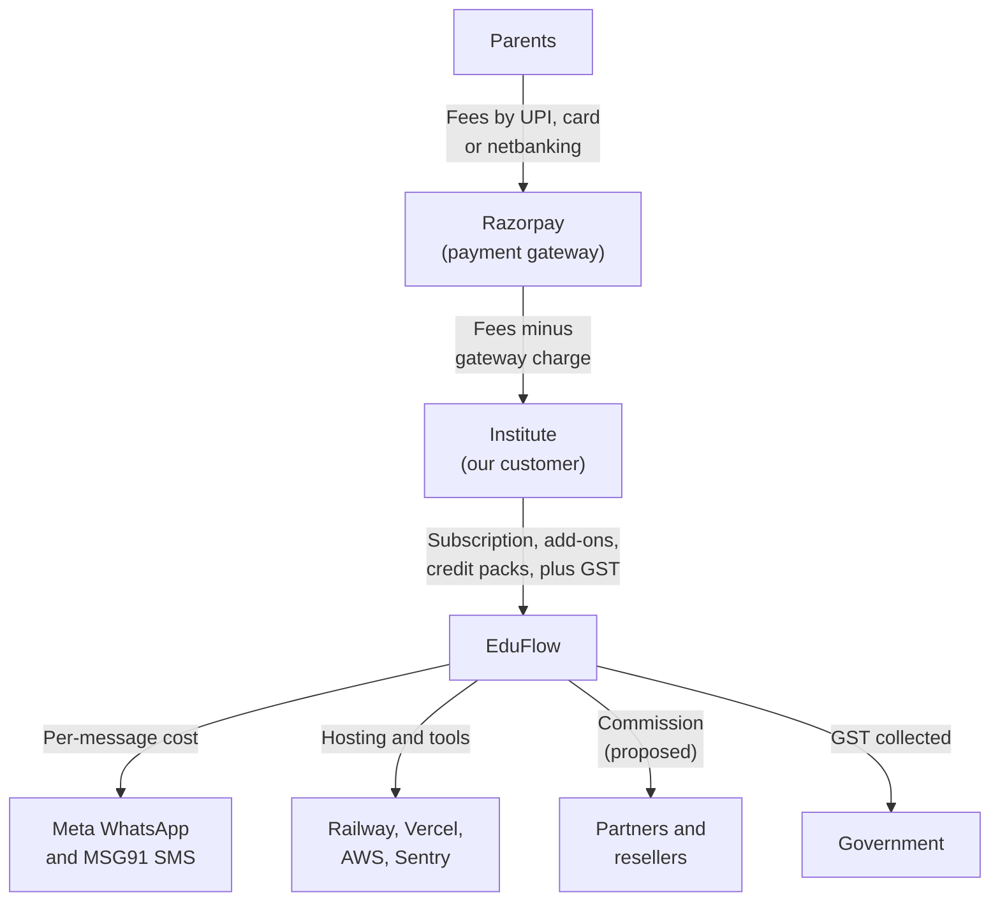
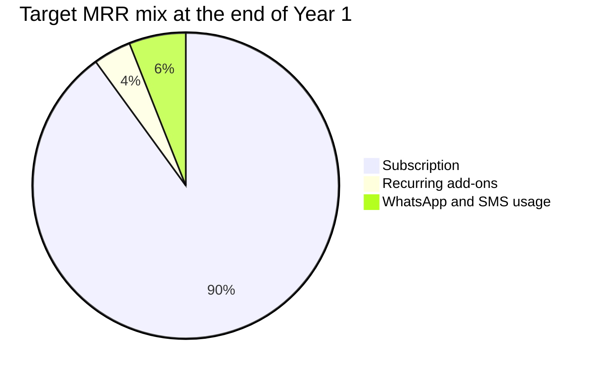
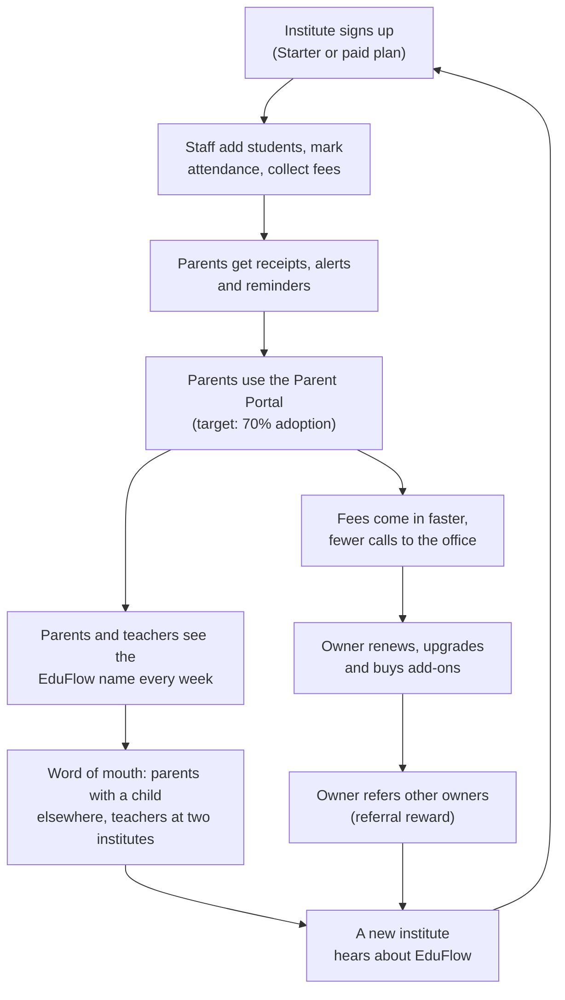

# Business Model

**In simple words:** This chapter explains how EduFlow earns money, what it costs to serve a customer, and why the numbers work. It covers every revenue stream: subscriptions, the free plan, Enterprise deals, add-ons, WhatsApp and SMS credits, payments and partners. It also shows worked unit economics (the profit maths for one customer) for a Growth and a Pro customer. Read it before *Pricing Strategy* and *Financial Plan and Projections*, because both build on the logic here.

## The business model on one page

EduFlow is a SaaS business (software as a service — the customer rents the software and pays every month or year). The institute pays EduFlow. Parents and students never pay EduFlow. The institute pays more when it grows, adds campuses, turns on extra products or sends more messages.

| Revenue stream | What the institute pays for | Price anchor (India, before GST) | Type | Share of MRR, end of Year 1 (target) |
|---|---|---|---|---|
| Subscription | The right to use EduFlow on a plan | ₹2,499, ₹5,999 or from ₹14,999 a month | Recurring | 90% |
| Recurring add-ons | Extra campus, AI Insights, white-label app monthly fee | ₹999, ₹1,499, ₹4,999 a month | Recurring | 4% |
| Usage | WhatsApp credit packs and SMS packs | ₹499 to ₹7,999 packs; ₹1,250 per 5,000 SMS | Re-occurring, pay as you use | 6% |
| One-time services | Data migration, on-site training, white-label setup | ₹9,999; ₹4,999 a day; ₹49,999 | One-time | Outside MRR |
| Payments | Online fee collection through Razorpay or Stripe | Gateway cost passed through; no EduFlow markup | None in Year 1 | 0% |

MRR means monthly recurring revenue — the money that comes in every month from active customers. ARPA means average revenue per account — MRR divided by the number of paying organizations.

> **Rule:** In this BRD, MRR and ARPA include three things: subscription fees, recurring add-on fees, and the average monthly value of credit packs used. One-time fees stay outside MRR. Taxes such as GST are never revenue. We collect them and pay them to the government.

**Figure: How money flows around EduFlow**

Parents pay fees to the institute through the gateway. That money never touches an EduFlow bank account. The institute pays EduFlow for software, add-ons and message credits. EduFlow then pays its own suppliers, its partners and the tax office.

## Business model canvas

A business model canvas is a one-page map of a business in nine blocks. It shows who we serve, what we give them, how we reach them, how we earn and what we spend on.

| Block | In simple words | EduFlow answer | Key number |
|---|---|---|---|
| Customer segments | Who pays us | Coaching institutes first, then K-12 private schools; later colleges and training centres | 120 paying organizations by Sep 2027 (target) |
| Value propositions | Why they pay | One simple system for admissions, attendance, fees, exams, staff and parent messages; live in one day | Pro costs about ₹17 per student per month at Sharma Classes |
| Channels | How they find and buy | Self-serve signup, WhatsApp and video demos, founder-led sales in Tier 2 cities, referrals, partners later | 55 of 120 customers from self-serve (estimate) |
| Customer relationships | How we keep them | Free Starter plan, guided onboarding, WhatsApp support, priority support on Pro, account manager on Enterprise | Monthly churn under 3% (target) |
| Revenue streams | How money comes in | Subscription, add-ons, WhatsApp and SMS credits, one-time services; payments pass-through in Year 1 | ARPA ₹5,000 a month in Year 1 (target) |
| Key resources | What we must own | The multi-tenant product, the founder, Claude Code as build tool, customer data trust, the EduFlow brand | One codebase serves every organization |
| Key activities | What we must do well | Build and ship modules, onboard fast, support in Hindi and English, keep data safe, sell before each April session | 34 modules in four phases |
| Key partners | Who we depend on | Meta (WhatsApp), Razorpay, Stripe, MSG91, Twilio, Amazon SES, Railway, Vercel, AWS, local resellers | Commission proposed at 20% then 10% |
| Cost structure | Where money goes | Team pay, hosting, message costs, gateway fees, marketing, partner commission, tools, legal and accounting | Gross margin 80% or more (target) |

How the blocks fit together:

1. The free Starter plan and the low Growth price bring many small institutes in through self-serve channels.
2. Parents and teachers use the product every week. This creates habit, data and word of mouth.
3. Institutes grow, add campuses and turn on more modules. They move from Starter to Growth to Pro to Enterprise.
4. Add-ons and message credits raise revenue per customer without new sales effort.
5. One shared codebase and database keep the cost of serving each new customer very low.

## Revenue streams

### SaaS subscription

The subscription is the core of the business. It should stay above 70% of recurring revenue in every year. The plans and prices are fixed in the canon. Every price excludes tax.

| Plan | Students | Campuses | Monthly price | Yearly price | MRR we count for a yearly payer |
|---|---|---|---|---|---|
| Starter (free forever) | up to 50 | 1 | ₹0 | ₹0 | ₹0 |
| Growth | up to 300 | 1 | ₹2,499 | ₹24,990 | ₹2,083 |
| Pro | up to 1,000 | up to 3 | ₹5,999 | ₹59,990 | ₹4,999 |
| Enterprise | unlimited | unlimited | from ₹14,999 | custom yearly contract | contract value ÷ 12 |

Formula: yearly price = 10 × monthly price. MRR for a yearly payer = yearly price ÷ 12. For Pro this is ₹59,990 ÷ 12 = ₹4,999.

**What decides the plan.** Two simple limits decide the plan: active students and campuses. The owner does not count users, storage or modules. Sharma Classes has 350 students, so it needs Pro, because Growth stops at 300. Bright Future Public School has 1,200 students on 2 campuses, so it needs Enterprise, because Pro stops at 1,000.

**How revenue grows inside one customer.** This growth is called expansion revenue (extra money from customers we already have).

| Step | Trigger | Example | MRR change |
|---|---|---|---|
| Starter to Growth | 51st active student, or need for WhatsApp reminders | A tuition centre grows from 45 to 70 students | ₹0 to ₹2,499 |
| Growth to Pro | 301st student, second campus, Payroll or Transport needed | Sharma Classes grows from 280 to 350 students | ₹2,499 to ₹5,999 |
| Pro to Enterprise | 1,001st student, fourth campus, white-label or SSO needed | A school group adds a third school | ₹5,999 to ₹14,999 or more |
| Any plan plus add-on | New need inside the same plan | A Pro school turns on AI Insights | plus ₹1,499 |

**How we bill.** In India we bill through Razorpay: UPI AutoPay or card mandate for monthly plans, and UPI, netbanking, card or bank transfer for yearly plans. Enterprise customers pay by bank transfer against a GST invoice. Outside India we bill through Stripe in USD, AUD or AED.

**One possible plan mix for the Year 1 target.** *Business Objectives, Scope and Stakeholders* shows how ₹6 lakh MRR can be built. This chapter uses the same mix.

| Revenue line | Organizations | Price per month | MRR | Share |
|---|---|---|---|---|
| Growth plan | 72 | ₹2,499 | ₹1,79,928 | 30.0% |
| Pro plan | 40 | ₹5,999 | ₹2,39,960 | 40.0% |
| Enterprise plan | 8 | ₹14,999 | ₹1,19,992 | 20.0% |
| Recurring add-ons | 22 add-ons sold | ₹999 or ₹1,499 | ₹23,978 | 4.0% |
| WhatsApp and SMS usage | 120 | about ₹300 each | ₹36,000 | 6.0% |
| **Total** | **120** | **ARPA about ₹5,000** | **₹5,99,858** | **100%** |

This is an illustration, not a forecast. Notice that 48 Pro and Enterprise customers bring 60% of MRR. The 72 Growth customers bring 30%.

> **Warning:** Yearly billing gives 2 months free. If half of all Growth and Pro customers pay yearly, their counted MRR falls by about 8%. We still prefer yearly billing. It brings cash on day one, it lowers churn, and it cuts gateway fees and failed payments.

**GST and the real price the customer feels.** We add 18% GST to every invoice in India. Pro yearly is ₹59,990 plus ₹10,798 GST, so the customer pays ₹70,788.

| Customer type | Can it claim GST back? | What it means for us |
|---|---|---|
| Coaching institute registered for GST | Usually yes, as input tax credit | The real cost is the price before GST |
| K-12 school (school education is mostly exempt from GST) | Usually no | GST is a real cost; quote the price with GST in proposals |
| Small institute without GST registration | No | Same as above; the Growth price with GST is ₹2,949 a month |

> **Note:** The GST treatment above is a general view (assumption). Confirm it with a chartered accountant before it goes into sales material. Details are in *Compliance, Legal and Data Protection Requirements*.

**International subscription revenue.** The same plans sell at higher prices abroad. This is the main reason blended ARPA can rise over five years.

| Plan | India | UAE (at AED 1 = ₹23) | USA (at US$1 = ₹85) | Australia (at A$1 = ₹56) |
|---|---|---|---|---|
| Growth, monthly | ₹2,499 | AED 299 = ₹6,877 | $79 = ₹6,715 | A$119 = ₹6,664 |
| Pro, monthly | ₹5,999 | AED 749 = ₹17,227 | $199 = ₹16,915 | A$299 = ₹16,744 |
| Enterprise, from | ₹14,999 | AED 1,849 = ₹42,527 | $499 = ₹42,415 | A$749 = ₹41,944 |

An international Growth customer brings about 2.7 times the rupee revenue of an Indian one. Support, compliance and sales costs are also higher abroad. *Market Research: USA, Australia and UAE* covers those costs.

**Seasonality.** Indian schools start a new session in April. Coaching institutes admit most students from April to July. So new sales peak from January to June, and cancellations peak in March and April when the session changes. Yearly plans sold in the January to April season will also renew in that season. Cash will be strong in those months and thin from August to December. The monthly cash view is in *Financial Plan and Projections*.

### Freemium logic: the free Starter plan

Freemium means a free plan that is useful on its own, plus paid plans for those who need more. Starter is free forever for up to 50 active students on 1 campus.

**Why we give a free plan**

| Reason | Explanation |
|---|---|
| Small institutes cannot pay much | A home tuition with 30 students earns little. Today it uses a register, Excel and WhatsApp groups, which cost nothing. |
| A solo founder cannot demo to everyone | Self-serve signup lets the product sell itself. The founder spends demo time on Pro and Enterprise leads. |
| Every free institute is a small billboard | About 34 families per free account see "Powered by EduFlow" on receipts, emails and the Parent Portal. |
| Institutes grow | A good tuition centre crosses 50 students within one or two sessions. The upgrade then happens by itself. |
| Trust before payment | Owners fear losing data and wasting money. Using the real product for free removes that fear. |
| It is cheap for us | One free account costs about ₹36 a month to serve (estimate, worked below). |

**What Starter includes and where the walls are**

| Limit | Starter value | What the owner feels | Upgrade trigger |
|---|---|---|---|
| Active students | 50 | Adding student 51 returns `PLAN_LIMIT_REACHED` with an upgrade button | Growth in size |
| Campuses | 1 | Cannot add a second centre | Second branch |
| Users | 1 admin + 3 staff | The fourth teacher cannot get a login | Team growth |
| Messaging | In-app and email only | No WhatsApp or SMS fee reminders | Late fees and parent calls |
| Online fee payment | Not included | Records cash and direct UPI by hand; no pay link for parents | Owner wants faster collection |
| Modules | Phase 1 core modules | No Exams, Report Cards, Timetable, Homework or Certificates | Exam season |
| Branding | EduFlow branding stays | Receipts and portal show the EduFlow name | Owner wants own brand |
| Support | Help centre and email | No phone or WhatsApp support line | Owner wants a person to call |

The free plan must stay truly useful. A 40-student tuition centre can run admissions, attendance, fee receipts and the Parent Portal on it for years. If the free plan feels like a trap, word of mouth turns negative.

**Conversion levers.** These are the things that move a free account to a paid plan. The Year 1 target for free-to-paid conversion is 15%.

| Lever | How it works | When it fires |
|---|---|---|
| Student limit | Hard stop at 50 active students with a one-click upgrade | When the institute grows |
| WhatsApp fee reminders | Show "12 parents have not opened the email reminder. Send on WhatsApp?" | Around each fee due date |
| Online fee payment | Show how many days faster paid-plan institutes collect fees | Month-end, when dues pile up |
| 14-day Growth trial | New signups start with all Growth features, then drop to Starter, never to a locked account | First two weeks |
| Exam season prompt | Offer Report Cards just before term exams | September, December, March |
| Session-start offer | Yearly plan reminder before the April session | February to April |
| Staff cap | Invite for the fourth teacher shows the Growth benefit | When the team grows |
| Human touch | One WhatsApp message from the founder to every active free account with 35 or more students | Weekly review |

> **Note:** The 14-day trial is a proposal. The plan table in the database already has a `trialDays` setting with a default of 14. The final trial rule is set in *Pricing Strategy*.

**Cost to serve one free account (estimate)**

| Cost item | Working | Cost per month |
|---|---|---|
| Hosting share | ₹10 base per organization + ₹0.40 × 34 average students | ₹24 |
| Email through Amazon SES | About 200 emails a month | ₹2 |
| File storage on S3 | About 0.5 GB of photos and documents | ₹1 |
| Support | 0.15 tickets a month × ₹60 per ticket | ₹9 |
| **Total** | | **₹36** |

Formulas and results:

- Monthly cost of the free pool = free accounts × ₹36. At the Year 1 target of 300 free organizations this is 300 × ₹36 = ₹10,800 a month. That is 1.8% of the ₹6 lakh MRR target.
- Free pool cost for the whole of Year 1 = about 1,230 account-months × ₹36 = about ₹44,000. The pool grows from 0 in January 2027 to 300 in September 2027.
- Cost per upgrade = ₹44,000 ÷ 55 upgrades = about ₹800. This ₹800 sits inside the CAC of a self-serve Growth customer later in this chapter.
- Break-even check: one Growth upgrade gives about ₹2,300 gross profit a month. One upgrade therefore pays for 64 free accounts in that month.

> **Best practice:** Watch two numbers every month: free pool cost as a share of MRR (keep under 3%) and free-to-paid conversion (target 15%). If cost crosses 3% and conversion is under 8%, tighten the free plan. Lower the student limit for new signups only. Never take features away from existing free users.

**Guard rails for the free plan**

1. One Starter organization per verified mobile number and per owner. This stops one institute from splitting into three free accounts.
2. An account with no login for 90 days gets a warning email. After 180 days we archive it and offer a data export. This also follows the data minimisation idea in the DPDP Act.
3. Free accounts get no WhatsApp or SMS sending. So a free account can never create a message bill for us.
4. Heavy file uploads are capped by plan storage. Storage is the only cost that can grow quietly.

### Enterprise deals

Enterprise is for school groups, large schools and coaching chains. The price starts at ₹14,999 a month on a custom yearly contract. It includes everything: AI Insights, white-label, SSO (single sign-on — staff log in with the organization's own Google or Microsoft account), API access, a dedicated account manager, a custom SLA (service level agreement — a written promise on uptime and response time) and data migration.

| Deal element | EduFlow position | Why |
|---|---|---|
| Contract term | 12 months minimum; 24 or 36 months for a lower price | Longer terms lower churn and sales cost |
| Payment terms | Yearly in advance, or quarterly in advance for a higher price | Advance cash funds a bootstrapped company |
| Price basis | Students and campuses; floor of ₹14,999 a month | Simple to explain; grows with the customer |
| Price guide (proposed) | About ₹10 to ₹12.50 per student per month at scale, never below the floor | Bright Future at the floor pays about ₹12.50 per student |
| Included services | Data migration, staff training sessions online, account manager | Removes the fear of switching |
| Custom work | No custom code per customer; configuration and API only | One codebase is the base of our margin |
| SLA | 99.5% monthly uptime, 4-hour response for urgent tickets (proposed) | Promise only what Railway or AWS can deliver |
| Exit | Full data export in CSV and PDF within 30 days of request | Builds trust; supports DPDP portability |

> **Example:** Bright Future Public School (Lucknow, 1,200 students, 2 campuses) signs at the entry price. Contract value = ₹14,999 × 12 = ₹1,79,988 a year, plus 18% GST of ₹32,398, so the school pays ₹2,12,386. Our direct cost is about ₹3,400 a month: hosting ₹490, AI compute ₹400 and account manager plus support time ₹2,500. Gross profit on the subscription is about ₹11,600 a month, or 77%. WhatsApp credits are billed on top.

Enterprise deals are slow. Expect 2 to 4 months from first meeting to signature, with a demo for the owner, the principal and the accountant. Large schools may deduct TDS (tax deducted at source) from our invoice. TDS is not a cost, but it delays that part of the cash until we claim the credit in our tax return. The full sales steps are in *Sales Process and Playbooks*.

> **Founder note:** In Year 1 the target mix has only 8 Enterprise customers, but they bring 20% of MRR. Losing one Enterprise customer hurts as much as losing six Growth customers. Give each one a named contact from day one.

### Add-ons

Add-ons let a customer pay for one extra thing without changing plan. They raise ARPA with almost no sales effort, because the customer buys them inside the app.

| Add-on | India price | Who buys it | Our cost to deliver (estimate) | Gross margin (estimate) |
|---|---|---|---|---|
| Extra campus | ₹999 a month | Growth institute opening a second centre; Pro school adding a fourth campus | About ₹100: hosting for the extra students and support | About 90% |
| AI Insights | ₹1,499 a month (Growth and Pro; included in Enterprise) | Owners who want dropout risk, fee default risk and result trends | About ₹250: AI model usage and compute | About 83% |
| White-label mobile app, setup | ₹49,999 one-time | Schools and chains that want their own app name and icon | About ₹15,000: store accounts, build, review and publishing work | About 70% |
| White-label mobile app, monthly | ₹4,999 a month | Same customers | About ₹1,000: store updates, new builds, push messages | About 80% |
| Assisted data migration | ₹9,999 one-time (included in Enterprise) | Institutes with old software or large Excel files | About ₹3,600: 12 hours of customer success time | About 64% |
| On-site training | ₹4,999 a day | Schools with many non-technical staff | About ₹2,500: trainer day and local travel | About 50% |

Rules and assumptions for add-ons:

1. The extra campus add-on works on Growth and Pro (assumption). It adds a campus. It does not raise the student limit of the plan.
2. AI Insights and the white-label app ship in Phase 4, by September 2027. So they add almost nothing to Year 1 revenue. They matter from Year 2.
3. Outstation travel for on-site training is billed at actual cost (proposed). A local partner can deliver the training instead.
4. One-time services are priced to cover their cost and remove a buying barrier. They are not a profit engine.

**Attach rate targets.** Attach rate means the share of paying customers that buy an add-on.

| Add-on | End of Year 1 | End of Year 3 | End of Year 5 |
|---|---|---|---|
| Extra campus | 15% of paying organizations (18 campuses) | 20% | 25% |
| AI Insights (Growth and Pro) | 3% (4 early users) | 20% | 30% |
| White-label mobile app | 0% | 3% | 5% |
| Assisted data migration | 25% of new Growth and Pro customers | 25% | 20% |
| On-site training | 10% of new customers | 10% | 8% |

All attach rates are estimates. They are the inputs behind the add-on line in the revenue mix table later in this chapter.

> **Example:** One-time revenue in Year 1 (estimate): 20 migrations × ₹9,999 = ₹1,99,980, plus 15 training days × ₹4,999 = ₹74,985. Total about ₹2.75 lakh. This is outside MRR, but it is useful cash in the launch months.

### Usage revenue: WhatsApp credit packs

Indian parents read WhatsApp, not email. So WhatsApp is the main paid message channel. EduFlow connects directly to the WhatsApp Cloud API from Meta. There is no BSP in the middle (BSP means business solution provider — a reseller of WhatsApp access that adds its own fee). This keeps our cost at Meta's own rate.

**How Meta charges.** Since 1 July 2025 Meta charges per delivered template message. A template is a message format that Meta approved in advance. The price depends on the message category and on the country code of the person who receives it.

| Meta category | What it is for | EduFlow examples | Meta rate, India (public rate card, 2026) | EduFlow price (+15%) |
|---|---|---|---|---|
| Marketing | Promotion, offers, re-engagement | "Admissions open for JEE 2028 batch", festival offer, enquiry follow-up | ₹0.8631 | ₹0.9926 |
| Utility | Updates about a service the person already uses | Fee due reminder, fee receipt, absence alert, test score, homework, timetable change | ₹0.1150 | ₹0.1323 |
| Authentication | One-time passwords | Parent and student login OTP | ₹0.1150 | ₹0.1323 |
| Service | Free-form replies within 24 hours of the parent's own message | Parent asks "Is tomorrow a holiday?" and the office replies | Free | Free |

Other Meta rules that matter to our model:

- A utility template sent inside an open 24-hour service window is free.
- Utility and authentication messages get cheaper at very high monthly volume. Marketing messages do not.
- The rate follows the receiver's country code. A parent with a UAE number costs the UAE rate, even if the institute is in India.
- Meta decides the category of each template. If a fee reminder contains a promotion, Meta can mark it as marketing. The cost then rises about 7.5 times (₹0.8631 ÷ ₹0.1150).

> **Note:** The Meta rates above are based on public information as of September 2026. Meta changes its rate card from time to time. It raised the India marketing rate by about 10% for 2026. Verify the live rate card before launch. Our price engine must read rates from a table, never from code.

**How we charge.** The institute buys a prepaid credit pack. The pack value goes into its WhatsApp wallet in rupees. Every delivered message deducts the Meta rate plus 15% from the wallet. There is no bonus on bigger packs in Year 1. A bigger pack only means fewer recharges.

Formula: price per message = Meta rate × 1.15. Our margin per message = Meta rate × 0.15. Our margin as a share of the pack value = 0.15 ÷ 1.15 = 13.04%.

| Pack | Pack price (before GST) | Utility messages it buys | Marketing messages it buys | Meta cost to us | Our margin |
|---|---|---|---|---|---|
| Small | ₹499 | about 3,770 | about 500 | ₹434 | ₹65 |
| Medium | ₹1,999 | about 15,100 | about 2,010 | ₹1,738 | ₹261 |
| Large | ₹7,999 | about 60,480 | about 8,060 | ₹6,956 | ₹1,043 |

> **Example:** Sharma Classes has 350 students. In one month it sends 3,500 utility messages (fee reminders, absence alerts and weekly test scores), 200 marketing messages to old enquiries, and 500 login OTPs. The wallet deduction is 3,500 × ₹0.1323 + 200 × ₹0.9926 + 500 × ₹0.1323 = about ₹728. Meta bills us about ₹633. Our margin is about ₹95. One ₹1,999 pack lasts Sharma Classes almost three months.

**Why the margin is only 15%.** WhatsApp is a retention tool first and a profit line second. Fee reminders on WhatsApp make fees come in faster. That is the result the owner pays the subscription for. A high markup would push owners back to free WhatsApp groups, and we would lose the data and the habit. The 15% covers failed-payment risk, gateway fees on pack purchases, and the work of template approval and support.

| Risk in WhatsApp revenue | Effect | Guard rail |
|---|---|---|
| Meta raises rates | Customer wallets drain faster; complaints | Rates live in a table; we pass changes through with 15 days notice in the app |
| Template marked as marketing | Cost rises about 7.5 times for that message | Ship clean, pre-approved utility templates; block free-text promotion in utility templates |
| Institute connects its own WhatsApp account and pays Meta directly | We earn no margin on those messages | Allowed on Enterprise only; the subscription price already covers it (assumption) |
| Pack bought by card | Gateway fee of about 2% eats part of the 13% margin | Promote UPI for pack purchase; suggest the Medium pack as default |
| Wallet runs empty in fee week | Reminders stop; the owner blames EduFlow | Low-balance alert at 20%; optional auto-recharge |
| Usage revenue grows very large | Reported gross margin falls, because message revenue carries only 13% margin | Report software margin and message margin on separate lines |

> **Note:** This model assumes EduFlow pays Meta and recharges institutes through the wallet. The exact WhatsApp account setup (shared sender or each institute's own number) is listed for validation in *Assumptions, Open Questions and Validation Plan*.

### Usage revenue: SMS packs and DLT

SMS is the fallback channel. It reaches parents with basic phones or with no data pack. The SMS module ships in Phase 2. In India we send through MSG91. Outside India we use Twilio.

**What DLT is.** DLT (Distributed Ledger Technology platform) is the TRAI system that controls business SMS in India. Every sender must register as a business on a telecom operator's DLT portal. Every sender name (a 6-letter header such as `EDUFLW`) and every message template must be approved before use. An SMS that does not match an approved template is blocked by the operator. Promotional SMS can go only between 10 am and 9 pm, and not to numbers on the do-not-disturb list.

| DLT choice | How it works | Good for | Decision |
|---|---|---|---|
| Shared EduFlow header | EduFlow registers once; the institute name appears inside the message text | Fast start on day one; no paperwork for the institute | Default on Growth |
| Institute's own header | The institute registers on a DLT portal (about ₹5,900 one-time, estimate) and links MSG91 as its telemarketer | Brand name as sender; large schools | Supported on Pro and Enterprise, with guided setup |

**SMS pack economics**

| Item | Value | Note |
|---|---|---|
| Pack price | ₹1,250 for 5,000 SMS credits | ₹0.25 per credit, fixed in the canon |
| Our cost per SMS | About ₹0.18 | Estimate: MSG91 route charge plus operator DLT charge; confirm the quote before launch |
| Margin per SMS | ₹0.25 − ₹0.18 = ₹0.07 | 28% of the price |
| Margin per pack | 5,000 × ₹0.07 = ₹350 | Before the gateway fee on the purchase |
| One credit covers | 160 English characters, or 70 characters in Hindi script | Longer messages use more credits |

> **Example:** A fee reminder in Hindi with 150 characters needs 3 SMS credits, so it costs the institute ₹0.75. The same reminder as a WhatsApp utility message costs ₹0.13. WhatsApp is almost 6 times cheaper here. So the product sends on WhatsApp first and uses SMS only as the fallback. That is good for the customer, and it is also why SMS will stay a small revenue line.

Revenue expectation: in the Year 1 target mix, SMS is about ₹6,000 of the ₹36,000 monthly usage revenue (24,000 SMS a month across all customers). WhatsApp is the other ₹30,000.

### Payments: pass-through in Year 1, options later

Parents pay fees online through Razorpay in India and Stripe abroad. The gateway takes its charge: about 2% on cards and netbanking, and low or zero on UPI. The rest settles into the institute's own bank account. EduFlow never holds this money and adds no markup in Year 1.

**Why zero markup now**

1. The Year 1 goal is adoption: 40% of fee value collected online. Any extra fee slows that.
2. Online payment makes EduFlow sticky. Auto-receipts and auto-reconciliation (matching bank money to invoices without manual work) are hard to give up.
3. Owners in Tier 2 cities already dislike the 2% gateway charge. A second charge from us would hurt trust.
4. Holding or routing customer money brings RBI rules for payment aggregators. Staying out of the money flow keeps compliance simple.

**Options after Year 1.** Fee payments are the largest money flow near our product. Sharma Classes collects roughly ₹2 crore a year in fees (estimate). Bright Future Public School collects about ₹4.3 crore (1,200 students × ₹36,000 average fee, the assumption used in *Executive Summary*). Even a tiny share is meaningful. But each option has a risk.

| Option | How it works | Revenue potential (estimate) | Main risk | Verdict |
|---|---|---|---|---|
| A. Stay pass-through | No payment revenue at all | ₹0 | We leave money on the table | Year 1 and Year 2 |
| B. Gateway partner revenue share | Razorpay or Stripe pays us a small share of its own fee for volume we bring | About 0.05% to 0.20% of online fee value | The rate depends on the gateway; it can be cut | First choice from Year 3 |
| C. Convenience fee paid by the parent | For example ₹15 per online payment | About ₹28,800 a year at Bright Future | Parent anger; card network and state fee rules; bad for the school's name | Avoid |
| D. Platform fee paid by the institute | For example 0.25% of online fee value | About ₹43,200 a year at Bright Future | Pushes owners back to cash; hurts the 40% online target | Avoid unless the market norm changes |
| E. Financial services through partners | Fee loans or EMI for parents, instant settlement for institutes | Referral fee of about 1% to 2% of loan value | RBI digital lending rules; reputation risk if a lender behaves badly | Study in Year 3; pilot in Year 4 |

> **Example:** Option B at Bright Future Public School. Fee value ₹4.32 crore a year × 40% online = ₹1.73 crore. At a 0.10% partner share, EduFlow earns ₹17,280 a year, or ₹1,440 a month. That lifts the revenue from this customer by about 10% with no new cost to the school or the parents.

Decision: payments stay pass-through in Year 1 and Year 2. From Year 3 we plan for Option B only. In the revenue mix table, payments reach about 4% of MRR by Year 5. That is a target under an assumption, not a promise. If we ever change payment pricing, existing customers get 90 days written notice.

### Partner and reseller channel economics

> **Note:** Everything in this section is a **proposed policy**. It is not live. The final partner programme is set in *Go-To-Market Strategy*. *Market Research: India* shows that local resellers usually earn 20% to 30% of first-year value and 10% to 15% on renewals. Our proposal sits at the simple, low end of that band.

**Who partners are.** Local IT vendors, CA (chartered accountant) firms, education consultants and school supply dealers. They already have the owner's trust in towns the founder cannot visit. We start the programme after the first 30 to 50 direct customers, when the pitch and the onboarding steps are proven. That is around April to June 2027 (estimate).

| Policy item | Proposed rule |
|---|---|
| First-year commission | 20% of subscription and recurring add-on fees collected in the customer's first 12 months, before GST |
| Recurring commission | 10% of the same fees from month 13, for as long as the customer pays and the partner stays active |
| Active partner | At least one new paying customer in the last 12 months |
| Not commissionable | WhatsApp and SMS packs, gateway charges, GST, one-time setup fees |
| Services delivered by the partner | Partner keeps 70% of the on-site training or migration fee when it does the work itself |
| Payout timing | Monthly, within 15 days after month-end, only on money already received from the customer |
| Refund clawback | If the customer gets a refund within 30 days, the commission is reversed |
| Lead protection | A registered lead stays with that partner for 90 days |
| Customer price | Same public price as direct; partners may not mark up or discount without approval |
| Tax | Commission is paid against the partner's invoice; TDS is deducted as the law requires |

**What a partner earns**

| Deal sold by the partner | First-year fees | Year 1 commission (20%) | Commission from Year 2 (10% a year) |
|---|---|---|---|
| Growth, monthly billing | ₹2,499 × 12 = ₹29,988 | ₹5,998 | ₹2,999 |
| Pro, yearly billing | ₹59,990 | ₹11,998 | ₹5,999 |
| Enterprise at the entry price | ₹1,79,988 | ₹35,998 | ₹17,999 |

> **Example:** A CA firm in Patna brings 20 Pro customers in one year. It earns 20 × ₹11,998 = about ₹2.4 lakh in the first year, and about ₹1.2 lakh every year after that while those customers stay. This is real money for a small firm, and it rewards the partner for keeping the customer happy.

**What the channel costs us.** Commission replaces our own marketing and sales cost for that customer. We count commission as a sales and marketing cost, not as a cost of service.

| Measure for one Pro customer (yearly billing) | Direct sale | Partner sale |
|---|---|---|
| Cost to win the customer (CAC) | ₹15,000 | ₹11,998 commission + ₹2,000 partner support = ₹13,998 |
| Gross profit per month | ₹4,603 | ₹4,603 |
| Recurring commission per month | ₹0 | ₹500 (10% of ₹4,999) |
| Profit per month after commission | ₹4,603 | ₹4,103 |
| LTV at 2% monthly churn | ₹2,30,150 | ₹2,05,150 (uses ₹4,103 for the whole life, a careful view) |
| LTV:CAC | 15.3 to 1 | 14.7 to 1 |

The partner sale is almost as healthy as the direct sale. The 10% recurring share is the price we pay for reach and for a local person who keeps the customer happy. These terms (CAC, LTV, churn) are explained in the next section.

> **Rule:** Guard rails for the channel (proposed). Total commissions stay under 8% of MRR. No partner gets an exclusive territory in Year 1 or Year 2. EduFlow always owns the customer contract, the billing and the data. A partner never gets `SUPER_ADMIN` access. A partner can get a normal user login inside a customer's organization only if the customer invites it.

## Unit economics

Unit economics means the profit maths for one single customer. If one customer is profitable, growth makes the company stronger. If one customer loses money, growth makes the loss bigger.

### Terms and formulas

| Term | In simple words | Formula |
|---|---|---|
| ARPA | Monthly revenue from one paying organization | Subscription + recurring add-ons + usage |
| Direct cost (cost of service) | Money we spend only because this customer exists | Hosting share + message cost + gateway fee + support |
| Gross profit | What is left after direct cost | ARPA − direct cost |
| Gross margin | Gross profit as a share of revenue | Gross profit ÷ ARPA |
| CAC | Customer acquisition cost: all sales and marketing money to win one customer | Sales and marketing spend ÷ new paying customers |
| Churn | Share of customers who leave in a month | Customers lost in the month ÷ customers at the start |
| Lifetime | How long an average customer stays | 1 ÷ monthly churn |
| LTV | Lifetime value: gross profit from one customer over its whole life | Monthly gross profit ÷ monthly churn |
| Payback | Months needed to earn back CAC | CAC ÷ monthly gross profit |

The LTV formula is the same one used in *Executive Summary* and in *Business Objectives, Scope and Stakeholders*: ARPA × gross margin ÷ monthly churn.

### Cost inputs used in the examples

All inputs below are estimates. Change them in the finance sheet when real data arrives.

| Input | Value used | Where it comes from |
|---|---|---|
| Hosting cost per tenant | ₹10 per organization + ₹0.40 per active student, per month | ₹28,000 monthly hosting ÷ 420 organizations and 60,000 students at the end of Year 1 |
| Support cost | ₹60 per ticket | ₹25,000 monthly support cost ÷ about 400 tickets |
| Tickets per month | Starter 0.15, Growth 1.5, Pro 4, Enterprise 8 | Estimate; to be measured from the pilot |
| Gateway fee on our own billing | 1.5% of the invoice value including GST | Mix of UPI AutoPay, cards and netbanking through Razorpay |
| WhatsApp cost | Meta rate; we charge Meta rate + 15% | Canon |
| SMS cost | ₹0.18 per SMS; we charge ₹0.25 | Estimate |
| Monthly churn | Growth 3.5%, Pro 2.0%, Enterprise 1.0% | Estimate; the blend is 2.8%, under the 3% canon target |
| CAC | Growth ₹7,000, Pro ₹15,000, Enterprise ₹35,000 | Estimate; the blend is ₹11,533, under the ₹12,000 canon target |

Blend checks, using the 72 Growth, 40 Pro and 8 Enterprise mix:

- Blended CAC = (72 × ₹7,000 + 40 × ₹15,000 + 8 × ₹35,000) ÷ 120 = ₹13,84,000 ÷ 120 = ₹11,533.
- Blended churn = (72 × 3.5% + 40 × 2.0% + 8 × 1.0%) ÷ 120 = 2.8% a month.

**How CAC is built (estimate)**

| CAC part | Growth customer | Pro customer |
|---|---|---|
| Marketing spend per won customer (ads, content, events) | ₹3,500 | ₹5,000 |
| Sales time (demo, follow-up, proposal) at ₹500 an hour | 3 hours = ₹1,500 | 10 hours = ₹5,000 |
| Travel for a local visit | ₹0 | ₹1,500 |
| Onboarding and data import help at ₹300 an hour | 4 hours = ₹1,200 | 10 hours = ₹3,000 |
| Share of free-plan running cost | ₹800 | ₹500 |
| **Total CAC** | **₹7,000** | **₹15,000** |

### Worked example: one Growth customer

The customer is a tuition centre in Patna with 220 students and 1 centre. It signed up by itself on Starter, used the trial, and now pays Growth monthly. It buys no add-ons. We call it the Growth example.

Its WhatsApp use in a normal month:

| Message type | Meta category | Messages | EduFlow price each | Wallet deduction | Meta cost to us |
|---|---|---|---|---|---|
| Fee reminders, receipts, absence alerts, test scores | Utility | 1,760 | ₹0.1323 | ₹233 | ₹202 |
| Admission campaign to old enquiries | Marketing | 100 | ₹0.9926 | ₹99 | ₹86 |
| Parent login OTP | Authentication | 300 | ₹0.1323 | ₹40 | ₹35 |
| **Total** | | **2,160** | | **₹372** | **₹323** |

Monthly profit and loss for this one customer:

| Line | Working | Amount per month |
|---|---|---|
| Subscription | Growth, monthly billing | ₹2,499 |
| Usage | WhatsApp wallet deductions | ₹372 |
| **ARPA** | | **₹2,871** |
| Hosting share | ₹10 + ₹0.40 × 220 students | ₹98 |
| Message cost | Paid to Meta | ₹323 |
| Gateway fee | 1.5% × (₹2,871 × 1.18) | ₹51 |
| Support | 1.5 tickets × ₹60 | ₹90 |
| **Direct cost** | | **₹562** |
| **Gross profit** | ₹2,871 − ₹562 | **₹2,309** |

Results:

- Gross margin = ₹2,309 ÷ ₹2,871 = 80.4%.
- Payback = ₹7,000 ÷ ₹2,309 = 3.0 months.
- Lifetime = 1 ÷ 0.035 = about 29 months.
- LTV = ₹2,309 ÷ 0.035 = ₹65,971, about ₹66,000.
- LTV:CAC = ₹65,971 ÷ ₹7,000 = 9.4 to 1.

### Worked example: one Pro customer

The customer is Sharma Classes in Patna: 350 students, JEE and NEET coaching, owner Rajesh Sharma. It came through a demo and pays Pro yearly: ₹59,990 before GST. We count ₹59,990 ÷ 12 = ₹4,999 as its monthly subscription revenue. Its WhatsApp use is the ₹728 example shown earlier, which costs us ₹633 at Meta rates.

| Line | Working | Amount per month |
|---|---|---|
| Subscription | Pro, yearly billing ÷ 12 | ₹4,999 |
| Usage | WhatsApp wallet deductions | ₹728 |
| **ARPA** | | **₹5,727** |
| Hosting share | ₹10 + ₹0.40 × 350 students | ₹150 |
| Message cost | Paid to Meta | ₹633 |
| Gateway fee | 1.5% × (₹5,727 × 1.18) | ₹101 |
| Support | 4 tickets × ₹60, priority support | ₹240 |
| **Direct cost** | | **₹1,124** |
| **Gross profit** | ₹5,727 − ₹1,124 | **₹4,603** |

Results:

- Gross margin = ₹4,603 ÷ ₹5,727 = 80.4%.
- Payback = ₹15,000 ÷ ₹4,603 = 3.3 months on profit. On cash, payback is on day one, because ₹59,990 arrives up front and CAC is ₹15,000.
- Lifetime = 1 ÷ 0.02 = 50 months.
- LTV = ₹4,603 ÷ 0.02 = ₹2,30,150, about ₹2.3 lakh.
- LTV:CAC = ₹2,30,150 ÷ ₹15,000 = 15.3 to 1.

> **Example:** If Sharma Classes later adds AI Insights, revenue rises by ₹1,499 a month. Extra cost is about ₹250 for AI compute and ₹27 for the gateway fee. Gross profit rises by ₹1,222 to ₹5,825 a month. LTV rises to ₹5,825 ÷ 0.02 = ₹2,91,250. One add-on lifts the lifetime value by 27% with zero new CAC.

### The two examples next to the canon targets

| Measure | Growth example | Pro example (Sharma Classes) | Canon blended target, Year 1 |
|---|---|---|---|
| ARPA per month | ₹2,871 | ₹5,727 | ₹5,000 |
| Gross margin | 80.4% | 80.4% | 80% or more |
| Software-only gross margin | 90.4% | 90.2% | Not set |
| Gross profit per month | ₹2,309 | ₹4,603 | ₹4,000 |
| Monthly churn | 3.5% | 2.0% | Under 3% |
| CAC | ₹7,000 | ₹15,000 | Under ₹12,000 |
| Payback | 3.0 months | 3.3 months | 3.0 months |
| LTV | ₹65,971 | ₹2,30,150 | ₹1,33,333 |
| LTV:CAC | 9.4 to 1 | 15.3 to 1 | Above 4 to 1 (11.1 to 1 at target values) |

Software-only gross margin leaves out message revenue and message cost. For the Growth example it is (₹2,499 − ₹98 − ₹51 − ₹90) ÷ ₹2,499 = 90.4%. For Sharma Classes it is (₹4,999 − ₹150 − ₹101 − ₹240) ÷ ₹4,999 = 90.2%.

### Sensitivity: what if we are wrong

| Case | Growth LTV:CAC | Growth payback | Pro LTV:CAC | Pro payback |
|---|---|---|---|---|
| Base case | 9.4 to 1 | 3.0 months | 15.3 to 1 | 3.3 months |
| Churn doubles (7% and 4%) | 4.7 to 1 | 3.0 months | 7.7 to 1 | 3.3 months |
| CAC is 50% higher (₹10,500 and ₹22,500) | 6.3 to 1 | 4.5 months | 10.2 to 1 | 4.9 months |
| Both happen together | 3.1 to 1 | 4.5 months | 5.1 to 1 | 4.9 months |
| Customer buys no credit packs | 9.3 to 1 | 3.1 months | 15.1 to 1 | 3.3 months |

What the examples teach:

1. Both plans clear the 4 to 1 floor with a wide gap. Only the Growth plan falls under it, and only when churn and CAC go wrong together.
2. Churn matters more than CAC. Doubling churn cuts LTV by half. So onboarding and activation work is worth more than cheaper ads.
3. WhatsApp usage adds only ₹42 of monthly profit for the Growth example and ₹82 for Sharma Classes. Its real job is retention, not profit.
4. A Pro customer is worth about 3.5 times a Growth customer over its life. Founder demo time should go to Pro and Enterprise leads.
5. Yearly billing makes cash payback immediate. This is how a bootstrapped company funds growth.

## Revenue mix target by year

The canon fixes MRR for the end of each year. This table splits that MRR by stream. The shares are targets built on estimates. *Financial Plan and Projections* holds the month-by-month model and governs if a number differs.

| End of | MRR (canon target) | Subscription | Recurring add-ons | Usage (WhatsApp, SMS) | Payments (Option B) |
|---|---|---|---|---|---|
| Year 1 (Sep 2027) | ₹6 lakh | 90% = ₹5.40 lakh | 4% = ₹0.24 lakh | 6% = ₹0.36 lakh | 0% |
| Year 2 (Sep 2028) | ₹30 lakh | 85% = ₹25.5 lakh | 7% = ₹2.1 lakh | 8% = ₹2.4 lakh | 0% |
| Year 3 (Sep 2029) | ₹1.1 crore (₹112.5 lakh) | 80% = ₹90.0 lakh | 10% = ₹11.3 lakh | 9% = ₹10.1 lakh | 1% = ₹1.1 lakh |
| Year 4 (Sep 2030) | ₹3.4 crore | 76% = ₹258.4 lakh | 12% = ₹40.8 lakh | 10% = ₹34.0 lakh | 2% = ₹6.8 lakh |
| Year 5 (Sep 2031) | ₹9.5 crore | 72% = ₹684 lakh | 14% = ₹133 lakh | 10% = ₹95 lakh | 4% = ₹38 lakh |

**Figure: Target MRR mix at the end of Year 1**

Nine out of every ten rupees come from subscriptions in Year 1. Add-ons are small because AI Insights and the white-label app ship only in September 2027.

The same mix, seen as rupees per paying organization per month:

| End of | ARPA (canon target) | Subscription | Recurring add-ons | Usage | Payments |
|---|---|---|---|---|---|
| Year 1 | ₹5,000 | ₹4,500 | ₹200 | ₹300 | ₹0 |
| Year 2 | ₹6,000 | ₹5,100 | ₹420 | ₹480 | ₹0 |
| Year 3 | ₹7,500 | ₹6,000 | ₹750 | ₹675 | ₹75 |
| Year 4 | ₹8,500 | ₹6,460 | ₹1,020 | ₹850 | ₹170 |
| Year 5 | ₹9,500 | ₹6,840 | ₹1,330 | ₹950 | ₹380 |

**Why ARPA can rise from ₹5,000 to ₹9,500**

| Driver | What happens | Starts |
|---|---|---|
| Plan mix shift | Phase 3 modules (Transport, Hostel, Payroll, Library, Inventory) pull schools to Pro | June 2027 |
| Add-on attach | AI Insights reaches 30% of Growth and Pro customers; white-label reaches 5% | Year 2 |
| More messages | Parent adoption rises; more modules send alerts | Year 1 |
| Enterprise growth | School groups and coaching chains join; partners bring larger accounts | Year 3 |
| International customers | Prices abroad are about 2.7 times India prices in rupees | Year 2 (UAE), Year 3 (USA, Australia) |
| Payments Option B | Gateway partner share on online fee value | Year 3 |

One consistent split between India and international customers (estimate):

| End of | India organizations × ARPA | International organizations × ARPA | Total MRR | International share of MRR |
|---|---|---|---|---|
| Year 3 | 1,400 × ₹6,700 = ₹93.8 lakh | 100 × ₹18,700 = ₹18.7 lakh | ₹112.5 lakh | 17% |
| Year 4 | 3,500 × ₹7,000 = ₹245 lakh | 500 × ₹19,000 = ₹95 lakh | ₹340 lakh | 28% |
| Year 5 | 8,500 × ₹7,650 = ₹650 lakh | 1,500 × ₹20,000 = ₹300 lakh | ₹950 lakh | 32% |

In Year 5, international customers are 15% of organizations but about 32% of MRR. India ARPA still has to grow from ₹5,000 to about ₹7,650. That must come from plan mix and add-ons, not from price rises on small institutes.

> **Rule:** Keep usage under about 12% of MRR in the reported numbers. Message revenue carries only 13% to 28% margin. If usage goes above 12%, reported gross margin can fall under 80% even when the software business is healthy. Always show software margin and message margin on separate lines in the monthly report.

## Cost structure

EduFlow has two kinds of cost. Cost of service (also called COGS — cost of goods sold) is money spent to keep existing customers running. Operating cost is everything else: building the product, selling it and running the company.

### Cost picture for the last month of Year 1

This is a target picture for September 2027 at ₹6 lakh MRR and a team of 4 (estimate). The team is the founder, one developer, one customer success person and one sales and marketing person. *Organization and Hiring Plan* governs the real hiring plan.

| Cost line | Monthly amount | Share of revenue | Behaviour |
|---|---|---|---|
| Message cost paid to Meta and MSG91 | ₹30,400 | 5.1% | Variable: moves with messages sent |
| Hosting and infrastructure | ₹28,000 | 4.7% | Step cost: jumps when we move to bigger servers |
| Gateway fees on our own billing | ₹10,600 | 1.8% | Variable: 1.5% of invoices including GST |
| Support pay (60% of one person) and support tools | ₹25,000 | 4.2% | Step cost: one more person per about 250 paying customers |
| AI compute | ₹3,000 | 0.5% | Variable: 12 AI Insights users × ₹250 |
| **Total cost of service** | **₹97,000** | **16.2%** | |
| Product and engineering | ₹1,25,000 | 20.8% | Founder half pay ₹30,000, developer ₹70,000, tools ₹25,000 |
| Sales and marketing | ₹1,59,000 | 26.5% | Founder half pay, sales person, onboarding time, marketing ₹60,000, commissions ₹15,000 |
| General and admin | ₹35,000 | 5.8% | CA, legal and compliance ₹15,000; office, internet and travel ₹20,000 |
| **Total cost** | **₹4,16,000** | **69.3%** | |
| **Operating surplus** | **₹1,84,000** | **30.7%** | Before income tax |

Checks on this picture:

- Gross margin = (₹6,00,000 − ₹97,000) ÷ ₹6,00,000 = 83.8%. The target is 80% or more.
- Cost of service is ₹97,000. The ceiling set in *Business Objectives, Scope and Stakeholders* is ₹1.2 lakh.
- Software-only gross margin = (₹5,63,858 − ₹66,600) ÷ ₹5,63,858 = 88.2%. Message margin = (₹36,000 − ₹30,400) ÷ ₹36,000 = 15.6%.
- CAC cross-check: ₹1,59,000 sales and marketing + ₹10,800 free pool = ₹1,69,800. With about 17 new paying customers a month, that is about ₹10,000 each. This is inside the ₹12,000 target.

> **Founder note:** This surplus appears only in the last months of Year 1. From October 2026 to March 2027 the business spends more than it earns. The founder funds that gap. The cash low point and the runway are in *Financial Plan and Projections*.

### Fixed and variable costs

| Cost | Fixed or variable | What moves it | How we keep it low |
|---|---|---|---|
| Team pay | Fixed in the short run | Hiring | Hire only after a number proves the need, for example tickets per person |
| Hosting | Step | Active students, files, reports | Shared database, caching, background jobs at night |
| Message cost | Variable | Messages sent | Fully recovered from customer wallets, plus 15% |
| Gateway fees on our billing | Variable | Billing value and payment method | Push UPI AutoPay and yearly plans |
| Partner commission | Variable | Partner-sold revenue | Pay only on money received; cap at 8% of MRR |
| Marketing programmes | Flexible | Founder decision | Spend before the January to June season; cut from August to November |
| Tools, legal, accounting | Fixed | Compliance needs | Use startup plans and one CA firm |

### Hosting cost by scaling stage

The canon uses four scaling stages. Hosting cost per customer falls at every stage, because one codebase and one database serve everyone (estimate).

| Stage | Hosting setup | Monthly hosting cost | Per paying organization | Share of MRR |
|---|---|---|---|---|
| 100 customers | Vercel + Railway (API, worker, Postgres, Redis), S3, SES | ₹28,000 | about ₹233 | 4.7% |
| 500 customers | Bigger Railway plans, database read replica, CDN | ₹90,000 | ₹180 | 3.0% |
| 1,000 customers | AWS: ECS Fargate, RDS PostgreSQL, ElastiCache, S3, CloudFront | ₹1,70,000 | ₹170 | about 2.5% (at about ₹68 lakh MRR) |
| 10,000 customers | AWS in several regions for India, UAE, USA and Australia data needs | ₹12,00,000 | ₹120 | 1.3% |

### Target cost shape by year

This table shows where each rupee of revenue should go at the year-end run rate (target shape, estimate).

| Cost group | End of Year 1 | End of Year 3 | End of Year 5 |
|---|---|---|---|
| Cost of service | 16% | 19% | 19% |
| Product and engineering | 21% | 24% | 20% |
| Sales and marketing (with commissions) | 26% | 34% | 30% |
| General and admin | 6% | 11% | 9% |
| Operating result | +31% | +12% | +22% |

Year 1 looks rich because the founder takes low pay and the team is tiny. In Year 2 and Year 3 the team grows from 4 to 40, so the surplus shrinks on purpose. A seed round, if raised, would push the Year 2 and Year 3 result below zero by design, to buy faster growth.

## Why customers stay

A SaaS business lives on renewals. EduFlow's model has several retention loops. A retention loop is a cycle where using the product creates a new reason to keep using it.

| Loop | How it works | What makes leaving hard | Metric we watch |
|---|---|---|---|
| Data loop | Every day adds admissions, attendance, receipts and marks | Fee ledgers, report cards and certificates need the history | Records added per week |
| Parent loop | Parents get receipts and alerts and use the Parent Portal | Moving means re-training 350 families at Sharma Classes | Parent adoption, target 70% |
| Money loop | Reminders and pay links bring fees in faster | The owner sees "collected through EduFlow" every month | Online share of fee value, target 40% |
| Staff habit loop | Teachers mark attendance on the phone; the accountant closes the day in EduFlow | New software means re-training all staff in the middle of a session | Weekly active staff |
| Module depth loop | Each extra module moves one more register into EduFlow | Replacing 8 modules is much harder than replacing 2 | Modules used per organization |
| Setup loop | Fee structures, approved WhatsApp and DLT templates, Razorpay link, roles | All of it must be rebuilt elsewhere | Setup steps completed |
| Calendar loop | Institutes change software only between sessions, in March and April | There is one risky window a year; yearly plans renew before it | Renewal rate from January to April |

> **Best practice:** Keep customers by value, never by trapping them. Every plan, even Starter, can export its full data at any time. An owner who knows he can leave is more willing to join and more willing to refer.

### The growth loop

The retention loops above also bring new customers. Parents and teachers are not buyers, but they are the loudest channel we have.

**Figure: EduFlow growth loop from one institute to the next**

The left path keeps the customer: parents use the portal, fees come faster, and the owner renews. The right path brings new customers: parents and teachers carry the EduFlow name to other institutes, and happy owners refer their friends. Both paths start from the same step, which is parents using the portal.

How big can the loop be? A simple estimate for the end of Year 1:

1. 60,000 active students are on the platform. That is roughly 50,000 families.
2. At 70% parent adoption, about 35,000 parents see EduFlow every week.
3. Many coaching teachers teach at two or more institutes. Many families have children in both a school and a coaching class.
4. If only 1 in 1,000 of these parents leads to a new signup each month, that is 35 signups a month at zero marketing cost (estimate).
5. Owners who get real value refer other owners. The proposed reward is one month of the referrer's plan as credit, up to ₹5,999. *Go-To-Market Strategy* sets the final rule.

| Loop health metric | Year 1 target | Source |
|---|---|---|
| Activation: first fee receipt or first attendance within 7 days | 60% | Canon |
| Parent portal or app adoption | 70% | Canon |
| NPS (net promoter score — how likely customers are to recommend us) | 50 or more | Canon |
| Monthly logo churn (organizations lost) | Under 3% | Canon |
| Share of new paying customers from referrals and word of mouth | 25% | Estimate; tracked in *KPI Framework and Dashboard* |

## Business model risks and guard rails

The full risk register is in *Risk Analysis and Mitigation*. These are the risks that come from the business model itself.

| Risk | What could go wrong | Early warning sign | Guard rail |
|---|---|---|---|
| Free plan costs too much | The free pool grows but few upgrade | Free pool cost above 3% of MRR; conversion under 8% | Tighten limits for new signups; archive inactive accounts |
| Low ARPA in India | Most customers stay on Growth | Pro share under 25% of paying customers | Ship Phase 3 modules on time; sell yearly Pro before April |
| Message pricing shock | Meta or telecom operators raise rates | Wallets drain faster; support tickets rise | Rate table, 15-day notice, clean utility templates |
| Usage dilutes margin | Message revenue grows faster than software revenue | Usage above 12% of MRR | Report two margin lines; never discount the software to sell credits |
| Seasonal cash | Sales and renewals bunch up from January to June | Cash falls for three months in a row after July | Yearly plans, low fixed costs, marketing spend timed to the season |
| Channel conflict | A partner and the founder chase the same school | Disputes over who owns a lead | 90-day lead registration; one public price |
| Payment monetisation backlash | A fee on payments angers owners or parents | Online fee share falls after a change | Option B only; 90 days notice; no parent-side fee |
| Customer concentration | A few Enterprise accounts carry a large share of MRR | One customer above 5% of MRR | Named account owner; multi-year contracts; quarterly reviews |

## Assumptions used in this chapter

Each assumption below feeds a number in this chapter. *Assumptions, Open Questions and Validation Plan* tracks how and when each one is tested.

| Assumption | Value used | How to validate |
|---|---|---|
| Year 1 plan mix | 72 Growth, 40 Pro, 8 Enterprise | Monthly plan report from the platform console |
| Usage revenue per paying organization | About ₹300 a month in Year 1 | Wallet data from the first 30 paying customers |
| Meta rates for India | Marketing ₹0.8631; utility and authentication ₹0.1150 | Meta rate card, checked every quarter |
| SMS cost | ₹0.18 per SMS | Written quote from MSG91 before the Phase 2 launch |
| Hosting cost per tenant | ₹10 + ₹0.40 per active student | Railway and AWS bills ÷ active students, monthly |
| Support load | 1.5 tickets a month for Growth, 4 for Pro | Helpdesk data from the pilot and the first quarter |
| Churn by plan | 3.5%, 2.0%, 1.0% a month | Cohort report after six months of paid customers |
| CAC by plan | ₹7,000, ₹15,000, ₹35,000 | Sales and marketing spend ÷ new customers, by plan, quarterly |
| Gateway partner share (Option B) | About 0.10% of online fee value | Talks with Razorpay and Stripe partner teams in Year 2 |
| Partner commission | 20% first year, 10% recurring (proposed) | Test with 3 to 5 pilot partners before publishing |
| WhatsApp account setup | EduFlow pays Meta and recharges institutes | Confirm with Meta onboarding during the build sprint |
| GST treatment of customers | Schools mostly cannot claim input credit; coaching institutes usually can | Written advice from the company's CA |

## Key takeaways

- EduFlow earns from four live streams in Year 1: subscription (about 90% of MRR), recurring add-ons (4%), WhatsApp and SMS usage (6%) and one-time services outside MRR. Payments stay pass-through.
- The free Starter plan costs about ₹36 per account per month. At 300 free accounts that is 1.8% of MRR, and it feeds 55 of the 120 paying customers in the Year 1 picture.
- Both worked examples are healthy: the Growth example has an LTV of about ₹66,000 on a CAC of ₹7,000, and Sharma Classes on Pro has an LTV of about ₹2.3 lakh on a CAC of ₹15,000. Payback is about 3 months in both.
- Churn is the most sensitive input. Doubling churn halves LTV, so activation, onboarding and parent adoption are the best investments.
- WhatsApp credits are sold at Meta cost plus 15%. They add little profit, but they drive faster fee collection, and that keeps customers. Keep usage under about 12% of MRR and report its margin on a separate line.
- ARPA can grow from ₹5,000 to ₹9,500 through plan mix, add-ons, Enterprise accounts and international prices, not through price rises on small Indian institutes.
- The partner policy (20% first year, 10% recurring) and the payments Option B (gateway revenue share from Year 3) are proposals. They must be validated before they are announced.

## Sources

- MyOperator — "WhatsApp Business API Pricing in India: What You're Actually Paying For in 2026", 2026 (search summary; India per-message rates; not an official Meta page): https://myoperator.com/blog/whatsapp-business-api-pricing-india-2026
- Whautomate — "WhatsApp API Pricing India (Jul 2026): Rate Card", 2026 (search summary; not an official Meta page): https://whautomate.com/whatsapp-business-api-pricing-india
- Meta — WhatsApp Business Platform pricing documentation: per-message pricing from 1 July 2025, message categories and the free service window (general knowledge; verify on the official rate card before external use).
- TRAI — Telecom Commercial Communications Customer Preference Regulations, 2018, and operator DLT portals (general knowledge; not opened).
- EduFlow canon, September 2026 — plans, add-on prices, targets and planning exchange rates used throughout this chapter.
