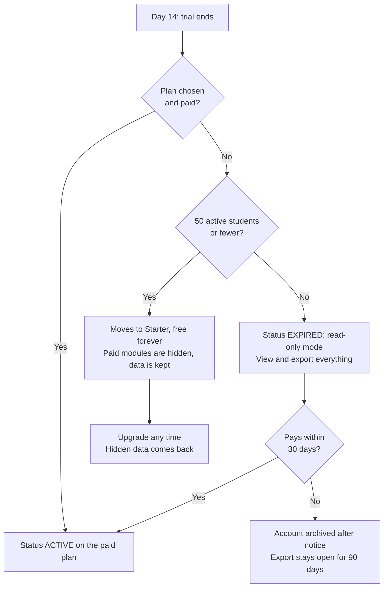
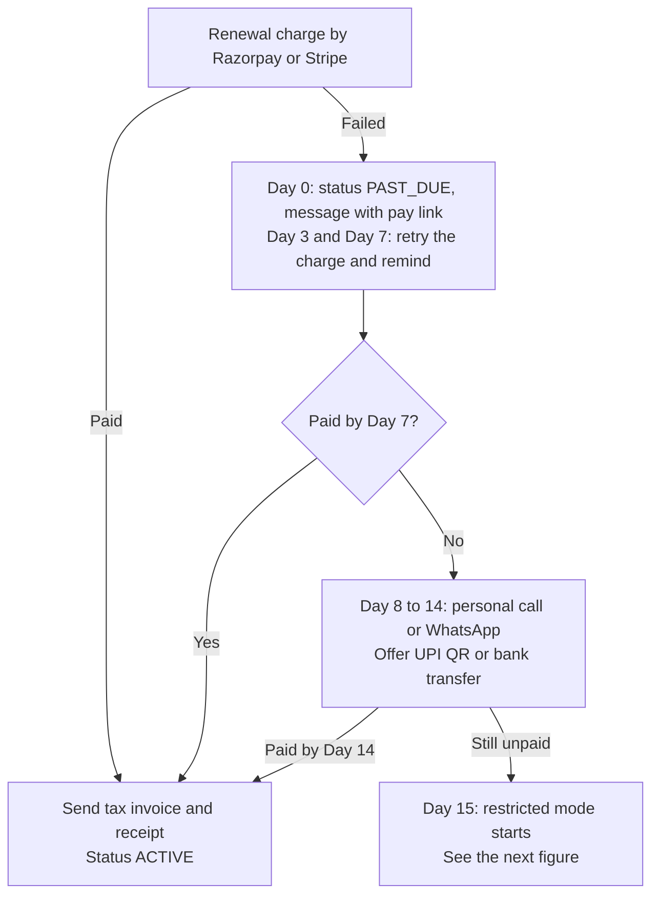
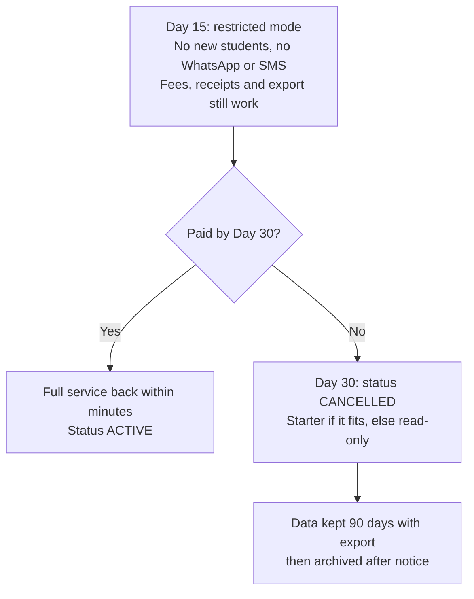

# Pricing Strategy

**In simple words:** This chapter fixes how EduFlow charges money. It lists every plan price in four countries, what each plan includes and what each add-on costs. It also sets the rules for discounts, free trials, upgrades, refunds, failed payments and future price changes. Clear rules written now stop random discounts later, and they let the billing code be built once.

The plan prices come from the EduFlow canon. This chapter does not change them. The revenue logic behind the prices is in *Business Model*. This chapter adds the policies that sit around the prices.

## Pricing on one page

| Topic | Decision |
|---|---|
| Pricing model | One flat price per institution, in four tiers by active student count |
| Plans | Starter (free forever), Growth, Pro, Enterprise |
| India prices | ₹0, ₹2,499, ₹5,999 and from ₹14,999 a month, before 18% GST |
| Yearly billing | 10 × monthly price, so 2 months are free |
| Modules | Included by plan; there is no per-module price list |
| Free trial | 14 days of Pro features; no card and no UPI mandate needed |
| Launch offer | First 100 paying customers: 20% off the first year on yearly Growth or Pro |
| Discount cap | No discount above 20% without written founder approval |
| Student overage | 10% grace on paid plans, then an upgrade prompt; never a surprise bill |
| Refunds | 30-day money-back on the first yearly purchase; duplicate charges always refunded |
| Price increases | Existing customers keep their old price for 12 months after any change |
| Failed payments | 14 days of full service, then restricted mode, then cancellation on Day 30 |

## Pricing principles

A pricing principle is a rule we follow even when a single deal tempts us to break it. EduFlow has eight.

| Principle | What it means in practice | What we will not do |
|---|---|---|
| Simple | Four plans. One question decides the plan: "How many active students do you have?" | No calculators with ten inputs |
| Public | Every price is on the website, in the local currency | No "call us for price" below Enterprise |
| Per institution | One flat price per organization, based on a student band | No per-student bill that changes every month |
| No per-module confusion | Modules come with the plan; the add-on list stays short | No price list with 34 lines |
| No hidden costs | No setup fee, no per-user fee, no charge for parent or student logins | No surprise overage bill |
| Fair free plan | Starter is useful for years for a 40-student tuition centre | No fake free plan that locks data |
| Local price, local tax | INR, USD, AUD and AED prices, each with its own tax rule | No dollar pricing for Indian customers |
| Grow with the customer | The bill rises only when the institute grows or wants more | No forced upgrades, no feature removal |

> **Rule:** If a sales talk needs more than two minutes to explain the price, the price is too complex. Fix the price, not the pitch.

### Why flat tiers by student count

We looked at four common ways to price school software. The table shows why flat tiers win for our market.

| Model | How it works | Problem for our buyer | Verdict |
|---|---|---|---|
| Per student per month | ₹15 to ₹40 for each student, billed monthly | Bill changes each month; owner fears growth; hard to budget | Rejected |
| Per module | Pay separately for Fees, Exams, Transport, Payroll and every other module | Long quotes; bargaining on every line; owners feel tricked | Rejected |
| Per staff user | Pay for each login | Owners share one login to save money; bad for security and audit | Rejected |
| Flat tiers by student band | One price up to 300 students, another up to 1,000 | A jump at the band edge (handled by a 10% grace) | Chosen |

Flat tiers also help a solo founder. There is no monthly usage bill to compute, explain or defend. The owner of Sharma Classes knows his cost for the full session on the day he buys.

> **Note:** The student count is our value metric (the one number that the price follows). It is a fair metric because fee income, staff load and message volume all grow with students.

### What counts as an active student

The student limit counts active students only. The billing code and the sales team must use the same definition.

| Counted | Not counted |
|---|---|
| Student with status `ACTIVE` and a current enrollment in the running academic year | Enquiries and applicants who are not yet admitted |
| A student in two batches (counted once) | Alumni and students who have left |
| Students of all campuses, added together | Archived or soft-deleted records |
| Students added by bulk Excel import | Guardians, teachers and staff |

An institute could mark students inactive to stay under a limit. But then it cannot mark their attendance or collect their fees. So cheating on the count only hurts the institute.

## Plan price tables by country

All prices below exclude tax. The yearly price is always 10 × the monthly price. The price a customer sees follows the country of the institute, not the country of the person who signs up.

### India (INR)

| Plan | Students | Campuses | Monthly | Monthly with 18% GST | Yearly | Yearly with 18% GST |
|---|---|---|---|---|---|---|
| Starter | up to 50 | 1 | ₹0 | ₹0 | ₹0 | ₹0 |
| Growth | up to 300 | 1 | ₹2,499 | ₹2,949 | ₹24,990 | ₹29,488 |
| Pro | up to 1,000 | up to 3 | ₹5,999 | ₹7,079 | ₹59,990 | ₹70,788 |
| Enterprise | unlimited | unlimited | from ₹14,999 | from ₹17,699 | custom yearly contract, from ₹1,79,988 | from ₹2,12,386 |

Formula: price with GST = price × 1.18. Example: ₹24,990 × 1.18 = ₹29,488.20, shown as ₹29,488.

Yearly saving: Growth saves 12 × ₹2,499 − ₹24,990 = ₹4,998. Pro saves 12 × ₹5,999 − ₹59,990 = ₹11,998. Both are 16.7% less than twelve monthly payments.

Tax notes for India:

- We add 18% GST (goods and services tax) to every invoice. The invoice shows our GSTIN, the customer's GSTIN if it has one, and the SAC code (service accounting code) that our chartered accountant confirms.
- A customer in our home state is charged CGST plus SGST. A customer in another state is charged IGST. The total is 18% in both cases.
- A coaching institute registered for GST can usually claim the 18% back as input tax credit. A school usually cannot. So for schools we always quote the GST-inclusive price. *Business Model* and *Market Research: India* explain this point.
- Some larger customers deduct TDS (tax deducted at source) from our invoice. We accept the short payment and collect the TDS certificate each quarter.

### USA (USD)

| Plan | Students | Campuses | Monthly | Yearly | Yearly saving |
|---|---|---|---|---|---|
| Starter | up to 50 | 1 | $0 | $0 | – |
| Growth | up to 300 | 1 | $79 | $790 | $158 |
| Pro | up to 1,000 | up to 3 | $199 | $1,990 | $398 |
| Enterprise | unlimited | unlimited | from $499 | custom yearly contract | by contract |

Tax notes for the USA:

- There is no national sales tax. Each state decides if SaaS (software as a service) is taxable. Some states tax it and some do not. Rates are usually between 4% and 10% (general view; verify).
- A seller must collect tax in a state only after it crosses that state's threshold. A common threshold is US$100,000 of sales in the state in a year. This link is called economic nexus.
- Worked check: one Pro customer pays $199 × 12 = $2,388 a year. We would need about 42 Pro customers in one state (100,000 ÷ 2,388) to cross a US$100,000 threshold. That will not happen during the Year 3 pilots.
- Stripe Tax watches the thresholds, works out the tax per state and adds it at checkout. We switch it on from the first US customer.
- Many public schools are tax-exempt buyers. They give an exemption certificate, and we store it against the organization.

### Australia (AUD)

| Plan | Students | Campuses | Monthly | Monthly with 10% GST | Yearly | Yearly with 10% GST |
|---|---|---|---|---|---|---|
| Starter | up to 50 | 1 | A$0 | A$0 | A$0 | A$0 |
| Growth | up to 300 | 1 | A$119 | A$130.90 | A$1,190 | A$1,309 |
| Pro | up to 1,000 | up to 3 | A$299 | A$328.90 | A$2,990 | A$3,289 |
| Enterprise | unlimited | unlimited | from A$749 | from A$823.90 | custom yearly contract | by contract |

Tax notes for Australia:

- Australian GST is 10%. Australians expect to see GST-inclusive prices, so the Australian pricing page shows both figures.
- An overseas seller of digital services must register for Australian GST after A$75,000 of Australian sales in 12 months (general view; verify with a tax adviser).
- A business customer that is itself registered for GST and gives its ABN (Australian business number) can often be billed without GST. The checkout therefore asks for the ABN.

### UAE (AED)

| Plan | Students | Campuses | Monthly | Monthly with 5% VAT | Yearly | Yearly with 5% VAT |
|---|---|---|---|---|---|---|
| Starter | up to 50 | 1 | AED 0 | AED 0 | AED 0 | AED 0 |
| Growth | up to 300 | 1 | AED 299 | AED 313.95 | AED 2,990 | AED 3,139.50 |
| Pro | up to 1,000 | up to 3 | AED 749 | AED 786.45 | AED 7,490 | AED 7,864.50 |
| Enterprise | unlimited | unlimited | from AED 1,849 | from AED 1,941.45 | custom yearly contract | by contract |

Tax notes for the UAE:

- UAE VAT (value added tax) is 5%. Invoices show the customer's TRN (tax registration number) when it has one.
- A VAT-registered UAE business that buys from an overseas seller usually accounts for the VAT itself. This is called reverse charge. The exact duty of EduFlow as a foreign seller must be confirmed before the Year 2 entry (assumption).
- UAE schools often pay by bank transfer against an invoice. The Enterprise and yearly flows must support that from the start.

> **Note:** Sales to the USA, Australia and the UAE from an Indian company are exports of services. They normally carry no Indian GST if the company files a letter of undertaking each year (general view; confirm with the chartered accountant). The country tax rules are covered in *Compliance, Legal and Data Protection Requirements*.

### The four price lists side by side in rupees

The planning exchange rates in the canon are US$1 = ₹85, A$1 = ₹56 and AED 1 = ₹23.

| Plan, monthly | India | USA in ₹ | Australia in ₹ | UAE in ₹ | Foreign price ÷ India price |
|---|---|---|---|---|---|
| Growth | ₹2,499 | $79 = ₹6,715 | A$119 = ₹6,664 | AED 299 = ₹6,877 | 2.7 to 2.8 times |
| Pro | ₹5,999 | $199 = ₹16,915 | A$299 = ₹16,744 | AED 749 = ₹17,227 | 2.8 to 2.9 times |
| Enterprise, from | ₹14,999 | $499 = ₹42,415 | A$749 = ₹41,944 | AED 1,849 = ₹42,527 | 2.8 times |

The three foreign prices are within about 3% of each other in rupees. So no foreign customer gains by pretending to be in another foreign country.

### How the billing country is decided

| Signal | How we use it |
|---|---|
| Country chosen at signup | Sets the currency, tax rule and payment gateway (Razorpay for India, Stripe for the rest) |
| Mobile number country code of the Organization Admin | Must match the chosen country, or the signup is flagged for review |
| Tax ID (GSTIN, ABN, TRN) and billing address | Printed on the invoice; a mismatch blocks the India price |
| Payment method country | An Indian price can be paid only with an Indian payment method |

> **Rule:** The India price is for institutes that teach in India. A school in Dubai cannot buy the INR plan through a relative's Indian card. Super Admin can correct the country of an organization; the customer cannot.

## What each plan includes

### Plan limits

The student and campus limits come from the canon. Storage and email limits are new decisions made in this chapter (assumptions). They exist to stop cost leaks, not to push upgrades.

| Limit | Starter | Growth | Pro | Enterprise |
|---|---|---|---|---|
| Active students | 50 | 300 | 1,000 | Unlimited |
| Grace above the student limit | None (hard stop at 50) | 10% (up to 330) | 10% (up to 1,100) | Not needed |
| Campuses included | 1 | 1 | 3 | Unlimited |
| Extra campuses | Not available | ₹999 a month each | ₹999 a month each | Not needed |
| Admin and staff users | 1 admin + 3 staff | Unlimited | Unlimited | Unlimited |
| Parent logins | Unlimited | Unlimited | Unlimited | Unlimited |
| Student logins | Not available | Unlimited | Unlimited | Unlimited |
| File storage (assumption) | 1 GB | 10 GB | 50 GB | 250 GB, more by contract |
| Emails per month, fair use (assumption) | 1,000 | 10,000 | 50,000 | 2,00,000 |
| WhatsApp sending | No | Yes, prepaid credits | Yes, prepaid credits | Credits, or own Meta account |
| SMS sending | No | Credits, shared sender name | Credits, own sender name allowed | Credits, own sender name allowed |
| Online fee payment by parents | No | Yes | Yes | Yes |
| Branding | EduFlow branding | Own logo, small "Powered by EduFlow" line | Own logo, small "Powered by EduFlow" line | Full white-label |
| Support | Help centre and email | Email and WhatsApp chat in business hours | Priority: first reply in 4 working hours | Account manager and custom SLA |

Storage check (estimate): one student needs about 2.7 MB. That is one photo of 200 KB and five documents of 500 KB each. So 300 students need about 0.8 GB and 1,000 students need about 2.7 GB. Homework files and report card PDFs add more. The limits above leave wide room for normal use.

> **Note:** SLA means service level agreement (a written promise on uptime and reply time). Support hours and reply targets are set in *Customer Success, Onboarding and Support*. This chapter only fixes which plan gets which level.

### Module access by plan

The four tables below cover all 34 modules. They match the scope tables in *Business Objectives, Scope and Stakeholders*. `Yes` means included. `No` means not included. `Partial` means included with a limit that the note explains. `Add-on` means it can be bought for an extra price.

**Phase 1 modules (16), ready by 3 December 2026**

| # | Module | Code | Starter | Growth | Pro | Enterprise | Limit or note |
|---|---|---|---|---|---|---|---|
| 1 | Dashboard | DASH | Yes | Yes | Yes | Yes | Role-wise home page on every plan |
| 2 | Organizations | ORG | Yes | Yes | Yes | Yes | One organization per subscription |
| 3 | Multi Campus | CAMP | Partial | Partial | Yes | Yes | Starter 1 campus; Growth 1, more by add-on; Pro 3, more by add-on |
| 4 | Student Admission | ADM | Yes | Yes | Yes | Yes | Excel import on every plan |
| 5 | Student Profile | STU | Partial | Yes | Yes | Yes | Starter stops at 50 active students |
| 6 | Teachers | TCH | Partial | Yes | Yes | Yes | Starter allows 1 admin and 3 staff users |
| 8 | Attendance | ATT | Yes | Yes | Yes | Yes | WhatsApp absence alerts need Growth or above |
| 10 | Batch | BAT | Yes | Yes | Yes | Yes | No limit on batches |
| 12 | Subjects | SUB | Yes | Yes | Yes | Yes | No limit on subjects |
| 16 | Fees | FEE | Yes | Yes | Yes | Yes | No limit on invoices or receipts |
| 17 | Payments | PAY | Partial | Yes | Yes | Yes | Starter records counter payments only; online pay from Growth |
| 18 | Discounts | DSC | Yes | Yes | Yes | Yes | Approval trail on every plan |
| 20 | Parent Portal | PP | Yes | Yes | Yes | Yes | Starter shows EduFlow branding; no pay button |
| 22 | Notifications | NTF | Partial | Yes | Yes | Yes | Starter sends in-app and email only |
| 23 | WhatsApp | WA | No | Yes | Yes | Yes | Uses prepaid credits |
| 34 | Settings | SET | Yes | Yes | Yes | Yes | Custom roles only on Pro and Enterprise |

**Phase 2 modules (12), ready by 1 February 2027**

| # | Module | Code | Starter | Growth | Pro | Enterprise | Limit or note |
|---|---|---|---|---|---|---|---|
| 7 | Staff | STF | No | Yes | Yes | Yes | Non-teaching staff records |
| 9 | Leave | LEV | No | Yes | Yes | Yes | Leave types and approvals |
| 11 | Timetable | TT | No | Yes | Yes | Yes | Clash check included |
| 13 | Homework | HW | No | Yes | Yes | Yes | Files count toward plan storage |
| 14 | Exams | EXM | No | Yes | Yes | Yes | School exams and coaching test ranks |
| 15 | Report Cards | RPT | No | Yes | Yes | Yes | PDF templates with own logo |
| 19 | Scholarships | SCH | No | Yes | Yes | Yes | Linked to fee invoices |
| 21 | Student Portal | SP | No | Yes | Yes | Yes | Unlimited student logins |
| 24 | Email | EML | No | Yes | Yes | Yes | Bulk email; Starter gets system emails through Notifications |
| 25 | SMS | SMS | No | Yes | Yes | Yes | Uses SMS credits; own sender name from Pro |
| 31 | Certificates | CRT | No | Yes | Yes | Yes | Bonafide, transfer, character and fee certificates |
| 32 | Analytics | ANL | No | Partial | Yes | Yes | Growth gets standard trends; advanced analytics from Pro |

**Phase 3 modules (5), ready by June 2027**

| # | Module | Code | Starter | Growth | Pro | Enterprise | Limit or note |
|---|---|---|---|---|---|---|---|
| 26 | Library | LIB | No | No | Yes | Yes | Not sold as a separate add-on |
| 27 | Inventory | INV | No | No | Yes | Yes | Not sold as a separate add-on |
| 28 | Transport | TRN | No | No | Yes | Yes | Transport fee links to Fees |
| 29 | Hostel | HST | No | No | Yes | Yes | Hostel fee links to Fees |
| 30 | Payroll | PRL | No | No | Yes | Yes | Payslips and basic PF, ESI, TDS fields |

**Phase 4 module (1), ready by September 2027**

| # | Module | Code | Starter | Growth | Pro | Enterprise | Limit or note |
|---|---|---|---|---|---|---|---|
| 33 | AI Insights | AI | No | Add-on | Add-on | Yes | ₹1,499 a month on Growth and Pro |

> **Founder note:** A Growth customer who wants only Transport will ask, "Can I buy just that one module?" The answer is no. The five Phase 3 modules are the main reason to move to Pro. Selling them one by one would bring back the per-module price list that we rejected above.

### Other gated features

These features are not modules, but the plan still decides who gets them.

| Feature | Starter | Growth | Pro | Enterprise | Note |
|---|---|---|---|---|---|
| Bulk Excel import | Yes | Yes | Yes | Yes | Key for one-day onboarding |
| Full data export (CSV, PDF) | Yes | Yes | Yes | Yes | Never gated; it builds trust |
| Online fee payment | No | Yes | Yes | Yes | Gateway cost passed through at cost |
| Custom roles | No | No | Yes | Yes | Librarian, Transport Manager, Hostel Warden, Front Desk |
| Advanced analytics | No | No | Yes | Yes | Campus comparison, cohort and trend reports |
| Priority support | No | No | Yes | Yes | First reply in 4 working hours |
| Own SMS sender name (DLT header) | No | No | Yes | Yes | Guided setup |
| White-label mobile app | No | Add-on | Add-on | Yes | Enterprise price sits inside the contract (assumption) |
| Assisted data migration | No | Add-on | Add-on | Yes | ₹9,999 one-time on Growth and Pro |
| On-site training | No | Add-on | Add-on | Add-on | ₹4,999 a day; online training is free |
| White-label web branding and own domain | No | No | No | Yes | No EduFlow name anywhere |
| SSO | No | No | No | Yes | Staff log in with the school's Google or Microsoft account |
| API access | No | No | No | Yes | For the group's own apps and reports |
| Own WhatsApp Business account | No | No | No | Yes | The group pays Meta directly |
| Dedicated account manager, custom SLA | No | No | No | Yes | Named person from day one |

When a user opens a feature that the plan does not include, the API returns `PLAN_LIMIT_REACHED` (403). The screen then shows what the feature does, which plan has it and an upgrade button. It never shows a blank error.

## Add-on price list

An add-on is something a customer buys on top of a plan, without changing the plan. Add-ons can be bought only on a paid plan. The India prices come from the canon.

### India add-on prices

| Add-on | Price before 18% GST | Billing | Plans | Note |
|---|---|---|---|---|
| Extra campus | ₹999 a month per campus | With the plan cycle | Growth, Pro | Adds a campus; does not raise the student limit |
| AI Insights | ₹1,499 a month | With the plan cycle | Growth, Pro | Included in Enterprise; ships in Phase 4 |
| White-label mobile app, setup | ₹49,999 one-time | Before work starts | Growth, Pro | Android and iOS apps with the institute's name |
| White-label mobile app, monthly | ₹4,999 a month | With the plan cycle | Growth, Pro | Store updates and new builds |
| WhatsApp credit pack, small | ₹499 | Prepaid | Growth and above | Each message costs the Meta rate plus 15% |
| WhatsApp credit pack, medium | ₹1,999 | Prepaid | Growth and above | Default pack suggested in the app |
| WhatsApp credit pack, large | ₹7,999 | Prepaid | Growth and above | Same rate per message; fewer recharges |
| SMS pack | ₹1,250 for 5,000 SMS | Prepaid | Growth and above | ₹0.25 per SMS credit |
| Assisted data migration | ₹9,999 one-time | Before work starts | Growth, Pro | Included in Enterprise |
| On-site training | ₹4,999 a day | Before the visit | All paid plans | Travel outside the city billed at actual cost |
| Extra storage (proposed, assumption) | ₹299 a month per 25 GB | With the plan cycle | Growth, Pro | Not in the canon list; confirm before publishing |

Rules for add-ons:

1. Recurring add-ons follow the billing cycle of the plan. On a yearly plan they also cost 10 × the monthly price (assumption). An extra campus is then ₹9,990 a year.
2. An add-on bought in the middle of a cycle is prorated, as shown later in this chapter.
3. The billing page always shows the cheaper path. Growth plus four extra campuses costs ₹2,499 + 4 × ₹999 = ₹6,495. Pro costs ₹5,999 and includes more. The page must say so.
4. Pro plus nine extra campuses costs ₹5,999 + 9 × ₹999 = ₹14,990. At that size the customer should talk to us about Enterprise.
5. Online fee payments are not an add-on. Gateway charges are passed through at cost: about 2% on cards and netbanking, low or zero on UPI. EduFlow adds no markup in Year 1.
6. Credit packs have no bonus for bigger packs in Year 1. The per-message economics are in *Business Model*.

### International add-on prices

The canon fixes add-on prices for India only. The prices below are proposed (assumption). They use the same ratio as the plans, about 2.7 times the India price, rounded to a clean local number. Confirm them before each country launch.

| Add-on | USA | Australia | UAE |
|---|---|---|---|
| Extra campus, per month | $29 | A$45 | AED 119 |
| AI Insights, per month | $49 | A$75 | AED 179 |
| White-label mobile app, setup | $1,499 | A$2,399 | AED 5,499 |
| White-label mobile app, per month | $149 | A$229 | AED 549 |
| Assisted data migration, one-time | $299 | A$449 | AED 1,099 |
| WhatsApp messages | Meta rate for the receiver's country plus 15% | Same rule | Same rule |
| SMS through Twilio | Twilio cost plus 15%, from a prepaid wallet | Same rule | Same rule |
| On-site training | Not offered; online only | Not offered; online only | Through a local partner, priced per visit |

## Price per student analysis

Owners in India compare software on the price per student per month. We sell a flat price, but we must always know the per-student number behind it.

### EduFlow price per student

Formula: price per student per month = plan price per month ÷ active students. For a yearly plan, the price per month is the yearly price ÷ 12.

| Plan and billing | Price per month | Students | Price per student per month |
|---|---|---|---|
| Growth, monthly | ₹2,499 | 100 | ₹24.99 |
| Growth, monthly | ₹2,499 | 200 | ₹12.50 |
| Growth, monthly | ₹2,499 | 300 | ₹8.33 |
| Growth, yearly | ₹2,083 | 300 | ₹6.94 |
| Pro, monthly | ₹5,999 | 350 (Sharma Classes) | ₹17.14 |
| Pro, yearly | ₹4,999 | 350 (Sharma Classes) | ₹14.28 |
| Pro, monthly | ₹5,999 | 600 | ₹10.00 |
| Pro, monthly | ₹5,999 | 1,000 | ₹6.00 |
| Enterprise, floor price | ₹14,999 | 1,200 (Bright Future Public School) | ₹12.50 |
| Enterprise, guide price | ₹20,000 | 2,000 | ₹10.00 |

Three things stand out.

1. The more students inside a band, the cheaper each student becomes. A full Growth plan costs ₹8.33 per student. A full Pro plan costs ₹6.00.
2. The price per student jumps just after a band edge. With 301 students, Pro costs ₹19.93 per student. With 1,001 students, Enterprise costs ₹14.98. The 10% grace rule later in this chapter softens this jump.
3. The most expensive case is a small institute just above 50 students. With 60 students, Growth costs ₹41.65 per student. This is the top of the market range and is a known risk.

The Enterprise guide price is a proposal from *Business Model*: the higher of ₹14,999 or about ₹10 per student per month, up to 5,000 students. Above 5,000 students the founder prices each deal.

### Compared with competitors

Most competitors do not publish a full price list. So this table compares pricing models, not exact prices. It is based on public information as of September 2026; verify before external use.

| Vendor | Public price list? | Pricing model seen in public information | Price per student per month |
|---|---|---|---|
| Teachmint | No | Free basic app in the past; school ERP and classroom hardware sold by quote | Not publicly listed |
| Classplus | No | Yearly licence for a branded coaching app, sold by a sales team | Not publicly listed |
| PowerSchool | No | Per student per year, by quote; add-on products priced separately | Not publicly listed |
| Blackboard (Anthology) | No | Yearly institution licence by size band; aimed at colleges and districts | Not publicly listed |
| Fedena | Partial | Plan-based yearly licence plus custom quotes | Not publicly listed in a simple form |
| MyClassCampus | No | Per student per year, by quote | Not publicly listed |
| EduFlow | Yes | Flat public tiers by student band | ₹6 to ₹25 for most customers |

What we can say with more confidence comes from *Market Research: India* and *Market Sizing: TAM, SAM and SOM*:

- Indian school ERP vendors commonly quote ₹15 to ₹40 per student per month (estimate).
- Bundles with hardware and content run from ₹30 to ₹100 per student per month (estimate).
- First-year bills often end 40% to 60% above the first quote because of setup fees, module fees and SMS charges (estimate).

| Institute | EduFlow per student | Market range per student (estimate) | EduFlow position |
|---|---|---|---|
| 300-student coaching centre on Growth | ₹8.33 | ₹15 to ₹40 | About half of the low end |
| Sharma Classes, 350 students on Pro | ₹17.14 | ₹15 to ₹40 | At the low end, with more modules |
| 1,000-student school on Pro | ₹6.00 | ₹15 to ₹40 | Well under half of the low end |
| Bright Future Public School on Enterprise | ₹12.50 | ₹15 to ₹40 | Below the low end, with white-label and SSO |
| 60-student tuition centre on Growth | ₹41.65 | ₹15 to ₹40 | Above the range; Starter and yearly billing matter here |

In the USA and Australia the gap is wider. A full Growth plan in the USA costs $79 ÷ 300 = $0.26 per student per month, or about $3.16 per student per year. A full Pro plan costs $199 × 12 ÷ 1,000 = about $2.39 per student per year. Enterprise school systems are reported at several dollars per student per year before add-on products (estimate). EduFlow does not try to replace those systems in large districts. It sells to tutoring centres and small private schools that such vendors do not serve well. *Competitor Analysis* has the full picture.

> **Warning:** Never print a competitor's price in sales material unless we hold a dated public source for it. Say "most vendors quote per student and add setup fees" and then show our own public price.

### Compared with the customer's fee income

The strongest price argument is not the competitor's price. It is the owner's own fee income.

**Worked example: a 300-student institute on Growth.** Assume an average fee of ₹3,000 per student per month. That is ₹36,000 a year, the same figure this BRD uses for Bright Future Public School.

1. Monthly fee collection = 300 × ₹3,000 = ₹9,00,000.
2. Growth price = ₹2,499 a month.
3. Share of fee collection = ₹2,499 ÷ ₹9,00,000 = 0.278%.

So the Growth plan costs under 0.3% of monthly fee collection. Out of every ₹100 of fees, EduFlow takes less than 28 paise.

| Way of paying | Cost per month | Share of ₹9,00,000 monthly fee collection |
|---|---|---|
| Growth monthly, before GST | ₹2,499 | 0.28% |
| Growth monthly, with 18% GST | ₹2,949 | 0.33% |
| Growth yearly, before GST | ₹2,083 | 0.23% |
| Growth yearly, with 18% GST | ₹2,457 | 0.27% |

The share changes with the fee level. Here is the same 300-student institute at different average fees.

| Average fee per student per month | Monthly fee collection | Growth price as a share | Comment |
|---|---|---|---|
| ₹1,000 | ₹3,00,000 | 0.83% | Low-fee school; see the low-fee discount below |
| ₹1,500 | ₹4,50,000 | 0.56% | Small-town tuition centre |
| ₹2,000 | ₹6,00,000 | 0.42% | Budget private school |
| ₹3,000 | ₹9,00,000 | 0.28% | Mid-fee school or coaching centre |
| ₹5,000 | ₹15,00,000 | 0.17% | JEE or NEET coaching, like Sharma Classes |

Break-even check: the share stays under 0.3% when the average fee is above ₹2,499 ÷ 0.003 ÷ 300 = ₹2,777 per student per month. *Market Research: India* found that institutes accept software that costs 0.3% to 1% of fee income. Every row in the table is inside or below that band.

The two sample customers give the same picture:

- Sharma Classes: ₹5,999 ÷ (350 × ₹5,000) = ₹5,999 ÷ ₹17,50,000 = 0.34% on monthly billing. On yearly billing it is 0.29%.
- Bright Future Public School: ₹14,999 ÷ (1,200 × ₹3,000) = ₹14,999 ÷ ₹36,00,000 = 0.42%.

### What the customer gets back

A low price share is good. A clear return is better. This is an estimate for the same 300-student institute.

| Gain per month (estimate) | Working | Value |
|---|---|---|
| Fees that used to slip or come late | 1% of ₹9,00,000 | ₹9,000 |
| Accountant's time saved | 30 hours × ₹100 an hour | ₹3,000 |
| Receipt books, registers and printing | Flat estimate | ₹1,000 |
| **Total gain** | | **₹13,000** |
| Growth plan with GST | ₹2,499 × 1.18 | ₹2,949 |
| WhatsApp messages with GST | 300 students × 15 messages × ₹0.1323 × 1.18 | ₹703 |
| **Total cost** | | **₹3,652** |

Return = ₹13,000 ÷ ₹3,652 = about 3.6 times. If EduFlow helps collect just 1% more fees on time, that alone pays for the plan three times over. The cost of the problems themselves is measured in *Problem Statement and Proposed Solution*.

> **Tip:** In a demo, ask the owner for his monthly fee collection. Then say: "EduFlow costs you 28 paise out of every ₹100 you collect." This lands better than any feature list.

## Purchasing-power reasoning for country prices

Purchasing power means how much a buyer in a country can comfortably pay. A price that feels small in Sydney can feel large in Patna. So we do not convert one price into four currencies. We set each country's price on its own, using three anchors.

1. **Share of fee income.** The plan should cost well under 0.5% of the institute's fee income in every country.
2. **Local alternatives.** The price should sit at or below the tools that a small local institute can buy with a card.
3. **Cost to serve.** Support hours, compliance work, payment fees and SMS costs are higher outside India.

The table tests the canon prices against these anchors. All income, salary and fee figures are rounded estimates; verify before external use.

| Measure | India | UAE | Australia | USA |
|---|---|---|---|---|
| Income per person per year (IMF 2025 estimates, rounded) | US$2,900 | US$50,000 | US$65,000 | US$89,000 |
| Income as a multiple of India | 1 | about 17 | about 22 | about 31 |
| Growth price per month | ₹2,499 | AED 299 | A$119 | $79 |
| Growth price as a multiple of India, in rupees | 1 | 2.75 | 2.67 | 2.69 |
| Monthly pay of one office assistant (estimate) | ₹15,000 | AED 4,000 | A$5,000 | $3,300 |
| Growth price as a share of that pay | 16.7% | 7.5% | 2.4% | 2.4% |
| Sample institute | 300 students, fee ₹3,000 a month | 800-student Indian-curriculum school, fee AED 750 a month | 150-student tutoring college, fee A$300 a month | 150-student tutoring centre, fee $250 a month |
| Right plan | Growth | Pro | Growth | Growth |
| Plan price as a share of monthly fee income | 0.28% | 0.12% | 0.26% | 0.21% |

What the table tells us:

- **India is priced close to its ceiling.** Growth already equals about one sixth of an office assistant's pay. We cannot raise Indian prices much. Growth in India must come from more customers, plan upgrades and add-ons.
- **Foreign prices have headroom.** Incomes are 17 to 31 times higher, but our prices are only about 2.7 times higher. The plan is a very small share of fee income abroad.
- **We still do not charge more abroad at the start.** EduFlow will be an unknown brand from another country. Small tutoring tools abroad commonly list at about US$50 to US$200 a month (estimate). A price under US$100 can be paid with a card without any approval. That keeps the self-serve sales motion alive.
- **We do not charge less either.** The India price converted to dollars is about $29. At that price one support call wipes out the monthly margin. A very low price also signals low quality to a foreign buyer.

Why the numbers end in 9: $79, A$119 and AED 299 are clean local price points that sit just under a round number. Buyers read them as the lower band. This is called charm pricing.

> **Founder note:** Treat the foreign prices as launch prices. The first real test is the UAE in Year 2. If 8 out of 10 UAE schools accept AED 749 without any pushback, the price is too low. Record every price objection in the CRM from the first foreign demo.

Exchange rates move. We review local prices once a year. We change a local price only if the currency has moved more than 15% from the planning rate for six months in a row. Customers are never billed an exchange-rate surcharge.

## Discount policy

A discount is any price below the public list price. Discounts are easy to give and hard to take back. In Tier 2 cities, owners talk to each other in WhatsApp groups. One secret discount soon becomes the real price for the whole city. So the policy is short and strict.

### The allowed discounts

| Discount | Size | Who gets it | Conditions |
|---|---|---|---|
| Yearly billing | 2 months free (16.7%) | Anyone who pays yearly | Built into the list price; not counted as a discount |
| Founding 100 launch offer | 20% off the first year | First 100 paying organizations | Yearly Growth or Pro only; ends at customer 100 or on 30 April 2027 |
| NGO and low-fee school discount | 20% off list | Registered NGOs and schools with low fees | Proof checked once a year |
| Multi-year Enterprise contract | 10% for 24 months, 15% for 36 months | Enterprise customers | Net price never below ₹14,999 a month |
| Anything else or anything above 20% | Case by case | Rare strategic deals | Written founder approval, with the reason logged in the CRM |

> **Rule:** Only one discount applies at a time. The customer gets the better one. Yearly billing is a list price, so it combines with one discount. No one may give more than 20% off a list price without written founder approval.

### The Founding 100 launch offer

The first 100 paying organizations carry the most risk. They buy from a new company with no references. They also give us the most value: feedback, case studies and referrals. The launch offer pays them back for that.

| Item | Rule |
|---|---|
| Who | The first 100 paying organizations, or signups until 30 April 2027, whichever comes first |
| What | 20% off the first year of a yearly Growth or Pro plan |
| Growth price | ₹24,990 × 0.8 = ₹19,992, plus 18% GST of ₹3,599 = ₹23,591 |
| Pro price | ₹59,990 × 0.8 = ₹47,992, plus 18% GST of ₹8,639 = ₹56,631 |
| Simple message | "Pay for 8 months, use for 12." (₹19,992 ÷ ₹2,499 = 8 months) |
| Extra promise | Price lock: no list price increase touches them for 24 months from signup |
| What we ask back | A written testimonial, permission to show the logo and two referral introductions |
| Renewal | At the normal yearly list price |
| Not included | Monthly plans, Enterprise contracts, add-ons and message credits |

The offer is for yearly plans only, on purpose. A bootstrapped company needs cash early, and a yearly customer stays through the first full session.

> **Warning:** The offer lowers the MRR we can count. MRR means monthly recurring revenue (the subscription money that comes in every month). Picture 70 founding customers on the offer: 45 on Growth and 25 on Pro. Each Growth account counts as ₹19,992 ÷ 12 = ₹1,666 of MRR, not ₹2,083. Each Pro account counts as ₹3,999, not ₹4,999. The drag is 45 × ₹417 + 25 × ₹1,000 = about ₹44,000 of MRR. That is about 7% of the ₹6 lakh Year 1 target. In return we collect 45 × ₹19,992 + 25 × ₹47,992 = about ₹21 lakh in cash up front. The MRR comes back at the first renewal in 2028. *Financial Plan and Projections* must model this drag.

### The NGO and low-fee school discount

Some schools serve poor families and charge very low fees. For them even ₹2,499 is a real cost. The free Starter plan already covers the smallest ones. For the rest we offer 20% off.

| Item | Rule |
|---|---|
| Who qualifies | A school run by a registered NGO or charitable trust, or any school with an average fee under ₹1,000 per student per month |
| Proof | Trust registration or 12A certificate, or the printed fee structure with the school's UDISE code |
| Discount | 20% off Growth or Pro, monthly or yearly |
| Prices | Growth ₹1,999 a month or ₹19,992 a year; Pro ₹4,799 a month or ₹47,992 a year |
| Review | Proof is checked again at each yearly renewal |
| Cap | If more than 10% of paying customers use it, the founder reviews the rule |
| Not combined with | The Founding 100 offer; the customer takes one of the two |

Check: a 300-student school with a fee of ₹1,000 a month collects ₹3,00,000 a month. Growth at ₹1,999 is 0.67% of that, inside the accepted band of 0.3% to 1%.

### Who can approve what

In Year 1 the founder is the only seller, so this table looks unneeded. It is written now because partners and sales staff will join in Year 2.

| Discount level | Who can approve | Record needed |
|---|---|---|
| List price, yearly billing | Anyone | None |
| Founding 100 or NGO and low-fee discount | Any seller, if the conditions are met | Proof attached to the organization record |
| Up to 10% for a special case | Sales lead (from Year 2) | Reason in the CRM |
| Above 10% and up to 20% | Head of sales or founder | Reason in the CRM |
| Above 20% | Founder only, in writing | Reason, end date and expected value |
| Partners and resellers | Cannot change the price | They earn commission, as set in *Go-To-Market Strategy* |

### Give value before price

Bargaining is normal in Indian business. The seller needs something to give that is not a price cut. Each item below costs us little, and the owner values it highly.

| Instead of a price cut, offer | Cost to EduFlow (estimate) | Value the owner sees |
|---|---|---|
| A free ₹499 WhatsApp credit pack | ₹434 | ₹499, and the first reminders go out at once |
| One extra online training session for staff | 1 hour of our time | "They will train my people" |
| Trial extended by 14 days | Almost nothing | More time to decide before the session starts |
| Yearly plan paid in two parts, 50% now and 50% in 60 days | A small delay in cash | Easier cash flow in the admission season |
| Help with the first Excel import on a video call | 1 hour of our time | The fear of switching goes away |

> **Best practice:** When an owner asks for a discount, first ask, "Monthly or yearly?" Yearly billing already gives 2 months free. Most discount talks end there.

## Free trial policy

A free trial lets a new institute use paid features for a short time before paying. *Business Model* proposed a 14-day Growth trial. This chapter makes the final decision: a 14-day trial of Pro, with no card needed. It replaces that proposal.

| Item | Rule |
|---|---|
| Length | 14 days from signup (`trialDays` = 14 in the `plans` table) |
| Features | Everything in Pro that has shipped: up to 1,000 students, 3 campuses, custom roles, all live modules |
| Payment details | None needed: no card, no UPI mandate |
| Subscription status | `TRIALING` |
| WhatsApp | 100 free utility messages to verified numbers; no marketing templates |
| SMS | Not in the trial; DLT sender approval takes longer than 14 days |
| Online fee payment | Allowed once Razorpay approves the institute's KYC; start the KYC on Day 1 |
| Extension | 7 days by one click, once; 14 more days by the founder or a seller |
| Limit | One trial per organization, per verified mobile number and per owner |
| Add-ons in the trial | Not available, except the free WhatsApp messages |

Why a Pro trial and not a Growth trial:

1. The owner sees the best product first. Moving down to Growth later feels like a choice, not a loss.
2. Think of a coaching institute with 350 students, the size of Sharma Classes. A Growth trial would block its Excel import at 300. A Pro trial takes all 350 on Day 1.
3. The owner does not need to guess the right plan at signup. The app suggests it on Day 10 from the real student count.

Why no card: most Indian institute owners do not use a credit card for the business. A UPI mandate at signup feels risky to them. Asking for payment details up front would cut signups sharply (general SaaS pattern; estimate). The Starter plan is free forever, so a no-card trial also costs us little.

The free WhatsApp messages answer an open point from *Customer Personas*. The owner must feel a real fee reminder arrive on a real parent's phone. The cost is at most 100 × ₹0.115 = ₹11.50 per trial. For 1,000 trials it is ₹11,500.

> **Note:** The Phase 3 modules (Library, Inventory, Transport, Hostel, Payroll) ship by June 2027. A trial in January 2027 shows them as "coming by June 2027". The sales team must not demo what is not live.

### Messages during the trial

| Day | Message to the Organization Admin | Channel |
|---|---|---|
| 0 | Welcome, three setup steps, link to the Excel import template | WhatsApp and email |
| 1 | "Import your students" reminder if fewer than 10 students exist | WhatsApp |
| 3 | "Collect your first fee receipt" guide; offer a 20-minute setup call | WhatsApp |
| 7 | Halfway summary: students added, receipts made, attendance days marked | Email and in-app |
| 10 | Plan suggestion based on the student count, with yearly and monthly prices | In-app and WhatsApp |
| 12 | "2 days left" reminder with a pay link (UPI QR) | WhatsApp and email |
| 14 | Trial ends; choose a plan, extend once or move to Starter | In-app, WhatsApp and email |

### What happens when the trial ends

**Figure: Trial end decision**

The figure shows that a trial never ends in a locked account or in lost data. A small institute falls to Starter. A large institute goes read-only and can still export everything. Data made in paid modules during the trial is hidden, not deleted, and returns after an upgrade.

The main trial measure is activation: a first fee receipt or first attendance within 7 days of signup. The canon target is 60%. The free-to-paid target is 15%. Both are tracked in *KPI Framework and Dashboard*.

## Upgrade, downgrade and proration rules

Proration means charging only for the part of a billing period that is left. It keeps plan changes fair in both directions. The basic idea is simple: upgrades happen at once, downgrades happen at the end of the paid period.

| Change | When it takes effect | Money rule |
|---|---|---|
| Starter or trial to a paid plan | At once | Full price from that day; that day becomes the billing date |
| Upgrade on a monthly plan | At once | Pay the prorated price difference for the days left in the month |
| Upgrade on a yearly plan | At once | Pay the prorated difference for the days left in the year; renewal date stays |
| Monthly to yearly | At once | Unused days of the month are credited against the yearly price |
| Yearly to monthly | At the yearly renewal date | No refund for the unused part of the year |
| Downgrade, such as Pro to Growth | At the end of the current cycle | No refund or credit; the institute must fit the lower limits |
| Cancel a paid plan | At the end of the current cycle | Moves to Starter if it fits, else to read-only mode |
| Add an add-on | At once | Prorated for the days left in the cycle |
| Remove an add-on | At the end of the current cycle | No credit |
| Enterprise changes | As the contract says | Student band is checked at renewal only |

Formula for an upgrade: amount due = (new price − old price) × days left ÷ days in the cycle. Days left include the day of the change. Tax is added to the result. Amounts are kept to two decimals.

> **Example:** Monthly upgrade. A coaching centre in Gaya is on Growth monthly and is billed on the 1st. On 11 June it upgrades to Pro. June has 30 days, and 20 days are left. Amount due = (₹5,999 − ₹2,499) × 20 ÷ 30 = ₹2,333.33. GST at 18% = ₹420.00. It pays ₹2,753.33 that day. From 1 July it pays ₹5,999 plus GST.

> **Example:** Yearly upgrade. An institute buys Growth yearly on 1 February 2027 for ₹24,990. On 1 August 2027 it upgrades to Pro. The year has 365 days, and 184 days are left. Amount due = (₹59,990 − ₹24,990) × 184 ÷ 365 = ₹17,643.84. GST = ₹3,175.89. It pays ₹20,819.73. The renewal date stays 1 February 2028, at the Pro yearly price.

> **Example:** Monthly to yearly. An institute pays ₹2,499 for Growth on 1 March. On 16 March it switches to yearly. March has 31 days, and 16 days are left. Credit = ₹2,499 × 16 ÷ 31 = ₹1,289.81. Amount due = ₹24,990 − ₹1,289.81 = ₹23,700.19. GST = ₹4,266.03. It pays ₹27,966.22. The new year runs from 16 March 2027 to 15 March 2028.

> **Example:** Add-on. A Growth institute adds an extra campus on the 16th of a 30-day month. 15 days are left. Amount due = ₹999 × 15 ÷ 30 = ₹499.50, plus GST of ₹89.91 = ₹589.41.

Checks before a downgrade is accepted:

1. Active students must be within the lower plan's limit. The 10% grace does not count for a downgrade.
2. Campuses must be within the lower plan's limit plus any extra-campus add-ons.
3. Storage used must be within the lower plan's limit.
4. Users with custom roles must be moved to one of the seven system roles when leaving Pro.
5. For a move to Starter, staff users must be down to 1 admin and 3 staff.
6. The screen lists the modules that will be hidden, such as Payroll or Transport. It offers a full export first.

Data in a hidden module is never deleted by a downgrade. It comes back when the institute upgrades again. An unused WhatsApp or SMS balance stays in the wallet for 12 months after a move to Starter (assumption).

Every credit is issued as a GST credit note and is kept as an account balance. It is used against the next invoice. It is paid out in cash only under the refund rules below.

> **Note:** Pause is not a public feature in Year 1. The status `PAUSED` exists in the database. Super Admin may use it for up to 60 days in a special case, such as a flood or a campus move, with founder approval.

## Overage handling

Overage means the institute has more active students than its plan allows. Many vendors answer with a per-student overage bill. We do not. The rule is: a 10% grace, then a prompt to upgrade. No one ever gets a surprise bill.

| Stage | Trigger | What the Organization Admin sees | What keeps working |
|---|---|---|---|
| Heads-up | 80% of the limit (240 on Growth, 800 on Pro) | In-app banner with the current count | Everything |
| Limit reached | 100% of the limit (300 or 1,000) | Grace starts; banner, email and WhatsApp with the upgrade price | Everything, including new admissions |
| Grace running | 101% to 110% of the limit | Counter such as "12 of 30 grace seats used"; weekly reminder | Everything, including new admissions |
| Grace over | 110% reached (330 or 1,100), or 30 days after the limit was first crossed | Adding or importing students returns `PLAN_LIMIT_REACHED` with an upgrade button | Attendance, fees, receipts, portals, messages, reports and exports |
| Upgraded | Payment made | New limits apply at once; prorated charge | Everything |

Rules behind the table:

1. The Starter plan has no grace. It stops at 50 students, as set in *Business Model*. Grace is a benefit of paid plans.
2. We never block daily work. Even after the grace is over, the institute can mark attendance, collect fees and message parents for every student already in the system.
3. If the count falls back under the limit, the grace resets. This suits coaching institutes, where batches end in March and fill again from April to July.
4. A bulk import that would cross the hard limit imports rows up to the limit. The import report lists the rows left out. After the upgrade, one click imports the rest.
5. Enterprise contracts name a student band. If the count is more than 10% above the band, we adjust the price at renewal, never in the middle of the term.

> **Example:** Sharma Classes starts March 2027 on Growth monthly with 280 students. New JEE batches open in April. On 6 April it admits student number 301, and the grace starts. Rajesh Sharma gets a WhatsApp message: "You have crossed 300 students. You can add 30 more. Pro costs ₹5,999 a month." On 20 April the count reaches 330. The next admission shows the upgrade screen. He upgrades that day. April has 30 days, and 11 days are left. Amount due = ₹3,500 × 11 ÷ 30 = ₹1,283.33, plus GST of ₹231.00 = ₹1,514.33. The front desk keeps admitting students with a delay of about two minutes.

Other limits follow simpler rules.

| Limit | What happens at the limit |
|---|---|
| Campuses | No grace. The "Add campus" screen offers the ₹999 extra-campus add-on in one click. |
| Staff users on Starter | Hard stop at 1 admin and 3 staff. The invite screen shows the Growth benefit. |
| Storage | Warning at 80%. At 100% new uploads stop. Receipts, report cards and certificates are still generated. |
| Emails per month | Bulk email stops at the fair-use cap. System emails such as OTPs and receipts always go out. |
| WhatsApp or SMS wallet | Alert at 20% balance. At zero, messages fall back to in-app and email. The wallet never goes negative. |

## Refund policy

A clear refund rule removes fear for a first-time buyer. It also lets Razorpay and Stripe approve our account faster, because both ask for a public refund page.

| Case | Rule |
|---|---|
| First yearly purchase | Full refund of the subscription if asked within 30 days of payment |
| Monthly plan | No refund for the current month; cancel any time and use it until the month ends |
| Yearly plan after 30 days | No refund for unused months; the plan runs until the year ends |
| Duplicate or wrong charge | Full refund of the extra amount within 7 working days |
| Wrong plan bought by mistake | Reported within 7 days: we switch the plan and refund the difference |
| Long outage caused by EduFlow | Service credit under the SLA; for Growth and Pro, extra days are added for outages over 24 hours |
| Assisted data migration, on-site training | Full refund before work starts; none after |
| White-label app setup fee | Full refund before design work starts; none after |
| WhatsApp and SMS credits | Used credits are not refundable; unused balance above ₹100 is refunded when an account closes for good |
| Renewal charged but not wanted | Full refund if asked within 7 days of the renewal and the plan was not used after it |

How a refund works:

1. The Organization Admin asks from the billing page or by email. Only that role can ask.
2. In Year 1 the founder approves every refund. From Year 2, customer success approves up to ₹25,000 and the founder approves above that.
3. Money goes back to the same payment method. Razorpay refunds take about 5 to 7 working days to reach the bank.
4. We issue a GST credit note. The subscription invoice moves to `REFUNDED`.
5. After a refund the account moves to Starter if it fits, else to read-only mode. Data export stays open for 90 days.
6. A partner's commission on a refunded sale is reversed, as *Business Model* proposes.

The refund target is under 2% of billed subscription value (estimate). A higher number means the trial is not doing its job.

> **Note:** Consumer laws abroad can give rights that a policy cannot remove. Australia is one example. The refund page for each country must be reviewed by a lawyer before launch there. See *Compliance, Legal and Data Protection Requirements*.

## Price increase policy

Prices will change one day. Costs rise, and the product will do much more in 2029 than in 2027. The fear of a sudden increase is a common reason owners avoid SaaS. So the rule is written before the first customer signs.

Grandfathering means letting existing customers keep their old price for a fixed time after a list price change.

| Rule | Detail |
|---|---|
| No change in Year 1 | List prices stay as they are until at least 31 December 2027 |
| Yearly review | The founder reviews prices each October, after the business year ends |
| Announcement | Any new list price is announced by 1 November and applies to new customers from 1 January |
| Grandfather period | Existing customers keep their old price for 12 months from the date the new price takes effect |
| Notice | At least 60 days written notice before an existing customer's price changes: email, in-app and WhatsApp |
| Yearly plans | A price never changes inside a paid year |
| Cap | An existing customer's price rises by at most 10% in any one year (assumption) |
| Founding 100 | Price lock for 24 months from their signup date |
| Price cuts | A lower list price reaches every customer at the next bill |
| Features | A feature is never moved out of a plan for existing customers |
| Tax changes | A change in GST or VAT passes through at once; tax is not our price |
| Message rates | Meta or SMS cost changes pass through with 15 days notice in the app, as set in *Business Model* |

> **Example:** Suppose Growth moves from ₹2,499 to ₹2,699 on 1 January 2028, a rise of 8%. This is an illustration, not a plan. A monthly customer who joined in March 2027 keeps ₹2,499 until 31 December 2028. The first bill after 1 January 2029 is ₹2,699. A yearly customer who renews on 1 February 2028 still pays ₹24,990. The renewal on 1 February 2029 is ₹26,990. A Founding 100 customer who joined on 15 January 2027 is locked until 14 January 2029. The first bill after that date is at the new price.

> **Founder note:** *Business Model* plans ARPA growth from ₹5,000 to ₹9,500 through plan mix, add-ons, Enterprise accounts and foreign customers. ARPA means average revenue per account. None of that needs a price increase on small Indian institutes. Use increases rarely, and only when the product has clearly grown.

## Payment methods

### India, through Razorpay

A mandate is a standing permission that lets us debit the customer on each billing date. It removes the monthly "please pay" call. Growth with GST is ₹2,949 and Pro with GST is ₹7,079, so both fit under the auto-debit limit.

| Method | Used for | Note |
|---|---|---|
| UPI AutoPay mandate | Monthly Growth and Pro | Debits up to ₹15,000 need no PIN each time (RBI rule; verify). Growth and Pro with GST fit. |
| Card e-mandate | Monthly plans | Same ₹15,000 rule. The bank sends a notice 24 hours before each debit. |
| UPI one-time payment or QR | Yearly plans, credit packs, one-time add-ons | The usual UPI limit is ₹1 lakh per payment. Pro yearly at ₹70,788 fits. |
| Netbanking, debit card, credit card | Yearly plans | The gateway fee of about 2% is our cost, not the customer's. |
| Bank transfer (NEFT, RTGS, IMPS) | Enterprise and yearly Pro | Paid against a GST invoice. A virtual account number matches the payment to the invoice. |
| Cheque | Enterprise only, on request | The plan starts after the cheque clears. |
| Cash | Never | No cash is taken for subscriptions, even by partners. |

Yearly renewals in India are above the ₹15,000 auto-debit limit once GST is added. So a yearly renewal cannot be a silent auto-debit. We send the invoice and a pay link 30 days, 7 days and 1 day before the renewal date.

### USA, Australia and UAE, through Stripe

| Method | Countries | Note |
|---|---|---|
| Credit and debit cards | All three | Default for Growth and Pro; saved for auto-renewal |
| Apple Pay and Google Pay | All three | One-tap checkout for the first payment |
| ACH direct debit | USA | Lower fee than cards; good for yearly plans |
| BECS direct debit | Australia | Common for school and business payments |
| Bank transfer against invoice | All three | Enterprise and yearly Pro; usual for UAE schools |

Stripe Tax adds the correct US sales tax, Australian GST or UAE VAT at checkout. Card data never touches EduFlow servers in any country.

> **Warning:** An Indian company may face limits when it opens a Stripe account for foreign sales (assumption). We may need a small foreign entity before the Year 2 UAE entry. This is listed for checking in *Assumptions, Open Questions and Validation Plan*.

## Dunning flow

Dunning means the steps we take to collect a subscription payment that failed or is late. Most failed payments are not a decision to leave. The UPI mandate hit a bank limit, the card expired, or the account was short that day. Customers lost this way are called involuntary churn. A calm, fixed routine wins most of them back.

Steps before any failure:

- For monthly plans, the bank or Razorpay sends the pre-debit notice 24 hours before the charge.
- For yearly plans, we send reminders 30, 7 and 1 days before renewal.
- We warn the Organization Admin 30 days before a saved card expires.

**Figure: Dunning flow, Day 0 to Day 14 (full service)**

The first figure shows three chances to pay before anything is switched off. Full service runs for 14 days. Messages go by email, WhatsApp and an in-app banner, and each one carries a pay link.

**Figure: Dunning flow, Day 15 onward (restricted mode and cancellation)**

The second figure shows that restricted mode runs from Day 15 to Day 30. Even then the institute can collect fees and print receipts, so parents are never hurt by our billing problem. Payment at any point brings full service back.

| Day | System action | Message to the Organization Admin | Human action |
|---|---|---|---|
| 0 | Charge fails; status `PAST_DUE`; invoice stays `OPEN` | "Your payment of ₹2,949 did not go through. Pay here by UPI." | None |
| 3 | Retry the charge | Reminder with the pay link and the reason, if the bank gave one | None |
| 7 | Retry the charge | "Your plan is unpaid for 7 days. Service is still fully on." | Growth: WhatsApp from support. Pro and Enterprise: phone call. |
| 10 | No retry | Final notice: restricted mode starts on Day 15 | Offer a bank transfer or a new mandate |
| 15 | Restricted mode on | In-app banner for all staff; email and WhatsApp to the admin | Founder reviews the list each week |
| 30 | Status `CANCELLED`; invoice marked `UNCOLLECTIBLE` | "Your plan has ended. Your data is safe for 90 days. Export or pay to restore." | Exit call to learn the reason |
| 120 | Account archived after a last notice | Export link valid until this date | None |

Rules for dunning:

1. Payment at any point restores full service within minutes. The billing date stays the same; there is no penalty fee.
2. Retries never exceed three in a cycle. More retries annoy banks and can hurt our gateway rating.
3. An Enterprise customer on invoice terms is not auto-restricted. The account manager handles late payment by phone, and the founder decides after 45 days.
4. WhatsApp credit packs are prepaid, so there is nothing to collect for them.
5. We measure the recovery rate: recovered failed payments ÷ all failed payments. The target is above 70% (estimate).

## Pricing experiments for Year 1

We will have few customers in Year 1, so we cannot run big statistical tests. With 10 to 30 purchases a month, a result is a direction, not proof. We still test, because every answer removes a guess from this chapter.

| # | Experiment | What we expect | How we test | Measure | When |
|---|---|---|---|---|---|
| 1 | Yearly pre-selected on the pricing page | More buyers choose yearly when it is the default | Switch the default on alternate months | Share of new buyers on yearly | Feb to May 2027 |
| 2 | Per-student line under each price | "From ₹8 per student" raises trial signups | Split test on the pricing page with PostHog | Pricing page visit to signup | Feb to Apr 2027 |
| 3 | Launch offer wording | "Pay for 8, use 12" beats "20% off" | Alternate weeks in ads and demo closes | Yearly take rate of trials | Jan to Mar 2027 |
| 4 | GST-inclusive first quote for schools | Schools close faster with no tax surprise | Alternate by demo | Demo-to-paid rate; price complaints | Jan to Apr 2027 |
| 5 | 100 free WhatsApp trial messages against none | A real reminder on a parent's phone lifts conversion | Alternate weeks | Activation and trial-to-paid | Feb to Apr 2027 |
| 6 | Trial of 14 days against 21 days | Schools decide slowly and need more time | April signups get 21 days | Trial-to-paid within 45 days | Apr to Jun 2027 |
| 7 | Price sensitivity survey | Learn the accepted range for Growth and Pro | Ask 30 owners four questions: too cheap, cheap, expensive, too expensive | Accepted price range | By June 2027 |
| 8 | Starter limit of 30 for new signups | A tighter free plan lifts paid conversion | Run only if free pool cost is above 3% of MRR and conversion is under 8% | Free-to-paid rate; signup volume | After Jun 2027 |
| 9 | AI Insights with a 14-day add-on trial | Owners buy AI after they see their own data in it | Offer the trial to half of Pro customers | Add-on attach rate | Sep 2027 |

Rules for every experiment:

1. Never show two different list prices in the same country at the same time. Owners compare notes, and trust is worth more than the data.
2. Test wording, defaults, trial rules and offers. Do not test the canon prices.
3. Run one experiment per funnel step at a time.
4. Run each test for at least 4 weeks or 50 signups on each side, whichever is later.
5. Write the expected result before the test starts. Record the result in a pricing log, with the PostHog link.
6. The results feed the first yearly price review in October 2027.

## Pricing risks

The full risk register, with IDs, is in *Risk Analysis and Mitigation*. This table lists only the risks that come from pricing choices.

| # | Risk | Why it may happen | Early sign | What we do |
|---|---|---|---|---|
| 1 | Free tools set the price at zero in the owner's mind | Free apps trained the market | "Why should I pay?" in most demos | Sell fee recovery, not software; keep Starter free; show the 28-paise maths |
| 2 | The jump at 301 and 1,001 students pushes institutes to hide students | Pro costs 2.4 times Growth; Enterprise costs 2.5 times Pro | Many accounts stuck at 295 to 300 students | 10% grace; clear Pro value; yearly price; watch counts near the edges |
| 3 | Discounts leak MRR | Founding 100 plus yearly billing lower counted MRR | Average discount above 10% after April 2027 | End the offer on its date; one discount only; founder approval above 20% |
| 4 | Starter is too generous | 50 students and the core modules suit many small centres for ever | Free-to-paid under 8%; free pool cost above 3% of MRR | Tighten for new signups only; never remove features from existing free users |
| 5 | We are under-priced at the top of each band | ₹6 to ₹8 per student against a market of ₹15 to ₹40 | Almost no price objections from 250+ student institutes | Survey in experiment 7; review in October 2027; grow through add-ons first |
| 6 | Small institutes just above 50 students find Growth costly | ₹41.65 per student at 60 students | Starter accounts stay at 49 students for months | Yearly billing message; low-fee discount where it applies; founder WhatsApp at 35+ students |
| 7 | GST makes schools feel cheated | Schools cannot claim the 18% back | "You said ₹24,990" complaints | Always quote GST-inclusive to schools |
| 8 | Failed mandates cause involuntary churn | UPI AutoPay and card mandates fail often | Recovery rate under 70% | Dunning flow above; push yearly plans; pay link by UPI QR |
| 9 | A foreign school buys at the India price | The India price is 2.7 times cheaper | Indian card with a foreign phone code | Billing country checks; Super Admin review of flagged signups |
| 10 | Enterprise quotes become random | Every large deal is a negotiation | Two similar schools paying very different prices | Price guide of about ₹10 per student; floor of ₹14,999; founder signs every quote |
| 11 | Meta raises WhatsApp rates | Meta changed India rates for 2026 | Wallets drain faster; complaints | Rates stored in a table; pass through with 15 days notice |
| 12 | Tax duties abroad are missed | Rules differ by US state and by country | Sales in one state or country grow quickly | Stripe Tax from day one; adviser review before each country launch |

## Pricing governance and measures

The founder owns pricing. No one else changes a list price, a plan limit or a discount rule. Prices live in the `plans` and `plan_prices` tables, not in code, so a change needs no release.

| Measure | Formula | Target or guard rail |
|---|---|---|
| ARPA | MRR ÷ paying organizations | ₹5,000 by September 2027 (canon target) |
| Yearly share | Paying organizations on yearly billing ÷ all paying organizations | 50% by September 2027 (estimate) |
| Average discount | 1 − (billed subscription value ÷ list value of the same plans) | Under 8% once the Founding 100 offer ends (estimate) |
| Free-to-paid conversion | Starter and trial accounts that pay ÷ all signups | 15% (canon target) |
| Grace-to-upgrade | Accounts that upgrade within 30 days of entering grace ÷ accounts that enter grace | Above 60% (estimate) |
| Payment recovery rate | Recovered failed payments ÷ all failed payments | Above 70% (estimate) |
| Refund rate | Refunded value ÷ billed subscription value | Under 2% (estimate) |
| Add-on attach rate | Paying organizations with a recurring add-on ÷ all paying organizations | 15% for extra campus by September 2027 (from *Business Model*) |

The public pricing page must follow this chapter. It needs:

1. A country switch that picks the currency from the visitor's location, with a manual override.
2. A monthly and yearly switch that shows the saving in money, such as "Save ₹4,998".
3. One question, "How many students do you have?", that highlights the right plan.
4. The price per student under each plan price.
5. A tax line for each country. For India, a switch that shows prices with GST.
6. The full add-on list with prices, and the message rates for WhatsApp and SMS.
7. Short answers on trial, refunds, the 10% grace, price lock and data export.

## Assumptions used in this chapter

| Assumption | Value used | How to check it |
|---|---|---|
| Average fee of a 300-student institute | ₹3,000 per student per month | Ask every pilot institute and every demo lead |
| Storage and email limits by plan | 1, 10, 50 and 250 GB; 1,000 to 2,00,000 emails | Measure real use in the pilot |
| Extra storage add-on | ₹299 a month per 25 GB | Confirm before adding it to the public list |
| Yearly price rule for recurring add-ons | 10 × monthly | Founder decision before billing is built |
| International add-on prices | About 2.7 times India, rounded | Review before each country launch |
| Founding 100 take-up | 70 of the first 100 customers, 45 Growth and 25 Pro | Track weekly from January 2027 |
| Foreign fee and salary levels | As in the purchasing-power table | Desk research and first foreign demos |
| Auto-debit limit without extra approval | ₹15,000 per debit | Confirm with Razorpay during integration |
| US, Australian and UAE tax duties for a foreign seller | As described in the tax notes | Written advice before the Year 2 and Year 3 entries |
| Stripe access for an Indian company | May need a foreign entity | Check with Stripe and the chartered accountant in Year 1 |
| Competitor pricing models | Public information as of September 2026 | Verify before any external use |

## Key takeaways

- EduFlow sells four flat, public plans by active student count. Modules come with the plan, and the add-on list is short. There is no per-student, per-user or per-module bill.
- The canon prices are tested from three sides. Growth costs ₹8.33 per student at 300 students, against a market range of ₹15 to ₹40 (estimate). It is 0.28% of a ₹9 lakh monthly fee collection.
- Foreign prices are about 2.7 times the India price, while incomes are 17 to 31 times higher. India is priced near its ceiling. The foreign prices are launch prices with room to grow.
- Discounts are few: yearly billing, the Founding 100 offer, the NGO and low-fee discount, and multi-year Enterprise terms. Nothing above 20% happens without the founder's written approval.
- The trial is 14 days of Pro with no card and 100 free WhatsApp messages. It always ends in Starter, a paid plan or a read-only account. It never ends in lost data.
- Student overage gets a 10% grace and then an upgrade prompt. Failed payments get 14 days of full service and 30 days before cancellation. Fee collection is never blocked.
- Existing customers keep their old price for 12 months after any increase. No list price changes before 31 December 2027, and founding customers are locked for 24 months.

## Sources

- EduFlow canon, September 2026 — plan prices, add-on prices, tax rates, planning exchange rates and Year 1 targets used throughout this chapter.
- *Business Model*, *Market Research: India* and *Market Sizing: TAM, SAM and SOM* chapters of this BRD — Meta message rates, market price ranges per student and the accepted share of fee income.
- International Monetary Fund — World Economic Outlook, 2025 estimates of GDP per person (rounded from general knowledge; not opened; verify before external use).
- Reserve Bank of India — e-mandate framework for recurring payments and the ₹15,000 limit (general knowledge; not opened; verify with Razorpay).
- Stripe — Stripe Tax product documentation on tax thresholds and calculation (general knowledge; not opened).
- Australian Taxation Office — GST on imported services and digital products (general knowledge; not opened).
- UAE Federal Tax Authority — VAT at 5% and the reverse charge for imported services (general knowledge; not opened).
- Competitor pricing models are based on public information as of September 2026; no competitor price in this chapter is a verified figure. Verify before external use.

