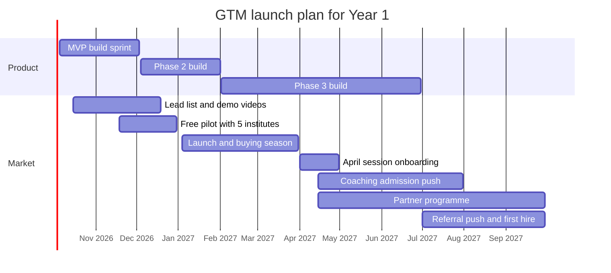
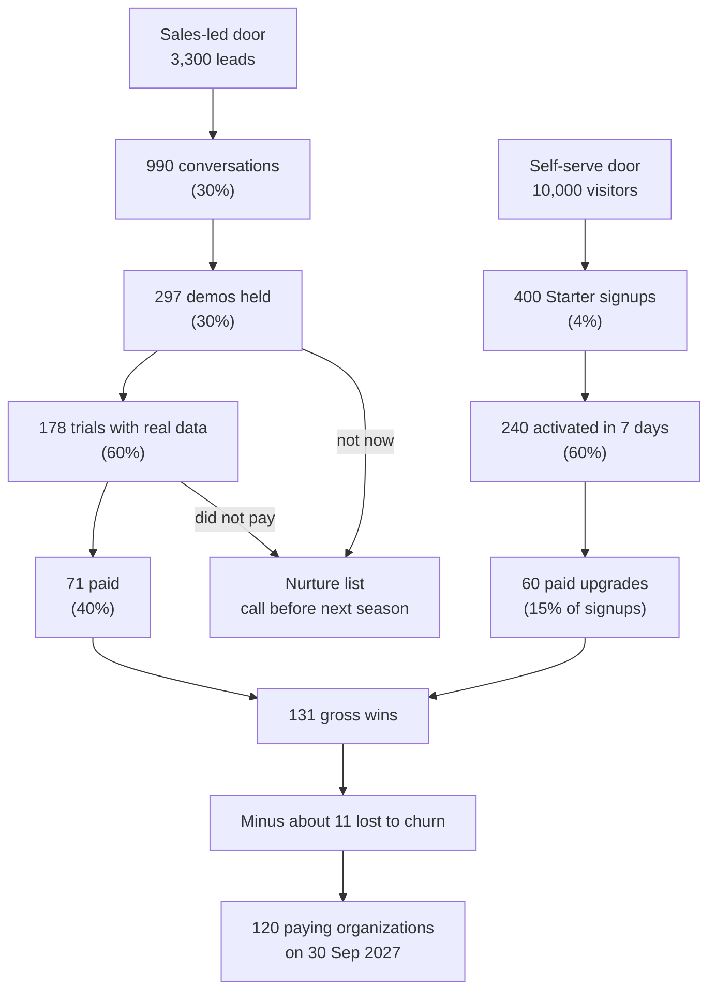
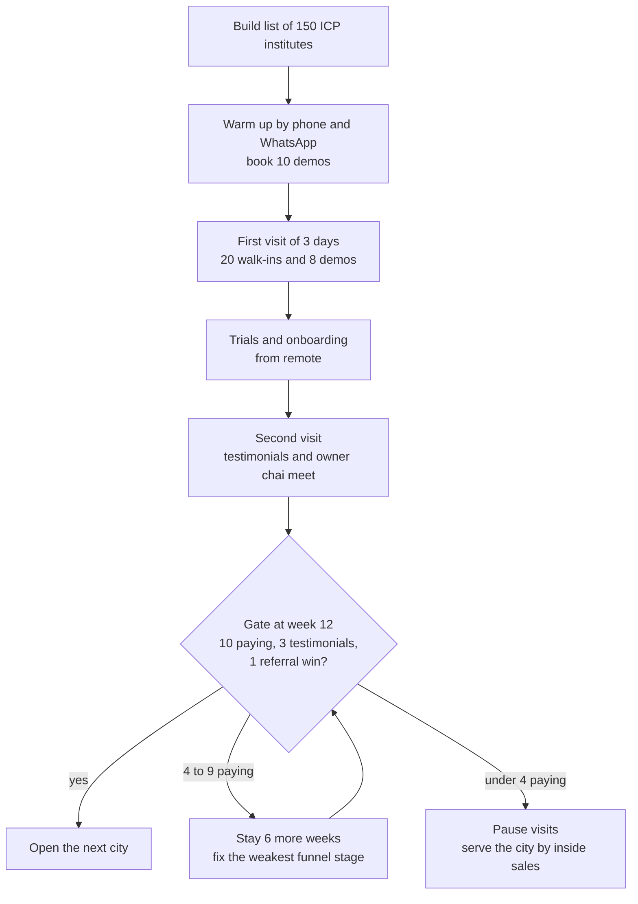

# Go-To-Market Strategy

**In simple words:** This chapter explains how EduFlow will find its first 120 paying customers in India, step by step. It names the first customers to win, the message for each person, the sales funnel with its maths, every channel with its cost, the first five cities and the Year 1 budget. It ends with a short plan for the UAE, the USA and Australia, and the warning signs to watch every week. It matters because a good product with no selling plan earns nothing.

## GTM summary

GTM (go-to-market — the plan for how we find customers, sell to them and keep them) has one job in Year 1. It must take EduFlow from 0 to 120 paying organizations by 30 September 2027. That number is a canon target, not a forecast.

Everything here is sized for a solo founder and a small bank balance. Every rate and cost in this chapter is an estimate until the pilot and the first selling season give real data. The formulas are shown, so the founder can change the inputs.

| Item | Decision |
|---|---|
| Beachhead | Coaching institutes and budget private schools in Tier 2 and Tier 3 North India, plus Delhi NCR |
| Sweet spot | 100 to 1,500 active students, 1 to 3 centres or campuses, owner decides |
| Main motion | Founder-led sales with two doors: a live demo and a free self-serve signup |
| Pilot | 5 friendly institutes, free, from 18 Nov 2026 |
| Paid launch | January 2027 |
| Main selling window | January to March 2027, the buying season before the April 2027 session |
| Year 1 target | 120 paying and 300 free organizations by 30 Sep 2027 |
| Funnel plan | 3,300 leads and 400 Starter signups give 131 wins; about 11 are lost to churn |
| Marketing cash budget | ₹5.85 lakh for the year (limit ₹6 lakh) |
| Cost to win one customer | About ₹8,300 fully loaded (canon limit ₹12,000) |
| First cities | Patna, Lucknow, Delhi NCR, Indore, Jaipur |
| First sales hire | One inside sales executive in July 2027, only after the trigger is met |
| International | UAE in Year 2 through a reseller; USA and Australia pilots in Year 3 through a self-serve trial |

This chapter does not repeat call scripts, demo scripts or objection answers. Those are in *Sales Process and Playbooks*. Onboarding and renewal work is in *Customer Success, Onboarding and Support*.

### Beachhead

A beachhead is the first small segment we win fully before we move to the next one. *Customer Segments and Ideal Customer Profile* scores all segments and explains the choice. This chapter turns that choice into a selling plan.

| Part | Choice | Why it helps selling |
|---|---|---|
| First customer type | Coaching institutes with 100 to 1,500 students | The owner decides alone; Phase 1 covers the full need |
| Second customer type | Budget private schools (unaided; fees about ₹500 to ₹3,000 a month, estimate) | The April session is a clear deadline; report cards ship on 1 Feb 2027 |
| Region | Bihar, Uttar Pradesh, Madhya Pradesh, Rajasthan and Delhi NCR | One language pair, one time zone, mostly one school calendar |
| City type | Tier 2 and Tier 3 cities, plus Delhi NCR coaching clusters | Vendor field teams are thin; owners know each other; trust travels |
| Buyer | Owner or director (`ORG_ADMIN`) | One decision maker means a short sales cycle |
| Not in Year 1 | Large school groups, colleges, government schools | Long tenders and missing modules |

> **Example:** Sharma Classes in Patna has 350 students and one owner, Rajesh Sharma. He can see a demo on Tuesday, try it with real data on Wednesday and pay on Friday. Bright Future Public School in Lucknow has 1,200 students, two campuses, a principal and trustees. That sale can take one to three months. So coaching comes first and schools follow.

### Positioning statement

Positioning is the one clear place we want to hold in the customer's mind. If the owner remembers only one sentence about EduFlow, it should be this one.

> **Rule:** For owners of coaching institutes and budget private schools who still run on registers, Excel and WhatsApp groups, EduFlow is one simple system that collects fees on time, marks attendance and keeps parents informed on WhatsApp. Unlike heavy ERP software that needs weeks of setup, or teaching apps built mainly for online classes, EduFlow starts in one day, shows its price openly and is free up to 50 students.

The two "unlike" groups are described with public facts in *Competitor Analysis*. We never name a competitor in an advertisement.

| Part of the message | Words we use | Words we avoid |
|---|---|---|
| Who it is for | "Coaching and school owners" | "Educational enterprises" |
| The problem | "Late fees, registers, parents calling all day" | "Digital transformation" |
| What EduFlow is | "School and coaching software" | "Platform", "ecosystem" |
| Main benefit | "Fees on time, parents always informed" | "AI-powered" (AI Insights is Phase 4) |
| Proof | "Start in one day, free up to 50 students, price on the website" | "Best", "No. 1" |
| Tone | Respectful Hindi and simple English | Slang, hype, fear selling |

Three short pitch lines for daily use:

- **English, 10 seconds:** "EduFlow is one simple software for your institute. It collects fees on time, marks attendance on the phone and informs parents on WhatsApp. It is free up to 50 students."
- **Hindi in Roman script, 10 seconds:** "Fees time par, attendance phone par, aur parents ko WhatsApp par turant khabar. 50 students tak bilkul free."
- **Price line:** "For Sharma Classes it is about ₹17 per student per month." Formula: ₹5,999 ÷ 350 students = ₹17.14.

> **Note:** EduFlow screens are in English at launch. Demos, training, support and WhatsApp templates are in Hindi and English. We must say this honestly in every demo. A Hindi interface is a later item; see *Feature Comparison Matrix*.

### Messaging pillars by persona

A messaging pillar is one main promise that we repeat everywhere. EduFlow has five pillars. They come from the guiding principles in the canon.

| Pillar | Promise | Proof we can show |
|---|---|---|
| Fees on time | Automatic reminders and UPI payment bring fees in earlier | Defaulter list, reminder on the owner's own phone, online fee share target of 40% |
| Parents always know | Absence, fee and exam news reach parents on WhatsApp the same day | A live absence alert sent during the demo |
| Start in one day | Import students from Excel and print the first receipt today | Excel import in the demo; free Starter plan; pilot stories |
| Clear and honest price | Price is on the website; free up to 50 students; no hidden setup fee | Price page; per-student maths such as ₹17 a month |
| Safe and yours | Each institute's data is isolated, hosted in Mumbai and can be exported any time | Role-based access, export button, consent records for parents |

Each person in the institute hears a different pillar first. The six personas are described in *Customer Personas*.

| Persona | Role in the purchase | Lead message | Proof we show | Where we say it |
|---|---|---|---|---|
| Coaching owner, Rajesh Sharma | Buyer and final decision maker | "Collect fees on time and see every rupee from your phone." | Defaulter list and WhatsApp reminder on his own data | WhatsApp video, call after 8 pm, in-person demo |
| Principal, Dr. Anita Verma | Strong influencer; academic gatekeeper | "Less register work for teachers and every parent informed." | Attendance in 30 seconds; report card sample after 1 Feb 2027 | School visit, association meets, formal email |
| Teacher, Priya Nair | Daily user; can quietly block adoption | "Mark attendance in 30 seconds on your own phone. No double entry." | 2-minute task video; 45-minute hands-on training | Staff-room training, YouTube Shorts |
| Accountant, Suresh Gupta | Daily user; gatekeeper for fee data | "One-click receipts, and the day-end cash always matches." | Receipt print, day book, Excel import of old dues | At the fee counter during the demo; task videos |
| Parent, Sunita Devi | No buying role; drives adoption | "Know on WhatsApp that your child reached class. Pay fees by UPI from home." | Sample absence alert and fee receipt on WhatsApp | Messages from the institute, poster at the gate |
| Student, Aarav Sharma | No buying role | "Timetable, homework and results in one place." | Student Portal (Phase 2) | Inside the product only |

> **Rule:** EduFlow never markets to children and never uses student or parent data for advertising. Messages to parents go out only in the institute's name, for the institute's own work. This follows the DPDP Act points in *Compliance, Legal and Data Protection Requirements*.

### Launch timeline

The timeline is tied to the canon dates. Indian schools choose software between January and March, before the session starts in April. Coaching institutes open new JEE and NEET batches between April and July. So Year 1 has two selling seasons, and both come after the MVP is ready.

| Window | Dates | GTM work | Proof that the window is done |
|---|---|---|---|
| Prepare | 20 Sep to 4 Oct 2026 | Pick 5 pilot institutes; open Google Business Profile and YouTube channel | 5 pilot owners say yes |
| Build sprint | 5 Oct to 3 Dec 2026 | Build lead list; weekly progress status to opted-in owners | List of 500 coaching institutes and 200 schools |
| Free pilot | From 18 Nov 2026 (Day 45) | Founder onboards 5 friendly institutes on site | 5 active pilots, 3 testimonials |
| Get ready to sell | 4 to 19 Dec 2026 | Price page, 5-minute demo video in Hindi and English, referral and partner terms | 20 demos booked for January |
| Paid launch | January 2027 | Open Patna and Lucknow; convert pilots to paid | First 6 paying organizations |
| Buying season | January to March 2027 | Highest outreach of the year; 100 demos; Phase 2 ships on 1 Feb 2027; Delhi NCR opens in March | 30 paying by 31 Mar 2027 |
| April session start | April 2027 | Onboarding first; selling moves to coaching admission season | All March customers live before classes start |
| Widen | April to June 2027 | Partner programme starts; Indore opens in May; Phase 3 ships in June | 70 paying by 30 Jun 2027 |
| Scale | July to September 2027 | First inside sales hire; Jaipur; referral push; Phase 4 by September | 120 paying by 30 Sep 2027 |

**Figure: GTM launch plan for Year 1**

The chart shows that selling starts while Phase 2 is still being built. That is on purpose. Coaching institutes need only Phase 1 modules, so they can buy in January. Schools wait for report cards, which arrive on 1 February 2027.

> **Warning:** A school that is not live by 15 April 2027 will usually wait for the next session. After 31 March, stop chasing new school deals for four weeks. Put that time into onboarding the schools that already paid.

## Sales funnel

A sales funnel is the list of steps from "never heard of us" to "paid". At each step some institutes drop out, so the top must be much wider than the bottom. A conversion rate is the share that moves from one step to the next.

### Two doors and one trial

EduFlow has two doors into the funnel.

1. **Sales-led door.** We find the institute, talk to the owner and give a live demo. This door brings most Pro and Enterprise customers.
2. **Self-serve door.** The owner finds us, signs up on the free Starter plan and upgrades later. This door brings most Growth customers.

Both doors lead to the same key moment: a trial with the institute's own data. *Business Model* proposes a 14-day trial of Growth features for every new signup. The final trial rule is set in *Pricing Strategy*. This chapter uses 14 days in its maths.

### Stage definitions

A stage counts only when its proof is recorded in the CRM (customer relationship management tool — the one list where every lead, call and deal is logged). For the first 300 leads a Google Sheet is enough. After that we use a low-cost CRM.

| Stage | Definition | Proof in the CRM | Target time in stage |
|---|---|---|---|
| Lead | An ICP-fit institute with the decision maker's name and phone number | Row with source, city, type, student count guess | Called within 7 days |
| Conversation | A two-way talk of 2 minutes or more with the decision maker | Call or chat note with student count and current tool | Demo offered in the same talk |
| Demo held | A 20 to 30 minute live demo that the decision maker attends | Date, attendees, top 3 needs; no-shows do not count | Trial starts within 3 days |
| Trial | Organization created, 20 or more students imported, first fee receipt or attendance marked | Organization ID and activation date | 14 days |
| Paid | First subscription payment received and GST invoice issued | Razorpay payment ID or bank reference | Counted on payment date |
| Nurture | "Not now" or no reply after 3 tries | Next call date before the next season | Re-contact in 60 to 90 days |

ICP means ideal customer profile — the exact kind of institute we want. The ten-question ICP checklist is in *Customer Segments and Ideal Customer Profile*.

### Conversion targets and volume math for the sales-led door

We work backwards from the target. *Business Objectives, Scope and Stakeholders* splits the 120 customers into about 65 from direct sales and about 55 from self-serve upgrades. We keep that split.

Target conversion rates (all estimates, to be replaced by pilot data):

| Step | Target rate | Why this rate is reasonable |
|---|---|---|
| Lead to conversation | 30% | Owners pick up unknown numbers less than half the time; 3 tries each |
| Conversation to demo held | 30% | Includes about 25% no-shows on booked demos |
| Demo held to trial | 60% | The demo uses the lead's own batches and fee amounts |
| Trial to paid | 40% | Founder helps with Excel import during the trial |
| Demo held to paid (combined) | 24% | 60% × 40%; *Executive Summary* uses about 25% |

Formulas:

- Paid customers = leads × 30% × 30% × 60% × 40% = leads × 0.0216.
- Leads needed = paid customers ÷ 0.0216.
- For 65 customers: 65 ÷ 0.0216 = 3,009, rounded to 3,000 leads.
- Check: 3,000 × 30% = 900 conversations. 900 × 30% = 270 demos. 270 × 60% = 162 trials. 162 × 40% = 65 paid.

The plan adds a 10% safety buffer on top, for the reason given under "Churn buffer" below.

| Stage | Rate from previous stage | Base volume | Plan volume with buffer | Plan per month | Plan per week |
|---|---|---|---|---|---|
| Leads | — | 3,000 | 3,300 | 367 | 85 |
| Conversations | 30% | 900 | 990 | 110 | 25 |
| Demos held | 30% | 270 | 297 | 33 | 8 |
| Trials | 60% | 162 | 178 | 20 | 5 |
| Paid | 40% | 65 | 71 | 8 | 2 |

"Per month" divides by the 9 selling months from January to September 2027. "Per week" divides by 39 weeks.

> **Example:** One week in February 2027. The founder and a part-time tele-caller add 85 new leads and make about 250 dials. They reach 25 owners. Eight owners attend a demo. Five start a trial with real data. Two pay before the trial ends. If every week looks like this, the sales-led door delivers 71 customers by September.

### Volume math for the self-serve door

The self-serve door is product-led. The owner signs up alone, uses the free Starter plan and upgrades when he needs more students, WhatsApp sending or online fee payment.

| Stage | Definition | Target rate | Base volume | Plan volume with buffer |
|---|---|---|---|---|
| Visitors | People who open the website or a listing page | — | 9,125 | 10,000 |
| Starter signups | Organization created with a verified phone number | 4% of visitors | 365 | 400 |
| Activated | First fee receipt or first attendance within 7 days | 60% of signups (canon) | 219 | 240 |
| Paid upgrade | Moves to Growth or Pro within 90 days | 15% of signups (canon) | 55 | 60 |

Formulas:

- Signups needed = paid upgrades ÷ 15% = 55 ÷ 0.15 = 367, rounded to the 365 used in *Business Objectives, Scope and Stakeholders*.
- Visitors needed = signups ÷ 4% = 365 ÷ 0.04 = 9,125. With the buffer this is 10,000, or about 1,100 visitors a month.
- Free organizations at year end = 365 signups − 55 upgrades − about 10 closed accounts = 300. This matches the canon target.

> **Note:** About 107 sales-led trials will not pay (178 − 71). Most of them have more than 100 students, so they cannot stay on the 50-student Starter plan. We count them as nurture leads, not as free organizations.

### Churn buffer

Churn is the share of customers who leave in a month. The canon target is under 3% a month. The 120 target is a count on one day, 30 September 2027. So customers lost before that day must be replaced.

- Average paying base during January to September 2027: about 55 organizations (estimate).
- About 40% pay yearly and cannot leave inside Year 1. The other 33 pay monthly.
- Expected loss = 33 × 2.8% a month × 9 months = about 8 customers. The 2.8% blend comes from *Business Model*.
- We plan for 11 lost customers to be safe. So the funnel must win 120 + 11 = 131 customers.
- Plan split: 71 from the sales-led door and 60 from the self-serve door.

### Funnel picture

**Figure: Two-door sales funnel for Year 1 (plan volumes with buffer)**

The left side is the sales-led door and the right side is the self-serve door. Both meet at 131 gross wins. Leads that say "not now" are not thrown away. They go to a nurture list and get a call before the next season.

### Month-by-month plan

The plan below spreads the volumes over the nine selling months. The quarter-end values match the checkpoints in *Business Objectives, Scope and Stakeholders*: 30, 70 and 120 paying organizations.

| Month | New leads | Demos held | Starter signups | Gross wins | Lost to churn | Paying at month end |
|---|---|---|---|---|---|---|
| Jan 2027 | 300 | 25 | 25 | 6 | 0 | 6 |
| Feb 2027 | 400 | 35 | 35 | 11 | 1 | 16 |
| Mar 2027 | 450 | 40 | 45 | 15 | 1 | 30 |
| Apr 2027 | 330 | 30 | 45 | 13 | 1 | 42 |
| May 2027 | 340 | 30 | 45 | 14 | 1 | 55 |
| Jun 2027 | 360 | 33 | 50 | 17 | 2 | 70 |
| Jul 2027 | 370 | 34 | 50 | 18 | 2 | 86 |
| Aug 2027 | 375 | 35 | 52 | 18 | 1 | 103 |
| Sep 2027 | 375 | 35 | 53 | 19 | 2 | 120 |
| **Total** | **3,300** | **297** | **400** | **131** | **11** | **120** |

January looks small because trials started in January pay in February. Three of the five pilots are expected to become paying customers in January (target). April and May dip because school owners are busy with the new session.

### What the numbers mean for the founder's week

The founder is also building Phase 2 and Phase 3. So selling time must be fixed in the calendar, not squeezed in.

| Day | Morning | Afternoon | Evening (8 pm to 9:30 pm) |
|---|---|---|---|
| Monday | Build | 30-minute GTM review, then calls and WhatsApp follow-ups | Owner demos |
| Tuesday | Build | Demos and calls | Owner demos |
| Wednesday | Build | Local field visits or calls | Owner demos |
| Thursday | Build | Help trial users import data | Owner demos |
| Friday | Build | Record 1 video and write 1 article | Free |
| Saturday | Field day or city trip | Field day or city trip | Free |
| Sunday | Rest | Owner chai meet once a month | Free |

This gives about 22 selling hours and 20 building hours a week (estimate). Coaching owners are easiest to reach between 11 am and 2 pm and after 8 pm, because batches run in the early morning and evening. School owners and principals are easiest between 12:30 pm and 3 pm.

> **Founder note:** If demos held fall under 5 a week for three weeks in a row, stop adding features for one week and sell. A missed buying season costs a full year. A late feature costs a few weeks.

## Channels in detail

A channel is one way of reaching customers. Year 1 uses eleven channels, but not with equal effort. Four channels carry the sales-led door: cold calling, WhatsApp outreach, field visits and referrals. Four channels feed the self-serve door: content and SEO, YouTube, listings and a small ads test. Partners, events and word of mouth add the rest.

### Channel plan at a glance

All values are Year 1 plan estimates. "Cash cost" is marketing money only. People cost is added later, in the CAC check under "Marketing budget for Year 1".

| Channel | Leads or signups | Demos held | Paid wins | Cash cost | Cash cost per win |
|---|---|---|---|---|---|
| Cold calling | 1,700 leads | 94 | 19 | ₹72,000 | ₹3,789 |
| WhatsApp outreach | 700 leads | 49 | 11 | ₹32,000 | ₹2,909 |
| Local field visits | 400 leads | 56 | 15 | ₹1,54,000 | ₹10,267 |
| Referral program | 70 leads | 35 | 12 | ₹30,000 | ₹2,500 |
| Reseller and channel partners | 120 leads | 24 | 5 | ₹35,000 | ₹7,000 |
| Education fairs and principal associations | 180 leads | 12 | 3 | ₹70,000 | ₹23,333 |
| Content and SEO | 110 signups, 35 demo requests | 7 | 18 | ₹26,000 | ₹1,444 |
| YouTube demos | 90 signups, 40 demo requests | 8 | 15 | ₹45,000 | ₹3,000 |
| Google Business and Justdial listings | 50 signups, 30 demo requests | 6 | 9 | ₹24,000 | ₹2,667 |
| Facebook and Instagram ads test | 70 signups, 25 demo requests | 6 | 12 | ₹70,000 | ₹5,833 |
| Word of mouth and invite links | 80 signups | 0 | 12 | ₹0 | ₹0 |
| Contingency | — | — | — | ₹27,000 | — |
| **Total** | **3,300 leads, 400 signups** | **297** | **131** | **₹5,85,000** | **₹4,466** |

How to read the table:

- The 130 demo requests count as sales-led leads. So leads = 3,170 outbound + 130 inbound = 3,300.
- Wins for the last five rows = signups × 15% + a share of the 6 wins from inbound demos.
- Cash cost per win = cash cost ÷ paid wins. Example: ₹72,000 ÷ 19 = ₹3,789.
- Blended cash cost per win = ₹5,85,000 ÷ 131 = ₹4,466.

> **Best practice:** Judge a channel by cost per win and by the plan it sells, not by cost per lead. Field visits look expensive at ₹10,267 per win. But they sell mostly Pro at ₹5,999 a month, so the payback is about two months.

### Cold calling

Cold calling means phoning an owner who has not asked us to call. It is the biggest source of leads because it needs time, not money.

**How it works.** We build a list of ICP institutes from Google Maps, Justdial, signboards and coaching association lists. The list has 700 rows by 19 December 2026 and grows to 1,700 called leads by September 2027. A part-time tele-caller makes the first call from February 2027. The founder takes every interested owner from that point.

| Item | Plan |
|---|---|
| Monthly activity target | 190 new leads, about 570 dials (up to 3 tries per lead), 57 conversations |
| Monthly yield | 10 demos held, 2 paid wins |
| Year 1 volume | 1,700 leads, 94 demos, 19 wins |
| Best call times | Coaching owners 11 am to 2 pm; school owners 12:30 pm to 3 pm; never on Monday morning |
| Cash cost | ₹72,000 |
| Cost split | SIM and plan ₹6,000; CRM and call-log tools ₹13,500; tele-caller retainer ₹5,000 × 8 months = ₹40,000; incentive ₹150 × about 83 demos = ₹12,500 |
| Owner | Founder; part-time tele-caller from February 2027 |

Rules for calling:

1. Call only business numbers that the institute itself has published. Never buy a phone database.
2. Say who you are and why you call in the first 10 seconds. Ask for 2 minutes, not for a sale.
3. Stop after 3 unanswered tries. Move the lead to nurture.
4. If the owner says "do not call", mark the lead as "Do not contact" the same day.
5. India has DND rules (do-not-disturb rules from TRAI against unwanted sales calls). Before call volume grows beyond one or two people, check the telemarketer rules with a lawyer; see *Compliance, Legal and Data Protection Requirements*.

> **Example:** On one Tuesday the tele-caller dials 30 numbers in Patna between 11 am and 1 pm. Nine owners pick up. Three agree to a demo and two of them attend. She earns ₹150 for each demo held, so ₹300 that day on top of her retainer.

### WhatsApp outreach

WhatsApp is where Indian owners read messages. It is also easy to misuse. Meta blocks business numbers that send messages people did not ask for. So this channel is opt-in only. Opt-in means the person has clearly agreed to get our messages.

| Way to get opt-in | How it works | Record we keep |
|---|---|---|
| Owner messages us first | QR code or "Chat on WhatsApp" link on flyers, website, videos and ads | The chat itself |
| Spoken opt-in on a call | "May I send the 2-minute demo video on WhatsApp?" | CRM tick with date and caller name |
| Form tick box | Demo form and signup form; the box is not ticked by default | Form record |
| Event QR code | Owner scans to get free fee-reminder templates | The chat itself |
| Owner groups | Post only where the group admin allows; never copy member numbers | Screenshot of the admin's approval |

| Item | Plan |
|---|---|
| Monthly activity target | 78 new opted-in contacts; 2 broadcasts a month; reply to every chat within 1 hour in work time |
| Monthly yield | 5 to 6 demos held, 1 to 2 paid wins |
| Year 1 volume | 700 opted-in leads, 49 demos, 11 wins |
| Message quality targets | Read rate above 60%; reply rate above 8%; block or opt-out rate under 1% per broadcast |
| Cash cost | ₹32,000 |
| Cost split | Template message charges ₹7,000; 12 images and 6 short videos ₹18,000; second SIM and number ₹3,000; link and QR tool ₹4,000 |
| Owner | Founder |

A marketing template message costs about ₹0.80 to ₹0.90 (estimate; check Meta's current India rate card). An average list of 400 contacts × 18 broadcasts = 7,200 messages, or about ₹6,500.

Rules for WhatsApp:

1. The first message says who we are and where we got the number.
2. Every broadcast ends with "Reply STOP to stop these messages". We act on STOP the same day.
3. No more than 2 broadcasts a month and 3 personal follow-ups per lead.
4. One-to-one chats use the WhatsApp Business app. Broadcasts use approved templates on the WhatsApp Cloud API. No bulk-sender tools.
5. Every broadcast gives something useful: a fee-reminder template, a DPDP checklist, a 2-minute task video.

> **Warning:** A phone number printed on a signboard or a Justdial page is business contact data that the owner made public. Our reading is that the DPDP Act does not cover such data. But WhatsApp's own policy still needs opt-in. If the number gets a "Low" quality rating, pause all broadcasts for 7 days.

### Local field visits

In Tier 2 and Tier 3 cities, a face is trusted more than a website. Coaching institutes sit close together, so one day on one road can cover eight institutes.

**How a field day runs.** The founder books two demos in the cluster in advance. Between them he walks into six more institutes between 11 am and 3 pm. He carries a phone with the demo account, a printed sample receipt for "Aarav Sharma" and a one-page flyer in Hindi and English. The flyer has the price, a QR code to WhatsApp and the pilot customer's name.

| Item | Plan |
|---|---|
| Monthly activity target | 6 field days, about 45 walk-ins, 12 booked visits |
| Monthly yield | 6 demos held (many on the spot), 1 to 2 paid wins |
| Year 1 volume | 400 visited leads, 56 demos, 15 wins |
| Cash cost | ₹1,54,000 (travel ₹1,22,000 + print ₹32,000) |
| Travel split | 16 city trips × ₹7,000 = ₹1,12,000; local travel in the home city ₹10,000 |
| One trip | Train 3AC return ₹1,800; 2 hotel nights ₹2,600; autos ₹1,400; food ₹1,200 = ₹7,000 |
| Print split | 3,000 flyers ₹9,000; 2 standees ₹4,000; cards and QR stickers ₹3,000; event banners ₹6,000; reprints ₹10,000 |
| Owner | Founder |

Payback check for one field win on Pro: ₹10,267 ÷ (₹5,999 × 80% gross margin) = 2.1 months.

> **Rule:** Never travel for a single Growth deal. A trip is allowed only when it has 2 booked demos with Pro-size institutes (300 students or more) and a cluster to walk on the same day.

### Referral program

A referral is when a happy customer sends us another owner. Owners in one city know each other, so this is the cheapest and warmest channel. The design is "give a month, get a month".

| Rule | Decision |
|---|---|
| Reward for the new institute | 1 extra month free on its first paid plan (monthly: month 2 is free; yearly: 13 months for the yearly price) |
| Reward for a paying referrer | 1 month free on its own plan (monthly: next invoice is ₹0; yearly: renewal date moves 1 month) |
| Reward for a referrer who does not pay us | ₹2,000 credit: account credit for a Starter institute; UPI payment for a teacher, accountant or friend |
| When the reward is given | After the new institute pays its second month, or 30 days after a yearly payment |
| Value cap | ₹5,999 per referral; an Enterprise referrer gets a ₹5,999 credit |
| Yearly cap | 12 rewards per referrer per year; above that, the referrer joins the partner programme |
| Not allowed | Self-referral (same owner, phone or GSTIN); reward plus partner commission on the same deal |
| Tracking | Referral code is the organization slug, for example `SHARMA`; the code is typed at signup or noted in the CRM |
| Tax | Free months show as a discount line on the GST invoice; UPI rewards stay small; confirm both with the CA |

> **Example:** Rajesh Sharma of Sharma Classes (Pro, ₹5,999 a month) refers a friend's institute with 220 students. The friend buys Growth at ₹2,499 a month and pays for month 1 and month 3. Month 2 is free for the friend. Rajesh gets his next month free. EduFlow gives up ₹2,499 + ₹5,999 = ₹8,498 of revenue. That is still under the ₹12,000 CAC limit, and no cash leaves the bank.

| Item | Plan |
|---|---|
| Monthly activity target | Ask 100% of customers on day 30; ask again after a 9 or 10 NPS score and at renewal |
| Monthly yield | 8 referral leads, 4 demos held, 1 to 2 paid wins |
| Year 1 volume | 70 leads, 35 demos, 12 wins; plus 80 signups and 12 wins from word of mouth |
| Share of new wins | About 18% for the year; target 25% in July to September 2027 |
| Cash cost | ₹30,000: 10 UPI rewards × ₹2,000 = ₹20,000; thank-you gifts ₹10,000 |
| Revenue given up | 12 wins × about ₹7,000 = ₹84,000 (estimate; not a cash cost) |
| Owner | Founder |

NPS means Net Promoter Score — a 0 to 10 answer to "would you recommend us?". The product should have a "Refer an institute" button with the code and a ready WhatsApp message. That need belongs in *Business Requirements Catalog*.

Word of mouth also works without a reward. The Starter plan carries EduFlow branding on receipts and parent pages. Coaching teachers often teach at two or three institutes, so they carry the product with them.

### Reseller and channel partners

A reseller is a local business that sells EduFlow and earns a commission. *Business Model* proposed the partner terms. This chapter adopts them without change: 20% of first-year fees and 10% from month 13, with the same guard rails. It adds one lighter level, the introducer.

| Partner type | Why owners trust them | What they do for us | Level and reward |
|---|---|---|---|
| Local computer vendor | Sold and repairs the office computer and printer | Demo, on-site data entry, first-line support | Reseller: 20%, then 10% |
| CA firm or tax consultant | Files the institute's GST and income tax | Warm introduction; often joins the demo | Reseller or introducer |
| Stationery, book or uniform supplier | Visits dozens of schools every season | Introduction only | Introducer: ₹2,000 per paying customer |
| Education or affiliation consultant | Advises new schools on setup and board affiliation | Introduction and demo | Reseller: 20%, then 10% |

| Item | Plan |
|---|---|
| Start date | First partner talks in mid-April 2027; partners sell only once 30 direct customers are live (expected May 2027) |
| Monthly activity target (from April) | 12 partner meetings, 2 to 3 partners signed, 20 registered leads |
| Monthly yield (from April) | 4 demos held, about 1 paid win |
| Year 1 volume | 15 partners signed, 6 active, 120 leads, 24 demos, 5 wins |
| Partner onboarding | 2-hour training, demo account, partner kit, lead registration by a simple form |
| Cash cost | ₹35,000: 15 kits × ₹1,000; 2 partner training meets × ₹5,000; standees and certificates ₹10,000 |
| Commission paid inside Year 1 | About ₹25,000 (estimate; counted in the CAC check) |
| Owner | Founder; a partner manager is a Year 2 hire |

Guard rails from *Business Model* stay in force. Partners sell at the public price. EduFlow owns the contract, the billing and the data. A partner never gets `SUPER_ADMIN` access. No partner gets an exclusive territory in Year 1 or Year 2.

> **Tip:** Recruit partners from your own customers' suppliers. Ask every new customer: "Who set up your computers, and who is your CA?" A partner who already serves three of our customers needs no convincing.

### Content and SEO in Hindi and English

SEO (search engine optimisation — making our pages appear when owners search on Google) is slow but almost free. Pages written in January start bringing visitors in April to June. Most rivals publish only in English, so Hindi pages are an open field (estimate).

| Theme | Example search words | Page we publish |
|---|---|---|
| Buying words | "coaching management software", "school ERP price" | Product and price pages in English and Hindi |
| Hindi buying words | "coaching ke liye software", "school fees software" | Hindi landing page with the demo video |
| Free templates | "fee receipt format", "attendance register format Excel" | Free download that asks for WhatsApp opt-in |
| Rules and compliance | "coaching centre guidelines 2024", "DPDP Act for schools" | Plain-language explainer with a checklist |
| City pages | "school software in Patna", "coaching software in Lucknow" | One page per launch city with local testimonials |

| Item | Plan |
|---|---|
| Monthly activity target | 4 articles (2 Hindi, 2 English), 1 free template, 1 page refresh |
| Year 1 volume | 36 articles, 9 templates, 5 city pages |
| Expected yield | About 3,200 visitors, 110 signups, 35 demo requests, 18 wins |
| Cash cost | ₹26,000: domain and site ₹3,000; SEO tool for 3 months ₹9,000; Hindi proofreading ₹8,000; graphics ₹6,000 |
| Owner | Founder drafts with Claude; a freelance proofreader checks the Hindi |

Comparison pages use only public facts with the canon's disclaimer. The facts come from *Competitor Analysis* and *Feature Comparison Matrix*.

### YouTube demos

Owners want to see the screen before they talk to anyone. *Customer Personas* shows that a 2 to 3 minute Hindi video forwarded on WhatsApp is how Rajesh Sharma first hears about a product.

| Video type | Length | Language | Count in Year 1 |
|---|---|---|---|
| Full product demo | 5 minutes | Hindi and English | 2, refreshed each phase |
| Task videos (collect fee, mark attendance, import Excel, send reminder) | 2 minutes | Hindi first | 24 |
| Customer stories from pilots and early customers | 3 minutes | Hindi | 6 |
| Explainer talks (fee defaulters, coaching rules, DPDP basics) | 6 minutes | Hindi | 4 |
| Shorts cut from the videos above | 30 to 45 seconds | Hindi | 36 |

| Item | Plan |
|---|---|
| Monthly activity target | 4 videos and 4 Shorts |
| Expected yield | About 25,000 views, 2,600 website visits, 90 signups, 40 demo requests, 15 wins |
| Cash cost | ₹45,000: mic and light ₹6,000; software ₹6,000; freelance editor ₹600 × 40 = ₹24,000; thumbnails ₹4,000; testimonial travel ₹5,000 |
| Owner | Founder records; freelance editor cuts |

> **Rule:** Videos show only the demo organization with the canon sample names. Never show a real student's name, photo or phone number. A customer story needs the owner's written consent, and no child's face appears.

### Google Business Profile and Justdial listings

Many owners search "school software near me" on Google Maps or call Justdial. A Google Business Profile is a free business page on Google Search and Maps. Justdial is a local search directory that sells paid listings.

| Item | Plan |
|---|---|
| Free listings | Google Business Profile, plus free profiles on software directories such as SoftwareSuggest, Capterra and G2 |
| Paid listing test | Justdial in Patna and Lucknow under school and coaching software categories, about ₹2,500 a month (estimate) |
| Monthly activity target | 4 Google posts, 5 new customer reviews, reply to every listing lead within 5 minutes in work time |
| Review target | 40 Google reviews with a 4.7 average by 30 Sep 2027 |
| Expected yield | About 1,400 visits, 50 signups, 30 demo requests, 9 wins |
| Cash cost | ₹24,000: Justdial ₹2,500 × 9 months = ₹22,500; review QR cards ₹1,500 |
| Stop rule | If cost per demo held from Justdial is above ₹800 after 3 months, end the paid listing |

> **Warning:** Justdial sends the same lead to several vendors. The vendor who calls first usually wins. If we cannot call within 5 minutes, the paid listing is wasted money.

### Education fairs and principal associations

Private school owners and principals meet in district associations, unaided school federations and CBSE Sahodaya school clusters. Coaching owners have their own city associations. These rooms hold 30 to 150 decision makers at one time.

We do not buy big stalls in Year 1. We ask for a 15-minute talk on a useful topic and sponsor the tea. Good topics are "How to cut fee defaulters by 30%" and "What the DPDP Act asks from a school".

| Item | Plan |
|---|---|
| Year 1 volume | 5 association meets and 1 regional education fair stall |
| Activity target | One event about every 6 weeks from February 2027 |
| At each event | One talk, one QR code for WhatsApp opt-in, one free template, 3 demos booked on the spot |
| Expected yield | 180 leads, 12 demos, 3 direct wins |
| Cash cost | ₹70,000: 5 meets × about ₹9,000 = ₹45,000; 1 fair stall about ₹25,000 |
| Owner | Founder |

This is the most expensive channel per direct win (₹23,333). We keep it for two side benefits. It builds the trust that school owners need before they buy. And it is where we meet future resellers and the first Enterprise leads.

> **Rule:** If the first three events together bring fewer than 5 demos, cancel the fair stall and move its ₹25,000 to field visits.

### Facebook and Instagram ads test

Paid ads are a test in Year 1, not a main channel. The budget is ₹70,000 in total. It includes a small Google Search test on buying words.

| Item | Plan |
|---|---|
| Budget by quarter | January to March ₹30,000; April to June ₹20,000; July to September ₹20,000 |
| Ad types | Click-to-WhatsApp ads and lead-form ads with a 30-second Hindi video |
| Targeting | Adults only; 10 km around coaching clusters in the five launch cities; education page admins and owners |
| Test design | 3 creatives × 2 audiences × ₹5,000 each, for 2 weeks |
| Stop rule | After ₹10,000 of spend: stop if cost per qualified lead is above ₹400 or cost per demo is above ₹1,500 |
| Scale rule | If measured cost per win stays under ₹6,000 for 60 days, release money from the reserve |
| Expected yield | About 1,900 visits, 70 signups, 25 demo requests, 12 wins |
| Owner | Founder |

> **Rule:** Ads target owners and staff, never students. We never upload parent or student phone numbers to an ad platform. We never build ad audiences from customer data.

## Inside sales and field sales model

Inside sales means selling by phone, WhatsApp and video call, without travel. Field sales means visiting the institute in person. EduFlow needs both, but at different times and for different deal sizes.

### The two models side by side

All numbers are estimates for one trained person after a 2-month ramp.

| Point | Inside sales | Field sales |
|---|---|---|
| How they sell | Phone, WhatsApp, Google Meet demo | Walk-ins, in-person demo, staff-room training |
| Best for | Growth and Pro deals in any city | Pro and Enterprise deals, school groups, dense clusters |
| Demos per week | 15 to 20 | 8 to 10 |
| Monthly cost per person | About ₹32,000 (₹22,000 fixed + incentives + tools) | About ₹45,000 (₹25,000 fixed + ₹8,000 travel + incentives) |
| Wins per month | 10 | 6 |
| People cost per win | ₹3,200 | ₹7,500 |
| Typical first-year deal value | About ₹36,000 (mix of Growth and Pro) | About ₹72,000 (mostly Pro) |
| Payback on people cost | About 1.3 months | About 1.6 months |

Payback formula: people cost per win ÷ (monthly price × 80% gross margin). Inside example: ₹3,200 ÷ (₹3,000 × 80%) = 1.3 months. Field example: ₹7,500 ÷ (₹6,000 × 80%) = 1.6 months.

### Who sells what

| Plan | Sales model | Visits allowed |
|---|---|---|
| Starter | Self-serve only | None |
| Growth | Self-serve with WhatsApp help, or one inside demo | None, unless the founder is already on that road |
| Pro | Inside demo, then guided trial | One visit in a launch city |
| Enterprise | Founder-led, in person | As many as the deal needs |

### When to add each role

Hiring follows triggers, not dates. The dates below are the expected time the trigger is met. Headcount and salaries are governed by *Organization and Hiring Plan*. The canon team size is 4 at the end of Year 1 and 14 at the end of Year 2.

| Stage | Expected time | Sales team | Trigger to move to this stage |
|---|---|---|---|
| Founder-led | Nov 2026 to Jun 2027 | Founder plus a part-time tele-caller from February 2027 | Paid launch |
| First inside hire | July 2027 | Founder plus 1 inside sales executive (Hindi and English) | MRR of ₹3 lakh or more, and more than 8 founder demos a week for 4 weeks |
| First field hire | October 2027 to March 2028 | 2 inside executives plus 1 city field executive | A city has 25 paying customers, 300 untouched ICP leads and a referral share above 20% |
| Small sales team | April to September 2028 | 3 inside, 2 field, 1 partner manager | 15 active partners, and inside cost per win under ₹4,000 for 3 months |

MRR means monthly recurring revenue — the subscription money that comes in every month.

Rules for the first hire:

1. The founder must first win at least 30 customers himself through live demos. Only then is the pitch proven enough to teach.
2. The first hire sells Growth and small Pro deals. The founder keeps Enterprise and school groups.
3. Pay is fixed salary plus ₹1,000 per paid win, paid after the customer's second payment (estimate).
4. If the new hire brings fewer than 5 wins in month three, fix the training or end the role in month four.

> **Founder note:** Do not hire a field person to "open" a new city. Field people work well only where there is already proof: local customers, local testimonials and warm referrals. The founder opens cities. Field staff deepen them.

## City-by-city rollout plan

We launch one city at a time. A city is "won" when local owners start sending us other local owners. Spreading thin across ten cities gives ten weak stories. Going deep in five cities gives five strong ones.

### The first five cities

| Order | City | Opens | Clusters to walk first (examples) | Satellite towns | Paying target, 30 Sep 2027 |
|---|---|---|---|---|---|
| 1 | Patna | Pilot Nov 2026; paid Jan 2027 | Boring Road, Kankarbagh, Musallahpur Haat | Muzaffarpur, Gaya | 28 |
| 2 | Lucknow | January 2027 | Hazratganj, Aliganj, Kapoorthala, Indira Nagar | Kanpur, Prayagraj | 24 |
| 3 | Delhi NCR | March 2027 | Mukherjee Nagar, Laxmi Nagar, Karol Bagh | Noida, Ghaziabad | 18 |
| 4 | Indore | May 2027 | Bhanwarkuan, Geeta Bhawan | Bhopal | 14 |
| 5 | Jaipur | July 2027 | Gopalpura Bypass, Lal Kothi | Sikar, Kota | 10 |
| — | Rest of India | Always open | Self-serve signup and inside sales only | — | 26 |
| | **Total** | | | | **120** |

Why this order:

- **Patna** is home to the sample customer Sharma Classes and to dense coaching clusters. Software use is low and Hindi-first selling is an advantage.
- **Lucknow** has the largest school base in the region. It is where the first school early adopters, such as Bright Future Public School, come from.
- **Delhi NCR** gives reference value. A customer in Mukherjee Nagar impresses an owner in Gaya. It opens third because competition there is the strongest.
- **Indore** is a classic Tier 2 coaching hub with little vendor presence. It opens once remote demos are smooth.
- **Jaipur** opens last because Rajasthan's new coaching rules make clean records urgent, and that story is strongest with case studies in hand.

> **Note:** Assumption: the founder can reach Patna and Lucknow easily by train. If the founder's home city is different, make the home city the first city. The first city must be one the founder can visit every week.

### City launch playbook

Every city follows the same 12-week plan.

| Week | Work | Target |
|---|---|---|
| Two weeks before | Build a list of 150 ICP institutes in the city | 150 leads with owner names |
| One week before | Call the list; collect WhatsApp opt-ins; book demos | 10 demos booked |
| Week 1 | First visit of 3 days in two clusters | 20 walk-ins, 8 demos held |
| Weeks 2 to 4 | Trials and onboarding from remote | 5 trials, 3 paid |
| Week 5 | Second visit; record testimonials; host a chai meet for 10 owners | 2 testimonials, 5 new demos |
| Weeks 6 to 8 | Ask for referrals; publish the city page; list on Justdial if the test worked | 6 paid in total |
| Weeks 9 to 12 | Look for 2 local partners; third visit only if 2 Pro demos are booked | 10 paid in total |

**Figure: City launch gate**

The gate protects focus. A new city opens only when the last one has 10 paying customers, 3 testimonials and at least 1 win from a referral. A city with fewer than 4 paying customers after 12 weeks gets no more trips until the reason is understood.

### After the first five cities

Year 2 adds a second wave. It leans on inside sales and partners, because the founder cannot visit every city.

| Wave | Cities | Motion |
|---|---|---|
| Year 2, first half | Kanpur, Prayagraj, Varanasi, Bhopal, Kota, Sikar, Muzaffarpur | Satellites of the first five; field executive plus partners |
| Year 2, second half | Pune, Nagpur, Ahmedabad, Kolkata, Hyderabad | English-first inside sales and one reseller per city |
| Year 3 onward | Chennai, Thrissur, Guwahati and other regional hubs | Partner-led; needs regional language support first |

## Marketing budget for Year 1

The budget is a bootstrap budget. It stays under ₹6 lakh for the whole year. Quarters follow the business year: Q1 is October to December 2026, and Q4 ends on 30 September 2027. All lines are estimates.

| Line item | Q1 | Q2 | Q3 | Q4 | Year 1 total |
|---|---|---|---|---|---|
| Website, SEO tools and Hindi proofreading | ₹8,000 | ₹6,000 | ₹6,000 | ₹6,000 | ₹26,000 |
| Demo videos and YouTube | ₹15,000 | ₹12,000 | ₹9,000 | ₹9,000 | ₹45,000 |
| Calling: tools, tele-caller retainer and incentive | ₹5,000 | ₹25,000 | ₹22,000 | ₹20,000 | ₹72,000 |
| WhatsApp outreach | ₹2,000 | ₹12,000 | ₹10,000 | ₹8,000 | ₹32,000 |
| Field travel | ₹12,000 | ₹45,000 | ₹35,000 | ₹30,000 | ₹1,22,000 |
| Print and leave-behinds | ₹8,000 | ₹12,000 | ₹6,000 | ₹6,000 | ₹32,000 |
| Fairs and association meets | ₹0 | ₹25,000 | ₹15,000 | ₹30,000 | ₹70,000 |
| Facebook, Instagram and Google ads test | ₹0 | ₹30,000 | ₹20,000 | ₹20,000 | ₹70,000 |
| Justdial and other listings | ₹0 | ₹8,000 | ₹8,000 | ₹8,000 | ₹24,000 |
| Partner kits and partner meets | ₹0 | ₹0 | ₹15,000 | ₹20,000 | ₹35,000 |
| Referral cash rewards and gifts | ₹0 | ₹6,000 | ₹10,000 | ₹14,000 | ₹30,000 |
| Contingency (about 5%) | ₹2,000 | ₹9,000 | ₹8,000 | ₹8,000 | ₹27,000 |
| **Total** | **₹52,000** | **₹1,90,000** | **₹1,64,000** | **₹1,79,000** | **₹5,85,000** |

Q2 is the largest quarter because it is the buying season. About one third of the year's money is spent in those three months.

### CAC check

CAC (customer acquisition cost) is all sales and marketing money divided by new paying customers. The canon limit is ₹12,000. The marketing budget is only one part of CAC, so we add the other parts here.

| Cost line | Amount | How it is worked out |
|---|---|---|
| Marketing cash budget | ₹5,85,000 | Table above |
| Inside sales executive, July to September 2027 | ₹75,000 | 3 ramp months × ₹25,000 (₹22,000 fixed + small incentives; estimate) |
| Partner commission paid inside Year 1 | ₹25,000 | 5 partner wins, part-year commission (estimate) |
| Referral free months (revenue given up) | ₹84,000 | 12 wins × about ₹7,000 |
| **Sub-total without founder time** | **₹7,69,000** | |
| Founder's selling time (notional) | ₹2,25,000 | ₹50,000 a month × 50% of time × 9 months |
| **Fully loaded total** | **₹9,94,000** | |

- CAC without founder time = ₹7,69,000 ÷ 120 = ₹6,408.
- Fully loaded CAC = ₹9,94,000 ÷ 120 = ₹8,283. This is under the ₹12,000 limit.
- The canon limit allows 120 × ₹12,000 = ₹14.4 lakh. So there is a reserve of ₹14,40,000 − ₹9,94,000 = ₹4,46,000.
- LTV (lifetime value) check: ₹5,000 ARPA × 80% gross margin ÷ 2.8% churn = about ₹1.43 lakh. LTV ÷ CAC = about 17 to 1.
- Stress test: if churn doubles to 5.6% and CAC rises to ₹12,000, LTV is ₹71,400 and the ratio is about 6 to 1. That is still above the canon floor of 4 to 1.

ARPA means average revenue per account per month. The full model is in *Financial Plan and Projections*, which governs if any number differs.

> **Rule:** The ₹4.46 lakh reserve is not a second budget. Release it only to a channel whose measured cost per win has stayed under ₹6,000 for 60 days, and never more than ₹50,000 at a time.

## International GTM outline

The canon sets the order: UAE in Year 2, then USA and Australia pilots in Year 3. *Market Research: USA, Australia and UAE* holds the research, the go/no-go checklists and the entry timeline. This section only states the selling motion for each country.

Two motions are used. **Partner-led** means a local reseller opens doors and the founder visits. **Product-led** means the product sells itself through a free plan or trial, and the customer pays by card without meeting us. Product-led growth is often shortened to PLG.

| Point | UAE | USA | Australia |
|---|---|---|---|
| Canon entry | Year 2 | Pilot in Year 3 | Pilot in Year 3 |
| First buyers | Indian-curriculum schools and tuition centres in Dubai and Sharjah | Indian diaspora-run tutoring and test-prep centres, 50 to 500 students | Independent tutoring colleges, Indian-run first |
| Main motion | Partner-led, with founder visits in November and January | Product-led self-serve trial, card payment by Stripe | Product-led trial, plus one reseller or part-time person in Sydney |
| Timeline | Discovery Nov 2027; pilot Feb to May 2028; paid launch from Oct 2028 | Remote discovery from Oct 2028; pilot with 10 centres from Jan 2029 | Remote discovery from Oct 2028; pilot with 8 centres from Jan 2029 |
| Main channels | WhatsApp demos, school visits, referrals from Indian customers with UAE links | English SEO, YouTube, software directories, community groups, referrals | Same as USA, plus reseller introductions |
| Partner terms | Reseller at 20% revenue share | Give a month, get a month referral only | Reseller at 20% revenue share |
| Growth and Pro price per month | AED 299 and AED 749 | $79 and $199 | A$119 and A$299 |
| Live demo hours in IST | 11:30 am to 6 pm | 7:30 pm to 10:30 pm | 6 am to 11 am |

Targets and funnel maths (all estimates; the split of 100 international customers is the assumption used in *Market Research: USA, Australia and UAE*):

| Country | Paying target, end of Year 3 | Funnel assumption | Volume needed |
|---|---|---|---|
| UAE | 70 (about 15 schools and 55 centres) | Demo to paid 30% | About 233 demos over 18 months, or 13 a month |
| USA | 18 | Visitor to trial 3%; trial to paid 10% | 180 trials and about 6,000 visitors |
| Australia | 12 | Visitor to trial 3%; trial to paid 10% | 120 trials and about 4,000 visitors |

What must be true before any money is spent abroad:

1. The international packs from Phase 4 are live: Stripe billing, local tax invoices, country labels, email and SMS as strong channels.
2. Signup works with email, not only with an Indian phone number.
3. The product has an in-app onboarding checklist, because nobody will be on site to help.
4. Privacy terms for that country are reviewed by a local lawyer; see *Compliance, Legal and Data Protection Requirements*.
5. The country's go/no-go checklist has passed. If a pilot fails its checklist twice, that country is paused for 12 months.

> **Rule:** International marketing spend is ₹0 in Year 1. In Year 2 it is capped at 15% of the marketing budget (assumption). India funds the company, so India always gets the founder's best hours.

## GTM risks and leading indicators

A leading indicator is an early number that moves weeks before revenue moves. Revenue is a late number. If we watch only revenue, we learn about a problem two months too late. The risks below are scored with IDs in *Risk Analysis and Mitigation*. Here we list only the early sign and the first response.

### Risks and first responses

| Risk | Early sign | Trigger level | First response |
|---|---|---|---|
| Founder has no time to sell | Demos held per week | Under 5 for 3 weeks | Freeze new features for a week; start the tele-caller earlier |
| Owners do not pick up calls | Lead to conversation rate | Under 20% for a month | Change call hours; lead with WhatsApp opt-in through QR and videos |
| Demos do not create trials | Demo to trial rate | Under 40% | Demo on the lead's own batches; start the Excel import inside the demo |
| Trials do not pay | Trial to paid rate | Under 25% | Founder does the import; review the trial rule with *Pricing Strategy* |
| Free plan is "good enough" | Free-to-paid at 90 days | Under 8% | Add upgrade prompts at the limits; show WhatsApp alerts in the trial |
| WhatsApp number gets flagged | Block and opt-out rate; quality rating | Above 2%, or rating "Low" | Pause broadcasts 7 days; clean the list; send only useful content |
| Product delay misses the season | Phase 2 release date | Not live by 1 Feb 2027 | Sell only to coaching until report cards ship |
| Price war or free rival offers | Share of lost deals that say "price" or "free app" | Above 30% | Sell the per-student price and the fee-recovery value; do not discount |
| Partner mis-selling | Discount requests and complaints from partner deals | 2 complaints in a quarter | Retrain or remove the partner; EduFlow contacts the customer directly |
| Too many cities at once | Cities with fewer than 10 paying customers | More than 2 | Stop opening cities until the gate is passed |
| Ads burn cash | Cost per demo from ads | Above ₹1,500 after ₹10,000 spend | Stop the ad set; move money to field visits |
| One bad rollout spoils a city | City NPS; any public 1-star review | NPS under 30 | Founder calls within 24 hours; fix first, then ask to update the review |

### Weekly GTM scorecard

The founder checks this scorecard every Monday in the 30-minute GTM review. Full KPI definitions are in *KPI Framework and Dashboard*.

| Indicator | Green | Amber | Red |
|---|---|---|---|
| New leads added per week | 85 or more | 60 to 84 | Under 60 |
| Conversations per week | 25 or more | 18 to 24 | Under 18 |
| Demos held per week | 8 or more | 5 to 7 | Under 5 |
| Demo show-up rate | 75% or more | 60% to 74% | Under 60% |
| Trials started per week | 5 or more | 3 to 4 | Under 3 |
| Trial activation within 7 days | 60% or more | 45% to 59% | Under 45% |
| Trial to paid, by monthly group | 40% or more | 25% to 39% | Under 25% |
| Starter signups per week | 10 or more | 6 to 9 | Under 6 |
| Reply time to inbound leads in work time | Under 15 minutes | 15 to 60 minutes | Over 60 minutes |
| Referral share of new wins, by quarter | 20% or more | 10% to 19% | Under 10% |
| Cash cost per win, last 90 days | Under ₹5,000 | ₹5,000 to ₹8,000 | Over ₹8,000 |
| WhatsApp block and opt-out rate per broadcast | Under 1% | 1% to 2% | Over 2% |

How to use it:

1. One red for one week needs no action. Two red weeks in a row need a written cause and one change.
2. Change one thing at a time, so the effect can be seen.
3. Each month, replace the estimated rates in this chapter with the real ones and re-run the funnel formulas.
4. Record every lost deal with one reason from a fixed list: price, free app, missing feature, no time, no trust, no decision.

> **Best practice:** After the buying season ends on 31 March 2027, hold a half-day review. Compare the real January to March rates with the targets in this chapter. Then rewrite the April to September plan with real numbers. Open questions from that review go into *Assumptions, Open Questions and Validation Plan*.

## Key takeaways

- The beachhead is coaching institutes and budget private schools in Tier 2 and Tier 3 North India plus Delhi NCR. Coaching buys first in January 2027; schools follow after report cards ship on 1 February 2027.
- The position is simple: fees on time, parents informed on WhatsApp, start in one day, open price, free up to 50 students. Each persona hears the pillar that fits their own work.
- The funnel has two doors. About 3,300 leads give 297 demos and 71 sales-led wins. About 400 Starter signups give 60 upgrades. Together that is 131 wins, which covers about 11 lost customers and leaves 120.
- Eleven channels are planned, but four do the heavy work: cold calling, opt-in WhatsApp, field visits and referrals. Partners start in April 2027, after the pitch is proven.
- Cities open one at a time: Patna, Lucknow, Delhi NCR, Indore, Jaipur. A new city opens only after 10 paying customers, 3 testimonials and 1 referral win in the last one.
- The Year 1 marketing cash budget is ₹5.85 lakh. Fully loaded CAC is about ₹8,300, under the ₹12,000 canon limit, with a ₹4.46 lakh reserve that is released only on proof.
- Abroad, the UAE is partner-led and the USA and Australia are product-led trials. No money is spent in any country until its go/no-go checklist passes.
