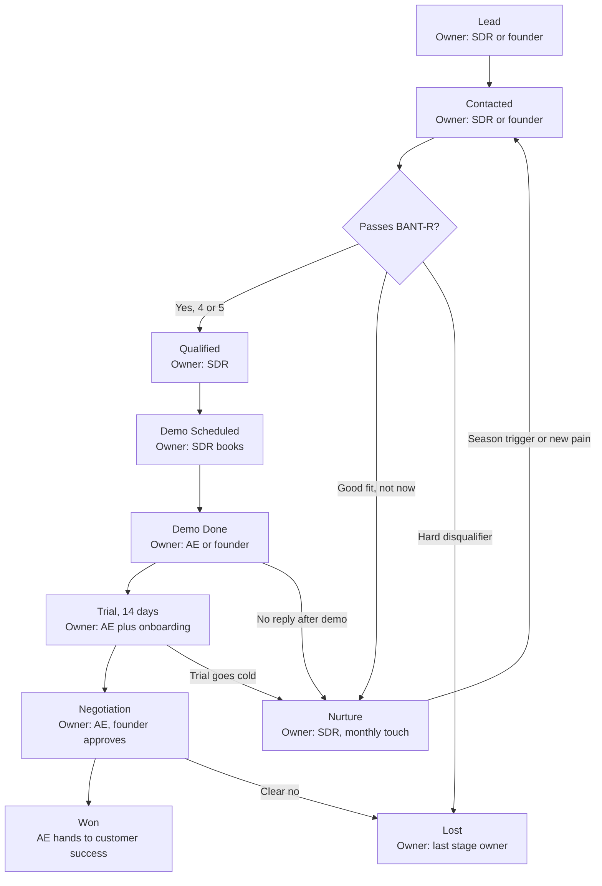
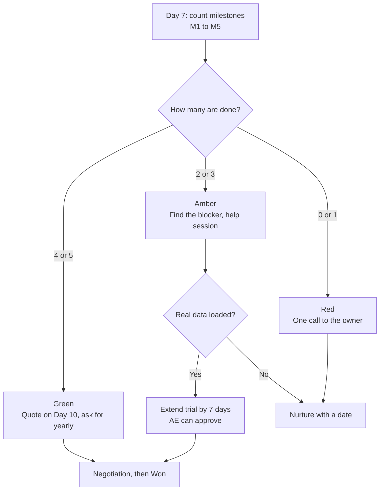

# Sales Process and Playbooks

**In simple words:** This chapter is the operating manual for selling EduFlow. It says what happens to a lead at every step, who owns the step, and what must be written in the CRM (customer relationship management tool — the place where we track every lead). It gives playbooks for cold calls, WhatsApp outreach, demos, trials, referrals, discounts and the sales team. It matters because about 65 of the 120 Year 1 paying customers must come from direct sales, and a solo founder can do that only with a fixed daily routine.

> **Note:** This chapter works at strategy level. It fixes stages, rules, routines, targets and team design. The word-for-word call scripts, WhatsApp texts and demo script live in the Founder Blueprint. When this chapter says "see the Founder Blueprint", the exact words are there.

## Where this chapter sits

Many chapters touch sales. To avoid saying the same thing twice, each topic has one home.

| Topic | Home |
|---|---|
| Which channels and campaigns bring leads | *Go-To-Market Strategy* |
| Who is a good lead: ICP, lead score, Hot, Warm and Cold grades | *Customer Segments and Ideal Customer Profile* |
| Prices, the final trial rule, launch offers | *Pricing Strategy* |
| Partner commissions and unit economics | *Business Model* |
| What happens after a deal is won: onboarding, training, support | *Customer Success, Onboarding and Support* |
| Sales numbers on the company dashboard | *KPI Framework and Dashboard* |
| Hiring dates and salary budgets | *Organization and Hiring Plan* |
| Stages, playbooks, daily targets, team design, discount rules | This chapter |

## Sales motion at a glance

### Six principles

1. **Sell to the owner, win the accountant.** The owner pays. The accountant (Suresh Gupta in our examples) uses the product every day and can quietly kill it. Both must see the demo.
2. **Show, do not tell.** Every demo makes the prospect's own phone buzz. A fee receipt lands on their WhatsApp in 10 seconds. No slide can beat that.
3. **Real data inside 48 hours.** A trial with sample data dies. A trial with the institute's own students and fees sells itself.
4. **One public price.** We do not cut the price. We give services (migration, training, credits) when a deal needs help.
5. **Every lead has a next action and a next date.** A lead without a next date is a lost lead that nobody has admitted yet.
6. **"Not now" is not "no".** Institutes buy in seasons. A lead that says "after exams" goes to Nurture with a date, not to Lost.

### The Year 1 funnel in numbers

A funnel is the path from many leads at the top to a few customers at the bottom. The table shows one normal month for the founder in 2027. Every rate is an **Estimate**. Replace each rate with real data after the first 500 dials.

| Step | Per month | Rate used | Formula |
|---|---|---|---|
| Calling days | 16 | 4 days a week | 4 × 4 weeks |
| Dials | 640 | 40 per calling day | 16 × 40 |
| Conversations with an owner or decision maker | 128 | 20% of dials | 640 × 20% |
| Demos booked from calls | 32 | 25% of conversations | 128 × 25% |
| Demos booked from WhatsApp, inbound and referrals | 12 | Estimate | Counted from the CRM |
| Demos done | 33 | 75% show-up | 44 × 75% |
| Trials started | 20 | 60% of demos done | 33 × 60% |
| Won (new paying customers) | 8 | 40% of trials, which is about 24% of demos done | 20 × 40% |

Check against the target: 8 wins a month × 9 selling months (January to September 2027) = 72 sales-led customers. The plan needs about 65. The buffer is about 10%. The other 55 customers come from self-serve upgrades of the free Starter plan, as planned in *Business Objectives, Scope and Stakeholders*. The demo, trial and win volumes match the sales-led funnel in *Go-To-Market Strategy*. This chapter adds the daily activity that feeds it.

> **Founder note:** The funnel breaks at the top, not at the bottom. If dials fall to 20 a day for two weeks, wins fall by half six weeks later. Protect the calling block like a class timetable.

## Sales stages and CRM design

### The ten stages

A pipeline is the list of all open deals, arranged by stage. EduFlow uses ten stages. Seven are active stages, two are end states (Won, Lost) and one is a waiting room (Nurture).

The "win chance" column is used for the sales forecast. It comes from the funnel rates above. SLA means service level agreement. Here it is simply the maximum time a lead may sit in a stage.

| Stage | Meaning in one line | Owner in Year 1 | Owner with a team | Maximum time in stage | Win chance |
|---|---|---|---|---|---|
| Lead | A name and phone number that fits our list rules | Founder | SDR | 2 working days to first attempt | 2% |
| Contacted | At least one call or WhatsApp attempt made | Founder | SDR | 10 days, 3 unanswered calls | 5% |
| Qualified | Passed the BANT-R questions | Founder | SDR | 3 days to book a demo | 15% |
| Demo Scheduled | Date, time and attendees fixed | Founder | SDR books, AE runs | Demo within 7 days | 20% |
| Demo Done | Owner saw the three wow moments | Founder | AE | 2 days to start a trial | 25% |
| Trial | Account is live with real data | Founder | AE plus onboarding | 14 days | 40% |
| Negotiation | Price, plan and payment terms under talk | Founder | AE; founder approves concessions | 7 days; 30 for Enterprise | 70% |
| Won | First payment received | Founder | AE hands over to customer success | Handover in 1 working day | 100% |
| Lost | Closed with a reason | Founder | Last stage owner | Reason filled the same day | 0% |
| Nurture | Good fit, wrong time | Founder | SDR | Next touch within 30 days | 5% |

SDR means sales development representative, the person who calls and books demos. AE means account executive, the person who runs demos and closes deals. Both roles are explained under inside sales team design below.

### Entry and exit criteria

A stage changes only when a fact changes. "I have a good feeling" is not a fact.

| Stage | Entry criteria (all must be true) | Exit criteria |
|---|---|---|
| Lead | Institute name, city, phone and type are known; no hard disqualifier is visible | First call or WhatsApp attempt is logged |
| Contacted | One attempt is logged with an outcome code | A real conversation took place, or 3 unanswered calls are used up |
| Qualified | BANT-R score is 4 or 5; owner or decision maker is reachable; lead score is filled | Demo date and time are accepted by the owner |
| Demo Scheduled | Calendar invite sent; WhatsApp confirmation received; attendees named | Demo happened with a decision maker for 15 minutes or more |
| Demo Done | Demo notes, objections and proposed plan are in the CRM | Trial account created with the owner's phone number, or a clear "no" |
| Trial | Organization exists on EduFlow; trial end date is set | Owner asks for price or payment link, or Day 14 passes |
| Negotiation | Written quote sent on WhatsApp or email | Payment received, or the owner says no, or 7 silent days pass |
| Won | First payment is in the bank; plan is active | Handover note sent to customer success |
| Lost | One lost reason picked from the fixed list | None. Reopen only as a new deal |
| Nurture | Fit is good; timing, budget or authority is missing; next date is set | Season trigger or new pain moves it back to Contacted |

> **Rule:** A deal is Won only when money is received. A promise, a cheque "coming on Monday" or a verbal yes stays in Negotiation.

### Process flow with owners

**Figure: EduFlow sales process with the owner of each stage**



A lead moves down the middle when things go well. Two side exits exist at every step: Nurture for "not now" and Lost for "never". Nurture leads come back into the flow at Contacted, usually just before the next buying season. In Year 1 the founder owns every box. From February 2027 a part-time tele-caller helps with the first two boxes only.

### CRM fields

Keep the CRM small. Each field below is used in a report or a decision. "Filled from" means the stage where the field becomes mandatory.

| Field | Type | Example | Filled from |
|---|---|---|---|
| Lead ID | Auto number | L-2027-0143 | Lead |
| Institute name | Text | Sharma Classes | Lead |
| Organization type | Pick one: SCHOOL, COACHING, COLLEGE, TRAINING_CENTRE | COACHING | Lead |
| City and state | Text | Patna, Bihar | Lead |
| Lead source | Pick one: Call list, WhatsApp outreach, Starter signup, Demo form, Referral, Partner, Event, Walk-in | Referral | Lead |
| Referred by | Link to a customer or partner | Pilot institute name | Lead |
| Contact name and role | Text plus pick one: Owner, Principal, Accountant, Teacher, Other | Rajesh Sharma, Owner | Lead |
| Phone and WhatsApp number | Phone | 10-digit mobile | Lead |
| Attempts and last outcome | Number plus outcome code | 3, Call later | Contacted |
| WhatsApp opt-in | Yes or No, with date | Yes, 12 Jan 2027 | Contacted |
| Do not contact | Yes or No | No | Contacted |
| Student count | Number | 350 | Qualified |
| Campuses or centres | Number | 1 | Qualified |
| Current system | Pick one: Register, Excel, Tally, Desktop program, Other SaaS | Excel and receipt book | Qualified |
| Main pain | Pick one: Fee dues, Cash mismatch, Parent complaints, Attendance, Branch control, Exam work | Fee dues | Qualified |
| BANT-R score | 0 to 5 | 5 | Qualified |
| Lead score and grade | 0 to 100; Hot, Warm, Cold | 96, Hot | Qualified |
| Go-live target date | Date | 1 Apr 2027 | Qualified |
| Demo date and attendees | Date, time, names | 14 Jan, 12:30, owner and accountant | Demo Scheduled |
| Demo notes | Text: wow reaction, objections, questions | "Asked about batch-wise dues" | Demo Done |
| Proposed plan and billing | Plan plus Monthly or Yearly | Pro, Yearly | Demo Done |
| Trial dates and tenant slug | Dates plus text | 14 to 28 Jan; `sharma-classes` | Trial |
| Trial health | Green, Amber, Red | Green | Trial |
| Quote value before GST | Rupees | ₹59,990 | Negotiation |
| Concession and approver | Text | Free migration; founder | Negotiation |
| Expected close date | Date | 27 Jan 2027 | Negotiation |
| Won date and first invoice number | Date plus text | 27 Jan 2027 | Won |
| Lost reason and competitor | Pick one, plus name | Stays with Excel | Lost |
| Nurture reason and next contact date | Pick one, plus date | After board exams; 20 Mar 2027 | Nurture |

The lead score and the Hot, Warm and Cold grades are defined in *Customer Segments and Ideal Customer Profile*. This chapter does not change them.

### Lost reasons

Lost reasons are a fixed list. Free text hides patterns. Review the mix every month.

| Code | Lost reason | What to do with the pattern |
|---|---|---|
| L1 | Price too high | Check if we said the per-student price; check plan fit |
| L2 | Could not reach the owner | Improve the opener; try a referral route |
| L3 | Chose a competitor (name it) | Feed *Competitor Analysis*; ask what decided it |
| L4 | Stays with register or Excel | Pain was not strong; improve qualification |
| L5 | Missing feature (name it) | Feed the product backlog with a count |
| L6 | Staff resistance | Bring the accountant into the demo earlier |
| L7 | No response after 3 calls, 3 messages and 12 months in Nurture | Check call times and list quality |
| L8 | Hard disqualifier found | Fix list rules so such leads do not enter |
| L9 | Trial never activated | Fix Day 0 to Day 3 of the trial playbook |

### Nurture rules

1. A lead goes to Nurture only with a reason and a next contact date. The date is never more than 30 days away, except for the season dates below.
2. Nurture touches are light: one useful WhatsApp message a month and one call before each buying season.
3. Season call dates (from the buying calendar in *Customer Segments and Ideal Customer Profile*): first week of January for schools, first week of March for coaching admissions, first week of June for coaching chains that add centres.
4. A Nurture lead that signs up on the free Starter plan and activates goes straight back to Qualified.
5. After 12 months in Nurture without any reply, mark Lost with code L7.

### Forecast from the pipeline

Weighted pipeline = sum of (deal value × win chance of its stage). Use the first-year value before GST.

> **Example:** On 1 February 2027 the pipeline holds 6 deals in Trial worth ₹30,000 each, 3 deals in Negotiation worth ₹59,990 each, and 10 deals in Demo Scheduled worth ₹30,000 each. Weighted pipeline = 6 × ₹30,000 × 40% + 3 × ₹59,990 × 70% + 10 × ₹30,000 × 20% = ₹72,000 + ₹1,25,979 + ₹60,000 = about ₹2.6 lakh of first-year value.

## Qualification framework

### BANT-R for institutes

BANT is a classic sales check: Budget, Authority, Need, Timeline. We add one letter, R for Readiness, because many small institutes have no laptop at the counter and no student list in Excel. Without those two things a trial fails, even when the owner loves the product.

The questions below are plain and polite. They fit into a normal phone conversation. Exact wording in Hindi and English is in the Founder Blueprint.

| Letter | What we must learn | Simple question to ask | Pass | Fail |
|---|---|---|---|---|
| B: Budget | Can they pay ₹2,499 to ₹14,999 a month? | "How many students do you have this session, and what is the monthly fee?" | Monthly fee income is 30 times our plan price or more | Wants a lifetime price or a free full session |
| A: Authority | Are we talking to the person who pays? | "If you like it, who else needs to see it before you decide?" | Owner is on the call, or will join the demo | Clerk only; owner will not join |
| N: Need | Is there a pain that costs money or reputation? | "How do you know today who has not paid this month?" | Names fee dues, cash mismatch, parent calls or branch control | "Everything is fine, just exploring" |
| T: Timeline | When do they want to start? | "From which month or session do you want it running?" | Within 90 days, or before the next session | "Maybe next year" |
| R: Readiness | Can they start a real trial this week? | "Is there a laptop at the fee counter? Is the student list in Excel or in a register?" | Laptop with internet; list in Excel or ready to type | Smartphone only and no one to enter data |

### Scoring and routing

- Each letter is 1 point. The BANT-R score is 0 to 5.
- **Qualified** = 4 or 5 points, and both A and N must pass. No authority or no need means no deal, whatever the other answers are.
- 3 points, or A or N missing: keep in Contacted and try to fix the gap once. For example, ask for a 5-minute call with the owner.
- 0 to 2 points: move to Nurture, or to Lost if a hard disqualifier is present.

BANT-R and the lead score do different jobs. The lead score (0 to 100) ranks leads so we know whom to call first. BANT-R is a gate. It decides if a demo slot is worth spending.

> **Tip:** The budget question never asks "what is your budget?". Small owners have no software budget line. Instead, learn the student count and fee. Then say the price per student. For Sharma Classes, ₹5,999 ÷ 350 students = about ₹17 per student per month, against a coaching fee of about ₹5,000 a month.

### Worked examples

| Lead | B | A | N | T | R | Score | Action |
|---|---|---|---|---|---|---|---|
| Sharma Classes, Patna: 350 students, owner on call, fee dues pain, wants April start, laptop and Excel | 1 | 1 | 1 | 1 | 1 | 5 | Qualified; demo in 48 hours |
| Bright Future Public School, Lucknow: 1,200 students, principal on call, chairman decides, parent complaints, 90 days | 1 | 0 | 1 | 1 | 1 | 4, but A fails | Stay in Contacted; ask Dr. Anita Verma to bring the chairman to the demo |
| 450-student school in Gorakhpur: clerk only, "just exploring", "next year" | 1 | 0 | 0 | 0 | 1 | 2 | Nurture; call again in first week of January |
| 40-student home tutor: wants lifetime price, smartphone only | 0 | 1 | 0 | 0 | 0 | 1 | Offer free Starter; no calls |

## Cold calling playbook

Cold calling means phoning an institute that has not asked us to call. In Tier 2 India it still works, because owners pick up their own phones and few software vendors call them.

### Building the call list

| Rule | Detail |
|---|---|
| Size | 500 coaching institutes and 200 schools to start, as set in *Customer Segments and Ideal Customer Profile* |
| Sources | Google Maps, Justdial, institute websites, coaching hoardings, owner WhatsApp groups, referrals |
| Minimum data per lead | Institute name, type, city, phone, rough size ("small", "100 plus", "500 plus") |
| Batch size | Load 200 leads at a time; finish a batch before loading the next |
| City focus | One city cluster per week, so that local proof ("Sharma Classes in Patna uses it") stays relevant |
| Clean-up | Remove wrong numbers the same day; mark "Do not contact" at once when asked |
| Never | Never buy lists of parents or students. We call institutes on their public business numbers only |

### Best times to call

Owners teach. Principals do rounds. Accountants face a fee rush. Call when they are free. All windows below are estimates. Re-check them after 500 dials using the connect rate by hour.

| Who | Best windows | Avoid | Why |
|---|---|---|---|
| Coaching owner (JEE, NEET, competitive exams) | 11:00 to 14:00; demos also after 20:00 | Before 10:00; 16:00 to 20:00; Sunday test mornings | Morning and evening batches fill the rest of the day |
| Tuition centre owner (school-going students) | 10:30 to 13:00 | After 15:00 | Batches start when schools close |
| School principal | 12:30 to 15:00 | 07:30 to 11:00; exam weeks; PTM days | Assembly, rounds and classes in the morning; free around dispersal |
| School owner, chairman or trust manager | 12:30 to 15:00; 17:00 to 18:30 | Early morning | Often runs another business in the day |
| Accountant or front desk | 12:00 to 14:00 | 1st to 10th of the month before noon | Fee rush at the counter |

Day rules: Tuesday to Thursday connect best. Monday morning is poor. Saturday is good for schools, because office staff work and classes are light. Do not call on Sundays and on major festival days.

### Structure of one call

One cold call lasts 3 to 6 minutes. It has one goal: book a 20-minute demo. It does not sell the product.

| Part | Time | What happens | Success sign |
|---|---|---|---|
| Opener | 10 seconds | Name, company, city. Ask for the owner by name if known. | The right person is on the line |
| Permission and reason | 20 seconds | Say why this institute, in one line. Ask for two minutes. | "Yes, tell me" |
| Two pain questions | 60 to 90 seconds | Ask how they track unpaid fees and how parents learn about absence. Listen. | Owner describes a problem in own words |
| One-line value with local proof | 30 seconds | Link their pain to one result. Name a pilot institute in the same city. | Owner asks "how?" or "how much?" |
| The ask | 30 seconds | Offer two demo slots. Say it takes 20 minutes and their phone will get a live receipt. | A slot is accepted |
| Confirm | Right after | Send a WhatsApp confirmation and a calendar invite. Ask them to reply "OK". | Reply received; opt-in recorded |

If the owner asks the price, answer it. Give the plan price and the per-student price in one sentence, then return to the demo ask. Hiding the price kills trust with Indian small-business owners.

If a gatekeeper (a person who screens calls, such as the receptionist) answers, ask for the best time to reach the owner. Log it. Do not pitch to the gatekeeper.

### Attempt cadence

Cadence means the planned rhythm of attempts. One lead gets at most 3 unanswered calls in 10 days, the limit set in *Go-To-Market Strategy*. WhatsApp messages fill the gaps. After that the lead rests in Nurture.

| Attempt | Day | Action |
|---|---|---|
| Call 1 | Day 1 | Call in the best window. If no answer, send the WhatsApp intro message (Day 0 of the WhatsApp sequence). |
| Call 2 | Day 3 | Call in the other window of the day; if busy, ask by WhatsApp for a good time |
| Call 3 | Day 7 | Call at a new hour, based on the connect rate report |
| Close | Day 10 | Send the polite closing message on WhatsApp; move to Nurture with the next season date |

A lead who picks up and says "call me later" is not unanswered. Call back at the time they gave, up to 3 more times. The monthly maths agrees: 640 dials spread over about 370 new leads is 1.7 dials per lead.

### Daily targets

The daily rhythm is fixed: **40 dials, 8 conversations, 2 demos booked**.

| Measure | Daily target | Weekly (4 calling days) | Monthly (16 calling days) | Rate behind it |
|---|---|---|---|---|
| Dials | 40 | 160 | 640 | Fixed activity |
| Conversations | 8 | 32 | 128 | 20% of dials |
| Demos booked | 2 | 8 | 32 | 25% of conversations |
| Time needed | 2 hours | 8 hours | 32 hours | 3 minutes per dial on average |

Time check for the 2-hour block: 32 short dials × 1 minute = 32 minutes. 8 conversations × 6 minutes = 48 minutes. Notes and 8 WhatsApp follow-ups × 3 minutes = 24 minutes. Breaks = 16 minutes. Total = 120 minutes.

A full-time SDR works 22 days a month, not 16. The same daily target gives 880 dials, 176 conversations and 44 demos booked a month.

> **Founder note:** A workable founder day from January to June 2027, Monday to Thursday: product work until 11:00, calling block 11:00 to 13:00, WhatsApp follow-ups 13:30 to 14:30, school demos and trial touchpoints 14:30 to 16:30, CRM update 16:30 to 17:00, coaching-owner demos 20:00 to 21:30. Friday is for content and Saturday for field visits, as in the week plan in *Go-To-Market Strategy*. From February 2027 a part-time tele-caller takes the first call of each lead. The founder then uses the calling block for call-backs and demos.

### Tracking sheet

Two sheets are enough in Year 1. They can live in Google Sheets or in the CRM.

**Sheet 1: daily activity.** One row per caller per day. This sheet feeds the weekly review.

```csv
date,caller,dials,connects,conversations,demos_booked,demos_done,trials,won,list
2027-01-11,Mehdi,40,15,8,2,1,1,0,Patna coaching A
2027-01-12,Mehdi,42,13,7,2,2,1,0,Patna coaching A
2027-01-13,Mehdi,38,16,9,3,1,0,1,Patna coaching A
2027-01-14,Mehdi,40,12,6,1,2,2,0,Muzaffarpur coaching
```

**Sheet 2: call log.** One row per attempt. In a CRM this is the activity timeline of the lead.

| Column | Example |
|---|---|
| Lead ID | L-2027-0143 |
| Institute and city | Sharma Classes, Patna |
| Attempt number | 2 |
| Date and time | 12 Jan 2027, 11:40 |
| Outcome code | C5 |
| Notes in one line | "Owner teaches till 10:30. Dues tracked in a diary." |
| Next action and date | Demo, 14 Jan 2027, 12:30 |

Outcome codes keep reports clean:

| Code | Outcome | Counts as |
|---|---|---|
| C1 | No answer or switched off | Dial |
| C2 | Busy, asked to call later | Dial and connect |
| C3 | Wrong number or closed institute | Dial; remove from list |
| C4 | Gatekeeper; owner not available | Dial and connect |
| C5 | Conversation; demo booked | Conversation and demo booked |
| C6 | Conversation; asked for details on WhatsApp | Conversation |
| C7 | Conversation; not interested | Conversation; ask the reason |
| C8 | Asked not to be called again | Conversation; set "Do not contact" |

> **Warning:** India's telecom rules (TRAI commercial communication rules, with the DND or "do not disturb" registry) restrict unsolicited sales calls and SMS. Our calls go to business numbers that institutes publish for enquiries, in low volume, from a normal mobile number, by a human. Respect every "do not call" request at once. Never use auto-dialers that play recorded messages. The legal position is set out in *Compliance, Legal and Data Protection Requirements* and must be checked with a lawyer before the team grows.

## WhatsApp outreach playbook

WhatsApp is where Indian institute owners live. It is also easy to get blocked there. This playbook keeps the number healthy.

### Set-up

| Item | Decision | Reason |
|---|---|---|
| App | WhatsApp Business app on a dedicated sales SIM | Free; has labels, quick replies, business profile and catalogue |
| Profile | Logo, "EduFlow — school and coaching software", website, working hours, city | An empty profile looks like spam |
| Labels | One label per sales stage, same names as the CRM | The phone and the CRM tell the same story |
| Quick replies | Saved short texts for intro, demo slots, price, trial link | Saves typing; texts come from the Founder Blueprint |
| Separate number for product messages | The product's WhatsApp Cloud API number sends receipts and alerts | A sales block must never stop customer messages |
| New number warm-up | 10 new chats a day in week 1, 15 in week 2, 25 from week 3 (estimate) | New numbers that message many strangers get flagged |

### Message sequence over 10 days

The sequence has six messages for leads who engage, and only three for leads who stay silent. Engage means any reply, or a phone conversation.

| Day | Purpose | Format | Call to action | Sent to |
|---|---|---|---|---|
| Day 0 | Introduce: who I am, why this institute, one question about fee follow-up | 3 lines of text; their name and institute name; no link | "May I send a 60-second video?" | Everyone |
| Day 1 | Show: fee receipt landing on WhatsApp | 60 to 90 second screen recording in Hindi, under 5 MB | "Want to see it on your own phone?" | Engaged only |
| Day 3 | Prove: one result from a pilot institute in the same state | 2 lines plus one image or quote | Two demo slots | Everyone |
| Day 5 | Help: one useful tip, for example three ways to cut fee dues before April | Short text or one-page image; no pitch | "Reply TIPS for the full list" | Engaged only |
| Day 7 | Invite: live demo or the weekly Hindi webinar | Text with two slots and the webinar time | Pick a slot | Engaged only |
| Day 10 | Close the loop: "I will not message again. The free plan link is here whenever you need it." | 2 lines plus signup link | Reply any time | Everyone |

After Day 10 the lead moves to Nurture or to Lost. A silent lead has received three messages in ten days. That is the limit.

### Rules to avoid being blocked

1. **Personal first line.** Every first message has the owner's name or the institute name and the city. Never paste one identical text to 50 people.
2. **Say who you are and why.** Name, company and reason in the first two lines.
3. **No link in the first message.** Links from unknown numbers look like fraud. Send links only after a reply, or in the Day 10 closing message.
4. **One unanswered message at a time.** Never send two messages in a row without a reply inside 48 hours.
5. **Three-message limit for silent leads.** Day 0, Day 3, Day 10. Then stop.
6. **Easy exit.** If someone says "not interested" or "stop", reply with one polite line, set "Do not contact" in the CRM, and never message again.
7. **Daytime only.** Send between 10:00 and 19:00. Never on Sunday.
8. **Daily cap.** At most 25 new first-touch chats per number per day (estimate). Replies to people who wrote first are not capped.
9. **No unofficial tools.** No bulk-sender software, no modified WhatsApp apps, no bought number lists. These get numbers banned.
10. **No group adding.** Never add an owner to a group without asking.
11. **Watch the health signs.** If reply rate falls under 10% across 100 first messages, fix the message, not the volume. If two people in one day say "who gave you my number?", pause for 48 hours and review the list source.
12. **Call before text when possible.** A message that follows a phone conversation is welcome. A message from a stranger is a risk.

> **Best practice:** The safest WhatsApp outreach is not outreach at all. Put a "Chat on WhatsApp" button on the website, on Google Business and on every video. When the owner writes first, there is no block risk, and a 24-hour free reply window opens.

### Broadcast or personal

| Point | Personal 1:1 chat | Broadcast list in the Business app | Template campaign on WhatsApp Cloud API |
|---|---|---|---|
| Who receives it | Anyone you message | Only contacts who saved our number | Anyone who gave opt-in |
| Size limit | Human speed; 25 new chats a day (our rule) | 256 contacts per list | Daily limit set by Meta; grows with quality |
| Opt-in needed | Good manners; respect "stop" | Yes, in practice, since they must save the number | Yes, clear opt-in is required by Meta policy |
| Cost | Free | Free | Per message; marketing templates cost the most |
| Best use | Cold and warm outreach, demo follow-up, trial touchpoints | Monthly tips to Nurture leads and free Starter owners | Webinar invites, season offers, product news to opted-in lists |
| Block risk | Medium if rules are broken | Low | Low to medium; quality rating drops if many people block |
| Our rule | Default for all selling | Small lists of people who know us | Opted-in lists only; at most 2 a month, as set in *Go-To-Market Strategy* |

Meta changes limits and prices often. The numbers above reflect public information as of September 2026. Check the current WhatsApp Business policy before any campaign.

### Outreach metrics

These targets are for personal 1:1 outreach. Broadcast targets (read rate, reply rate, block rate) are in *Go-To-Market Strategy*.

| Metric | Formula | Target (estimate) |
|---|---|---|
| Reply rate | Leads who replied ÷ leads messaged | 25% or more |
| Demo rate from WhatsApp | Demos booked ÷ leads messaged | 5% or more |
| Opt-out rate | "Stop" or "not interested" replies ÷ leads messaged | Under 5% |
| Time to first reply by us | Minutes from their message to our answer, 10:00 to 19:00 | Under 15 minutes |

## Demo strategy

A demo is a live showing of the product to a prospect. Our demo is short, runs on a phone as much as on a laptop, and ends with a trial account, not with "we will think about it".

### Demo principles

1. **Twenty minutes of demo, ten minutes of questions.** Book a 30-minute slot. Owners have batches to run.
2. **Their pain first.** Open by repeating the problem they named on the call, in their own words.
3. **Three wow moments, always.** Fee receipt on WhatsApp in 10 seconds. Absent alert to the parent. Owner dashboard on the phone.
4. **Their phone, not our slides.** The prospect's own phone receives the messages.
5. **Never demo what is not live.** If a module belongs to a later phase, say the date from the roadmap. For example, Phase 2 (Exams, Report Cards, Timetable, SMS) completes on 1 February 2027.
6. **Hindi, English or a mix.** Follow the owner's language from the first sentence.
7. **End with a next step on the calendar.** The best next step is creating the trial account during the call.

### The 20-minute structure

| Minute | Step | What happens | Goal |
|---|---|---|---|
| 0 to 2 | Set the stage | Confirm student count, batches, fee cycle and the main pain | Owner says "yes, that is my problem" |
| 2 to 6 | Wow 1: fee receipt | Collect a fee for Aarav Sharma; receipt reaches the prospect's WhatsApp | Phone buzzes inside 10 seconds |
| 6 to 9 | Wow 2: absent alert | Mark Aarav absent in his batch; parent alert reaches the prospect's phone | Owner imagines fewer parent calls |
| 9 to 12 | Wow 3: owner dashboard | Owner opens the demo institute on own phone: today's collection, dues list, attendance | Owner sees control from anywhere |
| 12 to 16 | Persona block | One block chosen by who is in the room (table below) | The second person in the room is won |
| 16 to 18 | Price and plan | Plan that fits the student count; price per student per month; yearly option | No surprise later |
| 18 to 20 | Start the trial | Create the account on the call; book the Day 3 training slot | Trial stage begins today |
| 20 to 30 | Questions | Answer, note objections, confirm who else must agree | Clear next step and date |

### Persona blocks

The people are described in *Customer Personas*. This table says only what to show each one in the 4-minute persona block.

| Person in the room | Cares most about | Show | Skip | Closing question |
|---|---|---|---|---|
| Coaching owner (Rajesh Sharma) | Dues, cash leakage, discount control | Batch-wise dues list, collection by mode, discount approval | Settings, roles | "Which batch shall we load first?" |
| School chairman or trust manager | Fee recovery, reputation, all campuses in one view | Campus comparison, dues list by class, parent portal | Day-to-day screens | "Shall we start with one campus this month?" |
| Principal (Dr. Anita Verma) | Attendance, discipline, less paperwork | Class-wise attendance, absent list, parent messages | Fee set-up | "Which class can pilot attendance for two weeks?" |
| Accountant (Suresh Gupta) | Speed at the counter, day-end tally, job safety | Collect fee in under a minute, day-end report, receipt reprint, Excel export | Dashboards | "Would this make your day-end faster?" |
| Teacher (Priya Nair) | No extra work | Mark a batch's attendance on the phone in under a minute | Everything else | "Is this easier than the register?" |
| The institute's chartered accountant | GST invoices, clean records | Sample GST invoice for the subscription, fee reports, exports | Attendance | "Is any report missing for your audit?" |

> **Tip:** When the owner and the accountant are both present, give the accountant the mouse for the fee collection step. A person who has collected one fee with own hands stops fearing the software.

### Staging the three wow moments

| Wow moment | Set-up before the demo | What the prospect sees | Backup if it fails |
|---|---|---|---|
| Fee receipt on WhatsApp in 10 seconds | Prospect sends "Hi" to the demo WhatsApp number; their number is set as guardian of demo student Aarav Sharma | Presenter collects ₹12,000; a PDF receipt with the institute's name reaches the prospect's WhatsApp | 30-second screen recording; then retry on the presenter's second phone |
| Absent alert to the parent | Same guardian link; attendance for today is open | Presenter marks Aarav absent; the prospect's phone gets "Aarav was absent today" with date and batch | Show the message log screen with delivery status |
| Owner dashboard on the phone | Demo owner login is ready; link is sent on WhatsApp during the demo | Prospect opens the demo institute on own phone: today's collection, pending dues, attendance by batch | Presenter shares own phone screen on the video call |

Two notes keep this honest:

- At launch in January 2027 the absent alert goes on WhatsApp, because WhatsApp is a Phase 1 module. SMS is a Phase 2 module. From 1 February 2027 the same alert can also go by SMS. Show the channel that is live on the demo day.
- The free Starter plan does not send WhatsApp. Say this during the price step, so that the owner links the wow moments to the Growth and Pro plans.

### Demo environment

The demo environment is a set of fake institutes on the live product, with fresh data every day. It is a product requirement and must be listed in *Business Requirements Catalog*.

| Item | Set-up | Why |
|---|---|---|
| Demo coaching institute | "Sharma Classes (Demo)", type `COACHING`, Patna, 350 students, 8 batches such as Morning Batch M1, course "JEE Main 2028" | Matches the main buyer |
| Demo school | "Bright Future Public School (Demo)", type `SCHOOL`, Lucknow, 1,200 students, 2 campuses, sections such as 10-A | Shows multi-campus and school labels |
| Staff logins | Rajesh Sharma (owner), Dr. Anita Verma (principal), Priya Nair (teacher), Suresh Gupta (accountant), Sunita Devi (parent) | One login per role for persona blocks |
| Fee data | Fee structures with instalments; about 46 students with pending dues of about ₹4.2 lakh; receipts for the last 30 days | The dues list must look real |
| Attendance data | 30 days of attendance at about 92% average | The dashboard must not be empty |
| Fresh dates | A seed script shifts all dates so that "today" always has collections and absences; reset every night at 02:00 | A demo with last month's dates looks dead |
| Guest parent slot | One student (Aarav Sharma) whose guardian phone is changed to the prospect's number before each demo and cleared after | Makes the prospect's phone buzz |
| WhatsApp | Demo number on WhatsApp Cloud API with approved receipt and absent templates; credit wallet topped up | Real messages, not screenshots |
| Payments | Razorpay test mode for the online fee payment step | No real money moves in a demo |
| Backups | Three short recordings of the wow moments; mobile hotspot; second phone | Internet fails at the worst time |

> **Rule:** Never show a real customer's data in a demo, not even for a second. Demo institutes hold only fake students. Clear the prospect's phone number from the guest parent slot after each demo. This follows the data protection rules in *Compliance, Legal and Data Protection Requirements*.

### Checklist before, during and after

| When | Checklist |
|---|---|
| Day before | Send a WhatsApp reminder with the time and the meeting link; ask who will join; ask them to keep a phone with WhatsApp nearby |
| 15 minutes before | Send a test receipt to own phone; check demo dates are fresh; close other tabs; charge the second phone |
| During | Follow the 20-minute structure; note exact words of objections; never argue about a competitor |
| Within 1 hour after | WhatsApp recap: three things they saw, plan and per-student price, trial link, next meeting time; update the CRM |
| No-show | Call after 5 minutes; offer two new slots on WhatsApp; after a second no-show, one more try, then Nurture |

Demo targets (estimates): show-up rate 75%, demo to trial 60%, demo to Won 25%, average demo length under 30 minutes.

For field demos, the same structure runs on a phone and a laptop with a mobile hotspot. For schools with several decision makers, plan two demos: one for the principal and office, one for the chairman.

## Trial-to-paid playbook

### Trial rules used here

- The final rule is in *Pricing Strategy*: a 14-day trial of Pro, no card needed, with 100 free WhatsApp utility messages. So Sharma Classes can load all 350 students on Day 0.
- Extension: 7 days once by one click; up to 14 more days by the founder or a seller. This playbook extends only when real data is loaded.
- When the trial ends without payment, data is never deleted. An institute with 50 or fewer students moves to Starter. A larger one becomes read-only, can export everything, and has 30 days to pay before the account is archived.
- Onboarding steps in detail (import templates, training content, support channels) are in *Customer Success, Onboarding and Support*. This playbook lists only the sales touchpoints.

### Five activation milestones

A trial is healthy when the institute does real work in the product. We watch five milestones.

| Code | Milestone | Target day |
|---|---|---|
| M1 | 50 or more real students imported, or all students if fewer | Day 1 |
| M2 | First real fee receipt issued | Day 2 |
| M3 | Attendance marked on 3 different days | Day 5 |
| M4 | 10 or more parents received a WhatsApp receipt or alert | Day 6 |
| M5 | Owner opened the dashboard on a phone on 3 different days | Day 7 |

The canon defines activation as the first fee receipt or the first attendance within 7 days of signup, with a target of 60%. M2, or the first day of M3, meets that definition.

### Day-by-day touchpoints

| Day | Touchpoint | Channel | Goal |
|---|---|---|---|
| Day 0 | Create the account on the demo call; import one batch from Excel together; issue the first receipt | Video call | M2 done before the call ends |
| Day 1 | Welcome message with a 5-step checklist and the import template; offer to import the full list for them | WhatsApp | M1 done |
| Day 2 | Check the import; fix errors in names, phones and fee amounts | Phone call, 10 minutes | Clean data; accountant's number saved |
| Day 3 | Counter training for the accountant: collect, reprint, day-end report | Video call, 30 minutes | Accountant collects 5 real fees alone |
| Day 4 | Teacher tip: a 60-second video on marking attendance on the phone | WhatsApp | First attendance by a teacher |
| Day 5 | Parent step: send the ready parent invite text for the institute's WhatsApp groups | WhatsApp | M4 on the way |
| Day 6 | Quiet day; check usage in the platform console only | None | Spot Amber or Red early |
| Day 7 | Mid-trial review with the owner, using their own numbers | Phone call, 10 minutes | Health grade set; objections named |
| Day 8 | One-page value summary: receipts issued, rupees collected, dues found, parents reached | WhatsApp image or PDF | Owner forwards it to a partner or family member |
| Day 9 | Staff check: ask the accountant what is slow or confusing; fix it the same day | Phone call | Blocker removed |
| Day 10 | Written quote: plan, per-student price, monthly and yearly totals with GST, payment link | WhatsApp and email | Stage moves to Negotiation |
| Day 11 | Answer questions on the quote; share one reference customer in the same state | WhatsApp | Trust |
| Day 12 | Decision call with the owner; apply the concession ladder if needed | Phone call | Verbal yes and payment date |
| Day 13 | Reminder: "Trial ends tomorrow. Your data stays safe. Here is what changes after the trial." | WhatsApp | No fear, clear choice |
| Day 14 | Payment received and handover; or read-only mode (Starter if 50 students or fewer) with a Nurture date | Phone call | Won, or Nurture with a reason |
| Day 15 to 30 | If not paid: one message on Day 21 and one call before the next fee due date | WhatsApp, call | Second chance at the next pain moment |

### Trial health and what to do

| Grade | Rule on Day 7 | Action |
|---|---|---|
| Green | 4 or 5 milestones done | Keep to the plan; send the quote on Day 10; ask for the yearly plan |
| Amber | 2 or 3 milestones done | Find the blocker on the Day 7 call; offer a 30-minute "do it with you" session; extend the trial by 7 days only if real data is loaded |
| Red | 0 or 1 milestone done | Call the owner once; if there is no time or no staff, move to Nurture with a date; do not chase daily |

**Figure: Trial health check on Day 7**



The check looks at behaviour, not at words. An owner who says "very nice software" but has loaded no students is Red. An owner who complains about a missing report but has issued 200 receipts is Green.

> **Example:** Sharma Classes starts a Pro trial on 14 January 2027. Day 0: Morning Batch M1 (42 students) is imported on the call and Suresh Gupta issues the first receipt. Day 2: all 350 students are in. Day 7: 96 receipts worth ₹3.8 lakh are issued, each one delivered to the parent's WhatsApp from the 100 free trial messages, and the dues list shows ₹4.2 lakh pending from 46 students. Rajesh Sharma has opened the dashboard on five days. Health is Green. Day 10 quote: Pro yearly with the Founding 100 offer from *Pricing Strategy*, ₹47,992 + 18% GST ₹8,639 = ₹56,631. That is ₹47,992 ÷ 12 ÷ 350 = about ₹11 per student per month. Day 12: he asks for a further discount. Only one discount applies, so the price stays. The founder gives free assisted data migration for old fee records instead (list price ₹9,999). Day 13: payment arrives by netbanking. Stage: Won.

## Referral program operations

A referral is a new lead sent by a happy customer. *Business Model* expects about 25% of new paying customers to come from referrals and word of mouth (estimate). *Go-To-Market Strategy* owns the reward rule. This section is about running the program day to day.

### Working rules

| Item | Rule |
|---|---|
| Design | "Give a month, get a month", as fixed in *Go-To-Market Strategy* |
| Reward to a paying referrer | One month free on its own plan, value cap ₹5,999 |
| Reward to the new customer | One extra month free on its first paid plan |
| Reward to a referrer who does not pay us | ₹2,000: account credit for a Starter institute; UPI payment for a teacher, accountant or friend |
| Who can refer | Any paying customer, pilot institute, Starter organization or individual who knows an owner |
| Frequent introducers (chartered accountants, computer vendors) | Move to the partner programme in *Business Model* after a few referrals |
| When the reward is earned | New customer has paid its second month, or 30 days have passed after a yearly payment |
| How the reward is given | Discount line on the next GST invoice, or a moved renewal date for yearly plans |
| Limit | 12 rewards per referrer per year; above that, invite them to the partner programme |
| Tracking | Referral code is the organization slug, for example `SHARMA`; typed at signup or noted in the CRM |
| Validity of a referral (proposal of this chapter) | 90 days from the date it is registered |
| Not allowed | Self-referral (same owner, phone or GSTIN); reward plus partner commission on one deal; a lead already in the CRM in the last 90 days |

### Process

1. **Ask.** The referral is requested at fixed moments (table below), by a person, on WhatsApp or by phone.
2. **Register.** The referrer sends the friend's name, institute and phone on WhatsApp, or makes a three-way introduction. Sales creates the lead with source "Referral" and fills "Referred by".
3. **Thank at once.** The referrer gets a thank-you message the same day, before any outcome.
4. **Call fast.** A referred lead is treated as Hot: call within 2 working hours and open with the referrer's name.
5. **Keep the referrer informed.** One message when the demo is done, one when the friend becomes a customer.
6. **Reward.** When the reward is earned, finance adds the free month to the referrer's next invoice and sales sends a personal thank-you.
7. **Record.** Referral status in the CRM moves through: Registered, Qualified, Won, Reward due, Reward given, or Rejected with a reason.

### When to ask

| Moment | Why it works | Who asks |
|---|---|---|
| Day 30 after go-live, if activation milestones are done | First value is fresh | Customer success |
| Right after an NPS answer of 9 or 10 | They just said they would recommend us | Automated message, then a human follow-up |
| After the first fee season with lower dues | Proof in rupees | Founder or AE |
| At the 90-day review | Set in *Customer Personas* as the refer moment | Customer success |
| After a support problem was solved fast | Gratitude is high | Support person |

Never ask during an open complaint, in a trial, or in the first week after payment.

### Targets and cost (estimates)

| Measure | Target | Working |
|---|---|---|
| Customers asked on Day 30 | 100% | Task created by the CRM at handover |
| Referral leads | About 8 a month; 70 in Year 1 | Plan figure from *Go-To-Market Strategy* |
| Referral lead to Won | 17% in the Year 1 plan; aim for 25% | 12 wins ÷ 70 leads; a warm lead should beat a cold one |
| Referrer's free month, average | ₹3,899 | 60% Growth × ₹2,499 + 40% Pro × ₹5,999 |
| New customer's free month, average | ₹3,199 | 80% Growth × ₹2,499 + 20% Pro × ₹5,999 |
| Revenue given up per referral win | About ₹7,000 | ₹3,899 + ₹3,199 = ₹7,098; no cash leaves the bank |
| Compare | CAC limit ₹12,000 | A referral win costs under 60% of the limit |

CAC means customer acquisition cost, the total sales and marketing money spent to win one customer. NPS means net promoter score, a 0 to 10 answer to "how likely are you to recommend us?".

> **Best practice:** The best referral tool is a customer's own number. Ask: "How much did your pending dues fall this term?" Then ask permission to share that one line, with the institute's name, with two owners they know. Owners trust another owner's rupee figure more than any brochure.

## Inside sales team design

Inside sales means selling by phone, WhatsApp and video call, without travel. *Go-To-Market Strategy* fixes when each sales role is added and the trigger for it. *Organization and Hiring Plan* governs headcount and salary budgets. This section fixes what each role does, the ratios, the targets and the incentive plan. All pay figures are estimates for hires in Tier 2 cities.

### Roles

| Role | Expected from | Main job | Stages owned |
|---|---|---|---|
| Founder | Now | Every demo until 30 wins; later Enterprise deals, school groups and approvals | All stages in Year 1 |
| Part-time tele-caller | February 2027 | First call to each lead; books demos for the founder | Lead, Contacted |
| Inside sales executive (full cycle) | July 2027, when the trigger is met | Calls, demos, trials and closing for Growth and small Pro deals | Lead to Won |
| SDR | Year 2, at 3 or more inside sellers | 40 dials a day; qualifies; books demos | Lead to Demo Scheduled; Nurture |
| AE | Year 2, at 3 or more inside sellers | Demos, trials, quotes and closing | Demo Done to Won |
| Sales lead | Year 2, at 6 sellers | Coaching, weekly review, hiring, special discounts up to 10% | Forecast and CRM hygiene |

Full cycle means one person does every stage. We start that way because it is simple and the seller learns the whole job. We split the work into SDR and AE only when there are three or more inside sellers. Before that, there are not enough demos to keep an AE busy.

### Ratios

| Ratio | Value | Working |
|---|---|---|
| SDR to AE | 2 to 1 | One SDR gives about 33 demos done a month; one AE can run 60 to 80 |
| Sellers per sales lead | 6 to 8 | Above 8, one-to-one coaching stops |
| New wins per onboarding executive | About 25 a month | Staffing is owned by *Customer Success, Onboarding and Support* |
| Founder's share of demos | 100% until 30 wins; then Enterprise and school groups only | The pitch must be proven before it is taught |
| Inside to field sellers | 3 to 2 by September 2028 | Team shape from *Go-To-Market Strategy* |

### Targets and ramp

A quota is the result a seller must reach each month. Quotas below apply after a 2-month ramp (the learning period of a new hire).

| Role | Monthly quota | Floor that starts a review |
|---|---|---|
| Part-time tele-caller (2 hours a day) | 30 dials a day; 10 demos held a month | Under 6 demos held for 2 months |
| Inside sales executive (full cycle) | 15 to 20 demos a week; 10 wins | Under 5 wins in month three |
| SDR | 880 dials; 176 conversations; 44 demos booked; 33 demos done | Under 25 demos done for 2 months |
| AE | About 66 demos; 16 wins (24%) | Under 10 wins for 2 months |
| Sales lead | Team quota; forecast within 20% of actual | Two missed quarters |

Ramp for a new inside seller:

1. **Month one.** Learn the product by setting up a fake institute alone. Watch 15 founder demos. Run 10 demos with the founder listening. Target: 2 wins.
2. **Month two.** Own a call list and a demo calendar. Target: 5 wins.
3. **Month three.** Target: 8 wins. Under 5 wins, fix the training or end the role in month four, as set in *Go-To-Market Strategy*.
4. **Month four onwards.** Full quota of 10 wins.

### Incentive plan

An incentive is extra pay for results. Ours follows four ideas. Pay on money received, not on promises. Pay late enough that bad-fit deals do not pay. Keep it simple enough for one sheet. Never cap it.

| Role | Fixed pay per month | Variable pay | On-target total per month |
|---|---|---|---|
| Part-time tele-caller | ₹5,000 retainer | ₹150 per demo held | ₹5,000 + 10 × ₹150 = ₹6,500 |
| Inside sales executive | ₹22,000 | ₹1,000 per paid win; ₹1,500 for each win above 10 | ₹22,000 + 10 × ₹1,000 = ₹32,000 |
| SDR | ₹16,000 | ₹150 per demo done; ₹250 per win from own demos | ₹16,000 + 33 × ₹150 + 8 × ₹250 = ₹22,950 |
| AE | ₹28,000 | ₹1,000 per paid win; ₹1,500 for each win above 16 | ₹28,000 + 16 × ₹1,000 = ₹44,000 |
| Field sales executive | ₹25,000, plus ₹8,000 travel budget | ₹2,000 per paid win | ₹25,000 + 6 × ₹2,000 = ₹37,000, plus travel |
| Sales lead | ₹60,000 | ₹10,000 at 100% of team quota; ₹5,000 at 80% | ₹70,000 |

Incentive rules:

1. A win counts when money is received. The incentive is paid after the customer's second monthly payment, or 30 days after a yearly payment.
2. A refund inside 30 days reverses the incentive. This is the same clawback (taking back pay for a deal that failed) that partners have in *Business Model*.
3. A special discount halves the incentive for that win. The standard offers in *Pricing Strategy* do not. This stops a seller from buying deals with company money.
4. A self-serve upgrade with no seller touch pays nothing. It counts for a seller only if a call or demo is logged in the 30 days before payment.
5. On a shared deal the SDR and the AE are both paid in full. There is nothing to fight over.
6. A quarterly quality bonus of ₹5,000 is paid when 90% of the seller's wins are still paying after 90 days and CRM hygiene is 100%.
7. The incentive sheet is shared every Monday and paid with salary.

Cost check. The full-cycle seller costs ₹32,000 ÷ 10 wins = ₹3,200 per win, the figure used in *Go-To-Market Strategy*. That is about 9% of a ₹36,000 first-year deal. One pod of 2 SDRs and 1 AE costs 2 × ₹22,950 + ₹44,000 = ₹89,900 for 16 wins, or about ₹5,600 per win.

> **Note:** The pod looks costlier than the full-cycle seller. The ₹3,200 figure assumes warm demos from inbound leads, referrals and the tele-caller. When cold calling is the main source, ₹5,000 to ₹6,000 per win is the honest number. It is still under half of the ₹12,000 CAC limit.

## Field sales design

Field sales means visiting the institute in person. In Year 1 the founder is the only field seller, with about 6 field days a month. *Go-To-Market Strategy* sets the trigger for the first field hire: a city with 25 paying customers, 300 untouched ICP leads and a referral share above 20%. The expected time is October 2027 to March 2028. The founder opens cities. Field sellers deepen them.

### Territories

A territory is one launch city plus its satellite towns, taken from the city rollout in *Go-To-Market Strategy*.

| Territory | Base city | Satellite towns (day trips) | Seller plan |
|---|---|---|---|
| T1 Bihar | Patna | Muzaffarpur, Gaya | First field hire (expected) |
| T2 Uttar Pradesh | Lucknow | Kanpur, Prayagraj | Second field hire |
| T3 Delhi NCR | Delhi | Noida, Ghaziabad | Founder and inside sales until the trigger is met |
| T4 Madhya Pradesh | Indore | Bhopal | Inside sales plus one reseller |
| T5 Rajasthan | Jaipur | Sikar, Kota | Inside sales plus one reseller |
| Open territory | Rest of India | None | Inside sales and self-serve only |

Territory rules:

1. Inside a territory the field seller owns leads with 300 or more students, schools run by a chairman or trust, and Enterprise leads together with the founder. Inside sales owns the rest. Growth deals get no visit.
2. Each lead has one owner in the CRM. The first seller to log a real conversation owns it. Thirty days without activity releases the lead.
3. If an inside deal needs one visit to close, the field seller makes the visit and the incentive is split 50:50.
4. A lead registered by a partner is protected for 90 days, as in *Business Model*. The field seller may help the partner but earns no incentive on that deal.
5. Territories are reviewed every six months. Split a territory when it holds more than 600 untouched ICP leads or more than 150 paying customers.

### Visit targets

The field week has four field days and one desk day. The desk day is Monday, for the weekly review, CRM clean-up and booking the week's meetings. Two booked meetings anchor each field day. Walk-ins to nearby institutes fill the gaps between them.

| Measure | Per field day | Per week | Per month |
|---|---|---|---|
| Booked meetings (demo or follow-up) | 2 to 3 | 10 | 40 |
| Walk-ins to new institutes in the same cluster | 5 to 6 | 22 | 88 |
| Total visits | 8 | 32 | 128 |
| Demos done, booked or on the spot | 2 | 8 to 10 | About 36 |
| Visits to customers (training, referral ask) | — | 2 | 8 |
| Wins | — | — | 6 |

The win rate from a field demo is about 17% (6 ÷ 36), lower than the inside rate of 24%. Field sellers work mostly on schools and large institutes. These have several decision makers and take one to three months to close.

Visit discipline:

- Coaching visits run from 11:00 to 15:00 and school visits from 12:30 to 15:00, when owners and principals are free.
- Every visit is logged from the phone on the same day, with a photo of the signboard as proof of the visit.
- The kit is a phone with the demo account, a printed sample receipt for Aarav Sharma, and the one-page Hindi and English flyer with the WhatsApp QR code.
- A walk-in has one goal: the owner's name, the WhatsApp number with opt-in, and a demo slot. It is not a full pitch at the reception desk.

### Travel budget

| Item | Rule or amount (estimate) |
|---|---|
| Monthly budget per field seller | ₹8,000, as used in *Go-To-Market Strategy* |
| Split | Local travel 16 field days × ₹300 = ₹4,800; 2 satellite day trips × ₹1,200 = ₹2,400; prints and samples ₹800 |
| Own two-wheeler | ₹4 per km, counted from the logged visits |
| Satellite town | Day trip by train or bus; leave and return the same day |
| Overnight trip | Founder approval; needs 2 booked demos with Pro-size institutes; 3AC train, hotel up to ₹1,300 a night; about ₹7,000 a trip |
| Founder's Year 1 travel | ₹1,22,000 = 16 city trips × ₹7,000 + ₹10,000 local, from *Go-To-Market Strategy* |
| Claims | Bills uploaded within 7 days; paid with salary; no bill, no claim above ₹200 |
| Alert | Travel cost per field win above ₹2,500 for 2 months; the normal figure is ₹8,000 ÷ 6 = ₹1,333 |

> **Rule:** Never travel for a single Growth deal. One Growth win brings ₹2,499 a month, and a ₹7,000 trip eats almost three months of it.

## Negotiation and discount rules

*Pricing Strategy* owns the discount policy. It lists the allowed discounts, the rule that only one discount applies at a time, and who can approve what. This section does not change any of that. It fixes how a seller behaves when the owner starts to bargain, which in India is almost always.

### What a seller may offer

The full list is in *Pricing Strategy*. In short: yearly billing gives 2 months free and is part of the list price. Any seller may apply the Founding 100 offer (20% off the first year of yearly Growth or Pro, until customer 100 or 30 April 2027) or the NGO and low-fee school discount (20%, with proof). A special discount up to 10% needs the sales lead, up to 20% the head of sales or founder, and above 20% the founder in writing. Enterprise multi-year terms are 10% for 24 months and 15% for 36 months, never below ₹14,999 a month.

### The concession ladder

A concession is something we give to close a deal. The seller goes down the ladder one step at a time. An angry tone from the owner is not a reason to skip a step.

| Step | Move | Approver | What we ask in return |
|---|---|---|---|
| 1 | Restate the value: dues found in the trial and the price per student | Seller | Nothing |
| 2 | Offer yearly billing instead of monthly | Seller | Payment for 12 months now |
| 3 | Apply the one standard discount the institute qualifies for | Seller | Testimonial, logo permission and two referral introductions |
| 4 | Add one value item: ₹499 WhatsApp credit pack, extra training session, import help on a call, or a trial extension | Seller; one item per deal | Payment within 48 hours |
| 5 | Split a yearly payment: 50% now and 50% in 60 days | Sales lead or founder | Written commitment on WhatsApp or email |
| 6 | Free assisted data migration (₹9,999) or one on-site training day (₹4,999), for Pro yearly and Enterprise only | Founder | Yearly payment and a case study |
| 7 | Special discount, within the approval limits above | Sales lead, head of sales or founder | Reason and end date in the CRM |
| 8 | Step back politely: monthly plan, free Starter, or Nurture with a date | Seller | Nothing |

### Negotiation rules

1. **Never give without getting.** Every concession is traded for something: yearly payment, payment this week, a testimonial or referrals.
2. **Some things are never discounted.** Monthly plans, add-ons, message credits and gateway charges stay at list price.
3. **Every quote ends.** A written quote is valid for 7 days. An offer without an end date becomes the new list price.
4. **No secret prices.** Assume every quote will be forwarded to an owners' WhatsApp group in the same city.
5. **No price matching.** Compare price per student and what is included. Never speak badly of a competitor.
6. **GST is never "adjusted".** Every payment gets a GST invoice. No cash deals. Money comes by Razorpay link, UPI or bank transfer to the company account only.
7. **No promises outside the roadmap.** A seller never gives a date for a feature that the roadmap does not have. Custom development is never part of a Growth or Pro deal.
8. **Log it.** Every concession goes into the CRM field "Concession and approver". A special discount halves the seller's incentive.
9. **Enterprise is founder-led.** The floor is ₹14,999 a month. A paid pilot on one campus is fine. A free pilot for a large group is not.

### Common asks and the answer in principle

| The owner says | Answer in principle |
|---|---|
| "Give me your best price." | The website price is the best price. Show the yearly price and the price per student. |
| "Another software is cheaper, or free." | Ask what it includes: WhatsApp receipts, dues list, Hindi support. Compare per student per month. |
| "I will pay after admissions." | Start on the monthly plan now and switch to yearly later, or use step 5. |
| "Give me a lifetime price." | There are no lifetime plans. Founding 100 customers get a 24-month price lock. |
| "Make the bill without GST." | No. A GST-registered coaching institute may be able to claim input credit; most schools cannot (assumption; their CA confirms). |
| "Add one custom report, then I will buy." | Log a feature request with a count. Show the Excel export today. Promise no date outside the roadmap. |

> **Example:** In February 2027 the owner of a 280-student coaching institute in Muzaffarpur offers "₹1,500 a month, final". Step 1: his trial found ₹2.9 lakh of pending dues from 31 students, and Growth costs ₹2,499 ÷ 280 = about ₹9 per student per month. Steps 2 and 3: yearly Growth with the Founding 100 offer is ₹19,992, which is ₹1,666 a month or about ₹6 per student. With 18% GST of ₹3,599 the bill is ₹23,591. Step 4: a ₹499 credit pack if he pays within 48 hours. He pays by UPI the next morning. The CRM records a 20% standard discount, and the seller's incentive is paid in full.

## Sales tools stack

The stack follows four rules: free or low-cost, works on a phone, billed in rupees, and easy to replace. *Go-To-Market Strategy* budgets ₹13,500 for CRM and call-log tools in Year 1, plus ₹9,000 for two SIMs. Every price below is an estimate. Check the vendor's price page before buying.

| Need | Year 1 choice | Cost (estimate) | Upgrade when |
|---|---|---|---|
| Lead list, first 300 leads | Google Sheets with the CRM fields of this chapter | Free | 300 leads, or a second caller joins |
| CRM from January 2027 | Zoho Bigin (small pipeline CRM, rupee billing, mobile app); fallback HubSpot free CRM | About ₹500 per user a month; 2 users | 5 or more sellers: Zoho CRM or a paid HubSpot plan |
| Dialer | Android phone on a dedicated sales SIM, plus a call-log sync app such as Callyzer | SIM ₹500 a month; app about ₹500 a month | 3 or more callers: cloud telephony such as Exotel, MyOperator or Knowlarity |
| WhatsApp | WhatsApp Business app on the sales SIM; labels match the stages | Free | Opted-in list above 250 people: Cloud API templates, at most 2 a month |
| Calendar and demo booking | Google Calendar booking page with two fixed demo blocks a day | Free | Several AEs: round-robin booking tool |
| Video demo | Google Meet, with the phone screen shared for the dashboard wow moment | Free | Not needed |
| Demo videos and images | Phone screen recorder or OBS Studio; Canva free plan | Free | A freelance editor, as budgeted in *Go-To-Market Strategy* |
| Quote and payment | One-page quote from a Google Docs template; Razorpay payment link; GST invoice from EduFlow billing | Gateway charge only | Enterprise contracts: an e-sign tool, paid per document |
| Trial health | EduFlow platform console plus PostHog events for milestones M1 to M5 | Already in the product stack | Not needed |
| Review numbers | Google Sheets fed by the weekly CRM export | Free | Year 2: CRM dashboards |

Year 1 cost check: CRM 2 users × ₹500 × 9 months = ₹9,000. Call-log app ₹500 × 9 months = ₹4,500. Total ₹13,500, which equals the budget line.

A dialer here means a tool that places and counts calls. In Year 1 it is a normal phone. The call-log app only copies the call history into a report, so the 40-dial count needs no typing. Cloud telephony (a virtual business number with click-to-call and recording) costs about ₹1,000 to ₹2,000 per user a month. It comes only when three or more people call.

Tool rules:

1. **One source of truth.** The CRM is the record. A WhatsApp chat is not. Key facts move to the CRM the same day.
2. **The company owns the numbers.** SIMs, WhatsApp accounts, the CRM and the Google account are in the company's name. When a seller leaves, the number and its chats stay.
3. **Record calls only with notice.** If calls are recorded, the caller says so at the start.
4. **No customer data in sales tools.** Sales tools hold institute and owner contacts only. Student and parent data never leaves EduFlow. This follows the DPDP points in *Compliance, Legal and Data Protection Requirements*.
5. **Two-step login** on the CRM, Google and Razorpay accounts.

The playbooks also need a few product features: demo institutes with a nightly reset, the guest parent slot, trial milestones in the platform console, trial extension by `SUPER_ADMIN`, and a referral code field at signup. These belong in *Business Requirements Catalog*.

## Sales metrics and weekly review

*KPI Framework and Dashboard* owns the company numbers such as MRR, CAC and LTV. This section lists the working numbers of the sales desk and the ritual that keeps them honest.

### Metrics

All targets are Year 1 estimates. The alert level is the number that should make the founder act in the same week.

| Group | Metric | Formula | Target | Alert level |
|---|---|---|---|---|
| Activity | Dials per calling day | Count from the call log | 40 | Under 30 for 3 days |
| Activity | Conversation rate | Conversations ÷ dials | 20% | Under 12%: fix the list or the call hours |
| Activity | Demo booking rate | Demos booked ÷ conversations | 25% | Under 15%: fix the opener and the ask |
| Conversion | Show-up rate | Demos done ÷ demos booked | 75% | Under 60%: fix the reminders |
| Conversion | Demo to trial | Trials started ÷ demos done | 60% | Under 45% |
| Conversion | Trial activation | Trials with M2 or M3 by Day 7 ÷ trials | 60% | Under 45% |
| Conversion | Trial to paid | Won ÷ trials ended | 40% | Under 30% |
| Volume | Demos done per week | Count | 8 | Under 5 for 3 weeks: stop building and sell |
| Volume | Sales-led wins per month | Count | 8 | Under 5 |
| Speed | Inbound response time | Minutes to first reply, 10:00 to 19:00 | Under 15 | Over 60 |
| Speed | Sales cycle | Median days, first conversation to payment | Coaching 21; schools 60 | Coaching over 35 |
| Value | Average first-year deal value | First-year value before GST ÷ wins | ₹36,000 | Under ₹28,000 |
| Value | Yearly plan share | Yearly wins ÷ all wins | 40% | Under 25% |
| Value | Average discount | 1 − (billed value ÷ list value) | Under 8% after the Founding 100 offer ends | Above 10% |
| Health | Pipeline coverage | Weighted pipeline ÷ next month's new-value target | 1.2 or more | Under 0.8 |
| Health | CRM hygiene | Open deals with a next date ÷ open deals | 100% | Under 95% |
| Cost | People cost per win | Sales pay and tools ÷ wins | Inside ₹3,200 to ₹5,600; field ₹7,500 | Above ₹9,000 |

> **Example:** Next month's target is 8 wins × ₹36,000 = ₹2.88 lakh of new first-year value. The weighted pipeline from the forecast example is ₹2.6 lakh. Coverage = 2.6 ÷ 2.88 = 0.9. That is below 1.2, so this week needs more demos, not more follow-up.

### Weekly review

| Item | Decision |
|---|---|
| When | Monday, 30 minutes, before the calling block |
| Who | Year 1: the founder, with the tele-caller for the first 10 minutes. Year 2: sales lead and all sellers |
| Input | The one-page template below, filled from the CRM and the activity sheet |
| Output | Three actions with an owner and a date; one experiment for the week |

Agenda: 5 minutes on numbers against target. 10 minutes on stuck deals and on Amber or Red trials, with one next action for each. 5 minutes on lost reasons and new objections. 5 minutes on one experiment, such as a new opener or a new call hour. 5 minutes on commitments.

**Template: weekly sales review (one page, sample week filled in)**

```text
+--------------------------------------------------------------------------+
| EDUFLOW WEEKLY SALES REVIEW   Week: 08-14 Feb 2027   Owner: Mehdi Alam   |
+--------------------------------------------------------------------------+
| 1. ACTIVITY                        Target     Actual    Status           |
|    Dials (4 calling days)             160        152    Amber            |
|    Conversations                       32         34    Green            |
|    Demos booked                        11          9    Amber            |
|    WhatsApp first chats               100         96    Green            |
|    Field visits                         8          8    Green            |
| 2. RESULTS                                                               |
|    Demos done                           8          7    Amber            |
|    Trials started                       5          5    Green            |
|    Won (money received)                 2          3    Green            |
|    New first-year value (Rs)       72,000     87,976    Green            |
| 3. RATES, LAST 4 WEEKS             Target     Actual                     |
|    Dial to conversation               20%        22%                     |
|    Show-up at demos                   75%        78%                     |
|    Demo to trial                      60%        71%                     |
|    Trial to paid                      40%        38%                     |
| 4. PIPELINE                                                              |
|    Open deals: 31      Weighted value: Rs 2.6 lakh      Coverage: 0.9    |
|    Trials: Green 4, Amber 2, Red 1    Over time limit: 3   No date: 0    |
| 5. LOST AND NURTURE                                                      |
|    Lost 4 (L1 x1, L4 x2, L8 x1)       To Nurture 6, all with a date      |
| 6. LEARNINGS     One thing that worked. One thing that failed.           |
| 7. NEXT WEEK     Three actions, each with an owner and a date.           |
+--------------------------------------------------------------------------+
```

- Status is Green at 100% of target or more, Amber from 80% to 99%, and Red under 80%.
- The sample week won 3 deals: two yearly Growth and one yearly Pro on the Founding 100 offer. 2 × ₹19,992 + ₹47,992 = ₹87,976.
- Rates use the last 4 weeks, because one week is too small a sample.
- "Over time limit" counts deals that have sat in a stage longer than the maximum time in the stage table.

The monthly review takes 60 minutes in the first week of each month. It adds four things. First, the lost-reason mix. Second, the rates by lead source and by city. Third, the incentive sheet. Fourth, the swap of every estimate in this chapter for the real rate, once 100 or more data points exist. The monthly numbers feed *KPI Framework and Dashboard*.

> **Founder note:** Look at the activity lines first. Results this week come from calls made three to six weeks ago. If dials and demos booked are Green, a Red result week is just noise. If they are Red, a Green result week is luck that will run out.

## Key takeaways

- The pipeline has ten stages with fact-based entry and exit criteria. A deal is Won only when money is received, and every open lead has a next action and a next date.
- A lead earns a demo slot only with a BANT-R score of 4 or 5, and Authority and Need must both pass.
- The daily engine is 40 dials, 8 conversations and 2 demos booked. With WhatsApp, inbound and referral demos, it gives about 33 demos, 20 trials and 8 sales-led wins a month (estimates).
- Every demo lasts 20 minutes and makes the prospect's own phone buzz three times: fee receipt on WhatsApp, absent alert, owner dashboard.
- The 14-day trial is won in the first 48 hours with real data. Day 7 health decides how much more selling time the deal gets.
- We trade concessions and do not cut the price. The ladder starts with value and yearly billing, allows one standard discount, and needs the founder for anything special.
- Roles, incentives, territories and tools grow only when their triggers are met. The Monday review watches activity first, because activity predicts the wins of next month.
