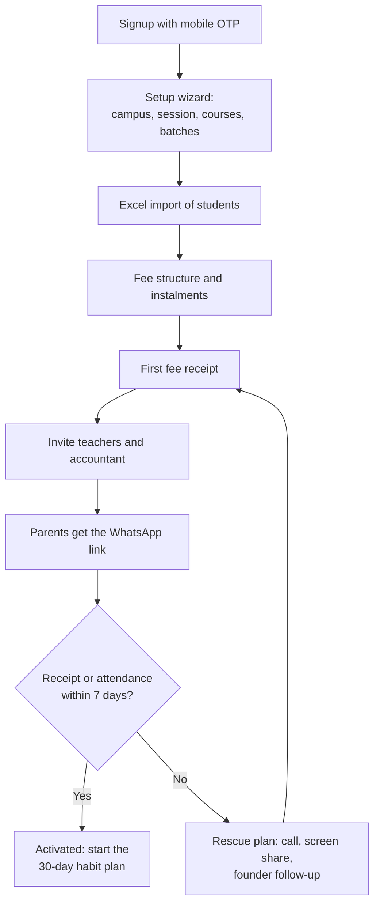
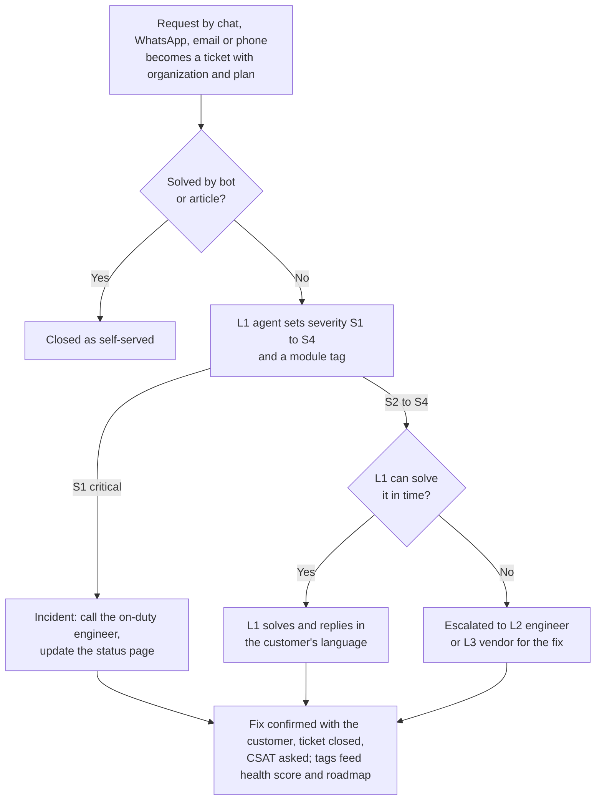
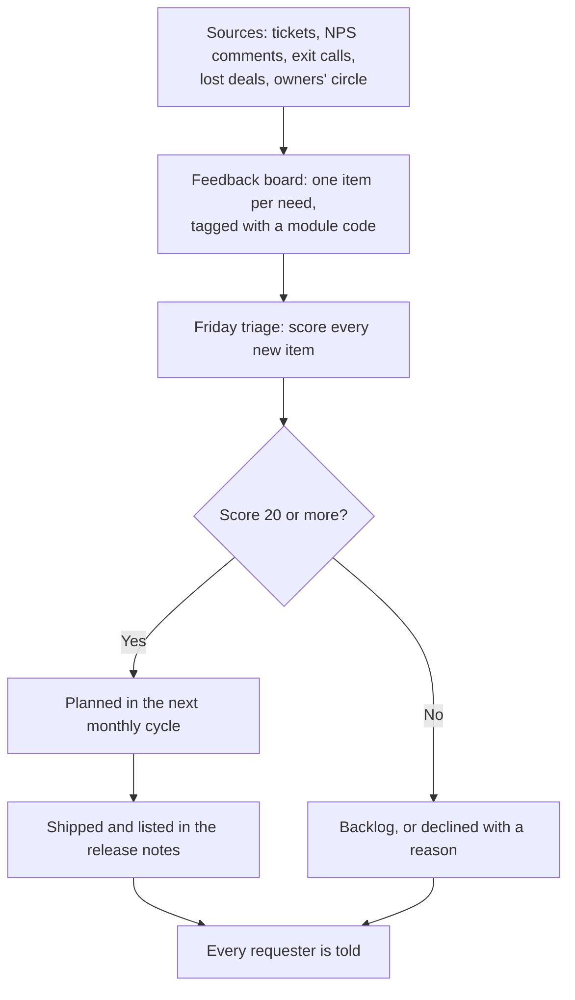

# Customer Success, Onboarding and Support

**In simple words:** This chapter explains how EduFlow keeps a customer after the sale. It shows how a new institute goes live in one day, how we train its staff, how we answer problems, and how we spot an unhappy customer early. It matters because a subscription business earns its money from customers who stay and renew, not from the first payment.

## Customer success on one page

Customer success is the work of making sure each customer gets the result it paid for. For EduFlow the result is simple: fees come in faster, attendance takes two minutes, and parents stop calling the office. If the institute gets that result, it renews. If it does not, it leaves, however good the sales pitch was.

| Topic | Decision |
|---|---|
| Main goals | Monthly logo churn under 3% and NPS 50 or more (canon targets) |
| Onboarding promise | First real fee receipt or attendance within one day of signup |
| Activation | First fee receipt or first attendance within 7 days of signup; target 60% |
| Onboarding model | Self-serve for Starter, assisted for Growth and Pro, managed for Enterprise |
| Onboarding call | Within 48 hours of payment, for every new paying customer |
| Support hours | Monday to Saturday, 10 am to 7 pm IST; critical alerts watched all day, every day |
| Channels | Help centre, in-app chat, email, WhatsApp (Growth and above), phone (Pro and above) |
| Health score | 0 to 100 from nine inputs; Green 75 or more, Amber 50 to 74, Red under 50 |
| Renewal work | Starts 60 days before the renewal date, then 30 days and 7 days |
| Feedback | NPS survey 30 days after activation, then twice a year; weekly roadmap triage |
| Support cost | About ₹250 per paying account a month at 100 customers, under ₹200 at 10,000; 5% of MRR falling to 2% (estimate) |

Three terms appear often. Logo churn is the share of paying organizations that leave in a month. NPS (net promoter score) is a 0 to 10 survey that shows how likely customers are to recommend us. MRR (monthly recurring revenue) is the subscription money that comes in every month.

## Why retention matters

EduFlow sells a subscription. The customer pays a small amount each month or year, not a large amount once. The first payment does not cover the cost of winning the customer.

CAC (customer acquisition cost — the sales and marketing money spent to win one paying customer) has a canon ceiling of ₹12,000. A Growth customer pays ₹2,499 a month. At 80% gross margin that is about ₹2,000 of gross profit a month. So payback = ₹12,000 ÷ ₹2,000 = 6 months. A customer who leaves in month four has cost us money. A customer who stays four years pays back eight times.

### The leaky bucket

Think of the customer base as a bucket. Sales pours water in at the top. Churn is a hole at the bottom. A small hole looks harmless in one month and is very large over a year.

Formula: customers left after 12 months = 100 × (1 − monthly churn) to the power 12. LTV (lifetime value — gross profit from one customer over its whole life) = ARPA × gross margin ÷ monthly churn. ARPA means average revenue per account. The table uses the canon Year 1 values: ARPA ₹5,000 and gross margin 80%.

| Monthly logo churn | Left after 12 months (of 100) | Lost in a year | Average life (1 ÷ churn) | LTV per customer |
|---|---|---|---|---|
| 1% | 89 | 11 | 100 months | ₹4,00,000 |
| 2% | 78 | 22 | 50 months | ₹2,00,000 |
| 3% (canon ceiling) | 69 | 31 | 33 months | ₹1,33,000 |
| 5% | 54 | 46 | 20 months | ₹80,000 |
| 7% | 42 | 58 | 14 months | ₹57,000 |

Moving from 5% to 3% churn adds ₹53,000 of lifetime value to every customer. No marketing campaign gives that much. *Business Model* reaches the same result from the other side: doubling churn cuts LTV by half.

### Churn sets a ceiling on growth

At some size, the customers lost each month equal the customers won. Growth stops there. Formula: ceiling = new paying customers per month ÷ monthly churn.

| New paying customers a month | Ceiling at 5% churn | Ceiling at 3% | Ceiling at 2% | Ceiling at 1% |
|---|---|---|---|---|
| 20 | 400 | 667 | 1,000 | 2,000 |
| 40 | 800 | 1,333 | 2,000 | 4,000 |
| 100 | 2,000 | 3,333 | 5,000 | 10,000 |
| 300 | 6,000 | 10,000 | 15,000 | 30,000 |

Read the last row with the Year 5 target of 10,000 paying organizations in mind. At 3% churn we would lose 300 customers every month. Replacing them at a CAC of ₹12,000 costs 300 × ₹12,000 = ₹36 lakh a month, only to stand still. At 1.5% churn the loss is 150 customers and the cost is ₹18 lakh. So the 3% canon target is a ceiling for Year 1, not a comfortable level. The working aim of this chapter is 2% by Year 3 (assumption).

> **Example:** Year 2 must take EduFlow from 120 to 500 paying organizations. The average base in that year is about 310. At 3% churn we lose about 310 × 3% × 12 = 112 customers, so sales must win 380 + 112 = 492. At 5% churn we lose about 186 and sales must win 566. The extra 74 customers cost 74 × ₹12,000 = ₹8.9 lakh. That is more than the yearly cost of two support agents (2 × ₹35,000 × 12 = ₹8.4 lakh, estimate).

### Why institutes leave

Indian institutes change software between sessions, not in the middle. Schools decide between January and April. Coaching institutes decide after results, between April and June. *Business Model* calls this the calendar loop. It means we get one risky window a year, and the work to stay safe in that window starts months earlier.

The shares below are assumptions drawn from general small-business SaaS patterns. Replace them with real exit interview data after the first 20 cancellations.

| Reason for leaving | Share (assumption) | Can we prevent it? | Main defence in this chapter |
|---|---|---|---|
| Never went live properly | 30% | Yes | One-day onboarding and the first-week rescue plan |
| Staff went back to registers and Excel | 20% | Yes | Role-based training and the health score |
| Institute closed, merged or lost its students | 15% | No | Accept it; keep the data export clean |
| Price or cash problem | 10% | Partly | Yearly plan, downgrade to Starter in place of leaving |
| Moved to a competitor | 10% | Partly | Feedback loop into the roadmap |
| Bad support or repeated bugs | 10% | Yes | SLA targets and escalation path |
| The person who championed EduFlow left | 5% | Partly | Train at least two people in every role |

> **Founder note:** Half of this list is decided in the first 30 days. A customer who collects fees and marks attendance every day by week four almost never leaves in year one. So the best retention money is spent on onboarding, not on renewal discounts.

## The onboarding promise: live in one day

The canon mission says institutions can start using EduFlow within one day. This chapter turns that line into a testable promise.

| Item | What the promise means |
|---|---|
| Definition of "live" | Real students imported, a fee structure set, one real fee receipt or one real attendance session saved |
| Time limit | Within 24 hours of signup, with about 2 to 3 hours of hands-on work |
| Who it covers | One campus, up to about 1,000 students, student list available in Excel |
| What the institute must bring | Student list with parent mobile numbers, fee amounts and due dates, one person free for 3 hours |
| What EduFlow brings | Setup wizard, Excel template, fee templates, error report on import, help on WhatsApp or a video call |

Some things are honestly outside day one. We say so at signup, so nobody feels cheated later.

| Not part of day one | Why | Usual time (estimate) |
|---|---|---|
| Online fee payment | Razorpay must approve the institute's KYC (know your customer — identity and bank proof) | 3 to 5 working days; start it on day one |
| SMS with the institute's own sender name | DLT (the telecom registry for business SMS) approval is slow | 2 to 4 weeks |
| Old fee history of past years | Needs cleaning and mapping; sold as assisted data migration (₹9,999) | 3 to 7 working days |
| Multi-campus rollout for a school group | Each campus needs its own training | 2 to 4 weeks; see managed onboarding |
| Habit change of all staff | People need two to four weeks to drop the register | 30 days |

### The onboarding journey step by step

**Figure: Onboarding journey from signup to activation**

The figure shows seven steps in a fixed order. The check at the end is the canon activation test. An institute that fails the test goes into the rescue plan and is brought back to the first receipt.

Each step has one owner inside the institute, a time budget and a clear success test. The product shows these steps as a checklist on the Dashboard until all seven are done.

| Step | Who does it | Time | Success criteria | If the step stalls |
|---|---|---|---|---|
| Signup | Organization Admin | 5 min | Mobile OTP verified; organization and subdomain created; 14-day Pro trial started | After two failed OTPs, offer email signup and alert support |
| Setup wizard | Organization Admin | 20 min | One campus, one academic year, at least one course and one batch; subjects loaded from a template | Ready templates: CBSE school, JEE and NEET coaching, tuition centre |
| Excel import of students | Front desk or Organization Admin | 40 min | 90% of rows imported; error file fixed and re-uploaded; every student has a batch and a parent mobile | Day 1 WhatsApp nudge; free 20-minute import call |
| Fee structure | Accountant | 25 min | Fee heads, instalment dates and amounts saved; invoices created for the current instalment | Three fee templates: monthly, quarterly, one-time plus instalments |
| First receipt | Accountant | 5 min | One real receipt saved and printed or shared; receipt number series set | Day 3 call; do the first receipt together on screen share |
| Invite teachers | Organization Admin | 15 min | Each teacher has a login and batches; one teacher marks attendance within 2 days | Teacher video in Hindi; QR poster for the staff room |
| Parents get the WhatsApp link | Organization Admin | 15 min | Invite sent to every parent mobile; 30% of parents log in within 7 days | Show one live login at a parent-teacher meeting |

Total hands-on time = 5 + 20 + 40 + 25 + 5 + 15 + 15 = 125 minutes, a little over two hours. The 40 minutes for import assumes 350 students and a reasonably clean sheet. A school with 1,200 students needs about 90 minutes for that step (estimate).

> **Note:** Starter cannot send WhatsApp messages. During the 14-day trial every new account gets 100 free utility messages, as set in *Pricing Strategy*. After that, a Starter owner shares the parent portal link and a printed QR poster in the class WhatsApp groups he already runs. Growth and above send the invite from EduFlow with message credits. For 350 parents the cost is about 350 × ₹0.1323 = ₹46.

> **Warning:** Keep the parent invite template free of offers and sales words. If Meta marks it as a marketing template, the cost per message rises about 7.5 times, as explained in *Business Model*.

### A worked day at Sharma Classes

Sharma Classes is a JEE and NEET coaching institute in Patna with 350 students. Rajesh Sharma signs up on a Tuesday in February 2027.

| Time | Who | What happens |
|---|---|---|
| 10:00 am | Rajesh Sharma (Organization Admin) | Signs up with mobile OTP, picks type Coaching, gets `sharma-classes.eduflow.app` |
| 10:05 am | Rajesh Sharma | Wizard: one centre, Session 2027-28, courses JEE Main 2028 and NEET 2028, four batches |
| 10:25 am | Front desk | Uploads the Excel sheet; 336 rows pass, 14 fail on wrong mobile numbers; fixes and re-uploads |
| 11:05 am | Suresh Gupta (Accountant) | Sets fee of ₹60,000 a year in four instalments of ₹15,000; invoices are created |
| 11:30 am | Suresh Gupta | A parent walks in and pays ₹15,000 by UPI; first receipt printed. The account is activated |
| 11:35 am | Rajesh Sharma | Invites 8 teachers by mobile number and assigns their batches |
| 11:50 am | Rajesh Sharma | Buys a ₹499 WhatsApp credit pack and sends the portal link to 350 parents |
| 12:05 pm | Rajesh Sharma | Starts the Razorpay KYC form so that online payment can go live next week |
| 5:10 pm | Priya Nair (Teacher) | Marks attendance for the evening batch on her phone in 2 minutes; 6 absence alerts go out |

By evening the institute has done both activation events on the same day. The support team did nothing except send one welcome message. That is the design goal for most signups.

### Activation definition

The canon defines activation as the first fee receipt or the first attendance within 7 days of signup. The Year 1 target is 60% of new signups. This chapter adds the counting rules so that the number cannot be gamed.

1. Only real data counts. Receipts and attendance on sample students loaded by the wizard do not count.
2. A receipt cancelled within 10 minutes does not count. It was a test.
3. The clock starts when the organization is created and runs for 7 × 24 hours.
4. We report by weekly signup cohort and by plan at the time of signup.
5. The events come from PostHog. Proposed event names are `fee_receipt_created` and `attendance_session_submitted`.

Activation is only the first rung. We track the full ladder, because an activated account can still fade.

| Milestone | Definition | Target | Checked on |
|---|---|---|---|
| Signed up | Organization created | Count only | Day 0 |
| Set up | At least one batch and 10 real students | 75% of signups (assumption) | Day 2 |
| Activated | First receipt or first attendance | 60% of signups (canon) | Day 7 |
| Habit formed | Attendance on 8 of the last 10 working days, or 20 receipts in a month | 45% of signups (assumption) | Day 30 |
| Parents connected | 30% of students have a parent who logged in | 35% of signups (assumption) | Day 30 |
| Fully adopted | 70% parent adoption and 40% online fee share (canon targets) | Tracked per account | Day 90 onwards |

### First-week rescue plan

The automatic trial messages for Day 0 to Day 14 are listed in *Pricing Strategy*. This table adds the human layer on top. One person cannot call every free signup, so human effort goes to accounts with more than 50 students. They are the ones that can become paying customers.

| Day | Signal | Human action | Owner |
|---|---|---|---|
| 1 | Fewer than 10 students imported | Personal WhatsApp with the Excel template and an offer of a 20-minute call | Customer success |
| 3 | No receipt and no attendance yet | Phone call; do the first receipt together on a screen share | Customer success |
| 5 | Still not activated and more than 100 students | Call from the founder; ask what is blocking | Founder |
| 7 | Not activated | Tag "never activated"; ask one question: "What stopped you?"; log the answer | Customer success |
| 10 | Plan suggestion shown in the app | Follow-up call to every account with 100 or more students | Customer success or sales |
| 14 | Trial ends | Help the owner choose: pay, extend once, or move to Starter | Customer success or sales |

> **Best practice:** During the pilot from 18 November 2026, time every onboarding step with a stopwatch at all five institutes. The target is a median total under 3 hours. Any step that takes more than double its budget gets a product fix before the January 2027 launch.

## Onboarding by plan

The depth of help follows the plan price. A free account must cost almost nothing to onboard. An Enterprise school group pays enough for a named person to run the whole rollout.

| Item | Starter | Growth | Pro | Enterprise |
|---|---|---|---|---|
| Model | Self-serve | Assisted | Assisted | Managed |
| Led by | The product | Customer success | Customer success | Account manager |
| Kickoff call | None | 30 minutes, within 48 hours of payment | 45 minutes, within 48 hours of payment | 90-minute kickoff meeting |
| Data import | Own Excel upload | Own upload; one import call free | Own upload; one import call free | Done by EduFlow; migration included |
| Training | Videos and help centre | One live session plus weekly webinars | Three role-based live sessions | Sessions per campus and per role |
| Go-live target | Same day | Within 1 day | Within 3 days (multi-campus) | First campus in 1 week; all in 4 weeks |
| Check-ins | Automatic messages | Day 7 and Day 30 | Day 7, Day 30 and Day 60 | Weekly during rollout, then monthly |
| EduFlow time (estimate) | 0.2 hours | 2.5 hours | 5 hours | 25 hours |

Onboarding cost = hours × ₹300 an hour. The ₹300 rate is the loaded customer success cost used in *Business Model*.

| Plan | Hours | Cost | First-year subscription (yearly price) | Cost as share of first-year revenue |
|---|---|---|---|---|
| Starter | 0.2 | ₹60 | ₹0 | Part of the free pool cost |
| Growth | 2.5 | ₹750 | ₹24,990 | 3.0% |
| Pro | 5 | ₹1,500 | ₹59,990 | 2.5% |
| Enterprise (at the floor price) | 25 | ₹7,500 | ₹1,79,988 | 4.2% |

### Self-serve onboarding for Starter

Starter accounts onboard through the product alone. The tools are the setup wizard, the Dashboard checklist, the Excel template with a sample row, 2-minute videos next to each step, and the trial messages. Support is the help centre and email, as fixed in *Pricing Strategy*. An average of 0.2 hours covers the few accounts that write to us.

One exception exists. Any free account with 35 or more students gets one personal WhatsApp message from the founder, as *Business Model* proposes. These accounts are close to the 50-student limit and are the best upgrade candidates.

### Assisted onboarding for Growth and Pro

Every new paying customer gets an onboarding call within 48 hours of payment. *Business Objectives, Scope and Stakeholders* sets this as a key result with a 100% target.

**Kickoff call agenda (30 minutes for Growth, 45 for Pro)**

| Minutes | Topic | Output |
|---|---|---|
| 0 to 5 | Goals: what must be better in 30 days? | One written goal, for example "collect April fees without a register" |
| 5 to 10 | Check the seven onboarding steps | List of steps still open |
| 10 to 20 | Fix the biggest open step live on screen share | Step closed during the call |
| 20 to 25 | People: who is the accountant, who trains teachers? | Names and mobile numbers of two champions |
| 25 to 30 | Book training sessions; explain support channels | Dates in the calendar; WhatsApp support number saved |
| 30 to 45 (Pro) | Campuses, custom roles, Razorpay KYC, own SMS sender name | Setup tasks with owners and dates |

**Go-live checklist.** The customer success person ticks this list in the onboarding tracker. An account is "live" only when every line that applies is done.

| Checklist item | Done when | Applies to |
|---|---|---|
| Students imported | Active student count is within 5% of the institute's own count | All plans |
| Fee structure assigned | Every active student has an invoice for the current instalment | All plans |
| Opening dues entered | Old unpaid amounts are loaded as opening balance | Growth and above |
| Receipt format approved | Owner has seen and approved a printed receipt with logo and GST details if any | All plans |
| Staff logins | Every teacher and the accountant have logged in once | All plans |
| Two champions trained | Two people can do import, receipt and attendance without help | Growth and above |
| WhatsApp credits loaded | Wallet has at least ₹499; absence and fee templates switched on | Growth and above |
| Razorpay KYC submitted | KYC form sent; test payment of ₹1 done after approval | Growth and above |
| Parents informed in person | Portal and online payment shown at a parent-teacher meeting or by printed Hindi note | All plans |
| Parent invites sent | Invite sent to every parent mobile | All plans |
| Custom roles and campuses | Roles such as Front Desk and campus access set | Pro and above |

> **Best practice:** *Customer Personas* shows that a parent like Sunita Devi treats an unknown payment link as fraud. So the school must introduce online payment in person. One live payment on a projector at a parent-teacher meeting does more than a hundred messages.

### Managed onboarding for Enterprise

Enterprise onboarding is a small project with a named account manager. The one-day promise still holds for a first trial campus. The full rollout takes about four weeks. The plan below is for Bright Future Public School, Lucknow, with 1,200 students and 2 campuses.

| Week | Work | Who | Exit test |
|---|---|---|---|
| Week 0 | Kickoff with owner, Dr. Anita Verma (Principal) and Suresh Gupta (Accountant); agree goals, dates and one project contact | Account manager | Signed plan with dates |
| Week 1 | Data migration: students, guardians, opening dues, staff; two test imports, then the final import | EduFlow migration person | Counts match the old system within 1% |
| Week 2 | Configuration: fee structures, discounts, custom roles, campuses, receipt format; admin training | Account manager with Organization Admin | First real receipts at the main campus |
| Week 3 | Staff training campus by campus; attendance on mobile; one week of parallel run with the old method | Account manager, Principal | 80% of teachers mark attendance daily |
| Week 4 | Parent launch at a parent-teacher meeting; invites sent; go-live review with the owner | Account manager, Principal | 30% of parents logged in; old register stopped |

The 25 hours split as follows (estimate): migration 12 hours, configuration 4 hours, training 6 hours, reviews 3 hours. On-site training is not included. It is sold at ₹4,999 a day. Online training is free.

## Training plan

Training has one aim: every user can do his or her daily job in EduFlow without calling anyone. The canon principle is simplicity, which means a person learns the product in hours. So training is short, split by role, and offered in Hindi and English.

### Live sessions by role

One long session for everybody fails. The accountant is bored during attendance, and teachers leave before fees begin. We run three short sessions on a video call.

| Session | For | Length | Language | Plans |
|---|---|---|---|---|
| Owner and admin session | Organization Admin, Principal | 45 min | Hindi or English | Growth (combined session), Pro, Enterprise |
| Fee counter session | Accountant, Front Desk | 60 min | Hindi or English | Pro, Enterprise; Growth joins the weekly webinar |
| Teacher session | Teachers | 30 min, on their phones | Hindi and English mix | Pro, Enterprise; Growth uses the teacher video |
| Weekly open webinar "EduFlow Basics" | Any user of any plan | 45 min | Hindi on Wednesday 3:30 pm; English on Saturday 12 noon | All plans |

The webinar times suit the working day. School staff are free after 3 pm. Coaching staff are free at midday, between morning and evening batches.

**Agenda of the fee counter session (60 minutes).** *Business Objectives, Scope and Stakeholders* promises the accountant a one-hour fee counter training. This is its content.

| Minutes | Topic | The accountant does it live |
|---|---|---|
| 0 to 5 | Login, campus switch, where the Fees menu is | Logs in on the office computer |
| 5 to 15 | Collect a fee: cash, UPI, cheque; print and share the receipt | Collects one real or test fee |
| 15 to 25 | Part payment, discount, late fee, cancelling a wrong receipt | Makes and cancels one receipt |
| 25 to 35 | Dues list, filters by batch, sending WhatsApp reminders | Sends a reminder to one test parent |
| 35 to 45 | Online payments: how a parent pays, how the money reaches the bank, matching the settlement | Reads one settlement report |
| 45 to 55 | Day-end cash closing and the collection report for the owner | Closes the day |
| 55 to 60 | How to get help: chat, WhatsApp number, videos | Saves the support number |

> **Rule:** In every live session the learner drives and the trainer watches. A person who has clicked the buttons once remembers. A person who has only watched forgets by the next morning.

### Short videos in Hindi and English

Each video shows one task and lasts about 2 minutes. It is a screen recording with a calm voice-over. Every video exists in two versions: Hindi (spoken the way office staff speak, with common English words such as "receipt" and "batch") and English. The video opens from a small help icon on the same screen where the task is done.

| Video | For | Length | Ready by |
|---|---|---|---|
| Set up your institute in 20 minutes | Organization Admin | 3 min | Pilot, Nov 2026 |
| Import students from Excel and fix errors | Front Desk, Organization Admin | 3 min | Pilot, Nov 2026 |
| Create a fee structure with instalments | Accountant | 3 min | Pilot, Nov 2026 |
| Collect a fee and print the receipt | Accountant | 2 min | Pilot, Nov 2026 |
| Part payment, discount and late fee | Accountant | 2 min | Launch, Jan 2027 |
| See who has not paid and send reminders | Accountant, Organization Admin | 2 min | Launch, Jan 2027 |
| Mark attendance on your phone in 2 minutes | Teacher | 2 min | Pilot, Nov 2026 |
| Invite teachers and set their batches | Organization Admin | 2 min | Launch, Jan 2027 |
| Send the portal link to parents | Organization Admin | 2 min | Launch, Jan 2027 |
| For parents: log in with OTP and see your child | Parent | 90 sec | Launch, Jan 2027 |
| For parents: pay fees online safely | Parent | 90 sec | Launch, Jan 2027 |
| Buy and use WhatsApp credits | Organization Admin | 2 min | Launch, Jan 2027 |
| Complete Razorpay KYC for online payment | Organization Admin | 3 min | Launch, Jan 2027 |
| Add a new admission at the front desk | Front Desk | 2 min | Launch, Jan 2027 |
| Owner's Dashboard: read your day in one minute | Organization Admin, Principal | 2 min | Launch, Jan 2027 |
| Enter marks and print report cards | Teacher, Principal | 3 min | With Phase 2, Feb 2027 |

Rules for videos:

1. The two parent videos are sent by the institute in its own WhatsApp groups. They carry the institute's trust, not ours.
2. When a screen changes, its video is recorded again within two weeks. An old video is worse than no video.
3. Videos sit on a public video channel and are embedded in the help centre. They show only sample data such as Aarav Sharma, never real student data.
4. More languages follow demand. The plan is Marathi, Gujarati, Tamil, Telugu and Bengali in Year 2, and Arabic captions with the UAE entry (assumption).

### Help centre structure

The help centre lives at `help.eduflow.app` (proposed address). It is open to everyone without login, so that search engines can find it. It has the same article in Hindi and English.

| Section | Example articles | Main reader |
|---|---|---|
| Getting started | The seven steps; Excel template guide; import error list with fixes | Organization Admin |
| Fees and payments | Fee structures, receipts, refunds, late fees, settlement matching, GST on receipts | Accountant |
| Attendance and batches | Mark attendance, holidays, move a student between batches | Teacher, Principal |
| Students and admissions | New admission, documents, transfer, leaving the institute | Front Desk |
| Parents and students | Portal login, OTP problems, two children on one number, paying online | Parent |
| Messages | WhatsApp credits, templates, delivery reports, SMS and DLT setup | Organization Admin |
| Account and billing | Plans, upgrade, GST invoice, failed payment, cancel and export data | Organization Admin |
| Security and privacy | Roles, custom roles, parental consent, data requests | Organization Admin, Principal |
| What is new | Monthly release notes | All staff |

Every article follows one template: the task in one line, who can do it (role), numbered steps with screenshots, a 2-minute video, common errors, and the screen ID (for example `FEE-S02`) so that support and engineering talk about the same screen. The target is 60 articles at launch and 150 by September 2027 (estimate).

> **Note:** The subdomains `help`, `status`, `app`, `api` and `www` must be on the reserved list, so that no tenant can register them as its own `{slug}.eduflow.app`.

### How we know training works

| Measure | Target (assumption) | Source |
|---|---|---|
| Invited staff who log in within 7 days | 80% | Database |
| Staff who open at least one help video in the first 14 days | 50% | PostHog |
| How-to tickets per paying account in month one | Under 3 | Helpdesk |
| How-to tickets per paying account from month three | Under 1 | Helpdesk |
| Live session rating | 4.5 of 5 | One-question poll at the end |

## Support model

Support answers problems after they appear. Good onboarding and training reduce the number of problems. They never bring it to zero, and the way we handle the rest decides how customers speak about us.

### Channels by plan

| Channel | Starter | Growth | Pro | Enterprise |
|---|---|---|---|---|
| Help centre and videos | Yes | Yes | Yes | Yes |
| In-app chat with a person | Partial | Yes | Yes | Yes |
| Email (`support@eduflow.app`) | Yes | Yes | Yes | Yes |
| WhatsApp support number | No | Yes | Yes | Yes |
| Phone support | No | No | Yes | Yes |
| Priority queue | No | No | Yes | Yes |
| Named account manager | No | No | No | Yes |

Notes on the table:

1. "Partial" for Starter means the chat window offers help articles and a form that creates an email ticket. No live person joins the chat. This matches the plan table in *Pricing Strategy*.
2. The WhatsApp support number is one business number connected to the helpdesk. Every chat becomes a ticket. Staff never give support from personal phones, because those chats are lost when the person leaves.
3. Phone support for Pro and Enterprise is a cloud telephony number that rings the support team and records missed calls as tickets. Growth customers get a call back when the agent decides a call is faster than chat.
4. Support is given in Hindi and English. Replies go in the language the customer wrote in.
5. Parents and students do not contact EduFlow. Their first line of help is the institute. The parent portal shows the institute's office number, not ours. This keeps the ticket load in line with the number of institutes, not the number of parents.

### Support hours

| Stage | Live support hours (IST) | Outside those hours |
|---|---|---|
| Pilot and Year 1 (up to about 120 customers) | Monday to Saturday, 10 am to 7 pm | Help centre and chat bot; system alerts go to the founder's phone all day, every day |
| About 500 customers | Monday to Saturday, 9 am to 8 pm | Same, plus an on-call engineer rota for critical issues |
| About 1,000 customers | Monday to Saturday, 9 am to 9 pm; Sunday 10 am to 2 pm | On-call engineer rota |
| 10,000 customers, four countries | Two shifts covering 6 am to 11 pm IST; night desk for the USA | 24-hour cover for critical issues |

The Year 1 hours match the promise made to stakeholders in *Business Objectives, Scope and Stakeholders*. Sunday matters for coaching institutes, which run tests and extra classes on Sundays. We add Sunday cover as soon as the team has four agents. The UAE is 90 minutes behind India, so Indian hours cover it well. Australia and the USA need early and late shifts. *Market Research: USA, Australia and UAE* sets the trigger: a night-shift hire when paying US customers cross 30.

A working hour in this chapter means one hour inside the live support hours. A ticket raised at 6:30 pm on Saturday with a 2-working-hour target is due by 11:30 am on Monday.

### Severity levels

Severity says how badly the institute is hurt. The agent sets it, not the customer, using this table.

| Level | Name | Meaning | Example |
|---|---|---|---|
| S1 | Critical | The whole institute cannot work, or data is at risk | Nobody can log in; receipts cannot be saved on fee day; a user sees another institute's data |
| S2 | High | A key task is broken for many users and no workaround exists | Receipts save but do not print; absence alerts on WhatsApp stopped; online payment not shown on the invoice |
| S3 | Normal | A problem for one user, or a workaround exists; how-to questions | One teacher cannot see a batch; import fails on 20 rows; "how do I give a sibling discount?" |
| S4 | Low | A request or a cosmetic issue | New report wanted; logo looks small on the receipt |

> **Rule:** Any sign that one institute can see another institute's data is always S1. It also starts the security incident process in *Compliance, Legal and Data Protection Requirements*, which includes the 72-hour breach notice.

### SLA targets by plan and severity

An SLA (service level agreement) is a written promise on uptime and reply time. The two tables below are internal targets that we measure every week. Only Enterprise contracts carry a written SLA: 99.5% monthly uptime and a 4-hour response to urgent tickets, as proposed in *Business Model*. Our internal targets are tighter than the contract, so the contract is safe.

**First response target** (a real reply from a person, not an automatic message)

| Severity | Starter | Growth | Pro | Enterprise |
|---|---|---|---|---|
| S1 Critical | 4 working hours | 1 working hour | 30 minutes | 15 minutes |
| S2 High | 1 working day | 2 working hours | 1 working hour | 30 minutes |
| S3 Normal | 2 working days | 8 working hours | 4 working hours | 2 working hours |
| S4 Low | 3 working days | 2 working days | 4 working hours | 4 working hours |

**Resolution target** (problem fixed, or a workaround given and accepted)

| Severity | Starter | Growth | Pro | Enterprise |
|---|---|---|---|---|
| S1 Critical | 8 hours | 4 hours | 4 hours | 2 hours |
| S2 High | 3 working days | 1 working day | 8 working hours | 4 working hours |
| S3 Normal | 5 working days | 3 working days | 2 working days | 1 working day |
| S4 Low | No clock; goes to the feedback board | No clock; goes to the feedback board | Answer within 5 working days | Answer within 5 working days |

How to read the tables:

1. Every Pro ticket gets a first reply within 4 working hours. That is the priority support promise in *Pricing Strategy*.
2. S1 resolution times are clock hours, not working hours. An S1 issue is worked on until it is fixed.
3. A platform-wide S1 issue is fixed for all plans at the same moment. The Starter row shows only how fast a free user gets a personal reply.
4. We aim to meet the first response target on 90% of tickets and the resolution target on 85% (assumption). A miss rate above that means we must hire or fix the product.

### Escalation path

Escalation means passing a ticket to a person with more power to fix it.

| Level | Who | Handles | Passes it on when |
|---|---|---|---|
| L0 | Help centre, videos, chat bot | Common how-to questions | The user asks for a person or the bot fails twice |
| L1 | Support agent (in Year 1 the customer success person; before that the founder) | How-to, data fixes, settings, known bugs | S1 at once; S2 after 30 minutes without a fix; S3 after 1 working day |
| L2 | Engineer on duty | Bugs, data repair scripts, performance problems | A vendor is the cause, or a fix needs a release |
| L3 | Founder plus the vendor's support (Razorpay, Meta, MSG91, hosting provider) | Payment, WhatsApp, SMS and hosting failures; refunds; legal or privacy issues | It stays here until closed |

Two safety rules apply. First, the helpdesk warns the team lead when 80% of a target time has passed, so that a miss is seen before it happens. Second, a customer can escalate on his own side. Replying "ESCALATE" on any ticket, or writing to `escalations@eduflow.app` (proposed), sends the ticket to the founder in Year 1 and to the head of support later.

### Ticket handling flow

**Figure: How a support ticket is handled**

Every request becomes a ticket with the organization and its plan attached, so the right SLA clock starts. The agent sets a severity and a module tag such as FEE or ATT. Critical issues jump straight to an engineer and the status page. Every closed ticket asks for a CSAT (customer satisfaction) rating from 1 to 5, and its tags flow into the health score and the roadmap.

### Status page

The status page lives at `status.eduflow.app` (proposed address). It runs on the uptime tool named in the canon (Better Stack), outside our own servers, so that it stays up when we are down.

| Item | Decision |
|---|---|
| Components shown | Web app, API, parent portal login, online payments, WhatsApp messages, SMS, email, reports and PDFs |
| Uptime display | Last 90 days per component |
| First notice in an S1 incident | Within 15 minutes of confirming the problem |
| Updates during an incident | Every 30 minutes until fixed, in simple English and Hindi |
| Who writes updates | The engineer on duty fixes; the support agent writes, so that the engineer is not disturbed |
| Inside the app | A banner appears for all Organization Admins during an incident |
| After the incident | A short RCA (root cause analysis — what broke, why, what we changed) within 3 working days |
| Planned maintenance | Sundays 2 am to 4 am IST, with 48 hours' notice; never in the first 10 days of a month, when fees are collected |
| Vendor problems | If Razorpay, Meta or MSG91 is down, we say so clearly and link to the vendor's own status page |

### Support quality measures

| Measure | Formula | Target (assumption) |
|---|---|---|
| First response SLA met | Tickets answered within target ÷ all tickets | 90% |
| Resolution SLA met | Tickets solved within target ÷ all tickets | 85% |
| CSAT | Average rating of closed tickets, 1 to 5 | 4.5 or more |
| First contact resolution | Tickets closed with one reply ÷ all tickets | 70% |
| Reopen rate | Reopened tickets ÷ closed tickets | Under 8% |
| Self-serve rate | Help sessions that end without a ticket ÷ all help sessions | 30% in Year 1; 50% by Year 3 |
| Tickets per paying account | Tickets in the month ÷ paying accounts | 3.2 falling to 2.0 |

*Business Objectives, Scope and Stakeholders* gives an early warning line: more than 10 support chats a day for every 50 customers. That equals about 5 tickets per account a month. If we cross it, the product or the onboarding is broken, and hiring agents is the wrong cure.

### Rules for touching customer data

Support staff work with the data of children. These rules are fixed.

1. An agent opens a customer's account only with a ticket number and the customer's permission. Access uses the `SUPER_ADMIN` role and is written to the audit log with the ticket number.
2. An agent never asks for a password or an OTP.
3. No student list, photo or phone number is ever sent on a personal WhatsApp account or personal email.
4. Excel files received for import help are deleted from the agent's computer and the helpdesk within 7 days of closing the ticket.
5. A parent who writes to us about his child's data is guided to the institute, which is the data owner. The legal detail is in *Compliance, Legal and Data Protection Requirements*.

## Customer health score

A health score is one number from 0 to 100 that shows how likely an account is to stay. It uses only data we already hold, so nobody fills a form. A nightly background job computes it for every paying account and for every trial account with more than 50 students. It appears in the Super Admin console. The customer never sees it.

Accounts in their first 30 days are judged by the activation ladder above, not by this score.

### Inputs and weights

| Input | Weight | Full points when | Half points when | Zero points when |
|---|---|---|---|---|
| Attendance habit | 20 | Marked on 80% or more of working days in the last 30 days | 50% to 79% | Under 50% |
| Fee activity | 20 | Receipts cover 70% or more of invoices that fell due in the last 30 days | 40% to 69% | Under 40% |
| Staff logins | 10 | 70% or more of staff users logged in during the last 7 days | 40% to 69% | Under 40% |
| Owner attention | 10 | Organization Admin or Principal opened the Dashboard in the last 7 days | Last opened 8 to 21 days ago | More than 21 days ago |
| Parent adoption | 10 | 60% or more of students have a parent who logged in during the last 30 days | 30% to 59% | Under 30% |
| Online fee share | 6 | 40% or more of fee value paid online in the last 90 days | 15% to 39% | Under 15% |
| Message use | 4 | Automatic alerts on, wallet above ₹100, messages sent in the last 14 days | Messages sent in the last 30 days, wallet under ₹100 | No message in 30 days |
| Support signal | 10 | No open S1 or S2 ticket; last CSAT 4 or 5 | One ticket past its target, or last CSAT 3 | CSAT 1 or 2, a ticket reopened twice, or an NPS answer of 0 to 6 |
| Billing signal | 10 | Paid on time; student count inside the plan limit | One failed payment recovered within 7 days, or in overage grace | Past due now |

Score = sum of the points. The weights add up to 20 + 20 + 10 + 10 + 10 + 6 + 4 + 10 + 10 = 100. Daily use carries 60 points, depth of adoption 20 and the relationship 20. The reason is simple: what people do predicts renewal better than what they say.

Counting rules:

1. Working days follow the institute's own calendar. Holidays and vacations entered in EduFlow are left out. A school on summer break in May and June does not turn Red.
2. If no invoice fell due in the period, the fee input is left out and the other eight weights are scaled up to 100. Trial accounts have no billing history, so their billing input is left out in the same way.
3. Three events set an account to Red whatever the score: payment past due for more than 7 days, no staff login for 14 days outside holidays, or a request to cancel.
4. Two events set an account to Amber at least: the Organization Admin user is replaced, or a full student export follows a fall of 15 points in one month.

### Thresholds and actions

| Colour | Score | Meaning | Action | Time limit |
|---|---|---|---|---|
| Green | 75 to 100 | Daily use; likely to renew | Ask for a referral and a review; offer upgrades that fit | At Day 30, Day 90 and renewal |
| Amber | 50 to 74 | One habit is weak | Check-in call or message; fix the weakest input | Within 5 working days |
| Red | Under 50, or a Red event | At risk of leaving | Run the playbook for every zero-point input; founder is told for Pro and Enterprise | First call within 2 working days |

The team holds a 30-minute health review every Monday. It looks only at accounts that changed colour in the week. The targets are 70% or more of paying accounts Green and 10% or fewer Red (assumption).

> **Example:** Sharma Classes in its fourth month. Attendance on 92% of working days: 20. Receipts cover 85% of invoices due: 20. Seven of 9 staff logged in this week (78%): 10. Rajesh Sharma opened the Dashboard yesterday: 10. Parent adoption 48%: 5. Online share 22%: 3. Alerts on and wallet at ₹310: 4. No open ticket and last CSAT 5: 10. Paid on time: 10. Score = 92, Green. Six months later the front desk person leaves. Attendance falls to 45% of days (0), receipts cover 50% (10) and only 4 of 9 staff log in (5). The new score is 0 + 10 + 5 + 10 + 5 + 3 + 4 + 10 + 10 = 57, Amber, with one zero-point input. The attendance playbook starts that week, long before the owner thinks about leaving.

> **Founder note:** These weights are a first guess (assumption). Every quarter, list the accounts that cancelled and look at their score 60 days before. If most were Green, the weights are wrong and must change.

### Churn-prevention playbooks

Each zero-point input and each Red event is a red signal. Each red signal has a fixed playbook. When an account has several, start with the input that carries the highest weight.

| Red signal | Usual cause | What we do | Owner | Fixed when |
|---|---|---|---|---|
| Attendance stopped | Teachers went back to the register; the champion left | Call the Principal; find which batches stopped; 30-minute teacher session on phones; switch on the 11 am "attendance not marked" reminder | Customer success | 80% of days marked for 2 weeks |
| Fee receipts stopped | Accountant uses the old receipt book; new session fees not set up | Screen share with the accountant; set up the session's fee structure; repeat the fee counter session | Customer success | Receipts cover 70% of invoices due |
| Staff logins low | New staff never trained; invites lost | Send invites again; QR poster for the staff room; book a teacher session; name a second champion | Customer success | 70% of staff log in weekly |
| Owner not looking | Owner sees no value, only cost | Switch on the daily WhatsApp summary of collection, dues and absentees; 15-minute Dashboard call; send a value report | Customer success | Dashboard opened weekly |
| Parent adoption low | Invites not sent; wrong mobile numbers; low trust | Fix numbers from the failed-delivery report; send invites again; parent-teacher meeting kit with poster, Hindi note and 90-second video | Customer success | 30% of parents active, then 60% |
| Online fee share low | Razorpay KYC not finished; parents fear the pay link | Finish KYC together; ₹1 test payment; UPI QR printed on fee reminders; live demo at a parent-teacher meeting | Customer success | 15% online share, then 40% |
| Messages stopped | Wallet empty; template rejected by Meta | Low-wallet alert; help with a ₹499 top-up; check template status; show the cost of one absence alert | Support agent | Alerts sent for 14 days in a row |
| Support pain | Repeated bug, slow reply or an S1 incident | Call from the founder or team lead within 1 working day; written RCA; fix date from a named engineer; goodwill message credits approved by the founder | Founder or team lead | Next CSAT is 4 or 5 |
| Payment past due | Card expired, UPI limit, cash problem | Follow the dunning flow in *Pricing Strategy*; personal call on Day 8; offer UPI QR, bank transfer or the monthly plan | Customer success | Status is active again |
| Champion left | The Organization Admin or accountant changed jobs | Treat as a new customer: 30-minute kickoff and role training for the new person within 7 days | Customer success | New person passes the go-live checklist |
| Cancel request | Any reason from the list in "Why institutes leave" | Exit call within 1 working day; fix, downgrade or monthly billing offered; clean data export if they still leave | Founder in Year 1 | Saved, or reason code logged |

Every playbook run is logged on the account with its start date, action and result. This lets us measure which playbooks work. The target is that 50% of Red accounts return to Amber or Green within 30 days (assumption).

> **Rule:** Never answer a usage problem with a discount. A discount does not make teachers mark attendance. Fix the habit first. Talk about price only when price is the real reason.

## Renewal and upsell process

Monthly plans renew by auto-debit through UPI AutoPay or a saved card. The owner takes no decision each month. For these accounts, retention depends on the health score and on the dunning flow in *Pricing Strategy*.

Yearly plans and Enterprise contracts are different. In India a yearly renewal is above the ₹15,000 auto-debit limit, as *Pricing Strategy* explains. The owner must open a pay link and pay. So every yearly renewal is a small sale, and it needs a fixed routine. In the table, R is the renewal date.

### Renewal timeline

| When | What happens | Owner | Output |
|---|---|---|---|
| R minus 60 days | Health review. Playbooks start for every Amber or Red input. Plan fit is checked: students, campuses, modules used. Enterprise: renewal meeting is booked | Customer success; account manager for Enterprise | Renewal note: colour, risks, right plan |
| R minus 30 days | System sends the invoice and pay link. Customer success sends the value report and holds a 15-minute call with the owner. Any plan change is agreed now | Customer success | Owner has seen the value report; plan confirmed |
| R minus 7 days | Second system reminder. If unpaid: phone call, offer of UPI QR or bank transfer, last doubts answered. Founder calls silent Pro and Enterprise accounts | Customer success, founder | Payment, or a clear reason for the delay |
| R minus 1 day | Last automatic reminder | System | None |
| R | Paid: GST invoice, thank-you message and, if Green, a referral ask. Unpaid: dunning starts, with 14 days of full service | System, customer success | Renewal recorded, or account marked past due |
| R plus 7 days | The refund window for an unwanted renewal closes. Goals for the new year are written on the account | Customer success | One goal for the next 12 months |

The system reminders at 30, 7 and 1 days are the ones defined in *Pricing Strategy*. This chapter adds the human work around them. The 60-day step exists because a weak attendance habit cannot be repaired in one week.

> **Example:** Sharma Classes is on Pro yearly with a renewal date of 1 May 2028. The health review is on 2 March 2028. It shows parent adoption at 48%, so the parent playbook runs in March. The value report and invoice go out on 1 April. The reminder call falls on 24 April. Rajesh Sharma pays ₹70,788 (₹59,990 plus 18% GST) by bank transfer on 26 April.

Many yearly plans will be sold between January and April 2027. They renew in the same months of 2028, inside the risky window described earlier. So the 60-day work for them falls between November 2027 and February 2028. At 1.5 hours per renewal, 15 renewals a month need about 22 hours (estimate).

### The value report

The value report is a one-page PDF built from the account's own data. It answers the owner's silent question: "What did I get for this money?"

| Line in the report | Sharma Classes, May 2027 to April 2028 (sample figures) |
|---|---|
| Fees billed and collected | ₹2.10 crore billed (350 × ₹60,000); ₹1.93 crore collected (92%) |
| Receipts and online share | 1,290 receipts; 31% of fee value paid online |
| Attendance | 2,300 sessions marked; 96% of working days covered |
| Messages to parents | 38,000 WhatsApp messages; cost about 38,000 × ₹0.1323 = ₹5,000 |
| Parent adoption | 64% of students have an active parent login |
| Staff time saved (estimate) | 1,290 × 3 min + 2,300 × 8 min = 22,270 min, about 371 hours |
| Cost of EduFlow | ₹70,788 with GST, which is 37 paise for every ₹100 of fees collected |

### Upsell triggers

Upsell means a customer moves to a higher plan or buys an add-on because it now needs more. The data shows the moment. We do not push.

| Trigger in the data | Offer | Extra revenue (India list price) | Who acts |
|---|---|---|---|
| Starter account reaches 35 students | Growth | ₹2,499 a month | Founder message, then the product |
| Students at 80% of the limit (240 on Growth, 800 on Pro) | Next plan, before the grace period starts | Growth to Pro: ₹3,500 a month | In-app banner, then customer success |
| Second centre or campus opens | Pro (up to 3 campuses) or an extra campus | ₹3,500 or ₹999 a month | Customer success |
| Growth account asks for Transport, Hostel, Payroll, Library or Inventory | Pro | ₹3,500 a month | Customer success |
| Monthly payer, Green for 3 months | Yearly plan, 2 months free | Lower ARPA, but cash in advance and better retention | Customer success |
| WhatsApp wallet refilled 3 times in 30 days | Larger credit pack: ₹1,999 or ₹7,999 | Usage revenue | In-app prompt |
| Owner asks who will drop out or who will not pay | AI Insights add-on (from September 2027) | ₹1,499 a month | Customer success |
| Over 500 students, parent adoption above 60% | White-label mobile app | ₹49,999 setup + ₹4,999 a month | Founder or sales |
| Pro account passes 1,000 students or 3 campuses, or needs SSO | Enterprise | From ₹14,999 a month | Founder |

Rules for upsell:

1. Offer upgrades only to Green accounts. Amber and Red accounts get help first.
2. Recommend the right plan even when it is cheaper. An honest downgrade keeps the customer. A forced plan loses it at the next renewal.
3. Every plan change follows the proration rules in *Pricing Strategy*.
4. In Year 1 only the founder can approve a renewal discount.

### Renewal measures

| Measure | Formula | Target (assumption) |
|---|---|---|
| Yearly renewal rate | Yearly plans renewed ÷ yearly plans that came due | 80% in Year 1; 88% by Year 3 |
| Logo churn | Paying organizations lost in the month ÷ paying organizations at the start | Under 3% (canon); 2% by Year 3 |
| NRR (net revenue retention) | (Starting MRR − churn − downgrades + upgrades and add-ons) ÷ starting MRR | 100% in Year 1; 105% by Year 3 |
| Renewals paid by R | Renewals paid on or before R ÷ renewals due | 70% |

An 80% yearly renewal rate equals about 1.8% churn a month, which is inside the canon ceiling. NRR is measured over the same set of customers. Worked example: starting MRR ₹5,00,000, churn ₹15,000, downgrades ₹5,000, upgrades and add-ons ₹30,000. NRR = (5,00,000 − 15,000 − 5,000 + 30,000) ÷ 5,00,000 = 102%.

### When a customer still wants to leave

1. The cancel request makes the account Red. Customer success calls within 1 working day.
2. The reason is saved with a code from the table in "Why institutes leave".
3. We offer what fits the reason: a fix with a date, a lower plan, Starter if the institute has 50 students or fewer, or monthly billing.
4. If the customer leaves, we help with a full export. Data is kept for 90 days, as *Pricing Strategy* sets out.
5. A win-back message goes out in the next January, before the new session, with a list of what is new.

## NPS and the feedback loop

### How we run the NPS survey

| Item | Decision |
|---|---|
| Question | "How likely are you to recommend EduFlow to another school or institute? 0 to 10" |
| Second question | "What is the main reason for your score?" (free text, Hindi or English) |
| Who is asked | Staff users active in the last 30 days: Organization Admin, Principal, Accountant, Teacher |
| Who is not asked | Parents and students. They are the institute's customers, and we do not survey children |
| When | 30 days after activation; then the first week of August and the first week of December |
| Why those months | In August the new session has settled. December is two months before the buying season, so there is time to fix problems |
| Channel | In-app card shown for 7 days; one email reminder to Organization Admins after 3 days |
| Never shown | While the account has an open S1 or S2 ticket; to accountants in the first 10 days of a month |
| Headline number | NPS of Organization Admins, because they decide the renewal. Other roles are tracked beside it |
| Quality rule | Response rate target 30% (assumption); no NPS figure is quoted from fewer than 30 replies |

Formula: NPS = % of promoters (answers 9 and 10) − % of detractors (answers 0 to 6). Answers 7 and 8 are passives and count only in the total. Worked example: 80 replies with 50 promoters, 20 passives and 10 detractors. NPS = 62.5% − 12.5% = 50. That is exactly the canon target of 50 or more.

| Group | Answer | What we do | Owner | Time limit |
|---|---|---|---|---|
| Detractor | 0 to 6 | Personal call; ticket opened and tagged; support input of the health score goes to zero until the issue is closed | Customer success; founder for Pro and Enterprise in Year 1 | 2 working days |
| Passive | 7 or 8 | One question back: "What one thing would make it a 10?" The answer goes to the feedback board | Customer success | 5 working days |
| Promoter | 9 or 10 | Thank-you, then a referral ask, a public review request or a short case study | Automated message, then customer success | Same week |

The referral steps and rewards are in *Sales Process and Playbooks*. That chapter also names the NPS answer of 9 or 10 as one of the best moments to ask.

### Where feedback comes from

| Source | What it tells us | How it is captured |
|---|---|---|
| Support tickets | Where users get stuck today | Module tag and reason tag on every ticket |
| NPS comments | Why people would or would not recommend us | Free text, tagged by customer success |
| S4 requests | Features customers ask for | Feedback board, one item per need, with a count of accounts |
| Exit calls and "never activated" answers | Why we lose accounts | Reason code on the account |
| Lost deals | What stops a sale | Lost reason in the CRM, from *Sales Process and Playbooks* |
| Product analytics | Where users drop out of a flow | PostHog funnels for the seven onboarding steps |
| Owners' circle | Deeper views from 8 to 10 owners on a quarterly video call | Notes shared within 3 working days |

### From feedback to roadmap

**Figure: The feedback loop**

All feedback lands on one board. A weekly triage scores each item. High scores enter the next monthly plan. Whatever the decision, the people who asked get an answer.

The triage is a 30-minute meeting every Friday. In Year 1 the founder and the customer success person attend. Later a product manager and the head of support run it. Bugs are not part of it. They go to engineering by severity.

Priority score = accounts asking + (MRR of those accounts ÷ ₹10,000) + 5 if a detractor or an exit call named it + 3 if it blocks an onboarding step − effort points (small 1, medium 3, large 6).

| Request | Accounts asking | Their MRR | Bonus | Effort | Score | Decision |
|---|---|---|---|---|---|---|
| Apply sibling discount automatically | 14 | ₹62,000 | 5 (two detractors) | Medium, 3 | 14 + 6.2 + 5 − 3 = 22.2 | Planned next month |
| Import error file in Hindi | 9 | ₹27,000 | 3 (blocks import) | Small, 1 | 9 + 2.7 + 3 − 1 = 13.7 | Backlog for next quarter |
| Dark mode | 6 | ₹18,000 | 0 | Medium, 3 | 6 + 1.8 − 3 = 4.8 | Declined for now, with a reason |

Rules of the loop:

1. The canon phases are fixed. Feedback changes the order of work inside a phase and adds small improvements. It does not pull a Phase 3 module into Phase 1. The plan itself is in *Five-Year Roadmap*.
2. About 20% of each month's build time is kept for customer-asked improvements (assumption).
3. Every requester hears back when the status changes: planned, shipped or not now. A "not now" always carries a reason.
4. The monthly release notes carry a "You asked, we built" section that says how many institutes asked for each item.

| Measure | Target (assumption) |
|---|---|
| Detractors called within 2 working days | 100% |
| Detractors who answer 7 or more in the next survey | 40% |
| Shipped requests where every requester was told | 100% |
| New board items that receive a first answer within 5 working days | 90% |

## Support cost model

Support cost moves with tickets, and tickets move with accounts. The model has three formulas.

- Tickets a month = paying accounts × tickets per paying account.
- Agents needed = tickets a month ÷ tickets one agent can close in a month.
- Support cost = agent pay + team lead pay + tools.

"Tickets per paying account" counts all tickets, including those from free accounts, divided by paying accounts. This keeps the model to one input. The starting value comes from the per-plan rates in *Business Model*: Starter 0.15, Growth 1.5, Pro 4 and Enterprise 8 tickets a month. For 100 paying accounts in the Year 1 mix and 250 free accounts: 60 × 1.5 + 33 × 4 + 7 × 8 + 250 × 0.15 = 315 tickets, or about 3.2 per paying account.

An agent closes about 25 tickets on a working day. With 25 working days, leave and training, the usable figure is 550 a month. Better macros (saved replies), a better bot and specialised queues lift it to 700 at scale (estimate).

| Item | 100 customers | 500 customers | 1,000 customers | 10,000 customers |
|---|---|---|---|---|
| Expected around | Mid 2027 | September 2028 | Early 2029 | September 2031 |
| Tickets per paying account a month | 3.2 | 2.8 | 2.5 | 2.0 |
| Tickets a month | 320 | 1,400 | 2,500 | 20,000 |
| Tickets one agent closes a month | 550 | 550 | 600 | 700 |
| Agents needed | 0.6 | 2.5 | 4.2 | 28.6 |
| Support team | 1 person, shared with onboarding | 3 agents | 4 agents + 1 team lead who also answers | 29 agents + 4 team leads + 1 head of support |
| Monthly cost | ₹25,000 | ₹1.2 lakh | ₹2.25 lakh | ₹19.4 lakh |
| Cost per paying account | ₹250 | ₹240 | ₹225 | ₹194 |

How the cost lines are built (estimate):

| Stage | Pay | Tools | Total | MRR at that stage | Share of MRR |
|---|---|---|---|---|---|
| 100 | 0.6 × ₹35,000 = ₹21,000 | ₹4,000 | ₹25,000 | 100 × ₹5,000 = ₹5 lakh | 5.0% |
| 500 | 3 × ₹35,000 = ₹1,05,000 | ₹15,000 | ₹1,20,000 | 500 × ₹6,000 = ₹30 lakh | 4.0% |
| 1,000 | 4 × ₹35,000 + ₹60,000 = ₹2,00,000 | ₹25,000 | ₹2,25,000 | 1,000 × ₹6,750 = ₹67.5 lakh | 3.3% |
| 10,000 | 29 × ₹40,000 + 4 × ₹70,000 + ₹2,00,000 = ₹16,40,000 | ₹3,00,000 | ₹19,40,000 | 10,000 × ₹9,500 = ₹9.5 crore | 2.0% |

Notes on the model:

1. The ₹25,000 at the first stage is the same support cost that *Business Model* uses for September 2027. At 120 customers it is ₹208 per account and 4.2% of MRR.
2. The ARPA of ₹6,750 at 1,000 customers is the midpoint of the Year 2 and Year 3 canon values (assumption).
3. Tools are the helpdesk, the cloud phone number, the WhatsApp support number and the status page.
4. Tickets per account fall for three reasons. The self-serve rate rises from 30% to 50%. The top ticket causes get fixed in the product. Older accounts ask less than new ones. One force pushes the other way: Pro and Enterprise accounts ask more than Growth accounts.
5. At 10,000 customers about 6 of the 29 agents work early and late shifts for Australia, the UAE and the USA. Their higher pay is inside the ₹40,000 average.
6. Customer success people for onboarding, health reviews and renewals are counted apart from support agents: about 0.4, 2, 3 and 30 people at the four stages (estimate). *Organization and Hiring Plan* governs the real hiring.

### Where tickets come from

| Ticket type | Share (estimate) | Cheapest cure |
|---|---|---|
| How-to questions | 45% | Video on the same screen; better labels; webinar |
| Import and data fixes | 15% | Clearer Excel template; error file that names the row and the fix |
| Messages: WhatsApp, SMS, credits | 10% | Delivery report in the app; low-wallet alert |
| Bugs | 12% | Fix within the SLA; add an automated test |
| Payments and Razorpay | 7% | KYC guide; settlement report that matches the bank |
| Billing and plans | 8% | Clear invoice; self-serve upgrade and downgrade |
| Feature requests | 3% | Feedback board with status |

### Peak season and the hiring trigger

Tickets are not even across the year. April to July brings new sessions, admissions and new fee structures. Expect about 1.5 times the average load in those months (estimate). The plan has three parts. Support staff take no long leave from April to July. The weekly webinars are doubled in those months. One temporary agent is trained in March for every three permanent agents.

> **Rule:** Hire the next agent when tickets per agent stay above 500 a month for two months, or when the first response target is met on fewer than 90% of tickets for two weeks in a row. Before hiring, list the five biggest ticket causes and fix at least two in the product. An agent costs ₹35,000 every month. A product fix is paid for once.

## Key takeaways

- Retention is the growth engine. At ARPA ₹5,000, cutting monthly churn from 5% to 3% adds ₹53,000 of lifetime value per customer, and churn sets a hard ceiling on the customer count.
- "Live in one day" is a testable promise: seven steps, about 125 minutes of hands-on work, and the canon activation test of a first receipt or first attendance within 7 days.
- Help follows the plan price: self-serve for Starter, assisted for Growth and Pro with a call within 48 hours, and a four-week managed rollout for Enterprise.
- Support runs on four severity levels, plan-based response targets, a clear L0 to L3 escalation path and a public status page. Parents go to the institute, not to us.
- A nine-input health score turns usage data into Green, Amber and Red, and every red signal has a fixed playbook with an owner and an exit test.
- Yearly renewals start 60 days early with a health review, continue at 30 days with a value report, and close with a call at 7 days. Upsell goes only to Green accounts.
- Support should cost about ₹250 per paying account a month at 100 customers and under ₹200 at 10,000, falling from 5% to 2% of MRR. Fix the top ticket causes before hiring the next agent.

