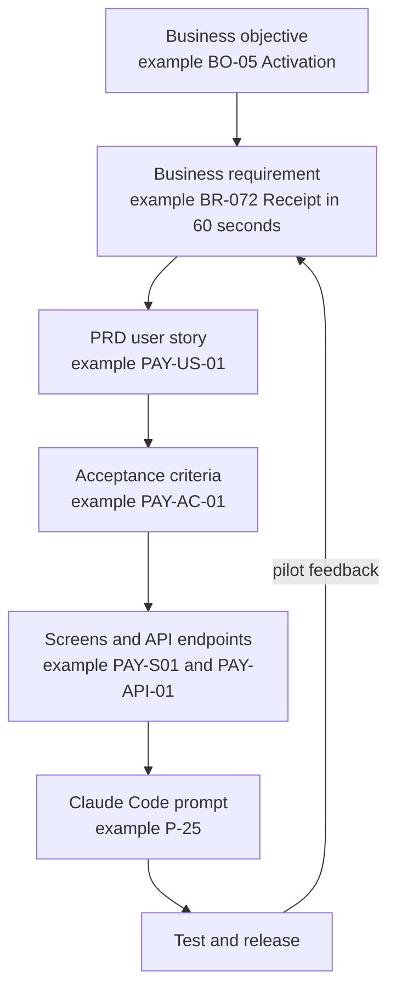
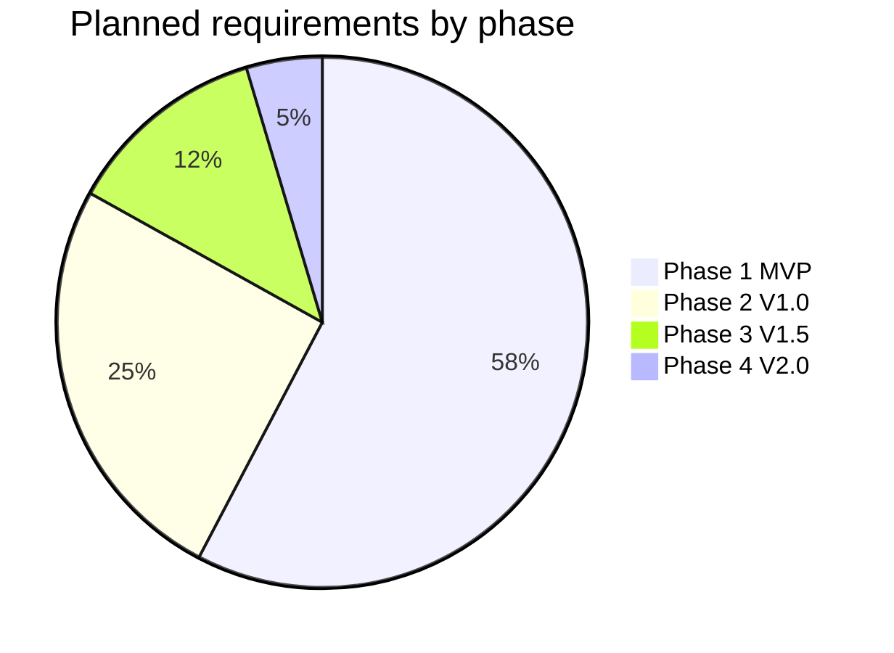
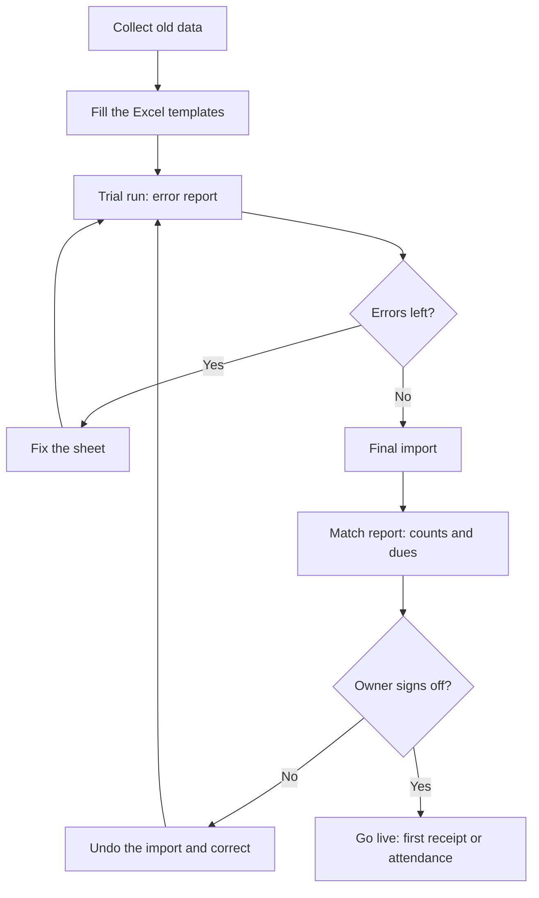

# Business Requirements Catalog

**In simple words:** This chapter is the master list of what the business needs from EduFlow. Each need has an ID, a reason, a priority and a release phase, and it points to the PRD module that will deliver it. The chapter also lists the business rules that must never be broken, the quality targets, the top 20 reports, and the rules for moving a new customer's old data into EduFlow. If a feature cannot be traced back to a line in this chapter, the founder should ask why it is being built.

## How to read this catalog

A business requirement says **what** the business needs and **why**. It does not say how the screen looks or how the code works. That detail lives in the PRD (Product Requirements Document — the document that describes each module, screen, rule and API for the builder).

> **Example:** Business requirement: "The business needs the accountant to collect a fee and give a receipt in under 60 seconds." The PRD then turns this into screens, fields, validation rules and endpoints in the *Fees Module* and *Payments Module* chapters.

In this catalog, "the business" means EduFlow as a company together with the institutes it serves. A need of Rajesh Sharma, the owner of Sharma Classes, is a need of the business, because he pays only when that need is met.

### The five lists in this chapter

| List | ID format | What it holds | How many |
|---|---|---|---|
| Business requirements | `BR-001` onwards | What the business needs, grouped by 15 capabilities | 138 |
| Business rules | `BRU-01` onwards | Rules that are always true, whatever the screen | 36 |
| Non-functional business requirements | `NBR-01` onwards | Quality targets: speed, uptime, language, export | 16 |
| Reporting requirements | `RR-01` onwards | The top 20 reports the users need | 20 |
| Data migration requirements | `DM-01` onwards | How old data comes in, and how it goes out | 12 |

The `BR-001` format is fixed by the canon. The other four prefixes are local to this chapter. IDs are never reused. If a requirement is dropped, its ID is retired and the row is marked "Withdrawn" with a date.

### Columns of the requirement tables

| Column | Meaning |
|---|---|
| ID | The permanent number, for example `BR-072` |
| Requirement | One sentence in business language. It starts with "The business needs" |
| Rationale | Why it matters: money, time, trust, law or a canon target |
| Priority | Must, Should, Could or Won't (explained below) |
| Phase | The release in which the requirement is first met: P1, P2, P3 or P4 |
| PRD module | The canon module that delivers it. For needs that cut across modules, the PRD chapter title is shown in italics |

### Priorities: the MoSCoW method

MoSCoW is a simple way to rank requirements. The capital letters stand for Must, Should, Could and Won't. We judge the priority **inside the phase** in which the requirement ships. A "Must" in Phase 3 does not mean the MVP needs it. It means Phase 3 cannot be called done without it.

| Priority | Meaning | Test question | What happens when time is short |
|---|---|---|---|
| Must | The phase cannot ship without it | "Would a customer refuse to pay, or would we break a law, without this?" | Never dropped. The release date moves, or another item leaves |
| Should | Important, but a workaround exists for a few weeks | "Can staff manage with Excel or a phone call for one month?" | Ships in the phase if possible, else in the first update after it |
| Could | Nice to have. Small gain, or few customers ask | "Would anyone notice in the first month?" | First to be dropped |
| Won't (for now) | Agreed to be out of scope in Year 1 | "Is this a different product?" | Not built. The customer gets a simple alternative |

> **Rule:** A healthy phase has no more than about 60% of its effort in Must items. If everything is a Must, nothing is. When a new Must enters a phase, apply the "one in, one out" rule from *Business Objectives, Scope and Stakeholders*.

### Phases

The phase of each module is fixed by the canon. A module never moves to an earlier or later phase. But a deeper requirement inside a Phase 1 module may arrive in a later phase. For example, the Student Admission module ships in Phase 1, while its public online application form (`BR-015`) arrives in Phase 2.

| Phase | Release | Dates | What it adds |
|---|---|---|---|
| P1 | MVP | 5 Oct 2026 to 3 Dec 2026 (Day 1 to Day 60) | 16 core modules: admit, mark attendance, collect fees, inform parents |
| P2 | V1.0 | 4 Dec 2026 to 1 Feb 2027 (Day 61 to Day 120) | 12 modules: the full academic cycle, email, SMS, certificates, analytics |
| P3 | V1.5 | February 2027 to June 2027 | 5 modules: library, inventory, transport, hostel, payroll |
| P4 | V2.0 | July 2027 to September 2027 | AI Insights, international packs, white-label mobile apps |

### From a business need to working software

Traceability means we can follow one line from a business objective down to a test, and back up again. It protects a solo founder from building things that nobody asked for.

**Figure: The traceability chain**



The figure shows the chain from top to bottom. An objective creates a requirement. The PRD turns it into user stories and acceptance criteria. Those become screens and endpoints, which a Claude Code prompt builds. Test results and pilot feedback come back and may change the requirement. The sample IDs in the figure only show the ID formats; the PRD chapters hold the real lists.

### How a requirement changes

1. Anyone can propose a change: a pilot institute, a customer, the founder.
2. The founder writes it in one line and links it to a business objective. No objective means no requirement.
3. The founder sets the priority with the test questions above.
4. If it enters a running phase, something of equal size leaves that phase.
5. The row in this chapter is updated first. The PRD module chapter is updated next.
6. The change is noted in the weekly review with the date and the reason.

## Catalog at a glance

The catalog has 138 business requirements. 130 are planned across the four phases. 8 are recorded as "Won't for now", so that the founder has a ready answer when a customer asks.

| Group | Capability | IDs | Count | Canon modules |
|---|---|---|---|---|
| A | Tenant and platform management | BR-001 to BR-009 | 9 | Organizations, Multi Campus |
| B | Admissions and enrolment | BR-010 to BR-015 | 6 | Student Admission |
| C | Student and guardian records | BR-016 to BR-023 | 8 | Student Profile |
| D | Staff and teacher management | BR-024 to BR-029 | 6 | Teachers, Staff |
| E | Attendance and leave | BR-030 to BR-040 | 11 | Attendance, Leave |
| F | Academics | BR-041 to BR-051 | 11 | Batch, Subjects, Timetable, Homework |
| G | Exams and report cards | BR-052 to BR-060 | 9 | Exams, Report Cards |
| H | Fees, payments, discounts and scholarships | BR-061 to BR-079 | 19 | Fees, Payments, Discounts, Scholarships |
| I | Communication | BR-080 to BR-089 | 10 | Notifications, WhatsApp, Email, SMS |
| J | Portals | BR-090 to BR-097 | 8 | Parent Portal, Student Portal |
| K | Campus operations | BR-098 to BR-108 | 11 | Library, Inventory, Transport, Hostel |
| L | Payroll | BR-109 to BR-113 | 5 | Payroll |
| M | Certificates | BR-114 to BR-116 | 3 | Certificates |
| N | Analytics and AI insights | BR-117 to BR-124 | 8 | Dashboard, Analytics, AI Insights |
| O | Settings and administration | BR-125 to BR-130 | 6 | Settings |
| W | Won't for now | BR-131 to BR-138 | 8 | None |

### Priority and phase counts

| Priority | P1 | P2 | P3 | P4 | Total | Share of planned |
|---|---|---|---|---|---|---|
| Must | 63 | 20 | 10 | 3 | 96 | 74% |
| Should | 12 | 11 | 4 | 3 | 30 | 23% |
| Could | 0 | 2 | 2 | 0 | 4 | 3% |
| Total planned | 75 | 33 | 16 | 6 | 130 | 100% |
| Won't for now | None | None | None | None | 8 | Not counted |

**Figure: Planned requirements by phase**



More than half of the planned requirements (75 of 130, or 58%) land in Phase 1. This matches the wedge: a coaching institute gets full value from Phase 1 alone.

> **Founder note:** By count, 84% of the Phase 1 rows are Must (63 of 75). This does not break the 60% effort rule. Each row is a core need that is already cut to a thin slice. The finer Must, Should and Could choices sit on the user stories inside each PRD module chapter. If the sprint is more than 2 modules behind plan on Day 30, the 12 Should rows of Phase 1 move to early Phase 2 first: `BR-007`, `BR-011`, `BR-023`, `BR-036`, `BR-043`, `BR-045`, `BR-065`, `BR-074`, `BR-076`, `BR-085`, `BR-094` and `BR-118`.

## Tenant and platform management

A tenant is one customer organization inside our shared system. This group covers how an institute joins, how its data stays separate, how plans and limits work, and how EduFlow staff look after all institutes from one console. It maps to the *Organizations Module* and *Multi Campus Module* chapters of the PRD.

| ID | Requirement | Rationale | Priority | Phase | PRD module |
|---|---|---|---|---|---|
| BR-001 | The business needs a new institute to sign up by itself and reach a working account in under 10 minutes. | Self-serve signup feeds the target of 300 free organizations without founder time. | Must | P1 | Organizations |
| BR-002 | The business needs each institute's data to be fully separated from every other institute's data. | One leak of children's data can end the company. The target is zero leaks. | Must | P1 | Organizations; *Multi-Tenancy and Data Isolation* |
| BR-003 | The business needs one product that serves schools and coaching, with screen labels that change by institute type. | Coaching is the wedge and schools follow. Two products would double the work. | Must | P1 | Organizations |
| BR-004 | The business needs plan limits on students, campuses and staff users to apply automatically, with a clear upgrade prompt. | Limits protect revenue and drive the 15% free-to-paid target. | Must | P1 | Organizations |
| BR-005 | The business needs to bill its own subscriptions and add-ons in rupees, with a GST tax invoice for each payment. | No paid launch in January 2027 is possible without legal invoices. | Must | P1 | Organizations |
| BR-006 | The business needs a guided setup checklist that takes a new institute to its first receipt or first attendance in one day. | The activation target is 60% within 7 days of signup. | Must | P1 | Organizations, Dashboard |
| BR-007 | The business needs a 14-day Pro trial without a card, which ends in Starter, a paid plan or a read-only account. | A trial shows the full value. It must never end in lost data. | Should | P1 | Organizations |
| BR-008 | The business needs a platform console where EduFlow staff see every institute's plan, usage, health and billing status. | One founder must look after 120 paying and 300 free institutes. | Must | P1 | Organizations |
| BR-009 | The business needs an owner to run several campuses in one account, with staff limited to their campuses and the owner seeing all. | This is the Pro and Enterprise value, and the extra campus add-on earns ₹999 a month. | Must | P1 | Multi Campus |

> **Example:** `BR-004` in real life. Sharma Classes is on Growth (up to 300 students) and admits student number 301. Nothing breaks. A 10% grace starts, as set in *Pricing Strategy*, and the owner sees the Pro upgrade price. Daily work such as attendance and fee collection is never blocked by a plan limit.

## Admissions and enrolment

An enquiry is the first contact from a parent. An admission is the moment the child becomes a student with an admission number, a batch and a fee plan. This group maps to the *Student Admission Module* chapter.

| ID | Requirement | Rationale | Priority | Phase | PRD module |
|---|---|---|---|---|---|
| BR-010 | The business needs every enquiry to be recorded with its source, the course of interest and the next follow-up date. | A lost enquiry is a lost fee. Owners also want to know which source brings students. | Must | P1 | Student Admission |
| BR-011 | The business needs the front desk to see today's follow-ups and to move each enquiry through clear stages up to admission. | A simple funnel lifts conversion without a separate CRM tool. | Should | P1 | Student Admission |
| BR-012 | The business needs an application to be recorded with documents, and to be approved or rejected with a reason. | Schools must show how seats were given. A reason ends later disputes. | Must | P1 | Student Admission |
| BR-013 | The business needs an approved applicant to become a student in one step: admission number, batch and fee plan together. | One step removes double entry. The first invoice is ready the same day. | Must | P1 | Student Admission, Batch, Fees |
| BR-014 | The business needs existing students and guardians to be imported in bulk from Excel, with an error report before anything is saved. | One-day onboarding depends on this import. | Must | P1 | Student Admission, Student Profile |
| BR-015 | The business needs a public online enquiry and application form on the institute's own EduFlow web address. | Parents search online. The form saves front-desk time in admission season. | Should | P2 | Student Admission |

> **Note:** A CRM (customer relationship management tool) tracks leads and follow-ups. EduFlow does not try to be a full CRM. It covers only the enquiry-to-admission path that an institute's front desk needs.

## Student and guardian records

This group is the single source of truth about every learner and family. It maps to the *Student Profile Module* chapter. Consent for children's data is covered in depth in *Compliance, Legal and Data Protection Requirements*.

| ID | Requirement | Rationale | Priority | Phase | PRD module |
|---|---|---|---|---|---|
| BR-016 | The business needs one complete record per student: personal details, photo, guardians, documents and batch history. | One record replaces paper files and scattered Excel sheets. | Must | P1 | Student Profile |
| BR-017 | The business needs any student to be found in under 3 seconds by name, admission number or parent phone number. | The fee counter and the front desk search hundreds of times a day. | Must | P1 | Student Profile |
| BR-018 | The business needs each student to have one or more guardians, with one primary contact for messages and payments. | Alerts and pay links must reach the right phone. | Must | P1 | Student Profile |
| BR-019 | The business needs brothers and sisters to be linked through a shared guardian. | Sibling discounts and one parent login for all children depend on it. | Must | P1 | Student Profile |
| BR-020 | The business needs verifiable parental consent to be recorded before a child's data is used, with date, method and text version. | The DPDP Act 2023 requires it. Consent must be live before the pilot. | Must | P1 | Student Profile; *Privacy and Compliance* |
| BR-021 | The business needs a clear student status: active, inactive, suspended, graduated, transferred, dropped out or expelled, with date and reason. | Plan limits count only active students. Dues and certificates depend on status. | Must | P1 | Student Profile |
| BR-022 | The business needs whole batches to be promoted to the next class or session in bulk, with detained students handled as exceptions. | The April session change for 1,200 students must take hours, not weeks. | Must | P2 | Student Profile, Batch |
| BR-023 | The business needs institutes to add their own fields, for example house, category, previous school or APAAR ID. | Every admission form differs. Custom fields avoid custom development. | Should | P1 | Student Profile, Settings |

## Staff and teacher management

Teachers are needed from day one because they mark attendance. Other staff records arrive with the Staff module in Phase 2. This group maps to the *Teachers Module* and *Staff Module* chapters, and to *RBAC and Permissions Matrix* for roles. RBAC means role-based access control: what a user can do depends on the role given to that user.

| ID | Requirement | Rationale | Priority | Phase | PRD module |
|---|---|---|---|---|---|
| BR-024 | The business needs a record for every teacher: contact, qualification, subjects, joining date and documents. | It replaces paper files and is the base for batch and subject mapping. | Must | P1 | Teachers |
| BR-025 | The business needs each teacher to be mapped to batches and subjects, and to see and edit only those. | It protects privacy and keeps screens simple: 3 batches, not 40. | Must | P1 | Teachers |
| BR-026 | The business needs staff to be invited by phone or email and to log in with a role that limits what they can do. | Least access reduces fraud and mistakes. The seven system roles are fixed. | Must | P1 | Teachers; *RBAC and Permissions Matrix* |
| BR-027 | The business needs access to stop on the same day a teacher or staff member leaves, while past records stay. | An ex-employee with a live login is a data risk. | Must | P1 | Teachers, Staff |
| BR-028 | The business needs records for non-teaching staff (office, accounts, drivers, wardens, guards) with department, designation and documents. | Leave, transport and payroll all need these people in the system. | Must | P2 | Staff |
| BR-029 | The business needs custom roles such as Librarian, Transport Manager, Hostel Warden, HR Manager and Front Desk, built by picking permissions. | Larger schools have more job types than seven roles. It is a Pro plan benefit. | Should | P2 | Settings; *RBAC and Permissions Matrix* |

## Attendance and leave

Attendance is the daily heartbeat of the product. If teachers mark it every day, parents feel the product every day. This group maps to the *Attendance Module* and *Leave Module* chapters.

| ID | Requirement | Rationale | Priority | Phase | PRD module |
|---|---|---|---|---|---|
| BR-030 | The business needs a teacher to mark a batch of 40 students in under 60 seconds on a low-cost phone. | If marking is slow, teachers go back to paper and parents see nothing. | Must | P1 | Attendance |
| BR-031 | The business needs the parent of an absent student to get an alert within 15 minutes of marking. | It is the most visible daily value for parents, and a safety matter. | Must | P1 | Attendance, WhatsApp |
| BR-032 | The business needs daily attendance for schools and per-class attendance for coaching. | Coaching students attend specific classes. Schools mark once or twice a day. | Must | P1 | Attendance |
| BR-033 | The business needs a monthly register and each student's attendance percentage without manual totals. | It removes month-end counting. Many boards ask for 75% attendance to sit an exam. | Must | P1 | Attendance |
| BR-034 | The business needs holidays and weekly offs to be set once, so that they never count as absent. | One wrong percentage destroys trust in every report. | Must | P1 | Attendance, Settings |
| BR-035 | The business needs attendance to lock after a set period (7 days by default), with later corrections only by an authorised person with a reason. | It stops back-dated changes. The register is an official record in schools. | Must | P1 | Attendance |
| BR-036 | The business needs the principal to see, by 11 am, which batches are not yet marked today. | Daily follow-up keeps the habit alive in the first months. | Should | P1 | Attendance, Dashboard |
| BR-037 | The business needs alerts for students below a set attendance level, or absent 3 days in a row. | It is the earliest sign of a dropout, mainly in coaching. | Should | P2 | Attendance, Analytics |
| BR-038 | The business needs daily staff attendance to be recorded: present, absent, late, half day or on leave. | Payroll needs days worked. Owners want punctuality data. | Should | P2 | Attendance, Staff |
| BR-039 | The business needs staff to apply for leave, managers to approve it, and balances to update by leave type. | It replaces leave letters and feeds loss-of-pay in payroll. | Must | P2 | Leave |
| BR-040 | The business needs parents to request student leave from the portal, and the class teacher to approve it. | Approved leave shows as leave, not absent. It also cuts phone calls. | Should | P2 | Leave, Parent Portal |

> **Example:** `BR-031` at Bright Future Public School. Priya Nair marks Class 10-A at 8:05 am. Aarav Sharma is absent. By 8:20 am his mother Sunita Devi gets a WhatsApp message: "Aarav Sharma (10-A) is marked absent today, 12 Jul 2027. If this is a mistake, please call the school office." The message costs the school about ₹0.13 (estimate, see *Business Model*).

## Academics

This group sets up the teaching structure: sessions, courses, batches, subjects, timetable and homework. It maps to the *Batch Module*, *Subjects Module*, *Timetable Module* and *Homework Module* chapters. A batch means Section 10-A in a school and Morning Batch M1 in a coaching institute.

| ID | Requirement | Rationale | Priority | Phase | PRD module |
|---|---|---|---|---|---|
| BR-041 | The business needs academic years (sessions) with start and end dates, and only one current year at a time. | All fees, attendance and exams belong to a session. It keeps year-end clean. | Must | P1 | Batch |
| BR-042 | The business needs courses and batches with capacity, timing, room and a class teacher or batch in-charge. | The batch is the unit for attendance, fees and messages. | Must | P1 | Batch |
| BR-043 | The business needs seat capacity to show during admission, with a waiting list when a batch is full. | It prevents over-admission and helps coaching fill batches evenly. | Should | P1 | Batch, Student Admission |
| BR-044 | The business needs a student to move between batches in the middle of a session, with the history kept. | Coaching students often shift from an evening batch to a morning batch. | Must | P1 | Batch |
| BR-045 | The business needs a student to be enrolled in more than one batch at the same time. | A JEE student may join a main batch, a doubt batch and a test series. | Should | P1 | Batch |
| BR-046 | The business needs subjects per course, marked compulsory or optional, with teachers mapped per batch. | Subjects are the base for timetable, homework and exams. | Must | P1 | Subjects |
| BR-047 | The business needs a weekly timetable per batch that blocks teacher clashes and room clashes. | A clash found on Monday morning wastes a teaching day. | Must | P2 | Timetable |
| BR-048 | The business needs a substitute to be assigned when a teacher is on leave, with both teachers informed. | It is a daily event in schools. Free periods upset parents. | Should | P2 | Timetable, Leave |
| BR-049 | The business needs teachers, students and parents to see today's timetable on their phones. | It cuts "which class is now?" calls. Coaching schedules change every week. | Must | P2 | Timetable, Parent Portal, Student Portal |
| BR-050 | The business needs teachers to post homework with files and a due date, and to mark it done, late or not done. | Parents of young children ask about homework every day. | Must | P2 | Homework |
| BR-051 | The business needs teachers to share study material by batch: PDF notes and links to recorded classes. | Live classes are out of scope, so links and notes carry the value. | Could | P2 | Homework |

## Exams and report cards

Schools run term exams and print report cards. Coaching institutes run weekly tests and publish ranks. One module must serve both. This group maps to the *Exams Module* and *Report Cards Module* chapters.

| ID | Requirement | Rationale | Priority | Phase | PRD module |
|---|---|---|---|---|---|
| BR-052 | The business needs exams to be set up per batch with subjects, dates, maximum marks and pass marks. | It is the base for marks entry. Schools run 4 to 6 exams a year. | Must | P2 | Exams |
| BR-053 | The business needs coaching test series: frequent tests with total score, rank in the batch and rank across batches. | Rank is the main currency of JEE and NEET coaching. | Must | P2 | Exams |
| BR-054 | The business needs teachers to enter marks fast, on screen or by Excel upload, with absent and exempt students marked. | One exam means 40 students times 6 subjects per section. Speed decides adoption. | Must | P2 | Exams |
| BR-055 | The business needs marks to be checked by a second person before they are published. | A wrong mark on a report card damages the institute's name. | Must | P2 | Exams |
| BR-056 | The business needs grading scales to be set by the institute: marks, percentage, letter grades or grade points. | Boards differ, and international markets use grade points. | Must | P2 | Exams |
| BR-057 | The business needs results to be published to parents and students on a chosen date, with a message. | A controlled release avoids half-finished results leaking out. | Must | P2 | Exams, Parent Portal |
| BR-058 | The business needs report cards as PDF from templates (CBSE, ICSE, state board, coaching, grade point styles) with logo, attendance, remarks and signatures. | It replaces hand-written and Excel report cards, a very large time saver. | Must | P2 | Report Cards |
| BR-059 | The business needs re-evaluation requests and corrected marks after publishing to be handled with a full trail. | Mistakes happen. A clear trail protects the institute. | Should | P2 | Exams |
| BR-060 | The business needs the institute to be able to hold back a report card when fees are due, if its own policy allows. | Some institutes use this to recover dues. It is a setting, off by default. | Could | P2 | Report Cards, Fees |

> **Warning:** `BR-060` is legally sensitive. Several Indian states and courts have acted against schools that hold back results or transfer certificates for unpaid fees. EduFlow only offers the setting, keeps it off by default, and shows a caution text. The institute owns the decision. See *Compliance, Legal and Data Protection Requirements*.

## Fees, payments, discounts and scholarships

This group is where the institute's money moves. It has the most requirements and the strictest rules. It maps to the *Fees Module*, *Payments Module*, *Discounts Module* and *Scholarships Module* chapters. An invoice is a bill raised on a student for one instalment. A receipt is the proof that money came in. UPI is India's instant bank-to-bank payment system, used through apps such as PhonePe and Google Pay. GSTIN is the institute's GST registration number.

| ID | Requirement | Rationale | Priority | Phase | PRD module |
|---|---|---|---|---|---|
| BR-061 | The business needs fee heads (tuition, transport, exam, hostel) and fee structures per course and batch, with instalments and due dates. | Every institute prices differently. One structure bills hundreds of students. | Must | P1 | Fees |
| BR-062 | The business needs a student's fee plan to be fixed at admission, with optional heads, custom instalments and a fair part-fee for mid-session joiners. | Coaching owners agree fees per student. Schools add transport only for some. | Must | P1 | Fees |
| BR-063 | The business needs invoices to be raised automatically for each instalment, and one-time charges such as an exam fee to be added when needed. | Billing 1,200 students by hand each quarter takes days and misses students. | Must | P1 | Fees |
| BR-064 | The business needs a live list of dues by student, batch and campus, with the age of each due. | Owners ask "who has not paid?" every week. Follow-up starts here. | Must | P1 | Fees |
| BR-065 | The business needs late fees to follow the institute's own policy, with grace days, and waivers only with a reason. | A late fee pushes on-time payment. A waiver without a reason is a leak. | Should | P1 | Fees |
| BR-066 | The business needs automatic fee reminders before and after the due date, each with a pay link. | Reminders with a pay link drive the 40% online share target. | Must | P1 | Fees, WhatsApp |
| BR-067 | The business needs unpaid dues to be brought in at onboarding and carried forward to the new session. | Institutes join mid-year. No owner writes off old dues for new software. | Must | P1 | Fees |
| BR-068 | The business needs GST to be charged on fees where the law asks, set per fee head, with the institute's GSTIN on the invoice. | Coaching fees are taxable at 18%. School tuition is usually exempt. | Must | P1 | Fees |
| BR-069 | The business needs fees to be collected at the counter by cash, UPI, card, cheque, demand draft or bank transfer, in full or in part. | Even at the 40% online target, 60% of fee value comes to the counter. | Must | P1 | Payments |
| BR-070 | The business needs parents to pay online by UPI, card or netbanking, with the money settled straight to the institute's bank account. | EduFlow never holds fee money. Online payment cuts queues and cash risk. | Must | P1 | Payments |
| BR-071 | The business needs every online payment to be matched to its invoice automatically, with no lost and no double payment. | Parents close the app mid-payment. One lost payment destroys trust. | Must | P1 | Payments |
| BR-072 | The business needs the accountant to collect a fee and give a numbered receipt in under 60 seconds, printed or sent on WhatsApp. | Queues on due dates decide if the accountant accepts the product. | Must | P1 | Payments |
| BR-073 | The business needs a day close: the day's collection by mode and by user, matched with the cash in hand. | It is the owner's daily control against cash theft. | Must | P1 | Payments |
| BR-074 | The business needs cheques to stay pending until cleared, and a bounced cheque to reopen the due with a charge. | Cheques are still common in schools. A bounced one must not look paid. | Should | P1 | Payments |
| BR-075 | The business needs refunds and receipt cancellations to go through approval with a reason, with the first record kept visible. | Silent cancellation of a cash receipt is the classic fee-counter fraud. | Must | P1 | Payments |
| BR-076 | The business needs advance and excess payments to be kept as credit and adjusted in the next invoice. | Parents often pay round sums or a full year in advance. | Should | P1 | Payments |
| BR-077 | The business needs standard discounts (sibling, early payment, full-year payment, staff child, merit, custom) by percent or fixed amount. | Discounts are part of every admission talk. They must apply the same way each time. | Must | P1 | Discounts |
| BR-078 | The business needs discounts above a set limit to need the owner's approval, and every discount to show who gave it and why. | Unrecorded concessions are a main source of fee leakage. | Must | P1 | Discounts |
| BR-079 | The business needs scholarship schemes with eligibility, award, renewal and sponsor, applied to invoices automatically. | Schools run merit and need-based schemes. Trusts and sponsors ask for reports. | Must | P2 | Scholarships |

> **Example:** `BR-071` in real life. Sunita Devi opens the pay link for invoice INV-0912 and pays ₹10,900 by UPI. Her phone loses network before the success page loads. Razorpay still confirms the payment to EduFlow in the background. The invoice turns to paid, and the receipt reaches her WhatsApp within a minute. If she taps "Pay" again, she sees "Already paid" and is not charged twice.

> **Founder note:** `BR-070` also keeps EduFlow outside the RBI rules for companies that hold other people's money. The fee goes from the parent to the institute's own Razorpay account. EduFlow only records it.

## Communication

Parents judge the institute by the messages they get. This group maps to the *Notifications Module*, *WhatsApp Module*, *Email Module* and *SMS Module* chapters. A template is a message with blanks, for example "Dear parent, {student} is absent today". WhatsApp and Indian SMS both demand that business templates are approved before use. DLT is the telecom registry where every business SMS sender and template must be registered.

| ID | Requirement | Rationale | Priority | Phase | PRD module |
|---|---|---|---|---|---|
| BR-080 | The business needs one message engine: each key event (absence, invoice, receipt, result, notice) sends a message from a template, on the channels the institute picks. | One engine keeps 34 modules consistent and lets the owner switch events on or off. | Must | P1 | Notifications |
| BR-081 | The business needs an in-app message feed for every user. | It is free. It is the only channel on Starter besides email. | Must | P1 | Notifications |
| BR-082 | The business needs WhatsApp messages with approved templates for absence, fee reminder, receipt and notice. | Indian parents read WhatsApp, not email. It is the core of the parent promise. | Must | P1 | WhatsApp |
| BR-083 | The business needs prepaid message credits with a live balance, a low-balance alert and no bill after the fact. | Credits carry a 15% margin. Prepaid means no bad debt and no surprise. | Must | P1 | WhatsApp |
| BR-084 | The business needs staff to send a notice to a batch, a campus or all parents in a few clicks, with a file if needed. | Holiday and exam notices go out every week. It replaces many WhatsApp groups. | Must | P1 | Notifications, WhatsApp |
| BR-085 | The business needs a delivery log for every message: sent, delivered, read or failed, with its cost. | "I never got the message" disputes end. Owners see where credits went. | Should | P1 | Notifications |
| BR-086 | The business needs each parent's language (Hindi or English), channel choices and opt-outs to be respected. | Meta policy and the DPDP Act demand consent. Hindi-first parents must understand alerts. | Must | P1 | Notifications |
| BR-087 | The business needs email for receipts, invoices, report cards and bulk circulars, with a log. | Email carries PDF files well and is nearly free. Global markets prefer it. | Must | P2 | Email |
| BR-088 | The business needs SMS with DLT-approved templates for parents who do not use WhatsApp. | Some parents use basic phones. SMS reaches every phone. | Must | P2 | SMS |
| BR-089 | The business needs urgent alerts to fall back from WhatsApp to SMS when delivery fails, and normal messages to respect quiet hours. | Safety alerts must arrive. A fee reminder at 11 pm angers parents. | Should | P2 | Notifications |

> **Example:** Credit maths for `BR-083` at Sharma Classes. 350 parents get about 12 utility messages a month each: 350 × 12 = 4,200 messages. At about ₹0.13 each (estimate, see *Business Model*), the month costs about ₹550. One ₹1,999 credit pack lasts over three months.

## Portals

Portals are the windows for parents and students. They must work on a low-cost phone without any training. This group maps to the *Parent Portal Module* and *Student Portal Module* chapters. OTP means one-time password, a short code sent to the phone.

| ID | Requirement | Rationale | Priority | Phase | PRD module |
|---|---|---|---|---|---|
| BR-090 | The business needs parents to log in with their mobile number and an OTP, with no password and no app-store install. | Parents forget passwords. Every extra step cuts the 70% adoption target. | Must | P1 | Parent Portal |
| BR-091 | The business needs one parent login to show all of the parent's children, with an easy switch between them. | Many families have two or three children in the same institute. | Must | P1 | Parent Portal |
| BR-092 | The business needs a parent to see the child's attendance, dues, receipts and notices on a phone. | Transparency is a guiding principle. It also cuts calls to the office. | Must | P1 | Parent Portal |
| BR-093 | The business needs a parent to pay a due from the portal or a pay link in three taps, and to get the receipt at once. | Each extra tap loses payments. This is the path to the 40% online share. | Must | P1 | Parent Portal, Payments |
| BR-094 | The business needs the Parent Portal screens in Hindi and English, chosen by the parent. | Many parents, like Sunita Devi, cannot read an English paragraph. | Should | P1 | Parent Portal; *Internationalization and Localization* |
| BR-095 | The business needs parents to see homework, timetable, exam dates, results and report cards in the portal. | It makes the portal a daily habit, not only a fee tool. | Must | P2 | Parent Portal |
| BR-096 | The business needs students to log in and see only their own timetable, homework, marks and attendance, with no ads and no tracking. | Older students manage their own study. Children's data law forbids tracking. | Must | P2 | Student Portal |
| BR-097 | The business needs white-label Android and iOS apps with the institute's own name and logo. | Larger institutes want their own brand. It earns ₹49,999 setup plus ₹4,999 a month. | Should | P4 | Parent Portal; *Release Plan and Plan Gating* |

> **Note:** `BR-094` covers about 15 parent screens (estimate), so Hindi labels are a small job. The timing decision is explained under `NBR-06`.

## Campus operations

These four modules matter mostly to schools. All ship in Phase 3 and belong to the Pro and Enterprise plans. The group maps to the *Library Module*, *Inventory Module*, *Transport Module* and *Hostel Module* chapters.

| ID | Requirement | Rationale | Priority | Phase | PRD module |
|---|---|---|---|---|---|
| BR-098 | The business needs a catalogue of books and copies that can be searched by title, author or accession number. | School libraries hold 2,000 to 20,000 books in paper registers (estimate). | Must | P3 | Library |
| BR-099 | The business needs books to be issued, renewed and returned for students and staff, with limits and due dates. | The librarian must know who holds which book today. | Must | P3 | Library |
| BR-100 | The business needs overdue fines and lost-book charges to follow policy and to be collected with a normal receipt. | Fine money must pass through the same counter controls as fees. | Should | P3 | Library, Payments |
| BR-101 | The business needs stock items, purchases with vendor and bill, issues to departments and low-stock alerts. | Owners want to know where uniforms, books and lab items went. | Must | P3 | Inventory |
| BR-102 | The business needs items such as uniforms and books to be sold to students with a receipt. | Some schools run a small store. It is a minor revenue line. | Could | P3 | Inventory, Payments |
| BR-103 | The business needs routes, stops, vehicles and drivers on record, with alerts before licence, permit and insurance expiry. | An expired paper on a school bus is a legal and safety risk. | Must | P3 | Transport |
| BR-104 | The business needs students to be allotted to a route and stop, with the transport fee added to their invoices automatically. | Transport is often 15% to 25% of a school bill (estimate). It must not be missed. | Must | P3 | Transport, Fees |
| BR-105 | The business needs route-wise student lists with parent phone numbers, and messages to a route's parents when a bus is late. | The bus attendant needs the list. Parents worry when a bus is late. | Should | P3 | Transport, Notifications |
| BR-106 | The business needs hostel buildings, rooms and beds on record, with no bed given to two students. | Wardens manage beds on paper. Double allotment causes fights. | Must | P3 | Hostel |
| BR-107 | The business needs hostel and mess fees, and the refundable deposit, to flow into the student's invoices. | One bill per student is easier for parents and for the accountant. | Must | P3 | Hostel, Fees |
| BR-108 | The business needs a night roll call, outing passes with the parent's approval, and a visitor log. | The safety of resident children is the warden's first duty. | Should | P3 | Hostel |

## Payroll

Payroll pays the staff each month. EduFlow calculates and records. It does not file government returns. This group maps to the *Payroll Module* chapter. PF is provident fund, ESI is employee state insurance, and TDS is tax deducted at source. A CA is a chartered accountant.

| ID | Requirement | Rationale | Priority | Phase | PRD module |
|---|---|---|---|---|---|
| BR-109 | The business needs a salary structure per employee, with earnings and deductions. | Salaries differ by person. The structure is the base for every monthly run. | Must | P3 | Payroll |
| BR-110 | The business needs a monthly salary run per campus that uses staff attendance and approved leave, is reviewed, and is then locked. | Loss-of-pay mistakes cause staff disputes. A locked run is a clean record. | Must | P3 | Payroll, Leave |
| BR-111 | The business needs payslips as PDF, shared privately with each employee. | Staff need payslips for bank loans. Salary is private data. | Must | P3 | Payroll |
| BR-112 | The business needs PF, ESI, professional tax and TDS figures to be calculated for the CA to file. | The CA needs correct figures. Filing itself stays outside EduFlow. | Should | P3 | Payroll |
| BR-113 | The business needs salary advances and loans to be recovered from later salaries, and a bank transfer sheet for payout. | Advances are common in small institutes. The sheet saves retyping in net banking. | Could | P3 | Payroll |

## Certificates

Schools issue many certificates by hand today. This group maps to the *Certificates Module* chapter. A bonafide certificate states that the child studies in the school. A transfer certificate (TC) is given when the child leaves.

| ID | Requirement | Rationale | Priority | Phase | PRD module |
|---|---|---|---|---|---|
| BR-114 | The business needs bonafide, transfer, character, fee and course-completion certificates from templates, filled with student data in under 2 minutes. | A clerk types each one in Word today, 10 to 20 minutes per certificate (estimate). | Must | P2 | Certificates |
| BR-115 | The business needs each certificate to carry a serial number and a QR code that anyone can scan to check it, with a register of all issued. | Fake certificates hurt the institute's name. Banks and schools can verify. | Should | P2 | Certificates |
| BR-116 | The business needs a transfer certificate to be issued only after a dues and library check, and to change the student's status. | It is the last point where dues can be recovered and records closed. | Should | P2 | Certificates, Fees |

## Analytics and AI insights

Owners want answers, not tables. This group maps to the *Dashboard Module*, *Analytics Module* and *AI Insights Module* chapters.

| ID | Requirement | Rationale | Priority | Phase | PRD module |
|---|---|---|---|---|---|
| BR-117 | The business needs a home dashboard per role: today's attendance, today's collection, total dues and new admissions. | The owner opens the product daily when the first screen answers his questions. | Must | P1 | Dashboard |
| BR-118 | The business needs the owner of several campuses to compare them on one screen. | It is a main reason to buy Pro. It replaces weekly calls to branch heads. | Should | P1 | Dashboard, Multi Campus |
| BR-119 | The business needs trends of fees, attendance and admissions across months and sessions. | Trends show problems early, for example falling collection in one batch. | Must | P2 | Analytics |
| BR-120 | The business needs every list and report to be filtered by campus, batch and date, and exported to Excel and PDF. | Owners, CAs and boards ask for data in Excel. It also builds trust. | Must | P1 | Analytics; all module chapters |
| BR-121 | The business needs a daily summary to reach the owner on WhatsApp or email at a set time. | Rajesh Sharma checks WhatsApp at 8 pm, not dashboards. | Should | P2 | Analytics, Notifications |
| BR-122 | The business needs students likely to default on fees to be flagged before the due date. | Early, polite follow-up recovers more than late pressure. | Must | P4 | AI Insights |
| BR-123 | The business needs students at risk of dropping out to be flagged from attendance and marks, with the reason in plain words. | One saved coaching student is worth ₹60,000 a year to the institute. | Must | P4 | AI Insights |
| BR-124 | The business needs the owner to ask questions in plain language and get answers only within his own data and rights. | It sells the ₹1,499 add-on. A person still makes every decision. | Should | P4 | AI Insights |

> **Rule:** AI Insights only suggests. It never changes a fee, a mark or a status by itself. Children's data is never used for ads or to train outside models. See *Compliance, Legal and Data Protection Requirements*.

## Settings and administration

This group holds the controls that the owner sets once and the safety nets that protect the data. It maps to the *Settings Module* chapter. SSO means single sign-on: staff log in with the organization's own Google or Microsoft account. An API lets other software read and write EduFlow data.

| ID | Requirement | Rationale | Priority | Phase | PRD module |
|---|---|---|---|---|---|
| BR-125 | The business needs the institute's profile, logo, receipt header and number series (admission, invoice, receipt) to be set once and used everywhere. | Receipts and report cards must look like the institute's own papers. | Must | P1 | Settings |
| BR-126 | The business needs a trail of sensitive actions: who did what and when, with the old and new values. | Fee edits, refunds and role changes need proof. It deters fraud. | Must | P1 | Settings; *Audit Logs, Backups and Disaster Recovery* |
| BR-127 | The business needs the owner to export all of the institute's data by himself, at any time, on any plan. | Fear of lock-in blocks sales. The mission promises an open door. | Must | P1 | Settings |
| BR-128 | The business needs country packs: currency, timezone, date format, tax and academic year pattern for the UAE, the USA and Australia. | International entry starts in Year 2 with UAE schools. | Must | P4 | Settings; *Internationalization and Localization* |
| BR-129 | The business needs the owner to see the plan, add-ons, usage and GST invoices, and to upgrade or downgrade without calling us. | Self-serve billing keeps the cost to serve low at 500 customers and more. | Must | P1 | Settings, Organizations |
| BR-130 | The business needs Enterprise customers to get SSO, API access and their own branding and web address. | School groups ask for these in tenders. Price starts at ₹14,999 a month. | Should | P4 | Settings; *Integrations and Webhooks* |

## Won't for now

These eight needs come up in sales calls. We record them, so the answer is always the same. They match the out-of-scope list in *Business Objectives, Scope and Stakeholders*. The last two columns differ from the other tables: they show when we look again, and what the customer does today.

| ID | Requirement asked for | Why not now | Priority | Review point | What the customer does instead |
|---|---|---|---|---|---|
| BR-131 | The business needs live classes and video hosting. | Costly to run. Good free tools exist. | Won't | Not planned | Paste a Zoom, Google Meet or YouTube link in Homework |
| BR-132 | The business needs to sell courses and content to the public. | It is a marketplace business, not an ERP. | Won't | Not planned | Use a content-selling app beside EduFlow |
| BR-133 | The business needs an online test engine with a question bank. | It is a large product by itself. | Won't | Year 2, if 30% of paying coaching customers ask | Enter marks of offline tests in Exams |
| BR-134 | The business needs full accounting: ledger, balance sheet, tax filing. | Accountants already use Tally. | Won't | Year 2 for a Tally export only | Export collections to Excel for Tally entry |
| BR-135 | The business needs PF, ESI and TDS returns to be filed from the product. | Filing rules change often. | Won't | Not planned | Payroll gives the figures. The CA files |
| BR-136 | The business needs biometric, RFID and GPS devices to be connected. | Hardware needs field staff. | Won't | Year 2, with a hardware partner | Mark attendance in the app. Track buses by phone |
| BR-137 | The business needs on-premise installation or custom development for one customer. | It breaks the one-codebase model and the founder's speed. | Won't | Never | Cloud only. Enterprise gets API access |
| BR-138 | The business needs government filings such as UDISE+ and board registration. | Formats differ by state and board. | Won't | Year 3, when schools pass 50% of customers | Export student lists to Excel |

## Business rules catalog

A business rule is a statement that is always true, whatever the screen or the user. A requirement says what the business needs. A rule says what may never happen. Each PRD module chapter has its own detailed rules (for example `FEE-BR-01`). Those rules must never contradict the 36 rules below.

Rules that show the word "default" can be changed by the institute in Settings. All other rules cannot be switched off by anyone, including the Super Admin.

### Tenant, access and records

| ID | Rule | Why | Module |
|---|---|---|---|
| BRU-01 | Every record belongs to exactly one organization. No screen, report or export ever mixes two organizations. | Trust and law | Organizations |
| BRU-02 | A staff user sees only the campuses assigned to him or her. The Organization Admin sees all campuses. | Privacy between branches | Multi Campus |
| BRU-03 | Plan limits count active students only. A plan limit never blocks attendance, fee collection, receipts or export. | Fair billing; daily work is sacred | Organizations |
| BRU-04 | A parent sees only his or her own children. A student sees only his or her own record. | Children's privacy | Parent Portal, Student Portal |
| BRU-05 | Business records are never hard deleted. They are cancelled or marked deleted, and they stay in the audit trail. | Proof in disputes | All modules |

### Students and academics

| ID | Rule | Why | Module |
|---|---|---|---|
| BRU-06 | An admission number is unique inside the organization and is never reused, even after the student leaves. | Old papers must still point to one child | Student Admission |
| BRU-07 | A student becomes active only with one guardian, a valid mobile number and, for a minor, recorded parental consent. | DPDP Act; alerts need a phone | Student Profile |
| BRU-08 | A student has at most one active enrolment in the same batch. A full batch takes more students only with an override and a reason. | Clean counts; controlled overbooking | Batch |
| BRU-09 | Only one academic year is current at a time. A closed year is read-only. | Clean year-end | Batch |
| BRU-10 | A student who is not active gets no new invoices and no attendance. Old dues stay payable. | No billing of students who left | Student Profile, Fees |

### Attendance, leave and exams

| ID | Rule | Why | Module |
|---|---|---|---|
| BRU-11 | Attendance cannot be marked for a future date, a holiday or a weekly off. | Correct percentages | Attendance |
| BRU-12 | Attendance locks 7 days after its date (default). A later change needs the unlock permission and a reason, and is logged. | The register is an official record | Attendance |
| BRU-13 | Approved leave shows as leave, not as absent. No absence alert goes out for approved leave. | Fair record; no false alarm | Attendance, Leave |
| BRU-14 | Leave beyond the balance is saved as loss of pay. Nobody approves his or her own leave. | Payroll accuracy; control | Leave |
| BRU-15 | Marks cannot be more than the maximum marks. An absent student gets "AB", never zero. | Zero would spoil averages and ranks | Exams |
| BRU-16 | Marks must be verified by a second person, not the one who entered them, before they are published. | Four-eyes check on results | Exams |
| BRU-17 | Published marks are locked. A change needs the unlock permission and a reason, and the report card is reissued as "Revised". | Parents must trust the first result | Exams, Report Cards |

> **Example:** `BRU-12` at Bright Future Public School. Priya Nair marks Class 10-A on Monday 12 Jul 2027. She can correct it herself until the end of Monday 19 Jul 2027. On 20 Jul the sheet is locked. Dr. Anita Verma, the principal, can still change it with a reason such as "Medical leave letter received late". The change, her name and the time go into the audit trail.

### Fees, payments, discounts and scholarships

| ID | Rule | Why | Module |
|---|---|---|---|
| BRU-18 | Receipt numbers run in an unbroken series and are never reused, even when a receipt is cancelled. | Auditors look for gaps and repeats | Payments |
| BRU-19 | A paid or part-paid invoice cannot be edited. It can only be cancelled with a reason, and a new invoice is raised. | No silent change to a bill that has money on it | Fees |
| BRU-20 | A receipt is never edited or deleted. A mistake is fixed by cancelling it with a reason and issuing a new receipt. | Stops the classic cash fraud | Payments |
| BRU-21 | A payment settles the oldest due invoice first, unless the accountant chooses another invoice. | Old dues do not rot | Payments |
| BRU-22 | Money above the due amount is kept as credit for the student. It is never lost and never shown as income twice. | Parents pay round sums | Payments |
| BRU-23 | A discount above the limit (default: 10% of the invoice or ₹5,000, whichever is lower) needs approval. The maker cannot be the approver. | Controls fee leakage | Discounts |
| BRU-24 | Discounts and scholarships together can never take an invoice below zero. | No negative bills | Discounts, Scholarships |
| BRU-25 | A late fee starts only after the grace days (default 5) and is never charged on an earlier late fee. | Fair to parents | Fees |
| BRU-26 | An online payment counts as paid only when the gateway confirms it, never from the parent's screen alone. The same gateway payment is never recorded twice. | No fake and no double payments | Payments |
| BRU-27 | A cheque is pending until the bank clears it. A bounced cheque reopens the invoice and may add a bounce charge. | A cheque is a promise, not money | Payments |
| BRU-28 | A refund never exceeds the amount paid. It needs approval. An online payment is refunded to its source. | Anti-fraud; gateway rules | Payments |
| BRU-29 | After the day close, the accountant cannot cancel that day's receipts. Only the Organization Admin can, with a reason. | The cash count must stay final | Payments |
| BRU-30 | EduFlow never stores card numbers, CVV codes or UPI PINs. Gateways hold them. | RBI rules; lower risk | Payments |

**The invoice formula.** Every fee screen and report uses the same sum:

```text
Invoice total = fee lines - discounts - scholarships + late fee + tax
Balance due   = invoice total - payments received + refunds given
```

> **Example:** Aarav Sharma, invoice INV-0912, Tuition Q2, due 10 Jul 2027. Fee line ₹12,000. Sibling discount 10% = ₹1,200. His mother pays on 25 Jul, after the 5 grace days, so a fixed late fee of ₹100 applies. School tuition is exempt from GST, so tax is ₹0. Invoice total = 12,000 − 1,200 − 0 + 100 + 0 = ₹10,900. At Sharma Classes the same kind of sum carries tax: an instalment of ₹15,000 plus 18% GST of ₹2,700 gives ₹17,700.

### Communication, operations, payroll and certificates

| ID | Rule | Why | Module |
|---|---|---|---|
| BRU-31 | A paid channel sends only when credits are available. With an empty wallet the message goes in-app, and the admin is warned at 20% balance (default). | Never a surprise bill | WhatsApp, SMS |
| BRU-32 | Promotional messages go only to parents who opted in. Normal messages wait during quiet hours, 9 pm to 7 am (default). OTPs and emergencies go at once. | Meta policy, TRAI rules, respect | Notifications |
| BRU-33 | No marketing message goes to a child. Students are never tracked for ads. | DPDP Act | Student Portal, Notifications |
| BRU-34 | One library copy is with one borrower at a time. A transfer certificate waits until books are returned or paid for. | Stock control | Library, Certificates |
| BRU-35 | A locked payroll run never changes. A correction goes into the next month as arrears or recovery. | Payslips already given must stay true | Payroll |
| BRU-36 | Certificate serial numbers are never reused. A transfer certificate is issued once. A copy is marked "Duplicate". | Stops misuse of certificates | Certificates |

The defaults named above are collected here, so the founder sees them in one place. The 7-day attendance lock is a fixed starting point. The other defaults and all ranges are assumptions of this chapter. The *Settings Module* chapter governs the final values.

| Setting | Default | Allowed range | Rule |
|---|---|---|---|
| Attendance lock period | 7 days | 1 to 30 days | BRU-12 |
| Discount approval limit | 10% of invoice or ₹5,000, whichever is lower | Any value the owner sets | BRU-23 |
| Late fee grace | 5 days | 0 to 30 days | BRU-25 |
| Low credit warning | 20% of the last top-up | 5% to 50% | BRU-31 |
| Quiet hours | 9 pm to 7 am | Any window, or off | BRU-32 |

## Non-functional business requirements

A non-functional requirement describes how well the product must work, not what it does. The business versions are below. The engineering versions, with exact measuring methods, are in the PRD chapter *Non-Functional Requirements*.

| ID | Requirement | Target | How we check it | Phase |
|---|---|---|---|---|
| NBR-01 | Availability of login, attendance, fee collection and the Parent Portal | 99.9% a month as the goal; never below 99.5% from paid launch | Outside uptime monitor; public status page | P1 |
| NBR-02 | Page load on a 4G phone | Main pages open in under 2 seconds | Tests on a low-cost Android phone on 4G | P1 |
| NBR-03 | Speed of daily tasks | Attendance for 40 students under 60 seconds; fee receipt under 60 seconds; student search under 3 seconds | Stopwatch tests with pilot staff; product analytics | P1 |
| NBR-04 | Onboarding within one day | Live within 24 hours of signup with 2 to 3 hours of hands-on work | Time from signup to first receipt or attendance | P1 |
| NBR-05 | Easy to learn | A teacher or accountant works alone after one 45-minute session | Pilot observation; support tickets per new user | P1 |
| NBR-06 | Hindi and English | Parent messages in both from the pilot; Parent Portal in both by January 2027; staff screens in English in Year 1 | Review by a Hindi-first parent before release | P1 |
| NBR-07 | Mobile-first for parents | Every parent task works in a phone browser, 5-inch screen, no install | Test each parent flow on a phone before release | P1 |
| NBR-08 | Data export at any time | Owner exports all data to Excel or CSV himself, free, on every plan, and for 90 days after cancellation | Monthly export test on a sample account | P1 |
| NBR-09 | Backup and recovery | Backup every day; restore test every quarter; at most 24 hours of data at risk at launch, 1 hour after the move to AWS (estimate) | Restore test note | P1 |
| NBR-10 | Privacy and isolation | Zero cross-tenant leaks; consent before a child's data is used; breach notice within 72 hours | Isolation tests in every release; consent records | P1 |
| NBR-11 | Peak-time strength | No slowdown from 8 am to 10 am or from the 5th to the 10th of a month, at 10 times the normal load (estimate) | Load test before launch and before each April | P1 |
| NBR-12 | Weak network tolerance | Attendance and receipts are never lost silently; the user sees "Saved" or "Not saved"; a retry never creates a duplicate | Tests on a slow, breaking connection | P1 |
| NBR-13 | Devices and printers | Low-cost Android phones and old office PCs with Chrome or Edge; receipts on A4, A5 and 3-inch thermal paper | Device list tested before each release | P1 |
| NBR-14 | Growth without a rewrite | One product from a 50-student tuition centre to a 100-campus group; 60,000 active students in Year 1; 10,000 organizations by Year 5 | Capacity review at 100, 500, 1,000 and 10,000 customers | P1 to P4 |
| NBR-15 | Cost to serve | Cloud cost under ₹300 per paying organization a month (estimate), so that gross margin stays at 80% or more | Monthly cloud bill ÷ paying organizations | P1 |
| NBR-16 | Record keeping and deletion | Live accounts keep fee records for at least 8 years (assumption, confirm with the CA); after cancellation, export stays open for 90 days and data is deleted by day 180 | Yearly check of deleted accounts | P2 |

How to read the availability numbers in `NBR-01`: a 30-day month has 43,200 minutes. 99.9% allows 43 minutes of downtime. 99.5% allows 216 minutes, or 3 hours 36 minutes. The Enterprise contract in *Business Model* promises 99.5%. Our own goal is tighter, so the contract stays safe. Planned maintenance runs on Sunday between 1 am and 4 am India time, with 48 hours of notice (assumption).

> **Founder note:** On `NBR-06`, earlier chapters differ. *Business Objectives, Scope and Stakeholders* lists Hindi parent screens as Year 2 scope. *Customer Personas* calls a Hindi Parent Portal a must-have for the India launch. This catalog decides: Hindi messages from the pilot, and Hindi Parent Portal labels by the paid launch. Hindi staff screens and the full language framework wait for Phase 4. The reason is simple. Sunita Devi is the person who pays the fee online, and she reads Hindi.

## Reporting requirements

These are the 20 reports that institute users ask for most. The order follows how often they are used: money first, then attendance, then academics. EduFlow's own company reports (MRR, churn, activation) are not here. They are in *KPI Framework and Dashboard*.

| ID | Report | Main users | Question it answers | Phase | Module |
|---|---|---|---|---|---|
| RR-01 | Daily collection report | Accountant, Organization Admin | How much came in today, by mode, by fee head and by user? | P1 | Payments |
| RR-02 | Day close summary | Accountant, Organization Admin | Does the cash in the drawer match the cash receipts? | P1 | Payments |
| RR-03 | Dues and defaulter list with ageing | Organization Admin, Accountant | Who owes how much, and for how long (0–30, 31–60, 61–90, over 90 days)? | P1 | Fees |
| RR-04 | Billed versus collected | Organization Admin | What share of this term's fees has come in, by batch and fee head? | P1 | Fees |
| RR-05 | Student fee statement | Accountant, Parent | What was billed, paid and waived for this student in this session? | P1 | Fees |
| RR-06 | Discount and scholarship register | Organization Admin | Who gave which concession, to whom, how much and why? | P1 | Discounts, Scholarships |
| RR-07 | Online payments and settlement match | Accountant | Did every online payment reach the bank, and what did the gateway charge? | P2 | Payments |
| RR-08 | Cancelled receipts and refunds register | Organization Admin | Which receipts were cancelled or refunded, by whom and why? | P1 | Payments |
| RR-09 | Monthly attendance register | Teacher, Principal | Who was present on each day, and what is each student's percentage? | P1 | Attendance |
| RR-10 | Low attendance and absentee list | Principal, Teacher | Who is below 75%, or absent 3 days in a row? | P2 | Attendance |
| RR-11 | Unmarked attendance today | Principal | Which batches has nobody marked yet? | P1 | Attendance, Dashboard |
| RR-12 | Admission funnel | Organization Admin, Front Desk | How many enquiries became admissions, by source and by course? | P1 | Student Admission |
| RR-13 | Student strength | Organization Admin, Principal | How many students by course, batch, gender and category; new versus old? | P1 | Student Profile |
| RR-14 | Exam result analysis | Principal, Teacher | Subject averages, pass percentage, toppers and the rank list | P2 | Exams |
| RR-15 | Student progress across exams | Teacher, Parent | Is this student improving from test to test? | P2 | Report Cards |
| RR-16 | Message usage and cost | Organization Admin | How many messages went out, how many failed, and what did they cost? | P1 | Notifications, WhatsApp |
| RR-17 | Staff attendance and leave summary | Principal, HR Manager | Who was present, late or on leave, and what leave balance is left? | P2 | Leave, Staff |
| RR-18 | Payroll register and statutory summary | Organization Admin, CA | What is the salary by person, and the PF, ESI, professional tax and TDS totals? | P3 | Payroll |
| RR-19 | Campus operations summary | Transport Manager, Hostel Warden, Librarian | Route-wise students, bed occupancy, overdue books | P3 | Transport, Hostel, Library |
| RR-20 | Multi-campus owner summary | Organization Admin | How do campuses compare on collection, dues, attendance and admissions, month by month? | P2 | Analytics |

Rules for all 20 reports:

1. Each report has filters for campus, batch or course, and date range.
2. Each report exports to Excel and PDF (`BR-120`). Exports of personal data are logged (`BR-126`).
3. A user sees only the rows that his or her role and campus allow. The same report shows less to a teacher than to the owner.
4. Amounts use the Indian format for Indian institutes: ₹1,25,000, not ₹125,000.
5. The footer shows the institute name, the filters, the time and the user who ran it.
6. A large report runs in the background. The user gets a notification with the download link.
7. Totals of RR-01 for a month must equal the sum of receipts minus cancelled receipts for that month. A report that does not match its source is a release blocker.

> **Example:** RR-03 at Sharma Classes on 1 Mar 2027 (sample data). Total dues ₹8,40,000 from 62 students. 0–30 days: ₹4,50,000. 31–60 days: ₹2,40,000. 61–90 days: ₹1,05,000. Over 90 days: ₹45,000. The sum is 4,50,000 + 2,40,000 + 1,05,000 + 45,000 = ₹8,40,000. Rajesh Sharma calls the "over 90 days" parents himself and sends a WhatsApp reminder to the rest in one click.

## Data migration requirements

Data migration means moving the institute's old data into EduFlow. It decides if the one-day onboarding promise holds. The onboarding steps and the service side are in *Customer Success, Onboarding and Support*. This section sets what the business needs from the product.

| Where the data lives today | What usually comes | Usual problems | Route |
|---|---|---|---|
| Paper registers and fee cards | Names, classes, fee dues | Must be typed first | Institute types into the Excel template |
| Excel sheets | Student lists, parent phones, dues | Merged cells, mixed date formats, phone numbers with spaces | Self-serve import |
| Tally | Fee ledgers by student name | No admission numbers; names spelt in different ways | Assisted migration, ₹9,999 |
| Desktop school software | Full student and fee export | Odd column names; codes in place of names | Assisted migration, ₹9,999 |
| Another cloud ERP | Excel or CSV exports | Photos and documents often missing | Self-serve or assisted |

| ID | Requirement | Rationale | Priority | Phase |
|---|---|---|---|---|
| DM-01 | The business needs ready Excel templates for students with guardians, teachers and staff, opening dues, and library books. | A fixed template makes the import predictable and teachable by video. | Must | P1 (library P3) |
| DM-02 | The business needs a trial run before saving: row-wise errors in a file the user can download, fix and upload again. | A half-saved import is worse than no import. | Must | P1 |
| DM-03 | The business needs the import to accept common Indian data habits: +91 or 0 before the mobile, DD/MM/YYYY dates, names in any case, Hindi text. | Real sheets are messy. Rejecting them breaks the one-day promise. | Must | P1 |
| DM-04 | The business needs duplicates to be caught: the same admission number, or the same name, birth date and parent mobile. | Double records create double invoices. | Must | P1 |
| DM-05 | The business needs brothers and sisters to be linked automatically when the parent's mobile matches. | Sibling discount and the single parent login work from day one. | Should | P1 |
| DM-06 | The business needs opening dues to come in as one opening invoice per student, dated on the go-live day. | The due list is right from the first day without years of history. | Must | P1 |
| DM-07 | The business needs old admission numbers to be kept, and new numbers to continue after the highest old one. | Parents and old papers know the old number. | Must | P1 |
| DM-08 | The business needs a match report after import, signed off by the owner: student counts match 100%, and total dues match within 1% with each gap explained. | The owner trusts the new due list only when it matches the old one. | Must | P1 |
| DM-09 | The business needs an import to be undone within 7 days, for records that have no receipt, attendance or other activity yet. | A wrong file must not force a new account. | Should | P1 |
| DM-10 | The business needs files of up to 5,000 rows, with 1,200 students processed in under 5 minutes in the background (estimate). | Bright Future Public School must import in one sitting. | Must | P1 |
| DM-11 | The business needs files for assisted migration to come through a secure upload inside the product, and to be deleted 30 days after sign-off. | Student sheets on WhatsApp or email are a privacy risk. | Must | P1 |
| DM-12 | The business needs a full export in open formats (Excel, CSV and a zip of documents), free, with no exit fee. | The way out must be as easy as the way in (`BR-127`). | Must | P1 |

**Figure: Migration steps for a new institute**



The figure shows that nothing is saved until the trial run is clean, and nothing goes live until the owner signs the match report. The undo step (`DM-09`) is the safety net between the two.

Four practical decisions complete the picture:

1. **Go-live date.** Go live on the first day of a month or of an instalment cycle. Opening dues are then easy to agree.
2. **Parallel run.** The old system may run beside EduFlow for at most 7 days, for fees only. Longer parallel runs double the work and kill adoption.
3. **Consent.** Imported students are marked "consent pending". The institute confirms that it holds the parents' consent on paper, and each parent confirms again at first login. See *Compliance, Legal and Data Protection Requirements*.
4. **Not migrated in Year 1.** Day-by-day attendance of past years, past exam marks and old message logs are not imported. Old report cards can be attached to the student as PDF files. Past-year receipts come in only through assisted migration, as a read-only history.

> **Example:** `DM-08` at Bright Future Public School. The old software shows 1,200 students and total dues of ₹18,60,000. After the import EduFlow shows 1,200 students and ₹18,48,000. The gap is ₹12,000, or 0.65%, inside the 1% limit. Suresh Gupta traces it to one student whose Q1 fee was paid but not entered in the old system. He notes the reason, and Rajesh Sharma signs off.

## Traceability to the PRD

Every business requirement points down to a PRD chapter, and every PRD module points up to at least one requirement. All 34 canon modules appear in the "PRD module" column of this catalog at least once. A module with no requirement would be a module with no reason.

| Group | BR IDs | PRD module chapters | Cross-cutting PRD chapters |
|---|---|---|---|
| A Tenant and platform | BR-001 to BR-009 | *Organizations Module*, *Multi Campus Module* | *Multi-Tenancy and Data Isolation*, *Release Plan and Plan Gating* |
| B Admissions | BR-010 to BR-015 | *Student Admission Module* | *Users, Roles and Key Journeys* |
| C Student records | BR-016 to BR-023 | *Student Profile Module* | *Privacy and Compliance* |
| D Staff and teachers | BR-024 to BR-029 | *Teachers Module*, *Staff Module* | *RBAC and Permissions Matrix*, *Authentication and Sessions* |
| E Attendance and leave | BR-030 to BR-040 | *Attendance Module*, *Leave Module* | *Background Jobs and Events* |
| F Academics | BR-041 to BR-051 | *Batch Module*, *Subjects Module*, *Timetable Module*, *Homework Module* | *Data Dictionary: Academics* |
| G Exams and report cards | BR-052 to BR-060 | *Exams Module*, *Report Cards Module* | *Data Dictionary: Academics* |
| H Fees and payments | BR-061 to BR-079 | *Fees Module*, *Payments Module*, *Discounts Module*, *Scholarships Module* | *Integrations and Webhooks*, *Data Dictionary: Finance and Communication* |
| I Communication | BR-080 to BR-089 | *Notifications Module*, *WhatsApp Module*, *Email Module*, *SMS Module* | *Notification Template Catalog*, *Background Jobs and Events* |
| J Portals | BR-090 to BR-097 | *Parent Portal Module*, *Student Portal Module* | *Design System and UX Guidelines*, *Internationalization and Localization* |
| K Campus operations | BR-098 to BR-108 | *Library Module*, *Inventory Module*, *Transport Module*, *Hostel Module* | *Data Dictionary: Operations, HR and Intelligence* |
| L Payroll | BR-109 to BR-113 | *Payroll Module* | *Data Dictionary: Operations, HR and Intelligence* |
| M Certificates | BR-114 to BR-116 | *Certificates Module* | *Background Jobs and Events* |
| N Analytics and AI | BR-117 to BR-124 | *Dashboard Module*, *Analytics Module*, *AI Insights Module* | *Privacy and Compliance* |
| O Settings and administration | BR-125 to BR-130 | *Settings Module* | *Audit Logs, Backups and Disaster Recovery*, *Security Architecture* |

The other four lists trace as follows.

| List | Where the PRD picks it up | How the link is kept |
|---|---|---|
| Business rules (BRU) | The "Business Rules" section of each module chapter, with IDs such as `FEE-BR-01` | A module rule may add detail. It may never contradict a BRU |
| Non-functional (NBR) | *Non-Functional Requirements*, with IDs `NFR-01` onwards | Each NBR target is met or beaten by an NFR target |
| Reports (RR) | The "Reports and Exports" section of each module chapter, and *Analytics Module* | Each RR appears by name in one module chapter |
| Data migration (DM) | *Student Admission Module*, *Student Profile Module*, *Fees Module* and *Settings Module* (import and export centre) | Import templates carry the same column names as the PRD fields |

One full trace, as a check that the chain works:

| Level | Item |
|---|---|
| Business objective | BO-05: make sure customers get real value (activation 60%, online fee share 40%) |
| Business requirement | `BR-072`: a numbered receipt in under 60 seconds |
| Business rules | `BRU-18` (numbers never reused), `BRU-20` (receipts never edited), `BRU-29` (day close) |
| Quality target | `NBR-03`: fee receipt under 60 seconds |
| Report | `RR-01` daily collection, `RR-02` day close |
| PRD chapter | *Payments Module*: user stories, screens, acceptance criteria and endpoints |
| Build | Claude Code prompt P-25 (counter collection, receipt PDF, day close), sprint week 6 |
| Proof | A pilot accountant collects a real fee with a stopwatch running |

> **Best practice:** Before starting any Claude Code prompt, the founder names the BR IDs it serves in the first line of the task note. If he cannot name one, the work is either missing from this catalog or not needed. Both cases deserve five minutes of thought before five hours of building.

## Key takeaways

- The catalog holds 138 business requirements: 130 planned (96 Must, 30 Should, 4 Could) and 8 recorded as "Won't for now". 75 of the 130 land in Phase 1.
- Every requirement has a reason tied to money, time, trust, law or a canon target, and points to the PRD module that delivers it. All 34 modules are covered.
- The 36 business rules protect money and records: receipt numbers are never reused, paid invoices and receipts are never edited, attendance locks after 7 days, and marks need a second person before publishing.
- The quality targets are business promises: 99.9% availability as the goal, pages under 2 seconds on 4G, live within one day, Hindi and English for parents, and data export at any time.
- The top 20 reports start with money (collection, day close, dues) because that is what owners open first. Every report filters, exports and respects the user's role.
- Migration is a product feature, not a favour: templates, trial run, duplicate checks, a signed match report, an undo window and a free way out.
- When time is short, cut in this order: Could rows, then the 12 Phase 1 Should rows. A Must is never dropped without moving the date or removing another Must.
