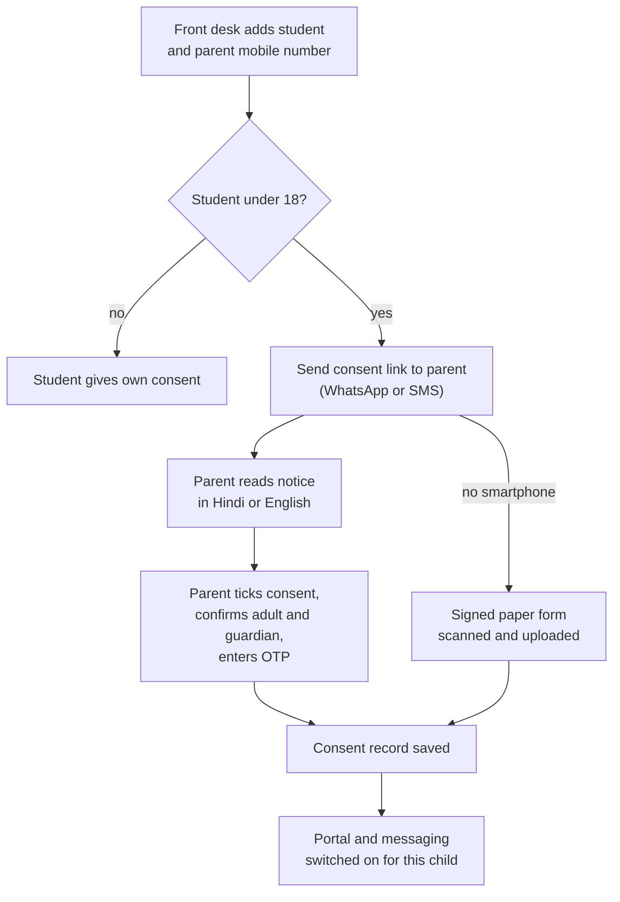

# Compliance, Legal and Data Protection Requirements

**In simple words:** EduFlow stores data about children, moves fee money and sends messages to parents. Each of these three things is controlled by law. This chapter lists the laws in India, the USA, Australia and the UAE, says in plain words what each one asks, and turns each into a product feature or a company process with a phase. It ends with a numbered requirements table, the contracts we need, a data hosting plan and a year-by-year roadmap.

> **Warning:** This chapter is a planning guide. It is not legal or tax advice. The laws were checked against public sources in September 2026, and they change often. Before the paid launch, a lawyer must review every contract and privacy notice, and a CA (chartered accountant) must confirm every tax point.

## How to read this chapter

Every law below gets the same four answers: what it says, who it applies to, what EduFlow must do (product and company process), and the phase. The phase labels are:

| Label | Meaning | Dates |
|---|---|---|
| P1 | MVP sprint and free pilot | 5 Oct to 3 Dec 2026; pilot from 18 Nov 2026 |
| Launch | Paid launch in India | January 2027 |
| P2 | V1.0 modules | By 1 Feb 2027 |
| P3 | V1.5 modules | By June 2027 |
| Y2 | UAE entry | Oct 2027 to Sep 2028 |
| Y3 | USA and Australia pilots | Oct 2028 to Sep 2029 |

Three legal words appear again and again:

- **Data principal** — the person the data is about, for example Aarav Sharma. For a child, the parent acts for the child.
- **Data fiduciary** — the party that decides why and how the data is used. GDPR (the European privacy law) calls this the "controller".
- **Data processor** — a party that handles the data for the fiduciary under a contract.

## Who is responsible for what

EduFlow wears two hats. For student data inside a tenant it is a processor. For its own customer and sales data it is a fiduciary.

| Data | Fiduciary | Processor | Example |
|---|---|---|---|
| Student, parent and staff records inside a tenant | The institute | EduFlow | Aarav's marks at Bright Future Public School |
| Institute owner account, billing, support tickets | EduFlow | Razorpay, Amazon SES | Rajesh Sharma's login and GST invoice |
| Website visitors and sales leads | EduFlow | PostHog, email tools | A demo request form |
| Fee payment details | The institute | Razorpay (its own regulated role) | Sunita Devi's UPI payment |

What this split means in daily work:

1. The institute collects consent from parents. EduFlow gives it the tool to ask, record and prove that consent.
2. A parent's request goes to the institute first. Example: Sunita Devi asks EduFlow support to delete Aarav's data. Support replies within 2 working days, passes the request to the `ORG_ADMIN` of Bright Future and logs it. EduFlow deletes only on the institute's instruction.
3. The fiduciary stays answerable even for its processor's mistakes. So institutes will ask for a strong Data Processing Agreement, and we keep one ready.
4. After a breach at EduFlow, we tell the affected institutes fast. They tell the regulator and the parents, using our draft texts and record lists.

> **Rule:** EduFlow never uses tenant data for its own purposes. No advertising, no selling, no sharing, and no AI model training on identifiable student data unless the institute opts in by written contract.

## India: data protection and cyber security

### DPDP Act 2023 and DPDP Rules 2025

**What it says.** The Digital Personal Data Protection Act 2023 is India's main privacy law. It covers personal data in digital form. The government notified the DPDP Rules on 14 November 2025 and switched the law on in three steps.

| Date | What starts | Meaning for EduFlow |
|---|---|---|
| 14 Nov 2025 | Data Protection Board of India is set up; basic provisions | The regulator exists |
| 14 Nov 2026 | Consent Managers can register (services that let a person manage consents across apps) | Nothing to build now |
| 14 May 2027 | Main duties: notice, consent, security, breach reporting, children's data, rights, retention | Full compliance is due 4 months after our paid launch |

**Who it applies to.** Anyone who processes digital personal data in India, and anyone abroad who offers goods or services to people in India. That covers every institute on EduFlow and EduFlow itself.

> **Founder note:** Build the consent and notice features in P1, not in 2027. Adding consent later to 60,000 student records (the Year 1 target) means chasing 60,000 parents. Collecting it at admission costs nothing.

| Topic | What the law says | What EduFlow must do | Phase |
|---|---|---|---|
| Notice | Clear, standalone, plain language; lists data items, purposes, how to withdraw and how to complain | Versioned notice template per institute in *Settings*, English and Hindi; lawyer reviews it once | P1 |
| Consent | Free, specific, informed, given by a clear action; as easy to withdraw as to give | Consent record with person, time, method, notice version and purposes; withdraw button in Parent Portal | P1 |
| Children (under 18) | Verifiable parental consent; no tracking, behavioural monitoring or targeted ads | See the next section | P1 |
| Security safeguards | Encryption, masking, access control, logs, backups, processor contracts | TLS, encryption at rest, role permissions, row-level security, audit log; outside penetration test from Y2 | P1 |
| Breach | Tell affected people and the Board without delay; detailed Board report within 72 hours | Breach register, bulk notice tool, incident runbook | P1 |
| Rights | Access, correction, erasure, grievance redress, nomination; grievance answer in at most 90 days | Per-student export, correction flow, erasure with legal-hold check; our own target is 30 days | P2 |
| Retention | Erase when the purpose is over unless a law needs the data; keep processing logs at least 1 year | Retention schedule run by scheduled jobs; 1-year log storage | P2 |
| Contact point | Publish who answers privacy questions | Privacy contact on login pages and notices; the founder in Year 1 | Launch |
| Cross-border | Allowed, except to countries the government restricts later | Files in Mumbai from day 1; database follows the data residency plan | P1 |
| Significant Data Fiduciary | Large or risky fiduciaries named by government need an India-based DPO (data protection officer), a yearly audit and an impact assessment | Nothing now; plan for Year 4 to 5 | Y4 |

#### Children's data and verifiable parental consent

Most people in the EduFlow database are under 18. So this is the most important privacy rule for us.

The law says a fiduciary must get the parent's verifiable consent before it processes a child's data. The Rules accept three ways to check that the adult is real: identity and age details the fiduciary already holds, details the parent gives voluntarily, or a virtual token from an authorised service such as DigiLocker.

The Fourth Schedule of the Rules gives educational institutions a narrow exemption. They may track and monitor behaviour for educational activities and for the safety of enrolled children. Attendance, marks analysis and school bus location fit here. The exemption does not remove the duty to give a notice. Whether a coaching institute counts as an "educational institution" is not clear (Assumption: it may not). So EduFlow records parental consent for every student under 18, in schools and in coaching.

**Figure: Parental consent flow at admission**

The parent proves control of the mobile number with an OTP (one-time password) and declares that she is an adult and the guardian. The institute also meets her in person at admission. Both facts together are our "verifiable" method.

Worked example: Sunita Devi gives consent for Aarav Sharma (`BF-2027-0142`). The consent link is the only message allowed before consent. The system saves guardian, student, date and time, IP address, channel, notice version `v1.2` and the purpose list. Until then Aarav's record shows "Consent pending", and the institute's dashboard lists it with reminders on day 3 and day 7.

Other child-safety requirements:

- Optional purposes have separate switches: the child's photo on the institute's website or social media, and promotional messages.
- No product analytics (PostHog), session replay or advertising code runs for `STUDENT` accounts. `PARENT` sessions send only anonymous events with no child identifiers.
- When a student turns 18, the Student Portal asks him to confirm consent in his own name (P2).
- Withdrawal stops optional processing at once. Records the institute must keep by law (fee receipts, board exam records) stay, and the screen tells the parent why.

#### Penalties under the DPDP Act

| Failure | Maximum penalty |
|---|---|
| No reasonable security safeguards | ₹250 crore |
| Breach not reported to the Board or to affected people | ₹200 crore |
| Children's data duties not met | ₹200 crore |
| Extra duties of a Significant Data Fiduciary not met | ₹150 crore |
| Any other breach of the Act or Rules | ₹50 crore |

These are ceilings. The Board looks at how serious and how long the failure was, and what the company did to reduce harm. The Year 1 ARR target is ₹72 lakh, so even a penalty of 1% of the ceiling would end the company. Institutes will also claim their losses from EduFlow under the contract.

### IT Act 2000 and CERT-In incident reporting

**What it says.** The Information Technology Act 2000 is the base law for digital business in India. It makes click-accept contracts valid, punishes hacking and data theft, and lets a victim claim compensation when a company is careless with sensitive data (section 43A, which the DPDP Act replaces once it is fully in force).

CERT-In (the Indian Computer Emergency Response Team) issued binding directions under this Act on 28 April 2022:

| CERT-In direction | What EduFlow must do | Phase |
|---|---|---|
| Report listed cyber incidents within 6 hours of noticing them | Runbook with the CERT-In form ready; S1 alerts reach the founder's phone day and night | P1 |
| Keep system logs for a rolling 180 days, ready for CERT-In | Central log storage for 365 days, which also meets the DPDP 1-year rule | P1 |
| Sync all system clocks to a traceable time source | Cloud provider time sync on every server | P1 |
| Name a point of contact | Register the founder's details with CERT-In | Launch |
| Give information when CERT-In orders it | Log search answers "who accessed what, when" in under 1 hour | P1 |

Reportable incidents include data breaches, unauthorised access, ransomware, denial-of-service attacks, website defacement, attacks on cloud applications, phishing and compromised accounts.

**Who it applies to.** Service providers, intermediaries, data centres and companies in India. EduFlow is covered from the pilot onward.

### One incident, many clocks

Worked example. On a Monday at 10:00 a Sentry alert shows that one API call returned Sharma Classes' students to a user of another institute. *Customer Success, Onboarding and Support* already classes this as severity S1. The legal clocks start at the moment we notice.

| Clock | Deadline | Action | Owner |
|---|---|---|---|
| T+0 | Mon 10:00 | Open incident record; freeze and copy logs | On-call engineer |
| T+1 hour | Mon 11:00 | Contain: switch off the endpoint, revoke sessions, rotate keys | Founder |
| T+6 hours | Mon 16:00 | CERT-In report with the facts known so far | Founder |
| T+24 hours | Tue 10:00 | Written notice to the `ORG_ADMIN` of every affected institute (our DPA promise) | Founder |
| Without delay | Same or next day | Institutes inform the Board and affected parents; EduFlow supplies drafts and record lists | Institute, helped by EduFlow |
| T+72 hours | Thu 10:00 | Detailed report to the Board: cause, extent, fixes, notices sent | Institute and EduFlow |
| T+7 days | Next Mon | New York schools: vendor notice deadline under Ed Law 2-d (Y3 only) | Founder |
| T+30 days | — | Written review sent to affected customers; fixes tracked to closure | Founder |

The CERT-In report is needed for any listed cyber incident, even when no personal data leaked. The privacy notices are needed only when personal data is affected.

## India: tax rules

### GST on the EduFlow subscription

**What it says.** GST (goods and services tax) applies to software sold as a service at 18%. The canon prices exclude tax, so every Indian invoice adds 18%. **Who it applies to:** EduFlow as the seller.

| Point | Rule | EduFlow decision |
|---|---|---|
| Rate | 18% on the subscription and all add-ons | Separate line on every invoice |
| SAC code (services accounting code, the GST label for a service) | SaaS sellers commonly use 997331 (software licensing) or 998315 (hosting and IT infrastructure); both are 18% | Use 997331 (Assumption; the CA confirms before the first invoice) |
| Registration | Compulsory when service turnover crosses ₹20 lakh a year | Register before the January 2027 launch; customers want GST invoices and exports need it |
| Tax split | Customer in EduFlow's home state: CGST 9% + SGST 9%. Other states: IGST 18% | Billing reads the state from the customer's GSTIN or address |
| Returns | GSTR-1 (sales) and GSTR-3B (summary), monthly or quarterly | CA files; founder exports the invoice register on the 1st of each month |
| E-invoicing (each B2B invoice gets a government reference number and QR code) | Compulsory once turnover crosses ₹5 crore in any financial year. A cut to ₹2 crore is discussed but not notified | Not needed in Year 1 or 2. Build it during Year 3, before turnover nears ₹5 crore |
| Exports | Sales to the UAE, USA and Australia are zero-rated if a LUT (letter of undertaking) is filed yearly and payment arrives in foreign currency | File the LUT every April from Y2 |
| TDS (tax deducted at source) | Larger customers may deduct 2% or 10% from the payment and give a certificate | Billing accepts a short payment marked "TDS" and stores the certificate |

Worked example: Sharma Classes in Patna buys Growth yearly. The invoice shows ₹24,990.00 + GST 18% ₹4,498.20 = ₹29,488.20. Sharma Classes is GST-registered, so it claims the ₹4,498.20 back as input tax credit. Its real cost is ₹24,990.

### GST position of school fees versus coaching fees

This matters twice: for how the *Fees* module prints receipts, and for how we sell.

| Supply | GST | Basis |
|---|---|---|
| School fees, pre-school to Class 12, recognised school | Exempt | Notification 12/2017-Central Tax (Rate), entry 66 |
| Transport and canteen the school gives its own students | Exempt | Same entry |
| Coaching fees (JEE, NEET, tuition, test series) | 18%, SAC 999293 | Coaching is not an "educational institution" in the notification; a 2026 Gujarat advance ruling says the same |
| Coaching institute with turnover under ₹20 lakh | No GST | Below the registration threshold |
| Books and uniforms sold by the institute | Goods rates, item by item | The institute's CA decides |
| EduFlow subscription sold to a school | 18%; the school cannot claim it back | Software is not in the list of exempt services to schools |

Product requirements from this table (all P1, because the *Fees* module ships in the MVP):

1. Every fee head carries a tax setting: `Exempt`, or a GST rate with a SAC code. The default is `Exempt` for `SCHOOL` tenants and 18% for `COACHING` tenants that enter a GSTIN.
2. Receipts of a GST-registered institute show its GSTIN, the SAC code, the taxable value and the CGST/SGST or IGST split.
3. A fee refund creates a credit note with the tax reversed.

Worked example: Sharma Classes charges ₹60,000 for a one-year JEE course. The receipt shows ₹60,000 + GST ₹10,800 = ₹70,800. With 350 students its turnover is about ₹2.1 crore, far above the ₹20 lakh threshold.

> **Tip:** Quote coaching institutes the price before GST, because they get the tax back. Quote schools the full price. For Bright Future Public School, Pro yearly costs ₹59,990 + ₹10,798.20 = ₹70,788.20.

## India: messaging rules

### TRAI DLT rules for SMS

**What it says.** TRAI (the telecom regulator) runs the TCCCPR 2018 rules against spam. Every business SMS must pass through a DLT platform (a shared register run by the telecom operators). Three things are registered: the sender as a Principal Entity, the 6-character header (sender name) and the exact template of each message. Since October 2024 every link must be whitelisted and every variable tagged. Since 2025 operators add a suffix to the header: `-T` transactional, `-S` service, `-P` promotional, `-G` government.

**Who it applies to.** Anyone who sends business SMS in India: EduFlow and, through it, every institute.

| EduFlow must do | Phase |
|---|---|
| Register EduFlow as a Principal Entity through MSG91, with a header (proposed: `EDUFLW`), 3 weeks before the SMS module ships | P2 |
| Pre-register about 25 service templates (fee due, fee received, absent today, exam date, OTP) with the institute name as a tagged variable | P2 |
| Block free-text SMS; institutes pick only approved templates | P2 |
| Let Pro and Enterprise institutes use their own entity ID, header and template IDs | P3 |
| No promotional SMS in Year 1. If added later: only 10:00 to 21:00, never to DND-blocked numbers | Later |

The operator silently drops an unregistered template. The institute still pays ₹0.25 and the parent gets nothing.

> **Note:** The same TRAI rules cover sales calls. Before more than two people make outbound calls, check the telemarketer registration and 140-series number rules with a lawyer, as *Go-to-Market Strategy* notes.

### WhatsApp Business policy and opt-in

**What it says.** Meta's WhatsApp Business Messaging Policy is a contract, not a law. Breaking it gets the number blocked. The main rules:

1. Message only people who opted in. The opt-in must name the business and the WhatsApp channel.
2. Business-initiated messages use pre-approved templates in three categories: utility, authentication and marketing. A fee reminder mixed with an offer counts as marketing.
3. Since 1 July 2025 Meta charges per delivered template message. Replies inside the 24-hour window after a parent writes are free.
4. Opt-out must be easy and honoured. Meta rates each number's quality from user blocks and reports, and a low rating cuts the daily sending limit.

**Who it applies to.** Every business on the WhatsApp Business Platform: EduFlow and each institute that sends through it.

| EduFlow must do | Phase |
|---|---|
| Opt-in tick box on the admission form and Parent Portal; store date, source and wording | P1 |
| A reply of `STOP` opts the parent out at once; the system falls back to in-app notices | P1 |
| Map each template to the right Meta category; marketing needs its own opt-in | P1 |
| Per-tenant daily caps; nothing sent from 21:00 to 08:00 except OTPs and safety alerts | P1 |
| No sensitive data in messages (full marks list, medical notes, bank details); send a portal link | P1 |
| Finish Meta business verification in the company's name before the pilot | P1 |

## India: payments

**What it says.** The Reserve Bank of India (RBI) regulates anyone who collects money for merchants. Its Payment Aggregator rules (one Master Direction since 15 September 2025) demand a licence, minimum net worth, merchant KYC (identity checks) and escrow accounts. Since 1 October 2022 merchants and aggregators may not store card numbers. Saved cards work only through tokens issued by card networks.

**Who it applies to.** Razorpay is the licensed aggregator. EduFlow must make sure it never becomes one by accident.

| Requirement | How EduFlow meets it | Phase |
|---|---|---|
| Never pool fee money | Each institute is its own Razorpay merchant. Money moves from parent to Razorpay to the institute's bank. It never touches an EduFlow account | P1 |
| Institute KYC | Done by Razorpay at merchant onboarding; EduFlow stores only the linked account ID | P1 |
| No card data | Razorpay's hosted checkout collects card and UPI details. EduFlow stores payment ID, method, last 4 digits and status | P1 |
| Webhook safety | Verify Razorpay's signature on every webhook; `Idempotency-Key` on payment-creating calls | P1 |
| Recurring subscription debits | RBI e-mandate rules: a notice 24 hours before each debit, and extra approval above ₹15,000. Razorpay handles both; a yearly Pro renewal (₹59,990 plus GST) asks for approval each time | Launch |

> **Warning:** A tempting shortcut is to collect all parents' fees into EduFlow's account and pay institutes weekly. That is payment aggregation and needs an RBI licence. Do not build it.

## India: education and consumer rules

### Ministry of Education guidelines for coaching centres

**What it says.** In January 2024 the Ministry of Education sent all states its "Guidelines for Registration and Regulation of Coaching Centre 2024". States adopt them through their own laws, so details differ by state. **Who it applies to:** our primary customers, not EduFlow. We help them comply, and that is a selling point.

| Guideline | EduFlow feature that helps | Phase |
|---|---|---|
| No enrolment under 16 years, or before the secondary school exam | Admission form warns when the age is under 16 in a `COACHING` tenant; the owner may turn the warning into a block | P1 |
| Receipt for every payment; fees not raised mid-course | Numbered receipts; fee structure locked per enrolment | P1 |
| Pro-rata refund within 10 days when a student leaves mid-course, hostel and mess fees included | Refund calculator in *Fees*; task with a 10-day due date | P1 |
| Website with tutor qualifications, courses, duration, fees and refund policy | Public institute page built from *Settings* data | P2 |
| Classes at most 5 hours a day; a weekly day off | Timetable check that warns on a breach | P2 |
| Records of students, tutors and fees ready for inspection | One-click export of each register | P1 |
| Penalty: ₹25,000 first offence, ₹1 lakh second, then registration cancelled | Sales message: "EduFlow keeps you inspection-ready" | Launch |

Worked example: a student of Sharma Classes pays ₹60,000 for 12 months and leaves after 4 months. Refund = ₹60,000 × 8 ÷ 12 = ₹40,000, due within 10 days. The credit note also reverses ₹7,200 of GST.

### Holding back results or certificates for unpaid fees

Several state rules and court orders stop schools from holding back a transfer certificate or a result because fees are unpaid. So the setting described in *Business Requirements Catalog* (`BR-060`) stays off by default and shows a caution text. The institute owns that decision and its legal risk.

### Consumer Protection Act 2019

**What it says.** Buyers may complain about poor service and unfair trade practices. The E-Commerce Rules 2020 add duties for online sellers. The Dark Patterns Guidelines 2023 ban tricks such as pre-ticked add-ons, false urgency and hidden cancel buttons.

**Who it applies to.** A company that buys software for business use is usually not a "consumer". A self-employed tutor can be one, and so can a parent who pays an institute. We follow the rules for everyone.

| EduFlow must do | Phase |
|---|---|
| Show legal name, address, email, phone and the grievance officer's name on the website | Launch |
| Acknowledge a complaint within 48 hours; resolve it within 1 month | Launch |
| Show the total price with tax before payment; no pre-ticked add-ons | Launch |
| Cancel in as few clicks as subscribe | Launch |
| Publish and honour the refund policy from *Pricing Strategy* (30-day money-back on the first yearly purchase) | Launch |
| Let each institute print its own fee refund policy on the admission form | P1 |

### Company law basics

| Item | Decision | When | Cost (Estimate) |
|---|---|---|---|
| Legal form | Private Limited company (Companies Act 2013). Needed for Razorpay, Meta verification, DLT, contracts and a future seed round | October 2026, before the pilot | ₹15,000 to ₹25,000 |
| Directors and shareholders | The law needs 2 of each: the founder plus one trusted family member with a small stake | At incorporation | Included |
| Registrations | PAN, TAN, current account, GST, Udyam (small business), DPIIT startup recognition, shops and establishment licence | Oct to Dec 2026 | ₹2,000 to ₹8,000; most are free, the CA charges for GST |
| Trademark | "EduFlow" word and logo in classes 9 and 42 | October 2026 | About ₹4,500 per class government fee for a recognised startup, plus agent fee |
| Yearly compliance | Statutory audit, annual general meeting, annual filings (AOC-4, MGT-7), director KYC, tax return, board meetings | Every year | ₹40,000 to ₹80,000 |
| People | Contract with an IP (intellectual property) assignment clause for every employee and freelancer | Before the first hire | ₹10,000 one-time |
| Later thresholds | Provident fund at 20 employees; ESI and the POSH Act complaints committee at 10 | Year 2 | CA and HR advice |
| Foreign receipts | Export payments follow FEMA rules through the bank. Stripe may need a foreign entity (Assumption: a UAE free-zone or US company, decided with the CA) | Y2 | ₹3 lakh to ₹6 lakh |

## USA

The USA has no single privacy law. A school software vendor meets federal laws, state laws and the district's own contract. All items below are due before the first US pilot in Y3. The design choices behind them (no ads, no tracking of children, encryption, audit logs) are already P1 work for India.

| Law | What it says | Applies to | EduFlow must do |
|---|---|---|---|
| FERPA (Family Educational Rights and Privacy Act) | Schools that get federal funds must protect education records. Parents may see and correct them within 45 days. A vendor may receive records without parent consent only as a "school official" | Funded schools directly; vendors through the contract | Contract says: we do a job school staff would otherwise do, the school keeps direct control of the records, we use them only for that job and never re-share. Product: per-student export, disclosure log, deletion at contract end |
| COPPA (Children's Online Privacy Protection Act) | Verifiable parental consent before collecting data online from children under 13. A school may consent for parents, for educational use only. Amended rule in force 23 June 2025; full compliance due 22 April 2026 | Online services used by under-13s | School-consent clause; written security programme and retention policy; no third-party trackers or ads in student views |
| California SOPIPA | No targeted ads to students, no profiles except for school purposes, no selling of student data; delete when the school asks | K-12 services used by California students | The same "no ads, no sale" rule as India, in the contract; deletion within 30 days of a school's request |
| New York Education Law 2-d (Part 121) | Contract must include the Parents' Bill of Rights, a security plan aligned with the NIST Cybersecurity Framework, encryption in transit and at rest, staff training, and breach notice to the school within 7 calendar days | Vendors to New York schools | New York contract rider; NIST mapping document; yearly staff training with records |
| Other states | More than 40 states have student-privacy laws (Estimate). Many districts use the National Data Privacy Agreement (NDPA) | Vendors to public schools | Sign the NDPA as offered; keep a register of signed riders |
| PCI DSS (card industry security standard) | Anyone who touches card data must meet the standard | Merchants and service providers | Stripe hosted checkout keeps card data off our servers; file the shortest self-assessment (SAQ A) yearly |
| Accessibility: WCAG 2.1 AA, Section 508, ADA Title II | Public schools must make web and mobile content meet WCAG 2.1 level AA. Deadlines after the 2026 extension: 26 April 2027 for large public bodies, 26 April 2028 for small ones. Federal buyers use Section 508 | Public schools, and so their vendors | Accessibility checks in the build from P1 (contrast, keyboard use, labels); outside audit and a VPAT (accessibility report) before the US pilot |
| Sales tax on SaaS | Each state decides. Texas, New York, Pennsylvania and Washington tax SaaS; California does not. A seller registers once its sales in a state cross the "economic nexus" line, often US$100,000 a year (US$500,000 in California, Texas and New York) | Sellers above a state's threshold | Stripe Tax; exemption certificates from public schools, which are usually tax-exempt; quarterly threshold review |

Worked example: 51 private schools in Pennsylvania on Pro yearly pay 51 × US$1,990 = US$101,490. That crosses Pennsylvania's US$100,000 line, so EduFlow registers there and adds 6% state sales tax to later invoices. Year 3 targets only 100 international customers in total, so this is a Year 4 to 5 event.

> **Note:** Most private US schools do not receive federal funds, so FERPA may not bind them directly. They still expect FERPA-style contract terms. We offer the same terms to every US customer.

## Australia

All items below are due before the first Australian pilot in Y3. Only the Children's Online Privacy Code needs watching earlier, because its final text arrives in Year 1.

| Rule | What it says | Applies to | EduFlow must do |
|---|---|---|---|
| Privacy Act 1988 and the 13 Australian Privacy Principles (APPs) | Open privacy policy, collect only what is needed, use for the stated purpose, keep secure (APP 11), give access and correction. APP 8: whoever sends data overseas stays liable for the overseas handler | Organisations with turnover above A$3 million, and their contracted providers; private schools are covered | Australia privacy addendum; data stays in the Sydney region, so APP 8 questions are avoided |
| 2024 amendment Act | New right to sue for serious invasion of privacy (from June 2025); stronger regulator powers; a Children's Online Privacy Code. The OAIC published the draft on 31 March 2026 and must register the final Code by 10 December 2026 | Online services likely to be used by children, educational tools included | Review the final Code in early 2027; our India child rules (no tracking, no ads) should already meet it (Estimate) |
| Notifiable Data Breaches scheme | For a breach likely to cause serious harm: assess within 30 days, then notify the OAIC (the privacy regulator) and affected people as soon as practicable. Serious or repeated failures can cost up to A$50 million | Entities under the Privacy Act | Same incident runbook; our 72-hour habit is stricter than the 30-day limit |
| State education departments and ST4S | Government schools follow state privacy laws. Departments and many private schools ask vendors to pass ST4S (Safer Technologies 4 Schools), a national security and privacy assessment that also asks where data is hosted | Vendors to schools | Host in AWS Sydney (`ap-southeast-2`); complete the ST4S readiness check before the pilot; apply for full assessment after 10 customers |
| GST 10% | A non-resident seller registers once Australian sales cross A$75,000 a year. Sales to GST-registered businesses are reverse-charged (the buyer accounts for the tax) | Overseas sellers of digital services | Collect each school's ABN (business number) and GST status at signup; charge 10% only to unregistered buyers once we are registered |
| Australian Consumer Law | Guarantees on quality cannot be removed by contract. It also covers business purchases under A$100,000 | All sellers | Refund page says our policy is "in addition to your rights under the Australian Consumer Law"; a local lawyer reviews it |

## UAE

All items below are due before the first UAE sale in Y2. The first UAE customers are Indian-curriculum schools, so the product is the same and only the legal pack changes.

| Rule | What it says | Applies to | EduFlow must do |
|---|---|---|---|
| PDPL (Federal Decree-Law 45 of 2021) | GDPR-style law: lawful basis or consent, purpose limits, security, rights, breach notice to the UAE Data Office, limits on sending data to countries without adequate protection. Public legal guides in 2026 report that the Executive Regulations are still awaited; firms get 6 months after they are issued | Anyone processing data of people in the UAE. The DIFC and ADGM free zones have their own data laws | UAE privacy addendum in English and Arabic; records of processing; watch for the Executive Regulations |
| Child Digital Safety Law (Federal Decree-Law 26 of 2025) | In force 1 January 2026 with one year to comply, so it is fully enforceable before our UAE entry. Platforms need verified parental consent for data of children under 13 and may not use children's data for advertising | Digital platforms that operate in or target the UAE | Reuse the India parental consent flow; legal review of how the law treats school software (Assumption: the school-led consent model is accepted) |
| KHDA (Dubai) and ADEK (Abu Dhabi) expectations | The school regulators hold schools responsible for student data and digital safety. ADEK's School Digital Policy asks schools to vet every vendor's privacy and security | Private schools, and so their vendors | One vendor pack: security summary, DPA, hosting location, breach process, sub-processor list |
| Data location | No general law forces local hosting; the strict rule covers health data. Schools and regulators still prefer in-country hosting | Vendors | AWS UAE region (`me-central-1`) by the trigger in the data residency plan; keep student medical notes minimal |
| VAT 5% | A UAE-resident business registers above AED 375,000 a year. A foreign seller to VAT-registered businesses uses reverse charge. A foreign seller to unregistered buyers must register from the first dirham | Sellers to UAE customers | Collect each school's TRN (tax registration number); sell only to TRN holders until a UAE entity exists; then charge 5% on invoices |

## Global baseline: GDPR principles

GDPR (the European Union's General Data Protection Regulation) does not apply to EduFlow today, because we do not target Europe. We still use its seven principles as the floor in every country. A product that meets them needs only small changes for each new law.

| Principle | What it means | EduFlow control |
|---|---|---|
| Lawful, fair, transparent | Tell people what you do, and have a legal reason | Versioned notices; consent records |
| Purpose limitation | Use data only for the stated purpose | Tenant data is never used for ads, sale or model training |
| Data minimisation | Collect only what is needed | Optional fields stay optional; no Aadhaar number field by default |
| Accuracy | Keep data correct | Parents can ask for corrections in the portal; the institute approves |
| Storage limitation | Do not keep data for ever | Retention schedule and archive jobs |
| Integrity and confidentiality | Keep data secure | Encryption, permissions, row-level security, audit log, backups |
| Accountability | Be able to prove all of the above | Processing records, DPA register, incident register, training log |

One service standard covers every country's rights rules: acknowledge a privacy request within 2 working days and finish it within 30 days. This beats the DPDP limit of 90 days, the FERPA limit of 45 days and GDPR's one month. Breach notice follows the strictest clock in the incident table.

## Compliance requirements table

Type says whether the item is a product feature, a company process, or both. "Engineering" is the founder with Claude Code in Year 1.

| ID | Requirement | Source | Type | Phase | Owner |
|---|---|---|---|---|---|
| CR-01 | Publish Terms of Service, Privacy Policy, refund policy and grievance contact | DPDP, Consumer Protection Act | Process | Launch | Founder, lawyer |
| CR-02 | Every paying institute accepts the Data Processing Agreement | DPDP, GDPR baseline | Process | Launch | Founder |
| CR-03 | Notice templates per tenant, versioned, English and Hindi | DPDP | Product | P1 | Engineering |
| CR-04 | Verifiable parental consent record for every student under 18 (`BR-020`) | DPDP | Product | P1 | Engineering |
| CR-05 | Consent withdrawal and separate switches for optional purposes | DPDP | Product | P1 | Engineering |
| CR-06 | No analytics, session replay or ads on `STUDENT` accounts; no child identifiers in `PARENT` events | DPDP, COPPA, SOPIPA, UAE child law | Product | P1 | Engineering |
| CR-07 | Per-student export (PDF, CSV), correction flow, erasure with legal-hold check | DPDP, FERPA, SOPIPA, APPs | Product | P2 | Engineering |
| CR-08 | Tenant isolation: organization filter plus row-level security, tested on every release | DPDP security duty | Product | P1 | Engineering |
| CR-09 | Encryption in transit and at rest; secrets outside the code | DPDP, NY Ed Law 2-d | Product | P1 | Engineering |
| CR-10 | Audit log of logins, exports, permission changes and sensitive views; central logs kept 365 days; clocks synced | DPDP, CERT-In, FERPA | Product | P1 | Engineering |
| CR-11 | Incident runbook (CERT-In 6 hours, institutes 24 hours, Board report 72 hours); breach register; yearly drill | CERT-In, DPDP, NDB scheme | Process | P1 | Founder |
| CR-12 | Daily backups, 35-day retention, restore test each quarter | DPDP security duty | Process | P1 | Engineering |
| CR-13 | Retention schedule run by scheduled jobs | DPDP, GDPR baseline | Product | P2 | Engineering |
| CR-14 | Public sub-processor list; 30-day notice before a change | DPA promise | Process | Launch | Founder |
| CR-15 | GST registration; invoice with GSTIN, SAC code and tax split; LUT every April from Y2 | GST law | Both | Launch | Founder, CA |
| CR-16 | Tax setting per fee head; GST receipts and credit notes for institutes | GST law | Product | P1 | Engineering |
| CR-17 | E-invoicing for EduFlow's own invoices | GST law | Product | Y3 | Engineering, CA |
| CR-18 | DLT entity, header and templates; template-only SMS | TRAI TCCCPR | Both | P2 | Founder |
| CR-19 | WhatsApp opt-in record, `STOP` handling, category mapping, quiet hours | Meta policy | Product | P1 | Engineering |
| CR-20 | Fee money never pooled; no card data stored; hosted checkout; webhook signature checks | RBI rules, PCI DSS | Product | P1 | Engineering |
| CR-21 | Coaching helpers: under-16 warning, 10-day refund task, register exports | MoE guidelines 2024 | Product | P1 | Engineering |
| CR-22 | Total price with tax, no pre-ticked add-ons, easy cancel, complaint reply in 48 hours | Consumer Protection Act | Both | Launch | Founder |
| CR-23 | Company incorporated; trademark filed; IP assignment in every work contract | Companies Act | Process | P1 | Founder, CA |
| CR-24 | Privacy and security training at joining and yearly, with records | NY Ed Law 2-d, DPDP | Process | Launch | Founder |
| CR-25 | Production access: least privilege, two-step login, every `SUPER_ADMIN` tenant visit logged with a reason; demo tenants hold only fake data | DPDP, FERPA | Both | P1 | Engineering |
| CR-26 | Yearly penetration test by a CERT-In empanelled auditor | DPDP security duty | Process | Y2 | Founder |
| CR-27 | Regional hosting for UAE, USA and Australia tenants | PDPL, school contracts, ST4S | Product | Y2 to Y3 | Engineering |
| CR-28 | UAE pack: English and Arabic addendum, TRN capture, VAT invoices | PDPL, UAE VAT | Both | Y2 | Founder, lawyer |
| CR-29 | USA pack: NDPA, New York rider, VPAT, WCAG 2.1 AA audit, Stripe Tax | FERPA, COPPA, state laws | Both | Y3 | Founder, lawyer |
| CR-30 | Australia pack: privacy addendum, ST4S readiness check, ABN and GST capture | Privacy Act, GST | Both | Y3 | Founder, lawyer |
| CR-31 | ISO 27001 certificate, then a SOC 2 Type II report (outside security audits that large buyers ask for) | Buyer expectation | Process | Y2 to Y3 | Founder |
| CR-32 | Significant Data Fiduciary readiness: India-based DPO, yearly audit, impact assessment | DPDP | Process | Y4 | Compliance lead |

## Contracts the company needs

| Document | Purpose | Key clauses | Ready by |
|---|---|---|---|
| Terms of Service | The click-accept contract with every institute | Licence, plan limits, acceptable use, payment and suspension, liability capped at fees paid in the last 12 months, Indian law, 30-day notice of changes | Pilot (18 Nov 2026) |
| Privacy Policy | Explains EduFlow's own data use and its processor role | Data items, purposes, sub-processors, rights, grievance contact, children's data statement | Pilot |
| Data Processing Agreement (DPA) | Makes EduFlow the institute's processor in writing | Process only on instructions; security annex; sub-processor list; breach notice in 24 hours; help with parent requests; export for 90 days after exit, then deletion; audit by report | Launch |
| Service Level Agreement (SLA) | Enterprise only, as *Business Model* proposes | 99.5% monthly uptime; 4-hour response to urgent tickets; service credit of 5% of the monthly fee per 0.5% missed, capped at 25% (Assumption) | First Enterprise deal |
| Reseller agreement | For partners and referral agents | Commission and its reversal on refund; no right to sign for EduFlow; no access to tenant data unless the institute grants it; brand rules; 30-day exit | First partner |
| Refund policy | Public page required by Razorpay and Stripe | The rules in *Pricing Strategy*; a country note for Australia | Launch |
| Employment and contractor agreement | Protects code and data | Confidentiality, IP assignment, data handling duties | First hire |
| Country addenda | Local legal terms | UAE (English and Arabic), USA (NDPA, New York rider), Australia (APPs, consumer law) | Before each country entry |

Worked example for the SLA: a 30-day month has 43,200 minutes. 99.5% uptime allows 216 minutes of downtime, or 3 hours 36 minutes. Planned maintenance announced 48 hours ahead does not count.

In Year 1 the founder drafts the first four documents from this chapter with Claude Code, and a lawyer reviews them as one set. *Financial Plan and Projections* budgets ₹25,000 for that review in November 2026. A set drafted fully by a law firm costs ₹60,000 to ₹1.2 lakh (Estimate) and is planned for Year 2, before the first Enterprise contract. Do not copy a competitor's terms. They do not match our data flows, and copying is itself a legal risk.

The DPA lists our sub-processors (outside companies that handle tenant data for us):

| Sub-processor | Purpose | Data it sees | Location |
|---|---|---|---|
| Railway | API, workers, database, cache (start stage) | All tenant data | Singapore, the nearest region on offer (checked September 2026) |
| AWS | Files (S3), email (SES); full hosting at scale | Documents, email addresses; later all tenant data | Mumbai; later also UAE, USA, Sydney |
| Vercel | Web app delivery | Page traffic; no database | Global edge network |
| Razorpay, Stripe | Payments | Payer name, contact, amount | India; USA |
| Meta (WhatsApp), MSG91, Twilio | Messages | Phone number, message text | India and global |
| Sentry, Better Stack | Errors and uptime | Technical logs with personal fields masked | USA or EU |
| PostHog | Product analytics | Staff usage events only; no student accounts | EU |

## Data residency plan by country

Data residency means the country where the data physically sits. We use one "regional cell" per country group: a separate copy of the app, database and file store in that region. A tenant is created in one cell and stays there. Data never moves between cells without a planned migration that the institute approves.

| Country | Region | When | Why | Backups |
|---|---|---|---|---|
| India | Files in AWS Mumbai (`ap-south-1`) from day 1. Database on Railway Singapore at the start, then AWS Mumbai | Move in the 100 to 500 customer stage (Year 2), or earlier on a trigger | DPDP has no general local-storage rule today, but buyers expect India hosting | Same region; later a copy in AWS Hyderabad |
| UAE | AWS UAE (`me-central-1`) | When UAE MRR crosses AED 15,000 or a school contract asks for it, whichever is first. Before that: Mumbai cell, disclosed in the DPA | Regulator and school preference | Same region |
| USA | AWS N. Virginia (`us-east-1`) | From the first pilot (Y3) | District contracts expect US hosting | Second US region |
| Australia | AWS Sydney (`ap-southeast-2`) | From the first pilot (Y3) | ST4S and state department expectations; avoids APP 8 liability | AWS Melbourne |

Triggers for an early India move: a customer contract demands India hosting, the government restricts transfers to Singapore, or the first Enterprise deal is signed. A new cell costs about ₹25,000 to ₹40,000 a month at low load (Estimate), which is why the UAE cell waits for revenue.

> **Best practice:** Tell the truth about hosting in every sales call. "Your files are in Mumbai and your database is in Singapore until our AWS move" is a safe sentence. A wrong claim of "100% India hosted" is a contract breach.

### Data retention schedule

| Data | Kept for | Reason |
|---|---|---|
| Active tenant data | As long as the subscription runs | Contract |
| Tenant data after cancellation | Export open for 90 days; deleted by day 180; backups age out 35 days later | DPDP storage limit; `NBR-16` in *Business Requirements Catalog* |
| Inactive free accounts | Warning after 90 days without login; archived at 180 days | Data minimisation |
| Consent records | Life of the student record plus 1 year | Proof for disputes |
| Application, access and security logs | 365 days | CERT-In (180 days) and DPDP (1 year) |
| EduFlow's invoices and accounting books | 8 years | Companies Act and GST record rules |
| Support tickets | 3 years | Dispute handling (Assumption) |
| Backups | Rolling 35 days | Recovery |

Institutes have their own duties to keep fee and exam records. So deletion inside a live tenant is always the institute's decision.

## Compliance roadmap by year

| Year | Milestones | Budget (Estimate) |
|---|---|---|
| Year 1 (Oct 2026 to Sep 2027) | Company, GST and trademark in October 2026. Legal document set by the pilot. CR items marked P1 live by 18 Nov 2026. DLT and Meta verification. Basic outside security test (₹20,000) and incident drill in December 2026. DPDP self-audit in March 2027, before the 14 May 2027 date | ₹1.5 lakh to ₹2.5 lakh |
| Year 2 (to Sep 2028) | AWS Mumbai move. First outside penetration test. UAE pack, LUT and VAT setup. Foreign entity decision. Part-time privacy adviser. ISO 27001 work starts | ₹6 lakh to ₹10 lakh |
| Year 3 (to Sep 2029) | US and Australia cells and packs. WCAG audit and VPAT. ISO 27001 certificate; SOC 2 Type II report. E-invoicing. Stripe Tax | ₹25 lakh to ₹40 lakh |
| Year 4 (to Sep 2030) | Full-time compliance lead and an India-based DPO. Privacy impact assessments for AI Insights. US state tax registrations as thresholds are crossed | ₹60 lakh to ₹90 lakh |
| Year 5 (to Sep 2031) | Ready for Significant Data Fiduciary status. Yearly outside data audit. In-house legal counsel. Review of any new country | ₹1.2 crore to ₹1.8 crore |

Formula: budget = lawyer and CA fees + audits and certificates + compliance tools + compliance salaries. Each budget is between 1% and 3.5% of that year's ARR target in the canon. Change the inputs when real quotes arrive.

The hard external date is 14 May 2027. Everything the DPDP Act needs is planned for January 2027, which leaves a buffer of four months.

## Disclaimer

> **Warning:** The founder is not a lawyer, and Claude Code is not one either. This chapter summarises public information as of September 2026 to plan the product and the budget. Laws, thresholds, deadlines and penalty amounts change. Before launch in each country, a lawyer qualified in that country must review the contracts and privacy documents, and a CA or local tax adviser must confirm the tax treatment. Items marked "Assumption" or "Estimate" come first in that review.

## Key takeaways

- The institute is the data fiduciary and EduFlow is its processor. The DPA, the consent tool and the 24-hour breach notice to institutes make that split work.
- DPDP's main duties start on 14 May 2027. Parental consent, notices, audit logs and the incident runbook are P1 work, because adding them later costs far more.
- One incident can start four clocks: CERT-In in 6 hours, institutes in 24 hours, the Board report in 72 hours, and New York schools in 7 days.
- GST is 18% on our subscription. School fees are exempt and coaching fees carry 18%, so the *Fees* module needs a tax setting on every fee head.
- EduFlow never holds fee money and never stores card data. Razorpay and Stripe carry the RBI and PCI DSS burden.
- SMS needs DLT templates, and WhatsApp needs recorded opt-in. Free-text bulk messaging is blocked by design.
- Each new country adds a pack (contract addendum, hosting region, tax setup), not a new product. The GDPR principles are the common floor.

## Sources

Publisher, title, year. A URL is given only where the page was opened in September 2026. Entries without a URL were read as search-result summaries.

- Shardul Amarchand Mangaldas & Co, "Enforcement of the DPDP Act and notification of the DPDP Rules", 2025. https://www.amsshardul.com/insight/enforcement-of-the-dpdp-act-and-notification-of-the-dpdp-rules/
- Ikigai Law, "A closer look at the DPDP Rules 2025", 2025. https://www.ikigailaw.com/article/647/a-closer-look-at-the-dpdp-rules-2025
- Press Information Bureau, Government of India, "DPDP Rules, 2025 Notified", 2025.
- dpdpa.com, "Rule 14 — Rights of Data Principals" and "Penalties in the DPDP Act 2023 (the Schedule)", 2025.
- Storyboard18, "DPDP Rules carve out key exemptions for healthcare providers, schools and childcare services", 2025.
- CERT-In, "Directions under sub-section (6) of section 70B of the IT Act 2000", 28 April 2022; and Lexology, "2022 CERT-In Directions on Reporting Cyber Incidents", 2022.
- Taxscan, StudyCafe and TaxO, reports on the Gujarat AAR ruling of 28 April 2026 that coaching institutes are outside entry 66 of Notification 12/2017 and fall under SAC 999293, 2026.
- GimBooks and AI Accountant, "Rs 5 crore e-invoice turnover rule in 2026", 2026.
- RegisterKaro and Tax Garden, "GST for software and IT services: rate and SAC codes", 2026.
- Telerivet and Message Central, "India SMS compliance: TRAI DLT registration and TCCCPR guide", 2025 to 2026.
- Meta, "WhatsApp Business Messaging Policy" and "Pricing on the WhatsApp Business Platform", 2025; Twilio, "Notice: Changes to WhatsApp's pricing (July 2025)", 2025.
- Reserve Bank of India, "Master Direction on Regulation of Payment Aggregators", 15 September 2025; Lexology analysis, 2025.
- Ministry of Education, "Guidelines for Registration and Regulation of Coaching Centre 2024", January 2024; reports by India TV, Business Today and Careers360, 2024.
- The News Minute, "Govt issues guidelines for coaching centres, violators to face penalties up to Rs 1 lakh", 2024. https://www.thenewsminute.com/news/govt-issues-guidelines-for-coaching-centres-violators-to-face-penalties-up-to-rs-1-lakh
- Federal Trade Commission, "Children's Online Privacy Protection Rule" (Federal Register, 22 April 2025); Davis Wright Tremaine and Latham & Watkins summaries, 2025.
- Cornell Legal Information Institute, "8 NYCRR Part 121" (New York Education Law 2-d regulations); Ulster BOCES, "Education Law 2-d Rider".
- US Department of Justice, "Extension of compliance dates: accessibility of web information and services of state and local government entities" (Federal Register, 20 April 2026); Jackson Lewis summary, 2026.
- Anrok, Numeral and TaxCloud, "SaaS sales tax by state" and economic nexus guides, 2026.
- OAIC and Attorney-General's Department (Australia), Privacy and Other Legislation Amendment Act 2024 pages; MinterEllison, "OAIC's Children's Online Privacy Code: what to expect", 2025; OAIC, "OAIC releases Exposure Draft of the Children's Online Privacy Code", 2026.
- Education Services Australia, "Safer Technologies 4 Schools (ST4S)" framework pages, 2025.
- Australian Taxation Office, "How Australian GST works" for non-resident businesses; Anrok Australia GST guide.
- DLA Piper, "Data Protection Laws of the World: UAE", page dated January 2025. https://www.dlapiperdataprotection.com/countries/uae-general/law.html
- Chambers and Partners, "Data Protection and Privacy 2026: UAE, Trends and Developments", 2026. https://practiceguides.chambers.com/practice-guides/data-protection-privacy-2026/uae/trends-and-developments
- Latham & Watkins, Baker McKenzie and 9ine, notes on UAE Federal Decree-Law 26 of 2025 on Child Digital Safety, 2026.
- Anrok and Neo Legal, UAE VAT guides for digital services, 2026.
- Railway, "Regions" documentation and community forum, 2026.
- Points with no source above (company law costs, Consumer Protection Act duties, SOPIPA, PCI DSS, GDPR principles, RBI e-mandate limits) come from the authors' general knowledge and are to be verified by the lawyer or CA.

