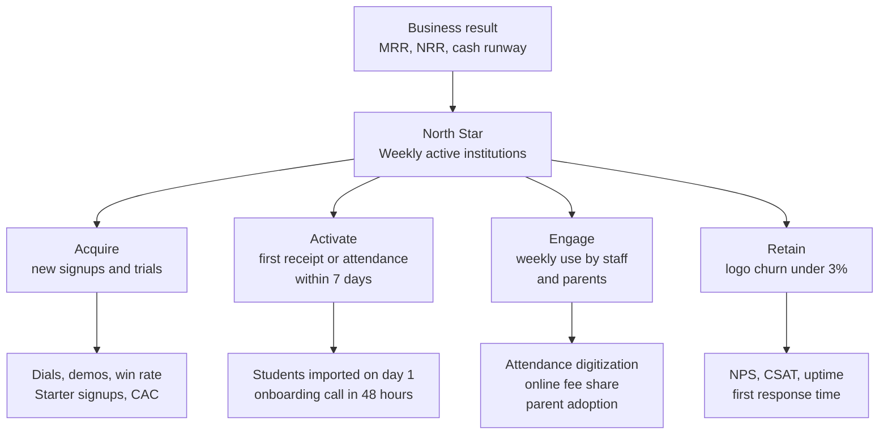

# KPI Framework and Dashboard

**In simple words:** A KPI (key performance indicator) is a number that tells us if the business is healthy. This chapter fixes one formula, one data source, one owner, one target and one red line for every number EduFlow will watch. It also proposes one North Star Metric, draws the founder dashboard and the monthly investor update, and sets the weekly, monthly and quarterly review habit. If another chapter defines a KPI differently, this chapter governs the definition, and *Financial Plan and Projections* governs the money model.

## How the framework works

### Seven rules for every KPI

1. **One definition.** Each KPI has one formula, written in this chapter. Nobody keeps a private version.
2. **One source.** Each KPI is read from one named place. Two sources give two answers and one argument.
3. **One owner.** One person explains the number and acts when it turns red.
4. **A target and a red line.** A number without a target is only a fact. A number without a red line never triggers action.
5. **Show the raw counts.** Write "activation 60% (21 of 35)", never "60%" alone.
6. **Small numbers lie.** When the base is under 20, show counts and do not react to one bad week.
7. **Definitions change only in the quarterly review.** Each change gets a dated note, and the old months are recalculated.

### The nine KPI families

| Family | Question it answers | Main review |
|---|---|---|
| North Star | Do institutes get real value every week? | Weekly |
| Revenue | How much repeat money comes in, and why did it move? | Weekly and monthly |
| Unit economics | Does one customer earn more than it costs to win? | Monthly and quarterly |
| Retention | Do customers stay, and does their spend grow? | Monthly |
| Funnel | Do new signups and trials reach value and then pay? | Weekly |
| Usage and adoption | Do staff and parents really use the product? | Weekly and monthly |
| Happiness and support | Are customers happy, and do we answer fast? | Weekly and monthly |
| Product and engineering | Is the system up, fast and improving? | Weekly |
| Sales and cash | Is the pipeline full, and how long will the money last? | Weekly and monthly |

### Where the numbers come from

| Source | What it holds | KPIs it feeds |
|---|---|---|
| Platform tables `organizations`, `subscriptions`, `subscription_invoices`, `add_on_purchases` | Plans, billing cycle, status, invoices, add-ons | MRR, ARR, MRR movements, ARPA, churn, NRR, conversions |
| Table `daily_metric_snapshots` | Per institute per day: students marked, fees collected, fees collected online | North Star, attendance digitization, online fee share |
| PostHog | Actions of staff and parents, funnels, cohorts | Activation, DAU, WAU, MAU, feature adoption |
| CRM and the call tracking sheet | Leads, dials, demos, trials, wins, lost reasons | Sales KPIs, trial-to-paid, CAC by channel |
| Helpdesk | Tickets with plan, severity, times and ratings | First response, resolution, tickets per account, CSAT |
| In-app survey | One question, score 0 to 10 | NPS |
| Better Stack, Sentry, GitHub Actions | Uptime checks, errors, latency, deploys | Uptime, p95 latency, error rate, deploy frequency |
| Bank statement, Razorpay reports, spend sheet | Cash in, cash out, sales and marketing spend | Burn, runway, collections, CAC |

**Tool decision.** From January 2027 the dashboard is one Google Sheet called "EduFlow KPI Sheet". The founder fills it every Sunday from saved SQL queries, PostHog and the helpdesk. After the March 2027 season review, the same numbers move into a KPI page of the Super Admin platform console (BR-008 in *Business Requirements Catalog*). Reason: a definition must survive one buying season before it deserves build time.

> **Warning:** Students are children. Count student and parent activity on our own server as totals per institute. Never send a child's name, phone number or ID to PostHog, and never build a behaviour profile of a child. The DPDP rules behind this are in *Compliance, Legal and Data Protection Requirements*.

### Who owns the numbers

The tables in this chapter use five owner labels. Until a person is hired, the founder holds that label.

| Owner label | Year 1 person | From Year 2 |
|---|---|---|
| Founder | Mehdi Alam | Founder and CEO |
| Sales | Founder; the sales and marketing person from July 2027 | Head of sales |
| CS | Founder; then the customer success person | Head of customer success |
| Developer | Founder; then the first developer | Engineering lead |
| Finance | Founder with the company's CA | Finance manager (from Year 3) |

The real hiring dates are in *Organization and Hiring Plan*.

## North Star Metric

A North Star Metric is the one number that best shows that customers get real value. When it grows, revenue follows a few months later.

**Proposal: Weekly Active Institutions (WAI).**

> **Rule:** An institution is weekly active if, in the last 7 days, it recorded attendance for at least one batch or collected at least one fee. Free and paying institutions both count. Demo accounts, test accounts and preloaded sample data do not count.

### Why this metric

| Test for a good North Star | How WAI passes |
|---|---|
| It shows customer value | Attendance and fees are the two jobs an institute does every working day. Doing them in EduFlow means the register and the receipt book are gone. |
| It leads revenue | Active free institutes upgrade. Active paying institutes renew. A silent institute cancels later. |
| It moves every week | The founder sees the effect of this week's work next Sunday. |
| The whole team can move it | Sales adds institutes, onboarding activates them, product makes daily work easy, support removes blockers. |
| It is hard to fake | A login does not count. Only a real attendance record or a real receipt counts. |
| It is cheap to compute | One query on `daily_metric_snapshots`: `students_marked` or `fee_collected` above zero in 7 days. |

### Candidates that were rejected

| Candidate | Why it is not the North Star |
|---|---|
| MRR | It is a result and it moves late. With yearly prepaid plans it can look fine while usage dies. |
| Signups | A vanity number. A signup that never marks attendance has no value for anyone. |
| Active students | About 48 Pro and Enterprise customers carry over 60% of students, so small institutes become invisible. |
| Parent monthly active users | Parents can be active only after the institute is active. It is a driver, not the top. |
| Fee value processed | Very seasonal (April admissions, quarterly instalments) and dominated by large schools. |

### Counting rules

1. A week runs from Monday 00:00 to Sunday 23:59 in the institute's own timezone.
2. An organization counts once, even with many campuses.
3. Two rates travel with the count. WAI rate (paying) = active paying institutions ÷ paying institutions; the Year 1 target is 90%. WAI rate (free) = active free institutions ÷ free institutions; the target is 50%.
4. An institute whose academic calendar marks the whole week as vacation leaves the rate's denominator. The raw count still shows the dip. Expect dips in the North India summer break (mid-May to June), in Diwali week and in the winter break.
5. A stronger level, **core active**, means attendance on 3 or more days, or 5 or more receipts, in the week. We record it from day one and set a target for it from Year 2.

> **Example:** Week of 23 to 29 August 2027 (sample data). 94 of 103 paying institutes were active, so the paying rate is 91%. 137 of 262 free institutes were active, so the free rate is 52%. WAI = 94 + 137 = 231. Sharma Classes marked Morning Batch M1 on six days and issued 212 receipts, so it counts. The 9 silent paying institutes each get a call by Tuesday.

Year 1 target: 120 paying × 90% + 300 free × 50% = 108 + 150 = 258, rounded to **260 WAI** on 30 September 2027. Owner: Founder. Source: `daily_metric_snapshots`. Review: weekly.

## KPI tree

A KPI tree shows which smaller numbers push the big number. Read each arrow as "is driven by".

**Figure: KPI tree from business result to North Star to drivers**



Money at the top is a result. It depends on how many institutes use EduFlow every week. That count has four drivers: acquire, activate, engage and retain. The bottom row holds the numbers a person can change with this week's work, so the weekly review starts there.

## Revenue KPIs

In simple words:

- **MRR** (monthly recurring revenue) is the money that repeats every month. It follows the rule in *Business Model* and has three lines: plan fees, recurring add-ons, and the 3-month average of message credits used. A yearly plan counts as the yearly price ÷ 12. One-time fees and GST never count.
- **ARR** (annual recurring revenue) is MRR × 12. It is a run-rate, which means a speed. It is not money already earned.
- **New MRR** comes from institutes that pay for the first time in the month.
- **Expansion MRR** is extra money from existing customers: plan upgrades, new add-ons, more message use.
- **Contraction MRR** is money lost from customers who stay but pay less.
- **Churned MRR** is money lost from customers who cancel.
- **Net new MRR** is the sum of the four movements. It explains why MRR moved.
- **ARPA** (average revenue per account) is MRR ÷ paying institutions.

| KPI | Formula | Year 1 target | Data source | Owner | Review |
|---|---|---|---|---|---|
| MRR | Plan fees + recurring add-ons + average monthly credits used | ₹6 lakh on 30 Sep 2027 | `subscriptions`, `add_on_purchases`, wallet use | Founder | Weekly |
| ARR | MRR × 12 | ₹72 lakh run-rate | MRR | Founder | Monthly |
| New MRR | MRR of first-time payers in the month | About ₹85,000 a month in Q4 | `subscriptions` by start date | Sales | Monthly |
| Expansion MRR | Increase in MRR of existing customers | 3% or more of opening MRR | Plan and add-on change log | CS | Monthly |
| Contraction MRR | Decrease in MRR of staying customers | Under 1% of opening MRR | Plan and add-on change log | CS | Monthly |
| Churned MRR | MRR of customers who cancelled | Under 2.5% of opening MRR | `subscriptions` with status `CANCELLED` | CS | Monthly |
| ARPA | MRR ÷ paying institutions | ₹5,000 | MRR and paying count | Founder | Monthly |

**Worked example: MRR on 30 September 2027 (target mix).** Plan fees = 72 Growth × ₹2,499 + 40 Pro × ₹5,999 + 8 Enterprise × ₹14,999 = ₹5,39,880. Recurring add-ons = ₹24,120. Message credits used = ₹36,000. MRR = ₹6,00,000. ARPA = ₹6,00,000 ÷ 120 = ₹5,000. ARR = ₹6,00,000 × 12 = ₹72 lakh.

**Worked example: a yearly plan.** Sharma Classes pays ₹59,990 for Pro yearly. Cash received is ₹59,990 plus GST on day one. MRR is ₹59,990 ÷ 12 = ₹4,999.

**Worked example: MRR movements in August 2027 (sample data that fits the month plan in *Go-To-Market Strategy*).**

| Line | What happened | MRR |
|---|---|---|
| Opening MRR, 1 Aug 2027 | 86 paying institutes | ₹4,00,000 |
| New MRR | 18 new: 11 Growth, 6 Pro, 1 Enterprise | + ₹78,482 |
| Expansion MRR | 3 upgrades Growth to Pro ₹10,500; 4 AI Insights ₹5,996; 2 extra campuses ₹1,998; more credits ₹4,000 | + ₹22,494 |
| Contraction MRR | 1 downgrade Pro to Growth ₹3,500; 1 extra campus removed ₹999 | − ₹4,499 |
| Churned MRR | 1 Growth institute cancelled | − ₹2,499 |
| Closing MRR, 31 Aug 2027 | 103 paying institutes | ₹4,93,978 |

Net new MRR = ₹78,482 + ₹22,494 − ₹4,499 − ₹2,499 = ₹93,978. MRR growth = ₹93,978 ÷ ₹4,00,000 = 23.5%. ARPA = ₹4,93,978 ÷ 103 = ₹4,796.

Three counting decisions keep MRR honest:

1. A customer who returns after more than 90 days away counts as New MRR. A faster return counts as Expansion.
2. International MRR is converted at the canon planning rates (US$1 = ₹85, A$1 = ₹56, AED 1 = ₹23) for the whole business year. A currency move must not look like growth.
3. A subscription in `PAST_DUE` status stays in MRR for 15 days. After that it leaves MRR until it pays.

> **Note:** ARR is not yearly income. Month-end MRR from January to September 2027 adds up to about ₹24 lakh (estimate from the quarter checkpoints). That is the rough Year 1 subscription income. The ₹72 lakh ARR only says how fast money comes in on the last day of the year.

## Unit economics KPIs

Unit economics means the profit and cost of one customer.

- **CAC** (customer acquisition cost) is all the money spent to win one new paying customer. It includes marketing cash, sales pay and incentives, the tele-caller, partner commission, referral rewards, the free-plan hosting cost and the founder's selling time (₹50,000 a month × 50%, as in *Go-To-Market Strategy*).
- **Blended CAC** divides all of that spend by all new paying customers, including the ones who came free through referrals.
- **Paid CAC** divides only the spend on paid channels (ads, paid listings, fairs) by only the customers those channels brought. Blended CAC can look good just because referrals are free. Paid CAC tells if buying growth with money works.
- **LTV** (lifetime value) is the gross profit one customer gives before it leaves.
- **LTV:CAC** compares the two. **CAC payback** is the number of months of gross profit needed to earn CAC back.

| KPI | Formula | Year 1 target | Data source | Owner | Review |
|---|---|---|---|---|---|
| Blended CAC | Sales and marketing spend of last 3 months ÷ new paying institutes of last 3 months | Under ₹12,000 | Spend sheet, `subscriptions` | Founder | Monthly |
| Paid CAC | Paid channel spend ÷ new paying institutes from paid channels | Under ₹12,000; stop a channel above ₹8,000 cash cost per win | Spend sheet, CRM lead source | Sales | Monthly |
| LTV | ARPA × gross margin ÷ monthly logo churn | ₹1,33,333 at target values | MRR, profit and loss sheet, churn | Finance | Quarterly |
| LTV:CAC | LTV ÷ blended CAC | Above 4:1 | The two KPIs above | Finance | Quarterly |
| CAC payback | Blended CAC ÷ (ARPA × gross margin) | Under 6 months | The KPIs above | Finance | Quarterly |
| Gross margin | (Revenue − cost of service) ÷ revenue | 80% or more | Profit and loss sheet | Finance | Monthly |

Worked examples with EduFlow numbers:

- **Blended CAC, full Year 1.** The fully loaded spend in *Go-To-Market Strategy* is ₹9,94,000. Divided by 131 gross wins it is ₹7,588. That chapter divides by the 120 customers left at year end and gets ₹8,283, which is the careful view. Both are under ₹12,000. The dashboard uses gross wins.
- **Paid CAC, Year 1 plan.** Ads test ₹70,000 + listings ₹24,000 + fairs ₹70,000 = ₹1,64,000. These channels plan 12 + 9 + 3 = 24 wins. Paid CAC = ₹1,64,000 ÷ 24 = ₹6,833 in cash cost. Fairs alone cost ₹23,333 per win, so fairs are the first channel to cut.
- **LTV.** ₹5,000 × 0.80 ÷ 0.03 = ₹1,33,333. **LTV:CAC** = ₹1,33,333 ÷ ₹12,000 = 11.1 to 1. **Payback** = ₹12,000 ÷ (₹5,000 × 0.80) = 3 months.
- **By plan.** *Business Model* works out LTV of about ₹66,000 for Growth and ₹2.3 lakh for Pro. Report LTV by plan every quarter, because the blend hides a weak Growth plan.

Two rules make these numbers safe to use. First, CAC uses a rolling 3 months, because a demo in May becomes a payment in June. Second, when monthly churn falls under 1.7%, cap the customer lifetime at 60 months. A formula that promises 8 years of life from 8 months of data is not evidence.

## Retention KPIs

- **Logo churn** is the share of paying institutes that cancel in a month. "Logo" means one customer, whatever it pays.
- **Revenue churn** is the share of opening MRR lost through cancellations and downgrades. It is lower than logo churn when small customers leave and large ones stay.
- **NRR** (net revenue retention) asks: from the customers we had at the start, how much MRR do we have now, after upgrades, downgrades and cancellations? Above 100% means the old customers alone make the company grow.
- **A retention cohort** is a group of customers who started in the same month, followed month after month.

| KPI | Formula | Year 1 target | Data source | Owner | Review |
|---|---|---|---|---|---|
| Monthly logo churn | Paying institutes that cancelled in the month ÷ paying institutes at month start | Under 3% | `subscriptions` (`cancelled_at`) | CS | Monthly |
| Gross revenue churn | (Churned MRR + contraction MRR) ÷ opening MRR | Under 2.5% | MRR movement table | CS | Monthly |
| NRR, monthly | (Opening MRR + expansion − contraction − churned) ÷ opening MRR | 100% or more | MRR movement table | CS | Monthly |
| NRR, 12-month | MRR today of customers who paid 12 months ago ÷ their MRR then | First reading January 2028; Year 2 target 90% | MRR by customer by month | Founder | Quarterly |
| Yearly renewal rate | Yearly contracts renewed ÷ yearly contracts due | 85% (estimate); first renewals January 2028 | `subscriptions` (`current_period_end`) | CS | Monthly |
| Cohort retention | Customers of a start month still paying after N months ÷ cohort size | Month 3: 92%; month 6: 83%; month 12: 69% | `subscriptions` by start month | CS | Monthly |

Worked example, August 2027 (same sample month as above):

- Logo churn = 1 ÷ 86 = 1.2%.
- Gross revenue churn = (₹2,499 + ₹4,499) ÷ ₹4,00,000 = 1.75%.
- Monthly NRR = (₹4,00,000 + ₹22,494 − ₹4,499 − ₹2,499) ÷ ₹4,00,000 = 103.9%.

The cohort targets come from the 3% churn limit: 0.97 × 0.97 × 0.97 = 91.3% after 3 months, 83.3% after 6 months and 69.4% after 12 months.

**Sample cohort table: paying customers by start month, as seen on 30 September 2027 (sample data that fits the 131 wins and 11 losses planned in *Go-To-Market Strategy*).**

| Start month | Customers | Month 1 | Month 2 | Month 3 | Month 4 | Month 5 | Month 6 |
|---|---|---|---|---|---|---|---|
| Jan 2027 | 6 | 83% | 83% | 83% | 83% | 83% | 67% |
| Feb 2027 | 11 | 91% | 91% | 82% | 82% | 82% | 82% |
| Mar 2027 | 15 | 93% | 93% | 87% | 87% | 87% | 87% |
| Apr 2027 | 13 | 100% | 92% | 92% | 92% | 85% | — |
| May 2027 | 14 | 100% | 93% | 93% | 93% | — | — |
| Jun 2027 | 17 | 100% | 94% | 94% | — | — | — |

How to read it:

1. Read across a row to see how one group ages. The February group lost 1 of 11 in its first month and 1 more in its third month.
2. Read down a column to see if we are getting better. Month 1 retention rises from 83% to 100%. That says the onboarding changes made after March worked.
3. The January row looks bad at 67%, but it is 2 customers out of 6. Rule 6 applies: show "4 of 6" next to the percentage.
4. Later groups (July 18, August 18, September 19 customers) join the table as they age. On 30 September the rows add up to 120 paying customers.
5. Keep two more cohort tables in the KPI Sheet: MRR by cohort (for NRR) and weekly active share by signup cohort (for the North Star).

> **Founder note:** About 40% of customers pay yearly and cannot cancel inside Year 1. So monthly logo churn in 2027 looks better than the truth. For yearly customers, the real churn signal is a silent week. Watch their WAI rate, and treat the January 2028 renewals as the first honest test.

## Funnel KPIs

- **Activation rate** uses the canon definition. A new organization is activated when it issues its first fee receipt or marks its first attendance within 7 days of signup. Starter signups and trials both sit in the base. Sample data and demo accounts do not count.
- **Free-to-paid conversion** is the share of Starter signups of one month that move to a paid plan within 90 days. So the March 2027 group gets its final reading on 30 June 2027.
- **Trial-to-paid** is the share of 14-day Pro trials (rules in *Pricing Strategy*) that make a first payment within 30 days of the trial start. The 30 days leave room for the allowed extensions.

| KPI | Formula | Year 1 target | Data source | Owner | Review |
|---|---|---|---|---|---|
| Activation rate | New institutes with first receipt or attendance in 7 days ÷ new institutes of that week | 60% | First `receipts` or `attendance_sessions` row per institute | CS | Weekly |
| Time to first value | Median hours from signup to first receipt or attendance | Under 24 hours | Same as above | CS | Weekly |
| Free-to-paid conversion | Upgrades within 90 days ÷ Starter signups of the month | 15% | `subscriptions` by signup month | Founder | Monthly |
| Trial-to-paid | Trials paid within 30 days ÷ trials started in the month | 40% | CRM, `subscriptions` (`trial_ends_at`) | Sales | Weekly |

Worked examples (sample data):

- **Activation, February 2027.** 35 Starter signups and 21 trials give 56 new institutes. 19 signups and 17 trials reach first value in 7 days. Activation = 36 ÷ 56 = 64%. But the self-serve door alone is 19 ÷ 35 = 54%, which is amber. Always show the two doors apart, because hand-held trials hide a weak self-serve flow.
- **Free-to-paid, March 2027 group.** 45 signups; 7 have upgraded by 30 June 2027. Conversion = 7 ÷ 45 = 15.6%.
- **Trial-to-paid, February 2027 group.** 21 trials; 8 paid within 30 days. Rate = 8 ÷ 21 = 38%. That is just under the 40% target.

## Usage and adoption KPIs

Who counts as active:

- An **active staff user** has a staff role (Organization Admin, Principal, Teacher, Accountant or a custom staff role) and did one real action in the period: marked attendance, collected a fee, added or edited a student, sent a message or opened a report. A login alone does not count.
- An **active parent** opened the parent portal or app, or opened a fee link or report card from a WhatsApp message and landed logged in. Only receiving a WhatsApp message does not count.
- **DAU**, **WAU** and **MAU** are the distinct active users in one day, 7 days and 30 days. **Stickiness** is DAU ÷ MAU. It shows if the product is a daily habit.

| KPI | Formula | Year 1 target | Data source | Owner | Review |
|---|---|---|---|---|---|
| Staff WAU rate | Staff active in 7 days ÷ staff users of paying institutes | 70% (estimate) | PostHog | CS | Weekly |
| Staff stickiness | Average working-day DAU ÷ MAU | 50% (estimate) | PostHog | CS | Monthly |
| Parent portal adoption | Active students with a guardian login in 30 days ÷ active students | 70% | Login records, student counts | CS | Monthly |
| Parent WAU ÷ MAU | Parents active in 7 days ÷ parents active in 30 days | 40% (estimate) | Server-side counts | CS | Monthly |
| Attendance digitization | Batch-days with attendance marked ÷ batch-days scheduled | 85% in paying institutes (estimate) | `attendance_sessions`, batches, calendar | CS | Weekly |
| Online fee collection share | Fee value paid online ÷ total fee value recorded | 40% | `daily_metric_snapshots` | CS | Monthly |

Worked examples (sample data):

- **Staff, Sharma Classes.** 14 staff users: the owner Rajesh Sharma, 1 centre head, 10 teachers, 2 accountants. On a Tuesday 11 are active, so DAU = 11. In the week 13 are active, so the WAU rate is 13 ÷ 14 = 93%. In the month all 14 are active. Stickiness = 11 ÷ 14 = 79%.
- **Parents, Bright Future Public School.** 1,200 active students. 864 of them have a guardian who logged in during the last 30 days. Adoption = 864 ÷ 1,200 = 72%.
- **Attendance digitization, Bright Future Public School, July 2027.** 32 sections × 24 working days = 768 batch-days. Attendance was marked for 691. Digitization = 691 ÷ 768 = 90%.
- **Online fee share, Sharma Classes, July 2027.** Fees recorded ₹21,00,000. Paid by UPI, card or netbanking ₹8,82,000. Share = 42%.

At platform level, 70% adoption means about 35,000 parents active each month. That is 70% of the roughly 50,000 families behind 60,000 students, the estimate used in *Business Model*.

> **Tip:** Attendance digitization is the best early sign of churn. An institute that marks only 40% of its batch-days still keeps the paper register. It has not switched. It is only testing, and it will leave at renewal unless someone helps it switch fully.

## Happiness and support KPIs

- **NPS** (Net Promoter Score) comes from one question: "How likely are you to recommend EduFlow to another institute owner?" The answer is 0 to 10. Promoters answer 9 or 10. Detractors answer 0 to 6. NPS = % promoters − % detractors. The range is −100 to +100.
- **CSAT** (customer satisfaction) is the 1 to 5 rating asked after every closed ticket.
- **First response time** is the wait until a real person replies. **Resolution time** is the wait until the problem is fixed or a workaround is accepted. The target times by plan and severity are in *Customer Success, Onboarding and Support*. This chapter only measures against them.

| KPI | Formula | Year 1 target | Data source | Owner | Review |
|---|---|---|---|---|---|
| NPS | % promoters − % detractors | 50 or more | In-app survey of owners and staff | Founder | June and September 2027; quarterly from Year 2 |
| CSAT | Average rating of closed tickets | 4.5 or more | Helpdesk | CS | Weekly |
| First response SLA met | Tickets answered inside the plan target ÷ all tickets | 90% | Helpdesk | CS | Weekly |
| Median first response time | Middle value of working minutes to first human reply, paid plans | Under 60 minutes (estimate) | Helpdesk | CS | Weekly |
| Resolution SLA met | Tickets solved inside the target ÷ all tickets | 85% | Helpdesk | CS | Weekly |
| Tickets per paying account | All tickets in the month ÷ paying institutes | 3.2, falling to 2.0 by Year 5 | Helpdesk | CS | Monthly |

Worked examples for September 2027 (sample data):

- **NPS.** 80 answers: 48 promoters (60%), 24 passives, 8 detractors (10%). NPS = 60 − 10 = 50. Under 50 answers, show the counts and call every detractor.
- **CSAT.** 140 ratings that add up to 637. CSAT = 637 ÷ 140 = 4.55.
- **First response.** 372 tickets, 341 answered in time. SLA met = 341 ÷ 372 = 91.7%.
- **Tickets per paying account.** 372 ÷ 120 = 3.1. If this number rises while customers grow, the product or the onboarding is the problem, not the size of the support team.

## Product and engineering KPIs

- **Uptime** is the share of minutes in which the web app and the API answered the outside check. 99.5% allows 216 minutes of downtime in a 30-day month (43,200 × 0.5%). Maintenance announced 48 hours before is left out.
- **p95 API latency** is the time within which 95 of 100 API requests finish. An average hides the slow requests that users really feel.
- **Error rate** is the share of API responses with a 5xx server error code.
- **Deploy frequency** is the number of releases to production in a week. Small, frequent releases break less than big, rare ones. **Change failure rate** is the share of releases that need a rollback or a hotfix within 24 hours.

| KPI | Formula | Year 1 target | Data source | Owner | Review |
|---|---|---|---|---|---|
| Uptime | Minutes up ÷ minutes in the month | 99.9% goal; never under 99.5% | Better Stack | Developer | Weekly |
| p95 API latency | 95th percentile of API response time | Under 500 ms | Grafana Cloud or Better Stack, Pino logs | Developer | Weekly |
| Error rate | 5xx responses ÷ all API responses | Under 0.5% (estimate) | Sentry, API logs | Developer | Weekly |
| Deploy frequency | Production deploys per week | 3 or more (estimate) | GitHub Actions | Developer | Weekly |
| Change failure rate | Deploys with rollback or hotfix in 24 hours ÷ deploys | Under 15% (estimate) | GitHub Actions, incident log | Developer | Monthly |
| Cross-tenant data incidents | Cases where one institute saw another's data | Zero, always | Incident log, Sentry | Founder | Weekly |

Worked example, August 2027 (sample data): the month has 44,640 minutes and 80 were down, so uptime = 99.82%. Of 52,00,000 API requests, 10,920 ended in a 5xx error, so the error rate = 0.21%. There were 17 deploys, about 4 a week, and 2 needed a hotfix, so the change failure rate = 11.8%. Targets per type of endpoint are in the PRD chapter *Non-Functional Requirements*.

## Sales KPIs

The funnel, the stages and the daily calling rhythm are defined in *Sales Process and Playbooks*. This table fixes how each number is measured.

| KPI | Formula | Year 1 target | Data source | Owner | Review |
|---|---|---|---|---|---|
| Dials | Outbound call attempts per calling day | 40 a day; 640 a month | Call tracking sheet | Sales | Weekly |
| Conversation rate | Talks with a decision maker ÷ dials | 20% | Call tracking sheet | Sales | Weekly |
| Demos held | Demos done per week | 8 | CRM | Sales | Weekly |
| Demo show-up rate | Demos done ÷ demos booked | 75% | CRM | Sales | Weekly |
| Win rate | Wins ÷ demos done, by demo month | 24% | CRM | Sales | Monthly |
| Sales cycle | Median days from first conversation to first payment | Coaching under 21; schools under 60 (estimate) | CRM | Sales | Monthly |
| Referral share | Wins from referrals and word of mouth ÷ all wins | 20% is green; 25% is the goal in *Business Model* | CRM lead source | Sales | Quarterly |

Worked example for one normal month: 640 dials give 128 conversations (20%). These give 32 demos booked, and 12 more come from WhatsApp, inbound and referrals. Of 44 booked, 33 are held (75%). They lead to 20 trials and 8 wins. Win rate = 8 ÷ 33 = 24%.

Sales cycle examples: Sharma Classes had its first call on 3 February, a demo on 5 February and paid on 17 February, which is 14 days. Bright Future Public School had its first call on 10 February and paid on 2 April, which is 51 days. Report coaching and schools apart, because one mixed median describes neither.

## Cash KPIs

MRR is not cash. A yearly plan brings 12 months of cash on day one, and a salary leaves the bank whether customers pay or not. A bootstrapped founder watches cash more closely than anything else.

- **Gross burn** is all cash paid out in a month. **Net burn** is cash out minus cash in. A negative net burn means the company is cash positive.
- **Runway** is the number of months the company can live on the cash in the bank.
- **Collection rate** is the share of subscription invoices that are really paid on time.

| KPI | Formula | Year 1 target | Data source | Owner | Review |
|---|---|---|---|---|---|
| Gross burn | Cash paid out in the month | Inside the month budget of *Financial Plan and Projections* | Bank statement | Finance | Monthly |
| Net burn | Cash out − cash in | Zero or negative by September 2027 (estimate) | Bank statement | Finance | Monthly |
| Months of spend in bank | Cash in bank ÷ gross burn | Never under 3 | Bank statement | Finance | Monthly |
| Runway | Cash in bank ÷ average net burn of last 3 months | 12 months or more (estimate) | Bank statement | Finance | Monthly |
| Collection rate | Cash received within 7 days of due date ÷ invoices due in the month | 97% (estimate) | `subscription_invoices`, Razorpay reports | Finance | Weekly |
| Overdue value | Unpaid invoices older than 15 days | Under 3% of MRR (estimate) | `subscription_invoices` | Finance | Weekly |
| Yearly prepaid share | New paying institutes on yearly billing ÷ new paying institutes | 40% (estimate) | `subscriptions` (`billing_cycle`) | Sales | Monthly |

Worked example, March 2027 (an illustration; the real cash model is in *Financial Plan and Projections*): cash in ₹2,35,000, cash out ₹2,95,000. Net burn = ₹60,000. Cash in bank = ₹9,00,000. Months of spend = ₹9,00,000 ÷ ₹2,95,000 = 3.05, which is just above the floor of 3. Runway = ₹9,00,000 ÷ ₹60,000 = 15 months.

Collections example, September 2027: invoices due ₹5,40,000 before GST. Received within 7 days ₹5,23,800. Collection rate = 97%. The unpaid ₹16,200 is 2.7% of MRR.

> **Rule:** GST collected from customers is not our money. Leave it out of every cash KPI, and move it to a separate bank account on the day it arrives.

## Founder KPI dashboard

The dashboard is one screen with no scrolling. The North Star sits on top. Below it are four blocks: revenue, funnel, retention with adoption, and support with system health. Cash closes the page. Every number carries a colour tag from the alert table later in this chapter. Until March 2027 the same layout is the first tab of the EduFlow KPI Sheet.

**Screen: Founder KPI dashboard (Super Admin, platform console, web; sample data)**

```text
+--------------------------------------------------------------------------+
| EduFlow Console | Founder KPIs      Week [23-29 Aug 2027 v]      (MA) v  |
+-------------+------------------------------------------------------------+
| Overview    | NORTH STAR - Weekly active institutions (WAI)              |
| KPIs      < | 231  (+9 on last week)     Target 30 Sep 2027: 260    [G]  |
| Tenants     | Paying 94 of 103 = 91%     Free 137 of 262 = 52%           |
| Plans       | Silent paying institutes: 9       [View list and call]     |
| Billing     +-----------------------------+------------------------------+
| Support     | REVENUE (31 Aug 2027)       | FUNNEL (this week)           |
| Health      | MRR      Rs 4,93,978   [G]  | Starter signups  13     [G]  |
| Audit log   | Net new  Rs  +93,978   [G]  | Activation 13 of 21 62% [G]  |
| Settings    | ARPA     Rs    4,796   [G]  | Demos held       8      [G]  |
|             | Paying   103 (+17)     [G]  | Trial to paid    42%    [G]  |
|             +-----------------------------+------------------------------+
|             | RETENTION (Aug 2027)        | SUPPORT AND SYSTEM           |
|             | Logo churn 1.2% (1/86) [G]  | First reply SLA  92%    [G]  |
|             | Revenue churn   1.75%  [G]  | CSAT             4.6    [G]  |
|             | NRR, month     103.9%  [G]  | Uptime           99.82% [A]  |
|             | Attendance dig.   81%  [A]  | p95 API          412 ms [G]  |
|             | Online fee share  38%  [A]  | Error rate       0.21%  [G]  |
|             +-----------------------------+------------------------------+
|             | CASH  Bank Rs 11,40,000    Net burn Rs 35,000 a month      |
|             |       Runway 32 months     Overdue Rs 9,800           [G]  |
|             |       Spend cover 3.7 months (floor is 3)             [A]  |
|             | [Export to Sheet]  [Weekly review notes]   [Alerts (4)]    |
+-------------+------------------------------------------------------------+
```

- **What the founder sees:** the week picker, the North Star with both rates, about 20 tagged numbers and the cash lines. `[G]` is green, `[A]` is amber, `[R]` is red. Four numbers are amber in this sample week.
- **[View list and call]** opens the 9 paying institutes with no attendance and no receipt in 7 days. Each row opens the tenant page (`ORG-API-33`) with the owner's phone number and the last active date.
- **[Alerts (4)]** lists every amber and red number with its threshold and the number of weeks it has been there.
- **[Export to Sheet]** downloads the week as a CSV file for the KPI Sheet. **[Weekly review notes]** opens the running note of decisions from the Monday review.
- **API:** the page reads `ORG-API-52` (`GET /platform/metrics`, permission `platform.view`). Support, uptime and cash numbers do not live in our database. The founder types them into the KPI Sheet until a later release imports them.

## Investor monthly update

EduFlow is bootstrapped, so there may be no investor in Year 1. Write the update anyway. Send it to two or three advisers and to the seed investors the founder may approach in Year 2. Twelve honest monthly updates are a stronger pitch than any slide deck, and writing them forces a clean month-end close.

**Screen: Investor monthly update (plain-text email, one page; sample data)**

```text
+--------------------------------------------------------------------------+
| EDUFLOW - INVESTOR UPDATE - AUGUST 2027              Sent: 5 Sep 2027    |
| From: Mehdi Alam, founder     To: advisers and seed investor list        |
+--------------------------------------------------------------------------+
| SUMMARY   MRR grew 23.5% to Rs 4.94 lakh. 103 paying institutes.         |
|           1 cancellation. On path for Rs 6 lakh MRR on 30 Sep 2027.      |
+--------------------------------------------------------------------------+
| NUMBER                 AUG 2027     JUL 2027     CHANGE    SEP TARGET    |
| MRR                    Rs 4,93,978  Rs 4,00,000  +23.5%    Rs 6,00,000   |
| Paying institutes      103          86           +17       120           |
| Weekly active (WAI)    231          204          +27       260           |
| Logo churn, month      1.2%         2.9%         better    under 3%      |
| NRR, month             103.9%       101.8%       +2.1 pt   100% or more  |
| Blended CAC, 3 months  Rs 7,900     Rs 8,100     better    under 12,000  |
| Cash in bank           Rs 11.4 lakh Rs 11.6 lakh -0.2 lakh min 9.3 lakh  |
| Runway                 32 months    30 months    +2        12 or more    |
+--------------------------------------------------------------------------+
| WINS      1. 18 new customers, 6 of them on Pro.                         |
|           2. One Enterprise school group signed (4 campuses).            |
| PROBLEMS  1. Attendance digitization 81%. Target 85%.                    |
|           2. Self-serve activation 54%. New import wizard on 15 Sep.     |
| ASKS      1. Introductions to school groups in Jaipur and Indore.        |
|           2. A CA who knows GST on SaaS exports, for UAE invoices.       |
| NEXT      Reach 120 paying. Run the NPS survey. Plan Jan renewals.       |
+--------------------------------------------------------------------------+
```

The update has five blocks: a two-line summary, eight numbers against last month and the target, wins, problems, and asks with next steps. The cash floor of ₹9.3 lakh is three months of gross burn (3 × ₹3.1 lakh).

Five rules for the update:

1. Send it by the 5th of every month, in the same layout, even in a bad month. A missing update is read as bad news.
2. Use the same eight numbers and the definitions of this chapter. Never swap a number because another one looks better.
3. The problems block is never empty. Each problem carries the fix and a date.
4. Each ask is specific enough that a reader can act on it in five minutes.
5. Keep it under 300 words with no attachments. Readers who want detail get view access to the KPI Sheet.

## Targets by quarter and by year

The rows for paying institutions, ARPA, MRR and ARR are canon targets. The Year 1 quarter values for paying institutions, free institutions and MRR come from *Business Objectives, Scope and Stakeholders*. Every other value is an estimate of this chapter. All of them are targets, not forecasts.

### Year 1 by quarter

| KPI | Q1 (Oct–Dec 2026) | Q2 (Jan–Mar 2027) | Q3 (Apr–Jun 2027) | Q4 (Jul–Sep 2027) |
|---|---|---|---|---|
| Paying institutions | 0 (5 free pilots) | 30 | 70 | 120 |
| Free institutions | 5 pilots | 80 | 180 | 300 |
| MRR at quarter end | ₹0 | ₹1.2 lakh | ₹3.15 lakh | ₹6 lakh |
| ARPA | Not measured | ₹4,000 | ₹4,500 | ₹5,000 |
| Weekly active institutions | 5 of 5 pilots | 67 | 153 | 260 |
| Active students | 1,500 | 14,000 | 34,000 | 60,000 |
| Activation rate | 5 of 5 pilots | 55% | 60% | 60% |
| Free-to-paid conversion | Not measured | No reading yet | 12% | 15% |
| Trial-to-paid | Not measured | 35% | 40% | 40% |
| Monthly logo churn | Not measured | At most 1 cancellation a month | Under 3% | Under 3% |
| Attendance digitization | 70% | 75% | 80% | 85% |
| Online fee collection share | Not measured | 20% | 30% | 40% |
| Parent portal adoption | 40% | 50% | 60% | 70% |
| NPS | Pilot interviews only | Not surveyed | 40 (June survey) | 50 (September survey) |
| First response SLA met | Not measured | 85% | 90% | 90% |

Three targets stay the same in every quarter from paid launch: blended CAC under ₹12,000, uptime never under 99.5% with 99.9% as the goal, and 3 or more months of spend in the bank. The WAI row uses the formula paying × 90% + free × 50%. For Q2 that is 27 + 40 = 67. Active students assume about 420 students per paying institute and 25 per free institute (estimate). The first free-to-paid reading comes on 30 April 2027, when the January group completes its 90 days.

### Year 1 to Year 5

| KPI | Year 1 (Sep 2027) | Year 2 (Sep 2028) | Year 3 (Sep 2029) | Year 4 (Sep 2030) | Year 5 (Sep 2031) |
|---|---|---|---|---|---|
| Paying institutions | 120 | 500 | 1,500 | 4,000 | 10,000 |
| Of which international | 0 | UAE entry | 100 | 500 | 1,500 |
| Blended ARPA a month | ₹5,000 | ₹6,000 | ₹7,500 | ₹8,500 | ₹9,500 |
| MRR | ₹6 lakh | ₹30 lakh | ₹1.1 crore | ₹3.4 crore | ₹9.5 crore |
| ARR run-rate | ₹72 lakh | ₹3.6 crore | ₹13.5 crore | ₹41 crore | ₹114 crore |
| WAI rate, paying | 90% | 92% | 93% | 94% | 95% |
| Monthly logo churn | Under 3% | Under 2.5% | Under 2% | Under 2% | Under 2%; aim 1.5% |
| NRR, 12-month | No reading yet | 90% | 95% | 100% | 105% |
| Blended CAC, India | Under ₹12,000 | Under ₹12,000 | Under ₹15,000 | Under ₹18,000 | Under ₹20,000 |
| Activation rate | 60% | 65% | 70% | 70% | 75% |
| Free-to-paid conversion | 15% | 15% | 17% | 18% | 20% |
| Online fee collection share | 40% | 50% | 55% | 60% | 65% |
| Parent portal adoption | 70% | 75% | 80% | 80% | 85% |
| NPS | 50 or more | 50 or more | 55 | 55 | 60 |
| Tickets per paying account | 3.2 | 2.8 | 2.5 | 2.2 | 2.0 |
| Uptime | 99.5% floor; 99.9% goal | 99.9% | 99.9% | 99.95% | 99.95% |
| p95 API latency | Under 500 ms | Under 500 ms | Under 400 ms | Under 400 ms | Under 300 ms |

Three targets hold in every year: LTV:CAC above 4:1, CAC payback under 6 months and gross margin of 80% or more. Three notes on reading the table:

1. The CAC limit rises because ARPA rises. Check Year 5: ₹20,000 ÷ (₹7,650 India ARPA × 0.80) = 3.3 months of payback, still under 6. International CAC is tracked apart from Year 2, because a customer abroad pays about 2.7 times the India price.
2. Logo churn must fall. At 10,000 customers, each extra point of monthly churn means 100 lost customers a month. *Customer Success, Onboarding and Support* works out that cost.
3. NRR passes 100% only when upgrades, add-ons and message credits outgrow cancellations. That needs the Phase 3 modules, AI Insights and an easy upgrade path from Growth to Pro.

## Alert thresholds

A threshold turns a number into a colour. Green means leave it alone. Amber means watch it and find the cause. Red means the founder should worry and act. The levels below are the 30 September 2027 levels.

| KPI | Green | Amber | Red: worry | First move when red |
|---|---|---|---|---|
| WAI rate, paying | 90% or more | 80% to 89% | Under 80% | Call every silent paying institute in 2 days |
| MRR and ARPA against the month path | 95% or more | 85% to 94% | Under 85% | Find which movement line fell short |
| Monthly logo churn, 3-month average | Under 3% | 3% to 5% | Over 5% | Call each lost customer; pause new paid spend |
| NRR, monthly | 100% or more | 97% to 99% | Under 97% | Review every downgrade of the month |
| Blended CAC | Under ₹8,000 | ₹8,000 to ₹12,000 | Over ₹12,000 | Cut the costliest channel |
| LTV:CAC | Above 4:1 | 3:1 to 4:1 | Under 3:1 | Freeze paid channels until it recovers |
| Activation rate | 60% or more | 45% to 59% | Under 45% | Founder runs every onboarding call for 2 weeks |
| Free-to-paid conversion | 15% or more | 10% to 14% | Under 10% | Review Starter limits and upgrade prompts |
| Trial-to-paid | 40% or more | 25% to 39% | Under 25% | Call 5 lost trials; fix the top reason |
| Attendance digitization | 85% or more | 70% to 84% | Under 70% | Retrain teachers in the 10 weakest institutes |
| Online fee collection share | 40% or more | 25% to 39% | Under 25% | Put pay links in every WhatsApp fee reminder |
| Parent portal adoption | 70% or more | 55% to 69% | Under 55% | Run the parent invite campaign again |
| NPS | 50 or more | 30 to 49 | Under 30 | Call every detractor within a week |
| CSAT | 4.5 or more | 4.2 to 4.4 | Under 4.2 | Read every ticket rated 1 or 2 |
| First response SLA met | 90% or more | 80% to 89% | Under 80% | Apply the hiring rule of the support chapter |
| Tickets per paying account | 3.2 or less | 3.3 to 5 | Over 5 | Fix the top 2 ticket causes in the product |
| Uptime, month | 99.9% or more | 99.5% to 99.89% | Under 99.5% | Freeze features until the root cause is fixed |
| p95 API latency | Under 500 ms | 500 to 800 ms | Over 800 ms for a week | Profile the 5 slowest endpoints |
| Error rate | Under 0.5% | 0.5% to 1% | Over 1% | Roll back the last deploy |
| Demos held per week | 8 or more | 5 to 7 | Under 5 | After 3 such weeks, stop building and sell |
| Months of spend in bank | 4 or more | 3 to 4 | Under 3 | Freeze hiring and ads; push yearly plans |
| Runway | 12 months or more | 6 to 12 months | Under 6 months | Cut costs or start the raise now |
| Collection rate | 97% or more | 93% to 96% | Under 93% | Call every overdue account this week |

> **Note:** Four adoption numbers climb through Year 1: attendance digitization, online fee share, parent adoption and NPS. Before Q4, use the quarter target as the green line and keep the same gap in points down to the red line. Example for online fee share in Q2: green is 20% or more, red is under 5%. The sales thresholds match the weekly scorecard in *Go-To-Market Strategy*.

Four alarms do not wait for a review. The founder acts on the same day:

1. **Any cross-tenant data incident.** One case is red. Follow the breach steps in *Compliance, Legal and Data Protection Requirements*.
2. **Months of spend in bank under 3.** Freeze every cost that is not salary, hosting or messaging.
3. **An outage longer than 30 minutes in working hours,** or any outage in the first 10 days of a month, when institutes collect fees.
4. **Three cancellations in one calendar month** while the base is under 150 customers.

## Review ritual

Numbers change nothing unless someone looks at them on a fixed day and decides something. EduFlow uses four fixed rituals.

| Ritual | When | Time | Who | What is reviewed | Output |
|---|---|---|---|---|---|
| Data fill | Every Sunday evening | 30 minutes | Founder | Saved SQL queries, PostHog, helpdesk, bank balance | KPI Sheet complete, colours set |
| Weekly KPI review | Every Monday, just before the GTM review | 15 minutes | Founder; the whole team after the first hire | North Star, funnel, usage, support, system, collections | At most 3 actions, each with an owner and a date |
| Monthly close | By the 5th of the month | 2 hours | Founder and Finance | MRR movements, churn, NRR, cohorts, CAC, adoption, cash | Investor update sent; churn reasons logged |
| Quarterly review | First week of January, April, July and October | Half a day | Founder, all leads, one adviser | Targets against actuals, LTV:CAC by plan, cohort curves, NPS, thresholds | Next quarter targets; dated definition changes |

The 15-minute Monday agenda:

1. Read the North Star and open the silent paying list (3 minutes).
2. Read only the amber and red numbers. Skip the green ones (5 minutes).
3. For each number that is red for the second week, write the cause and one change (5 minutes).
4. Check the actions of last week: done or not done (2 minutes).

Rules that keep the ritual honest:

- One red week means watch. Two red weeks in a row need a written cause and one change. This is the same rule as in *Go-To-Market Strategy*.
- Change one thing at a time, so the effect can be seen the next Sunday.
- The dashboard holds about 20 numbers. A new KPI enters only in the quarterly review, and one old KPI leaves.
- The April 2027 quarterly review is also the season review planned in *Go-To-Market Strategy*. The January 2028 review reads the first yearly renewals and the first 12-month NRR.
- The monthly churn reasons and adoption numbers feed the monthly roadmap review in *Five-Year Roadmap*.

> **Best practice:** Keep a "decision log" tab in the KPI Sheet with four columns: date, number that triggered it, decision, result after 4 weeks. After one year it shows which actions really moved the numbers.

## Key takeaways

- Every KPI has one formula, one source, one owner, one target and one red line. Percentages always travel with their raw counts.
- The North Star is weekly active institutions: institutes that recorded attendance or collected a fee in the last 7 days. The Year 1 target is 260, built from 90% of 120 paying and 50% of 300 free institutes.
- MRR explains itself through four movements: new, expansion, contraction and churned. In the August 2027 sample they add ₹93,978 and give a monthly NRR of 103.9%.
- Unit economics at target values are strong: LTV ₹1,33,333, LTV:CAC 11 to 1 and payback in 3 months. They hold only if monthly logo churn stays under 3%, so churn is the number to defend.
- Yearly prepaid plans hide churn and flatter cash. Watch the WAI rate of yearly customers and keep at least 3 months of spend in the bank.
- The founder dashboard fits one screen with about 20 tagged numbers. The investor update goes out by the 5th of every month with the same eight numbers, problems included.
- The ritual is fixed: data fill on Sunday, 15 minutes on Monday, a 2-hour close each month and a half-day review each quarter. One red week means watch; two red weeks mean act.
