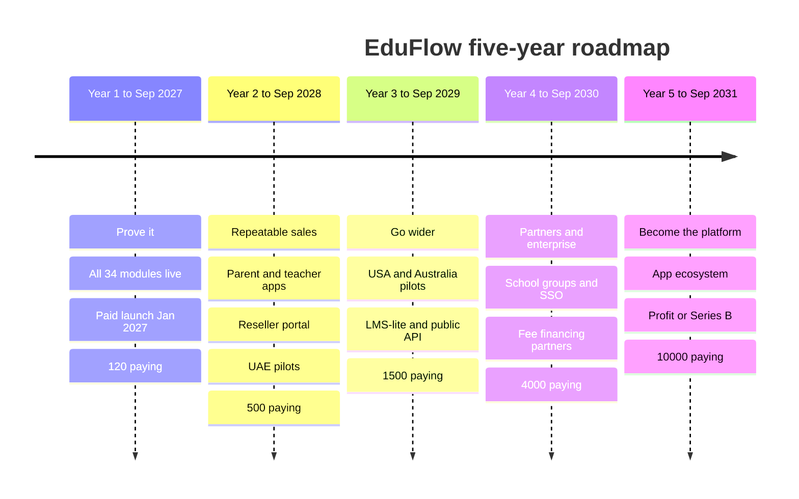
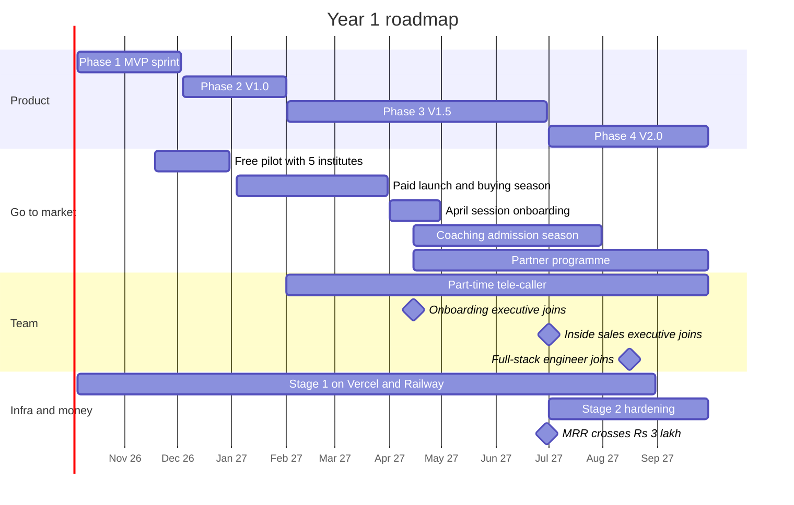

# Five-Year Roadmap

**In simple words:** This chapter is the year-by-year plan for EduFlow from October 2026 to September 2031. For each year it says what we build, how we sell, whom we hire, which servers we run on and what money we need. It also explains how we choose what to build, what we refuse to build, and when each big decision is taken. Every number is a target from the canon, not a forecast.

## How to read this roadmap

A roadmap is a plan that shows the order of the big steps over time. A milestone is one clear point on that road. We can always say "done" or "not done" about a milestone.

These terms are used in every section:

- **MRR** (monthly recurring revenue) is the subscription money that comes in every month. **ARR** (annual recurring revenue) is MRR × 12.
- **ARPA** (average revenue per account) is MRR ÷ paying organizations, per month.
- **GTM** (go-to-market) is how we find, win and keep customers.
- **Exit criteria** are the checks that must pass before we call a year finished and unlock the next year's spending.
- **Scaling stage** is one of the four technical stages in the Founder Blueprint: 100, 500, 1,000 and 10,000 customers.

The business year runs from October to September. Q1 is October to December. Q2 is January to March. Q3 is April to June. Q4 is July to September.

Not every year is equally firm. The table shows how much each part can change.

| Horizon | Firmness | What can change |
|---|---|---|
| Year 1 (Oct 2026 – Sep 2027) | Committed | Phase dates are fixed by the canon. Only small scope inside a phase can move, under the "one in, one out" rule. |
| Year 2 (Oct 2027 – Sep 2028) | Planned | The order and the quarter of an item can change at a quarterly review. |
| Year 3 to Year 5 | Direction | Every item is a bet. It starts only when its trigger is met. |

> **Rule:** If this chapter and the canon disagree, the canon wins. *Financial Plan and Projections* governs every money number. *Organization and Hiring Plan* governs headcount and salaries. *Go-To-Market Strategy* governs channels and cities. This chapter only puts them on one time line.

## Five years at a glance

| Year | Theme | Paying orgs | MRR | ARR run-rate | Team | Markets | Scaling stage |
|---|---|---|---|---|---|---|---|
| Year 1 (ends Sep 2027) | Prove it | 120 | ₹6 lakh | ₹72 lakh | 4 | India | Stage 1 (100) |
| Year 2 (ends Sep 2028) | Make sales repeatable | 500 | ₹30 lakh | ₹3.6 crore | 14 | India, UAE pilots | Stage 2 (500) |
| Year 3 (ends Sep 2029) | Go wider | 1,500 (100 international) | ₹1.1 crore | ₹13.5 crore | 40 | India, UAE, USA and Australia pilots | Stage 3 (1,000) |
| Year 4 (ends Sep 2030) | Scale through partners and enterprise | 4,000 (500 international) | ₹3.4 crore | ₹41 crore | 95 | Four countries | Stage 4 begins |
| Year 5 (ends Sep 2031) | Become the platform | 10,000 (1,500 international) | ₹9.5 crore | ₹114 crore | 220 | Four countries | Stage 4 (10,000) |

Formula: MRR = paying organizations × blended ARPA. For Year 4: 4,000 × ₹8,500 = ₹3.4 crore. ARR = ₹3.4 crore × 12 = ₹40.8 crore, shown as ₹41 crore.

**Figure: Five years of EduFlow on one line**



Each column is one business year. The first line under the year is the theme. The last line is the canon target for paying organizations.

The targets become real only when we see the pace they need. The table turns each year into net new customers per month.

| Year | Start | End | Net new in the year | Net new per month | Main growth engine |
|---|---|---|---|---|---|
| Year 1 | 0 | 120 | 120 | 13 (over 9 selling months) | Founder-led demos and free signups |
| Year 2 | 120 | 500 | 380 | 32 | Inside sales and the first partners |
| Year 3 | 500 | 1,500 | 1,000 | 83 | Sales team, partners, self-serve abroad |
| Year 4 | 1,500 | 4,000 | 2,500 | 208 | Partner network and enterprise team |
| Year 5 | 4,000 | 10,000 | 6,000 | 500 | Partners, self-serve and the app ecosystem |

Net new means new customers minus customers who cancel. Gross new customers must be higher. *Market Sizing: TAM, SAM and SOM* shows that Year 5 needs about 640 gross new customers a month.

> **Founder note:** The pace grows about 38 times in five years, from 13 a month to 500 a month. No founder can sell that. This is why the themes move from "founder sells" to "team sells" to "partners sell" to "the product and ecosystem sell".

## Roadmap principles

### How we decide what to build

Every idea goes through the same three questions. Each answer is a score from 1 to 5.

| Input | Score 1 | Score 3 | Score 5 |
|---|---|---|---|
| Customer pull (who asks for it) | One customer asked once | 10% of paying customers asked, or it lost us 3 deals | 30% or more asked, or it blocks renewals |
| Revenue impact (MRR gained or saved in 6 months) | Under 1% of current MRR | 3% to 5% of current MRR | Over 10% of current MRR |
| Effort (one developer working with Claude Code) | Up to 2 days | 2 to 3 weeks | More than one quarter |

Scores 2 and 4 sit between these points. Effort 2 is up to one week. Effort 4 is one to two months.

```text
Priority score = (Customer pull + Revenue impact) / Effort

Highest possible score = (5 + 5) / 1 = 10.0
Lowest possible score  = (1 + 1) / 5 =  0.4

Score above 2.0    -> plan it for the next quarter
Score 1.0 to 2.0   -> keep in the backlog with a written trigger
Score under 1.0    -> say no, and tell the customer why
```

> **Example:** It is March 2027 and five ideas wait in the backlog. Tally export: pull 4, revenue 3, effort 2, score 3.5. Hindi screens for parents: pull 4, revenue 3, effort 3, score 2.3. Online tests with a question bank: pull 4, revenue 4, effort 5, score 1.6. Biometric attendance: pull 3, revenue 2, effort 4, score 1.25. Live classes: pull 2, revenue 2, effort 5, score 0.8. So Tally export and Hindi go into the next quarter. Online tests and biometric wait for their triggers. Live classes get a polite no.

The score is a guide. These eight rules sit above it.

1. **Canon phases come first.** Until September 2027 the 34 modules are the roadmap. A new idea enters a phase only under the "one in, one out" rule from *Business Objectives, Scope and Stakeholders*.
2. **Customer pull beats founder ideas.** An idea needs 3 paying customers or 10% of the base behind it. The founder's own idea counts as one customer.
3. **Safety jumps the queue.** A data leak risk, a wrong receipt or a legal duty is fixed first. It is never scored.
4. **Small effort first.** Between two items with close scores, we ship the smaller one.
5. **Configuration, not forks.** A country, a language or a customer type is a setting. We never copy the codebase for one customer.
6. **Triggers, not dates, after Year 1.** Every item from Year 2 has a trigger. If the trigger is not met, the item waits and nobody feels guilty.
7. **Finish before starting.** At most two big items are in progress per product team.
8. **Every item has a number.** Before building, we write which metric should move and by how much. We check it 60 days after release.

Building time is split in fixed shares, so urgent work does not eat the future.

| Share of building time | Year 1 | Year 2 onward |
|---|---|---|
| Roadmap items (canon phases, then new products) | 70% | 60% |
| Customer requests and polish | 15% | 20% |
| Reliability, security and clean-up of old code | 15% | 20% |

### What we will deliberately not build

Saying no keeps the product simple and the team small. This list agrees with the out-of-scope list in *Business Objectives, Scope and Stakeholders*.

| We will not build | Why | What the customer does instead | Revisit |
|---|---|---|---|
| Live classes and video hosting | Costly to run; good free tools exist | Paste a Zoom, Google Meet or YouTube link | Never as our own product |
| A public marketplace that sells courses or tutors | Institutes would fear we take their students | Institutes run their own admissions | Not inside five years |
| Full accounting and tax filing | Accountants already trust Tally | Tally export from Year 2 | No |
| Statutory payroll returns (PF, ESI, TDS) | Needs constant legal updates | Payroll gives figures; the CA files | No |
| Our own hardware (biometric, RFID, GPS) | Hardware needs field staff | Partner devices through integrations | No |
| On-premise installation | Breaks the one-codebase model | Cloud only; regional hosting for Enterprise later | No |
| Custom code for one customer | Kills speed for everyone | Public API and marketplace from Year 3 | No |
| Lending our own money or holding parent money | Needs licences and carries credit risk | Licensed lenders and gateways do it | No |
| Tenders for US public districts, Australian Catholic systems, large UAE groups | Long cycles, heavy paperwork, strong incumbents | We do not bid | Review in Year 5 |
| A consumer app for students to find tutors | A different business with big ad spending | Not offered | No |
| AI proctoring through the camera | Privacy risk for children; weak demand | Offline tests; marks entered in Exams | Only if law and demand change |
| Ads to children or sale of data | Against the DPDP Act and our principles | Never offered | Never |

### Review cadence

Cadence means how often a review happens. A plan that is never reviewed becomes fiction.

| Review | When | Who | Input | Output |
|---|---|---|---|---|
| Weekly check | Monday, 30 minutes | Founder; later team leads | Last week's metrics, open bugs, demo notes | Top 3 tasks for the week |
| Monthly roadmap review | First Saturday, 2 hours | Founder plus product and sales leads | Feature requests with scores, lost-deal reasons, churn reasons | Re-ordered backlog; "Now, Next, Later" page updated |
| Quarterly plan | Last week of December, March, June and September | Whole leadership | Exit-criteria progress, cash, hiring triggers | Next quarter's milestones; items cut or moved |
| Yearly strategy | September, 2 days | Founder, leads, advisors | Year exit criteria, market changes, competitor moves | Next year's plan; this chapter updated |
| Customer advisory council | Twice a year, from Year 2 | 12 owners and principals | Roadmap draft | Ranked customer priorities |
| Board meeting | Quarterly, only after a funding round | Founder and investors | KPI pack from *KPI Framework and Dashboard* | Decisions on budget and senior hires |

Customers see a simple public page with three lists: Now, Next and Later. It shows no dates beyond the current quarter. Sales staff may promise only what is in "Now".

## Year 1: Prove it

Business Year 1 runs from October 2026 to September 2027. The theme is proof. Coaching owners must pay, stay and refer others. The full product of 34 modules must ship on the canon dates.

### Year 1 business goals

| Goal | Target by 30 Sep 2027 |
|---|---|
| Paying organizations | 120, all in India |
| Free (Starter) organizations | 300 |
| MRR and ARR run-rate | ₹6 lakh (120 × ₹5,000) and ₹72 lakh |
| Active students on the platform | 60,000 |
| Monthly logo churn (share of paying customers who cancel in a month) | Under 3% |
| Activation within 7 days, NPS | 60%, 50 or more |
| Cost to win a customer (CAC) | Under ₹12,000 |
| Markets | India only. International marketing spend is ₹0. |

### Year 1 product milestones

| Phase | Release | Date | Modules (codes) | What it unlocks |
|---|---|---|---|---|
| Phase 1 | MVP | 3 Dec 2026 (Day 60) | DASH, ORG, CAMP, ADM, STU, TCH, ATT, BAT, SUB, FEE, PAY, DSC, PP, NTF, WA, SET | Coaching institutes; Starter and Growth plans |
| Phase 2 | V1.0 | 1 Feb 2027 (Day 120) | STF, LEV, TT, HW, EXM, RPT, SCH, SP, EML, SMS, CRT, ANL | Schools, before the April 2027 session |
| Phase 3 | V1.5 | By 30 June 2027 | LIB, INV, TRN, HST, PRL | Pro plan; larger schools |
| Phase 4 | V2.0 | By 30 Sep 2027 | AI, plus international packs and white-label mobile apps | Enterprise plan, AI add-on, UAE entry in Year 2 |

Check: 16 + 12 + 5 + 1 = 34 modules. Phase 4 also carries the Enterprise items named in *Business Objectives, Scope and Stakeholders*: white-label branding, staff login with Google or Microsoft accounts, and API keys for Enterprise customers (assumption).

### Year 1 by quarter

| Quarter | Product | GTM | Customers and MRR | Team | Infrastructure |
|---|---|---|---|---|---|
| Q1 Oct–Dec 2026 | Phase 1 MVP; Phase 2 starts 4 Dec | Free pilot; lead list; demo videos | 0 paying; 5 pilots | Founder only | Stage 1: Vercel plus Railway, one API, one worker |
| Q2 Jan–Mar 2027 | V1.0 on 1 Feb; Phase 3 starts | Paid launch; Patna, Lucknow, then Delhi NCR | 30 paying; ₹1.2 lakh | Founder plus part-time tele-caller | Staging copy; first restore test |
| Q3 Apr–Jun 2027 | V1.5 by 30 June | April onboarding; partners start; Indore in May | 70 paying; ₹3.15 lakh | Onboarding executive joins | Load test at 3 times peak; Prisma upgrade |
| Q4 Jul–Sep 2027 | V2.0 by 30 Sep | Jaipur; referral push | 120 paying; ₹6 lakh | Inside sales executive and full-stack engineer join | Stage 2 work starts: second API replica, split queues |

The quarter-end customer and MRR numbers come from *Business Objectives, Scope and Stakeholders*. The city order comes from *Go-To-Market Strategy*.

### The first six months, month by month

| Month | Product | Go-to-market | Company and operations |
|---|---|---|---|
| Oct 2026 | Sprint Days 1–27: login, tenant isolation, ORG, CAMP, SET, STU, ADM, BAT, SUB, TCH | Confirm 5 pilot institutes; start the list of 700 leads | Register the Private Limited company; apply for Razorpay, Meta verification and DLT |
| Nov 2026 | Sprint Days 28–57: ATT, FEE, PAY, DSC, PP, NTF, WA, DASH, Excel import | Pilot starts 18 Nov (Day 45); founder onboards each pilot on site | Legal pages and parental consent text live before 18 Nov; daily backups on |
| Dec 2026 | MVP done 3 Dec; pilot fixes; Phase 2 starts 4 Dec; own subscription billing with GST invoices | Price page; demo video in Hindi and English; 20 demos booked for January | Help centre; support WhatsApp number; launch go or no-go on 19 Dec |
| Jan 2027 | Phase 2 build: EXM, RPT, TT and HW first | Paid launch; Patna and Lucknow open; pilots convert to paid | First GST invoices raised; weekly metrics check starts |
| Feb 2027 | V1.0 live on 1 Feb; Phase 3 starts 2 Feb with PRL and TRN | Peak demo month; part-time tele-caller starts | Monthly roadmap review starts; error and uptime alerts tuned |
| Mar 2027 | Phase 3 continues; onboarding fixes jump the queue | Delhi NCR opens; school deals close before 31 March | Shortlist the onboarding executive; quarter review on 27 March |

The order of modules inside the sprint is an assumption. The day-by-day plan in the Founder Blueprint governs.

| Month end | Paying orgs | Free orgs | MRR | Gate to pass |
|---|---|---|---|---|
| Oct 2026 | 0 | 0 | ₹0 | Tenant isolation tests pass; 5 pilots confirmed |
| Nov 2026 | 0 | 5 pilots | ₹0 | All 5 pilots mark attendance and issue a fee receipt |
| Dec 2026 | 0 | 5 pilots | ₹0 | Launch go or no-go passed on 19 Dec |
| Jan 2027 | 6 | 25 | ₹24,000 | First payment through our own billing; 3 testimonials |
| Feb 2027 | 16 | 50 | ₹64,000 | V1.0 live on 1 Feb; 40 demos held in the month |
| Mar 2027 | 30 | 80 | ₹1.2 lakh | Every school customer is live before 1 April |

Formula: MRR = paying organizations × ₹4,000, the early ARPA used in *Business Objectives, Scope and Stakeholders*. The January and March values come from *Go-To-Market Strategy*. February and the free counts are estimates. The month-by-month model in *Financial Plan and Projections* governs.

> **Warning:** A school that is not live by mid-April waits for the next session. If V1.0 slips past 1 February 2027, sell only to coaching institutes until report cards ship. Do not promise a school a date that the product cannot keep.

**Figure: Year 1 plan (October 2026 to September 2027)**



The chart shows that selling starts while Phase 2 is still being built. Hiring starts only after the buying season, when revenue can pay for it. Stage 2 server work starts before the 100th customer, not after.

### Year 1 GTM, team, infrastructure and funding milestones

| Area | Milestone | Expected date | Trigger |
|---|---|---|---|
| GTM | Pilot with 5 friendly institutes | 18 Nov 2026 | Day 45 of the sprint |
| GTM | Paid launch in Patna and Lucknow | January 2027 | Launch go or no-go passed |
| GTM | Delhi NCR, Indore, Jaipur open | March, May, July 2027 | City gate from *Go-To-Market Strategy*: 10 paying, 3 testimonials, 1 referral win |
| GTM | Partner programme starts | April 2027 | 30 to 50 direct customers won |
| Team | Onboarding and customer success executive (hire 1) | April 2027 | 30 paying, or founder spends 15 hours a week on onboarding |
| Team | Inside sales executive (hire 2) | July 2027 | MRR ₹3 lakh, and over 8 founder demos a week for 4 weeks |
| Team | Full-stack engineer (hire 3) | August 2027 | MRR ₹4.5 lakh, or bug work takes 40% of founder coding time for 4 weeks |
| Infrastructure | Stage 1 complete; Stage 2 begins | August 2027 | About 100 paying customers |
| Infrastructure | Restore test passed every quarter | From December 2026 | Fixed calendar |
| Funding | Bootstrap line reached | About June 2027 | MRR ₹3 lakh, as in the canon |
| Funding | No outside money in Year 1 | All year | Yearly prepaid plans bring cash early |

Team size at the end of Year 1 is 4: the founder and three hires. The part-time tele-caller is a contractor and is not counted.

### Year 1 exit criteria

| Criterion | Target on 30 Sep 2027 | If missed |
|---|---|---|
| Product | All four phases live | Phase 4 items finish first in Year 2; no new product starts before that |
| Paying organizations and MRR | 120 and ₹6 lakh | Apply the behind-plan rules at the end of this chapter |
| Logo churn | Under 3% a month, 3-month average | Stop adding sales people; fix onboarding first |
| Activation and NPS | 60% and 50 or more | Onboarding work gets the 20% polish budget |
| Cross-tenant data leaks | Zero | Feature work stops until the cause is fixed and tested |
| Selling without the founder | Inside sales executive closed 10 deals alone (assumption) | Delay the second sales hire by one quarter |
| Cash | 6 months of costs in the bank (assumption) | Freeze hiring until it is true |
| Team | 4 people | Hire only when the trigger is met, not to match the number |

## Year 2: Make sales repeatable

Business Year 2 runs from October 2027 to September 2028. The theme is repeatable sales. A small team must win customers when the founder is not in the demo. The product gets the phone apps that buyers keep asking for. The UAE opens as the first market abroad.

### Year 2 business goals

| Goal | Target by 30 Sep 2028 |
|---|---|
| Paying organizations | 500, so 380 net new, about 32 a month |
| Gross new customers needed | About 492 at 3% monthly churn, from *Customer Success, Onboarding and Support* |
| MRR and ARR run-rate | ₹30 lakh (500 × ₹6,000) and ₹3.6 crore |
| Markets | India in 17 cities; UAE pilots; at least 3 paying UAE organizations on AED prices (assumption for BO-12) |
| Monthly logo churn and 12-month NRR | Under 2.5% and 90%, from *KPI Framework and Dashboard* |
| Online fee share and parent adoption | 50% and 75% |
| Add-on attach (share of customers who buy an add-on) | AI Insights 30% of Growth and Pro; white-label app 5% |
| New customers won by partners | 25% (assumption) |

NRR (net revenue retention) is today's MRR from the customers of 12 months ago, divided by their MRR then. ARPA rises from ₹5,000 to ₹6,000 through more Pro customers, the AI Insights add-on and message credits. *Business Model* shows the split.

### Year 2 product milestones

| Item | Window | Trigger to start | Number that should move |
|---|---|---|---|
| Phase 4 carry-over, if any | October 2027 | Year 1 exit rule | All 34 modules live |
| EduFlow parent app and teacher app | Android by Dec 2027; iPhone by Feb 2028 | "Where is the app?" in lost-deal notes | Parent adoption 70% to 75% |
| Hindi for parents, then Marathi, Gujarati, Tamil, Telugu, Bengali | Hindi by Dec 2027; then one language every 6 weeks | Parent adoption under 70% in a city, or a regional city opens | Wins in second-wave cities |
| UAE pack hardening and Stripe in AED | Oct 2027 – Jan 2028 | Year 1 exit criteria passed | UAE pilot starts 1 Feb 2028 |
| Tally export | Jan – Mar 2028 | Asked by 25% of accountants | Fewer accountant objections in demos |
| Reseller portal | By 31 Mar 2028 | 10 active partners | Partners win 25% of new customers |
| Payments deepening | Apr – Jul 2028 | Online fee share under 50% | Online fee share 40% to 50% |
| Online tests and question bank | Jun – Sep 2028 | Asked by 30% of paying coaching customers | Coaching win rate; base for LMS-lite |
| Biometric and RFID through partner devices; own WhatsApp number per institute | Jul – Sep 2028 | Hardware partner in our cities; Meta Tech Provider approval | Upgrades to Pro |

The four big items need a clear edge, so they do not grow without limit.

| Item | What is inside | What stays out |
|---|---|---|
| Parent app and teacher app | One EduFlow app in both app stores: push alerts, fee payment, homework, offline attendance for teachers | The institute's own name and logo; that stays the white-label add-on |
| Languages | Parent Portal, app, notification templates and receipts | Staff screens, until demand is proven |
| Reseller portal | Lead registration, deal status, a demo organization, commission statement, training videos | Customer data and `SUPER_ADMIN` rights |
| Payments deepening | UPI AutoPay for instalments, WhatsApp payment links, automatic matching of settlements to receipts, refunds, campus settlement report | Any markup; payments stay pass-through in Year 2 |

A reseller portal is a small website where a partner registers a lead, follows the deal and sees his commission. UPI AutoPay is a standing instruction. The parent approves once, and each instalment is pulled on its due date.

> **Example:** Partners should win 25% of about 492 gross new customers. That is 123 deals. With 40 active partners, each partner closes about 3 deals in the year. An average first-year fee is ₹60,000 (estimate), so the 20% commission is ₹12,000 a deal. Total commission is 123 × ₹12,000 = ₹14.8 lakh, or about ₹1.2 lakh a month. The guard rail in *Business Model* is 8% of MRR, which is ₹2.4 lakh at ₹30 lakh MRR. The channel fits inside its limit.

### Year 2 GTM, team, infrastructure and funding milestones

| Area | Milestone | Expected date | Trigger |
|---|---|---|---|
| GTM | Seven satellite cities: Kanpur, Prayagraj, Varanasi, Bhopal, Kota, Sikar, Muzaffarpur | Oct 2027 – Mar 2028 | City gate passed in the parent city |
| GTM | Five large cities: Pune, Nagpur, Ahmedabad, Kolkata, Hyderabad | Apr – Sep 2028 | English-first inside sales ready; one reseller signed per city |
| GTM | 40 active partners with one owner in the team | By June 2028 | Partners bring 5 or more deals a month |
| GTM | UAE discovery visits and legal opinion | Nov 2027 – Jan 2028 | Year 1 exit criteria passed |
| GTM | UAE pilot with tuition centres and one CBSE school | 1 Feb – 31 May 2028 | UAE pack shipped; reseller or adviser signed |
| GTM | UAE go or no-go for the paid launch | August 2028 | 7 of 9 checks pass in *Market Research: USA, Australia and UAE* |
| Infrastructure | Stage 2 complete | By December 2027 | 150 paying, or p95 above 500 ms on a fee due date |
| Infrastructure | Move to AWS Mumbai | Decide March 2028; move Aug – Sep 2028 | 400 paying; earlier if a contract demands India hosting or the first Enterprise deal is signed |
| Infrastructure | First outside penetration test; ISO 27001 work starts | Apr – Sep 2028 | Set by *Compliance, Legal and Data Protection Requirements* |
| Funding | Seed decision: raise ₹3–5 crore or stay bootstrapped | December 2027 review | Three months of Year 2 data in hand |
| Funding | If yes, close the round | By June 2028 | Churn under 3% for 6 months; LTV:CAC above 4:1; deals close without the founder |

Stage 2 means two or more API replicas (copies of the server program that share the load), workers split by queue, connection pooling (many requests share a few database connections), a CDN (servers near the user that deliver files faster) and a staging copy equal to production. p95 is the response time that 95 of 100 requests beat. A penetration test is a paid, friendly attack by security experts. ISO 27001 is an international security certificate.

The AWS move is set for August and September on purpose. Schools are settled after April. Coaching admissions end in July. The January buying season is still four months away. The move also brings the database from Singapore to Mumbai, which Indian schools prefer.

| Function | End of Year 1 | End of Year 2 | Key hires and triggers |
|---|---|---|---|
| Founder | 1 | 1 | Moves from selling to product, hiring and the UAE |
| Engineering and design | 1 | 5 | Mobile engineer in October 2027; second full-stack engineer; QA at 250 paying; product designer |
| Sales and partners | 1 | 4 | Two more inside sales executives; a sales lead who also owns partners, when 3 sellers need coaching |
| Customer success and support | 1 | 3 | Second onboarding executive; support executive when tickets pass 400 a month |
| Finance and operations | 0 | 1 | Finance and operations executive at ₹15 lakh MRR |
| Total | 4 | 14 | Roles are an assumption; *Organization and Hiring Plan* governs |

> **Founder note:** The seed round is optional. Raise it only if money removes a real limit, such as hiring the mobile engineer and three sellers one quarter earlier. If the honest reason is "I want to feel safe", stay bootstrapped. Without a seed the plan still holds, but the five large cities shift by one quarter and the UAE runs through the reseller alone (assumption).

### Year 2 exit criteria

| Criterion | Target on 30 Sep 2028 | If missed |
|---|---|---|
| Paying organizations and MRR | 500 and ₹30 lakh | Apply the behind-plan rules |
| Repeatable sales | 70% of new deals closed with no founder in the demo (assumption) | Founder sells for one more quarter and rewrites the playbook |
| Logo churn and NRR | Under 2.5% and 90% | Next hire goes to customer success, not sales |
| Apps | Both stores live; rating 4.2 or more; parent adoption 75% | App work finishes before any Year 3 product starts |
| Partners | 25% of new customers; commissions under 8% of MRR | Review partner terms and training |
| UAE | Checklist scores 7 of 9 | Extend the pilot by one term; USA and Australia wait |
| Platform | On AWS Mumbai; restore test passed; high-risk penetration test findings closed; uptime 99.9% | Finish before January 2029; no regional cell before that |
| Cash | 6 months of costs in the bank, or seed closed | Freeze hiring |

## Year 3: Go wider

Business Year 3 runs from October 2028 to September 2029. EduFlow goes wider in three ways. It enters more countries through the USA and Australia pilots. It serves more customer types, as schools, colleges and training centres join coaching. It opens to other software through a public API and a marketplace.

### Year 3 business goals

| Goal | Target by 30 Sep 2029 |
|---|---|
| Paying organizations | 1,500, so 1,000 net new, about 83 a month |
| International | 100: UAE 70, USA 18, Australia 12 (assumption from *Market Research: USA, Australia and UAE*) |
| MRR and ARR run-rate | ₹1.1 crore (1,500 × ₹7,500 = ₹1.125 crore) and ₹13.5 crore |
| MRR by region, from *Business Model* | India 1,400 × ₹6,700 = ₹93.8 lakh; international 100 × ₹18,700 = ₹18.7 lakh, 17% of MRR |
| Logo churn and NRR | Under 2% and 95% |
| Schools | 40% or more of paying customers (assumption) |
| New customers won by partners | 30% (assumption) |
| Payments income | Gateway partner share starts; about 1% of MRR, ₹1.1 lakh a month |

### Year 3 product milestones

| Item | Window | Trigger to start | Number that should move |
|---|---|---|---|
| USA pack and Australia pack hardening | Oct – Dec 2028 | 750 paying in India; discovery calls done | Pilots start 15 Jan 2029 |
| Public API v1, webhooks and developer portal | By March 2029 | 20 Enterprise customers, or 10 integration requests | 50 organizations use the API every week |
| Gateway partner share (payments Option B) | By March 2029 | Partner talks closed in Year 2 | Payments reach 1% of MRR |
| LMS-lite | Jan – Jun 2029 | Online tests used by 30% of coaching customers | Coaching ARPA; NRR 95% |
| College and training-centre editions | Apr – Jun 2029 | 1,000 paying customers in the core segments | 50 paying in the new segments |
| Government formats: UDISE+ and APAAR ID | Apr – Jun 2029 | School share passes 50%, or 20 school deals lost for this reason | School win rate |
| Advanced AI | Apr – Sep 2029 | AI Insights attach above 25% | AI attach 30% to 40% (assumption) |
| Marketplace with the first 10 partner apps | Jul – Sep 2029 | 50 or more Enterprise customers | 10% of Pro and Enterprise customers install an app |
| Fee financing study | Jul – Sep 2029 | Online fee value passes ₹100 crore a year | Lender shortlist and legal opinion ready |

An API (application programming interface) is a safe door through which other software reads and writes EduFlow data. A webhook is a message EduFlow sends to another system when something happens, for example "fee paid". An LMS (learning management system) is software for study material, tests and assignments. The marketplace is a page inside EduFlow where a customer switches on apps made by partners.

| Item | What is inside | What stays out |
|---|---|---|
| LMS-lite | Study material by chapter (PDF, links, video links), lesson plans, online tests with auto marking, assignment upload | Live classes, video hosting, selling courses |
| Public API and marketplace | API keys per organization, scopes, canon rate limits, webhooks, sandbox. First apps: Tally, biometric devices, GPS bus tracking, Google Classroom | Custom code for one customer; any access across tenants |
| Advanced AI | Fee default risk, dropout risk, plain-language questions in English and Hindi, draft report card remarks that the teacher approves | Decisions about a child with no human; any profiling for ads |

> **Example:** Rajesh Sharma types a question into AI Insights: "Which students have fees due over Rs 5,000 and attendance under 75%?" EduFlow answers with 14 names from Sharma Classes only. One more tap sends each parent a WhatsApp reminder. The AI reads only his organization's data, and it sends nothing until he approves.

If the marketplace trigger is not met by June 2029, the API ships alone and the marketplace moves to Year 4.

### Year 3 GTM, team, infrastructure and funding milestones

| Area | Milestone | Expected date | Trigger |
|---|---|---|---|
| GTM | UAE paid launch for the April 2029 session | Oct 2028 – Mar 2029 | UAE checklist passed in August 2028 |
| GTM | UAE free-zone company | When triggered | 25 paying UAE customers |
| GTM | USA and Australia discovery calls | Oct – Dec 2028 | 750 paying in India |
| GTM | Pilots with 10 US centres and 8 Australian centres | From 15 Jan 2029 | Packs shipped; US and Sydney cells live |
| GTM | Go, extend or pause for each pilot country | June 2029 | Country checklist; pause 12 months after two failures |
| GTM | School sales pod; first school groups of 3 to 10 campuses | From Oct 2028 | 100 schools live; 3 group enquiries a month |
| GTM | Regional hubs: Chennai, Thrissur, Guwahati, partner-led | From Jan 2029 | Regional language live; partner signed |
| Infrastructure | Stage 3 on AWS: Multi-AZ database, read replica for reports, autoscaling, table partitioning, WAF | Oct 2028 – Mar 2029 | 500 paying |
| Infrastructure | USA cell (N. Virginia) and Australia cell (Sydney) | Before 15 Jan 2029 | First pilot customer |
| Infrastructure | UAE cell | When triggered | UAE MRR crosses AED 15,000, or a school contract asks |
| Infrastructure | ISO 27001 certificate; SOC 2 Type II report | By September 2029 | Enterprise and US buyers ask for them |
| Funding | Optional Series A of ₹25–40 crore (estimate) | Decide at the June 2029 review | ARR above ₹10 crore; NRR 95%; one pilot country passed |

The 1,000th customer should arrive about March 2029, because 500 + (6 × 83) = 998. Stage 3 work must be finished by then. A cell is a full copy of the EduFlow stack in one AWS region, and each organization lives in exactly one cell. Multi-AZ means the database keeps a live standby in a second data centre. A read replica is a read-only copy of the database for heavy reports. A WAF (web application firewall) blocks attack traffic. Stage 4 design starts in the last quarter, with the tenant directory first.

Two funding paths stay open. On the self-funded path, revenue pays for growth, and *Business Model* expects an operating surplus of about 12% at the end of Year 3. On the funded path, a Series A (the first large venture round) buys faster hiring abroad. The founder takes it only if the three tests in the table pass.

| Function | End of Year 2 | End of Year 3 | Key hires and triggers |
|---|---|---|---|
| Founder | 1 | 1 | Hands daily sales and support to the new heads |
| Engineering, product, design and data | 5 | 15 | Engineering manager when engineers pass 6; product manager; DevOps engineer at the AWS move |
| Sales and partners | 4 | 11 | Head of sales; school sales pod; UAE account manager |
| Customer success and support | 3 | 9 | Head of customer success; one onboarding person per 40 new customers a month (assumption) |
| Marketing | 0 | 2 | Content and SEO lead for the self-serve countries |
| Finance, HR and operations | 1 | 2 | Finance manager |
| Total | 14 | 40 | A part-time person in Sydney and a privacy adviser are contractors, not counted |

### Year 3 exit criteria

| Criterion | Target on 30 Sep 2029 | If missed |
|---|---|---|
| Paying organizations and MRR | 1,500 (100 international) and ₹1.1 crore | Apply the behind-plan rules |
| Logo churn and NRR | Under 2% and 95% | Freeze sales hiring; fix onboarding and upgrades |
| USA and Australia | Each pilot passes its checklist | Extend once; after a second failure pause that country for 12 months |
| Platform | Stage 3 complete; uptime 99.9%; p95 under 400 ms | No new cell and no Enterprise database before it is done |
| Trust | ISO 27001 in hand; SOC 2 Type II report issued or in audit | No US school deals; tutoring centres only |
| API | 50 organizations use it weekly (assumption) | Marketplace waits; improve documents and the sandbox |
| Leadership | Heads of engineering, sales and customer success in place | Founder stops new projects until they are hired |

## Year 4: Scale through partners and enterprise

Business Year 4 runs from October 2029 to September 2030. The plan needs 208 net new customers a month. Our own sellers cannot do that alone. Partners must bring the many small customers. An enterprise team must win school groups and coaching chains with 10 to 100 campuses.

### Year 4 business goals

| Goal | Target by 30 Sep 2030 |
|---|---|
| Paying organizations | 4,000, so 2,500 net new, about 208 a month |
| International | 500: USA 250, UAE 130, Australia 120 (assumption; revised after the pilots) |
| MRR and ARR run-rate | ₹3.4 crore (4,000 × ₹8,500) and ₹41 crore |
| MRR by region, from *Business Model* | India 3,500 × ₹7,000 = ₹245 lakh; international 500 × ₹19,000 = ₹95 lakh, 28% of MRR |
| Enterprise contracts | 60 school groups and coaching chains (assumption) |
| New customers won by partners | 40% (assumption) |
| Logo churn and NRR | Under 2% and 100% |
| Payments income | 2% of MRR, ₹6.8 lakh a month |

### Year 4 product milestones

| Item | Window | Trigger to start | Number that should move |
|---|---|---|---|
| Group console for school groups | Oct 2029 – Mar 2030 | 10 groups with 5 or more campuses in the pipeline | 60 Enterprise contracts |
| Full SSO and automatic user set-up | Oct – Dec 2029 | Asked in 3 Enterprise security forms | Enterprise win rate |
| Arabic right-to-left Parent Portal | Jan – Mar 2030 | 100 UAE customers, or 5 UAE deals lost for Arabic | UAE reaches 130 |
| Fee financing pilot with one licensed lender | Jan – Jun 2030; wider from July | Online fee value above ₹100 crore a year; legal opinion in hand | 1,500 loans with complaints under 1% |
| Data warehouse | Apr – Sep 2030 | Report p95 above 5 seconds, or 20 Enterprise customers ask for BI export | Report speed; AI quality |
| Dedicated database for one Enterprise tenant | Jul – Sep 2030 | A signed contract asks for it | Large deals closed |
| Marketplace grows to 40 apps | All year | Marketplace live | 15% of customers use an app |

SSO (single sign-on) lets staff log in with the group's own identity system. Phase 4 already gave Google and Microsoft login. Year 4 adds SAML and OIDC, the two standard SSO methods, and creates or removes users automatically when the group's HR system changes. A data warehouse is a separate database built for analysis. It is filled from the live database every hour, so heavy reports and BI tools (business intelligence tools such as Power BI) never slow the daily work. In fee financing, a licensed lender pays the institute the full fee at once. The parent repays the lender in EMIs (equal monthly instalments).

| Item | What is inside | What stays out |
|---|---|---|
| Group console | One dashboard across all campuses, central fee structures with campus overrides, group roles, approval chains, student transfer between campuses | A separate codebase or a private server |
| Fee financing | Parent picks EMI at checkout; lender pays the institute in 2 days; EduFlow shows loan status and earns a 1% to 2% referral fee | EduFlow lending, holding money, or sharing data without the parent's consent |

> **Example:** The JEE course at Sharma Classes costs ₹1,20,000. Sunita Devi picks 12 instalments of ₹10,000 through the lender. Sharma Classes pays the lender a 4% fee of ₹4,800 (estimate) and receives ₹1,15,200 within two days. EduFlow earns 1.5% of the loan, which is ₹1,800. A pilot of 1,500 loans brings 1,500 × ₹1,800 = ₹27 lakh a year, about ₹2.25 lakh a month. That is small next to ₹3.4 crore of MRR. The pilot is for learning, not for income.

> **Rule:** Only lenders regulated by the RBI may join. The parent sees the full cost before accepting. EduFlow never pushes a loan through reminders. If parent complaints pass 1% of loans, the pilot stops.

### Year 4 GTM, team, infrastructure and funding milestones

| Area | Milestone | Expected date | Trigger |
|---|---|---|---|
| GTM | Enterprise team: field sellers, a solution consultant and implementation managers; sales cycles of 6 to 9 months | From Oct 2029 | 10 qualified groups in the pipeline |
| GTM | First yearly customer event, in Lucknow or Delhi (assumption) | November 2029 | 1,500 paying |
| GTM | 300 active partners in two levels, certified to onboard customers | By Sep 2030 | Partner share reached 30% in Year 3 |
| GTM | USA and Australia move from pilot to full launch; local company after 25 paying customers | From Oct 2029 | Checklist passed in June 2029 |
| GTM | UAE reseller also serves Gulf neighbours with the same pack | From Jan 2030 | Decision of September 2029 |
| Infrastructure | Stage 4 begins: tenant directory, four regional cells, second India copy in AWS Hyderabad | Oct 2029 – Jun 2030 | 1,500 paying |
| Infrastructure | On-call rota, error budgets, uptime 99.95% | From Jan 2030 | Enterprise SLAs signed |
| Infrastructure | Data warehouse and event streaming | Apr – Sep 2030 | Same trigger as the product item |
| Funding | Self-funded with a surplus, or Series A money in use | All year | Path chosen in June 2029 |
| Funding | Prepare the Year 5 choice: profit or Series B | September 2030 | Two years of audited accounts ready |

The tenant directory is a small central service that knows which cell holds each organization. An error budget is the amount of downtime a month that we accept, for example 22 minutes at 99.95%. When it is used up, releases stop and the team works only on reliability.

| Function | End of Year 3 | End of Year 4 | End of Year 5 | Key additions |
|---|---|---|---|---|
| Founder | 1 | 1 | 1 | Chief executive; owns product vision and culture |
| Engineering, product, design, data and security | 15 | 32 | 70 | Year 4: VP Engineering, security lead, data engineers. Year 5: platform and developer relations team |
| Sales, partners and enterprise | 11 | 28 | 62 | Year 4: VP Sales, enterprise sellers, partner managers. Year 5: country leads for the USA and the UAE |
| Customer success, support and implementation | 9 | 24 | 60 | Year 4: implementation managers for groups. Year 5: support in shifts across time zones |
| Marketing | 2 | 5 | 12 | Year 4: brand and events. Year 5: partner and developer marketing |
| Finance, HR, legal and admin | 2 | 5 | 15 | Year 4: HR manager and legal counsel. Year 5: CFO |
| Total | 40 | 95 | 220 | Assumption; *Organization and Hiring Plan* governs |

### Year 4 exit criteria

| Criterion | Target on 30 Sep 2030 | If missed |
|---|---|---|
| Paying organizations and MRR | 4,000 (500 international) and ₹3.4 crore | Apply the behind-plan rules |
| Channel | Partners win 40% of new customers; commissions under 8% of MRR | Add partner managers before adding sellers |
| Enterprise | 60 contracts; no customer above 3% of MRR (assumption) | Keep the team small; sell Pro to single schools |
| Logo churn and NRR | Under 2% and 100% | Customer success gets the next 5 hires |
| Platform | Four cells live; uptime 99.95%; SOC 2 renewed | No dedicated databases until it is done |
| Fee financing | 1,500 loans; complaints under 1%; no regulator notice | Stop the pilot; keep Option B only |

## Year 5: Become the platform

Business Year 5 runs from October 2030 to September 2031. A platform is a product that other companies build on and sell through. By now 500 net new customers must arrive every month. Most of them must come without an EduFlow seller in the room.

### Year 5 business goals

| Goal | Target by 30 Sep 2031 |
|---|---|
| Paying organizations | 10,000, so 6,000 net new, about 500 a month; about 640 gross a month |
| International | 1,500: USA 1,100, Australia with New Zealand 220, UAE with Gulf neighbours 180 (assumption) |
| MRR and ARR run-rate | ₹9.5 crore (10,000 × ₹9,500) and ₹114 crore |
| MRR by region, from *Business Model* | India 8,500 × ₹7,650 = ₹650 lakh; international 1,500 × ₹20,000 = ₹300 lakh, 32% of MRR |
| Revenue mix, from *Business Model* | Subscription 72%, add-ons 14%, messages 10%, payments 4% (₹38 lakh) |
| Logo churn and NRR | Under 2%, aim 1.5%; 105% |
| Operating result | About 22% of revenue on the profit path, or a Series B closed |

### Year 5 product milestones

| Item | Window | Trigger to start | Number that should move |
|---|---|---|---|
| Marketplace with 100 or more apps, app review and revenue share | All year | 40 apps and 15% usage reached in Year 4 | 20% of customers use at least one app |
| Developer programme: sandbox, certification, partner-built editions such as music schools and skill centres | Oct 2030 – Mar 2031 | 25 active developer partners | 5 partner-built editions |
| AI assistant that carries out tasks across modules after a human approves | Jan – Jun 2031 | AI Insights attach above 35% | Tickets per account fall to 2.0 |
| Full self-serve in all four countries: signup to live in one day with no human help | All year | Activation under 75% | Self-serve wins 25% of new customers |
| Financial services at scale: EMI, auto-debit, instant settlement | All year | Year 4 pilot passed its rules | Payments reach 4% of MRR |
| Benchmark reports from pooled, anonymous data | Apr – Sep 2031 | 5,000 paying; consent terms in place | NRR 105% |

> **Example:** Dr. Anita Verma opens the benchmark page. It says: "Your fee collection by the 10th of the month is 71%. Schools of your size in Uttar Pradesh reach 82%." No other school is named. The numbers come only from organizations that agreed to pooled statistics.

### How the 1,500 international customers are reached

*Market Sizing: TAM, SAM and SOM* left one choice to this chapter. Either the USA carries about three-quarters of the international target, or EduFlow adds nearby markets. The decision is: the USA carries it, and nearby markets are served only when they need no new country pack.

| Country | SAM (organizations) | Year 3 | Year 4 | Year 5 | Year 5 share of SAM |
|---|---|---|---|---|---|
| USA | 12,740 | 18 | 250 | 1,100 | 8.6% |
| UAE, with Gulf neighbours from Year 4 | 420 (UAE only) | 70 | 130 | 180 | 43% of UAE SAM alone |
| Australia, with New Zealand from Year 5 | 1,016 | 12 | 120 | 220 | 22% of Australia SAM alone |
| Total | 14,176 | 100 | 500 | 1,500 | 10.6% |

The UAE and Australia shares are too high for one country. This is why the same packs also serve neighbours. CBSE schools in Oman, Qatar, Bahrain, Kuwait and Saudi Arabia use the UAE pack. New Zealand uses the Australia pack. Canada can use the USA pack if demand appears. These are served, not launched: no local company, no marketing budget, card payment by Stripe only. The USA line is the most stretched number in this roadmap. It needs about 19 net new US customers a month in Year 4 and 71 a month in Year 5, nearly all through the self-serve trial.

### Year 5 GTM, team, infrastructure and funding milestones

| Area | Milestone | Expected date | Trigger |
|---|---|---|---|
| GTM | Channel mix for 640 gross new a month (assumption): partners 288, self-serve 160, inside sales 128, enterprise 64 | By Mar 2031 | No channel above 50% |
| GTM | Yearly "State of Institute Operations" report from pooled data | January 2031 | 5,000 paying |
| GTM | Review of the "no tenders" rule for large districts and groups | September 2031 | SOC 2, references and an enterprise team exist |
| Team | Grow from 95 to 220 | All year | See the team table in Year 4 |
| Infrastructure | Stage 4 complete; hosting about ₹12 lakh a month, 1.3% of MRR (estimate from *Business Model*) | By Sep 2031 | 10,000 paying |
| Infrastructure | p95 under 300 ms; uptime 99.95%; recovery drill twice a year | All year | Set by *KPI Framework and Dashboard* |
| Funding | Choose profit or Series B | March 2031 review | See the table below |

| Path | What it means | Choose it when |
|---|---|---|
| Profit | Operating surplus of about 22% of revenue. At ₹9.5 crore MRR that is about ₹2.1 crore a month. | Growth of 2.5 times a year can be paid from revenue and yearly prepayments |
| Series B | A second large venture round of ₹120–200 crore (estimate) | The money has a clear use with payback under 24 months, such as new countries or buying a smaller product |

### Year 5 exit criteria

| Criterion | Target on 30 Sep 2031 | If missed |
|---|---|---|
| Paying organizations and ARR | 10,000 (1,500 international) and ₹114 crore | Apply the behind-plan rules; restate the targets openly |
| Logo churn and NRR | Under 2% and 105% | Growth spending is capped until churn falls |
| Ecosystem | 100 apps; 20% of customers use one; partners and self-serve win 70% of new customers | Marketplace terms and developer documents are reworked |
| Money | Operating surplus of 20% or more, or Series B closed | Hiring freeze until one of the two is true |
| Platform | Stage 4 complete; four regions; zero cross-tenant leaks in five years | Reliability work jumps the queue |
| Next plan | Roadmap for Year 6 to Year 10 written in September 2031 | The yearly strategy meeting does not close without it |

## Key decisions and decision dates

Each big decision has a date, the data it needs and a default. The default applies when the data gives no clear answer. The founder owns every decision in this table, with the advice shown in the responsibility chart in *Business Objectives, Scope and Stakeholders*.

| Decision | Decide by | Data needed | Default |
|---|---|---|---|
| Paid launch: go or no-go | 19 Dec 2026 | All 5 pilots mark attendance and issue receipts; zero isolation bugs | Launch to coaching only; schools wait for V1.0 |
| First hire: onboarding executive | March 2027 review | 30 paying, or 15 founder hours a week on onboarding | Founder keeps onboarding |
| First salesperson: inside sales executive | June 2027 review | MRR ₹3 lakh; over 8 founder demos a week for 4 weeks | Founder keeps selling; more tele-caller hours |
| First engineer | July 2027 | MRR ₹4.5 lakh, or bugs take 40% of coding time for 4 weeks | Wait one quarter |
| Start Stage 2 work | June 2027 review | 70 paying; load test at 3 times peak passed | Start by August 2027 in any case |
| Seed round: raise or stay bootstrapped | December 2027 review | Three months of Year 2 data; churn; LTV:CAC; deals closed without the founder | Stay bootstrapped |
| Move from Railway to AWS | Decide March 2028; move Aug – Sep 2028 | 400 paying; p95 on fee days; hosting cost; requests for India hosting | Move in Aug – Sep 2028 in any case |
| UAE paid launch | August 2028 | 7 of 9 checklist passes | Extend the pilot by one term |
| Payments Option B | September 2028 | Written offer from Razorpay or Stripe | Stay pass-through |
| USA and Australia pilots start | December 2028 | 750 paying in India; packs and cells live | Shift to the next term |
| Marketplace, or API only | June 2029 | 50 Enterprise customers | API only; marketplace in Year 4 |
| USA and Australia: go, extend or pause | June 2029 | Country checklists | Extend once; then pause for 12 months |
| Series A | June 2029 | ARR above ₹10 crore; NRR 95%; one pilot country passed | No raise |
| Nearby same-pack markets | September 2029 | USA pilot result; inbound demand | No new countries |
| Fee financing partner | December 2029 | Online fee value above ₹100 crore a year; legal opinion; lender checks | Keep studying; no pilot |
| Profit or Series B | March 2031 | Surplus; NRR; a clear use of funds | Stay profitable |

> **Best practice:** Write a one-page note for each decision: date, options, data, choice and a review date. Keep the notes in one folder. After a year, read them again. This is how a founder learns which of his own guesses to trust.

## If we fall behind plan

At every quarterly review, divide the real MRR by the planned MRR for that quarter end. The result sets the status.

| Status | Test | What we do |
|---|---|---|
| Green | 90% or more | Follow the plan. Hire on triggers. |
| Amber | 70% to 89% | No new hires next quarter, except customer success. Cut the lowest-scoring roadmap item. Founder reads 20 lost-deal notes and 10 churn notes. |
| Red | Under 70% for two quarters in a row | Stop international spending. Shift all later dates by two quarters. Propose new targets; the canon changes first, then this chapter. |
| Ahead | 120% or more for two quarters in a row | Pull hiring forward by one quarter. Never open a country before its gate. |

> **Example:** On 30 June 2027 the plan says ₹3.15 lakh MRR. The real number is ₹2.4 lakh, which is 76%, so the status is Amber. The inside sales hire waits, because its own trigger of ₹3 lakh is also not met. The founder spends July on lost deals and onboarding, not on Phase 4 extras.

Three things are never cut, even in Red: backups and security work, tenant isolation tests, and the support response times promised to customers.

## Key takeaways

- The five themes are: prove it, make sales repeatable, go wider, scale through partners and enterprise, become the platform. Each theme changes who does the selling.
- Year 1 is committed and dated: MVP on 3 Dec 2026, V1.0 on 1 Feb 2027, V1.5 by June 2027, V2.0 by September 2027, and 120 paying organizations.
- From Year 2 every item starts on a trigger, not on a date. If the trigger is not met, the item waits.
- The build order follows one formula: (customer pull + revenue impact) ÷ effort. Safety work and the canon phases always come first.
- Infrastructure follows the four scaling stages. The move from Railway to AWS Mumbai is set for August and September 2028, the quiet season.
- Funding is a choice, not a need: a seed decision in December 2027, an optional Series A in June 2029, and profit or Series B in March 2031.
- The USA must carry about 73% of the 1,500 international customers in Year 5. It is the most stretched number, so it is reviewed every quarter.

